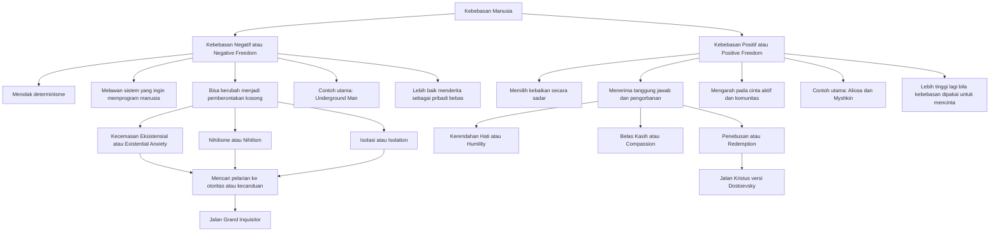
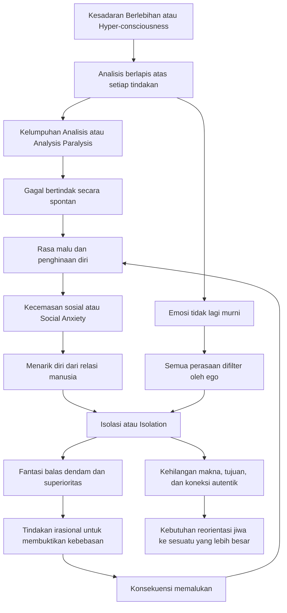
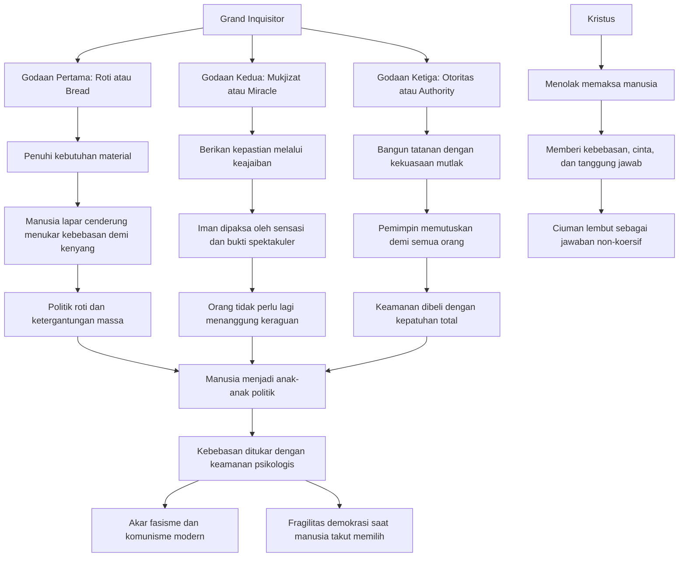
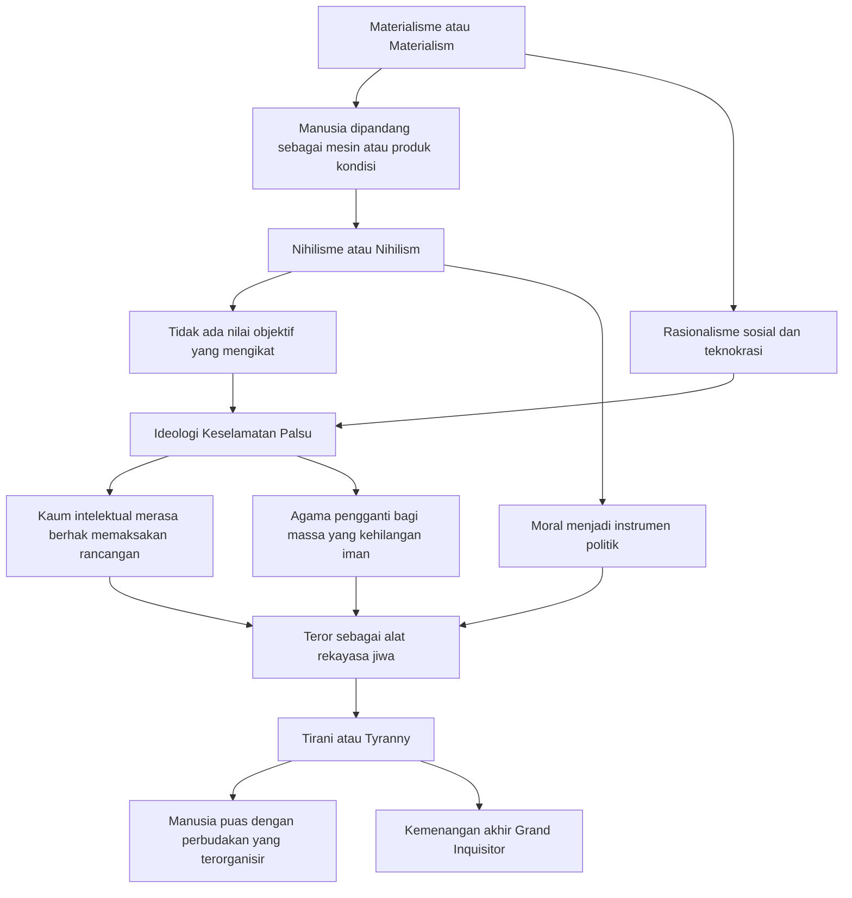
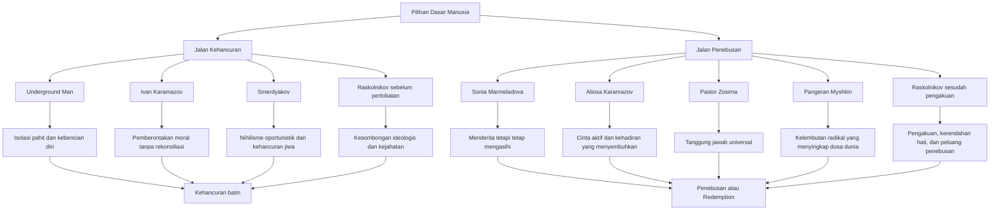

## Pendahuluan — Mengapa Dostoevsky Terasa Lebih Dekat ke Abad ke-21 daripada ke Zamannya 🕯️

Fyodor Mikhailovich Dostoevsky adalah salah satu sedikit penulis yang terasa terlalu besar bila dipanggil hanya sebagai novelis. Ia memang menulis novel, tetapi novel-novelnya bekerja seperti laboratorium jiwa, ruang sidang moral, biara, penjara, dan medan perang batin sekaligus 😊. Pada dirinya, sastra tidak berhenti sebagai cerita; sastra menjadi filsafat yang berdarah, psikologi yang bernapas, dan teologi yang bergulat dengan lumpur kenyataan.

Ia lahir pada abad ke-19 di St. Petersburg, tetapi banyak gagasannya terasa seolah ditulis untuk manusia modern yang hidup di tengah algoritma, ideologi, kecanduan, krisis identitas, dan rasa hampa. Ia mendahului Sigmund Freud dalam melihat kedalaman bawah sadar manusia, mendahului eksistensialisme (*existentialism* = filsafat yang menekankan kebebasan, pilihan, dan tanggung jawab individu), dan bahkan mendahului analisis politik modern tentang totalitarianisme (*totalitarianism* = sistem kekuasaan yang berusaha mengontrol seluruh aspek hidup manusia) 😮.

Yang membuatnya begitu kuat bukan hanya kecerdasannya, tetapi fakta bahwa pemikirannya ditempa oleh pengalaman ekstrem. Ia pernah dijatuhi hukuman mati, berdiri menunggu eksekusi, lalu diampuni pada detik-detik terakhir. Ia menjalani empat tahun kerja paksa di Siberia, hidup bersama para kriminal, bergulat dengan epilepsi, kecanduan judi, kemiskinan, utang, dan rasa malu. Ia membaca rakus — filsafat, teologi, psikologi, teori politik, sastra, sejarah — lalu mengolah semua itu bukan menjadi sistem akademik yang rapi, melainkan menjadi visi besar tentang manusia yang retak namun agung 🌌.

Bila diringkas dalam satu kalimat, inti filsafat Dostoevsky adalah ini: **manusia adalah makhluk bebas yang mengerikan sekaligus mulia, dan nasibnya ditentukan oleh bagaimana ia menanggung beban kebebasan, penderitaan, dan cinta**.

<Callout type="important" title="Tesis Utama Artikel Ini">
Dostoevsky tidak percaya bahwa manusia bisa dipahami hanya melalui logika, ekonomi, atau biologi. Ia memandang manusia sebagai makhluk yang selalu berdiri di antara dua jurang: **kebebasan dan perbudakan, iman dan keraguan, cinta dan kehancuran, penebusan dan nihilisme**. Karena itu, membaca Dostoevsky berarti membaca peta terdalam konflik manusia modern 🔥.
</Callout>

## Biografi Intelektual — Dari Regu Tembak ke Penglihatan Rohani ❄️

Dostoevsky lahir pada 1821, tumbuh dalam atmosfer Rusia yang sedang berubah cepat: modernisasi, debat ideologi, radikalisme intelektual, ketimpangan sosial, dan pertarungan antara tradisi religius dengan rasionalisme Eropa. Sejak muda ia telah terpapar dunia sastra dan pemikiran. Namun hidupnya tidak bergerak mulus seperti seorang intelektual salon. Hidupnya justru pecah berkali-kali, dan setiap pecahan itu membentuk ketajaman pandangannya.

Momen paling menentukan tentu pengalaman hampir dieksekusi pada 1849 setelah terlibat dalam lingkaran Petrashevsky yang dianggap subversif oleh rezim Tsar. Bayangkan dampak eksistensial dari pengalaman itu 😶. Seseorang yang beberapa menit lagi akan mati, lalu tiba-tiba dikembalikan ke dunia, tidak akan melihat hidup dengan cara yang sama lagi. Sejak saat itu, waktu, makna, penderitaan, dan dosa bukan lagi abstraksi baginya.

Empat tahun di kamp kerja paksa Siberia memberi pelajaran lain yang bahkan lebih penting: bahwa kriminal bukan monster asing dari dunia lain. Mereka manusia biasa. Mereka bisa brutal, licik, lembut, religius, penuh kebencian, penuh penyesalan — semuanya sekaligus. Dari pengalaman inilah lahir keyakinan Dostoevsky bahwa akar kejahatan tidak cukup dijelaskan oleh sistem sosial semata. Ada sesuatu yang lebih gelap dan lebih dekat: **hati manusia sendiri**.

Penderitaan pribadinya juga menambah dimensi lain. Epilepsi membuatnya akrab dengan batas rapuh kesadaran. Kecanduan judi mempertemukannya dengan irasionalitas hasrat. Kemiskinan membuatnya mengerti penghinaan sosial. Semua ini membuat psikologinya tidak lahir dari observasi dingin, tetapi dari pengalaman langsung akan kelemahan manusia 😔.

<Callout type="quote" title="Dostoevsky sebagai Filsuf yang Menulis Novel">
Banyak filsuf menulis sistem. Dostoevsky menulis konflik. Banyak pemikir menjelaskan manusia dari luar. Dostoevsky memperlihatkan manusia dari dalam. Karena itu, ia sering terasa lebih jujur daripada teori-teori yang terlalu rapi.
</Callout>

## Peta Besar Filsafat Dostoevsky 🗺️

Sebelum masuk ke setiap tema, kita perlu melihat keseluruhan lanskapnya. Filsafat Dostoevsky bukan kumpulan ide yang berdiri sendiri. Ia adalah jaringan yang saling terkait: kebebasan memunculkan kemungkinan kejahatan; kejahatan menuntun pada penderitaan; penderitaan bisa menghancurkan atau menebus; rasionalisme yang kering merusak jiwa; iman tidak menghapus keraguan; cinta menjadi satu-satunya jalan keluar yang tidak merendahkan martabat manusia.

```mermaid
graph TD
    A["Filsafat Dostoevsky"] --> B["Kebebasan Metafisik atau Metaphysical Freedom"]
    A --> C["Pikiran Bawah Tanah atau Underground Mind"]
    A --> D["Kritik terhadap Rasionalisme atau Critique of Rationalism"]
    A --> E["Psikologi Kejahatan atau Psychology of Evil"]
    A --> F["Penderitaan Orang Tak Bersalah atau Innocent Suffering"]
    A --> G["Grand Inquisitor atau Inkuisitor Agung"]
    A --> H["Iman Ortodoks dan Sobornost"]
    A --> I["Cinta Aktif atau Active Love"]
    A --> J["Nubuat Totalitarianisme atau Prophecy of Totalitarianism"]
    A --> K["Eksistensialisme dan Diri yang Terpecah"]

    B --> B1["Kebebasan adalah fondasi martabat manusia"]
    B --> B2["Kebebasan memungkinkan kebaikan dan kejahatan"]
    B --> B3["Banyak manusia takut pada kebebasan"]

    C --> C1["Kesadaran berlebihan atau Hyper-consciousness"]
    C --> C2["Kelumpuhan analisis atau Analysis Paralysis"]
    C --> C3["Isolasi dan penghinaan diri"]

    D --> D1["Manusia tidak sepenuhnya logis"]
    D --> D2["Materialisme dapat melahirkan nihilisme"]
    D --> D3["Rasio tanpa jiwa menjadi dingin"]

    E --> E1["Kejahatan lahir dari hati manusia"]
    E --> E2["Kompromi kecil mengikis nurani"]
    E --> E3["Tidak ada manusia yang steril dari potensi gelap"]

    F --> F1["Ivan memberontak terhadap alam semesta"]
    F --> F2["Masalah utama bukan logika Tuhan tetapi keadilan moral"]
    F --> F3["Aliosa menjawab dengan cinta praktis"]

    G --> G1["Roti atau Bread"]
    G --> G2["Mukjizat atau Miracle"]
    G --> G3["Otoritas atau Authority"]
    G --> G4["Manusia menukar kebebasan dengan keamanan"]

    H --> H1["Kenosis atau Pengosongan Diri"]
    H --> H2["Sobornost atau Persatuan Spiritual"]
    H --> H3["Penderitaan sebagai pemurnian"]

    I --> I1["Cinta lebih tinggi daripada argumen"]
    I --> I2["Pengampunan sebagai ujian tertinggi"]
    I --> I3["Setiap orang bertanggung jawab atas semua orang"]

    J --> J1["Materialisme menuju nihilisme"]
    J --> J2["Nihilisme menuju ideologi keselamatan palsu"]
    J --> J3["Ideologi menuju teror dan tirani"]

    K --> K1["Existence precedes essence atau Eksistensi mendahului esensi"]
    K --> K2["Bad faith atau Itikad buruk"]
    K --> K3["Diri manusia terpecah antara santo dan kriminal"]

    B3 --> G4
    C3 --> E1
    D2 --> J1
    F1 --> G
    H --> I
    I --> B1
    K --> B
```

Diagram ini memperlihatkan satu hal penting: pada Dostoevsky, **filsafat, psikologi, agama, dan politik tidak pernah benar-benar terpisah**. Cara manusia memahami dirinya akan menentukan bagaimana ia membangun negara, bagaimana ia memandang dosa, dan bagaimana ia memperlakukan orang lain.

## Kebebasan Metafisik — Fondasi Suci dari Keberadaan Manusia 🔓

Salah satu intuisi terdalam Dostoevsky adalah bahwa kebebasan bukan pertama-tama konsep politik. Ia bukan semata hak pilih, kebebasan berbicara, atau kebebasan sipil — meskipun itu penting. Yang lebih dasar adalah **kebebasan metafisik** (*metaphysical freedom* = kebebasan pada tingkat hakikat keberadaan manusia untuk memilih, menolak, mencintai, memberontak, dan bertanggung jawab). Ini adalah fondasi ontologis (*ontological* = berkaitan dengan hakikat keberadaan) dari martabat manusia.

Bagi Dostoevsky, manusia harus bebas bahkan untuk memilih yang salah. Mengapa? Karena tanpa kemungkinan salah, pilihan baik kehilangan makna moralnya 😌. Kebaikan yang diprogram bukan kebaikan; itu hanya kepatuhan mekanis. Jika manusia tidak bisa memilih jahat, maka manusia juga tidak benar-benar bisa memilih baik.

Di sinilah Dostoevsky terasa sangat keras. Ia mengerti bahwa kebebasan bukan hadiah yang nyaman. Ia adalah beban yang menakutkan. Manusia modern, kata Dostoevsky melalui tokoh-tokohnya, sering lebih suka menyerahkan kebebasan kepada otoritas, sistem, ideologi, bahkan kecanduan, selama mereka dibebaskan dari kecemasan memilih. Dalam istilah yang kelak akrab di eksistensialisme, manusia seperti “terkutuk untuk bebas” 😵.

**Underground Man** (*Manusia Bawah Tanah*) adalah contoh negatif yang paling jelas. Ia lebih memilih menderita sebagai makhluk bebas daripada bahagia sebagai mesin yang diatur oleh kalkulasi rasional. Ia rela melawan kepentingan dirinya sendiri hanya untuk membuktikan bahwa dirinya bukan tuts piano yang ditekan hukum sebab-akibat.

Sebaliknya, Dostoevsky juga menawarkan bentuk **kebebasan positif** (*positive freedom* = kebebasan yang digunakan untuk memilih kebaikan, pengorbanan, dan kasih). Di sini kita melihat Aliosa Karamazov dan Pangeran Myshkin. Mereka bukan bebas karena menolak semua ikatan, tetapi karena dengan sadar memilih kebaikan, kelembutan, dan pengorbanan diri ❤️.

<Callout type="info" title="Kebebasan Menurut Dostoevsky Bukan Liberal Sederhana">
Kebebasan pada Dostoevsky bukan slogan individualisme kosong. Ia bukan berarti “aku boleh melakukan apa saja.” Justru sebaliknya, kebebasan adalah **kemampuan menanggung konsekuensi moral dari pilihan kita**. Semakin bebas seseorang, semakin berat pula tanggung jawabnya.
</Callout>

Diagram ini penting karena menunjukkan bahwa Dostoevsky tidak anti-kebebasan. Ia justru terlalu menghargai kebebasan sehingga menolak segala sistem yang ingin menghapus tragedi kebebasan demi kenyamanan massal.

## Pikiran Bawah Tanah — Diagnosis Awal Manusia Modern 🕳️

Pada 1864, Dostoevsky menerbitkan *Notes from Underground* (*Catatan dari Bawah Tanah*), salah satu teks paling revolusioner dalam sejarah sastra dan filsafat. Tokoh utamanya membuka kisah dengan pengakuan terkenal: ia adalah manusia yang sakit, pemarah, dan tidak menarik. Kalimat ini terdengar sederhana, tetapi sesungguhnya ia adalah diagnosis tajam terhadap kesadaran modern 😵‍💫.

**Underground Man** adalah makhluk yang terlalu sadar akan dirinya sendiri. Ia berpikir terlalu banyak. Ia menganalisis setiap gerak, setiap emosi, setiap hinaan, setiap kemungkinan penilaian orang lain, sampai kemampuan bertindak lumpuh. Inilah yang kini kita sebut **analysis paralysis** (*kelumpuhan analisis* = keadaan ketika seseorang terlalu banyak menganalisis hingga tidak mampu bertindak).

Lebih dari itu, ia tidak bisa lagi mengalami emosi secara polos. Setiap perasaan langsung dikomentari oleh kesadaran kedua, kesadaran ketiga, dan seterusnya. Ia malu pada dirinya, lalu malu karena malu, lalu membenci dirinya karena tidak bisa berhenti memikirkan rasa malu itu 🤯. Di sini Dostoevsky menangkap sesuatu yang hari ini terasa sangat akrab: kecemasan sosial, self-consciousness (*kesadaran diri berlebihan*), spiral penghinaan diri, dan disonansi antara apa yang kita pikir seharusnya kita lakukan dengan apa yang benar-benar kita lakukan.

Underground Man juga memperlihatkan **cognitive dissonance** (*disonansi kognitif* = benturan antara keyakinan dan tindakan). Ia percaya pada rasio, tetapi bertindak irasional. Ia ingin dihormati, tetapi sengaja melakukan hal yang membuatnya dipermalukan. Ia rindu koneksi, tetapi menghancurkan setiap kesempatan relasi autentik. Ini bukan inkonsistensi kecil; ini adalah struktur penderitaan modern.

Dostoevsky seolah berkata: masalah manusia modern bukan hanya kurang informasi. Masalahnya adalah jiwa yang terputus dari sumber makna yang lebih besar daripada ego individual. Ketika seseorang hidup hanya di dalam cermin kesadarannya sendiri, ia akan tenggelam dalam bawah tanah batin 😔.

<Callout type="warning" title="Mengapa Underground Man Sangat Modern?">
Underground Man terasa modern karena ia hidup seperti banyak manusia hari ini: terlalu sadar, terlalu reflektif, terlalu defensif, terlalu sinis, namun diam-diam lapar akan pengakuan dan cinta 😔. Dostoevsky melihat bentuk neurosis ini jauh sebelum istilah psikologis modern lahir.
</Callout>

## Perang Melawan Rasionalisme dan Materialisme Ilmiah ⚙️

Abad ke-19 dipenuhi optimisme tentang sains, kemajuan, rasionalitas, dan proyek utopis. Banyak pemikir percaya bahwa jika manusia cukup memahami hukum-hukum rasional kehidupan, maka masyarakat ideal bisa dibangun hampir seperti mesin. Dostoevsky menganggap keyakinan ini naif sekaligus berbahaya ⚠️.

Kesalahan fundamental rasionalisme, menurutnya, adalah asumsi bahwa manusia pada dasarnya makhluk logis yang akan selalu memilih kepentingan terbaiknya. Dostoevsky menjawab dengan dingin: tidak, manusia sering justru memilih yang merugikan dirinya sendiri hanya untuk membuktikan bahwa ia bebas. Manusia bukan kalkulator. Ia adalah makhluk emosional, spiritual, kontradiktif, dan kadang mencintai kehancurannya sendiri.

Raskolnikov adalah contoh yang luar biasa. Ia tidak membunuh rentenir tua itu demi keuntungan praktis belaka. Ia melakukannya untuk menguji apakah dirinya termasuk manusia biasa atau manusia luar biasa. Motivasinya bercampur antara ide, kebanggaan, luka harga diri, kemiskinan, dan obsesi. Ini menunjukkan bahwa kejahatan tidak bisa dipahami hanya dengan model kepentingan rasional.

Dostoevsky juga curiga pada **materialisme ilmiah** (*scientific materialism* = pandangan bahwa realitas pada akhirnya hanya materi dan dapat dijelaskan secara mekanis). Bila manusia direduksi menjadi mesin biologis atau produk kondisi material, maka nilai objektif akan runtuh. Dari sini muncullah **nihilisme** (*nihilism* = pandangan bahwa tidak ada makna, nilai, atau kebenaran moral objektif) 😶.

Dan jika tidak ada nilai objektif, maka yang tersisa adalah kekuasaan. “Might makes right” (*kekuatan adalah kebenaran*) menjadi implikasi yang mengerikan. Rasio yang terlepas dari iman dan kerendahan hati bisa berubah menjadi alat justifikasi kekejaman yang sangat sistematis.

<Callout type="danger" title="Bahaya Rasionalisme Tanpa Jiwa">
Bagi Dostoevsky, problemnya bukan rasio itu sendiri. Rasio penting. Sains penting. Yang berbahaya adalah ketika rasio diangkat menjadi penguasa tunggal atas manusia, seolah dimensi spiritual, moral, dan tragis dari hidup bisa dihapuskan dengan perencanaan teknis 🧊.
</Callout>

## Psikologi Kejahatan — Mengapa Orang Biasa Bisa Menjadi Gelap 🗡️

Salah satu kontribusi terbesar Dostoevsky adalah penolakannya terhadap pandangan sentimental bahwa kejahatan hanyalah hasil ketidaktahuan atau struktur sosial yang buruk. Ia tentu tahu kondisi sosial berperan. Tetapi ia melihat sesuatu yang lebih dalam: **kejahatan berakar pada kebebasan manusia dan kemungkinan gelap yang hidup di dalam hati setiap orang**.

Pengalaman Siberia mengajarinya bahwa penjahat bukan monster dengan tanduk. Mereka manusia biasa. Mereka bisa bercanda, berdoa, menangis, mengingat ibu mereka, dan pada saat yang sama melakukan kekerasan mengerikan. Ini sangat penting 😶. Begitu kita menganggap kejahatan hanya milik “orang jahat di luar sana”, kita kehilangan kewaspadaan terhadap benih kejahatan di dalam diri sendiri.

Dalam *Crime and Punishment* (*Kejahatan dan Hukuman*), Raskolnikov memperlihatkan bahwa kejahatan sering muncul bukan dari keputusan tunggal yang murni, melainkan dari akumulasi kompromi kecil. Ia berteori, merasionalisasi, menunda rasa bersalah, memisahkan dirinya dari orang lain, lalu menyeberang garis. Kejahatan adalah erosi kapasitas etis yang bertahap.

Smerdyakov dalam *The Brothers Karamazov* (*Saudara-saudara Karamazov*) mewakili bentuk lain: nihilisme oportunistik. Ia tidak memiliki pemberontakan moral besar seperti Ivan, tidak punya demam hati nurani seperti Raskolnikov. Ia sekadar mengambil ide-ide destruktif yang beredar di sekitarnya dan menggunakannya untuk membenarkan tindakan yang menguntungkan dirinya. Ini adalah wajah kejahatan yang dingin dan sangat modern 🥶.

Dostoevsky karena itu menolak proyek rekayasa sosial yang bermimpi menghapus kejahatan dengan menghapus kebebasan. Upaya semacam itu justru berisiko menciptakan kejahatan yang lebih besar, karena ia mengganti pertobatan pribadi dengan paksaan sistemik.

## Penderitaan Orang Tak Bersalah — Pemberontakan Ivan yang Tak Kunjung Padam 😢

Di antara semua pertanyaan Dostoevsky, mungkin yang paling menyiksa adalah ini: **bagaimana mungkin penderitaan anak-anak tak bersalah dibenarkan dalam tatanan ciptaan?** Ia tidak mengajukan pertanyaan ini dengan dingin seperti dosen metafisika. Ia melemparkannya seperti luka terbuka.

Melalui Ivan Karamazov, Dostoevsky merumuskan salah satu pemberontakan moral paling kuat dalam sejarah sastra. Ivan mengumpulkan kisah-kisah anak yang disiksa, dipermalukan, dipukuli, dan dibuat menderita oleh orang dewasa. Ada kisah gadis kecil lima tahun yang dikunci, dihina, dan disiksa, sambil berdoa kepada Tuhan 😢. Ivan tidak terutama berkata, “Tuhan tidak ada.” Yang ia katakan lebih mengerikan: “Sekalipun Tuhan ada, aku tidak menerima tiket ke alam semesta yang dibangun di atas air mata anak-anak.”

Ini bukan ateisme sederhana. Ini adalah **pemberontakan moral**. Ivan menolak rekonsiliasi kosmik yang dibayar dengan penderitaan orang tak bersalah. Dalam arti tertentu, ia mewakili hati nurani yang terlalu jujur untuk puas dengan jawaban-jawaban saleh yang murah.

Dostoevsky tidak menertawakan Ivan. Ia menganggap Ivan sangat serius. Bahkan, banyak pembaca merasa argumen Ivan lebih kuat secara intelektual daripada jawaban apa pun yang ditawarkan novel. Tetapi justru di sinilah kehebatan Dostoevsky: ia tidak menghapus masalahnya. Ia mengizinkan luka itu tetap terbuka.

Aliosa menawarkan jawaban yang sangat berbeda. Ia bukan pemecah teka-teki teodisi (*theodicy* = usaha membenarkan keadilan Tuhan di tengah adanya kejahatan). Ia menjawab dengan **kepercayaan yang tidak mampu menjelaskan semuanya, tetapi tetap memilih cinta praktis**. Ini bukan jawaban argumentatif, melainkan jawaban eksistensial 🙏.

<Callout type="cite" title="Masalah Paling Sulit dalam Seluruh Dunia Dostoevsky">
Penderitaan orang tak bersalah adalah titik di mana seluruh visi Dostoevsky diuji. Jika kita memahami bagian ini, kita mengerti bahwa iman pada Dostoevsky bukan optimisme murah. Iman justru lahir setelah menatap horor tanpa berpaling.
</Callout>

## Grand Inquisitor — Mengapa Manusia Menukar Kebebasan dengan Keamanan 👑

Jawaban Ivan terhadap problem manusia bukan berupa esai, melainkan parabola besar: kisah **Grand Inquisitor** (*Inkuisitor Agung*). Ini salah satu bagian paling terkenal dari seluruh sastra dunia, dan alasannya jelas: ia mengungkap struktur kekuasaan modern dengan presisi mengerikan.

Latar kisahnya adalah Spanyol abad ke-16, pada masa Inkuisisi. Kristus kembali ke bumi, melakukan mukjizat, disambut rakyat, lalu segera ditangkap oleh Grand Inquisitor yang tua. Mengapa? Karena menurut Inquisitor, Kristus telah melakukan kesalahan fatal: Ia memberi manusia kebebasan terlalu besar, padahal kebanyakan manusia tidak sanggup memikulnya 😶‍🌫️.

Argumen Inquisitor berputar pada tiga godaan yang pernah ditolak Kristus di padang gurun. Menurutnya, justru di situlah Kristus salah:

1. **Roti** — manusia pertama-tama lapar. Beri mereka roti, dan mereka akan tunduk. Sebagian besar manusia tidak mencari kebenaran spiritual saat perut mereka kosong 🍞.
2. **Mukjizat** — manusia haus kepastian. Mereka ingin dipaksa percaya melalui keajaiban, bukan dibebani kebebasan batin ✨.
3. **Otoritas** — manusia ingin seseorang memutuskan segalanya bagi mereka. Mereka lelah memilih, lelah ragu, lelah bertanggung jawab 👑.

Inquisitor berkata bahwa Gereja telah “memperbaiki” kesalahan Kristus dengan memberikan manusia tiga hal yang mereka benar-benar inginkan: roti, mukjizat, dan otoritas. Sebagai imbalannya, manusia menyerahkan kebebasan.

Respons Kristus? Bukan debat. Bukan bantahan logis. Ia hanya mendekat dan mencium bibir tua Inquisitor dengan lembut. Adegan ini luar biasa 💔. Dostoevsky seolah mengatakan bahwa cinta adalah jawaban yang lebih tinggi daripada sistem dominasi, meskipun cinta itu tidak memaksa dan karena itu tampak “lemah” di mata politik.

<Callout type="success" title="Mengapa Grand Inquisitor Tetap Relevan Hari Ini?">
Karena banyak sistem modern masih bermain dengan tiga kartu yang sama: **kesejahteraan material, produksi kepastian, dan konsolidasi otoritas**. Manusia yang lelah, takut, dan bingung sangat mudah menerima perbudakan yang dikemas sebagai perlindungan 🧠.
</Callout>

## Ortodoks Rusia, Kritik atas Barat, dan Ambivalensi Politik Dostoevsky ⛪

Dostoevsky mengembangkan kritik yang sangat keras terhadap Kekristenan Barat. Dalam pandangannya, Katolik Roma terlalu dekat dengan logika kekuasaan politik, terlalu mirip proyek institusional yang ingin mengatur manusia dari atas. Grand Inquisitor, meskipun simbolis, jelas memuat kritik terhadap bentuk agama yang menukar kebenaran spiritual dengan administrasi kekuasaan.

Protestantisme, dalam mata Dostoevsky, bahkan membuka pintu lebih jauh pada individualisme dan relativisme, yang pada akhirnya mempercepat sekularisme. Dari sudut pandangnya, Barat kehilangan pusat spiritualnya. Ia menjadi sangat maju secara teknis, tetapi kering secara batin 😐.

Sebagai lawannya, Dostoevsky mengidealkan Ortodoksi Rusia sebagai pewaris semangat Kristiani yang autentik: kerendahan hati, kemampuan menderita, persatuan mistis, dan cinta yang tidak agresif. Di sini muncul konsep **kenosis** (*kenosis* = pengosongan diri dalam kasih) dan **sobornost** (*sobornost* = persatuan spiritual-organik yang lahir dari cinta, bukan paksaan hukum eksternal). Tokoh-tokoh seperti Aliosa, Pangeran Myshkin, dan Pastor Zosima mewakili ideal ini.

Namun di titik ini kita juga perlu jujur: visi Dostoevsky tidak bebas dari problem. Nasionalisme religiusnya kadang melahirkan gagasan tentang misi mesianik Rusia untuk menyelamatkan dunia. Ini berbahaya 😬. Ketika agama dan misi nasional terlalu menyatu, muncul risiko imperialisme, romantisasi rakyat, dan chauvinisme budaya.

Jadi, membaca Dostoevsky dengan matang berarti mengambil kedalaman spiritualnya tanpa menelan mentah-mentah seluruh proyek politik-kulturalnya.

<Callout type="warning" title="Membedakan Wawasan Spiritual dari Romantisme Nasional">
Dostoevsky sangat tajam saat membedah jiwa manusia dan bahaya ideologi. Tetapi dalam urusan misi historis Rusia, ia kadang jatuh ke romantisme nasional. Pembacaan yang jujur perlu menjaga dua hal sekaligus: **menghormati kedalamannya dan mengakui keterbatasannya**.
</Callout>

## Cinta sebagai Realitas Tertinggi — Jawaban yang Lebih Dalam daripada Teori ❤️

Jika kita bertanya apa pusat terdalam filsafat Dostoevsky, jawabannya mungkin bukan kebebasan, bukan penderitaan, bahkan bukan dosa. Semua itu penting, tetapi pusat akhirnya adalah **cinta**. Bagi Dostoevsky, cinta bukan sekadar emosi hangat atau sentimen romantis. Cinta adalah kekuatan ontologis yang mengikat realitas, sesuatu yang sangat dekat dengan Tuhan sendiri 🌟.

Namun cinta versi Dostoevsky bukan cinta yang mudah. Ia bukan rasa manis yang tidak terganggu. Cinta sejati hanya mungkin bila seseorang menerima penderitaan secara penuh. Mengapa? Karena selama kita masih berusaha mencintai tanpa biaya, cinta kita akan cenderung posesif, sentimental, atau ideologis. Kita akan mencintai orang lain sejauh mereka menyenangkan ego kita.

**Pangeran Myshkin** dalam *The Idiot* memperlihatkan bentuk cinta yang hampir murni, tanpa perhitungan egois. Karena itu ia tampak seperti orang suci sekaligus orang bodoh di mata dunia. Ia tragis, tetapi kehadirannya menyingkapkan penyakit jiwa masyarakat di sekitarnya.

**Aliosa Karamazov** memperlihatkan bentuk yang lebih matang: cinta aktif (*active love* = kasih yang diwujudkan dalam tindakan sabar, tanggung jawab, pengampunan, dan perhatian konkret). Ia mendengar tanpa menghakimi, mengampuni tanpa syarat, dan tidak berusaha memenangkan orang lain lewat superioritas moral 😊.

Pastor Zosima merumuskan prinsip yang paling indah dan paling berat: **setiap orang bertanggung jawab atas semua orang**. Ini adalah inti sobornost. Kita tidak hidup sebagai atom terpisah. Ada keterkaitan moral universal. Dosa orang lain tidak sepenuhnya “asing” dari kita; keselamatan pun tidak bisa dipahami secara murni individual.

Tetapi Dostoevsky juga sadar cinta bisa rusak. Ada cinta posesif, cinta yang ingin mengontrol, cinta sentimental yang hanya menikmati perasaan sendiri, bahkan cinta ideologis yang mengaku mencintai umat manusia sambil membenci manusia konkret. Karena itu ujian tertinggi cinta adalah **pengampunan bahkan terhadap musuh** 😢.

## Nubuat tentang Totalitarianisme — Dari Ide ke Mesin Penindasan 🏛️

Salah satu hal paling mengejutkan dari Dostoevsky adalah kemampuannya meramalkan bentuk kekuasaan abad ke-20. Dalam *Demons* (*Setan-setan*), ia menggambarkan gerakan revolusioner yang tidak sekadar ingin mengganti penguasa, tetapi ingin membentuk ulang jiwa manusia. Ini adalah inti totalitarianisme modern.

Tirani tradisional biasanya menuntut kepatuhan. Totalitarianisme menuntut **transformasi total**. Ia ingin menentukan apa yang harus dipikirkan, dicintai, dibenci, dan diimani manusia. Dalam kerangka Dostoevsky, proses itu berawal dari beberapa langkah yang tampak rasional:

- materialisme: manusia dilihat seperti mesin yang bisa diprogram;
- rasionalisme ideologis: sekelompok intelektual merasa berhak menyusun rancangan masyarakat sempurna;
- ateisme praktis: nilai moral dianggap konstruksi yang bisa diubah demi tujuan politik;
- teror: kekerasan dipakai bukan hanya untuk menundukkan tubuh, tetapi membentuk kesadaran 😨.

Tokoh **Shigalyov** adalah simbol brilian dari logika ini. Ia mulai dari cita-cita kebebasan tanpa batas, lalu berakhir pada diktatur sempurna. Di sini Dostoevsky menunjukkan bahwa proyek pembebasan yang menghapus kedalaman moral manusia dapat berbalik menjadi perbudakan total.

Gerakan revolusioner, dalam analisisnya, sering juga berfungsi sebagai agama pengganti bagi manusia yang kehilangan iman tradisional. Mereka tetap lapar akan makna, keselamatan, komunitas, dan pengorbanan — hanya objek religiusnya yang berpindah dari Tuhan ke sejarah, bangsa, kelas, atau pemimpin.

<Callout type="danger" title="Pelajaran Politik dari Dostoevsky">
Bahaya terbesar bukan hanya diktator yang terang-terangan jahat. Bahaya terbesar adalah sistem yang datang dengan janji menyelamatkan manusia dari kecemasan, ketidaksetaraan, dan kebingungan, lalu perlahan meminta mereka menyerahkan kebebasan, hati nurani, dan kebenaran 😶.
</Callout>

## Dostoevsky dan Kelahiran Eksistensialisme 🌒

Banyak gagasan yang kemudian terkenal dalam eksistensialisme sebenarnya sudah hidup dalam dunia Dostoevsky. Underground Man adalah tokoh eksistensialis avant la lettre (*avant la lettre* = sebelum istilahnya resmi ada). Ia memperlihatkan manusia yang tidak punya esensi siap pakai, yang harus menghadapi kebebasan, absurditas, kehancuran diri, dan tanggung jawab.

Ungkapan **existence precedes essence** (*eksistensi mendahului esensi* = manusia pertama-tama ada lalu membentuk dirinya melalui pilihan) memang nanti terkenal lewat Jean-Paul Sartre. Tetapi dalam banyak hal, Dostoevsky sudah lebih dulu menggambarkan akibat batinnya. Bedanya, Dostoevsky tidak menutup kemungkinan spiritual. Ia melihat jurang eksistensial, tetapi tidak berhenti pada kekosongan.

Ia juga sangat tajam tentang **divided self** (*diri terpecah* = kepribadian yang memuat kecenderungan bertentangan secara mendalam). Raskolnikov adalah calon santo sekaligus calon kriminal. Ivan adalah pencari kebenaran yang nyaris ateistik sekaligus jiwa yang tak bisa lepas dari pertanyaan Tuhan. Smerdyakov adalah versi rusak dari ide-ide yang tidak ditanggung secara moral. Pada Dostoevsky, manusia hampir selalu terdiri dari potensi yang saling menggigit 😵.

Di sini kita juga menemukan apa yang belakangan disebut **bad faith** (*itikad buruk* = sikap menyangkal kebebasan dan tanggung jawab dengan berpura-pura bahwa kita ditentukan sepenuhnya oleh keadaan). Manusia sering ingin bebas dalam menikmati hak, tetapi ingin terdeterminasi saat harus menanggung kesalahan.

Aliosa menjadi figur eksistensial yang autentik: ia menerima beban pilihan, keraguan, dan penderitaan, tetapi tidak lari ke sinisme. Underground Man sebaliknya lari ke isolasi sebagai bentuk otonomi pahit.

## Kembali ke Tanah — Kritik atas Barat dan Kerinduan akan Akar 🌾

Dostoevsky melihat Barat sebagai peradaban yang megah secara material tetapi hampa secara spiritual. Ia melihat kemewahan, kemajuan teknis, dan kecanggihan institusi, tetapi juga kebingungan moral, atomisasi sosial, dan kehilangan pusat jiwa. Karena itu ia menyerukan semacam **return to the soil** (*kembali ke tanah* = kembali ke akar tradisi, rakyat, spiritualitas, dan cara hidup yang tidak tercerabut).

Dalam bayangannya, tanah Rusia melambangkan sesuatu yang lebih dari geografi. Ia melambangkan komunitas, penderitaan bersama, kesalehan sederhana, dan akar eksistensial yang belum rusak sepenuhnya oleh rasionalisme Barat. Pengalaman Siberia membuatnya mengidealkan petani Rusia sebagai penjaga intuisi religius tertentu 🌱.

Sekali lagi, di sini ada kebenaran sekaligus bahaya. Kebenarannya: manusia memang tidak hidup sehat bila tercerabut total dari tradisi, komunitas, dan makna bersama. Bahayanya: romantisasi “tanah” dapat dengan mudah berubah menjadi mitologi nasional yang menutup mata terhadap kekerasan dan ketidakadilan di dalam bangsanya sendiri.

## Perjuangan Abadi — Iman, Keraguan, dan Empat Jalan Manusia 🔥

Pada akhirnya, filsafat Dostoevsky tidak menawarkan ketenangan sistematis. Ia tidak menghapus konflik antara iman dan keraguan. Bahkan justru sebaliknya, ia menunjukkan bahwa iman yang sejati bukan ketiadaan keraguan, melainkan keputusan untuk mempercayai makna tertinggi walau bukti lahiriah sering tampak melawan 😢.

Penderitaan menjadi pusat pertarungan ini. Tetapi tidak semua penderitaan sama. Ada penderitaan **redemptif** (*redemptive suffering* = penderitaan yang memurnikan, membuka hati, dan mengantar pada penebusan), seperti pada Sonia atau Zosima. Ada juga penderitaan **destruktif** (*destructive suffering* = penderitaan yang membusukkan jiwa), seperti pada Underground Man, Ivan, atau Smerdyakov ketika mereka gagal mengolah luka dan kebebasan.

Dostoevsky pada akhirnya memperlihatkan empat jalan besar bagi manusia:

1. **Jalan Grand Inquisitor** — memilih keamanan, roti, dan otoritas; menyerahkan kebebasan demi ketenangan.
2. **Jalan Ivan** — menuntut alam semesta memenuhi standar moral kita; menolak rekonsiliasi yang terasa tidak adil.
3. **Jalan Underground Man** — mundur ke isolasi pahit sebagai pembuktian otonomi pribadi.
4. **Jalan Kristus versi Dostoevsky** — menerima beban kebebasan, menanggung penderitaan, dan mempercayai penebusan melalui cinta 🙏.

## Tabel Karakter Utama Dostoevsky 📚

| Nama | Novel | Posisi filosofis | Nasib |
|------|-------|------------------|-------|
| Underground Man | *Notes from Underground* (*Catatan dari Bawah Tanah*) | Kebebasan negatif, kesadaran berlebihan, anti-rasionalisme | Terjebak dalam isolasi dan penghinaan diri |
| Rodion Raskolnikov | *Crime and Punishment* (*Kejahatan dan Hukuman*) | Kesombongan ideologis, teori manusia luar biasa, konflik nurani | Mengaku, dihukum, membuka jalan pertobatan |
| Sonia Marmeladova | *Crime and Punishment* (*Kejahatan dan Hukuman*) | Cinta aktif, pengorbanan, iman yang menanggung luka | Menjadi agen penebusan bagi Raskolnikov |
| Ivan Karamazov | *The Brothers Karamazov* (*Saudara-saudara Karamazov*) | Pemberontakan moral, kritik teodisi, intelektualisme radikal | Retak secara psikis oleh konflik batin |
| Aliosa Karamazov | *The Brothers Karamazov* (*Saudara-saudara Karamazov*) | Iman yang rendah hati, cinta praktis, kebebasan positif | Menjadi figur harapan dan komunitas |
| Dmitri Karamazov | *The Brothers Karamazov* (*Saudara-saudara Karamazov*) | Gairah, kehormatan, dosa yang masih terbuka pada pertobatan | Menderita, tetapi tidak sepenuhnya membusuk |
| Smerdyakov | *The Brothers Karamazov* (*Saudara-saudara Karamazov*) | Nihilisme oportunistik, imitasi ide tanpa tanggung jawab | Jatuh ke kehancuran dan bunuh diri |
| Pangeran Myshkin | *The Idiot* (*Sang Idiot*) | Cinta murni, belas kasih tanpa ego, kesucian rapuh | Tragis, tidak sanggup ditampung dunia yang rusak |
| Stavrogin | *Demons* (*Setan-setan*) | Kekosongan spiritual, karisma tanpa pusat moral | Menuju kehancuran diri |
| Pyotr Verkhovensky | *Demons* (*Setan-setan*) | Manipulasi revolusioner, politik nihilistik | Menjadi operator kekacauan ideologis |
| Shigalyov | *Demons* (*Setan-setan*) | Logika utopia menuju diktatur total | Menjadi simbol tirani rasional |
| Pastor Zosima | *The Brothers Karamazov* (*Saudara-saudara Karamazov*) | Sobornost, tanggung jawab universal, cinta aktif | Warisan rohaninya hidup lewat murid-muridnya |

## Perbandingan: Dostoevsky vs Freud 🧠

| Aspek | Dostoevsky | Freud |
|------|------------|-------|
| Alam bawah sadar | Melihat kedalaman batin melalui konflik moral, dosa, kebebasan, dan simbol | Merumuskan bawah sadar sebagai dorongan, represi, dan konflik psikis sistematis |
| Akar konflik manusia | Kebebasan, dosa, kesombongan, keterpecahan rohani | Libido, represi, trauma, konflik antara id-ego-superego |
| Pandangan tentang rasio | Rasio lemah di hadapan hasrat, luka, dan pemberontakan | Rasio sering dikendalikan oleh dorongan tak sadar |
| Tujuan pemahaman jiwa | Penebusan, pertobatan, cinta, dan pemulihan moral-spiritual | Kesadaran terapeutik, integrasi konflik, pengurangan gejala |
| Nada umum | Tragis, religius, eksistensial | Klinis, analitis, sekuler |

## Perbandingan: Dostoevsky vs Marx 🏭

| Aspek | Dostoevsky | Marx |
|------|------------|------|
| Akar penderitaan manusia | Terletak pada hati manusia, dosa, kebebasan, dan keterasingan spiritual | Terletak pada struktur ekonomi, kelas, eksploitasi, dan alienasi material |
| Pandangan tentang kejahatan | Tidak dapat dijelaskan penuh oleh kondisi sosial | Banyak bentuk ketidakadilan dijelaskan melalui relasi produksi |
| Solusi utama | Pertobatan, cinta aktif, komunitas rohani, kerendahan hati | Revolusi sosial, penghapusan kepemilikan kapitalistik, transformasi struktur |
| Bahaya terbesar | Nihilisme, ideologi, penyerahan kebebasan pada otoritas | Eksploitasi kelas, fetisisme komoditas, dominasi kapital |
| Kritik pada modernitas | Modernitas Barat hampa secara spiritual | Kapitalisme menghasilkan keterasingan dan penindasan material |

## Perbandingan: Dostoevsky vs Sartre 🌘

| Aspek | Dostoevsky | Sartre |
|------|------------|--------|
| Kebebasan | Beban metafisik yang membuka kemungkinan penebusan atau kehancuran | Struktur dasar manusia yang radikal dan tak terelakkan |
| Existence precedes essence | Diantisipasi secara naratif, tetapi tetap terbuka pada horizon spiritual | Dinyatakan secara filosofis dalam kerangka ateistik |
| Bad faith | Tampak dalam tokoh yang menyangkal tanggung jawab moral | Dikembangkan sebagai konsep sentral eksistensialisme |
| Pandangan tentang Tuhan | Tuhan tetap menjadi pertanyaan hidup yang tak bisa dibuang begitu saja | Eksistensialisme ateistik menolak Tuhan sebagai dasar esensi manusia |
| Jalan keluar | Cinta, iman, kerendahan hati, penebusan | Keaslian, tanggung jawab, komitmen, tetapi tanpa penebusan religius |

## Grand Inquisitor dan Fragilitas Demokrasi Modern 🗳️

Parabel Grand Inquisitor terasa sangat modern karena ia menjelaskan bukan hanya agama, tetapi juga politik massa. Demokrasi sering dibayangkan sebagai rezim kebebasan. Tetapi kebebasan politik tidak otomatis berarti masyarakat siap menanggung ketidakpastian, tanggung jawab, dan konflik yang melekat pada kebebasan itu.

Dalam masa krisis, masyarakat mudah tergoda oleh tiga janji yang identik dengan logika Inquisitor: kepastian ekonomi, kepastian makna, dan kepastian kepemimpinan. Mereka berkata: beri kami roti, beri kami narasi yang jelas, beri kami pemimpin kuat — dan kami akan menyerahkan sebagian besar kebebasan kami 😬.

Karena itu, pembelajaran Dostoevsky sangat relevan bagi demokrasi mana pun: sistem bebas tidak akan bertahan bila warganya secara psikologis membenci kebebasan. Demokrasi membutuhkan karakter moral, bukan hanya prosedur.

## Mengapa Penderitaan Bisa Menebus dan Sekaligus Menghancurkan? 🔥

Dostoevsky tidak memuja penderitaan secara romantis. Ia tahu penderitaan bisa merusak, mempersempit hati, dan melahirkan kebencian. Underground Man adalah bukti hidup bahwa rasa sakit yang dipelihara tanpa cinta hanya akan memfermentasi racun. Ivan menunjukkan bahwa kejernihan intelektual tanpa jalan spiritual dapat berubah menjadi demam jiwa. Smerdyakov menunjukkan bahwa luka dan kehinaan dapat membusuk menjadi nihilisme keji.

Namun ia juga percaya penderitaan bisa menjadi jalan menuju kerendahan hati. Sonia, misalnya, tidak menjadi suci karena penderitaannya sendiri, melainkan karena di tengah penderitaan itu ia tetap membuka diri kepada cinta dan tanggung jawab. Jadi, penderitaan tidak otomatis menyucikan. Ia hanya membuka kemungkinan. Yang menentukan adalah **respons batin manusia terhadap penderitaan itu** 😌.

<Callout type="tip" title="Formula Halus Dostoevsky tentang Penderitaan">
Penderitaan + kesombongan = kepahitan.  
Penderitaan + nihilisme = kehancuran.  
Penderitaan + cinta = penebusan.  
Inilah salah satu persamaan moral terbesar dalam seluruh dunia Dostoevsky.
</Callout>

## Dostoevsky, Psikologi Modern, dan Relevansi Kontemporer 📡

Hari ini, kita hidup dalam dunia yang secara teknis sangat maju tetapi secara batin sering rapuh. Kita punya lebih banyak data, lebih banyak pilihan, lebih banyak hiburan, lebih banyak perangkat penjelas. Namun kita juga melihat ledakan kecemasan, depresi, keterasingan, tribalitas ideologis, kultus kepastian, dan kelelahan eksistensial. Dostoevsky terasa relevan karena ia sudah melihat pola-pola dasarnya.

Ia memahami bahwa manusia bisa menginginkan kebebasan sekaligus takut padanya. Ia memahami bahwa rasio saja tidak cukup mengatur hasrat. Ia memahami bahwa ideologi sering menjadi agama pengganti. Ia memahami bahwa orang yang merasa kosong bisa mencari keselamatan dalam kekuasaan, kecanduan, identitas kolektif, atau kebencian terhadap musuh bersama. Ia memahami bahwa cinta yang konkret jauh lebih sulit daripada slogan kemanusiaan universal 🤝.

Dari sudut psikologi, kita bisa melihat gema Dostoevsky dalam pembahasan tentang trauma, mekanisme pertahanan (*defense mechanisms* = cara psikis melindungi diri dari kecemasan), kompulsivitas, narsisme, keterpecahan identitas, dan konflik antara keinginan sadar dengan dorongan gelap. Dari sudut politik, kita melihatnya dalam kebangkitan populisme, kerinduan pada strongman (*pemimpin kuat*), dan polarisasi yang menukar kebebasan dialog dengan keamanan identitas kelompok.

## Enam Intuisi Besar Dostoevsky yang Perlu Diingat 🧭

Agar seluruh pembahasan ini tidak tercecer, berikut enam intuisi besar yang bisa dianggap sebagai jantung filsafat Dostoevsky.

1. **Manusia lebih dalam daripada model rasional apa pun.** Kita tidak bisa direduksi menjadi mesin logika atau kepentingan.
2. **Kebebasan adalah anugerah sekaligus beban.** Tanpa kebebasan, tidak ada martabat; dengan kebebasan, selalu ada risiko kejahatan.
3. **Kejahatan berasal dari hati manusia yang bebas.** Karena itu, tidak ada rekayasa sosial yang cukup untuk menghapusnya sepenuhnya.
4. **Penderitaan orang tak bersalah adalah skandal moral yang tidak boleh disepelekan.** Iman yang serius harus melewati titik ini.
5. **Ideologi keselamatan dunia mudah berubah menjadi penindasan.** Terutama ketika manusia ingin dibebaskan dari tanggung jawab moral pribadinya.
6. **Cinta aktif adalah jawaban tertinggi.** Bukan karena ia sentimental, tetapi karena hanya cinta yang menghormati kebebasan tanpa menyerah pada nihilisme ❤️.

## Glosarium Dostoevsky — 40 Istilah Kunci 📘

1. **Kebebasan metafisik** — kebebasan pada tingkat hakikat manusia untuk memilih, menolak, mencintai, dan bertanggung jawab.
2. **Eksistensialisme (*existentialism*)** — filsafat yang menekankan eksistensi konkret, pilihan, kecemasan, dan tanggung jawab individu.
3. **Analysis paralysis (kelumpuhan analisis)** — keadaan ketika terlalu banyak berpikir membuat seseorang tidak bisa bertindak.
4. **Hyper-consciousness (kesadaran berlebihan)** — kesadaran diri yang terlalu intens hingga mengganggu spontanitas hidup.
5. **Self-consciousness (kesadaran diri reflektif)** — perhatian berlebihan pada bagaimana diri dilihat oleh diri sendiri maupun orang lain.
6. **Cognitive dissonance (disonansi kognitif)** — benturan antara keyakinan dan tindakan yang memicu ketegangan batin.
7. **Rasionalisme (*rationalism*)** — keyakinan bahwa rasio adalah alat utama atau tertinggi untuk memahami manusia dan dunia.
8. **Materialisme ilmiah (*scientific materialism*)** — pandangan bahwa realitas pada akhirnya hanya materi dan dapat dijelaskan secara mekanis.
9. **Nihilisme (*nihilism*)** — pandangan bahwa tidak ada makna, nilai, atau kebenaran moral objektif.
10. **Teodisi (*theodicy*)** — usaha membenarkan keadilan Tuhan di tengah kehadiran penderitaan dan kejahatan.
11. **Sobornost** — persatuan spiritual-organik yang lahir dari kasih, iman, dan tanggung jawab bersama.
12. **Kenosis** — pengosongan diri dalam kasih; rela merendahkan ego demi cinta.
13. **Cinta aktif (*active love*)** — kasih yang diwujudkan dalam tindakan sabar, pengampunan, dan tanggung jawab konkret.
14. **Redemptive suffering (penderitaan redemptif)** — penderitaan yang dapat membuka jalan menuju pemurnian dan penebusan.
15. **Destructive suffering (penderitaan destruktif)** — penderitaan yang membusukkan jiwa karena direspons dengan kesombongan atau nihilisme.
16. **Underground Man (Manusia Bawah Tanah)** — tokoh dan tipe manusia yang terjebak dalam kesadaran berlebihan, sinisme, dan isolasi.
17. **Divided self (diri terpecah)** — keadaan ketika satu pribadi memuat dorongan moral dan destruktif sekaligus.
18. **Bad faith (itikad buruk)** — penyangkalan terhadap kebebasan dan tanggung jawab dengan berpura-pura bahwa diri sepenuhnya ditentukan keadaan.
19. **Existence precedes essence (eksistensi mendahului esensi)** — gagasan bahwa manusia membentuk dirinya melalui pilihan, bukan menerima hakikat final sejak awal.
20. **Ontologis (*ontological*)** — berkaitan dengan hakikat keberadaan.
21. **Metafisik (*metaphysical*)** — berkaitan dengan struktur terdalam realitas dan keberadaan.
22. **Determinisme (*determinism*)** — pandangan bahwa seluruh tindakan ditentukan oleh sebab-sebab sebelumnya tanpa kebebasan sejati.
23. **Utopianisme (*utopianism*)** — keyakinan bahwa masyarakat sempurna dapat dibangun melalui rancangan rasional.
24. **Totalitarianisme (*totalitarianism*)** — sistem kekuasaan yang ingin mengontrol seluruh hidup manusia, lahiriah maupun batiniah.
25. **Tirani (*tyranny*)** — kekuasaan sewenang-wenang yang menundukkan manusia tanpa menghormati kebebasan.
26. **Ateisme praktis** — hidup seolah tidak ada nilai transenden, meskipun tidak selalu dinyatakan secara teoretis.
27. **Alienasi (keterasingan)** — kondisi ketika manusia terputus dari makna, komunitas, diri, atau realitas.
28. **Pertobatan** — perubahan batin yang melibatkan pengakuan salah, kerendahan hati, dan arah hidup baru.
29. **Penebusan (*redemption*)** — pemulihan moral-spiritual dari kehancuran menuju kemungkinan hidup yang baru.
30. **Grand Inquisitor (Inkuisitor Agung)** — figur simbolis yang menawarkan roti, mukjizat, dan otoritas sebagai pengganti kebebasan.
31. **Roti, mukjizat, otoritas** — tiga tawaran kekuasaan untuk menundukkan manusia melalui kebutuhan material, kepastian, dan kepemimpinan mutlak.
32. **Pemberontakan moral** — penolakan terhadap tatanan realitas karena dianggap tidak adil secara etis.
33. **Kebebasan negatif** — kebebasan sebagai penolakan terhadap paksaan atau determinasi.
34. **Kebebasan positif** — kebebasan yang dipakai untuk memilih kebaikan, cinta, dan tanggung jawab.
35. **Kerendahan hati** — pengakuan jujur atas keterbatasan diri tanpa jatuh pada penghinaan diri.
36. **Belas kasih (*compassion*)** — kemampuan ikut memikul luka orang lain tanpa superioritas moral.
37. **Messianisme nasional** — keyakinan bahwa suatu bangsa punya misi penyelamatan historis yang istimewa.
38. **Agama pengganti** — ideologi politik yang mengambil fungsi psikologis dan simbolis agama.
39. **Neurosis modern** — bentuk penderitaan batin yang ditandai oleh kecemasan, refleksi berlebihan, dan keterputusan emosional.
40. **Pengampunan** — tindakan melepaskan pembalasan tanpa menolak kenyataan luka yang terjadi.

## Penutup — Dostoevsky dan Martabat Tragis Manusia 🕯️

Dostoevsky penting bukan karena ia memberi jawaban yang nyaman, tetapi karena ia menolak merendahkan misteri dan tragedi manusia. Ia tidak berkata bahwa manusia pada dasarnya baik dan tinggal diperbaiki sistemnya. Ia juga tidak berkata bahwa manusia pada dasarnya rusak dan hanya layak dikendalikan. Ia berkata sesuatu yang jauh lebih sulit: manusia adalah makhluk yang mampu menjadi santo atau kriminal, pencinta atau penghancur, martir atau tiran — dan justru karena itulah ia harus tetap bebas.

Di dunia yang terus tergoda oleh efisiensi, teknokrasi, terapi instan, identitas kolektif, dan politik kepastian, Dostoevsky mengingatkan kita bahwa jiwa manusia tidak bisa disederhanakan tanpa konsekuensi mengerikan. Bila kita melupakan kebebasan, kita jatuh ke tirani. Bila kita memuja kebebasan tanpa cinta, kita jatuh ke kehancuran. Bila kita menatap penderitaan tanpa iman atau belas kasih, kita jatuh ke keputusasaan. Tetapi bila kita berani menanggung kebebasan sambil belajar mencintai, terbuka peluang penebusan 🌿.

Itulah sebabnya Dostoevsky tetap hidup. Ia tidak hanya menulis novel tentang Rusia abad ke-19. Ia menulis tentang kita: manusia yang lapar akan makna, takut pada kebebasan, mudah mabuk ideologi, terluka oleh penderitaan, namun diam-diam masih berharap bahwa cinta lebih nyata daripada kegelapan ❤️.

<Callout type="important" title="Kalimat Terakhir yang Layak Dibawa Pulang">
Bila filsafat modern sering bertanya, “Apa arti menjadi manusia?”, maka Dostoevsky menambahkan pertanyaan yang lebih tajam: **“Apa yang akan kamu lakukan dengan kebebasanmu, dengan lukamu, dan dengan kemampuanmu untuk mencintai?”**
</Callout>
