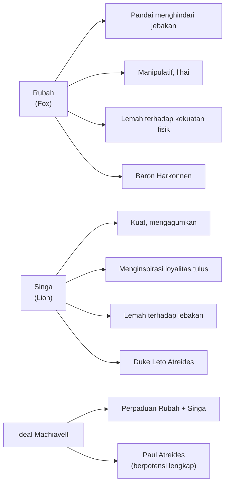
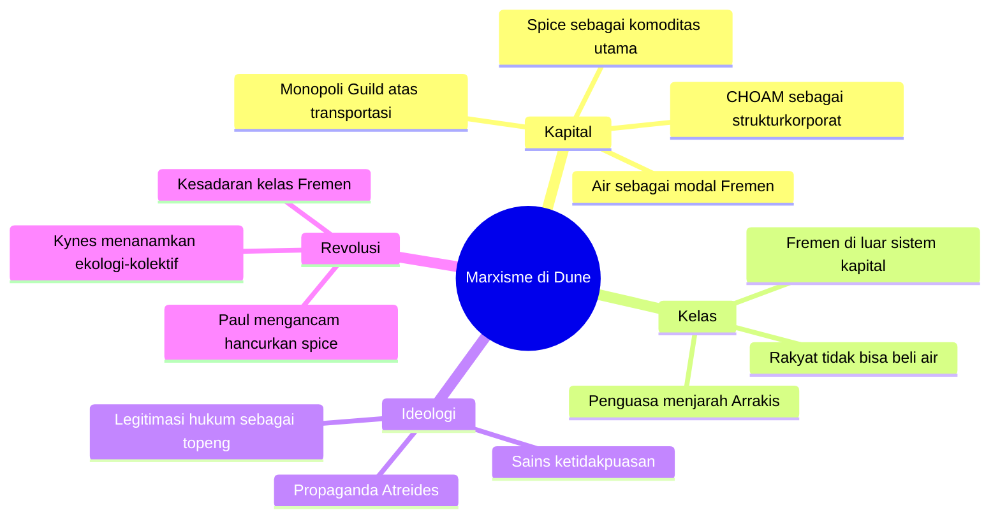
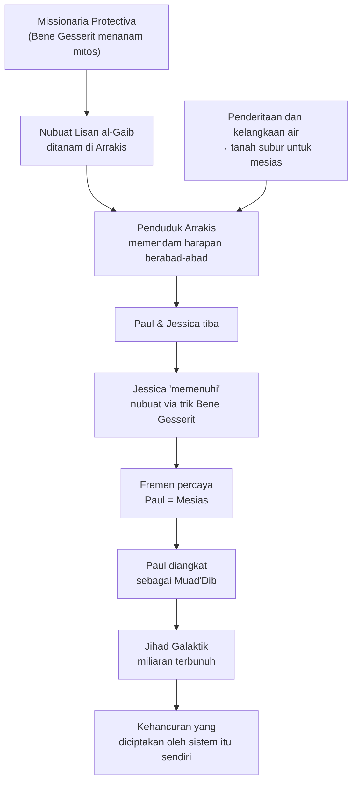

## 🌌 Pendahuluan: Dune Adalah Buku Filsafat yang Berpura-pura Menjadi Novel Fiksi Ilmiah

Ada banyak cara membaca *Dune* karya Frank Herbert. Kita bisa membacanya sebagai kisah petualangan luar angkasa yang megah. Kita bisa membacanya sebagai mitologi tentang sang terpilih. Kita bisa membacanya sebagai kisah politik feodal antargalaksi yang rumit. Atau kita bisa membacanya sebagai apa yang sesungguhnya ia adalah: **sebuah buku filsafat yang sangat padat, ditulis dalam bahasa fiksi ilmiah.** 🌌

Pengetahuan yang tertanam dalam *Dune* hampir tidak terbatas. Setiap lapis narasi menyimpan lapisan gagasan yang lain. Setiap karakter merupakan arketipe filosofis sekaligus individu yang nyata dan kompleks. Setiap konflik politik adalah metafora untuk dinamika kekuasaan yang telah beroperasi dalam sejarah umat manusia sejak ribuan tahun yang lalu.

Artikel ini adalah eksplorasi mendalam terhadap **lima lensa filsafat utama** yang membentuk semesta Dune:

1. 🦊 **Machiavellianisme** — kekuasaan, manipulasi, dan dua arketipe pemimpin: Rubah dan Singa
2. 👑 **Politik Imperium** — struktur kekuasaan galaksi, monopoli kapital, dan sains ketidakpuasan
3. ⚒️ **Marxisme** — perjuangan kelas di Arrakis, eksploitasi sumber daya, dan Fremen sebagai alternatif
4. 🕶️ **Postmodernisme** — kebenaran sebagai alat kekuasaan, propaganda, dan legitimasi palsu
5. 🕌 **Agama** — agama sebagai instrumen politik, bahaya mesianisme, dan kehancuran yang diciptakan sendiri

Ini bukan analisis plot. Ini adalah analisis **apa artinya** semua yang terjadi di Dune — bukan "apa yang terjadi", tetapi "mengapa itu penting dan apa yang diajarkannya tentang dunia nyata kita." 🧠

---

## 🦊 Bagian 1: Machiavellianisme — Rubah, Singa, dan Seni Berkuasa

### Apa itu Machiavellianisme?

**Niccolò Machiavelli** adalah seorang pemikir politik Italia abad ke-16 yang menulis karya terkenal *The Prince* *(Sang Pangeran)*. Inti ajarannya: seorang pemimpin harus bertindak etis hanya ketika etika itu menguntungkan tujuannya. Janji, hukum, dan moralitas bisa dilanggar jika itu diperlukan untuk mempertahankan kekuasaan. 🦊

Dalam psikologi modern, **Machiavellianism** *(Machiavellianisme)* adalah salah satu dari tiga sifat dalam **Dark Triad** *(Tritunggal Gelap)* kepribadian manusia, bersama psikopatia dan sosioptai. Ini adalah sifat manipulatif di mana tujuan selalu membenarkan cara.

Ironinya: meski kita menganggapnya negatif, sebagian besar politisi dan CEO dunia nyata memperlihatkan sifat-sifat Machiavellian. Mengapa? Karena dalam kompetisi kekuasaan, sifat ini memberikan **keunggulan selektif** *(selective advantage)* — ia membantu bertahan dan menang.

Dan karena *Dune* pada dasarnya adalah kisah tentang perebutan kekuasaan antar klan besar di semesta galaksi, hampir semua pemain besar di dalamnya adalah Machiavellian dalam satu atau lain bentuk. 

### Dua Arketipe Machiavelli: Rubah dan Singa

Machiavelli memperkenalkan dua model pemimpin:

**Rubah** *(Fox)* — Pandai mengenali jebakan, lihai bernegosiasi, manipulatif, tidak bisa melawan dengan kekuatan kasar.

**Singa** *(Lion)* — Kuat, mengagumkan, menginspirasi loyalitas, tetapi rentan terhadap jebakan karena terlalu jujur dan terlalu langsung.

Machiavelli berargumen bahwa pemimpin ideal harus memiliki **kedua sifat sekaligus** — karena rubah sendirian tidak bisa melawan serigala, dan singa sendirian tidak bisa menghindari perangkap.

### Baron Vladimir Harkonnen: Rubah Tertinggi

Baron adalah **Rubah Sempurna** dalam semesta Dune. Ia tidak bisa melakukan apa-apa dengan kekuatan fisiknya sendiri — tubuhnya bahkan tidak mampu menopang beratnya sendiri tanpa suspentor *(teknologi anti-gravitasi)*. Ia memerintah melalui:
- manipulasi psikologis yang halus,
- eksploitasi kelemahan orang lain,
- rasa takut yang dikelola dengan hati-hati,
- dan kesenangan yang dijadikan rantai. 👁️

Baron sendiri berkata kepada Mentatnya:

> *"Your pleasures are what tie you to me."*
> *"Kesenanganmu adalah yang mengikatmu padaku."*

Ini adalah essensi manipulasi Machiavellian: Baron tidak membutuhkan loyalitas tulus. Ia hanya butuh kontrol. Ia memahami ketakutan dan kelemahan setiap orang dalam lingkaran kekuasaannya, lalu menggunakan itu sebagai tali kendali.

Yang menarik: Baron juga tidak bodoh. Ia tidak menyukai pembunuhan demi sadisme — ia menyukai pembunuhan sebagai **spektakel kekuasaan**. Setiap kematian yang ia perintahkan bukan tentang kepuasan pribadi, tetapi tentang pesan yang dikirimkan ke musuh dan sekutunya:

> *"The Duke must know when I encompass his doom... and the other great houses must learn of it. The knowledge will give them pause."*
> *"Duke harus tahu ketika aku melingkupi nasibnya... dan rumah-rumah besar lainnya harus belajar tentang ini. Pengetahuan itu akan membuat mereka berpikir dua kali."*

Baron tidak membenci musuhnya. Ia menggunakannya. Bahkan kematian musuh adalah alat retorikal yang terkalkulasi.

### Duke Leto Atreides: Singa yang Terlalu Mulia

Duke Leto adalah kebalikan Baron secara hampir sempurna. Ia **Singa yang Gagah**: tinggi, atletis, berwibawa secara fisik, menginspirasi loyalitas tulus dari para pengikutnya. Ia memerintah bukan melalui rasa takut, tetapi melalui kekaguman.

Lelaki seperti Duncan Idaho, Gurney Halleck, dan Thufir Hawat tidak hanya mengikuti Duke karena tugas — mereka sungguh-sungguh ingin melayaninya. Ini adalah kekuatan luar biasa yang bahkan Baron tidak mampu mereplikasinya. 🦁

Tetapi **kelemahan Singa adalah jebakan**, dan Duke jatuh ke dalam satu:

Ia tahu Arrakis adalah jebakan. Ia tahu Kaisar dan Harkonnen berkonspirasi melawannya. Tetapi ia tidak punya pilihan selain menerimanya, karena menolak planet yang akan membuatnya sangat kaya akan menunjukkan kelemahan di mata klan-klan besar lainnya.

Dan yang lebih menghancurkan: karena Duke punya moralitas yang jelas dan cinta yang tulus terhadap Jessica, Harkonnen dengan cerdas memainkan itu. Mereka menanam fitnah bahwa Jessica-lah pengkhianat, mengalihkan perhatian Duke dari pengkhianat sesungguhnya: Dr. Yueh.

Inilah kelemahan Singa: **seseorang yang kamu cintai bisa dijadikan senjata melawanmu**. Dan seseorang yang tidak mencintai siapa pun — seperti Baron — hampir kebal terhadap serangan jenis ini.

### Paul Atreides: Perpaduan Rubah dan Singa

Paul mewarisi kekuatan inspirati Singa dari House Atreides, tetapi juga mendapat kegelapan dan kesadaran politik dari ibunya, Lady Jessica yang terlatih Bene Gesserit. Dalam pengertian Machiavellian, Paul jauh lebih lengkap dari ayahnya.

Salah satu momen paling menyentuh dalam novel adalah ketika Paul merekrut loyalitas Stilgar sang pemimpin Fremen:

> *"I offer you my loyalty. Totally."*
> *"Aku menawarkan loyalitasku padamu. Sepenuhnya."*

Dan Jessica menyaksikan bagaimana — dalam satu momen itu — pemuda 15 tahun ini membuat pemimpin gurun yang keras itu menyerahkan segalanya. Bukan karena trik, bukan karena rasa takut. Tetapi karena ketulusan yang begitu langka dan begitu kuat sehingga ia menembus semua kalkulasi strategis.

> *"How do the Atreides accomplish this thing so quickly, so easily?"*
> *"Bagaimana klan Atreides melakukan hal ini begitu cepat, begitu mudah?"*

Ini adalah bentuk kekuasaan tertinggi yang Machiavelli sendiri akui: **cinta yang tulus dari rakyat**. Jauh lebih stabil dan jauh lebih kuat daripada rasa takut — asalkan ia tidak pernah hilang. 💫

### Moralitas Bukan Baik atau Buruk — Hanya Efisien atau Tidak

Salah satu pelajaran terpenting Machiavelli yang sangat terasa di Dune adalah **melampaui moralitas** *(beyond morality)*:

*Dune* bukan kisah di mana yang baik menang karena kebaikannya dan yang jahat kalah karena kejahatannya. Itu kisah dongeng *(fairy tale)*, dan Herbert tahu bahwa hidup tidak bekerja begitu.

Duke adalah figur yang jauh lebih layak dikagumi daripada Baron. Tetapi kualitas-kualitas inilah yang justru menjadikannya rentan dan kalah. Ini adalah salah satu "pukulan di perut" terbesar bagi pembaca yang terlalu mencintai Atreides.

Karena sesungguhnya: **kualitas yang membuatmu dicintai bisa menjadi kelemahan yang menghancurkanmu**.

Ini bukan pesimisme. Ini adalah realisme. Dan itulah mengapa Dune, meski bersetting fantastis, terasa sangat nyata. 🌑

---

---

## 👑 Bagian 2: Politik Imperium — Kekuasaan, Kapital, dan Sains Ketidakpuasan

### Struktur Tripod yang Rapuh

Semesta *Dune* diatur oleh tiga pilar utama kekuasaan:
- **Padishah Emperor** *(Kaisar)* — memiliki mayoritas saham CHOAM dan pasukan Sardaukar
- **Landsraad** *(Kongres klan-klan besar)* — balancing power terhadap kaisar
- **Spacing Guild** *(Persatuan Navigasi)* — monopoli perjalanan antarbintang

Kutipan langsung dari Bene Gesserit:

> *"In politics, the tripod is the most unstable of all structures."*
> *"Dalam politik, kaki tiga adalah struktur paling tidak stabil dari semuanya."*

Mengapa? Karena ketidakseimbangan pada satu kaki akan membuat seluruh struktur runtuh. Dan semesta Dune dibangun di atas tripod yang secara inheren sudah tidak seimbang: Kaisar memiliki lebih banyak kekuatan ekonomi dan militer dari siapa pun. 👑

Ini sangat mirip dengan arsitektur kekuasaan di dunia nyata: PBB, NATO, sistem Bretton Woods — semua tripod atau multipod yang tampak stabil tetapi rapuh karena bergantung pada asumsi keseimbangan yang tidak pernah benar-benar setara.

### Spice sebagai Minyak Galaksi

Inti dari seluruh politik Dune adalah **spice**. Siapa menguasai Arrakis, menguasai semesta. Ini bukan metafora yang halus — Herbert secara eksplisit membandingkannya dengan minyak di Timur Tengah.

Spice membuat perjalanan antarbintang mungkin (Guild perlu spice). Spice memperpanjang umur (semua orang kaya pakai spice). Spice memperluas kesadaran. Dan spice **hanya ada di satu tempat**: Arrakis.

Inilah struktur monopoli komoditas yang Herbert jadikan metafora:
- Menguasai Arrakis = CHOAM *directorship* *(hak produksi)* = kekayaan galaksi
- Kekayaan galaksi = suara di Landsraad = pengaruh politik

Sebagaimana Paul dengan sangat cerdas memahami:

> *"Whoever had stockpiled melange could make a killing... Imagine what would happen if something should reduce spice production."*
> *"Siapa yang menimbun melange bisa mengambil untung besar... Bayangkan apa yang akan terjadi jika produksi spice berkurang."*

Dan senjata akhir Paul: **ancaman untuk menghancurkan spice**. Siapa yang bisa menghancurkan sesuatu, ia mengendalikannya. Ini adalah prinsip leverage *(pengungkit kekuasaan)* paling murni: kontrol bukan melalui produksi, tetapi melalui kemampuan destruksi.

### Legalitas sebagai Topeng

Salah satu pelajaran paling sinis sekaligus paling jujur dalam *Dune* adalah bahwa hukum bukan tentang keadilan — melainkan tentang **memberikan legitimasi kepada kekuasaan yang sudah ada**.

Kaisar mengirimkan Atreides ke Arrakis — yang sebenarnya adalah jebakan — tetapi melakukannya dalam kemasan resmi pemberian *fief* *(wilayah kekuasaan)*. Dengan begitu, ketika Atreides hancur, Kaisar bisa mencuci tangannya:

> *"Our Sublime Padishah Emperor has charged me to take possession of this planet and end all dispute."*
> *"Kaisar Padishah kami yang Agung telah menugaskan saya untuk mengambil alih planet ini dan mengakhiri semua perselisihan."*

Ini adalah teknik klasik **legalisme oportunistik**: bungkus tindakanmu dalam kerangka hukum sehingga korbannya tidak bisa protes. Mereka sudah menyetujui sistemnya sendiri.

Paul memahami ini dengan sempurna. Ia tidak berteriak "Kaisar curang!" Sebaliknya, ia menggunakan celah hukum yang sama:

> *"Technically, the Emperor never stripped House Atreides of Arrakis. Legally, if an Atreides is still alive, Arrakis legally belongs to him."*

Ini adalah **kebenaran postmodern dalam aksi**: hukum bukan realitas objektif, melainkan senjata yang bisa dibalik melawan penciptanya.

### Sains Ketidakpuasan

Salah satu konsep paling brilian yang disebutkan dalam *Dune* adalah **"science of discontentment"** *(sains ketidakpuasan)*, yang diperkenalkan oleh Count Fenring:

Inti idenya: **yang paling penting bagi politisi bukan apa yang membuat rakyat bahagia, tetapi apa yang membuat mereka marah.** Karena kemarahan adalah pemicu revolusi. Dan revolusi adalah ancaman terbesar bagi kekuasaan.

Maka politisi yang cerdas tidak menghilangkan ketidakpuasan rakyat (itu mustahil). Mereka **mengelola dan mengalihkan** ketidakpuasan itu. Contoh sempurna:

Di Giedi Prime *(planet Harkonnen)*, rakyatnya miskin dan menderita. Tetapi setiap beberapa waktu, Baron mengadakan pertarungan gladiator. Dan di akhir pertarungan, ia memerintahkan pembagian makanan. Rakyat yang lapar dan marah pulang dengan perut kenyang — masalah struktural tidak berubah, tetapi energi perlawanan sudah padam untuk sementara.

> *"You cannot send home people like this, their energy unspent. They must see that I share their elation."*
> *"Kamu tidak bisa memulangkan orang-orang seperti ini, energi mereka belum tersalurkan. Mereka harus melihat bahwa aku berbagi kegembiraan mereka."*

Ini adalah **bread and circuses** *(roti dan sirkus)* dalam versi luar angkasa — teknik yang sudah digunakan penguasa Roma kuno, dan yang masih digunakan hingga hari ini dalam bentuk hiburan massal, konser, pertandingan olahraga, dan viral media sosial.

---

## ⚒️ Bagian 3: Marxisme — Perjuangan Kelas di Planet Gurun

### Materialisme Historis dan Dune

Dasar teori Marx adalah **historical materialism** *(materialisme historis)* — gagasan bahwa semua institusi manusia adalah produk dari aktivitas ekonominya. Setiap zaman sejarah pada dasarnya adalah produk dari konteks materialnya.

*Dune* adalah demonstrasi materialisme historis yang nyaris sempurna:

> *"To begin your study of the life of Muad'Dib, then take care that you first place him in his time... and take the most special care that you locate him in his place: the planet Arrakis."*
> *"Untuk memulai studimu tentang kehidupan Muad'Dib, berhati-hatilah agar kamu pertama-tama menempatkannya dalam zamannya... dan berhati-hatilah secara khusus bahwa kamu menempatkannya di tempatnya: planet Arrakis."*

Planet adalah kondisi material yang membentuk segalanya. Kelangkaan air di Arrakis bukan hanya kendala fisik — ia membentuk budaya, agama, etika, ekonomi, dan hubungan sosial seluruh masyarakat Fremen. ⚒️

### Ketimpangan Kelas yang Mencolok

Di Arrakis, ketimpangan kelas bisa dilihat secara literal:
- Orang miskin tidak bisa membeli air yang cukup untuk bertahan hidup
- Penguasa membuang-buang air yang sama dalam demonstrasi kekayaan

Di halaman kota Arrakeen ada 20 pohon palem. Setiap pohon membutuhkan air sebanyak yang dibutuhkan lima manusia untuk bertahan hidup. Artinya 100 nyawa manusia dikorbankan setiap hari agar pohon-pohon penguasa bisa tetap hijau.

Dan di istana, ada ruang konservasi rahasia yang bisa menghidupi **seribu orang** setiap harinya — tetapi disembunyikan karena kalau rakyat tahu, mereka akan memberontak.

> *"One could sustain a thousand persons daily from that room... but no one outside the castle knows it exists."*

Ini adalah struktur kelas yang tidak bisa lebih jelas: kemewahan tersembunyi dari sedikit orang dibangun di atas penderitaan yang dipertontonkan dari banyak orang.

### Fremen sebagai Masyarakat Anti-Kapitalis

Ini mungkin analisis paling menarik dalam *Dune*: bahwa **Fremen, masyarakat gurun yang tampak primitif, justru menjalankan sistem ekonomi yang paling manusiawi dan paling berkelanjutan**.

Sistem Fremen:
- **Air adalah modal utama** — sumber daya vital yang tidak bisa dicetak lebih banyak
- **Tidak ada penimbunan** — memiliki lebih air dari yang bisa kamu gunakan sendiri dianggap **tabu**
- **Tidak ada warisan** — ketika seseorang mati, semua air tubuh dan hartanya kembali ke komunitas
- **Kolektivisme** — air ditabung bukan untuk diri sendiri tetapi untuk proyek transformasi planet jangka panjang

Tentang kepemilikan besar, Kynes mengatakan:

> *"The possession of water in great amounts can inflict a man with fatal carelessness."*
> *"Memiliki air dalam jumlah besar bisa mengilap seseorang dengan kelalaian yang mematikan."*

Fremen tidak mengatur penimbunan dengan hukum paksa — mereka mengaturnya dengan **budaya**. Karena budaya yang tertanam lebih kuat dari hukum mana pun.

Dan inilah kesimpulan besar yang Fremen demonstrasikan: **kapitalisme bukan tentang modal itu sendiri — melainkan tentang hubungan kita dengan modal itu**. Modal bisa ada dalam masyarakat yang adil selama relasi terhadap modal itu dibangun di atas prinsip kolektif, bukan akumulasi individual.

### Spice sebagai Tuhan Marx

Karl Marx memiliki konsep tentang bagaimana dalam sistem kapitalis, benda-benda tertentu mengambil "kehidupan sendiri" melebihi manusia yang menciptakannya. Ia menyebut ini sebagai proses di mana "relasi antara benda menjadi kekuatan di luar kendali manusia" — dan kekuatan itu menjadi semacam **Tuhan**.

Spice persis seperti ini. Semua orang bergantung padanya. Guild bergantung padanya. Kekaisaran bergantung padanya. Bahkan Fremen — yang secara filosofis menolak kapitalisme — pun ketagihan spice.

Spice membuat mereka hidup lebih lama, tetapi jika berhenti dikonsumsi, mereka mati. Mereka tidak punya pilihan: sekali masuk sistem spice, mereka **budak sistem itu seumur hidup**.

> *"It's not just the Guild... even the Fremen are all addicted to the spice."*

Ini adalah kritik Karl Marx tentang kapitalisme dalam bentuk paling murni: **kamu tidak bisa meninggalkan sistem karena sistem adalah syarat kelangsungan hidupmu**. Persis seperti sistem kapitalisme hari ini — tidak ada yang mau atau bisa keluar dari sistem sepenuhnya, bukan karena sistem itu baik, tetapi karena di luar sistem, kamu tidak punya cara untuk bertahan hidup.

### Satu-Satunya Orang yang Bisa Menghancurkan Sesuatu, Mengontrolnya

Marx berargumen bahwa untuk mengakhiri kapitalisme, kaum pekerja harus **menguasai alat produksi** *(means of production)*. Dune membawa ini selangkah lebih jauh:

> *"People who can destroy a thing — they control it."*
> *"Orang yang bisa menghancurkan sesuatu — mereka mengontrolnya."*

Paul tidak hanya menguasai Arrakis. Ia **mengancam untuk menghancurkan spice selamanya** jika Kekaisaran tidak menyerah. Ini adalah leverage tertinggi: bukan kepemilikan produksi, tetapi kapasitas destruksi total.

---

---

## 🕶️ Bagian 4: Postmodernisme — Kebenaran adalah Senjata Kekuasaan

### Tidak Ada Kebenaran Objektif — Hanya Narasi yang Dipercaya

**Postmodernisme** adalah gerakan filsafat yang menantang gagasan bahwa ada kebenaran objektif yang bisa diakses dan diterima semua orang. Postmodernis berargumen bahwa "kebenaran" sering kali hanyalah narasi yang diterima oleh kekuasaan dominan. 🕶️

Dune mendemonstrasikan ini secara sangat halus. Paul memiliki kemampuan "merasakan kebenaran" — tetapi Herbert menulis kemampuan ini dengan sangat hati-hati:

> *"He can sense when people believe what they say."*
> *"Ia bisa merasakan ketika orang percaya apa yang mereka katakan."*

Bukan ketika mereka mengatakan kebenaran. Tetapi ketika mereka **percaya** apa yang mereka katakan. Ini adalah perbedaan yang sangat besar secara filosofis: **seseorang bisa sepenuhnya percaya pada suatu kebohongan, dan Paul tidak akan menangkap itu sebagai kebohongan**.

Kebenaran dalam Dune bukan tentang korespondensi dengan realitas. Kebenaran adalah tentang keyakinan dan persepsi.

### Ideologi sebagai Alat Legitimasi

Sistem kekuasaan apa pun membutuhkan legitimasi — sebuah narasi yang meyakinkan rakyat bahwa tatanan yang ada adalah *wajar*, *adil*, atau *takdir*. 

Ketika Harkonnen menggambarkan penduduk Arrakis sebagai "mongrel" *(keturunan campuran)* dan "barbar", itu bukan sekadar penghinaan. Itu adalah **ideologi yang menglegitimasi eksploitasi**: kalau mereka memang lebih rendah dari kita, maka mengeksploitasi mereka adalah normal dan wajar.

Ini adalah teknik yang sudah berulang kali digunakan dalam sejarah nyata:
- Kolonialisme Eropa menyebut penduduk Afrika dan Asia sebagai "tidak beradab" untuk membenarkan penjajahan
- Perbudakan dibenarkan dengan klaim bahwa budak "secara alami cocok" untuk kerja keras
- Di Arrakis, bahkan sesama penduduk lokal (bukan Fremen) yang berhasil masuk kelas pedagang pun ikut mengeksploitasi saudara mereka sendiri demi keuntungan

Tidak perlu orang kulit putih untuk belajar strategi ideologi ini — setiap kelompok manusia sepanjang sejarah telah menggunakannya.

### Propaganda: Kebohongan yang Diulang Menjadi Kebenaran

Duke Leto sangat sadar akan kekuatan propaganda:

> *"My propaganda corps is one of the finest. We must not run short of film-base. How else could we flood the villages and cities with our information? The people must learn how well I govern them. How would they know if we didn't tell them?"*
> *"Korps propaganda saya adalah salah satu yang terbaik. Kita tidak boleh kehabisan bahan film. Bagaimana lagi kita bisa membanjiri desa-desa dan kota-kota dengan informasi kita? Rakyat harus tahu betapa baik saya memerintah mereka. Bagaimana mereka bisa tahu kalau kita tidak memberitahu mereka?"*

Perhatikan kejujurannya yang mengejutkan: ia tidak mengatakan "kami menyebarkan kebenaran". Ia mengatakan "kami memberitahu mereka betapa baiknya kami memerintah." Kalimatnya sendiri mengakui bahwa persepsi publik tidak tumbuh secara organik — ia **diproduksi**.

Dan itu adalah inti dari kekuasaan modern: **media adalah alat produksi kebenaran**. Siapa yang mengendalikan narasi, mengendalikan realitas yang dipercaya orang.

### Paul sebagai Ancaman Epistemologis

Yang membuat Paul berbahaya bukan hanya pasukannya atau kemampuan prescience-nya *(kemampuan melihat masa depan)*. Yang membuat ia berbahaya adalah bahwa **keberadaannya membuktikan bahwa narasi Kekaisaran adalah kebohongan**.

Kaisar mendalilkan bahwa pemusnahan House Atreides adalah proses yang sah, bersih, dan tidak dapat digugat. Tetapi selama masih ada Atreides yang hidup, narasi itu runtuh. Paul adalah **bukti hidup bahwa sistem tidak berjalan sesuai aturan yang dikklaimnya**.

> *"Law is the ultimate science... I propose to show him law."*
> *"Hukum adalah ilmu tertinggi... Aku bermaksud menunjukkan hukum kepadanya."*

Paul tidak mengatakan "aku bermaksud melawannya dengan senjata". Ia berkata ia akan menunjukkan hukum — karena ia tahu bahwa dalam sistem yang memuja legalitas, menunjukkan bahwa Kaisar melanggar hukum adalah bom yang sama berbahayanya dengan armada militer.

---

## 🕌 Bagian 5: Agama — Missionaria Protectiva dan Bahaya Mesias

### Agama Fremen: Alat yang Ditanam dari Luar

Di sinilah *Dune* paling subversif. Seluruh agama Fremen — dengan nubuat Lisan al-Gaib *(suara dari dunia luar)*, dengan ramalan tentang anak dari seorang Bene Gesserit yang akan memimpin mereka ke kebebasan — adalah **fabrikasi politik** yang ditanam oleh Bene Gesserit. 🕌

Sistem ini disebut **Missionaria Protectiva**: selama berabad-abad, Bene Gesserit menyebarkan simbol, tanda, dan nubuat tertentu ke berbagai kultur di berbagai planet. Tujuannya: kalau suatu saat ada anggota Bene Gesserit yang terdampar di planet itu, ia bisa "memenuhi" nubuat yang sudah ditanam itu dan mendapat pengaruh instan atas populasi setempat.

Pertama kali Jessica berinteraksi dengan penduduk Arrakis, ia tidak benar-benar tahu nubuat Fremen. Ia hanya mencoba menebak kata-kata yang tepat — dan ketika Mapes si pelayan menyambutnya dengan antusias, Jessica langsung bermain peran:

> *"If only he knew the tricks we use!"*
> *"Seandainya dia tahu trik yang kami gunakan!"*

Jessica **mengaku sendiri di dalam batinnya** bahwa ia sedang memainkan tipu daya. Ia merasa "cynical bitterness" *(kepahitan sinis)* ketika melakukan manipulasi agama ini. Tetapi ia tetap melakukannya karena ia menganggap itu perlu.

### Mengapa Agama Efektif sebagai Alat Manipulasi?

Ada beberapa mekanisme psikologis yang membuat agama sangat efektif sebagai instrumen kekuasaan:

**1. Pareidolia** *(Pareidolia)* — Otak manusia didesain untuk mengenali pola. Kita melihat wajah di awan, mendengar makna di kebetulan. Kalau seseorang sudah "dididik" dengan simbol-simbol nubuat tertentu, otak mereka akan melihat pola itu di mana-mana — termasuk ketika kita sengaja menciptakannya di hadapan mereka.

**2. Nubuat yang Sengaja Kabur** — Nubuat kiamat dan mesias selalu dibuat seabstrak dan sevague mungkin. Semakin kabur, semakin mudah diinterpretasikan sebagai "sudah terjadi" dalam hampir setiap situasi.

**3. Harapan dari Penderitaan** — Semakin keras kehidupan seseorang, semakin besar keinginannya untuk percaya pada juru selamat. Arrakis yang kering dan miskin adalah tanah subur yang sempurna untuk nubuat mesias. 😔

### Bahaya Sesungguhnya: Rakyat yang Membeli Mitos

Yang membuat *Dune* begitu kompleks adalah bahwa Herbert tidak hanya mengkritik manipulator agama. Ia juga mengkritik **orang-orang yang membiarkan dirinya dimanipulasi**.

Fremen bukan orang bodoh. Mereka cerdas, tangguh, dan punya integritas. Tetapi mereka membiarkan nubuat yang ditanam oleh orang lain menjadi kebenaran mereka sendiri.

Dan ketika Paul datang dan "memenuhi" nubuat itu, mereka tidak berpikir kritis — mereka bersukacita. Mereka menyerahkan diri sepenuhnya kepada figur mesias yang, betapapun nyata kekuatannya, tetap adalah produk dari program rekayasa Bene Gesserit.

> *"The first day when Muad'Dib rode through the streets... some of the people along the way recalled the legends and the prophecy and they ventured to shout Mahdi! But their shout was more a question than a statement, for as yet they could only hope he was the one foretold."*

Bahkan dalam momen klimaks kemenangan Paul, Herbert menggambarkan sorak-sorai rakyat sebagai **pertanyaan, bukan pernyataan**. Mereka berharap, bukan yakin. Tetapi harapan yang cukup kuat terasa sama dengan keyakinan.

### Kynes dan Kolektivisme Religius yang Benar

Ada satu figur dalam *Dune* yang menggunakan agama secara lebih bertanggung jawab: **Liet-Kynes**. Ia — atau lebih tepatnya, ayahnya Pardot Kynes — mengajarkan Fremen tentang ekologi, tentang kemungkinan mengubah Arrakis menjadi planet hijau.

Dan untuk menanamkan ini menjadi komitmen jangka panjang, Kynes merangkai sains ekologi dengan **terminologi agama**. Ia memahami bahwa kalau orang Fremen "hanya" percaya pada rencana ilmiah, semangat itu akan pudar dalam satu atau dua generasi. Tetapi kalau rencana itu dibalut dalam dimensi sakral, ia akan bertahan berabad-abad.

Ini bukan manipulasi murni, karena tujuannya adalah **kebaikan kolektif yang nyata** — bukan kekuasaan satu orang. Tetapi Herbert tetap menunjukkan risikonya: sekali kamu menyatukan hukum dengan kata Tuhan, sangat mudah untuk orang lain datang dan mengambil alih otoritas itu untuk tujuan yang berbeda.

Bahaya yang Kynes coba hindari justru itulah yang akhirnya terwujud: Paul. 😔

### Kehancuran yang Diciptakan Sendiri

Paul melihat masa depan. Ia melihat **jihad** yang akan terjadi atas namanya — perang suci yang melintasi semesta, menewaskan miliaran orang, semua dilakukan oleh pengikut yang fanatik yang mengira mereka sedang memenuhi takdir ilahi.

Dan Paul sangat menderita karenanya. Dalam novel, ia tidak merasa bangga dengan status mesianisnya. Ia merasa seperti terseret oleh kekuatan yang lebih besar dari dirinya, ke arah yang ia sendiri tidak setujui.

Inilah anti-mesias sesungguhnya dalam Dune. Bukan bahwa Paul jahat. Tetapi bahwa sistem yang menciptakan mesias — termasuk penderitaan, nubuat, dan harapan yang terkonsentrasi pada satu figur — adalah sistem yang **secara struktural menghasilkan kekerasan massal**.

> *"The person who experiences greatness must have a feeling for the myth he is in. He must reflect what is projected upon him... The sardonic is all that permits him to move within himself. Without this quality, even occasional greatness will destroy a man."*
> *"Orang yang mengalami kebesaran harus memiliki perasaan terhadap mitos yang ia berada di dalamnya. Ia harus memantulkan apa yang diproyeksikan kepadanya... Sikap sinis adalah satu-satunya yang memungkinkannya bergerak dalam dirinya sendiri. Tanpa kualitas ini, bahkan kebesaran yang sesekali pun akan menghancurkan seseorang."*

Ini adalah peringatan langsung dari Herbert kepada pembaca: **perhatikan mitos. Perhatikan siapa yang menciptakannya dan untuk kepentingan siapa.** 🗝️

---

---

## 🧩 Bagian 6: Sintesis — Mengapa Semua Ini Masih Relevan Hari Ini

Lima lensa filsafat yang kita bahas di atas bukan sekedar analisis akademis terhadap novel tahun 1965. Mereka adalah **cermin yang memantulkan realitas dunia kita**. 🧩

### Machiavellianisme: Para Pemimpin Dunia Nyata

Sistem politik selektif memilih pemimpin dengan sifat-sifat Machiavellian. Tidak karena manusia secara alami cenderung ke sana, tetapi karena sistem kompetitif menyaring mereka yang tidak memiliki sifat ini lebih awal.

Itulah mengapa begitu banyak politisi tampak seperti orang-orang yang kamu tidak akan percayakan kunci rumahmu. Bukan karena politik menarik orang jahat — melainkan karena proses politik **selektif terhadap sifat-sifat tertentu**. Lion-lion tereliminasi lebih dulu. Fox-fox yang naik.

### Marxisme: Arrakis Adalah Bumi

Ketimpangan air di Arrakis terasa fiksi yang ekstrem. Tetapi di dunia nyata:
- 8 orang terkaya di Bumi memiliki kekayaan setara seluruh 50% populasi bawah dunia
- Perusahaan-perusahaan ekstraksi sumber daya mengambil kekayaan dari negara-negara berkembang dan mengirimnya ke negara-negara kaya
- Pekerja yang menciptakan nilai tidak mendapat nilai yang proporsional

Fremen bukan utopia. Tetapi pertanyaan yang mereka ajukan sangat relevan: **apakah sistem ekonomi kita dibangun agar semua orang bisa hidup bermartabat, atau agar sebagian kecil bisa terus mengakumulasi tanpa batas?**

### Postmodernisme: Era Pasca-Kebenaran

Kita hidup di era di mana istilah **"post-truth"** *(pasca-kebenaran)* memenangkan Oxford Dictionary Word of the Year. Media sosial memungkinkan narasi apa pun disebarkan secepat kilat. Algoritma memperkuat konten yang memancing emosi, bukan konten yang faktual.

Kemampuan Paul "merasakan ketika orang percaya apa yang mereka katakan, bukan ketika mereka mengatakan kebenaran" adalah gambaran sempurna dari realitas kita: orang bisa sepenuhnya yakin pada sesuatu yang salah, dan keyakinan itu terasa seperti kebenaran dari dalam. 🔍

### Agama dan Mesias: Dari Arrakis ke Dunia Nyata

Setiap generasi menghasilkan figur-figur yang diklaim atau mengklaim sebagai "juru selamat" — dari pemimpin spiritual hingga pemimpin politik. Pola selalu sama:
- Periode penderitaan yang menciptakan kebutuhan akan harapan
- Muncul figur yang tampak "memenuhi" ekspektasi yang sudah ada
- Pengikut menyerahkan penilaian kritis mereka demi kesetiaan pada figur
- Figur itu dimanfaatkan oleh sistem yang lebih besar, atau figur itu sendiri menjadi sistem yang lebih besar
- Kehancuran mengikuti

*Dune* bukan anti-agama. Ia anti-**penggunaan agama sebagai alat kontrol dan mobilisasi massa tanpa transparansi**. Ini adalah perbedaan yang sangat penting.

---

## 📊 Tabel Ringkasan: Lima Lensa Filsafat Dune

| Filsafat | Prinsip Utama | Dune Menunjukkan Ini Via | Relevansi Dunia Nyata |
| :--- | :--- | :--- | :--- |
| **Machiavellianisme** | Tujuan membenarkan cara | Baron vs. Duke | Seleksi alami pemimpin politik |
| **Politik Kekuasaan** | Kontrol kapital = kontrol kekuasaan | Spice + Sardaukar = Kekaisaran | Monopoli sumber daya & militer |
| **Marxisme** | Perjuangan kelas, eksploitasi alat produksi | Arrakis = planet eksploitasi | Ketimpangan ekonomi global |
| **Postmodernisme** | Kebenaran = narasi yang berkuasa | Propaganda Atreides, legitimasi hukum palsu | Media sosial & post-truth era |
| **Agama** | Agama sebagai alat mobilisasi & kontrol | Missionaria Protectiva, nubuat palsu | Pemimpin karismatik & mesianisme modern |

---

## 🕯️ Kesimpulan: Dune Adalah Buku yang Tidak Memihak Siapa Pun — Dan Itu Adalah Kekuatannya

Salah satu pernyataan paling sering disalahpahami tentang *Dune* adalah bahwa Paul adalah pahlawan atau Paul adalah anti-hero. Herbert sendiri menolak keduanya:

> *"There is no hero in Dune. No villain. It's all a question of perspective — whose rules do you agree with?"*

Atreides tampak lebih baik dari Harkonnen. Fremen tampak lebih manusiawi dari Imperium. Paul tampak lebih mulia dari Kaisar. Tetapi tidak ada dari mereka yang bersih. Tidak ada dari mereka yang tanpa ambiguitas.

Duke mengeksploitasi Fremen sambil berpura-pura menghormati mereka.
Jessica memanipulasi kepercayaan rakyat demi tujuan Bene Gesserit.
Paul menggunakan jihad sebagai alat kekuasaan, meski ia tahu jutaan akan mati.
Fremen membunuh Paul dalam duel untuk membuktikan posisinya — sebelum mereka memujanya sebagai nabi.

Dan inilah pelajaran terbesar Dune:

> **Kekuasaan selalu mengungkapkan sifat aslinya. Dan siapa pun yang cukup dekat dengan kekuasaan — tidak peduli seberapa mulia niatnya — akan diubah olehnya.**

Ini bukan nihilisme. Ini adalah realisme yang dewasa. Herbert tidak mengatakan "jangan berjuang untuk kebaikan". Ia mengatakan: "jangan berhenti berpikir kritis hanya karena kamu sudah memilih siapa yang kamu dukung."

> **"Fear is the mind-killer."**
> **"Rasa takut adalah pembunuh pikiran."**

Dan mungkin tambahan dari Herbert untuk zaman kita adalah:

> **"Hope, too, can be the mind-killer — when it makes you stop thinking."**
> **"Harapan pun bisa menjadi pembunuh pikiran — ketika ia membuatmu berhenti berpikir."** 🕯️

---

<Callout type="important" title="Dune dan Dunia Kita">
Dune ditulis di tahun 1960-an, tetapi setiap tema yang ada di dalamnya — manipulasi agama, eksploitasi sumber daya, monopoli kekuasaan, propaganda, bahaya mesias — semakin relevan di abad ke-21. Frank Herbert tidak menulis tentang masa depan. Ia menulis tentang sifat manusia yang tidak berubah.
</Callout>

<Callout type="cite" title="Referensi Sumber">
- Video analisis: *The Philosophy of Dune* (YouTube)
- Sumber video: [YouTube — The Philosophy of Dune](https://www.youtube.com/watch?v=-PDjwKZQVLw)
- Basis analisis: Novel *Dune* (1965) karya Frank Herbert
- Referensi filosofi: Niccolò Machiavelli *The Prince*, Karl Marx *Das Kapital*, teori postmodernisme Foucault & Derrida
</Callout>
