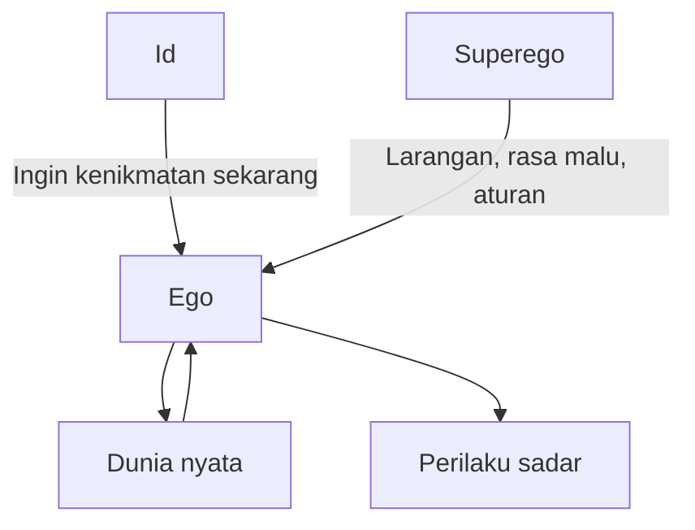

## 🧠 Pendahuluan: Freud Penting Bukan Karena Selalu Benar, tetapi Karena Ia Mengubah Cara Manusia Mencurigai Dirinya Sendiri

Ada sedikit tokoh dalam sejarah psikologi yang pengaruh budayanya sebesar Sigmund Freud. Bahkan orang yang tidak pernah membaca satu pun karya Freud biasanya tetap hidup di dunia yang telah disentuh Freud. Kita sudah terbiasa mendengar istilah seperti **alam bawah sadar**, *slip of the tongue* — *keseleo lidah / salah sebut yang dianggap punya makna tersembunyi*, mekanisme pertahanan diri, trauma masa kecil, represi, mimpi sebagai simbol, atau gagasan bahwa kita tidak sungguh-sungguh tahu mengapa kita melakukan sesuatu. Semua itu, entah kita sadar atau tidak, adalah bagian dari dunia mental yang Freud bantu bentuk. 🧠

Itulah yang membuat Freud sulit diperlakukan secara sederhana. Ia bukan tokoh yang bisa dengan jujur disebut “ilmuwan hebat yang semuanya benar,” tetapi juga bukan sekadar orang aneh yang mengarang teori seksual berlebihan. Freud berada di posisi yang jauh lebih rumit. Di satu sisi, banyak detail teorinya dianggap keliru, tidak ilmiah, terlalu spekulatif, bias gender, bias budaya, dan tidak lolos uji empiris modern. Di sisi lain, ia memperkenalkan satu perubahan radikal dalam cara manusia memandang diri: **mungkin kita bukan makhluk transparan bagi diri sendiri. Mungkin ada kekuatan, dorongan, konflik, dan motif yang bekerja di dalam diri kita tanpa kita pahami sepenuhnya.**

Kuliah Paul Bloom yang Mas Hendra kirim sangat bagus karena tidak memuja Freud secara buta, tetapi juga tidak mengabaikannya. Bloom menempatkan Freud sebagai tokoh besar yang harus dipelajari bukan demi nostalgia sejarah, melainkan karena terlalu banyak hal di masa kini masih bergerak di bayangannya. Ia menunjukkan dua hal sekaligus: pertama, detail-detail tertentu dalam teori Freud sering memang absurd, lemah, atau tidak didukung bukti. Kedua, ide umum bahwa proses mental tak sadar memengaruhi perilaku ternyata justru tetap hidup sangat kuat dalam psikologi modern, meskipun dalam bentuk yang jauh berbeda dari psikoanalisis klasik.

Artikel ini akan membedah Freud secara panjang, detail, dan mendalam dalam bahasa Indonesia. Kita akan melihat mengapa Freud begitu terkenal, apa inti gagasan psikoanalisis, mengapa **unconscious** — *ketaksadaran / proses mental yang tidak kita sadari* — menjadi kunci seluruh sistemnya, bagaimana struktur **id, ego, superego** bekerja menurut Freud, apa itu tahapan psikoseksual, bagaimana Freud menjelaskan mimpi, histeria, dan mekanisme pertahanan diri, lalu mengapa teori ini kemudian dihantam kritik ilmiah besar, terutama soal **falsifiability** — *daya-bantah / kemampuan teori untuk diuji salah*. Namun kita juga akan melihat bahwa justru ketika banyak detail Freud runtuh, ada sesuatu yang tetap tinggal: ide bahwa manusia tidak sepenuhnya rasional, tidak sepenuhnya sadar atas motifnya sendiri, dan sangat sering digerakkan oleh proses batin yang tersembunyi.

Kalau diringkas dalam satu kalimat: **Freud penting bukan karena semua teorinya harus dipercaya, tetapi karena ia memaksa kita menerima kemungkinan yang tidak nyaman—bahwa alasan yang kita ceritakan tentang diri kita sendiri mungkin bukan alasan sesungguhnya.**

<Callout type="important" title="Tesis utama artikel ini">
Freud adalah tokoh yang banyak salah pada level detail, tetapi sangat berpengaruh pada level paradigma. Banyak klaim spesifik psikoanalisis telah ditolak oleh psikologi modern, namun ide umumnya—bahwa perilaku manusia dipengaruhi oleh proses mental tak sadar, konflik internal, dan alasan-alasan yang tidak sepenuhnya bisa diakses lewat introspeksi—tetap menjadi warisan intelektual yang sangat besar.
</Callout>

---

## 👤 1. Freud sebagai “Grand Theorist”: Mengapa Ia Begitu Berpengaruh dibanding Psikolog Lain?

Paul Bloom memulai dengan satu pengamatan penting: kebanyakan teori dalam psikologi bersifat sempit. Ada teori tentang prasangka rasial, teori tentang skizofrenia, teori tentang perkembangan bahasa, teori tentang daya tarik seksual, teori tentang memori, dan seterusnya. Masing-masing membahas domain tertentu.

Tetapi Freud—sama seperti B. F. Skinner dari kubu behaviorisme—membangun **grand theory** — *teori besar / teori menyeluruh*. Ia tidak hanya punya pendapat tentang satu penyakit atau satu perilaku. Ia punya teori tentang hampir segala hal yang dianggap penting dalam hidup manusia: perkembangan anak, cinta, seks, perang, agama, mimpi, humor, slip lidah, gangguan mental, hubungan keluarga, bahkan kebudayaan.

Inilah yang membuat Freud luar biasa berpengaruh. Ia menawarkan bukan sekadar penjelasan lokal, melainkan **peta besar jiwa manusia**. Orang mungkin setuju atau tidak, tapi sulit mengabaikan teori yang mencoba menjelaskan hampir semuanya sekaligus.

Freud juga penting secara budaya. Ia bukan hanya akademisi; ia adalah selebritas intelektual. Ia dikenal luas, dikutip di luar kampus, dibenci dan dipuja sekaligus. Bahkan musuh-musuhnya mengakui besarnya pengaruhnya. Ini penting, karena pengaruh suatu ide tidak hanya ditentukan oleh kebenarannya, tetapi juga oleh kemampuannya menyediakan bahasa untuk memahami diri.

Freud memberi bahasa baru bagi kecurigaan terhadap diri sendiri. Dan itu sangat kuat. 👤

---

## ⚔️ 2. Mengapa Freud Sangat Dibenci? Karena Ia Menghancurkan Ilusi bahwa Manusia pada Dasarnya Sadar, Bersih, dan Rasional

Bloom juga menyorot sesuatu yang jarang dibahas cukup jujur: Freud bukan hanya terkenal, tetapi juga sangat dibenci. Sebagian kebencian itu datang dari karakternya yang ambisius, agresif, kejam terhadap lawan, dan tidak selalu jujur. Tetapi sebagian lain datang dari isi teorinya.

Freud menyinggung sesuatu yang sangat sensitif. Ia merusak citra manusia sebagai makhluk yang sepenuhnya rasional, baik, dan tahu apa yang sedang dilakukannya. Ia berkata, secara implisit maupun eksplisit:

- Anda mungkin tidak tahu mengapa Anda mencintai seseorang.  
- Anda mungkin tidak paham motif sejati dari keputusan Anda.  
- Anda mungkin menjalani hidup di bawah dorongan seksual, agresif, dan konflik masa kecil yang tak Anda sadari.  
- Anda mungkin mengira Anda bermoral, padahal Anda sedang membela diri dari sesuatu yang tidak ingin Anda akui.  

Ini sangat mengganggu. Bukan hanya secara intelektual, tapi secara eksistensial. Freud mengatakan bahwa rumah kesadaran kita mungkin tidak benar-benar milik kita sepenuhnya. Ada tamu-tamu liar di dalamnya. ⚔️

Karena itu, reaksi terhadap Freud sering ekstrem. Orang tidak hanya berdebat dengannya. Mereka marah padanya. Sebab Freud tidak sekadar menawarkan teori; ia menawarkan penghinaan terhadap rasa aman psikologis kita.

---

## 🕳️ 3. Inti Freud yang Paling Penting: Ada Motif Tak Sadar yang Menggerakkan Kita

Kalau seluruh sistem Freud harus dipadatkan ke inti paling berpengaruh, maka salah satu jawabannya adalah ini: **unconscious motivation** — *motivasi tak sadar*. Gagasan dasarnya tampak sederhana, tapi dampaknya revolusioner.

Biasanya kita berpikir bahwa ketika ditanya mengapa kita melakukan sesuatu, kita tahu jawabannya. Misalnya:
- saya menikah karena cinta,
- saya masuk kampus ini karena kualitas akademik,
- saya tidak suka dia karena dia sombong,
- saya memilih pekerjaan itu karena realistis,
- saya lupa nama orang itu karena saya memang pelupa.

Freud berkata: mungkin iya, mungkin tidak. Bisa jadi penjelasan sadar itu hanya permukaan. Di bawahnya ada motif lain yang tersembunyi. Mungkin Anda tertarik pada seseorang karena ia mengingatkan Anda pada ayah atau ibu Anda. Mungkin Anda memilih jalan hidup tertentu untuk membalas luka lama. Mungkin Anda lupa nama seseorang justru karena ada konflik batin yang tak Anda akui. 🕳️

Ini terasa mengganggu karena ia menggoyang otoritas introspeksi. Freud tidak percaya bahwa “saya merasa begini” otomatis berarti “saya tahu sumber sebenarnya dari rasa itu.” Ia membuka kemungkinan bahwa **kesadaran adalah juru bicara yang sangat terbatas**, dan sering kali narasi sadar hanyalah pembelaan setelah fakta.

Bahkan kalau jawaban sadar kita jujur, menurut Freud itu belum cukup. Kita bisa jujur secara subjektif tetapi tetap salah secara psikologis.

---

## 🧩 4. Mengapa Ide Ketaksadaran Freud Radikal? Karena Ia Diterapkan Bukan Hanya pada Persepsi, tetapi pada Cinta, Pilihan Hidup, dan Moralitas

Bloom memberi analogi yang bagus. Kita relatif nyaman menerima bahwa banyak proses persepsi bersifat tidak sadar. Kita melihat pohon, mobil, orang, dan wajah tanpa tahu persis bagaimana otak mengerjakannya. Itu tidak terlalu menakutkan. Tapi Freud memperluas logika itu ke wilayah yang jauh lebih pribadi.

Ia berkata: bagaimana jika hal serupa juga terjadi pada:
- mengapa Anda jatuh cinta,  
- mengapa Anda membenci seseorang,  
- mengapa Anda memilih hidup tertentu,  
- mengapa Anda merasa gelisah,  
- mengapa Anda melakukan kesalahan yang tampak “kebetulan”?  

Di sinilah Freud menjadi revolusioner. Ia bukan orang pertama yang bicara tentang hal-hal tak sadar, tetapi ia menjadikan ketaksadaran sebagai **pusat drama mental manusia**. Bukan sekadar latar belakang mekanis, melainkan arena tempat keinginan, rasa malu, larangan, dan luka bekerja di luar pengawasan ego sadar.

Dengan cara ini, Freud mengubah manusia dari makhluk yang “mengetahui apa yang ia lakukan” menjadi makhluk yang **selalu sebagian tersembunyi dari dirinya sendiri**. 🧩

---

## 🐍 5. Struktur Jiwa menurut Freud: Id, Ego, dan Superego

Salah satu model paling terkenal Freud adalah pembagian jiwa menjadi tiga komponen: **id**, **ego**, dan **superego**. Ini bukan bagian anatomi otak, tentu saja. Ini model konseptual tentang konflik batin.

### a. Id
**Id** adalah bagian paling primitif, paling hewani, paling impulsif. Ia hadir sejak lahir. Ia menginginkan kenikmatan, pemuasan, kehangatan, makanan, seks, pelepasan. Freud menyebutnya bekerja dengan **pleasure principle** — *prinsip kenikmatan*. Intinya: saya mau senang, dan saya maunya sekarang.

Id tidak sabar, tidak rasional, dan menurut Bloom, dalam bahasa kuliahnya, “outrageously stupid” — *sangat bodoh secara memalukan*. Ia tidak peduli etika, norma, atau realitas.

### b. Ego
**Ego** berkembang ketika manusia mulai sadar bahwa dunia tidak langsung memenuhi semua keinginannya. Maka muncullah sistem yang lebih realistis, yang bekerja dengan **reality principle** — *prinsip realitas*. Ego bertugas menavigasi dunia: kapan memuaskan keinginan, kapan menunda, kapan menyerah, kapan menyamarkan, kapan merencanakan.

Ego sering disalahpahami sebagai “keakuan sombong,” padahal dalam model Freud ia lebih dekat ke manajer realitas. Ia adalah negosiator.

### c. Superego
**Superego** adalah aturan internal yang diserap dari orang tua, masyarakat, norma, rasa malu, dan tuntutan moral. Superego berbunyi seperti polisi moral di kepala: “itu kotor,” “itu salah,” “malu dong,” “jangan lakukan itu,” “kamu menjijikkan.”

Yang penting, menurut Bloom, Freud menganggap superego juga **bukan entitas bijak**. Ia tidak selalu seperti filsuf moral rasional. Ia bisa sama bodohnya dengan id, hanya arah kebodohannya berbeda. Kalau id berkata, “ambil sekarang juga,” superego berkata, “jangan, kamu buruk.” 🐍

Ego berada di tengah dua teriakan itu, berusaha menahan id, menghindari cambukan superego, dan tetap bertahan di dunia nyata.

---

## 🌊 6. Mengapa Model Ini Begitu Memikat? Karena Ia Membuat Diri Manusia Tampak Seperti Arena Perang, Bukan Pusat Komando Tunggal

Salah satu alasan model Freud begitu kuat secara budaya adalah karena ia membalik gambaran manusia. Kita suka membayangkan diri sebagai pusat kendali yang konsisten. Freud berkata: tidak. Anda lebih mirip **medan konflik**.

Ada dorongan kasar dari bawah, ada tuntutan moral dari atas, ada ego yang panik di tengah, dan sebagian besar proses ini berlangsung tak sadar. Dengan model ini, rasa bingung atas diri sendiri menjadi masuk akal. Mengapa saya menginginkan sesuatu tapi sekaligus jijik pada keinginan itu? Mengapa saya marah tapi tidak mengakui kemarahan saya? Mengapa saya merasa bersalah bahkan saat tak tahu salah saya apa? Mengapa saya melakukan sabotase terhadap kebahagiaan saya sendiri?

Freud punya jawabannya: karena jiwa bukan kesatuan tenang. Jiwa adalah **sistem konflik**. 🌊

Secara ilmiah modern, model id-ego-superego tentu tidak dipakai secara literal dalam banyak cabang psikologi. Tetapi sebagai metafora dan model budaya, ia luar biasa hidup. Karena banyak orang merasa: ya, memang hidup batin itu seperti ada beberapa suara yang tidak selalu sejalan.

---

## 👶 7. Tahapan Psikoseksual Freud: Oral, Anal, Phallic, Latency, Genital

Freud tidak berhenti pada struktur jiwa. Ia juga mengembangkan teori **psychosexual development** — *perkembangan psikoseksual*, yang menyatakan bahwa kepribadian berkembang melalui lima tahap utama, masing-masing terkait dengan zona kenikmatan tubuh.

### 1. Oral stage — Tahap oral
Tahap awal kehidupan, di mana mulut menjadi pusat kepuasan: menyusu, mengisap, menggigit, mengunyah. Menurut Freud, gangguan pada tahap ini—misalnya penyapihan terlalu cepat—bisa meninggalkan jejak kepribadian “oral”: tergantung, needy, terlalu banyak makan, merokok, mengunyah, dan seterusnya.

### 2. Anal stage — Tahap anal
Tahap ini berkaitan dengan toilet training atau latihan kontrol buang air. Freud mengaitkan masalah pada tahap ini dengan kepribadian “anal”: terlalu rapi, kompulsif, stingy — *pelit*, obsesif terhadap kontrol, atau sangat kaku.

### 3. Phallic stage — Tahap falik
Fokus kesenangan berpindah ke genital. Di sinilah muncul teori paling kontroversial Freud, termasuk Oedipus complex dan penis envy.

### 4. Latency stage — Tahap laten
Masa ketika dorongan seksual ditekan atau relatif tenang, terutama setelah konflik besar di tahap falik.

### 5. Genital stage — Tahap genital
Tahap kedewasaan seksual yang sehat, ketika individu idealnya sudah melewati konflik-konflik sebelumnya dan dapat menyalurkan dorongan secara matang.

Secara budaya, tahap-tahap ini sangat terkenal. Secara ilmiah modern, justru inilah bagian Freud yang banyak dianggap sangat bermasalah, spekulatif, dan tidak didukung bukti kuat. 👶

---

## 🫣 8. Oedipus Complex dan Penis Envy: Mengapa Freud Begitu Kontroversial dan Mengapa Banyak Bagian Ini Sulit Dipertahankan

Bagian paling terkenal sekaligus paling sering diejek dari Freud tentu adalah **Oedipus complex** dan **penis envy**. Dalam kerangka Freud, anak laki-laki di tahap falik mengembangkan ketertarikan pada ibunya, melihat ayah sebagai saingan, lalu takut dikastrasi oleh ayah. Konflik ini kemudian ditekan dan menjadi bagian dari pembentukan superego serta identitas seksual.

Untuk anak perempuan, Freud membangun versi yang sangat problematis dan jauh lebih lemah secara konseptual: mereka menyadari tidak punya penis, merasa kehilangan, lalu mengembangkan bentuk ketertarikan tertentu ke ayah dan penolakan ke ibu. Inilah yang dikenal secara populer sebagai *penis envy*.

Bloom jelas menunjukkan absurditas dan kelemahan bagian ini. Secara modern, teori-teori ini dianggap sangat bias:
- bias patriarkal,
- bias heteronormatif,
- bias terhadap struktur keluarga tertentu,
- dan sangat miskin bukti empiris.

Lebih parah lagi, teori ini susah diuji lintas budaya dan lintas bentuk keluarga. Bagaimana dengan anak dari single parent? Bagaimana dengan anak yang dibesarkan dalam konfigurasi keluarga berbeda? Bagaimana dengan anak yang sejak awal bottle-fed? Freud sangat fokus pada keluarga borjuis Eropa yang sempit, lalu mengangkatnya menjadi struktur universal. Itu jelas problematis. 🫣

Jadi jujur saja: kalau seseorang hanya mengenal Freud lewat penis envy dan simbol falik, ia memang akan sulit menghormatinya. Dan itu cukup masuk akal.

---

## 🛡️ 9. Defense Mechanisms: Warisan Freud yang Jauh Lebih Tahan Lama daripada Tahap Psikoseksualnya

Salah satu bagian Freud yang paling berpengaruh sampai sekarang adalah konsep **defense mechanisms** — *mekanisme pertahanan diri*. Menurut Freud, ego harus melindungi diri dari dorongan id yang memalukan sekaligus tekanan superego yang menghukum. Untuk itu, ia memakai berbagai strategi psikologis.

Bloom menyebut beberapa yang klasik:

### Sublimation — Sublimasi
Energi seksual atau agresif dialihkan ke bentuk yang lebih diterima, misalnya karya seni, kerja keras, atau pencapaian kreatif.

### Displacement — Pengalihan
Perasaan diarahkan ke sasaran yang lebih aman. Anak yang marah pada ayah mungkin tidak berani mengakuinya, lalu menendang anjing atau memarahi pihak lain.

### Projection — Proyeksi
Keinginan atau dorongan yang tidak kita terima pada diri sendiri diproyeksikan ke orang lain. “Bukan saya yang punya keinginan itu—mereka yang begitu.”

### Rationalization — Rasionalisasi
Kita membuat alasan yang lebih dapat diterima untuk tindakan yang sebenarnya dipicu oleh motif yang lebih gelap atau memalukan.

### Regression — Regresi
Kita mundur ke pola yang lebih kekanak-kanakan ketika stres atau trauma. Anak yang sudah mandiri bisa kembali mengisap jempol atau menangis seperti lebih kecil. Orang dewasa pun kadang “mundur” secara emosional saat tertekan.

Nah, bagian ini menarik karena meskipun kerangka besar Freud banyak ditolak, konsep mekanisme pertahanan tetap terasa sangat intuitif dan sebagian besar masih hidup dalam bahasa psikologi populer dan klinis. Tidak selalu dalam bentuk yang sama persis seperti Freud, tetapi ide dasarnya—bahwa manusia punya cara melindungi diri dari hal-hal batin yang terlalu menyakitkan untuk diakui—masih sangat kuat. 🛡️

---

## 🌫️ 10. Histeria, Gejala, dan Psikoanalisis: Ketika Gejala Dipahami sebagai Pesan Tersembunyi dari Konflik Batin

Freud hidup di masa ketika istilah **hysteria** — *histeria* — dipakai untuk menggambarkan gejala seperti kelumpuhan tanpa sebab fisiologis jelas, kebutaan, ketulian, tremor, amnesia, blackouts, dan serangan panik. Dalam pandangan Freud, gejala-gejala ini bukan kebetulan atau murni fisik. Mereka adalah **hasil kompromi** dari konflik tak sadar.

Artinya, gejala tidak dipandang sebagai masalah itu sendiri, tetapi sebagai **simptom simbolik** dari sesuatu yang disembunyikan dari kesadaran. Orang tidak bisa melihat, bukan karena matanya rusak, melainkan karena jiwanya menolak sesuatu. Orang lupa, karena ada sesuatu yang terlalu menyakitkan untuk diingat. Orang lumpuh, karena ada konflik psikologis yang mencari jalan keluar lewat tubuh.

Dari sini lahir metode psikoanalisis: tugas terapis adalah membantu pasien menembus resistensi dan mendapatkan **insight** — *pemahaman mendalam tentang konflik tak sadar*. Awalnya Freud bereksperimen dengan hipnosis, lalu lebih terkenal dengan **free association** — *asosiasi bebas*, di mana pasien berbicara sebebas mungkin untuk memunculkan hubungan-hubungan mental tersembunyi.

Gagasan intinya: masalah Anda yang tampak di permukaan sebenarnya mencerminkan konflik yang lebih dalam. Kalau konflik itu disadari, gejalanya bisa mereda. 🌫️

Secara naratif, ini sangat memikat. Secara klinis modern, efektivitasnya jauh lebih diperdebatkan.

---

## 🌙 11. Freud dan Mimpi: Mimpi sebagai Wish Fulfillment dan Simbol dari Sesuatu yang Ditekan

Freud juga sangat terkenal karena teorinya tentang mimpi. Menurutnya, mimpi punya dua lapisan:

- **manifest content** — *isi nyata yang kita alami dalam mimpi*,  
- **latent content** — *makna laten / isi tersembunyi di balik mimpi itu*.  

Ia melihat semua mimpi sebagai bentuk **wish fulfillment** — *pemenuhan hasrat / pemenuhan keinginan*, meski sering kali keinginan itu dilarang, dipermalukan, atau tidak kita akui. Karena keinginan itu terlalu sensitif untuk muncul telanjang, mimpi menyamarkannya melalui simbol.

Maka mimpi tidak dibaca secara literal. Ia dibaca seperti teks simbolik.

Dari sinilah budaya modern mewarisi kebiasaan membaca mimpi seolah setiap objek tersembunyi mengacu pada hasrat tertentu. Ini jelas sangat memengaruhi sastra, film, kritik budaya, dan cara orang awam bicara soal mimpi. 🌙

Namun secara ilmiah modern, klaim kuat Freud—bahwa mimpi pada dasarnya adalah wish fulfillment simbolik—tidak didukung kuat. Studi tidur dan mimpi menunjukkan bahwa mimpi memang sering berkaitan dengan kekhawatiran, pikiran, atau pengalaman harian, tetapi bukan berarti mereka bekerja seperti kode rahasia ala Freud.

---

## ⛪ 12. Freud tentang Agama, Sastra, dan Kebudayaan: Mengapa Ia Begitu Berpengaruh di Humaniora

Freud bukan hanya penting di klinik atau psikologi awal. Ia juga luar biasa besar dalam sastra, kritik budaya, teori film, dan studi agama. Mengapa? Karena begitu Anda menerima bahwa manusia punya kehidupan simbolik yang penuh represi dan makna tersembunyi, hampir semua artefak budaya bisa dibaca secara psikoanalitik.

Freud memandang agama, misalnya, sebagai sesuatu yang sebagian terkait dengan kebutuhan akan figur ayah kosmik—*father figure*. Cerita rakyat, dongeng, tragedi, sastra, dan karya seni juga dilihatnya sebagai panggung tempat konflik tak sadar manusia dimainkan dalam bentuk simbolik.

Ini menjelaskan mengapa Freud tetap hidup di jurusan sastra, filsafat, sejarah ide, dan teori budaya bahkan ketika banyak psikolog eksperimental meninggalkannya. Psikoanalisis memberi alat tafsir yang sangat kaya. Ia mungkin tidak selalu ilmiah dalam pengertian keras, tetapi sangat subur sebagai **mesin interpretasi**. ⛪

Dan di sinilah letak paradoks Freud: ia sering lemah sebagai sains ketat, tetapi sangat kuat sebagai kerangka membaca manusia dan budaya.

---

## 🔬 13. Kritik Besar terhadap Freud: Bukan Hanya “Salah,” Tetapi Sering “Tidak Bisa Diuji”

Bagian paling penting dari kuliah Bloom adalah evaluasi ilmiahnya. Menurutnya, ada dua cara teori bisa bermasalah:

1. teori itu salah,  
2. teori itu begitu lentur dan kabur sampai **tidak bisa benar-benar diuji**.  

Inilah titik krusial dalam kritik terhadap Freud.

Kalau sebuah teori berkata: “X menyebabkan Y,” kita bisa mengujinya. Misalnya: kerusakan hippocampus merusak jenis memori tertentu. Atau: paparan kekerasan TV meningkatkan agresi anak. Klaim seperti ini bisa diuji, dibantah, diperbaiki.

Tetapi banyak bagian teori Freud terlalu fleksibel. Kalau pasien setuju, Freud merasa benar. Kalau pasien marah dan menolak, Freud juga bisa merasa benar, karena penolakan itu dianggap bukti represi. Dengan kata lain, **apa pun yang terjadi bisa dipakai sebagai konfirmasi**. Dan itu sangat berbahaya secara ilmiah.

Inilah yang disebut Karl Popper sebagai masalah **falsifiability** — *daya-bantah*. Teori yang ilmiah harus berani membuat klaim yang bisa dibuktikan salah. Kalau ia tidak bisa salah, ia tidak benar-benar ilmiah dalam arti keras. 🔬

Bloom mengutip semangat komentar fisikawan Wolfgang Pauli: “teori itu bukan salah; ia bahkan belum cukup jelas untuk menjadi salah.” Itu kalimat yang kejam, tapi penting.

---

## 🧪 14. Apa yang Terjadi Saat Freud Diuji Secara Spesifik? Banyak Klaim Khasnya Gagal Mendapat Dukungan Kuat

Begitu teori Freud diterjemahkan ke prediksi yang lebih spesifik dan terukur, banyak bagiannya tidak bekerja dengan baik. Bloom menyebut beberapa contoh:

- Tidak ada bukti kuat bahwa ciri kepribadian oral dan anal berkaitan dengan penyapihan atau toilet training.  
- Klaim Freud tentang asal-usul orientasi seksual tidak mendapat dukungan empiris yang memadai.  
- Psikoanalisis bukan terapi paling efektif untuk banyak gangguan mental; sering ada pendekatan yang lebih cepat dan reliabel.  
- Pandangan simbolik kuat tentang mimpi tidak mendapat dukungan solid dari riset mimpi modern.  

Ini penting. Karena banyak orang berpikir kalau Freud ditolak, maka itu semata karena dunia modern membenci kompleksitas. Padahal masalahnya lebih konkret: **saat diuji, terlalu banyak detail Freud yang tidak tahan benturan dengan data.** 🧪

Itulah sebabnya Freud secara institusional lebih sering “bermigrasi” ke jurusan sastra, sejarah, atau humaniora, sementara psikologi akademik modern—terutama yang eksperimental dan kognitif—lebih banyak bergerak tanpa landasan Freudian klasik.

---

## 🧭 15. Jadi, Apakah Freud Mati? Tidak. Ia Berubah Bentuk.

Di sinilah bagian paling cerdas dari kuliah Bloom. Ia tidak mengatakan: karena banyak detail Freud salah, maka Freud selesai. Justru ia mengatakan: dalam beberapa hal, Freud menjadi **victim of his own success** — *korban dari kesuksesannya sendiri*.

Apa maksudnya? Banyak ide umum yang dulu tampak radikal kini begitu menyatu dalam cara kita berpikir sehingga kita lupa mereka dulu revolusioner. Misalnya:
- kita mengakui ada banyak proses mental tak sadar,  
- kita mengakui introspeksi manusia sering tidak dapat diandalkan,  
- kita mengakui motivasi sosial dan emosional bisa bekerja tanpa disadari,  
- kita mengakui penilaian kita bisa dibentuk oleh faktor yang tak kita lihat.  

Semua itu sekarang terasa normal. Tapi dulu tidak. Dan Freud ikut mendorong normalisasi cara pandang ini. 🧭

Jadi, Freud “mati” sebagai sumber tunggal kebenaran ilmiah lengkap. Tapi Freud “hidup” sebagai pembuka pintu terhadap dunia mental tak sadar, yang kemudian dipelajari secara lebih hati-hati, lebih empiris, dan lebih sempit oleh psikologi modern.

---

## 🧬 16. Ketaksadaran Modern Bukan Id yang Berteriak, tetapi Proses Otomatis, Bias, Priming, dan Sistem Kognitif yang Tak Kita Sadari

Bloom lalu memberikan jembatan penting menuju psikologi modern. Ketaksadaran tidak hilang; ia hanya berubah bentuk. Bukan lagi terutama tentang dorongan seksual tertekan yang menyamar dalam mimpi, melainkan tentang proses otomatis yang berlangsung di luar kesadaran.

Contoh-contohnya sangat jelas:

### a. Pemahaman bahasa
Kita bisa langsung mengerti perbedaan antara “John thinks Bill likes him” dan “John thinks Bill likes himself” tanpa sadar proses komputasi mentalnya. Itu kerja tak sadar.

### b. Kebiasaan otomatis
Kita bisa menyetir, mengunyah, mengikat tali sepatu, atau bahkan “nyetir pulang ke kantor” tanpa kesadaran penuh. Ini menunjukkan banyak perilaku digerakkan oleh sistem non-sadar.

### c. Sikap dan preferensi sosial
Penelitian sosial menunjukkan bahwa orang bisa dipengaruhi oleh hal-hal yang tak mereka sadari, misalnya *death primes* — paparan subliminal tentang kematian — yang dapat meningkatkan nasionalisme, sikap keras, dan penolakan terhadap kelompok luar.

### d. Eksperimen preferensi sederhana
Eksperimen Norbert Schwarz tentang diminta menyebutkan 3 versus 10 kualitas positif seseorang menunjukkan bahwa kesulitan mental mengubah penilaian kita, bahkan tanpa kita sadari alasan sesungguhnya. 🧬

Jadi, Freud mungkin tidak benar soal terlalu banyak detail klinis, tetapi ia benar dalam satu intuisi besar: **kesadaran bukan raja tunggal di pikiran manusia.**

---

## 🪞 17. Mengapa Gagasan Ini Tetap Mengganggu? Karena Ia Merusak Mitos Bahwa Kita Selalu Tahu Mengapa Kita Menyukai, Membenci, atau Memilih Sesuatu

Salah satu warisan paling tidak nyaman dari Freud—yang masih terasa benar dalam psikologi modern—adalah kecurigaan terhadap alasan sadar. Kita suka mengira bahwa:
- saya suka orang ini karena objektif dia baik,
- saya pilih pandangan politik ini karena saya rasional,
- saya marah karena prinsip,
- saya tidak suka kelompok itu karena alasan masuk akal,
- saya membuat keputusan itu secara bebas dan sadar.

Padahal riset modern berkali-kali menunjukkan bahwa preferensi, ketidaksukaan, loyalitas kelompok, prasangka, dan penilaian kita sering dibentuk oleh faktor-faktor yang jauh lebih kompleks dan jauh kurang disadari daripada yang kita kira. 🪞

Di sinilah Freud masih terasa sangat hidup. Bukan dalam bentuk simbol penis di monumen, tetapi dalam rasa curiga filosofis yang terus menghantui: **mungkin penjelasan sadar saya bukan akar sebenarnya dari hidup saya.**

---

## 📉 18. Mengapa Psikologi Modern Tidak Lagi “Freudian,” Tetapi Tetap Tidak Bisa Sepenuhnya Anti-Freud?

Banyak mahasiswa kaget ketika masuk jurusan psikologi lalu menemukan Freud nyaris tidak diajarkan sebagai fondasi ilmiah utama. Itu wajar, karena dalam psikologi modern, terutama yang berbasis eksperimen dan sains kognitif, Freud memang bukan arsitek pusat lagi.

Tetapi bukan berarti Freud tak relevan sama sekali. Ia tetap penting untuk tiga alasan besar:

1. **Sejarah paradigma**  
   Ia mengubah arah pertanyaan tentang pikiran manusia.

2. **Bahasa budaya**  
   Banyak cara kita bicara tentang diri, hasrat, trauma, represi, mimpi, dan konflik batin masih Freudian.

3. **Intuisi besar tentang ketaksadaran**  
   Ini tetap bertahan, meski isinya kini diisi data baru dan teori berbeda.

Jadi kita bisa bilang: psikologi modern bukan psikoanalisis, tetapi juga tidak lahir di ruang yang bersih dari pengaruh Freud. Freud adalah lawan debat yang telah meninggalkan jejak permanen. 📉

---

## 🌌 Kesimpulan: Freud Mungkin Bukan Pemandu yang Selalu Andal, tetapi Ia Orang yang Pertama Kali Menunjukkan Bahwa Rumah Jiwa Kita Punya Ruang Gelap

Setelah membedah Freud lewat kuliah Paul Bloom, kita bisa melihat dengan lebih adil bahwa Freud bukan figur yang sebaiknya dipuja atau ditertawakan secara malas. Ia harus dibaca sebagai tokoh besar yang banyak salah, tetapi salah dengan cara yang subur; salah dengan cara yang memaksa psikologi, budaya, dan filsafat terus bergerak.

Ia salah dalam banyak detail: tahap psikoseksualnya lemah, penis envy sangat problematis, Oedipus complex terlalu spekulatif, banyak klaim klinisnya tak ditopang data, dan teorinya sering terlalu lentur untuk diuji secara ilmiah. Kritik Popper tentang falsifiability menghantamnya sangat keras dan dengan alasan yang bagus.

Namun Freud juga benar tentang sesuatu yang sangat besar: **pikiran manusia tidak sepenuhnya terbuka bagi dirinya sendiri**. Kita digerakkan oleh proses yang tak selalu bisa kita lihat. Kita punya konflik internal. Kita punya mekanisme pertahanan. Kita sering salah paham atas motif kita sendiri. Kita sering memberi alasan yang rapi pada keputusan yang sesungguhnya muncul dari sumber yang lebih gelap, lebih malu-malu, atau lebih tua daripada yang kita sadari.

Dan mungkin inilah warisan Freud yang paling abadi: bukan daftar doktrin yang harus dipercaya mentah, melainkan kebiasaan intelektual untuk **mencurigai permukaan kesadaran**. Ia mengajari kita bahwa apa yang tampak jelas pada diri sendiri belum tentu akar sesungguhnya. Bahwa gejala kadang berbicara atas nama konflik tersembunyi. Bahwa rasa marah, cinta, malu, jijik, cemas, lupa, dan fantasi tidak selalu datang dari tempat yang kita kira.

Jadi kalau Mas Hendra ingin satu kesimpulan yang paling tajam, mungkin begini: **Freud gagal sebagai penjelas final jiwa manusia, tetapi berhasil sebagai orang yang membuat manusia modern mustahil lagi percaya bahwa dirinya sepenuhnya jujur kepada dirinya sendiri.** 🌌

Dan itu pengaruh yang tidak kecil. Karena sejak Freud, kita tidak lagi hanya bertanya, “Apa yang saya rasakan?” Kita juga mulai bertanya, “Mengapa saya merasakan itu—dan apakah saya benar-benar tahu jawabannya?”

<Callout type="cite" title="Sumber utama artikel">
Artikel ini disusun berdasarkan materi kuliah *3. Foundations: Freud* oleh Paul Bloom, yang membahas posisi Freud dalam psikologi, teori psikoanalisis, unconscious motivation, id-ego-superego, tahapan psikoseksual, defense mechanisms, mimpi, histeria, kritik ilmiah terhadap psikoanalisis, serta hubungan antara warisan Freud dan psikologi modern.
</Callout>
