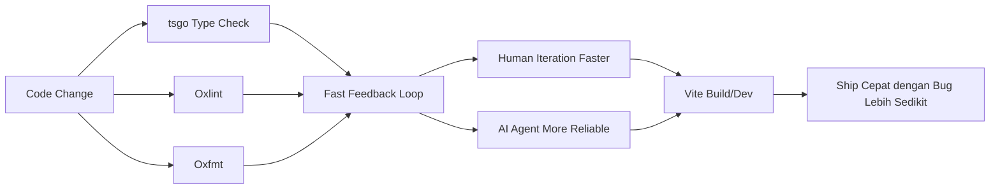
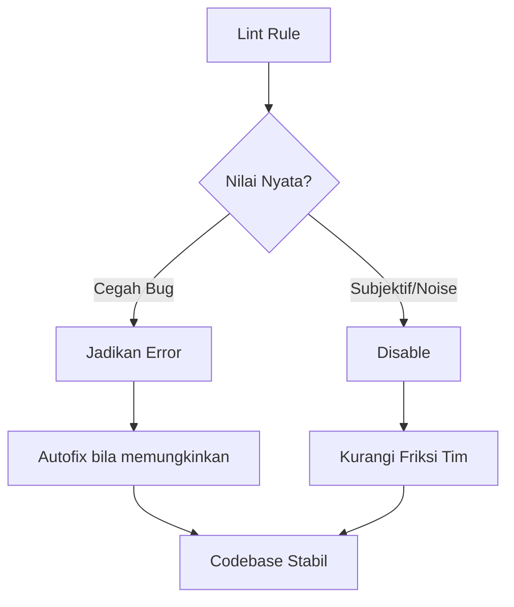
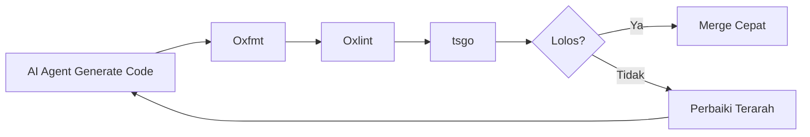

## Kenapa 2026 Jadi Titik Balik Tooling Frontend? 🚀

Kalau 2023–2025 adalah era "AI bisa nulis kode", maka **2026 adalah era "tooling harus cukup cepat untuk mengikuti AI"**.

Insight utamanya sederhana, tapi penting banget:

- **Manusia** butuh umpan balik cepat supaya flow tidak pecah.
- **AI agent** butuh guardrail ketat + loop cepat supaya output-nya tidak ngawur.

Ketika type-checking lambat, linting berisik, formatter inkonsisten, dan script lokal lemot, dua-duanya rugi: developer capek, AI bikin bug lebih banyak.

Artikel ini merangkum framework praktis dari tulisan Christoph Nakazawa (*Fastest Frontend Tooling for Humans & AI*) lalu saya terjemahkan ke strategi implementasi yang bisa langsung dipakai di proyek nyata. ⚙️✨

<Callout type="important" title="Prinsip Inti">
Tooling modern tidak lagi dinilai dari "fiturnya banyak", tapi dari kombinasi:

1. **Kecepatan loop lokal**
2. **Ketegasan aturan kode**
3. **Stabilitas ekosistem**
4. **Kemudahan otomatisasi untuk AI agent**
</Callout>

---

## Arsitektur Stack 2026 (Versi Praktis) 🧩

Stack yang disarankan:

- **Type checking:** `tsgo` (TypeScript Go rewrite)
- **Linting:** `Oxlint`
- **Formatting:** `Oxfmt`
- **Bundling web:** `Vite` (menuju Rolldown)
- **Package manager:** `pnpm`
- **UI layer:** `React` + React Compiler

---

## 1) `tsgo`: TypeScript Go Rewrite (Game Changer) ⚡

### Apa yang berubah?
`tsgo` adalah implementasi TypeScript yang ditulis ulang dalam Go. Klaim praktisnya: **type-checking bisa jauh lebih cepat (bahkan ~10x pada banyak kasus).**

### Kenapa ini besar dampaknya?
Type-checking adalah bottleneck harian. Kalau tiap perubahan butuh nunggu lama, kualitas keputusan coding menurun karena konteks cepat hilang.

### Catatan penting dari praktik lapangan
Dalam sumber, disebutkan `tsgo` sudah dipakai lintas proyek besar, dan menariknya: ada kasus di mana `tsgo` justru menangkap error yang implementasi JS sebelumnya loloskan.

### Langkah migrasi ringkas
1. Install preview:
   - `npm install @typescript/native-preview`
2. Bersihkan flag TypeScript legacy
3. Ganti command `tsc` → `tsgo`
4. Aktifkan editor support VS Code:
   - `"typescript.experimental.useTsgo": true`

<Callout type="tip" title="Strategi Aman Migrasi tsgo">
Jangan migrasi compiler + bundler sekaligus.

Urutan lebih aman:
1) pindah ke Vite/tsdown dulu,
2) baru pindah type-checking ke tsgo.
</Callout>

---

## 2) Prettier → Oxfmt: Formatter Cepat, Konsisten, Realistis ✨

Prettier masih bagus, tapi tantangan tim modern adalah performa dan konsistensi lintas tools.

`Oxfmt` menarik karena:
- cepat,
- punya kemampuan built-in yang biasanya butuh plugin eksternal,
- tetap bisa fallback untuk bahasa di luar JS/TS.

### Kapan pindah ke Oxfmt masuk akal?
- repo medium–large,
- CI lint/format mulai jadi bottleneck,
- tim ingin satu jalur formatting yang lebih ketat.

### Checklist migrasi
- update script npm/pnpm,
- update git hooks,
- hapus config Prettier lama,
- reformat seluruh codebase sekali (one-time normalization).

---

## 3) ESLint → Oxlint: Linting Ketat Tanpa Jadi Lambat 🛡️

ESLint unggul di ekosistem plugin, tapi performa sering jadi isu di skala besar.

`Oxlint` menarik karena mencoba ambil dua dunia:
- performa tinggi (engine modern)
- kompatibilitas lint rule lebih luas (termasuk interop plugin tertentu)

### Mindset yang paling berdampak
Dari praktik konfigurasi ketat (`@nkzw/oxlint-config`), ada prinsip yang sangat relevan:

1. **Error, Never Warn**  
   Warning sering jadi noise. Kalau penting, jadikan error.

2. **Strict & Consistent Style**  
   Banyak cara menulis kode = beban kognitif tinggi. Konsistensi menang.

3. **Prevent Bugs by Design**  
   Blok pola rentan bug sejak awal (misal debug statement tak sengaja masuk production).

4. **Fast Rules First**  
   Pilih aturan yang kuat tapi murah secara performa.

5. **Don’t Over-Police Taste**  
   Kurangi aturan subjektif agar developer tidak melawan tooling.

---

## 4) Optimasi DevX Kecil yang Efeknya Besar 🧠

Selain tiga pilar di atas, ada optimasi kecil yang sering diremehkan tapi dampaknya nyata:

### A. `npm-run-all2` untuk paralelisasi script
Gunakan untuk jalankan `tsgo + oxlint + oxfmt --check` secara paralel dengan output yang tetap rapi.

Contoh konsep:
- `check` = parallel `typecheck + lint + format-check`
- fail fast kalau salah satu gagal

### B. `ts-node` setup yang cepat untuk server dev
Untuk use case tertentu (Node service restart cepat), kombinasi `nodemon + ts-node + swc` masih relevan karena kompromi performa/kompatibilitasnya bagus.

<Callout type="note" title="Prinsip DevX 2026">
DevX bagus bukan soal "tool terbaru", tapi soal **latensi keputusan**.

Semakin cepat error muncul, semakin cepat kualitas meningkat.
</Callout>

---

## 5) Kenapa Ini Relevan untuk AI Coding Agent? 🤖

AI agent coding (termasuk mode semi-otonom) bekerja terbaik saat:

- aturan linting jelas,
- formatting deterministic,
- type system tegas,
- feedback loop singkat.

Kalau guardrail longgar, AI cenderung:
- bikin variasi style tidak perlu,
- melewatkan edge case,
- menghasilkan perbaikan semu yang lolos lokal tapi pecah di CI.

Kalau guardrail ketat + cepat, AI lebih sering:
- menghasilkan patch konsisten,
- refactor lebih aman,
- dan butuh revisi lebih sedikit.

---

## 6) Urutan Implementasi yang Saya Rekomendasikan (Anti Chaos) 🧭

Biar migrasi tidak chaos, gunakan urutan ini:

### Fase 1 — Stabilkan fondasi
- pastikan `pnpm` + `Vite` sehat,
- rapikan script check/build/test.

### Fase 2 — Formatter dulu
- Prettier → Oxfmt,
- lakukan reformat sekali,
- freeze style baru.

### Fase 3 — Linting ketat
- ESLint → Oxlint (atau hybrid sementara bila perlu),
- ubah warning penting jadi error,
- aktifkan autofix rules.

### Fase 4 — Typecheck acceleration
- `tsc` → `tsgo`,
- verifikasi hasil di CI,
- monitor false positive/negative.

### Fase 5 — Optimasi loop harian
- parallel check,
- pre-commit hooks ringan,
- CI fail-fast.

<Callout type="success" title="Outcome yang Harus Dirasakan Tim">
Dalam 2–4 minggu, tim idealnya merasakan:

✅ feedback lokal lebih cepat  
✅ PR lebih kecil dan bersih  
✅ bug styling/lint turun drastis  
✅ AI-assisted coding lebih stabil  
✅ waktu dari "ngetik" ke "merge" makin pendek
</Callout>

---

## 7) Tool yang Tetap Solid di 2026 🧱

Meski banyak tools baru, ada tiga yang tetap jadi tulang punggung:

- **pnpm** → cepat, hemat storage, enak untuk monorepo
- **Vite** → DX terbaik untuk web app modern
- **React** → ekosistem matang + React Compiler bikin performa makin masuk akal

Kuncinya bukan gonta-ganti framework tiap bulan, tapi **membuat pipeline konsisten, cepat, dan ketat**.

---

## 8) Risiko & Antisipasi Saat Migrasi ⚠️

### Risiko umum
- breaking behavior di config lama
- mismatch lint rules antar package
- shock tim karena aturan mendadak terlalu ketat

### Cara mitigasi
- rollout bertahap per package/folder
- pakai baseline lint lalu perketat mingguan
- dokumentasikan aturan inti + contoh sebelum/sesudah

---

## Penutup: Kecepatan Bukan Sekadar "Cepat Build" 🌟

Tooling frontend tercepat di 2026 bukan berarti semua harus "Rust" atau "Go rewrite" lalu selesai.

Makna sebenarnya lebih dalam:

- cepat menemukan kesalahan,
- cepat memahami konteks,
- cepat memperbaiki dengan aman,
- cepat berkolaborasi antara manusia dan AI.

Ketika feedback loop cepat + guardrail ketat, kualitas bukan dikorbankan—justru naik.

Dan di situlah engineering modern menang: **lebih cepat, lebih rapi, lebih bisa dipercaya.** 💫

---

## Template Siap Pakai (Recommended) 🧱

Dari sumber aslinya, berikut template yang bisa langsung dipakai untuk mulai cepat:

1. **Mobile App Template**  
   https://github.com/nkzw-tech/expo-app-template

2. **Web App Template**  
   https://github.com/nkzw-tech/web-app-template

3. **Library Template**  
   https://github.com/nkzw-tech/library-template

4. **Server Template**  
   https://github.com/nkzw-tech/server-template

5. **_fate_ Template**  
   https://github.com/nkzw-tech/fate-template

<Callout type="tip" title="Cara Pilih Template dengan Cepat">
- Kalau fokus produk web → mulai dari **Web App Template**
- Kalau bangun package reusable → pilih **Library Template**
- Kalau backend API/service → pakai **Server Template**
- Kalau mobile-first → ambil **Mobile App Template**

Tujuannya: jangan mulai dari nol kalau bisa mulai dari guardrail yang sudah matang. 🚀
</Callout>

## Referensi 🔗

- Christoph Nakazawa — *Fastest Frontend Tooling for Humans & AI*  
  https://cpojer.net/posts/fastest-frontend-tooling
- Markdown version (untuk dikirim ke LLM)  
  https://cpojer.net/posts/fastest-frontend-tooling.md
- Building Scalable Applications (talk)  
  https://www.youtube.com/watch?v=rxPTEko8J7c&t=36s
- TypeScript Go rewrite  
  https://github.com/microsoft/typescript-go
- Oxlint docs  
  https://oxc.rs/docs/guide/usage/linter.html
- Oxfmt docs  
  https://oxc.rs/docs/guide/usage/formatter.html
- Migrate Prettier → Oxfmt  
  https://oxc.rs/docs/guide/usage/formatter/migrate-from-prettier.md
- Migrate ESLint → Oxlint  
  https://oxc.rs/docs/guide/usage/linter/migrate-from-eslint.md
- @nkzw/oxlint-config  
  https://github.com/nkzw-tech/oxlint-config
- tsdown  
  https://tsdown.dev/
- Rolldown  
  https://rolldown.rs/
- pnpm  
  https://pnpm.io/
- Vite+  
  https://viteplus.dev/
