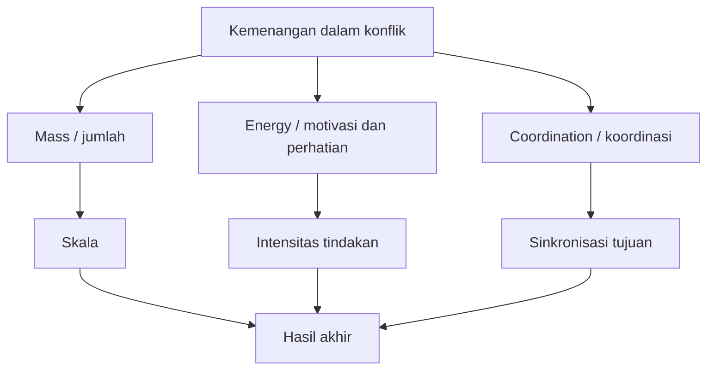
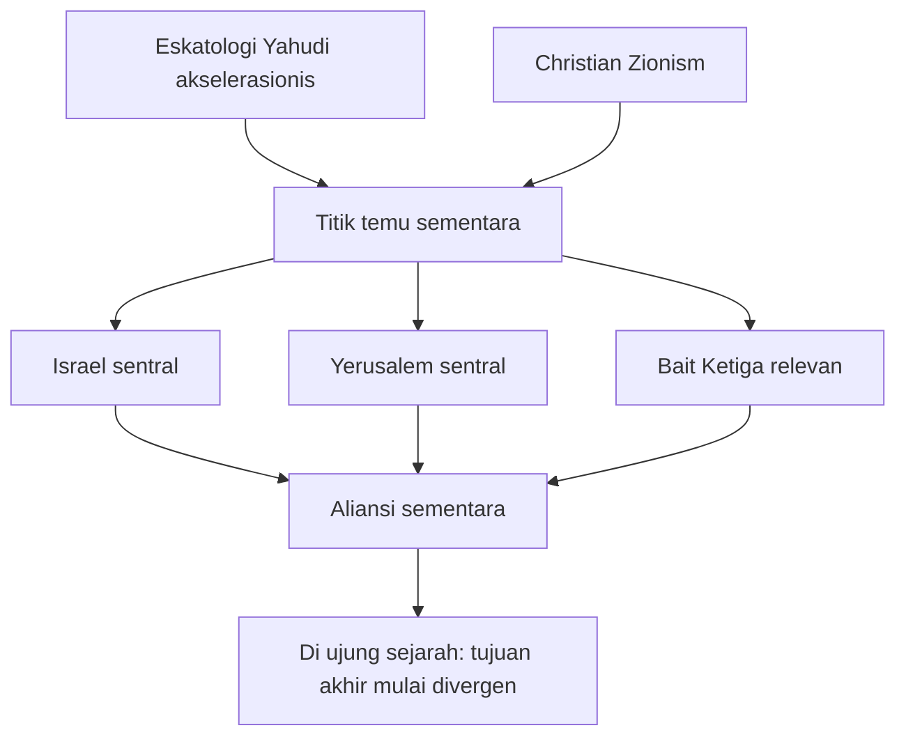
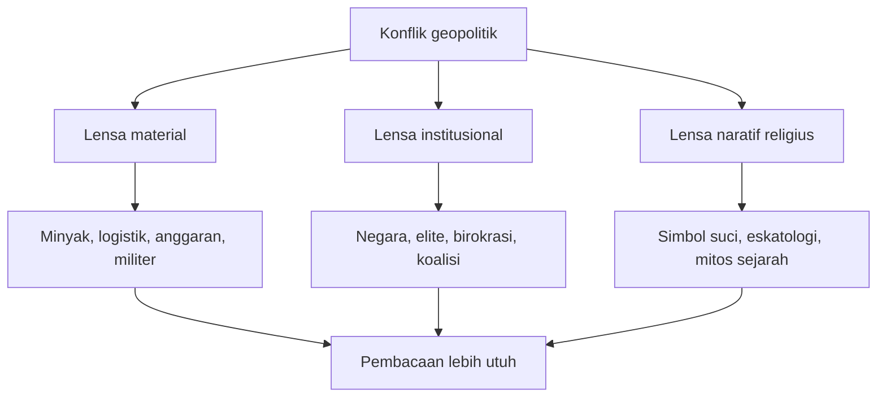
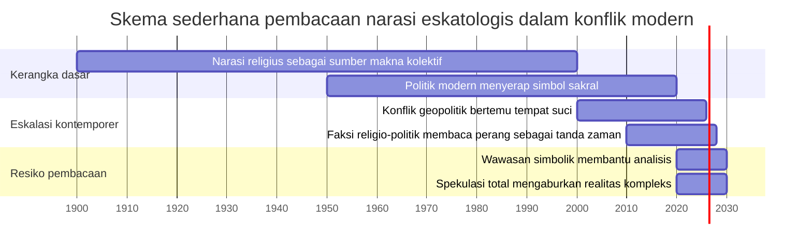

## 🔮 Pendahuluan: Ketika Perang Tidak Lagi Dibaca sebagai Perebutan Wilayah Saja, tetapi sebagai Panggung Narasi Akhir Zaman

Ada satu momen dalam sejarah pemikiran politik di mana analisis realistis (*realist analysis* / analisis berbasis kepentingan, kekuatan, dan institusi) mulai terasa tidak cukup bagi sebagian orang. Mereka melihat perang bukan hanya sebagai benturan negara, bukan hanya sebagai konflik energi, bukan hanya sebagai perebutan jalur dagang atau pengaruh regional, tetapi sebagai bagian dari *script* *(naskah besar)* yang lebih tua, lebih dalam, dan lebih menggetarkan: narasi akhir zaman. 🔮

Di situlah letak daya tarik sekaligus bahaya dari video **Game Theory #12: The Law of Eschatological Convergence**. Video ini tidak puas menjelaskan perang AS–Iran melalui kacamata geopolitik biasa. Ia mengatakan bahwa kalau kita hanya melihat anggaran, senjata, diplomasi, logistik, dan kalkulasi negara, kita akan kehilangan lapisan yang paling penting. Menurut video itu, kunci sesungguhnya justru terletak pada **eschatology** *(eskatologi / ajaran atau narasi tentang akhir zaman, akhir sejarah, dan penyelesaian kosmik dunia)*. ✨

Argumennya sederhana tetapi sangat ambisius: berbagai tradisi religius besar tidak hanya punya cerita tentang asal-usul manusia dan tujuan hidup, tetapi juga punya cerita tentang bagaimana dunia akan berakhir. Dan cerita-cerita itu, kata narator, bukan sekadar kepercayaan pasif. Ia berfungsi seperti **operating system** *(sistem operasi)* masyarakat—yakni kerangka yang menanamkan peran, makna, arah tindakan, serta koordinasi sosial lintas waktu dan lintas generasi. Jika kita tahu bagaimana narasi-narasi itu bertemu, bertumpang tindih, atau *converge* *(berkonvergensi / bertemu pada titik tertentu)*, maka kita bisa memprediksi ke mana dunia bergerak. 🌍

Ini jelas bukan klaim kecil. Ia bukan hanya menghubungkan agama dan politik, tetapi juga mencoba menjelaskan perang modern sebagai hasil dari persilangan berbagai “script eskatologis” yang bekerja diam-diam di balik negara, pemimpin, gerakan, elite, bahkan birokrasi perang. Karena itu, tulisan ini tidak bisa dibaca sekadar sebagai rangkuman video. Ia harus dibedah secara perlahan, kritis, dan jujur. 🧠

Sebab di satu sisi, ada sesuatu yang benar dalam premis dasarnya: manusia memang tidak hidup dari kepentingan material saja. Keyakinan, simbol, mitos, dan horizon religius sering sangat menentukan tindakan kolektif. Negara bisa modern, tetapi manusia yang mengelolanya tetap membawa warisan metafisik, imajinasi sejarah, dan rasa misi. Namun di sisi lain, video ini juga bergerak sangat jauh—ke wilayah yang spekulatif, kadang konspiratif, dan di beberapa bagian menyatukan banyak hal berbeda ke dalam satu narasi besar seolah semuanya pasti menuju satu ujung yang sama. ⚠️

Karena itu, artikel ini akan mengambil posisi yang tegas: **kita akan memperlakukan video ini sebagai objek analisis, bukan sebagai kebenaran final.** Kita akan membedah gagasannya secara detail, menjelaskan istilah-istilah asingnya dalam bahasa Indonesia, menerangkan apa yang tampak kuat dari sudut teori narasi, lalu menunjukkan di mana ia mulai melompat terlalu jauh. Dengan begitu, pembaca bisa memperoleh manfaat intelektualnya tanpa harus menelan mentah-mentah seluruh kerangka yang dibangun di dalamnya.

Kalau harus disederhanakan, pertanyaan besar artikel ini adalah:

> **Benarkah perang modern hanya bisa dipahami jika kita membaca titik temu narasi akhir zaman dari berbagai tradisi religius, atau justru pendekatan seperti ini berguna hanya sampai batas tertentu lalu menjadi berbahaya ketika dipakai sebagai penjelasan total atas geopolitik dunia?**

Dan kalau harus dirumuskan sebagai tesis utama, maka artikel ini berdiri di atas tesis berikut:

> **The Law of Eschatological Convergence menarik sebagai teori karena ia mengingatkan bahwa agama, narasi akhir zaman, dan imajinasi sakral benar-benar dapat memengaruhi koordinasi sosial dan keputusan politik; namun ketika teori ini berubah menjadi kerangka tunggal yang menjelaskan hampir semua konflik sebagai gerak menuju satu skenario apokaliptik, ia mulai kehilangan kehati-hatian analitis dan berisiko mencampur wawasan yang tajam dengan spekulasi yang berlebihan.**

Itulah mengapa pembahasan ini penting. Bukan karena kita harus percaya bahwa semua perang adalah teater akhir zaman, tetapi karena kita perlu memahami bagaimana **narasi religius, simbol suci, dan imajinasi eskatologis** dapat menjadi tenaga politik yang nyata—kadang dalam bentuk yang eksplisit, kadang dalam bentuk yang samar tetapi sangat kuat. 🔥

---

<Callout type="important" title="Tesis utama artikel ini">
Video ini benar dalam satu hal penting: manusia dan masyarakat tidak bergerak hanya oleh kepentingan material, tetapi juga oleh cerita besar tentang tujuan sejarah dan akhir dunia. Namun ia menjadi problematik ketika semua lapisan geopolitik direduksi ke satu skema eskatologis yang terlalu rapi, seolah setiap aktor pasti sedang memainkan naskah apokaliptik yang sama.
</Callout>

---

## 🧭 1. Tiga Prediksi Besar yang Menjadi Tulang Punggung Video Ini

Video ini dibangun di atas tiga prediksi utama yang diklaim akan menentukan bentuk akhir perang:

1. **Amerika Serikat akan mengirim pasukan darat.**
2. **Israel dan AS tidak akan menggunakan senjata nuklir taktis.**
3. **Al-Aqsa / kompleks suci di Yerusalem akan hancur selama perang.**

Dua prediksi pertama sudah dijelaskan di kelas sebelumnya, menurut narator. Pada episode ini, fokus utamanya adalah prediksi ketiga. Dan untuk menjelaskan prediksi itulah, ia memperkenalkan konsep **law of eschatological convergence** *(hukum konvergensi eskatologis)*.

Yang penting dicatat di sini: video ini tidak sekadar membuat tebakan. Ia sedang berusaha membangun model sebab-akibat. Artinya, kehancuran Al-Aqsa tidak diperlakukan sebagai kemungkinan teknis belaka, melainkan sebagai titik yang, menurut narator, “dibutuhkan” oleh banyak narasi religio-politik yang bertemu pada satu lintasan sejarah. 💥

Ini membuat taruhannya tinggi sekali. Karena kalau prediksi itu salah, bukan cuma satu detail yang salah—seluruh model narator jadi goyah. Dan ia sendiri mengakui hal itu secara retoris di video.

---

## 📚 2. Apa Itu Eskatologi? Mengapa Ia Begitu Kuat bagi Individu dan Masyarakat?

Sebelum kita menilai teorinya, kita perlu jelas dulu soal istilah paling penting: **eschatology** *(eskatologi)*. Secara umum, eskatologi adalah ajaran, mitos, atau horizon keyakinan tentang:

- bagaimana sejarah bergerak menuju penutupannya,
- siapa yang akan menang pada akhir zaman,
- apa bentuk penghakiman,
- bagaimana kebaikan dan kejahatan diselesaikan,
- dan seperti apa dunia setelah akhir sejarah atau setelah kemenangan final. 📚

Narator video menekankan bahwa sebagai manusia, kita selalu membawa tiga pertanyaan mendasar:

- dari mana kita datang,
- mengapa kita ada,
- ke mana dunia ini bergerak.

Eskatologi, dalam logikanya, menjawab tiga pertanyaan itu sekaligus. Dan karena itu, ia bukan sekadar cerita religius yang disimpan di ruang ibadah. Ia bisa menjadi **script** *(naskah peran)* yang memberi tahu komunitas apa tugas mereka dalam sejarah, siapa musuh mereka, siapa sekutunya, apa yang harus dipercepat, dan pengorbanan apa yang dianggap sah. 🧩

### Mengapa ini kuat secara sosial?
Karena narasi akhir zaman punya tiga kekuatan besar:

1. **ia memberi makna pada penderitaan**,
2. **ia memberi orientasi pada tindakan kolektif**,
3. **ia menghubungkan generasi sekarang dengan janji masa depan yang sangat besar.**

Dalam arti ini, eskatologi memang bisa menjadi mesin koordinasi. Orang rela bertahan, berkorban, bahkan mati, bukan hanya karena perintah negara, tetapi karena merasa sedang mengambil bagian dalam drama yang melampaui dirinya.

---

## ⚙️ 3. Universal Law of Game Theory versi Video: Mass × Energy × Coordination

Salah satu bagian paling menarik dari video adalah saat ia memperkenalkan formula sederhana untuk menjelaskan kemenangan dalam permainan atau konflik:

**mass × energy × coordination**

Kalau diterjemahkan secara bebas:

- **mass** = jumlah orang atau besarnya basis,
- **energy** = perhatian, motivasi, intensitas, kemauan bertindak,
- **coordination** = kemampuan bekerja serempak, sinkron, dan efektif. ⚙️

Narator bahkan menekankan bahwa **coordination** *(koordinasi)* lebih penting daripada sekadar jumlah. Tim kecil tetapi sangat sinkron bisa mengalahkan massa besar yang kacau. Energi juga lebih penting daripada massa murni, sebab jumlah besar tanpa motivasi hanya menghasilkan kelembaman.

### Ini poin yang sebenarnya kuat
Kalau kita lepaskan dulu dari muatan spekulatif videonya, ide ini cukup masuk akal. Dalam sejarah, banyak kelompok kecil bisa mengubah arah politik atau budaya karena mereka punya:

- visi yang jelas,
- struktur internal kuat,
- motivasi tinggi,
- dan koordinasi lintas jaringan.

Di sinilah video masuk ke langkah berikutnya: **apa alat koordinasi paling kuat dalam sejarah?** Jawabannya menurut narator adalah **narrative** *(narasi)*, dan bentuk narasi paling kuat adalah **eskatologi**.

### Kenapa narasi begitu sentral?
Karena narasi memberi orang peran. Ia mengatakan siapa kawan, siapa lawan, tujuan akhirnya apa, dan apa yang harus dilakukan sekarang. Dalam bahasa narator, narasi menanamkan “script” ke kepala orang-orang. Dan jika banyak orang berbagi script yang sama, mereka lebih mudah bergerak serempak tanpa harus terus-menerus diberi instruksi teknis.

Sampai di sini, teorinya masih cukup masuk akal. Masalah mulai muncul ketika video bergerak dari teori narasi ke peta eskatologi global yang sangat besar dan sangat tegas.

---

## 🧨 4. Dari Narasi ke Eskatologi Ekstrem: Mengapa Video Memilih Versi Paling Radikal?

Salah satu klaim paling menentukan dalam video adalah bahwa untuk memahami arah sejarah, kita tidak boleh melihat versi umum atau moderat dari suatu agama. Kita harus melihat versi **paling ekstrem**, **paling akselerasionis**, dan **paling keras**. 🧨

Alasannya, menurut narator, sederhana: kelompok ekstrem adalah mereka yang bekerja paling keras, paling disiplin, dan paling bersemangat untuk mewujudkan script mereka. Maka walaupun jumlahnya kecil, merekalah yang mendorong arah keseluruhan tradisi.

Ini ide yang tidak sepenuhnya absurd, tetapi juga sangat berbahaya jika dipakai terlalu luas.

### Mengapa tidak sepenuhnya absurd?
Karena memang dalam sejarah, minoritas militan sering punya pengaruh besar. Mereka:

- lebih disiplin,
- lebih fokus,
- lebih ideologis,
- dan sering memanfaatkan kelambanan mayoritas.

### Mengapa juga berbahaya?
Karena dari sini sangat mudah jatuh ke kesimpulan berlebihan:

- seolah kelompok ekstrem otomatis mewakili arah seluruh agama,
- seolah arus utama pasti akan terseret ke mana mereka mau,
- atau seolah semua gerakan kompleks dunia bisa dibaca dari naskah ideologis fringe *(pinggiran)*.

Di sinilah kita perlu jaga nalar. Versi ekstrem memang penting dikaji, tetapi tidak otomatis menjadi “roh sesungguhnya” dari keseluruhan tradisi. Banyak gerakan radikal sangat keras suaranya tetapi lemah daya institusionalnya. Banyak pula yang hanya punya pengaruh parsial, bukan total.

---

## 🕍 5. Bagaimana Video Membaca Tradisi Yahudi: Dari Penebusan ke Akselerasionisme Mesianik

Video kemudian memetakan apa yang ia sebut sebagai eskatologi Yahudi. Dalam versi paling sederhananya, narator mengatakan bahwa ada gagasan tentang:

- ketidaktaatan Israel masa lalu,
- diaspora *(pencar di berbagai negeri)*,
- kebutuhan akan **redemption** *(penebusan / pemulihan spiritual dan historis)*,
- kembalinya bangsa ke Yerusalem,
- datangnya Mesias,
- pembangunan Bait Suci Ketiga,
- dan pemulihan tatanan ilahi di bumi. 🕍

Sampai di titik ini, masih ada nuansa teologis yang cukup klasik. Tetapi lalu video mengatakan bahwa ada versi **accelerationist** *(akselerasionis / ingin mempercepat datangnya peristiwa akhir zaman melalui tindakan manusia)*. Di sinilah penekanannya bergeser:

- jangan tunggu Mesias secara pasif,
- bangun dulu negara Israel,
- pulangkan diaspora,
- bangun Bait Ketiga,
- kalahkan musuh,
- maka Mesias akan datang dengan sendirinya atau dipaksa hadir oleh situasi.

Narator menilai versi inilah yang paling penting karena paling aktif, paling politis, dan paling berbahaya secara geopolitik.

### Catatan kritis penting
Di titik ini, kita harus sangat hati-hati. Tradisi Yahudi sangat kompleks, berlapis, dan penuh perdebatan internal. Menyederhanakannya ke satu garis dari penebusan menuju proyek akselerasionis tentu terlalu kasar. Namun sebagai pembacaan terhadap **faksi tertentu**, video sedang mencoba menunjukkan bahwa ada arus religio-politik yang memadukan simbol Mesianik dengan strategi negara dan proyek teritorial. Dan sejauh dibaca sebagai pembahasan atas arus tertentu, poin ini tidak boleh diabaikan begitu saja.

---

## ✝️ 6. Christian Zionism dalam Video: Sekutu Sementara dengan Tujuan Akhir yang Berbeda

Sesudah itu, video masuk ke **Christian Zionism** *(Zionisme Kristen)*, yang juga disebut dengan istilah teknis **premillennial dispensationalism** *(premilenial dispensasionalisme / kerangka teologi Protestan tertentu tentang tahapan sejarah keselamatan dan akhir zaman)*. ✝️

Versi singkat yang dibangun video kira-kira begini:

- ada rencana ilahi dalam sejarah,
- Israel punya posisi sentral,
- Yerusalem punya fungsi eskatologis,
- pembangunan Bait Ketiga punya makna besar,
- tetapi “Mesias” versi Yahudi itu dalam skema Kristen radikal justru bisa dibaca sebagai **Antichrist** *(antikrist)*,
- lalu Yesus akan datang kembali, terjadi *rapture* *(pengangkatan / pengambilan orang-orang beriman ke hadirat Tuhan)*, dan perang akhir pun mencapai puncaknya.

Yang menarik dari video bukan sekadar isi doktrin itu, tetapi kesimpulan strategisnya: **Zionisme Yahudi dan Zionisme Kristen dapat bekerja bersama pada fase tertentu, meskipun tujuan akhir teologis mereka tidak sama.**

Ini adalah ide tentang **aliansi temporer** *(sementara)*. Dalam bahasa politik: dua aktor dapat bekerja sama karena mereka berbagi milestone *(titik capaian)* tertentu, walaupun horizon akhir mereka berbeda.

Ini poin yang cerdas secara teori. Dalam dunia nyata, aliansi memang sering lahir bukan dari kesamaan total, melainkan dari irisan tujuan jangka menengah.

---

## 🛰️ 7. Freemasonry, Pax Judaica, AI, dan One World Government: Di Mana Video Menjadi Sangat Spekulatif

Bagian ini adalah salah satu titik paling problematik dalam seluruh video. Narator mulai menghubungkan Christian Zionism, Freemasonry, gagasan **Pax Judaica**, AI surveillance state, digital ID, *mark of the beast* *(tanda binatang)*, hingga **one world government** *(pemerintahan dunia tunggal)*. 🛰️

Secara intelektual, di sinilah kita harus sangat disiplin. Ada beberapa lapisan yang sedang dicampur:

1. simbol dan bahasa apokaliptik religius,
2. perkembangan teknologi pengawasan,
3. ketakutan politik terhadap sentralisasi global,
4. serta narasi konspiratif tentang jaringan elite lintas negara.

### Apa yang bisa dianggap serius?
- bahwa teknologi pengawasan memang makin kuat,
- bahwa identitas digital dan sistem keuangan digital memang bisa dipolitisasi,
- bahwa elite transnasional memang ada,
- dan bahwa simbol religius sering dipakai untuk membaca teknologi modern.

### Apa yang mulai terlalu spekulatif?
- ketika semua itu dijahit menjadi satu sistem niat global yang terlalu mulus,
- ketika aktor-aktor yang sangat berbeda diasumsikan bekerja menuju desain tunggal yang sama,
- dan ketika kompleksitas sejarah dipaksa masuk ke satu narasi total.

Jadi, bagian ini penting dibaca bukan sebagai fakta mapan, tetapi sebagai contoh bagaimana eskatologi dapat bersentuhan dengan paranoia politik, kecemasan teknologi, dan imajinasi tentang kerajaan global. Itu sendiri adalah fenomena sosial yang layak dipelajari—tetapi tidak boleh langsung disamakan dengan realitas empiris yang sudah terbukti.

---

## ☪️ 8. Islam, Syiah, Dajjal, dan Respons Eskatologis terhadap Tatanan Global

Video lalu memetakan eskatologi Islam sebagai respons terhadap sistem akhir zaman yang dalam bahasanya dihubungkan dengan **Dajjal** *(figur penyesat besar / antikrist versi Islam)*. ☪️

Dalam versi yang ia sederhanakan:

- akan muncul tatanan besar yang sesat,
- sistem itu akan mewakili kekuasaan palsu,
- lalu Isa / Yesus akan kembali,
- atau dalam bingkai Syiah, peran Imam Mahdi menjadi sentral,
- dan komunitas beriman akan menghadapi konfrontasi akhir dengan kekuatan tersebut.

Narator menilai bahwa di sinilah dunia Islam, khususnya Syiah Iran, masuk ke medan konvergensi: mereka juga punya script akhir zaman, mereka juga membaca konflik global bukan hanya sebagai urusan negara, tetapi sebagai drama moral kosmik. Dan karena itu, perang bisa dibaca bukan cuma sebagai perang pertahanan, tetapi sebagai panggung penggenapan tanda-tanda.

### Di sini ada poin penting
Terlepas dari penyederhanaannya, video benar dalam satu hal: **simbol eskatologis memang hidup dalam banyak tradisi Muslim, termasuk dalam bahasa politik tertentu.** Jadi menganggap semua keputusan aktor Muslim murni sekuler juga keliru.

Tetapi seperti pada tradisi lain, kita harus membedakan antara:

- arus teologis umum,
- bahasa simbolik populer,
- politik negara,
- dan faksi ideologis yang sangat aktif.

Kalau tidak dibedakan, kita akan jatuh ke penyederhanaan besar seolah satu tradisi religius bergerak seperti satu tubuh tunggal.

---

## ⛪ 9. Katolik, Ortodoks, dan “Third Rome”: Ketika Semua Tradisi Dipaksa Masuk ke Satu Peta Besar

Video tidak berhenti di tiga poros tadi. Ia juga memasukkan:

- eskatologi Katolik yang dibaca melalui *City of God* *(Kota Tuhan)*,
- kritik pada Anglo-American order,
- serta eskatologi Ortodoks Rusia melalui ide **Third Rome** *(Roma Ketiga)*, yaitu keyakinan simbolik bahwa Moskwa mewarisi pusat kekristenan imperium setelah Roma dan Konstantinopel. ⛪

Narator kemudian mencoba menarik kesimpulan bahwa berbagai tradisi besar ini punya titik temu tertentu:

- proyek Israel Raya,
- Bait Ketiga,
- anti-Semitisme sebagai pendorong diaspora kembali,
- perang Gog dan Magog,
- melemahnya AS dan China dari panggung akhir,
- perang sipil Amerika,
- dan transformasi besar tatanan global dalam 2–4 tahun.

Di sinilah teori **law of eschatological convergence** mencapai bentuk penuhnya. Dunia tidak lagi dibaca sebagai kumpulan konflik terpisah, tetapi sebagai simpul berbagai script akhir zaman yang saling menumpuk dan saling mendorong ke titik letupan bersama. 🌐

### Secara intelektual, ini megah. Secara metodologis, ini sangat riskan.
Mengapa? Karena semakin banyak tradisi berbeda kita gabungkan ke satu peta raksasa, semakin besar risiko kita:

- memilih hanya data yang cocok,
- mengabaikan perbedaan internal,
- dan memaksa semua gerakan sejarah tampak menuju satu ujung yang sebenarnya belum tentu ada.

---

## 🧠 10. Kekuatan Teori Ini: Mengingatkan Kita bahwa Geopolitik Tidak Pernah Sepenuhnya Sekuler

Kalau saya ambil sisi terbaik dari teori ini, ada beberapa hal yang sangat layak diapresiasi. 🧠

### 10.1 Ia menolak reduksionisme material belaka
Tidak semua konflik bisa dijelaskan hanya dengan minyak, senjata, dan anggaran. Manusia juga bergerak oleh simbol, kitab, tempat suci, dan janji sejarah.

### 10.2 Ia menekankan kekuatan narasi dalam koordinasi sosial
Masyarakat memang lebih mudah bergerak jika mereka merasa sedang menjalankan cerita besar yang memberi makna pada penderitaan dan pengorbanan.

### 10.3 Ia membantu kita melihat bahwa tempat suci bukan sekadar batu
Yerusalem, Al-Aqsa, Dome of the Rock, Temple Mount—semua itu bukan sekadar lokasi geografis. Ia adalah simpul imajinasi sakral. Dan karena itu, nilainya melampaui kalkulasi real estate atau militer biasa.

### 10.4 Ia mengingatkan bahwa elite religio-politik bisa punya horizon yang jauh lebih panjang daripada politisi biasa
Jika seseorang percaya bahwa ia sedang membantu menggenapi sejarah suci, ia bisa berpikir lintas generasi, bukan cuma lintas pemilu.

Semua poin ini penting. Dan justru karena penting, kita tidak boleh menertawakan eskatologi begitu saja sebagai “omong kosong”. Ia bisa sangat nyata efeknya dalam dunia politik.

---

## ⚠️ 11. Kelemahan Besarnya: Saat Wawasan Tajam Bercampur dengan Konvergensi yang Terlalu Dipaksakan

Tetapi di saat yang sama, teori ini punya kelemahan besar yang tidak bisa diabaikan. ⚠️

### 11.1 Ia terlalu cepat menyamakan irisan dengan kesatuan penuh
Dua tradisi bisa punya simbol yang mirip tanpa benar-benar mengarah ke proyek historis yang sama.

### 11.2 Ia terlalu cepat menganggap kelompok ekstrem sebagai motor utama seluruh agama
Kadang benar, tetapi tidak otomatis selalu demikian.

### 11.3 Ia rawan berubah menjadi teori total
Kalau semua peristiwa bisa selalu dimasukkan ke satu peta besar, teori itu menjadi sulit dibantah. Dan teori yang sulit dibantah sering lebih dekat ke mitologi total daripada analisis yang sehat.

### 11.4 Ia mencampur data, tafsir, kutipan, dan lompatan inferensial dalam jarak yang terlalu pendek
Misalnya: ada tokoh berkata sesuatu, lalu itu langsung diperlakukan sebagai bukti arah sejarah dunia. Padahal antara ucapan elite, daya institusional nyata, dan hasil geopolitik ada jarak yang sangat panjang.

### 11.5 Ia berisiko memberi rasa kepastian palsu
Padahal sejarah nyata sering tidak rapi. Ia penuh salah hitung, kebetulan, kontradiksi, dan hasil yang tak diinginkan oleh siapa pun.

Jadi, walaupun teori ini kaya secara simbolik, ia tidak boleh dipakai tanpa rem epistemik *(rem pengetahuan / kehati-hatian metodologis)*.

---

## 🧩 12. Cara Membaca Teori Ini Secara Sehat: Gunakan sebagai Lensa Tambahan, Bukan Lensa Tunggal

Kalau kita ingin tetap adil, cara terbaik membaca teori ini adalah sebagai berikut: **jadikan ia lensa tambahan, bukan lensa tunggal.** 🧩

Artinya, saat melihat konflik besar, kita boleh bertanya:

- simbol sakral apa yang sedang diperebutkan?
- narasi akhir zaman apa yang hidup di benak aktor tertentu?
- faksi religio-politik mana yang sedang aktif?
- bagaimana bahasa teologis dipakai untuk memobilisasi massa?

Tetapi setelah itu, kita tetap harus kembali ke pertanyaan yang lebih konkret:

- siapa punya kapasitas institusional?
- siapa menguasai logistik?
- bagaimana posisi sekutu?
- bagaimana ekonomi bekerja?
- siapa yang sebenarnya bisa mengeksekusi agenda, bukan cuma memimpikannya?

Dengan cara itu, eskatologi tidak diabaikan, tetapi juga tidak dijadikan penjelasan tunggal atas segalanya.

---

## 🌍 13. Apa Relevansinya untuk Dunia Hari Ini?

Terlepas dari kelemahannya, video ini mengajarkan satu hal yang sangat penting untuk zaman sekarang: **modernitas tidak pernah benar-benar menghapus agama dari politik.** 🌍

Yang sering terjadi justru sebaliknya:

- agama berubah bahasa,
- simbol sakral berpindah ke arena nasionalisme,
- eskatologi bercampur dengan teknologi,
- dan keyakinan metafisik muncul kembali dalam bentuk-bentuk politik yang baru.

Itu sebabnya, kalau kita hanya memakai bahasa “rasional-sekuler” untuk membaca semua konflik, kita bisa gagal melihat tenaga batin yang sebenarnya mendorong sebagian aktor. Tetapi kalau kita terlalu larut dalam eskatologi, kita juga bisa kehilangan disiplin analitis.

Maka pelajaran terbaik dari video ini bukan “semua perang adalah perang akhir zaman”, melainkan:

> **dalam banyak konflik besar, terutama yang melibatkan tempat suci, identitas peradaban, dan trauma sejarah, narasi religius bukan ornamen—ia bisa menjadi bahan bakar nyata.**

Dan itu sudah cukup menjadi alasan mengapa kita perlu mempelajarinya secara serius.

---

## 🔚 Kesimpulan: Narasi Akhir Zaman Memang Bisa Menggerakkan Sejarah, tetapi Sejarah Tidak Pernah Sepenuhnya Tunduk pada Satu Narasi

Kalau seluruh pembahasan ini diperas sampai ke intinya, maka hasilnya begini: video **Game Theory #12** menawarkan satu teori yang menggoda karena ia memberi rasa keteraturan pada dunia yang kacau. Ia berkata bahwa di balik perang, ada script. Di balik script, ada eskatologi. Dan di balik eskatologi, ada titik-titik konvergensi yang memungkinkan kita membaca ke mana sejarah bergerak. 🔚

Sebagai latihan berpikir, ini sangat menarik. Sebagai provokasi intelektual, ini kuat. Sebagai pengingat bahwa politik modern tidak bebas dari agama, ini bahkan penting. Tetapi sebagai model total yang menjelaskan hampir seluruh geopolitik dunia, ia terlalu percaya diri dan terlalu menyatukan hal-hal yang sering justru bertabrakan satu sama lain.

Maka posisi yang paling sehat adalah posisi ganda:

- **ya**, narasi eskatologis sungguh bisa menjadi tenaga koordinasi yang besar;
- **ya**, tempat suci dan simbol akhir zaman benar-benar bisa memengaruhi keputusan politik;
- tetapi **tidak**, itu tidak berarti semua aktor sedang memainkan satu rencana metafisik yang sama secara sadar dan terkoordinasi.

Pada akhirnya, sejarah bergerak melalui campuran yang jauh lebih berantakan:

- keyakinan,
- ketakutan,
- birokrasi,
- propaganda,
- kepentingan ekonomi,
- momentum politik,
- dan kadang kebodohan biasa.

Karena itu, mungkin satu kalimat paling jujur yang bisa kita bawa pulang dari seluruh pembahasan ini adalah:

> **Narasi akhir zaman memang bisa memberi arah pada tindakan manusia, tetapi manusia yang bergerak di dalam sejarah tetaplah makhluk yang campur-aduk—setengah rasional, setengah simbolik, setengah strategis, setengah terseret oleh cerita yang lebih besar dari dirinya.**

Dan justru karena itu, membaca perang hanya sebagai geopolitik sempit terlalu dangkal, tetapi membaca perang hanya sebagai penggenapan eskatologi juga terlalu sederhana. Kearifan ada di antara keduanya. 🔥

---

## Glosarium istilah asing + padanan Indonesia

| Istilah | Padanan / Penjelasan |
|---|---|
| eschatology | eskatologi; ajaran atau narasi tentang akhir zaman dan akhir sejarah |
| convergence | konvergensi; titik temu atau pertemuan beberapa alur menjadi satu simpul |
| script | naskah; pola tindakan yang dianggap harus dijalankan dalam sejarah |
| operating system | sistem operasi; metafora untuk kerangka dasar yang mengatur cara suatu masyarakat berpikir dan bertindak |
| accelerationist | akselerasionis; pihak yang ingin mempercepat datangnya peristiwa besar atau akhir zaman |
| redemption | penebusan / pemulihan; proses kembali lurus, diselamatkan, atau dipulihkan |
| diaspora | diaspora; komunitas yang tercerai dari tanah asalnya |
| messiah / messianic | mesias / mesianik; figur penyelamat atau horizon yang berkaitan dengan kedatangannya |
| antichrist | antikrist; figur penyesat besar dalam beberapa tradisi eskatologis |
| rapture | pengangkatan; konsep dalam sebagian tradisi Kristen tentang orang beriman yang diangkat |
| one world government | pemerintahan dunia tunggal; gagasan tentang satu otoritas global |
| heuristic | heuristik; alat bantu berpikir yang berguna meski tidak selalu sepenuhnya akurat |
| fringe | pinggiran; arus kecil yang tidak mewakili arus utama |
| epistemic caution | kehati-hatian epistemik; disiplin agar tidak terlalu cepat menganggap tafsir sebagai fakta |

---

---

<Callout type="quote" title="Satu kalimat untuk mengingat seluruh artikel ini">
Eschatological convergence adalah gagasan yang menarik karena ia melihat agama sebagai tenaga koordinasi sejarah; tetapi ia menjadi berbahaya saat dipakai sebagai kunci tunggal yang seolah dapat membuka seluruh teka-teki geopolitik dunia.
</Callout>

---

<YouTube url="https://www.youtube.com/watch?v=spg58Glfz68" title="Game Theory #12: The Law of Eschatological Convergence" />

---

<Callout type="cite" title="Referensi">
Sumber utama: transkrip video *Game Theory #12: The Law of Eschatological Convergence* dari kanal YouTube.
</Callout>
