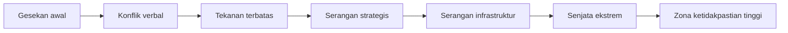
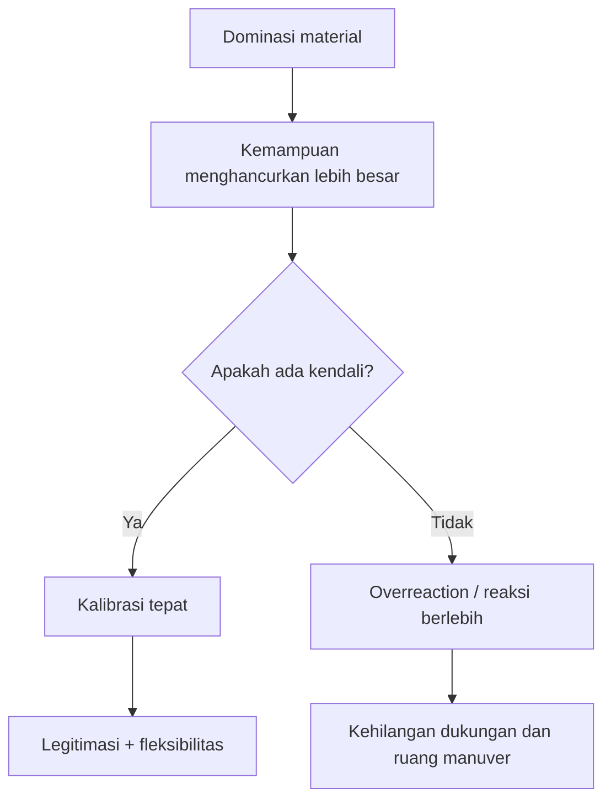
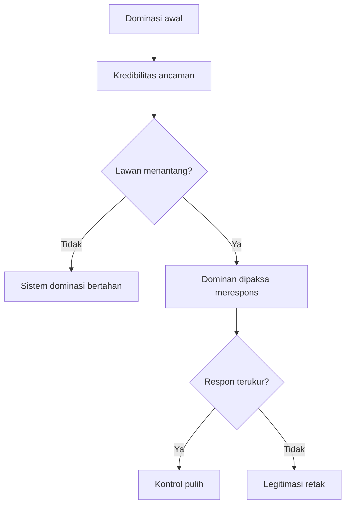
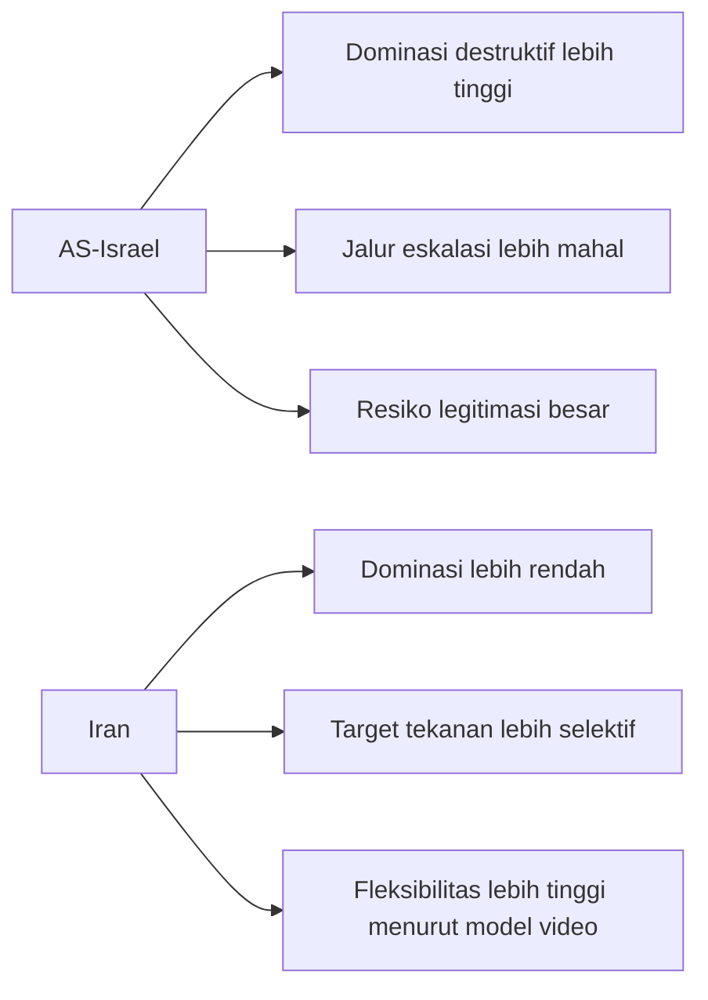
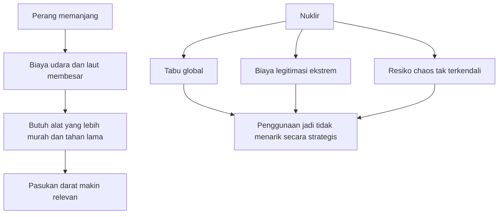
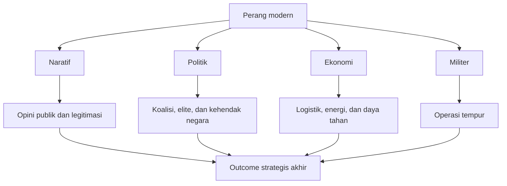
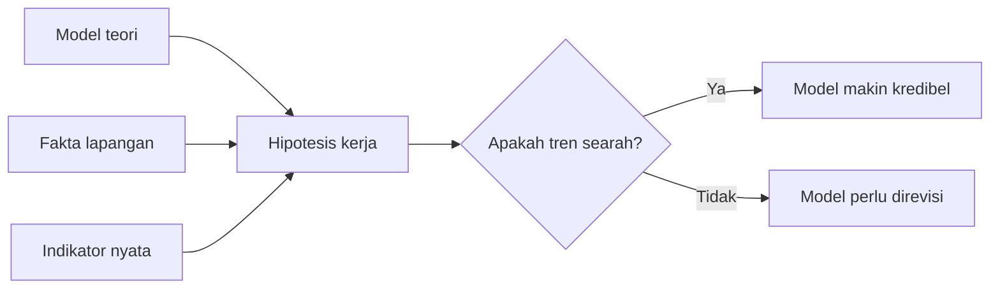
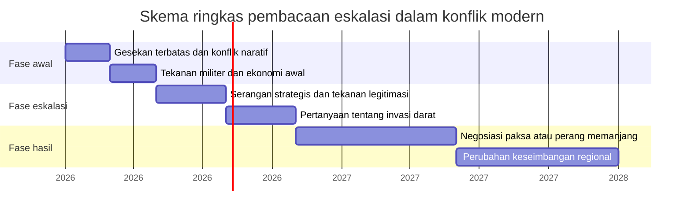

## ⚔️ Pendahuluan: Perang Tidak Selalu Dimenangkan oleh yang Paling Kuat, tetapi Sering oleh yang Paling Mampu Mengendalikan Eskalasi

Ketika orang awam melihat perang, naluri pertama biasanya sederhana: siapa yang punya senjata lebih canggih, siapa yang punya bom lebih besar, siapa yang punya anggaran militer lebih tebal, dialah yang tampak akan menang. Dalam banyak kasus, intuisi itu memang tidak sepenuhnya salah. Tetapi video *Game Theory #11: The Law of Escalation* yang menjadi sumber tulisan ini justru menantang intuisi dasar tersebut. ⚔️

Di dalam transkrip itu, perang AS–Iran tidak dibaca pertama-tama sebagai benturan dua kekuatan material semata, melainkan sebagai permainan bertingkat yang diatur oleh **eskalasi**, **kendali**, **kalibrasi**, dan **biaya politik**. Artinya, pertanyaan besar bukan sekadar siapa yang lebih kuat di atas kertas, tetapi siapa yang lebih mampu menaikkan atau menahan konflik dengan cara yang paling menguntungkan bagi tujuan jangka panjangnya. 🧠

Inilah titik yang membuat analisis ini menarik. Video tersebut tidak hanya menanyakan apakah AS akan mengirim pasukan darat atau apakah senjata nuklir akan dipakai. Ia mencoba membangun model yang lebih ambisius: bahwa hasil perang sangat ditentukan oleh bagaimana tiap aktor membaca *escalation ladder* *(tangga eskalasi)* dan bagaimana mereka memosisikan diri dalam relasi dengan publik, sekutu, musuh, ekonomi global, serta batas-batas legitimasi. 🌍

Tentu ada catatan penting sejak awal. Seperti banyak model geopolitik yang lahir dari kombinasi teori permainan dan pembacaan sejarah strategis, analisis ini juga membawa unsur spekulatif. Ia kuat sebagai alat berpikir, tetapi belum tentu tepat sebagai ramalan literal. Karena itu, artikel ini tidak akan sekadar menyalin isi video, melainkan membedahnya lebih runtut, lebih hati-hati, dan lebih mendalam dalam bahasa Indonesia.

Kalau disederhanakan, pertanyaan besar yang diajukan video ini adalah:

> **Dalam konflik modern, apakah dominasi senjata otomatis berarti keunggulan strategis, atau justru pihak yang lebih fleksibel dan lebih tenang dalam mengelola eskalasi yang pada akhirnya punya peluang lebih besar untuk memaksa hasil?**

Itulah tema inti tulisan ini. Kita akan membahas secara mendalam:

- apa itu *law of escalation* *(hukum eskalasi)*,
- mengapa video ini membedakan **dominance** *(dominasi)* dari **control** *(kendali)*,
- kenapa invasi darat diprediksi lebih mungkin daripada penggunaan nuklir,
- bagaimana perang dibaca bukan cuma secara militer tetapi juga secara naratif, politik, dan ekonomi,
- serta di mana batas dan kelemahan model ini.

Kalau harus diringkas sebagai tesis utama, maka artikel ini berdiri di atas tesis berikut:

> **The Law of Escalation, sebagaimana dibaca dalam video ini, adalah gagasan bahwa kemenangan perang tidak terutama ditentukan oleh kapasitas destruksi tertinggi, melainkan oleh kemampuan mengendalikan ritme kenaikan konflik, menjaga legitimasi, memelihara fleksibilitas strategi, dan memaksa lawan masuk ke jalur eskalasi yang paling mahal bagi dirinya sendiri.**

Dan justru karena itu, analisis ini terasa relevan bukan hanya untuk memahami konflik AS–Iran, tetapi juga untuk memahami bagaimana perang modern bekerja secara umum: bukan sebagai garis lurus dari serangan ke kemenangan, melainkan sebagai permainan tekanan yang berjalan di banyak lapisan sekaligus. 🔥

---

<Callout type="important" title="Tesis utama artikel ini">
Dalam perang modern, dominasi senjata memang penting, tetapi tidak otomatis menghasilkan kemenangan strategis. Yang lebih menentukan adalah siapa yang mampu mengendalikan tangga eskalasi, menjaga legitimasi, mengatur tempo konflik, dan memaksa lawan membayar biaya politik, ekonomi, dan moral yang semakin mahal.
</Callout>

---

## 🧭 1. Tiga Pertanyaan Besar yang Menjadi Kerangka Video Ini

Video ini sejak awal menyederhanakan konflik menjadi tiga pertanyaan utama:

1. **Apakah Amerika Serikat akan meluncurkan invasi darat?**
2. **Apakah senjata nuklir akan digunakan?**
3. **Bagaimana posisi Al-Aqsa / Temple Mount dalam dinamika eskalasi berikutnya?**

Ini adalah cara berpikir yang cukup efektif. Dalam teori permainan, kadang kompleksitas dunia nyata memang perlu direduksi menjadi beberapa *decision points* *(titik keputusan)* yang paling menentukan arah keseluruhan permainan. Dengan begitu, model tidak tenggelam dalam kebisingan informasi harian. 🧩

Yang menarik, video ini tidak sekadar menyusun pertanyaan, tetapi langsung memberi prediksi: **ya** untuk invasi darat, **tidak** untuk nuklir, dan **ya** untuk skenario ketiga yang berkaitan dengan Al-Aqsa. Sesudah itu, narasumber membangun pembenaran teoritisnya.

Di sini kita perlu hati-hati. Dalam ilmu analisis strategis, membuat prediksi tegas memang berguna karena memaksa model diuji realitas. Tetapi konsekuensinya besar: kalau prediksi terlalu deterministik, model bisa terdengar kuat secara retoris tetapi rapuh secara metodologis. Itu sebabnya, sepanjang artikel ini, kita akan terus memisahkan antara **nilai heuristik** *(kegunaan sebagai alat memahami)* dan **nilai prediktif** *(ketepatan ramalan literal)*.

---

## 🪜 2. Apa Itu *Escalation Ladder*? Memahami Tangga Eskalasi dengan Cara yang Tidak Dangkal

Istilah paling penting dalam video ini adalah **escalation ladder** *(tangga eskalasi)*. Secara sederhana, ini adalah gagasan bahwa konflik tidak langsung melompat ke bentuk tertinggi, tetapi biasanya naik tahap demi tahap. 🪜

Dalam analogi yang dipakai video, dua orang yang bertengkar tidak langsung tiba-tiba saling menembak. Biasanya ada urutan:

- gesekan kecil,
- saling menyalahkan,
- hinaan,
- dorongan,
- pukulan,
- senjata tajam,
- lalu senjata yang lebih mematikan.

Analogi ini tampak sederhana, tetapi penting karena memberi satu pesan besar: **eskalasi adalah proses bertingkat yang dibentuk bukan hanya oleh kekuatan, tetapi juga oleh emosi, persepsi, dan konteks sosial.**

### Mengapa penting?
Karena dalam perang antarnegara, naiknya eskalasi juga jarang terjadi dalam ruang hampa. Setiap langkah dipantau oleh:

- publik domestik,
- sekutu,
- musuh,
- pasar,
- media,
- dan hukum internasional.

Jadi tindakan militer tidak pernah murni militer. Ia selalu membawa beban penjelasan. Ia selalu perlu dibaca oleh orang lain. Ia selalu memiliki biaya legitimasi.

### Tiga pendorong naiknya eskalasi
Dalam video, ada tiga faktor pendorong utama yang disebutkan:

- **emosi**,
- **kekuatan**,
- **akal / logika**.

Emosi memberi dorongan untuk bereaksi. Kekuatan memberi kapasitas untuk menaikkan tekanan. Logika memberi arah agar reaksi tidak menjadi bunuh diri strategis. Di sinilah muncul satu ide sangat penting: **eskalasi yang efektif bukan eskalasi yang paling cepat, tetapi yang paling terukur.**

---

## 🎯 3. Dominasi Bukan Segalanya: Mengapa Video Ini Mengutamakan *Control* daripada *Dominance*

Jantung paling penting dari video ini adalah kalimat: **“control is more important than dominance.”** Dalam bahasa Indonesia, artinya: *kendali lebih penting daripada dominasi.* 🎯

### Apa yang dimaksud dominasi?
Dominasi berarti keunggulan material atau koersif. Misalnya:

- senjata lebih kuat,
- sistem pertahanan lebih canggih,
- kapasitas destruksi lebih besar,
- atau ancaman yang lebih menakutkan.

Secara intuitif, orang akan mengira dominasi cukup untuk memenangkan perang. Tetapi video ini membantah asumsi itu.

### Apa yang dimaksud kendali?
Kendali berarti kemampuan untuk:

- memilih kapan bertindak,
- memilih seberapa jauh menaikkan eskalasi,
- mengatur ritme serangan,
- menjaga citra diri sebagai pihak yang masih bisa dibenarkan,
- dan menutup atau membuka opsi sesuai kebutuhan strategis.

Dengan kata lain, **dominasi itu soal punya palu besar; kendali itu soal tahu kapan memukul, kapan menahan, dan kapan memaksa lawan memukul dirinya sendiri.** 🧠

Video ini memakai istilah **calibration** *(kalibrasi)*, yaitu penyesuaian tekanan secara terukur. Ini penting sekali. Dalam konflik, pihak yang terlalu cepat bereaksi keras bisa kehilangan legitimasi. Sebaliknya, pihak yang tampak lebih tenang, lebih disiplin, dan lebih terukur bisa memaksa lawan terlihat brutal, panik, atau sembrono di mata penonton.

---

## 🧱 4. Analogi Bully dan New Kid: Sederhana, tetapi Tajam

Video lalu memakai analogi klasik: seorang *bully* *(perundung)* yang selama ini menguasai sekolah dan seorang *new kid* *(anak baru)* yang tidak tunduk pada aturan informal tersebut. 🧱

Tujuan analogi ini sederhana: menunjukkan bahwa kekuasaan tidak bertahan hanya karena kekuatan fisik, tetapi karena **kredibilitas ancaman**. Selama semua orang percaya si bully pasti bisa menghancurkan siapa pun, sistem ketakutan bertahan. Tetapi begitu ada satu orang yang tidak bermain menurut aturan itu, lalu survive, aura dominasi si bully mulai retak.

### Pelajaran penting dari analogi ini
1. Kekuasaan selalu dilihat oleh penonton.
2. Kredibilitas bisa runtuh jika biaya menegakkannya terlalu besar.
3. Lawan yang lebih lemah bisa menang jika ia memaksa pihak dominan bereaksi berlebihan.
4. Kadang kemenangan bukan soal menghancurkan musuh, tetapi membuat musuh menghancurkan legitimasi dirinya sendiri.

Tentu analogi ini menyederhanakan realitas. Negara bukan anak sekolah, dan geopolitik bukan lorong kantin. Tetapi sebagai model intuitif, analogi ini membantu menjelaskan satu hal penting: **ketakutan publik dan persepsi kredibilitas sering sama pentingnya dengan kekuatan keras itu sendiri.**

---

## 🛡️ 5. Membaca Tangga Eskalasi AS–Israel dalam Video: Jalur yang Linear, Blunt, dan Mahal

Menurut video ini, eskalasi dari pihak AS–Israel dibaca relatif linear. Urutannya kira-kira seperti ini:

1. **Decapitation** *(serangan pemenggalan kepemimpinan / pembunuhan figur pemimpin)*
2. Serangan terhadap target militer
3. Embargo ekonomi
4. Serangan pada infrastruktur sipil
5. Penggunaan senjata rahasia
6. Senjata kimia/biologi
7. Nuklir

Ada dua pesan besar yang ingin dibangun video dari urutan ini.

### Pertama: eskalasi tinggi perlu jalur pembenaran
Narator menolak ide bahwa nuklir bisa langsung dipakai begitu saja. Menurut logikanya, sebelum sampai ke sana harus ada tahapan yang membentuk pembenaran politik dan psikologis. Karena kalau melompat terlalu cepat, tabu global belum cukup terkikis.

### Kedua: jalur ini mahal dan kaku
Video menilai model serangan AS cenderung **blunt** *(tumpul / kurang fleksibel)*. Maksudnya, pilihan tekanannya besar tetapi relatif kasar: ketika menyerang, serangannya menimbulkan biaya legitimasi yang besar juga. Jika serangan ke infrastruktur sipil malah menyatukan rakyat Iran di belakang pemerintahnya, maka strategi itu bisa berbalik arah.

Di sini, narator mencoba menunjukkan bahwa **kapasitas naik lebih tinggi di tangga eskalasi tidak otomatis berarti posisi lebih baik.** Justru kadang semakin tinggi pilihan destruktif yang dimiliki, semakin berat biaya politik untuk menggunakannya.

---

## 🎯 6. Ladder Iran dalam Video: Bukan Lebih Kuat, tetapi Dianggap Lebih Fleksibel

Video kemudian membandingkan dengan Iran. Iran diakui tidak memiliki eskalasi setinggi AS–Israel karena tidak punya senjata nuklir atau kemampuan proyeksi global yang setara. Tetapi menurut video, Iran punya sesuatu yang lain: **strategic flexibility** *(fleksibilitas strategis)*. 🎯

Artinya, Iran dinilai bisa lebih selektif dalam memilih titik tekanan:

- target militer,
- jalur energi,
- choke point maritim,
- tekanan ekonomi regional,
- dan serangan balasan terbatas yang bisa disesuaikan dengan perilaku lawan.

Dalam logika video, inilah yang membuat Iran dianggap punya **escalation control** *(kendali eskalasi)* lebih baik, meskipun tidak punya **escalation dominance** *(dominasi eskalasi)* setinggi lawannya.

### Ini poin yang cerdas, tapi juga kontroversial
Cerdas, karena ia memisahkan antara **kemampuan naik tinggi** dan **kemampuan mengatur tempo**. Kontroversial, karena realitas strategis jauh lebih rumit daripada sekadar siapa yang lebih fleksibel secara teori. Fleksibilitas juga tergantung pada:

- kapasitas logistik,
- keberlanjutan ekonomi,
- moral publik,
- tekanan dari sekutu,
- dan efek balasan tidak langsung.

Namun sebagai kerangka berpikir, ide ini tetap kuat: **kadang pihak yang tampak lebih lemah justru punya lebih banyak opsi manuver karena ia tidak terbebani ekspektasi sebagai hegemon global.**

---

## 🚶 7. Mengapa Video Ini Menyimpulkan Invasi Darat Lebih Mungkin daripada Nuklir?

Di sinilah argumentasi video menjadi paling berani. Ia mengatakan: **pasukan darat kemungkinan besar akan dipakai, sedangkan nuklir justru tidak.** 🚶

### Logika pertama: perang panjang butuh struktur biaya yang realistis
Narator memperkenalkan konsep **cost pyramid** *(piramida biaya)*. Menurutnya, perang yang berkelanjutan tidak bisa terlalu lama bergantung pada alat tempur yang paling mahal. Dalam logika itu:

- infanteri lebih murah,
- kendaraan lapis baja lebih mahal,
- angkatan laut lebih mahal lagi,
- dan kekuatan udara sangat mahal.

Maka jika perang berubah menjadi perang panjang, tekanan akan mendorong negara kembali ke komponen termurah dan paling mudah direproduksi, yaitu pasukan darat.

### Logika kedua: nuklir terlalu mahal secara politik
Sebaliknya, nuklir dianggap tidak sesuai dengan kepentingan strategis banyak pemain. Alasannya:

- ada tabu geopolitik yang sangat kuat,
- penggunaan nuklir bisa memicu delegitimasi global,
- dan ia justru dapat menutup banyak ruang permainan politik yang masih ingin dipertahankan oleh para aktor.

Di sini video mengambil posisi yang cukup tajam: **nuklir bukan alat yang paling rasional untuk pemain yang masih ingin mempertahankan narasi, koalisi, dan ruang manuver pasca-perang.**

---

## 🌐 8. Empat Dimensi Perang: Mengapa Militer Saja Tidak Cukup untuk Membaca Konflik Modern

Salah satu bagian terbaik dari video ini adalah ketika perang dipecah menjadi empat dimensi utama:

1. **naratif**,
2. **politik**,
3. **ekonomi**,
4. **militer**.

Ini sangat penting. Sebab banyak orang melihat perang hanya sebagai duel rudal dan tank. Padahal dalam konflik modern, pertanyaan seperti berikut sering sama pentingnya:

- siapa yang menang di opini dunia?
- siapa yang terlihat sebagai agresor?
- siapa yang mulai kehilangan dukungan politik domestik?
- siapa yang ekonominya lebih dulu kelelahan?
- siapa yang masih bisa menjaga koalisi?

Dengan kata lain, perang modern adalah konflik multi-lapis. Kadang pihak yang unggul di medan tempur justru kalah dalam dimensi legitimasi. Kadang pihak yang kalah secara taktis justru menang secara politis. 🌐

Inilah sebabnya video menolak simplifikasi seperti, “kalau bisa pakai nuklir, kenapa tidak?” Karena perang tidak berjalan dalam tabung hampa. Setiap tindakan militer selalu dibatasi oleh dimensi lain yang sama-sama nyata.

---

## 🧪 9. Kekuatan Teori Ini: Mengajarkan Kita Bahwa Eskalasi Adalah Soal Psikologi, Legitimasi, dan Tempo

Kalau saya ambil sisi terbaik dari video ini, ada beberapa kekuatan yang patut diapresiasi. 🧪

### 9.1 Ia memaksa kita keluar dari materialisme strategis yang terlalu dangkal
Banyak analisis publik terlalu terpaku pada data senjata. Video ini mengingatkan bahwa perang juga soal persepsi, justifikasi, dan pengelolaan jalur keputusan.

### 9.2 Ia menekankan pentingnya tempo
Perang bukan cuma soal apa yang dilakukan, tetapi kapan dilakukan. Dua tindakan yang sama bisa memiliki dampak sangat berbeda jika dilakukan dalam momen politik yang berbeda.

### 9.3 Ia menyoroti kendala pemain dominan
Aktor hegemon tidak selalu paling bebas. Justru karena ia dominan, ia harus menjaga wajah, kredibilitas, narasi, dan jaringan sekutunya. Kadang yang lebih kuat justru lebih terikat.

### 9.4 Ia mengingatkan bahwa kemenangan bisa berarti memaksa lawan masuk ke jalur paling mahal
Itu pelajaran besar dalam teori permainan. Kadang kemenangan bukan menghancurkan musuh langsung, tetapi membuat musuh membayar harga yang tidak sanggup ia tanggung dalam jangka panjang.

---

## ⚠️ 10. Kelemahan Teori Ini: Di Mana Video Mulai Terlalu Deterministik

Meski menarik, video ini juga punya kelemahan serius yang harus kita catat. ⚠️

### 10.1 Terlalu percaya diri pada prediksi biner
Narator menyatakan bahwa kalau salah satu prediksinya meleset, maka seluruh modelnya runtuh. Secara retoris ini terdengar tegas, tetapi secara metodologis terlalu kaku. Model strategis yang baik justru biasanya memberi rentang probabilitas, bukan kepastian hitam-putih.

### 10.2 Analogi sosialnya terlalu bersih dibanding dunia nyata
Model bully vs anak baru membantu menjelaskan prinsip psikologis, tetapi dunia nyata jauh lebih rumit. Negara bukan individu tunggal. Mereka terdiri dari birokrasi, faksi, militer, pasar, opini publik, elite ekonomi, dan tekanan eksternal.

### 10.3 Rasionalitas pemain sering tidak sekoheren yang diasumsikan
Video cenderung memandang semua pihak sebagai aktor strategis yang sangat sadar tujuan. Padahal dalam politik nyata, keputusan perang sering juga dipengaruhi oleh:

- tekanan pemilu,
- rivalitas elite,
- ego pemimpin,
- kebingungan birokrasi,
- dan informasi yang tidak lengkap.

### 10.4 Eskalasi tidak selalu harus berjalan linear
Dalam praktik, memang ada pola bertahap. Tetapi sejarah juga menunjukkan bahwa kejutan, salah kalkulasi, serangan balasan tak terduga, atau kecelakaan strategis bisa mempercepat lompatan konflik secara tidak linear.

Jadi, teori ini sangat berguna sebagai peta, tetapi berbahaya jika diperlakukan sebagai mesin prediksi yang terlalu percaya diri.

---

## 🧠 11. Cara Membaca Video Ini dengan Sehat: Pakai Sebagai Peta, Bukan Sebagai Wahyu

Kalau kita ingin mengambil manfaat maksimal dari video ini, posisi terbaik adalah ini: **pakai ia sebagai alat berpikir, bukan sebagai kitab ramalan.** 🧠

Artinya, saat membaca model seperti ini, kita sebaiknya terus memeriksa indikator nyata:

- bagaimana respons parlemen dan elite domestik,
- bagaimana reaksi pasar energi,
- bagaimana perubahan bahasa diplomatik,
- bagaimana posisi sekutu,
- dan apakah serangan-serangan berikutnya memperluas atau justru mempersempit legitimasi pelaku.

### Tiga langkah membaca secara aman
1. **Pisahkan model dari fakta lapangan.**
2. **Pantau apakah indikator politik, ekonomi, dan militer bergerak searah.**
3. **Jangan tertipu gaya yakin 100%; lihat struktur argumennya, bukan hanya nada suaranya.**

---

## 🇮🇩 12. Kenapa Ini Penting untuk Pembaca Indonesia?

Mungkin ada yang bertanya: kenapa pembaca Indonesia perlu repot memahami model seperti ini? Jawabannya sederhana: konflik global hari ini tidak tinggal di kawasan asalnya. Dampaknya cepat merembet ke mana-mana. 🇮🇩

Kalau eskalasi membesar, implikasinya bisa terasa pada:

- harga energi,
- jalur perdagangan,
- stabilitas finansial,
- sentimen pasar,
- dan suhu politik global.

Tetapi yang lebih penting dari dampak ekonominya adalah dampak intelektualnya. Model seperti ini melatih kita untuk tidak membaca perang secara kekanak-kanakan. Ia menolong kita menyadari bahwa konflik modern selalu punya lapisan:

- lapisan moral,
- lapisan simbolik,
- lapisan ekonomi,
- dan lapisan persepsi.

Maka literasi geopolitik bukan soal ikut menjadi komentator sok yakin, melainkan soal belajar bahwa dalam dunia nyata, tindakan keras sering dibatasi oleh biaya yang justru tidak kelihatan di permukaan.

---

## 🔚 Kesimpulan: Hukum Eskalasi Mengajarkan bahwa Kemenangan Tidak Selalu Ada di Ujung Senjata Terbesar

Kalau seluruh isi artikel ini diperas sampai inti, maka pelajaran terbesarnya adalah ini: **dalam perang modern, pihak yang paling destruktif belum tentu pihak yang paling unggul secara strategis.** 🔚

Dominasi memang memberi keunggulan. Tetapi tanpa kendali, dominasi bisa berubah menjadi jebakan. Tanpa kalibrasi, kekuatan besar bisa mendorong lawannya menjadi lebih solid. Tanpa legitimasi, kemenangan taktis bisa berubah menjadi kekalahan jangka panjang.

Itulah mengapa video ini menarik. Ia mengajak kita berpikir bahwa perang bukan hanya soal siapa paling tinggi di tangga kekuatan, tetapi siapa yang paling mampu mengatur cara naik, cara berhenti, dan cara memaksa lawan masuk ke anak tangga yang paling merugikan baginya.

Tentu model ini bukan tanpa cacat. Ia terlalu percaya diri di beberapa bagian, terlalu linear di bagian lain, dan kadang menyederhanakan keragaman aktor menjadi pola yang terlalu rapi. Tetapi justru karena itu ia tetap berharga: bukan sebagai jawaban final, melainkan sebagai alat untuk memaksa kita berpikir lebih tajam.

Dan mungkin itulah satu kalimat paling sehat yang bisa kita tarik dari seluruh pembahasan ini:

> **Perang tidak hanya dimenangkan oleh yang paling kuat, tetapi sering oleh yang paling mampu menahan diri, membaca ritme, dan memaksa lawan salah melangkah.**

Kalau pelajaran itu kita pegang, maka video ini menjadi lebih dari sekadar komentar geopolitik. Ia menjadi latihan untuk memahami bagaimana kekuasaan, legitimasi, dan strategi bekerja dalam dunia yang jauh lebih rumit daripada sekadar siapa punya bom paling besar. 🔥

---

## Glosarium istilah asing + padanan Indonesia

| Istilah | Padanan / Penjelasan |
|---|---|
| escalation ladder | tangga eskalasi; tahapan naiknya konflik dari level rendah ke tinggi |
| dominance | dominasi; keunggulan koersif atau material |
| control | kendali; kemampuan mengatur ritme dan arah tindakan |
| calibration | kalibrasi; penyesuaian tekanan secara terukur |
| mission creep | perluasan misi; misi kecil yang perlahan melebar jadi keterlibatan besar |
| credibility | kredibilitas; keyakinan pihak lain bahwa ancaman akan benar-benar dijalankan |
| deterrence | daya cegah; kemampuan mencegah lawan bertindak karena takut balasan |
| ground invasion | invasi darat; pengerahan pasukan darat untuk masuk dan bertempur langsung |
| cost pyramid | piramida biaya; struktur biaya berbagai instrumen perang |
| strategic flexibility | fleksibilitas strategis; banyaknya opsi tindakan yang bisa dipilih secara selektif |
| narrative | narasi; kerangka cerita yang memengaruhi opini publik dan legitimasi |
| overreaction | reaksi berlebih; tindakan yang terlalu keras sehingga justru merugikan pelaku |
| decapitation strike | serangan pemenggalan kepemimpinan; upaya melumpuhkan lawan lewat eliminasi pimpinan |
| legitimacy | legitimasi; pengakuan bahwa tindakan dianggap sah atau dapat dibenarkan |
| heuristic | heuristik; alat bantu berpikir yang berguna meski tidak selalu sempurna |

---

---

<Callout type="quote" title="Satu kalimat untuk mengingat seluruh artikel ini">
Dalam konflik besar, kekuatan paling berbahaya bukan selalu yang paling keras memukul, melainkan yang paling mampu mengatur kapan harus menekan, kapan harus menahan, dan kapan membiarkan lawan menghancurkan posisinya sendiri.
</Callout>

---

<YouTube url="https://www.youtube.com/watch?v=fz-Dan7NRss" title="Game Theory #11: The Law of Escalation" />

---

<Callout type="cite" title="Referensi">
Sumber utama: transkrip video *Game Theory #11: The Law of Escalation* dari kanal YouTube.
</Callout>
