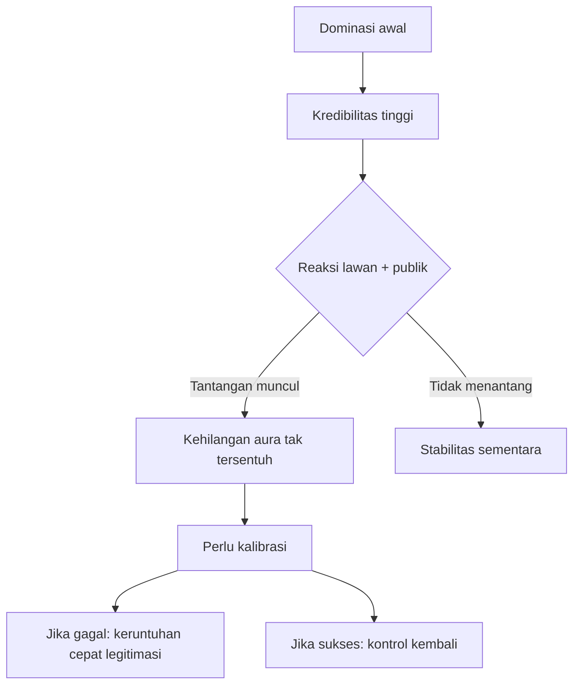
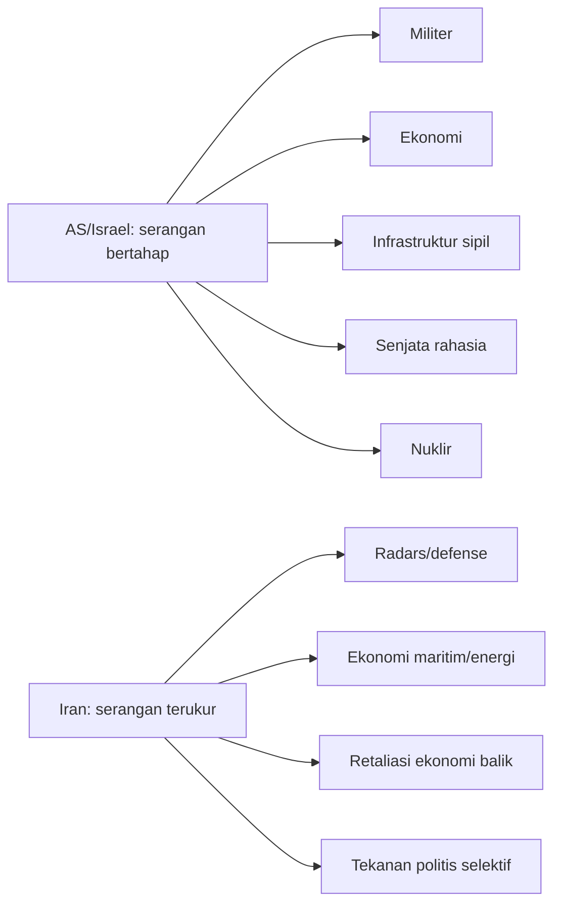
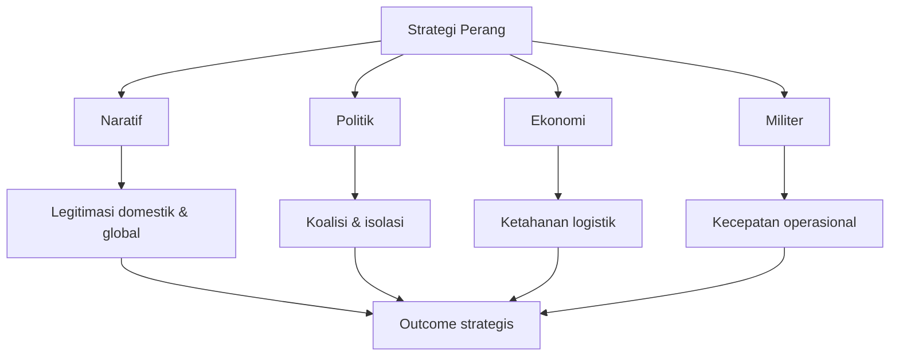
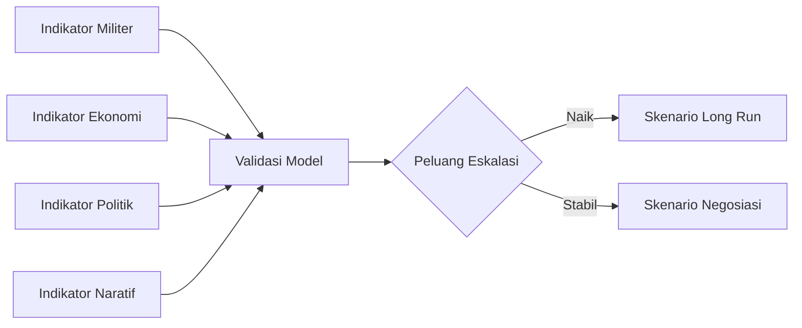

# Game Theory #11: Law of Escalation — Membaca Eskalasi US–Iran dari Kacamata Kendali, Kalibrasi, dan Biaya Perang

> *“Control is more important than dominance.”* — konsep inti dari video yang kita bedah. 🧠

Transkrip yang kita analisis ini datang dari satu kelas *Game Theory* yang mengupas konflik AS–Iran dan menentukan tiga pertanyaan besar: **apakah AS akan masuk invasi darat**, **apakah senjata nuklir dipakai**, dan **bagaimana peran kompleksitas Al-Aqsa/Al-Haram al-Sharif** dalam eskalasi. Fokus saya di sini adalah mengurai logika argumen itu secara kritis dalam bahasa Indonesia, dengan terjemahan istilah asing yang sengaja disertakan, serta menilai apa yang kuat dan apa yang lemah.

Sebelum masuk, penting: ini adalah kerangka berpikir berbasis analisis terbuka, bukan prediksi bernilai final atau pernyataan resmi dari lembaga intelijen. Jadi anggap ini sebagai *model* untuk memetakan ruang keputusan, bukan kebenaran tunggal. 🤝

---

## 1) Tiga pertanyaan pembelah dalam kerangka analisis

Sejak awal video, penulis mereduksi konflik jadi 3 pertanyaan determinan:

1. **Apakah AS akan mengirim pasukan darat?**
2. **Apakah senjata nuklir akan digunakan?**
3. **Bagaimana posisi konflik terkait Al-Aqsa/Temple Mount (kompleksitas agama-politik)?**

Itu pola yang baik untuk pembelajaran: dari banyak kejadian acak, pilih beberapa variabel kunci dulu lalu jalankan prediksi. Dalam *game theory* (teori permainan), ini mirip menetapkan state yang menentukan arah jalur permainan. 🧩

## 2) Istilah asing yang perlu diterjemahkan dulu 🗂️

Supaya nggak kabur, ini beberapa istilah penting dengan padanan Indonesianya:

- **Escalation ladder**: *tangga eskalasi* (naik level konflik secara bertahap)
- **Dominance**: *dominasi/unggulan koersif*
- **Calibration**: *kalibrasi* (penyetelan tindakan supaya tetap terukur dan tetap punya ruang gerak)
- **Control**: *kendali*
- **Mission creep**: *meluasnya misi* (dari target kecil jadi keterlibatan yang jauh lebih besar)
- **Credibility**: *kredibilitas penegakan* (kemampuan menegakkan ancaman)
- **Narrative**: *narasi/kisah publik*
- **Deterrence**: *daya cegah* (kemampuan menahan lawan tanpa kontak langsung)
- **Cost pyramid**: *piramida biaya sumber daya perang* (mana yang paling mahal dan paling murah dipakai)

Istilah ini akan diulang berkali-kali karena memang jadi fondasi argumen. 🔁

## 3) “Dominasi” vs “Kendali”: inti pergeseran argumentasi

Di awal, argumen lama geopolitik klasik menyebut: yang punya kemampuan lebih (mis. senjata nuklir) punya keunggulan dominan. Tapi narasumber menggugat itu, lalu mengganti ke prinsip berikut:

> **Yang menentukan kemenangan bukan sekadar dominasi, tetapi kemampuan mengendalikan jalur tindakan.**

### 3.1 Penjelasan sederhananya

Analogi awalnya: dua orang berkelahi, satu bawa pistol, satu bawa pisau. Secara fisik, pistol unggul. Tapi kalau kita tambah konteks sosial (penonton, polisi, opini publik, legitimasi moral), yang menang belum tentu yang “paling bertenaga”.

Dalam perang, analoginya lebih brutal: Anda bisa menang “secara teknik”, tapi kalah “dalam jangka panjang” karena

- hilang legitimasi,
- kalah opini publik,
- memicu aliansi baru lawan,
- dan menutup opsi sendiri untuk *de-eskalasi* (menurunkan eskalasi).

Di sinilah istilah **control** jadi pusat: bukan hanya menembakkan senjata, tetapi menentukan kapan, di mana, dan seberapa jauh kenaikan konflik.

```mermaid
graph TD
    A[Dominasi Material (kekuatan fisik)] --> B[Kemampuan Memaksa secara langsung]
    B --> C{Apakah ada kontrol?}
    C -->|Ya| D[Strategi fleksibel
+ legitimasi relatif terjaga]
    C -->|Tidak| E[Reaksi berlebih,
+ risiko kehilangan legitimasi]
    D --> F[Kemenangan jangka menengah]
    E --> G[Eskalasi liar,
+ kemungkinan terjebak perang panjang]
```

## 4) Tangga Eskalasi: tidak boleh “loncat”, harus bertahap

Argumen kunci lainnya: eskalasi tidak bisa dipotong melompati tahap. Dalam contoh jalan berkelahi yang mereka beri, prosesnya dari ucapan menyalahkan, hinaan, dorong-dorongan, pukulan, pisau, senjata api. Ini dipakai untuk menegaskan: dalam konflik nasional pun, biasanya terjadi tahapan.

### 4.1 Mengapa ini penting?

Karena jika sebuah pihak terlihat “langsung lompat” ke level tinggi (misalnya nuklir), biasanya ia tak cuma mempertimbangkan nilai militer, tapi gagal mengukur batas legitimasi sosial-politik dan risiko balasan global.

```mermaid
flowchart LR
    S1[Insult / tuduhan] --> S2[Konflik wacana] --> S3[Proksi & sanksi] --> S4[Serangan terbatas] --> S5[Serangan strategis]
    S5 --> S6[Tekanan sipil] --> S7[Senjata tingkat lebih mematikan]
    S7 --> S8[Potensi transisi ke ketidakpastian tinggi]
    classDef warn fill=#fef3c7,stroke=#f59e0b,color=#78350f;
    class S8 warn;
```

### 4.2 Tiga pendorong naiknya escalasi

Di kelas ini disebutkan tiga faktor: emosi, kekuatan, dan rasionalitas. Emosi memberi energi cepat; kekuatan memberi kapasitas; rasionalitas memberi arah agar tidak jatuh ke tindakan impulsif. Tanpa kendali emosi, “poin naik” bisa berubah jadi tindakan yang memicu kerugian tak terkendali.

Kalimat kunci mereka sangat praktis: **menang tidak cukup dengan emosi meledak, harus bisa tetap “tenang dan terkalibrasi”**.

## 5) Bully dan New Kid: analogi struktur sosial

Penjelasan klasik di video tentang “si perundung sekolah” dan siswa baru meniru teori ini:

- Bully = aktor dominan yang selama ini dianggap tak tertandingi.
- Siswa baru = aktor yang memutus “aturan informal” dan tidak langsung reaktif.
- Sekolah/konteks = opini publik, sekutu, struktur institusional.

Pelajaran utamanya: **power bisa runtuh bila kredibilitasnya diuji di hadapan banyak mata**, bukan ketika bertarung sendirian.

### 5.1 Kekuatan model ini

Model ini menolong memahami mengapa kekuatan keras bisa tereduksi jika:

- ancaman tidak bisa konsisten diwujudkan,
- banyak pihak melihat biaya mempertahankan dominasi semakin tinggi,
- dan lawan punya opsi reaksi yang membuat Anda “terlihat berlebihan” di depan publik.

### 5.2 Keterbatasan model

Namun analogi sekolah menyederhanakan unsur teknologi, ekonomi, serta intervensi pihak ketiga. Dalam geopolitik, tidak ada “kelas yang sama sekali netral”; ada negara adidaya, korporasi energi, opini media global, norma hukum internasional, dan risiko pasar keuangan.



## 6) Ladder militer dua sisi: AS-Israel vs Iran menurut video

Pada bagian analisis utama, narrator memetakan tahapan tindakan:

### 6.1 Ladder AS/Israel (dianggap “blunt”)

1. *Decapitation* (kepemimpinan target)
2. Serangan militer terhadap target militer
3. Embargo ekonomi
4. Serangan infrastruktur sipil (air/minyak)
5. Senjata rahasia
6. Senjata kimia/biologi
7. Nuklir

Catatan: ini kerangka linear “eskalasi klasik”. Untuk sampai ke nuklir, ia bilang harus lewat tahap-tahap di atas.

### 6.2 Ladder Iran (lebih “selective pressure”)

Iran, menurut video, memanfaatkan keragaman target: *kadang menyerang bila diprovokasi, kadang tidak*, dengan tujuan menekan jalur ekonomi dan logistik untuk membuat AS dan sekutu bertarung lebih mahal secara politik.



## 7) Kenapa ia memprediksi “ground troops: yes” dan “nuklir: no”?

Pada titik ini, modelnya memakai dua logika bersamaan:

### 7.1 Ground troops (Ya)

- Dalam perang serangan jarak jauh, bila mau mempertahankan tekanan berkelanjutan, pihak yang menyerang akhirnya butuh kekuatan darat karena biaya dan daya tahan.
- “Piramida biaya” dijelaskan: prajurit paling murah, kemudian kendaraan lapis baja, artileri, angkatan laut, hingga udara paling mahal.
- Tanpa infrastruktur pasukan darat, perang panjang dianggap tidak berkelanjutan.

Diagram sederhananya:

```mermaid
flowchart TD
    C[Cost Pyramid] --> I[1. Infantri (murah, cepat diganti)]
    C --> B[2. Armored/Artileri]
    C --> N[3. Laut]
    C --> A[4. Udara (mahal)]
    I --> D[Keandalan tekanan lama]
    B --> D
    N --> D
    A --> E[Pikiran dominasi cepat, tanpa daya tahan]
```

### 7.2 Nuklir (Tidak)

Ia menekankan biaya normatif dan politis nuklir sangat ekstrem: tabu geopolitik, risiko “apokaliptik”, dan hambatan legitimasi internal global. Jadi prediksi nol dipakai karena jalur biaya-politik-etiknya terlalu tinggi.

## 8) Di balik konflik ada 4 dimensi: naratif, politik, ekonomi, militer

Satu wawasan paling baik di video adalah perang tidak sekadar medan militer. Menurutnya, komponen kunci justru:

1. **Naratif** (opini dunia)
2. **Politik** (relasi antarnegara)
3. **Ekonomi** (rantai energi, perdagangan)
4. **Militer** (bukan yang paling dominan secara strategis)

Ini penting karena menegaskan: menang di medan tempur tidak otomatis menang di ruang legitimasi. Ketika militer tidak didukung narasi dan ekonomi, biaya konflik jadi meledak.



## 9) Komentar kritis: di mana modelnya terlalu deterministik?

Walau menarik, ada beberapa hal yang perlu dibaca hati-hati:

### 9.1 Prediksi yang terlalu “semua benar atau gagal semua”

Di awal ia bahkan menyatakan seluruh teorinya harus benar serentak agar valid. Ini gaya argumentasi yang tegas tapi terlalu keras secara metodologi. Dalam analisis dunia nyata, model bisa parsial benar lalu tetap berguna untuk keputusan kebijakan.

### 9.2 Ketepatan istilah “siapa mengendalikan”

Banyak istilah seperti *sovereignty*, *sanksi*, dan *dominan* muncul tanpa pembeda yang jelas antara negara dan aktor non-negara. Ini membuat prediksi kadang tampak deterministik, padahal kenyataannya non-linear.

### 9.3 Risiko overfitting pada analogi

Analogi perkelahian, bullying, dan “new kid” membantu pemahaman dasar, tapi saat dipakai pada konflik global perlu koreksi faktor:

- peran pasar energi,
- tekanan institusional di dalam negara,
- kemampuan sanksi keuangan transnasional,
- dan dinamika media yang multi-arus.

### 9.4 Asumsi bahwa semua pemain rasional seragam

Pada kenyataan, aktor politik bisa bertindak di bawah tekanan domestik, emosi publik, atau agenda elektoral—yang tidak selalu koheren dengan kalkulasi murni rasional.

## 10) Bagaimana cara membaca prediksi ini secara aman (untuk warga)

Sebagai pembaca praktis, saya sarankan tiga langkah:

- **Pisahkan “model” dari “keputusan nyata”**. Video memberi peta, bukan keputusan definitif.
- **Lacak indikator nyata** (ekonomi energi, keputusan parlemen, kebijakan tarif/embargo, pola serangan). 
- **Pantau legitimasi**: opini publik, dukungan parlemen, dan tekanan pasar.

Kalau ketiganya bergerak ke arah yang sama, risiko eskalasi jadi jauh lebih kredibel.



## 11) Ringkasannya (versi 2 menit)

Dari isi video, garis besarnya:

- **Dominasi senjata** itu penting, tapi tidak otomatis menang.
- **Kontrol dan kalibrasi** (kemampuan menahan diri sambil tetap mempengaruhi jalur konflik) lebih menentukan.
- **Eskalasi terjadi bertahap**; loncatan ke level tertinggi menanggung biaya legitimasi sangat mahal.
- **AS dan Israel dinilai punya jalur keterlibatan yang bisa jadi memerlukan komponen darat**, sedangkan **nuklir diprediksi tidak dipakai** karena harga politis dan risiko eksistensialnya.
- **Iran diposisikan** sebagai aktor yang lebih fleksibel secara “calibration”, terutama lewat pemilihan target ekonomis dan politik yang bisa menciptakan biaya eksternal tinggi.
- **Namun** semua model ini tetap harus dibaca sebagai hipotesis, bukan kepastian.

## 12) Relevansi untuk warga Indonesia: kenapa ini penting?

Walau konflik ini jauh, dampaknya dekat:

- Harga energi,
- stabilitas rute perdagangan laut,
- persepsi keamanan kawasan,
- dan gejolak opini publik global.

Bagi kita, poin pentingnya bukan jadi “pengikut teori”, tetapi membangun literasi bahwa konflik global tidak dibaca dari headline satu dimensi. Keputusan perang adalah fungsi dari *nilai moral, biaya politik, kemampuan legitimasi, dan struktur ekonomi*—semuanya berjalan paralel.

## 13) Kesimpulan teoretis

Video ini berguna karena memaksa kita melihat perang sebagai **sistem multipemain** yang bergerak di **multi-dimensi**: militer, ekonomi, politik, dan naratif. Di titik ini saya setuju dengan premis utamanya: **kemenangan jarang ditentukan hanya oleh “siapa lebih kuat secara materi”.**

Namun kita juga harus menahan diri pada klaim deterministik “harus ya–harus tidak” secara mutlak. Konflik adalah ranah probabilitas, bukan logika hitam-putih.

Jika ada satu pelajaran praktis, itu begini: dalam gejolak geopolitik, kemampuan bertahan sebuah negara/aktor bukan hanya soal senjata, tetapi **kemampuan menjaga koherensi tujuan, justifikasi moral, dan fleksibilitas strategi**. Itulah yang membuat “law of escalation” menjadi menarik dibahas, sekaligus menuntut kita untuk tetap kritis terhadap setiap prediksi.

---

<YouTube url="https://www.youtube.com/watch?v=fz-Dan7NRss" title="Game Theory #11: The Law of Escalation" />

<Callout type="cite" title="Referensi">
Sumber utama: transkrip video “Game Theory #11: The Law of Escalation” dari kanal YouTube.
