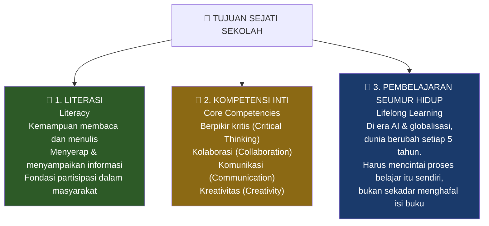
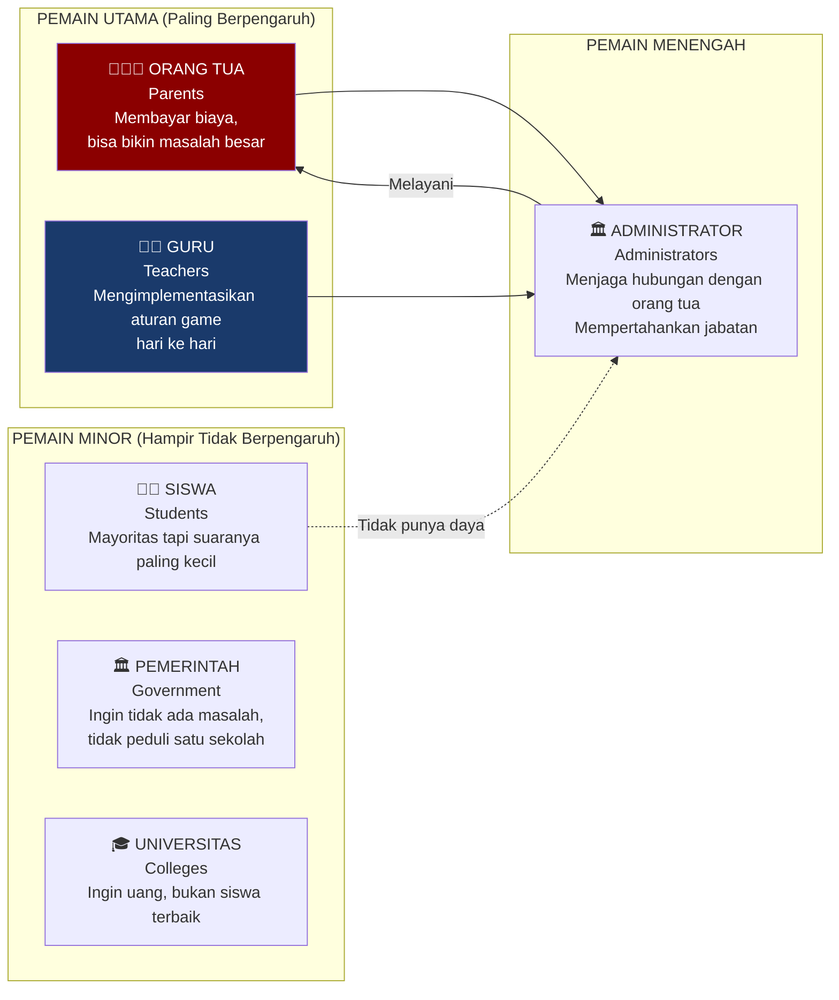
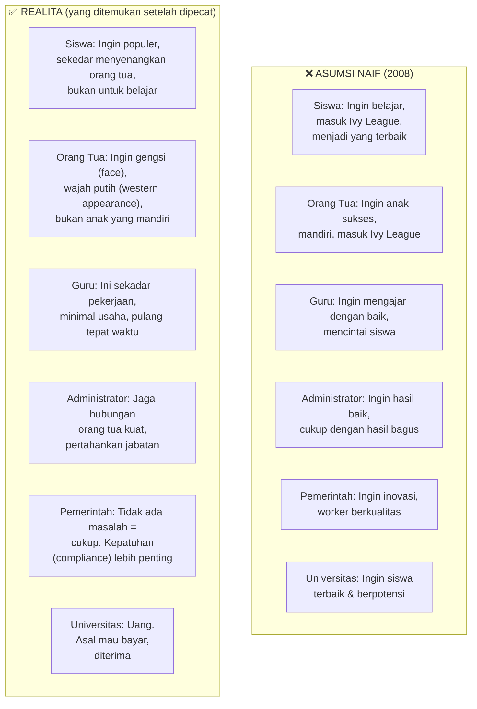
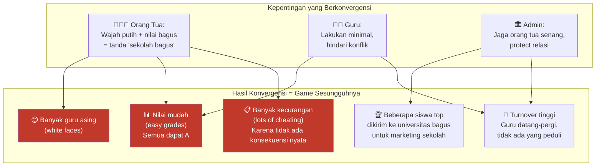
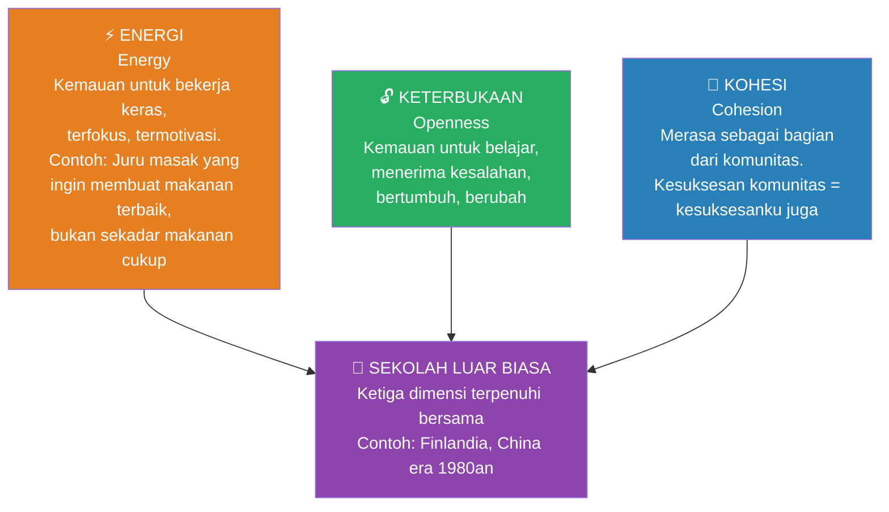
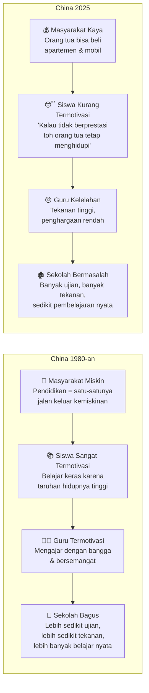
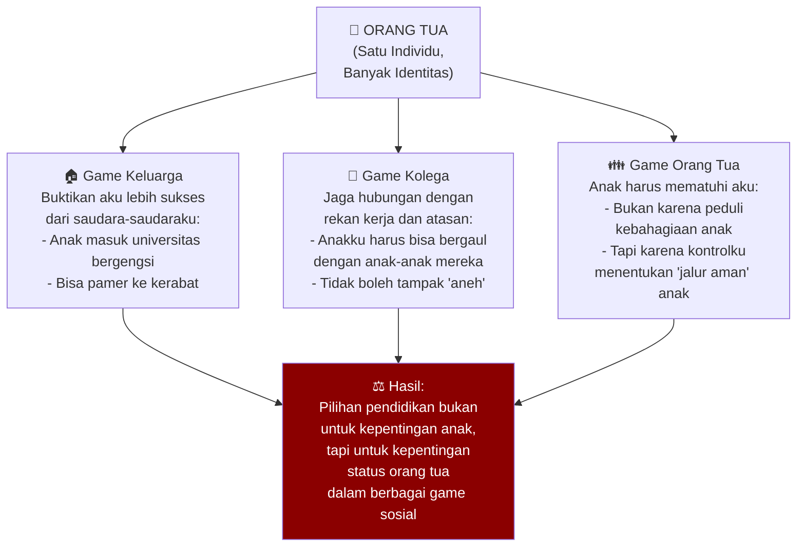
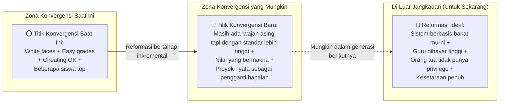
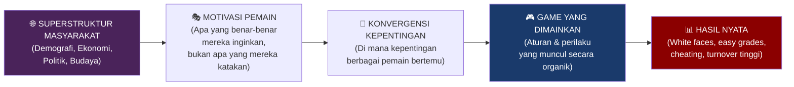

## 🎓 Pembuka: Ketika Sekolah Membunuh Kecintaan Belajar

Ada satu ritual yang sangat terkenal di Tiongkok — dan mungkin salah satu yang paling jujur menggambarkan kondisi pendidikan modern di seluruh dunia.

Setiap tahun, setelah ujian nasional *Gaokao* (高考) berakhir, ribuan pelajar berumur 18 tahun melakukan satu hal yang sama: **mereka merobek buku-buku mereka, melemparkan halaman-halamannya ke udara, dan merayakannya seperti kebebasan**.

🎉 *"Aku tidak akan pernah membaca buku lagi. Aku tidak akan pernah ikut ujian lagi. Aku tidak akan pernah belajar lagi."*

Ini bukan perayaan kelulusan. Ini adalah **pembebasan dari siksaan**.

Dan pertanyaannya adalah: **bagaimana kita sampai di sini?**

Bagaimana institusi yang bertujuan mulia — mendidik generasi penerus, mengembangkan berpikir kritis, menanamkan cinta belajar — bisa berevolusi menjadi mesin yang menghasilkan manusia-manusia yang **benci belajar**?

Jawabannya bukan terletak pada niat buruk siapapun. Jawabannya terletak pada **Game Theory** — teori permainan yang menjelaskan mengapa orang-orang rasional, ketika bertemu dalam satu sistem, bisa menghasilkan hasil yang tidak diinginkan oleh siapapun.

---

## 🎯 Bagian I: Tiga Tujuan Sejati Sekolah — dan Mengapa Ketiganya Gagal

### Apa Sebenarnya Tujuan Sekolah?

Jika kita mundur dan bertanya secara jujur: *untuk apa sekolah ada?*, ada tiga jawaban yang sangat jelas:

Tiga tujuan ini tampak sederhana, masuk akal, dan mulia. Tidak ada yang akan membantahnya.

Masalahnya: **sebagian besar sekolah tidak hanya gagal mencapai ketiganya — mereka secara aktif menghasilkan efek sebaliknya**.

### Bagaimana Sekolah Gagal di Masing-masing Tujuan?

**❌ Kegagalan Literasi:**

Di era *social media* dan konten pendek, siswa tidak lagi diminta membaca buku utuh. Ketika mereka sampai di universitas, para profesor begitu terkejut melihat mahasiswa yang tidak bisa membaca teks panjang sehingga mereka mulai **mengganti buku dengan potongan paragraf atau video pendek**.

Rentang perhatian (*attention span*) manusia modern telah menyusut dramatis. Bahkan mendengarkan kuliah satu jam penuh sudah terasa mustahil — kebanyakan orang kehilangan fokus setelah **5 menit**. 📉

**❌ Kegagalan Kompetensi Inti:**

Sekolah mengklaim mengajarkan kolaborasi. Tapi kenyataannya, sistem sekolah adalah **permainan zero-sum** (*zero-sum game*) — permainan di mana keuntungan satu orang berarti kerugian orang lain.

Peringkat kelas, *ranking*, dan sistem nilai komparatif secara struktural mendorong kompetisi, bukan kolaborasi. Pesan yang diterima siswa adalah: *"Untuk maju, kamu harus mengalahkan temanmu."*

**❌ Kegagalan Cinta Belajar:**

Ritual membakar buku setelah *Gaokao* adalah bukti paling telanjang. Sekolah berhasil **mengubah belajar dari sesuatu yang menyenangkan menjadi siksaan** yang harus diakhiri sesegera mungkin. 🔥

---

## 🇨🇳 Bagian II: Kisah Nyata — Reformer yang Dipecat karena Berhasil

### Yale ke Shenzhen: Sebuah Eksperimen yang Seharusnya Berhasil

Pada tahun 2008, sang dosen — lulusan Yale dan sarjana sastra Inggris — pergi ke **Shenzhen, Tiongkok Selatan** untuk membantu *Shin Middle School* membangun program internasional agar siswa bisa kuliah ke luar negeri.

Saat itu, sekitar 10% siswa (±80 orang per tahun) berencana studi ke luar negeri. Tapi cara mereka mempersiapkan diri sangat bermasalah:

| Masalah yang Ditemukan | Dampaknya |
|---|---|
| 📝 Menghafal daftar kata SAT tanpa konteks | Tidak bisa menulis atau membaca dengan baik |
| 🏫 Kelas reguler China — 50 siswa, pasif, tidak berdebat | Tidak ada kemampuan berpikir kritis |
| 🌐 Semua orang ikut *Model United Nations* | Tidak ada diferensiasi; hanya "ngobrol", tidak berbuat |

Sang dosen kemudian melakukan tiga perubahan revolusioner:

**1. 📚 Sistem Seminar Ganti Kelas Ceramah**
Mengganti kelas 50 siswa pasif dengan seminar kecil (10-20 siswa) di mana mereka mendiskusikan buku yang dibaca bersama. Mendirikan **perpustakaan 5.000 buku bahasa Inggris** — pertama di sekolahnya di Tiongkok Selatan. Tujuannya: mengajarkan *kesenangan membaca*.

**2. ☕ Coffee House — Belajar Bisnis dengan Melakukan**
Mendirikan kedai kopi pertama di sekolah menengah Tiongkok. Siswa harus **menjalankan bisnis nyata**: menjadi pelayan, memberikan pelayanan kepada pelanggan, mengelola keuangan, berkolaborasi sebagai tim. Ini mengajarkan kolaborasi, keuangan, dan kewirausahaan melalui pengalaman langsung — bukan teori.

**3. 📰 Koran Harian — Jurnalisme Nyata**
Mendirikan koran harian pertama di sekolah menengah Tiongkok — mungkin pertama di dunia untuk tingkat ini. Siswa harus **meliput berita, menulis artikel, mengedit, dan menerbitkan setiap hari**. Mereka bekerja hingga tengah malam, bangun pukul 7 pagi untuk mengantar koran ke seluruh siswa.

Dan hasilnya? **Program ini berhasil luar biasa.** Siswa-siswanya masuk Yale, Wharton, Cornell. Program tersebut menjadi yang paling terkenal di Tiongkok Selatan dengan rekor penerimaan perguruan tinggi terbaik.

### Lalu Apa yang Terjadi? 😬

1. **Sang dosen dipecat.**
2. Guru-guru, orang tua, dan siswa **senang melihatnya pergi.**
3. Setelah itu, ia **tidak pernah lagi diizinkan memegang posisi manajemen** di sekolah mana pun.

Kata yang digunakan semua orang untuk mendeskripsikannya bukan *"reformer"*, *"visioner"*, atau *"idealis"* — melainkan: **diktator**.

Dan kata lain yang lebih umum (yang disensor dalam transkrip): seseorang yang dengan keras kepala memaksakan keadilan (*fairness*) — sesuatu yang tampaknya **tidak ada tempatnya dalam permainan yang sesungguhnya dimainkan**.

> *"Aku tidak peduli siapa kamu. Aku tidak peduli siapa orang tuamu. Aku ingin kamu bekerja keras dan belajar."*

Pernyataan itu terdengar sederhana dan mulia. Tapi ia **menyinggung banyak orang berkuasa** — karena itulah *bukan* cara permainan ini dimainkan, di mana pun di dunia.

<Callout type="important" title="🔑 Pelajaran Utama dari Kisah Ini">
Kamu bisa menjadi **reformer terbaik di dunia** — inovatif, sukses, mengubah hidup siswa — dan tetap dipecat karena kamu tidak memahami **game sesungguhnya yang sedang dimainkan**.

Sekolah yang baik bukan tentang pendidikan terbaik. Sekolah adalah tentang **kepentingan pemain yang berkonvergensi** (*converging interests of players*).
</Callout>

---

## 🎮 Bagian III: Memperkenalkan Game Theory — Pemain dan Motivasi Mereka

### Apa itu Game Theory?

**Game Theory** (*Teori Permainan*) adalah cabang matematika dan ilmu ekonomi yang mempelajari **bagaimana para pemain rasional membuat keputusan** dalam situasi di mana hasil keputusan mereka bergantung pada keputusan pemain lain.

Dalam konteks sekolah, para *stakeholder* (pemangku kepentingan) adalah **pemain dalam game**. Dan untuk memahami mengapa sistem berperilaku seperti yang kita lihat, kita harus memahami **motivasi dan kepentingan sejati setiap pemain** — bukan apa yang mereka *katakan* mereka inginkan, melainkan apa yang *benar-benar* mereka kejar.

### Prinsip Fundamental Game Theory

> **"Semua pemain dimotivasi untuk mencapai hasil terbaik dengan usaha seminimal mungkin."**

Ini terdengar sinis. Tapi ini adalah hukum dasar perilaku manusia yang perlu kita terima sebelum menganalisis sistem apa pun. Orang adalah **malas dan serakah** — dalam makna yang paling netral dan deskriptif. Mereka memaksimalkan hasil, meminimalkan biaya.

### Enam Pemain dalam Game Sekolah

<Callout type="warning" title="⚠️ Fakta yang Tidak Nyaman">
**Siswa adalah pemain yang paling tidak berpengaruh dalam game sekolah** — meskipun mereka adalah *raison d'être* (alasan keberadaan) sekolah itu sendiri.

Yang paling berpengaruh adalah **orang tua** (karena membayar dan bisa membuat keributan) dan **guru** (karena mengimplementasikan aturan setiap hari).
</Callout>

---

## 🔍 Bagian IV: Analisis Mendalam — Motivasi Sejati Setiap Pemain

### Asumsi Awal (yang Salah) vs. Realita

Inilah perbandingan antara apa yang *diasumsikan* oleh sang reformer pada 2008, versus apa yang *sebenarnya* dimotivasi setiap pemain:

### 👨‍👩‍👦 Orang Tua — Antara "Wajah" (*Face*) dan Kontrol

Orang tua dalam konteks sekolah internasional Asia memiliki dua motivasi dominan yang seringkali **bertentangan dengan pendidikan berkualitas**:

**Motivasi 1: *Face* (Gengsi Sosial)**

Di Tiongkok dan banyak masyarakat Asia, *face* (*mianzi*, 面子) — prestise dan reputasi sosial — adalah mata uang sosial yang sangat berharga. Orang tua tidak menyekolahkan anak di sekolah internasional karena yakin anaknya akan mendapat pendidikan lebih baik. Mereka melakukannya karena:

- 📸 **"Wajah putih"** (*white faces*) — kehadiran guru-guru asing (bule) secara visual menandakan "internasional dan mahal"
- 💰 Sekolah internasional **lebih mahal** = lebih bergengsi
- 🏆 Bisa membanggakan ke keluarga dan kolega: *"Anakku di Cornell/Dartmouth/Brown"*

Ini bukan tentang pendidikan. Ini adalah **pendidikan sebagai produk mewah** (*luxury product*) yang dibeli untuk menunjukkan status.

**Motivasi 2: Kontrol atas Anak**

Orang tua — terutama dalam konteks budaya Asia yang kuat — tidak benar-benar ingin anak yang **berpikir kritis dan independen**. Anak yang berpikir kritis adalah anak yang akan mempertanyakan otoritas orang tuanya.

Yang mereka inginkan adalah anak yang **mematuhi mereka** — karena hanya dengan mematuhi orang tua, anak "aman" dalam jalur yang sudah ditentukan orang tua.

> *"Aku tidak ingin anakku berpikir kritis atau menjadi independen. Aku ingin anakku mematuhi aku."*

### 👩‍🏫 Guru — Ini Cuma Pekerjaan

Kita sering membayangkan guru sebagai sosok yang berdedikasi penuh, mencintai muridnya, dan dengan penuh semangat mengajarkan bidang yang ia cintai.

Realitanya — menurut analisis game theory ini — adalah jauh lebih sederhana:

**Guru adalah pekerja yang memiliki kehidupan di luar sekolah.**

Mereka punya keluarga, tagihan, masalah pribadi. Mereka tidak dibayar cukup untuk memiliki gairah (*passion*) mengajar. Dan dalam lingkungan di mana setiap kesalahan kecil bisa diprotes orang tua hingga menyebabkan pemecatan, strategi paling rasional adalah:

- ✅ Lakukan yang **minimal dibutuhkan** untuk mempertahankan pekerjaan
- ✅ Hindari konflik dengan orang tua
- ✅ Pulang tepat waktu

*"Aku tidak punya passion mengajar — karena aku memang tidak punya passion."*

Ini bukan kritik moral terhadap guru sebagai individu. Ini adalah **respons rasional terhadap insentif sistemik** yang ada. Jika Anda dibayar seperti guru tapi dituntut bekerja seperti misionaris, cepat atau lambat Anda akan memilih kewarasan. 😔

### 🏛️ Administrator — Penjaga Kepuasan Orang Tua

Administrator sekolah berada dalam posisi yang sangat menarik: mereka secara teknis bertanggung jawab atas kualitas pendidikan, tapi kepekaan bertahan hidup mereka mengatakan sesuatu yang berbeda:

**Tugasku yang sesungguhnya adalah membuat orang tua berkuasa tetap senang.**

Logikanya:
- Orang tua kaya dan berpengaruh bisa menekan yayasan untuk memecat saya
- Orang tua miskin atau kelas menengah tidak punya leverage itu
- Maka: prioritaskan orang tua berkuasa, abaikan yang lain

Akibatnya: **sekolah tidak dikelola untuk kepentingan siswa, tapi untuk kepentingan orang tua yang paling berpengaruh.**

Dan persis seperti guru, administrator juga memiliki kehidupan sendiri. Insentif untuk berinovasi sangat rendah karena inovasi = risiko = kemungkinan konflik = kemungkinan kehilangan pekerjaan.

### 🏛️ Pemerintah — Kepatuhan lebih Penting dari Kreativitas

Pemerintah sering mengatakan mereka ingin pendidikan yang inovatif, kreatif, dan menghasilkan tenaga kerja berkualitas tinggi. Tapi dalam praktiknya, yang benar-benar mereka inginkan adalah:

1. 😶 **Tidak ada masalah** — satu sekolah di antara ribuan, bukan prioritas
2. ✅ **Kepatuhan** (*compliance*) — siswa yang belajar mematuhi otoritas adalah warga yang mudah diatur
3. 🚫 **Bukan inovasi sejati** — inovasi sejati berarti orang mempertanyakan tatanan yang ada

Ini adalah ironi besar: pemerintah yang paling lantang meneriakkan slogan "inovasi" seringkali paling aktif menghancurkan kondisi yang diperlukan untuk inovasi terjadi. 🤦

### 🎓 Universitas — Bisnis, Bukan Pendidikan

Universitas-universitas Amerika (dan universitas internasional lainnya) membuat marketing yang indah tentang mencari siswa yang "passionate", "curious", "changemakers". Tapi kenyataannya jauh lebih prosaik:

**Mereka ingin uang.**

Biaya kuliah di Amerika bisa mencapai $50.000-$100.000 per tahun. Siswa internasional membayar *full tuition* tanpa beasiswa. Bagi sebagian besar universitas non-elite, **siswa internasional adalah sumber pendapatan utama**.

Bahkan universitas Ivy League, yang sangat selektif, memiliki preferensi yang tidak banyak dibicarakan: **siapa yang berasal dari keluarga berkuasa**. Karena alumni yang sukses (yang sering berasal dari keluarga kaya) adalah sumber donasi terbesar. Sistem *legacy admissions* (*prioritas untuk keturunan alumni*) adalah bukti nyatanya.

> *"Mereka bilang ingin siswa terbaik yang passionate dan curious. Itu omong kosong. Itu bukan bagaimana game ini dimainkan."*

---

## 🔄 Bagian V: Konvergensi Kepentingan — Inilah Game Sesungguhnya

### Bagaimana Game Dikonstruksi

Dalam game theory, sebuah game dikonstruksi ketika **semua pemain menyepakati aturan dan insentif** permainan. Bukan melalui diskusi formal — melainkan melalui proses organik di mana kepentingan-kepentingan saling berkonvergensi ke titik keseimbangan (*Nash Equilibrium*).

### Ciri-Ciri Sekolah Internasional "Tipikal" Saat Ini

Ketika kepentingan orang tua, guru, dan administrator berkonvergensi, hasilnya adalah sekolah yang terlihat seperti ini:

- ✨ **Bangunan mewah dan website indah** — visual meyakinkan orang tua
- 👱 **Banyak guru asing** (*white faces*) — sinyal "internasional"
- 📈 **Nilai mudah** (*grade inflation*) — hampir semua siswa mendapat A tanpa banyak bekerja keras
- 🏅 **Beberapa siswa top** yang masuk universitas bergengsi untuk dijadikan bahan marketing
- 📝 **Banyak kecurangan** — jika tidak suka nilai, protes kepada administrator dan nilai akan berubah
- 🔄 **Turnover tinggi** — guru cepat datang dan pergi, siswa apatis

Ini adalah sistem yang secara perfek melayani kepentingan semua pemain utama, kecuali satu:

**Siswa itu sendiri.** 🎓

---

## 🌍 Bagian VI: Superstruktur — Mengapa Sekolah yang Dulunya Bagus Menjadi Buruk

### Tiga Dimensi Kesehatan Masyarakat

Untuk memahami *mengapa* motivasi pemain berubah seiring waktu, kita perlu memahami konsep **Superstruktur** (*Superstructure*) — gambaran makro suatu masyarakat yang mencakup demografi, ekonomi, politik, dan budaya.

Ada tiga metrik yang bisa digunakan untuk mengukur kesehatan sebuah masyarakat (dan sistem pendidikannya):

### Finlandia sebagai Contoh Ideal

**Finlandia** sering disebut sebagai negara dengan sistem pendidikan terbaik di dunia. Mengapa? Bukan karena teknik pengajaran yang revolusioner — melainkan karena **kondisi superstrukturalnya**:

- 🇫🇮 Masyarakat kecil (~5 juta orang) dengan kohesi sosial tinggi
- 💪 Etika kerja yang kuat (*energi*)
- 🔓 Budaya terbuka terhadap kritik dan perbaikan
- 🎓 **Guru adalah profesi paling bergengsi** — lebih bergengsi dari dokter atau pengacara
- 💰 Guru dibayar dengan sangat baik
- 🏆 Hanya lulusan terbaik universitas yang boleh menjadi guru
- 🗽 Guru diberikan otonomi penuh dalam cara mengajar

Hasilnya: guru yang paling kompeten, termotivasi, dan diberdayakan — menghasilkan pendidikan yang luar biasa.

### China 1980-an vs. China 2025

Ini adalah perbandingan yang sangat mengungkapkan:

| Aspek | China Era 1980-an | China Era 2020-an |
|---|---|---|
| Kondisi ekonomi | Miskin, baru berkembang | Kaya, kelas menengah besar |
| Motivasi belajar | **Tinggi** — pendidikan satu-satunya jalan keluar dari kemiskinan | **Rendah** — orang tua bisa beli apartemen meski anak tidak berprestasi |
| Guru | Merasa dihargai, bangga mendidik | Dilihat sebagai pegawai rendahan |
| Tekanan ujian | Lebih sedikit | Ekstrem (*Gaokao* mendominasi) |
| Hasil pembelajaran | **Lebih banyak belajar** | **Lebih sedikit belajar** meski lebih banyak ujian |

### Mengapa Kekayaan Bisa Merusak Pendidikan?

Ini adalah paradoks yang mengejutkan: **semakin kaya sebuah masyarakat, motivasi untuk berpendidikan bisa justru melemah**.

Alasannya: di masyarakat miskin, pendidikan adalah **tiket keluar kemiskinan**. Taruhannya sangat tinggi. Siswa belajar keras karena hidupnya bergantung padanya. Guru mengajar dengan penuh semangat karena mereka merasakan betapa pentingnya peran mereka.

Di masyarakat kaya dengan **ketimpangan (*inequality*) yang tinggi**, dinamikanya berubah:

- Orang tua kaya tahu bahwa anak mereka akan "aman" apapun yang terjadi
- Kompetisi menjadi hyper-intensif (karena sekarang bukan lagi bertahan hidup, tapi perebutan status)
- Kecemasan meningkat, tapi makna hilang
- Guru tidak lagi merasa dihargai sebagai agen perubahan
- Siswa tidak lagi merasa bahwa belajar sungguh-sungguh ada gunanya

**Korupsi dan ketimpangan** adalah faktor superstruktural yang paling merusak kohesi, keterbukaan, dan energi masyarakat — dan oleh karena itu, paling merusak pendidikan. 📉

---

## 🧮 Bagian VII: Anatomi Konvergensi — Siapa Bermain Game Apa?

### Setiap Pemain adalah Pemain dalam Banyak Game Sekaligus

Ini adalah salah satu insight paling dalam dari game theory: **tidak ada pemain yang hanya memainkan satu game**.

Orang tua, misalnya, bermain setidaknya **dua game besar** secara bersamaan:

**Game Keluarga (Family Game):**
Dalam keluarga besar, ada persaingan antar-saudara (*siblings*). Jika kamu punya tiga saudara, kamu ingin membuktikan bahwa kamu lebih sukses — lebih banyak uang, anak yang lebih berprestasi, istri/suami yang lebih baik.

**Game Kolega (Colleagues Game):**
Di tempat kerja, kamu perlu mempertahankan hubungan baik dengan rekan kerja. Itu berarti anak kamu harus bisa bergaul dengan anak-anak kolega kamu — karena hubungan itu yang menjamin kesuksesan masa depan, bukan nilai akademik semata.

### Hukuman Terbesar: Pengucilan (*Ostracization*)

Hal yang paling ditakuti oleh semua pemain dalam game sosial adalah **dikucilkan dari grup** — tidak lagi dianggap sebagai bagian dari komunitas.

Ini menjelaskan mengapa perubahan radikal sangat sulit dilakukan:

Jika seorang orang tua mendukung reformer yang "gila" (seperti sang dosen), mereka berisiko dikucilkan oleh komunitas orang tua lainnya yang masih bermain game konvensional. Harga sosialnya terlalu tinggi.

Inilah yang sesungguhnya terjadi dengan sang reformer: ia bukan hanya "mengganggu" sistem sekolah. Ia sedang **mensubversi nilai-nilai dan konvensi tradisional** yang menjadi perekat komunitas. Dan komunitas akan menolak itu — bukan karena program-nya buruk, tapi karena keberadaannya mengancam identitas dan posisi semua orang dalam game sosial yang lebih besar.

### Tiga Game Siswa

Siswa pun tidak hanya memainkan "game belajar". Mereka memainkan setidaknya tiga game:

| Game | Prioritas | Logikanya |
|---|---|---|
| 🤝 **Game Persahabatan** | **Tertinggi** | Popularitas & pertemanan menentukan kebahagiaan jangka pendek dan jaringan jangka panjang |
| 👨‍👩‍👦 **Game Menyenangkan Orang Tua** | **Tinggi** | Orang tua yang senang = kehidupan nyaman, dukungan finansial |
| 📚 **Game Belajar** | **Terendah** | Nilai tinggi memang bagus, tapi bisa dicapai dengan cara lain (menyontek, memanipulasi guru) |

Kesimpulan yang mengejutkan: **belajar sungguh-sungguh adalah game yang paling tidak diinsentifkan dalam sistem sekolah saat ini.**

---

## 🛠️ Bagian VIII: Reformasi — Mengapa Sulit dan Bagaimana Caranya

### Ruang Konvergensi — Di Mana Reformasi Bisa Terjadi

Bukan berarti reformasi tidak mungkin. Tapi reformasi harus dipahami dengan benar:

**Reformasi tidak bisa dilakukan dengan menciptakan game baru dari nol.**

Itulah kesalahan sang dosen pada 2008 — ia mencoba menciptakan "alam semesta baru" dengan aturan baru, dan meminta semua pemain untuk masuk. Itu adalah pendekatan seorang diktator idealis, bukan reformer pragmatis.

**Reformasi yang berhasil harus dilakukan *di dalam* ruang konvergensi yang sudah ada** — menggeser kepentingan pemain secara bertahap, bukan memaksa semua orang untuk langsung beralih ke paradigma baru.

Pendekatan inkremental ini terdengar lambat dan membuat frustrasi bagi para idealis. Tapi inilah satu-satunya cara yang **bertahan lama** dalam sistem yang kompleks:

- Identifikasi di mana kepentingan berbagai pemain **sudah ada potensi keselarasan**
- Ciptakan insentif baru yang **masuk dalam ruang konvergensi yang ada**
- Geser titik konvergensi secara bertahap, dari satu posisi ke posisi berikutnya

### Pelajaran untuk Reformis Mana Pun

Prinsip ini berlaku jauh melampaui pendidikan — untuk reformasi politik, kebijakan publik, reformasi korporasi, bahkan perubahan sosial:

> *"Apapun yang ingin kamu implementasikan, harus berada di dalam zona konvergensi agar para pemain menerimanya. Reformasi yang baik adalah reformasi inkremental — menggeser pemain dari satu titik konvergensi ke titik konvergensi berikutnya."*

---

## 🔑 Bagian IX: Kesimpulan — Game Theory sebagai Cara Melihat Dunia

### Inti dari Semua yang Telah Kita Bahas

Game theory bukan tentang ide, bukan tentang cita-cita, bukan tentang bagaimana seharusnya dunia ini. **Game theory adalah tentang bagaimana dunia benar-benar bekerja** — dan bagaimana dunia benar-benar bekerja ditentukan oleh siapa para pemainnya dan bagaimana perilaku mereka **merespons insentif game yang mereka yakini sedang mereka mainkan**.

### Mengapa Ini Penting untuk Kita sebagai Individu

Pemahaman ini memiliki implikasi personal yang sangat dalam:

1. 🧐 **Jangan naif tentang sistem yang Anda masuki** — pahami game sesungguhnya yang sedang dimainkan, bukan yang diklaim dimainkan

2. 🔄 **Perilaku kamu adalah respons terhadap insentif** — jika kamu berperilaku "buruk" dalam sistem yang buruk, itu bukan tentang karakter kamu. Itu tentang insentif yang ada.

3. 🌱 **Kamu selalu berubah karena game selalu berubah** — dari kindergarten ke SMA ke dunia kerja, setiap transisi membawa game baru dengan pemain baru dan aturan baru

4. 🚪 **Untuk berhasil dalam game, kamu harus memahaminya** — dan terkadang, ketika kamu memahami game yang sedang dimainkan, kamu bisa memutuskan apakah kamu mau terus memainkannya atau keluar

5. 💡 **Reformasi yang berhasil dimulai dari memahami kepentingan semua pemain** — bukan dari asumsi bahwa semua orang "mau dididik" seperti yang kamu anggap terbaik

<Callout type="tip" title="💡 Pertanyaan untuk Refleksi Pribadi">
Sekarang, pikirkan tentang sekolah kamu sendiri:

- **Game apa sesungguhnya yang kamu mainkan** di sekolah — game belajar, game popularitas, atau game menyenangkan orang tua?
- **Insentif apa yang benar-benar menggerakkan perilakumu** di kelas?
- Jika kamu jujur pada diri sendiri: **apakah sistem sekolah membuat kamu mencintai atau membenci belajar?**
- **Dan apa yang bisa kamu lakukan** — dalam ruang konvergensi yang ada — untuk sedikit menggeser game ke arah yang lebih baik untuk dirimu sendiri?
</Callout>

---

## 📚 Glosarium Lengkap

| Istilah | Bahasa Indonesia | Penjelasan |
|---|---|---|
| **Game Theory** | Teori Permainan | Cabang matematika & ekonomi yang mempelajari pengambilan keputusan strategis antar pemain |
| **Stakeholders** | Pemangku Kepentingan | Semua pihak yang memiliki kepentingan dalam suatu sistem; dalam game theory = *players* |
| **Zero-Sum Game** | Permainan Zero-Sum | Permainan di mana keuntungan satu pemain = kerugian pemain lain; total selalu nol |
| **Convergence Point** | Titik Konvergensi | Titik di mana kepentingan berbagai pemain bertemu dan menghasilkan "aturan tak tertulis" |
| **Nash Equilibrium** | Keseimbangan Nash | Kondisi di mana tidak ada pemain yang mau mengubah strateginya secara sepihak |
| **Superstructure** | Superstruktur | Gambaran makro masyarakat: demografi, ekonomi, politik, budaya |
| **Cohesion** | Kohesi | Rasa kebersamaan dan kepentingan komunal; merasa sukses komunitas = sukses diri |
| **Openness** | Keterbukaan | Kesediaan belajar, menerima kesalahan, dan berkembang |
| **Energy** | Energi | Kemauan untuk bekerja keras, fokus, dan termotivasi |
| **Lifelong Learning** | Pembelajaran Seumur Hidup | Mentalitas terus belajar sepanjang hidup, tidak hanya saat di sekolah |
| **Core Competencies** | Kompetensi Inti | Keterampilan fundamental: berpikir kritis, kolaborasi, komunikasi, kreativitas |
| **Literacy** | Literasi | Kemampuan membaca dan menulis; kemampuan menyerap dan menyampaikan informasi |
| **Grade Inflation** | Inflasi Nilai | Kecenderungan memberikan nilai tinggi kepada semua siswa, merendahkan makna nilai |
| **Face (Mianzi)** | Gengsi/Wajah Sosial | Konsep budaya Asia tentang prestise dan reputasi sosial |
| **Ostracization** | Pengucilan | Dikeluarkan dari kelompok/komunitas; hukuman sosial terbesar dalam game komunal |
| **Incremental Reform** | Reformasi Inkremental | Perubahan bertahap kecil dalam sistem yang sudah ada, bukan revolusi total |
| **Rational Actor** | Aktor Rasional | Asumsi dalam game theory bahwa pemain membuat keputusan untuk memaksimalkan keuntungan |
| **Incentive** | Insentif | Faktor yang mendorong atau menghambat perilaku tertentu |
| **Model United Nations (MUN)** | Model PBB | Simulasi sidang PBB; aktivitas ekstrakurikuler populer tapi menjadi terlalu *common* |
| **SAT** | SAT | *Scholastic Assessment Test*; ujian standar untuk masuk universitas Amerika |
| **Gaokao (高考)** | Ujian Masuk Universitas Tiongkok | Ujian nasional paling kompetitif di dunia; menentukan nasib akademis siswa Tiongkok |
| **Legacy Admissions** | Penerimaan Keturunan Alumni | Kebijakan universitas untuk memprioritaskan anak-anak alumni, biasanya dari keluarga kaya |
| **Ivy League** | Ivy League | Kelompok 8 universitas paling bergengsi di Amerika: Harvard, Yale, Princeton, Columbia, Penn, Brown, Dartmouth, Cornell |

---

*Sumber video: [Game Theory #2: Why Schools Suck](https://www.youtube.com/watch?v=kS-muAuq62E)*
