## 🧊 Pembuka: Tentang Bahasa dan Gunung Es

Bahasa adalah sesuatu yang kita gunakan setiap detik kehidupan kita — tapi jarang kita pikirkan dengan sungguh-sungguh.

Kata-kata yang keluar dari mulutmu sekarang adalah **suara yang diinterpretasikan sebagai simbol makna** oleh otak pendengarmu. Pikiran yang ada di dalam kepalamu — entah itu rencana makan siang, kekhawatiran tentang pekerjaan, atau kenangan masa kecil — semuanya dikodekan dalam struktur linguistik dan ditransfer ke otak orang lain melalui getaran udara.

Itu sudah cukup mengagumkan. Tapi apa yang ada **di bawah permukaan** bahasa sehari-hari? Apa yang tersembunyi di lapisan yang lebih dalam?

Format *iceberg* (*gunung es*) populer di internet untuk membahas topik-topik dari yang paling umum di permukaan hingga yang paling aneh, tersembunyi, dan kadang membingungkan di lapisan terbawah. Dan bahasa — dengan segala keanehan, sejarah, dan misteri filosofisnya — adalah subjek yang sempurna untuk format ini.

Mari kita menyelam. 🤿

---

## 🌊 Lapisan Permukaan: Keanehan Sehari-hari yang Kita Abaikan

### 🐙 "Octopi" vs "Octopuses" — Penderitaan Kata Jamak Bahasa Inggris

Ada satu percakapan yang hampir setiap penutur bahasa Inggris pernah alami:

> *"Di akuarium tadi ada banyak octopuses... atau octopi? Yang mana yang benar?"*

Ternyata, bentuk jamak yang **secara teknis benar** adalah *octopuses*.

Mengapa? Karena *octopus* berasal dari **Bahasa Yunani**, bukan Latin. Dalam Bahasa Yunani, bentuk jamaknya adalah *októpodes* — tapi alih-alih mengikuti aturan Yunani, Bahasa Inggris meminjam kata itu dan memberikannya akhiran Inggris yang lebih familiar: *octopuses*.

Ini adalah contoh sempurna dari betapa kacaunya sistem kata jamak Bahasa Inggris — sistem yang terus kita abaikan karena sudah terbiasa:

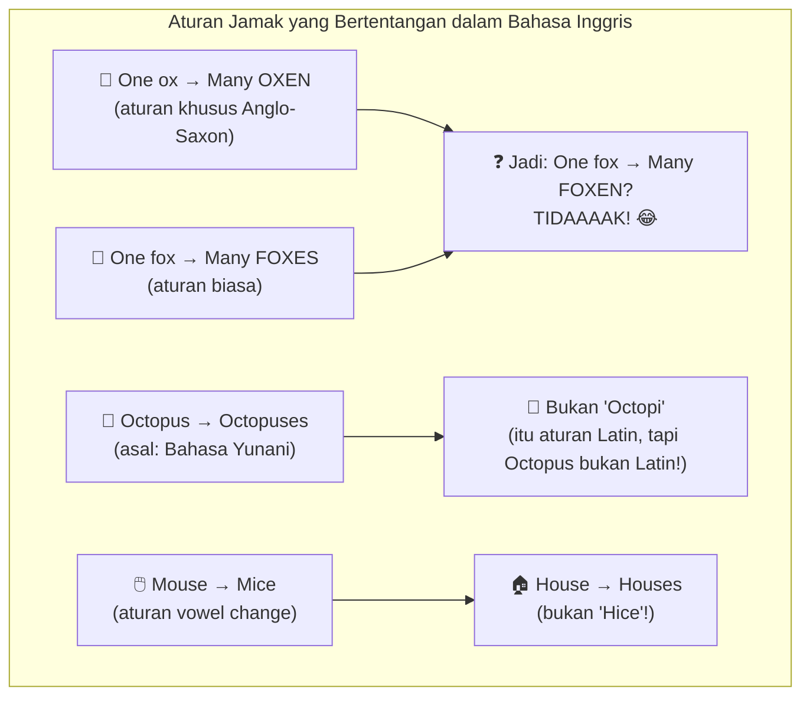

### 🔇 Huruf-Huruf Diam Bahasa Prancis — Kejahatan Linguistik

Bahasa Prancis terkenal karena satu hal yang membuat pelajar bahasa frustasi: **huruf-huruf yang ditulis tapi tidak diucapkan sama sekali**.

Contoh paling mencolok yang beredar di internet: kata *oiseaux* yang artinya *burung* dalam bentuk jamak.

- Kata itu terdiri dari 7 huruf: **o-i-s-e-a-u-x**
- Tidak satu pun huruf diucapkan seperti seharusnya
- Pengucapannya: **"wazo"**

*"Tidak ada bahasa yang seharusnya diolok-olok selain Prancis."* 😤

Fenomena ini bukan keanehan yang muncul tiba-tiba — ia adalah hasil dari **evolusi bahasa selama ratusan tahun**. Cara orang Prancis berbicara berubah, tapi cara mereka menulis tidak selalu mengikuti. Hasilnya: ortografi (*cara penulisan*) yang mencerminkan pengucapan abad ke-13, tapi digunakan untuk bahasa yang diucapkan secara sangat berbeda di abad ke-21.

### 🐟 "Ghoti" Mengeja "Fish" — Absurditas Ejaan Bahasa Inggris

Siapakah yang pertama kali mencetuskan ide bahwa kata *fish* dalam bahasa Inggris bisa ditulis sebagai **GHOTI**?

Ide ini dipopulerkan oleh penulis *Finnegans Wake*, **James Joyce** — dan belakangan dikaitkan dengan penulis satire George Bernard Shaw — untuk menunjukkan betapa inkonsistennya sistem ejaan Bahasa Inggris:

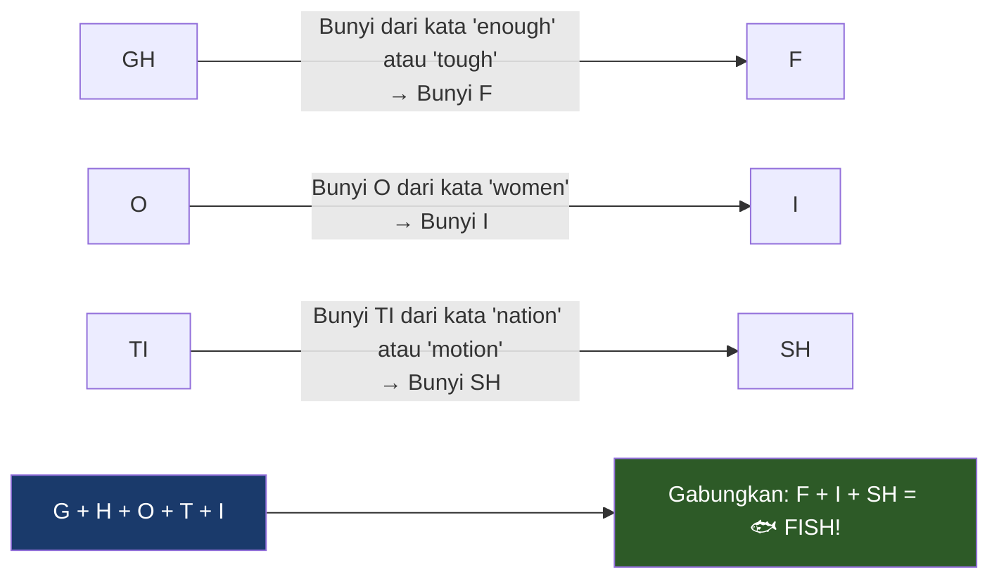

Poem *"The Chaos"* oleh **Gerard Nolst Trinité** mengabadikan kefrustrasian serupa — sebuah puisi panjang yang pada intinya adalah **omelan tentang betapa tidak konsistennya ejaan dan pengucapan Bahasa Inggris**:

> *"Dearest creature in creation,  
> Studying English pronunciation,  
> I will teach you in my verse  
> Sounds like corpse, core, horse, and worse..."*

Dan seterusnya selama ratusan baris. Menghibur sekaligus menyiksa. 😄

---

## 🏔️ Lapisan Menengah: Sejarah, Ilmu, dan Fenomena Linguistik

### 🐣 Duolingo — Aplikasi Belajar Bahasa yang Tidak Mengajarkan Bahasamu

Duolingo adalah aplikasi *edtech* (*educational technology*) dengan logo burung hantu yang lucu, bertujuan membantu orang belajar bahasa baru. Kelihatannya mulia — tapi ada masalah fundamental di sini.

**Tujuan utama Duolingo bukan mengajarkan bahasamu. Tujuan utamanya adalah membuatmu tetap berada di aplikasi selama mungkin.**

Seperti perusahaan teknologi lainnya, model bisnisnya bergantung pada *engagement* (*keterlibatan pengguna*) — metrik jam yang dihabiskan di aplikasi. Ini menciptakan insentif yang **tidak selaras dengan pembelajaran bahasa yang efektif**:

| Pendekatan Duolingo | Pendekatan Pengajaran Bahasa yang Baik |
|---|---|
| Langsung terjun ke kuis dan pola | Ajarkan struktur gramatikal terlebih dahulu |
| Belajar melalui *trial and error* (coba-salah) | Berikan konteks linguistik sebelum contoh |
| Gamifikasi (*gamification*) sebagai motivasi | Pemahaman mendalam sebagai fondasi |
| Streak dan poin sebagai penghargaan | Kemampuan berkomunikasi nyata sebagai tujuan |

Jika kamu sungguh-sungguh ingin menguasai bahasa baru, mengambil kursus formal, belajar dengan buku, atau bahkan menonton film asing dengan subtitel kemungkinan **jauh lebih efektif** daripada Duolingo.

Duolingo mungkin berguna sebagai alat pendukung, atau sebagai *refresher* (pengingat kembali) bahasa yang pernah kamu pelajari. Tapi jangan berharap menjadi fasih hanya dari streak Duolingo. 🦉

### 📏 Bahasa Termudah dan Tersulit — Ranking Resmi FSI

**Foreign Service Institute** (*Institut Layanan Luar Negeri*) Amerika Serikat membuat daftar berapa lama rata-rata dibutuhkan untuk mempelajari berbagai bahasa hingga mencapai tingkat kecakapan tertentu, **bagi penutur bahasa Inggris**:

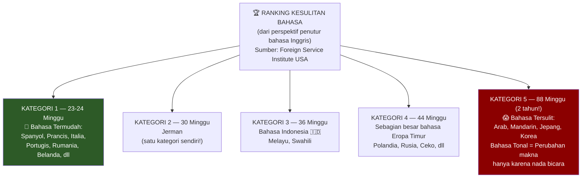

**Menarik untuk diperhatikan:** Bahasa Indonesia termasuk kategori 3 — lebih mudah dari kebanyakan bahasa Eropa Timur tapi jauh lebih mudah dari Mandarin. Ini karena Bahasa Indonesia tidak memiliki sistem tonal, tidak memiliki huruf kanji ribuan karakter, dan memiliki struktur kalimat yang relatif lugas.

**Mandarin** adalah salah satu yang tersulit bukan hanya karena 10.000+ karakter (meski *hanya* ~3.000 yang dibutuhkan untuk dianggap fasih) — tapi juga karena sifatnya sebagai **bahasa tonal** (*tonal language*). Dalam bahasa tonal, nada suara mengubah makna kata secara fundamental:

> Kata *ma* (妈/麻/马/骂) dalam Mandarin bisa berarti: **ibu**, **mati rasa**, **kuda**, atau **umpatan** — tergantung nada yang digunakan.

### 🔄 Code Switching — Seni Berganti Identitas Linguistik

**Code switching** (*peralihan kode*) adalah fenomena di mana seseorang mengubah cara berbicara mereka tergantung pada konteks — bisa berganti antara dua bahasa berbeda, dialek berbeda, aksen berbeda, atau bahkan tata bahasa dan kosakata yang berbeda.

Contoh paling terkenal di Amerika adalah penutur **African-American Vernacular English (AAVE)** — bahasa Inggris vernakular Afrika-Amerika — yang sering berpindah antara AAVE saat bicara dengan teman dan komunitas, dan Bahasa Inggris standar saat di sekolah atau wawancara kerja.

**Penting untuk dipahami:** AAVE bukan bahasa Inggris yang "salah" atau "tidak gramatikal". Ia memiliki **aturan gramatikalnya sendiri yang konsisten secara internal** — sama seperti bahasa Inggris standar. Contohnya:

- **Double negative**: *"He didn't go nowhere"* — dalam AAVE, dua kata negatif **memperkuat** negasi (seperti dalam banyak bahasa lain), bukan saling membatalkan
- **Habitual be**: *"He be working out"* ≠ *"He is working out"* — ini berarti *"Dia secara rutin/terbiasa berolahraga"*, sebuah tense (*kala*) yang tidak ada padanannya dalam bahasa Inggris standar!

*Code switching* itu sendiri, menariknya, memberikan manfaat kognitif yang serupa dengan bilingualisasi — mengembangkan keterampilan berpikir kritis dan **executive function** (*fungsi eksekutif*: kemampuan merencanakan, berfokus, dan mengingat instruksi).

### 👁️ Faux Cyrillic — Estetika Soviet yang Palsu

**Cyrillic script** (*aksara Sirilik*) adalah sistem tulisan yang digunakan di Rusia, Ukraina, Bulgaria, Serbia, dan berbagai bahasa lainnya. Beberapa karakternya terlihat menarik dan "asing" dari perspektif orang yang terbiasa dengan aksara Latin.

**Faux Cyrillic** (*Sirilik Palsu*) adalah praktik desain grafis di mana karakter Sirilik yang terlihat mirip huruf Latin disubstitusikan — bukan untuk dibaca sebagai Sirilik, tapi untuk memberikan kesan estetik "Soviet" atau "Rusia".

Contoh terkenal: Logo **TETRIS** yang ditulis dengan huruf R terbalik (Я dalam Sirilik, digunakan sebagai R) untuk mengingatkan orang tentang asal-usul Rusia permainan itu. Film *Borat* juga sering menggunakan estetika serupa.

Ironisnya, orang yang benar-benar bisa membaca Sirilik akan menemukan hasil *faux Cyrillic* ini seringkali **tidak bermakna sama sekali** atau bahkan terlihat absurd — karena huruf-huruf tersebut dipilih berdasarkan kemiripan visual, bukan fonetis.

### 🗣️ "Bahasa adalah Dialek yang Punya Angkatan Darat dan Angkatan Laut"

Ini adalah kutipan terkenal yang dikaitkan dengan sosio-linguist (*ahli bahasa sosial*) **Max Weinreich**, yang katanya mendengarnya dari seorang mahasiswa di salah satu kuliahnya.

Apa artinya?

**Perbedaan antara "bahasa" dan "dialek" pada dasarnya adalah perbedaan **politis**, bukan linguistis** (*berkaitan dengan ilmu bahasa*).

Mandarin dan Kanton sama-sama disebut "bahasa Cina" meski penutur keduanya tidak bisa saling memahami satu sama lain. Bahasa Serbia dan Kroasia sangat mirip secara linguistis tapi dianggap dua bahasa terpisah karena politik nasionalisme. Sementara berbagai dialek Jerman bisa sangat berbeda tapi tetap disebut "bahasa Jerman" karena kesamaan negara.

*"Dialek" adalah sesuatu yang tidak punya negara. "Bahasa" adalah sesuatu yang punya pemerintahan di belakangnya.*

---

## 🌊 Lapisan Menengah-Dalam: Linguistik Ilmiah dan Kontroversi

### 📖 Deskriptivisme vs. Preskriptivisme — Perang Abadi tentang "Bahasa yang Benar"

Ini adalah salah satu debat paling fundamental dalam dunia linguistik:

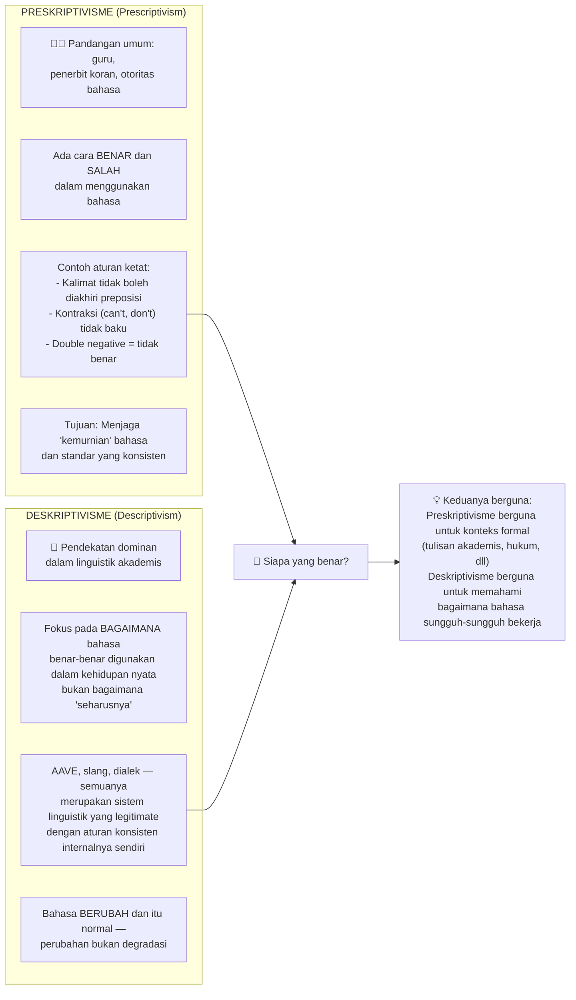

Contoh konkret: Seseorang yang obsesif berkata: *"Kamu bilang 'less books', padahal seharusnya 'fewer books'!"*

Tanggapan deskriptivisme: *Orang-orang menggunakan "less" dalam konteks ini setiap saat, semua orang paham maksudnya, dan itu komunikasi yang sempurna efektif — jadi apa masalahnya?*

### 🗣️ Hipotesis Sapir-Whorf — Apakah Bahasamu Menentukan Pikiranmu?

**Hipotesis Sapir-Whorf** (*Sapir-Whorf Hypothesis*), juga dikenal sebagai **Hipotesis Relativitas Linguistik** (*Linguistic Relativity Hypothesis*), adalah salah satu ide paling menarik sekaligus paling diperdebatkan dalam linguistik:

**Pertanyaan intinya: Apakah bahasa yang kamu gunakan memengaruhi — atau bahkan menentukan — cara kamu berpikir dan memandang dunia?**

Ada dua versi hipotesis ini:

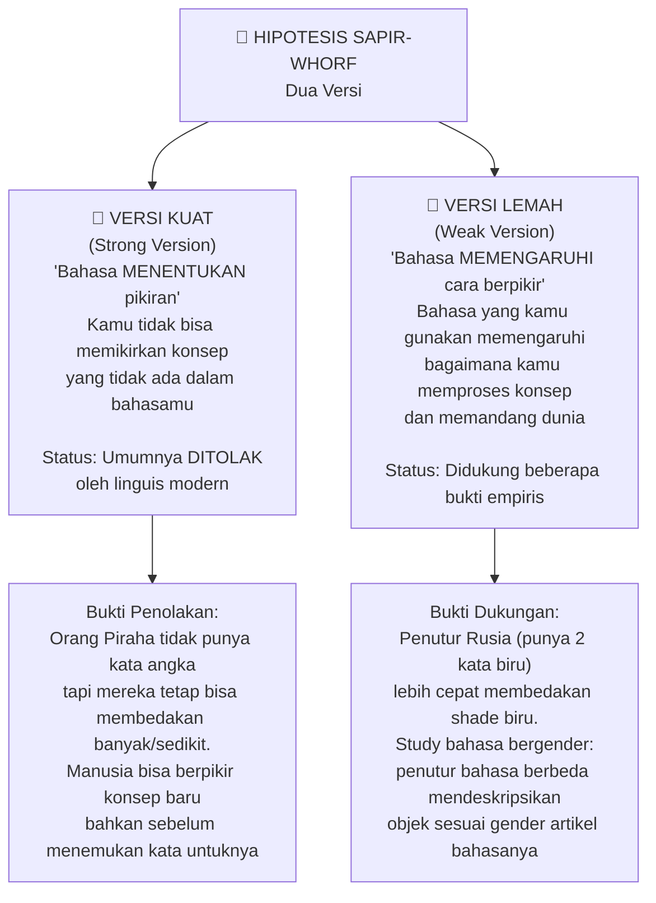

**Bukti menarik untuk versi lemah:**

1. **Biru dalam Bahasa Rusia**: Bahasa Rusia memiliki dua kata terpisah untuk biru — *goluboy* (biru muda) dan *siniy* (biru tua). Bukan seperti nuansa seperti "biru langit" vs "biru laut" dalam bahasa Inggris — ini adalah warna dasar yang setara dengan "hijau" dan "ungu". Eksperimen menunjukkan penutur Rusia **lebih cepat** membedakan dua shade biru yang melewati batas *goluboy/siniy*, sementara penutur bahasa Inggris tidak menunjukkan keunggulan serupa. Dan menariknya: ketika peserta diminta melakukan tugas verbal secara bersamaan, keunggulan ini **hilang** — menunjukkan bahwa bahasa memang membantu persepsi mereka.

2. **Bahasa Bergender dan Persepsi Objek**: Peneliti **Lera Boroditsky** menemukan bahwa penutur bahasa berbeda (Spanyol dan Jerman) mendeskripsikan objek dengan cara yang mencerminkan gender artikel bahasanya masing-masing — meski gender objek bisa berbeda antara keduanya. Penelitian ini dikritik keras, tapi tetap membuka diskusi menarik.

**Kelemahan hipotesis ini:** Beberapa contoh yang digunakan ternyata berlebihan. Contoh terkenal "orang Hopi tidak punya konsep waktu" (oleh Wharf) kemudian dibantah — Bahasa Hopi punya konsep waktu, hanya orientasinya berbeda (masa depan/non-masa depan alih-alih masa lalu/non-masa lalu).

### 🌈 Great Vowel Shift — Ketika Semua Vokal Bergeser Sekaligus

Antara abad ke-14 dan ke-17, terjadi sesuatu yang menakjubkan dalam sejarah Bahasa Inggris: **semua vokal utama bergeser pengucapannya secara bertahap**, sebuah fenomena yang disebut **Great Vowel Shift** (*Pergeseran Vokal Besar*).

Ini menjelaskan kenapa ejaan bahasa Inggris terlihat sangat tidak konsisten dengan pengucapannya — karena ejaan sebagian besar ditetapkan **sebelum** pergeseran ini terjadi.

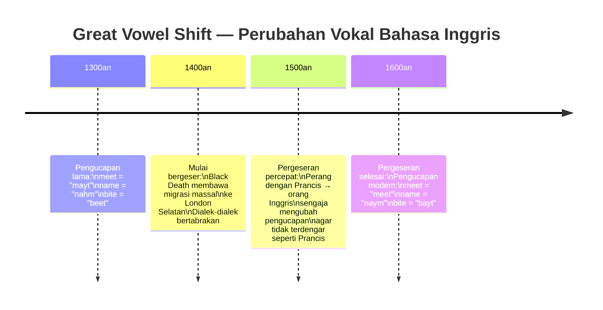

Dua teori tentang mengapa ini terjadi:
1. Migrasi massal ke London Selatan setelah wabah *Black Death* (*Maut Hitam*) membuat berbagai dialek berbenturan — orang London yang "elit" ingin membedakan diri dari para pendatang dengan mengubah cara bicara mereka
2. Perang Inggris-Prancis menyebabkan orang Inggris secara sadar mengubah pengucapan agar tidak terdengar "terlalu Prancis"

---

## 🌊 Lapisan Dalam: Misteri, Bahasa Buatan, dan Asal-Usul Bahasa

### 🕊️ Esperanto — Mimpi Bahasa Universal yang Hancur oleh Perang

Pada tahun 1887, seorang pria bernama **L.L. Zamenhof** mencoba memecahkan masalah terbesar umat manusia: hambatan bahasa.

Zamenhof adalah seorang *language enjoyer* (*pencinta bahasa*) sejati — ia berbicara Rusia, Jerman, Prancis, Polandia, Latin, Ibrani, dan Yunani. Ia frustasi dengan perpecahan budaya, rasisme, dan nasionalisme yang ia saksikan, dan bermimpi tentang dunia di mana semua orang bisa berkomunikasi dalam bahasa yang netral tanpa keunggulan satu pihak atas pihak lain.

Ia menciptakan **Esperanto** — yang dalam bahasa itu sendiri berarti *"orang yang berharap"*.

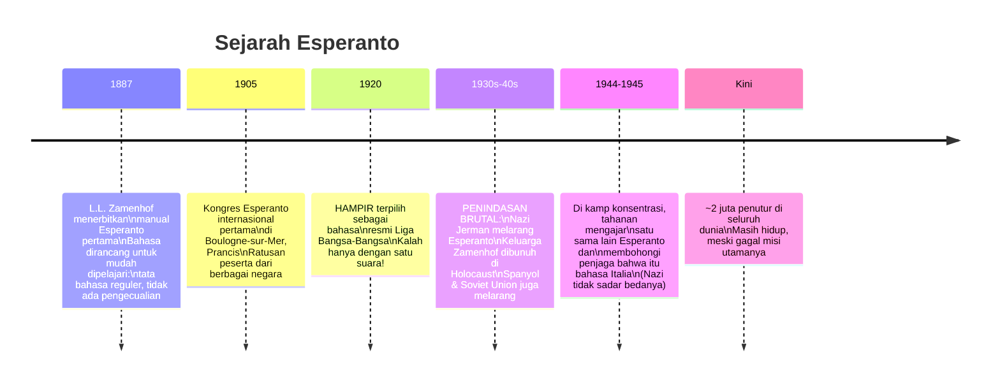

Kisah Esperanto adalah salah satu yang paling tragis dalam sejarah linguistik — sebuah proyek mulia yang nyaris mengubah dunia, dihancurkan oleh ideologi kebencian yang ingin menghancurkan hal yang sama yang Zamenhof perjuangkan: persatuan lintas budaya.

### 📜 Manuskrip Voynich — Misteri Abadi Bahasa yang Tak Terpecahkan

Di antara abad ke-15 dan saat ini, ada sebuah buku yang belum terpecahkan oleh seorang pun.

**Manuskrip Voynich** adalah sebuah buku tulisan tangan yang ditemukan kembali oleh *antiquarian* (*kolektor barang antik*) **Wilfrid Voynich** pada tahun 1912 — meski berdasarkan penanggalan karbon, dibuat sekitar awal abad ke-15.

Yang membuatnya begitu aneh:
- 🌿 Berisi gambar-gambar tanaman yang **tidak ada di dunia nyata**
- ⭐ Diagram astronomikal dan astrologi
- 🛁 Gambar-gambar perempuan di kolam mandi yang mengalir dari berbagai tabung
- 📝 Seluruhnya ditulis dalam **aksara yang sepenuhnya tidak dikenal** (*Voynichese*)

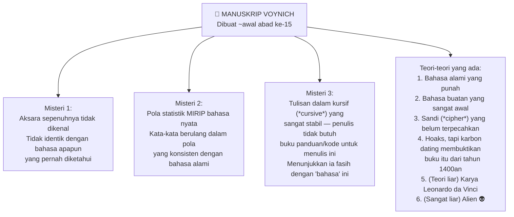

Ratusan kriptografer (*pemecah sandi*), termasuk para pemecah kode dari Perang Dunia II, telah mencoba memecahkan manuskrip ini. Tidak ada yang berhasil — selain mengidentifikasi struktur alphabet-nya.

### 🧬 Bahasa Proto-Indo-Eropa — Nenek Moyang Ribuan Bahasa

Pada abad ke-19, para linguis melakukan sebuah terobosan revolusioner: dengan membandingkan pola suara dan kata dalam berbagai bahasa, mereka **merekonstruksi** keberadaan sebuah bahasa purba yang tidak pernah ditulis — bahasa yang menjadi nenek moyang ratusan bahasa modern.

Bahasa ini disebut **Proto-Indo-Eropa (PIE)** — *Proto-Indo-European* — dan sekarang kita tahu bahwa bahasa-bahasa seberani Bahasa Inggris, Jerman, Rusia, Spanyol, Hindi, Iran, dan bahkan Bahasa Sansekerta semuanya adalah keturunan dari bahasa yang sama ini.

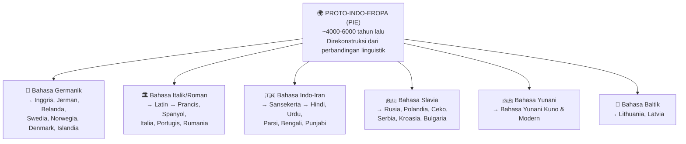

**Dari mana PIE berasal?**

Teori paling diterima saat ini adalah **Hipotesis Kurgan** dari arkeolog **Marija Gimbutas**: sekelompok penggembala (*herders*) dari padang rumput di wilayah Ukraina modern adalah penutur asli PIE. Mereka telah menjinakkan kuda dan mengembangkan bentuk awal kereta perang (*chariots*), yang membantu mereka berekspansi. Studi DNA dari tulang-tulang manusia pada masa itu menunjukkan gen mereka **menggantikan sekitar tiga perempat pool gen manusia di Eropa** — sehingga bahasanya pun menjadi dominan.

### 🐻 Tabu Beruang — Mengapa Kita Tidak Menyebut Nama Hewan Berbahaya

Ini adalah salah satu temuan paling menarik tentang sejarah kata-kata.

Kata *bear* (*beruang*) dalam bahasa-bahasa yang berasal dari PIE menunjukkan pola yang sangat aneh. Sebagian besar kata dalam bahasa-bahasa ini berevolusi dari akar PIE yang sama dan dapat dilacak secara reguler — tapi kata untuk "beruang" bervariasi secara aneh:

| Rumpun Bahasa | Kata untuk Beruang | Asal |
|---|---|---|
| Latin, Prancis | *ursus*, *ours* | Dari akar PIE *rksos* |
| Inggris, Jerman, Belanda | *bear*, *Bär*, *beer* | Dari PIE *bʰerH* = **"si cokelat"** |
| Rusia, Ceko | *медведь (medved')* | Berarti **"pemakan madu"** |
| Swedia | *varg* | Dari kata untuk "orang buangan" |

Mengapa variasi ini? Para linguis menduga ini akibat **tabu berbicara** (*speech taboo*) — dalam beberapa budaya kuno, **menyebut nama beruang secara langsung dianggap berbahaya** karena dipercaya dapat memanggil hewan itu.

Bayangkan seperti Voldemort di Harry Potter — *"dia yang tidak boleh disebutkan namanya."* Alih-alih mengucapkan nama aslinya, orang-orang menggantinya dengan eufemisme (*ungkapan pengganti*): *"si cokelat"*, *"pemakan madu"*, *"si pengembara"*. Dan lama kelamaan, nama aslinya terlupakan sama sekali.

*"Manusia zaman dahulu di utara rupanya tidak secomfy (*senyaman*) orang modern terhadap beruang seperti yang digambarkan di ilustrasi teh Sleepytime."* 🐻☕

---

## 🌊 Lapisan Sangat Dalam: Fenomena Esoterik dan Teori Kontroversial

### 🐦 Pidgin dan Kreol — Ketika Dua Bahasa Bertabrakan

Ketika dua kelompok manusia yang berbicara bahasa berbeda perlu berkomunikasi tanpa penerjemah, sesuatu yang luar biasa sering terjadi: mereka **menciptakan bahasa baru dari nol**.

**Pidgin** (*Pidgin language*) adalah bahasa yang disederhanakan yang muncul dari perpaduan dua bahasa berbeda — biasanya membuang semua tata bahasa yang rumit dari kedua sisi. Contoh: ketika pedagang Eropa bertemu dengan komunitas Asia atau Afrika.

Tapi yang lebih menarik adalah apa yang terjadi **ketika anak-anak tumbuh menggunakan pidgin sebagai bahasa utama mereka**. Mereka tidak mewariskan pidgin yang sederhana itu — mereka secara spontan **menambahkan kompleksitas gramatikal** yang tidak ada sebelumnya, menciptakan apa yang disebut **Kreol** (*Creole language* — bahasa kreol).

Contoh nyata: Di Haiti, sebuah pidgin muncul antara penjajah Prancis dan budak Afrika. Generasi berikutnya mengubahnya menjadi **Haitian Creole** (*Kreol Haiti*) — yang kini menjadi salah satu bahasa resmi Haiti.

Temuan ini menjadi salah satu **bukti terkuat untuk innateness** (*sifat bawaan*) bahasa — bahwa anak-anak tampaknya lahir dengan struktur pemahaman bahasa yang memungkinkan mereka membangun sistem gramatikal bahkan dari bahan baku yang sangat primitif.

### 👶 Bahasa Isyarat Nicaragua — Bahasa yang Lahir di Depan Mata Para Linguis

Salah satu peristiwa paling mengagumkan dalam sejarah linguistik modern terjadi pada akhir 1970-an di **Nicaragua**.

Sebelumnya, anak-anak tuli di Nicaragua umumnya diisolasi dari satu sama lain dan tidak pernah diajarkan bahasa isyarat apapun. Ketika pada tahun 1977 **sekolah untuk anak tuli** pertama dibuka, terjadi sesuatu yang tidak ada yang antisipasi:

**Anak-anak menciptakan bahasa isyarat mereka sendiri dari nol.**

Tanpa guru bahasa isyarat. Tanpa model. Mereka hanya berinteraksi satu sama lain — dan bahasa pun muncul secara organis. Generasi berikutnya yang masuk sekolah belajar dari anak-anak yang lebih tua, dan **menambahkan lebih banyak kompleksitas gramatikal** ke bahasa yang baru berumur beberapa tahun.

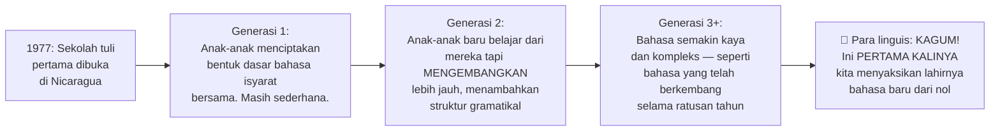

Para linguis yang mempelajari ini hampir tidak percaya. Bahasa yang bisa mereka pelajari sebelumnya selalu merupakan kreol atau perpaduan dua bahasa yang sudah ada. Inilah pertama kalinya sebuah bahasa benar-benar lahir dari nol di depan mata para ilmuwan.

Dan fakta bahwa anak-anak secara spontan menambahkan **kesepakatan kata kerja** (*verb agreement*) dan konvensi gramatikal **tanpa ada yang mengajarkan** itu sangat kuat sebagai bukti bahwa otak manusia memang lahir dengan **cetak biru untuk bahasa**.

### 📊 Bahasa Piraha — Satu-Satunya Bahasa di Dunia Tanpa Konsep Angka?

**Piraha** adalah bahasa yang digunakan oleh sekitar 700 orang yang tinggal di hutan Amazon, Brasil. Ini adalah salah satu bahasa paling menakjubkan yang pernah dipelajari oleh linguis, karena beberapa alasan:

**Sistem fonologis** (*bunyi bahasa*) yang sangat sederhana: hanya 8 konsonan dan 3 vokal — salah satu yang paling minimal dari semua bahasa yang diketahui. Namun meski sederhana, bahasa ini menggunakan berbagai nada yang memungkinkannya **dinyanyikan, disenandungkan, atau disuit** dalam percakapan sehari-hari.

Tapi yang paling menggemparkan: **Piraha tidak memiliki kata-kata untuk angka.**

Mereka memiliki kata untuk "sedikit" dan "agak lebih banyak" dan "banyak" — tapi tidak ada kata untuk "satu", "dua", "tiga", dan seterusnya.

Penelitian MIT menyimpulkan bahwa masyarakat Piraha mungkin adalah **satu-satunya budaya di bumi yang tidak memiliki sistem numerasi** (*numeracy*) sama sekali.

Ketika eksperimen dilakukan dengan meletakkan objek dalam barisan dan meminta mereka membuat barisan yang sama, mereka bisa melakukannya dengan mudah jika bisa melihatnya — tapi jika barisannya disembunyikan, **mereka mulai membuat kesalahan untuk jumlah di atas tiga atau empat** — menunjukkan mereka **memperkirakan secara visual**, bukan menghitung secara presisi.

Tidak adanya angka ini bukan cacat — **mereka tidak perlu angka untuk kehidupan mereka**. Dan ini menjadi bukti kuat bahwa matematika dan konsep angka bukanlah sesuatu yang "otomatis" bagi semua manusia — ia membutuhkan **bahasa dan sistem yang mendukungnya**.

### 👶 Innateness — Apakah Bahasa Diprogramkan di Otak Kita Sejak Lahir?

Ini adalah salah satu debat paling besar dalam psikologi dan linguistik abad ke-20 — dan di pusatnya ada dua nama besar:

**B.F. Skinner** (*si peneliti tikus tombol*) berpendapat bahwa pembelajaran bahasa adalah proses **conditioning dan reinforcement** (*pembiasaan dan penguatan*) murni — sama seperti tikus yang belajar menekan tombol untuk mendapatkan makanan. Kita melihat seseorang menunjuk anjing sambil berkata "anjing", dan kita mengulanginya, mendapat pujian, dan belajar.

**Noam Chomsky** — mungkin linguis paling berpengaruh sepanjang masa — **menghancurkan argumen Skinner** dengan beberapa poin:

1. Anak-anak tidak belajar bahasa karena diberi hadiah atau hukuman untuk kalimat yang benar/salah. Mereka belajar dengan **menonton TV dan mendengar orang bicara di sekitar mereka**
2. Anak-anak dapat **membuat kalimat yang belum pernah mereka dengar sebelumnya** — ini tidak mungkin jika bahasa hanya soal menghafal pola
3. Semua bahasa manusia, meski berbeda secara permukaan, memiliki **struktur yang lebih dalam yang sama** — menunjukkan bahwa otak manusia lahir dengan **tata bahasa universal** (*universal grammar*)

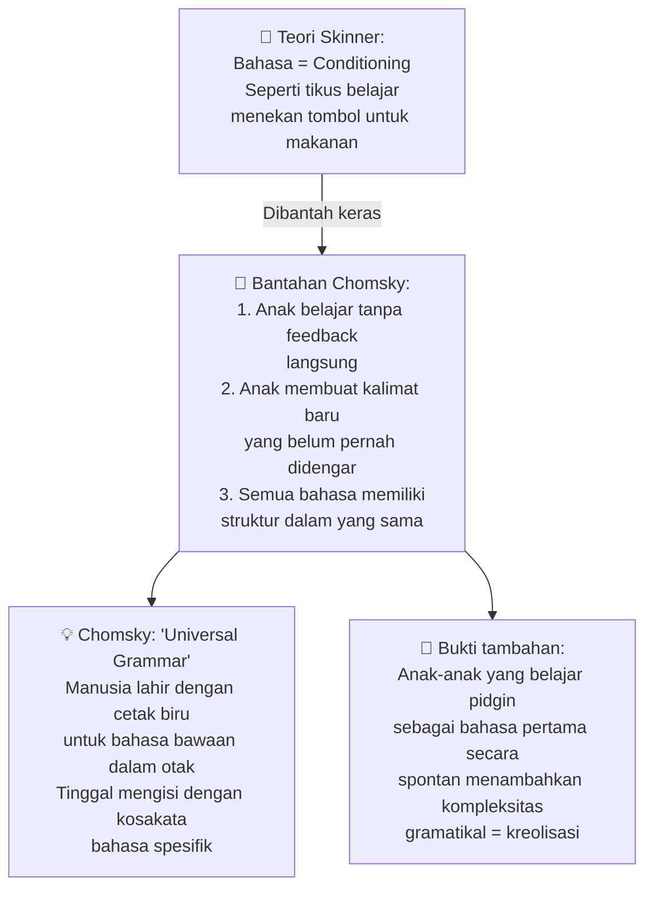

**Bukti terkuat untuk innateness:**
- **Critical Period Hypothesis** (*Hipotesis Periode Kritis*): Jika anak tidak terpapar bahasa sebelum usia ~5 tahun, mereka nyaris tidak akan pernah bisa menguasai bahasa secara penuh
- Kasus tragis **Genie** — seorang gadis yang dikurung oleh orang tuanya dan tidak pernah diajak bicara — yang akhirnya berjuang keras dengan bahasa sepanjang hidupnya meski kemudian diajari
- Lahirnya Bahasa Isyarat Nicaragua (seperti dibahas di atas)

### 🌟 Mama & Papa — Mengapa Semua Bahasa di Dunia Memiliki Kata Serupa untuk Orang Tua?

Ini adalah satu kebetulan menakjubkan yang ternyata bukan kebetulan sama sekali.

Bahasa-bahasa yang tidak memiliki hubungan satu sama lain — Swahili, Tagalog, Mandarin, dan bahasa Indo-Eropa — semuanya memiliki kata yang sangat mirip untuk ibu dan ayah:

| Bahasa | Ibu | Ayah |
|---|---|---|
| Inggris | mama | papa |
| Prancis | maman | papa |
| Mandarin | māma | bàba |
| Swahili | mama | baba |
| Tagalog | nanay | tatay |
| Arab | mama | baba |
| Hindi | maa | baap/papa |
| Jawa | mama/biyung | bapak/papa |

Ini bukan karena semua bahasa berasal dari nenek moyang yang sama. Ini karena **fisika bagaimana bayi belajar berbicara**:

**Linguis Roman Jakobson** menemukan bahwa:
1. Vokal paling mudah yang bisa dibuat bayi adalah **"ah"** — cukup buka mulut dan bersuara, tanpa perlu menempatkan lidah atau bibir di posisi khusus
2. Ketika bayi mulai bereksperimen, hal pertama yang akan mereka coba adalah **menutup bibir** → menghasilkan suara **"m"** → gabungkan dengan "ah" → **mama**!
3. Langkah berikutnya: **merapatkan bibir dan menghembuskan udara** → menghasilkan suara **"p"** atau **"b"** → gabungkan dengan "ah" → **papa/baba**!

Karena bayi menghabiskan paling banyak waktu bersama ibunya, suara pertama yang lebih sederhana (*mama*) dikaitkan dengan ibu. Suara yang datang sedikit lebih kemudian (*papa/baba*) — yang memerlukan kontrol motorik yang sedikit lebih matang — dikaitkan dengan ayah.

**Semua bahasa di dunia konvergen pada kata yang sama karena fisika produksi suara bayi yang universal.** 🌍

---

## 🔬 Lapisan Terdalam: Misteri yang Belum Terpecahkan

### 🌍 Proto-World — Bahasa Induk Semua Bahasa Manusia?

Jika PIE adalah nenek moyang ratusan bahasa, pertanyaan selanjutnya adalah: **Dari mana PIE sendiri berasal?**

Dan lebih jauh: apakah semua bahasa di dunia — termasuk bahasa-bahasa yang tidak berkerabat dengan PIE seperti Mandarin, Swahili, atau Bahasa Indonesia — semuanya berasal dari **satu bahasa purba tunggal**?

Hipotesis ini disebut **Proto-World** atau **Proto-Human Language** (*Bahasa Protomanusia*).

Argumennya: Semua manusia di mana saja memiliki kapasitas untuk belajar bahasa apapun. Kemungkinan besar leluhur kita memiliki kapasitas yang sama. Jika kita telusuri cukup jauh ke belakang, mungkin ada satu titik di mana hanya ada satu bahasa.

Masalahnya: Kita tidak bisa membuktikan ini. Bahasa berubah begitu cepat sehingga **tidak mungkin merekonstruksi bahasa dari lebih dari ~8.000 tahun** yang lalu berdasarkan perbandingan bahasa modern. PIE direkonstruksi karena perubahan bahasa bisa dilacak secara reguler — tapi semakin jauh ke belakang kita pergi, semakin sedikit bukti yang tersisa.

Kemungkinan alternatif: **Bahasa mungkin muncul dan hilang secara independen beberapa kali** dalam sejarah manusia — artinya bisa ada Proto-Bahasa 1, Proto-Bahasa 2, Proto-Bahasa 3, dst., yang masing-masing berkembang sendiri-sendiri di komunitas manusia yang terisolasi.

*Jika hanya kita menemukan tulisan puluhan ribu tahun lebih awal dari yang kita temukan, mungkin kita sudah tahu jawabannya.* 📜

### 🧬 Teori "Stoned Ape" — Apakah Jamur Psikedelik yang Melahirkan Bahasa?

Kita menutup perjalanan ini dengan mungkin teori paling liar yang pernah ada dalam diskusi tentang asal-usul bahasa.

**Terence McKenna** — filsuf dan advokat psikedelik yang sangat berpengaruh di subkultur California era 80-90an — mengajukan apa yang ia sebut **"Stoned Ape Theory"** (*Teori Kera Mabuk*):

Leluhur manusia kuno yang melacak kawanan sapi untuk berburu kemungkinan besar menemukan **jamur psilosibin** (*jamur ajaib*) yang tumbuh di kotoran sapi. Dalam dosis kecil, jamur ini meningkatkan ketajaman visual (berguna untuk berburu). Dalam dosis yang lebih besar, meningkatkan energi dan **mempererat ikatan sosial**.

Dan pengalaman psikedelik dari jamur ini, kata McKenna, bisa jadi yang **memicu evolusi budaya yang dipercepat** — memunculkan bentuk awal agama, spiritualitas, seni, dan yang paling penting: **bahasa**.

**Reaksi akademis:** Tidak diterima secara luas. McKenna sendiri ketika ditekan mengakui ini hanyalah spekulasi yang menarik, bukan teori yang ia yakini sepenuhnya.

Namun ada satu aspek yang tidak sepenuhnya fantasi: bahwa manusia purba kemungkinan besar **mengkonsumsi substansi psikedelik**, dan pengalaman itu memengaruhi budaya mereka — ini tidak terlalu kontroversial. Yang tidak dapat dibuktikan adalah klaim bahwa penggunaan itu **mengubah genetika** manusia dan secara langsung menyebabkan lahirnya bahasa.

---

## 🌟 Penutup: Bahasa adalah Kita

Dari pluralisasi oktopus hingga hipotesis tentang bagaimana bahasa pertama manusia lahir, dari naskah Voynich yang tak terpecahkan hingga bayi yang menciptakan kata "mama" di semua budaya dengan mekanisme yang sama — **bahasa adalah cermin paling jelas dari apa itu kemanusiaan**.

Bahasa bukan sekadar alat komunikasi. Bahasa adalah:
- 🏛️ **Artefak sejarah** — yang menyimpan jejak migrasi, penaklukan, dan pertemuan antara peradaban
- 🧠 **Jendela ke pikiran** — yang memengaruhi (dan mungkin membatasi) cara kita memandang dunia
- 🌱 **Organisme hidup** — yang terus berevolusi, beradaptasi, lahir, dan mati
- 🎭 **Identitas kolektif** — yang membedakan komunitas sekaligus menyatukan umat manusia dalam kesamaan yang dalam

Dan mungkin yang paling menakjubkan: bahwa bayi di mana saja di dunia, dari Amazon hingga Tokyo hingga Lagos, membuka mulutnya untuk pertama kali dan menghasilkan bunyi yang sama — **mama** — adalah bukti bahwa di balik semua keberagaman budaya dan bahasa yang ada, ada sesuatu yang **fundamental dan universal dalam diri kita semua**. 🌍

---

## 📚 Glosarium Lengkap

| Istilah | Penjelasan |
|---|---|
| **Linguistik** | Ilmu yang mempelajari bahasa secara sistematis |
| **Fonologi** (*Phonology*) | Cabang linguistik yang mempelajari sistem bunyi dalam bahasa |
| **Morfologi** (*Morphology*) | Cabang linguistik yang mempelajari struktur kata |
| **Sintaks** (*Syntax*) | Cabang linguistik tentang bagaimana kata membentuk kalimat |
| **Semantik** (*Semantics*) | Cabang linguistik tentang makna kata dan kalimat |
| **Ortografi** (*Orthography*) | Sistem penulisan/ejaan resmi suatu bahasa |
| **Proto-Indo-Eropa (PIE)** | Bahasa purba yang direkonstruksi, nenek moyang ratusan bahasa modern |
| **Bahasa Tonal** (*Tonal Language*) | Bahasa di mana nada suara mengubah makna kata (Mandarin, Thai, dll.) |
| **Deskriptivisme** (*Descriptivism*) | Pendekatan linguistik yang menjelaskan bahasa sebagaimana digunakan, bukan sebagaimana "seharusnya" |
| **Preskriptivisme** (*Prescriptivism*) | Pendekatan yang menetapkan aturan tentang penggunaan bahasa yang "benar" |
| **Hipotesis Sapir-Whorf** | Hipotesis bahwa bahasa memengaruhi cara berpikir dan memandang dunia |
| **Code Switching** (*Peralihan Kode*) | Berganti-ganti antara dua atau lebih bahasa/dialek tergantung konteks |
| **Dialek** | Variasi suatu bahasa yang ditandai oleh kosakata, tata bahasa, atau pengucapan yang berbeda |
| **Pidgin** | Bahasa yang disederhanakan yang muncul dari perpaduan dua bahasa berbeda |
| **Kreol** (*Creole*) | Bahasa yang berkembang dari pidgin ketika anak-anak menggunakannya sebagai bahasa pertama |
| **Innateness** (*Bawaan*) | Teori bahwa kemampuan bahasa sebagian besar diprogramkan dalam otak manusia sejak lahir |
| **Universal Grammar** (*Tata Bahasa Universal*) | Teori Chomsky bahwa semua bahasa manusia berbagi struktur dasar yang sama |
| **Creolization** (*Kreolisasi*) | Proses transformasi pidgin menjadi bahasa kreol yang lebih kompleks |
| **Critical Period** (*Periode Kritis*) | Fase awal kehidupan (~0-5 tahun) di mana otak paling plastis untuk belajar bahasa |
| **Faux Cyrillic** (*Sirilik Palsu*) | Penggunaan karakter Sirilik dalam konteks Latin untuk efek estetik "Soviet" |
| **Pangram** | Kalimat yang mengandung setiap huruf alfabet setidaknya satu kali |
| **Esperanto** | Bahasa buatan yang diciptakan L.L. Zamenhof (1887) sebagai bahasa internasional netral |
| **Manuskrip Voynich** | Naskah tulisan tangan abad ke-15 dalam aksara yang belum terpecahkan hingga kini |
| **Hipotesis Kurgan** | Teori bahwa penutur Proto-Indo-Eropa berasal dari padang rumput Ukraina |
| **Great Vowel Shift** | Pergeseran sistematis pengucapan vokal dalam Bahasa Inggris antara abad 14-17 |
| **AAVE** | *African-American Vernacular English* — dialek bahasa Inggris dengan tata bahasa konsisten sendiri |
| **Speech Taboo** (*Tabu Berbicara*) | Larangan budaya untuk menyebut kata/nama tertentu |
| **Glottokronologi** | Metode menentukan kapan dua bahasa berpisah dari nenek moyang yang sama |
| **Etymologi** (*Etymology*) | Studi tentang asal-usul kata dan bagaimana maknanya berubah |
| **Folk Etymology** (*Etimologi Rakyat*) | Cerita tidak akurat tapi populer tentang asal-usul suatu kata |
| **Habitual Be** | Fitur gramatikal AAVE yang menyatakan kebiasaan (bukan keadaan saat ini) |
| **Linguistic Relativity** | Hipotesis bahwa struktur bahasa memengaruhi cara penuturnya berpikir |
| **Conlang** | *Constructed Language* — bahasa yang sengaja diciptakan (Esperanto, Klingon, Dothraki, dll.) |
| **Proto-World** | Hipotesis bahwa semua bahasa dunia berasal dari satu bahasa purba tunggal |
| **Bahasa Isyarat Nicaragua** | Bahasa isyarat yang berkembang secara spontan dari anak-anak tuli Nicaragua mulai 1977 |
| **Piraha** | Bahasa Amazonia dengan sistem bunyi minimal dan (kemungkinan) tanpa konsep angka |
| **Glossa** | *Glossolalia* — "berbicara dalam bahasa roh"; mengucapkan bunyi yang menyerupai bahasa tapi tidak bermakna |
| **Boustrophedon** | Gaya penulisan kuno di mana setiap baris bergantian arah; digunakan di Yunani Kuno |
| **Stoned Ape Theory** | Teori Terence McKenna bahwa konsumsi jamur psikedelik memicu evolusi bahasa manusia |

---

*Sumber video: [The Linguistics Iceberg Explained](https://www.youtube.com/watch?v=GFz6KqZurFY)*
