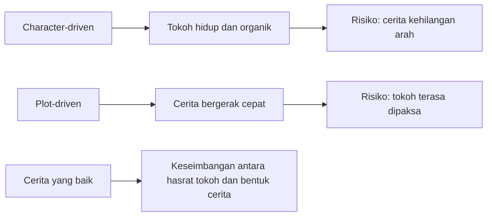

## ✍️ Pendahuluan: Cerita yang Kuat Tidak Lahir dari Teknik Saja, tetapi dari Jiwa yang Berani Menanggung Risikonya

Ada banyak nasihat tentang menulis yang terdengar rapi, praktis, dan meyakinkan. Misalnya: mulai dengan *hook*, bangun konflik di awal, buat karakter yang kuat, jaga ritme, pangkas adegan yang tidak perlu, dan seterusnya. Semua itu benar, tetapi ada satu masalah: kalau menulis direduksi hanya menjadi kumpulan teknik, ia akan mudah berubah menjadi kerajinan yang cekatan namun tidak bernyawa. Kita mungkin bisa menghasilkan tulisan yang rapi, bahkan “benar” secara struktural, tetapi belum tentu ia akan tinggal di hati pembaca. Belum tentu ia akan bergetar. Belum tentu ia akan membuat seseorang diam sejenak, merasa ditusuk, lalu berkata: **“ini hidup.”** 💓

Percakapan dalam episode **Harvard Thinking: How to Tell a Story** sangat berharga justru karena ia tidak terjebak pada resep mekanis. Diskusi ini mempertemukan empat sosok yang datang dari ranah berbeda namun bertemu pada satu kegelisahan yang sama: **bagaimana sebenarnya sebuah cerita yang baik lahir?** Apakah ia dimulai dari plot? Dari karakter? Dari kalimat pertama? Dari pengalaman pribadi? Dari disiplin kerja? Dari kegagalan yang terus-menerus? Atau dari sesuatu yang lebih gelap dan lebih misterius: sesuatu di dalam diri penulis yang belum selesai dipahami bahkan oleh penulis itu sendiri?

Yang menarik, para pembicara di sini—**James Wood**, **Sam Marks**, **Lauren Groff**, dan **Nick White**—tidak memberi satu jawaban tunggal. Justru dari perbedaan mereka, kita melihat bahwa proses menulis itu sangat pribadi, tetapi bukan berarti sembarangan; sangat intuitif, tetapi bukan berarti anti-teknik; sangat emosional, tetapi bukan berarti tidak perlu disiplin. Menulis yang benar-benar hidup ternyata terjadi di persimpangan yang rumit antara **naluri**, **obsesi**, **keberanian**, **ketekunan**, **kegagalan**, dan **kerja penyuntingan yang dingin**.

Salah satu kalimat yang paling membekas datang dari Lauren Groff: **kalau ingin menulis sesuatu yang akan memengaruhi orang secara emosional, maka kita harus menuliskannya secara emosional.** Kalimat ini sederhana, tetapi dampaknya besar. Ia menolak impian banyak penulis yang ingin membuat karya mengguncang tanpa harus sungguh-sungguh mengguncang dirinya sendiri. Ia menolak ilusi bahwa kita bisa sampai ke hati pembaca sambil menjaga hati kita sendiri tetap steril dari risiko.

Nick White memperkuatnya dengan kalimat yang tidak kalah tajam: **menulis yang sungguh bekerja harus menuntut biaya lebih besar daripada sekadar waktu yang kita habiskan di meja.** Ia harus mendorong kita ke batas emosional dan intelektual kita. Itu berarti cerita yang benar-benar kuat tidak datang dari zona nyaman. Ia lahir ketika seluruh silinder menyala, ketika penulis bekerja di tepi paling ujung dari apa yang bisa ia lakukan. Dalam bahasa lain: cerita yang hidup menuntut taruhan.

Artikel ini akan membedah seluruh percakapan itu secara runtut, detail, dan mendalam. Kita akan melihat bagaimana cerita bermula; bagaimana karakter tampak “hidup sendiri”; mengapa plot dan karakter harus dijaga keseimbangannya; mengapa semua cerita pada akhirnya tetap bersifat autobiografis secara batin; mengapa draf pertama yang buruk bukan aib, melainkan bahan bakar; mengapa membaca keras-keras bisa menjadi pendeteksi kebohongan paling jujur; mengapa editor sangat penting; dan mengapa menulis pada akhirnya adalah **proses**, bukan produk. Jika ada istilah asing, saya jelaskan padanan Indonesianya. Jika ada gagasan yang terasa abstrak, kita turunkan ke tanah. Dan kalau di tengah jalan pembicaraan ini terasa seperti sedang membahas hidup, bukan sekadar teknik menulis, itu memang karena pada level terdalam, **bercerita adalah cara manusia memahami dirinya sendiri.** 🌌

<Callout type="important" title="Tesis utama artikel ini">
Cerita yang tak terlupakan tidak lahir hanya dari teknik atau plot yang pintar, tetapi dari pertemuan antara disiplin, keberanian emosional, kepekaan terhadap hidup, dan kesediaan penulis untuk gagal berkali-kali sampai cerita itu akhirnya menemukan cara untuk menuliskan dirinya sendiri.
</Callout>

---

## 🌱 1. Cerita Tidak Selalu Dimulai Saat Kita Punya Ide, tetapi Saat Sesuatu Bertabrakan di Dalam Diri Kita

Salah satu pertanyaan pertama dalam diskusi ini sangat mendasar: **bagaimana sebuah cerita mulai?** Dan menariknya, tidak ada satu jawaban mekanis yang disepakati semua pembicara. Justru di situ letak pelajarannya. Cerita bukan benda pabrik yang lahir dari satu formula. Ia sering lahir dari benturan.

Lauren Groff menjelaskan bahwa kadang-kadang ia sudah memikirkan sesuatu sangat lama—mungkin sebuah ide, kegelisahan, atau pertanyaan—tetapi itu belum menjadi cerita. Sesuatu baru benar-benar hidup ketika ada pengalaman baru, bacaan baru, atau kejadian lain yang **bertabrakan** dengan ide lama itu. Tabrakan itu menyalakan sesuatu: urgensi, kepadatan, gravitasi, bobot. Dari situ benih cerita mulai terasa berat, seolah ia menuntut untuk ditulis.

Ini menarik, karena banyak orang membayangkan inspirasi sebagai sambaran kilat yang datang tiba-tiba. Lauren justru menggambarkannya lebih seperti **reaksi kimia lambat** yang lalu meledak ketika unsur yang tepat bertemu. Jadi, menulis bukan sekadar “punya ide.” Banyak orang punya ide. Yang membedakan adalah kapan ide itu menyatu dengan pengalaman, bahasa, dan obsesi hingga akhirnya menjadi sesuatu yang memiliki daya dorong sendiri.

Sam Marks menambahkan nuansa lain. Baginya, sesuatu memang bisa dipikirkan sangat lama, tetapi **ceritanya sendiri belum benar-benar ada sampai proses menulis dimulai**. Ini poin penting. Banyak penulis pemula menunggu sampai cerita terasa lengkap di kepala. Padahal menurut Sam, justru cerita sering **membuka diri dalam tindakan menulis**. Menulis bukan sekadar menuangkan sesuatu yang sudah jadi; menulis adalah cara menemukan apa sebenarnya yang sedang kita cari. 🌿

---

## 🧪 2. Draf Pertama yang Buruk Bukan Kegagalan, tetapi Bahan Mentah yang Membuat Cerita Bisa Dibentuk

Nick White menyebut istilah yang sangat terkenal dari Anne Lamott: **“shitty first draft”** — *draf pertama yang buruk / berantakan*. Istilah ini penting karena banyak penulis, terutama penulis muda, terlalu cepat putus asa ketika versi pertama tulisan mereka terasa jelek. Mereka mengira jeleknya draf pertama adalah tanda bahwa mereka tidak berbakat. Padahal justru menurut para penulis berpengalaman, draf pertama memang sering harus jelek. Dan bukan hanya harus—kadang ia **sebaiknya** jelek dulu, agar sesuatu bisa mulai ada di luar kepala.

Nick menjelaskan bahwa semua cerita di dalam kepala terdengar bagus. Di kepala kita, semuanya rapi, puitis, kuat, dan meyakinkan. Masalah baru muncul ketika ia keluar ke halaman. Di situlah cerita terkena **cold, harsh light of the page** — *cahaya halaman yang dingin dan kejam*. Tiba-tiba semua kelemahan tampak. Tetapi justru pada momen itulah kita punya sesuatu yang nyata untuk dipegang, dibentuk, dibedah, dan diperbaiki.

Ini adalah pelajaran besar tentang kreativitas: **sesuatu yang buruk tetapi nyata jauh lebih berguna daripada sesuatu yang indah tetapi hanya tinggal di kepala.** Karena yang nyata bisa dikerjakan. Yang di kepala hanya bisa dipuja.

Banyak orang ingin langsung menghasilkan paragraf cemerlang. Para pembicara di sini justru mengajarkan kebalikannya: buat dulu bentuk kasarnya. Biarkan berantakan. Biarkan terlalu panjang, terlalu mentah, terlalu gagal. Yang penting ia ada. Karena begitu ia ada, hubungan kita dengan cerita berubah. Ia bukan lagi khayalan mulus. Ia menjadi benda kerja. 🪵

---

## 🧍 3. Karakter Tidak Selalu “Diciptakan”—Kadang Mereka Ditemukan Saat Ditaruh dalam Situasi yang Tepat

Salah satu gagasan paling menarik dari diskusi ini adalah soal karakter. Kita sering mendengar klise bahwa karakter “hidup sendiri” dan mulai melakukan hal-hal yang tidak direncanakan penulis. Apakah ini benar? Menurut para pembicara, ya—tetapi dengan nuansa.

Nick White mengaku sangat menyukai momen ketika karakter tampak mengambil arah sendiri. Ia menggambarkannya seperti eksperimen ilmiah kecil: dua atau lebih karakter ditempatkan dalam satu adegan, lalu penulis mengamati bagaimana mereka **bercikan** satu sama lain. Ini sangat penting, karena menunjukkan bahwa karakter bukan sekadar daftar sifat psikologis. Karakter baru terasa hidup ketika mereka ditempatkan dalam **situasi**, diberi **keinginan**, dan dipertemukan dengan **hambatan**.

Ia juga memberi rumusan yang sangat klasik tapi kuat: untuk mulai menulis, ia sering bertanya, **apa yang diinginkan tokoh ini, dan apa yang menghalangi keinginan itu?** Dalam banyak tradisi cerita, dari Aristoteles sampai drama modern, pertanyaan ini tetap menjadi jantung narasi. Tanpa hasrat dan halangan, karakter hanya akan menjadi sosok yang menarik tetapi statis.

Sam Marks menambahkan bahwa dalam penulisan drama, ia sering **tidak melihat** tokohnya, tetapi **mendengar** mereka. Ini menarik sekali. Karena drama adalah bentuk yang sangat *aural* — **bersifat bunyi / didengar**. Tokoh tidak muncul pertama-tama sebagai deskripsi, tetapi sebagai suara, ritme, nada, cara bicara, dan energi yang mereka bawa. Dari situ penulis masuk ke relasi yang hampir seperti persahabatan atau pengintaian: kita belum sepenuhnya tahu siapa dia, tetapi kita mau menghabiskan waktu dengannya sampai ia menyingkapkan diri.

Ini mengajarkan sesuatu yang penting: karakter tidak selalu datang sebagai sosok utuh. Kadang ia datang samar, kabur, setengah terbentuk. Dan tugas penulis bukan memaksanya jadi jelas terlalu cepat, melainkan **menemani kekaburan itu sampai ia mulai berbicara.** 🎭

---

## 🌍 4. Karakter Tidak Pernah Lepas dari Lingkungan: Orang yang Sama Bisa Menjadi Makhluk yang Berbeda di Tempat yang Berbeda

Lauren Groff memberi koreksi sangat penting terhadap cara umum kita membayangkan karakter. Kita sering mengira karakter adalah inti yang tetap: sekumpulan sifat batin yang konsisten ke mana pun ia pergi. Lauren mengingatkan bahwa manusia itu juga **hewan dalam lingkungan**. Itu berarti, situasi, ruang, cuaca, medan, rasa lapar, rasa takut, dan benda-benda di sekitar bisa mengubah bagaimana seseorang bertindak.

Ia memberi contoh sederhana tapi sangat kuat: adegan putus cinta yang terjadi di pantai tentu akan sangat berbeda dari adegan putus cinta di puncak Everest. Karakter yang sama, konflik yang sama, tetapi tubuh, lingkungan, tekanan, dan kemungkinan tindakan berubah drastis. Maka penulis tidak cukup hanya punya “konsep tokoh.” Ia harus memahami **sifat kebinatangan manusia di dunia**—bagaimana tubuh bereaksi terhadap panas, dingin, ketinggian, keramaian, ancaman, kelaparan, dan seterusnya.

Pelajaran ini sangat besar untuk penulisan. Sering kali adegan terasa datar bukan karena karakternya lemah, tetapi karena penulis menempatkan karakter dalam ruang yang tidak ikut bekerja. Padahal karakter dan lingkungan selalu saling membentuk. Tempat bukan latar netral. Ia adalah **mesin tekanan** yang ikut menentukan bagaimana manusia menjadi dirinya di saat itu. 🌊⛰️

---

## ☢️ 5. Sastra Lahir dari Sastra: Mengapa Menulis Adalah Reaksi Nuklir antara Diri Kita dan Suara Orang Lain

Lauren Groff memakai metafora yang sangat indah: proses kreatif itu seperti **nuclear fusion** — *fusi nuklir*. Mengapa? Karena ide-ide kita tidak pernah lahir dalam kekosongan. Kita hidup dikelilingi oleh suara penulis lain, tradisi sastra, bentuk-bentuk kalimat yang pernah kita cintai, tokoh-tokoh yang telah lebih dulu hidup di halaman. Ketika semua itu bertemu dengan pengalaman kita sendiri, sering terjadi ledakan kreatif.

Ini penting untuk mematahkan mitos romantik bahwa penulis sejati harus benar-benar orisinal dalam arti tidak dipengaruhi siapa pun. Lauren justru berkata tegas: sastra lahir dari sastra. Memang mungkin saja seseorang menulis novel hebat tanpa pernah membaca novel, tetapi itu nyaris mustahil dan mungkin hasilnya buruk. Bukan karena bacaan membuat kita meniru secara murahan, melainkan karena bacaan memperkaya **organ batin** kita untuk mengenali kemungkinan bentuk.

Bayangkan hidup sehari-hari sambil ditemani “hantu” George Eliot, Charles Dickens, Toni Morrison, Langston Hughes, dan banyak suara lain. Tentu ide-ide kita akan meledak ketika bersentuhan dengan mereka. Menulis lalu menjadi sesuatu yang sangat sosial secara roh: meski penulis duduk sendirian, sebenarnya ia dikelilingi percakapan yang tak putus antara masa lalu, bahasa, pengalaman, dan imajinasi.

Jadi, membaca bukan kegiatan sampingan dari menulis. Ia adalah **reaktor inti** yang membuat penulisan punya energi. 📚☢️

---

## ⚔️ 6. Plot vs Character: Mengapa Cerita yang Terlalu Memaksa Plot Bisa Terasa Bohong, tetapi Cerita yang Hanya Mengikuti Tokoh Bisa Kehilangan Arah?

Sam Marks mengangkat sesuatu yang sangat penting: dalam teori klasik, terutama sejak Aristoteles, karakter sering dianggap **subservient to action** — *tunduk pada tindakan / aksi cerita*. Artinya, yang utama adalah pergerakan peristiwa, sementara karakter dinilai penting sejauh ia mendorong aksi itu. Namun kita tidak lagi sepenuhnya hidup di model itu. Hari ini kita mengenal spektrum antara **character-driven** — *digerakkan karakter* — dan **plot-driven** — *digerakkan plot*.

Masalahnya, masing-masing punya bahaya.

Kalau cerita terlalu plot-driven, karakter bisa terasa seperti dipaksa masuk ke rel cerita. Tokohnya melakukan hal-hal yang tidak organik hanya karena penulis ingin belokan tertentu terjadi. Ini membuat cerita terasa curang. Pembaca merasa sedang diatur oleh tangan penulis, bukan sedang menyaksikan kehidupan yang berkembang dari dalam.

Sebaliknya, kalau penulis terlalu asyik mendengarkan karakter tanpa cukup memikirkan bentuk cerita, pembaca bisa mulai bertanya: **“lalu ceritanya ke mana?”** Tokoh bisa menarik, suaranya enak, detilnya kaya, tetapi tidak ada momentum. Tidak ada gerak. Tidak ada kebutuhan untuk terus membaca.

Maka bagi Sam, menulis yang baik adalah soal **keseimbangan**. Karakter harus terasa hidup, tetapi hidup itu harus masuk ke dalam suatu bentuk. Plot harus bergerak, tetapi gerak itu harus tampak lahir dari kebutuhan terdalam karakter, bukan dari ambisi penulis membuat kejutan murahan.

Ini kritik yang sangat relevan terhadap banyak cerita kontemporer, terutama di televisi dan thriller populer, yang sering terobsesi pada **twists and turns** — *belokan-belokan mengejutkan* — sampai kehilangan kebenaran psikologis tokohnya. James Wood menyindir ini dengan sangat lucu: tiba-tiba di halaman delapan seorang tokoh seperti naik pesawat luar angkasa ke Mars hanya karena penulis merasa “bisa”. Itu bukan kebebasan kreatif. Itu sering justru tanda penulis sedang kabur dari masalah yang lebih sulit: **menghadapi dengan jujur pertanyaan tentang apa yang benar-benar harus terjadi berikutnya.** 🚀

---

## 🫀 7. Semua Cerita pada Akhirnya Bersifat Autobiografis—Bahkan Ketika Berlatar Luar Angkasa

Salah satu bagian paling kaya dari diskusi ini adalah ketika pembicaraan bergerak ke hubungan antara cerita dan diri penulis. Seberapa banyak “diri” masuk ke dalam tulisan? Apakah hanya karya yang benar-benar autobiografis yang personal? Para pembicara hampir sepakat pada satu hal: **kalau ditulis dengan sungguh-sungguh, semua cerita pada akhirnya datang dari inti terdalam diri penulis.**

Nick White memberi contoh yang sangat jelas dari novel pertamanya, yang banyak berurusan dengan terapi konversi, identitas gay, keluarga, dan trauma. Jelas itu dekat secara autobiografis. Tetapi ia lalu mengembangkan refleksi yang lebih halus: bahkan ketika ia meninggalkan Mississippi secara fisik, secara kreatif ia justru terus menulis jalan pulang ke sana. Tempat yang pernah ingin ia tinggalkan menjadi tanah paling subur bagi sungai imajinasinya. Ini menunjukkan bahwa tempat tertentu bisa tertanam bukan hanya dalam ingatan, tetapi dalam **tulang batin** seorang penulis.

Sam Marks menambahkan gagasan indah dari guru menulisnya, Carole Maso: kita tidak benar-benar membuat seseorang menjadi penulis yang lebih baik; kita hanya membantu mereka **lebih dekat pada obsesinya**. Ini sangat benar. Penulis yang sungguh menulis lama-lama akan menemukan bahwa ia terus mengelilingi pertanyaan-pertanyaan yang sama, luka yang sama, rasa ingin tahu yang sama, bahkan ketika setting, bentuk, atau tokohnya berbeda-beda.

Lauren lalu mendorong gagasan ini lebih jauh. Bahkan jika kita menulis tentang kapal luar angkasa atau abad pertengahan, ceritanya tetap autobiografis dalam arti batiniah. Mengapa? Karena setiap karakter adalah semacam **prismatic hologram** — *hologram prismatik*, pantulan berlapis-lapis dari diri penulis sendiri. Tidak berarti tokoh itu sama dengan penulis secara detail hidup. Tetapi energi emosionalnya, obsesinya, rasa takutnya, ambisinya, atau sensasi tubuhnya tetap berakar di pengalaman penulis.

Jadi, mungkin definisi autobiografi dalam menulis perlu diperluas. Ia bukan sekadar “kejadian yang persis saya alami.” Ia adalah **bagian terdalam diri saya yang mencari bentuk di dunia lain**. 🪞

---

## 👣 8. Tubuh adalah Jembatan Imajinasi: Cara Menulis yang Jauh dari Pengalaman Tetap Terasa Personal

Lauren Groff memberi penjelasan yang sangat indah tentang bagaimana kita bisa menulis sesuatu yang secara historis, geografis, atau demografis jauh dari hidup kita tetapi tetap terasa sangat personal. Kuncinya adalah **tubuh**.

Ia memberi contoh sederhana: mungkin ia tidak pernah hidup di komune tahun 1960-an. Tapi ia pernah memegang mangkuk biru buatan tangan berisi oatmeal hangat. Sensasi itu nyata. Dan dari sensasi itulah ia bisa memasuki tubuh seorang tokoh dalam dunia yang sangat berbeda. Artinya, akses ke pengalaman yang tidak kita jalani secara literal sering dibuka bukan melalui abstraksi intelektual, tetapi melalui **informasi sensorik**: sentuhan, suhu, suara, rasa takut, keringat, lapar, sesak, aroma, tekstur benda, dan sebagainya.

Ini pelajaran penting sekali bagi penulisan fiksi. Banyak penulis terlalu cepat berpikir bahwa mereka tak berhak menulis sesuatu karena tidak pernah “menjalani” itu secara total. Lauren menunjukkan bahwa kadang yang kita perlukan adalah menemukan **titik tubuh** yang jujur. Dari sana, dunia asing mulai bisa dimasuki.

Maka menulis yang personal bukan berarti menulis biodata diri. Menulis yang personal adalah menulis dari **pengalaman tubuh yang benar**, lalu membiarkannya tumbuh ke bentuk lain. 🌲🥣

---

## 💥 9. Gagal Itu Menyenangkan? Lauren Groff dan Seni Mencintai Draft yang Hancur

Bagian ini, menurut saya, adalah salah satu mutiara paling penting dari seluruh percakapan. Ketika Samantha bertanya tentang kegagalan, Lauren Groff menjawab dengan cara yang nyaris subversif untuk budaya akademik dan profesional: **ia mencintai kegagalan.**

Ini bukan kalimat motivasi murahan. Ia memberi proses yang sangat konkret. Lauren menulis sepenuhnya secara analog dengan pena. Ia menulis satu draf penuh, lalu **tidak pernah membacanya lagi**. Ia menyisihkannya dan memulai dari awal. Lagi. Dan lagi. Dan lagi. Sampai sebanyak yang diperlukan.

Mengapa ia melakukan ini? Karena baginya, proses ini adalah cara **merangkul kegagalan seperti anak kecil yang sedang bermain**. Seorang anak membuat kastel LEGO, gagal, lalu merobohkannya dan membangun lagi dengan gembira. Tidak ada rasa malu yang besar di sana. Yang ada adalah eksplorasi. Permainan. Penemuan batas kemampuan.

Lauren ingin tahu batas kemampuannya dalam menceritakan sebuah kisah. Dengan mengulang dari awal dan membiarkan versi lama mati, ia sedang memberi kesempatan pada cerita itu untuk menemukan cara terbaiknya sendiri. Pada titik tertentu, katanya, bukan lagi dia yang menulis buku, melainkan **buku itu sendiri yang mengajarinya bagaimana harus dituliskan**.

Ini luar biasa. Karena banyak penulis terikat pada setiap kalimat awalnya. Mereka takut membuang. Takut mengulang. Takut terlihat gagal. Lauren justru menganggap kegagalan sebagai **cara dunia dibuka**. Dalam masyarakat yang memberi beban negatif sangat besar pada gagal, sikap seperti ini terasa membebaskan sekaligus menantang. 🎢

<Callout type="success" title="Pelajaran besar dari Lauren Groff">
Gagal bukan kebalikan dari proses kreatif. Gagal adalah inti proses kreatif. Tanpa memberi ruang pada draf yang buruk, kita sering justru menutup kemungkinan cerita mencapai bentuk terbaiknya.
</Callout>

---

## 🗂️ 10. Setiap Penulis Punya Proses, tetapi Semua Proses yang Sehat Menghormati Waktu dan Pengulangan

Meski metode Lauren sangat ekstrem, pembicara lain menunjukkan bahwa tidak ada satu proses yang wajib diikuti semua orang. Nick White misalnya melakukan campuran: ia menulis kerangka atau tulang cerita di kertas legal pad kuning, lalu pindah ke komputer, mencetak, mengoreksi, membuka dokumen baru, dan kembali lagi ke kertas. Jadi prosesnya sirkular, bukan linear.

Yang menarik adalah kesamaan di balik perbedaan itu: semua proses yang sehat tampaknya mengakui bahwa menulis **tidak selesai hanya ketika kita sedang duduk dan mengetik**. Nick berkata bahwa saat ia mengerjakan proyek, ia membawanya ke mana-mana. Menulis juga terjadi saat berjalan, saat termenung, saat merasa buntu, saat mengurai simpul-simpul kecil yang belum terpecahkan.

Di sini kita melihat peran waktu. Waktu adalah guru yang kejam tetapi jujur. Saat sedang panas-panasnya menulis, penulis bisa mengira paragrafnya luar biasa. Besok pagi, dengan mata yang lebih dingin, ternyata paragraf itu lemah. Ini bukan berarti kemarin kita bodoh. Ini berarti penulisan membutuhkan **jarak**. Waktu memberi jarak, dan jarak memberi penilaian.

Jadi proses bukan hanya soal kebiasaan teknis. Proses adalah cara kita menciptakan siklus antara **intensitas** dan **jarak**, antara **menghasilkan** dan **melihat kembali**.

---

## 👂 11. Tulisan yang Baik Hampir Selalu Bisa Diuji dengan Telinga

James Wood memberi satu nasihat yang sangat sederhana tetapi sangat penting: **bacalah tulisan Anda dengan suara pelan, bahkan lebih baik lagi dengan suara keras.** Mengapa? Karena telinga punya kemampuan luar biasa untuk mendeteksi kepalsuan atau kelonggaran yang sering lolos dari mata.

Ia bercerita bahwa ketika membaca karyanya sendiri di depan publik, kadang ia tiba-tiba menghilangkan sebuah kalimat secara spontan. Seolah ada **bullshit detector** — *detektor omong kosong* — yang menyala dalam dirinya: “kalimat ini tidak bisa dipertanggungjawabkan di ruangan ini.” Dan biasanya, jika itu terjadi, ada alasan kuat mengapa kalimat itu memang seharusnya tidak ada sejak awal.

Nick White setuju penuh. Membaca keras-keras bisa membuat kita terdengar seperti orang yang sedang mengalami gangguan, tetapi justru di situlah kekuatannya. Teks yang tampak baik secara visual belum tentu baik secara bunyi. Kalau ritmenya seret, kalau emosinya palsu, kalau frasa itu terlalu mewah tanpa alasan, telinga sering menangkapnya lebih cepat.

Ini penting karena menulis pada akhirnya bukan cuma soal apa yang dikatakan, tetapi juga **bagaimana ia bergerak di tubuh pembaca**. Dan tubuh sering lebih dulu menangkap sesuatu lewat ritme sebelum akal sempat menamainya. 👂

---

## 🪓 12. Murder Your Darlings: Mengapa Kalimat Favorit Kita Sering Menjadi Penghambat Cerita

Istilah **“murder your darlings”** — *bunuh bagian-bagian yang paling kita sayangi* — sangat terkenal dalam dunia menulis. Maksudnya, kadang penulis terlalu jatuh cinta pada kalimat, adegan, tokoh, atau bagian tertentu yang sebenarnya tidak membantu cerita secara keseluruhan. Karena terlalu disayang, bagian itu dipertahankan, padahal justru mengganggu.

James Wood mengakui bahwa dengan pengalaman, membunuh bagian-bagian semacam ini menjadi lebih mudah. Dulu ia bisa sangat defensif terhadap editor. Namun lama-lama ia belajar bahwa ada **kebijaksanaan di luar diri kita**. Nick White bahkan bercerita tentang editornya yang menyelamatkannya berkali-kali, misalnya ketika ia menulis “he wept” lalu editornya menulis komentar lucu: **“Siapa dia? Yesus?”** Kalimat itu dipotong, dan cerita menjadi lebih baik.

Tetapi Sam Marks memberi penyeimbang penting. Tidak semua hal yang sulit atau tidak langsung disukai harus dipotong. Kadang masalahnya bukan bahwa bagian itu tidak perlu, tetapi bahwa **penulis belum menuliskannya cukup baik**. Ini sangat penting. Kalau tidak, nasihat “kill your darlings” bisa membuat penulis terlalu cepat tunduk pada kemudahan dan kesukaan instan.

Jadi tugas penulis bukan sekadar membunuh yang disayang, melainkan **membedakan mana yang benar-benar manja dan mana yang sebenarnya bernilai tetapi belum cukup matang.** Itulah sebabnya editing adalah seni penilaian, bukan sekadar pemotongan brutal. 🪓

---

## 🧑‍🤝‍🧑 13. Semua Orang Butuh Editor, karena Kita Sulit Sekali Menjadi Pembaca yang Dingin bagi Diri Sendiri

Salah satu benang merah percakapan ini adalah pengakuan bahwa **semua orang butuh editor**. Ini penting, karena banyak penulis diam-diam masih membawa fantasi kesendirian heroik: bahwa karya yang benar-benar hebat lahir dari otoritas mutlak penulis tunggal. Para pembicara di sini justru menunjukkan kebalikannya. Penulis butuh mata lain. Telinga lain. Pikiran lain. Detektor omong kosong dari luar.

Mengapa? Karena sangat sulit bagi kita untuk benar-benar terbelah menjadi dua: satu diri yang menulis dengan panas, dan satu diri lain yang membaca dengan dingin. James Wood menyebut perlunya **estrangement** — *pengasingan / pengambilan jarak*. Kita harus bisa membuat teks kita menjadi cukup asing sehingga kita bisa menilai apakah ia hidup atau tidak. Editor sering membantu menjalankan fungsi ini.

Editor yang baik bukan polisi selera. Ia bukan mesin pemotong. Ia lebih mirip seseorang yang memberi tanda: “di sini kurang hidup,” “di sini kamu bohong,” “di sini kamu bisa lebih baik.” Dalam bentuk terbaiknya, editing adalah kolaborasi untuk membantu teks menjadi lebih dirinya sendiri.

---

## 📖 14. Cara Membaca Buku Juga Mengajarkan Cara Menulis Buku

James Wood menarik sekali ketika bicara soal membaca. Pada pembacaan pertama, ia mencoba menahan penilaian sebanyak mungkin. Ia membiarkan buku itu memiliki jalannya sendiri. Ia memberi tanda, melipat halaman, menandai hal yang terasa penting, tetapi ia berusaha tetap **terbuka dan polos**. Baru pada pembacaan berikutnya ia mulai menyusun argumen, melihat pola, dan memikirkan bagaimana menjelaskan buku itu.

Nick White lalu menyebut metode yang ia ajarkan ke mahasiswa saat *workshop*: bacalah karya teman setidaknya dua kali. Bacaan pertama adalah **honeymoon read** — *bacaan bulan madu*, di mana kita membiarkan teks itu memikat atau mengganggu kita tanpa terlalu cepat jadi hakim. Bacaan kedua, dengan pena di tangan, baru menjadi lebih analitis.

Ini pelajaran penting bukan cuma untuk kritik, tetapi juga untuk menulis. Karena sering kali penulis terlalu cepat menghakimi karyanya sendiri sebelum memberinya kesempatan untuk “punya jalan.” Kadang teks perlu dibaca dulu dengan hati terbuka sebelum dipotong-potong dengan pisau analisis. 📖

---

## ⚡ 15. Apa yang Membuat Sebuah Cerita “Bekerja”? Tanda Pertamanya Bukan Teori, tetapi Vitalitas

Ketika Samantha bertanya apakah cerita yang baik bisa dinilai objektif, James Wood memberi jawaban yang sangat elegan: ia mencari **vitality** — *vitalitas / daya hidup*. Bentuk luar boleh macam-macam: realistis, eksperimental, postmodern, bernomor, linier, fragmentaris. Semua itu tidak terlalu penting jika halaman itu **hidup**.

Kata kuncinya sangat indah: **non-deadness** — *ketidak-mati-an*. Sesuatu di halaman terasa bergerak, terasa bernapas, terasa punya energi yang menarik pembaca masuk. Ini lebih dasar daripada genre, gaya, atau mode sastra apa pun. Kita bisa tidak suka jenis bukunya, tetapi tetap merasa: “ya, ini hidup.”

Nick White menambahkan bahwa ketika ia membuka buku, ia datang dengan lengan tidak terlipat. Ia ingin dibawa pergi. Ia ingin diyakinkan. Ia tidak pernah meremehkan kekuatan cerita untuk membuatnya lupa segala yang lain. Ini sikap membaca yang luar biasa sehat. Dan bagi penulis, ini berarti tugas kita bukan pertama-tama membuat orang setuju secara ideologis, tetapi **membuat halaman menjadi cukup hidup sehingga pembaca mau tinggal.** ⚡

---

## 🎼 16. Kalau Cerita Sedang Bekerja, Penulis Bisa Merasakannya Secara Fisik

Lauren Groff menggambarkan momen ketika tulisan mulai “mendekati” sesuatu yang benar sebagai sesuatu yang hampir **vibrational** — *seperti getaran*. Ini bahasa yang sangat tubuh, sangat taktis, dan sengaja tidak terlalu intelektual. Menurutnya, kalau tulisan mendekati pusat yang diinginkan, penulis akan merasa ada getaran tertentu. Bahkan kalau menulisnya terasa menyakitkan, tetap ada rasa “benar” yang hidup di tubuh.

Sam Marks sangat menghargai bahasa Lauren yang berbasis rasa dan getaran ini. Ia bahkan menyinggung bahwa di lingkungan seperti Harvard—di mana banyak orang sangat sukses secara intelektual—sering kali ada kecenderungan untuk merencanakan segalanya hanya lewat kepala. Padahal menulis tidak murni urusan intelek. **Intelek sangat penting dalam revisi, tetapi saat fase pencarian awal, terlalu banyak intelek bisa justru menghambat rasa.**

Ini bukan anti-intelektualisme. Ini pembedaan fase. Pertama kita butuh keterbukaan rasa. Setelah itu, baru datang kerja intelektual untuk membentuk, memangkas, mengurutkan, dan memperjelas.

Maka, menulis yang hidup mungkin bisa diringkas begini: **rasakan dulu, lalu pikirkan dengan keras.** Jangan dibalik terlalu cepat. 🎼

---

## 🩸 17. Kalau Ingin Menyentuh Emosi Pembaca, Kita Harus Menulis dengan Emosi yang Sungguh-sungguh Ditanggung

Mungkin inilah kalimat yang paling layak dibingkai dari seluruh diskusi: **“If you want to write something that’s going to affect people emotionally, you have to do it emotionally.”**

Kalimat ini menolak banyak bentuk kepura-puraan dalam menulis. Kita tidak bisa berharap halaman kita menyala kalau kita sendiri menulisnya sambil menjaga jarak total, sambil tidak sungguh-sungguh masuk ke risikonya, sambil menolak disentuh oleh hal yang ingin kita sentuh di pembaca.

Nick memperkeras ini dengan mengatakan bahwa tulisan yang bekerja harus **menghabiskan sesuatu dari kita**—lebih dari sekadar waktu. Ia harus mendorong kita sampai ke tepi kemampuan emosional dan intelektual kita. Ketika semua silinder menyala, ketika kita sedang bekerja di batas tertinggi dari apa yang kita mampu lakukan, di sanalah sesuatu biasanya mulai benar-benar hidup.

Tentu ini tidak berarti semua tulisan harus bersifat pengakuan telanjang. Bukan itu maksudnya. Maksudnya adalah bahwa bahkan ketika kita menulis fiksi, sejarah jauh, ruang angkasa, atau tokoh yang tak mirip kita, **taruhan emosional harus nyata**. Kalau tidak, pembaca akan merasa halaman itu pintar tapi kosong. 🩸

---

## ⏰ 18. Menulis Adalah Praktik, dan Praktik Butuh Jadwal—Bukan Menunggu Muse Datang Sopan ke Meja

Di bagian akhir, Nick White memberi nasihat yang sangat praktis dan sangat penting: pikirkan **proses** dan **jadwal** Anda. Menulis tidak bisa sepenuhnya bergantung pada ilham. Bahkan penulis yang sangat intuitif tetap membutuhkan ruang waktu yang dijaga. Nick memberi contoh konkret: setiap Senin pagi dari jam 7 sampai 10, ia akan duduk dan memikirkan pekerjaannya. Bahkan kalau tidak menghasilkan tanda di halaman, ia tetap sedang menyentuh pekerjaan itu.

Ia mengutip ide Peter Ho Davies: kita tidak harus menulis setiap hari, tetapi kita harus **menyentuh pekerjaan kita setiap hari**. Ini sangat bagus. Karena menulis bukan cuma soal produksi halaman, tetapi soal menjaga hubungan dengan proyek. Saat kita menjauh terlalu lama, simpul-simpul cerita menjadi dingin. Saat kita tetap menyentuhnya, proyek itu tetap hangat dalam pikiran.

Nasihat ini sangat penting terutama ketika sedang buntu. Insting banyak orang saat gagal adalah lari: menunda, menonton serial buruk, cari distraksi, atau pura-pura besok saja. Nick justru berkata bahwa itu adalah saat ketika kita paling perlu **kembali ke pekerjaan** dan duduk bersama kebuntuannya. ⏰

---

## 🛤️ 19. Tidak Ada Aturan Tunggal: Satu-satunya Aturan yang Benar-Benar Penting Adalah Aturan yang Ditemukan oleh Ceritanya Sendiri

Lauren Groff menutup dengan salah satu nasihat paling membebaskan: **sebenarnya tidak ada aturan tunggal.** Kalau kita melihat karya-karya besar, penulis besar melakukan hal-hal yang sangat beragam. Tolstoy melakukan apa yang ia mau karena ia bisa. Yang penting bukan patuh pada daftar aturan abstrak, melainkan menemukan **aturan internal cerita yang sedang kita hadapi.**

Ini penting sekali. Banyak penulis pemula ketakutan karena terlalu dibebani daftar “jangan” dan “harus.” Padahal tiap cerita punya organisasinya sendiri. Tugas penulis adalah menemukannya. Ada cerita yang butuh pendek dan keras. Ada yang butuh melebar. Ada yang perlu linier. Ada yang harus pecah. Ada yang bekerja lewat bunyi. Ada yang bekerja lewat gambar. Ada yang harus menyembunyikan banyak hal. Ada yang harus terang-terangan.

Karena itu, Lauren berkata: **jangan terikat aturan secara kaku. Jangan takut. Masuklah dengan berani ke dalam pekerjaan, dan pekerjaan itu akan membalas Anda.** Ini bukan romantisme kosong. Ini justru panggilan untuk mendengarkan teks secara lebih serius daripada mendengarkan daftar resep. 🛤️

---

## 🌌 Kesimpulan: Menulis adalah Cara Hidup yang Menggabungkan Keberanian, Disiplin, Kegagalan, dan Kesediaan untuk Digerakkan oleh Sesuatu yang Lebih Besar dari Diri Sendiri

Kalau seluruh diskusi ini dirangkum dalam satu kalimat, maka kalimat itu mungkin berbunyi begini: **bercerita adalah seni menemukan bentuk bagi sesuatu yang sudah lama hidup diam-diam di dalam diri kita, lalu memprosesnya dengan disiplin sampai ia mampu hidup juga di dalam diri orang lain.**

Cerita bisa dimulai dari ide, dari tokoh, dari adegan, dari kalimat pertama, dari suara, dari tempat, dari tubuh, dari kegagalan, atau dari tabrakan antara bacaan dan pengalaman. Tidak ada satu pintu masuk yang mutlak. Tetapi dari semua perbedaan proses itu, ada beberapa hal yang berulang dengan sangat kuat.

Pertama, cerita yang kuat hampir selalu lahir dari **obsesi yang sungguh-sungguh**, bukan dari kecerdikan teknis semata. Kedua, draf awal yang buruk bukan sesuatu yang memalukan, melainkan bagian alamiah dari kerja kreatif. Ketiga, karakter yang hidup selalu terkait dengan tindakan, hasrat, dan lingkungan. Keempat, hampir semua cerita tetap autobiografis dalam arti batin—karena kita menulis dari inti terdalam diri kita sendiri. Kelima, pembacaan, editing, dan suara orang lain sangat penting karena kita tidak pernah bisa sepenuhnya menjadi pembaca yang dingin untuk diri kita sendiri. Keenam, tulisan yang ingin mengguncang emosi pembaca harus ditulis dengan taruhan emosional yang nyata. Dan ketujuh, menulis bukan hanya produk akhir, melainkan **praktik hidup**.

Mungkin inilah pelajaran paling indah dari percakapan Harvard Thinking ini: bahwa menulis bukan cara untuk terlihat pintar, melainkan cara untuk **lebih jujur terhadap apa yang sungguh mengganggu, menggairahkan, dan menghantui kita**. Dan justru karena itu, menulis selalu menuntut keberanian. Keberanian untuk jelek dulu. Keberanian untuk salah. Keberanian untuk diubah editor. Keberanian untuk mendengar kalimat sendiri ternyata palsu. Keberanian untuk masuk ke perasaan yang selama ini kita hindari. Keberanian untuk membiarkan cerita mengajar kita, alih-alih kita terlalu cepat menguasainya.

Jadi, kalau ada satu nasihat yang paling layak dibawa pulang dari sini, mungkin itu ini: **jangan tunggu diri Anda menjadi penulis yang sempurna baru mulai menulis. Mulailah menulis, gagal dengan riang, dengarkan getaran halamannya, jaga hubungan dengan pekerjaan itu, dan biarkan proses panjang itu pelan-pelan membentuk Anda menjadi penulis yang lebih hidup.** Karena pada akhirnya, cerita yang baik bukan sekadar sesuatu yang kita buat. Sering kali, ia adalah sesuatu yang **membuat kita**. 🌌

<Callout type="cite" title="Sumber utama artikel">
Artikel ini disusun berdasarkan episode *Harvard Thinking: How to Tell a Story* yang menampilkan James Wood, Sam Marks, Lauren Groff, dan Nick White membahas proses kreatif, karakter, plot, autobiografi batin, kegagalan, revisi, membaca keras-keras, editing, dan disiplin menulis.
</Callout>
