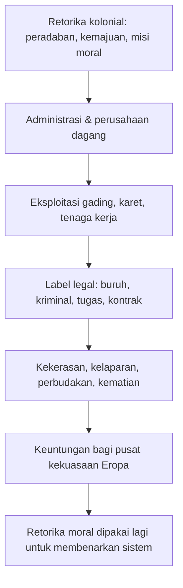
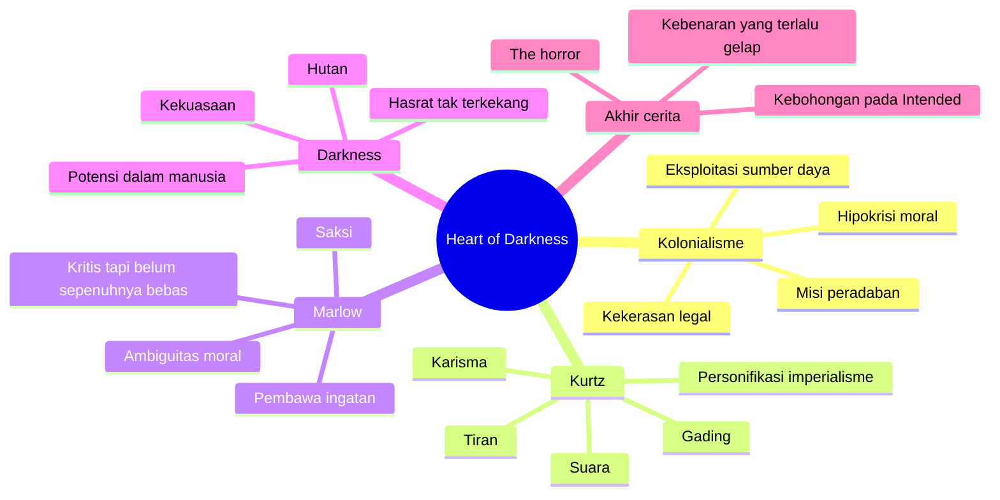

## 🌑 Pendahuluan: Novel Pendek yang Membongkar Kebohongan Besar Peradaban Modern

Ada beberapa karya sastra yang tidak terasa seperti sekadar cerita, melainkan seperti operasi bedah atas peradaban. *Heart of Darkness* karya **Joseph Conrad** adalah salah satunya. Ia bukan novel panjang. Bahkan secara ukuran, ia relatif pendek. Tetapi dampaknya sangat besar, bukan hanya pada sastra modern, melainkan juga pada cara dunia membaca:

- kolonialisme,
- kekerasan yang disamarkan sebagai misi peradaban,
- hubungan antara kekuasaan dan bahasa,
- serta kemungkinan yang paling menakutkan dari semuanya: bahwa “kegelapan” yang kita proyeksikan kepada tempat jauh dan orang lain itu sebenarnya berasal dari diri kita sendiri. 🌑

Di permukaan, *Heart of Darkness* tampak seperti kisah petualangan yang suram. Seorang pelaut bernama **Marlow** dikirim ke pedalaman Afrika untuk mencari seorang agen perdagangan bernama **Mr. Kurtz**, tokoh misterius yang terkenal karena kecakapannya dan hasil gadingnya yang luar biasa. Tetapi semakin jauh cerita bergerak ke hulu Sungai Kongo, semakin jelas bahwa ini bukan cerita petualangan biasa.

Ini adalah kisah tentang:
- runtuhnya ilusi moral Eropa,
- absurditas birokrasi kolonial,
- manusia yang kehilangan batas batin,
- dan bahasa yang perlahan-lahan gagal menahan kenyataan.

Yang membuat karya ini begitu kuat adalah Conrad tidak menyajikan kolonialisme hanya sebagai sistem ekonomi yang kejam—meskipun itu memang ada. Ia juga memperlihatkannya sebagai **drama psikologis dan metafisik**. Seolah-olah kekerasan kolonial bukan cuma soal orang Eropa menindas Afrika, tetapi juga soal apa yang terjadi ketika manusia melepaskan semua pembatas sosial, moral, dan spiritual yang biasanya menahan dirinya.

Karena itu, *Heart of Darkness* bukan cuma penting secara historis. Ia juga tetap relevan secara kontemporer. Dunia hari ini mungkin tidak lagi berbicara dengan bahasa imperialisme abad ke-19, tetapi kita masih hidup di bawah banyak bentuk kekuasaan yang suka memakai kata-kata mulia untuk menutupi kerakusan, eksploitasi, dan dehumanisasi.

Kalau harus dirumuskan secara singkat, artikel ini akan berargumen bahwa:

> **Heart of Darkness adalah pembongkaran brutal atas kebohongan moral kolonialisme Eropa, sekaligus meditasi mengganggu tentang bagaimana manusia—ketika dilepas dari batas-batas etika dan dikaburkan oleh ideologi—dapat berubah menjadi makhluk yang memuja kekuasaan, kekerasan, dan ilusinya sendiri.**

Tetapi pembacaan atas karya ini tidak sederhana. Sebab, di saat yang sama, novel ini juga menyimpan masalah besar: cara ia menggambarkan Afrika dan orang Afrika sering kali tidak lepas dari bias kolonial zamannya. Jadi membaca Conrad dengan serius berarti melakukan dua hal sekaligus:

1. mengakui kejeniusannya,
2. tanpa menutup mata pada keterbatasan dan problematikanya.

Dan justru di situlah pembacaan atas *Heart of Darkness* menjadi menarik. Ia bukan teks yang sekadar harus dipuji atau dibatalkan. Ia harus dibaca, dibedah, dicurigai, dan dihadapi.

---

<Callout type="important" title="Tesis utama artikel ini">
*Heart of Darkness* bukan sekadar kisah perjalanan ke Afrika, melainkan anatomi dari kolonialisme, kekuasaan, kekerasan, dan ilusi moral Eropa. Namun sekaligus, novel ini juga tetap terjebak pada cara pandang kolonial yang membuat pembaca modern perlu membacanya dengan kritis, bukan takzim buta.
</Callout>

---

## 🗺️ 1. Kunci Historisnya: Kongo Free State dan Teror yang Disamarkan sebagai Misi Kemanusiaan

Untuk memahami *Heart of Darkness*, kita tidak bisa langsung masuk ke simbol dan filsafat tanpa terlebih dahulu memahami sejarah konkret yang melatarinya. Novel ini berakar pada salah satu proyek kolonial paling kejam dalam sejarah modern: **Kongo Free State**. 🗺️

Dari **1885 sampai 1908**, wilayah yang kini menjadi **Republik Demokratik Kongo** berada di bawah kendali **Raja Leopold II dari Belgia**. Tetapi yang membuat kasus ini unik adalah Kongo tidak sekadar menjadi koloni negara Belgia dalam arti administratif biasa. Kongo pada dasarnya adalah **milik pribadi** sang raja.

Ini penting sekali.

Karena secara politik, Leopold II menjual proyek itu kepada dunia Eropa bukan sebagai operasi penjarahan, melainkan sebagai:
- misi kemanusiaan,
- pembukaan perdagangan,
- penyebaran peradaban,
- dan modernisasi Afrika.

Bahasanya sangat rapi. Logikanya sangat akrab bagi kolonialisme modern: kita datang bukan untuk merampas, melainkan untuk *membangun*. Kita datang bukan untuk menindas, melainkan untuk *mengangkat*. Kita datang bukan demi diri sendiri, melainkan demi mereka.

Tetapi di balik retorika itu, yang terjadi adalah salah satu rezim kekerasan paling brutal di dunia modern. Sistem ekonomi di Kongo sangat bergantung pada eksploitasi sumber daya seperti:
- karet,
- gading,
- dan komoditas lain yang bernilai tinggi di pasar Eropa.

Untuk memenuhi target produksi, penduduk lokal dipaksa bekerja di bawah ancaman, penyiksaan, mutilasi, dan pembunuhan. Jumlah pasti korban sulit ditentukan, tetapi banyak perkiraan menyebut **jutaan orang** meninggal selama era itu.

Jadi ketika Conrad menulis *Heart of Darkness*, ia tidak sedang membayangkan mimpi buruk abstrak. Ia sedang menulis dari dalam dunia sejarah yang nyata—dunia di mana kekuasaan modern menemukan cara untuk menggabungkan:
- kapitalisme,
- kekerasan birokratis,
- propaganda moral,
- dan dehumanisasi rasial.

Dengan kata lain, kengerian dalam novel ini bukan fantasi gotik. Ia berakar pada realitas yang memang sudah cukup mengerikan tanpa perlu dibesar-besarkan.

---

## 🚢 2. Joseph Conrad dan Pengalaman Langsung di Kongo

Kekuatan novel ini juga datang dari fakta bahwa Joseph Conrad bukan sekadar pengamat jarak jauh. Pada tahun **1890**, ia sendiri bekerja di wilayah Kongo sebagai kapten kapal uap. Pengalamannya di sana sangat memengaruhi penulisan *Heart of Darkness*. 🚢

Conrad adalah sosok yang menarik. Ia lahir di wilayah Polandia, bukan penutur asli bahasa Inggris, bahkan **bahasa Inggris adalah bahasa ketiganya**. Namun ia kemudian justru menjadi salah satu penulis besar dalam sastra Inggris. Ini sendiri sudah luar biasa.

Yang lebih luar biasa lagi, pengalaman singkatnya di Kongo meninggalkan bekas yang sangat dalam. Ia menyaksikan langsung:
- kekacauan kolonial,
- absurditas administrasi imperial,
- eksploitasi brutal,
- dan suasana moral yang busuk di balik jargon peradaban.

*Heart of Darkness* lalu menjadi bentuk transformasi sastra dari pengalaman itu. Conrad tidak menulis memoar dokumenter. Ia mengubah pengalaman sejarah menjadi fiksi simbolik yang jauh lebih pekat, lebih gelap, dan lebih universal.

Artinya, novel ini bekerja di dua level sekaligus:

### A. Sebagai refleksi historis
Ia berkaitan dengan kekejaman nyata di Kongo.

### B. Sebagai alegori modernitas
Ia memperluas pengalaman itu menjadi pertanyaan tentang manusia, peradaban, dan kekuasaan pada umumnya.

Inilah sebabnya karya ini begitu tahan lama. Kalau ia hanya menjadi dokumen sejarah, mungkin dampaknya lebih terbatas. Tetapi karena Conrad menuliskannya sebagai krisis moral dan ontologis—krisis tentang apa itu manusia ketika semua topeng sosial jatuh—maka novel ini terus hidup jauh melampaui konteks kolonial Belgia saja.

---

## 🧭 3. Struktur Cerita: Narasi Berlapis dan Efek Mimpi yang Mengaburkan Kepastian

Salah satu aspek formal paling penting dari *Heart of Darkness* adalah **struktur narasinya**. Novel ini tidak diberikan langsung kepada kita oleh “narator serba tahu”. Sebaliknya, kita mendapat cerita melalui lapisan-lapisan suara. 🧭

Pertama, ada narator anonim di atas sebuah kapal di Sungai Thames, dekat London. Narator ini lalu mendengarkan kisah yang diceritakan oleh **Marlow**. Jadi, hampir seluruh cerita tentang Kongo yang kita terima adalah cerita yang **diceritakan kembali**.

Mengapa ini penting?

Karena Conrad sejak awal ingin membuat pembaca merasa bahwa kisah ini bukan sesuatu yang solid, netral, dan transparan. Ia terasa seperti:
- ingatan,
- pengakuan,
- lamunan,
- bahkan hampir seperti mimpi.

Marlow sendiri beberapa kali mengakui bahwa sulit sekali menyampaikan apa yang sesungguhnya ia alami. Ia merasa bahasa selalu kurang. Seolah pengalaman di Kongo itu tidak sepenuhnya bisa diterjemahkan menjadi cerita lurus.

Ini menciptakan efek yang sangat khas:

- kita tidak pernah benar-benar “aman” sebagai pembaca,
- kita tidak sepenuhnya tahu mana observasi, mana interpretasi,
- kita tidak selalu bisa membedakan fakta dari atmosfer,
- dan kita dipaksa merasakan bahwa kebenaran itu licin.

Dengan teknik ini, Conrad berhasil membuat *Heart of Darkness* terasa seperti sesuatu yang terus bergetar di antara kenyataan dan halusinasi. Itu sangat cocok dengan isi novel, karena kolonialisme sendiri dalam karya ini tampil sebagai sistem yang hidup dari bahasa-bahasa kabur:
- “misi,”
- “kemajuan,”
- “efisiensi,”
- “humanitas,”
- padahal isinya kekerasan, perampokan, dan kematian.

Jadi bentuk novel ini bukan sekadar teknik artistik. Ia juga mencerminkan temanya: **bahwa modernitas kolonial dibangun di atas narasi yang indah tetapi busuk di dalam.**

---

## 🏙️ 4. Pembukaan di Sungai Thames: Kegelapan Tidak Dimulai dari Afrika

Salah satu gerak paling cerdas dalam novel ini adalah cara Conrad memulai cerita bukan di Afrika, melainkan di **Sungai Thames**, jantung simbolis Kekaisaran Inggris. 🏙️

Pada awal cerita, sungai itu tampak megah, historis, pusat dari pelayaran, perdagangan, dan kejayaan bangsa. Narator anonim semula melihatnya sebagai jalur yang pernah dilalui para penjelajah besar dan arsitek peradaban modern.

Tetapi Marlow lalu mengganggu kenyamanan itu dengan kalimat yang sangat penting: bahwa tempat ini juga pernah menjadi salah satu **“dark places of the earth”** *(tempat gelap di bumi)*.

Kalimat ini punya efek radikal.

Mengapa? Karena ia langsung membalik orientasi moral pembaca. Biasanya dalam imajinasi kolonial abad ke-19, “kegelapan” diletakkan di tempat jauh—Afrika, Asia, wilayah-wilayah yang dianggap liar dan belum beradab. Sedangkan London adalah pusat cahaya, pusat rasionalitas, pusat kemajuan.

Marlow menghancurkan oposisi nyaman itu.

Ia mengingatkan bahwa Inggris sendiri, di masa lalu, pernah menjadi pinggiran gelap dari mata Romawi. Artinya, “gelap” bukan kategori tetap milik suatu ras atau benua. Ia lebih licin, lebih historis, lebih politis.

Pembukaan ini sangat penting karena menyiapkan inti besar novel:

> **yang akan diperiksa bukan hanya Afrika sebagai tempat yang gelap, tetapi juga Eropa sebagai kekuatan yang menciptakan, membawa, dan mungkin bahkan berasal dari kegelapan itu sendiri.**

Di akhir novel, gerak ini digenapkan ketika narator kembali memandang Thames dan merasa sungai itu mengarah ke **“the heart of an immense darkness”** *(jantung dari kegelapan yang sangat besar)*. Jadi sejak awal sampai akhir, Conrad membuat pembaca sadar bahwa kegelapan tidak bisa dibuang begitu saja ke tanah jajahan. Ia kembali menghantui pusat peradaban itu sendiri.

---

## ⚙️ 5. Marlow dan Ilusi Kolonial yang Belum Sepenuhnya Mati

Marlow adalah tokoh yang rumit. Ia bukan pejabat kolonial murni yang polos, tetapi juga bukan penentang kolonialisme yang sepenuhnya jernih. Ia berdiri di wilayah ambigu. ⚙️

Itulah yang membuatnya menarik.

Di satu sisi, Marlow punya intuisi kritis. Ia bisa melihat absurditas penaklukan. Ia menyebut bahwa merebut bumi dari orang lain yang berbeda warna kulit atau bentuk hidung bukanlah hal yang indah bila dilihat terlalu dekat. Itu kalimat yang keras.

Tetapi di sisi lain, ia masih mencoba mempertahankan semacam pembenaran. Ia membedakan antara penaklukan brutal dan kolonialisme yang katanya digerakkan oleh **“idea”**—sebuah gagasan luhur di belakangnya. Bukan perampokan, melainkan pengabdian terhadap sesuatu yang lebih tinggi.

Di sinilah problem Marlow muncul. Ia melihat kebusukan kolonialisme, tetapi masih ingin percaya bahwa ada versi “baik” atau “murni” dari proyek itu. Seolah-olah masalahnya bukan pada struktur kolonialnya sendiri, tetapi pada orang-orang tertentu yang gagal mengemban idealnya.

Pembacaan seperti ini penting, karena Marlow mewakili bentuk kesadaran yang sering muncul dalam sejarah modern:
- sadar ada kekerasan,
- sadar ada hipokrisi,
- tetapi masih enggan melepaskan seluruh fantasi moral yang menopang sistem itu.

Jadi perjalanan Marlow ke pedalaman Kongo bukan hanya perjalanan geografis. Itu juga perjalanan psikologis dari seseorang yang pelan-pelan dipaksa melihat bahwa “gagasan luhur” yang dibanggakannya mungkin sejak awal hanyalah topeng bagi kerakusan.

---

## 💀 6. Kematian, Peringatan, dan Suasana Takdir Buruk Sejak Awal

Conrad sangat teliti membangun suasana bahwa sejak awal, perjalanan ini sudah dilingkupi oleh kematian. Bahkan sebelum Marlow benar-benar masuk ke Kongo, ia sudah dikelilingi figur-figur dan peristiwa yang terasa seperti pertanda buruk. 💀

Salah satu yang paling terkenal adalah dua perempuan tua yang merajut wol hitam di kantor perusahaan. Mereka tampak seperti penjaga gerbang menuju dunia gelap. Gambarnya kuat sekali: perempuan-perempuan ini hampir seperti figur mitologis, penjaga takdir, penenun nasib, atau penjaga gerbang kematian.

Lalu ada dokter yang mengukur tengkorak orang-orang yang akan pergi ke Afrika, seolah ia tertarik pada perubahan mental yang akan terjadi pada mereka. Ada juga kisah tentang pendahulu Marlow yang mati absurd karena konflik soal dua ekor ayam dan akhirnya tinggal tulang-belulang di rumput.

Semua ini menciptakan satu kesan besar:

> **masuk ke Kongo bukan sekadar menerima pekerjaan, tetapi melangkah ke wilayah di mana tatanan moral normal sudah mulai goyah.**

Peringatan-peringatan ini penting bukan cuma untuk membangun ketegangan. Mereka menunjukkan bahwa bahkan dari pusat administratif kolonial sendiri, semua orang secara samar tahu ada sesuatu yang tidak beres. Hanya saja mereka menormalkannya. Mereka membungkusnya dengan prosedur, kontrak, jabatan, dan bahasa bisnis.

Inilah salah satu kecerdasan Conrad: ia memperlihatkan bahwa sistem jahat tidak selalu bekerja lewat kebencian yang terang-terangan. Kadang ia bekerja lewat rutinitas yang dingin, birokrasi yang tertib, dan orang-orang yang terlalu terbiasa melihat keburukan sebagai pekerjaan biasa.

---

## ⛓️ 7. Kongo sebagai Panggung Hipokrisi Kolonial: “Pekerjaan”, “Hukum”, dan Kematian yang Dilegalkan

Begitu tiba di Kongo, Marlow mulai melihat kenyataan di balik retorika kolonial. Yang ia saksikan bukan “misi pencerahan”, melainkan dunia yang dikuasai kekacauan, pemborosan, eksploitasi, dan kematian yang dibingkai secara legal. ⛓️

Salah satu adegan paling menghantam adalah ketika Marlow melihat orang-orang Afrika yang dirantai, dipaksa bekerja, kurus, tercekik besi, seolah-olah mereka adalah bagian dari mesin. Secara hukum mereka mungkin disebut “kriminal” atau “buruh kontrak”, tetapi secara moral sangat jelas bahwa ini adalah bentuk perbudakan yang diganti labelnya.

Lalu ada “grove of death”—tempat para pekerja yang terlalu sakit, kelaparan, atau tidak lagi berguna dibiarkan merangkak menjauh untuk mati. Conrad menulis adegan ini dengan dingin, tanpa sentimentalitas murahan, justru sehingga dampaknya makin kuat.

Yang menakutkan adalah bukan hanya adanya kekerasan itu sendiri, tetapi cara sistem kolonial membuat semuanya tampak normal:
- ada istilah administratif,
- ada kontrak,
- ada hierarki,
- ada akuntan yang tetap rapi di tengah kematian,
- ada manajer yang bicara efisiensi,
- ada proyek rel yang tidak jelas gunanya,
- ada ledakan dinamit ke tebing tanpa arah.

Semua itu membentuk dunia yang absurd. Seolah kolonialisme bukan sistem kemajuan rasional, melainkan teater grotesk dari:
- kerakusan,
- pemborosan,
- dan kekerasan yang kehilangan justifikasi selain kebiasaan.

Conrad seperti ingin berkata: ketika kekuasaan begitu besar dan objek yang dikuasai dianggap tidak sepenuhnya manusia, maka “hukum” bisa dengan mudah berubah menjadi alat dekoratif. Ia tetap ada secara formal, tetapi jiwanya kosong.

---

---

## 🧾 8. Akuntan, Manajer, dan Brickmaker: Wajah-Wajah Kosong dari Birokrasi Jahat

Salah satu pencapaian artistik Conrad adalah kemampuannya menampilkan tokoh-tokoh kolonial yang tidak selalu berupa monster spektakuler, tetapi justru manusia-manusia kecil dengan fungsi birokratis yang tampak sepele. 🧾

### Akuntan
Sosok ini tetap rapi, berkerah putih, dan menjaga penampilan di tengah lanskap kematian. Ia seperti simbol dari administrasi modern yang bisa tetap bersih di permukaan sementara dunia di sekitarnya hancur. Ia bukan algojo langsung, tetapi bagian dari mesin yang membuat algojo tidak perlu terlihat.

### Manajer Umum
Ia tidak punya kecemerlangan, tidak punya kepribadian besar, tidak punya kualitas luar biasa—tetapi justru bertahan. Marlow melihatnya sebagai sosok yang menginspirasi rasa tidak nyaman. Ia seperti personifikasi mediokritas yang berkuasa karena sistem lebih menghargai ketahanan kosong daripada kebesaran jiwa.

### Brickmaker
Ironisnya, ia disebut pembuat batu bata, padahal tak ada batu bata yang dibuat. Ia adalah figur yang hidup dari intrik, rumor, dan kedekatan dengan kekuasaan. Kehadirannya menunjukkan bahwa dunia kolonial ini bukan cuma kejam, tetapi juga absurd—jabatan-jabatan ada, tetapi fungsi riilnya sering kosong.

Tokoh-tokoh ini penting karena mereka menunjukkan sesuatu yang sering terlupakan: kejahatan modern tidak selalu dilakukan oleh iblis karismatik. Sering kali ia berlangsung lewat:
- pegawai,
- manajer,
- akuntan,
- pengawas,
- dan birokrat biasa.

Mereka tidak selalu haus darah secara teatrikal. Mereka hanya:
- patuh pada sistem,
- mengejar promosi,
- menjaga penampilan,
- dan membiarkan kekerasan terjadi di sekeliling mereka.

Dalam arti ini, *Heart of Darkness* sangat modern. Ia mengerti bahwa banyak bentuk kekerasan besar tidak lahir hanya dari kebencian, tetapi dari kombinasi antara ketumpulan moral dan kepentingan administratif.

---

## 🗣️ 9. Kurtz Hadir Sebelum Ia Muncul: Sebagai Nama, Mitos, dan Suara

Salah satu teknik paling brilian dalam novel ini adalah bahwa **Kurtz hadir lama sebelum ia benar-benar muncul.** 🗣️

Sepanjang bagian awal dan tengah cerita, kita terus mendengar tentang dia:
- ia agen terbaik,
- ia menghasilkan gading terbanyak,
- ia sangat berbakat,
- ia akan naik jabatan,
- ia sosok luar biasa,
- ia penting bagi administrasi Eropa,
- ia orator hebat,
- ia bahkan melukis.

Semua orang memproyeksikan sesuatu ke dalam dirinya.

Akuntan memujinya. Brickmaker hampir menakutinya. Manajer khawatir terhadap pengaruhnya. Orang lain menyebutnya luar biasa. Bahkan Marlow, yang belum pernah melihatnya, mulai tertarik secara hampir obsesif.

Di sini Kurtz menjadi lebih dari manusia. Ia menjadi:
- **nama**,
- **mitos**,
- **pusat gravitasi**,
- **janji akan penjelasan**.

Marlow pada akhirnya sadar bahwa yang paling ia tunggu dari Kurtz bukan tangan, bukan tubuh, melainkan **suara**. Kurtz baginya adalah “a voice”. Ini sangat penting.

Mengapa suara?

Karena Kurtz mewakili kemampuan bahasa untuk:
- memikat,
- melegitimasi,
- menghipnosis,
- dan menyusun dunia.

Ia bukan cuma pengumpul gading; ia produsen narasi. Ia adalah manusia yang bisa memberi bentuk megah pada hasrat-hasrat paling gelap. Ia bisa membuat kerakusan terdengar seperti visi, dan kekerasan terdengar seperti takdir historis.

Dengan kata lain, Kurtz adalah titik temu antara **retorika** dan **barbarisme**.

---

## 🎭 10. Kurtz sebagai Personifikasi Imperialisme Eropa yang Telanjang

Ketika akhirnya kita mulai memahami siapa Kurtz itu, terlihat bahwa ia bukan sekadar tokoh individual. Ia lebih tepat dibaca sebagai **personifikasi**. 🎭

Ia adalah produk dari Eropa.

Marlow bahkan mengatakan bahwa semua Eropa turut menyumbang pada pembentukan Kurtz. Ia berdarah campuran, terdidik, berbakat, pandai bicara, artistik, berwawasan, dan diharapkan menjadi figur besar. Ia membawa semua kualitas yang oleh peradaban Eropa suka dikagumi dari dirinya sendiri:
- intelek,
- budaya,
- idealisme,
- ekspresi,
- energi,
- dan ambisi.

Tetapi ketika semua itu dilepaskan ke ruang tanpa batas moral yang efektif, hasilnya bukan pahlawan peradaban. Hasilnya adalah **Kurtz sang tiran.**

Ia mengumpulkan gading dalam jumlah luar biasa.
Ia memerintah penduduk lokal seperti penguasa sakral.
Ia memimpin penyerbuan.
Ia menaruh kepala manusia di atas tonggak.
Ia menyerap semua yang ditemuinya ke dalam lingkaran “milikku”: 
- *my ivory*,
- *my station*,
- *my river*,
- *my intended*.

Kurtz menjadi bentuk paling jujur dari imperialisme. Sementara perusahaan masih berpura-pura bicara tentang kemajuan, dia menunjukkan inti sebenarnya:
- perampasan,
- penguasaan,
- pemujaan diri,
- dan kekerasan yang tidak lagi malu pada dirinya sendiri.

Karena itu, ia bukan penyimpangan total dari kolonialisme. Ia justru **kesimpulan logisnya yang ditelanjangi**.

Perusahaan mungkin terganggu oleh metodenya, tetapi bukan karena ia sepenuhnya berbeda. Mereka terganggu karena Kurtz terlalu terang-terangan menunjukkan apa yang sebenarnya mereka semua lakukan dalam versi lebih rapi.

---

## 🪓 11. Kepala di Atas Pancang: Simbol Runtuhnya “Idea” yang Konon Menyelamatkan Penaklukan

Salah satu momen paling terkenal dan paling mengerikan dalam novel adalah ketika Marlow menyadari bahwa benda-benda seperti bola di atas tonggak di sekitar stasiun Kurtz ternyata adalah **kepala manusia**. 🪓

Adegan ini penting bukan hanya karena unsur horornya. Ia penting secara filosofis.

Di awal novel, Marlow sempat mencoba percaya bahwa yang membedakan penaklukan modern dari barbarisme kuno adalah adanya “idea” *(gagasan)* di belakangnya. Seolah ada misi, ada arah moral, ada pengabdian pada sesuatu yang lebih tinggi.

Kepala-kepala itu menghancurkan pembenaran tersebut.

Mengapa? Karena tidak ada cara masuk akal untuk melihat kepala manusia di atas pancang sebagai:
- pembangunan,
- pendidikan,
- modernisasi,
- atau kemajuan.

Kepala-kepala itu menunjukkan bahwa semua bahasa luhur tadi telah runtuh. Yang tersisa hanyalah kekuasaan tanpa kedok. Marlow sendiri menyadari bahwa itu bukan tindakan yang “berguna” secara ekonomi. Ia bukan efisiensi bisnis. Ia adalah tanda bahwa Kurtz kehilangan **restraint** *(pengekangan diri / batas moral)*.

Jadi, kepala-kepala itu adalah penanda bahwa proyek kolonial telah sampai pada titik kebenarannya:

> **di balik bahasa peradaban, yang bekerja adalah hasrat menguasai, menghukum, dan dipuja.**

Dan ketika pembatas itu hilang, kolonialisme tidak lagi berlagak seperti misi kemanusiaan. Ia tampil apa adanya: kultus kekerasan.

---

## 🌲 12. “Darkness” Itu Apa? Hutan, Afrika, atau Diri Manusia?

Pertanyaan paling penting dalam membaca *Heart of Darkness* adalah ini: **apa sebenarnya yang dimaksud dengan “darkness” *(kegelapan)*?** 🌲

Jawaban paling dangkal adalah: Afrika. Banyak pembaca awal, dan mungkin juga banyak pembaca ceroboh, akan berhenti di sini. Mereka akan mengira bahwa novel ini sedang bicara tentang benua liar, hutan purba, dan primitivisme.

Tetapi pembacaan serius menunjukkan bahwa makna “darkness” jauh lebih rumit.

### A. Darkness sebagai wilayah geografis yang asing
Benar, novel ini memakai citra hutan, malam, kabut, sungai, bunyi-bunyi yang tidak dipahami, dan ruang yang tampak menelan manusia. Semua ini memberi Afrika aura yang menakutkan dalam imajinasi Marlow.

### B. Darkness sebagai kondisi moral kolonialisme
Semakin jauh Marlow masuk, semakin ia melihat bahwa kegelapan bukan ada pada hutan itu sendiri, tetapi pada proyek manusia yang masuk ke dalamnya sambil membawa kerakusan, kebohongan, dan dominasi.

### C. Darkness sebagai inti laten dalam manusia
Di titik terdalam, novel ini mendorong pada gagasan bahwa kegelapan itu ada dalam manusia sendiri. Hutan hanya menyediakan kondisi di mana lapisan-lapisan sosial yang biasa menahannya mulai terkelupas.

Marlow bahkan mengatakan bahwa pikiran manusia mampu memuat masa lalu maupun masa depan, dan bahwa semua kemungkinan ada di dalamnya. Ini berarti kapasitas untuk kebiadaban bukan milik “orang lain” saja. Ia adalah bagian dari kemungkinan manusia.

Jadi, jika dibaca secara penuh, “heart of darkness” bukan semata Afrika. Ia adalah titik ketika:
- manusia kehilangan kendali etis,
- budaya tidak lagi menahan dorongan gelapnya,
- dan kekuasaan memberi izin penuh pada yang selama ini tersembunyi.

---

---

## 🧠 13. Solitude, Godaan, dan Jiwa yang Tidak Lagi Diawasi

Salah satu refleksi paling tajam dalam novel ini muncul ketika Marlow merenungkan bagaimana seseorang seperti Kurtz bisa sampai ke titik itu. Ia menyebut pentingnya:
- polisi,
- opini publik,
- tetangga,
- skandal,
- hukum,
- dan semua bentuk pengawasan sosial yang biasa mengelilingi manusia beradab. 🧠

Mengapa itu penting?

Karena Conrad tampaknya sedang mengatakan bahwa banyak moralitas manusia ternyata sangat bergantung pada **konteks sosial**. Kita bertindak baik bukan selalu karena jiwa kita murni, tetapi karena ada struktur yang menahan kita:
- malu,
- aturan,
- penghakiman,
- dan kebiasaan bersama.

Di pedalaman Kongo, Kurtz berada dalam situasi hampir tanpa batas. Jarak dari pusat administrasi sangat jauh. Kekuasaan lokal besar. Pengawasan minim. Hutan luas. Penduduk lokal bisa ditaklukkan atau diperalat. Dalam kondisi seperti itu, dorongan internal seseorang diuji dengan cara yang ekstrem.

Marlow menyiratkan bahwa kalau seseorang tidak punya “faithfulness” *(kesetiaan batin / keteguhan moral)* yang kuat, maka ia bisa jatuh. Dan Kurtz jatuh.

Ini pembacaan yang sangat penting. Conrad tidak sedang bilang bahwa Afrika secara magis merusak orang. Yang lebih halus dari itu: ia menunjukkan bagaimana **isolasi, kekuasaan, dan impunitas** membuka apa yang sebelumnya bisa tersembunyi di balik tata krama peradaban.

Kalau dibahas dengan bahasa modern, kita bisa bilang bahwa Kurtz adalah eksperimen tentang apa yang terjadi ketika:
- narsisme diberi ruang tanpa batas,
- kekuasaan tidak diawasi,
- dan ideologi memberi pembenaran moral atas dominasi.

Hasilnya adalah penggabungan antara karisma, ketamakan, dan kegilaan.

---

## 🎙️ 14. Mengapa “Voice” Kurtz Sangat Penting?

Marlow berkali-kali menegaskan bahwa Kurtz baginya terutama adalah **suara**. Ini bukan kebetulan artistik. 🎙️

Suara dalam novel ini berarti banyak hal sekaligus:

### A. Bahasa sebagai daya pikat
Kurtz punya kemampuan mengungkapkan sesuatu dengan dahsyat. Ia bisa mengubah gagasan jadi mantra.

### B. Bahasa sebagai alat legitimasi
Dia bisa membuat proyek kolonial terdengar seperti pengabdian suci. Bahkan laporan untuk *International Society for the Suppression of Savage Customs* terdengar luhur—setidaknya pada awalnya.

### C. Bahasa sebagai selubung bagi kehampaan
Semakin jelas kebusukan Kurtz, semakin tampak bahwa kemampuannya berbicara juga menutupi kekosongan inti dirinya.

Inilah mengapa Conrad begitu modern. Ia memahami bahwa kekuasaan modern sering bekerja bukan hanya lewat senjata, tetapi lewat **retorika**. Bahasa dapat:
- memikat,
- membingkai kenyataan,
- menyamarkan kekejaman,
- dan membuat orang patuh tanpa sadar sedang diperdaya.

Kurtz adalah ahli dalam hal ini. Ia tidak hanya menjarah gading. Ia menjajah imajinasi orang lain.

Harlequin, para agen perusahaan, bahkan Marlow sendiri, semua sempat terseret oleh medan magnet bahasa dan reputasinya. Maka runtuhnya Kurtz bukan hanya runtuhnya seorang penguasa lokal, tetapi juga runtuhnya **manusia-retorika** yang terlalu lama berhasil menyamarkan kegelapan dengan kata-kata bercahaya.

---

## 🔥 15. “Exterminate All the Brutes”: Kalimat yang Menelanjangi Segalanya

Dalam salah satu bagian paling penting novel, Marlow menemukan laporan tulisan Kurtz untuk suatu organisasi yang konon bertujuan menekan kebiasaan “liar”. Laporan itu ditulis dengan indah, penuh idealisme, bahkan seolah humanis. 🔥

Lalu di bagian akhir, dengan tulisan tangan yang tampak terguncang, muncul kalimat:

> **“Exterminate all the brutes!”**
> *(Musnahkan semua bruta / binatang buas itu!)*

Kalimat ini luar biasa penting.

Mengapa? Karena ia berfungsi sebagai ledakan kebenaran yang singkat tetapi menghancurkan. Seluruh retorika luhur sebelumnya tiba-tiba dipadatkan ke dalam satu inti brutal. Di sinilah logika kolonial tampil telanjang:

1. anggap orang lain kurang manusia,
2. nyatakan diri pembawa cahaya,
3. legalisasikan dominasi,
4. lalu ketika resistensi muncul, kehancuran total menjadi mungkin dipikirkan sebagai solusi.

Kalimat ini juga penting karena menunjukkan bahwa dalam Kurtz, bahasa luhur dan bahasa genosidal bukan dua hal yang bertentangan total. Yang kedua justru bisa tumbuh dari yang pertama ketika “misi peradaban” dijalankan tanpa pengakuan setara atas kemanusiaan pihak yang dijajah.

Jadi, *Heart of Darkness* mengingatkan kita pada sesuatu yang sangat modern dan masih relevan: **bahasa kemajuan dapat dengan cepat berubah menjadi bahasa pemusnahan jika ia dibangun di atas hierarki manusia.**

---

## 🩸 16. Serangan di Sungai dan Kematian Helmsman: Momen Kekerabatan yang Terlambat

Salah satu adegan paling emosional dalam novel terjadi ketika kapal Marlow diserang, dan **helmsman** *(juru kemudi)* Afrika yang bekerja dengannya mati tertusuk tombak. 🩸

Menariknya, justru dalam momen kehilangan itu Marlow menyadari bahwa ada ikatan tertentu antara dirinya dan orang yang sebelumnya hanya ia lihat sebagai bagian dari fungsi kapal. Ia menyadari bahwa telah terbentuk semacam hubungan praktis dan manusiawi—sesuatu yang tidak ia pahami sepenuhnya sampai orang itu mati.

Momen ini penting karena memperlihatkan dua hal sekaligus:

### A. Ada retakan dalam cara pandang kolonial Marlow
Ia mulai melihat relasi lintas ras bukan sekadar sebagai fungsi, melainkan sebagai sesuatu yang menyentuh kemanusiaan bersama.

### B. Retakan itu tetap terbatas
Banyak kritikus menunjukkan bahwa bahkan simpati Marlow tetap sering bergerak dalam bahasa yang objektifikasi. Artinya, ia tidak sepenuhnya bebas dari struktur pandang kolonial.

Jadi adegan ini bukan “momen pencerahan sempurna”. Lebih tepat dibaca sebagai momen ketika Conrad memperlihatkan bahwa kemanusiaan bersama itu bisa muncul, tetapi di dalam teks ia tetap dibatasi oleh bahasa dan imajinasi kolonial yang belum runtuh sepenuhnya.

Ini penting, karena membuat novel ini kuat sekaligus problematik. Ia bergerak ke arah kritik, tetapi tidak pernah sepenuhnya bersih dari horizon zamannya.

---

## 👑 17. Harlequin dan Kultus Kurtz

Ketika sampai di stasiun Kurtz, kita bertemu tokoh yang sering disebut **Harlequin**—pemuda Rusia dengan pakaian tambal-sulam warna-warni, penuh gairah, nyaris seperti badut istana atau murid fanatik. 👑

Tokoh ini sangat penting karena ia memperlihatkan bagaimana karisma Kurtz bekerja secara interpersonal. Harlequin bukan hanya membantu Kurtz; ia **mengagumi** dan **membenarkan** dia. Ia menerima bahwa Kurtz mungkin kasar, menuntut, bahkan mengancam, tetapi semua itu di mata Harlequin tetap dibaca sebagai tanda kebesaran.

Ini sangat modern, bahkan terasa seperti studi tentang:
- kultus personalitas,
- hubungan pemimpin-karismatik dengan pengikut,
- dan bagaimana kekerasan bisa dinormalkan jika dibungkus aura kejeniusannya.

Harlequin berfungsi sebagai cermin dari semua orang yang rela menutup mata pada keburukan seorang tokoh besar karena mereka merasa telah “melihat sesuatu” di dalam dirinya. Bahwa dia kasar, ya; bahwa dia berbahaya, ya; bahwa dia kejam, mungkin; tetapi tetap saja dia istimewa.

Di sini Conrad menunjukkan betapa berbahayanya karisma ketika dipisahkan dari moralitas. Orang seperti Kurtz tidak cukup berkuasa karena ia brutal. Ia berkuasa karena ia berhasil membuat orang **maknai** brutalitasnya sebagai keistimewaan.

---

## 🕯️ 18. Figur Perempuan dalam Novel: Simbol, Ideal, dan Masalahnya

Perempuan dalam *Heart of Darkness* muncul sedikit, tetapi kemunculan mereka sangat simbolik. Ada beberapa figur penting:
- dua perempuan tua di kantor perusahaan,
- bibi Marlow,
- perempuan Afrika di dekat stasiun Kurtz,
- dan tunangan Kurtz, **the Intended**. 🕯️

Marlow beberapa kali mengatakan bahwa perempuan harus “tetap berada di dunia indah mereka sendiri” dan sebaiknya tidak dihadapkan pada kebenaran dunia laki-laki. Ini jelas terdengar paternalistik dan problematik bagi pembaca modern.

Tetapi di dalam struktur novel, pandangan ini juga punya fungsi tematik. Perempuan sering diposisikan sebagai:
- penjaga ilusi,
- pemelihara keyakinan,
- atau figur yang masih hidup dalam dunia makna yang belum hancur total.

### Perempuan Afrika
Ia tampil megah, kuat, penuh simbol tubuh, perhiasan, dan energi. Ia seperti lambang keterikatan Kurtz dengan dunia pedalaman—bukan sekadar hubungan romantis, melainkan ikatan kekuasaan, ritual, dan hasrat.

### The Intended
Ia hidup dalam dunia idealisasi. Baginya, Kurtz tetap sosok luhur, besar, dan bermakna. Ia mewakili dunia Eropa yang masih ingin percaya pada citra moral dari laki-laki besar dan proyek sejarah besar.

Masalahnya, novel kadang membuat perempuan terlalu simbolik dan kurang sebagai subjek utuh. Mereka lebih sering menjadi:
- penjaga ilusi,
- objek duka,
- atau lambang dunia tertentu,
ketimbang individu yang benar-benar dibuka kompleksitas batinnya.

Jadi dalam soal gender, novel ini juga menyimpan keterbatasan serius. Ia memang cerdas secara simbolik, tetapi tetap beroperasi dalam kerangka patriarkal yang kuat.

---

## ☠️ 19. “The Horror! The Horror!” — Apa yang Sebenarnya Dilihat Kurtz?

Tidak ada dua kata dalam novel ini yang lebih terkenal daripada kata-kata terakhir Kurtz:

> **“The horror! The horror!”**
> *(Horor itu! Ngeri itu! Kengerian itu!)* ☠️

Pertanyaan yang sudah lama diperdebatkan adalah: apa maksudnya?

Tidak ada jawaban tunggal yang final, tetapi beberapa pembacaan penting bisa diajukan.

### A. Horor sebagai penghakiman atas hidupnya sendiri
Ini mungkin pembacaan paling umum. Di ambang kematian, Kurtz melihat kembali semua yang telah ia lakukan:
- pemujaan diri,
- pembantaian,
- kepala di pancang,
- kerakusan,
- pengkhianatan atas idealnya sendiri.

Kalimat itu lalu menjadi pengakuan terakhir: bahwa ia akhirnya melihat kebenaran tentang dirinya.

### B. Horor sebagai hakikat dunia kolonial
Bisa juga kalimat itu menunjuk bukan hanya pada dirinya, tetapi pada keseluruhan sistem: perusahaan, kekaisaran, kekerasan, kebohongan, dan dunia modern yang membentuknya.

### C. Horor sebagai pengalaman menghadapi kehampaan atau maut
Ada juga pembacaan eksistensial atau metafisik: bahwa di ambang mati, Kurtz melihat ketiadaan, penghakiman, atau jurang tanpa penebusan.

Menurut saya, kekuatan kalimat ini justru karena ia menampung ketiganya sekaligus. Kurtz mungkin sedang melihat:
- hidupnya,
- dunianya,
- dan dirinya sebagai bagian dari dunia itu,
semuanya menyatu dalam satu kilatan kesadaran yang telat.

Marlow sendiri menganggap kata-kata itu sebagai semacam **verdict** *(vonis / keputusan penghakiman)*. Artinya, bagi Marlow, Kurtz setidaknya tidak mati dalam kebodohan total. Di akhir, ia berhasil menilai sesuatu dengan tepat—meski sangat terlambat.

Dan ini tragis. Karena pencerahan moral yang datang tepat di ujung kematian tidak lagi bisa membalikkan apa pun.

---

## ⚖️ 20. Apakah Kurtz Menyesal? Atau Hanya Terkesiap oleh Diri Sendiri?

Pertanyaan lanjutan yang penting adalah: apakah “The horror!” berarti Kurtz benar-benar bertobat? ⚖️

Saya kira novel ini sengaja tidak memberi kenyamanan itu.

Kurtz mungkin mendapat momen kejelasan, tetapi itu tidak otomatis sama dengan pertobatan yang utuh. Ia tidak membuat reparasi. Ia tidak meminta ampun kepada korban. Ia tidak membatalkan apa yang sudah ia bangun. Ia hanya melihat—dan penglihatan itu sendiri sudah mengerikan.

Jadi momen ini lebih baik dibaca bukan sebagai penebusan total, tetapi sebagai **kesadaran telanjang**. Kurtz akhirnya melihat sesuatu yang selama ini tertutupi oleh:
- bahasa,
- ambisi,
- karisma,
- dan mitos tentang dirinya sendiri.

Kalau begitu, tragedinya justru makin besar. Karena manusia yang paling pandai bicara, paling mampu membungkus hasratnya dengan kata-kata besar, pada akhirnya hanya bisa mengucapkan dua kata yang menunjuk pada kengerian tanpa sanggup menjelaskannya lagi.

Ini semacam kegagalan terakhir bahasa. Di ujung semua retorikanya, yang tersisa bukan pidato, melainkan seruan yang hampir primal.

---

## 🤥 21. Kebohongan Marlow kepada The Intended: Belas Kasih, Kepengecutan, atau Pengkhianatan pada Kebenaran?

Adegan penutup antara Marlow dan **the Intended** adalah salah satu akhir paling kuat dan paling ambigu dalam sastra modern. 🤥

Tunangan Kurtz ingin tahu kata-kata terakhir kekasihnya. Ia ingin sesuatu yang bisa dipegang untuk hidup. Ia ingin makna. Ia ingin memastikan bahwa cinta dan citranya tentang Kurtz tidak sia-sia.

Marlow tahu jawaban sebenarnya: **“The horror! The horror!”**

Tetapi ia tidak mengatakannya.

Ia berbohong. Ia mengatakan bahwa kata terakhir Kurtz adalah **nama sang perempuan**.

Mengapa?

Ada beberapa kemungkinan lapisan jawaban.

### A. Marlow ingin melindungi dia
Ini pembacaan paling langsung. Kebenaran terasa terlalu gelap, terlalu menghancurkan, terlalu tak tertanggungkan.

### B. Marlow ingin melindungi ilusi Eropa
The Intended mewakili dunia keyakinan, kehormatan, dan citra luhur laki-laki besar. Mengatakan kebenaran berarti membiarkan ilusi itu runtuh.

### C. Marlow sendiri tidak sanggup menanggung kebenaran itu sepenuhnya
Ini yang paling menarik. Barangkali kebohongan itu bukan cuma untuk melindungi dia, tetapi juga untuk menyelamatkan Marlow dari konsekuensi penuh dari apa yang ia saksikan.

Marlow sebelumnya berkata bahwa ia membenci kebohongan. Tetapi justru di momen paling menentukan, ia berbohong. Ini penting. Karena menunjukkan bahwa bahkan Marlow, saksi yang tampak lebih jernih daripada orang lain, akhirnya masih memilih **narasi yang dapat ditanggung** daripada **kebenaran yang telanjang**.

Dengan kata lain:

> **jika Kurtz gagal karena menyerah pada kegelapan, Marlow mungkin gagal karena tidak sanggup sepenuhnya setia pada kebenaran tentang kegelapan itu.**

Inilah akhir yang membuat novel ini sangat mengganggu. Tidak ada kemenangan moral yang bersih. Bahkan saksi pun tercemar oleh apa yang ia saksikan.

---

## 🧱 22. Kritik Pascakolonial: Masalah Rasial dalam Heart of Darkness

Tidak mungkin hari ini membahas *Heart of Darkness* secara serius tanpa menyinggung kritik pascakolonial, terutama kritik terkenal dari **Chinua Achebe**. 🧱

Achebe secara tajam menuduh Conrad sebagai penulis yang tetap merendahkan Afrika dan orang Afrika. Menurut kritik ini, novel tersebut memang mengkritik kolonialisme, tetapi tetap melakukannya dengan menjadikan Afrika sebagai:
- latar kegelapan metafisis,
- ruang primitif,
- dan cermin bagi krisis jiwa orang Eropa,
sementara orang Afrika sendiri tidak diberi subjektivitas penuh.

Kritik ini kuat, dan tidak bisa dibuang begitu saja.

Memang benar bahwa dalam banyak bagian novel:
- orang Afrika jarang diberi suara utuh,
- mereka sering tampil sebagai massa, tubuh, bunyi, atau latar,
- dan kemanusiaan mereka sering hadir melalui persepsi Marlow yang terbatas.

Bahkan ketika novel bergerak menuju pengakuan bahwa orang Afrika tidak “inhuman”, pengakuan itu sering tetap berangkat dari keterkejutan Eropa—seolah kemanusiaan mereka baru penting ketika mengguncang asumsi orang putih.

Maka pembelaan seperti “Conrad itu antikolonial, jadi otomatis aman dari rasisme” jelas terlalu sederhana.

Pembacaan yang lebih jujur adalah ini:

### Conrad memang mengkritik kolonialisme secara tajam.
Tetapi,
### ia tidak sepenuhnya lolos dari imajinasi kolonial rasial zamannya.

Jadi novel ini progresif dalam beberapa hal, tetapi tidak revolusioner secara penuh. Ia mengguncang keyakinan Eropa tentang dirinya sendiri, tetapi belum sepenuhnya memberi ruang setara pada Afrika sebagai subjek yang berbicara dari dirinya sendiri.

Ini bukan alasan untuk membuang novel ini, tetapi alasan untuk membacanya dengan disiplin kritis.

---

## 🔍 23. Jadi, Apakah Novel Ini Anti-Kolonial? Ya. Apakah Juga Problematis? Juga Ya.

Dua hal ini bisa benar sekaligus. 🔍

*Heart of Darkness* jelas merupakan serangan hebat terhadap:
- hipokrisi kolonialisme,
- mitos kemajuan Eropa,
- kebusukan perusahaan dagang imperial,
- dan ilusi moral yang menopang kekerasan modern.

Tetapi pada saat yang sama, novel ini juga:
- tetap menjadikan Afrika sebagai ruang simbolik untuk krisis Eropa,
- tidak sepenuhnya membebaskan representasi orang Afrika dari objektifikasi,
- dan mempertahankan batas “kita” dan “mereka” dengan cara yang tidak pernah hilang total.

Karena itu, respons paling matang terhadap novel ini bukanlah:
- “ini karya jenius sempurna”, atau
- “ini teks sampah yang harus dibuang.”

Respons yang lebih cerdas adalah:

> **ini karya besar yang justru besar karena menunjukkan kecanggihan sekaligus keterbatasan moral modernitas Eropa. Dan keterbatasan itu juga hadir di dalam teksnya sendiri.**

Dengan kata lain, problem novel ini bukan kelemahan eksternal semata. Dalam tingkat tertentu, justru itu bagian dari dokumen sejarah mentalitas zamannya.

---

## 🌊 24. Penutup di Thames: Kegelapan Kembali ke Pusat

Akhir novel kembali ke Sungai Thames, tempat cerita dimulai. Ini bukan detail kecil. Ini adalah gerak penutup yang sangat penting. 🌊

Setelah semua kisah tentang Kongo, Kurtz, kekerasan, dan kebohongan, narator memandang sungai itu dan merasa ia mengarah ke **“the heart of an immense darkness”**.

Apa artinya?

Artinya, setelah mendengar kisah Marlow, kita tidak bisa lagi mempertahankan kenyamanan lama bahwa kegelapan itu “di sana”, di koloni, di pedalaman, di orang lain. Kegelapan itu kini menempel pada pusat imperial itu sendiri.

Thames, simbol kebesaran Inggris, sekarang tampak terhubung dengan jantung kegelapan yang sama. Ini salah satu penutupan paling kuat dalam sastra, karena ia membalik seluruh peta moral kolonial.

Arah kekaisaran bukan dari terang ke gelap, melainkan mungkin justru dari gelap yang disangkal menuju gelap yang dihasilkan ulang lewat kekuasaan.

---

## 🌒 25. Mengapa Heart of Darkness Masih Penting Hari Ini?

Kita hidup di dunia yang berbeda dari akhir abad ke-19, tetapi *Heart of Darkness* tetap terasa hidup karena ia berbicara tentang pola yang belum mati. 🌒

Misalnya:
- kekuasaan yang membungkus diri dengan bahasa kemanusiaan,
- birokrasi yang membuat kekerasan tampak normal,
- tokoh karismatik yang dipuja walau brutal,
- sistem ekonomi yang menutupi eksploitasi dengan jargon kemajuan,
- dan manusia modern yang suka memproyeksikan keburukan ke tempat jauh sambil gagal melihatnya di pusat dirinya sendiri.

Novel ini tetap relevan bukan karena kita masih hidup di dunia yang sama persis, tetapi karena ia menangkap struktur permanen dari modernitas:
- **retorika luhur**,
- **kekuasaan material**,
- **jarak moral**,
- **dan kemampuan manusia untuk hidup nyaman di dalam kebohongan yang elegan.**

Bahkan secara personal, novel ini juga tetap mengganggu karena memaksa kita bertanya:
- apa yang menahan saya agar tidak menjadi seperti Kurtz?
- prinsip sungguh-sungguh saya itu milik saya, atau hanya milik situasi saya?
- jika semua pembatas sosial hilang, siapa saya sebenarnya?

Itu pertanyaan yang tidak nyaman. Tetapi justru karena tidak nyaman, ia penting.

---

## ✨ Kesimpulan: Jantung Kegelapan Bukan Tempat Jauh, Melainkan Potensi yang Selalu Mengintai dalam Peradaban

Pada akhirnya, *Heart of Darkness* adalah novel tentang pembongkaran. Ia membongkar:
- kemunafikan kolonialisme,
- kebusukan bahasa peradaban,
- daya rusak kekuasaan tanpa batas,
- serta rapuhnya moralitas manusia ketika topeng sosialnya lepas. ✨

Kurtz bukan sekadar tokoh jahat. Ia adalah eksperimen ekstrem tentang apa yang terjadi ketika:
- ambisi besar,
- bahasa besar,
- dan kekuasaan besar
bertemu dengan kehampaan moral.

Marlow bukan pahlawan suci. Ia adalah saksi yang melihat terlalu banyak, memahami terlalu dalam, tetapi pada akhirnya juga tidak sanggup sepenuhnya setia pada kebenaran. Karena itu novel ini tidak memberi penebusan bersih. Yang tersisa adalah gangguan.

Dan mungkin justru itulah kekuatan terbesarnya.

Ia tidak membuat kita nyaman. Ia tidak memberi resolusi moral yang rapi. Ia justru memaksa kita menghadapi kemungkinan paling pahit:

> **bahwa peradaban modern tidak menghapus kebiadaban, melainkan sering hanya memberinya bahasa yang lebih halus, pakaian yang lebih rapi, dan administrasi yang lebih efisien.**

Jika ada satu kebijaksanaan besar dari novel ini, mungkin itu adalah ini:

> **jantung kegelapan bukan sekadar ada di hutan yang jauh, tetapi di titik ketika manusia berhasil meyakinkan dirinya bahwa kekuasaan, kekerasan, dan kerakusannya adalah bentuk tertinggi dari misi moral.**

Dan karena itu, novel ini tetap perlu dibaca—bukan untuk disembah, melainkan untuk dihadapi.

---

<Callout type="quote" title="Kalimat inti artikel ini">
*Heart of Darkness* adalah kisah tentang bagaimana kolonialisme menelanjangi diri sebagai kekerasan yang diberi bahasa luhur, dan bagaimana manusia yang paling pandai berbicara tentang cahaya bisa justru menjadi pembawa kegelapan paling besar.
</Callout>

<Callout type="caution" title="Catatan pembacaan kritis">
Novel ini sangat penting sebagai kritik terhadap imperialisme, tetapi tidak bebas dari problem rasial dan cara pandang kolonial terhadap Afrika. Karena itu, pembacaan terbaik atas Conrad bukan pembacaan yang memutlakkan, melainkan yang mampu menahan dua hal sekaligus: kekaguman terhadap kekuatan artistiknya dan kewaspadaan terhadap batas-batas moralnya.
</Callout>

<Callout type="cite" title="Sumber dan basis pembahasan">
Artikel ini dikembangkan dari transcript video *Heart of Darkness - A Story So BRUTAL it Changed History* dan diperluas menjadi esai sejarah-sastra tentang Joseph Conrad, Kongo Free State, struktur naratif *Heart of Darkness*, figur Kurtz, problem kolonialisme, kritik pascakolonial, dan makna filosofis dari kegelapan dalam modernitas.
</Callout>
