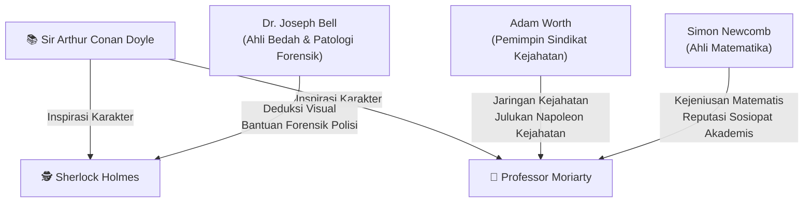
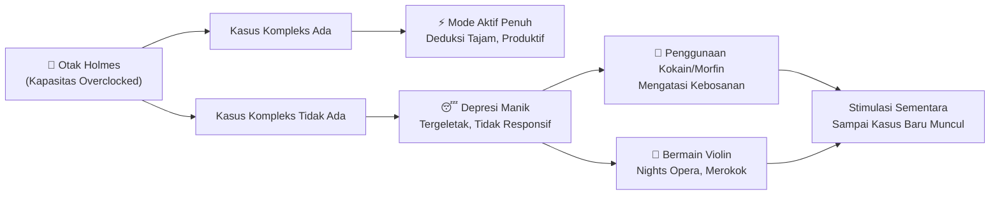
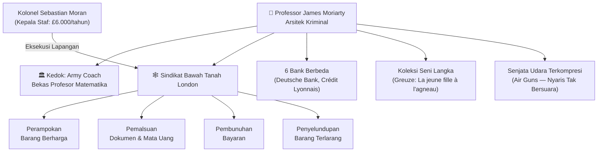
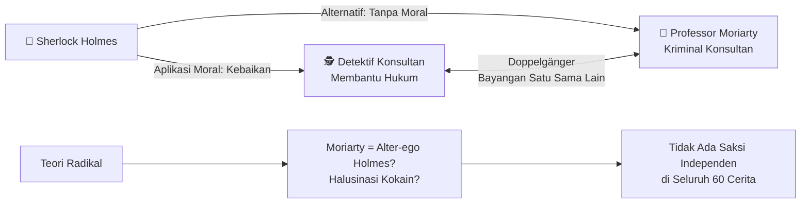
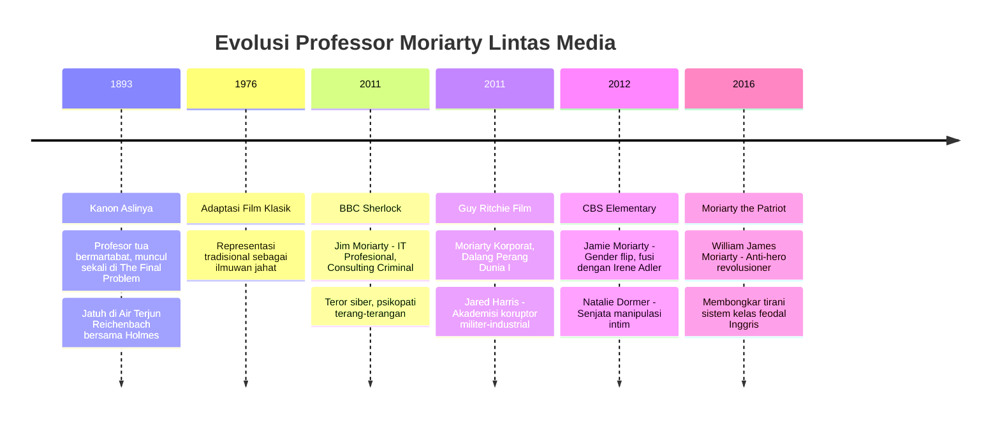

## 🧭 Pendahuluan: Dua Sisi dari Koin yang Sama

Dalam sejarah sastra dunia, sangat sedikit pasangan karakter yang berhasil mencapai tingkat *keabadian budaya* (*cultural immortality*) seperti **Sherlock Holmes** dan musuh bebuyutannya, **Professor James Moriarty**. Diciptakan oleh Sir Arthur Conan Doyle pada penghujung abad ke-19, kedua karakter ini lahir di masa yang sangat krusial — masa ketika genre detektif modern baru saja terbentuk, ketika sains forensik mulai dipandang serius, dan ketika masyarakat Victorian Inggris dilanda berbagai kecemasan sosial yang mendalam.

Yang membuat keduanya tidak lekang oleh waktu bukan sekadar ketegangan antara "pahlawan dan penjahat." Di balik permukaan naratif, Holmes dan Moriarty adalah dua manifestasi dari pertanyaan filosofis yang sama: *Apa yang terjadi ketika intelektualitas manusia mencapai puncaknya — dan kemana ia akan mengarahkan kekuatannya?* 🧠

Artikel ini akan membedah dari segala sudut — historis, psikologis, kriminologis, dan lintas media — dengan tidak menyisakan satu detail pun.

---

## 🧬 Genealogi: Siapa Inspirasi Dunia Nyata Mereka?

### Dr. Joseph Bell: Cetak Biru Holmes

Conan Doyle bukan sekadar mengarang. Ia menyintesis karakter Holmes dari sosok nyata yang pernah ia kenal langsung: **Dr. Joseph Bell**, ahli bedah (*surgeon*) dan profesor patologi forensik (*forensic pathology*) di Royal College of Surgeons, Edinburgh.

Sebagai juru tulis muda di klinik Bell, Doyle menyaksikan secara langsung bagaimana sang profesor mampu membaca seluruh riwayat hidup seorang pasien hanya dari postur, tangan, dan gestur (*gesture* = gerakan tubuh). Bell pernah dengan tepat menyimpulkan bahwa seorang pasien adalah **pelaut kidal yang baru kembali dari India** — tanpa bertanya sepatah kata pun.

Bell tidak hanya pandai di kelas. Ia adalah salah satu patologi forensik pertama yang secara resmi membantu kepolisian Skotlandia, termasuk bersaksi dalam kasus pembunuhan **Alfred Monson** pada tahun 1893. Persis seperti Holmes yang kerap membantu Scotland Yard. 🔬

### Adam Worth & Simon Newcomb: Dua Wajah Moriarty

Moriarty bukanlah karakter tunggal yang sederhana. Ia adalah sintesis dari **dua figur dunia nyata yang sangat berbeda**:

**Adam Worth** — Penjahat kelahiran Jerman-Amerika yang memulai karir sebagai *bounty jumper* (seseorang yang mendaftar militer untuk mendapat bonus lalu kabur) di Perang Saudara Amerika. Ia kemudian membangun sindikat kejahatan internasional yang menarget barang-barang bernilai tinggi. Seorang detektif Scotland Yard pernah menjulukinya **"The Napoleon of the Criminal World"** — julukan yang kemudian dipendekkan Doyle menjadi "Napoleon of Crime" untuk Moriarty.

**Simon Newcomb** — Seorang astronom dan ahli matematika kelas dunia keturunan Kanada-Amerika. Ia sama sekali bukan kriminal, namun dikenal memiliki reputasi sosiopat (*sociopath* = individu yang tidak peduli norma sosial) di lingkungan akademis; metodis dan kejam dalam menghancurkan karier ilmuwan pesaingnya.

Penggabungan antara *jaringan kejahatan* Worth dan *arogansi intelektual destruktif* Newcomb menciptakan Moriarty yang kita kenal. 🕷️

---

## 🧠 Anatomi Psikologis Sherlock Holmes

### Kognitif di Atas Rata-rata: Beban Perseptual

Metodologi Holmes dapat dijelaskan secara presisi melalui psikologi kognitif modern, khususnya konsep **Perceptual Load** (beban perseptual — seberapa banyak kapasitas kognitif yang dibutuhkan untuk memproses informasi).

Setiap hari kita dibombardir oleh ribuan stimulus visual, namun otak kita hanya bisa memproses sebagian kecil secara aktif. Sebagian besar diabaikan secara otomatis (*filtered out*). Holmes adalah anomali: ia mampu secara selektif mengarahkan perhatian ke detail yang paling kritis, mengabaikan *noise* (kebisingan informasi), dan menarik kesimpulan dengan kecepatan yang tampak supranatural.

Dalam kata-katanya sendiri:
> *"Hal terpenting dalam seni deteksi adalah kemampuan untuk mengenali, dari sejumlah fakta, mana yang insidental dan mana yang vital."*
> — Sherlock Holmes, 1894

Ini persis seperti konsep **Selective Attention** (*atensi selektif*) yang dirumuskan oleh peneliti Cherry (1953) — kemampuan manusia untuk fokus pada satu percakapan di tengah keramaian. Holmes hanya melakukan ini pada level yang jauh melampaui rata-rata. 🎯

### Eksentrisitas dan Sisi Gelap: Kokain, Kebosanan, dan Depresi

Otak sekaliber Holmes memiliki kelemahan fatal: **kebosanan adalah racunnya**. Ketika tidak ada kasus yang cukup kompleks, Holmes tidak bisa berfungsi normal. Ia akan tergeletak di sofa berhari-hari tanpa bicara sebelum tiba-tiba berubah menjadi mesin aktivitas yang tak kenal lelah.

Untuk mengatasi stagnasi mental ini, Holmes beralih pada narkotika. Di era Victoria, ini bukan hal yang dianggap seburuk di era modern:

- **Kokain 7%** (*seven per-cent solution* = larutan kokain tujuh persen): diinjeksi langsung ke pembuluh darah.
- **Morfin**: digunakan untuk relaksasi mental.

Di era itu, kokain bahkan dipasarkan sebagai *wonder drug* (obat ajaib) yang diklaim bisa menyembuhkan alkoholisme, TBC, dan depresi — didukung penuh oleh tokoh ilmiah seperti **Sigmund Freud** sendiri. 💉

Dr. Watson sebagai sahabat sekaligus dokter militer sangat tidak menyetujui kebiasaan ini, namun ia mengakui bahwa meski berhasil "menyapih" Holmes dari narkoba, kebiasaan itu *"tidak mati, melainkan hanya tertidur."*

Holmes juga merokok ekstrem (cerutu, rokok, dan pipa), dan terbukti sangat pragmatis secara finansial — menagih klien untuk biaya investigasi dan mengklaim setiap hadiah yang ditawarkan.

---

## 🕸️ Arsitektur "Napoleon Kejahatan": Professor James Moriarty

### Puncak Matematika Murni

Moriarty bukan sekadar penjahat pintar. Ia adalah puncak intelektualitas akademis yang pernah disalahgunakan.

Pada **usia 21 tahun**, ia sudah menulis risalah (*treatise* = karya tulis ilmiah mendalam) tentang **Teorema Binomial** (*Binomial Theorem* = rumus matematika yang ditemukan Euclid, dikembangkan Pascal dan Newton untuk menghitung ekspansi pangkat dari jumlah dua variabel). Risalah ini mendominasi wacana akademis seluruh Eropa dan memberinya posisi sebagai **Profesor Matematika** di sebuah universitas Inggris.

Puncak pencapaiannya adalah buku *The Dynamics of an Asteroid* (Dinamika Sebuah Asteroid) — sebuah karya abstraksi matematika yang begitu tinggi sehingga, menurut Holmes, **tidak ada satu pun ilmuwan di Eropa yang cukup kapabel untuk mengkritisinya**.

Namun "rumor-rumor gelap" tentang perilakunya akhirnya mencuat, dan ia terpaksa mengundurkan diri dari jabatannya, pindah ke London, dan mendirikan profesi formal sebagai "pelatih tentara" (*army coach*) sebagai kedok sempurna. 🎓➡️💀

### Laba-laba di Tengah Jaring

Deskripsi paling ikonik dalam sejarah sastra detektif datang dari mulut Holmes sendiri:

> *"Ia adalah Napoleon kejahatan, Watson. Ia adalah penyelenggara separuh dari segala keburukan di kota besar ini. Ia duduk tanpa bergerak, seperti laba-laba di tengah jaringnya, tetapi jaring itu memiliki seribu radiasi, dan ia mengetahui setiap getaran dari masing-masing jaring tersebut."*

Sebagai arsitek utama, Moriarty menerapkan gaya kepemimpinan ala **Mafia Godfather** (*Don/Bapak Mafia*) era Victorian:

- **Memberikan perlindungan** kepada nyaris semua penjahat di Inggris dengan imbalan kepatuhan mutlak dan bagian dari keuntungan.
- **Tidak pernah mengotori tangannya sendiri** — ia hanya menyusun strategi, bukan eksekusi.
- **Hukuman satu-satunya bagi pengkhianatan**: kematian. 🔪
- **Menggunakan enam bank berbeda** termasuk Deutsche Bank dan Crédit Lyonnais untuk mencuci kekayaannya.
- Membayar kepala stafnya, **Kolonel Sebastian Moran**, dengan gaji astronomis £6.000 per tahun (setara ratusan juta rupiah di era modern).

Kedoknya begitu sempurna sehingga Holmes mengatakan: jika seseorang menuduhnya kriminal di depan umum, Moriarty bisa memenangkan gugatan *libel* (pencemaran nama baik) di pengadilan dan pulang membawa kompensasi penuh sebagai "korban fitnah."

---

## 📚 Kontradiksi Kanonik: Anomali yang Memicu Perdebatan 150 Tahun

Moriarty hadir secara langsung hanya dalam **dua karya** dari total 60 cerita (4 novel + 56 cerita pendek) kanon Holmes:

1. **"The Adventure of the Final Problem"** (1893) — Kemunculan fisik pertama. Berakhir dengan konfrontasi di Air Terjun Reichenbach, Swiss.
2. **"The Valley of Fear"** (1915) — Moriarty sebagai dalang di balik layar.

Menariknya, dalam karya paling terkenal seantero kanon, **"The Hound of the Baskervilles"**, Moriarty sama sekali tidak muncul atau disebut.

| Judul Karya | Keterlibatan Moriarty | Dampak Naratif |
|:---|:---|:---|
| The Final Problem | Penampilan fisik pertama, mengancam Holmes | Jatuh bersama Holmes di Air Terjun Reichenbach |
| The Valley of Fear | Dalang di balik pembunuhan Mr. Jack Douglas | Memperlihatkan struktur internal sindikat Moriarty |
| The Empty House | Disebutkan secara historis | Menjelaskan cara Holmes bertahan menggunakan *baritsu* (gulat Jepang) |
| The Adventure of the Illustrious Client | Dikenang Holmes | Pengaruhnya masih terasa meski ia sudah "mati" |

### Paradoks Kronologis: Siapa yang Kenal Siapa?

Ini adalah salah satu *continuity error* (kesalahan kesinambungan narasi) terbesar dalam sastra klasik dunia. 🤯

Dalam *The Valley of Fear*, Watson dengan jelas menunjukkan bahwa ia **sangat familiar** dengan nama dan reputasi Moriarty. Tapi dalam *The Final Problem*, yang secara kronologis terjadi **setelah** *The Valley of Fear*, Holmes bertanya, "Anda mungkin belum pernah mendengar tentang Professor Moriarty?" dan Watson menjawab, **"Tidak pernah."**

Solusi dari pakar William S. Baring-Gould: *The Final Problem* ditulis 22 tahun lebih awal dari *The Valley of Fear*. Penyangkalan Watson adalah "**lisensi sastra**" — jika Watson mengakui kenal Moriarty, tidak ada alasan bagi Holmes untuk menjelaskan sang profesor kepada pembaca. 📖

### Misteri Tiga Saudara Bernama "James"

Dalam kanon Holmes, keluarga Moriarty terdiri dari beberapa saudara yang — secara aneh — **semuanya bernama James**:

1. **Professor James Moriarty** — sang mastermind kejahatan.
2. **Kolonel James Moriarty** — yang menulis surat membela nama keluarga.
3. **Adik bungsu tak disebutkan namanya** — yang bekerja sebagai kepala stasiun kereta api di wilayah Barat Inggris.

Teori rekonsiliasi dari para ahli:
- **Ian McQueen**: Moriarty tidak punya saudara sama sekali — Kolonel James adalah ilusi naratif.
- **John Bennett Shaw & Vincent Starrett**: Keluarganya secara tidak wajar memberi nama "James" kepada ketiga anaknya.
- **Leslie S. Klinger**: Ada sang Profesor, kakak (Kolonel James), dan adik bungsu yang namanya tidak pernah disebutkan.

Manga *Moriarty the Patriot* menyelesaikan masalah ini dengan memberi nama unik: **William James**, **Albert James**, dan **Louis James** Moriarty. 🎌

---

## 🔬 Kriminologi Era Victoria: Teori Degenerasi Lombroso

### Manusia Kriminal (L'Uomo Delinquente)

Untuk memahami mengapa Moriarty digambarkan seperti itu, kita harus masuk ke ranah **Antropologi Kriminal** (*Criminal Anthropology* = ilmu yang mempelajari karakteristik fisik dan biologis pelaku kejahatan) era Victoria.

Pada 1876, ilmuwan Italia **Cesare Lombroso** menerbitkan *L'Uomo Delinquente* (Manusia Kriminal), sebuah karya revolusioner yang menyatakan bahwa kejahatan bukan murni produk lingkungan — melainkan **determinisme biologis** (*biological determinism* = paham bahwa perilaku manusia ditentukan oleh genetika dan biologi, bukan pilihan bebas).

Lombroso percaya pada:
- **Atavisme** (*atavism* = kemunculan kembali sifat leluhur primitif dalam individu modern)
- **Degenerasi herediter** (*hereditary degeneration* = kemunduran genetis yang diturunkan secara turun-temurun)
- **Stigmata fisik** (tanda-tanda fisik yang mengindikasikan "kriminal bawaan/*born criminal*")

Lombroso juga mengemukakan koneksi biologis yang menggelisahkan: **jenius luar biasa dan kegilaan sering berjalan berdampingan**. 😨

### Transkripsi Lombrosian pada Moriarty

Conan Doyle menerapkan taksonomi Lombroso ini langsung pada tubuh Moriarty. Deskripsi fisiknya sangat simbolis:

- 📏 Tubuh **sangat tinggi dan kurus ekstrem**
- 🧠 **Dahi putih berdome** (menonjol) → kapasitas otak besar
- 👁️ **Mata kelabu sangat cekung**
- 🦎 **Wajah berosilasi perlahan** dari sisi ke sisi dalam gerakan **"reptilia"** (*curiously reptilian fashion*)
- 🪑 **Bahu sangat membungkuk** akibat terlalu banyak studi

Holmes bahkan menyatakan bahwa Moriarty memiliki "**garis keturunan kriminal**" (*criminal strain*) yang mengalir dalam darahnya — bukan karena lingkungan, tapi karena **biologi**. Dan kecerdasannya hanya membuat ancaman itu "jauh lebih berbahaya."

Kehadiran Moriarty memicu ketakutan terbesar masyarakat Victorian: seorang *produk dari masyarakat terhormat* yang menggunakan semua privilegenya (*privilege* = keistimewaan yang dimiliki karena status) untuk kejahatan. Ia bukan orang miskin, bukan bodoh, bukan dari kelas bawah — ia adalah **teror yang lahir dari dalam sistem itu sendiri**. 👑🖤

---

## 🪞 Doppelgänger: Moriarty adalah Bayangan Holmes

### Teori Cermin (Mirror Theory)

Ini adalah lapisan terdalam dari karya Doyle. Holmes dan Moriarty bukan sekadar musuh — mereka adalah **doppelgänger** (*doppelgänger* = istilah Jerman untuk "kembaran" atau bayangan alter-ego seseorang).

Kata-kata Holmes saat mendeskripsikan Moriarty bisa dibalik untuk mendeskripsikan Holmes sendiri:

| Sifat | Sherlock Holmes | Professor Moriarty |
|:---|:---|:---|
| Intelektualitas | Detektif konsultan jenius | Profesor matematika jenius |
| Obsesi | Teka-teki & kasus kriminal | Pengendalian sindikat kejahatan |
| Kepribadian | Tertutup, antisosial, egois | Tertutup, antisosial, egois |
| Gaya kerja | Bekerja sendiri/tim kecil | Bekerja lewat perantara |
| Referensi moral | Membantu hukum | Mengeksploitasi hukum |
| Kedudukan | "Detektif Konsultan" | "Kriminal Konsultan" |

Perbedaan fundamental mereka **hanya satu**: **pilihan moral dalam menggunakan kecerdasan yang sama**. 🔀

### Hipotesis Radikal: Moriarty adalah Halusinasi Holmes?

Ini adalah teori paling subversif (*subversive* = menentang anggapan umum secara radikal) dalam studi Sherlockian (*Sherlockian* = sebutan untuk penggemar/peneliti Holmes). Beberapa kritikus berteori bahwa **Professor James Moriarty tidak pernah benar-benar ada** — ia adalah **halusinasi psikotik** (*psychotic hallucination*) yang dipicu oleh ketergantungan kokain Holmes, atau bahkan sebuah **alter-ego** yang diciptakan Holmes secara sadar.

Argumen forensik teks yang mendukung teori ini:

1. **Tidak ada saksi independen** — Dari 60 cerita, tidak ada satu pun karakter selain Holmes yang pernah berinteraksi langsung, melihat wajah, atau mendengar suara Moriarty. Seluruh deskripsi adalah narasi sepihak Holmes.
2. **Scotland Yard meragukan** — Polisi meragukan apakah rentetan kejahatan tersebut benar-benar dikendalikan oleh satu entitas tunggal.
3. **Kemampuan yang tumpang tindih** — Holmes sendiri pernah menyatakan: *"Jika saya pernah melawan hukum, saya jamin saya bisa menjadi yang terbaik."* Semua karakteristik teknis Moriarty berlaku sempurna untuk Holmes.
4. **Konfrontasi Reichenbach yang mencurigakan** — Holmes mengirimkan surat palsu untuk menyingkirkan Watson, memilih lokasi air terjun dalam di mana tidak ada metode untuk mengevakuasi mayat, lalu meninggalkan catatan rapi sebelum "jatuh." Strategi muslihat ini jauh lebih menyerupai metodologi Holmes daripada Moriarty.

---

## 🎬 Evolusi Lintas Media: Rekonstruksi di Abad ke-21

### 1. BBC Sherlock: Teror Siber dan Sosiopati Digital 📱

Dalam adaptasi BBC karya Steven Moffat dan Mark Gatiss, **Jim Moriarty** (diperankan Andrew Scott) mengalami mutasi total. Ia bukan lagi profesor tua bermartabat, melainkan seorang profesional IT (*Information Technology* = teknologi informasi) berusia muda dan impulsif.

Judulnya berubah dari "Napoleon Kejahatan" menjadi **"Consulting Criminal"** (Kriminal Konsultan) — cerminan simetris sempurna dari "Consulting Detective" (Detektif Konsultan) Holmes.

Jaring laba-labanya kini terdiri dari **kode biner** — kemampuan membuka brankas bank dan pintu keamanan di seluruh dunia secara simultan. Di saat Holmes BBC mengklaim dirinya "sosiopat yang berfungsi tinggi," Moriarty-lah yang benar-benar mendemonstrasikan psikopati bersenjata: membunuh baik untuk uang maupun untuk hiburan, sambil mendengarkan musik teater. 🎭

Serial ini juga menghadirkan **subteks relasional** yang tidak ada di literatur aslinya: ketegangan obsesif yang hampir romantis antara Holmes dan Moriarty, yang melahirkan berbagai teori penggemar tentang fiksasi destruktif keduanya.

### 2. Guy Ritchie's Sherlock Holmes: Korporasi Militer-Industrial 🎥

Dalam *Sherlock Holmes: A Game of Shadows* (2011), Moriarty yang diperankan **Jared Harris** adalah akademisi yang tidak dicurigai publik — namun kali ini ia mengoperasikan **sindikat korporat multinasional** (*multinational corporate syndicate* = jaringan perusahaan raksasa yang beroperasi di banyak negara).

Moriarty versi ini secara metodis **merencanakan Perang Dunia I** — menyabotase perjanjian damai antar negara-negara Eropa agar perusahaan pembuatan senjata miliknya meraup keuntungan berlipat. Ia mengeksploitasi kelas pekerja dan kaum minoritas Gipsi, menjadikan Holmes sebagai simbol perlawanan anti-kapitalisme. 🏭💣

### 3. CBS Elementary: Pembalikan Gender yang Revolusioner 👩

Revolusi naratif paling berani datang dari serial **Elementary** (CBS), di mana Moriarty mengalami *gender flip* (pertukaran gender) dan diperankan oleh **Natalie Dormer** sebagai **Jamie Moriarty**.

Lebih jauh lagi, Jamie Moriarty **digabungkan dengan karakter Irene Adler** — obsesi asmara Holmes. Ia mendekati Holmes (diperankan Jonny Lee Miller) dengan identitas palsu sebagai "Irene Adler, pemulih seni," memanipulasi Holmes agar jatuh cinta, untuk mempelajari dan membedah kelemahannya dari dalam. 💔

Inovasi ini memiliki efek berlapis:
- Menghancurkan asumsi bahwa **kejeniusan kriminal absolut** adalah monopoli laki-laki.
- Mengubah rivalitas intelektual menjadi **perang afektif** (perang emosional).
- Senjata utama Jamie bukan teror fisik, melainkan **manipulasi intim** (*weaponized emotional intimacy* = menggunakan kedekatan emosional sebagai senjata). 🗡️❤️

### 4. Moriarty the Patriot: Sang Anti-Pahlawan Revolusioner 🎌

Di dunia anime dan manga Jepang, *Moriarty the Patriot* (*Yuukoku no Moriarty*) membalik seluruh premis dengan menempatkan **William James Moriarty** bukan sebagai penjahat, melainkan sebagai **protagonis revolusioner**.

Keluarga Moriarty — William, Albert, dan Louis — memiliki misi utopis: **menghapus sistem hierarki kelas feodal Inggris** yang menindas kaum proletar (*proletar* = kelas pekerja bawah yang tidak memiliki modal produksi), dengan cara membunuh para aristokrat (*aristokrat* = bangsawan ningrat) korup secara teatrikal sebagai algojo bayangan.

Bahkan Mycroft Holmes secara diam-diam memberikan lampu hijau untuk operasi ini. Sherlock Holmes tetap menjadi pencari kebenaran objektif, namun kini ia terobsesi dengan tujuan ideologis sang "Penguasa Kejahatan" (*Lord of Crime*). Perseteruan mereka perlahan bertransisi menjadi **persahabatan mutlak** — dan William justru menghentikan pembunuhan Jack the Ripper ketika Sherlock tidak bisa. 🎭🌸

---

## 🏆 Kesimpulan: Mengapa Mereka Abadi?

Sherlock Holmes dan Professor James Moriarty bukan sekadar karakter fiksi. Mereka adalah **wadah proyektif** (*projective vessels*) bagi eksplorasi pertanyaan-pertanyaan paling fundamental tentang kondisi manusia:

- Kemana perginya intelektualitas ketika tidak dibatasi moralitas?
- Apakah kejeniusan pada dasarnya amoral?
- Dapatkah kita benar-benar percaya pada logika murni sebagai penjaga keadilan?

Moriarty — yang secara statistik hanya hadir dalam dua karya dari enam puluh cerita — berhasil menjadi **antagonis paling ikonik dalam sejarah sastra** justru karena kelangkaannya. Ia adalah lubang hitam di tengah narasi: gravitasinya terasa di mana-mana, meski sosoknya hampir tidak terlihat.

Dan paradoks terakhir yang menjadikan keduanya abadi: **mereka adalah satu dan sama**. Dua sisi dari koin intelektualitas manusia. Holmes memilih hukum. Moriarty memilih kekacaaan. Bedanya tipis. Dan di Air Terjun Reichenbach, keduanya jatuh bersama. 🌊

<Callout type="quote" title="Holmes tentang Moriarty">
*"Ia adalah Napoleon kejahatan, Watson. Ia adalah seorang jenius, filsuf, pemikir abstrak. Ia duduk tanpa bergerak, seperti laba-laba di tengah jaringnya."*
</Callout>

---

## 🧩 Glosarium Lengkap

| Istilah Asing | Penjelasan Bahasa Indonesia |
|:---|:---|
| **Cultural Immortality** | Keabadian budaya — karakter yang melampaui zamannya |
| **Perceptual Load** | Beban perseptual — kapasitas kognitif untuk memproses info |
| **Selective Attention** | Atensi selektif — kemampuan fokus pada satu hal di antara kebisingan |
| **Continuity Error** | Kesalahan kesinambungan narasi dalam sebuah karya |
| **Doppelgänger** | Kembaran atau bayangan alter-ego dari seseorang |
| **Atavisme** | Kemunculan kembali sifat leluhur primitif dalam individu modern |
| **Hereditary Degeneration** | Kemunduran genetis yang diturunkan secara turun-temurun |
| **Born Criminal** | Kriminal bawaan — individu yang secara biologis predisposed ke kejahatan |
| **Libel** | Pencemaran nama baik secara tertulis |
| **Gender Flip** | Pertukaran gender karakter dari laki-laki ke perempuan atau sebaliknya |
| **Femme Fatale** | Wanita berbahaya yang menggunakan kecantikan/daya pikat sebagai senjata |
| **Weaponized Intimacy** | Menggunakan kedekatan emosional sebagai senjata manipulasi |
| **Sherlockian** | Sebutan untuk penggemar/peneliti akademis karya Sherlock Holmes |
| **Binomial Theorem** | Teorema Binomial — rumus matematika untuk ekspansi pangkat dari dua variabel |

---
*Ditulis untuk BangunAI Blog. Sumber: riset komprehensif dari 56 referensi akademis, termasuk Baker Street Wiki, Britannica, Stanford University Sherlock Holmes Project, dan berbagai jurnal sastra.* 🛠️
