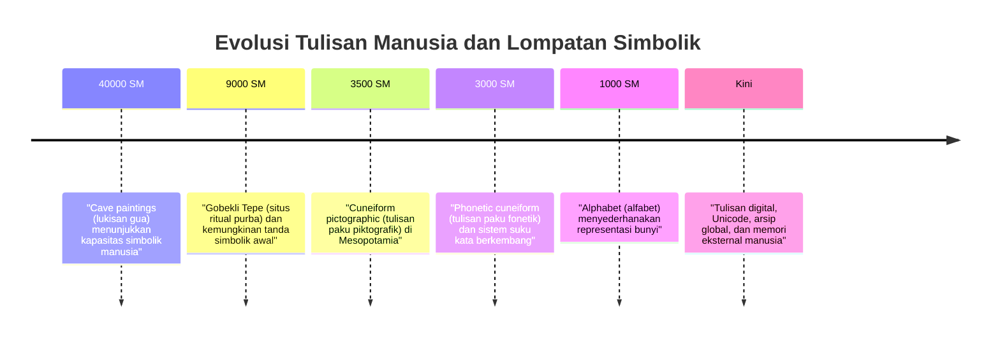
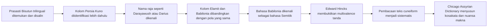
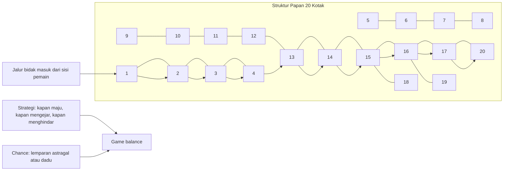
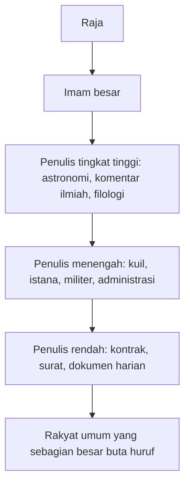
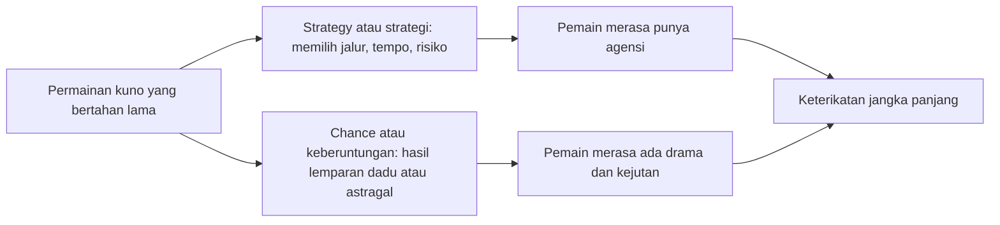

<Callout type="important" title="🏺 Cara Membaca Artikel Ini">
Artikel ini ditulis sebagai esai panjang yang menelusuri akar peradaban manusia melalui wawancara Lex Fridman #487 bersama Irving Finkel. Fokusnya bukan sekadar mengulang isi podcast, melainkan membedahnya secara historis, linguistik, arkeologis, dan filosofis agar pembaca Indonesia bisa menikmati kedalaman topik ini tanpa kehilangan nuansa aslinya 🙂.
</Callout>

## 1. Pengantar: Irving Finkel dan Warisan 4.000 Tahun Tulisan Manusia

Nama **Irving Finkel** hampir selalu muncul dengan aura yang khas: rambut seperti tokoh penyihir, janggut lebat, humor kering yang cerdas, dan antusiasme seorang manusia yang benar-benar jatuh cinta pada dunia kuno 😊. Tetapi di balik persona yang karismatik itu, Finkel adalah sosok yang sangat serius secara akademik. Ia telah bekerja lebih dari empat setengah dekade sebagai **kurator British Museum** untuk koleksi tablet Mesopotamia, khususnya yang berkaitan dengan **cuneiform (tulisan paku)**, **Sumeria (bahasa kuno Mesopotamia selatan)**, **Akkadia (bahasa Semitik kuno Mesopotamia)**, dan **Babilonia (tradisi politik-budaya besar di Mesopotamia)**.

Yang membuat Finkel begitu penting bukan hanya pengetahuannya, tetapi juga kemampuannya menjembatani dua dunia yang biasanya terpisah: dunia akademik yang teliti dan dunia publik yang haus cerita. Banyak pakar besar bisa membaca tablet tanah liat, tetapi tidak semuanya bisa menjelaskan mengapa tablet itu penting bagi hidup manusia modern. Finkel bisa. Ia mampu membuat pembahasan tentang fonetik, sistem suku kata, dekripsi aksara, mitos banjir, atau aturan permainan papan kuno terasa hidup, lucu, dan relevan 🤓.

Bidang kepakarannya pun luar biasa luas. Ia tidak hanya meneliti bahasa dan tulisan, tetapi juga **permainan papan kuno**, **teks sihir (magical texts — teks ritual dan mantra)**, **kedokteran Mesopotamia**, **naskah ramalan (omens — pertanda atau prediksi)**, hingga **literatur epik** seperti *Epic of Gilgamesh (Epos Gilgamesh — puisi epik tertua yang masih bertahan)*. Dengan kata lain, Finkel tidak mempelajari peradaban kuno sebagai benda mati di balik kaca museum. Ia mempelajarinya sebagai kehidupan utuh: cara orang menulis, berjudi, jatuh cinta, takut pada dewa, merawat orang sakit, dan membayangkan kiamat.

Wawancara ini penting karena ia membawa kita kembali ke pertanyaan yang sangat mendasar: **kapan manusia mulai menyimpan pikirannya di luar kepala?** Begitu tulisan lahir, sejarah berubah total. Manusia tidak lagi hanya mengandalkan memori, tradisi lisan, atau ingatan kolektif. Mereka bisa mencatat kontrak, lagu, mantra, ramalan, daftar raja, hukum, keluhan pajak, bahkan instruksi membangun bahtera 😄. Dari titik itu, peradaban menjadi lebih kompleks, lebih luas, dan juga lebih rapuh, karena yang ditulis bisa diwariskan, diperebutkan, disalahpahami, atau didewakan.

<Callout type="quote" title="📜 Tesis Besar Irving Finkel">
Kalau kita ingin memahami siapa manusia modern sebenarnya, kita harus kembali ke saat pertama kali manusia menemukan cara membuat suara, pikiran, dan pengalaman menjadi tanda yang bisa dibaca oleh orang lain ribuan tahun kemudian.
</Callout>

Dalam arti itu, podcast ini bukan sekadar obrolan tentang masa lalu. Ia adalah penyelaman ke fondasi peradaban. Jauh sebelum alfabet Latin, jauh sebelum agama-agama besar modern, jauh sebelum konsep negara-bangsa, sudah ada manusia yang berpikir sangat kompleks, menulis sangat teliti, dan merenungkan hidup serta maut dengan cara yang mengejutkan modern 😌.

---

## 2. Asal-Usul Tulisan: Revolusi Terbesar Manusia (~3500 SM)

Menurut garis besar sejarah yang diterima luas, **tulisan pertama** muncul sekitar **3500 SM** di **Mesopotamia (wilayah di antara Sungai Eufrat dan Tigris, kira-kira Iraq modern)**. Ini bukan detail kecil. Ini adalah salah satu revolusi terbesar dalam sejarah manusia. Api mengubah cara kita bertahan hidup. Pertanian mengubah cara kita menetap. Tetapi tulisan mengubah cara kita berpikir lintas waktu 🔥.

Bahan utamanya sangat sederhana: **tanah liat (clay — lumpur yang dibentuk, dikeringkan, lalu mengeras)**. Kesederhanaan bahan ini justru merupakan kejeniusan ekologis dan kultural. Batu itu berat. Papirus bisa lapuk. Kulit mahal. Tanah liat tersedia melimpah di sungai-sungai besar Mesopotamia. Seseorang cukup mengambil gumpalan lumpur, membentuk tablet kecil, lalu menekan permukaannya dengan stylus (alat tulis runcing) dari alang-alang. Kalau tablet ini kemudian dikeringkan, atau lebih baik lagi terbakar dalam kebakaran kota kuno, ia justru menjadi makin awet. Ironis, ya — bencana kebakaran sering menjadi mesin pengawet arsip kuno 😮.

Esensi tulisan, menurut Finkel, bukan sekadar gambar. Tulisan adalah **sistem simbol yang disepakati**. Seseorang membuat tanda. Orang lain, yang hidup di tempat lain atau masa lain, dapat “memainkan kembali” bunyi atau maknanya dalam kepala. Artinya, tulisan adalah teknologi untuk memindahkan bahasa ke medium visual. Ketika proses itu berhasil, suara menjadi objek, dan memori manusia tiba-tiba punya tulang belakang eksternal.

### 2.1 Tahap pertama: Pictographic Writing (tulisan piktografik)

Tahap awal sering dijelaskan sebagai **pictographic writing (tulisan piktografik — sistem gambar yang mewakili objek atau konsep)**. Di tahap ini, gambar kaki berarti kaki, gambar jelai berarti jelai, gambar kepala berarti kepala. Ini tampak intuitif dan masuk akal. Banyak orang membayangkan bahwa begitulah semua tulisan bermula: dari gambar menuju abstraksi.

Namun, justru di sinilah Finkel melempar gagasan yang provokatif. Ia menduga bahwa mungkin saja **sistem bunyi lebih awal** atau setidaknya lebih penting daripada yang selama ini diasumsikan. Artinya, tanda-tanda awal mungkin tidak murni berangkat dari “gambar objek”, tetapi sejak dini juga punya hubungan dengan suara, suku kata, atau permainan fonetik tertentu. Kalau hipotesis ini benar, maka sejarah tulisan tidak sesederhana evolusi gambar menjadi huruf. Ia jauh lebih cerdas, lebih cair, dan lebih eksperimental.

### 2.2 Tahap kedua: Phonetic Leap (lompatan fonetik)

Inilah titik genius-nya ✨. Pada suatu saat, manusia menyadari bahwa gambar bukan hanya bisa mewakili benda, tetapi juga **bunyi dari kata yang melambangkan benda itu**. Ini disebut **phonetic leap (lompatan fonetik — penggunaan tanda berdasarkan bunyi, bukan sekadar makna visualnya)**. Begitu prinsip ini ditemukan, dunia linguistik meledak.

Bayangkan gambar “kaki” dalam suatu bahasa diucapkan dengan bunyi tertentu. Bunyi itu lalu dipakai untuk menuliskan kata lain yang kebetulan memiliki suku kata sama. Tiba-tiba tulisan tidak lagi terikat pada benda konkret. Ia bisa merekam nama orang, kata kerja, abstraksi, gramatika, puisi, doa, dan mitos. Dalam sejarah kognitif manusia, ini adalah salah satu loncatan paling menakjubkan 🧠.

### 2.3 Tahap ketiga: Syllabic Writing (tulisan suku kata)

Setelah lompatan fonetik, muncul bentuk yang lebih matang: **syllabic writing (tulisan suku kata — sistem tanda yang mewakili satuan bunyi berupa suku kata)**. Di sinilah tulisan bisa benar-benar merekam bahasa lengkap. Tata bahasa, imbuhan, variasi makna, dan sastra menjadi mungkin. Kita tidak lagi berhadapan dengan daftar barang. Kita berhadapan dengan pikiran manusia yang bisa diabadikan.

### Diagram 1 — Timeline Evolusi Tulisan Manusia

Finkel juga menyebut **Gobekli Tepe (Göbekli Tepe — situs megalitik di Turki yang jauh lebih tua daripada Sumer)**, sekitar **9000 SM**, dan mengaitkannya dengan sebuah stempel batu hijau berbentuk bundar yang memuat tanda-tanda tertentu. Ia melempar kemungkinan yang berani: mungkinkah ada bentuk proto-writing (pra-tulisan — sistem tanda sebelum tulisan matang) ribuan tahun sebelum Sumer? Ini memang belum menjadi konsensus keras seluruh dunia akademik, tetapi justru menarik karena memaksa kita membuka imajinasi sejarah. Mungkin akar tulisan jauh lebih tua, lebih tersembunyi, dan lebih eksperimental daripada yang biasa diajarkan.

Lalu ada pertanyaan tentang **inertia (kelembaman — kecenderungan sistem lama bertahan walau ada opsi yang lebih efisien)**. Mengapa sistem yang rumit bisa bertahan lama, bahkan saat lebih sulit dipelajari? Jawabannya penting: karena tulisan bukan semata alat komunikasi. Ia juga alat institusi, kekuasaan, pendidikan, dan identitas. Begitu sebuah sistem dipakai oleh negara, kuil, administrasi, dan kelas penulis, sistem itu memperoleh bobot sosial. Yang rumit justru bisa menguntungkan kelompok tertentu karena menciptakan gerbang masuk yang sulit 🚪.

<Callout type="info" title="🧩 Mengapa Lompatan Fonetik Sangat Penting?">
Tanpa lompatan fonetik, tulisan akan cenderung berhenti di level daftar benda. Dengan fonetik, tulisan bisa menjadi mesin peradaban: hukum, sastra, doa, kontrak, ilmu, bahkan gosip 😄.
</Callout>

---

## 3. Cuneiform: Sistem Tulisan Terlama dalam Sejarah (3.000+ Tahun)

Istilah **cuneiform (tulisan paku)** berasal dari kata Latin **cuneus (pasak atau baji)**. Nama ini diberikan karena bentuk tanda-tandanya menyerupai irisan kecil, pasak, atau bekas tekanan berbentuk baji pada tanah liat. Nama itu modern, bukan nama asli yang dipakai orang Babilonia. Tetapi cukup tepat untuk menjelaskan visualnya: bukan coretan tinta yang mengalir, melainkan jejak tekan kecil yang membentuk pola kompleks.

Sistem ini ditemukan kembali oleh dunia modern pada abad ke-19, terutama melalui penggalian di kota-kota **Asyur (Assyria — kerajaan besar di Mesopotamia utara)** dan **Babilonia (Babylonia — tradisi kerajaan besar di Mesopotamia selatan-tengah)** di wilayah Iraq. Yang ditemukan bukan satu-dua prasasti megah saja, melainkan gunung dokumen: tablet bisnis, surat pribadi, kontrak tanah, daftar upah, doa, ramalan, ritual, dan karya sastra. Kesan pertama bagi penemu modern tentu memusingkan: ribuan tanda kecil di tanah liat, tanpa ada yang bisa membacanya 😵.

Materialnya lagi-lagi kunci: **tablet tanah liat**. Karena ditanam berabad-abad atau ribuan tahun di tanah kering, banyak tablet selamat. Ini menjadikan Mesopotamia unik. Banyak peradaban menulis pada medium organik yang mudah hilang. Mesopotamia menulis pada lumpur, dan lumpur itu menjadi arsip.

Hal yang sering disalahpahami adalah asumsi bahwa cuneiform adalah alfabet. **Bukan.** Cuneiform pada banyak fase utamanya adalah **sistem suku kata (syllabic system — sistem yang menyandikan bunyi suku kata)**, walau juga punya unsur logografik (satu tanda mewakili kata atau konsep) dan determinatif (tanda penjelas kategori makna). Jadi ia kompleks, berlapis, dan tidak sesederhana “satu huruf satu suara”.

Misalnya, jika kita ingin menuliskan kata modern seperti *museum*, Finkel menjelaskan bahwa logikanya mendekati **mu + ze + um**. Dengan kata lain, sistem ini memecah bunyi menjadi unit suku kata. Ia juga bekerja dengan sejumlah vokal dasar, terutama **a, i, u, e**, yang dipasangkan dengan berbagai konsonan. Bagi orang modern yang terbiasa alfabet, ini mungkin terasa rumit. Tetapi bagi masyarakat yang membangunnya, sistem ini sangat mampu menangani bahasa administratif dan sastra tingkat tinggi.

### Mengapa bisa bertahan lebih dari 3.000 tahun?

Ada tiga penjelasan besar yang Finkel tekankan.

**Pertama, inertia (kelembaman).** Begitu suatu sistem menjadi infrastruktur birokrasi, menggantinya sangat mahal secara sosial. Ribuan penulis telah dilatih, arsip telah dibuat, dan standar telah dibangun. Mengganti sistem berarti mengguncang seluruh ekologi administratif.

**Kedua, kontrol oleh scribal class (kelas juru tulis atau kelas penulis).** Orang yang menguasai tulisan memegang kekuasaan nyata. Mereka menyusun kontrak, mencatat pajak, menyalin sastra, dan menghubungkan raja dengan dunia dokumen. Sistem yang sulit dipelajari memberi mereka posisi eksklusif 👑.

**Ketiga, lexicography (leksikografi — pengelompokan, daftar, dan standardisasi tanda atau kata).** Ini sangat menarik. Sejak awal, tradisi Mesopotamia memiliki dorongan kuat untuk mengklasifikasikan tanda, menyalin daftar, dan menjaga standardisasi. Tanpa ini, sistem sekompleks cuneiform akan kacau. Tetapi karena ada disiplin leksikografis, kompleksitas itu justru bisa diwariskan dengan stabil.

Salah satu hal tersulit dalam belajar cuneiform adalah **multivalence (multivalensi — satu tanda bisa memiliki lebih dari satu bunyi dan/atau lebih dari satu makna)**. Inilah mimpi buruk sekaligus keindahan sistemnya 😅. Sebuah tanda bisa dibaca berbeda tergantung konteks bahasa, jenis teks, atau tradisi penulisan. Jadi membaca tablet bukan sekadar mengenali simbol. Itu adalah seni menafsirkan konteks.

<Callout type="tip" title="🪶 Kenapa Cuneiform Sulit Dipelajari?">
Karena satu tanda bisa berfungsi sebagai kata, bunyi, atau penanda kategori. Pembaca harus memahami bahasa, konteks, genre teks, dan kebiasaan scribal (kepanitiaan penulisan) sekaligus.
</Callout>

---

## 4. Proses Dekripsi Cuneiform: Kisah Heroik Abad ke-19

Selama ribuan tahun, tanda-tanda paku itu benar-benar bisu. Tablet ada, prasasti ada, tetapi tidak ada yang bisa membacanya. Baru pada awal abad ke-19 teka-teki ini mulai retak. Kunci besarnya adalah **Prasasti Bisutun (Behistun Inscription — prasasti monumental Raja Darius di tebing Persia)**.

Prasasti ini luar biasa karena ditulis dalam **tiga bahasa**: **Persia Kuno (Old Persian)**, **Elamit (bahasa kuno Elam di Iran barat daya)**, dan **Babilonia (Babylonian/Akkadian)**. Situasinya mirip dengan fungsi **Rosetta Stone equivalent (padanan Batu Rosetta — objek multibahasa yang membantu memecahkan tulisan kuno)**, walau konteks dan detilnya berbeda.

Karena Persia Kuno lebih mudah diurai, para sarjana mulai mengenali pola nama-nama raja. Ketika nama **Darayawush (Darius)** dikenali, mereka sadar bahwa tiga kolom itu mungkin memuat isi yang berkaitan. Dari sini, jalan dekripsi mulai terbuka. Tetapi perjalanan menuju pembacaan penuh masih panjang dan berliku.

Di sinilah muncul dua nama: **Henry Rawlinson** dan **Edward Hincks**. Rawlinson sering mendapat gelar populer sebagai “Bapak Asiriologi”, tetapi Finkel dengan nakal menyebutnya **“Bapak Tiri Asiriologi”** 😄. Sindiran itu bukan tanpa alasan. Rawlinson memang heroik dalam menyalin dan mempublikasikan data Bisutun. Namun, menurut Finkel, pemecahan intelektual yang paling menentukan justru dilakukan oleh **Edward Hincks**, seorang pendeta dari **Killyleagh, Irlandia Utara**.

Hincks-lah yang sungguh memahami salah satu kunci terdalam cuneiform: **satu tanda bisa memiliki lebih dari satu nilai bunyi**. Temuan ini terdengar teknis, tetapi ia mengubah segalanya. Tanpa memahami multivalensi, pembaca akan terus memaksa setiap tanda punya satu nilai tetap, dan sistem cuneiform akan tampak mustahil dipecahkan. Dengan kata lain, Hincks melihat bahwa sistem ini tidak rusak; justru ia lebih canggih dari dugaan awal.

### Diagram 2 — Proses Dekripsi Cuneiform

Dari titik itu, studi cuneiform berkembang menjadi **Assyriology (Asiriologi — ilmu yang mempelajari bahasa, sejarah, dan budaya Mesopotamia kuno)**. Salah satu monumen intelektualnya adalah **Chicago Assyrian Dictionary (Kamus Asiria Chicago — kamus raksasa bahasa Akkadia/Babilonia)**. Proyek ini dimulai sejak 1920-an dan diselesaikan berdekade-dekade kemudian pada abad ke-20. Finkel menyebutnya, dengan gaya bercanda setengah serius, sebagai salah satu pencapaian terbesar Amerika selain gitar elektrik 🎸.

Candaan itu justru mengandung kebenaran. Kamus ini bukan daftar kata sederhana, melainkan usaha monumental untuk memetakan makna, nuansa, konteks, dan sejarah penggunaan bahasa Babilonia dari A sampai Z. Tanpa proyek seperti itu, pembacaan teks kuno akan terus setengah gelap.

<Callout type="success" title="🔓 Mengapa Dekripsi Ini Heroik?">
Karena para sarjana abad ke-19 tidak sekadar menerjemahkan kata. Mereka membangkitkan kembali suara peradaban yang telah diam selama ribuan tahun. Itu seperti menemukan radio purba dan membuatnya berbunyi lagi 📻.
</Callout>

---

## 5. Bahasa Sumeria: Bahasa Tanpa Keluarga

Salah satu bagian paling memukau dalam pembicaraan Finkel adalah soal **bahasa Sumeria (Sumerian — bahasa tertulis tertua Mesopotamia selatan)**. Jika bahasa Babilonia atau Akkadia masih bisa ditempatkan dalam rumpun **Semitic Languages (bahasa-bahasa Semitik — keluarga bahasa yang mencakup Arab, Ibrani, Aram, dan lainnya)**, maka Sumeria berdiri sendiri. Ia adalah **language isolate (bahasa isolat — bahasa yang tidak terbukti berkerabat dengan bahasa lain yang diketahui)**.

Ini bukan sekadar kategori teknis. Implikasinya sangat besar. Kalau Sumeria tidak punya saudara yang masih hidup atau terdokumentasi, berarti pernah ada **keluarga bahasa besar** yang kini hilang sepenuhnya. Mungkin jejak-jejak jauhnya pernah tersebar di Asia Barat, Iran, bahkan lebih jauh ke timur. Tetapi semua itu punah tanpa sisa yang bisa dipastikan. Sumeria seperti satu-satunya daun yang tersisa dari hutan linguistik yang sudah terbakar habis 🍂.

Sifat gramatikalnya juga menarik. Sumeria sering dipahami sebagai **agglutinative language (bahasa aglutinatif — bahasa yang membentuk makna dengan menempelkan banyak imbuhan pada akar kata)**. Dalam bahasa seperti ini, fungsi gramatikal dapat disusun berlapis-lapis melalui prefiks, sufiks, atau partikel yang melekat. Ini memberi fleksibilitas sekaligus kerumitan tinggi.

Finkel juga mengangkat gagasan yang lebih besar: bahwa manusia purba, termasuk **Homo sapiens awal** dan kemungkinan juga **Neanderthal**, hampir pasti memiliki bahasa. Ini penting untuk melawan bayangan primitif yang bodoh. Kalau manusia purba bisa berburu secara terkoordinasi, mewariskan teknik, membuat simbol, menguburkan orang mati, dan menghasilkan seni, mereka pasti memiliki sistem komunikasi yang kaya. Tidak mungkin tidak.

Dalam konteks itu, Sumeria bukan awal dari bahasa manusia. Ia hanyalah salah satu **awal yang berhasil tertangkap oleh tulisan**. Bahasa itu sendiri jauh lebih tua daripada tulisan. Jadi ketika kita membaca tablet Sumeria, kita tidak sedang melihat kelahiran pikiran manusia. Kita melihat salah satu momen ketika pikiran manusia akhirnya berhasil meninggalkan bekas permanen.

### Tabel 1 — Bahasa Kuno Mesopotamia

| Bahasa | Keluarga | Status Saat Ini | Contoh Kata | Catatan |
|---|---|---|---|---|
| **Sumeria (Sumerian)** | Bahasa isolat | Punah, hanya bertahan dalam teks | *lugal* (raja), *dub* (tablet) | Bahasa tanpa keluarga yang diketahui; sangat penting dalam pendidikan scribal |
| **Akkadia (Akkadian)** | Semitik Timur | Punah, terdokumentasi luas | *šarrum* (raja), *bītum* (rumah) | Bahasa besar administrasi dan sastra di Mesopotamia |
| **Babilonia (Babylonian)** | Dialek/tradisi Akkadia | Punah, hidup dalam teks | *awīlum* (orang), *ṭuppum* (tablet) | Digunakan dalam sastra, hukum, ritual, dan korespondensi |
| **Asyur (Assyrian)** | Dialek/tradisi Akkadia | Punah, hidup dalam teks | bentuk-bentuk nama raja Asyur | Varian utara dengan tradisi administrasi dan imperial kuat |
| **Elamit (Elamite)** | Tidak pasti, terpisah dari Semitik | Punah | istilah kerajaan Elam | Penting dalam prasasti multibahasa seperti Bisutun |
| **Persia Kuno (Old Persian)** | Indo-Iran | Punah, tetapi terhubung dengan rumpun hidup | *Dārayavahuš* (Darius) | Sangat penting untuk membuka dekripsi prasasti trilingual |

<Callout type="info" title="🌍 Makna Besar Bahasa Isolat">
Bahasa isolat seperti Sumeria mengingatkan kita bahwa sejarah manusia penuh dunia yang hilang total. Bukan hanya kerajaan yang runtuh, tetapi juga seluruh keluarga bahasa yang lenyap tanpa keturunan 😔.
</Callout>

---

## 6. Kekayaan Literatur Mesopotamia: Dari Omens hingga Lelucon

Salah satu kekeliruan populer tentang dunia kuno adalah mengira tulisan kuno hanya berisi daftar raja, hukum, dan doa. Padahal koleksi tablet Mesopotamia membuktikan hal sebaliknya. **British Museum saja memiliki sekitar 130.000 tablet cuneiform**, dan Finkel menekankan bahwa jutaan lainnya mungkin masih tertanam di tanah. Ini bukan sekadar arsip negara. Ini adalah potongan kehidupan sehari-hari manusia kuno.

Isinya sangat beragam: **surat bisnis**, **kontrak**, **kampanye militer**, **catatan pajak**, **resep medis**, **mantra perlindungan**, **puisi**, **mitos penciptaan**, **hikayat cinta**, **humor**, dan **omen literature (literatur pertanda)**. Jadi ketika kita bicara tentang Mesopotamia, kita tidak bicara tentang satu teks suci besar saja. Kita bicara tentang ekosistem teks yang kompleks.

Finkel memberi contoh yang lucu sekaligus penting dari dunia **omens (pertanda atau ramalan)**: misalnya, “Jika cicak melintas di meja sarapan, maka sang ratu akan mati.” Bagi telinga modern, ini terdengar seperti takhayul absurd. Tetapi Finkel mengingatkan bahwa struktur “Jika A, maka B” tidak boleh dibaca terlalu literal. Dalam praktiknya, ia lebih dekat ke bahasa probabilistik: **mungkin**, **bisa jadi**, **patut diwaspadai**. Masalahnya, banyak penerjemah modern menerjemahkan formula kuno ini terlalu mekanis, seolah orang Babilonia benar-benar percaya hubungan sebab-akibatnya absolut.

Di titik ini, Finkel sangat tajam. Ia mengatakan bahwa peramal cerdas sebenarnya mirip dokter modern: mereka berbicara dengan **modal verbs (kata kerja modal — penanda kemungkinan seperti bisa, mungkin, seharusnya)**. Mereka tahu dunia tidak pasti. Mereka hanya memetakan pola kemungkinan, bukan takdir yang terkunci. Ini pengamatan linguistik yang sangat berharga.

Literatur Mesopotamia juga tidak selalu serius. Ada **humor Babilonia** yang sangat membumi 😄. Finkel menyinggung drama jalanan tentang **Marduk (dewa besar Babilonia)** yang berselingkuh dan istrinya **Sarpanitum** yang cemburu. Ada pula gambaran cinta yang nyeleneh, seperti pujian romantis berbunyi: “Bibirmu seperti lobak, telingamu seperti walrus.” Dari sudut modern ini terasa komikal, tetapi justru di situ letak nilai manusianya. Mereka tidak hanya menulis soal dewa dan kiamat. Mereka juga bercanda, menggoda, dan menulis cinta dengan selera estetik yang berbeda.

<Callout type="quote" title="😂 Mengapa Humor Kuno Penting?">
Karena humor adalah bukti kuat bahwa orang kuno bukan fosil mental. Mereka punya ironi, kecanggungan, rasa malu, kelucuan, dan absurditas — persis seperti kita.
</Callout>

Pada titik ini, wawancara Finkel memberi pelajaran besar: begitu teks-teks ini bisa dibaca, peradaban Mesopotamia berhenti tampak seperti reruntuhan dan mulai tampak seperti masyarakat penuh warna.

---

## 7. Epic of Gilgamesh: Sastra Tertua di Dunia

Jika ada satu karya yang paling sering menjadi pintu masuk ke literatur Mesopotamia, itu adalah **Epic of Gilgamesh (Epos Gilgamesh — puisi epik besar tentang raja Uruk, persahabatan, kematian, dan pencarian keabadian)**. Gilgamesh sendiri kemungkinan adalah tokoh historis, seorang raja nyata di **Uruk (kota besar Sumeria)**, yang kemudian mengalami proses mitologisasi hingga menjadi figur setengah legendaris.

Versi terkenal epos ini tersusun dalam **12 tablet** dan ditemukan di perpustakaan **Nineveh (Niniwe — ibu kota kekaisaran Asyur)**. Tema-temanya mengejutkan karena begitu modern: ketakutan terhadap kematian, kegagalan mengejar keabadian, arti persahabatan, kesombongan manusia di hadapan para dewa, dan kesadaran bahwa peradaban dibangun oleh manusia yang fana.

Finkel menyoroti jejak tradisi lisan di dalam teks ini. Formula berulang seperti, “Gilgamesh membuka mulutnya untuk berbicara kepada temannya Enkidu...” adalah jejak dari **oral tradition (tradisi lisan — pola formulaik yang memudahkan penghafalan dan pementasan)**. Ini penting. Artinya, tulisan tidak muncul di ruang hampa. Banyak sastra besar awalnya hidup di mulut manusia, baru kemudian mengendap ke tablet.

Bagian menarik lain adalah tentang perpustakaan **Ashurbanipal (Ashurbanipal Library — koleksi kerajaan besar di Nineveh)**. Raja Asyur ini dikenal sebagai salah satu pengumpul pengetahuan terbesar dunia kuno. Ia mengumpulkan teks dari berbagai wilayah, seperti seorang arsiparis imperial. Tetapi Finkel menolak narasi sederhana bahwa perpustakaan itu “dihancurkan” begitu saja oleh musuh. Menurutnya, sangat mungkin penyerbu justru **mengambil tablet-tablet terbaik**, sedangkan yang tersisa bagi arkeolog modern sering kali adalah duplikat, sampah arsip, dan pecahan.

Pandangan ini cerdas karena menggeser cara kita membayangkan kehancuran peradaban. Yang hilang dari masa lalu bukan hanya karena terbakar atau pecah. Yang hilang juga karena dibawa, dipilih, disortir, dan dipindahkan. Arsip yang kita temukan sering kali hanyalah sisa-sisa dari proses seleksi sejarah.

Finkel lalu membuat hubungan yang sangat puitis dengan **cave paintings (lukisan gua)**. Ia memuji kualitas artistik lukisan gua sebagai bukti bahwa manusia purba sudah memiliki kejeniusannya sendiri. Artinya, kreativitas manusia bukan hasil “kemajuan modern” semata. Kita mewarisi kapasitas artistik dan simbolik yang sangat tua 🎨.

---

## 8. Tablet Bahtera (The Ark Tablet): Penemuan Revolusioner

Inilah bagian paling terkenal dari kiprah populer Finkel: **The Ark Tablet (Tablet Bahtera)**. Sekitar satu tablet kecil, kira-kira **8 inci x 3 inci**, dengan sekitar **60 baris teks**, berhasil mengguncang cara kita membaca kisah bahtera dan banjir.

Tablet ini berasal sekitar **1700 SM**, berarti lebih dari **seribu tahun lebih tua** daripada penulisan kisah **Nuh (Noah)** dalam tradisi Ibrani Alkitab. Cerita penemuannya hampir sinematik. Seseorang datang ke British Museum untuk berkonsultasi, membawa tablet itu. Finkel melihatnya, membaca sebagian, dan langsung tahu bahwa ia sedang berhadapan dengan sesuatu yang luar biasa 😮.

Isi teksnya adalah instruksi ilahi untuk membangun **ark (bahtera atau kapal penyelamat)**. Tokohnya bukan Nuh, melainkan **Atra-Hasis (tokoh bijak dalam mitos banjir Mesopotamia)**. Alasan banjirnya pun sangat Mesopotamian dan agak jenaka: manusia terlalu **bising**, sehingga para dewa tidak bisa tidur siang 😄. Tetapi di balik humor itu, Finkel membaca makna yang lebih dalam: “bising” bisa menjadi metafora **overpopulasi (kelebihan populasi)**, keramaian sosial, atau ketidak-tertiban manusia.

Yang paling revolusioner adalah bentuk bahteranya. Menurut tablet ini, kapal itu **bukan kotak panjang**, melainkan **bulat**, seperti **coracle (perahu bulat tradisional)**. Ini mengubah seluruh imajinasi populer yang dibentuk oleh ilustrasi Alkitab dan film Hollywood. Finkel bahkan menekankan bahwa bahtera berbentuk bulat jauh lebih masuk akal jika tujuannya sekadar **mengapung dan bertahan**, bukan berlayar cepat. Kalau dunia banjir, kamu tidak perlu kapal anggun. Kamu perlu benda besar yang tidak tenggelam 🛶.

Instruksinya sangat detail: bahan, ukuran, penataan tali, struktur, dan **bitumen (aspal alam untuk pelapisan anti-air)** sebagai waterproofing (pelapis anti bocor). Di sinilah teks ini terasa sangat teknis. Ia bukan hanya mitos, tetapi juga manual konstruksi.

### Kaitan dengan kisah Nuh

Pada tahun 1872, **George Smith** sudah lebih dulu membuat dunia gempar ketika menemukan bagian banjir dalam tablet *Gilgamesh* dan menunjukkan kemiripannya dengan **Genesis (Kitab Kejadian)**. Detail seperti **tiga burung yang dilepas satu per satu** terlalu spesifik untuk dianggap kebetulan. Ini menunjukkan **literary dependence (ketergantungan sastra — satu teks atau tradisi menyerap motif dari tradisi sebelumnya)**.

Jadi poin besarnya jelas: kisah banjir Mesopotamia **lebih tua** daripada versi Alkitab. Ini tidak otomatis membuat versi Alkitab “palsu” dalam arti sederhana. Tetapi ia menunjukkan bahwa tradisi Ibrani berdialog dengan warisan sastra yang lebih tua, terutama ketika komunitas Yahudi mengalami **exile in Babylon (pembuangan di Babilonia)**.

### Diagram 3 — Penyebaran Mitos Banjir dari Mesopotamia

```mermaid
flowchart LR
    A["Kemungkinan banjir besar nyata di Mesopotamia"] --> B["Trauma kolektif diwariskan secara lisan"]
    B --> C["Atra-Hasis sekitar 1700 SM"]
    C --> D["Epic of Gilgamesh versi kemudian sekitar 800 SM"]
    D --> E["Exile Yahudi di Babel sekitar 600 SM"]
    E --> F["Genesis dan kisah Nuh dalam tradisi Ibrani"]
    F --> G["Tradisi Kristen dan misionaris menyebarkan kisah banjir"]
    G --> H["Kisah banjir menjadi narasi global dengan banyak varian lokal"]
```

Finkel juga menegaskan bahwa **banjir sangat masuk akal di Mesopotamia**. Sungai **Tigris** dan **Eufrat** memang bisa meluap besar. Sementara itu, Yerusalem bukan ekologi sungai banjir besar seperti Mesopotamia. Jadi secara geografis, cerita banjir universal jauh lebih alami muncul dari dataran aluvial Mesopotamia.

Teori Finkel adalah bahwa mungkin pernah ada **banjir besar nyata** ribuan tahun sebelum tablet itu ditulis. Peristiwa nyata ini lalu berubah menjadi **memori kolektif**, dibesar-besarkan oleh tradisi lisan, dan akhirnya dipaku dalam bentuk sastra. Jadi mitos bukan lawan sejarah. Sering kali ia adalah sejarah yang telah dipadatkan oleh imajinasi kolektif.

<Callout type="important" title="🌊 Inti Penemuan Tablet Bahtera">
Tablet Bahtera tidak sekadar memberi versi “lebih tua” dari cerita Nuh. Ia menunjukkan bagaimana teks, geografi, trauma kolektif, teknologi perahu, dan imajinasi religius saling menyilang dalam pembentukan mitos besar manusia.
</Callout>

---

## 9. Hipotesis Graham Hancock vs Perspektif Finkel

Nama **Graham Hancock** sering muncul dalam diskusi publik tentang dunia kuno, terutama terkait **Younger Dryas hypothesis (hipotesis Younger Dryas — gagasan tentang peristiwa besar sekitar 10.000 SM yang memicu kehancuran luas)** dan ide bahwa mungkin pernah ada peradaban global maju yang hancur oleh bencana kosmik. Dalam versi populernya, asteroid menghantam Bumi, lapisan es mencair, dan terjadilah banjir global.

Finkel memandang probabilitas penjelasan semacam itu sangat kecil, atau dalam istilahnya hampir **negligible (dapat diabaikan secara probabilistik)**. Penolakannya bukan semata karena ia anti-spekulasi, tetapi karena ia membaca mitos banjir sebagai **konstruksi literatur yang sangat menarik secara naratif**, bukan peta kejadian geologis global.

Ini penting. Finkel tidak berkata bahwa tak pernah ada banjir nyata. Ia justru menganggap banjir lokal besar sangat mungkin. Yang ia tolak adalah lompatan dari kisah sastra ke klaim sejarah global tanpa bukti yang memadai. Dalam banyak kasus, mitos banjir bertahan bukan karena ia laporan ilmiah, tetapi karena ia **template narasi yang irresistible (sangat menggoda dan hampir mustahil ditolak)**. Mengapa? Karena premisnya sangat kuat: **dunia hampir habis, tetapi satu orang yang bertindak cepat berhasil menyelamatkan kehidupan**. Ini adalah cetakan dramatis yang dipakai manusia berulang kali hingga era film blockbuster 🎬.

Jalur tokohnya sangat jelas: **Utnapishtim (tokoh banjir dalam Gilgamesh)**, **Atra-Hasis**, lalu **Nuh**, dan kemudian ratusan adaptasi modern. Dari sudut naratif, pola ini sempurna: ada ancaman total, wahyu atau pengetahuan khusus, pembangunan alat keselamatan, pemeliharaan benih kehidupan, lalu restart dunia. Sulit mencari mesin cerita yang lebih efektif daripada itu.

Jadi perbedaan Finkel dan Hancock tidak hanya soal fakta, tetapi soal **metode membaca masa lalu**. Hancock cenderung membaca mitos sebagai petunjuk terhadap sejarah besar yang hilang. Finkel membaca mitos sebagai hasil pertemuan antara **trauma nyata**, **geografi lokal**, **tradisi lisan**, dan **imajinasi sastra**.

---

## 10. Mengapa Kisah Banjir Ada di Seluruh Dunia?

Ini pertanyaan yang sangat menggoda: kalau banjir besar muncul di banyak tradisi, bukankah itu bukti satu banjir global? Finkel memberi jawaban yang jauh lebih cerdas dan tidak sesederhana itu.

Di Mesopotamia sendiri, banjir menjadi penanda sejarah besar. Ada konsep **“sebelum banjir”** dan **“sesudah banjir”**, mirip dengan cara masyarakat modern berbicara tentang “sebelum perang” dan “sesudah perang”. Dalam **King List (daftar raja)**, ada raja-raja sebelum banjir yang masa pemerintahannya berlangsung ribuan tahun. Ini menunjukkan bahwa banjir telah menjadi semacam **batas kosmologis dan historis**.

Mengapa kisah serupa muncul di banyak tempat? Finkel memberi dua penjelasan utama.

**Pertama, penyebaran budaya melalui agama**, khususnya melalui **misionaris Kristen** yang menyebarkan kisah Nuh ke banyak wilayah dunia. Dalam proses itu, cerita lokal sering menyerap atau disusun ulang agar terdengar selaras dengan narasi kitab suci.

**Kedua, banjir lokal terjadi secara independen di banyak tempat.** Hampir semua masyarakat yang hidup dekat sungai, delta, dan pesisir mengalami banjir dalam skala tertentu. Jadi tidak heran jika mereka mengembangkan cerita banjir masing-masing. Air adalah ancaman universal.

Finkel juga menambahkan unsur **Malthusian wisdom (kebijaksanaan Malthusian — gagasan bahwa populasi berlebih perlu dikendalikan)** dalam mitos Mesopotamia. Setelah banjir, menurut beberapa tradisi, diperkenalkan mekanisme seperti perempuan mandul atau pria tanpa keturunan. Ini terdengar keras, tetapi menunjukkan bahwa mitos juga bisa menjadi alat berpikir tentang keseimbangan populasi.

Di sini, kata “bising” kembali penting. Bagi Finkel, itu mungkin bukan kebisingan literal. Itu bisa dibaca sebagai metafora **overcrowding (kepadatan berlebih)**, tekanan populasi, atau masyarakat yang terlalu padat sehingga menggangu tatanan kosmik.

### Tabel 2 — Perbandingan Kisah Banjir di Berbagai Tradisi

| Tradisi | Tokoh Utama | Alasan Banjir | Bentuk Kapal | Burung yang Dilepas | Akhir Cerita |
|---|---|---|---|---|---|
| **Atra-Hasis** | Atra-Hasis | Manusia terlalu bising dan mengganggu para dewa | Coracle (perahu bulat) | Tidak selalu ditekankan seperti Genesis | Selamat, kurban dipersembahkan, dunia ditata ulang |
| **Gilgamesh** | Utnapishtim | Keputusan para dewa memusnahkan manusia | Kapal besar tertutup | Tiga burung dilepas bergiliran | Utnapishtim selamat dan mendapat status khusus |
| **Genesis** | Nuh | Kejahatan dan kerusakan moral manusia | Bahtera besar seperti peti panjang | Gagak dan merpati | Perjanjian dengan Tuhan, pelangi sebagai tanda |
| **Tradisi Yunani** | Deucalion | Murka ilahi terhadap manusia | Peti atau kapal sederhana | Tidak seterkenal motif Mesopotamia | Manusia dicipta kembali melalui batu |
| **Tradisi India tertentu** | Manu | Peringatan ilahi tentang banjir besar | Perahu yang ditarik makhluk ilahi | Tidak sentral | Manu menyelamatkan benih kehidupan dan memulai lagi |
| **Tradisi Nusantara lokal tertentu** | Bervariasi | Bencana alam, murka, atau pelanggaran adat | Beragam | Beragam | Dunia atau komunitas direset secara lokal |

<Callout type="cite" title="🧭 Cara Membaca Kesamaan Mitos">
Kesamaan tidak selalu berarti satu peristiwa global tunggal. Ia bisa berarti perpindahan cerita, adaptasi sastra, dan pengalaman ekologis yang mirip di tempat yang berbeda.
</Callout>

---

## 11. Pembangunan Replika Bahtera: Petualangan di Kerala

Salah satu hal paling menyenangkan dari Finkel adalah ia tidak berhenti di meja baca. Ia juga mau menguji teks secara praktis. Dari sinilah lahir proyek membangun replika **1/3 ukuran bahtera Atra-Hasis** di **Kerala, India**. Ini bukan gimmick televisi murahan. Ini adalah eksperimen arkeologi praktis untuk melihat apakah instruksi pada tablet memang masuk akal secara teknis.

Timnya terdiri dari **tiga spesialis perahu Arab abad pertengahan**, orang-orang yang memahami tradisi pembangunan kapal bundar dan teknik bahan tradisional. Material utama yang digunakan adalah **tulang rusuk kayu**, **anyaman**, dan **bitumen (aspal alam)** sebagai pelapis anti-air.

Masalah segera muncul. **Bitumen India tidak sebaik bitumen Iraq.** Yang Iraq dianggap lebih unggul, tetapi sulit dipakai karena alasan hukum dan kesehatan; selain menjadi **cultural property (properti budaya)**, bitumen tertentu juga diketahui bersifat **karsinogenik (dapat memicu kanker)**. Jadi eksperimen harus berkompromi dengan realitas modern.

Hasilnya? Kapalnya sedikit bocor 😄. Tetapi Finkel menanggapi dengan salah satu komentar paling khas: itu **fitur, bukan bug**. Ia bercanda, “Kamu pernah naik perahu dayung tanpa air di dasarnya?” Candaan ini sekaligus mengandung realisme. Perahu tradisional tidak harus steril seperti kapal modern. Sedikit rembesan adalah bagian dari ekologi penggunaannya.

Yang lebih penting, eksperimen ini mendukung satu hal besar: **proporsi material dalam tablet memang realistis**. Rasio tali, struktur, dan volume ternyata cocok dengan logika **coracle** yang diperbesar. Artinya, teks itu tidak terasa seperti fantasi bebas. Ia lahir dari dunia yang benar-benar memahami teknologi perahu.

Finkel memberi penjelasan yang tajam: mengapa teks mitologis memuat detail teknis seperti itu? Karena cerita-cerita semacam ini awalnya hidup dalam komunitas yang terdiri dari orang-orang yang tahu soal kapal. Jika detailnya ngawur, pendengar akan langsung tahu. Jadi agar narasi lisan terdengar otentik, detail teknisnya harus masuk akal ⚙️.

---

## 12. The Royal Game of Ur: Permainan Papan Tertua di Dunia

Selain tablet dan mitos banjir, Finkel juga sangat terkenal karena menghidupkan kembali **The Royal Game of Ur (Permainan Kerajaan dari Ur)**. Papan permainan ini ditemukan pada 1920-an oleh **Sir Leonard Woolley** di makam keluarga kerajaan **Ur**, bertanggal sekitar **2600 SM**.

Pola papannya khas: total **20 kotak** yang tersusun kira-kira sebagai **4x3 + jembatan 2 + 3x2**. Bentuknya aneh bagi mata modern, tetapi justru itulah tanda orisinalitasnya. Yang lebih memukau lagi, permainan ini menyebar sangat luas selama sekitar **3.000 tahun** — ke Mesopotamia, Mesir, Suriah, Lebanon, Yordania, Turki, Yunani, hingga Kreta. Bahkan **Tutankhamun** memiliki beberapa papan permainan ini di makamnya 🎲.

Mengapa permainan ini bisa bertahan lama dan menyebar lintas budaya, bahkan tanpa manual tertulis yang jelas? Jawabannya, menurut Finkel, karena ia memiliki campuran yang sangat pas antara **strategy (strategi)** dan **probability/chance (peluang atau unsur keberuntungan)**. Ia tidak murni permainan untung-untungan seperti *Snakes and Ladders* versi sederhana, tetapi juga tidak sekeras *Chess (catur)* yang hampir sepenuhnya strategis. Ia berada di titik tengah yang sangat adiktif.

Yang luar biasa, Finkel berhasil merekonstruksi aturannya dari sebuah tablet abad ke-2 SM yang berisi **nama bidak** dan informasi lemparan dadu. Dari sana, ia bekerja mundur — **working backwards (bekerja mundur dari bukti akhir ke struktur sebelumnya)** — hingga merumuskan aturan yang masuk akal dan dapat dimainkan.

Kini permainan itu hidup lagi: dimainkan di internet, dipelajari di museum, bahkan muncul di kafe-kafe Iraq. Ini momen yang indah. Sebuah permainan berusia lebih dari empat milenium kembali dimainkan oleh manusia abad ke-21 😄.

Finkel juga menyebut **gambler's lament (ratapan penjudi)** yang lucu: “Oh astragalku, oh astragalku, celakalah aku.” **Astragal (astragal — tulang kecil dari hewan yang dipakai seperti dadu atau alat undian)** menjadi simbol bahwa perjudian, harapan, frustrasi, dan kebodohan manusia ternyata sangat kuno.

### Diagram 4 — Struktur Papan Royal Game of Ur

<Callout type="success" title="🎯 Kenapa Royal Game of Ur Bertahan Lama?">
Karena ia menyatukan dua hal yang selalu dicintai manusia: kontrol terbatas melalui strategi, dan drama tak terkendali melalui keberuntungan. Kombinasi ini nyaris abadi.
</Callout>

---

## 13. Hubungan Manusia dengan Dewa-Dewa Mesopotamia

Dunia religius Mesopotamia tidak dibangun di atas satu Tuhan tunggal, tetapi sebuah **panteon (panteon — kumpulan besar dewa dengan peran berbeda)**. Ada ratusan dewa, dari yang tertinggi hingga yang sangat lokal, dengan spesialisasi masing-masing. Tiga yang paling tinggi sering disebut **Anu**, **Enlil**, dan **Ea/Enki**.

Bagi masyarakat Mesopotamia, keberadaan dewa bukanlah pertanyaan filosofis abstrak. Itu **self-evident (dianggap jelas dengan sendirinya)**. Mereka tidak menjalani debat modern seperti “apakah Tuhan ada?” Yang menjadi soal justru: dewa mana yang sedang marah, bagaimana hubungan dengan dewa pelindung keluarga, ritual apa yang diperlukan, dan bagaimana menafsirkan tanda-tanda dunia.

Finkel menekankan bahwa dewa-dewa Mesopotamia terasa sangat **human-like (mirip manusia)**. Mereka bisa lupa, tidak memperhatikan, berubah hati, atau tampak seperti sedang “liburan”. Karena itu hubungan dengan para dewa sangat pragmatis. Orang memberi pengorbanan kecil, persembahan, bahkan semacam **suap simbolik** agar hubungan tetap baik. Ini bukan sinisme; ini justru menunjukkan agama sebagai sistem negosiasi sosial dengan kosmos.

Ada juga kepercayaan tentang **ghosts (hantu arwah)** dan **netherworld (dunia bawah tempat arwah pergi setelah mati)**. Orang yang meninggal secara alami pergi ke dunia bawah, dan keluarga yang hidup harus terus menjaga relasi melalui persembahan, kadang lewat lubang kecil di lantai rumah. Gagasan ini indah sekaligus muram: orang mati tidak benar-benar hilang, tetapi masih bergantung pada perhatian keluarga.

Finkel lalu masuk ke pernyataan yang cukup keras: menurutnya, **monotheism (monoteisme — keyakinan pada satu Tuhan tunggal)** adalah salah satu ide paling merusak dalam sejarah manusia, karena mudah melahirkan logika “aku benar, kamu salah”, lalu berkembang menjadi **inquisition (inkuisisi)**, perang agama, dan genosida. Ini tentu pendapat yang sangat kontroversial, dan tidak semua orang akan setuju. Tetapi poin yang ia dorong adalah bahwa politeisme Mesopotamia relatif lebih lentur terhadap keberadaan ilah lain.

Ia bahkan menyatakan bahwa di dunia kuno tidak ada prasangka agama dan rasisme seperti bentuk modernnya. Pernyataan ini tentu bisa diperdebatkan, tetapi sebagai kritik terhadap eksklusivisme modern, ia cukup tajam. Yang jelas, Finkel ingin menunjukkan bahwa hubungan religius kuno sering kali lebih pragmatis daripada ideologis.

<Callout type="warning" title="⚖️ Catatan Kritis">
Pendapat Finkel tentang monoteisme sangat tajam dan provokatif. Ia sebaiknya dibaca sebagai kritik historis terhadap eksklusivisme dan kekerasan atas nama kebenaran tunggal, bukan sebagai ringkasan lengkap seluruh sejarah agama.
</Callout>

---

## 14. British Museum: Museum Paling Penting di Dunia

Bagi Finkel, **British Museum** bukan sekadar gedung penuh benda tua. Ia adalah institusi yang bertugas menceritakan **pencapaian manusia** dari awal sampai sekarang. Ini penting karena banyak museum lain bersifat lokal, nasional, atau fokus seni. British Museum, dalam visi Finkel, memiliki misi yang lebih universal.

Ia melayani **dua horizon sekaligus**. Pertama, **seluruh umat manusia saat ini**, tanpa memihak satu budaya, agama, atau negara sebagai pusat tunggal. Kedua, **generasi yang belum lahir**. Museum, dalam arti ini, bukan hanya tempat pameran, tetapi juga bentuk amanah lintas waktu.

Angka **130.000 tablet cuneiform** di satu museum saja sudah cukup membuat kita tercengang. Dan itu belum menghitung jutaan benda lain yang masih tertanam di tanah atau tersimpan di institusi lain. Finkel membela praktik penyimpanan museum terhadap kritik yang berkata, “Untuk apa menyimpan kalau tidak dipamerkan?” Jawabannya sederhana: karena **nilai benda berubah seiring perubahan pertanyaan manusia**. Objek yang tampak tak penting hari ini bisa menjadi kunci besar bagi generasi mendatang.

Analogi terbaik Finkel sangat indah: jika suatu hari ada alien datang dan bertanya, “Ceritakan tentang Bumi,” maka museum seperti British Museum dapat menjadi jawaban terdekat. Ia seperti **lighthouse in the darkness (mercusuar di tengah kegelapan)**, berdiri melawan kebodohan, pelupaan, dan ketidakpedulian 🕯️.

Pandangan tentang perpustakaan Nineveh kembali muncul di sini. Apa yang kita miliki sering kali hanyalah **sampah, duplikat, dan pecahan** dari perpustakaan yang pernah jauh lebih kaya. Tetapi bahkan sampah sejarah pun bisa menyalakan pengetahuan besar. Itu pelajaran museum yang sangat mendalam: jangan meremehkan fragmen.

---

## 15. Kebijaksanaan Peradaban Kuno vs Modern

Salah satu kalimat paling menggetarkan dari Finkel adalah gagasan bahwa jika orang kuno dipakaikan baju modern dan dinaikkan ke bus, kita mungkin **tidak akan bisa membedakan mereka** dari kita. Maksudnya bukan bahwa semua aspek budaya sama, melainkan bahwa secara kapasitas mental dasar, mereka bukan spesies lebih bodoh. Mereka hanya hidup dalam konteks yang berbeda.

Bahkan, menurut Finkel, ada hal-hal yang mungkin justru mereka miliki lebih kuat daripada kita. Kehidupan mereka lebih **natural (alami)**, lebih terhubung langsung dengan musim, bintang, tanah, dan ritme alam. Mereka tidak hidup dalam ekosistem elektronik yang terus menuntut perhatian. Dalam pandangan Finkel, dunia digital modern bisa bekerja seperti **kecanduan heroin**: pelan-pelan, terus-menerus, menggerus perhatian tanpa terasa 📱.

Ia juga menyinggung **astronomi Babilonia**, yang sangat canggih. Ketika orang Yunani datang ke Babel, mereka tercengang oleh tingkat pengamatan langit dan pencatatan yang ada. Banyak pengetahuan Yunani klasik lahir dari pertemuan semacam itu.

Bahasa Babilonia, menurut Finkel, memiliki kosakata yang kaya dan halus, bahkan sebanding dalam kehalusan nuansa dengan bahasa Arab atau Inggris. Ia juga membahas hilangnya **modal verbs** dalam sistem tertulis cuneiform. Secara gramatikal, bahasa cuneiform tidak menandai “bisa”, “mungkin”, “seharusnya” seperti bahasa modern tertentu. Tetapi Finkel curiga bahwa nuansa itu tetap hidup dalam **bahasa lisan**. Artinya, tulisan kadang menyimpan struktur lebih miskin daripada ujaran aslinya.

Di sini ia menggemakan wawasan **Wittgenstein**: **“Batas bahasaku adalah batas duniaku.”** Jika sebuah masyarakat memiliki bahasa kaya, maka kapasitas membedakan, menganalisis, dan memikirkan dunia juga lebih luas. Ini berlaku untuk Babilonia kuno maupun masyarakat modern.

Yang tak kalah penting, Finkel menekankan **pentingnya membaca**. Kosakata tidak tumbuh hanya dari percakapan sehari-hari, tetapi dari pertemuan dengan teks yang kaya. Jadi tulisan bukan hanya arsip masa lalu; ia juga alat memperluas dunia batin manusia 📚.

<Callout type="tip" title="📖 Pelajaran Modern dari Irving Finkel">
Kalau ingin berpikir lebih tajam, jangan hanya mempercepat konsumsi informasi. Perluas kosakata, baca teks yang sulit, dan biarkan bahasa memperluas ruang pikiranmu.
</Callout>

---

## 16. Bagaimana Tulisan Mempengaruhi Peradaban

Pada akhirnya, seluruh percakapan ini bermuara pada satu hal: **tulisan adalah teknologi yang memungkinkan peradaban kompleks**. Tanpa tulisan, kerajaan besar sulit mengelola pajak, hukum, gudang, militer, warisan, dan pengetahuan lintas generasi. Tulisan bukan aksesoris kebudayaan. Ia adalah infrastruktur berpikir.

Di Mesopotamia, hal ini melahirkan **scribal class (kelas juru tulis)**, kelompok yang memiliki akses langsung ke alat utama peradaban. Mereka dididik di **scribal school (sekolah juru tulis)** dan harus mempelajari setidaknya dua bahasa penting: **Sumeria** dan **Babilonia/Akkadia**. Mereka belajar kosakata, tanda, daftar kata, rumus administratif, dan kadang teks sastra.

Finkel menggambarkan adanya semacam tiga level penulis.

**Pertama, penulis level rendah**, yang menangani dokumen sehari-hari seperti kontrak, kuitansi, surat, dan catatan distribusi. Mereka adalah operator birokrasi dasar.

**Kedua, penulis level menengah**, yang bekerja untuk raja, kuil, atau militer. Mereka lebih dekat ke pusat kekuasaan dan memikul fungsi administratif strategis.

**Ketiga, penulis level tinggi**, yang menangani astronomi, tata bahasa teoritis, komentar ilmiah, dan teks-teks kompleks. Mereka mendekati posisi intelektual elit, bukan sekadar pegawai.

### Diagram 5 — Hierarki Kelas Sosial Mesopotamia Kuno berdasarkan Tulisan

Tulisan, dengan demikian, bukan hanya alat komunikasi. Ia adalah **alat stratifikasi sosial**. Siapa yang bisa membaca dan menulis menguasai hukum, ekonomi, ritual, bahkan sejarah resmi. Dan lagi-lagi, kita kembali pada Wittgenstein: **batas bahasa adalah batas dunia**. Masyarakat dengan bahasa tulis kaya dapat berpikir lebih jauh, menyimpan lebih banyak, dan membangun struktur yang lebih rumit.

Ini juga menjelaskan mengapa perdebatan tentang literasi tidak pernah sepele. Di setiap zaman, yang menguasai teks menguasai peta kekuasaan. Dari tablet tanah liat sampai database digital, logikanya tidak pernah benar-benar hilang.

---

## Refleksi Penutup: Irving Finkel dan Kerendahan Hati Sejarah

Hal paling berharga dari Irving Finkel bukan hanya datanya, tetapi **sikap intelektualnya**. Ia mengajak kita memandang masa lalu dengan rasa kagum tanpa romantisasi berlebihan. Orang kuno bukan lebih suci, bukan lebih bodoh, bukan juga sekadar “versi primitif” dari kita. Mereka manusia penuh, dengan kapasitas kreatif, birokratis, religius, lucu, dan tragis yang sangat dekat dengan kita.

Ketika ia berbicara tentang tulisan paku, ia sebenarnya berbicara tentang sesuatu yang lebih besar: **upaya manusia melawan kefanaan**. Setiap tablet adalah bukti bahwa seseorang, entah juru tulis istana atau pedagang biasa, pernah hidup dan ingin sesuatu bertahan lebih lama daripada napasnya. Kadang yang bertahan itu hukum. Kadang doa. Kadang keluhan. Kadang aturan permainan. Kadang instruksi membangun bahtera di tengah dunia yang terasa hendak berakhir 🌍.

Dan mungkin di situlah keindahan sejarah. Ia mengingatkan bahwa peradaban modern, secanggih apa pun, tetap berdiri di atas eksperimen simbolik yang sangat tua: membuat tanda, memberi makna, lalu berharap orang lain — mungkin ribuan tahun kemudian — masih bisa mendengarnya.

<Callout type="quote" title="🕯️ Kalimat yang Layak Diingat">
Tulisan adalah cara manusia berkata kepada masa depan: *aku pernah ada, aku pernah berpikir, dan ini jejakku.*
</Callout>

---

## Diagram Tambahan — Strategi vs Keberuntungan dalam Royal Game of Ur

---

## Glosarium

1. **Cuneiform (tulisan paku)** — sistem tulisan berbentuk baji yang dipakai di Mesopotamia.
2. **Pictographic Writing (tulisan piktografik)** — tulisan yang memakai gambar sebagai representasi objek atau konsep.
3. **Phonetic Writing (tulisan fonetik)** — tulisan yang memakai tanda berdasarkan bunyi.
4. **Syllabic Writing (tulisan suku kata)** — sistem yang menulis unit bunyi berupa suku kata.
5. **Lexicography (leksikografi)** — penyusunan dan pengelompokan kosakata atau tanda secara sistematis.
6. **Assyriology (Asiriologi)** — ilmu tentang bahasa, sejarah, dan budaya Mesopotamia kuno.
7. **Agglutinative Language (bahasa aglutinatif)** — bahasa yang menempelkan banyak imbuhan pada akar kata.
8. **Semitic Languages (bahasa-bahasa Semitik)** — keluarga bahasa yang mencakup Arab, Ibrani, Aram, dan lain-lain.
9. **Rosetta Stone equivalent (padanan Batu Rosetta)** — objek multibahasa yang membantu memecahkan tulisan kuno.
10. **Bisutun Inscription (Prasasti Bisutun)** — prasasti trilingual Raja Darius yang menjadi kunci dekripsi.
11. **Behistun** — nama lain dari Bisutun.
12. **Scribal School (sekolah juru tulis)** — lembaga pendidikan untuk melatih penulis profesional.
13. **Scribal Class (kelas juru tulis)** — kelompok sosial yang menguasai keterampilan baca-tulis.
14. **Omens (pertanda/ramalan)** — teks yang menafsirkan tanda-tanda sebagai kemungkinan kejadian.
15. **Divination (divinasi)** — praktik meramal atau membaca pertanda.
16. **Modal Verbs (kata kerja modal)** — penanda kemungkinan seperti bisa, mungkin, seharusnya.
17. **Atra-Hasis** — tokoh bijak dalam mitos banjir Mesopotamia.
18. **Utnapishtim** — tokoh penyintas banjir dalam *Epic of Gilgamesh*.
19. **Coracle (perahu bulat)** — perahu bundar tradisional yang mengapung stabil.
20. **Bitumen (aspal alam)** — bahan hidrokarbon alami untuk pelapis anti-air.
21. **King List (daftar raja)** — teks yang mencatat urutan raja-raja, termasuk sebelum dan sesudah banjir.
22. **Royal Game of Ur** — permainan papan kuno dari Ur.
23. **Astragal** — tulang kecil yang dipakai sebagai alat undi atau dadu.
24. **Netherworld (dunia bawah)** — dunia arwah dalam kepercayaan Mesopotamia.
25. **Panteon** — kumpulan dewa dalam satu sistem keagamaan.
26. **Monotheism (monoteisme)** — keyakinan pada satu Tuhan tunggal.
27. **Polytheism (politeisme)** — keyakinan pada banyak dewa.
28. **Literary Dependence (ketergantungan sastra)** — pengaruh satu teks terhadap teks lain.
29. **Epic of Gilgamesh (Epos Gilgamesh)** — karya sastra epik besar Mesopotamia.
30. **Younger Dryas** — periode iklim purba yang sering dipakai dalam spekulasi bencana global.
31. **Gobekli Tepe** — situs megalitik purba di Turki.
32. **Ur III Period (Periode Ur III)** — fase sejarah Mesopotamia yang penting bagi administrasi tulisan.
33. **Ashurbanipal Library (Perpustakaan Ashurbanipal)** — koleksi tablet besar di Nineveh.
34. **Chicago Assyrian Dictionary** — kamus besar bahasa Akkadia/Babilonia dari Universitas Chicago.
35. **Elamite (Elamit)** — bahasa kuno Elam, penting dalam prasasti multibahasa.
36. **Akkadian (Akkadia)** — bahasa Semitik besar Mesopotamia.
37. **Sumerian (Sumeria)** — bahasa isolat kuno Mesopotamia.
38. **Old Persian (Persia Kuno)** — bahasa kerajaan Persia yang membantu dekripsi.
39. **Multivalence (multivalensi)** — satu tanda memiliki banyak bunyi atau makna.
40. **Stylus** — alat tulis runcing untuk menekan tanda pada tanah liat.
41. **Tablet** — lembar tanah liat bertulis.
42. **Philology (filologi)** — studi bahasa dan teks secara historis.
43. **Proto-writing (pra-tulisan)** — sistem tanda sebelum tulisan penuh berkembang.
44. **Overpopulation (kelebihan populasi)** — jumlah penduduk melebihi keseimbangan sosial-ekologis.
45. **Malthusian wisdom (kebijaksanaan Malthusian)** — ide pengendalian populasi demi keseimbangan.
46. **Oral Tradition (tradisi lisan)** — pewarisan cerita melalui ucapan dan hafalan.
47. **Waterproofing (pelapisan anti-air)** — teknik mencegah kebocoran air.
48. **Cultural Property (properti budaya)** — benda atau bahan yang dilindungi sebagai warisan budaya.
49. **Karsinogenik** — dapat memicu kanker.
50. **Language Isolate (bahasa isolat)** — bahasa yang tidak terbukti berkerabat dengan bahasa lain.
51. **Continuity of Tradition (kesinambungan tradisi)** — keberlangsungan bentuk budaya lintas generasi.
52. **Archive (arsip)** — kumpulan dokumen yang disimpan.
53. **Administrative Texts (teks administratif)** — dokumen birokrasi dan ekonomi.
54. **Myth (mitos)** — narasi simbolik yang menjelaskan dunia dan pengalaman kolektif.
55. **Comparative Mythology (mitologi perbandingan)** — studi perbandingan motif antartradisi.
56. **Ornamental Formula (formula stilistik)** — pola bahasa berulang dalam tradisi lisan.
57. **Historical Memory (memori historis)** — ingatan kolektif terhadap peristiwa masa lalu.
58. **Wittgensteinian View of Language (pandangan bahasa ala Wittgenstein)** — ide bahwa batas bahasa memengaruhi batas dunia yang bisa dipikirkan.

---

## Penutup Singkat

Irving Finkel menunjukkan bahwa dunia kuno bukan ruang sunyi berisi batu-batu mati. Ia penuh suara: suara juru tulis, raja, penjudi, pecinta, pendeta, pembuat kapal, dan manusia biasa yang takut pada banjir serta kematian. Tulisan paku, mitos banjir, dan permainan Ur bukan hanya benda museum. Mereka adalah jejak pikiran manusia yang masih bisa berbicara kepada kita hari ini 🙂.
