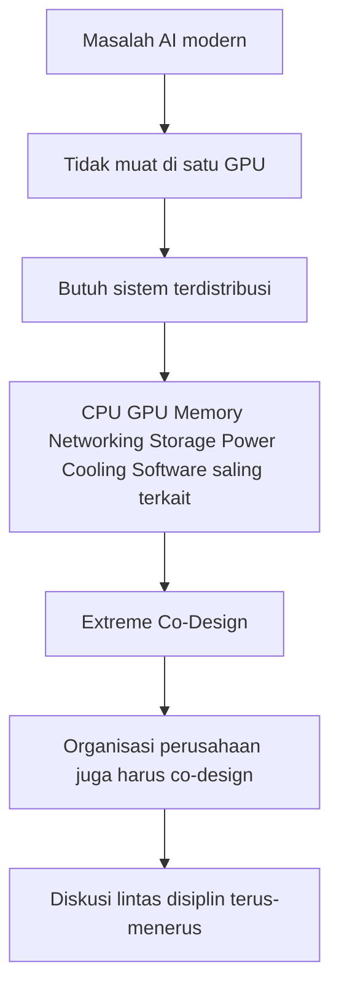
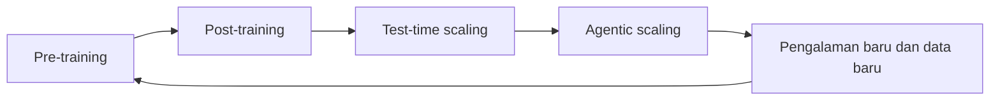

## 🚀 Pendahuluan: Jika Ingin Memahami Revolusi AI, Pahami Cara Jensen Huang Melihat Dunia

Banyak orang membicarakan *artificial intelligence* — **kecerdasan buatan** — seolah inti revolusi hari ini hanya soal model bahasa besar, chatbot, atau perlombaan siapa yang paling dekat ke AGI. Padahal, di balik semua itu ada lapisan yang jauh lebih dalam dan jauh lebih menentukan: **infrastruktur komputasi**. Dan jika ada satu tokoh yang sangat penting untuk memahami lapisan ini, orang itu adalah **Jensen Huang**, pendiri dan CEO NVIDIA.

Dalam percakapan panjangnya bersama Lex Fridman, Jensen tidak sekadar membahas chip, GPU, atau data center. Ia sebenarnya sedang mengungkap satu cara berpikir yang sangat khas: cara melihat masa depan bukan sebagai sesuatu yang ditunggu, melainkan sesuatu yang **direkayasa, diorganisasi, dan dimanifestasikan** secara bertahap. Di sinilah wawancara ini menjadi sangat berharga. Ia bukan hanya wawancara tentang NVIDIA, tetapi tentang **arsitektur strategi**, **kepemimpinan teknologi**, **skala industri**, dan **filosofi membangun masa depan**. ⚙️

Ada banyak pemimpin teknologi yang hebat bicara tentang produk. Ada pula yang hebat bicara tentang visi. Tetapi Jensen menarik karena ia tampak nyaman bicara dari level transistor sampai geopolitik industri, dari *rack design* — **desain rak komputasi** — sampai psikologi organisasi, dari supply chain hulu sampai nasib profesi manusia di era AI. Ia berbicara seperti insinyur, operator, futuris, salesman, sekaligus arsitek peradaban digital.

Salah satu tesis paling penting dari percakapan ini adalah bahwa **komputer sedang berubah bentuk**. Dulu komputer terutama dipahami sebagai alat penyimpanan dan pengambilan data: gudang file, sistem retrieval, tempat manusia menaruh informasi lalu mengambilnya kembali saat diperlukan. Kini, menurut Jensen, komputer berubah menjadi **factory / pabrik**: mesin yang secara aktif memproduksi token, inferensi, jawaban, prediksi, desain, keputusan, dan pada akhirnya nilai ekonomi. Ini perubahan yang sangat besar. Jika dulu pusat data adalah gudang digital, kini ia mulai diposisikan sebagai **pabrik AI**.

Dan dari sinilah kita bisa memahami mengapa NVIDIA melonjak bukan hanya sebagai pembuat GPU, tetapi sebagai **arsitek lapisan komputasi baru**. Mereka tidak lagi sekadar menjual chip. Mereka sedang menyusun keseluruhan sistem: GPU, CPU, memori, jaringan, pendinginan, daya, perangkat lunak, rak, pod, hingga pusat data utuh. Jensen menyebutnya **extreme co-design** — *ko-desain ekstrem*, yaitu optimasi lintas semua lapisan teknologi sekaligus.

Artikel ini akan membedah gagasan-gagasan utama dari wawancara itu secara runtut dan mendalam. Kita akan lihat bagaimana Jensen menjelaskan pergeseran NVIDIA dari perusahaan akselerator grafis menjadi platform komputasi global; mengapa keputusan memasang CUDA di GeForce menjadi salah satu taruhan strategis paling berani dalam sejarah industri; mengapa *install base* — **basis pemasangan / basis pengguna terpasang** — jauh lebih penting daripada keanggunan arsitektur; bagaimana Jensen “membentuk sistem keyakinan” karyawan, board, partner, dan supply chain; mengapa ia begitu percaya pada *scaling laws* — **hukum penskalaan** — AI; mengapa ia memandang AI sebagai komoditas kecerdasan tetapi bukan pengganti kemanusiaan; serta bagaimana ia melihat masa depan pekerjaan, energi, China, open source, dan bahkan komputasi di luar angkasa. 🌌

Kalau dibaca sepintas, wawancara ini bisa terasa seperti iklan keberhasilan NVIDIA. Tetapi jika dibaca dengan serius, sebenarnya ia memberi kita satu jendela penting untuk memahami bentuk ekonomi teknologi yang sedang lahir. Dan itu yang akan kita telusuri di sini.

<Callout type="important" title="Gagasan utama artikel ini">
Jensen Huang tidak melihat NVIDIA sebagai perusahaan chip biasa. Ia melihatnya sebagai pembangun platform komputasi global yang mengubah komputer dari gudang informasi menjadi pabrik token, pabrik kecerdasan, dan pada akhirnya pabrik nilai ekonomi.
</Callout>

---

## 🧠 1. Extreme Co-Design: Ketika Masalah AI Tak Lagi Muat di Satu Komputer

Lex Fridman membuka percakapan dengan pengamatan yang sangat tepat: dulu kemenangan NVIDIA terutama berarti membuat GPU terbaik yang bisa dibuat. Sekarang, itu tidak cukup. NVIDIA telah bergerak ke dunia **rack-scale design** — *desain skala-rak* — dan bahkan **data-center-scale design** — *desain skala-pusat-data*. Ini bukan perluasan kecil. Ini perubahan paradigma.

Jensen menjelaskan mengapa. Masalah AI modern tidak lagi muat dalam satu komputer, atau bahkan dalam satu GPU. Begitu model membesar, data membengkak, dan komputasi didistribusikan ke ribuan bahkan puluhan ribu mesin, tantangan utamanya bukan lagi hanya “seberapa cepat GPU saya”, tetapi **bagaimana seluruh sistem bisa bergerak lebih cepat daripada sekadar penjumlahan linearnya**.

Di sini ia menyebut **Amdahl’s Law** — *Hukum Amdahl*. Intinya sederhana tapi mematikan: percepatan total sebuah sistem dibatasi oleh bagian-bagian yang tidak dipercepat. Jika komputasi hanya 50% dari beban kerja dan Anda membuat komputasi sejuta kali lebih cepat, total sistem tetap tidak akan melonjak sejuta kali. Bagian lain — jaringan, switching, memori, distribusi data, pipeline, sinkronisasi — tiba-tiba menjadi penghambat utama.

Jadi, begitu kita bicara komputasi terdistribusi untuk AI, yang menjadi masalah bukan hanya GPU:

- CPU juga masalah,
- jaringan juga masalah,
- switching juga masalah,
- storage juga masalah,
- daya juga masalah,
- pendinginan juga masalah,
- perangkat lunak orkestrasi juga masalah.

Di sinilah lahir kebutuhan akan **extreme co-design**. Menurut Jensen, Anda harus mengoptimalkan seluruh tumpukan sekaligus:

- arsitektur model,
- algoritma,
- chip,
- sistem,
- system software,
- jaringan,
- memori,
- power delivery,
- cooling,
- rack,
- pod,
- data center.

Artinya, AI modern adalah masalah **ilmu komputer skala sistem**, bukan lagi sekadar desain semikonduktor sempit. Dan inilah salah satu alasan NVIDIA menjadi sangat dominan: mereka tidak berhenti di chip. Mereka mendorong ke integrasi sistem penuh. 🔩

---

## 🏢 2. Mendesain Perusahaan seperti Mendesain Komputer

Salah satu bagian paling menarik dari wawancara ini adalah ketika Jensen berbicara tentang organisasi perusahaan. Ia tidak memandang bagan organisasi sebagai formalitas manajemen. Ia memandangnya seperti **operating system / sistem operasi** untuk perusahaan.

Kalimat kuncinya sangat penting: *kalau Anda mendesain komputer, Anda perlu sistem operasi komputer; kalau Anda mendesain perusahaan, Anda harus berpikir apa output yang ingin perusahaan hasilkan, lalu arsitektur perusahaan harus mencerminkan itu.*

Di sini terlihat khas Jensen. Ia tidak percaya organisasi bisa dibangun dari template umum. Menurutnya, banyak bagan organisasi perusahaan tampak mirip satu sama lain — entah perusahaan mobil, perusahaan burger, atau perusahaan software — padahal itu tidak masuk akal. Struktur organisasi seharusnya bukan dekorasi, tetapi mesin yang cocok dengan produk dan lingkungan tempat perusahaan hidup.

Karena NVIDIA bermain di medan **co-design** lintas disiplin, organisasi mereka juga harus memfasilitasi tabrakan lintas disiplin itu. Jensen bahkan mengatakan staf langsungnya sangat besar — sekitar 60 orang atau lebih — dan hampir semuanya punya kaki kuat di engineering. Ia tidak suka *one-on-one meeting* karena menurutnya masalah nyata tidak pernah benar-benar milik satu orang saja. Setiap persoalan dipresentasikan ke kelompok, lalu semua menyerang masalah itu bersama-sama.

Itu berarti, ketika bicara pendinginan, ahli memori ikut dengar. Ketika bicara networking, ahli power ikut dengar. Ketika bicara chip, ahli software ikut dengar. Siapa yang merasa ada relevansi bisa masuk. Siapa yang tak perlu bisa *tune out*. Tapi desain default-nya adalah **keterhubungan**, bukan isolasi.

Ini penting, karena banyak perusahaan gagal bukan karena talenta mereka lemah, melainkan karena talenta mereka terkurung dalam silo. Jensen tampaknya sangat sadar bahwa pada skala kompleksitas NVIDIA hari ini, masalah terbesar bukan kurangnya ahli, melainkan **kurangnya sinkronisasi antar-ahli**.

---

## 🎮 3. Dari Akselerator Grafis ke Platform Komputasi: Jalan Sempit NVIDIA

Banyak orang mengenal NVIDIA dari gaming. Itu tidak salah, tetapi sangat tidak lengkap. Jensen menjelaskan bahwa sejak awal NVIDIA memang memulai sebagai perusahaan **accelerator / akselerator** yang sangat spesifik. Itu memberi keunggulan besar: sangat dioptimalkan, sangat cepat, sangat spesialis.

Namun spesialisasi ekstrem punya harga. Semakin spesifik domain aplikasinya, semakin sempit pasar, dan semakin sempit pula kapasitas R&D yang bisa dibiayai oleh pasar itu. Jensen tampak sangat sadar bahwa jika NVIDIA tetap menjadi perusahaan akselerator sempit, pengaruh mereka di dunia komputasi akan terbatas.

Tetapi masuk menjadi perusahaan komputasi umum juga berbahaya. Begitu terlalu umum, spesialisasi yang menjadi keunggulan utama bisa hilang. Jadi ada ketegangan mendasar:

- semakin general-purpose, semakin luas pasar, tapi semakin lemah sebagai spesialis;
- semakin spesialis, semakin kuat performa, tapi semakin sempit dampaknya.

Jensen menyebut bahwa ia sengaja menggabungkan dua kata yang tegang secara fundamental: **accelerated computing** — *komputasi terakselerasi*. Jalan NVIDIA adalah mencari jalur sempit agar mereka bisa memperluas cakupan komputasi **tanpa kehilangan spesialisasi paling penting**.

Langkah-langkahnya menarik:

1. Mereka menciptakan **programmable pixel shader** — langkah awal menuju kemampuan diprogram.
2. Mereka memasukkan **FP32 IEEE-compatible** ke shader — langkah besar menuju komputasi serius.
3. Mereka menaruh *C* di atas FP32, lewat jalur **Cg**.
4. Jalur itu akhirnya mengarah ke **CUDA**.

Di sini terlihat bahwa transformasi NVIDIA bukan satu lompatan, melainkan rangkaian keputusan berlapis yang masing-masing mendorong sedikit lebih jauh ke dunia komputasi umum. Ini pelajaran strategi yang penting: **perubahan besar sering lahir dari rantai keputusan antara, bukan satu momen dramatis tunggal**.

---

## 🔥 4. CUDA di GeForce: Taruhan yang Hampir Menghancurkan Perusahaan, tetapi Mengubah Sejarah

Jika harus memilih satu momen kunci dari wawancara ini, saya akan menunjuk ke bagian saat Jensen menjelaskan keputusan menaruh **CUDA** pada lini **GeForce**. Ini bukan sekadar keputusan teknis. Ini adalah keputusan strategis yang menurut Jensen sendiri sangat dekat dengan **existential threat / ancaman eksistensial** bagi perusahaan.

Masalahnya sederhana tetapi brutal. Platform komputasi hanya akan menarik developer jika punya **install base** — basis pengguna terpasang — yang besar. Developer tidak datang hanya karena arsitektur itu indah atau performanya menarik. Developer datang karena mereka ingin software mereka menjangkau banyak orang.

Maka NVIDIA bertanya: bagaimana cara membawa arsitektur komputasi baru ke dunia? Jawabannya adalah dengan menyelundupkannya ke dalam produk yang sudah sangat luas penyebarannya, yaitu **GeForce**. Dengan kata lain, CUDA harus ikut numpang pada jutaan GPU gaming, entah para gamer memakainya untuk komputasi atau tidak.

Secara strategis, ini jenius. Tapi secara bisnis jangka pendek, nyaris bunuh diri.

Jensen mengakui bahwa menaruh CUDA di GeForce membuat biaya GPU naik sangat besar. Bahkan ia mengatakan peningkatan biaya itu menggerus hampir seluruh gross profit perusahaan saat itu. Kapitalisasi pasar NVIDIA pun merosot drastis. Dari perusahaan miliaran dolar, valuasi mereka turun tajam hingga sekitar 1,5 miliar dolar dan harus merangkak kembali perlahan.

Mengapa tetap dilakukan? Karena Jensen memandang CUDA bukan fitur tambahan, melainkan fondasi agar NVIDIA benar-benar menjadi perusahaan komputasi. Kalau platform ingin hidup, arsitekturnya harus hadir luas. Dan kalau developer adalah darah platform, maka install base adalah jantungnya.

Ini bagian yang sangat penting dan sering diabaikan oleh orang yang terlalu terpesona pada “teknologi terbaik”. Jensen sangat jelas: **arsitektur tidak ditentukan terutama oleh keindahannya, tetapi oleh install base dan kepercayaan jangka panjang ekosistem kepadanya**.

Ia memberi contoh kontras antara x86 yang sering dikritik tidak elegan tetapi dominan, versus banyak arsitektur RISC yang indah namun gagal menang. Pesannya brutal tapi realistis: dalam sejarah komputasi, **elegansi tidak otomatis menang**. Distribusi, kompatibilitas, ekosistem, dan keberlanjutan jauh lebih menentukan.

<Callout type="quote" title="Inti strategi CUDA">
Bagi Jensen Huang, keputusan terbaik NVIDIA bukan hanya menciptakan CUDA, tetapi menanamkannya ke GeForce agar jutaan mesin menjadi pijakan awal ekosistem developer. Itu yang menjadikan CUDA bukan sekadar teknologi, melainkan platform.
</Callout>

---

## 🧱 5. Cara Jensen “Memanifestasikan Masa Depan”: Bukan Deklarasi Mendadak, Tapi Menyusun Bata demi Bata

Ada satu pola kepemimpinan Jensen yang sangat khas dan sangat berharga untuk dipahami. Ia menjelaskan bahwa ketika ia belajar sesuatu dan mulai percaya itu akan mengubah arah perusahaan, ia **tidak diam dulu lalu tiba-tiba mengumumkan manifesto besar**. Ia justru mulai menyebarkan gagasan itu sedikit demi sedikit, setiap hari, ke board, manajemen, karyawan, partner, dan bahkan pelanggan.

Bahasa Jensen sangat menarik: ia sedang **shaping belief systems** — *membentuk sistem keyakinan*. Ini bukan manipulasi murahan, tetapi proses membangun pemahaman kolektif bahwa arah tertentu memang masuk akal.

Jadi, ketika suatu hari ia berkata:

- “kita harus beli Mellanox,”
- “kita harus all in di deep learning,”
- “kita harus bergerak ke agentic systems,”

orang-orang di sekelilingnya tidak kaget. Mereka justru cenderung berkata: **“akhirnya diumumkan juga.”**

Menurut Jensen, ini penting sekali. Kalau pemimpin mengumumkan perubahan arah besar tanpa menyiapkan landasan pemahaman, hasilnya adalah resistensi. Manajemen bingung, board curiga, karyawan defensif, partner panik. Karena itu, tugas pemimpin bukan hanya memilih arah, tetapi **membawa orang lain pelan-pelan sampai titik di mana arah itu terasa masuk akal**.

Ini adalah bentuk kepemimpinan strategis yang sangat matang. Dan mungkin inilah salah satu alasan mengapa NVIDIA bisa bergerak agresif tanpa terlihat seperti terus-menerus meledak dari dalam.

---

## ⚖️ 6. Install Base, Trust, dan Mengapa NVIDIA Punya “Moat” yang Sulit Diserang

Ketika ditanya soal *moat* — **parit pertahanan kompetitif** — Jensen memberi jawaban yang tegas: kekuatan paling penting NVIDIA adalah **install base dari platform komputasi mereka**, khususnya **CUDA**.

Ini poin yang luar biasa penting. Banyak orang awam berpikir keunggulan NVIDIA hanya terletak pada chip tercepat. Padahal Jensen mengatakan sendiri bahwa inti kekuatan mereka bukan sekadar teknologinya, melainkan:

1. **Install base** besar,
2. **velocity of execution** — kecepatan eksekusi,
3. **trust** — kepercayaan bahwa NVIDIA akan terus memelihara dan meningkatkan platformnya,
4. **ecosystem breadth** — keluasan ekosistem horizontal di semua industri.

Dari sudut pandang developer, ini berarti:

- kalau saya bangun di CUDA, saya menjangkau ratusan juta sistem;
- kalau saya bangun di CUDA, enam bulan lagi performa kemungkinan naik jauh;
- kalau saya bangun di CUDA, saya percaya NVIDIA tidak akan meninggalkannya;
- kalau saya bangun di CUDA, software saya relevan di cloud, supercomputer, enterprise, edge, mobil, robot, satelit, dan seterusnya.

Jadi, *moat* NVIDIA bukan dinding tunggal, melainkan kombinasi dari **ekosistem, distribusi, kecepatan inovasi, dan reputasi konsistensi**.

Yang menarik, Jensen juga mengatakan unit komputasi NVIDIA telah berevolusi:

- dulu yang dibayangkan adalah GPU,
- lalu komputer,
- lalu cluster,
- sekarang **AI factory** — *pabrik AI*.

Artinya, jika dulu “produk” NVIDIA secara mental bisa diwakili oleh chip yang diangkat di panggung keynote, kini model mental Jensen bukan chip lagi, melainkan **infrastruktur raksasa bergiga-watt**. Ini perubahan sangat besar. Produk bukan lagi benda kecil di tangan, melainkan sistem industri berskala energi.

---

## 📈 7. Empat Scaling Laws: Pre-Training, Post-Training, Test Time, dan Agentic Scaling

Jensen tetap sangat percaya pada **scaling laws** — hukum bahwa kecerdasan AI akan meningkat seiring meningkatnya sumber daya tertentu. Tetapi ia tidak berhenti pada narasi lama soal *pre-training*. Menurutnya, hari ini kita punya setidaknya **empat hukum penskalaan**:

1. **Pre-training scaling** — penskalaan pelatihan awal model,
2. **Post-training scaling** — penskalaan fine-tuning, RL, penyempurnaan,
3. **Test-time scaling** — penskalaan saat inferensi / berpikir,
4. **Agentic scaling** — penskalaan lewat multi-agent dan sub-agent.

Ini penting karena banyak orang sempat panik ketika muncul klaim bahwa data berkualitas tinggi di internet mulai habis dan pre-training akan mentok. Jensen menolak pandangan ini. Menurutnya, data tidak benar-benar habis; justru semakin banyak data yang bersifat **synthetic data** — *data sintetis*.

Ia memberi argumen yang cerdas: manusia sendiri banyak belajar dari sesuatu yang “sintetis”, yaitu tulisan, penjelasan, dokumentasi, materi ajar, derivasi, modifikasi pengetahuan. Jadi begitu AI cukup kuat untuk memperluas, memperbaiki, dan menghasilkan data sintetik berkualitas, kendala data bergeser menjadi kendala **compute**, bukan lagi *ground truth* mentah.

Kemudian Jensen menekankan sesuatu yang kini sangat relevan: **inference is thinking** — *inferensi adalah berpikir*. Banyak orang dulu menganggap inferensi akan jadi murah dan sederhana, sementara pre-training-lah yang berat. Jensen justru sejak awal merasa itu tidak logis. Membaca dan menghafal pola memang berat, tetapi **berpikir, merencanakan, menelusuri kemungkinan, melakukan pencarian, memakai alat, dan memecah masalah** bisa jauh lebih berat secara komputasi.

Dan itu yang kini kita lihat. *Test-time scaling* ternyata sangat haus komputasi.

Lalu sesudah itu datang fase berikutnya: **agentic scaling**. Satu agen dapat memanggil alat, mengakses file, melakukan riset, dan yang paling penting, **melahirkan sub-agent**. Jensen memakai analogi organisasi: jauh lebih mudah memperbesar NVIDIA dengan merekrut karyawan daripada memperbesar dirinya sendiri. Dalam logika yang sama, sistem AI bisa diskalakan dengan memperbanyak agen.

Jadi kecerdasan AI, menurut Jensen, pada akhirnya diskalakan oleh satu hal besar: **compute**. Dan inilah mengapa NVIDIA berada tepat di pusat pusaran ekonomi baru ini.

---

## 🧰 8. Mengapa Agentic AI Mengubah Bentuk Hardware

Salah satu bagian paling teknis sekaligus paling visioner dalam percakapan ini adalah ketika Jensen menjelaskan bahwa perubahan arsitektur model AI memaksa perubahan arsitektur hardware, dan hardware harus dirancang **beberapa tahun sebelum** model-model masa depan benar-benar dominan.

Masalahnya rumit: model AI bisa berubah setiap enam bulan, sedangkan arsitektur sistem dan hardware butuh dua sampai tiga tahun. Maka perusahaan seperti NVIDIA tidak bisa hanya bereaksi. Mereka harus **mengantisipasi**.

Bagaimana caranya?

- melakukan riset model sendiri,
- bekerja dengan hampir semua perusahaan AI besar di dunia,
- mendengar “bisikan” tantangan industri,
- lalu membangun arsitektur yang cukup fleksibel untuk bergerak bersama perubahan.

Contoh yang sangat menarik adalah pergeseran dari Grace Blackwell ke sistem berikutnya seperti Vera Rubin dan rack tambahan yang didesain untuk **agents**. Jensen menjelaskan bahwa ketika LLM berkembang dari sekadar memproses bahasa menjadi *digital worker* — pekerja digital — maka kebutuhan sistem juga berubah.

Agen tidak hanya menghasilkan teks. Ia harus:

- mengakses *ground truth* (file system),
- melakukan riset,
- memakai tools,
- berinteraksi dengan I/O,
- dan mengorkestrasi sub-agent.

Jadi secara nalar, menurut Jensen, masa depan ini sebenarnya bisa diturunkan dari akal sehat sistemik. Kalau kita mau AI menjadi pekerja digital, maka ia pasti perlu tool use, akses file, riset, dan orkestrasi. Dengan demikian, bentuk komputer masa depan juga harus berubah mengikuti itu.

Ini sangat penting. Jensen tidak menggambarkan dirinya sebagai nabi yang dapat wahyu industri. Ia berkali-kali menekankan satu kata: **reasoning** — *bernalar*. Artinya, banyak prediksi besarnya bukan lahir dari “bisikan gaib tren”, melainkan dari penalaran konsekuensial yang keras.

---

## 🔐 9. OpenClaw, Security, dan Dua-dari-Tiga Hak Berbahaya

Bagian wawancara yang menyinggung OpenClaw juga sangat menarik karena menyoroti isu yang hari ini sangat aktual: **bagaimana membuat agentic system berguna tetapi tidak terlalu berbahaya**.

Jensen menyebut bahwa sistem agen pada dasarnya berbahaya jika punya tiga kemampuan sekaligus:

1. akses ke informasi sensitif,
2. kemampuan mengeksekusi kode,
3. kemampuan berkomunikasi eksternal.

Jika ketiganya diberikan sekaligus tanpa batas, risikonya tinggi. Maka pendekatannya adalah membuat sistem aman dengan prinsip **dua dari tiga**: pada satu waktu, agen bisa diberi dua kemampuan, tapi tidak sekaligus tiga secara bebas.

Selain itu, harus ada:

- kontrol akses berbasis hak pengguna,
- koneksi ke *policy engine* perusahaan,
- guardrail keamanan yang tertanam ke sistem.

Ini poin yang penting karena sering ada dua kubu naif dalam diskusi AI:

- kubu yang ingin semua dibuka total demi kecepatan,
- kubu yang ingin semuanya dibatasi sampai tak berguna.

Jensen tampaknya mengambil jalur tengah yang lebih industrial: **buat agen berguna, tapi desain kapabilitasnya sebagai sistem hak akses terstruktur**.

Ini sejalan dengan pandangan besarnya bahwa AI bukan lagi sekadar model, tetapi bagian dari arsitektur operasional nyata. Maka isu keamanan tidak bisa diperlakukan sebagai embel-embel belakangan.

---

## ⚡ 10. Hambatan Besar Berikutnya: Power, Efisiensi, dan Supply Chain

Saat AI bergerak dari model ke pabrik, pertanyaan berikutnya menjadi sangat fisik: **dari mana datang listriknya?**

Jensen menjawab dengan dua lapis.

Pertama, efisiensi harus terus didorong lewat **tokens per second per watt** — *jumlah token per detik per watt*. Menurutnya, harga komputer NVIDIA memang naik, tetapi efektivitas generasi token naik jauh lebih cepat, sehingga biaya token terus turun secara dramatis.

Kedua, dunia harus berpikir ulang tentang pemanfaatan jaringan listrik. Jensen memberi argumen yang sangat menarik: jaringan listrik dirancang untuk kebutuhan puncak yang jarang terjadi. Padahal 99% waktu, banyak kapasitas listrik menganggur. Jadi mengapa data center tidak didesain untuk:

- menyerap kelebihan daya saat tersedia,
- lalu turun performanya secara anggun ketika grid membutuhkan listrik itu kembali?

Artinya, data center masa depan mungkin tidak harus selalu menuntut “100% uptime sempurna tanpa kompromi”. Mereka bisa **gracefully degrade** — *menurun performanya secara anggun*:

- workload dipindah,
- performa sedikit diturunkan,
- latensi sedikit naik,
- konsumsi daya turun.

Ini ide yang sangat penting karena ia memperlakukan komputasi bukan sebagai beban pasif atas grid, tetapi sebagai beban elastis yang bisa dinegosiasikan. Kalau ini berhasil, ada peluang besar memanfaatkan **excess power** — daya berlebih — yang selama ini menganggur.

Soal supply chain, Jensen sangat intensif. Ia berbicara dengan CEO hulu-hilir, dari memori sampai infrastruktur, menjelaskan ke mana pasar bergerak, lalu membantu mereka membuat keputusan investasi miliaran dolar. Di sini tampak bahwa tugas CEO NVIDIA bukan sekadar menjalankan perusahaan, tetapi juga **mengorkestrasi kesiapan ekosistem industri global**.

---

## 🏭 11. Supply Chain sebagai Sistem Kepercayaan, Bukan Sekadar Daftar Vendor

Satu hal yang sangat menonjol dalam cara Jensen bicara adalah bahwa supply chain baginya bukan sekadar hubungan pembeli-penjual. Ia adalah **sistem kepercayaan yang perlu diinfus visi jangka panjang**.

Ia menjelaskan bagaimana beberapa tahun lalu ia meyakinkan CEO industri memori bahwa **HBM** — *high bandwidth memory / memori bandwidth tinggi* — yang waktu itu masih niche akan menjadi memori mainstream untuk data center. Di saat terdengar aneh, beberapa CEO percaya dan berinvestasi. Hasilnya, mereka kini menikmati ledakan permintaan bersejarah.

Ia juga menjelaskan bagaimana desain baru rack-scale computing memindahkan proses integrasi superkomputer dari data center ke supply chain. Artinya, para partner manufaktur sekarang harus membangun dan mengetes sistem yang jauh lebih padat dan lebih berat sebelum dikirim. Itu artinya kebutuhan daya, testing, dan proses manufaktur pun ikut berubah besar.

Menariknya, ketika ditanya apakah ia khawatir terhadap bottleneck seperti ASML, CoWoS TSMC, atau HBM, jawabannya justru relatif tenang: **tidak terlalu, karena saya sudah memberi tahu mereka apa yang saya butuhkan, mereka memberi tahu apa yang akan mereka lakukan, dan saya percaya mereka**.

Kalimat ini mungkin terdengar arogan jika keluar dari orang lain. Tetapi dalam konteks seluruh wawancara, ini justru menunjukkan bahwa Jensen sangat sadar bahwa salah satu pekerjaan utamanya adalah membuat supply chain **percaya cukup awal** untuk bergerak sebelum permintaan benar-benar meledak.

---

## 🇨🇳 12. China: Talenta, Open Source, Kompetisi Gila, dan Bangsa Pembangun

Bagian wawancara tentang China juga sangat penting, karena menunjukkan cara Jensen membaca peta inovasi global tanpa simplifikasi dangkal. Ia menyebut beberapa faktor yang menurutnya menjelaskan mengapa China sangat cepat dalam inovasi teknologi hari ini.

Pertama, proporsi besar peneliti AI dunia adalah orang Tiongkok. Kedua, industri teknologi China tumbuh di momen yang tepat, yaitu era software dan cloud mobile. Ketiga, ada pendidikan matematika dan sains yang kuat. Keempat, kompetisi internal antarkota, antarprovinsi, dan antarperusahaan sangat brutal. Kelima, budaya sosial mereka mempermudah aliran pengetahuan antarsesama secara cepat. Menurut Jensen, dalam arti tertentu mereka bersikap seperti **open source all the time** — hampir selalu berbagi secara terbuka.

Ia bahkan menyebut China sebagai **builder nation** — *bangsa pembangun*. Ini istilah yang penting. Maksudnya, budaya mereka kuat pada pembangunan konkret, rekayasa, dan penciptaan perusahaan nyata. Kontras yang ia tarik dengan Amerika juga menarik: di Amerika banyak elite puncak datang dari jalur hukum dan regulasi; di China banyak pemimpin puncak datang dari latar teknik dan pembangunan material.

Tentu pandangan ini bisa diperdebatkan, tetapi analisis Jensen penting karena menunjukkan bahwa persaingan AI global bukan hanya soal chip dan model. Ia juga soal:

- budaya pendidikan,
- struktur kompetisi domestik,
- sikap terhadap engineering,
- dan kecepatan difusi pengetahuan.

---

## 🌍 13. Open Source Bukan Amal, tapi Infrastruktur Difusi Peradaban AI

Jensen juga bicara panjang soal **open source** dan model terbuka NVIDIA seperti Nemotron. Menurutnya, kalau NVIDIA mau menjadi perusahaan komputasi AI yang hebat, mereka harus memahami evolusi model AI dari dalam. Karena itu mereka melakukan riset model sendiri.

Tetapi ada alasan yang lebih besar. Jika semua AI masa depan bersifat proprietary total, maka:

- riset akademik terhambat,
- inovasi industri kecil terhambat,
- negara berkembang tertinggal,
- penetrasi AI ke domain non-bahasa melambat.

Maka open source menjadi semacam **mekanisme difusi peradaban AI**. NVIDIA tidak membangun mobil, tetapi ingin produsen mobil punya model bagus. NVIDIA tidak menemukan obat, tetapi ingin perusahaan farmasi punya sistem AI biologi terbaik. NVIDIA tidak mendominasi semua vertikal aplikasi; mereka ingin menjadi **tanah tempat semua vertikal bertumbuh**.

Ini sangat konsisten dengan identitas NVIDIA sebagai *platform company*. Mereka integrasi vertikal untuk mengoptimalkan, tetapi membuka secara horizontal agar platformnya bisa ditanam di mana-mana.

---

## 🧵 14. TSMC, Trust, dan Pelajaran tentang Keunggulan yang Tidak Kasatmata

Salah satu bagian yang paling menarik secara industri adalah ketika Jensen bicara tentang TSMC. Ia mengatakan salah paham terbesar tentang TSMC adalah mengira kehebatan mereka semata-mata terletak pada transistor atau proses manufakturnya. Menurut Jensen, itu penting, tetapi belum cukup menjelaskan keistimewaan TSMC.

Yang sungguh luar biasa adalah kemampuan mereka **mengorkestrasi dinamika ratusan perusahaan** dengan permintaan yang terus berubah, sambil tetap menjaga:

- throughput tinggi,
- yield tinggi,
- biaya baik,
- pelayanan pelanggan sangat kuat,
- dan reliabilitas janji pengiriman.

Dengan kata lain, TSMC unggul bukan hanya di teknologi, tetapi di **teknologi + budaya + trust**. Menurut Jensen, trust ini bahkan begitu tinggi sampai relasi bisnis raksasa antara NVIDIA dan TSMC berjalan sangat lama tanpa kontrak formal yang kaku.

Ini pelajaran besar untuk banyak orang yang terlalu mengidolakan “teknologi inti”. Sering kali keunggulan perusahaan paling kuat justru ada pada sesuatu yang tidak mudah dipotret di slide: **kemampuan operasional, budaya pelayanan, dan kepercayaan jangka panjang**.

---

## 👷 15. Pekerjaan Manusia di Era AI: Jensen Menolak Narasi Malas “AI Akan Menggantikan Semua”

Salah satu bagian wawancara yang paling penting untuk pembaca luas adalah saat Jensen membahas masa depan kerja. Ia tidak menyangkal bahwa AI akan mengotomatisasi banyak tugas. Tetapi ia menganggap banyak kepanikan publik lahir dari kekeliruan dasar: orang mencampuradukkan **purpose of the job** — *tujuan pekerjaan* — dengan **tasks and tools** — *tugas dan alat*.

Contoh yang ia pakai sangat kuat: **radiologi**. Bertahun-tahun lalu, banyak peneliti AI memprediksi radiolog akan punah karena computer vision menjadi superhuman dalam membaca citra medis. Ternyata yang terjadi justru sebaliknya: jumlah radiolog tidak turun, bahkan dunia kekurangan radiolog.

Mengapa? Karena tugas membaca citra hanyalah bagian dari tujuan profesi radiolog, bukan keseluruhan. Ketika AI mempercepat pembacaan, rumah sakit bisa menangani lebih banyak pasien, diagnosis meningkat, throughput layanan naik, dan kebutuhan tenaga ahli justru ikut naik.

Pesan Jensen sederhana tetapi sangat kuat: jika pekerjaan Anda identik dengan satu tugas sempit yang bisa diotomatisasi, maka Anda memang rawan terguncang. Tetapi jika Anda memahami tujuan profesi Anda lebih luas, maka AI justru bisa **mengangkat nilai Anda**.

Ia bahkan memberi nasihat yang sangat konkret: dalam hampir semua profesi, jika ia harus memilih antara kandidat yang paham AI dan yang tidak, ia akan memilih yang paham AI. Baik itu akuntan, marketer, sales, supply chain, customer service, lawyer, maupun software engineer.

Jadi, menurut Jensen, respons terbaik terhadap AI bukan panik, tetapi:

1. belajar memakai AI,
2. mengotomatisasi tugas rutin sendiri,
3. naik ke level tujuan, desain, diagnosis, kreativitas, koordinasi, dan penilaian.

---

## 💻 16. Coding Tidak Hilang, Tetapi Definisinya Bergeser

Bagian tentang coding juga sangat menarik. Jensen berargumen bahwa **coding** pada masa depan pada dasarnya berarti **specification / spesifikasi** — menjelaskan kepada komputer apa yang ingin dibangun. Dalam pengertian ini, jumlah “coder” justru bisa meningkat drastis, karena orang yang sebelumnya bukan programmer tradisional kini dapat mendeskripsikan sistem dan membiarkan AI mengimplementasikannya.

Ia menyebut bahwa mungkin kita bergerak dari 30 juta programmer menjadi 1 miliar orang yang bisa “ngoding” dalam arti memberi spesifikasi. Tapi tentu bukan berarti disiplin software engineering hilang. Justru kemampuan memahami arsitektur, spesifikasi yang baik, struktur sistem, dan desain batasan menjadi lebih berharga.

Ini konsisten dengan pandangannya bahwa AI menggeser manusia naik ke level yang lebih abstrak. Seorang tukang kayu dengan AI bisa menjadi lebih dekat ke arsitek. Seorang akuntan dengan AI bisa lebih dekat ke analis dan penasihat. Seorang software engineer dengan AI bisa lebih fokus ke problem framing, system design, dan evaluasi hasil.

Jadi, narasi yang lebih akurat bukan “AI menghapus coding”, tetapi **AI mengubah pusat gravitasi coding** dari penulisan manual ke orkestrasi spesifikasi.

---

## 🧍 17. Intelligence Itu Komoditas, Humanity Itu yang Harus Kita Agungkan

Mungkin bagian paling filosofis dari wawancara ini muncul menjelang akhir, ketika Lex bertanya apakah ada sesuatu dari manusia yang secara mendasar non-komputasional. Jawaban Jensen menarik. Ia sangat berhati-hati untuk tidak meng-romantisasi kata **intelligence** — *kecerdasan*.

Menurutnya, intelligence itu pada dasarnya fungsional: persepsi, pemahaman, penalaran, perencanaan, dan eksekusi. Itu bisa menjadi komoditas. Ia bahkan mengatakan dirinya dikelilingi oleh orang-orang yang lebih cerdas darinya dalam tiap domain spesifik. Tapi ia tetap punya peran sentral dalam orkestra itu. Artinya, kehidupan manusia tidak direduksi menjadi IQ semata.

Yang menurutnya lebih penting untuk diagungkan adalah:

- karakter,
- kemanusiaan,
- belas kasih,
- kemurahan hati,
- ketahanan,
- toleransi terhadap rasa malu,
- dan daya tahan menghadapi penderitaan.

Ini sangat menarik karena datang dari CEO perusahaan yang justru berada di pusat komoditisasi kecerdasan. Jensen seolah berkata: **justru karena kecerdasan sedang menjadi murah dan tersebar, kita harus lebih sadar bahwa manusia tidak boleh didefinisikan hanya oleh kecerdasan**.

Ini pemikiran yang matang. Dan menurut saya, ini salah satu bagian paling kuat dari wawancara tersebut.

---

## 😓 18. Suffering, Forgetting, dan Cara Jensen Bertahan Menjadi Jensen

Banyak orang melihat Jensen Huang hari ini sebagai simbol kemenangan total. Tetapi wawancara ini juga memberi sedikit jendela ke sisi mentalnya. Ketika ditanya bagaimana ia menghadapi tekanan luar biasa, Jensen menjelaskan kebiasaannya:

- memecah masalah menjadi bagian-bagian kecil,
- menentukan mana yang bisa ia lakukan,
- mendelegasikan yang perlu,
- lalu berhenti menangisi hal yang tak ditindaklanjuti.

Ia juga mengatakan sesuatu yang sangat menarik: salah satu kemampuan penting adalah **forgetting** — *melupakan secara sistematis*. Ini bukan amnesia literal, melainkan kemampuan tidak memikul semua beban emosional terlalu lama.

Bagi Jensen, daya tahan itu tampaknya datang dari kombinasi:

- rasa ingin tahu,
- keyakinan terhadap masa depan yang ia lihat,
- kemampuan cepat berbagi beban,
- toleransi tinggi terhadap malu dan salah,
- dan kecenderungan tertarik pada “cahaya masa depan” lebih daripada terpaku pada luka masa lalu.

Ini cocok dengan frase terkenalnya: kalau dulu ia tahu betapa sulitnya membangun NVIDIA, mungkin ia tidak akan memulainya. Tapi justru ada “superpower” seperti anak kecil: *how hard can it be?* — **memangnya sesulit apa?** Dari kebodohan yang produktif itulah banyak proyek besar berani dimulai.

---

## 🌐 19. Dari Gudang Menjadi Pabrik: Mengapa Jensen Begitu Yakin NVIDIA Akan Jauh Lebih Besar Lagi

Ketika ditanya apakah NVIDIA bisa bernilai 10 triliun dolar suatu hari nanti, Jensen menjawab dengan tidak sekadar melempar angka. Ia membangun argumen besar: komputer sedang berubah dari **retrieval-based system** — sistem pengambilan file — menjadi **generative system** — sistem generatif.

Dulu komputer menyimpan dan mengambil file. Kini komputer menghasilkan token secara kontekstual, real time, situasional, dan didasarkan pada pemrosesan yang jauh lebih intensif.

Akibatnya, kebutuhan ekonomi pun berubah:

- dulu dunia butuh banyak storage,
- kini dunia butuh jauh lebih banyak compute.

Lebih radikal lagi, fungsi komputer berubah. Menurut Jensen, komputer tidak lagi sekadar komputer. Ia menjadi **factory** — pabrik. Dan pabrik berbeda dari gudang:

- gudang menyimpan,
- pabrik menghasilkan barang,
- dan barang yang dihasilkan AI factory adalah token, jawaban, inferensi, insight, dan pada akhirnya output ekonomi.

Jika itu benar, maka proporsi GDP yang dialokasikan ke komputasi bisa naik sangat besar, karena komputasi bukan lagi biaya penyimpanan, melainkan sumber langsung pendapatan dan produktivitas.

Inilah dasar optimisme Jensen bahwa pertumbuhan NVIDIA masih sangat jauh dari selesai. Dari sudut pandangnya, banyak pasar yang sedang mereka tuju **bahkan belum sepenuhnya eksis**. Jadi ia tidak sedang mengambil pangsa pasar lama; ia sedang membantu membentuk pasar baru.

---

## 🛰️ 20. Komputasi di Luar Angkasa, Humanoid, dan Gaya Berpikir yang Selalu Melampaui Satu Horizon

Di bagian akhir, percakapan bergerak ke arah yang lebih liar: komputasi di luar angkasa, energi surya 24/7 di orbit, robot humanoid, pengiriman “diri digital” ke luar bumi, dan seterusnya. Beberapa orang mungkin akan menganggap ini kelewat spekulatif. Tetapi yang penting di sini bukan apakah semua detail itu akan benar, melainkan **kebiasaan mental Jensen untuk selalu membangun horizon berikutnya sambil tetap fokus pada peluang praktis terdekat**.

Ia sendiri mengakui lebih suka pendekatan praktis: singkirkan limbah daya di bumi dulu, gunakan kelebihan kapasitas grid dulu, eksplorasi ruang angkasa sambil jalan. Ini menunjukkan sesuatu yang penting: visinya jauh, tapi operasinya tetap grounded.

Itu salah satu ciri pemimpin teknologi yang serius. Mereka boleh membayangkan Mars, tetapi tetap tahu bahwa banyak kemenangan besar dimulai dari menghapus pemborosan di sistem hari ini.

---

## 📌 Kesimpulan: Jensen Huang dan Pelajaran tentang Masa Depan yang Dibangun, Bukan Ditunggu

Kalau harus merangkum wawancara ini dalam satu kalimat, saya akan mengatakan begini: **Jensen Huang melihat masa depan sebagai persoalan rekayasa sistemik lintas waktu, lintas organisasi, dan lintas industri.**

Ia tidak berpikir seperti pembuat chip biasa. Ia berpikir seperti seseorang yang sedang menyusun:

- arsitektur komputasi,
- arsitektur perusahaan,
- arsitektur keyakinan internal,
- arsitektur supply chain,
- bahkan arsitektur ekonomi digital masa depan.

Dari percakapan ini, ada beberapa pelajaran besar.

Pertama, **teknologi hebat saja tidak cukup**. CUDA berhasil bukan hanya karena bagus, tetapi karena ditanam ke install base besar, dipertahankan dengan disiplin selama puluhan tahun, dan diberi trust oleh ekosistem developer.

Kedua, **skala AI adalah masalah sistem penuh**. Bukan hanya model. Bukan hanya chip. Tetapi seluruh tumpukan dari algoritma sampai pendinginan.

Ketiga, **kepemimpinan strategis bukan sekadar mengumumkan arah, melainkan menyiapkan keyakinan kolektif sampai arah itu terasa masuk akal saat diumumkan**.

Keempat, **AI tidak otomatis menghapus manusia**. Ia menggeser titik berat pekerjaan dari tugas sempit ke tujuan yang lebih tinggi. Yang tertinggal bukan orang yang “kurang jenius”, tetapi orang yang menolak belajar memakai alat baru.

Kelima, **intelligence mungkin akan menjadi komoditas, tetapi humanity justru makin perlu dijaga sebagai pusat nilai**.

Pada akhirnya, mungkin itulah yang membuat Jensen menarik. Ia berada di pusat mesin yang mengkomoditisasi kecerdasan, tetapi ia tetap menekankan bahwa yang paling penting dari manusia bukanlah sekadar kecerdasan. Di satu sisi ia sangat teknis, dingin, dan sistemik. Di sisi lain ia masih menyisakan ruang untuk karakter, ketekunan, toleransi terhadap malu, serta keyakinan bahwa orang pada dasarnya ingin berbuat baik.

Dan mungkin justru kombinasi itulah yang menjelaskan NVIDIA: sebuah perusahaan yang lahir dari GPU gaming, tumbuh lewat taruhan gila pada CUDA, lalu berubah menjadi tulang punggung revolusi AI karena pendirinya tidak pernah melihat chip sebagai benda mati, melainkan sebagai bagian dari sistem yang lebih besar — sistem yang, kalau dirancang dengan benar, bisa mengubah bentuk ekonomi dunia. 🌍

<Callout type="cite" title="Sumber utama artikel">
Artikel ini disusun berdasarkan wawancara panjang Lex Fridman bersama Jensen Huang: *Jensen Huang: NVIDIA - The $4 Trillion Company & the AI Revolution | Lex Fridman Podcast #494*.
</Callout>
