## Pembukaan: Mengapa Logika Adalah Mata Pelajaran yang Mengubah Hidup 🧠

> *"Hanya 5 jam yang dihabiskan membaca buku teks logika akan secara fundamental mengubah cara Anda melihat dunia."*
> — Joe Folley, Filsuf & Logikawan

Ada sebuah ironi besar dalam cara kita mendidik manusia: kita mengajari anak-anak matematika, fisika, kimia — semua alat untuk *memahami dunia* — tetapi hampir tidak pernah mengajari mereka alat untuk *berpikir dengan baik tentang* dunia itu sendiri.

Itulah logika (*logic*).

**Joe Folley** adalah seorang filsuf muda yang terpesona oleh logika formal. Dalam percakapannya dengan Alex O'Connor untuk podcast *Within Reason*, ia membawa pendengar dalam perjalanan yang luar biasa — mulai dari definisi paling dasar logika yang dirumuskan Aristoteles lebih dari 2.300 tahun lalu, hingga sistem logika fuzzy modern, logika modal, dan pertanyaan mendalam: *dari mana hukum-hukum logika berasal?*

Artikel ini adalah eksplorasi mendalam percakapan tersebut. Kita akan bedah setiap konsep dari akar-akarnya.

<Callout type="info" title="📖 Sumber Asli">
Percakapan ini diambil dari episode podcast *Within Reason* dengan Joseph Folley berjudul **"Everything You Need to Know About Logic"**.

Sumber: [YouTube — Joe Folley on Logic](https://www.youtube.com/watch?v=thtomlDVBPI)
</Callout>

---

## Peta Besar Perjalanan Ini 🗺️

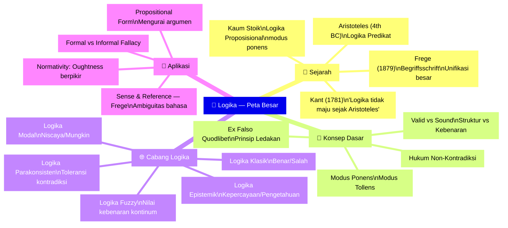

---

## Bagian 1: Apa Itu Logika? Pertanyaan yang Lebih Rumit dari yang Terlihat 🤔

### Definisi Tradisional: Satu Logika Sejati

Pertanyaan "apa itu logika?" ternyata jawabannya bergantung pada siapa yang ditanya. Namun definisi paling klasik — yang berakar pada Aristoteles dan bertahan hingga akhir abad ke-20 — adalah:

> *"Logika adalah prinsip-prinsip paling umum dari penalaran (*reasoning*) sedemikian rupa sehingga ketika Anda memiliki serangkaian hal yang sudah Anda ketahui atau Anda tegaskan, Anda bisa melalui serangkaian langkah yang tidak dapat disanggah (*indubitable steps*) tiba pada kesimpulan lebih lanjut yang mengikuti tanpa keraguan — dan tanpa kemungkinan untuk salah — dari hal-hal yang awalnya Anda ketahui."*

Contoh klasik yang paling terkenal dari Aristoteles:

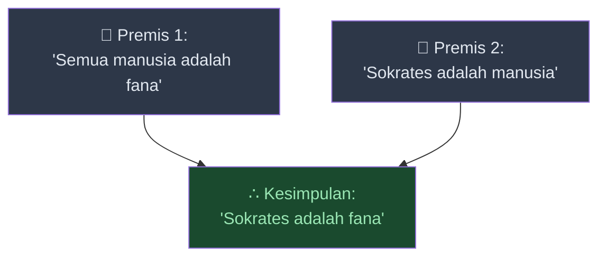

Inti dari yang dikatakan Aristoteles: **Anda tidak bisa membayangkan argumen ini salah.** Tidak ada situasi di mana semua premis benar tapi kesimpulannya salah. Anda *dibawa* dari premis ke kesimpulan tanpa kemungkinan error masuk ke dalamnya.

Pandangan "**logika monisme**" (*logical monism*) — bahwa ada **satu logika sejati** yang menjadi objek kajian filsafat — tetap sangat ortodoks di kalangan filsuf hingga hampir akhir abad ke-20, bahkan kini masih punya pembela yang sangat gigih. Sebuah buku terbaru berjudul *The One True Logic* ditulis oleh Owen Griffiths dan Alexander Paseau untuk membela gagasan ini.

### Alternatif Modern: Logika sebagai Alat (Logical Pluralism)

Di sisi lain debat filosofis ini ada pandangan yang semakin umum di era modern:

> **Logika sebagai alat (*logic as tools*)** — Logika adalah cara untuk memodelkan atau memaknai dan menspesifikasi berbagai bidang diskursus (*discourse*). Bisa ada berbagai logika berbeda untuk area kehidupan yang berbeda.

Seorang **pluralis logis** (*logical pluralist*) mungkin berkata bahwa untuk topik atau domain tertentu, satu set aturan logis dan aksioma *sama baiknya* dengan set lain — mereka hanya menangani hal yang berbeda.

Analogi yang mudah dipahami: ini mirip dengan **relativisme moral** (*moral relativism*) — gagasan bahwa ada sistem moral berbeda yang masing-masing sama baiknya, ditentukan oleh komunitas moral tertentu. Di sini, logika bisa bervariasi tergantung pada konteks penggunaannya sebagai alat.

<Callout type="important" title="💬 Debat Monisme vs Pluralisme">
**Argumen logis monist kepada pluralis:** *"Kamu harus memiliki semacam kriteria untuk memilih di antara logika-logika berbeda ini — dan kriteria itu sendiri sudah memerlukan sistem penalaran yang sudah ada, yakni sebuah logika. Jadi kamu tetap berkomitmen pada satu logika terlebih dahulu."*

**Respons pluralis:** *"Aturan logis yang berbeda menangani domain yang berbeda dengan sangat baik — itu cukup untuk membenarkan pluralisme."*

Debat ini masih berlangsung hingga hari ini dalam filsafat logika.
</Callout>

---

## Bagian 2: Sejarah Logika — 2.000 Tahun dari Aristoteles hingga Frege 📜

### Dua Sistem yang Lahir Bersamaan

Logika Barat dimulai dengan dua sistem yang berkembang hampir bersamaan di dunia kuno:

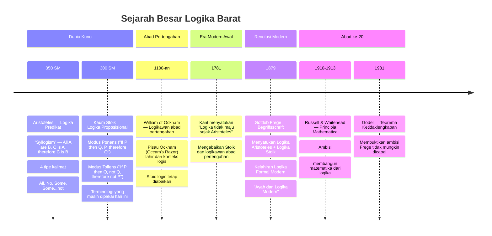

### Perbedaan Dua Sistem Kuno

**Logika Aristoteles** beroperasi di **tingkat predikat dan term** (kata-kata dalam kalimat):
- *All cats are black* (Semua kucing berwarna hitam)
- *There is a cat, therefore there is a black cat*
- Empat tipe kalimat: **All (Semua)**, **No (Tidak ada)**, **Some (Beberapa)**, **Some...not (Beberapa...tidak)**

**Logika Stoik** beroperasi di **tingkat proposisi** (kalimat-kalimat lengkap yang dihubungkan):
- *Modus Ponens (cara menegaskan)*: Jika P maka Q. P. Oleh karena itu Q.
- *Modus Tollens (cara menyangkal)*: Jika P maka Q. Bukan Q. Oleh karena itu bukan P.
- Ini bukan tentang *isi* kalimat, tapi tentang *hubungan antara kalimat-kalimat*

Perbedaannya seperti ini:

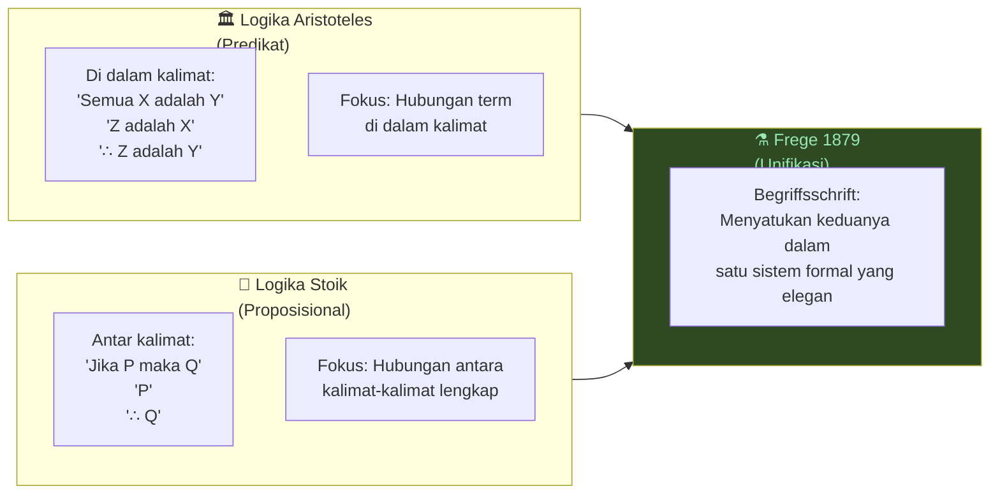

Selama lebih dari 2.000 tahun, dua sistem ini *hidup berdampingan tanpa pernah disatukan*. Keduanya tampak jelas benar, tapi tidak ada yang bisa menemukan cara menyatukannya secara matematis — sampai **1879**.

Seperti yang dianalogikan: ini seperti masalah fisika modern antara **relativitas umum** (ruang besar) dan **mekanika kuantum** (partikel sangat kecil) — keduanya tampak benar, tapi sulit disatukan secara konseptual.

### Gottlob Frege: Ayah Logika Modern 👑

Pada 1879, **Gottlob Frege** — matematikawan dan filsuf Jerman — menerbitkan *Begriffsschrift* (*Concept Script* / Tulisan Konsep). Ia berhasil menyatukan dua sistem kuno itu dalam satu sistem formal yang sangat elegan.

Itulah mengapa Frege disebut "ayah dari logika modern."

Dan ini bukan hanya karya teknis semata. Frege juga terobsesi dengan **kejernihan bahasa** (*clarity of language*) — sebuah tema yang akan sangat relevan untuk kita bahas nanti.

---

## Bagian 3: Modus Ponens dan Modus Tollens — Aturan Paling Dasar 🔑

### Modus Ponens (Cara Menegaskan)

*Modus ponens* (Latin: *modus ponendo ponens* — cara menegaskan dengan menegaskan) adalah aturan inferensi yang paling fundamental:

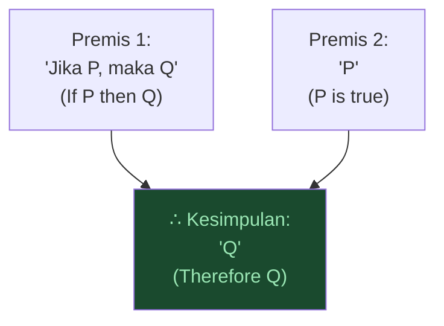

**Contoh konkret:**
- Premis 1: *Jika di luar sedang hujan, maka saya akan basah kuyup*
- Premis 2: *Di luar sedang hujan*
- Kesimpulan: *Oleh karena itu, saya akan basah kuyup*

Aturan ini terasa begitu *jelas* sehingga kita menggunakannya setiap saat tanpa sadar. Kaum Stoik menyebutnya salah satu *indemonstrables* (*hal yang tidak bisa dibuktikan* lebih lanjut, hanya bisa ditunjuk) karena begitu mendasar sehingga jika Anda tidak melihat kebenarannya, tidak ada cara lain untuk menjelaskannya.

### Modus Tollens (Cara Menyangkal)

*Modus tollens* (Latin: *modus tollendo tollens* — cara menyangkal dengan menyangkal):

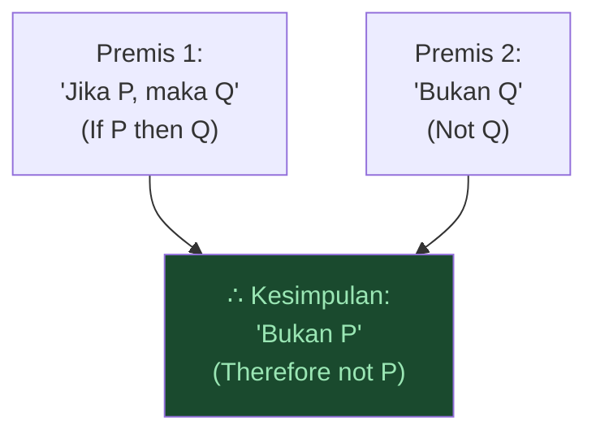

**Contoh:** 
- Premis 1: *Jika saya belajar, saya akan lulus*
- Premis 2: *Saya tidak lulus*
- Kesimpulan: *Oleh karena itu, saya tidak belajar*

---

## Bagian 4: Valid vs Sound — Dua Konsep yang Sering Dikacaukan 🎯

Ini adalah salah satu pembedaan paling penting dalam logika, dan juga yang paling sering keliru digunakan — bahkan oleh orang-orang yang tergolong terdidik.

### Validitas (Validity)

**Sebuah argumen *valid* jika tidak ada situasi di mana premis-premisnya benar namun kesimpulannya salah.**

Dengan kata lain: *jika premis-premisnya benar, kesimpulannya **harus** benar.*

Validitas adalah tentang **struktur** (*form*) argumen — bukan **isi** (*content*) argumen.

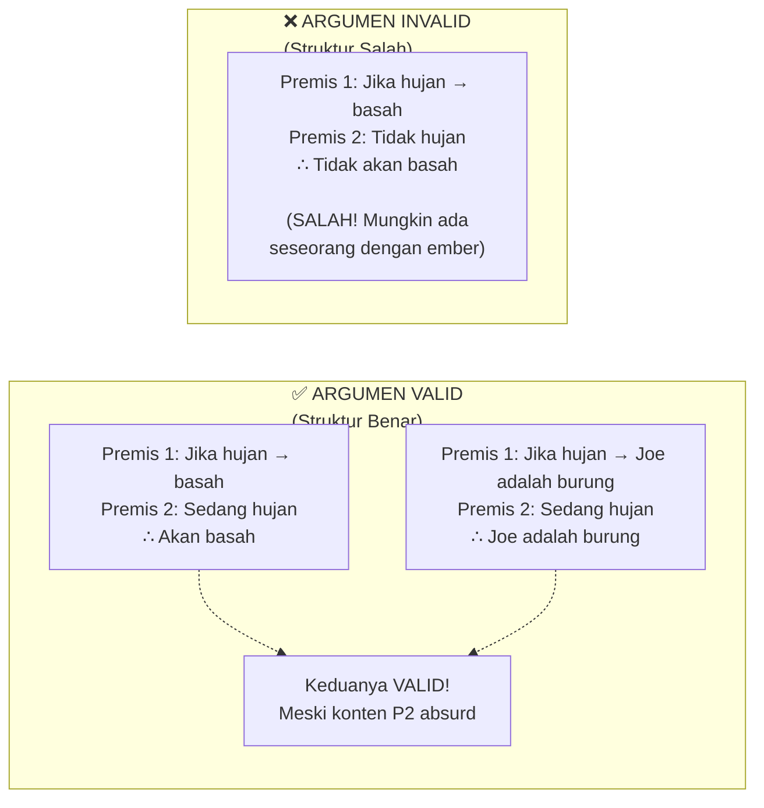

Perhatikan contoh kedua di atas. *"Jika hujan, maka Joe Folley adalah jenis burung. Sedang hujan. Oleh karena itu, Joe Folley adalah jenis burung."*

Itu adalah argumen yang **valid** — karena tidak ada cara bagi premis-premisnya untuk menjadi benar namun kesimpulannya salah. Masalahnya: premis-premisnya *jelas* tidak benar. Tapi itu soal **kesahihan** (*soundness*), bukan **validitas**.

### Kesahihan (Soundness)

**Sebuah argumen *sahih* (sound) jika:**
1. Argumen itu **valid** (struktur benar), DAN
2. Semua **premisnya benar** (konten benar)

Jika kedua kondisi terpenuhi, kesimpulannya *pasti benar*.

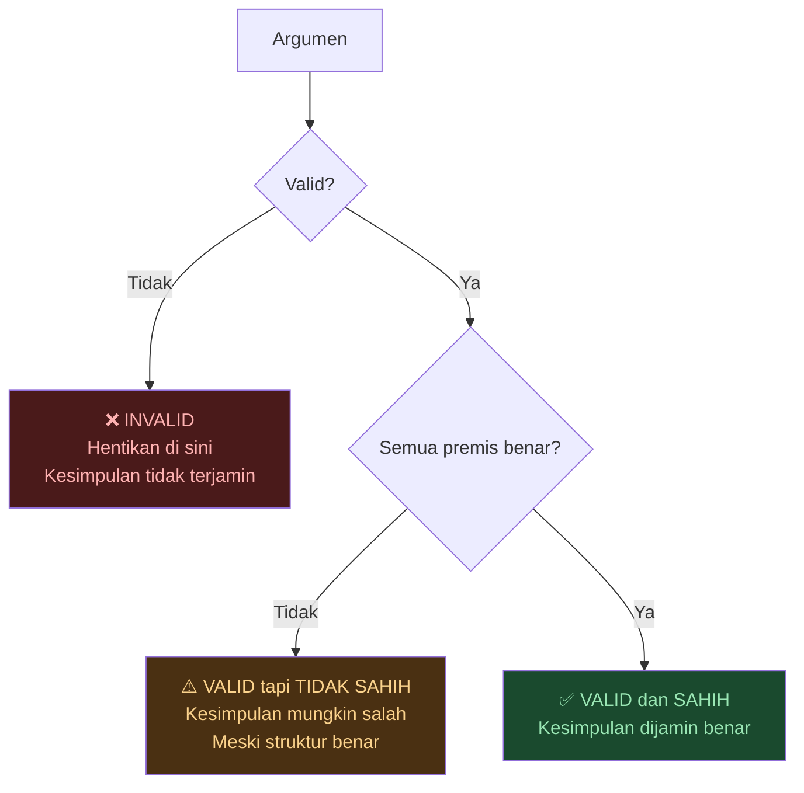

### Mengapa Ini Penting dalam Debat Nyata?

<Callout type="important" title="⚡ Pelajaran Penting untuk Debat Online">
Ketika seseorang berargumen: *"Jika alam semesta mulai ada, ia pasti memiliki penyebab. Alam semesta mulai ada. Oleh karena itu, alam semesta memiliki penyebab."*

Dan seseorang membalas: *"Itu argumen yang invalid karena alam semesta tidak punya penyebab!"*

**Itu SALAH secara logis.** Respons yang tepat adalah: *"Argumen itu VALID — tapi mungkin TIDAK SAHIH karena premisnya mungkin salah."*

**Sangat penting:**
- Gunakan **invalid** HANYA untuk argumen yang *strukturnya bermasalah* (kesimpulan tidak mengikuti dari premis)
- Gunakan **tidak sahih/unsound** untuk argumen yang *premisnya salah* (meski struktur oke)

Ini bukan sekadar nitpicking. Ini memberitahu Anda dengan tepat *apa yang perlu diperdebatkan*. Jika argumen invalid → berhenti di situ, struktur sudah bermasalah. Jika tidak sahih → perlu diidentifikasi premis mana yang salah.
</Callout>

**Aquinas** (Thomas Aquinas, filsuf abad pertengahan) memberikan contoh yang bagus: ia merespons Argumen Kosmologis tentang alam semesta memiliki awal dengan mengatakan ia *tidak yakin* bahwa premis "alam semesta memiliki awal" bisa diketahui hanya melalui akal semata (tanpa wahyu). Ia tidak menyebut argumen itu invalid — ia mempertanyakan *kesahihan* satu premisnya.

---

## Bagian 5: Ex Falso Quodlibet — Prinsip Ledakan 💥

Ini mungkin salah satu prinsip logika yang paling mengejutkan dan paling sulit secara intuitif.

*Ex falso quodlibet* (Latin: *dari yang salah, apa pun [bisa disimpulkan]*) — juga dikenal sebagai **Prinsip Ledakan** (*Principle of Explosion*).

### Masalah dengan Kontradiksi

Pertama, kita perlu memahami mengapa logika *tidak mengizinkan kontradiksi*. Andaikan seseorang berkata:

- Premis 1: Di luar sedang hujan
- Premis 2: Di luar **tidak** sedang hujan

Dua premis yang saling bertentangan langsung. Apa yang mengikuti dari kontradiksi ini?

**Jawaban menurut logika klasik: *segalanya* mengikuti.**

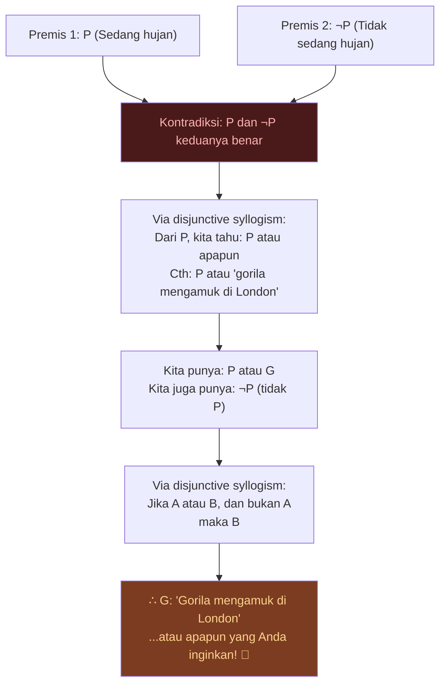

**Ini namanya Prinsip Ledakan** — jika Anda mengizinkan satu kontradiksi masuk ke dalam sistem logika Anda, sistem itu *meledak* dan membuktikan segalanya, termasuk hal-hal yang saling bertentangan.

Dari kontradiksi yang sama, Anda bisa membuktikan bahwa Spanyol tidak ada *dan* bahwa Spanyol ada. Anda bisa membuktikan apa saja.

<Callout type="warning" title="⚠️ Kenapa Ini Penting?">
**Ini adalah alasan utama mengapa logika melarang kontradiksi.**

Jika Anda menemukan bahwa argumen seseorang *menghasilkan kontradiksi*, Anda telah menunjukkan bahwa argumen itu bermasalah fundamental — karena dari kontradiksi tersebut, *segalanya* bisa ditarik sebagai kesimpulan, yang berarti logika kehilangan daya pembuktiannya.

Inilah yang disebut **reductio ad absurdum** (*reductio per impossibile*): untuk menunjukkan sesuatu tidak mungkin benar, tunjukkan bahwa ia menghasilkan kontradiksi.
</Callout>

**Analogi dengan matematika:** Kita tidak boleh membagi dengan nol (*division by zero*). Aturan ini ada bukan karena sewenang-wenang, tapi karena jika Anda membagi dengan nol, Anda mendapatkan kesimpulan-kesimpulan paradoksal. Demikian pula kontradiksi dalam logika.

### Silogisme Disjungtif (Disjunctive Syllogism)

Bagian kunci dari argumen di atas adalah **Silogisme Disjungtif**: *Jika A atau B, dan bukan A, maka B.*

Catatan penting: dalam logika, **"atau"** (*or*) bersifat **inklusif** (*inclusive or*):
- *P atau Q* adalah benar jika P benar, Q benar, *atau keduanya* benar
- Berbeda dengan "atau" eksklusif (*exclusive or*) dalam bahasa sehari-hari

| P | Q | P atau Q (inklusif) |
|---|---|---------------------|
| T | T | ✅ T |
| T | F | ✅ T |
| F | T | ✅ T |
| F | F | ❌ F |

---

## Bagian 6: Hukum Non-Kontradiksi dan Normativity Logika ⚖️

### Hukum-Hukum Fundamental Logika

Di luar aturan inferensi seperti modus ponens, ada hukum-hukum yang lebih fundamental yang tidak kita *simpulkan* dari argumen — hukum-hukum ini hanya *ada* sebagai fondasi:

**Hukum Non-Kontradiksi** (*Law of Non-Contradiction*):
> Sebuah proposisi tidak bisa benar *dan* salah pada saat yang sama.
> P tidak bisa sekaligus benar dan tidak-benar.

Ini bukan sebuah argumen. Ini pernyataan *bedrock* (fondasi) — hukum yang menopang semua penalaran lainnya.

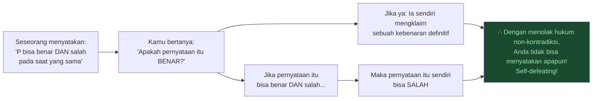

Aristoteles memiliki pembenaran yang sangat pragmatis: *Coba berpikir dalam terms kontradiksi. Coba bayangkan sebuah kontradiksi. Anda tidak bisa melakukannya.* Jadi ada sebuah cara di mana hukum ini tampak *bawaan* dalam cara kita berpikir.

### Apakah Logika Normative atau Deskriptif?

Ini adalah pertanyaan filsafat yang sangat mendalam. Logika bukan *deskriptif* — ia tidak hanya menggambarkan bagaimana kita *faktanya* berpikir. Kita tahu kita tidak selalu berpikir logis. Kahneman dan Tversky dalam psikologi kognitif menunjukkan bahwa manusia berpikir secara *heuristis*, dari asosiasi dan emosi — kita sangat jauh dari "hewan yang selalu rasional."

**CS Peirce** (filsuf dan pragmatis Amerika) merangkumnya: 
> *"Logika adalah sains normatif"* (*Logic is a normative science*) — bukan hanya menggambarkan cara Anda berpikir, tapi menggambarkan cara Anda **seharusnya** berpikir.

<Callout type="quote" title="💭 Normativity di Luar Etika">
Kata "normatif" (*normative*) atau "seharusnya" (*ought*) tidak hanya berlaku di ranah etika. Ia jauh lebih umum dari yang kita kira.

**Contoh dari bahasa:** *"Kamu menggunakan bahasa dengan salah."* Itu pernyataan normatif — ada cara yang seharusnya digunakan bahasa, ada cara yang salah. Tapi ini bukan soal moralitas.

**Contoh dari logika:** *"Penalaranmu tidak logis."* Juga pernyataan normatif — ada cara berpikir yang seharusnya, ada yang tidak.

Dalam kasus logika, kita bisa memformulasikan ini sebagai **imperatif hipotetis**: *"Jika kamu ingin mempertahankan kebenaran dalam penalaranmu, maka berpikirlah secara logis."* Ini jauh lebih mudah dipahami daripada kewajiban moral yang bersifat kategoris.
</Callout>

---

## Bagian 7: Meletakkan Argumen dalam Bentuk Proposisional — Keterampilan Paling Praktis 📝

Salah satu keterampilan paling berguna yang bisa Anda pelajari dari logika adalah kemampuan untuk **meletakkan argumen dalam bentuk proposisional** (*putting things in propositional form*).

### Apa Itu Bentuk Proposisional?

Bayangkan seseorang berkata:

> *"Man, kayaknya Sokrates pasti fana sih ya, soalnya semua manusia kan fana?"*

Itu adalah "salad kata." Untuk meletakkannya dalam bentuk proposisional adalah mengambil paragraf itu dan **mengekstrak bagian yang relevan secara argumentatif**:
1. Apa yang diasumsikan (premis-premis)?
2. Apa kesimpulan yang ditarik?
3. Aturan apa yang digunakan untuk sampai ke sana?

**Hasilnya:**
- Premis 1: Semua manusia adalah fana
- Premis 2: Sokrates adalah manusia
- Kesimpulan: ∴ Sokrates adalah fana

Ini tampak sederhana, tapi latihan ini bisa sangat mengubah cara Anda mendengarkan dan mendebat argumen.

### Mengapa Ini Sangat Berharga

Contoh lain yang Folley berikan: seseorang berkata:

> *"Tuhan pasti ada, karena alam semesta jelas punya awal, dan kalau punya awal pasti ada yang menyebabkannya yaitu Tuhan."*

Dibandingkan dengan bentuk proposisional yang jelas:

| Versi Informal | Bentuk Proposisional |
|----------------|----------------------|
| "Alam semesta jelas punya awal" | **Premis 1:** Segala sesuatu yang mulai ada memiliki penyebab |
| "Kalau punya awal pasti ada yang menyebabkan" | **Premis 2:** Alam semesta mulai ada |
| "Yaitu Tuhan" | **Kesimpulan:** ∴ Alam semesta memiliki penyebab |

Begitu argumen ada dalam bentuk proposisional, Anda bisa **menyetujui bahwa inilah argumennya** sebelum memperdebatkannya. Dan kemudian Anda bisa menyerang *tepat di premis mana* yang lemah — bukan hanya berbantah kabur-kabur.

<Callout type="tip" title="🛠️ Praktik Sehari-hari">
Anda tidak perlu berbicara dengan kata-kata "premis satu" dan "premis dua" dalam percakapan sehari-hari. Tapi latihan menempatkan argumen dalam bentuk ini akan secara otomatis membuat pikiran Anda lebih jernih.

Alih-alih berkata *"Aku pikir kayaknya gitu deh..."*, Anda akan lebih alami berkata *"Aku pikir X karena Y, dan jika Y benar maka X harusnya mengikuti."*

**Leibniz** sangat bersemangat tentang ini — ia percaya kita perlu bahasa yang sebisa mungkin mengeliminasi ambiguitas untuk bisa berdiskusi filsafat atau topik apapun dengan serius.
</Callout>

---

## Bagian 8: Sense dan Reference — Kontribusi Brilian Frege 💡

### Masalah yang Terlihat Sepele

Frege mengamati bahwa jika kita melihat kata hanya dari *referensinya* (*reference*) — objek yang ditunjuknya di dunia — kita akan menghadapi beberapa kebingungan logis.

Contoh klasik yang Frege gunakan:

> ***Hesperus** (Bintang Sore) dan **Phosphorus** (Bintang Pagi)* — keduanya adalah nama kuno untuk planet **Venus**.

Orang-orang kuno tidak tahu bahwa keduanya merujuk pada benda yang sama. Mereka melihat bintang terang di sore hari (*Hesperus*) dan bintang terang di pagi hari (*Phosphorus*) sebagai dua benda berbeda.

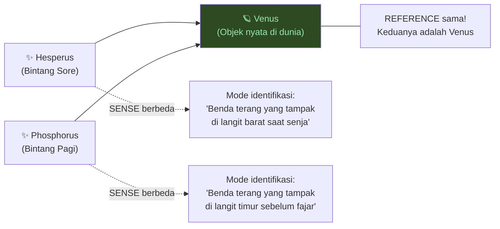

Frege berkata: keduanya memiliki **referensi** (*reference*) yang sama (Venus), tapi **sense** yang berbeda — *mode identifikasi* yang berbeda untuk benda yang sama.

### Mengapa Ini Berguna dalam Filsafat

Analogi modern: **Air** dan **H₂O**. Mereka adalah hal yang sama, tapi seseorang 1.000 tahun lalu yang dideskripsikan tentang "dua atom hidrogen dan satu atom oksigen yang terikat" tidak akan langsung berpikir tentang "air yang mengalir di sungai." Mereka berpikir tentang H₂O dalam **sense** yang berbeda dari air sehari-hari — meski **reference**-nya sama.

**Aplikasi dalam debat filsafat:**

Ambil **argumen Descartes** tentang pemisahan pikiran dan tubuh (*mind-body dualism*): ia berargumen bahwa karena ia bisa *membayangkan* pikiran ada tanpa tubuh, keduanya pasti merupakan entitas yang berbeda.

Analisis Frege bisa membantu: Mungkin "pikiran" dan "sistem saraf" merujuk pada **objek yang sama** — tapi melalui **mode identifikasi (sense) yang berbeda**. Argumen Descartes kemudian menarik kesimpulan substantif dari fakta linguistis — dan Frege membantu menunjukkan *mengapa* itu problematis.

Contoh lain yang Folley sebutkan: **Open Question Argument** dari G.E. Moore dalam meta-etika. Moore berargumen bahwa untuk *definisi naturalistik apapun tentang kebaikan* (misalnya "kebaikan = kesenangan"), seseorang masih bisa secara bermakna bertanya "tapi apakah kesenangan itu benar-benar baik?" — yang menunjukkan definisi itu tidak lengkap.

Jika kita memiliki definisi yang *benar-benar sempurna*, pertanyaan seperti itu tidak akan muncul (tidak ada yang bertanya "tapi apakah segitiga itu benar-benar punya tiga sisi?"). Moore menggunakan ini untuk berargumen bahwa kebaikan tidak bisa didefinisikan secara naturalistik.

Namun seorang utilitarian bisa menggunakan konsep Frege untuk merespons: mungkin "kebaikan" dan "kesenangan terbesar" memiliki **reference** yang sama, tapi melalui **sense** yang berbeda — sehingga pertanyaan itu masih terbuka meski keduanya pada akhirnya sama.

---

## Bagian 9: Fallacy Formal vs Informal — Dua Kategori yang Sering Dikacaukan 🚫

### Fallacy Formal (Cacat Struktur)

**Fallacy formal** adalah kesalahan dalam *struktur* argumen — kesimpulan tidak mengikuti dari premis. Semua fallacy formal pada dasarnya adalah varian dari **non sequitur** (*tidak mengikuti*).

**Contoh: Affirming the Consequent (Menegaskan Konsekuensi)**

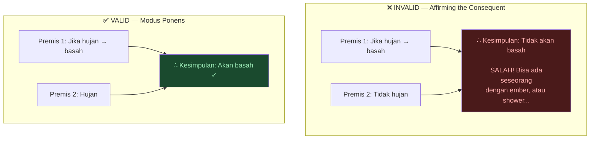

Fallacy ini terasa seperti *seharusnya valid* tapi tidak. Dalam banyak konteks kasual, kita tidak akan mempermasalahkannya. Tapi dalam argumen penting — tentang eksistensi Tuhan, meta-etika, kebijakan publik — ketidaktelitian ini bisa menyebabkan kesimpulan yang salah.

**Contoh lain fallacy formal:**
- **Fallacy of Composition (Komposisi):** *Setiap bata di tembok ini kecil, oleh karena itu temboknya kecil.* (Tapi yang benar: *Setiap bata berwarna merah, oleh karena itu temboknya merah* — ini mengikuti karena sifat warna *berlaku* untuk bagian-bagian dan juga keseluruhan, tapi ukuran tidak.)

### Fallacy Informal — Cacat di Luar Struktur

Inilah yang menarik: ada sejumlah besar hal yang kita sebut "fallacy logika" yang sebenarnya **sulit ditangani secara formal** karena mereka tidak melibatkan kesalahan struktural semata.

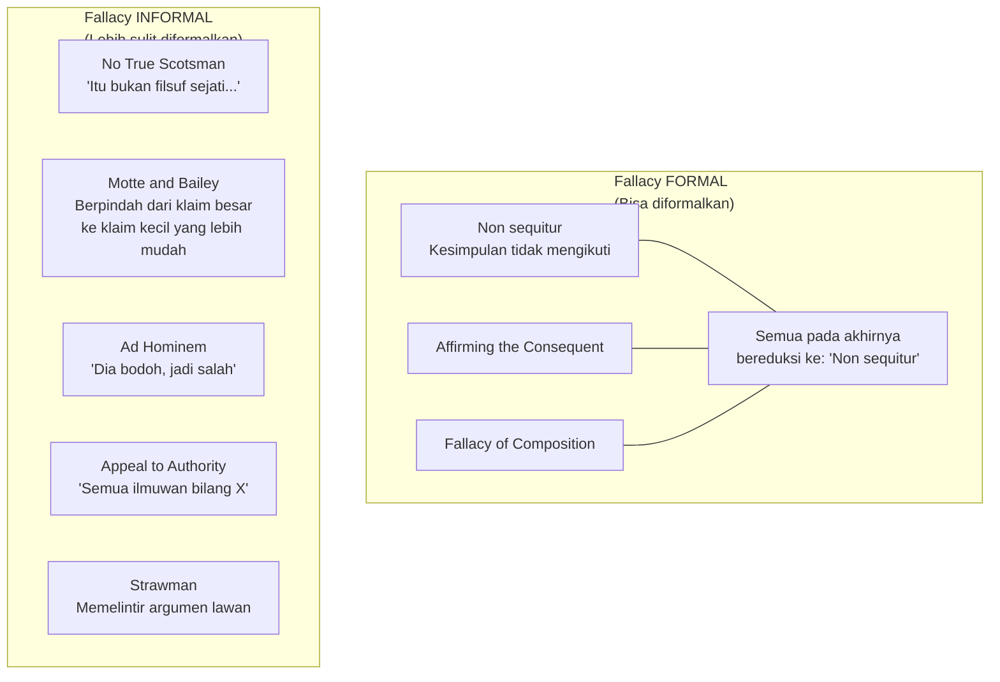

**No True Scotsman Fallacy:**
- Saya: *"Tidak ada filsuf sejati yang takut mati."*
- Anda: *"Tapi ini daftar filsuf yang takut mati."*
- Saya: *"Oh, itu bukan filsuf sejati."*

Kenapa ini problematis? Karena logika tidak mendikte definisi. Anda bisa mengonstruksi argumen: *"Jika seseorang adalah filsuf sejati, ia tidak takut mati. Orang ini takut mati. Oleh karena itu, ia bukan filsuf sejati."* Itu secara teknis valid! Masalahnya adalah kita mendefinisikan ulang "filsuf sejati" secara *ad hoc* untuk melindungi klaim awal.

**Motte and Bailey Fallacy:**
Anda mengajukan klaim ambisius (*Bailey*) yang sulit dipertahankan. Ketika diserang, Anda mundur ke posisi yang jauh lebih mudah dipertahankan (*Motte*). Ketika tekanan mereda, Anda kembali ke klaim ambisius.

Contoh: *"Tuhan Alkitab ada"* (Bailey, sangat ambisius) → ketika diserang → *"Saya hanya berkata ada penyebab pertama alam semesta"* (Motte, jauh lebih defensible). Keduanya terdengar seperti *posisi yang sama* tapi sangat berbeda.

**Ad Hominem:**
- *"Joe Folley bodoh, oleh karena itu ia salah."*
- Secara teknis ini bisa diformalkan sebagai: Premis 1: Jika seseorang bodoh, apa yang dikatakannya salah. Premis 2: Joe bodoh. Kesimpulan: Apa yang Joe katakan salah.
- Ini valid secara struktur, tapi Premis 1 jelas tidak sahih.

<Callout type="warning" title="⚠️ Jebakan Utama tentang Fallacy">
Ketika seseorang berteriak *"Itu ad hominem!"* atau *"Itu no true Scotsman!"*, mereka sering menggunakannya seolah-olah itu membuktikan lawan *secara logis salah*.

**Tapi itu tidak benar.**

Menunjukkan sebuah argumen fallacious tidak sama dengan membuktikan kesimpulannya salah. Sangat mungkin ada argumen yang sangat buruk untuk kesimpulan yang benar.

Selain itu: informal fallacy *tidak memiliki kekuatan yang sama* dengan membuktikan argumen secara struktural invalid. Mereka menunjukkan kelemahan, tapi bukan bukti definitif.
</Callout>

---

## Bagian 10: Logika Modal — Niscaya dan Mungkin 🌌

### Keterbatasan Logika Klasik

Logika klasik (*classical logic*) hanya berurusan dengan *benar* atau *salah*. Tapi kita sering ingin bicara tentang sesuatu yang bukan hanya *apakah ini benar* tapi *seberapa kuat kebenarannya*:

- *Dua tambah dua sama dengan empat* — ini **niscaya** (*necessarily*) benar; tidak bisa tidak benar.
- *Kursi ini berwarna cokelat* — ini **kontingen** (*contingently*) benar; bisa saja biru jika dicat ulang.

**Logika Modal** (*modal logic*) adalah logika yang mempelajari niscayaan (*necessity*) dan kemungkinan (*possibility*).

### Semantik Dunia-Kemungkinan (Possible World Semantics)

Alat utama logika modal adalah **Kripke Semantics** (semantik Kripke, dikembangkan oleh Saul Kripke) yang menggunakan konsep **possible worlds** (*dunia-kemungkinan*):

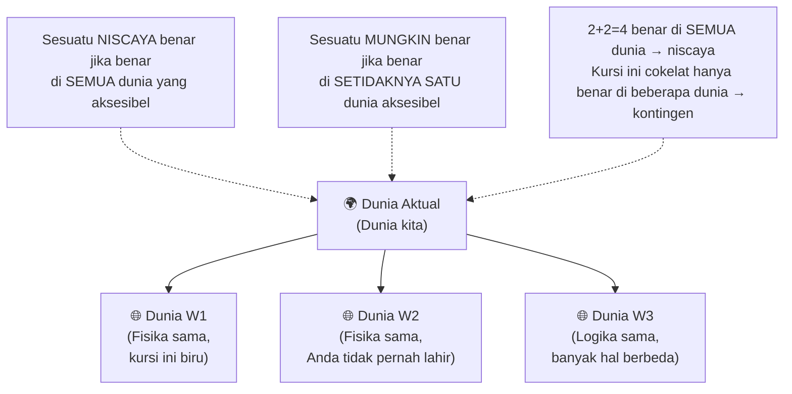

*Possible worlds* bukan tentang multiverse yang benar-benar ada. Itu cara berpikir tentang kemungkinan. Anda bisa membayangkannya sebagai *set proposisi* — dunia yang sama dengan kita kecuali satu hal berbeda.

Dengan mendefinisikan *yang aksesibel* secara berbeda, Anda mendapatkan jenis-jenis kemungkinan yang berbeda:
- Aksesibel = semua dunia dengan fisika yang sama → **kemungkinan fisik**
- Aksesibel = semua dunia yang logis konsisten → **kemungkinan logis**
- Dan seterusnya

---

## Bagian 11: Logika Epistemik — Apa yang Saya Percayai? 💭

Framework yang sama dari logika modal ternyata sangat berguna untuk menangani **kepercayaan** (*belief*) dan **pengetahuan** (*knowledge*):

Seorang **logikawan epistemik** (*epistemic logician*) mendefinisikan kepercayaan seperti ini:

> *"Seseorang percaya P jika dan hanya jika P benar di setiap dunia yang ia 'pertimbangkan' (aksesibel baginya)."*

Bayangkan Anda adalah agen di dunia W0. Anda memiliki set *dunia-dunia yang Anda pertimbangkan sebagai kemungkinan nyata*. Apa yang benar di semua dunia itu — itulah yang Anda **percayai**.

Ini adalah contoh dari kekuatan logika yang lebih luas: sebuah alat yang dirancang untuk satu tujuan (niscayaan dan kemungkinan) ternyata memberikan *framework yang sangat rapi* untuk hal yang tampaknya sama sekali berbeda (kepercayaan dan pengetahuan).

---

## Bagian 12: Logika Fuzzy dan Nilai Kebenaran Kontinum 🌊

### Keterbatasan Biner

Logika klasik bersifat **bivalent** — hanya ada dua nilai kebenaran: benar (1) dan salah (0). Tapi dunia nyata sering tidak biner:

- *Dia tinggi* — kapan seseorang mulai "tinggi"? Pada 175cm? 180cm?
- *Rambut ini merah* — kapan merah berubah menjadi oranye?
- *Kumpulan ini besar* — berapa anggota minimumnya?

**Logika Banyak-Nilai** (*Many-Valued Logic*) mengizinkan lebih dari dua nilai kebenaran.

### Logika Fuzzy (Fuzzy Logic)

*Fuzzy logic* adalah jenis logika banyak-nilai di mana nilai kebenaran adalah **angka kontinu antara 0 dan 1**:

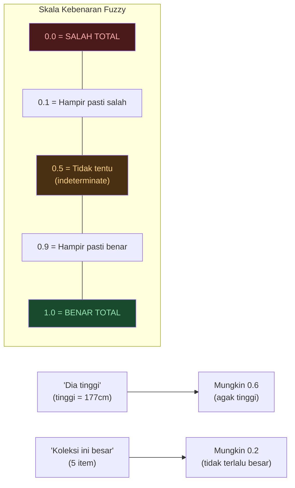

Logikawan *fuzzy* (atau *banyak-nilai*) pertama yang paling terkenal adalah **Łukasiewicz** (nama Polandia yang sangat sulit diucapkan) yang mengembangkan berbagai logika banyak-nilai, termasuk logika tiga nilai (benar, salah, dan *setengah*) serta logika bernilai-tak-terhingga (kontinum antara 0 dan 1).

Logika fuzzy sering digunakan untuk:
- Memodelkan **kesamaran** (*vagueness*)
- Merepresentasikan **ketidakpastian** (*uncertainty*)
- Digabungkan dengan **teori probabilitas**
- Digunakan dalam **sistem kontrol teknik** (AC, mesin cuci, dll)

---

## Bagian 13: Logika Parakonsisten — Toleransi Kontradiksi 🌀

Ingat *ex falso quodlibet* — prinsip bahwa dari kontradiksi, segalanya mengikuti? Ada logika yang dengan sengaja **membuang prinsip ini**.

**Logika Parakonsisten** (*Paraconsistent Logic*) adalah sistem logika yang dirancang untuk **menoleransi kontradiksi** — di mana Anda bisa memiliki P dan tidak-P tanpa semua hal meledak.

Ini terdengar gila, tapi ada motivasi yang serius: dalam database nyata, inkonsistensi bisa terjadi karena entri yang konflik. Kita mungkin ingin alasan *di sekitar* inkonsistensi itu daripada sistemnya langsung runtuh.

---

## Bagian 14: Kalimat Eksponable — Jebakan Tersembunyi dalam Bahasa 🎭

**Kalimat eksponable** (*exponable statements*) adalah kalimat yang tampak sederhana tapi sebenarnya *terurai* menjadi beberapa klaim tersembunyi.

Contoh klasik dari Frege: *"Raja Prancis saat ini botak."*

Kalimat ini sebenarnya terurai menjadi tiga klaim:
1. Ada raja Prancis saat ini
2. Hanya ada satu raja Prancis
3. Raja tersebut botak

Karena Prancis tidak punya raja, apakah pernyataan itu **benar atau salah**?

**Bertrand Russell** menyelesaikan masalah ini dengan *Theory of Definite Descriptions*: ia berkata pernyataan itu **salah** — karena salah satu dari klaim implisitnya (ada raja Prancis) tidak terpenuhi.

Contoh yang lebih menarik yang Folley berikan:

> *"Apakah ibumu tahu kalau kamu gay?"*

Pertanyaan ini terurai menjadi:
- Klaim 1: Kamu gay
- Klaim 2: Ibumu tahu hal ini

Jika Anda *tidak* gay, Anda tidak bisa menjawab "ya" (itu berbohong tentang orientasi Anda) dan juga tidak bisa menjawab "tidak, ibu tidak tahu saya gay" (itu mengakui bahwa Anda gay tapi ibu tidak tahu). Pertanyaan itu adalah *perangkap linguistis*.

Cara meresponsnya secara logis: **urai klaim-klaim tersembunyi dan tangani satu per satu.**

<Callout type="tip" title="🛡️ Senjata Rahasia">
Kalimat eksponable muncul di mana-mana dalam debat, politik, dan juga bullying. Ketika seseorang menanyakan sesuatu dengan klaim tersembunyi, Anda bisa berkata:

*"Pertanyaan itu mengandung beberapa klaim implisit. Mari saya urai dan jawab masing-masing."*

Ini bukan hanya senjata defensif — ini adalah cara berpikir yang lebih jernih secara umum.
</Callout>

---

## Bagian 15: Sumber Belajar Logika 📚

Folley memberikan beberapa rekomendasi konkret untuk mulai belajar logika:

### Untuk Semua Level

| Sumber | Tipe | Keterangan |
|--------|------|------------|
| **Open Logic Project** | Website + PDF gratis | Kumpulan buku teks logika gratis yang sangat bagus. Digunakan di kursus undergraduate Cambridge. Termasuk *forallx*, plus bab tentang teori himpunan, teori kategori, teori probabilitas. |
| **Logic Manual** — Volker Halbach | Buku | Pengantar yang sangat baik untuk pemula |
| **A Friendly Introduction to Mathematical Logic** | Buku | Lebih matematis, tapi membawa Anda dari dasar hingga Teorema Ketidaklengkapan Gödel |

### Jalur Belajar yang Disarankan

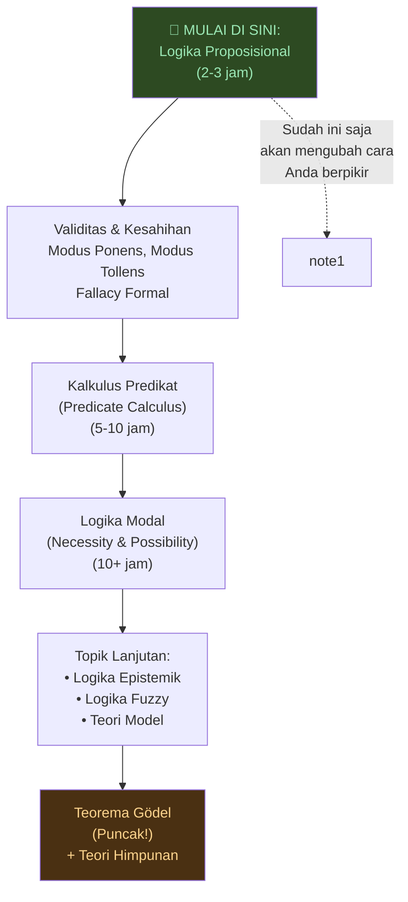

---

## Bagian 16: Logika Formal vs Logika Informal — Dua Dunia yang Perlu Diakui 🤝

Folley mengakui ada dunia besar yang disebut **logika informal** (*informal logic*) yang berada sedikit di luar logika formal murni.

**Logika informal** melihat argumen sebagaimana mereka *benar-benar terjadi di dunia* dan memperluas cakupannya sedikit melampaui formalisme untuk bertanya: *apa itu argumen yang baik, bahkan dengan mempertimbangkan kriteria di luar formalisme?*

Seorang logikawan informal mungkin mendefinisikan **diskusi yang wajar** (*reasonable discussion*) sebagai memiliki aturan seperti:
1. Kamu tidak bisa menolak poin lawan tanpa memberikan argumen mengapa itu tidak benar
2. Kamu harus memastikan kamu dan lawanmu menggunakan terminologi yang serupa
3. Kamu harus menyampaikan poinmu dengan jelas

Dan fallacy seperti **No True Scotsman** melanggar norma-norma diskusi yang wajar ini — meski tidak melibatkan kontradiksi formal.

---

## Penutup: Mengapa 5 Jam Logika Akan Mengubah Hidup Anda ✨

Folley membuat klaim yang kuat di awal percakapan, dan sekarang kita bisa memahami mengapa:

> *"Bahkan hanya 5 jam dihabiskan kumulatif sepanjang tahun, di meja dengan buku teks logika, akan secara fundamental mengubah cara Anda melihat dunia."*

Mengapa? Bukan karena Anda akan mulai berbicara seperti mesin logika. Tapi karena:

1. **Anda akan mulai mendengar argumen secara berbeda** — bukan hanya "apakah ini terdengar masuk akal?" tapi "premis apa yang diasumsikan? Apakah kesimpulan mengikuti?"

2. **Anda akan bisa mengidentifikasi dengan tepat di mana argumen bermasalah** — bukan hanya "itu terdengar salah" tapi "premis 2 tampak tidak sahih karena X"

3. **Anda akan lebih sadar tentang cara Anda sendiri berpikir** — tentang asumsi tersembunyi, tentang inferensi yang Anda buat tanpa sadar

4. **Anda akan lebih efektif dalam diskusi** — karena Anda bisa menyetujui *struktur* argumen sebelum memperdebatkan isinya

5. **Anda akan lebih tahan terhadap manipulasi** — termasuk manipulasi melalui bahasa yang ambigu, kalimat eksponable, atau fallacy informal

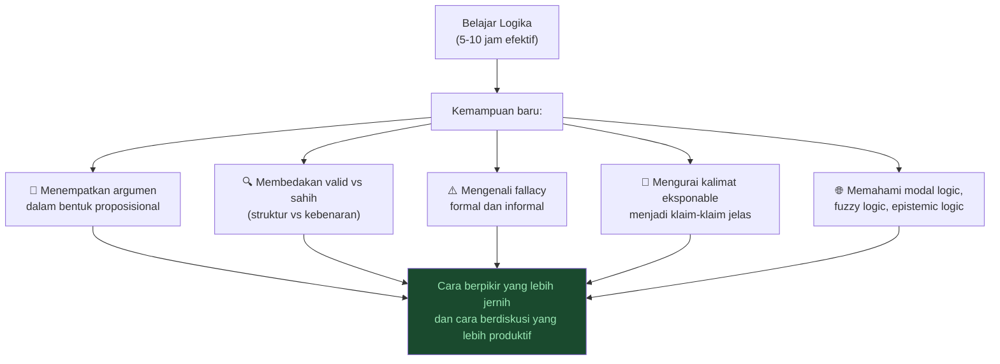

---

## Ringkasan Konsep Kunci 📋

<Callout type="abstract" title="🗂️ Glosarium Logika">

| Istilah | Bahasa Indonesia | Penjelasan |
|---------|-----------------|------------|
| **Modus Ponens** | Cara menegaskan | Jika P→Q, dan P, maka Q |
| **Modus Tollens** | Cara menyangkal | Jika P→Q, dan ¬Q, maka ¬P |
| **Valid** | Valid | Tidak mungkin premis benar tapi kesimpulan salah |
| **Sound** | Sahih | Valid + semua premis benar |
| **Ex Falso Quodlibet** | Dari yang salah, apa pun | Dari kontradiksi, segalanya mengikuti |
| **Non sequitur** | Tidak mengikuti | Kesimpulan tidak mengikuti dari premis |
| **Reductio ad absurdum** | Reduksi ke absurditas | Membuktikan sesuatu salah dengan menunjukkan ia berimplikasi kontradiksi |
| **Formal fallacy** | Fallacy formal | Kesalahan dalam struktur argumen |
| **Informal fallacy** | Fallacy informal | Kesalahan di luar struktur formal |
| **Propositional form** | Bentuk proposisional | Mengurai argumen ke premis dan kesimpulan eksplisit |
| **Sense & Reference** | Makna & Acuan | Frege: cara mengidentifikasi vs objek yang diidentifikasi |
| **Modal logic** | Logika modal | Logika tentang niscayaan dan kemungkinan |
| **Epistemic logic** | Logika epistemik | Logika tentang kepercayaan dan pengetahuan |
| **Fuzzy logic** | Logika fuzzy | Nilai kebenaran sebagai kontinum 0-1 |
| **Paraconsistent logic** | Logika parakonsisten | Logika yang toleran terhadap kontradiksi |
| **Exponable statement** | Kalimat eksponable | Kalimat yang terurai menjadi beberapa klaim tersembunyi |
| **Normativity** | Normativity | Sifat "seharusnya" — aturan tentang bagaimana sesuatu seharusnya dilakukan |
| **Logical monism** | Monisme logis | Ada satu logika sejati |
| **Logical pluralism** | Pluralisme logis | Ada banyak logika yang masing-masing valid untuk konteks berbeda |
</Callout>

---

## Referensi 📚

<Callout type="cite" title="📖 Tokoh & Karya yang Disebutkan">

**Filsuf & Logikawan:**
- **Aristoteles** (384-322 SM) — Pendiri logika Barat, *Organon*
- **Kaum Stoik** — Chrysippus dkk., modus ponens dan terminologi logika
- **Immanuel Kant** (1724-1804) — *Critique of Pure Reason* (keliru mengabaikan logika Stoik)
- **Gottlob Frege** (1848-1925) — *Begriffsschrift* (1879), Sense & Reference, ayah logika modern
- **Bertrand Russell** (1872-1970) — *Principia Mathematica*, Theory of Definite Descriptions
- **Alfred Tarski** (1901-1983) — Teori kebenaran formal
- **Saul Kripke** (1940-2022) — Kripke Semantics untuk logika modal
- **Jan Łukasiewicz** (1878-1956) — Logika banyak-nilai
- **G.E. Moore** (1873-1958) — Open Question Argument dalam meta-etika
- **CS Peirce** (1839-1914) — "Logika adalah sains normatif"
- **William of Ockham** (1287-1347) — Logikawan abad pertengahan, Occam's Razor
- **Kahneman & Tversky** — Psikologi kognitif: heuristik dan bias

**Buku Rekomendasi:**
- *The One True Logic* — Owen Griffiths & Alexander Paseau
- *Logic Manual* — Volker Halbach
- *A Friendly Introduction to Mathematical Logic* — Christopher Leary & Lars Kristiansen
- **Open Logic Project** — [openlogicproject.org](https://openlogicproject.org) (GRATIS)

**Video Sumber:**
- [YouTube: Everything You Need to Know About Logic — Joe Folley & Alex O'Connor](https://www.youtube.com/watch?v=thtomlDVBPI)
</Callout>

---

*Logika bukan tentang menjadi robot. Logika adalah tentang membangun presisi di dalam pikiran Anda — sehingga ketika Anda berdebat, Anda tahu persis apa yang Anda perjuangkan, dan apa yang sebenarnya menggugurkan argumen Anda.*
