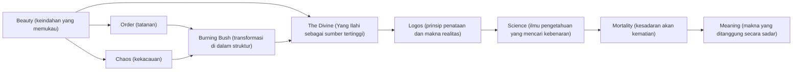
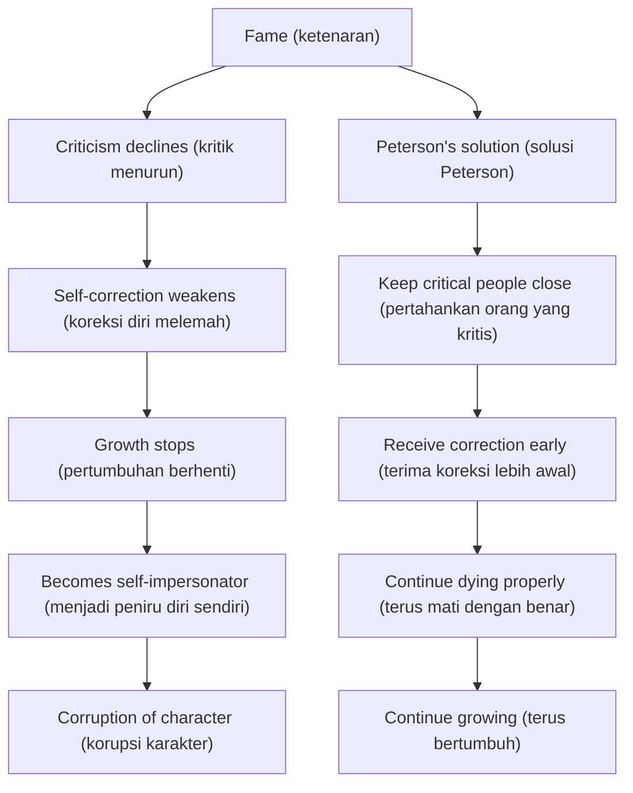
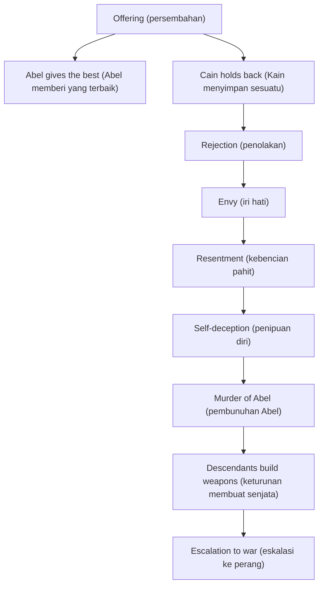
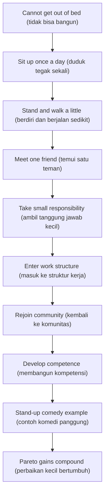

<Callout type="important" title="🧭 Cara Membaca Artikel Ini">
Artikel ini sengaja ditulis panjang, padat, dan mendalam. Gagasannya bukan untuk dibaca seperti rangkuman berita, melainkan seperti perjalanan intelektual dan spiritual 😊. Saya mempertahankan detail-detail penting dari percakapan Jordan Peterson dengan Lex Fridman agar pembaca Indonesia bisa menangkap arsitektur pikirannya secara utuh: dari keindahan, Tuhan, sains, kematian, ketenaran, kisah Kain dan Abel, depresi, sampai tanggung jawab sebagai jalan menuju makna.
</Callout>

## 1. Pengantar: Percakapan yang Mengguncang Jiwa

Ada percakapan yang terasa seperti wawancara biasa, ada pula percakapan yang terasa seperti seseorang sedang membuka bagian paling dalam dari kesadaran manusia 😶. Episode Lex Fridman Podcast #313 bersama Jordan Peterson jelas masuk kategori kedua. Lex tidak datang dengan pertanyaan dangkal. Ia datang dengan pertanyaan-pertanyaan yang hampir selalu menghantui manusia saat sendirian: apa itu keindahan (*beauty* — pengalaman akan keteraturan dan daya tarik yang terasa bermakna)? apa itu Tuhan? mengapa kita takut mati? apa yang dilakukan ketenaran terhadap jiwa? bagaimana iri hati merusak manusia? dan adakah cara hidup yang sungguh sanggup menanggung penderitaan tanpa jatuh ke kebencian?

Percakapan ini dibuka dengan kutipan Friedrich Nietzsche: *"Battle not with monsters, lest ye become a monster; if you gaze into the abyss, the abyss gazes also into you"* (jangan melawan monster sedemikian rupa hingga kamu sendiri menjadi monster; dan bila kamu menatap jurang, jurang itu juga menatapmu). Kutipan ini biasanya dibaca sebagai peringatan psikologis: siapa yang terlalu lama bergulat dengan kejahatan bisa berubah bentuk oleh kejahatan itu sendiri. Tetapi Peterson menjawab dengan kalimat yang mengejutkan: *"Bring it on. If you gaze into the abyss long enough, you see the light, not the darkness."* (hadapi saja; bila kamu menatap jurang cukup lama, kamu justru melihat cahaya, bukan kegelapan). Jawaban ini penting karena memberi nada seluruh episode: Peterson bukan hanya mengakui kegelapan, tetapi menolak berhenti pada kegelapan.

Di situlah letak daya ledak wawancara ini 🔥. Bagi Peterson, jurang (*abyss* — kekosongan, penderitaan, keterbatasan, dan ancaman kehancuran) bukan sekadar lokasi teror. Jurang juga dapat menjadi tempat penyingkapan. Dengan kata lain, penderitaan tidak otomatis merusak. Penderitaan bisa juga mengajar, memurnikan, dan menata ulang hidup — asalkan dihadapi dengan sukarela, jujur, dan dalam orientasi yang benar.

Podcast ini penting karena mencakup pertanyaan paling fundamental tentang eksistensi manusia. Bukan eksistensi dalam arti slogan, melainkan dalam arti paling konkret: bagaimana manusia harus melihat dunia ketika keindahan terasa sakral, ketika kematian selalu dekat, ketika kekuasaan menggoda, ketika propaganda memabukkan, ketika depresi melumpuhkan, dan ketika makna terasa seperti sesuatu yang harus diperjuangkan setiap hari. Percakapan ini menyatukan teologi (*theology* — pemikiran tentang Tuhan), psikologi (*psychology* — ilmu tentang jiwa dan perilaku), sastra (*literature* — dunia narasi dan simbol), politik, dan pengalaman hidup menjadi satu arus besar.

<Callout type="quote" title="📜 Kutipan Pembuka yang Menentukan Arah Episode">
**Nietzsche:** "Battle not with monsters, lest ye become a monster; if you gaze into the abyss, the abyss gazes also into you."

**Peterson:** "Bring it on. If you gaze into the abyss long enough, you see the light, not the darkness."
</Callout>

Kalimat Peterson ini terdengar provokatif, tetapi jika dibedah lebih jauh, itu adalah tesis besar tentang keberanian. Keberanian di sini bukan nekat. Keberanian adalah kesediaan untuk melihat apa yang nyata tanpa menutup mata, sambil menolak menjadi sinis. Inilah salah satu tema terdalam seluruh pembicaraan: kegelapan bisa menjadi guru, tetapi hanya jika kita tidak menjadikannya altar penyembahan.

---

## 2. Keindahan (*Beauty* — keindahan) sebagai Penunjuk Menuju Tuhan

Salah satu bagian paling indah dari wawancara ini adalah ketika Lex dan Peterson membahas kalimat Dostoevsky melalui karakter Pangeran Myshkin dalam novel *The Idiot* (Si Bodoh): *beauty will save the world* (keindahan akan menyelamatkan dunia). Aleksandr Solzhenitsyn bahkan mengangkat kalimat itu dalam pidato Nobel Prize (Hadiah Nobel)-nya. Tetapi Peterson membuat koreksi yang sangat penting. Menurutnya, yang menyelamatkan dunia bukan keindahan itu sendiri dalam arti estetika semata. Yang menyelamatkan dunia adalah Yang Ilahi (*the Divine* — realitas tertinggi yang menjadi sumber orientasi moral dan eksistensial). Keindahan adalah salah satu penunjuknya (*pointer* — petunjuk arah), salah satu cara Yang Ilahi menampakkan diri kepada kesadaran manusia ✨.

Di sini Peterson tidak berbicara tentang keindahan sebagai dekorasi. Ia tidak sedang bicara tentang sesuatu yang sekadar enak dipandang. Ia sedang bicara tentang pengalaman ketika sesuatu tampak begitu tepat, begitu utuh, begitu hidup, sehingga kita merasa sedang berhadapan dengan realitas yang lebih dalam daripada utilitas biasa. Keindahan optimal, dalam kerangka Peterson, muncul dari keseimbangan antara tatanan (*order* — struktur, keteraturan, kestabilan) dan kekacauan (*chaos* — potensi, perubahan, ketidakpastian). Jika hanya ada tatanan, hidup menjadi mati, kaku, dan steril. Jika hanya ada kekacauan, hidup menjadi retak, mengerikan, dan tak tertanggungkan. Keindahan muncul pada titik pertemuan keduanya 🙂.

Untuk menjelaskan itu, Peterson merujuk kisah Semak yang Menyala (*Burning Bush* — semak yang terbakar tetapi tidak hangus) dalam narasi Musa. Semak itu menyala oleh api transformasi, tetapi strukturnya tidak musnah. Di situlah simbolnya menjadi sangat kuat. Kehidupan yang baik bukan kehidupan tanpa api, melainkan kehidupan yang mampu menanggung api perubahan tanpa kehilangan bentuk inti. Peterson lalu menyamakan ini dengan karya seni besar. Lukisan hebat, musik hebat, puisi hebat, bahkan percakapan hebat, memiliki ciri yang sama: ada unsur transformasi yang membakar, tetapi ada juga struktur yang cukup kuat untuk menampung api itu.

Itulah sebabnya keindahan yang memukau sering kali juga menakutkan. Peterson memakai gagasan *terrible beauty* (keindahan yang dahsyat sekaligus menggentarkan). Keindahan bukan hanya lembut. Kadang ia melukai, bahkan menuntut. Saat seseorang berdiri di hadapan patung David karya Michelangelo, misalnya, yang hadir bukan hanya rasa kagum estetis. Yang hadir juga semacam panggilan moral: *you could be far more than you are* (kamu bisa menjadi jauh lebih besar daripada dirimu yang sekarang). Keindahan, dalam arti ini, menghakimi dengan cara yang tidak kasar. Ia menunjukkan kemungkinan tertinggi manusia, dan karenanya sekaligus menyingkap kekurangan kita 😮.

Peterson juga menyebut contoh katedral di Vienna (Wina): sebuah bangunan indah yang berdiri di atas tiga lantai tulang belulang. Ini gambaran yang luar biasa kuat. Keindahan besar tidak menolak kematian. Sebaliknya, ia sering berdiri di atas pengakuan mendalam terhadap kematian. Katedral bukan dekorasi untuk melupakan kefanaan. Ia adalah penataan bentuk melawan kehancuran, semacam jawaban arsitektural terhadap fakta bahwa hidup singkat. Karena itu, keindahan yang benar tidak sentimental. Ia tahu dunia retak, tetapi tetap menyusun nyanyian di tengah retakan itu 🙏.

Peterson lalu melempar gagasan yang sangat provokatif: orang sekuler (*secular* — orang yang tidak menempatkan agama sebagai pusat hidup) yang datang ke museum pada dasarnya sedang beribadah (*worship* — mengarahkan hormat dan kekaguman terdalam). Mereka mungkin tidak menyebutnya ibadah, tetapi struktur psikologisnya mirip. Mereka berdiri diam, memandang, terhenyak, dan diubah oleh sesuatu yang dianggap lebih tinggi daripada keseharian. Dalam arti tertentu, museum modern adalah salah satu sisa kuil zaman kontemporer. Di sana manusia masih belajar berdiam diri di hadapan sesuatu yang melebihi dirinya.

Gagasan ini makin kuat ketika Peterson mengingatkan bahwa karya seni terbesar dunia pada tahap-tahap awal peradaban hampir selalu religius: gambar-gambar sakral berumur puluhan ribu tahun, kuil, katedral, ikon, mosaik, nyanyian liturgis, puisi-puisi kitab suci. Ini bukan kebetulan. Sejak awal, manusia tidak merespons keindahan hanya sebagai hiburan. Ia meresponsnya sebagai wahana perjumpaan.

### Peta Konsep Utama

<Callout type="info" title="🎨 Mengapa Keindahan Penting menurut Peterson?">
Karena keindahan bukan sekadar hiasan. Keindahan adalah pengalaman ketika realitas terasa tersusun dengan cara yang begitu benar, sehingga manusia terdorong untuk hormat, berubah, dan naik kelas secara moral 😊.
</Callout>

---

## 3. Tuhan: Definisi yang Mengejutkan

Salah satu pernyataan Peterson yang paling terkenal sekaligus paling disalahpahami adalah ini: *God is the spirit you imitate to become what you could be* (Tuhan adalah roh yang harus kamu tiru agar kamu berkembang menjadi versi tertinggi dirimu). Ini jelas bukan definisi teologi klasik dalam bentuk skolastik (*scholastic* — sistematis, formal, metafisik). Tetapi kalimat itu sangat berguna untuk memahami bagaimana Peterson mendekati pertanyaan tentang Tuhan secara psikologis dan eksistensial.

Ia mengusulkan metode yang menarik untuk "menemukan" Tuhan melalui kekaguman (*admiration* — rasa hormat mendalam kepada kualitas luhur). Bayangkan kamu mengumpulkan semua orang yang sungguh kamu kagumi: orang jujur, berani, murah hati, cerdas, stabil, kreatif, teguh, penuh kasih, dapat dipercaya. Lalu ekstrak kualitas terbaik mereka. Setelah itu saring lagi: dari semua kualitas baik itu, mana yang paling fundamental? mana yang paling ingin kamu lihat diwujudkan secara sempurna? Proses penyaringan berulang ini, kata Peterson, akan mendekatkanmu pada representasi terbaik tentang Tuhan yang dapat kamu pahami.

Dalam kerangka ini, Tuhan bukan sekadar hipotesis ilmiah (*scientific hypothesis* — dugaan yang diuji eksperimen), bukan juga sekadar teori spekulatif. Tuhan adalah pola (*pattern* — bentuk dasar yang mengatur orientasi hidup), prinsip penghidup (*animating principle* — daya yang menggerakkan makna, nilai, dan tindakan). Dengan kata lain, Peterson melihat Tuhan bukan hanya sebagai objek untuk dipikirkan, tetapi sebagai puncak orientasi yang mengorganisasi persepsi, keputusan, dan karakter.

Di sini ia masuk ke gagasan *Logos* (prinsip rasional, kata, tatanan, dan makna yang menopang realitas). Dalam tradisi Yunani, *Logos* sering dibaca sebagai rasio (*reason* — akal budi yang menata). Dalam tradisi Yahudi-Kristen, *Logos* bukan hanya rasional, tetapi juga hidup, menjelma, dan bersentuhan dengan sejarah manusia. Peterson melihat peradaban Barat sebagai upaya raksasa untuk mempertemukan dua warisan ini: rasionalitas Yunani dan visi inkarnasional (*incarnational* — yang mewujud dalam hidup konkret) Yahudi-Kristen.

Ia bahkan mengatakan sesuatu yang sangat menarik: ilmuwan sejati sebenarnya percaya pada yang transenden (*the transcendent* — yang melampaui teori dan ego) lebih dari siapa pun. Mengapa? Karena ilmuwan yang baik mempercayai realitas yang bisa mengoreksi teorinya lebih daripada teorinya sendiri. Ia percaya ada sesuatu di luar model pikirnya yang lebih nyata daripada konstruksi intelektual yang dibuatnya. Di situlah sains diam-diam berdiri di atas iman tertentu: iman bahwa ada dunia yang teratur, dapat didekati, dan sanggup membantah kita.

Peterson menolak materialisme reduktif (*reductive materialism* — pandangan bahwa seluruh realitas dapat direduksi menjadi materi mati dan proses mekanis). Ketika orang berkata, *matter is what matters* (materi adalah satu-satunya yang penting), Peterson melihat ada penyempitan pandangan yang justru tidak ilmiah. Sebab materi dalam sains modern sendiri bukan benda mati sederhana seperti debu yang pasif. Materi hadir dalam jaringan struktur, energi, informasi, relasi, dan keteraturan yang sangat misterius. Maka menyebut dunia hanya sebagai benda mati justru terkesan metafisik dangkal 😅.

<Callout type="important" title="🕊️ Definisi Tuhan menurut Peterson">
Tuhan bukan sekadar sesuatu yang kamu percayai di kepala. Tuhan adalah pusat orientasi tertinggi yang kamu tiru secara nyata. Dengan kata lain, "allah" seseorang terlihat dari apa yang ia layani, kejar, korbankan, dan hormati paling tinggi dalam hidupnya.
</Callout>

---

## 4. Ilmuwan, Iman, dan Yang Transenden

Bagian ini sangat berharga karena Peterson menolak oposisi murahan antara sains dan iman. Menurutnya, ilmuwan sejati justru hidup dari bentuk iman yang sangat menuntut. Paradoksnya sederhana: untuk menjadi ilmuwan yang baik, kamu harus percaya ada realitas di luar teorimu. Bahkan lebih keras lagi, kamu harus percaya bahwa realitas itu punya hak untuk menghancurkan teori kesayanganmu kapan saja 😬.

Ini sangat penting. Banyak orang mengira ilmuwan hebat adalah orang yang paling setia pada teorinya. Peterson justru melihat sebaliknya. Ilmuwan yang baik adalah orang yang setia pada apa yang menentang teorinya. Ia tidak membela egonya, ia membela kebenaran. Dalam bahasa eksistensial, ini adalah tindakan moral: *I will open myself to correction by what transcends me* (saya akan membuka diri untuk dikoreksi oleh sesuatu yang melampaui saya).

Di sinilah sains dan iman bertemu dalam titik yang tidak biasa. Iman yang sehat bukan menolak koreksi, melainkan tunduk pada realitas tertinggi. Dalam sains, realitas itu datang dalam bentuk data, eksperimen, kegagalan replikasi (*replication failure* — kegagalan hasil untuk diulang), atau fenomena yang tidak cocok dengan model. Dalam spiritualitas, realitas itu datang sebagai panggilan hati nurani, struktur moral, pengalaman sakral, atau konsekuensi nyata dari tindakan. Dalam dua-duanya, manusia diminta merendah di hadapan sesuatu yang lebih besar dari dirinya.

Peterson lalu menyebut *Frankenstein* sebagai cerita peringatan untuk manusia yang bermain-main dengan penciptaan kehidupan tanpa menjaga panah tetap ke atas. Panah ke atas di sini berarti orientasi moral vertikal: apakah kekuatan yang kita bangun diarahkan pada kebaikan, atau hanya pada kemampuan? Pertanyaan ini terasa sangat relevan untuk AI (*artificial intelligence* — kecerdasan buatan) dan robotika. Menurut Peterson, bidang biologi dan kedokteran setidaknya memiliki warisan etik yang tumbuh dari sejarah kelam, termasuk pelajaran ngeri dari Nazi Germany (Jerman Nazi). Sementara AI dan robotika masih sering memiliki *toy mentality* (mentalitas mainan): kita memperlakukan teknologi sangat kuat seolah itu mainan yang seru untuk dicoba-coba 🤖.

Bahaya mentalitas mainan ini adalah ketidakdewasaan moral. Sesuatu yang tampak seperti eksperimen lucu bisa menjadi monster sangat cepat jika tidak ditambatkan pada kebijaksanaan. Peterson tidak menolak teknologi. Ia justru menolak teknologi tanpa struktur etis yang matang. Ini perbedaan penting. Ketakutan bodoh terhadap teknologi sama tidak bergunanya dengan optimisme bodoh terhadap teknologi.

<Callout type="warning" title="⚠️ Pelajaran untuk Era AI">
Menurut Peterson, masalah terbesar bukan hanya apakah mesin akan menjadi kuat, tetapi apakah manusia yang membuatnya cukup dewasa secara moral. Kekuatan tanpa orientasi vertikal hampir selalu berakhir destruktif 😶.
</Callout>

---

## 5. Menghadapi Kematian Setiap Hari

Salah satu pengakuan paling mengguncang dari Peterson adalah ini: *the angel of death sits at every word I say* (malaikat kematian duduk di setiap kata yang saya ucapkan). Kalimat ini bukan pose dramatik. Ia menjelaskan struktur batin Peterson yang tampaknya benar-benar dibentuk oleh kesadaran akan keterbatasan waktu. Sejak kuliah pascasarjana, ia berkata bahwa ia bangun pagi dengan dorongan yang sama: *time short, get at it* (waktu singkat, kerjakan sekarang). Di sini kematian bukan latar belakang samar. Kematian adalah metronom (*metronome* — penentu irama) hidup ⏳.

Ketika Lex bertanya apakah ia takut mati, Peterson memberi jawaban yang dalam sekaligus tidak biasa. Ia berkata bahwa ia sudah siap mati setahun sebelumnya. Yang ia takuti bukan kematian itu sendiri, tetapi membuat kesalahan. Ini sangat khas Peterson. Ia tidak memusatkan perhatian pada lenyapnya diri sebagai problem utama; ia memusatkan perhatian pada moral error (kesalahan moral), pada kemungkinan gagal menjawab tanggung jawab hidup secara benar.

Ia juga menyinggung jawaban Elon Musk tentang kematian: *that'd be a relief* (itu malah terasa melegakan). Peterson membaca ini bukan sebagai nihilisme ringan, melainkan sebagai tanda beban luar biasa besar yang ditanggung seseorang. Kadang-kadang, ketika hidup terasa terlalu berat, kematian tampak bukan sebagai teror, tetapi sebagai tombol mati (*off switch* — pemutus akhir). Dari pembacaan ini, Peterson menunjukkan empati yang menarik: ia melihat di balik kalimat singkat ada struktur penderitaan.

Namun Peterson lalu melangkah lebih jauh. Ia berkata bahwa ia lebih takut neraka (*hell* — kondisi kehancuran, kebusukan, atau siksaan eksistensial) daripada kematian. Dan yang lebih menarik lagi, neraka mungkin bukan sesuatu yang baru dimulai setelah mati. Neraka bisa jadi sudah ada di sini: dalam kebohongan, pengkhianatan, kebencian, resentimen (*resentment* — kebencian pahit yang dipelihara), kecanduan, dan pembusukan karakter. Ini menggeser pembicaraan tentang akhir hidup menjadi pembicaraan tentang kualitas hidup saat ini.

Peterson juga memberi pembacaan yang indah terhadap fungsi kematian. Kematian sebagai *off switch* justru memberi kejelasan. Karena hidup terbatas, kita dipaksa memilih. Deadline ontologis (*ontological deadline* — batas final eksistensial) membuat hidup menjadi tajam. Jika manusia hidup selamanya dalam tubuh yang sama tanpa batas, mungkin kita akan menunda segalanya tanpa akhir. Justru karena waktu habis, maka prioritas menjadi jelas.

Ia mengutip Alfred North Whitehead: kita bisa membiarkan ide-ide kita mati daripada kita sendiri. Ini salah satu prinsip paling sehat untuk pertumbuhan. Sel biologis yang baik harus punya mekanisme kematian sel terprogram. Jika tidak, ia berubah menjadi kanker (*cancer* — pertumbuhan yang tidak mati pada waktunya). Analogi ini sangat kuat. Manusia yang tidak pernah membiarkan gagasan, identitas, kesombongan, atau kebiasaan lamanya mati, akan membusuk secara psikologis.

Peterson bahkan mengaitkan puasa (*fasting* — menahan makan dalam periode tertentu) dengan *optimization of death* (optimasi kematian). Tubuh, saat berpuasa, cenderung lebih dulu memecah jaringan yang rusak. Artinya, hidup menjadi lebih sehat justru karena mekanisme penghilangan bekerja dengan benar. Sekali lagi, kehidupan bertumbuh melalui kematian yang tepat. Ini berlaku di biologi, intelektual, dan moral 🌱.

<Callout type="quote" title="☠️ Kematian sebagai Guru">
Kematian menurut Peterson bukan hanya ancaman terakhir. Ia adalah korektor prioritas. Ia mengajari manusia untuk tidak hidup seolah-olah masih punya tak terbatas kesempatan untuk memperbaiki semuanya nanti.
</Callout>

---

## 6. Bahaya Ketenaran dan Korupsi Kekuasaan

Pertanyaan Lex tentang ketenaran mungkin salah satu pertanyaan paling berani di seluruh episode: *Has fame corrupted you?* (apakah ketenaran telah merusakmu?). Peterson menjawab tanpa melarikan diri: *undoubtedly, in some ways* (tidak diragukan, dalam beberapa hal). Jawaban jujur ini penting karena banyak orang terkenal lebih suka menyamaratakan dirinya sebagai korban keadaan atau pahlawan yang tetap murni. Peterson tidak melakukan itu. Ia mengakui ketenaran membawa deformasi (*deformation* — pembengkokan karakter) tertentu.

Mengapa ketenaran berbahaya? Karena orang berhenti mengoreksimu. Ketika kritik berkurang, proses “mati dengan benar” juga berhenti. Jika pertumbuhan memerlukan kematian berkala atas kesalahan, ego, dan ilusi, maka hidup yang terlalu terlindungi dari kritik akan membuat seseorang membatu. Peterson menyebut nasib Elvis Presley yang akhirnya menjadi peniru dirinya sendiri. Ia takut menjadi *Jordan Peterson impersonator* (peniru Jordan Peterson versi karikatural). Ini pengakuan yang sangat jernih. Ketika publik mencintai satu versi dirimu, godaan untuk terus memproduksi versi itu bisa sangat besar, walaupun jiwamu sendiri mungkin sudah tidak hidup di dalamnya lagi 😬.

Di sinilah kekuasaan dan ketenaran bersinggungan. Semakin besar pengaruh, semakin besar tanggung jawab untuk tidak salah. Bukan karena seseorang harus sempurna, tetapi karena radius dampaknya membesar. Kesalahan pribadi pada figur berpengaruh bisa menular menjadi kesalahan publik. Karena itu, Peterson menilai kekuasaan hanya relatif aman bila berada pada orang yang memang cukup kompeten untuk menanggungnya. Jika kamu bukan orang yang tepat untuk posisi itu, maka kekuasaan hampir pasti akan merusakmu.

Solusi Peterson menarik: pertahankan orang-orang kritis di sekelilingmu. Pertahankan mereka yang berani berkata, *you could do that better* (kamu bisa melakukan itu lebih baik). Di sinilah persahabatan dan keluarga menjadi sangat penting. Figur publik yang seluruh lingkungannya terdiri dari penyembah akan cepat menjadi delusional (*delusional* — terlepas dari koreksi realitas).

Peterson juga menyinggung Justin Trudeau dengan semangat *steel man exercise* (latihan memperkuat argumen lawan sebaik mungkin sebelum mengkritiknya). Ini prinsip intelektual yang sehat. Kamu belum sungguh adil terhadap lawan sampai kamu bisa menjelaskan argumen terbaik mereka lebih baik daripada pendukung mereka sendiri. Dari sinilah lahir apa yang bisa disebut *terrified tyrant test* (uji tiran yang ketakutan): pemimpin yang tak layak dipercaya adalah pemimpin yang sekaligus membuatmu takut dan tampak siap menggunakan paksaan untuk menutupi ketidakmampuannya.

### Siklus Ketenaran dan Korupsi

### Tabel Perbandingan: Kepemimpinan Baik vs *Terrified Tyrant* (tiran yang ketakutan)

| Aspek | Kepemimpinan Baik | *Terrified Tyrant* (tiran yang ketakutan) |
|---|---|---|
| Karakteristik dasar | Tenang, cukup percaya diri, mau mendengar | Cemas, defensif, mudah curiga |
| Respons terhadap ancaman | Menyelidiki fakta, membuka dialog, mengukur risiko | Reaktif, panik, segera mencari kambing hitam |
| Penggunaan kekuasaan | Proporsional, terikat prinsip, akuntabel | Koersif (*coercive* — memaksa), manipulatif, intimidatif |
| Hubungan dengan kritik | Mengizinkan koreksi dan oposisi | Membungkam kritik atau menstigmatisasi lawan |
| Sumber legitimasi | Kompetensi, kepercayaan, pelayanan | Ketakutan, propaganda, kultus citra |
| Dampak bagi masyarakat | Stabilitas, kreativitas, partisipasi | Kepatuhan dangkal, ketakutan, polarisasi |
| Hasil historis | Institusi lebih kuat dari figur | Figur memakan institusi demi bertahan |
| Uji sederhana | Orang merasa aman untuk jujur | Orang takut bicara jujur di hadapannya |

<Callout type="important" title="👑 Pelajaran tentang Ketenaran">
Ketenaran tidak selalu menghancurkan seseorang karena ia menjadi jahat. Kadang ia menghancurkan karena ia berhenti dikoreksi. Dan manusia yang berhenti dikoreksi biasanya berhenti bertumbuh.
</Callout>

---

## 7. Kisah Kain dan Abel: Iri Hati, *Resentment* (kebencian pahit), dan Pilihan Moral

Peterson berkali-kali kembali ke kisah Kain dan Abel karena baginya ini bukan cerita anak-anak, melainkan mesin diagnostik jiwa manusia. Kain dan Abel penting karena mereka adalah dua manusia pertama yang lahir, bukan diciptakan langsung. Itu berarti cerita ini membuka sejarah manusia sebagai sejarah sosial: saudara, perbandingan, kecemburuan, pengakuan, penolakan, dan kekerasan.

Abel menghadirkan yang terbaik kepada Tuhan. Kain tidak. Peterson menekankan frasa *holding something in reserve* (menyimpan sesuatu, tidak memberi totalitas yang pantas). Ini sangat psikologis. Banyak kegagalan hidup bukan pertama-tama karena kita tidak berbakat, tetapi karena kita memberi setengah hati, lalu marah ketika hasilnya tidak sebanding dengan hasil orang lain. Abel memberi persembahan terbaik. Kain memberi sesuatu, tetapi tidak sungguh-sungguh yang terbaik. Maka ketika persembahannya ditolak, ia masuk ke wilayah paling berbahaya: *resentment* (kebencian pahit yang memelihara rasa diperlakukan tidak adil).

Kain mengeluh kepada Tuhan, dan di sana ia menerima kebenaran yang paling tidak ingin didengar siapa pun: masalahmu adalah buatanmu sendiri. Ini brutal, tetapi juga membebaskan. Brutal, karena ia merobek ilusi korban. Membebaskan, karena ia mengembalikan tanggung jawab. Namun Kain tidak menerima koreksi itu. Ia justru membiarkan spirit iri hati masuk, membiarkannya tumbuh, dan akhirnya membunuh Abel.

Peterson membaca dosa Kain bukan hanya pada tindakan akhir berupa pembunuhan, tetapi pada serangkaian persetujuan internal sebelum pembunuhan itu. Pertama, ia iri. Kedua, ia memelihara irinya. Ketiga, ia membuat narasi pembenaran. Keempat, ia menyerahkan dirinya pada kebencian. Kelima, ia melakukan kekerasan. Artinya, tragedi moral selalu punya sejarah psikologis. Kejahatan jarang datang sebagai ledakan tanpa pendahuluan.

Peterson lalu mengingatkan bahwa keturunan Kain dalam narasi kitab suci dikaitkan dengan pembuat senjata perang pertama. Ini sangat simbolik. Pembunuhan saudara, bila tidak ditobati, akan berkembang dari tindak interpersonal menjadi struktur sejarah: perang, penaklukan, bahkan genosida (*genocide* — pemusnahan massal terhadap suatu kelompok). Karena itu Peterson mengatakan bahwa kisah Kain dan Abel adalah cerita abadi umat manusia yang kini berputar dengan kecepatan seribu kali lipat di dunia modern.

Lex lalu memberi pertanyaan yang sangat menembus: bagaimana kita tahu siapa di antara kita yang adalah Kain? Peterson memberi jawaban yang jujur dan merendah. Ia mengakui mungkin ada animus (*animus* — dorongan kebencian atau permusuhan) tertentu dalam dirinya terhadap kalangan kiri yang perlu terus ia pahami secara klinis. Ini penting. Peterson tidak sedang berkata, “Kain itu mereka.” Ia mengakui bahwa benih Kain bisa ada dalam diri siapa pun 😔.

### Diagram Kisah Kain dan Abel

<Callout type="danger" title="🩸 Pelajaran Mengerikan dari Kain">
Iri hati tidak berhenti pada rasa tidak nyaman. Bila ia dipelihara, ia mencari metafisika pembenaran, lalu mencari korban. Dan bila satu korban tidak cukup, sejarah akan menyediakannya dalam skala yang lebih besar.
</Callout>

---

## 8. Psikopati, Propaganda, dan Kepercayaan Buta

Pada bagian politik global, Peterson berbicara tentang Putin, Hitler, propaganda, dan cara manusia bisa akhirnya mempercayai kebohongan yang terus-menerus ia ucapkan. Ia mengatakan bahwa ia membaca pidato-pidato Vladimir Putin selama sekitar 15 tahun dan sampai pada kesan bahwa Putin benar-benar melihat dirinya sebagai benteng Kristendom (*Christendom* — dunia peradaban Kristen) melawan degenerasi Barat. Dengan kata lain, Peterson tidak membaca Putin hanya sebagai manipulator dingin, tetapi juga sebagai orang yang kemungkinan besar mempercayai narasi mesianis (*messianic narrative* — cerita besar tentang diri sebagai penyelamat) tentang dirinya sendiri.

Ini nyambung ke komentarnya tentang Hitler: *he just did what he said he was going to do* (ia melakukan apa yang memang ia katakan akan ia lakukan). Peterson ingin menunjukkan bahwa kebohongan propaganda bukan cuma alat eksternal. Jika seseorang mengulang kebohongan cukup lama, struktur neurologisnya ikut berubah. Pertama kali seseorang memikirkan sesuatu, seluruh korteks (*cortex* — lapisan otak besar untuk pemrosesan kompleks) aktif. Tetapi ketika pikiran yang sama diulang terus, prosesnya menjadi makin terspesialisasi, makin otomatis, sampai orang itu bukan lagi sekadar memikirkan kebohongan tersebut — ia melihat dunia melaluinya. Kebohongan menjadi persepsi 👁️.

Ini salah satu bagian paling mengerikan dari teori propaganda Peterson. Bahaya propaganda bukan hanya pada korban, tetapi pada si pembuat propaganda sendiri. Pembohong jangka panjang tidak sekadar menipu orang lain; ia mengubah perangkat batinnya sendiri agar cocok dengan kebohongannya. Pada titik itu, diskusi rasional menjadi sangat sulit karena masalahnya bukan sekadar argumentasi, tetapi struktur persepsi yang telah dibajak.

Peterson juga menyebut Aleksandr Dugin dan gagasan *third way* (jalan ketiga) Rusia yang amorf. Setelah komunisme runtuh, Rusia kehilangan pusat makna ideologis. Salah satu jawaban yang muncul adalah kembali ke Ortodoksi Kristen sebagai inti identitas sipilisasional. Masalahnya, jika agama digunakan terutama sebagai alat pembenaran geopolitik, maka ia bisa menjadi liturgi kekuasaan, bukan pertobatan.

Tentang perang Rusia-Ukraina, Peterson menekankan tragedi bahwa kedua sisi bisa dengan tulus percaya merekalah pahlawan. Perang menghasilkan kebencian generasional, dan begitu darah tumpah, ingatan moral masyarakat tersusun ulang. Ia juga memberi hipotesis menarik bahwa lockdown COVID (*penguncian sosial saat pandemi*) ikut berkontribusi pada rusaknya *human bubble* (gelembung kemanusiaan) antara pemimpin dunia. Tidak adanya pertemuan tatap muka berbulan-bulan atau bertahun-tahun membuat koreksi interpersonal menghilang. Orang menjadi abstraksi satu sama lain. Dan ketika lawan menjadi abstraksi, perang menjadi lebih mungkin 😔.

<Callout type="warning" title="🧠 Bagaimana Kebohongan Menjadi 'Terlihat'?">
Menurut Peterson, kebohongan yang diulang-ulang akan bergerak dari ranah pikiran sadar ke ranah persepsi otomatis. Pada tahap itu, seseorang merasa ia tidak sedang berbohong; ia merasa sedang melihat kenyataan apa adanya. Di sinilah propaganda menjadi sangat berbahaya.
</Callout>

---

## 9. Masalah Lingkungan, Kelaparan, dan Pemimpin yang Ditakuti

Ketika pembicaraan bergerak ke isu lingkungan dan kebijakan publik, Peterson kembali menunjukkan gaya khasnya: ia curiga pada formula moral yang terdengar luhur tetapi dampaknya menghantam orang paling lemah. Ia menolak klaim bahwa “terlalu banyak manusia” adalah akar masalah dunia. Menurutnya, itu anti-truth (anti-kebenaran) karena menyederhanakan manusia menjadi beban, bukan pembawa kreativitas, relasi, dan potensi solusi.

Ia menyinggung laporan Deloitte tentang model ekonomi-iklim seratus tahun ke depan yang, dalam pembacaannya, berisiko membuat orang miskin sekarang menderita demi menyelamatkan orang miskin di masa depan. Peterson sangat sensitif pada logika biologis dasar: ketika sistem diberi tekanan, yang mati pertama kali adalah lapisan terbawah. Ia memakai analogi *birds die from the bottom up* (burung mati dari lapisan paling bawah dalam hirarki ketika kondisi memburuk). Artinya, kebijakan besar yang salah tidak pertama-tama dirasakan para elite pembuat kebijakan. Ia dirasakan oleh petani, buruh, keluarga miskin, dan masyarakat rentan.

Contoh yang ia angkat adalah petani Belanda. Belanda, negara kecil dengan trauma kelaparan dan perang, membangun salah satu sistem pertanian paling efisien di dunia sampai menjadi pengekspor agrikultur nomor dua. Tetapi ketika pemerintah memaksa pengurangan besar terhadap aktivitas pertanian, Peterson melihat ada risiko penghancuran seluruh ekosistem produksi pangan. Masalahnya bukan sekadar ekonomi, tetapi epistemik (*epistemic* — terkait cara mengetahui). Orang yang jauh dari tanah sering terlalu yakin menata sistem yang tidak mereka pahami.

Ia juga menyebut Sri Lanka sebagai contoh bagaimana kebijakan ideologis dapat menggantikan logika pertanian dan menghasilkan kehancuran nyata. Di sini uji *terrified tyrant* kembali relevan. Pemimpin yang tidak layak dipercaya adalah yang ketakutan sekaligus mau memaksa. Ketakutan membuat penilaian buruk; kekuasaan koersif membuat penilaian buruk itu menjadi hukum publik.

Yang paling menarik, Peterson tidak hanya membela produksi. Ia membela kenyataan konkret. Makanan harus tumbuh dari tanah. Orang harus makan hari ini, bukan hanya dalam model seratus tahun. Ini bukan anti-lingkungan. Ini anti-abstraksi yang terlalu jauh dari realitas manusia sehari-hari 🌾.

<Callout type="important" title="🌍 Kritik Peterson terhadap Kebijakan Abstrak">
Kebijakan yang diklaim menyelamatkan masa depan tetapi menghancurkan orang terbawah hari ini perlu dicurigai keras. Sebab sistem yang baik tidak dibangun dengan mengorbankan yang paling rentan atas nama citra moral elite.
</Callout>

---

## 10. Hari dalam Kehidupan Jordan Peterson: Tur Ceramah

Bagian ini menarik karena sangat manusiawi. Di tengah semua tema berat, Lex bertanya tentang kehidupan sehari-hari Peterson selama tur ceramah. Jawaban Peterson memperlihatkan betapa disiplin, rapuh, dan terstruktur hidup publik semacam itu.

Ia bangun sekitar jam 7 pagi dan siap sekitar jam 8. Dietnya ekstrem: steak dan air sparkling (air berkarbonasi), tanpa kopi, tanpa variasi makanan lain. Ini terdengar aneh bagi banyak orang, tetapi bagi Peterson diet semacam itu adalah cara menjaga kestabilan tubuh setelah pengalaman kesehatan yang sangat buruk beberapa tahun sebelumnya. Sekali lagi, tubuh hadir di sini bukan sebagai latar. Tubuh adalah syarat alat kerja.

Ia sering naik penerbangan privat, bukan terutama untuk kemewahan, tetapi karena tidak bisa terlambat. Jika ada 4.000 orang menunggu di venue, keterlambatan bukan sekadar gangguan teknis; itu pengkhianatan terhadap tanggung jawab. Ia memilih hotel boutique (butik) di bagian tua kota, bukan hotel korporat yang seragam. Ada detail menarik di sini: Peterson tampaknya butuh nuansa tempat yang punya tekstur, sejarah, dan karakter, bukan ruang steril yang bisa ada di kota mana pun.

Tidur siang 20 menit menjadi ritual penting. Menurutnya, itu *resets the mind* (mengatur ulang pikiran) untuk malam hari. Satu jam sebelum ceramah, ia menulis sekitar 30 catatan. Bukan untuk dibaca di panggung, tetapi untuk menemukan pertanyaan apa yang ingin ia jawab malam itu. Ini sangat khas Peterson. Ceramah bukan baginya ajang mengeluarkan stok isi kepala, melainkan eksplorasi pertanyaan yang paling hidup saat itu.

Saat berbicara, ia berusaha bicara kepada satu orang di kerumunan pada satu waktu, bukan kepada massa sebagai abstraksi. Tanda keberhasilan ceramah, katanya, adalah keheningan total. Ia mendengarkan apakah penonton berdesir, bergerak, ribut, atau diam total. Ia bahkan memberi tip *public speaking* (berbicara di depan umum): jangan mulai bicara sebelum seluruh ruangan sungguh-sungguh hening 100 persen. Ini bukan trik dominasi, tetapi cara memastikan medan perhatian telah terbentuk.

Sesudah acara, ada sesi 150 foto dengan penonton. Peterson menyebutnya seperti *wedding reception* (resepsi pernikahan): interaksi sangat intens selama 10 detik per orang. Ini melelahkan secara emosional. Dan di sinilah jebakannya: kelelahan pasca-tur membuatnya lebih rentan pada perangkap Twitter (*Twitter traps* — jebakan emosi dan ego di media sosial). Untuk pemulihan, ia membaca fiksi Stephen King. Detail ini bagus sekali 🙂. Setelah sepanjang hari berada di pusat perhatian publik, ia memulihkan diri dengan memasuki dunia cerita orang lain.

### Diagram Hari dalam Kehidupan Peterson

<Callout type="tip" title="🎤 Pelajaran Public Speaking dari Peterson">
Jangan mulai bicara sebelum ruangan sepenuhnya diam. Keheningan bukan musuh pembicara; keheningan adalah tanda bahwa perhatian kolektif sudah siap menerima sesuatu yang serius.
</Callout>

---

## 11. Depresi, Terapi, dan Cara Membuat Hidup Lebih Baik

Sebagai klinisi, Peterson memulai dari pertanyaan yang sangat sederhana tetapi sering diabaikan: *what do you mean by depression?* (apa yang kamu maksud dengan depresi?). Ini terdengar sepele, padahal sangat penting. Banyak orang menyebut depresi padahal yang mereka alami mungkin kecemasan (*anxiety* — rasa takut dan gelisah berlebihan), obsesi (*obsession* — pikiran berulang yang memaksa), kelelahan, kebingungan hidup, atau kehidupan yang memang objektif berantakan. Peterson tidak menolak realitas depresi; ia justru berusaha membedakan masalah dengan presisi.

Ia membagi secara kasar dua kategori besar. Pertama, seseorang benar-benar depresi walaupun hidup objektifnya cukup baik. Dalam kasus seperti ini, mungkin ada jalur biokimia (*biochemical pathway* — proses kimia tubuh), nutrisi, hormonal, atau neurologis yang perlu diperiksa. Kedua, seseorang tidak “sakit” dalam arti utama, tetapi hidupnya memang mengerikan: relasi rusak, tidak punya pekerjaan, kecanduan, tak punya komunitas, tak punya tujuan, tidur kacau, dan sebagainya. Dalam kasus kedua, terapi terbaik tidak cukup berupa validasi emosi. Hidupnya memang perlu dibenahi.

Peterson lalu memberi *checklist* (daftar periksa) kehidupan yang berfungsi. Apakah orang itu punya teman? keluarga? hubungan intim yang sehat? pekerjaan atau karier? pendidikan yang sesuai kecerdasannya? penggunaan waktu luang yang baik? kebebasan relatif dari utang pada alkohol, narkoba, atau pornografi? keterlibatan dalam komunitas? Ini bukan moralitas sempit; ini arsitektur dasar kehidupan manusia. Tanpa fondasi ini, banyak orang akan merasa buruk bukan karena otaknya semata-mata rusak, tetapi karena hidupnya tak punya bentuk.

Yang paling menyentuh adalah metode skala kecil. Jika ada pasien yang bahkan tidak bisa bangun dari tempat tidur, Peterson tidak berkata, “ubah hidupmu total.” Ia bertanya, “bisakah kamu duduk tegak satu kali hari ini?” Ini yang ia sebut *scaling back the dragon* (mengecilkan ukuran naga yang harus dilawan). Dalam mitologi, naga melambangkan kekacauan dan ancaman besar. Dalam terapi, naga itu dipotong menjadi langkah sekecil mungkin yang masih realistis.

Peterson lalu mengaitkan ini dengan *Pareto distribution* (distribusi Pareto — pola bahwa hasil besar sering muncul dari sedikit faktor kunci). Perbaikan kecil yang dilakukan konsisten bisa bertumbuh eksponensial. Ia menceritakan pasien selama 15 tahun yang awalnya tidak mampu duduk di kafe, lalu akhirnya melakukan *stand-up comedy* (komedi panggung). Ini bukan keajaiban instan. Ini akumulasi langkah-langkah kecil yang benar.

Ia juga membahas *Self Authoring Program* (program penulisan diri) yang mendorong orang menulis otobiografi masa lalu, menganalisis kesalahan dan kekuatan, lalu menyusun masa depan. Salah satu temuan pentingnya: remaja yang melakukan *future authoring* (penulisan masa depan) sekitar 90 menit memiliki kemungkinan jauh lebih kecil untuk putus kuliah. Mengapa? Karena masa depan yang dibayangkan secara konkret memberi struktur motivasi pada masa kini ✍️.

Peterson juga mengkritik terapi modern yang, dalam beberapa konteks, cenderung menuntut terapis selalu setuju dengan klien. Menurutnya, jika menjadi terapis berarti tidak boleh mengatakan kebenaran yang tidak menyenangkan, maka terapi kehilangan fungsi korektifnya. Terapi bukan cermin datar. Terapi seharusnya membantu seseorang melihat lebih jelas.

### Tabel Tanda Hidup yang Berfungsi

| Dimensi | Pertanyaan Diagnostik | Mengapa Penting |
|---|---|---|
| Teman | Apakah ada sahabat atau relasi non-keluarga yang nyata? | Manusia butuh jaringan dukungan dan koreksi |
| Keluarga | Apakah hubungan keluarga relatif stabil atau sepenuhnya retak? | Keluarga membentuk rasa aman dasar |
| Hubungan intim | Apakah ada keintiman yang sehat, hormat, dan jujur? | Kesepian kronis memperburuk kondisi psikologis |
| Pekerjaan/karier | Apakah seseorang melakukan sesuatu yang berguna dan terstruktur? | Kerja memberi ritme, kompetensi, dan martabat |
| Pendidikan sesuai kapasitas | Apakah jalur belajar cocok dengan kemampuan nyata? | Ketidakcocokan kronis menghasilkan frustrasi |
| Waktu luang | Apakah waktu kosong dipakai dengan baik atau habis dalam kekacauan? | Rekreasi yang buruk memperparah disintegrasi hidup |
| Kebebasan dari kecanduan | Apakah hidup dikuasai alkohol, narkoba, atau pornografi? | Kecanduan merampas agensi (*agency* — kemampuan bertindak sadar) |
| Komunitas | Apakah ada keterlibatan sosial yang bermakna? | Komunitas mencegah hidup menjadi terlalu privat dan rapuh |

### Tangga Keluar dari Depresi

<Callout type="success" title="🌱 Prinsip Terapi Peterson">
Jika hidup terasa terlalu berat, jangan mulai dari gunung. Mulailah dari langkah terkecil yang masih bisa dilakukan hari ini. Dalam banyak kasus, makna kembali bukan karena ledakan motivasi, tetapi karena satu tindakan kecil yang dilakukan dengan benar lalu diulang.
</Callout>

---

## 12. Nasihat untuk Pemuda: Tanggung Jawab sebagai Pintu Masuk Makna

Bagian ini sangat kuat karena Peterson menolak banyak fantasi romantis anak muda modern. Ketika ditanya bagaimana menemukan cinta hidupmu, ia berkata itu pertanyaan yang salah. Pertanyaan yang benar adalah: bagaimana aku menjadi pasangan yang ideal? Ini menggeser fokus dari konsumsi ke formasi karakter. Orang modern sering bertanya, “siapa yang cocok untukku?” tetapi jarang bertanya, “apakah aku layak dipercaya, dicintai, dan dibangun bersama?” ❤️

Peterson memberi daftar sederhana tetapi keras: jadilah bersih, bugar, produktif, dermawan, jujur, mampu menunda kepuasan, dan bisa “menari” dalam arti metaforis — artinya lentur, peka, dan menyenangkan untuk hidup bersama. Ini terdengar biasa, tetapi sebenarnya dalam. Banyak hubungan gagal bukan karena kurang belahan jiwa, tetapi karena kurang karakter.

Untuk pemuda sekolah, nasihat Peterson sangat konkret: ambil tanggung jawab, lakukan sesuatu untuk orang lain, cari pekerjaan apa pun lalu lakukan sebaik mungkin. *Don't be above your job* (jangan merasa dirimu terlalu tinggi untuk pekerjaanmu). Pekerjaan entry-level (tingkat awal) bukan hanya soal uang. Ia mengajarkan keterampilan sosial, disiplin, manajemen waktu, dan realitas bahwa dunia tidak berputar pada egomu.

Peterson juga memberi kerangka waktu yang sangat khas: bayangkan ada 200 *chunk* (potongan) lima menit per hari. Jika sebagian besar dari potongan waktu itu dijalani dengan benar, hidupmu akan mulai tertata. Ini pendekatan mikro yang realistis. Makna jarang lahir dari satu momen puncak besar. Ia lahir dari ribuan keputusan kecil yang tidak glamor.

Ia menyebut *make your bed* (rapikan tempat tidur) bukan sebagai slogan murahan, melainkan sebagai contoh mengatur hal kecil yang berulang. Bahkan detail seperti laci kaus kaki (*sock drawer*) penting karena kamu membukanya setiap pagi. Jika satu tindakan berulang memakan 30 detik ekstra setiap hari, dalam setahun ia menjadi jam-jam hidup. Atur hal-hal yang berulang, karena hidup sebagian besar terdiri dari pengulangan, bukan klimaks 😌.

<Callout type="tip" title="🛠️ Nasihat Praktis untuk Pemuda">
Jangan menunggu panggilan hidup yang dramatis. Mulailah dari menjadi orang yang lebih rapi, lebih jujur, lebih sehat, lebih bertanggung jawab, dan lebih berguna bagi orang lain. Makna sering masuk lewat pintu yang sangat sederhana.
</Callout>

---

## 13. Kekuatan Percakapan, Pemimpin, dan Diplomasi

Salah satu tema yang agak tersembunyi tetapi sangat penting dalam episode ini adalah kekuatan percakapan nyata. Peterson bercerita tentang anggota Kongres Amerika Serikat yang banyak tidur di kantor, tidak punya apartemen layak, dan tidak punya cukup waktu sosial lintas partai. Akibatnya, relasi bipartisan (*bipartisan* — lintas dua kubu politik besar) makin tipis. Orang berdebat tentang kebijakan tanpa pernah sungguh mengenal kehidupan pribadi lawannya.

Peterson lalu mengadakan makan siang bipartisan dan meminta para peserta menjawab pertanyaan sederhana: mengapa kamu menjadi anggota Kongres? Hasilnya mengejutkan. Cerita para Republican dan Democrat terdengar sangat mirip dalam hal motivasi awal: ingin menolong, ingin memperbaiki kehidupan orang, ingin berbuat sesuatu. Ini penting sekali. Di level ideologi, orang tampak bermusuhan. Di level narasi manusia, mereka sering sangat mirip.

Ia juga mengutip Jimmy Carr tentang *stand-up comedy* sebagai *the most dialogical enterprise* (usaha paling dialogis). Lelucon diuji di 50 klub, dan hanya sekitar 2 persen yang bertahan. Mengapa ini relevan? Karena komunikasi yang baik bukan monolog ego. Ia adalah proses koreksi berulang oleh respons dunia nyata. Humor yang berhasil, pidato yang berhasil, kebijakan yang berhasil — semuanya butuh kontak dengan kenyataan.

Peterson lalu memberi gambaran tentang pemimpin besar: mereka pergi mendengarkan konstituen, bukan pertama-tama untuk mendiskusikan teori kebijakan, tetapi untuk bertanya, “bagaimana hidupmu?” Dari sana mereka membawa penderitaan dan harapan nyata ke parlemen. Ini sangat berbeda dari politik yang hanya mengelola abstraksi statistik.

Ia juga menyinggung pentingnya hospitality (keramahan) dalam Perjanjian Lama. Pada seminar *Exodus* di Miami, unsur percakapan santai, makanan, bahkan jet ski, justru membuat diskusi akademis lebih dalam. Mengapa? Karena manusia berpikir lebih baik ketika ia tidak hanya menjadi kepala tanpa tubuh. Lockdown COVID, dalam pembacaan Peterson, menghancurkan budaya keramahan dan perjumpaan itu. Bukan hanya Washington yang kehilangan makan malam lintas kubu; bahkan antarbangsa kehilangan ruang informal tempat kemanusiaan bisa menembus posisi politik 🤝.

<Callout type="info" title="💬 Kekuatan Percakapan Nyata">
Dialog yang baik tidak dimulai dari menang debat. Dialog yang baik dimulai dari kesediaan melihat orang lain sebagai manusia dengan penderitaan, harapan, dan cerita yang juga masuk akal dari dalam hidupnya.
</Callout>

---

## 14. Garis antara Baik dan Jahat: Solzhenitsyn & *The Brothers Karamazov* (Saudara Karamazov)

Peterson dan Lex sama-sama kembali ke sastra besar Rusia karena sastra di sana bukan sekadar hiburan; ia laboratorium jiwa. Kutipan Solzhenitsyn dari *The Gulag Archipelago* (Kepulauan Gulag) menjadi pusat: garis antara baik dan jahat melewati hati setiap manusia, bukan antara satu kelompok manusia dan kelompok lainnya. Ini salah satu koreksi moral paling penting terhadap politik identitas, perang budaya, dan moralitas massa. Selama manusia masih yakin kejahatan terutama berada “di luar sana”, ia akan terus menyuburkan kebutaan terhadap potensi jahat di dalam dirinya sendiri.

Peterson menyukai sastra tinggi karena sastra besar memungkinkan kita beridentifikasi dengan penjahat. Itu terdengar aneh, tetapi justru itulah tandanya. Bila tokoh jahat dalam karya besar hanya tampak seperti monster kartun, maka karya itu dangkal. Sebaliknya, ketika kamu mulai melihat bagaimana penjahat itu masuk akal dari dalam dirinya sendiri, kamu dipaksa mengakui sesuatu yang tidak nyaman: benih itu juga ada di dalam dirimu.

Dostoevsky, kata Peterson, sengaja menulis dengan “kekacauan”: tangensial (*tangential* — menyimpang ke samping), inkonsisten, tak sepenuhnya rapi. Tapi itu bukan kelemahan. Justru di situlah ia menangkap kemanusiaan. Manusia sungguhnya tidak bicara seperti esai akademik yang sempurna. Manusia bergerak, patah, membelok, berubah nada, berkontradiksi, lalu sesekali menyingkapkan dirinya dengan cara yang lebih jujur daripada sistem rasional yang terlalu rapi.

Lex berargumen bahwa *The Brothers Karamazov* adalah novel terbesar yang pernah ditulis, dan sulit menolak klaim itu. Novel itu memuat iman, ateisme, sensualitas, pembunuhan, kebapakan, rasa bersalah, dan pertanyaan tentang apakah cinta masih mungkin di dunia yang dipenuhi penderitaan. Lex juga menyebut *The Idiot* dan mengidentifikasi diri dengan Pangeran Myshkin, si “bodoh” yang sesungguhnya adalah figur polos, hampir Kristus-like (mirip Kristus), tetapi justru karenanya tampak naif di dunia yang rusak.

Di sini Peterson menyinggung pembedaan penting antara *childlike trust* (kepercayaan seperti anak kecil) dan *childish naivety* (kenaifan kekanak-kanakan). Menjadi seperti anak kecil dalam arti Injil bukan berarti bodoh atau tak sadar bahaya. Itu berarti memiliki keterbukaan, kepercayaan, dan kejujuran fundamental yang belum dibekukan oleh sinisme. Di dunia modern, sinisme sering dianggap bukti kecerdasan. Peterson menolak itu. Sinisme sering justru kemalasan jiwa.

<Callout type="cite" title="📚 Pelajaran Sastra Tinggi">
Sastra besar mengajari kita bahwa penjahat tidak selalu tampak seperti iblis dari kejauhan. Kadang ia tampak seperti kita, berbicara seperti kita, bahkan menderita seperti kita. Dan justru karena itu, kewaspadaan moral harus dimulai dari dalam.
</Callout>

---

## 15. Semua Menyatu: Pesan Akhir

Menjelang akhir, Peterson memberi nasihat yang sangat serius kepada Lex: ambil preokupasimu terhadap penderitaan dengan serius. Itu serius. Kalimat ini tampak sederhana, tetapi sebenarnya menjadi simpul seluruh percakapan. Lex tertarik pada Ukraina, perang, kematian, teknologi, dan pertanyaan besar bukan karena sensasi, tetapi karena ia sungguh terganggu oleh kenyataan penderitaan. Peterson tidak menyuruhnya menjauh. Ia justru menyuruhnya mendekat — tetapi dengan bentuk yang benar.

Ia membedakan dengan sangat tajam antara menatap jurang secara sukarela dan dipaksa menatap jurang. Jika seseorang dengan sadar mendekati kenyataan yang menakutkan, dalam dosis terukur, dengan orientasi belajar dan keberanian, pengalaman itu bisa transformatif. Tetapi jika seseorang dilempar paksa ke dalam teror tanpa kesiapan, itu bisa menghancurkannya. Ini dekat sekali dengan prinsip paparan bertahap (*graded exposure* — menghadapi ketakutan sedikit demi sedikit) dalam psikologi klinis.

Peterson lalu menyambungkannya ke inti ajaran Kristen: *take up your cross and follow me* (pikullah salibmu dan ikuti aku). Ia membaca ini bukan hanya secara religius dalam arti dogmatis, tetapi juga secara psikologis. Yang menyembuhkan manusia sering kali justru kesediaan sukarela untuk menghadapi apa yang membekukan dan menakutinya, dalam takaran yang dapat ditanggung, demi kebaikan tertinggi. Dengan kata lain, keberanian sukarela terhadap penderitaan yang bermakna adalah jalan transformasi.

Di titik ini, semua tema episode menyatu 😊. Keindahan menunjuk ke Yang Ilahi. Tuhan dipahami sebagai orientasi tertinggi yang patut ditiru. Sains sendiri bergantung pada kerendahan hati di hadapan yang melampaui teori. Kematian memberi batas yang menajamkan hidup. Ketenaran merusak bila koreksi hilang. Kisah Kain dan Abel memperlihatkan bagaimana iri hati tumbuh menjadi sejarah kekerasan. Propaganda menunjukkan bahwa kebohongan dapat menjadi persepsi. Depresi menuntut perbaikan hidup setahap demi setahap. Tanggung jawab membuka pintu makna. Dan akhirnya, percakapan yang jujur adalah salah satu cara terbaik untuk menjaga kemanusiaan di tengah dunia yang cenderung mengeras menjadi slogan dan kubu.

Peterson mungkin tidak selalu mudah, dan tentu tidak semua orang akan setuju dengan seluruh kesimpulannya. Tetapi sulit menyangkal satu hal: ia memaksa pendengarnya mengajukan pertanyaan yang benar-benar penting. Dan mungkin itu sendiri sudah merupakan bentuk pelayanan intelektual. Sebab dunia modern tidak kekurangan informasi. Dunia modern kekurangan kedalaman.

<Callout type="quote" title="🌌 Kalimat Penutup yang Menyatukan Seluruh Episode">
Yang menyembuhkan manusia bukan penyangkalan terhadap jurang, melainkan kesediaan sukarela untuk menatapnya, berjalan mendekat dengan benar, lalu menemukan bahwa di dalam kedalaman itu ternyata ada cahaya.
</Callout>

---

## Sintesis Besar: Apa yang Sebenarnya Sedang Dikerjakan Peterson?

Jika seluruh episode ini dipadatkan, Peterson sebenarnya sedang melakukan satu proyek raksasa: ia mencoba menyatukan psikologi, agama, sastra, politik, biologi, dan pengalaman hidup ke dalam satu peta orientasi. Ia bukan sekadar menjawab pertanyaan per pertanyaan. Ia sedang menunjukkan bahwa pertanyaan-pertanyaan besar manusia saling terkait. Cara kita memahami keindahan memengaruhi cara kita memahami Tuhan. Cara kita memahami Tuhan memengaruhi cara kita memahami kebenaran. Cara kita memahami kebenaran memengaruhi cara kita menjalankan sains. Cara kita memandang kematian memengaruhi prioritas hidup. Cara kita menanggapi iri hati memengaruhi nasib peradaban.

Inilah mengapa podcast ini terasa seperti percakapan tentang segalanya, tetapi tidak benar-benar berantakan. Semua topik itu berputar pada satu sumbu: apakah manusia masih bisa hidup secara vertikal? Maksudnya, apakah manusia masih bisa mengarahkan dirinya ke atas — ke kebenaran, tanggung jawab, pengorbanan, dan makna — atau ia akan runtuh ke bawah ke dalam sinisme, ketakutan, resentimen, dan propaganda.

Peterson jelas berpihak pada gerak ke atas. Namun yang menarik, ia tidak romantis. Ia tidak bilang gerak ke atas itu mudah. Justru sebaliknya, ia tampak yakin bahwa gerak itu mahal, menyakitkan, dan menuntut pengorbanan nyata. Tapi ia juga yakin bahwa alternatifnya jauh lebih buruk: hidup tanpa arah, hidup dalam kebohongan, hidup sebagai peniru diri sendiri, hidup yang terlalu takut dikoreksi, hidup yang terus menyalahkan orang lain, atau hidup yang membiarkan jiwa dikuasai irinya sendiri.

Mungkin inilah sebab banyak orang merasa sangat tertolong oleh Peterson, sementara yang lain merasa sangat terganggu olehnya. Ia tidak menawarkan anestesi (*anesthesia* — pembiusan rasa). Ia menawarkan diagnosis dan tuntutan. Di zaman ketika begitu banyak wacana publik menawarkan validasi tanpa transformasi, Peterson terdengar seperti seseorang yang masih percaya bahwa manusia bisa diminta naik lebih tinggi.

<Callout type="important" title="🧱 Tesis Akhir Artikel Ini">
Makna menurut Peterson bukan hadiah sentimental. Makna lahir ketika manusia mengarahkan dirinya pada yang tertinggi, membiarkan koreksi masuk, rela membunuh kebohongan dalam dirinya, menanggung penderitaan dengan sukarela, dan mengubah hidup sehari-hari menjadi arena tanggung jawab yang sadar.
</Callout>

---

## Glosarium Istilah Penting

1. **Beauty** (*keindahan*) — pengalaman akan bentuk, keteraturan, dan daya tarik yang terasa bermakna.
2. **The Divine** (*Yang Ilahi*) — realitas tertinggi yang menjadi sumber orientasi moral dan eksistensial.
3. **Pointer** (*penunjuk*) — sesuatu yang tidak sama dengan tujuan akhir, tetapi mengarah kepadanya.
4. **Order** (*tatanan*) — struktur, kestabilan, dan keteraturan yang membuat dunia dapat dihuni.
5. **Chaos** (*kekacauan*) — ketidakpastian, potensi, perubahan, dan ancaman disintegrasi.
6. **Burning Bush** (*Semak yang Menyala*) — simbol transformasi yang terjadi tanpa menghancurkan struktur inti.
7. **Terrible Beauty** (*keindahan yang dahsyat dan menggentarkan*) — keindahan yang sekaligus menarik dan menakutkan.
8. **Worship** (*ibadah/pengarahan hormat tertinggi*) — tindakan mengarahkan kekaguman terdalam kepada sesuatu.
9. **Admiration** (*kekaguman*) — penghormatan kepada kualitas luhur dalam diri seseorang.
10. **Pattern** (*pola*) — bentuk dasar yang mengatur perilaku, makna, atau persepsi.
11. **Animating Principle** (*prinsip penggerak hidup*) — daya yang membuat sesuatu hidup dan bermakna.
12. **Logos** (*prinsip kata, rasio, dan tatanan*) — konsep tentang struktur makna yang menopang realitas.
13. **Transcendent** (*yang transenden*) — yang melampaui ego, teori, dan keterbatasan persepsi pribadi.
14. **Reductive Materialism** (*materialisme reduktif*) — pandangan bahwa semua realitas hanyalah materi mati.
15. **Scientific Hypothesis** (*hipotesis ilmiah*) — dugaan yang diuji melalui pengamatan dan eksperimen.
16. **Embodied** (*menubuh*) — tidak sekadar dipikirkan, tetapi diwujudkan dalam tubuh dan tindakan.
17. **Scholastic** (*skolastik*) — sistematis, formal, dan metafisik dalam tradisi teologi/filsafat.
18. **Moral Error** (*kesalahan moral*) — tindakan atau pilihan yang menyimpang dari yang baik dan benar.
19. **Off Switch** (*tombol pemutus*) — metafora untuk akhir yang memaksa hidup menjadi terbatas.
20. **Resentment** (*kebencian pahit yang dipelihara*) — rasa sakit dan iri yang berubah jadi kepahitan moral.
21. **Pareto Distribution** (*distribusi Pareto*) — pola bahwa sedikit faktor sering menghasilkan sebagian besar dampak.
22. **Self Authoring** (*penulisan diri*) — metode menulis kisah hidup untuk memahami masa lalu dan menyusun masa depan.
23. **Future Authoring** (*penulisan masa depan*) — praktik merancang masa depan secara tertulis dan konkret.
24. **Agency** (*agensi/kemampuan bertindak*) — kapasitas untuk memilih dan bertindak secara sadar.
25. **Scaling Back the Dragon** (*mengecilkan ukuran naga*) — memecah masalah besar menjadi langkah kecil yang bisa dihadapi.
26. **Steel Man** (*memperkuat argumen lawan*) — menyajikan versi terbaik argumen lawan sebelum mengkritiknya.
27. **Terrified Tyrant** (*tiran yang ketakutan*) — pemimpin cemas yang memakai paksaan untuk menutupi kelemahan.
28. **Impersonator** (*peniru diri sendiri*) — orang yang terus memainkan citra dirinya sampai kehilangan keaslian.
29. **Delusional** (*terlepas dari koreksi realitas*) — keyakinan atau persepsi yang makin tidak terkoreksi oleh kenyataan.
30. **Messianic Narrative** (*narasi mesianik*) — cerita bahwa seseorang atau kelompok adalah penyelamat sejarah.
31. **Cortex** (*korteks*) — lapisan otak besar yang terlibat dalam pemikiran kompleks dan persepsi sadar.
32. **Propaganda** (*propaganda*) — penyebaran narasi untuk mengarahkan persepsi dan perilaku massal.
33. **Human Bubble** (*gelembung kemanusiaan*) — ruang hubungan tatap muka yang menjaga lawan tetap terasa manusiawi.
34. **Epistemic** (*epistemik*) — berkaitan dengan pengetahuan dan cara kita mengetahui sesuatu.
35. **Biochemical Pathway** (*jalur biokimia*) — proses kimia tubuh yang memengaruhi fungsi fisik dan psikis.
36. **Anxiety** (*kecemasan*) — rasa takut atau gelisah yang berlebihan terhadap ancaman nyata atau imajiner.
37. **Obsession** (*obsesi*) — pikiran yang berulang dan sukar dihentikan.
38. **Public Speaking** (*berbicara di depan umum*) — seni menyampaikan gagasan kepada audiens secara lisan.
39. **Boutique Hotel** (*hotel butik*) — hotel dengan karakter unik, biasanya tidak seragam seperti jaringan korporat.
40. **Dialogical** (*dialogis*) — terbentuk melalui timbal balik dan respons dari pihak lain.
41. **Childlike Trust** (*kepercayaan seperti anak kecil*) — keterbukaan dan ketulusan tanpa sinisme.
42. **Childish Naivety** (*kenaifan kekanak-kanakan*) — ketidakdewasaan yang gagal membaca realitas dengan tepat.
43. **Ontological** (*ontologis*) — berkaitan dengan hakikat keberadaan.
44. **Genocide** (*genosida*) — pemusnahan sistematis terhadap kelompok manusia tertentu.
45. **Coercive Power** (*kekuasaan koersif*) — kuasa yang bekerja melalui ancaman dan paksaan.
46. **Dopaminergic System** (*sistem dopaminergik*) — jaringan saraf terkait motivasi, antisipasi, dan pencarian.
47. **Christendom** (*dunia Kristen historis*) — peradaban yang dibentuk oleh warisan Kristen.
48. **Covenant** (*perjanjian*) — ikatan relasional dan moral antara manusia dengan Tuhan atau sesamanya.
49. **Graded Exposure** (*paparan bertahap*) — teknik menghadapi ketakutan sedikit demi sedikit.
50. **Anesthesia** (*anestesi/pembiusan*) — kondisi mati rasa; secara metaforis, penumpulan terhadap realitas.
51. **Cherubim** (*kerubim*) — makhluk simbolik penjaga dalam tradisi kitab suci.
52. **Hypomanic** (*hipomanik*) — keadaan energi tinggi yang meningkat tetapi belum seberat mania penuh.
53. **Anaphylactic** (*anafilaktik*) — reaksi alergi sangat berat dan cepat; sering disebut Peterson saat bicara tubuh dan risiko.
54. **Parasympathetic** (*parasimpatis*) — bagian sistem saraf yang menenangkan tubuh setelah stres.
55. **Ontological Transcendent** (*transenden ontologis*) — realitas yang melampaui struktur keberadaan biasa sebagaimana kita pahami.
56. **Dialogos** (*percakapan bermakna*) — istilah Yunani untuk arus makna yang bergerak di antara orang-orang dalam dialog.

---

## Penutup

Lex Fridman sering berhasil mengundang tamu besar. Tetapi pada episode ini, yang lebih penting dari tamunya adalah kualitas pertanyaannya. Dan Jordan Peterson, entah orang setuju padanya atau tidak, menjawab dengan keberanian yang jarang: ia mau menghubungkan keindahan dengan Tuhan, Tuhan dengan sains, sains dengan kerendahan hati, kerendahan hati dengan kematian, kematian dengan tanggung jawab, tanggung jawab dengan makna, dan makna dengan keberanian menatap jurang 🌌.

Bila ada satu pelajaran yang paling layak dibawa pulang dari percakapan ini, mungkin itu adalah ini: jangan terlalu cepat menyederhanakan hidup. Jangan menyangka bahwa penderitaan hanya buruk, bahwa keindahan hanya dekorasi, bahwa Tuhan hanya teori, bahwa sains hanya data, bahwa depresi hanya perasaan, bahwa ketenaran hanya hadiah, bahwa propaganda hanya masalah orang lain, atau bahwa makna akan datang tanpa pengorbanan. Hidup manusia jauh lebih dalam dari semua penyederhanaan itu.

Dan mungkin justru karena itulah percakapan ini terasa mengguncang jiwa. Ia mengingatkan kita bahwa menjadi manusia berarti hidup di antara tatanan dan kekacauan, di bawah bayang-bayang kematian, di tengah godaan kekuasaan, sambil terus mencari cahaya yang cukup untuk melangkah satu langkah berikutnya 🙂.
