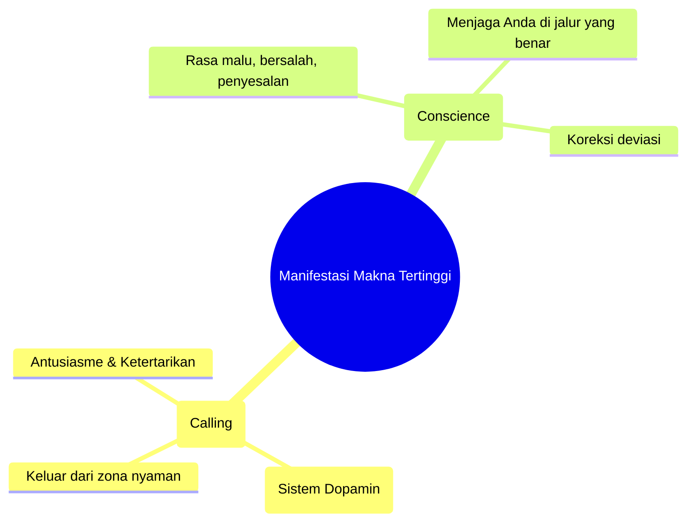

<YouTube url="https://www.youtube.com/watch?v=q8VePUwjB9Y" title="Jordan Peterson: Nietzsche, Hitler, God, Psychopathy, Suffering & Meaning | Lex Fridman Podcast #448" />

## 🌌 Pengantar: Menyelami Kedalaman Pikiran dan Makna

Dialog antara Jordan Peterson dan Lex Fridman dalam episode ke-448 ini bukanlah percakapan biasa. Ini adalah sebuah pengembaraan intelektual dan spiritual yang menyentuh akar paling dasar dari kondisi manusia (*the human condition*). Dari bedah filsafat Friedrich Nietzsche, analisis psikologi tentang kedengkian dan psikopati, hingga renungan mendalam tentang rasa sakit yang tak tertahankan dan makna hidup.

Peterson tidak hanya berbicara sebagai seorang psikolog klinis, tetapi juga sebagai seorang pemikir yang telah bergulat di ambang jurang kegelapan—baik secara intelektual saat mempelajari kejahatan (*malevolence*), maupun secara fisik saat mengalami penderitaan penyakit kronis selama tiga tahun. 

Artikel ini merangkum dan membedah secara detail setiap poin esensial dari percakapan tersebut. Siapkan waktu Anda, karena kita akan menyelam sangat dalam. 🤿

---

## 📖 1. Membaca Nietzsche: Kata, Citra, dan Tindakan

Percakapan dimulai dengan kekaguman Peterson terhadap Friedrich Nietzsche, khususnya karyanya *Beyond Good and Evil* (Melampaui Kebaikan dan Kejahatan). 

Nietzsche dikenal dengan gaya tulisannya yang sangat padat dan bersifat aforistik (*aphoristic* — pernyataan singkat yang mengandung kebenaran mendalam). Berbeda dengan buku modern yang idenya sering diulang-ulang, membaca Nietzsche berarti menghadapi kepadatan intelektual di mana setiap kalimat layak untuk digarisbawahi.

### Bagaimana Bahasa Mengubah Realitas
Peterson merujuk pada pemikiran dari buku *The User Illusion* untuk menjelaskan bagaimana komunikasi manusia bekerja secara fundamental:

> *Tujuan komunikasi bukan sekadar bertukar fakta, melainkan untuk mengubah cara lawan bicara mempersepsikan dan bertindak di dunia.*

Kata-kata (*words*) tidak memiliki makna fisik yang nyata, tetapi mereka dikelilingi oleh **awan citra** (*a cloud of images*). Penulis hebat menggunakan kata-kata untuk membangkitkan citra yang mendalam layaknya mimpi, yang kemudian didekompresi oleh pembaca menjadi **tindakan dan perubahan persepsi**.

### Persepsi Bukanlah Hal yang Pasif
Kaum empiris klasik berasumsi bahwa persepsi itu pasif (kita sekadar membuka mata dan melihat dunia, bebas dari nilai). Peterson membantah keras: **Tidak ada persepsi tanpa tindakan** (*There is no perception without action*). 

Mata kita terus bergerak untuk mengambil sampel (*sampling*) dari lingkungan. Apa yang kita pilih untuk dilihat sepenuhnya **bergantung pada tujuan dan nilai kita** (*value-saturated*). Oleh karena itu, seorang pemikir besar (seperti Nietzsche atau Dostoevsky) tidak hanya mengubah apa yang Anda pikirkan, tetapi mengubah **aksioma** dari penglihatan Anda: mereka mengubah *cara* dunia menampakkan dirinya kepada Anda.

---

## ⚔️ 2. Kekuasaan vs Kerja Sama Sukarela (Play)

Ketika sebuah ide sangat kuat (seperti Marxisme atau Nazisme), ide tersebut menembus dan menyatukan seluruh persepsi dan tindakan manusia ke dalam satu tujuan tunggal. Ini bisa mengurangi kecemasan dan meningkatkan motivasi, namun menjadi **bencana mutlak jika ide penyatu tersebut salah (patologis)**.

### Kesalahan Fatal Foucault dan Marxisme
Banyak pemikir postmodern (terutama kelompok neo-Marxis seperti Michel Foucault) memiliki asumsi dasar: **Satu-satunya prinsip yang menyatukan umat manusia adalah kekuasaan (*Power*) dan paksaan (*Compulsion*).**

Menurut Peterson, ini adalah ide yang sangat buruk dan berbahaya. Mengapa? Karena hal ini pada akhirnya membenarkan penggunaan kekuasaan Anda sendiri untuk menindas orang lain.

Nietzsche sering disalahpahami dengan konsep **"Will to Power"** (Kehendak untuk Berkuasa) yang kemudian diselewengkan oleh saudara perempuannya dan diadopsi oleh Hitler. Nietzsche sejatinya tidak memaksudkan kekuasaan untuk menindas secara tiranik. Ia memaksudkan dorongan vital manusia untuk **menguras dirinya dalam menjadi sesuatu yang lebih besar** (*becoming*), sebuah dorongan ke atas, bukan sekadar mencari rasa aman perlindungan diri (*self-protection*).

### Alternatif dari Tiran: Permainan Sukarela (*Voluntary Play*)
Jika bukan paksaan yang menyatukan manusia yang sehat, lalu apa? Jawabannya adalah **Bermain secara Sukarela** (*Voluntary Play*).

<Callout type="tip" title="Filosofi Permainan (Play)">
Bayangkan dua orang mengerjakan proyek. Anda bisa menggunakan **kekuasaan**: "Lakukan ini atau keluargamu saya bunuh." Lawan bicara pasti termotivasi, tetapi karena ketakutan. Atau, Anda bisa menggunakan **kerja sama sukarela**: menetapkan tujuan bersama di mana kedua belah pihak berkomitmen dengan antusias layaknya sedang bermain. Strategi bermain secara sukarela jauh lebih stabil, produktif, dan harmonis daripada dominasi. Permainan memiliki aturan ketat, namun ironisnya, tunduk pada aturan itulah yang justru melipatgandakan kebebasan (seperti bermain catur).
</Callout>

---

## ☠️ 3. Kematian Tuhan dan Dekonstruksi Nilai

Nietzsche terkenal dengan proklamasinya: *"Tuhan telah mati."* (*God is dead*). Namun, Peterson menekankan bahwa ini **bukanlah pernyataan kemenangan yang triumfalistik**, melainkan peringatan akan bencana (*dire warning*).

Ketika prinsip transendental yang mengarahkan dan menyatukan peradaban dihancurkan oleh rasionalisme dan pencerahan, manusia dihadapkan pada dua kemungkinan buruk:
1. **Fraksionasi & Kebingungan:** Nilai-nilai terpecah, menyebabkan tujuan yang saling berbenturan, kecemasan (*anxiety*), dan keputusasaan (*hopelessness*).
2. **Pengganti Tiranik:** Sesuatu yang lebih gelap akan bangkit dari jurang (*abyss*) untuk menjadi ideologi penyatu yang baru (Nietzsche dan Dostoevsky memprediksi ini akan muncul sebagai Komunisme/Sosialisme yang akan membunuh puluhan juta jiwa di abad ke-20).

### Ilusi "Menciptakan Nilai Sendiri" (*Ubermensch*)
Nietzsche menyarankan bahwa karena Tuhan telah mati, manusia (sebagai *Ubermensch* atau Manusia Unggul) harus **menciptakan nilainya sendiri**. 

Peterson dan para psikoanalis (seperti Freud dan Jung) melihat celah besar di sini. Bagaimana Anda bisa menciptakan nilai Anda sendiri, sementara Anda sendiri adalah sekumpulan motivasi yang saling bertentangan? **Anda bukanlah penguasa di rumah Anda sendiri.** Manusia penuh dengan nafsu, ketakutan, dan ego yang terpecah-pecah (*fractionated plurality*). Mengandalkan diri sendiri yang retak untuk menciptakan kompas moral yang menstabilkan masyarakat adalah sebuah keangkuhan intelektual (*intellectual hubris*).

---

## ⛰️ 4. Narasi Alkitab: Tuhan Sebagai Panggilan & Hati Nurani

Jika kita tidak bisa sekadar menciptakan nilai sendiri secara rasional, ke mana kita harus berpaling? Peterson menganalisis cerita-cerita kuno, seperti karya Mircea Eliade dan Carl Jung, yang merekam pola naratif yang telah "teruji skala dan waktu" (*scaled and iterated*).

Dalam pandangan neuropsikologi dan narasi agama, "Tuhan" atau Makna Tertinggi bermanifestasi dalam dua mekanisme internal yang mengarahkan kita:

### A. Panggilan Petualangan (*Calling* / *Numinous*)
Tuhan adalah suara yang memanggil Anda keluar dari zona nyaman. Contoh terbaiknya adalah kisah **Abraham** (Ibrahim). 
Abraham sudah berusia 70-an, kaya, dan nyaman. Lalu muncul "Panggilan" yang menyuruhnya meninggalkan tenda, orang tua, dan kenyamanannya untuk pergi ke dunia yang tidak diketahui. 

Apa imbalannya jika Anda mengikuti Panggilan Sejati (*True Adventure*)? Tuhan berjanji:
1. Anda menjadi berkah bagi diri Anda sendiri.
2. Anda akan dihormati secara valid oleh orang lain.
3. Anda membangun sesuatu yang bernilai permanen (menjadi bapak bangsa-bangsa).
4. Anda melakukannya dengan cara yang membawa manfaat maksimal bagi semua orang.

> *Ini adalah dorongan eksplorasi kuno (berasal dari sirkuit dopaminergik di hipotalamus—bagian otak yang sangat purba). Keluarlah ke tempat yang tidak diketahui, ambil risiko, kembangkan kemampuanmu.*

### B. Hati Nurani (*Conscience*)
Saat Anda bergerak maju, ada suara lain—suara emosi negatif (rasa bersalah, malu, penyesalan, kecemasan). Ini adalah "Hati Nurani" yang berkata: *"Jangan lakukan itu. Kamu melenceng dari jalan yang lurus dan sempit."* 

---

## 🔥 5. Iri Hati (Envy), Resentimen, dan Kesuksesan Romantis

Bagi anak muda yang baru memulai hidup, mereka merasa tidak punya apa-apa, sering gagal, dan dihadapkan pada kesuksesan orang lain. Ini memicu emosi paling beracun: **Iri Hati (Envy)**.

Peterson merujuk pada kisah **Kain dan Habel** (*Cain and Abel*). Kain gagal karena ia tidak memberikan pengorbanan terbaiknya. Alih-alih belajar dari kegagalan, ia membiarkan roh *envy* dan *resentment* (dendam/kepahitan) merasukinya. Tuhan berkata padanya, "Dosa mengintip di depan pintumu," namun Kain tetap membunuh saudaranya.

### Bagaimana Mengobati Rasa Iri?
1. **Rasa Syukur (*Gratitude*):** Mulailah dengan mensyukuri apa yang ada. Anda miskin, tapi Anda mungkin masih muda! Banyak pria tua yang sangat kaya rela menukar seluruh kekayaannya untuk mendapatkan masa muda Anda kembali. Setiap naga memiliki harta karunnya sendiri.
2. **Bandingkan Diri Anda dengan Anda di Masa Lalu:** Tolok ukur terbaik Anda bukanlah orang lain hari ini, melainkan *siapa Anda kemarin*. Pertumbuhan inkremental sifatnya eksponensial.
3. **Analisis Rasa Iri Anda:** Jika Anda iri pada seseorang, itu informasi berharga. Artinya, ada sesuatu yang Anda *inginkan*. Jangan benci orangnya, jadikan kualitasnya sebagai target pengembangan diri.

<Callout type="info" title="Dinamika Mating Market (Pasar Jodoh)">
Nilai *default* seorang pemuda 15 tahun di pasar asmara adalah **NOL**. Mengapa? Karena Anda belum bisa apa-apa. Berhentilah mengeluh atau menjadi *incel* yang sinis. 

Buku *A Billion Wicked Thoughts* (analisis data pencarian internet oleh insinyur Google) menunjukkan bahwa fantasi pornografi wanita didominasi oleh literatur/cerita dengan tokoh utama: **Bajak laut, manusia serigala, vampir, ahli bedah, dan miliarder.** Polanya adalah *Beauty and the Beast*: **Pria agresif, tangguh, dan sangat kompeten (monster), yang bisa dijinakkan oleh hubungan yang tepat.**

Bagi pemuda: Perbaiki dirimu, ambil tanggung jawab petualangan heroik, jadilah tangguh dan berguna. Korelasi antara status sosial laki-laki dan kesuksesan reproduksi (*hypergamy*) sangat tinggi (0.6)—jauh lebih tinggi dari korelasi kecerdasan dan nilai akademik.
</Callout>

---

## 🎭 6. Psikopati, Kegelapan Internet, dan "Dark Tetrad"

Pembicaraan bergeser pada lanskap dunia maya saat ini. Mengapa percakapan politik di media sosial begitu beracun? 

Peterson mendiagnosis bahwa kita sedang melihat pengaruh yang sangat tidak proporsional dari **"Dark Tetrad"** (Tetrad Gelap)—empat tipe kepribadian menyimpang yang jumlahnya hanya sekitar 3-5% dari populasi global:
1. **Machiavellian:** Manipulatif dan licik secara terstruktur.
2. **Narsistik:** Haus perhatian dan pengakuan yang tidak pantas didapatkan.
3. **Psikopati:** Parasit predator tanpa empati yang mengeksploitasi kebaikan orang lain.
4. **Sadistik:** Menikmati penderitaan orang lain.

Di dunia fisik, jika seseorang menipu kita berulang kali, reputasinya hancur dan ia akan dikucilkan. Namun, **Anonimitas** dan **Algoritma Media Sosial** (yang mengoptimalkan cengkeraman atensi jangka pendek lewat emosi negatif) memberikan psikopat-psikopat ini panggung tanpa batas. 

> *"Mereka (para troll dan psikopat) bersembunyi di balik kamuflase. Di kelompok sayap kiri, mereka berpura-pura menjadi 'sangat welas asih'. Di sayap kanan, mereka berpura-pura mengatakan 'Kristus adalah Raja' atau membela 'kebebasan berpendapat'. Kenyataannya, mereka hanyalah parasit narsistik yang mencari status di atas penderitaan dan perpecahan."*

**Catatan Lex:** Banyak *troll* mungkin sekadar anak muda yang sedang mencoba-coba "sikap sinis". Peterson setuju, mencatat bahwa banyak kriminal berhenti berbuat jahat di akhir usia 20-an (seiring matangnya korteks otak).

---

## ⚡ 7. Penderitaan Ekstrem, Pengorbanan, dan Mengubah Nasib

Bagaimana manusia menghadapi kejahatan nyata dan rasa sakit fisik yang intens?

Peterson menceritakan penderitaannya akibat penyakit autoimun/neurologis selama 3 tahun berturut-turut: rasa sakit fisik yang tiada henti, 24/7. *Setiap menit* dari 3 tahun itu terasa lebih buruk dari pengalaman terburuk dalam hidupnya. Tidur, yang biasanya menjadi tempat pelarian, menjadi musuh, karena ia tahu saat terbangun rasa sakit akan me-reset dirinya di puncak tertinggi—layaknya mitos Sisifus.

Apa yang menyelamatkannya? **Cinta dan Hubungan Keluarga.** 
Istrinya (Tammy) pada saat bersamaan menderita kanker ginjal yang sangat langka dengan peluang selamat mendekati nol. Yang memberikan Tammy harapan hidup adalah menyadari betapa dalam cinta putra mereka kepadanya.

### Menerima Penderitaan Secara Sukarela (Pengorbanan Tertinggi)
Merujuk pada Kisah **Ayub (Job)** dan **Gairah Kristus (The Passion of Christ)**, Peterson menyampaikan kebenaran psikologis yang radikal:
Penderitaan itu pasti. Kuncinya adalah tidak membiarkan penderitaan yang sewenang-wenang itu menghancurkan iman Anda pada kebaikan intrinsik hidup ini.

Lebih dari sekadar tragedi, manusia harus menghadapi **Malevolence** (niat jahat)—baik dari musuh maupun dari sisi gelap dirinya sendiri. Jika Anda dihadapkan pada ketakutan (misal: takut lift), didorong paksa ke dalam lift akan membuat trauma (*PTSD*). Namun, jika Anda **secara sukarela** melangkah menghadapi ketakutan itu, Anda bukan hanya sembuh, Anda bertransformasi menjadi pahlawan.

> *"Petualangan sejati tidak ada bedanya dengan mengambil beban dan tanggung jawab maksimal yang tersedia. 'Bring it on'. Sambutlah pergulatan itu."*

---

## 🧭 8. Makna Hidup dan Mengabdi Pada Kebenaran

Percakapan diakhiri dengan pertanyaan klasik: **Apa makna hidup?**

Peterson memberikan jawaban berlapis:

### Lapisan 1: Definisi Kehidupan (Biologis)
Hidup adalah tentang merasakan sesuatu (*feeling things*) dan bereaksi terhadapnya. Saat merasakan sensasi yang menyenangkan, kita ingin memperbanyaknya. Saat tidak menyenangkan, kita ingin menyingkirkannya.

### Lapisan 2: Kesalahan Ekspektasi Naratif
Manusia selalu menuntut agar "Makna Hidup" dijawab dalam bentuk **Sebuah Cerita** (*Story*)—sebuah drama epik lengkap dengan naskah dan peran kita di dalamnya. Peterson menekankan: **Alam semesta tidak beroperasi sebagai sebuah cerita.** Menuntut realitas untuk memberikan makna dalam bentuk drama adalah memproyeksikan ilusi manusia.

### Lapisan 3: Menghadapi Realitas Tanpa Kata
Untuk benar-benar memahami hidup, mulailah dengan pertanyaan nyata: **Apa itu penderitaan dan dari mana asalnya?**
Dan jawablah secara **Non-Verbal** (tanpa kata-kata intelektual). Lakukan pengamatan langsung terhadap pengalaman subjektif (seperti yang dilakukan dalam meditasi). Pemahaman terdalam tidak akan pernah bisa ditangkap seutuhnya oleh kata-kata.

<Callout type="abstract" title="Mengabdi pada Kebenaran (Truth)">
Peterson menganggap **Kebenaran** sebagai dewa tertinggi yang harus dihormati. Bagaimana Anda tahu Anda sedang berada di jalan kebenaran? Asumsikan bahwa jika Anda melangkah maju dengan niat baik dan berkata jujur, *apa pun* hasil yang terjadi pada Anda pada akhirnya adalah **hal terbaik yang bisa terjadi**—bahkan jika saat itu terasa menghancurkan. Menjadikan Kebenaran sebagai orientasi utama adalah komitmen moral yang mencegah kita menjadi budak atas keuntungan jangka pendek (*advantage*).
</Callout>

---

## 📚 Glosarium Istilah Kunci

| Istilah / Tokoh | Penjelasan Konteks Artikel |
|-----------------|----------------------------|
| **Friedrich Nietzsche** | Filsuf Jerman; pengkritik moralitas institusi tradisional, pencetus konsep *Übermensch*, "Tuhan telah Mati", dan "Will to Power". |
| **Dark Tetrad** | 4 sifat kepribadian gelap (Machiavellian, Narsistik, Psikopati, Sadisme) yang mendominasi dan merusak interaksi sosial online. |
| **Will to Power** | (Kehendak untuk Berkuasa). Dorongan vital manusia untuk mencapai potensi tertinggi, disalahartikan oleh fasisme sebagai hasrat menindas. |
| **Dopaminergic Tracts**| Jalur saraf kuno di otak (dari hipotalamus) yang memicu rasa motivasi, antusiasme, dan dorongan eksplorasi (*the call to adventure*). |
| **Hypergamous** | (Hipergami). Kecenderungan evolusioner (biasanya pada wanita) untuk memilih pasangan dengan status/kompetensi yang lebih tinggi untuk meredakan beban reproduksi. |
| **Overton Window** | (Jendela Overton). Rentang ide-ide yang dapat diterima dan ditoleransi oleh masyarakat umum pada suatu masa. Bermain di luar jendela ini sering dihukum. |
| **Kaum Farisi (Pharisees)** | Metafora alkitabiah untuk orang-orang munafik yang menggunakan ide-ide moral/agama terbaik hanya sebagai senjata untuk menaikkan ego atau kekuasaan pribadi. |
| **Aphoristic** | (Aforistik). Gaya penulisan yang sangat padat, singkat, namun merangkum prinsip filosofis yang dalam dan berlapis. |

---

> *"Saya ingin belajar lebih banyak dan lebih banyak lagi untuk melihat sebagai sesuatu yang indah apa yang memang tak terhindarkan (*necessary*) dalam segala hal. Maka, saya akan menjadi salah satu dari mereka yang membuat segalanya menjadi indah."* — Friedrich Nietzsche, dikutip oleh Lex Fridman di akhir *podcast*. 🌟
