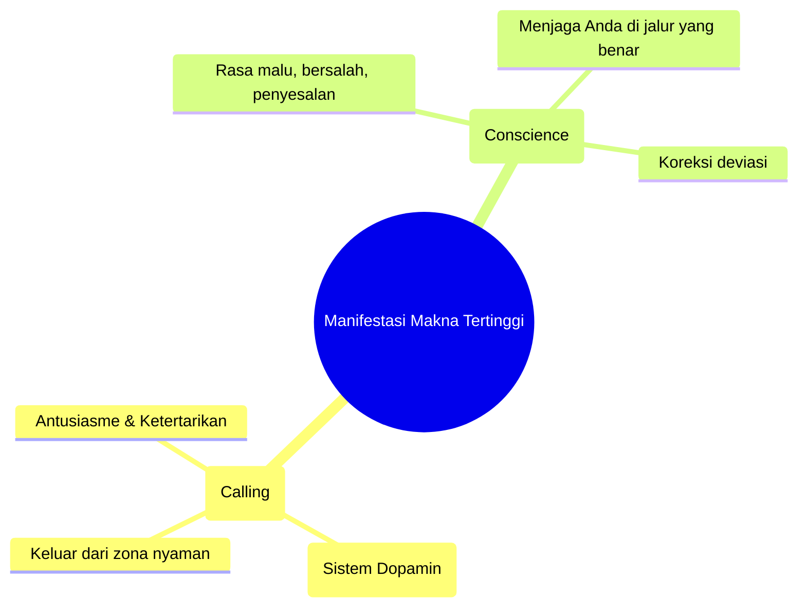

<YouTube url="https://www.youtube.com/watch?v=q8VePUwjB9Y" title="Jordan Peterson: Nietzsche, Hitler, God, Psychopathy, Suffering & Meaning | Lex Fridman Podcast #448" />

## 🌌 Pengantar: Menyelami Kedalaman Pikiran dan Makna

Dialog antara Jordan Peterson dan Lex Fridman dalam episode ke-448 ini bukanlah percakapan biasa. Ini adalah sebuah pengembaraan intelektual dan spiritual yang menyentuh akar paling dasar dari kondisi manusia (*the human condition*). Dari bedah filsafat Friedrich Nietzsche, analisis psikologi tentang kedengkian dan psikopati, hingga renungan mendalam tentang rasa sakit yang tak tertahankan dan makna hidup.

Peterson tidak hanya berbicara sebagai seorang psikolog klinis, tetapi juga sebagai seorang pemikir yang telah bergulat di ambang jurang kegelapan—baik secara intelektual saat mempelajari kejahatan (*malevolence*), maupun secara fisik saat mengalami penderitaan penyakit kronis selama tiga tahun. 

Artikel ini merangkum dan membedah secara detail setiap poin esensial dari percakapan tersebut. Siapkan waktu Anda, karena kita akan menyelam sangat dalam. 🤿

---

## 📖 1. Membaca Nietzsche: Kata, Citra, dan Tindakan

Percakapan dimulai dengan kekaguman Peterson terhadap Friedrich Nietzsche, khususnya karyanya *Beyond Good and Evil* (Melampaui Kebaikan dan Kejahatan). 

Nietzsche dikenal dengan gaya tulisannya yang sangat padat dan bersifat aforistik (*aphoristic* — pernyataan singkat yang mengandung kebenaran mendalam). Berbeda dengan buku modern yang idenya sering diulang-ulang, membaca Nietzsche berarti menghadapi kepadatan intelektual di mana setiap kalimat layak untuk digarisbawahi.

### Bagaimana Bahasa Mengubah Realitas
Peterson merujuk pada pemikiran dari buku *The User Illusion* untuk menjelaskan bagaimana komunikasi manusia bekerja secara fundamental:

> *Tujuan komunikasi bukan sekadar bertukar fakta, melainkan untuk mengubah cara lawan bicara mempersepsikan dan bertindak di dunia.*

Kata-kata (*words*) tidak memiliki makna fisik yang nyata, tetapi mereka dikelilingi oleh **awan citra** (*a cloud of images*). Penulis hebat menggunakan kata-kata untuk membangkitkan citra yang mendalam layaknya mimpi, yang kemudian didekompresi oleh pembaca menjadi **tindakan dan perubahan persepsi**.

### Penawar Nihilisme: Mircea Eliade
Peterson juga menyebut **Mircea Eliade**, sejarawan agama asal Rumania, sebagai "penawar" bagi arus postmodern nihilisme Marxis di universitas. Karya Eliade, *The Sacred and the Profane*, memiliki kepadatan yang serupa dengan mimpi (*dreamlike density*). Eliade membedah bagaimana ide-ide keagamaan bukanlah sekadar takhayul, melainkan struktur mendalam yang memberikan makna pada ruang dan waktu manusia.

### Persepsi Bukanlah Hal yang Pasif
Kaum empiris klasik berasumsi bahwa persepsi itu pasif (kita sekadar membuka mata dan melihat dunia, bebas dari nilai). Peterson membantah keras: **Tidak ada persepsi tanpa tindakan** (*There is no perception without action*). 

Mata kita terus bergerak untuk mengambil sampel (*sampling*) dari lingkungan. Apa yang kita pilih untuk dilihat sepenuhnya **bergantung pada tujuan dan nilai kita** (*value-saturated*). Oleh karena itu, seorang pemikir besar tidak hanya mengubah apa yang Anda pikirkan, tetapi mengubah **aksioma** dari penglihatan Anda: mereka mengubah *cara* dunia menampakkan dirinya kepada Anda.

---

## ⚔️ 2. Kekuasaan vs Kerja Sama Sukarela (Play)

Ketika sebuah ide sangat kuat (seperti Marxisme atau Nazisme), ide tersebut menembus dan menyatukan seluruh persepsi dan tindakan manusia ke dalam satu tujuan tunggal. Ini bisa mengurangi kecemasan dan meningkatkan motivasi, namun menjadi **bencana mutlak jika ide penyatu tersebut salah (patologis)**.

### Kesalahan Fatal Foucault dan Marxisme
Banyak pemikir postmodern memiliki asumsi dasar: **Satu-satunya prinsip yang menyatukan umat manusia adalah kekuasaan (*Power*) dan paksaan (*Compulsion*).** Menurut Peterson, ini adalah ide yang sangat buruk dan berbahaya. Mengapa? Karena hal ini pada akhirnya membenarkan penggunaan kekuasaan Anda sendiri untuk menindas orang lain.

Nietzsche sering disalahpahami dengan konsep **\"Will to Power\"** (Kehendak untuk Berkuasa). Nietzsche sejatinya tidak memaksudkan kekuasaan untuk menindas secara tiranik. Ia memaksudkan dorongan vital manusia untuk **menguras dirinya dalam menjadi sesuatu yang lebih besar** (*becoming*), sebuah dorongan ke atas, bukan sekadar mencari rasa aman perlindungan diri (*self-protection*).

### Alternatif dari Tiran: Permainan Sukarela (*Voluntary Play*)
Jika bukan paksaan yang menyatukan manusia yang sehat, lalu apa? Jawabannya adalah **Bermain secara Sukarela** (*Voluntary Play*).

<Callout type="tip" title="Filosofi Permainan (Play)">
Bayangkan dua orang mengerjakan proyek. Anda bisa menggunakan **kekuasaan**: \"Lakukan ini atau keluargamu saya bunuh.\" Lawan bicara pasti termotivasi, tetapi karena ketakutan. Atau, Anda bisa menggunakan **kerja sama sukarela**: menetapkan tujuan bersama di mana kedua belah pihak berkomitmen dengan antusias layaknya sedang bermain. Strategi bermain secara sukarela jauh lebih stabil, produktif, dan harmonis daripada dominasi. Permainan memiliki aturan ketat, namun ironisnya, tunduk pada aturan itulah yang justru melipatgandakan kebebasan (seperti bermain catur).
</Callout>

Pria-pria tangguh dan berwibawa (*formidable men*) seperti **Douglas Murray, Jocko Willink,** atau **Joe Rogan** adalah contoh orang yang memiliki \"monster\" di dalam dirinya namun mampu mengaturnya melalui prinsip keadilan dan permainan, bukan tirani.

---

## ☠️ 3. Kematian Tuhan dan Dekonstruksi Nilai

Nietzsche terkenal dengan proklamasinya: *\"Tuhan telah mati.\"* (*God is dead*). Namun, Peterson menekankan bahwa ini **bukanlah pernyataan kemenangan**, melainkan peringatan akan bencana (*dire warning*).

Ketika prinsip transendental dihancurkan, manusia dihadapkan pada dua kemungkinan buruk:
1. **Fraksionasi & Kebingungan:** Nilai-nilai terpecah, menyebabkan kecemasan (*anxiety*), dan keputusasaan (*hopelessness*).
2. **Pengganti Tiranik:** Ideologi penyatu baru (seperti Komunisme) bangkit dari jurang (*abyss*).

### Ilusi \"Menciptakan Nilai Sendiri\" (*Ubermensch*)
Nietzsche menyarankan manusia harus **menciptakan nilainya sendiri**. Peterson melihat celah besar: Bagaimana Anda bisa menciptakan nilai sendiri, sementara Anda adalah sekumpulan motivasi yang saling bertentangan? **Anda bukanlah penguasa di rumah Anda sendiri.** Mengandalkan diri sendiri yang retak untuk menciptakan kompas moral adalah sebuah keangkuhan intelektual (*intellectual hubris*).

---

## ⛰️ 4. Narasi Alkitab: Tuhan Sebagai Panggilan & Hati Nurani

Peterson menganalisis bagaimana Makna Tertinggi bermanifestasi dalam dua mekanisme internal:

### A. Panggilan Petualangan (*Calling*)
Tuhan adalah suara yang memanggil Anda keluar dari zona nyaman. Contohnya kisah **Abraham** (Ibrahim) yang disuruh meninggalkan kenyamanannya di usia 70-an untuk pergi ke dunia tak dikenal. Ini adalah dorongan eksplorasi kuno dari **hipotalamus** di otak kita. Jika Anda mengikuti panggilan sejati, Anda akan menjadi berkah bagi diri sendiri, dihormati orang lain, membangun sesuatu yang permanen, dan bermanfaat bagi semua orang.

### B. Hati Nurani (*Conscience*)
Saat Anda melenceng, muncul emosi negatif (rasa bersalah, malu). Ini adalah suara \"Hati Nurani\" yang mengoreksi deviasi Anda dari jalan yang benar.

---

## 🔥 5. Iri Hati (Envy) dan Dinamika Pasar Jodoh

Lex Fridman mengangkat poin kritis tentang **Iri Hati (Envy)** pada anak muda. Peterson merujuk pada kisah **Kain dan Habel**—Kain membunuh saudaranya karena gagal dalam pengorbanan dan membiarkan roh *envy* merasukinya.

### Bagaimana Mengobati Rasa Iri?
1. **Rasa Syukur (*Gratitude*):** Anda miskin, tapi Anda masih muda! Banyak pria tua kaya rela menukar hartanya demi masa muda Anda.
2. **Bandingkan dengan Masa Lalu:** Tolok ukur Anda adalah *siapa Anda kemarin*.
3. **Analisis Iri Anda:** Jika Anda iri pada seseorang, jadikan kualitasnya sebagai target pengembangan diri, bukan sumber kebencian.

<Callout type="info" title="Dinamika Mating Market">
Nilai *default* pria 15 tahun di pasar asmara adalah **NOL** karena belum terbukti. Fantasi pornografi wanita didominasi cerita literatur (bajak laut, vampir, ahli bedah, miliarder)—pola *Beauty and the Beast*: pria agresif dan kompeten yang dijinakkan oleh hubungan. Bagi pemuda: perbaiki dirimu, ambil tanggung jawab, jadilah berguna. Status sosial pria berkorelasi tinggi (0.6) dengan kesuksesan reproduksi.
</Callout>

### Belajar dari Robert Crumb
Peterson menyebut dokumenter **Robert Crumb**, kartunis bawah tanah yang awalnya berada di dasar hierarki mating (ditolak mentah-mentah oleh wanita). Namun, setelah ia berfokus pada seninya dan menjadi sukses, ia tiba-tiba menjadi sangat menarik bagi wanita. Ini bukti nyata bahwa petualangan heroik menciptakan daya tarik.

---

## 🎭 6. Psikopati, Kegelapan Internet, dan \"Dark Tetrad\"

Mengapa media sosial begitu beracun? Peterson mendiagnosis pengaruh **\"Dark Tetrad\"** (3-5% populasi):
1. **Machiavellian:** Manipulatif.
2. **Narsistik:** Haus perhatian.
3. **Psikopati:** Parasit tanpa empati.
4. **Sadistik:** Menikmati penderitaan orang lain.

Anonimitas internet memberi mereka panggung. Peterson menyarankan pemisahan akun **anonim** dan **terverifikasi**. Fakta pahit: **30% dari internet adalah pornografi**, dan banyak trafik internet yang murni kriminal atau didorong oleh impuls sadistik para troll.

> *\"Mereka bersembunyi di balik kata-kata mulia. Kenyataannya, mereka hanyalah parasit narsistik yang mencari status di atas penderitaan dan perpecahan.\"*

---

## 🏛️ 7. Belajar dari Sejarah: Hitler, Stalin, dan MacArthur

Peterson memberikan perspektif tajam tentang kekejaman abad ke-20:
- **Hitler vs Stalin:** Kita butuh \"monster\" untuk melawan monster? Hitler tidak akan berhenti tanpa Stalin, namun Stalin juga melakukan kekejaman masif (seperti pemerkosaan massal wanita Jerman oleh Tentara Merah).
- **Kegagalan Barat:** Barat gagal menangani bencana Komunisme sekeras mereka menangani Fasisme. Banyak mahasiswa tidak tahu tentang 6 juta orang produktif yang mati di Ukraina akibat kebijakan Soviet.
- **Douglas MacArthur:** Jenderal ini ingin menghabisi Soviet segera setelah PD2 berakhir karena ia tahu Stalin adalah ancaman sebesar Hitler.

---

## ⚡ 8. Penderitaan Ekstrem dan Mengubah Nasib

Peterson menceritakan penderitaannya akibat penyakit selama 3 tahun: rasa sakit fisik 24/7. Tidur menjadi musuh karena rasa sakit selalu \"me-reset\" di puncak tertinggi setiap pagi.

Apa yang menyelamatkannya? **Cinta dan Hubungan Keluarga.** Istrinya, Tammy, selamat dari kanker ginjal langka karena menyadari cinta mendalam putra mereka. 

### Menerima Penderitaan Secara Sukarela
Merujuk pada Kisah **Ayub** dan **Musa**, Peterson menekankan: Jika Anda dihadapkan pada ketakutan, didorong paksa akan membuat Anda trauma (*PTSD*). Namun, jika Anda **secara sukarela** menghadapinya, Anda bertransformasi menjadi pahlawan. 

---

## 🧭 9. Makna Hidup dan Kebenaran (The Truth)

Percakapan diakhiri dengan pertanyaan: **Apa makna hidup?**

### Kesalahan Ekspektasi Naratif
Manusia menuntut makna dalam bentuk **Cerita** (*Story*). Peterson menekankan: **Alam semesta tidak beroperasi sebagai sebuah cerita.** Menuntut realitas memberikan makna drama adalah ilusi.

### Menghadapi Realitas Tanpa Kata
Gunakan pertanyaan nyata: **Apa itu penderitaan dan dari mana asalnya?** Jawablah secara **Non-Verbal** lewat pengamatan langsung (meditasi).

<Callout type="abstract" title="Mengabdi pada Kebenaran (Truth)">
Peterson menganggap **Kebenaran** sebagai dewa tertinggi. Jika Anda bertindak jujur, apa pun yang terjadi pada akhirnya adalah **hal terbaik yang bisa terjadi**—bahkan jika terasa menghancurkan. Menjadikan Kebenaran sebagai kompas mencegah kita menjadi budak keuntungan jangka pendek.
</Callout>

### Perlindungan Terhadap Hak untuk Salah
Dalam diskusi di Comedy Mothership, Peterson mencatat pentingnya **kebebasan berbicara**—termasuk melindungi hak orang untuk **salah**. Tanpa ruang untuk bermain-main dengan ide yang berisiko, kita akan berakhir dalam keadaan totaliter di mana tidak ada yang berani \"bermain\".

---

## 📚 Glosarium Istilah Kunci

| Istilah | Penjelasan |
|---------|------------|
| **Dark Tetrad** | Machiavellian, Narsistik, Psikopati, Sadisme. |
| **Will to Power** | Dorongan vital untuk mencapai potensi tertinggi (bukan dominasi tiran). |
| **Aphoristic** | Pernyataan singkat yang mengandung kebenaran mendalam (gaya Nietzsche). |
| **Hypergamous** | Kecenderungan memilih pasangan dengan status lebih tinggi. |
| **Mircea Eliade** | Penulis *The Sacred and the Profane*; penawar nihilisme postmodern. |

---

> *\"Saya ingin belajar melihat sebagai sesuatu yang indah apa yang memang tak terhindarkan dalam segala hal. Maka, saya akan menjadi salah satu dari mereka yang membuat segalanya menjadi indah.\"* — Friedrich Nietzsche 🌟
