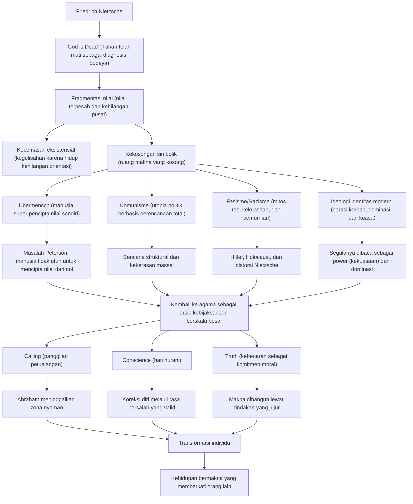
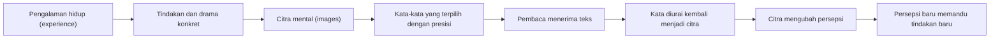
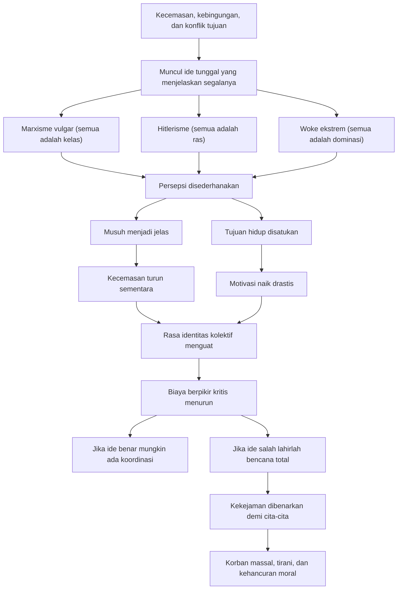
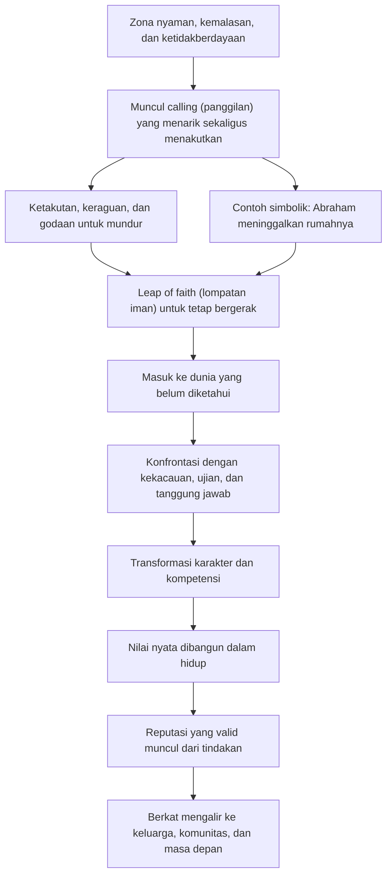
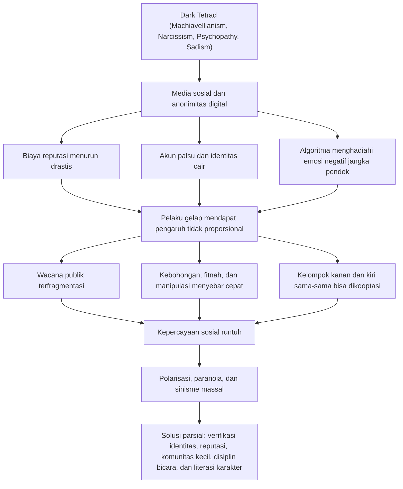
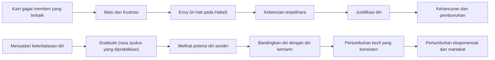

<YouTube url="https://www.youtube.com/watch?v=q8VePUwjB9Y" title="Jordan Peterson: Nietzsche, Hitler, God, Psychopathy, Suffering & Meaning | Lex Fridman Podcast #448" />

<Callout type="important" title="🎯 Tesis Utama Artikel Ini">
Percakapan Jordan Peterson dan Lex Fridman dalam episode ke-448 bukan sekadar obrolan podcast. Ini adalah peta besar tentang apa yang terjadi ketika manusia kehilangan pusat nilai, mencoba mengganti Tuhan dengan ideologi, lalu mendapati bahwa ruang kosong itu tidak pernah benar-benar kosong. Sesuatu akan mengisinya: agama, komunisme, fasisme, kultus identitas, atau komitmen pada kebenaran. Pertanyaan terpentingnya bukan apakah manusia akan menyembah sesuatu, tetapi apa yang ia sembah — dan harga psikologis serta historis apa yang harus dibayar. 🔥
</Callout>

## Pengantar: Mengapa artikel ini penting?

Ada beberapa percakapan yang tidak terasa seperti wawancara, melainkan seperti turun ke tambang ide. Episode Jordan Peterson bersama Lex Fridman ini termasuk salah satunya 🙂. Topiknya bergerak dari Friedrich Nietzsche, kematian Tuhan (*God is Dead* — “Tuhan telah mati” sebagai diagnosis budaya), komunisme, Hitler, psikopati, media sosial, Abraham, petualangan heroik, sampai penderitaan fisik ekstrem dan makna hidup. Di tangan pembicara yang dangkal, daftar ini akan terdengar seperti tumpukan topik acak. Tetapi di tangan Peterson, semuanya diikat oleh satu pertanyaan pusat: **apa yang membuat manusia tetap utuh ketika dunia runtuh?**

Peterson membaca Nietzsche bukan seperti dosen yang sedang memberi ringkasan sejarah filsafat, melainkan seperti psikolog yang sedang memeriksa bahan peledak. Nietzsche baginya bukan sekadar filsuf Jerman abad ke-19, tetapi diagnostician of culture (pendiagnosis budaya) yang melihat lebih awal bahwa modernitas sedang membunuh fondasi simbolik yang selama berabad-abad menahan kekacauan. Begitu fondasi itu retak, manusia tidak otomatis menjadi bebas. Sering kali ia justru menjadi lebih mudah dimiliki oleh ide-ide total (*totalizing ideas* — gagasan yang ingin menjelaskan segalanya dengan satu prinsip tunggal) 😶.

Artikel ini menulis ulang seluruh percakapan itu dalam bahasa Indonesia yang mendalam, sistematis, dan mudah diikuti. Setiap istilah asing diberi penjelasan di dalam tanda kurung. Setiap bagian ditautkan ke struktur besar argumentasi Peterson. Dan karena tema-temanya padat, kita akan memakai diagram, tabel, callout, dan glosarium agar pembacaan tetap jernih 📚.

---

## 1. Pengantar: Mengapa Peterson & Nietzsche?

Episode Lex Fridman Podcast #448 menjadi penting bukan hanya karena nama besar yang hadir, tetapi karena timing (momen)-nya tepat sekali. Kita hidup di era ketika banyak orang merasa kehilangan orientasi. Mereka punya informasi berlimpah, tetapi tidak punya hierarki nilai (*hierarchy of values* — susunan prioritas hidup) yang stabil. Mereka tahu seribu opini, tetapi tidak tahu harus hidup demi apa. Dalam konteks itu, Nietzsche kembali relevan, dan Peterson tampak tertarik kepadanya bukan sebagai selebritas intelektual, melainkan sebagai penulis yang berusaha menggambarkan krisis peradaban jauh sebelum krisis itu meledak luas.

Peterson menyebut bahwa ia sedang mengajar seri kuliah *Beyond Good and Evil* (Melampaui Kebaikan dan Kejahatan) di Peterson Academy. Pilihan ini menarik. Banyak orang membaca Nietzsche untuk mencari keberanian bergaya, untuk meminjam aura pemberontak, atau sekadar untuk mengutip kata-kata provokatifnya. Peterson membaca Nietzsche secara berbeda: ia melihat Nietzsche sebagai penulis yang sangat padat, sangat berbahaya, dan sangat genius. Dalam pandangannya, hampir setiap kalimat Nietzsche layak dianalisis. Bukan karena semua kalimatnya benar, tetapi karena hampir setiap kalimatnya membuka satu lapisan realitas psikologis yang biasanya tidak terlihat 👀.

Di sinilah satu poin Peterson sangat menarik: penulis besar bukan terutama orang yang memberi informasi baru, melainkan orang yang membuatmu **melihat** sesuatu yang sebelumnya ada di depan mata tetapi tak pernah benar-benar tampak. Ini sebabnya ia menempatkan Nietzsche, Fyodor Dostoevsky, dan Mircea Eliade dalam orbit yang sama. Mereka bukan sekadar penghasil gagasan. Mereka adalah pengubah struktur persepsi (*structure of perception* — cara dunia tersusun dalam kesadaran kita).

Mircea Eliade sendiri, menurut Peterson, adalah tokoh yang sangat sering diabaikan. Padahal Eliade penting karena ia menunjukkan bahwa pengalaman religius bukan residu primitif dari masa lalu, melainkan mode orientasi manusia terhadap yang sakral (*the sacred* — dimensi realitas yang dialami sebagai bermakna tertinggi). Peterson bahkan merekomendasikan Eliade sebagai *antidote to postmodern nihilistic Marxist interpretation* (penawar terhadap tafsir postmodern yang nihilistik dan Marxis). Maksudnya cukup jelas: bila semua hal direduksi menjadi permainan kekuasaan, dominasi, dan konstruksi sosial, maka manusia kehilangan akses pada kedalaman simbolik yang membuat hidup bisa ditanggung.

Di sinilah Peterson memberi salah satu tesis terkuatnya: **penulisan hebat adalah penulisan yang membangkitkan gambaran** (*images* — citra mental), dan gambaran itu mengubah persepsi, lalu mengubah tindakan. Jadi tulisan yang besar bukan tulisan yang sekadar “memberi tahu”. Tulisan yang besar “menginstal” cara melihat yang baru. Begitu cara melihat berubah, pilihan tindakan juga berubah 🙂.

<Callout type="info" title="🧭 Konteks Besar Episode Ini">
Kalau disederhanakan, percakapan ini bergerak melalui satu rantai besar: Nietzsche mendiagnosis kematian Tuhan, kematian Tuhan membuka krisis nilai, krisis nilai menciptakan ruang bagi ideologi total, ideologi total melahirkan kekerasan massal, dan Peterson mencoba menawarkan jalan keluar melalui agama, petualangan, komunitas, tanggung jawab, serta komitmen pada kebenaran.
</Callout>

### Peta Ide Besar Peterson

---

## 2. Cara Menulis & Berkomunikasi Tingkat Tinggi

Salah satu bagian paling cemerlang dari percakapan ini adalah ketika Peterson membahas bagaimana tulisan besar bekerja. Ia menggambarkan proses komunikasi yang jauh lebih hidup daripada model sederhana “pengirim pesan → penerima pesan”. Menurut Peterson, penulis hebat melakukan sesuatu yang jauh lebih misterius: mereka **compress** (memampatkan) pengalaman, tindakan, drama, dan gambaran ke dalam kata-kata. Lalu pembaca yang baik **decompress** (membuka kembali) kata-kata itu menjadi gambaran, lalu menjadi orientasi tindakan. Jadi bahasa bukan sekadar kendaraan fakta; bahasa adalah alat untuk menstrukturkan kemungkinan tindakan 🧠.

Ini sangat penting. Banyak orang mengira kata-kata hanya menamai dunia. Peterson justru menekankan bahwa kata-kata dapat menyalakan dunia. Sebuah kalimat dari Nietzsche, Dostoevsky, atau Eliade tidak berhenti sebagai isi pikiran. Kalimat itu menjadi lensa. Dan begitu lensa berganti, benda yang sama tampak berbeda. Contohnya sederhana: dua orang bisa berada dalam ruangan yang sama, melihat situasi yang sama, tetapi karena tujuan mereka berbeda, mereka “melihat” dunia yang berbeda.

Peterson lalu menautkan ini ke teori persepsi. Persepsi bukan proses pasif. Mata tidak sekadar menangkap realitas seperti kamera statis. Mata bergerak terus, tubuh mengorientasikan perhatian, dan otak memilih apa yang disampel berdasarkan tujuan. Artinya, di dalam persepsi sudah ada tindakan. Kita melihat sesuai dengan apa yang penting bagi kita. Kita tidak pernah benar-benar netral. Bahkan perhatian adalah bentuk tindakan laten (*latent action* — tindakan yang belum tampil penuh, tetapi sudah bekerja di tingkat orientasi).

Implikasinya sangat besar 🙂. Penulis seperti Nietzsche, Dostoevsky, dan Eliade tidak hanya mengubah cara berpikir, tetapi mengubah cara **melihat**. Mereka menggeser struktur relevansi (*relevance structure* — pola tentang apa yang dianggap penting) dalam diri pembaca. Setelah membaca mereka, hal-hal tertentu tampak bercahaya, sementara hal-hal lain tampak tipis dan palsu.

Peterson menyebut *The User Illusion* (Ilusi Pengguna) sebagai salah satu buku terbaik tentang kesadaran. Mengapa? Karena buku itu membantu menjelaskan bahwa kesadaran bukan pusat kendali absolut yang transparan bagi dirinya sendiri. Ada proses bawah sadar yang jauh lebih besar, dan kesadaran sering hanya melihat hasil akhirnya. Ini memperkuat intuisi Peterson bahwa manusia tidak pernah sesederhana makhluk rasional yang sepenuhnya tahu apa yang sedang ia lakukan.

<Callout type="quote" title="✍️ Formula Komunikasi Tingkat Tinggi">
Penulis hebat memampatkan pengalaman menjadi citra, citra menjadi kata, lalu pembaca membuka kata menjadi citra, dan citra itu menjadi tindakan. Karena itu, tulisan terbaik bukan sekadar informatif. Ia transformatif 😊.
</Callout>

### Skema Penulisan Besar Menurut Peterson

---

## 3. Ide Propagandistik sebagai “Kepemilikan” (*Possession* — kerasukan oleh ide)

Peterson berkali-kali kembali pada gagasan bahwa ide yang kuat dapat memiliki manusia. Ia memakai bahasa yang hampir religius: possession (kerasukan). Maksudnya bukan selalu kerasukan mistik secara literal, melainkan situasi ketika satu ide menyerap hampir seluruh sistem motivasi manusia menjadi satu singularitas. Dalam keadaan normal, manusia punya banyak tujuan yang saling bersaing: ingin aman, ingin dicintai, ingin dihormati, ingin bebas, ingin nyaman, ingin berkembang. Banyak konflik internal lahir dari benturan tujuan-tujuan ini. Tetapi ketika satu ide total muncul, semua konflik itu tampak terselesaikan. Semua energi diarahkan ke satu tujuan. Kecemasan turun. Motivasi naik. Hidup terasa jelas. Dan di situlah bahayanya 😶.

Ide propagandistik bekerja karena ia memberi kesatuan yang murah. Ia menawarkan simplifikasi radikal. Hitler melakukannya melalui narasi ras dan kebangkitan nasional. Marx dan para penerus ideologisnya melakukannya melalui narasi kelas. Ideologi “woke” (kerangka politik identitas progresif yang menafsirkan dunia terutama lewat penindasan struktural) dalam versi ekstrem, menurut Peterson, juga melakukan hal yang sama: semua fenomena dibaca melalui satu kunci, yakni kuasa (*power* — kekuasaan), dominasi, dan paksaan.

Peterson menyebut bahwa tidak ada ide yang lebih berbahaya daripada ide bahwa segala sesuatu pada dasarnya hanyalah paksaan dan dominasi. Mengapa? Karena begitu kau percaya itu, maka permainan sukarela, cinta, pengorbanan, dialog, rasa syukur, kesetiaan, dan pencarian kebenaran semua direduksi menjadi topeng. Pada titik itu, sinisme menjadi filsafat resmi. Dan ketika sinisme menjadi filsafat resmi, kekejaman bisa dibenarkan sebagai “membalas kekerasan yang selalu sudah ada” 😬.

Di sini Peterson membuat pembedaan penting antara *Will to Power* (Kehendak untuk Berkuasa) ala Nietzsche dan konsep kekuasaan ala Foucault/Marx yang dipopulerkan dalam pembacaan postmodern. *Will to Power* bagi Peterson bukan pertama-tama dorongan untuk menindas. Itu adalah dorongan untuk mengekspresikan diri, untuk menjadi (*becoming* — proses menjadi), untuk mengaktualkan potensi, untuk menaik ke level eksistensi yang lebih tinggi. Itu lebih dekat ke kreativitas, pembentukan diri, dan perluasan kapasitas daripada sekadar dominasi politik.

Masalahnya, ide besar selalu punya potensi disederhanakan oleh penafsir yang lapar kekuasaan. Ketika konsep yang halus diterjemahkan menjadi slogan massa, ia berubah dari alat diagnosis menjadi senjata mobilisasi 😕.

<Callout type="warning" title="⚠️ Mengapa Ide Total Sangat Menarik?">
Karena ide total menyatukan hidup yang kacau menjadi satu arah. Ia memberi identitas, musuh, makna, rasa benar, dan energi. Itulah sebabnya orang bisa rela menyerahkan kebebasan berpikir demi kepastian moral yang palsu.
</Callout>

### Anatomi Ide Pemersatu

---

## 4. Übermensch (*manusia super*) — Interpretasi & Kesalahpahaman

Tidak ada konsep Nietzsche yang lebih terkenal, lebih memikat, dan lebih sering disalahpahami daripada *Übermensch* (manusia super atau manusia yang melampaui). Dalam struktur besar pemikiran Nietzsche, *Übermensch* muncul sebagai jawaban terhadap krisis yang tercipta setelah kematian Tuhan. Jika pusat nilai lama hancur, lalu siapa yang menciptakan nilai baru? Jawaban Nietzsche, secara kasar, adalah manusia yang mampu melampaui massa, melampaui moralitas kawanan (*herd morality* — moralitas ikut-ikutan), dan menciptakan nilai bagi dirinya sendiri.

Sekilas ini terdengar heroik. Peterson bahkan mengakui bahwa Nietzsche sangat tajam dalam mengkritik *Sklavenmoral* (moralitas budak) atau *slave morality* (moralitas yang menjadikan kelemahan sebagai kebajikan). Nietzsche melihat bahwa manusia bisa menyebut dirinya “baik” bukan karena sungguh luhur, tetapi karena lemah, takut, dan tidak mampu bertindak. Dalam hal ini, Peterson setuju bahwa banyak moralitas hanyalah pengecut yang menyamar sebagai kebajikan 😶.

Tetapi Peterson menilai solusi Nietzsche gagal. Mengapa? Karena manusia tidak bisa menciptakan nilai dari nol, sendirian, dari dirinya sendiri, seolah-olah ia adalah legislator ilahi yang sepenuhnya sadar dan utuh. Problemnya bukan hanya epistemologis (soal tahu atau tidak tahu), tetapi antropologis (soal seperti apa manusia itu sebenarnya). Manusia bukan satu suara. Ia adalah arena konflik motivasi. Jadi ketika Nietzsche berkata bahwa manusia superior akan mencipta nilai, Peterson bertanya: **yang mana dari dirimu yang mencipta?** Yang mulia? Yang dendam? Yang lapar status? Yang trauma? Yang narsistik?

Kesalahpahaman historis paling fatal tentu terjadi pada Hitler dan Nazisme. Dalam tangan Hitler, *Übermensch* direduksi menjadi ras Arya unggul, sementara *Untermensch* (manusia bawah atau manusia inferior) dijadikan kategori dehumanisasi. Dari sana jalannya lurus menuju Holocaust. Peterson menekankan bahwa ini adalah distorsi mengerikan. Distorsi itu juga diperparah oleh Elisabeth Förster-Nietzsche, saudara Nietzsche, yang memang punya peran besar dalam mengemas, menyunting, dan memanipulasi warisan intelektual Nietzsche agar lebih mudah dibaca secara proto-Nazi. Jadi relasi Nietzsche dan Hitler tidak sederhana. Tetapi tetap saja, bagi Peterson, ada celah dalam Nietzsche yang membuat penyalahgunaan ini lebih mungkin terjadi 😬.

Masalah terdalamnya tetap sama: jika manusia benar-benar kehilangan Tuhan sebagai pusat transenden, lalu menggantinya dengan dirinya sendiri sebagai pembuat nilai, ia mungkin bukan menjadi dewa kecil. Ia mungkin justru menjadi tiran kecil.

<Callout type="danger" title="☠️ Distorsi Mematikan Nietzsche">
Hitler membaca kebutuhan akan nilai baru sebagai legitimasi untuk menciptakan hirarki rasial. Di situlah bahasa tentang “melampaui” berubah menjadi bahasa tentang “memusnahkan”. Ketika nilai diputus dari martabat manusia universal, jalan menuju kamp konsentrasi terbuka lebar 😔.
</Callout>

---

## 5. Kematian Tuhan & Konsekuensinya

Ungkapan Nietzsche *God is Dead* (Tuhan telah mati) sering dibaca secara dangkal, seolah-olah Nietzsche sedang bersorak karena agama akhirnya kalah oleh ilmu pengetahuan. Peterson menolak pembacaan itu. Bagi Peterson, Nietzsche sedang meniup alarm 🚨. Ia bukan merayakan kemenangan, tetapi mengumumkan bencana psikologis dan sosial yang akan menyusul ketika pusat pemersatu nilai hancur.

Dalam pembacaan Peterson, “Tuhan” di sini bukan hanya objek teologis abstrak, tetapi prinsip pemersatu tertinggi dalam kehidupan psikologis dan sosial. Tuhan adalah poros yang membuat berbagai hasrat, hierarki, pengorbanan, dan harapan bisa diorientasikan ke satu arah. Kalau poros itu dihancurkan oleh rasionalisme (*rationalism* — keyakinan bahwa nalar formal cukup menjadi dasar utama pengetahuan) dan empirisisme (*empiricism* — keyakinan bahwa pengalaman inderawi adalah dasar pengetahuan), maka dua hal bisa terjadi.

Pertama, nilai terfragmentasi. Manusia tidak lagi tahu mengapa satu hal lebih tinggi dari yang lain. Akibatnya muncul kecemasan, kehilangan motivasi, dan keputusasaan. Kedua, sesuatu yang lain akan muncul dari jurang untuk menggantikan fungsi religius itu. Dan “sesuatu” ini sangat mungkin lebih kejam daripada agama yang ia gantikan 😶.

Peterson menegaskan bahwa Nietzsche melihat lebih awal bahaya ini. Ia bahkan mengaitkannya dengan ramalan Nietzsche tentang kekerasan besar yang akan lahir dari eksperimen ideologis abad ke-20. Dalam pembacaan Peterson, komunisme adalah salah satu pengganti Tuhan yang paling mematikan. Ia mengklaim memberi keselamatan historis melalui politik. Dan justru karena sifatnya pseudo-religious (meniru fungsi agama), ia bisa menuntut iman total, pengorbanan total, dan kekerasan total.

Dostoevsky, dalam *Demons* (Setan-Setan), juga melihat ancaman serupa. Novel itu adalah laboratorium psikologis tentang apa yang terjadi ketika ide-ide abstrak masuk ke jiwa yang tidak matang secara moral. Orang-orang di sana tidak jahat hanya karena mereka punya teori. Mereka jahat karena teori memberi pembenaran luhur untuk dorongan destruktif yang sudah ada di dalam mereka 😬.

<Callout type="cite" title="📜 Intuisi Besar Nietzsche Menurut Peterson">
Jika Tuhan mati sebagai pusat nilai, manusia tidak otomatis menjadi rasional dan baik. Ia justru terancam menjadi terpecah di dalam dirinya sendiri, lalu siap menyerahkan dirinya kepada ide pengganti yang menjanjikan kejelasan, kesatuan, dan penebusan sejarah.
</Callout>

---

## 6. Masalah Fundamental Nietzsche: Siapa yang Menciptakan Nilai?

Pertanyaan ini adalah pisau bedah utama Peterson terhadap Nietzsche. Mari kita andaikan Nietzsche benar bahwa setelah kematian Tuhan manusia harus menciptakan nilai-nilai baru. Sekarang pertanyaannya: siapa tepatnya “manusia” itu? Apakah ia makhluk yang utuh, transparan pada dirinya sendiri, mampu menimbang seluruh motifnya, lalu merancang struktur nilai secara sadar? Peterson menjawab: jelas tidak.

Di sini Peterson mendekat ke Sigmund Freud. Freud datang setelah Nietzsche, tetapi menguatkan satu kebenaran yang sudah dirasakan Nietzsche: **kamu bukan tuan di rumahmu sendiri**. Ada ketidaksadaran (*unconscious* — lapisan psikis yang bekerja di luar kesadaran langsung) yang menguasai, mendorong, menipu, dan kadang merasionalisasi tindakanmu. Jadi ide bahwa manusia bisa begitu saja berdiri seperti arsitek netral lalu mendesain nilai dari nol adalah bentuk *intellectual hubris* (kesombongan intelektual) 😅.

Peterson lalu memperluas kritik ini ke Marx, para komunis, dan bahkan transhumanis modern. Mereka semua, dalam kadar berbeda, tergoda oleh ilusi rekayasa total. Seolah manusia adalah material mentah yang bisa didesain ulang dari atas. Seolah sejarah, tubuh, insting, tradisi, ritual, dan simbol hanyalah residu lama yang bisa dibuang lalu diganti dengan sistem baru yang lebih “rasional”. Peterson melihat ini sebagai fantasi yang sangat berbahaya.

Ia lalu memakai Taman Eden sebagai metafora. Allah memberi manusia kebebasan yang hampir tak terbatas, kecuali satu larangan. Apa maknanya? Bahwa realitas moral tidak sepenuhnya arbitrer. Ada tatanan implisit. Ada struktur makna yang tidak diciptakan seenaknya oleh kehendak manusia. Manusia boleh berkreasi, menjelajah, menamai dunia, membangun kebudayaan — tetapi ia tidak bebas menghapus struktur moral dasar tanpa konsekuensi.

Jadi bagi Peterson, kelemahan terbesar Nietzsche bukan pada kritiknya, melainkan pada alternatifnya. Nietzsche terlalu cepat berharap bahwa manusia luar biasa akan bisa menggantikan fungsi pusat transenden. Peterson lebih pesimistis terhadap kapasitas manusia individual, dan justru karena itu lebih menghargai tradisi simbolik yang telah diuji ribuan tahun 🙏.

<Callout type="important" title="🧠 Kritik Inti Peterson terhadap Übermensch">
Masalahnya bukan hanya “nilai apa yang harus diciptakan”, tetapi “siapa dalam dirimu yang sedang menciptakan nilai itu”. Jika diri sendiri sudah terpecah, maka proyek penciptaan nilai dari nol bisa berubah menjadi rasionalisasi dorongan paling gelap dalam diri.
</Callout>

---

## 7. Komunisme: Mengapa Gagal (Analisis Teknik)

Salah satu kekuatan Peterson adalah ia tidak hanya mengkritik komunisme secara moral, tetapi juga secara teknis. Menurutnya, komunisme bukan gagal semata-mata karena para pemimpinnya jahat, walaupun banyak di antaranya memang brutal. Komunisme gagal secara **struktural**. Artinya, ada cacat pada desain sistem itu sendiri.

Masalah pertama adalah kompleksitas. Interaksi sosial manusia terlalu rumit untuk direncanakan secara terpusat. Di pasar, jutaan orang mengambil keputusan lokal berdasarkan pengetahuan spesifik yang tersebar. Siapa butuh apa, kapan, dalam kualitas seperti apa, dengan harga berapa, dan dalam konteks logistik mana — informasi ini tidak pernah benar-benar terkumpul di satu pusat. Peterson menyebut pasar bebas sebagai *distributed network of cognition* (jaringan kognisi terdistribusi). Artinya, pasar bukan cuma mekanisme ekonomi, tetapi sistem pemrosesan informasi skala besar 📈.

Sebaliknya, perencana pusat harus menebak terlalu banyak hal. Peterson memberi gambaran tentang otoritas Soviet yang harus membuat ratusan keputusan harga per hari. Masalahnya bukan sekadar banyak. Masalahnya adalah mustahil. Tidak ada otak, birokrasi, atau komite yang sanggup menggantikan jutaan penyesuaian mikro yang terjadi secara spontan di masyarakat.

Ini sebabnya slogan *real communism has never been tried* (komunisme sejati belum pernah dicoba) terdengar kosong bagi Peterson. Setiap kali ide itu diimplementasikan dalam skala peradaban besar, hasilnya berulang: kelangkaan, represi, kebohongan birokratis, polisi rahasia, pembunuhan, dan kehancuran. Pola berulang ini justru menunjukkan bahwa masalahnya ada di level struktur, bukan hanya di level personel.

Peterson juga menambahkan nuansa penting: bentuk komunalisme kecil mungkin bekerja di keluarga, biara, atau kelompok suku kecil. Mengapa? Karena di skala kecil, hubungan personal, reputasi, dan kedekatan emosional menggantikan kebutuhan kalkulasi formal yang masif. Tetapi model itu tidak bisa diskalakan ke negara modern berpenduduk ratusan juta. Begitu diskala, ia butuh pusat kendali. Dan pusat kendali itulah yang melahirkan tirani 😬.

### Tabel Perbandingan Sistem Nilai

| Aspek | Nietzsche's Übermensch (manusia super pencipta nilai) | Komunisme/Marxisme (kolektivisme revolusioner) | Kekristenan/Agama (tatanan simbolik transenden) |
|---|---|---|---|
| Aksioma dasar | Nilai lama runtuh, individu unggul harus mencipta nilai baru | Sejarah digerakkan konflik kelas dan harus ditebus lewat revolusi | Nilai tertinggi berasal dari tatanan yang melampaui ego individual |
| Solusi untuk kekacauan nilai | Individu kuat menjadi legislator makna | Negara/partai mengorganisasi distribusi, produksi, dan masa depan | Tradisi, ritus, narasi, dan pengorbanan menata hidup bersama |
| Pusat legitimasi | Diri yang melampaui kawanan | Kolektivitas historis dan partai avant-garde (pelopor revolusi) | Tuhan, wahyu, hukum moral, dan teladan suci |
| Risiko utama | Ego kreatif berubah jadi ego tiranik | Perencanaan total berubah jadi represi total | Institusi bisa membatu, munafik, atau korup |
| Hasil historis | Brilian sebagai diagnosis, problematik sebagai solusi praktis | Berulang kali melahirkan kelangkaan, kebohongan, dan pembantaian | Mampu bertahan lintas abad, tetapi selalu butuh pembaruan moral |
| Kritik Peterson | Manusia terlalu terpecah untuk mencipta nilai dari nol | Gagal secara struktural karena kompleksitas tak bisa dipusatkan | Kritik Nietzsche sering salah sasaran pada patologi agama, bukan inti Injil |
| Nilai plus menurut Peterson | Tajam membongkar kepalsuan moral | Peka pada ketimpangan dan eksploitasi nyata | Skalabel, stabil, simbolik, memberi orientasi makna jangka panjang |

<Callout type="danger" title="🧱 Mengapa Komunisme Runtuh Berulang Kali?">
Karena sistem itu ingin menggantikan pengetahuan terdistribusi di masyarakat dengan keputusan pusat. Begitu pengetahuan hidup diganti formulir, statistik, dan ketakutan birokratis, ekonomi membusuk dan moralitas ikut rusak.
</Callout>

---

## 8. Agama vs Komunisme: Mana yang Lebih “Skalabel”?

Ini salah satu pertanyaan paling menarik dalam episode tersebut. Peterson tidak membela agama semata-mata karena “tradisi lama harus dihormati”. Ia justru melihat agama sebagai sesuatu seperti *compressed civilizational wisdom* (kebijaksanaan peradaban yang dimampatkan). Ini terdengar hampir seperti teori evolusi budaya. Ide-ide religius yang mampu bertahan lintas ribuan tahun, lintas benua, lintas bahasa, dan lintas rezim politik kemungkinan besar bertahan karena mereka **bekerja** dalam arti tertentu.

Mircea Eliade, Carl Jung, dan Joseph Campbell penting di sini. Mereka semua, dengan cara berbeda, mempelajari pola narasi yang bertahan lama. Campbell menulis tentang *Hero's Journey* (perjalanan pahlawan), Jung tentang arketipe (*archetype* — pola simbolik universal dalam jiwa), Eliade tentang sakral dan profan. Peterson membaca semuanya sebagai bukti bahwa manusia bukan makhluk yang bisa hidup hanya dengan kalkulasi utilitarian sederhana. Kita butuh drama makna, ritus transisi, figur teladan, dan orientasi vertikal ke atas ✨.

Peterson bahkan mengaitkan *Hero's Journey* dengan arsitektur neurologis. Hipotalamus, sistem dopaminergik (*dopaminergic system* — jaringan saraf yang terkait motivasi, pencarian, dan antisipasi imbalan), serta dorongan eksplorasi tampak selaras dengan struktur naratif petualangan: ada panggilan, ada ketidakpastian, ada risiko, ada transformasi, dan ada harta yang dibawa pulang bagi komunitas.

Dalam arti ini, agama lebih skalabel daripada komunisme. Mengapa? Karena agama punya inti aturan yang ketat, tetapi ruang permainan yang luas. Peterson memakai analogi permainan seperti catur ♟️. Aturan dasarnya kaku. Namun justru karena aturan dasar itu tetap, kemungkinan permainan di dalamnya tak terbatas. Begitu pula agama: ada aksioma dasar, tetapi di dalam kerangka itu manusia bisa berkreasi, berkeluarga, berdagang, berdoa, membangun seni, dan membentuk peradaban.

Komunisme, sebaliknya, cenderung tidak memberi ruang permainan semacam itu. Ia terlalu cepat ingin menyerap seluruh ruang spontan ke dalam desain politik. Karena itu ia tampak rapih di atas kertas, tetapi membunuh kehidupan nyata di lapangan.

<Callout type="success" title="🌱 Mengapa Agama Bertahan?">
Peterson melihat agama sebagai arsip ide-ide yang sudah diuji berkali-kali oleh realitas manusia. Bukan semua detailnya selalu sempurna, tetapi struktur simbolik utamanya telah lolos dari seleksi sejarah jauh lebih lama daripada ideologi modern mana pun 🙂.
</Callout>

---

## 9. Tuhan sebagai Panggilan Petualangan: Kisah Abraham

Di antara semua kisah Alkitab yang dibahas Peterson, Abraham menempati posisi istimewa. Baginya, Abraham adalah individu pertama yang sungguh modern dalam narasi kitab suci. Mengapa? Karena ia dipanggil secara personal untuk meninggalkan zona nyaman dan masuk ke yang belum diketahui. Ini adalah struktur dasar petualangan heroik.

Tuhan berkata, secara esensial: tinggalkan rumahmu, tinggalkan tanahmu, tinggalkan kepastianmu, dan berjalanlah. Peterson membaca ini bukan hanya sebagai kisah historis-religius, tetapi sebagai model eksistensial. Manusia dipanggil oleh sesuatu yang lebih tinggi dari kenyamanan. Kalau ia menjawab panggilan itu, maka hidupnya akan diubah.

Peterson merangkum logika *covenant* (perjanjian) Abrahamik seperti ini. Jika kamu mengikuti panggilan petualangan yang sejati, maka beberapa hal cenderung terjadi. Pertama, hidupmu akan menjadi berkat bagimu sendiri. Kedua, reputasimu akan diakui orang lain secara valid, bukan sekadar karena pencitraan. Ketiga, kamu akan membangun sesuatu yang permanen dan bernilai. Keempat, semua itu pada akhirnya juga akan bermanfaat bagi orang lain. Ini bukan janji hidup tanpa rasa sakit. Ini janji bahwa risiko yang bermakna lebih baik daripada keamanan yang membusuk 🙏.

Di sini Peterson bersentuhan dengan Dostoevsky, terutama *Notes from Underground* (Catatan dari Bawah Tanah). Dostoevsky menunjukkan bahwa manusia bukan makhluk yang cuma mencari kenyamanan. Jika semua kebutuhan materialnya dipenuhi dan hidup menjadi terlalu terprediksi, manusia bahkan bisa sengaja merusaknya hanya agar sesuatu yang menarik terjadi. Peterson memakai intuisi ini untuk menjelaskan mengapa proyek sosial yang menjanjikan kenyamanan total sering salah membaca jiwa manusia. Kita tidak hanya menginginkan kenyamanan. Kita menginginkan drama bermakna.

### Jalur Petualangan Heroik

<Callout type="quote" title="🕊️ Abraham sebagai Pola Eksistensial">
Bagi Peterson, Tuhan dalam kisah Abraham bukan hanya “objek kepercayaan”, tetapi suara panggilan yang mengatakan: keluar, ambil risiko yang benar, dan bangun dunia yang lebih baik meski jalannya belum terlihat penuh.
</Callout>

---

## 10. *Slave Morality* (moralitas budak) vs *Master Morality* (moralitas tuan)

Nietzsche terkenal karena membelah moralitas menjadi dua. *Master morality* (moralitas tuan) adalah moralitas yang lahir dari kekuatan, kepercayaan diri, afirmasi hidup, dan kemampuan mencipta. *Slave morality* (moralitas budak) adalah moralitas yang lahir dari ressentiment (kedengkian reaktif yang menumpuk), kelemahan, dan pembalikan nilai: hal-hal yang tak bisa dilakukan lalu dinyatakan buruk, sementara kelemahan diri dinyatakan baik.

Peterson menganggap Nietzsche sangat akurat ketika membongkar fenomena ini. Ia setuju bahwa banyak orang menyebut dirinya “baik” padahal sebenarnya hanya tidak mampu menjadi berbahaya. Tetapi Peterson tidak setuju ketika Nietzsche menafsirkan Kekristenan secara keseluruhan sebagai *slave morality*. Menurut Peterson, Nietzsche salah sasaran. Apa yang dia kritik sering kali adalah patologi agama institusional — kemunafikan, kelemahan, moralitas pura-pura — bukan Injil itu sendiri.

Bagi Peterson, figur Kristus justru bukan lambang ketidakberdayaan sentimental. Kristus adalah model pengorbanan sukarela, keberanian moral, dan konfrontasi terhadap kejahatan. Ini bukan kelemahan; ini bentuk kekuatan yang tertinggi. Karena itu Peterson menekankan satu kalimat penting: **orang baik harus formidable** (tangguh, kuat, bahkan menakutkan bila perlu). Orang yang benar-benar baik bukan orang yang tak punya taring, melainkan orang yang punya kapasitas untuk melukai tetapi memilih mengendalikannya 😮.

Peterson lalu mengaitkan kritik Nietzsche dengan fenomena “woke” modern. Menurutnya, banyak aktivisme moral kontemporer sebenarnya adalah *slave morality* versi sekuler. Ia memakai bahasa empati, keadilan, dan kepedulian, tetapi sering menyimpan kebencian, iri hati, dan dorongan penghukuman di bawah permukaan. Dalam konteks ini, Nietzsche ternyata tetap relevan sebagai diagnostician of resentment (pendiagnosis kedengkian).

<Callout type="warning" title="🦂 Poin Sulit tetapi Penting">
“Baik” dan “tidak berbahaya” bukan hal yang sama. Seseorang bisa sama sekali tidak berbahaya karena lemah, takut, dan tidak kompeten. Itu bukan kebajikan. Kebajikan sejati muncul ketika kekuatan tunduk pada disiplin moral.
</Callout>

---

## 11. Bagaimana Membedakan Pemimpin Baik vs Psikopat?

Di sinilah percakapan menjadi sangat praktis. Kita semua tahu bahwa ide-ide baik dapat dipakai untuk tujuan jahat. Peterson menyebut ini sebagai *Pharisees Problem* (masalah Farisi): ide terbaik selalu bisa disalahgunakan oleh aktor terburuk. Bahasa keadilan bisa dipakai penindas. Bahasa kasih bisa dipakai manipulator. Bahasa rakyat bisa dipakai tiran. Jadi pertanyaan pentingnya bukan hanya “apa idenya?”, tetapi “siapa yang membawanya, dan bagaimana ia menanggung konsekuensinya?”

Peterson memberi satu kriteria besar: orang yang memegang ide secara valid akan menanggung beban ide itu pada dirinya sendiri. Ia tidak sekadar mengeksternalisasi biaya ke orang lain. Ia membayar harga yang ia tuntut. Inilah mengapa kisah Kristus begitu sentral baginya. Kristus tidak menyuruh orang lain menanggung pengorbanan yang tidak ia tanggung sendiri. Prinsip pengorbanan diri menjadi pembeda antara pemimpin sah dan parasit moral.

Ini sangat kontras dengan psikopat politik. Psikopat senang memakai idealisme sebagai kamuflase. Mereka bicara seolah memperjuangkan masa depan, rakyat, keadilan, atau revolusi. Namun biaya nyata selalu dibayar oleh orang lain. Itulah sinyal paling kuat bahwa ada sesuatu yang salah.

Peterson juga mengutip Aleksandr Solzhenitsyn: garis antara baik dan jahat melewati hati setiap individu. Ini penting agar kritik terhadap psikopat tidak berubah jadi moralitas simplistis yang membagi dunia menjadi malaikat dan monster. Siapa pun bisa tergoda oleh narsisme, kekuasaan, dendam, dan fanatisme. Bedanya, sebagian orang belajar mengakuinya dan membatasinya. Sebagian lagi menobatkannya menjadi identitas 😬.

<Callout type="important" title="🔍 Uji Keaslian Pemimpin">
Lihat apakah ia menanggung konsekuensi dari prinsip yang ia khotbahkan. Jika semua penderitaan selalu dialihkan ke bawahan, rakyat, lawan, atau “musuh sejarah”, besar kemungkinan yang Anda lihat bukan kepemimpinan moral, melainkan psikopati yang berpakaian idealisme.
</Callout>

---

## 12. Psikopati, Media Sosial & Ancaman Modern

Salah satu segmen paling menakutkan dari episode ini adalah pembahasan tentang psikopati dan internet. Peterson mengacu pada *Dark Tetrad* (empat sifat gelap): Machiavellianism (sifat manipulatif dan kalkulatif), Narcissism (narsisisme atau kebutuhan akan perhatian yang tidak layak), Psychopathy (psikopati atau kecenderungan predator-parasit tanpa empati), dan Sadism (sadisme atau kesenangan melihat orang lain menderita). Menurut Peterson, sebagian kecil populasi — mungkin sekitar 3 sampai 5 persen — punya kecenderungan serius di area ini. Angkanya kecil, tetapi efek sosialnya bisa sangat besar 😶.

Dalam komunitas kecil tradisional, reputasi bekerja sebagai mekanisme pengendali. Orang yang manipulatif, pengkhianat, atau kejam akan cepat dikenal. Kabar menyebar. Orang-orang menjaga jarak. Tetapi internet, terutama media sosial anonim, merusak mekanisme ini. Seseorang bisa berganti nama, akun, identitas, kelompok, dan platform tanpa harus menanggung biaya reputasional penuh.

Peterson menganggap titik balik sekitar 2015 sangat penting. Media sosial saat itu telah cukup besar untuk membentuk wacana publik, tetapi norma dan sistem pengawasan moralnya belum matang. Algoritma juga mulai menemukan bahwa emosi negatif jangka pendek — kemarahan, penghinaan, kepanikan, rasa jijik — sangat efektif untuk memaksimalkan keterlibatan. Hasilnya adalah mesin penguat psikopati. Bukan karena semua pengguna psikopat, tetapi karena sifat-sifat gelap mendapat keuntungan struktural 😬.

Peterson juga menolak pemetaan naif kiri-versus-kanan. Menurutnya, baik sayap kanan maupun kiri bisa dikooptasi oleh psikopat yang memakai ideologi sebagai seragam. Ini poin penting. Psikopat tidak setia pada ide. Mereka setia pada leverage (daya ungkit), status, dan peluang dominasi.

Robert Hare, pakar psikopati terkenal, bahkan mengakui bahwa ia sendiri bisa tertipu ketika mewawancarai psikopat tatap muka. Ini menunjukkan betapa licinnya fenomena itu. Kalau pakar saja bisa tertipu, publik biasa tentu jauh lebih rentan 😐.

### Psikopati Online

<Callout type="danger" title="📱 Mesin Psikopat Modern">
Ketika algoritma memberi hadiah pada kemarahan, kejutan, penghinaan, dan konflik, maka sifat-sifat gelap mendapatkan amplifier (penguat) struktural. Dunia digital lalu menjadi tempat yang sangat nyaman bagi parasit simbolik 😵.
</Callout>

---

## 13. Logika Sejarah: Churchill, Hitler, Stalin

Lex mengajukan pertanyaan yang mengganggu: apakah kita kadang perlu “monster” untuk melawan monster yang lebih besar? Peterson tidak menjawab secara sentimental. Ia mengakui bahwa kapasitas yang secara umum tampak gelap bisa, dalam konteks tertentu, dipakai untuk kebaikan. Di sinilah kalimat *good man must be formidable* (orang baik harus tangguh dan menakutkan bila perlu) menjadi sangat penting.

Seseorang yang sama sekali tak punya kapasitas agresi mungkin tampak damai, tetapi ia juga mungkin tak mampu melindungi siapa pun. Churchill, misalnya, tidak akan dipuji sejarah bila ia sama sekali tak punya kekerasan psikologis untuk berdiri melawan Hitler. Kekuatan bukan kebajikan otomatis, tetapi kebajikan tanpa kekuatan sering tidak efektif.

Peterson juga mengkritik memori historis Barat yang timpang. Kekejaman fasisme dipelajari dengan intens — dan memang harus — tetapi kekejaman komunisme sering tidak diperlakukan dengan keseriusan moral yang sama. Uni Soviet membunuh puluhan juta orang. Kebijakan Mao dalam *Great Leap Forward* (Lompatan Jauh ke Depan) dikaitkan dengan angka kematian yang luar biasa besar. Namun mahasiswa cerdas di Harvard dan Toronto, menurut pengalaman Peterson, banyak yang nyaris tidak tahu apa-apa tentang ini 😕.

Ini bukan sekadar masalah kurikulum sejarah. Ini masalah moral memory (ingatan moral). Bila suatu peradaban hanya mengingat satu bentuk kejahatan dan melupakan bentuk lain yang sama atau lebih masif, maka ia membuka pintu bagi pengulangan dalam bentuk baru.

<Callout type="cite" title="🏛️ Pelajaran Historis Peterson">
Setiap kapasitas manusia, bahkan yang tampak gelap, bisa diarahkan ke kebaikan bila dibatasi oleh tujuan moral yang benar. Tetapi bila masyarakat lupa bahwa komunisme juga melahirkan atrocity (kekejaman massal), ia akan terus tergoda mengulangi eksperimen berbahaya dengan nama baru.
</Callout>

---

## 14. Iri Hati (*Envy*) sebagai Musuh Pemuda

Peterson tampak sangat serius ketika membahas iri hati. Bagi banyak orang, iri tampak seperti emosi kecil. Bagi Peterson, iri hati adalah bibit pembunuhan. Kisah Kain dan Habel menjelaskan struktur itu dengan brutal. Kain tidak memberi yang terbaik, korban persembahannya gagal, ia dipenuhi rasa malu, lalu rasa malu berubah menjadi iri, lalu iri menjadi kebencian, dan kebencian menjadi pembunuhan. Ini bukan sekadar kisah religius kuno. Ini anatomi psikologis yang terus hidup sampai hari ini 😶.

Peterson memberi penawar yang menarik: gratitude (rasa syukur). Dan ia menegaskan bahwa rasa syukur bukan perasaan romantis, tetapi praktik literal. Kamu bisa melatihnya. Kamu bisa memaksa dirimu mencatat apa yang masih baik. Ini bukan manipulasi diri. Ini cara mengembalikan perspektif ketika jiwa mulai menyempit oleh perbandingan sosial.

Untuk pemuda laki-laki yang merasa tak punya nilai, Peterson bicara blak-blakan. Nilai default pria 15 tahun dalam *mating market* (pasar pasangan) hampir nol. Itu normal. Itu bukan kutukan personal. Itu bagian dari struktur perkembangan. Karena itu, jangan bandingkan dirimu dengan pria yang sudah 10 tahun lebih matang, lebih kuat, lebih sukses. Bandingkan dirimu dengan dirimu kemarin.

Di sini Peterson menambahkan ide pertumbuhan eksponensial. Perubahan awal mungkin terlihat kecil. Tetapi jika arahmu benar dan dilakukan terus, hasilnya bisa meledak jauh di depan. Ini sebabnya rasa iri harus ditukar menjadi disiplin pengembangan diri. Iri berkata: “mengapa dia punya itu dan aku tidak?” Syukur berkata: “aku masih bisa bertumbuh dari titik ini” 🙂.

### Envy vs Gratitude

<Callout type="tip" title="🌿 Antidote untuk Iri Hati">
Kalau kamu iri pada seseorang, jangan pakai rasa itu untuk membenci. Pakai ia sebagai kompas. Tanyakan: kualitas apa yang sebenarnya sedang kuakui di sana? Lalu bangun kualitas itu sedikit demi sedikit dalam dirimu sendiri.
</Callout>

---

## 15. Petualangan Heroik & Daya Tarik Romantis

Peterson punya cara yang khas untuk menggabungkan psikologi evolusioner, kisah hidup, dan narasi. Ketika ia bicara tentang daya tarik romantis, ia tidak menyederhanakannya menjadi “jadi kaya lalu semua beres”. Ia justru menekankan bahwa yang menarik adalah **trajektori heroik** — lintasan hidup yang menunjukkan kompetensi, keberanian, kreativitas, dan arah.

Ia menyebut kisah Robert Crumb. Crumb adalah figur yang secara sosial berada sangat rendah ketika muda. Ditolak, canggung, tidak menarik secara status. Tetapi ia masuk ke dunianya sendiri: seni, kerja, penguasaan keterampilan. Setelah berhasil, daya tariknya berubah drastis. Pelajarannya jelas. Yang sering memikat bukan sekadar penampilan statis, tetapi transformasi yang terlihat nyata 😌.

Peterson juga mengomentari perbedaan pola fantasi pria dan wanita. Ia menyinggung bahwa pornografi wanita lebih sering berbentuk cerita: bajak laut, manusia serigala, vampir, miliarder, dokter bedah, dan variasi “beauty and the beast” (si cantik dan si buas). Apa artinya? Bahwa narasi, status, bahaya yang terkendali, dan transformasi memainkan peran besar dalam daya tarik. Jadi pesan Peterson kepada pria muda bukan: duduk nyaman dan berharap dicintai. Pesannya: ambil petualangan, bangun kompetensi, dan jadi seseorang yang jalan hidupnya menarik.

Ini mungkin terdengar keras, tetapi justru ada harapan di dalamnya 🙂. Daya tarik bukan hanya hadiah genetik. Banyak bagian dari daya tarik dibangun lewat arah, tanggung jawab, dan kemenangan atas diri sendiri.

---

## 16. Orang Tua, Tantangan, & Pengembangan Diri

Peterson menarik satu pola dari ratusan wawancara: hampir semua orang yang sangat berhasil punya setidaknya satu orang tua yang mendorong perkembangan mereka secara serius. Dorongan itu tidak selalu lembut. Kadang bentuknya dukungan, kadang bentuknya ekspektasi tinggi, kadang bahkan bentuknya ketegangan. Yang penting, ada seseorang yang berkata: “kamu bisa lebih dari ini.”

Menariknya, Peterson juga mengakui bahwa ketegangan keluarga bisa menjadi katalis kebesaran. Seseorang bisa bekerja keras karena ingin membuktikan ayahnya salah. Atau karena ingin mendapatkan pengakuan yang tak pernah ia terima. Ini bukan situasi ideal, tetapi realitas psikologisnya nyata. Banyak energi besar lahir dari konflik yang berhasil dimetabolisme menjadi pencapaian.

Ia menyebut Frank McCourt dalam *Angela's Ashes* (Abu-Abu Angela). Ayah yang bermasalah tidak berarti seluruh warisan psikologisnya harus dibuang. Justru tugas dewasa adalah memilah: ini yang baik akan saya bawa, ini yang buruk akan saya hentikan. Cinta yang sesungguhnya, bagi Peterson, bukan sekadar penerimaan manis. Cinta adalah penerimaan plus dorongan plus batasan. Cinta berkata: “ya, aku menerimamu” dan sekaligus “tidak, kamu bisa lebih baik dari itu” ❤️.

Peterson juga menyinggung pernikahannya sendiri yang telah bertahan sekitar 50 tahun, serta bagaimana istrinya “plays rough but fair” (bermain keras tetapi adil). Ada pelajaran penting di sana: hubungan yang kuat bukan hubungan tanpa konflik, melainkan hubungan yang cukup jujur untuk menanggung konflik tanpa runtuh.

<Callout type="success" title="👨‍👩‍👧 Pelajaran Keluarga yang Dalam">
Orang tua terbaik bukan yang membuat anak nyaman selamanya, tetapi yang cukup mencintai untuk mendorong, membatasi, mengoreksi, dan tetap hadir saat anak itu sedang membangun dirinya.
</Callout>

---

## 17. Penderitaan, Makna & Pemulihan Peterson

Bagian ini adalah jantung emosional episode tersebut 💔. Peterson tidak bicara tentang penderitaan sebagai teori. Ia bicara sebagai orang yang pernah hidup di bawah rasa sakit fisik ekstrem selama bertahun-tahun. Ia menggambarkan penderitaan itu dengan bahasa yang hampir tak tertahankan: setiap menit lebih buruk dari apa pun yang pernah ia alami. Tidur pun menjadi musuh, karena ketika bangun rasa sakit kembali dari nol seolah seluruh siklus siksaan dimulai lagi, seperti Sisyphus yang harus mendorong batu tanpa akhir.

Yang menyelamatkannya, menurut Peterson, bukan teknik motivasi murahan. Bukan optimisme kosong. Bukan slogan. Yang menyelamatkannya adalah koneksi keluarga dan persahabatan. Ini sangat penting. Kita hidup di zaman yang terlalu sering memuja kemandirian sebagai ideal absolut. Peterson justru sampai pada kesimpulan sebaliknya: kita tidak bisa, dan memang tidak seharusnya, menanggung hidup sendirian.

Kisah Tammy, istrinya, juga sangat menyentuh. Ketika didiagnosis kanker yang hampir tak punya penyintas, salah satu yang menolongnya bertahan adalah kesadaran mendalam tentang cinta anaknya kepadanya. Cinta itu bukan aksesori emosional tambahan. Ia menjadi alasan ontologis (alasan tentang keberadaan) untuk tetap bertahan 🙏.

Peterson lalu menceritakan momen pemulihannya yang tampak kecil tetapi sangat besar secara eksistensial: ia bisa berdiri di apotek selama 20 menit dan menyadari, “Aku tidak sedang terbakar. Aku bisa berdiri di sini selamanya.” Bagi orang sehat, ini terdengar sepele. Bagi orang yang baru keluar dari neraka rasa sakit, ini seperti mukjizat mikro. Dari situ lahir pelajaran yang sangat halus: setelah melewati penderitaan ekstrem, manusia bisa menjadi lebih bersyukur atas hal-hal biasa (*the mundane* — keseharian yang tampak remeh), lebih menghargai kebiasaan, dan lebih sadar bahwa orang-orang yang dicintai bukan sesuatu yang boleh dianggap otomatis.

<Callout type="quote" title="🔥 Pelajaran dari Rasa Sakit">
Penderitaan besar dapat menghancurkan manusia, tetapi juga dapat memperlihatkan apa yang sungguh tak tergantikan. Dalam kasus Peterson, yang tampak paling menyelamatkan bukan abstraksi filsafat, melainkan cinta, hubungan, dan kemampuan untuk tetap berdiri satu hari lagi.
</Callout>

---

## 18. Kebenaran sebagai Praktik & Komitmen Moral

Menjelang akhir, percakapan bergerak ke wilayah yang sangat Petersonian: kebenaran sebagai jalan hidup. Ia mengutip Ernest Hemingway: *All you have to do is write one true sentence* (yang perlu kaulakukan hanyalah menulis satu kalimat yang benar). Tetapi bagi Peterson, masalahnya adalah kamu tidak bisa begitu saja mengenali kebenaran kalau seluruh hidupmu tidak diorientasikan ke atas.

Apa artinya “ke atas”? Bukan sekadar optimisme. Ini berarti menyusun hidupmu sedemikian rupa sehingga kamu sungguh-sungguh berusaha menuju yang lebih baik: lebih jujur, lebih bertanggung jawab, lebih berani, lebih disiplin, lebih penuh perhatian. Tanpa orientasi ini, kemampuan membedakan kebenaran dari kebohongan menjadi tumpul. Kita akan terlalu mudah memelintir fakta demi kenyamanan ego 😬.

Peterson lalu bicara tentang *calling* (panggilan) dan *conscience* (hati nurani). Dua hal ini, baginya, adalah cara “Tuhan” hadir secara psikologis dalam narasi Perjanjian Lama. Calling menarikmu ke depan. Conscience mengoreksimu ketika melenceng. Kalau dua suara ini didengarkan dengan serius, maka hidup bergerak ke atas meskipun peta belum lengkap.

Di sini muncul juga ide *leap of faith* (lompatan iman). Bukan iman sebagai anti-akal, tetapi iman sebagai keberanian bergerak ketika akal belum mampu memetakan seluruh konsekuensi. Peterson menyukai formula: *figure it out while you're in the air* (pecahkan sambil melompat). Hidup sering memang seperti itu. Kita tidak diberi kepastian penuh dulu baru bertindak. Kita bertindak dalam kesetiaan, lalu pengertian tumbuh di tengah jalan.

Maka kebenaran, dalam pandangan Peterson, bukan sekadar proposisi yang cocok dengan fakta. Kebenaran adalah aliansi moral. Kamu membuat persekutuan dengan yang benar, dan percaya bahwa pada jangka panjang, hasilnya akan menjadi yang terbaik yang mungkin terjadi — bahkan bila jangka pendeknya terasa pahit 😌.

<Callout type="abstract" title="🕯️ Kebenaran sebagai Petualangan">
Kebenaran bukan cuma sesuatu yang “diketahui”. Ia harus dihidupi. Kamu mendekatinya dengan menata hidupmu ke arah yang lebih tinggi, mendengarkan panggilan yang benar, menerima koreksi hati nurani, lalu berani bergerak meski belum semuanya jelas.
</Callout>

---

## Tabel Tokoh Utama dalam Dunia Gagasan Peterson

| Tokoh | Kontribusi utama | Hubungan dengan worldview Peterson |
|---|---|---|
| Friedrich Nietzsche | Mendiagnosis nihilisme modern, kematian Tuhan, *slave morality* | Sangat tajam sebagai diagnostician of collapse (pendiagnosis keruntuhan), tetapi dinilai gagal memberi solusi yang aman |
| Fyodor Dostoevsky | Menjelaskan psikologi kebebasan, kejahatan, dan ideologi dalam bentuk novel | Menjadi sekutu Peterson dalam membaca jiwa manusia dan bahaya ide yang merasuki |
| Mircea Eliade | Menganalisis sakral-profan dan struktur simbolik agama | Memberi dasar antropologis untuk memahami agama sebagai orientasi hidup, bukan sekadar dogma |
| Carl Jung | Mengembangkan teori arketipe, bayangan, dan individuasi | Sangat memengaruhi Peterson dalam membaca mitos sebagai peta psikologis |
| Joseph Campbell | Merumuskan *Hero's Journey* (perjalanan pahlawan) lintas budaya | Membantu Peterson menjelaskan petualangan sebagai struktur universal pertumbuhan |
| Sigmund Freud | Menunjukkan bahwa manusia tidak sadar penuh atas dirinya sendiri | Memperkuat kritik Peterson pada proyek mencipta nilai dari nol |
| Aleksandr Solzhenitsyn | Mengungkap horor Gulag dan garis baik-jahat dalam hati manusia | Menjadi saksi moral terhadap komunisme dan kritik terhadap simplifikasi ideologis |

---

## Sintesis Besar: Apa yang Sebenarnya Sedang Dikatakan Peterson?

Kalau seluruh episode ini diringkas ke dalam satu struktur, kira-kira begini. Nietzsche benar bahwa dunia modern sedang membunuh pusat nilainya. Ia juga benar bahwa banyak moralitas hanyalah kedok kelemahan. Ia benar bahwa manusia bisa menyembah kepura-puraan. Tetapi ia terlalu percaya bahwa individu superior dapat menciptakan nilai pengganti dari dirinya sendiri.

Peterson masuk di celah itu. Ia berkata: tidak, manusia terlalu pecah untuk itu. Kalau kau membunuh Tuhan, kekosongan tidak akan tinggal kosong. Ia akan diisi oleh komunisme, fasisme, kultus identitas, narsisme digital, atau psikopat yang pandai bicara moral. Karena itu jalan keluarnya bukan sekadar “jadi autentik”. Jalan keluarnya adalah kembali menyadari bahwa hidup memerlukan orientasi vertikal, disiplin moral, relasi nyata, keberanian menghadapi penderitaan, dan komitmen pada kebenaran 🧭.

Ini bukan program politik sederhana. Ini program antropologis. Peterson sedang bertanya: **manusia seperti apa yang mampu hidup tanpa merusak dirinya sendiri dan orang lain?** Jawabannya, baginya, bukan manusia yang paling nyaman, paling sinis, atau paling canggih secara teoretis. Jawabannya adalah manusia yang berani mengambil petualangan yang benar, menanggung konsekuensinya sendiri, dan berusaha berkata benar walau mahal.

---

## Implikasi Praktis untuk Pembaca Modern

Dari seluruh percakapan ini, ada beberapa pelajaran yang sangat praktis 🙂:

1. **Jangan percaya ide yang menjelaskan segalanya dengan satu kunci tunggal.** Biasanya itu tanda propaganda.
2. **Curigai moralitas yang tidak menuntut pengorbanan dari pengkhotbahnya sendiri.** Itu sering berarti kamuflase psikopat.
3. **Bangun hidup dengan proyek yang cukup besar untuk menahanmu dari iri hati.** Orang yang punya arah lebih sedikit waktu untuk membenci.
4. **Jaga relasi nyata.** Keluarga, persahabatan, komunitas kecil — semua ini bukan tambahan, tetapi penyangga eksistensial.
5. **Latih rasa syukur secara konkret.** Bukan untuk menipu diri, tetapi untuk mencegah jiwa dikonsumsi oleh perbandingan.
6. **Dengarkan panggilan dan hati nurani.** Keduanya sering muncul lebih dulu sebagai bisikan, bukan petir.
7. **Jadilah baik, tetapi bukan jinak.** Kebaikan tanpa kekuatan mudah dihancurkan. Kekuatan tanpa kebaikan berubah jadi monster.
8. **Hiduplah sedemikian rupa sehingga kamu bisa melihat kebenaran.** Karena tanpa orientasi moral, data saja tidak cukup.

<Callout type="important" title="🧩 Ringkasnya">
Peterson tidak sedang mengajak kita kembali ke agama sebagai nostalgia murah. Ia sedang mengingatkan bahwa manusia butuh struktur makna yang lebih kuat daripada ego, lebih dalam daripada politik identitas, dan lebih tahan uji daripada slogan internet.
</Callout>

---

## Glosarium Istilah Kunci (40+ istilah)

| Istilah | Penjelasan singkat |
|---|---|
| Übermensch | “Manusia super”, figur Nietzsche yang melampaui nilai lama dan mencipta nilai baru |
| Untermensch | “Manusia bawah” atau manusia inferior dalam distorsi Nazi |
| Will to Power | “Kehendak untuk berkuasa”, dorongan menjadi dan mengekspresikan potensi |
| Slave Morality | “Moralitas budak”, moralitas yang lahir dari kelemahan dan ressentiment |
| Master Morality | “Moralitas tuan”, moralitas yang lahir dari kekuatan dan afirmasi diri |
| Ressentiment | Kedengkian reaktif yang menumpuk lalu membalik nilai |
| God is Dead | “Tuhan telah mati”, diagnosis budaya tentang runtuhnya pusat nilai religius |
| Nihilism | Nihilisme, keyakinan bahwa hidup tidak punya makna atau nilai intrinsik |
| Postmodernism | Postmodernisme, kecenderungan curiga pada kebenaran universal dan narasi besar |
| Neo-Marxism | Neo-Marxisme, pembacaan sosial yang menekankan kuasa dan penindasan struktural |
| Power | Kekuasaan, kapasitas memaksa, mengarahkan, atau mendominasi |
| Possession | Kerasukan ide, keadaan ketika satu gagasan menguasai seluruh motivasi |
| Becoming | Menjadi, proses pertumbuhan menuju bentuk diri yang lebih tinggi |
| Empiricism | Empirisisme, pandangan bahwa pengalaman inderawi menjadi dasar pengetahuan |
| Rationalism | Rasionalisme, pandangan yang mengutamakan akal sebagai dasar pengetahuan |
| Hierarchy of Values | Hierarki nilai, susunan prioritas tentang apa yang lebih penting |
| Axiom | Aksioma, prinsip dasar yang diterima sebagai fondasi berpikir |
| Covenant | Perjanjian, ikatan komitmen antara Tuhan dan manusia dalam tradisi Abrahamik |
| Calling | Panggilan, tarikan eksistensial menuju tugas atau petualangan yang bermakna |
| Conscience | Hati nurani, suara batin yang mengoreksi ketika kita melenceng |
| Leap of Faith | Lompatan iman, keberanian bertindak sebelum semua kepastian tersedia |
| Logos | Logos, akal-kata-prinsip keteraturan yang memberi makna dan struktur |
| Chaos | Kekacauan, wilayah tak diketahui yang penuh ancaman sekaligus kemungkinan |
| Order | Tatanan, wilayah yang stabil, teratur, dan dapat diprediksi |
| Dark Tetrad | Empat sifat gelap: Machiavellianism, Narcissism, Psychopathy, Sadism |
| Machiavellianism | Sifat manipulatif, dingin, strategis, dan berorientasi kendali |
| Narcissism | Narsisisme, kebutuhan berlebihan akan pengakuan dan pemujaan |
| Psychopathy | Psikopati, sifat predator-parasit dengan empati sangat rendah |
| Sadism | Sadisme, kesenangan melihat penderitaan orang lain |
| Distributed Cognition | Kognisi terdistribusi, pemrosesan informasi yang tersebar di banyak aktor |
| Hero's Journey | Perjalanan pahlawan, pola universal panggilan, ujian, transformasi, dan pulang |
| Archetype | Arketipe, pola simbolik universal yang muncul lintas budaya |
| Individuation | Individuasi, proses menjadi diri yang lebih utuh dalam psikologi Jungian |
| The Sacred | Yang sakral, dimensi realitas yang dialami sebagai tertinggi dan bermakna |
| The Profane | Yang profan, dunia keseharian biasa yang tidak dipisah secara sakral |
| Numinous | Numinus, pengalaman akan sesuatu yang agung, menakutkan, dan suci sekaligus |
| Malevolence | Kedengkian aktif atau kehendak jahat yang sadar |
| Atrocity | Kekejaman massal atau tindakan sangat brutal dalam skala luas |
| Totalitarianism | Totalitarianisme, sistem yang berusaha menguasai total hidup manusia |
| Propaganda | Propaganda, komunikasi yang dirancang untuk memanipulasi keyakinan massal |
| Hubris | Keangkuhan, khususnya kesombongan intelektual atau moral |
| Martyrdom | Kemartiran, kesediaan menanggung penderitaan demi kebenaran atau iman |
| Redemption | Penebusan, pemulihan dari kerusakan moral atau eksistensial |
| Transcendence | Transendensi, sesuatu yang melampaui ego dan kepentingan langsung |
| Immanence | Imanensi, kehadiran makna atau realitas di dalam dunia yang dialami |
| Dialectic | Dialektika, gerak pertentangan gagasan atau kekuatan menuju bentuk baru |
| Eschatology | Eskatologi, pandangan tentang akhir sejarah atau akhir zaman |
| Utilitarianism | Utilitarianisme, etika yang menilai tindakan dari hasil manfaat terbesar |
| Voluntary Play | Permainan sukarela, koordinasi yang lahir dari kesediaan bermain menurut aturan |
| Mating Market | Pasar pasangan, metafora psikologi evolusioner tentang dinamika daya tarik |
| Mundane | Yang biasa sehari-hari, rutinitas yang tampak kecil tetapi ternyata berharga |
| Moral Memory | Ingatan moral kolektif tentang kejahatan, pengorbanan, dan pelajaran sejarah |

---

## Penutup: Dari Nietzsche Menuju Keberanian untuk Hidup Benar

Percakapan ini pada akhirnya bukan tentang memenangkan debat filsafat. Ia tentang bertahan sebagai manusia di tengah keruntuhan orientasi. Nietzsche membuka luka besar modernitas: kalau Tuhan mati, siapa yang akan memimpin jiwa manusia? Peterson menerima luka itu, tetapi menolak jawaban yang terlalu percaya pada ego individual atau ideologi politik.

Jawabannya, dalam bentuk paling sederhana, adalah ini 🙂:

Manusia membutuhkan pusat nilai yang lebih tinggi daripada dirinya sendiri.
Ia membutuhkan petualangan yang menuntut keberanian.
Ia membutuhkan cinta yang membuat penderitaan bisa ditanggung.
Ia membutuhkan komunitas yang menahan dirinya dari kegilaan.
Dan ia membutuhkan komitmen pada kebenaran yang cukup kuat untuk tidak dijual demi kenyamanan sesaat.

Itulah sebabnya episode ini terasa berat sekaligus menyegarkan. Berat, karena ia memaksa kita melihat betapa rapuh dan berbahayanya manusia. Menyegarkan, karena di tengah semua itu Peterson tetap percaya bahwa ada jalan naik: berkata benar, mengambil tanggung jawab, mengarahkan hidup ke atas, dan melangkah dalam iman bahkan ketika peta belum lengkap 🌄.

<Callout type="success" title="🌟 Kalimat Terakhir yang Layak Dibawa Pulang">
Makna tidak jatuh dari langit sebagai hiburan instan. Makna dibangun ketika manusia menjawab panggilan yang benar, rela membayar harganya sendiri, dan tetap bersekutu dengan kebenaran meski dunia sedang berisik, sinis, dan kacau.
</Callout>
