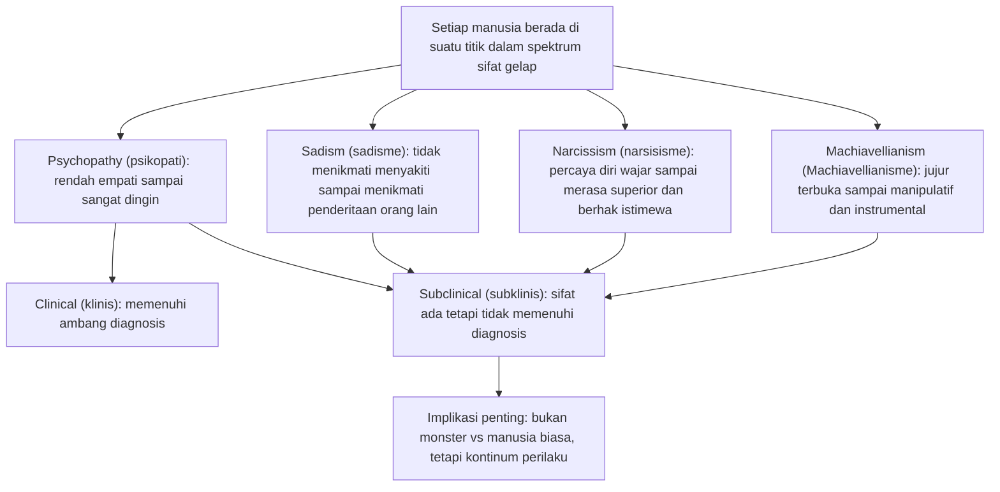
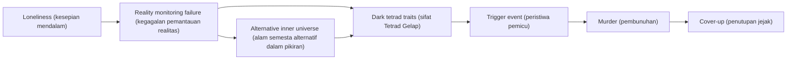
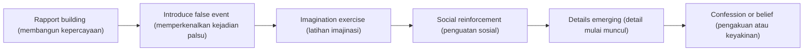
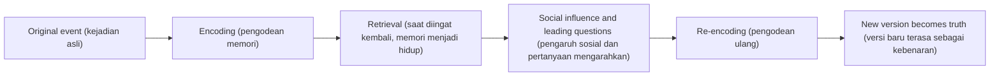
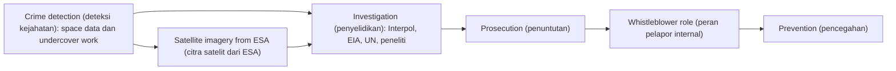

<Callout type="important" title="🧠 Cara Membaca Artikel Ini">
Artikel ini sengaja ditulis panjang, pelan, dan penuh detail. Bukan untuk memuaskan rasa ingin tahu sensasional tentang kejahatan, melainkan untuk memahami tesis besar Julia Shaw: bahwa manusia biasa, dalam kondisi tertentu, bisa melukai, membunuh, mengingat secara keliru, mencintai secara rumit, dan merasionalisasi banyak hal tanpa merasa dirinya monster 😶.
</Callout>

## 1. Pengantar: Kita Semua Memiliki Kapasitas untuk Membunuh

Kalimat pembuka Julia Shaw di podcast Lex Fridman #483 terasa seperti palu yang memecah kenyamanan moral kita: **"Kita semua memiliki kapasitas untuk membunuh dan melakukan hal-hal mengerikan lainnya. Pertanyaannya bukan mengapa mereka melakukannya, tapi mengapa kita tidak melakukannya."** Kalimat ini mengganggu, tetapi justru karena itu ia penting. Selama ini, banyak orang merasa aman dengan membayangkan bahwa pembunuh, pelaku kekerasan seksual, serial killer, atau manipulator ekstrem adalah spesies moral yang berbeda total dari kita. Shaw menolak kenyamanan itu. Menurutnya, kejahatan bukan hanya soal “orang jahat di luar sana”, tetapi juga soal kondisi, dorongan, rasionalisasi, dan struktur sosial yang hidup di dalam masyarakat biasa — bahkan di dalam diri kita sendiri 😐.

Julia Shaw bukan komentator pinggiran. Ia adalah **kriminolog forensik** (*forensic criminologist* — ahli yang mempelajari kejahatan, pelaku, memori, dan sistem hukum dari sudut psikologi serta forensik), peneliti memori, dosen, konsultan, dan penulis buku-buku penting seperti *Evil* (Jahat), *The Memory Illusion* (Ilusi Memori), *Bi* (Bi), dan *Green Crime* (Kejahatan Hijau atau kejahatan lingkungan). Menariknya, rentang topik yang ia geluti tampak sangat lebar: pembunuhan, serial killer, pengakuan palsu, memori palsu, biseksualitas, kink (*kecenderungan seksual tidak konvensional*), hingga kejahatan lingkungan korporat. Tetapi justru di situlah kekuatan berpikir Shaw: ia melihat semuanya melalui lensa yang sama, yaitu bagaimana manusia membangun realitas, identitas, justifikasi, dan perilaku.

Salah satu bagian paling mengejutkan dari percakapan ini adalah data bahwa sekitar **70% pria dan lebih dari 50% wanita pernah berfantasi membunuh seseorang**. Shaw menekankan bahwa fakta ini **tidak otomatis berarti bahaya**. Fantasi semacam itu, dalam banyak kasus, justru adalah bagian dari cara otak memproses kemarahan, frustrasi, dan dorongan agresif tanpa benar-benar mewujudkannya. Dengan kata lain, pikiran manusia tidak steril. Ia penuh kemungkinan. Dan justru karena itu, moralitas bukan ketiadaan dorongan gelap, melainkan kemampuan mengelola dorongan tersebut.

Mengapa wawancara ini penting? Karena ia menantang tiga kebiasaan berpikir yang sangat mengakar. Pertama, kebiasaan untuk memisahkan “orang normal” dari “orang mengerikan” secara terlalu rapi. Kedua, kebiasaan untuk mempercayai memori kita seolah rekaman video yang objektif. Ketiga, kebiasaan untuk mengaitkan seksualitas non-konvensional atau identitas non-mayoritas dengan deviasi moral. Shaw membongkar semuanya. Ia tidak melakukannya dengan semangat provokasi murahan, tetapi dengan gaya ilmiah yang justru tenang. Dan justru karena tenang itulah, dampaknya terasa lebih kuat 🙂.

<Callout type="quote" title="📌 Tesis Besar Julia Shaw">
Bagi Shaw, pertanyaan paling cerdas bukanlah *"mengapa monster melakukan hal mengerikan?"* melainkan *"mekanisme apa yang membuat kebanyakan dari kita tidak melakukannya — dan kapan mekanisme itu bisa gagal?"*
</Callout>

Di bawah permukaan, wawancara ini sebenarnya berbicara tentang satu tema besar: **kenormalan itu rapuh**. Masyarakat modern suka membayangkan bahwa perilaku sehat, memori akurat, hubungan yang jujur, dan institusi yang adil adalah keadaan default. Shaw menunjukkan kebalikannya. Default kita jauh lebih kacau daripada yang kita akui. Yang membuat dunia tetap relatif stabil bukan karena manusia itu sederhana, tetapi karena ada begitu banyak rem psikologis, sosial, hukum, budaya, dan relasional yang terus bekerja setiap hari 🚦.

---

## 2. Dark Tetrad: Kontinum Kegelapan dalam Diri Kita

Salah satu fondasi intelektual dalam percakapan ini adalah konsep **Dark Tetrad** (*Tetrad Gelap* — empat gugus sifat kepribadian yang terkait dengan perilaku manipulatif, agresif, dingin, atau antisosial). Empat sifat itu adalah **Psychopathy** (*psikopati*), **Sadism** (*sadisme*), **Narcissism** (*narsisisme*), dan **Machiavellianism** (*Machiavellianisme*). Dalam imajinasi populer, istilah-istilah ini sering diperlakukan seperti cap final: kalau seseorang “psikopat”, seolah permainan selesai dan analisis berhenti. Shaw justru melawan pola pikir seperti itu. Bagi dia, ini bukan kategori hitam-putih, melainkan **kontinum** (*continuum* — spektrum bergradasi) yang tersebar di populasi umum.

### 2.1 Psychopathy (psikopati)

**Psychopathy** (*psikopati* — pola sifat yang ditandai kurangnya empati, dangkalnya afek, manipulasi, impulsivitas, dan gaya hidup parasitik) sering dikaitkan dengan pembunuh berdarah dingin. Itu tidak sepenuhnya salah, tetapi terlalu sempit. Seseorang dengan sifat psikopatik tinggi bisa tampak sangat fungsional, menawan, bahkan sukses secara sosial. Yang khas adalah ketidakmampuan atau ketidakmauan untuk sungguh peduli pada penderitaan orang lain. Dalam bentuk ekstrem, orang seperti ini tidak hanya memanfaatkan orang lain; ia juga tidak merasa benar-benar terganggu ketika orang lain hancur karenanya. Namun, pada tingkat **subklinis** (*subclinical* — ada ciri terkait tetapi belum memenuhi ambang diagnosis klinis), unsur-unsur psikopati bisa muncul pada orang yang sangat dingin, oportunistik, atau tidak tersentuh rasa bersalah.

### 2.2 Sadism (sadisme)

**Sadism** (*sadisme* — kecenderungan memperoleh kenikmatan dari menyakiti, mempermalukan, atau mendominasi orang lain) sering disalahpahami seolah selalu terkait seks. Padahal tidak. Sadisme bisa bersifat non-seksual: menikmati penghinaan, suka melihat orang panik, merasakan kepuasan ketika orang lain kalah total, atau sengaja memperpanjang penderitaan orang lain hanya karena itu terasa “menyenangkan”. Shaw penting di sini karena ia mengingatkan bahwa sadisme tidak harus selalu hadir dalam bentuk kriminal ekstrem. Ia juga bisa muncul dalam bentuk sehari-hari: perundungan, penyiksaan psikologis, trolling (*provokasi digital untuk memancing emosi*), sampai kebijakan kejam yang dinikmati karena efek dominannya.

### 2.3 Narcissism (narsisisme)

**Narcissism** (*narsisisme* — kecenderungan mencintai diri secara berlebihan, membutuhkan kekaguman, dan merasa lebih istimewa daripada orang lain) terasa semakin relevan di era media sosial. Namun narsisisme bukan sekadar senang selfie. Dalam bentuk yang lebih serius, ia adalah rasa superioritas yang rapuh. Orang narsis ingin dilihat luar biasa, tetapi karena identitasnya tidak stabil, ia sangat bergantung pada validasi eksternal. Karena itu, kritik terasa seperti penghinaan eksistensial. Shaw menunjukkan bahwa narsisisme bisa menjadi bahan bakar agresi ketika dunia tidak memberi perlakuan istimewa yang menurut seseorang “layak” ia terima.

### 2.4 Machiavellianism (Machiavellianisme)

**Machiavellianism** (*Machiavellianisme* — kecenderungan manipulatif, strategis, licin, dan bersedia melakukan apa pun demi kemajuan atau kekuasaan) adalah sisi “kalkulatif” dari kegelapan. Jika psikopati lebih dingin secara afektif, dan sadisme lebih mencari kenikmatan dalam menyakiti, Machiavellianisme adalah kemampuan bermain catur sosial tanpa banyak beban moral ♟️. Orang dengan sifat ini sering pandai membaca sistem, kelemahan, dan insentif. Mereka bukan selalu yang paling impulsif, tetapi bisa sangat berbahaya karena sabar, strategis, dan oportunistik.

Yang sangat penting: **keempat sifat ini tidak hadir sebagai label biner “monster vs bukan monster”**. Shaw menegaskan bahwa setiap orang berada di suatu titik pada spektrum ini. Seseorang bisa sangat rendah dalam sadisme, tetapi relatif lebih tinggi dalam narsisisme. Orang lain bisa cukup rendah di tiga dimensi, tetapi licin dan manipulatif pada dimensi Machiavellianisme. Ini berarti pembicaraan tentang kejahatan harus dimulai dari kerendahan hati, bukan dari pemisahan moral yang terlalu puas diri.

### Diagram 1 — Dark Tetrad Continuum

### Tabel 1 — Dark Tetrad: Definisi, Ciri, Contoh, dan Implikasi Klinis

| Sifat | Definisi | Ciri yang Sering Muncul | Contoh Perilaku | Implikasi Klinis |
|---|---|---|---|---|
| **Psychopathy (psikopati)** | Kurang empati, dangkal secara emosional, manipulatif, impulsif, kadang parasitik | Tidak merasa bersalah, menipu dengan tenang, tidak tergerak oleh penderitaan orang lain | Menipu pasangan, memanfaatkan teman, memanipulasi korban | Dalam bentuk klinis dapat terkait gangguan kepribadian antisosial, tetapi banyak ciri hadir subklinis |
| **Sadism (sadisme)** | Menikmati penderitaan, penghinaan, atau rasa tidak berdaya orang lain | Senang mempermalukan, memperpanjang rasa sakit, mengejek dengan rasa puas | Perundungan, kekerasan domestik, trolling sadis | Tidak selalu kriminal, tetapi jika tinggi bisa sangat berbahaya dalam relasi dan kekuasaan |
| **Narcissism (narsisisme)** | Merasa istimewa, superior, layak dipuja | Haus validasi, defensif terhadap kritik, merasa berhak | Marah ketika ditolak, merendahkan orang lain, drama superioritas | Dapat hadir dari ringan sampai gangguan kepribadian narsistik |
| **Machiavellianism (Machiavellianisme)** | Strategi sosial manipulatif demi keuntungan | Kalkulatif, licin, instrumental, sinis | Memecah tim demi naik jabatan, memutar fakta, memanfaatkan rahasia orang | Sering tidak terlihat karena tampil rasional dan “terkendali” |

<Callout type="info" title="🌗 Inti Gagasan Kontinum">
Kalau Dark Tetrad dipahami sebagai spektrum, kita berhenti bertanya *"siapa monster?"* dan mulai bertanya *"sifat apa yang ada di mana, dalam kondisi apa, dan bagaimana sistem sosial menguatkannya atau menahannya?"*
</Callout>

---

## 3. Apakah Hitler Dilahirkan Jahat? — Pertanyaan Baby Hitler

Percakapan tentang “**baby Hitler**” hampir selalu dirancang untuk memancing jawaban dramatis. Jika kamu bisa kembali ke masa lalu, apakah kamu akan membunuh bayi Hitler? Julia Shaw menjawab **tidak**. Alasannya bukan sentimentalitas, tetapi logika perkembangan manusia. Tidak ada garis lurus yang sederhana dari bayi ke diktator dewasa. Orang **tidak dilahirkan jahat** dalam pengertian siap pakai. Mereka dibentuk oleh kombinasi lingkungan, pengalaman, peluang, struktur kekuasaan, trauma, ideologi, dan sejarah.

Jawaban ini sangat penting karena masyarakat suka dengan narasi bawaan lahir. Narasi seperti itu terasa memuaskan: ia memberi penjelasan yang rapi, cepat, dan emosional. Tetapi secara ilmiah, ia sering terlalu malas. Hitler kecil tidak datang dengan stempel metafisik “calon genosida”. Justru karena ia tidak datang dengan stempel itu, kita dipaksa melihat sesuatu yang lebih menakutkan: bagaimana lingkungan bisa secara bertahap mengondisikan manusia menuju kekejaman yang luar biasa.

Shaw juga menyoroti bahaya kata **evil** (*jahat*). Kata ini kadang berguna secara moral, tetapi sangat mudah berubah menjadi tombol berhenti berpikir. Saat kita menyebut seseorang jahat, sering kali yang kita maksud bukan sekadar “ia melakukan kejahatan besar”, melainkan “saya selesai berusaha memahami manusia ini”. Di titik itulah analisis berhenti. Dan ketika analisis berhenti, pencegahan juga berhenti.

Itulah mengapa Shaw mengatakan bahwa kata “jahat” sering menjadi **akhir dari percakapan, bukan awal pemahaman**. Bukan berarti kita harus berhenti mengutuk tindakan mengerikan. Bukan itu maksudnya. Maksudnya: pengutukan moral tanpa pemahaman kausal membuat masyarakat puas secara emosional, tetapi bodoh secara preventif 😶.

Lebih jauh lagi, label “jahat” sering mendorong **othering** (*pengasingan* — menjadikan orang lain sebagai “yang bukan kita”, asing, tak manusiawi, dan pantas diperlakukan berbeda). Othering inilah yang membuat manusia merasa sah melakukan kekejaman terhadap mereka yang telah diberi cap tidak sepenuhnya manusia. Ini berlaku pada perang, genosida, politik kebencian, bahkan konflik sehari-hari yang lebih kecil. Ketika seseorang berubah dari “orang” menjadi “simbol kejahatan”, ambang empati runtuh.

<Callout type="warning" title="🪓 Bahaya Kata 'Jahat'">
Label moral kadang perlu, tetapi jika ia menggantikan penjelasan, ia menjadi alat yang menenangkan emosi sambil melemahkan kecerdasan sosial. Kita merasa lebih benar, tetapi tidak menjadi lebih aman.
</Callout>

---

## 4. Empati Jahat (Evil Empathy): Mengapa Harus Berempati pada Monster?

Di sinilah Julia Shaw terdengar paling kontra-intuitif: ia mendorong **berempati bahkan kepada mereka yang kita sebut jahat**. Ini terdengar berbahaya jika dibaca tergesa-gesa. Tetapi Shaw sangat jelas: **empati bukan pembenaran**. Empati adalah alat untuk memahami mekanisme. Tanpa memahami mekanisme, kita tidak bisa mencegah pengulangan.

Judul buku Shaw di Inggris adalah *Making Evil* (Membuat Kejahatan), yang merujuk pada gagasan Nietzsche: **"Thinking evil is making evil"** (*memikirkan kejahatan sebagai kategori mutlak justru ikut memproduksi kejahatan itu*). Maksudnya bukan bahwa tidak ada tindakan mengerikan, tetapi bahwa kejahatan sering muncul juga dari cara kita memberi label, menata narasi, dan membangun identitas kelompok. Ketika orang diberi cap “setan”, “hama”, “pengkhianat”, atau “tidak manusiawi”, pintu menuju kekerasan massal mulai terbuka.

**Evil empathy** (*empati terhadap mereka yang melakukan kejahatan demi memahami jalan menuju kejahatan*) adalah empati yang dingin, disiplin, dan preventif. Ia tidak berkata, “tidak apa-apa kamu membunuh.” Ia berkata, “jika saya ingin masyarakat lebih aman, saya harus tahu struktur motivasi, rasa malu, kemarahan, kesepian, rasa hak, trauma, ideologi, dan pembelajaran sosial yang membawa seseorang ke sana.” Itu jenis empati yang matang.

Shaw menghubungkan ini dengan **dehumanization** (*dehumanisasi* — proses mengurangi status kemanusiaan pihak lain) dalam perang. Untuk membunuh massal, manusia biasanya perlu terlebih dahulu merendahkan orang lain menjadi objek, kategori, atau ancaman abstrak. Tidak mudah membunuh individu yang terasa nyata, punya nama, keluarga, wajah, dan cerita. Karena itu sistem perang, propaganda, dan kebencian selalu bekerja keras untuk menghapus individualitas lawan.

Ini terkait dengan **de-individuation** (*de-individuasi* — keadaan ketika seseorang berhenti merasa sebagai individu yang bertanggung jawab dan larut sebagai bagian dari kelompok*). Saat orang membayangkan diri sebagai bagian dari kubu “kita” melawan “mereka”, tanggung jawab personal melemah. Moralitas larut ke dalam identitas kelompok. Dalam situasi seperti itu, orang bisa melakukan kekerasan luar biasa sambil merasa dirinya hanya menjalankan misi suci, tugas negara, kehormatan komunitas, atau balas dendam kolektif.

Ironinya, **kedua sisi perang hampir selalu percaya bahwa mereka sedang melawan kejahatan**. Jadi, problemnya bukan cuma ada pihak jahat dan pihak baik. Problemnya adalah manusia sangat mudah membangun narasi moral total yang membenarkan tindakan paling brutal.

<Callout type="cite" title="📚 Empati yang Dimaksud Shaw">
Empati di sini bukan sentimentalitas. Ini lebih dekat pada *forensic empathy* (empati forensik) — kemampuan memahami kondisi batin dan konteks pelaku tanpa ikut menghapus tanggung jawab moralnya.
</Callout>

---

## 5. Psikologi Serial Killer: Dari Kesepian ke Pembunuhan Berantai

Salah satu pintu masuk Julia Shaw ke dunia kriminologi forensik adalah kasus **Robert Pickton** dan peternakan yang dikenal sebagai *Piggy's Palace*. Kasus seperti ini sering dikonsumsi media sebagai horor murni. Shaw justru melihatnya sebagai titik masuk untuk bertanya: **bagaimana seseorang bisa sampai sedemikian jauh?**

Menurut Shaw, salah satu komponen penting pada banyak pelaku kekerasan ekstrem adalah **kesepian mendalam**. Ini bukan sekadar “merasa sendiri” seperti definisi sehari-hari. Kesepian yang ia maksud adalah kondisi keterputusan sosial yang mengganggu **reality monitoring** (*pemantauan realitas* — kemampuan membedakan apa yang nyata, dibayangkan, diinginkan, ditakuti, atau diceritakan ulang). Jika seseorang tidak punya jaringan sosial yang cukup untuk mengoreksi pikirannya, dunia internalnya bisa berkembang menjadi semesta alternatif sendiri 🌫️.

Fenomena ini, kata Shaw, punya kemiripan dengan **radikalisasi**. Orang yang semakin terisolasi cenderung terjebak dalam gema pikirannya sendiri. Jika gema itu dipenuhi kebencian, fantasi dominasi, paranoia, atau narasi penganiayaan, maka tanpa koreksi sosial, ia bisa mengeras menjadi realitas subjektif. Manusia perlu “jangkar” sosial agar imajinasi tidak lepas total dari kenyataan.

Ini juga mengapa Shaw menyinggung **schizophrenia** (*skizofrenia* — gangguan psikotik berat yang dapat mencakup halusinasi, waham, dan gangguan organisasi pikiran) dan **command hallucinations** (*halusinasi komando* — suara atau pengalaman perseptif yang terasa memerintahkan tindakan tertentu, termasuk kekerasan). Bukan berarti semua orang dengan skizofrenia berbahaya — itu salah dan stigmatis. Tetapi dalam sebagian kecil kasus, ketika seseorang terlepas dari realitas dan tidak memiliki dukungan atau pengobatan yang memadai, risiko perilaku berbahaya bisa meningkat.

Shaw menggunakan istilah **tether to reality** (*jangkar ke kenyataan*). Selama orang memiliki tether ini — relasi, umpan balik, rutinitas, komunitas, struktur, cinta, pengawasan, pekerjaan, terapi, atau kesadaran diri — pikirannya lebih mungkin kembali ke dunia bersama. Saat tether itu putus, fantasi bisa tumbuh liar. Dan bila fantasi itu bertemu **dark tetrad traits** (*sifat-sifat Tetrad Gelap*), hasilnya bisa mengerikan.

Ted Bundy, John Wayne Gacy, dan Jeffrey Dahmer bukan sekadar “monster acak”. Dalam pembacaan Shaw, mereka adalah kombinasi dari sifat gelap, keterputusan dari realitas bersama, dan kondisi pemicu yang membuat mereka melampaui rem-rem normal. Ini penting karena menggeser fokus dari sensasi ke mekanisme.

Yang paling provokatif adalah ketika Shaw berbicara tentang **Jeffrey Dahmer**. Banyak orang hanya mampu merespons dengan jijik. Shaw justru mengatakan ia merasakan **simpati**. Bukan karena membela perbuatannya, tetapi karena ia melihat upaya Dahmer yang grotesk (*mengerikan dan terdistorsi*) untuk menciptakan “partner sempurna” sebagai ekspresi putus asa dari kesepian, fantasi kontrol, dan kehancuran relasional. Dahmer ingin pasangan yang tidak bisa meninggalkan dia; itu berubah menjadi logika kepemilikan total melalui tubuh mati. Secara moral itu mengerikan, tetapi secara psikologis tetap bisa dipahami 😔.

### Diagram 2 — Path to Serial Killing

<Callout type="danger" title="🕳️ Pelajaran dari Serial Killer">
Perbedaan terbesar antara Jeffrey Dahmer dan kebanyakan orang mungkin bukan pada fakta bahwa ia punya dorongan gelap, melainkan pada fakta bahwa berbagai rem yang menghentikan kita — relasi, rasa bersalah, koreksi sosial, struktur hidup, realitas bersama — gagal bekerja padanya.
</Callout>

---

## 6. Siapa yang Bisa Melakukan Kejahatan? — Kita Semua

Salah satu gagasan paling tak nyaman dalam seluruh episode ini adalah bahwa **kita semua mampu melakukan hal-hal terburuk yang bisa kita bayangkan**. Kalimat seperti ini sering ditolak karena terasa ofensif. Orang ingin berkata, “tidak, saya tidak mungkin.” Tetapi sejarah berkali-kali menunjukkan bahwa tetangga biasa bisa saling membunuh saat perang, saat negara runtuh, saat propaganda menyala, atau saat identitas kelompok dipolitisasi.

Itulah mengapa eksperimen seperti **Stanford Prison Experiment** karya Philip Zimbardo — meskipun metodologinya banyak dikritik — tetap punya nilai simbolik yang besar dalam budaya psikologi. Ketika orang secara acak diberi peran “penjaga” dan “tahanan”, sebagian peserta mulai menginternalisasi struktur kekuasaan itu dengan cepat. Yang menakutkan bukan karena eksperimen itu sempurna, tetapi karena ia memvisualkan satu hal: manusia mudah berubah saat peran, norma, dan izin sosial berubah.

Dari sana Zimbardo lalu mengembangkan gagasan **Heroic Imagination** (*Imajinasi Heroik* — latihan mental untuk membayangkan diri bertindak benar dan berani dalam situasi darurat atau ketidakadilan). Shaw mengangkat ini untuk menunjukkan bahwa jika manusia bisa dilatih menjadi pelaku pasif atau kejam, maka manusia juga bisa dilatih menjadi penolong. Moralitas bukan sekadar “karakter baik” yang statis; ia juga kebiasaan yang perlu dibayangkan dan dipraktikkan.

Ini terkait dengan **Bystander Effect** (*efek penonton* — kecenderungan orang tidak bertindak ketika banyak saksi hadir karena tanggung jawab terasa menyebar). Dalam kerumunan, setiap orang cenderung berpikir orang lain pasti akan bergerak. Hasilnya: tidak ada yang bergerak. Kasus **Kitty Genovese** sering dipakai secara terlalu sederhana untuk membuktikan bahwa manusia pasif dan apatis. Penelitian berikutnya menunjukkan cerita itu lebih rumit. Tetapi justru itu poinnya: bukan bahwa manusia selalu buruk, melainkan bahwa situasi sangat memengaruhi respons.

Shaw menyukai gagasan melatih diri secara sengaja: bayangkan dirimu melompat ke sungai untuk menyelamatkan orang asing, atau menyela kekerasan saat orang lain hanya menonton. Imajinasi seperti ini penting karena di momen nyata, kita sering tak punya waktu untuk menyusun filsafat. Kita bertindak berdasarkan skrip yang sudah ada di kepala. Jika skrip kita kosong, kita membeku. Jika skrip kita sudah berisi keberanian, peluang bertindak meningkat 🚑.

<Callout type="tip" title="🦸 Heroic Imagination dalam Praktik">
Latihan moral kadang sesederhana ini: beberapa kali seminggu, bayangkan situasi di mana ada orang diserang, dilecehkan, atau tenggelam. Bayangkan langkah konkret yang akan kamu ambil. Imajinasi adalah pra-latihan bagi tindakan.
</Callout>

---

## 7. Fantasi Membunuh: Normal dan Bahkan Adaptif?

Di antara semua bagian podcast ini, mungkin inilah yang paling membuat pendengar berhenti sejenak: **berfantasi membunuh seseorang ternyata sangat umum**. Sekitar 70% pria dan lebih dari 50% wanita melaporkan pernah memiliki fantasi semacam itu. Shaw tidak mengatakannya untuk menormalkan kekerasan, melainkan untuk menormalkan kejujuran tentang isi pikiran manusia.

Ia memandang fantasi membunuh sebagai semacam **dress rehearsal** (*latihan mental*). Otak yang marah, frustrasi, atau terhina membiarkan skenario ekstrem muncul. Kemudian sistem penalaran yang lebih tinggi — **higher reasoning** (*penalaran tingkat tinggi* — evaluasi konsekuensi, hukum, moral, masa depan, identitas diri) — mengambil alih dan berkata: “itu akan menghancurkan hidupmu, hidup orang lain, dan semua konsekuensinya buruk.” Dalam bacaan ini, fantasi bukan langkah menuju tindakan; justru ia bisa menjadi bagian dari proses menghindari tindakan.

Masalah muncul ketika fantasi berubah kualitas. Shaw memberi sinyal bahaya bila seseorang terus-menerus **ruminating** (*merenung secara obsesif dan berulang*) tentang kekerasan, mulai fokus pada orang spesifik, menikmati detail secara semakin intens, atau mulai membuat rencana. Di titik itu, fantasi bukan lagi sekadar katarsis kognitif. Ia mulai menjadi jalur perilaku yang diperkuat.

Nasihat Shaw sangat praktis: jika seseorang merasa fantasinya mulai menetap, personal, dan terarah, **carilah psikolog**. Ini bukan pengakuan bahwa kamu monster; justru ini bentuk tanggung jawab sebelum sesuatu memburuk.

<Callout type="success" title="✅ Hal yang Menenangkan">
Pikiran mengerikan tidak otomatis membuatmu orang berbahaya. Yang lebih penting adalah apa yang kamu lakukan setelah pikiran itu muncul: apakah kamu melepaskannya, menilainya, membahasnya secara sehat, atau justru memeliharanya.
</Callout>

---

## 8. Mengapa Orang Membunuh? Kebenaran yang Membosankan

Budaya populer mencintai pembunuhan yang teatrikal: psikopat genius, pisau yang diasah berbulan-bulan, teka-teki sadistik, simbol-simbol misterius. Kenyataannya, kata Shaw, **pembunuhan paling sering jauh lebih membosankan**. Banyak kasus bukan hasil perencanaan rumit, melainkan pertengkaran yang lepas kendali. Seseorang berutang uang receh, mabuk, dipermalukan, marah, lalu satu dorongan mengubah hidup banyak orang selamanya.

Di sini Shaw memperkenalkan gagasan **victimization gap** (*kesenjangan viktimisasi* — ketidaksesuaian antara kerusakan pada korban dan konsekuensi sosial atau hukum pada pelaku). Dalam pembunuhan, kerugian korban adalah total: nyawa hilang. Namun bagi pelaku, yang sering terjadi adalah penjara panjang — mengerikan, tentu, tetapi tidak simetris dengan kematian. Ini membuat masyarakat terdorong merespons pembunuhan dengan hukuman yang sangat berat. Secara emosional dapat dimengerti. Tetapi jika tujuan kita adalah **keamanan masyarakat**, sistem saat ini belum tentu rasional.

Shaw mencatat bahwa **recidivism for homicide** (*angka residivis pembunuhan* — persentase pembunuh yang mengulangi pembunuhan setelah bebas) ternyata hanya sekitar **1–3%**. Artinya, secara statistik, pembunuh sering **tidak** menjadi pembunuh berulang. Sebaliknya, jenis kejahatan dengan residivis jauh lebih tinggi justru mencakup **fraud** (*penipuan*), pelecehan lansia, dan kekerasan seksual. Ironinya, jenis-jenis kejahatan itu kadang mendapat hukuman lebih ringan atau perhatian budaya yang lebih kecil karena tidak memuaskan narasi “darah dan sensasi”.

Dari sini Shaw mengajukan kritik tajam: **sistem hukum kita sering terasa terbalik bila tujuannya benar-benar melindungi masyarakat**. Kita menghukum sangat keras pada kejahatan yang belum tentu paling mungkin diulang, sementara lebih lunak pada pola pelaku yang secara statistik lebih persisten.

### Tabel 2 — Perbandingan: Sistem Hukum yang Ada vs Sistem Hukum Berbasis Recidivism

| Jenis Kejahatan | Hukuman yang Umum Saat Ini | Residivis Aktual | Jika Tujuannya Keamanan, Hukuman atau Intervensi Ideal |
|---|---|---|---|
| **Pembunuhan (homicide)** | Sangat berat, penjara panjang sekali | Rendah, sekitar 1–3% | Tetap berat, tetapi fokus besar pada asesmen risiko individual dan konteks kasus |
| **Fraud (penipuan)** | Sering lebih ringan, apalagi pada white-collar crime (kejahatan kerah putih) | Tinggi | Pengawasan jangka panjang, pembatasan akses, restitusi, hukuman lebih proporsional dengan risiko ulang |
| **Kekerasan seksual** | Bervariasi, sering tidak sebanding dengan trauma korban | Cenderung tinggi pada sebagian pelaku | Asesmen risiko ketat, pengawasan, terapi wajib, pembatasan gerak dan akses korban potensial |
| **Pelecehan lansia** | Kerap tak terlihat dan relatif kurang keras | Tinggi | Intervensi dini, hukuman kuat, larangan peran kepercayaan, monitoring ketat |
| **Kekerasan pasangan intim** | Sering diremehkan sampai eskalasi berat | Tinggi | Respons cepat, perlindungan korban, asesmen lethality (risiko membunuh), rehabilitasi dan pembatasan legal |

Shaw juga menyinggung **restorative justice** (*keadilan restoratif* — pendekatan yang menekankan pemulihan, tanggung jawab, permintaan maaf, dan penjelasan kepada korban atau keluarga korban ketika memungkinkan) sebagai sesuatu yang, dalam sebagian kasus, justru lebih berarti bagi keluarga korban daripada sekadar melihat pelaku dipenjara tanpa penjelasan. Tentu ini bukan solusi universal. Tetapi poin Shaw jelas: banyak keluarga korban sebenarnya ingin **jawaban**, **pengakuan**, dan **pertanggungjawaban manusiawi**, bukan cuma angka tahun hukuman.

<Callout type="important" title="⚖️ Kebenaran yang Tidak Nyaman">
Kita suka membayangkan kejahatan ekstrem punya motif ekstrem. Kenyataannya, banyak pembunuhan lahir dari kebodohan, emosi sesaat, konflik kecil, rasa malu, alkohol, dan kontrol diri yang runtuh. Itu membuatnya lebih membosankan — dan justru lebih menakutkan.
</Callout>

---

## 9. Psikologi Incel: Hak, Kebencian, dan Internet

Julia Shaw juga membahas **incel** (*involuntary celibate* — laki-laki yang mengidentifikasi diri sebagai “selibat tidak disengaja” dan sering merasa gagal mendapatkan hubungan atau seks yang menurut mereka pantas mereka terima). Bagi Shaw, inti psikologi incel bukan sekadar kesepian seksual, melainkan **entitlement** (*rasa hak* — keyakinan bahwa saya berhak mendapat sesuatu dari dunia, dari perempuan, atau dari orang lain, dan penolakan adalah penghinaan*).

Entitlement ini jauh melampaui dunia incel. Banyak kejahatan, kata Shaw, lahir dari logika serupa: **“aku berhak atas ini, tetapi tidak mendapatkannya, maka aku akan mengambilnya atau menghukum dunia.”** Dalam bentuk paling ringan, ini muncul sebagai kemarahan narsistik. Dalam bentuk lebih berat, ia berubah menjadi stalking (*menguntit*), kekerasan, serangan balas dendam, atau ideologi kebencian.

Internet memperkuat masalah ini karena ia bertindak sebagai **amplifier** (*penguat*). Seseorang yang semula hanya frustrasi bisa masuk ke forum, grup, kanal video, atau komunitas yang mengulang-ulang narasi sama: perempuan kejam, dunia tidak adil, kamu adalah korban, kekerasan dapat dimengerti, orang lain juga merasa seperti kamu. Di situlah kebencian menjadi ekosistem.

Poin Shaw yang sangat dewasa adalah ini: **tidak ada seorang pun yang berhak atas kehidupan yang baik hanya karena ia menginginkannya**. Kebebasan dan hak dasar penting, tetapi itu bukan jaminan romantika, status, atau pemujaan. Masyarakat modern kadang mencampuradukkan hak dengan hasil. Dari kebingungan itulah lahir kemarahan kronis.

<Callout type="warning" title="🌐 Internet Bukan Penyebab Tunggal, tetapi Penguat Besar">
Banyak ide berbahaya tidak lahir di internet, tetapi internet membuatnya menemukan komunitas, bahasa, estetika, dan validasi. Itu cukup untuk mengubah frustrasi privat menjadi ideologi publik.
</Callout>

---

## 10. Tinder Swindler dan Love Bombing: Penipuan yang Memanfaatkan Kerentanan

Kasus **Tinder Swindler** dan korban seperti Cecilia memperlihatkan satu hal yang sering diabaikan: penipuan romantis berhasil bukan karena korbannya bodoh, tetapi karena pelaku memahami **apa yang ingin didengar manusia**. Shaw menjelaskan konsep **love bombing** (*pengeboman cinta* — strategi membanjiri seseorang dengan perhatian, janji, intensitas emosional, dan bayangan masa depan bersama agar ikatan terbentuk sangat cepat). Dalam situasi seperti ini, korban tidak sedang tertipu oleh logika; ia sedang dibentuk oleh narasi afektif.

Penipu romantis bekerja seperti dramaturg (*penyusun drama*). Ia tahu kapan harus terlihat rentan, kapan tampil mewah, kapan menciptakan urgensi, dan kapan meminta pengorbanan. Begitu korban merasa hubungannya “istimewa”, permintaan uang, bantuan, rahasia, atau loyalitas terasa seperti bukti cinta, bukan red flag.

Shaw menegaskan bahwa ada bentuk **fraud tailored** (*penipuan yang disesuaikan secara presisi dengan profil korban*) yang pada prinsipnya bisa menipu siapa saja, jika penipu memiliki informasi yang cukup. Di sinilah ia menyinggung masa depan AI. Sistem generatif bisa membuat penipuan terasa lebih personal, lebih konsisten, lebih emosional, dan lebih meyakinkan. Yang dulu butuh manipulator berbakat, kini bisa dibantu mesin yang tak pernah lelah 🤖.

Ia juga menghubungkan ini dengan **coercive control** (*kontrol koersif* — pola kendali pasangan terhadap uang, keputusan, pergaulan, kebebasan, dan gaya hidup korban secara bertahap). Banyak orang mengira kekerasan pasangan intim harus berupa pukulan. Padahal, pasangan yang mengatur seluruh keuangan, memberi “uang jajan”, memonitor langkah, dan mengisolasi korban juga sedang melakukan kekerasan.

<Callout type="danger" title="💔 Pelajaran dari Love Bombing">
Jika sesuatu terasa terlalu intens terlalu cepat, itu bukan selalu cinta besar. Kadang itu adalah teknik. Cinta sehat butuh waktu, konsistensi, dan ruang untuk berpikir; manipulasi justru membenci jeda.
</Callout>

---

## 11. Kecemburuan, Poliamori, dan Mitos Monogami

Pada bagian relasi, Shaw terdengar sangat tegas: **kecemburuan hampir selalu red flag** (*tanda bahaya merah*). Ini bertolak belakang dengan budaya populer yang sering mem-romantisasi cemburu sebagai bukti cinta. Shaw memandang kecemburuan terutama sebagai tanda **ketidakamanan** — entah ketidakamanan pribadi, ketidakpercayaan relasional, atau kebutuhan kontrol.

Lebih dari itu, ia menyebut kecemburuan sebagai salah satu **prekursor utama intimate partner violence** (*kekerasan dari pasangan intim*). Logikanya jelas: jika seseorang merasa pasangan adalah miliknya, maka ancaman kehilangan akan mudah berubah menjadi kontrol, intimidasi, pemantauan, pembatasan, lalu kekerasan.

Shaw juga sangat jujur tentang **monogami** sebagai konstruksi sosial. Ia tidak berkata monogami salah. Yang ia katakan: kebanyakan manusia ternyata sangat buruk menjalaninya secara konsisten. Penelitian tentang perselingkuhan berulang kali menunjukkan bahwa ketidaksetiaan bukan penyimpangan minor, melainkan pola umum. Dari sini Shaw lebih tertarik pada pertanyaan yang lebih realistis: bukan “hubungan ideal itu apa?”, melainkan “struktur apa yang paling jujur dan paling aman untuk orang-orang yang terlibat?”

Ia sendiri mengidentifikasi sebagai **poliamoris** (*polyamorous* — mampu mencintai dan menjalin relasi romantis dengan lebih dari satu orang secara terbuka, jujur, dan berdasarkan kesepakatan). Yang penting bagi Shaw bukan bentuk hubungan tunggal, melainkan **kejujuran dan komunikasi**. Menurutnya, banyak kerusakan dalam hubungan bukan lahir dari jumlah pasangan, melainkan dari kebohongan, rasa memiliki, dan ketidakmampuan berbicara terbuka.

Di sini ia juga membahas **Klein Sexual Orientation Grid** (*kisi orientasi seksual Klein*), sebuah model yang lebih kaya daripada **Kinsey Scale**. Model ini tidak hanya menilai ketertarikan seksual. Ia memetakan **ketertarikan**, **perilaku**, **fantasi**, **preferensi gaya hidup**, dan **identifikasi diri** dalam dimensi **masa lalu**, **masa kini**, dan **ideal**. Ini penting karena seksualitas manusia tidak sesederhana satu angka yang membeku.

<Callout type="info" title="🧩 Pelajaran Penting tentang Relasi">
Dalam pandangan Shaw, hubungan sehat tidak ditentukan pertama-tama oleh apakah ia monogamis atau poliamoris, melainkan oleh apakah semua pihak jujur, sadar, aman, dan mampu berkomunikasi tanpa manipulasi.
</Callout>

---

## 12. Biseksualitas: Mitos, Riset, dan Realita

Julia Shaw keluar sebagai **biseksual** dalam bukunya *Evil*. Keputusan itu bukan sekadar pengungkapan identitas pribadi, tetapi juga intervensi intelektual. Ia ingin menunjukkan bagaimana kata “jahat” historis sering ditempelkan pada homoseksualitas dan identitas seksual non-mayoritas. Dengan memasukkan dirinya sendiri ke dalam percakapan, ia merusak jarak aman antara analis dan objek stigma.

Ia menyinggung **Kinsey Scale** (*skala Kinsey*), skala 0–6 yang dikembangkan Alfred Kinsey pada 1940-an untuk menggambarkan spektrum dari sepenuhnya heteroseksual sampai sepenuhnya homoseksual. Salah satu pelajaran terbesar dari kerja Kinsey adalah bahwa **kebanyakan orang tidak hidup di ujung-ujung ekstrem**. Manusia jauh lebih cair, ambigu, dan kontekstual daripada kategori sosial yang sempit.

Shaw juga mengangkat kesalahpahaman klasik tentang biseksualitas: bahwa biseksual hanyalah “fase”, “jalan transit ke Gay Town”, atau tanda seseorang belum “benar-benar memilih”. Ia menolak ini keras. Menjadi biseksual bukan berarti tertarik pada semua orang. Justru seperti orientasi lain, orang biseksual pun tidak tertarik pada sebagian besar orang. Hanya saja, **gender bukan penentu absolut bagi kemungkinan ketertarikan** 🌈.

Ia juga membahas **homosocial environment** (*lingkungan homosial* — lingkungan yang didominasi interaksi sesama jenis, seperti penjara, perang, asrama tertentu, atau komunitas tertutup) yang dapat mengubah pola perilaku seksual tanpa otomatis mengubah identitas inti seseorang. Ini penting untuk membedakan **perilaku**, **fantasi**, **identitas**, dan **konteks**.

Salah satu nada paling serius dari bagian ini adalah kekhawatiran Shaw bahwa **hak-hak LGBTQ+ bisa dicabut kembali bahkan dalam masa hidupnya sendiri**. Ini mengingatkan bahwa kemajuan sosial tidak bergerak lurus ke depan. Ia bisa mundur.

<Callout type="quote" title="🏳️‍🌈 Inti Argumen Shaw tentang Biseksualitas">
Biseksualitas bukan kebingungan. Ia bukan fase. Ia bukan tanda seseorang belum selesai memilih. Ia adalah salah satu bentuk nyata dari keragaman cara manusia merasakan ketertarikan.
</Callout>

---

## 13. Kink (Kecenderungan Seksual Tidak Konvensional) dan Destigmatisasi

Julia Shaw sangat tegas memisahkan **kink** (*kecenderungan seksual tidak konvensional*), **fetish** (*ketertarikan seksual yang kuat pada objek, skenario, bagian tubuh, atau bentuk permainan tertentu*), dan **kejahatan**. Dalam imajinasi moral yang malas, semuanya sering dicampur. Jika seseorang menyukai sesuatu yang dianggap tidak biasa, publik cepat menempelkan kecurigaan kriminal. Shaw menolak ini dengan keras.

Menurutnya, kink sangat umum. Salah satu yang paling dikenal adalah **BDSM** (*Bondage, Discipline, Dominance/Submission, Sadism/Masochism* — praktik seksual berbasis ikatan, disiplin, dominasi, penyerahan, sadisme, dan masokisme yang dilakukan secara sadar dan konsensual). Di sini penting sekali memisahkan **sadisme seksual yang konsensual dalam permainan** dari **sadisme kriminal yang mengeksploitasi atau melukai tanpa persetujuan**. Bentuk luar kadang terlihat serupa; struktur etiknya sangat berbeda.

Shaw menyebut **disinhibition hypothesis** (*hipotesis disinhibisi*), yakni gagasan bahwa salah satu daya tarik submisi atau dominasi adalah pengalaman kebebasan dari tekanan pengambilan keputusan. Dalam kehidupan sehari-hari, manusia dibebani tuntutan sosial, profesional, dan moral yang terus menekan. Dalam konteks permainan yang aman dan disepakati, sebagian orang justru merasakan pelepasan psikologis yang mendalam.

Ada pula unsur **fiction and playacting** (*fiksi dan permainan peran*). Orang tahu bahwa situasinya bukan realitas literal. Justru karena itulah mereka bisa menjelajahi tema dominasi, kerentanan, rasa takut, atau kekuasaan tanpa menghapus kendali etis. Kuncinya adalah **consent** (*persetujuan*), negosiasi, dan **safe words** (*kata aman* — sinyal verbal yang menghentikan permainan segera). Tanpa itu, permainan berubah menjadi kekerasan.

Masalah besar, kata Shaw, justru adalah **malu yang tidak perlu**. Banyak orang merasa rusak, menjijikkan, atau abnormal hanya karena preferensi seksual mereka tidak mainstream. Rasa malu ini dapat memicu masalah kesehatan mental yang sebenarnya tidak harus ada 😞.

<Callout type="success" title="🔐 Prinsip Etik Kink yang Sehat">
Yang harus dinilai bukan apakah preferensi seseorang “aneh” menurut mayoritas, tetapi apakah praktiknya aman, sadar, jujur, dan konsensual. Stigma yang kabur justru membuat orang takut mencari informasi yang sehat.
</Callout>

---

## 14. Memori Palsu (False Memory): Fitur, Bukan Bug

Jika bagian pertama podcast ini mengguncang keyakinan kita tentang moralitas, maka bagian tentang memori mengguncang keyakinan kita tentang **diri kita sendiri**. Julia Shaw menjelaskan bahwa penelitiannya menunjukkan sekitar **70% partisipan dapat diyakinkan bahwa mereka pernah melakukan kejahatan yang sebenarnya tidak pernah terjadi**, lalu mengakuinya. Ini luar biasa. Dan sekaligus menakutkan.

Tesis Shaw sangat radikal tetapi didukung riset: **setiap memori autobiografis kita palsu sampai derajat tertentu**. Pertanyaannya bukan apakah memori itu palsu, tetapi **seberapa palsu**. Ini bukan berarti semua ingatan salah total. Maksudnya: setiap kali kita mengingat, kita sedang **merekonstruksi**, bukan memutar ulang rekaman.

Bagi Shaw, **false memory** (*memori palsu* — ingatan yang terasa nyata dan meyakinkan tetapi sebagian atau seluruh isinya tidak akurat) adalah **fitur otak normal, bukan bug**. Otak tidak dirancang untuk menyimpan semua detail secara verbatim. Ia dirancang untuk bertahan hidup, mengekstrak pola, menyusun makna, dan bergerak cepat. Karena itu kita lebih kuat dalam **gist memory** (*memori intisari* — garis besar makna atau inti kejadian) daripada **verbatim memory** (*memori kata demi kata atau detail literal*).

Ia juga menjelaskan **spreading activation** (*aktivasi menyebar*), yaitu ketika satu keadaan emosi mengaktifkan jejaring memori lain yang sejenis. Saat kamu malu, tiba-tiba semua memori memalukan lain ikut muncul. Saat sedih, memori sedih lain ikut terkoneksi. Ini bukan kebetulan. Otak bekerja secara asosiasi.

Ada pula **state-dependent memory** (*memori tergantung keadaan*), yakni kecenderungan mengingat lebih mudah hal-hal yang dikodekan saat kita berada dalam keadaan emosi yang sama. Jadi, saat sedang cemas, ingatan cemas lebih mudah muncul; saat sedang ceria, memori positif lebih mudah terasa dekat.

Shaw juga bicara tentang **memory thief** (*pencuri memori*). Ini ide menarik bahwa kita bisa “mencuri” memori orang lain ketika mendengar cerita yang sangat hidup, berulang, dan kaya detail sampai akhirnya terasa seperti pengalaman kita sendiri. Dalam masyarakat yang penuh narasi, foto, video, dan sekarang AI, risiko ini menjadi semakin besar 📼.

<Callout type="important" title="🧠 Pelajaran Paling Meruntuhkan Ego">
Kita suka merasa bahwa memori kita adalah fondasi identitas yang kokoh. Padahal memori lebih mirip dokumen hidup yang terus diedit. Identitas kita, sampai batas tertentu, juga terus ditulis ulang.
</Callout>

---

## 15. Metodologi Implantasi Memori Palsu

Bagian metodologi penelitian Shaw sangat penting karena menunjukkan **betapa mudahnya manusia dapat diyakinkan**. Dalam studi PhD-nya, Shaw menggunakan tiga kondisi memori palsu: peserta diarahkan untuk “mengingat” bahwa mereka pernah **menyerang seseorang dengan senjata**, **mencuri**, atau **memukul seseorang** saat remaja, padahal peristiwa itu tidak pernah terjadi.

Teknik yang digunakan mencakup **leading questions** (*pertanyaan mengarahkan*), **imagination exercise** (*latihan imajinasi*), dan **social reinforcement** (*penguatan sosial*). Prosesnya bukan hipnosis spektakuler, melainkan sesuatu yang jauh lebih biasa — dan karena itu lebih berbahaya. Pertama, peneliti membangun kepercayaan melalui **rapport building** (*membangun hubungan dan rasa aman*) menggunakan memori nyata dari masa lalu partisipan. Setelah peserta merasa proses ini sah dan akurat, barulah memori palsu diperkenalkan.

Lalu muncul kalimat penting: “ada teknik **memory retrieval** (*pengambilan kembali memori*) yang mungkin bisa membantu.” Peserta diminta menutup mata, membayangkan suasana, merasakan kembali konteks, memikirkan kemungkinan detail. Dari luar, ini tampak seperti upaya membantu. Dari dalam, ini adalah pembukaan gerbang sugesti.

Shaw menyebut **illusion of transparency** (*ilusi transparansi*), yakni membuat orang merasa seolah ada sesuatu di balik kabut yang sebenarnya “sudah mereka tahu”, hanya belum bisa diakses. Begitu peserta mulai memproduksi detail kecil — misalnya “aku ingat langitnya biru” — Shaw tahu prosesnya sedang berhasil. Detail awal ini sering sangat trivial, tetapi justru karena trivial ia terasa autentik.

Tiga sesi wawancara saja cukup untuk membuat sekitar 70% peserta merasa mereka mengingat kejahatan yang tidak pernah terjadi. Implikasi hukumnya sangat besar: **polisi bisa, dan dalam sejarah memang pernah, menanamkan memori palsu melalui teknik interogasi yang buruk**. Ketika itu terjadi, orang dapat memberikan **false confession** (*pengakuan palsu*) terhadap kejahatan yang tidak mereka lakukan.

### Diagram 3 — Anatomy of False Memory Implantation

<Callout type="warning" title="🚨 Implikasi untuk Hukum dan Interogasi">
Masalahnya bukan hanya bahwa memori bisa salah. Masalahnya adalah sistem berwenang sering menganggap memori yang terdengar yakin sebagai bukti kuat, padahal keyakinan bukan jaminan akurasi.
</Callout>

---

## 16. AI dan Mesin Memori Palsu

Salah satu bagian paling visioner dari wawancara ini adalah ketika Shaw menyebut AI generatif sebagai **the ultimate false memory machine** (*mesin memori palsu terbaik*). Pernyataan ini luar biasa tepat. Mengapa? Karena AI tidak hanya bisa salah. Ia bisa salah dengan cara yang **rapi, meyakinkan, personal, dan sesuai keinginan pengguna**.

Shaw melihat paralel langsung antara **confabulation** dalam AI dan false memory pada manusia. **Confabulation** (*konfabulasi* — pengisian celah informasi dengan narasi yang terdengar masuk akal tetapi tidak benar*) pada mesin sangat mirip dengan cara manusia menyusun memori dari fragmen, sugesti, harapan, dan konteks sosial. AI memberi kita apa yang ingin kita dengar; manusia lalu mengintegrasikannya ke dalam cerita diri.

Bahaya ini berlapis. Pertama, **AI dapat mendistorsi memori manusia**. Misalnya, foto lama yang diubah menjadi video realistis bisa membuat seseorang merasa benar-benar “mengingat” adegan yang sebelumnya tidak pernah ada. Kedua, **manusia juga mendistorsi cara AI membangun narasi** melalui pertanyaan yang bias. Jadi distorsi berjalan dua arah 🔁.

Shaw menyebut riset dari tim Elizabeth Loftus bahwa video AI dapat meningkatkan **confidence** (*tingkat keyakinan*) orang terhadap ingatan yang salah. Ini sangat berbahaya karena dalam psikologi awam, keyakinan sering dianggap sinonim dengan kebenaran.

Lebih jauh, ia memperingatkan kemungkinan penggunaan AI untuk **propaganda memori kolektif**. Jika negara, organisasi, atau gerakan ideologis bisa memproduksi bukti audiovisual palsu yang sangat konsisten, publik bisa terdorong menerima sesuatu sebagai bagian dari sejarah bersama: “ya, saya rasa itu memang pernah terjadi.” Dalam skala sosial, ini seperti menanamkan memori palsu pada budaya.

Pertahanan terbaik, kata Shaw, terdengar sederhana tetapi sangat penting: **sadarilah bahwa ini mungkin**, jangan percaya otomatis, dan tulis kejadian penting sedekat mungkin dengan waktunya. Kesadaran epistemik (*kesadaran tentang keterbatasan pengetahuan kita sendiri*) adalah garis pertahanan pertama 🛡️.

### Diagram 4 — Memory Modification Process

<Callout type="danger" title="🤖 AI sebagai Mesin Memori Palsu">
AI tidak perlu berniat jahat untuk berbahaya. Cukup dengan menjadi sangat meyakinkan, sangat personal, dan sangat mudah dipercaya, ia sudah bisa ikut menulis ulang masa lalu di kepala manusia.
</Callout>

---

## 17. Cara Melindungi Memori Penting

Setelah mengguncang kepercayaan kita pada memori, Shaw memberi saran yang sangat praktis. Prinsip dasarnya hampir brutal: **jangan percaya otakmu**. Bukan berarti hidup dalam paranoia, tetapi sadar bahwa bahkan peristiwa yang terasa sangat penting pun akan berubah di kepala kita.

Karena itu, Shaw mendorong pencatatan **contemporaneous evidence** (*bukti kontemporer* — catatan, pesan, email, jurnal, atau dokumen yang dibuat sedekat mungkin dengan waktu kejadian). Semakin dekat catatan dibuat ke peristiwanya, semakin kecil peluang ia telah tercampur dengan diskusi, interpretasi, dan fantasi belakangan.

Ia juga menyarankan agar sebelum membahas kejadian penting dengan orang lain, **tulislah dulu versimu sendiri**. Mengapa? Karena diskusi kolaboratif bisa membangun apa yang ia analogikan seperti kastil palsu: semakin banyak orang menyumbang detail, semakin terasa kokoh, padahal dasarnya bisa rapuh.

Shaw juga menyebut **cognitive restructuring** (*restrukturisasi kognitif*), yakni upaya sadar untuk mengubah cara kita menafsirkan memori agar tidak terus hidup di bawah cengkeraman luka lama. Ini penting: memori bukan hanya soal akurasi fakta, tetapi juga soal **cara ia hidup dalam emosi kita**. Dua orang dapat mengingat kejadian sama dengan kerangka psikologis yang sangat berbeda.

Analogi Shaw yang sangat kuat adalah **halaman Wikipedia**. Memori seperti halaman yang terus diedit oleh pengalaman, percakapan, emosi, media, dan interpretasi baru. Kita jarang membaca versi pertama lagi.

Ia bahkan memberi tips kecil yang terasa remeh tetapi cerdas untuk hubungan: **ucapkan tindakanmu dengan jelas** — “aku baru buang sampah”, “aku baru bayar tagihan”, “aku tadi sudah telepon orang itu.” Mengapa? Karena pasangan kita mungkin benar-benar tidak memperhatikan, lalu kelak terjadi konflik berbasis memori berbeda. Kadang hubungan retak bukan karena niat buruk, tetapi karena sistem dokumentasi internal yang buruk 😅.

<Callout type="tip" title="📝 Checklist Melindungi Memori">
1. Tulis cepat.
2. Tulis sendiri dulu sebelum diskusi.
3. Simpan bukti kecil.
4. Bedakan fakta dengan interpretasi.
5. Jangan jadikan rasa yakin sebagai bukti bahwa kamu pasti benar.
</Callout>

---

## 18. Green Crime: Kejahatan Lingkungan adalah Kejahatan Nyata

Buku terbaru Julia Shaw, *Green Crime: Inside the Minds of the People Destroying the Planet* (Kejahatan Hijau: Masuk ke Pikiran Orang-Orang yang Menghancurkan Planet), memperluas lensa kriminologinya ke bidang yang sering tidak dibaca sebagai kejahatan “sesungguhnya” oleh publik. Banyak orang masih membayangkan kriminal sebagai individu dengan senjata, bukan perusahaan, jaringan, atau pasar global yang merusak udara, hutan, sungai, dan tubuh manusia secara sistematis.

Salah satu contoh penting yang dibahas adalah **Dieselgate** Volkswagen. Selama sekitar satu dekade, perusahaan ini memalsukan data emisi melalui **defeat device** (*alat atau perangkat lunak yang dirancang untuk menipu pengujian regulasi*), sehingga kendaraan tampak patuh saat diuji padahal dalam pemakaian nyata emisi **nitrous oxide** jauh melampaui batas legal — bahkan dilaporkan mencapai sekitar 40 kali lipat. Efeknya bukan abstrak. Ia terkait dengan asma, penyakit pernapasan, dan kematian dini.

Shaw tertarik pada psikologi di baliknya. Bukan semata “orang jahat rakus”, tetapi kombinasi **conformity** (*konformitas* — menyesuaikan diri dengan norma kelompok), **rationalization** (*rasionalisasi* — membenarkan tindakan salah dengan narasi yang terdengar logis), dan kalimat klasik: **“semua orang juga melakukannya.”** Ini pola yang sama dengan banyak kejahatan lain. Orang tidak harus merasa jahat untuk melakukan kejahatan. Cukup merasa tindakannya normal, perlu, atau tak terelakkan.

Ia juga membahas petani ilegal di Belanda, penambang emas ilegal, dan pemburu liar. Banyak operasi semacam ini ternyata dikelola organisasi kriminal yang canggih, bukan sekadar individu putus asa. Itu sebabnya **Interpol**, peneliti **UN** (*United Nations* — Perserikatan Bangsa-Bangsa), dan **ESA** (*European Space Agency* — Badan Antariksa Eropa) ikut relevan. Bahkan satelit dapat mendeteksi pembalakan liar dari luar angkasa 🛰️.

Yang menarik, Shaw melihat psikologi kejahatan lingkungan sebagai kelanjutan langsung dari tema besar podcast ini: **orang biasa dapat melakukan hal buruk ketika sistem, insentif, kelompok, dan rasionalisasi mendukungnya**. Dalam arti ini, seorang eksekutif yang menandatangani manipulasi emisi dan seorang pelaku kekerasan rumah tangga hidup dalam arsitektur moral yang tidak sepenuhnya terpisah: keduanya bisa berkata, “semua orang juga”, “aku tak punya pilihan”, atau “ini tidak seburuk itu.”

Meski demikian, Shaw tetap menutup dengan nada optimistis. Ia menyebut bahwa 85–90% orang di dunia memikirkan krisis iklim setiap hari. Jadi problemnya bukan kurang peduli, melainkan bagaimana mengubah kepedulian menjadi motivasi, tindakan, dan kebijakan yang cukup kuat.

### Diagram 5 — Fighting Environmental Crime

<Callout type="important" title="🌍 Kejahatan Lingkungan Bukan Kejahatan Kelas Dua">
Jika suatu tindakan merusak paru-paru jutaan orang, menghancurkan habitat, mempercepat krisis iklim, dan dilakukan secara sadar demi keuntungan, maka itu bukan sekadar pelanggaran teknis. Itu adalah kejahatan dengan korban nyata, hanya saja korbannya tersebar dan sering tak terlihat.
</Callout>

---

## 19. Latar Belakang Julia Shaw: Dari Seni ke Kriminologi

Mengenal latar belakang Shaw membantu kita memahami mengapa cara berpikirnya terasa unik. Ia pernah ingin belajar **seni lukis**, tetapi kakeknya meyakinkannya untuk tidak menempuh jalur itu. Namun minat artistiknya tidak hilang. Ia tertarik pada **surealisme** (*surrealism* — aliran seni yang bermain dengan realitas, mimpi, distorsi, dan persepsi). Ini penting, karena benang merah besar dalam semua kerjanya justru adalah pertanyaan: **apa yang nyata?**

Pertanyaan itu juga sangat personal. Ayahnya mengalami **paranoid schizophrenia** (*skizofrenia paranoid* — kondisi psikotik dengan ciri kecurigaan, waham, dan gangguan persepsi realitas yang kuat). Hidup dekat dengan pengalaman seperti itu membuat Shaw sejak dini bergulat dengan batas antara persepsi dan kenyataan. Bukan kebetulan jika ia lalu tertarik pada memori palsu, pengakuan palsu, dan psikologi pelaku kejahatan.

Ia juga mengatakan sesuatu yang agak lucu tetapi masuk akal: **criminal psychologists** (*psikolog kriminal*) sering terasa lebih menyenangkan daripada psikolog lain karena mereka punya **gallows humor** (*humor suram atau humor tiang gantungan*). Ketika bekerja dekat dengan materi paling gelap dalam hidup manusia, humor kering kadang menjadi mekanisme bertahan.

Secara akademik, kerja PhD Shaw menarik karena menggabungkan dua tradisi riset: **false confession research** (*riset pengakuan palsu*) dari Saul Kassin dan **false memory research** (*riset memori palsu*) dari Elizabeth Loftus. Dari persilangan dua bidang itulah lahir banyak temuan penting tentang bagaimana orang bisa mengaku pada sesuatu yang tak pernah mereka lakukan, lalu benar-benar mulai mengingatnya.

Shaw juga tidak berhenti di dunia kampus. Ia melatih polisi, pengacara, agen militer Jerman, dan bahkan pihak terkait di **International Criminal Court** (*Mahkamah Pidana Internasional*) mengenai memori dan risiko kesalahan. Selain itu, ia mendirikan **Spot** (*talktospot.com*), alat pelaporan berbasis **cognitive interview** (*wawancara kognitif* — teknik terstruktur untuk membantu orang mengingat dengan meminimalkan sugesti) yang digunakan untuk konteks pelaporan di tempat kerja.

<Callout type="cite" title="🎨 Dari Seni ke Forensik">
Ada garis yang sangat elegan dalam hidup Shaw: dari minat pada surealisme dan persepsi realitas, ke studi ilmiah tentang bagaimana manusia bisa salah memahami, salah mengingat, salah menilai, dan salah membangun dunia moralnya sendiri.
</Callout>

---

## 20. Masa Depan: AI, Memori, dan Harapan

Menjelang akhir percakapan, Julia Shaw tidak terdengar putus asa. Ia justru terdengar seperti seseorang yang sangat sadar akan kegelapan manusia, tetapi tetap melihat peluang perbaikan. Ia berharap bisa bekerja sama dengan perusahaan seperti **OpenAI**, **Anthropic**, dan **Google DeepMind**. Pesan utamanya jelas: **social scientists** (*ilmuwan sosial*) harus ada di dalam ruangan saat AI dibangun. Kita tidak bisa menyerahkan pembangunan sistem yang membentuk memori, hubungan, dan perilaku manusia hanya kepada **engineers** (*insinyur*).

Shaw melihat potensi besar pada AI untuk mengadministrasikan **cognitive interview** dan membantu orang melaporkan kejadian dengan lebih akurat, seperti yang sudah dilakukan Spot. Jadi AI bukan musuh tunggal. Ia adalah alat yang bisa menjadi penguat distorsi atau penguat kejernihan, tergantung bagaimana dirancang.

Ia juga cukup terbuka pada ide **grief bots** (*bot duka* — representasi digital orang yang telah meninggal untuk kebutuhan kenangan, percakapan, atau pengolahan kehilangan). Banyak orang langsung merasa ngeri mendengar gagasan ini. Shaw justru cenderung melihat potensi terapeutiknya, selama ada kerangka etis yang jelas.

Episode ini ditutup Lex Fridman dengan kutipan T.S. Eliot: **"Most of the evil in the world is done by people with good intentions."** (*Sebagian besar kejahatan di dunia dilakukan oleh orang-orang yang memiliki niat baik.*) Ini kutipan yang sangat cocok untuk seluruh percakapan. Ia mengingatkan bahwa manusia tidak perlu berniat setan untuk menghasilkan kehancuran. Cukup dengan niat baik yang tidak diperiksa, keyakinan yang terlalu penuh diri, memori yang tak bisa dipercaya, dan sistem yang mendorong rasionalisasi.

Namun justru di situ letak harapannya ✨. Jika kejahatan lahir dari kondisi manusia yang bisa dipahami, maka ia juga bisa dicegah. Jika memori bisa dimodifikasi, maka kita bisa belajar membangun pelindung yang lebih baik. Jika internet dan AI bisa memperkuat kebencian, maka internet dan AI juga bisa dirancang untuk memperkuat refleksi, dokumentasi, bantuan, dan empati.

<Callout type="quote" title="🌤️ Penutup yang Pantas">
Harapan Shaw bukan harapan naif. Ia bukan harapan bahwa manusia ternyata baik-baik saja. Ia adalah harapan yang lebih dewasa: bahwa dengan teknologi yang dirancang hati-hati, ilmu sosial yang dilibatkan sejak awal, dan keberanian untuk memahami seluruh kondisi manusia, masa depan masih bisa dibuat lebih aman dan lebih jujur.
</Callout>

---

## Penutup: Setelah Podcast Ini, Kita Tidak Bisa Lagi Merasa Terlalu Suci

Inilah kekuatan terbesar Julia Shaw: ia tidak membiarkan kita bersembunyi di balik identitas “orang baik”. Setelah mendengar penjelasannya, sulit untuk tetap percaya bahwa pembunuhan, manipulasi, memori palsu, dan stigma seksual adalah masalah milik “mereka”. Yang kita lihat justru sebaliknya: **semua itu tumbuh dari bahan baku manusia biasa**.

Kita biasa. Tetapi biasa bukan berarti aman. Kita punya fantasi gelap, memori yang bisa ditulis ulang, kecenderungan mengikuti kelompok, rasa hak yang bisa membusuk, dan kemampuan mengasingkan orang lain. Namun kabar baiknya juga lahir dari tempat yang sama: kita punya kapasitas untuk mengoreksi diri, mencatat, membangun struktur yang jujur, melatih imajinasi heroik, meminta bantuan, dan merancang teknologi yang tidak memperparah kebohongan.

Mungkin itulah pelajaran paling dalam dari episode ini 😊: **memahami manusia secara lebih gelap justru memungkinkan kita mencintai manusia secara lebih realistis**. Bukan cinta yang buta. Bukan cinta yang menghapus tanggung jawab. Melainkan cinta yang cukup berani untuk berkata: ya, kita rapuh; ya, kita bisa mengerikan; tetapi justru karena itu kita perlu masyarakat, hukum, sains, empati, dan teknologi yang jauh lebih cerdas daripada ego kita.

---

## Glosarium

1. **Dark Tetrad** — Empat gugus sifat gelap: psikopati, sadisme, narsisisme, dan Machiavellianisme.
2. **Psychopathy (psikopati)** — Kurang empati, manipulatif, afek dangkal, impulsif, dan tidak mudah merasa bersalah.
3. **Sadism (sadisme)** — Menikmati penderitaan, penghinaan, atau rasa tidak berdaya orang lain.
4. **Narcissism (narsisisme)** — Merasa diri superior, layak dipuja, dan sangat haus validasi.
5. **Machiavellianism (Machiavellianisme)** — Manipulatif, strategis, dan rela melakukan apa saja demi tujuan.
6. **Clinical (klinis)** — Memenuhi ambang diagnosis profesional.
7. **Subclinical (subklinis)** — Memiliki ciri terkait tanpa memenuhi diagnosis klinis penuh.
8. **Continuum (kontinum)** — Spektrum bertingkat, bukan kategori biner.
9. **Othering (pengasingan)** — Menjadikan pihak lain sebagai “yang bukan kita”.
10. **Dehumanization (dehumanisasi)** — Mengurangi status kemanusiaan pihak lain.
11. **De-individuation (de-individuasi)** — Larut dalam kelompok sampai tanggung jawab personal melemah.
12. **Evil empathy (empati jahat)** — Empati untuk memahami pelaku kejahatan tanpa membenarkan tindakan mereka.
13. **Reality monitoring (pemantauan realitas)** — Kemampuan membedakan kenyataan dari imajinasi atau sugesti.
14. **Schizophrenia (skizofrenia)** — Gangguan psikotik berat yang memengaruhi persepsi dan organisasi pikiran.
15. **Command hallucinations (halusinasi komando)** — Halusinasi yang terasa memberi perintah tindakan.
16. **Tether to reality (jangkar ke kenyataan)** — Faktor yang mengikat seseorang pada dunia bersama dan koreksi sosial.
17. **Heroic imagination (imajinasi heroik)** — Latihan mental untuk membayangkan tindakan berani dan benar.
18. **Bystander effect (efek penonton)** — Kecenderungan tidak bertindak saat banyak saksi hadir.
19. **Dress rehearsal (latihan)** — Simulasi mental terhadap kemungkinan tindakan.
20. **Rumination (ruminasi)** — Perulangan pikiran secara obsesif dan sulit dilepas.
21. **Victimization gap (kesenjangan viktimisasi)** — Kesenjangan antara dampak pada korban dan konsekuensi pada pelaku.
22. **Recidivism (residivis)** — Kecenderungan pelaku mengulangi kejahatan setelah dihukum.
23. **Restorative justice (keadilan restoratif)** — Pendekatan pemulihan yang menekankan tanggung jawab, dialog, dan reparasi.
24. **Incel (involuntary celibate)** — Identitas komunitas pria yang merasa tidak dapat hubungan atau seks dan sering berkembang menjadi kebencian.
25. **Entitlement (rasa hak)** — Keyakinan bahwa saya berhak mendapatkan sesuatu dari dunia atau orang lain.
26. **Love bombing (pengeboman cinta)** — Intensitas afeksi berlebihan untuk menciptakan ikatan cepat.
27. **Fraud (penipuan)** — Perolehan keuntungan melalui kebohongan atau manipulasi.
28. **Coercive control (kontrol koersif)** — Pola kendali pasangan terhadap uang, kebebasan, dan hidup korban.
29. **Red flag (tanda bahaya merah)** — Sinyal awal adanya risiko serius dalam relasi atau situasi.
30. **Intimate partner violence** — Kekerasan yang dilakukan oleh pasangan intim.
31. **Polyamory (poliamori)** — Relasi romantis dengan lebih dari satu orang secara terbuka dan jujur.
32. **Klein Sexual Orientation Grid** — Model yang memetakan seksualitas pada banyak dimensi lintas waktu.
33. **Kinsey Scale** — Skala awal untuk menggambarkan spektrum heteroseksual-homoseksual.
34. **Homosocial environment (lingkungan homosial)** — Lingkungan yang didominasi interaksi sesama jenis.
35. **Kink** — Preferensi seksual non-konvensional.
36. **Fetish** — Ketertarikan seksual kuat pada objek, skenario, atau unsur tertentu.
37. **BDSM** — Ikatan, disiplin, dominasi/penyerahan, sadisme/masokisme yang dijalankan secara konsensual.
38. **Disinhibition hypothesis (hipotesis disinhibisi)** — Gagasan bahwa daya tarik dominasi atau submisi terkait pelepasan dari beban kendali biasa.
39. **Consent (persetujuan)** — Persetujuan sadar, bebas, dan dapat dicabut.
40. **Safe words (kata aman)** — Kata sinyal untuk menghentikan aktivitas segera.
41. **False memory (memori palsu)** — Ingatan yang terasa nyata tetapi tidak akurat.
42. **Gist memory (memori intisari)** — Ingatan atas garis besar makna atau kejadian.
43. **Verbatim memory (memori literal)** — Ingatan detail kata demi kata atau detail persis.
44. **Spreading activation (aktivasi menyebar)** — Satu emosi atau ingatan memicu jejaring ingatan terkait.
45. **State-dependent memory (memori tergantung keadaan)** — Memori lebih mudah muncul dalam keadaan emosi yang mirip dengan saat ia dikodekan.
46. **Memory thief (pencuri memori)** — Fenomena menyerap cerita orang lain sampai terasa seperti memori sendiri.
47. **Leading questions (pertanyaan mengarahkan)** — Pertanyaan yang diam-diam membentuk jawaban.
48. **Imagination exercise (latihan imajinasi)** — Teknik membayangkan detail untuk memunculkan kesan ingatan.
49. **Social reinforcement (penguatan sosial)** — Respons sosial yang membuat orang merasa detailnya benar atau diharapkan.
50. **Rapport building (membangun kepercayaan)** — Menciptakan rasa aman dan relasi agar orang lebih terbuka.
51. **Memory retrieval (pengambilan memori)** — Upaya mengakses kembali ingatan yang dianggap tersimpan.
52. **Illusion of transparency (ilusi transparansi)** — Kesan bahwa sesuatu sebenarnya sudah diketahui, hanya belum tersampaikan.
53. **False confession (pengakuan palsu)** — Pengakuan atas tindakan yang sebenarnya tidak dilakukan.
54. **Confabulation (konfabulasi)** — Mengisi celah informasi dengan narasi yang terdengar masuk akal tetapi salah.
55. **Contemporaneous evidence (bukti kontemporer)** — Catatan atau dokumen yang dibuat dekat dengan waktu kejadian.
56. **Cognitive restructuring (restrukturisasi kognitif)** — Mengubah cara menafsirkan memori atau pikiran agar lebih sehat.
57. **Cognitive interview (wawancara kognitif)** — Teknik wawancara untuk meningkatkan kualitas ingatan sambil meminimalkan sugesti.
58. **Green crime (kejahatan hijau)** — Kejahatan terhadap lingkungan, ekosistem, atau kesehatan publik melalui perusakan alam.
59. **Dieselgate** — Skandal manipulasi emisi kendaraan Volkswagen.
60. **Defeat device** — Perangkat lunak atau mekanisme yang menipu pengujian resmi.
61. **Conformity (konformitas)** — Menyesuaikan diri dengan norma kelompok.
62. **Rationalization (rasionalisasi)** — Membenarkan tindakan salah dengan alasan yang terdengar masuk akal.
63. **Whistleblower** — Pelapor internal yang membongkar pelanggaran organisasi.
64. **Grief bots (bot duka)** — Representasi digital orang meninggal untuk interaksi atau pengolahan duka.
65. **Epistemic humility (kerendahan hati epistemik)** — Kesadaran bahwa pengetahuan dan keyakinan kita terbatas.
