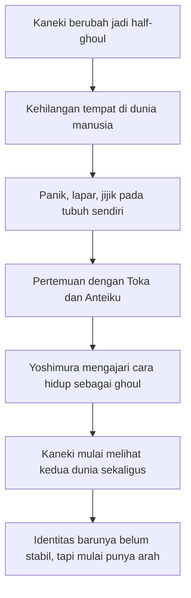
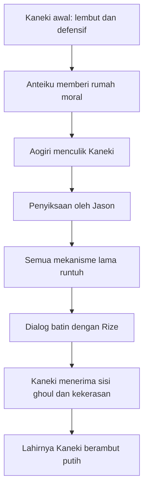
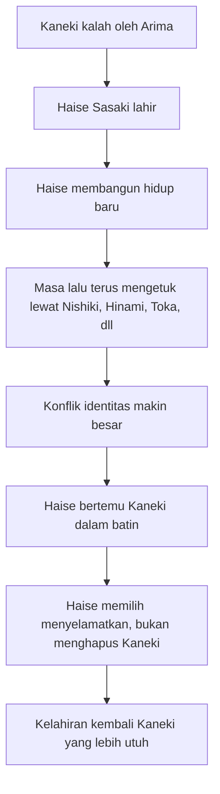
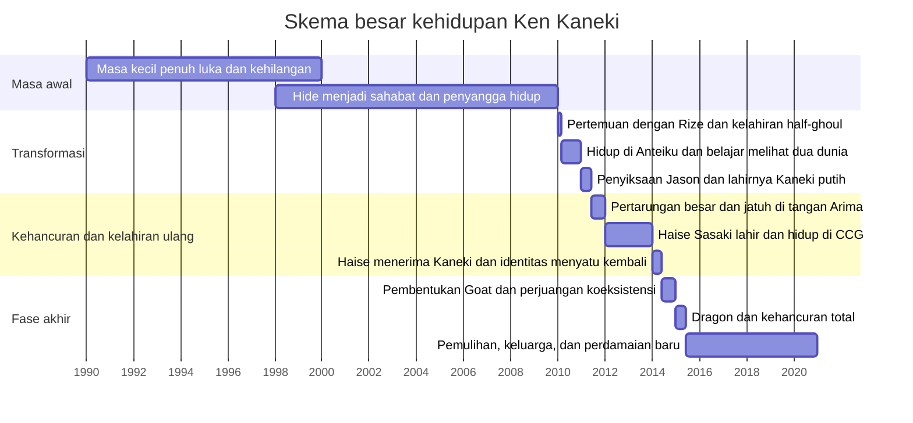

## 🩸 Pendahuluan: Ken Kaneki Bukan Sekadar Tokoh Anime Tragis, tetapi Peta Luka Manusia yang Dipaksa Terus Berubah untuk Bertahan Hidup

Kalau ada satu tokoh manga-anime modern yang benar-benar terasa seperti tubuh hidup dari krisis identitas, maka salah satu nama terkuatnya adalah **Ken Kaneki**. Ia bukan hanya protagonis yang menderita. Ia bukan pula sekadar tokoh yang “dibikin sengsara” agar cerita terasa gelap. Yang membuat Kaneki begitu membekas adalah bahwa hampir seluruh hidupnya dibangun di atas pertanyaan yang tidak pernah selesai: **siapa diriku, kalau tubuhku berubah, dunia menolakku, orang-orang yang kucintai terus terancam, dan setiap pilihan untuk bertahan justru menelan sebagian dari kemanusiaanku?** 🩸

Di permukaan, Tokyo Ghoul memang tampak seperti kisah aksi-horor tentang dunia tempat manusia dan ghoul hidup dalam konflik berdarah. Ada organisasi anti-ghoul, ada pertempuran, ada kekuatan biologis seperti *kagune* *(organ tempur ghoul)* dan *kakuja* *(bentuk evolusi ghoul hasil kanibalisme atau perkembangan ekstrem)*, ada konspirasi, dan ada transformasi tubuh yang brutal. Tetapi kalau kita hanya berhenti di sana, kita kehilangan inti terdalam dari kisah Kaneki.

Sebab Tokyo Ghoul pada dasarnya bukan sekadar cerita “manusia jadi monster”. Itu terlalu sederhana. Kisah Kaneki jauh lebih menyakitkan dan jauh lebih menarik: ia adalah cerita tentang seorang pemuda yang dari awal bahkan sebelum berubah menjadi setengah ghoul sebenarnya sudah hidup dalam luka, represi, kesepian, dan rasa tidak aman. Jadi ketika tubuhnya berubah, perubahan itu bukan awal krisis, melainkan ledakan dari krisis yang sebenarnya sudah lama bersembunyi di bawah permukaan. 🌑

Itulah mengapa hidup Kaneki terasa seperti rangkaian kelahiran dan kematian identitas:

- Kaneki si anak lembut yang membaca buku,
- Kaneki si mahasiswa pemalu,
- Kaneki si half-ghoul yang ketakutan,
- Kaneki si pelindung Anteiku,
- Kaneki si korban penyiksaan Jason,
- Kaneki yang menjadi dingin dan memisahkan diri,
- Kaneki yang “mati” dan lahir sebagai **Haise Sasaki**,
- Sasaki yang bingung pada dirinya sendiri,
- Kaneki yang kembali, tetapi tidak pernah bisa lagi menjadi orang yang dulu,
- hingga akhirnya Kaneki yang mencoba membangun dunia baru setelah melalui kehancuran total.

Kalau harus dirumuskan sebagai tesis utama, maka artikel ini berdiri di atas tesis berikut:

> **Kehidupan Ken Kaneki adalah perjalanan panjang tentang bagaimana seseorang yang terus-menerus dihancurkan oleh dunia, tubuh, trauma, dan pilihan-pilihan mustahil, tetap berusaha membentuk makna dari penderitaan itu—bukan dengan kembali menjadi manusia lama yang polos, tetapi dengan perlahan menerima seluruh luka, identitas, dan kontradiksi dirinya untuk menciptakan kemungkinan hidup yang baru.**

Maka tulisan ini tidak akan sekadar merangkum alur. Saya akan membedahnya sebagai kisah hidup yang utuh: dari masa kecilnya yang retak, pertemuannya dengan Rize, kehidupannya di Anteiku, konflik dengan CCG, kehancuran batin di bawah Yamori, kelahiran Haise Sasaki, pertempuran identitas, pembentukan Goat, tragedi Dragon, sampai penyelesaian yang pada akhirnya membawa Kaneki ke sesuatu yang sejak awal tampak mustahil: **perdamaian**. 🕊️

Dan seperti banyak kisah besar, yang akan terlihat nanti adalah bahwa musuh terbesar Kaneki tidak selalu ghoul lain, tidak selalu CCG, dan bahkan tidak selalu dunia. Sering kali musuh terbesarnya adalah satu pertanyaan yang terus mengejarnya dari awal sampai akhir:

> **“Apakah aku masih punya hak untuk hidup, dicintai, dan dibutuhkan, setelah semua hal yang telah kulalui dan kulakukan?”**

---

<Callout type="important" title="Tesis utama artikel ini">
Perjalanan Ken Kaneki bukan sekadar transformasi biologis dari manusia menjadi half-ghoul. Ini adalah kisah tentang trauma, identitas, kebutuhan untuk dicintai, rasa takut kehilangan, dan usaha menyusun kembali diri yang berkeping-keping hingga ia bisa memilih hidup bukan sebagai korban takdir, melainkan sebagai seseorang yang sadar penuh akan luka dan tanggung jawabnya.
</Callout>

---

## 📚 1. Masa Kecil Kaneki: Luka yang Sudah Ada Jauh Sebelum Rize Mengubah Tubuhnya

Salah satu hal paling penting yang sering terlewat kalau orang hanya mengenal Tokyo Ghoul lewat ringkasan cepat adalah ini: **Kaneki tidak memulai hidup sebagai anak yang utuh lalu rusak karena tragedi. Ia sudah tumbuh dalam luka sejak kecil.** 📚

Ayahnya meninggal ketika ia masih sangat kecil, bahkan sebelum ia benar-benar sempat mengenalnya. Yang tersisa bagi Kaneki adalah jejak ayah dalam bentuk buku. Ia membaca buku-buku itu seolah sedang bercakap dengan seseorang yang tak pernah sempat sepenuhnya ia miliki. Dari situ kita bisa melihat sesuatu yang sangat penting tentang Kaneki: sejak awal, ia membangun hubungan dengan dunia lewat **bahasa, sastra, dan interioritas** *(kehidupan batin)*. Ia bukan anak yang keras, bukan anak yang agresif, dan bukan anak yang menaklukkan ruang dengan tubuh. Ia lebih dekat dengan kata-kata daripada kekerasan. 📖

Tetapi hidup tidak memberinya tempat aman.

Ibunya bekerja terlalu keras, dihimpit beban ekonomi dan tekanan dari saudarinya sendiri, yaitu bibi Kaneki. Dalam situasi itu, frustrasi sang ibu berbalik kepada Kaneki. Ia mengalami kekerasan dan perlakuan salah dari orang yang seharusnya menjadi tempat perlindungan. Hal yang lebih menyedihkan lagi, Kaneki kemudian **merepresi** *(menekan ke bawah sadar)* kenangan itu dan meyakinkan dirinya bahwa ibunya adalah sosok yang baik dan lembut.

Ini bukan detail kecil. Ini adalah kunci psikologis besar.

Karena dari sini kita memahami bahwa salah satu mekanisme utama Kaneki sejak kecil adalah:

- menekan rasa sakit,
- memelintir ingatan agar tetap bisa bertahan,
- menyalahkan diri sendiri diam-diam,
- dan terus berusaha menjadi anak “baik” agar tidak ditinggalkan.

Sesudah ibunya meninggal karena kerja berlebihan, Kaneki pindah ke keluarga bibinya. Tetapi rumah baru itu juga tidak memberinya kehangatan. Ia dibanding-bandingkan, diremehkan, dan terus dijadikan cermin bagi rasa inferior bibi terhadap ibu Kaneki. Hasilnya, keluarga bukan tempat pulang. Keluarga adalah tempat di mana Kaneki belajar bahwa kasih sayang bisa bersyarat, rapuh, dan penuh luka. 🥀

Di sinilah Hide menjadi sangat penting. Kehadiran **Hideyoshi Nagachika** atau **Hide** bukan cuma sebagai sahabat lucu. Hide adalah bukti pertama bahwa Kaneki benar-benar bisa dilihat, diterima, dan diselamatkan dari kesepian. Kalau tidak ada Hide, mungkin Kaneki akan tumbuh jauh lebih gelap sejak awal. Hide memberi satu hal yang hidup Kaneki kekurangan sejak kecil: **kehangatan tanpa syarat yang kasar atau manipulatif**. 🤝

---

## ☕ 2. Mahasiswa Pemalu, Buku, dan Ilusi Hidup Normal yang Sebenarnya Sudah Rapuh

Saat kita pertama kali bertemu Kaneki di awal cerita utama, ia tampak seperti mahasiswa yang canggung, pemalu, kutu buku, dan agak terlalu lembut untuk dunia yang keras. Ia suka membaca, ia gugup pada perempuan, dan ia tampak seperti seseorang yang hidup di pinggir keramaian, bukan di pusatnya. ☕

Dari satu sisi, ini membuatnya mudah disukai. Tetapi dari sisi lain, kita perlu sadar bahwa “kenormalan” Kaneki pada tahap ini sebenarnya adalah lapisan tipis di atas jiwa yang sangat rapuh. Ia tidak stabil karena:

- kebutuhan emosionalnya besar,
- harga dirinya rapuh,
- dan ia selalu ingin diterima tanpa benar-benar tahu bagaimana caranya mempertahankan diri.

Ini terlihat jelas ketika ia tertarik pada **Rize Kamishiro**. Bukan hanya karena Rize cantik, tetapi karena pertemuannya dengan Rize memenuhi beberapa hal yang sangat Kaneki dambakan:

- pengakuan,
- kedekatan intelektual melalui buku,
- dan sensasi bahwa ia akhirnya bisa masuk ke relasi yang tidak membuatnya merasa kecil.

Namun justru di sini tragedi tubuh Kaneki dimulai. Rize bukan jawaban atas kesepian itu, melainkan gerbang menuju pembelahan eksistensial total. 🌘

---

## 🧬 3. Rize dan Kelahiran Half-Ghoul: Saat Tubuh Kaneki Tidak Lagi Menjadi Rumah yang Bisa Ia Kenali

Peristiwa dengan Rize adalah salah satu momen paling ikonik dalam Tokyo Ghoul. Setelah menggiring Kaneki ke gang sepi, Rize mengungkapkan dirinya sebagai ghoul yang memang sejak awal berniat memangsanya. Kaneki ditikam dan nyaris tewas. Lalu secara absurd, balok baja jatuh menimpa Rize. Untuk menyelamatkan Kaneki, dokter Kano mentransplantasikan organ Rize ke tubuhnya. Sejak itulah Kaneki menjadi **half-human, half-ghoul** *(setengah manusia, setengah ghoul)*. 🧬

Secara plot, ini adalah titik balik utama. Tetapi secara filosofis, ini lebih dari sekadar mutasi. Ini adalah momen ketika Kaneki kehilangan kemungkinan untuk hidup utuh dalam kategori lama.

### Apa yang berubah?
- makanan manusia menjadi menjijikkan,
- lapar berubah menjadi neraka biologis,
- tubuhnya merespons dunia secara asing,
- identitas lamanya runtuh,
- dan yang paling penting: ia tidak lagi punya tempat penuh di dunia manusia, tetapi juga belum bisa menerima dunia ghoul.

Di sinilah salah satu kalimat paling penting dari fase awal Tokyo Ghoul muncul melalui Toka: Kaneki bukan sepenuhnya manusia, bukan pula ghoul biasa. Ia berada di antara dua dunia, dan justru karena itu ia merasa tidak punya tempat. 🔥

Tragedi tubuh ini sangat besar karena Kaneki adalah tipe orang yang sejak awal butuh rumah dan identitas yang stabil. Ketika tubuhnya berubah, yang runtuh bukan cuma pola makan. Yang runtuh adalah rasa “aku” yang selama ini sudah goyah.

---

## 🕯️ 4. Anteiku: Tempat Pertama Kaneki Belajar bahwa Dunia Ghoul Tidak Sesederhana Monster vs Manusia

Salah satu alasan Tokyo Ghoul menjadi lebih dari sekadar kisah monster adalah **Anteiku**. Kafe ini bukan cuma markas atau lokasi netral. Ia adalah ruang moral yang penting. Di sana, Kaneki pertama kali benar-benar belajar bahwa dunia ghoul tidak homogen. 🕯️

Melalui **Yoshimura**, **Toka**, **Yomo**, dan yang lain, Kaneki melihat bahwa ghoul bukan hanya pemangsa sadistik. Mereka juga:

- punya relasi,
- punya aturan,
- punya bentuk empati,
- punya cara bertahan hidup,
- dan punya upaya untuk hidup seminimal mungkin melukai manusia.

Yoshimura khususnya sangat penting. Ia memberi Kaneki sesuatu yang tidak dia dapat dari banyak figur orang dewasa dalam hidupnya: **pengarahan tanpa pemaksaan brutal**. Yoshimura tidak memaksa Kaneki menjadi ghoul penuh secara mental, tetapi mengajarinya cara hidup agar ia bisa mempertahankan tempatnya di kedua dunia.

Inilah yang membuat Anteiku menjadi rumah moral Kaneki. Di sini ia mulai melihat bahwa mungkin masih ada jalan hidup yang tidak dibangun di atas kekejaman total. Ia belum damai, belum menerima dirinya, tetapi untuk pertama kalinya ia melihat bahwa eksistensi campurannya bisa memiliki makna. ☕

---

## 👧 5. Hinami, Ryoko, dan Terbukanya Mata Kaneki terhadap Duka Kedua Pihak

Salah satu fase paling penting dalam pembentukan moral Kaneki adalah keterlibatannya dengan **Ryoko Fueguchi** dan **Hinami**. 👧

Lewat mereka, Kaneki melihat secara nyata bahwa ghoul juga bisa menjadi:

- ibu yang melindungi anak,
- anak yang kehilangan orang tua,
- korban dari struktur kekerasan yang lebih besar.

Kematian Ryoko di hadapan Hinami bukan cuma tragedi cerita. Bagi Kaneki, itu adalah momen kesadaran. Ia menyadari bahwa dunia ini tidak bisa dibaca dengan skema sederhana:

- manusia baik vs ghoul jahat,
- pemburu mulia vs monster keji.

Karena di sini, cinta orang tua, ketakutan kehilangan, dan duka anak bekerja persis sama di dua dunia. Ini adalah titik di mana Kaneki benar-benar mulai menjadi jembatan pandang. Dan dari sinilah nanti lahir salah satu identitas moralnya yang paling penting: **orang yang dapat melihat kesamaan manusia dan ghoul, justru karena ia hidup di antara keduanya.** 🌉

Ketika ia berhadapan dengan Amon dan berpikir bahwa kedua dunia ini sebenarnya bisa saling bicara jika duduk bersama, itu bukan idealisme kosong. Itu lahir dari pengalaman konkret. Kaneki mulai mengerti bahwa tragedi datang bukan hanya karena predator lapar, tetapi juga karena dunia dibangun sedemikian rupa sehingga kedua pihak saling melihat yang terburuk dari satu sama lain.

---

## 🍽️ 6. Gourmet, Nishio, dan Belajar bahwa Dunia Ghoul Juga Penuh Lapisan: Nafsu, Keangkuhan, dan Kesetiaan yang Rumit

Fase berikutnya memperluas dunia Kaneki. Ada **Nishio**, ada **Kimi**, ada **Tsukiyama** sang Gourmet, dan ada berbagai bentuk ghoul lain yang membuat Kaneki paham bahwa menjadi ghoul tidak otomatis berarti satu tipe kepribadian. 🍽️

### Nishio
Nishio awalnya tampak sinis, agresif, dan egoistis. Tetapi melalui relasinya dengan Kimi, Tokyo Ghoul menunjukkan bahwa bahkan ghoul yang kasar pun bisa mencintai dengan tulus. Ini penting karena sekali lagi Kaneki dipaksa melihat kompleksitas.

### Tsukiyama / The Gourmet
Tsukiyama mewakili sisi estetisasi, eksentris, dan pemuasan nafsu yang ekstrem di dunia ghoul. Obsesi Tsukiyama terhadap Kaneki pada awalnya sangat mengganggu, tetapi secara naratif ia juga membuka dimensi lain: bahwa keanehan, gairah, dan bahkan kegilaan di dunia ghoul bisa mengambil bentuk yang tidak sesederhana kebuasan telanjang.

Dari fase ini, Kaneki belajar dua hal besar:

1. Ghoul bukan blok moral tunggal.
2. Keterikatan, bahkan di dunia paling gelap, tetap bisa muncul dan menjadi sumber perubahan.

---

## ⛓️ 7. Aogiri dan Jason: Saat Kaneki Dihancurkan Total hingga Harus Melahirkan Diri Baru untuk Bertahan

Kalau ada satu titik di mana Ken Kaneki “mati” untuk pertama kalinya, itu adalah saat ia disiksa oleh **Yamori / Jason**. ⛓️

Bagian ini sangat penting, bukan cuma karena brutal, tetapi karena inilah momen ketika semua mekanisme bertahan hidup lama Kaneki tidak lagi cukup. Selama ini ia masih bisa:

- mempertahankan kelembutan,
- menyangkal sebagian kenyataan,
- berharap bisa menyelamatkan semua orang,
- dan hidup dengan semacam moralitas yang pasif tetapi bersih.

Jason menghancurkan itu semua.

Penyiksaan yang terus-menerus, ancaman pada orang lain, permainan sadistik, dan pengalaman tak berdaya yang ekstrem membuat Kaneki dipaksa memilih. Dan pilihan itu bukan pilihan antara baik dan jahat, tetapi antara:

- hancur total,
- atau melahirkan bentuk diri yang sanggup menanggung dunia ini.

Dalam halusinasi dan dialog batinnya dengan Rize, Kaneki pada akhirnya menerima bahwa menjadi lemah tidak lagi cukup kalau ia ingin melindungi orang lain. Maka lahirlah Kaneki berambut putih—figura yang jauh lebih dingin, jauh lebih tajam, dan jauh lebih siap menggunakan kekerasan. 🤍

Ini bukan “power up” biasa. Ini adalah kelahiran identitas baru yang dibayar dengan harga psikologis sangat mahal. Kaneki selamat, tetapi tidak utuh. Ia menjadi kuat, tetapi juga jauh lebih terpisah dari dirinya yang dulu.

---

## 🥀 8. Kaneki Putih: Kekuatan Baru, Dingin Baru, dan Kesalahpahaman bahwa Menjauh dari Orang-Orang Tercinta Adalah Bentuk Perlindungan

Sesudah keluar dari penyiksaan Jason, Kaneki berubah drastis. Ia lebih tenang, lebih mematikan, lebih strategis, dan tampak jauh lebih kuat. Tetapi justru di titik ini muncul satu pola tragis baru: **Kaneki mulai percaya bahwa satu-satunya cara melindungi orang yang ia cintai adalah dengan menjauh dari mereka.** 🥀

Ini pola yang sangat konsisten dalam hidupnya.

Karena ia trauma dengan ketidakberdayaan, ia menjadi terobsesi pada kendali. Dan karena ia terobsesi pada kendali, ia merasa harus memikul semuanya sendiri. Hasilnya:

- ia makin kuat,
- tetapi juga makin kesepian,
- makin sanggup bertarung,
- tetapi makin tidak sanggup membiarkan orang lain dekat,
- makin ingin melindungi,
- tetapi justru melukai orang dengan absensinya.

Ini terlihat jelas dalam keputusannya untuk tidak kembali ke Anteiku secara penuh. Ia menerima bantuan orang seperti Banjo, Tsukiyama, dan Hinami, tetapi tetap membatasi kedekatan. Toka tidak dibiarkan ikut. Dengan kata lain, Kaneki mulai menjadikan dirinya semacam alat perlindungan, bukan lagi manusia yang hidup bersama orang lain. ⚠️

Di sinilah tragedi Kaneki makin rumit. Ia tidak jatuh karena jahat, tetapi karena mencintai dengan cara yang rusak oleh trauma.

---

## 🧪 9. Dr. Kano, Rize, dan Kenyataan bahwa Tubuh Kaneki Sejak Awal Adalah Medan Eksperimen, Bukan Rumah yang Netral

Seiring berjalannya cerita, Kaneki makin dekat pada kebenaran tentang **Dr. Kano**. Ia bukan sekadar dokter gila. Ia adalah sosok yang menjadikan tubuh manusia sebagai laboratorium ideologis dan biologis. 🧪

Dari sinilah Kaneki makin sadar bahwa perubahannya bukan kecelakaan netral. Tubuhnya adalah hasil intervensi. Dan lebih buruk lagi, organ Rize yang ada di dalam dirinya membawa potensi abnormal yang sangat besar. Rize bukan sekadar donor paksa; ia adalah inti biologis dan simbolik dari banyak transformasi Kaneki.

Pengetahuan ini menghantam Kaneki di dua level:

1. **Tubuhnya bukan lagi miliknya sepenuhnya.**
2. **Kekuatan yang ia andalkan juga mengandung benih kehancuran.**

Semakin besar kekuatannya, semakin jelas pula bahwa tubuhnya adalah ladang eksperimen dan potensi monster yang belum selesai. Ini membuat identitas Kaneki makin retak: kalau tubuhku dibangun dari hal yang tidak kupilih, lalu apa yang masih bisa kusebut “aku”? 😶

---

## 🐍 10. Shachi, Takisawa, Kurona, dan Jalan Menjadi Kuat yang Selalu Menuntut Harga Baru

Setelah fase awal transformasinya, Kaneki terus dipaksa menghadapi lawan-lawan yang bukan hanya kuat, tetapi juga memperlihatkan jalan-jalan alternatif dari penderitaan. 🐍

- **Shachi** menunjukkan superioritas kekuatan yang tenang dan mapan.
- **Takizawa** menjadi cermin lain dari kehancuran identitas melalui eksperimen dan trauma.
- **Kurona** memperlihatkan luka dari menjadi “produk gagal” atau subjek eksperimen yang diperlakukan seperti objek.

Melalui semua ini, Kaneki terus menghadapi satu pelajaran pahit: **setiap bentuk kekuatan membawa biaya.**

Tidak ada kekuatan murni. Tidak ada transformasi tanpa amputasi batin tertentu. Dan semakin ia bergerak ke arah yang lebih kuat, semakin jelas bahwa ia tidak sedang “naik level” seperti pahlawan shonen biasa. Ia justru bergerak semakin dalam ke wilayah di mana kemanusiaan, tubuh, dan tanggung jawab bercampur secara menyakitkan.

---

## 🕳️ 11. Owl Suppression, Arima, dan Runtuhnya Kaneki untuk Kedua Kali

Puncak kehancuran besar berikutnya datang dalam **Owl Suppression Operation**. Di sini Kaneki bukan hanya berhadapan dengan CCG, tetapi khususnya dengan **Kisho Arima**, sosok yang nyaris seperti dinding absolut dalam semesta Tokyo Ghoul. 🕳️

Arima adalah antitesis yang menakutkan bagi Kaneki:

- sangat terampil,
- sangat tenang,
- sangat mematikan,
- dan seolah tidak menyisakan ruang bagi spontanitas Kaneki.

Pertarungan ini penting bukan hanya karena Kaneki kalah, tetapi karena kekalahan itu nyaris menghancurkan seluruh struktur identitasnya. Sesudah ini, Kaneki jatuh ke titik paling rapuh: ia kehilangan ingatan dan masuk ke fase baru sebagai **Haise Sasaki**.

Dengan kata lain, Kaneki tidak hanya kalah secara fisik. Ia kehilangan kontinuitas dirinya. Ini adalah kematian kedua—lebih halus, tetapi mungkin lebih total. ☁️

---

## 🪞 12. Haise Sasaki: Kehidupan Baru yang Lembut, tetapi Dibangun di Atas Penghapusan Diri Lama

**Haise Sasaki** adalah salah satu bagian paling tragis sekaligus paling indah dalam Tokyo Ghoul. Ia hidup sebagai investigator CCG, mentor Quinx, bawahan yang disayang Arima dan Akira, serta sosok yang relatif stabil secara sosial. Di atas kertas, hidup ini lebih rapi daripada hidup Kaneki sebelumnya. 🪞

Tetapi justru di situlah letak tragedinya: stabilitas Haise dibangun di atas penghapusan Kaneki.

Haise punya:

- tugas,
- keluarga semu,
- peran sosial,
- dan ritme hidup yang lebih bisa dipahami.

Namun jauh di dalam dirinya, Kaneki tidak pernah benar-benar hilang. Ia hadir sebagai suara, mimpi buruk, aura ancaman, dan keberadaan yang terus bertanya: apakah Haise hanya hidup karena Kaneki dipenjara dalam bawah sadar?

Ini membuat Haise menjadi sosok yang sangat menyentuh. Ia bukan penipu. Ia sungguh hidup. Ia sungguh merawat Quinx. Ia sungguh berusaha menjadi baik. Tetapi keberadaannya sendiri selalu berada dalam ancaman pembatalan. Maka rasa takut terbesar Haise adalah ini:

> **kalau Kaneki kembali, apakah itu berarti aku harus mati?**

Dan rasa takut terbesar Kaneki di sisi lain adalah:

> **kalau Haise tetap hidup, apakah itu berarti aku dihapus?**

Itulah salah satu konflik identitas paling menyakitkan dalam seluruh seri. 🌫️

---

## 👥 13. Quinx Squad dan Haise: Keluarga Semu yang Justru Membuat Taruhan Identitas Menjadi Makin Besar

Sebagai mentor **Quinx Squad**, Haise membentuk relasi yang sangat penting. Dengan Mutski, Uri, Shirazu, dan Saiko, ia bukan sekadar atasan. Ia seperti kakak, guru, dan pusat gravitasi emosional. 👥

Ini sangat penting karena Quinx memberi Haise sesuatu yang Anteiku pernah beri pada Kaneki: rasa memiliki. Namun ada perbedaan besar:

- Anteiku menerima Kaneki apa adanya di dunia ghoul.
- Quinx menerima Haise dalam dunia manusia yang dibangun di atas kebohongan struktural tentang siapa dirinya.

Artinya, semakin Quinx menjadi keluarga baginya, semakin besar pula teror bahwa jika Kaneki kembali sepenuhnya, semua ini akan hilang. Karena itu konflik internal Haise sangat manusiawi. Ia ingin:

- melindungi squad-nya,
- tetap menjadi orang baik,
- dan mempertahankan hidup yang sekarang.

Tetapi kebenaran masa lalu terus mengetuk. Dan kebenaran itu tidak bisa selamanya ditunda.

---

## 🐍 14. Nishiki, Hinami, Toka, dan Semua Orang yang Membuktikan bahwa Kaneki Lama Masih Hidup di Dalam Haise

Semakin banyak Haise bertemu dengan orang-orang dari hidup lama Kaneki—Nishiki, Hinami, Toka, Uta, Tsukiyama—semakin tipis dinding antara Haise dan Kaneki. 🐍

Setiap pertemuan semacam ini bekerja seperti pukulan pada struktur identitas buatannya. Orang-orang itu tidak melihat Haise sepenuhnya sebagai orang baru. Mereka melihat bekas, jejak, dan resonansi Kaneki di dalam dirinya. Hinami tetap memanggilnya dengan perasaan yang sama. Toka memunculkan rasa yang tidak bisa dijelaskan hanya dengan logika CCG. Nishiki memancing memori dan respons otomatis.

Ini membuat hidup Haise menjadi tragis karena ia mulai memahami bahwa dirinya sekarang bukan tabula rasa *(kertas kosong)*. Ia adalah keberadaan yang dibangun di atas seseorang yang belum selesai.

Dan semakin kuat ikatan-ikatan lama itu muncul, semakin sulit baginya mempertahankan ilusi bahwa ia bisa hidup bahagia hanya sebagai Haise Sasaki. 🫥

---

## ⚰️ 15. Auction, Rose, dan Kembalinya Kaneki: Saat Haise Akhirnya Memilih Menyelamatkan Kaneki, Bukan Menghapusnya

Puncak konflik Haise–Kaneki terjadi dalam rangkaian **Auction** dan **Rose Extermination**. Di sini Haise didorong ke batas mutlak oleh penderitaan, pertarungan, dan benturan dengan tokoh-tokoh seperti Takizawa, Eto, dan lain-lain. ⚰️

Pada akhirnya, yang terjadi bukan “Kaneki membunuh Haise” secara sederhana. Yang terjadi justru lebih kompleks dan lebih indah: **Haise mengakui Kaneki.**

Ini titik yang sangat penting secara psikologis. Sebab penyembuhan identitas tidak datang lewat penghapusan salah satu diri, tetapi lewat penerimaan bahwa keduanya adalah bagian dari kontinuitas yang sama. Haise akhirnya melihat bahwa Kaneki juga takut dihapus. Kaneki juga rapuh. Kaneki bukan monster yang mau memakan dirinya, tetapi diri lama yang selama ini terkurung dan menunggu diakui.

Ketika Haise berkata bahwa ia akan menyelamatkan Kaneki, itu adalah momen rekonsiliasi internal yang luar biasa besar. Dari situ, Kaneki kembali—bukan sebagai pemuda yang dulu, tetapi sebagai diri yang sudah melewati pecah-belah identitas dan mulai menyatukannya kembali. 🌗

---

## 👑 16. Goat dan Kaneki Baru: Bukan Lagi Sekadar Ingin Selamat, tetapi Ingin Menciptakan Dunia Baru

Sesudah kembali, Kaneki tidak hanya hidup untuk dirinya sendiri. Ia mengambil posisi yang jauh lebih besar dengan membentuk **Goat**, organisasi yang dimaksudkan untuk mengumpulkan ghoul dari berbagai faksi dan mengarah pada sesuatu yang sebelumnya nyaris mustahil: **koeksistensi** antara manusia dan ghoul. 👑

Ini perkembangan besar. Dulu Kaneki hanya ingin:

- bertahan,
- melindungi orang terdekat,
- dan menemukan tempat hidup.

Sekarang ia mulai berpikir secara struktural. Ia sadar bahwa luka pribadinya tidak bisa dipulihkan jika dunia tetap bekerja dengan mesin konflik yang sama. Maka ia mencoba membangun sesuatu yang melampaui dirinya.

Namun ini juga tragis. Sebab untuk mendorong perdamaian, ia harus memimpin kekuatan yang juga berisi kekerasan, dendam, dan sejarah panjang pertumpahan darah. Dengan kata lain, Kaneki mencoba mengarah ke damai sambil berdiri di atas fondasi dunia yang terus mendorong perang. Itu membuat jalannya sangat rapuh. 🌪️

---

## 💍 17. Toka, Cinta, dan Keputusan untuk Tetap Memilih Kehidupan Meski Dunia Belum Sembuh

Hubungan Kaneki dan Toka adalah salah satu urat nadi emosional terpenting di paruh akhir cerita. 💍

Toka adalah orang yang sejak awal melihat Kaneki dalam banyak fase:

- Kaneki yang bingung,
- Kaneki yang rapuh,
- Kaneki yang sok melindungi sendirian,
- Kaneki yang hancur,
- Haise yang asing tetapi familiar,
- hingga Kaneki yang kembali.

Yang membuat hubungan mereka kuat bukan karena romantis secara dangkal, tetapi karena Toka menolak ilusi Kaneki berkali-kali. Ia memukul, menantang, menolak, dan memaksa Kaneki melihat dirinya dengan lebih jujur. Karena itu, ketika akhirnya mereka benar-benar bersatu, itu bukan sekadar hadiah cinta. Itu adalah keputusan untuk tetap memilih kehidupan, tubuh, dan masa depan meski dunia di sekitar mereka belum aman.

Kehamilan Toka dan pernikahan mereka memberi lapisan baru: sekarang Kaneki tidak lagi hanya memikul masa lalu dan misi politik, tetapi juga masa depan yang konkret. Ini membuat taruhannya jauh lebih besar. 🌱

---

## 🐉 18. Dragon: Ketika Semua Beban, Rasa Bersalah, dan Keputusasaan Kaneki Akhirnya Meledak Menjadi Bencana yang Menelan Kota

Jika kita mencari momen paling apokaliptik dalam hidup Kaneki, maka jawabannya adalah **Dragon**. 🐉

Sesudah rangkaian kekalahan, tekanan, pilihan mustahil, manipulasi Furuta, kematian, pengkhianatan, ancaman terhadap orang-orang tercinta, dan dorongan untuk terus menjadi kuat demi menyelamatkan semuanya, Kaneki akhirnya runtuh ke bentuk paling ekstrem. Ia berubah menjadi Dragon—monstrositas besar yang bukan hanya kehancuran fisik, tetapi juga simbol ledakan dari seluruh kontradiksi hidupnya.

Dragon penting karena ia memperlihatkan bahwa bahkan idealisme Kaneki pun punya sisi gelap. Ia ingin menyelamatkan semua orang, tetapi dorongan itu, bila dipaksakan lewat tubuh yang sudah terlalu rusak dan jiwa yang terlalu menanggung, justru meledak menjadi malapetaka.

Dengan kata lain:

- cinta yang terlalu berat bisa berubah jadi kehancuran,
- keinginan melindungi tanpa batas bisa menjadi kontrol yang mengerikan,
- dan trauma yang tidak pernah benar-benar selesai dapat meledak pada skala kolektif.

Dragon bukan sekadar monster. Ia adalah bentuk raksasa dari semua luka Kaneki yang akhirnya tidak bisa lagi ditahan. 🫀

---

## 🌊 19. Di Dalam Dragon: Pengakuan Paling Jujur Kaneki—Aku Hanya Ingin Dibutuhkan oleh Seseorang

Salah satu bagian paling kuat secara emosional dalam seluruh perjalanan Kaneki adalah dialog batinnya di dalam Dragon bersama representasi Rize. 🌊

Di sana, semua pembelaan runtuh. Semua slogan besar tidak cukup. Dan Kaneki akhirnya sampai pada pengakuan paling telanjang:

> **ia hanya ingin dibutuhkan oleh seseorang.**

Kalimat ini luar biasa penting. Karena sesungguhnya, kalau kita tarik garis dari masa kecilnya sampai titik ini, hampir semua hal dalam hidup Kaneki selalu berputar di sekitar kebutuhan itu:

- ingin dicintai,
- ingin diterima,
- ingin tidak ditinggalkan,
- ingin memiliki tempat,
- ingin keberadaannya berarti bagi orang lain.

Jadi bahkan perjuangannya yang tampak heroik pun tidak sepenuhnya murni dari ego dan kebutuhan afeksi. Kaneki akhirnya menyadari itu. Dan justru kesadaran inilah yang membuatnya matang. Ia berhenti berpura-pura bahwa semua yang ia lakukan murni demi ideal abstrak. Ia mengakui egoisme, kebutuhan, dan dosa dirinya.

Tetapi pengakuan itu bukan akhir. Setelah semua itu, ia tetap memilih kembali. Ia tidak tinggal di ruang batin yang nyaman. Ia memutuskan untuk keluar dan menanggung akibat. Itulah yang membuat momen ini begitu besar: **Kaneki tidak diselamatkan oleh ilusi tentang kesuciannya, tetapi oleh keberanian untuk menerima bahwa ia tidak murni—dan tetap memilih hidup.** 🌤️

---

## 🛡️ 20. Furuta: Musuh Cermin yang Menunjukkan Seperti Apa Kaneki Jika Ia Menyerah pada Kekosongan

**Kichimura Furuta** adalah salah satu antagonis paling menarik justru karena ia bukan lawan yang sepenuhnya asing bagi Kaneki. Dalam banyak hal, Furuta bisa dibaca sebagai cermin gelap. 🛡️

Ia juga:

- lahir dari struktur manipulatif,
- memikul warisan yang tidak ia pilih,
- punya hubungan dengan Rize,
- dan tahu bahwa dunia ini rusak sampai akar.

Bedanya, Furuta menjawab semua itu dengan permainan nihilistik, manipulasi, dan perusakan berskala besar. Ia seperti seseorang yang berkata: kalau dunia ini kacau dan palsu, maka aku akan bermain sampai batas terjauh, sambil menertawakan semuanya.

Kaneki, sebaliknya, meski juga remuk dan tidak suci, tetap bergerak ke arah yang berbeda. Ia masih mencari keterhubungan, makna, dan jalan untuk menyelamatkan sesuatu. Maka benturan Kaneki–Furuta bukan sekadar duel final. Itu adalah benturan dua jawaban berbeda terhadap dunia yang sama-sama absurd. ⚔️

---

## 🌅 21. Penyelesaian: Perdamaian, Keluarga, dan Kaneki yang Akhirnya Tidak Lagi Hanya Bertahan, tetapi Benar-Benar Hidup

Sesudah Dragon dan semua kehancuran itu, Tokyo Ghoul akhirnya bergerak ke penutup yang memberi sesuatu yang sangat jarang didapat Kaneki sepanjang hidupnya: **kelanjutan hidup yang tidak sepenuhnya dibangun dari ketakutan.** 🌅

Beberapa tahun sesudah perang besar itu, manusia dan ghoul mulai bergerak menuju koeksistensi. Kaneki hidup bersama Toka, memiliki anak, dan berada di dalam dunia yang belum sempurna tetapi jauh lebih damai daripada sebelumnya.

Yang penting di sini bukan sekadar “happy ending”. Yang lebih penting adalah makna dari akhir itu. Kaneki sampai ke sana bukan karena semua penderitaan dibatalkan. Tidak. Semua luka tetap ada. Semua kehilangan tetap nyata. Semua dosa juga tidak hilang begitu saja. Tetapi akhirnya, Kaneki menemukan bentuk hidup yang tidak lagi semata reaktif terhadap trauma.

Ia tidak cuma bertahan. Ia hidup.

Dan bagi seseorang seperti Kaneki, itu mungkin adalah kemenangan terbesar. Bukan kemenangan atas ghoul, atas CCG, atau atas Furuta, tetapi kemenangan atas pola lama yang selalu membuatnya hidup hanya dari rasa takut kehilangan. 🕊️

---

## 🔚 Kesimpulan: Hidup Ken Kaneki adalah Kisah tentang Menjadi Manusia Bukan dengan Kembali ke Kepolosan Lama, tetapi dengan Menerima Seluruh Luka dan Tetap Memilih Hubungan

Kalau seluruh hidup Ken Kaneki diringkas ke satu inti, maka inti itu bukan “ia menjadi kuat”. Itu terlalu kecil. Inti sejatinya adalah ini: **Kaneki belajar bahwa menjadi manusia tidak berarti tetap murni, tidak terluka, atau tidak berubah; menjadi manusia berarti tetap mampu memilih keterhubungan, tanggung jawab, dan kasih sayang bahkan sesudah diri kita hancur berkali-kali.** 🔚

Ia lahir dari keluarga yang tidak aman. Ia tumbuh dalam represi. Ia berubah tubuh secara paksa. Ia hidup di antara dua dunia. Ia dikhianati, disiksa, dipecah, dihapus, dilahirkan ulang, kehilangan teman, menjadi monster, dan menyaksikan dirinya sendiri menyebabkan bencana besar. Namun setelah semua itu, ia tidak berakhir sebagai mesin kebencian. Ia tetap bergerak menuju sesuatu yang nyaris mustahil: **pemahaman**.

Karena itu, hidup Ken Kaneki begitu kuat bukan karena ia paling keren, paling tragis, atau paling kuat. Ia kuat karena ia mewakili sesuatu yang sangat manusiawi:

- keinginan untuk dibutuhkan,
- rasa takut untuk sendirian,
- godaan untuk lari dari diri sendiri,
- dan kebutuhan untuk akhirnya menerima bahwa kita adalah gabungan dari semua luka, cinta, dosa, dan harapan yang pernah membentuk kita.

Mungkin kalimat terbaik untuk mengingat seluruh perjalanannya adalah ini:

> **Ken Kaneki tidak menang dengan kembali menjadi anak baik yang dulu, dan tidak pula dengan menyerah sepenuhnya pada monster di dalam dirinya; ia menang ketika akhirnya bisa mengakui keduanya, menanggung keduanya, lalu tetap memilih hidup bersama orang lain.**

Dan justru di situlah Tokyo Ghoul menjadi lebih dari cerita horor. Ia menjadi kisah tentang bagaimana seseorang yang telah kehilangan rumah berkali-kali, pada akhirnya belajar membangun rumah itu di dalam dirinya sendiri—lalu membaginya dengan orang lain. 🏠

---

## Glosarium istilah asing + padanan Indonesia

| Istilah | Padanan / Penjelasan |
|---|---|
| ghoul | makhluk pemakan manusia dalam dunia Tokyo Ghoul |
| half-ghoul | setengah ghoul; manusia yang berubah atau dicampur dengan unsur ghoul |
| kagune | organ tempur ghoul yang keluar dari tubuh |
| kakuja | bentuk evolusi/kondisi tempur ekstrem ghoul |
| one-eyed ghoul | ghoul bermata satu; istilah untuk hybrid atau kasus khusus tertentu |
| RC cells | sel RC; unsur biologis utama dalam tubuh ghoul dan quinx |
| RC suppressants | penekan RC; obat untuk menahan atau melemahkan aktivitas RC |
| Quinx | manusia hasil modifikasi dengan kemampuan seperti ghoul tetapi dikendalikan CCG |
| CCG | Commission of Counter Ghoul; lembaga pemburu ghoul |
| Anteiku | kafe yang menjadi tempat netral sekaligus rumah moral bagi Kaneki awal |
| Goat | organisasi yang dipimpin Kaneki untuk menyatukan banyak faksi ghoul |
| identity crisis | krisis identitas; kebingungan atau retaknya rasa diri |
| repression | represi; penekanan pengalaman atau ingatan ke alam bawah sadar |
| coexistence | koeksistensi; hidup berdampingan secara damai |
| nihilism | nihilisme; pandangan yang menganggap hidup, nilai, atau tujuan tidak bermakna |

---

---

<Callout type="quote" title="Satu kalimat untuk mengingat seluruh artikel ini">
Kehidupan Ken Kaneki adalah kisah tentang seseorang yang terus dipecah oleh dunia, tetapi justru melalui pecahannya itu ia belajar bentuk kemanusiaan yang lebih jujur, lebih sadar, dan lebih mampu mencintai.
</Callout>

---

<YouTube url="https://www.youtube.com/watch?v=W9nhp_HBiFs" title="The Life Of Ken Kaneki (Tokyo Ghoul)" />

---

<Callout type="cite" title="Referensi">
Sumber utama: transkrip video *The Life Of Ken Kaneki (Tokyo Ghoul)* dari YouTube, disusun ulang secara analitis dan reflektif dalam bahasa Indonesia.
</Callout>
