## 🎭 Pembuka: Di Balik Topeng Tanpa Wajah

*Di sebuah sudut kota Boston, terdapat sebuah gedung yang kini sudah berganti pemilik dan berganti fungsi. Tidak ada yang istimewa dari bangunan bertingkat dengan logo anjing di atasnya — kecuali bagi Greg House, yang masih ingat dengan jelas hari ketika gedung itu adalah markas Scientology Boston, dan ratusan orang dengan topeng Guy Fawkes berbaris di depannya, berteriak dan menyanyi lagu-lagu meme internet.*

*"Apa yang telah kita lakukan? Siapa kita? Dan bagaimana kita bisa melakukan ini?"* — Greg House

Itulah pertanyaan yang bergema di benaknya pada hari yang mengubah sejarah internet: 10 Februari 2008, hari ketika Anonymous turun ke jalan untuk pertama kalinya dalam sejarah mereka.

Kisah ini bukan hanya tentang hacking. Ini adalah salah satu **evolusi gerakan sosial paling unik dalam sejarah manusia** — sebuah organisme tanpa kepala, tanpa hierarki formal, dan tanpa wajah, yang pada puncaknya membuat NATO mengeluarkan dokumen resmi tentang mereka sebagai ancaman potensial terhadap negara-negara anggota.

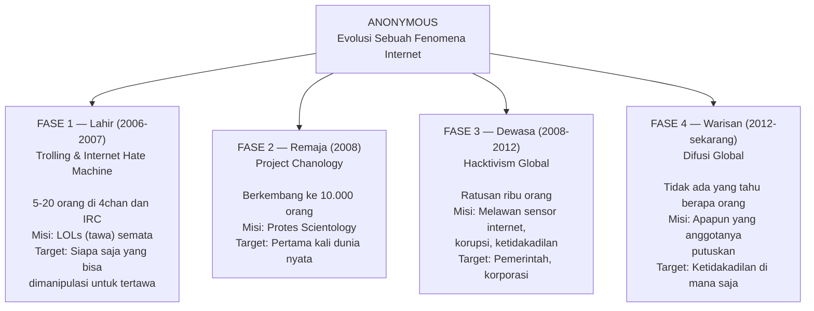
```mermaid
graph TD
    A["ANONYMOUS\nEvolusi Sebuah Fenomena Internet"]
    
    A --> B["FASE 1 — Lahir (2006-2007)\nTrolling & Internet Hate Machine\n\n5-20 orang di 4chan dan IRC\nMisi: LOLs (tawa) semata\nTarget: Siapa saja yang bisa\ndimanipulasi untuk tertawa"]
    
    A --> C["FASE 2 — Remaja (2008)\nProject Chanology\n\nBerkembang ke 10.000 orang\nMisi: Protes Scientology\nTarget: Pertama kali dunia nyata"]
    
    A --> D["FASE 3 — Dewasa (2008-2012)\nHacktivism Global\n\nRatusan ribu orang\nMisi: Melawan sensor internet,\nkorupsi, ketidakadilan\nTarget: Pemerintah, korporasi"]
    
    A --> E["FASE 4 — Warisan (2012-sekarang)\nDifusi Global\n\nTidak ada yang tahu berapa orang\nMisi: Apapun yang anggotanya\nputuskan\nTarget: Ketidakadilan di mana saja"]
```

---

## 📺 Narasumber: Greg House — Arsitek dari Balik Layar

Seluruh dokumenter ini berpusat pada satu orang: **Greg House**, seorang pria yang kini berusia pertengahan 40-an, tinggal di Malden, Massachusetts — kota di luar Boston yang, menurut kata-katanya, memiliki sejarah panjang revolusi dan inovasi teknologi.

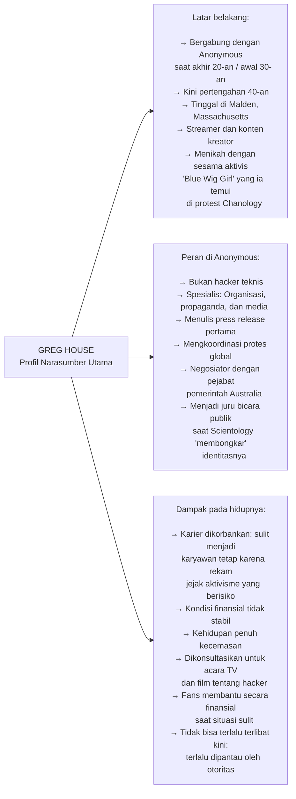
```mermaid
graph LR
    A["GREG HOUSE\nProfil Narasumber Utama"]
    
    A --> B["Latar belakang:\n\n→ Bergabung dengan Anonymous\n  saat akhir 20-an / awal 30-an\n→ Kini pertengahan 40-an\n→ Tinggal di Malden, Massachusetts\n→ Streamer dan konten kreator\n→ Menikah dengan sesama aktivis\n   'Blue Wig Girl' yang ia temui\n   di protest Chanology"]
    
    A --> C["Peran di Anonymous:\n\n→ Bukan hacker teknis\n→ Spesialis: Organisasi,\n   propaganda, dan media\n→ Menulis press release pertama\n→ Mengkoordinasi protes global\n→ Negosiator dengan pejabat\n   pemerintah Australia\n→ Menjadi juru bicara publik\n   saat Scientology 'membongkar'\n   identitasnya"]
    
    A --> D["Dampak pada hidupnya:\n\n→ Karier dikorbankan: sulit menjadi\n   karyawan tetap karena rekam\n   jejak aktivisme yang berisiko\n→ Kondisi finansial tidak stabil\n→ Kehidupan penuh kecemasan\n→ Dikonsultasikan untuk acara TV\n   dan film tentang hacker\n→ Fans membantu secara finansial\n   saat situasi sulit\n→ Tidak bisa terlalu terlibat kini:\n   terlalu dipantau oleh otoritas"]
```

> *"Aku tidak bisa memberi tahu seberapa besar yang kami lakukan hari itu. Tapi 8 jam setelah event, aku mulai berpikir: apa yang sudah kita lakukan? Siapa kita? Dan berapa banyak orang di seluruh dunia yang benar-benar datang ke event ini?"*

---

## 🐸 Bagian 1: Asal Muasal — Ketika Anonymous Masih Satu Orang Gila

Banyak orang salah kaprah tentang kapan Anonymous dimulai. Mereka mengira kelompok ini lahir sekitar 2012-2014 saat LulzSec (*Lulz Security*) sedang besar-besarnya. Kenyataannya, **akar Anonymous mundur hingga 2006** — hampir satu dekade sebelumnya.

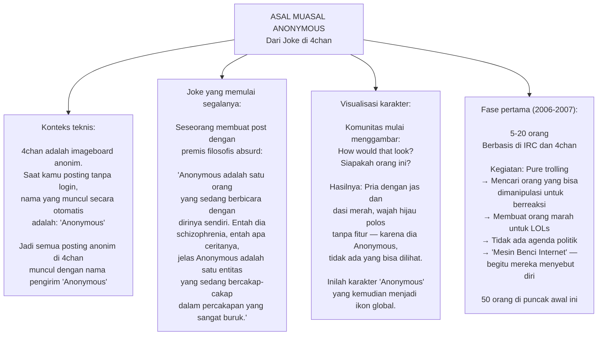
```mermaid
graph TD
    A["ASAL MUASAL ANONYMOUS\nDari Joke di 4chan"]
    
    A --> B["Konteks teknis:\n\n4chan adalah imageboard anonim.\nSaat kamu posting tanpa login,\nnama yang muncul secara otomatis\nadalah: 'Anonymous'\n\nJadi semua posting anonim di 4chan\nmuncul dengan nama pengirim 'Anonymous'"]
    
    A --> C["Joke yang memulai segalanya:\n\nSeseorang membuat post dengan\npremis filosofis absurd:\n\n'Anonymous adalah satu orang\nyang sedang berbicara dengan\ndirinya sendiri. Entah dia\nschizophrenia, entah apa ceritanya,\njelas Anonymous adalah satu entitas\nyang sedang bercakap-cakap\ndalam percakapan yang sangat buruk.'"]
    
    A --> D["Visualisasi karakter:\n\nKomunitas mulai menggambar:\nHow would that look?\nSiapakah orang ini?\n\nHasilnya: Pria dengan jas dan\ndasi merah, wajah hijau polos\ntanpa fitur — karena dia Anonymous,\ntidak ada yang bisa dilihat.\n\nInilah karakter 'Anonymous'\nyang kemudian menjadi ikon global."]
    
    A --> E["Fase pertama (2006-2007):\n\n5-20 orang\nBerbasis di IRC dan 4chan\n\nKegiatan: Pure trolling\n→ Mencari orang yang bisa\n  dimanipulasi untuk berreaksi\n→ Membuat orang marah untuk LOLs\n→ Tidak ada agenda politik\n→ 'Mesin Benci Internet' —\n  begitu mereka menyebut diri\n\n50 orang di puncak awal ini"]
```

### 🏊 Operasi Pertama: Habbo Hotel dan "Pools Closed"

Operasi pertama Anonymous yang tercatat adalah serangan iseng ke sebuah *massively multiplayer online game* (permainan online banyak pemain) bernama **Habbo Hotel**.

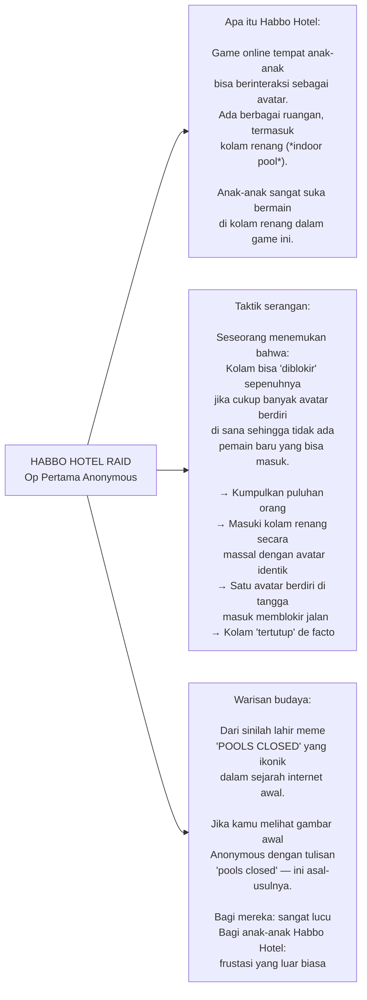
```mermaid
graph LR
    A["HABBO HOTEL RAID\nOp Pertama Anonymous"]
    
    A --> B["Apa itu Habbo Hotel:\n\nGame online tempat anak-anak\nbisa berinteraksi sebagai avatar.\nAda berbagai ruangan, termasuk\nkolam renang (*indoor pool*).\n\nAnak-anak sangat suka bermain\ndi kolam renang dalam game ini."]
    
    A --> C["Taktik serangan:\n\nSeseorang menemukan bahwa:\nKolam bisa 'diblokir' sepenuhnya\njika cukup banyak avatar berdiri\ndi sana sehingga tidak ada\npemain baru yang bisa masuk.\n\n→ Kumpulkan puluhan orang\n→ Masuki kolam renang secara\n  massal dengan avatar identik\n→ Satu avatar berdiri di tangga\n  masuk memblokir jalan\n→ Kolam 'tertutup' de facto"]
    
    A --> D["Warisan budaya:\n\nDari sinilah lahir meme\n'POOLS CLOSED' yang ikonik\ndalam sejarah internet awal.\n\nJika kamu melihat gambar awal\nAnonymous dengan tulisan\n'pools closed' — ini asal-usulnya.\n\nBagi mereka: sangat lucu\nBagi anak-anak Habbo Hotel:\nfrustasi yang luar biasa"]
```

### 📻 Hal Turner — Ketika Trolling Bertemu Tujuan Lebih Besar

Titik balik pertama Anonymous dari kelompok trolling menjadi sesuatu yang berbeda terjadi saat mereka menarget **Hal Turner** — seorang penyiar radio Neo-Nazi yang rasialis.

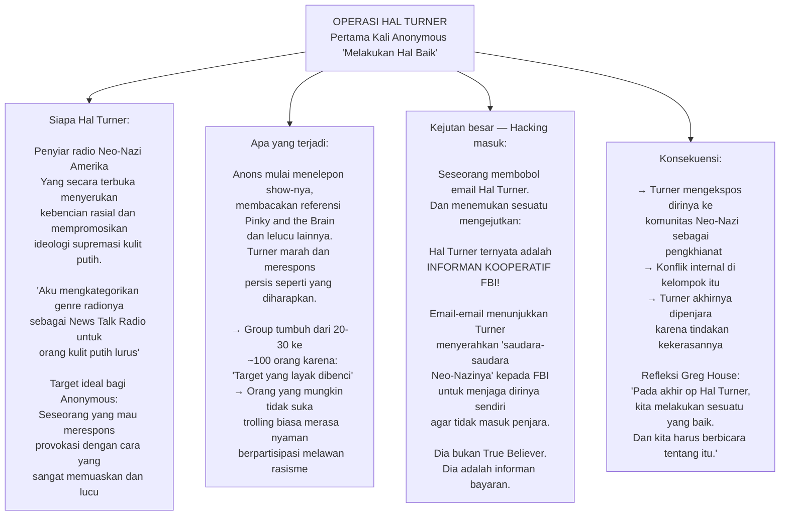
```mermaid
graph TD
    A["OPERASI HAL TURNER\nPertama Kali Anonymous 'Melakukan Hal Baik'"]
    
    A --> B["Siapa Hal Turner:\n\nPenyiar radio Neo-Nazi Amerika\nYang secara terbuka menyerukan\nkebencian rasial dan mempromosikan\nideologi supremasi kulit putih.\n\n'Aku mengkategorikan genre radionya\nsebagai News Talk Radio untuk\norang kulit putih lurus'\n\nTarget ideal bagi Anonymous:\nSeseorang yang mau merespons\nprovokasi dengan cara yang\nsangat memuaskan dan lucu"]
    
    A --> C["Apa yang terjadi:\n\nAnons mulai menelepon show-nya,\nmembacakan referensi Pinky and the Brain\ndan lelucu lainnya.\nTurner marah dan merespons\npersis seperti yang diharapkan.\n\n→ Group tumbuh dari 20-30 ke\n  ~100 orang karena:\n  'Target yang layak dibenci'\n→ Orang yang mungkin tidak suka\n  trolling biasa merasa nyaman\n  berpartisipasi melawan rasisme"]
    
    A --> D["Kejutan besar — Hacking masuk:\n\nSeseorang membobol email Hal Turner.\nDan menemukan sesuatu mengejutkan:\n\nHal Turner ternyata adalah\nINFORMAN KOOPERATIF FBI!\n\nEmail-email menunjukkan Turner\nmenyerahkan 'saudara-saudara\nNeo-Nazinya' kepada FBI\nuntuk menjaga dirinya sendiri\nagar tidak masuk penjara.\n\nDia bukan True Believer.\nDia adalah informan bayaran."]
    
    A --> E["Konsekuensi:\n\n→ Turner mengekspos dirinya ke\n  komunitas Neo-Nazi sebagai\n  pengkhianat\n→ Konflik internal di kelompok itu\n→ Turner akhirnya dipenjara\n  karena tindakan kekerasannya\n\nRefleksi Greg House:\n'Pada akhir op Hal Turner,\nkita melakukan sesuatu yang baik.\nDan kita harus berbicara tentang itu.'"]
```

Setelah operasi Hal Turner, muncul pertanyaan penting dalam kelompok kecil itu: *"Apakah ada target jahat lain seperti ini yang bisa kita kejar?"*

Mereka tidak ingin menjadi "orang baik" — tapi mereka menyadari bahwa melawan orang yang layak dilawan jauh lebih menyenangkan karena mereka tidak diserang balik atas tindakan mereka.

---

## ⛪ Bagian 2: Project Chanology — Ketika Internet Turun ke Jalan

### 🎬 Video Tom Cruise yang Memicu Semuanya

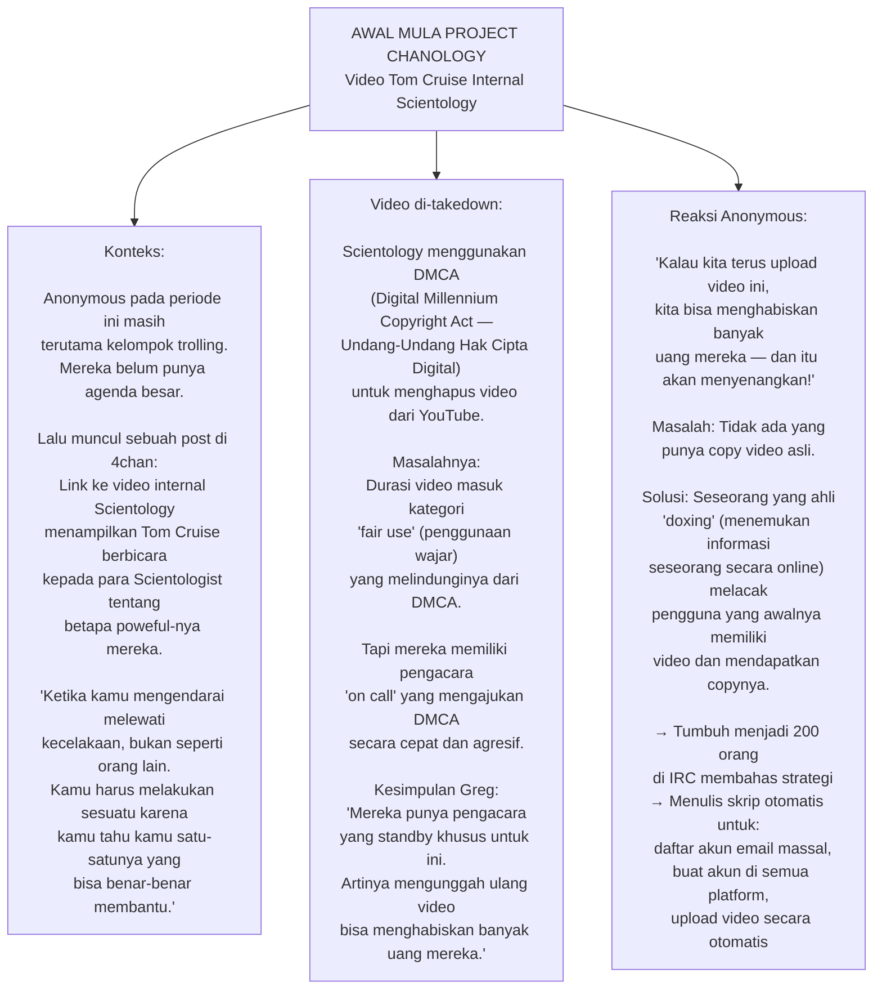
```mermaid
graph TD
    A["AWAL MULA PROJECT CHANOLOGY\nVideo Tom Cruise Internal Scientology"]
    
    A --> B["Konteks:\n\nAnonymous pada periode ini masih\nterutama kelompok trolling.\nMereka belum punya agenda besar.\n\nLalu muncul sebuah post di 4chan:\nLink ke video internal Scientology\nmenampilkan Tom Cruise berbicara\nkepada para Scientologist tentang\nbetapa poweful-nya mereka.\n\n'Ketika kamu mengendarai melewati\nkecelakaan, bukan seperti orang lain.\nKamu harus melakukan sesuatu karena\nkamu tahu kamu satu-satunya yang\nbisa benar-benar membantu.'"]
    
    A --> C["Video di-takedown:\n\nScientology menggunakan DMCA\n(Digital Millennium Copyright Act —\nUndang-Undang Hak Cipta Digital)\nuntuk menghapus video dari YouTube.\n\nMasalahnya:\nDurasi video masuk kategori\n'fair use' (penggunaan wajar)\nyang melindunginya dari DMCA.\n\nTapi mereka memiliki pengacara\n'on call' yang mengajukan DMCA\nsecara cepat dan agresif.\n\nKesimpulan Greg:\n'Mereka punya pengacara\nyang standby khusus untuk ini.\nArtinya mengunggah ulang video\nbisa menghabiskan banyak uang mereka.'"]
    
    A --> D["Reaksi Anonymous:\n\n'Kalau kita terus upload video ini,\nkita bisa menghabiskan banyak\nuang mereka — dan itu akan menyenangkan!'\n\nMasalah: Tidak ada yang\npunya copy video asli.\n\nSolusi: Seseorang yang ahli\n'doxing' (menemukan informasi\nseseorang secara online) melacak\npengguna yang awalnya memiliki\nvideo dan mendapatkan copynya.\n\n→ Tumbuh menjadi 200 orang\n  di IRC membahas strategi\n→ Menulis skrip otomatis untuk:\n  daftar akun email massal,\n  buat akun di semua platform,\n  upload video secara otomatis"]
```

### 📜 Kelahiran "Message to Scientology"

Dari strategi upload video sederhana, muncul ide yang jauh lebih besar:

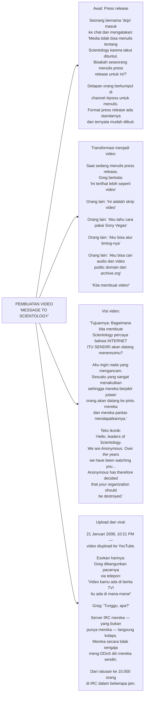
```mermaid
graph LR
    A["PEMBUATAN VIDEO\n'MESSAGE TO SCIENTOLOGY'"]
    
    A --> B["Awal: Press release\n\nSeorang bernama 'dojo' masuk\nke chat dan mengatakan:\n'Media tidak bisa menulis tentang\nScientology karena takut dituntut.\nBisakah seseorang menulis press\nrelease untuk ini?'\n\nDelapan orang berkumpul di\nchannel #press untuk menulis.\nFormat press release ada standarnya\ndan ternyata mudah diikuti."]
    
    A --> C["Transformasi menjadi video:\n\nSaat sedang menulis press release,\nGreg berkata:\n'Ini terlihat lebih seperti video'\n\nOrang lain: 'Ini adalah skrip video'\n\nOrang lain: 'Aku tahu cara pakai Sony Vegas'\n\nOrang lain: 'Aku bisa atur timing-nya'\n\nOrang lain: 'Aku bisa cari audio dan video\npublic domain dari archive.org'\n\n'Kita membuat video!'"]
    
    A --> D["Visi video:\n\n'Tujuannya: Bagaimana kita membuat\nScientology percaya bahwa INTERNET\nITU SENDIRI akan datang menemuimu?\n\nAku ingin nada yang mengancam.\nSesuatu yang sangat menakutkan\nsehingga mereka berpikir jutaan\norang akan datang ke pintu mereka\ndan mereka pantas mendapatkannya.'\n\nTeks ikonik:\n'Hello, leaders of Scientology.\nWe are Anonymous. Over the years\nwe have been watching you...\nAnonymous has therefore decided\nthat your organization should\nbe destroyed.'"]
    
    A --> E["Upload dan viral:\n\n21 Januari 2008, 10:21 PM —\nvideo diupload ke YouTube.\n\nEsokan harinya:\nGreg dibangunkan pacarnya\nvia telepon:\n'Video kamu ada di berita TV!\nItu ada di mana-mana!'\n\nGreg: 'Tunggu, apa?'\n\nServer IRC mereka — yang bukan\npunya mereka — langsung kolaps.\nMereka secara tidak sengaja\nmeng-DDoS diri mereka sendiri.\n\nDari ratusan ke 10.000 orang\ndi IRC dalam beberapa jam."]
```

### 🌐 Skala yang Tidak Terbayangkan

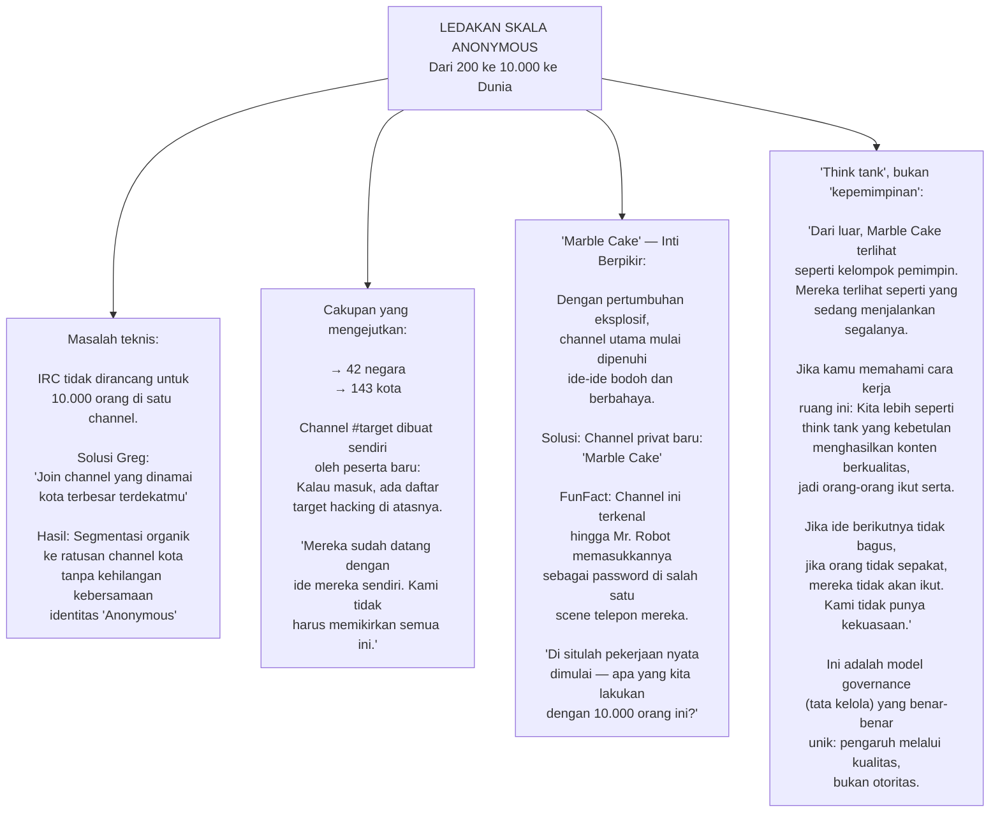
```mermaid
graph TD
    A["LEDAKAN SKALA ANONYMOUS\nDari 200 ke 10.000 ke Dunia"]
    
    A --> B["Masalah teknis:\n\nIRC tidak dirancang untuk\n10.000 orang di satu channel.\n\nSolusi Greg:\n'Join channel yang dinamai\nkota terbesar terdekatmu'\n\nHasil: Segmentasi organik\nke ratusan channel kota\ntanpa kehilangan kebersamaan\nidentitas 'Anonymous'"]
    
    A --> C["Cakupan yang mengejutkan:\n\n→ 42 negara\n→ 143 kota\n\nChannel #target dibuat sendiri\noleh peserta baru:\nKalau masuk, ada daftar\ntarget hacking di atasnya.\n\n'Mereka sudah datang dengan\nide mereka sendiri. Kami tidak\nharus memikirkan semua ini.'"]
    
    A --> D["'Marble Cake' — Inti Berpikir:\n\nDengan pertumbuhan eksplosif,\nchannel utama mulai dipenuhi\nide-ide bodoh dan berbahaya.\n\nSolusi: Channel privat baru:\n'Marble Cake'\n\nFunFact: Channel ini terkenal\nhingga Mr. Robot memasukkannya\nsebagai password di salah satu\nscene telepon mereka.\n\n'Di situlah pekerjaan nyata\ndimulai — apa yang kita lakukan\ndengan 10.000 orang ini?'"]
    
    A --> E["'Think tank', bukan 'kepemimpinan':\n\n'Dari luar, Marble Cake terlihat\nseperti kelompok pemimpin.\nMereka terlihat seperti yang\nsedang menjalankan segalanya.\n\nJika kamu memahami cara kerja\nruang ini: Kita lebih seperti\nthink tank yang kebetulan\nmenghasilkan konten berkualitas,\njadi orang-orang ikut serta.\n\nJika ide berikutnya tidak bagus,\njika orang tidak sepakat,\nmereka tidak akan ikut.\nKami tidak punya kekuasaan.'\n\nIni adalah model governance\n(tata kelola) yang benar-benar\nunik: pengaruh melalui kualitas,\nbukan otoritas."]
```

---

## 🎭 Bagian 3: Topeng Guy Fawkes — Kecelakaan Brilian

Salah satu elemen paling ikonik dari Anonymous — topeng Guy Fawkes — lahir bukan dari perencanaan, tapi dari **kecelakaan pragmatis**.

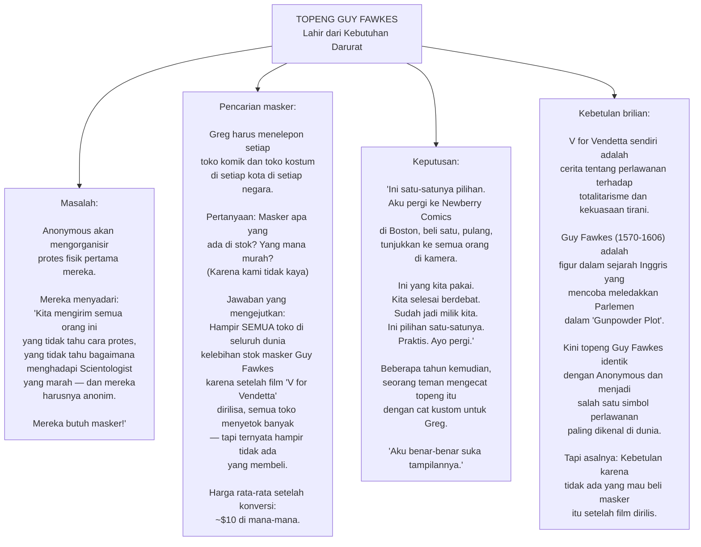
```mermaid
graph TD
    A["TOPENG GUY FAWKES\nLahir dari Kebutuhan Darurat"]
    
    A --> B["Masalah:\n\nAnonymous akan mengorganisir\nprotes fisik pertama mereka.\n\nMereka menyadari:\n'Kita mengirim semua orang ini\nyang tidak tahu cara protes,\nyang tidak tahu bagaimana\nmenghadapi Scientologist\nyang marah — dan mereka\nharusnya anonim.\n\nMereka butuh masker!'"]
    
    A --> C["Pencarian masker:\n\nGreg harus menelepon setiap\ntoko komik dan toko kostum\ndi setiap kota di setiap negara.\n\nPertanyaan: Masker apa yang\nada di stok? Yang mana murah?\n(Karena kami tidak kaya)\n\nJawaban yang mengejutkan:\nHampir SEMUA toko di seluruh dunia\nkelebihan stok masker Guy Fawkes\nkarena setelah film 'V for Vendetta'\ndirilisa, semua toko menyetok banyak\n— tapi ternyata hampir tidak ada\nyang membeli.\n\nHarga rata-rata setelah konversi:\n~$10 di mana-mana."]
    
    A --> D["Keputusan:\n\n'Ini satu-satunya pilihan.\nAku pergi ke Newberry Comics\ndi Boston, beli satu, pulang,\ntunjukkan ke semua orang di kamera.\n\nIni yang kita pakai.\nKita selesai berdebat.\nSudah jadi milik kita.\nIni pilihan satu-satunya.\nPraktis. Ayo pergi.'\n\nBeberapa tahun kemudian,\nseorang teman mengecat topeng itu\ndengan cat kustom untuk Greg.\n\n'Aku benar-benar suka tampilannya.'"]
    
    A --> E["Kebetulan brilian:\n\nV for Vendetta sendiri adalah\ncerita tentang perlawanan terhadap\ntotalitarisme dan kekuasaan tirani.\n\nGuy Fawkes (1570-1606) adalah\nfigur dalam sejarah Inggris yang\nmencoba meledakkan Parlemen\ndalam 'Gunpowder Plot'.\n\nKini topeng Guy Fawkes identik\ndengan Anonymous dan menjadi\nsalah satu simbol perlawanan\npaling dikenal di dunia.\n\nTapi asalnya: Kebetulan karena\ntidak ada yang mau beli masker\nitu setelah film dirilis."]
```

---

## 🌍 Bagian 4: 10 Februari 2008 — Hari yang Mengubah Segalanya

Ketika hari protes tiba, tidak ada yang tahu berapa banyak orang yang akan datang.

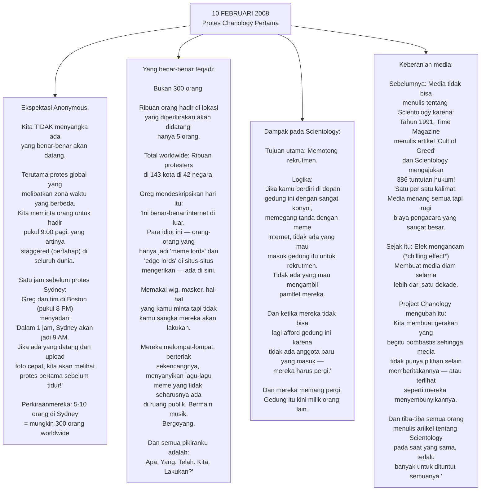
```mermaid
graph TD
    A["10 FEBRUARI 2008\nProtes Chanology Pertama"]
    
    A --> B["Ekspektasi Anonymous:\n\n'Kita TIDAK menyangka ada\nyang benar-benar akan datang.\n\nTerutama protes global yang\nmelibatkan zona waktu yang berbeda.\nKita meminta orang untuk hadir\npukul 9:00 pagi, yang artinya\nstaggered (bertahap) di seluruh dunia.'\n\nSatu jam sebelum protes Sydney:\nGreg dan tim di Boston (pukul 8 PM)\nmenyadari:\n'Dalam 1 jam, Sydney akan jadi 9 AM.\nJika ada yang datang dan upload\nfoto cepat, kita akan melihat\nprotes pertama sebelum tidur!'\n\nPerkiraanmereka: 5-10 orang di Sydney\n= mungkin 300 orang worldwide"]
    
    A --> C["Yang benar-benar terjadi:\n\nBukan 300 orang.\n\nRibuan orang hadir di lokasi\nyang diperkirakan akan didatangi\nhanya 5 orang.\n\nTotal worldwide: Ribuan protesters\ndi 143 kota di 42 negara.\n\nGreg mendeskripsikan hari itu:\n'Ini benar-benar internet di luar.\nPara idiot ini — orang-orang yang\nhanya jadi 'meme lords' dan\n'edge lords' di situs-situs\nmengerikan — ada di sini.\n\nMemakai wig, masker, hal-hal\nyang kamu minta tapi tidak\nkamu sangka mereka akan lakukan.\n\nMereka melompat-lompat, berteriak\nsekencangnya, menyanyikan lagu-lagu\nmeme yang tidak seharusnya ada\ndi ruang publik. Bermain musik.\nBergoyang.\n\nDan semua pikiranku adalah:\nApa. Yang. Telah. Kita. Lakukan?'"]
    
    A --> D["Dampak pada Scientology:\n\nTujuan utama: Memotong rekrutmen.\n\nLogika:\n'Jika kamu berdiri di depan\ngedung ini dengan sangat konyol,\nmemegang tanda dengan meme\ninternet, tidak ada yang mau\nmasuk gedung itu untuk rekrutmen.\nTidak ada yang mau mengambil\npamflet mereka.\n\nDan ketika mereka tidak bisa\nlagi afford gedung ini karena\ntidak ada anggota baru yang masuk —\nmereka harus pergi.'\n\nDan mereka memang pergi.\nGedung itu kini milik orang lain."]
    
    A --> E["Keberanian media:\n\nSebelumnya: Media tidak bisa\nmenulis tentang Scientology karena:\nTahun 1991, Time Magazine\nmenulis artikel 'Cult of Greed'\ndan Scientology mengajukan\n386 tuntutan hukum!\nSatu per satu kalimat.\nMedia menang semua tapi rugi\nbiaya pengacara yang sangat besar.\n\nSejak itu: Efek mengancam (*chilling effect*)\nMembuat media diam selama\nlebih dari satu dekade.\n\nProject Chanology mengubah itu:\n'Kita membuat gerakan yang\nbegitu bombastis sehingga media\ntidak punya pilihan selain\nmemberitakannya — atau terlihat\nseperti mereka menyembunyikannya.\n\nDan tiba-tiba semua orang\nmenulis artikel tentang Scientology\npada saat yang sama, terlalu\nbanyak untuk dituntut semuanya.'"]
```

### 💒 Cinta di Tengah Revolusi

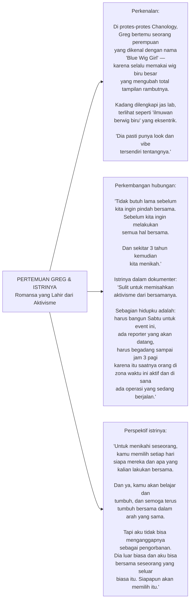
```mermaid
graph LR
    A["PERTEMUAN GREG & ISTRINYA\nRomansa yang Lahir dari Aktivisme"]
    
    A --> B["Perkenalan:\n\nDi protes-protes Chanology,\nGreg bertemu seorang perempuan\nyang dikenal dengan nama\n'Blue Wig Girl' —\nkarena selalu memakai wig biru besar\nyang mengubah total tampilan rambutnya.\n\nKadang dilengkapi jas lab,\nterlihat seperti 'ilmuwan\nberwig biru' yang eksentrik.\n\n'Dia pasti punya look dan vibe\ntersendiri tentangnya.'"]
    
    A --> C["Perkembangan hubungan:\n\n'Tidak butuh lama sebelum\nkita ingin pindah bersama.\nSebelum kita ingin melakukan\nsemua hal bersama.\n\nDan sekitar 3 tahun kemudian\nkita menikah.'\n\nIstrinya dalam dokumenter:\n'Sulit untuk memisahkan\naktivisme dari bersamanya.\n\nSebagian hidupku adalah:\nharus bangun Sabtu untuk event ini,\nada reporter yang akan datang,\nharus begadang sampai jam 3 pagi\nkarena itu saatnya orang di\nzona waktu ini aktif dan di sana\nada operasi yang sedang berjalan.'"]
    
    A --> D["Perspektif istrinya:\n\n'Untuk menikahi seseorang,\nkamu memilih setiap hari\nsiapa mereka dan apa yang\nkalian lakukan bersama.\n\nDan ya, kamu akan belajar dan\ntumbuh, dan semoga terus\ntumbuh bersama dalam arah yang sama.\n\nTapi aku tidak bisa menganggapnya\nsebagai pengorbanan.\nDia luar biasa dan aku bisa\nbersama seseorang yang seluar\nbiasa itu. Siapapun akan memilih itu.'"]
```

---

## 🏛️ Bagian 5: Tittstorm — Melawan Sensor Internet Australia

Setelah enam bulan protes Scientology, Anonymous tidak berencana ekspansi. Lalu datang seorang anak Australia.

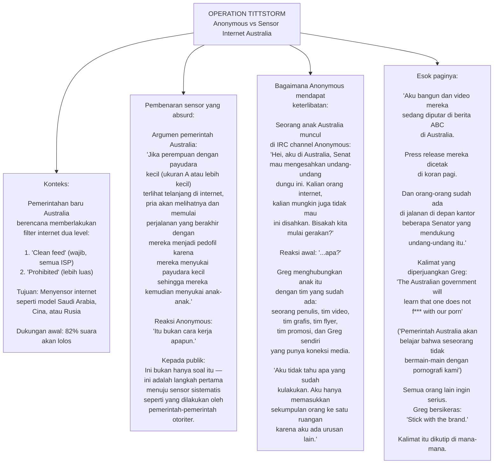
```mermaid
graph TD
    A["OPERATION TITTSTORM\nAnonymous vs Sensor Internet Australia"]
    
    A --> B["Konteks:\n\nPemerintahan baru Australia\nberencana memberlakukan\nfilter internet dua level:\n\n1. 'Clean feed' (wajib, semua ISP)\n2. 'Prohibited' (lebih luas)\n\nTujuan: Menyensor internet\nseperti model Saudi Arabia,\nCina, atau Rusia\n\nDukungan awal: 82% suara\nakan lolos"]
    
    A --> C["Pembenaran sensor yang absurd:\n\nArgumen pemerintah Australia:\n'Jika perempuan dengan payudara\nkecil (ukuran A atau lebih kecil)\nterlihat telanjang di internet,\npria akan melihatnya dan memulai\nperjalanan yang berakhir dengan\nmereka menjadi pedofil karena\nmereka menyukai payudara kecil\nsehingga mereka kemudian menyukai anak-anak.'\n\nReaksi Anonymous:\n'Itu bukan cara kerja apapun.'\n\nKepada publik:\nIni bukan hanya soal itu —\nini adalah langkah pertama\nmenuju sensor sistematis\nseperti yang dilakukan oleh\npemerintah-pemerintah otoriter."]
    
    A --> D["Bagaimana Anonymous mendapat\nketerlibatan:\n\nSeorang anak Australia muncul\ndi IRC channel Anonymous:\n'Hei, aku di Australia, Senat\nmau mengesahkan undang-undang\ndungu ini. Kalian orang internet,\nkalian mungkin juga tidak mau\nini disahkan. Bisakah kita\nmulai gerakan?'\n\nReaksi awal: '...apa?'\n\nGreg menghubungkan anak itu\ndengan tim yang sudah ada:\nseorang penulis, tim video,\ntim grafis, tim flyer,\ntim promosi, dan Greg sendiri\nyang punya koneksi media.\n\n'Aku tidak tahu apa yang sudah\nkulakukan. Aku hanya memasukkan\nsekumpulan orang ke satu ruangan\nkarena aku ada urusan lain.'"]
    
    A --> E["Esok paginya:\n\n'Aku bangun dan video mereka\nsedang diputar di berita ABC\ndi Australia.\n\nPress release mereka dicetak\ndi koran pagi.\n\nDan orang-orang sudah ada\ndi jalanan di depan kantor\nbeberapa Senator yang mendukung\nundang-undang itu.'\n\nKalimat yang diperjuangkan Greg:\n'The Australian government will\nlearn that one does not\nf*** with our porn'\n\n('Pemerintah Australia akan\nbelajar bahwa seseorang tidak\nbermain-main dengan pornografi kami')\n\nSemua orang lain ingin serius.\nGreg bersikeras:\n'Stick with the brand.'\n\nKalimat itu dikutip di mana-mana."]
```

### 📞 Negosiasi Langsung dengan Senator Australia

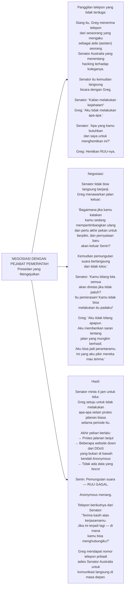
```mermaid
graph LR
    A["NEGOSIASI DENGAN PEJABAT PEMERINTAH\nPresedan yang Mengejutkan"]
    
    A --> B["Panggilan telepon yang tidak terduga:\n\nSiang itu, Greg menerima telepon\ndari seseorang yang mengaku\nsebagai aide (asisten) seorang\nSenator Australia yang menentang\nhacking terhadap koleganya.\n\nSenator itu kemudian langsung\nbicara dengan Greg.\n\nSenator: 'Kalian melakukan kejahatan!'\nGreg: 'Aku tidak melakukan apa-apa.'\n\nSenator: 'Apa yang kamu butuhkan\ndari saya untuk menghentikan ini?'\n\nGreg: Hentikan RUU-nya."]
    
    A --> C["Negosiasi:\n\nSenator tidak bisa langsung berjanji.\nGreg menawarkan jalan keluar:\n\n'Bagaimana jika kamu katakan\nkamu sedang mempertimbangkan ulang\ndan perlu akhir pekan untuk\nberpikir, dan pernyataan baru\nakan keluar Senin?\n\nKemudian pemungutan suara berlangsung\ndan tidak lolos.'\n\nSenator: 'Kamu bilang kita semua\nakan diretas jika tidak patuh?\nItu pemerasan! Kamu tidak bisa\nmelakukan itu padaku!'\n\nGreg: 'Aku tidak bilang apapun.\nAku memberikan saran tentang\njalan yang mungkin berhasil.\nAku bisa jadi perantaramu.\nIni yang aku pikir mereka mau terima.'"]
    
    A --> D["Hasil:\n\nSenator minta 4 jam untuk tidur.\nGreg setuju untuk tidak melakukan\napa-apa selain protes jalanan biasa\nselama periode itu.\n\nAkhir pekan berlalu:\n→ Protes jalanan lanjut\n→ Beberapa website down dari DDoS\n  yang bukan di bawah kendali Anonymous\n→ Tidak ada data yang bocor\n\nSenin: Pemungutan suara — RUU GAGAL.\n\nAnonymous menang.\n\nTelepon berikutnya dari Senator:\n'Terima kasih atas kerjasamamu.\nJika ini terjadi lagi — di mana\nkamu bisa menghubungiku?'\n\nGreg mendapat nomor telepon pribadi\naides Senator Australia untuk\nkomunikasi langsung di masa depan."]
```

---

## 💻 Bagian 6: Op HBGary — Ketika Hacker Mengekspos Pemerintah Bayangan

Ini adalah momen yang mengubah Anonymous dari grup protes menjadi kekuatan hacktivisme (*hacking + activism*) global sesungguhnya.

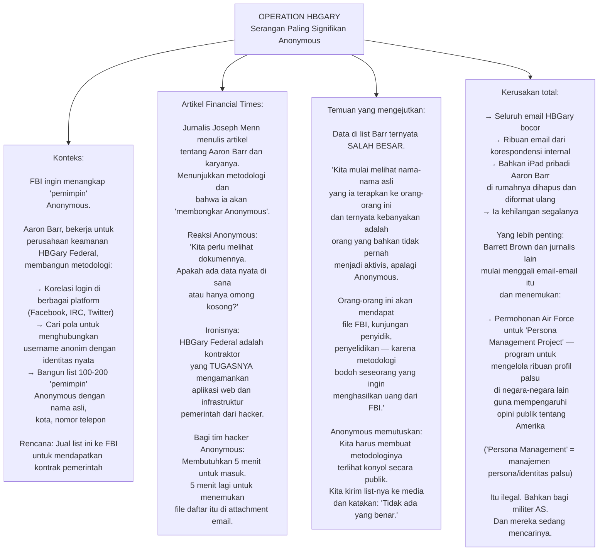
```mermaid
graph TD
    A["OPERATION HBGARY\nSerangan Paling Signifikan Anonymous"]
    
    A --> B["Konteks:\n\nFBI ingin menangkap 'pemimpin'\nAnonymous.\n\nAaron Barr, bekerja untuk\nperusahaan keamanan HBGary Federal,\nmembangun metodologi:\n\n→ Korelasi login di berbagai platform\n  (Facebook, IRC, Twitter)\n→ Cari pola untuk menghubungkan\n  username anonim dengan identitas nyata\n→ Bangun list 100-200 'pemimpin'\n  Anonymous dengan nama asli,\n  kota, nomor telepon\n\nRencana: Jual list ini ke FBI\nuntuk mendapatkan kontrak pemerintah"]
    
    A --> C["Artikel Financial Times:\n\nJurnalis Joseph Menn menulis artikel\ntentang Aaron Barr dan karyanya.\nMenunjukkan metodologi dan\nbahwa ia akan 'membongkar Anonymous'.\n\nReaksi Anonymous:\n'Kita perlu melihat dokumennya.\nApakah ada data nyata di sana\natau hanya omong kosong?'\n\nIronisnya:\nHBGary Federal adalah kontraktor\nyang TUGASNYA mengamankan\naplikasi web dan infrastruktur\npemerintah dari hacker.\n\nBagi tim hacker Anonymous:\nMembutuhkan 5 menit untuk masuk.\n5 menit lagi untuk menemukan\nfile daftar itu di attachment email."]
    
    A --> D["Temuan yang mengejutkan:\n\nData di list Barr ternyata SALAH BESAR.\n\n'Kita mulai melihat nama-nama asli\nyang ia terapkan ke orang-orang ini\ndan ternyata kebanyakan adalah\norang yang bahkan tidak pernah\nmenjadi aktivis, apalagi Anonymous.\n\nOrang-orang ini akan mendapat\nfile FBI, kunjungan penyidik,\npenyelidikan — karena metodologi\nbodoh seseorang yang ingin\nmenghasilkan uang dari FBI.'\n\nAnonymous memutuskan:\nKita harus membuat metodologinya\nterlihat konyol secara publik.\nKita kirim list-nya ke media\ndan katakan: 'Tidak ada yang benar.'"]
    
    A --> E["Kerusakan total:\n\n→ Seluruh email HBGary bocor\n→ Ribuan email dari korespondensi internal\n→ Bahkan iPad pribadi Aaron Barr\n  di rumahnya dihapus dan diformat ulang\n→ Ia kehilangan segalanya\n\nYang lebih penting:\nBarrett Brown dan jurnalis lain\nmulai menggali email-email itu\ndan menemukan:\n\n→ Permohonan Air Force untuk 'Persona\n  Management Project' — program untuk\n  mengelola ribuan profil palsu\n  di negara-negara lain guna mempengaruhi\n  opini publik tentang Amerika\n\n('Persona Management' = manajemen persona/identitas palsu)\n\nItu ilegal. Bahkan bagi militer AS.\nDan mereka sedang mencarinya."]
```

### 🌊 Efek Domino — WikiLeaks dan Seterusnya

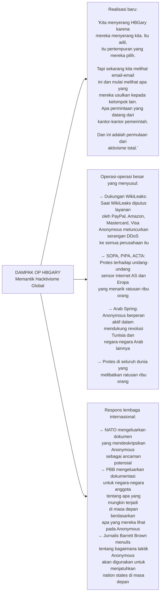
```mermaid
graph LR
    A["DAMPAK OP HBGARY\nMemantik Hacktivisme Global"]
    
    A --> B["Realisasi baru:\n\n'Kita menyerang HBGary karena\nmereka menyerang kita. Itu adil,\nitu pertempuran yang mereka pilih.\n\nTapi sekarang kita melihat email-email\nini dan mulai melihat apa yang\nmereka usulkan kepada kelompok lain.\nApa permintaan yang datang dari\nkantor-kantor pemerintah.\n\nDan ini adalah permulaan dari\naktivisme total.'"]
    
    A --> C["Operasi-operasi besar yang menyusul:\n\n→ Dukungan WikiLeaks:\n  Saat WikiLeaks diputus layanan\n  oleh PayPal, Amazon, Mastercard, Visa\n  Anonymous meluncurkan serangan DDoS\n  ke semua perusahaan itu\n\n→ SOPA, PIPA, ACTA:\n  Protes terhadap undang-undang\n  sensor internet AS dan Eropa\n  yang menarik ratusan ribu orang\n\n→ Arab Spring:\n  Anonymous berperan aktif dalam\n  mendukung revolusi Tunisia dan\n  negara-negara Arab lainnya\n\n→ Protes di seluruh dunia yang\n  melibatkan ratusan ribu orang"]
    
    A --> D["Respons lembaga internasional:\n\n→ NATO mengeluarkan dokumen\n  yang mendeskripsikan Anonymous\n  sebagai ancaman potensial\n→ PBB mengeluarkan dokumentasi\n  untuk negara-negara anggota\n  tentang apa yang mungkin terjadi\n  di masa depan berdasarkan\n  apa yang mereka lihat pada Anonymous\n→ Jurnalis Barrett Brown menulis\n  tentang bagaimana taktik Anonymous\n  akan digunakan untuk menjatuhkan\n  nation states di masa depan"]
```

---

## 🎬 Bagian 7: Anonymous Masuk ke Budaya Pop

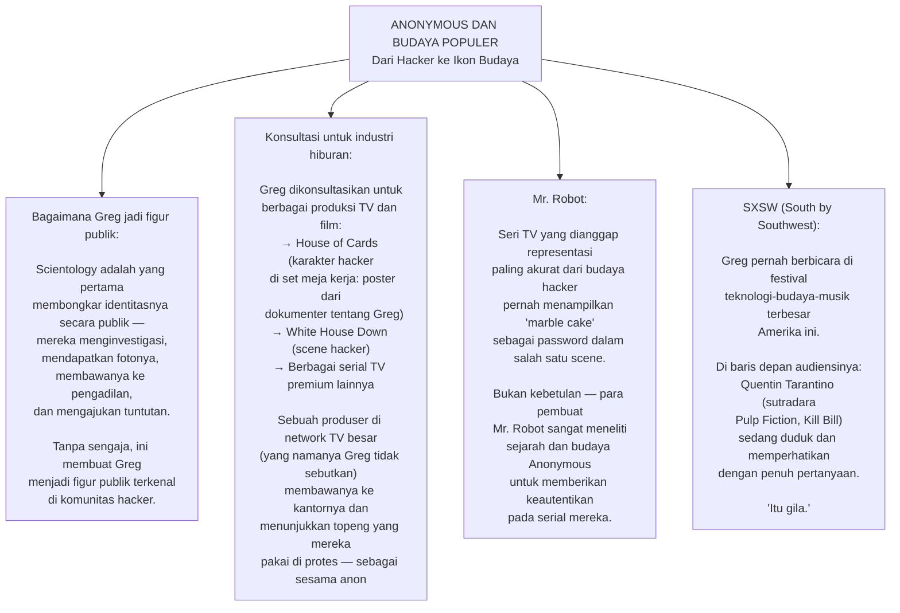
```mermaid
graph TD
    A["ANONYMOUS DAN BUDAYA POPULER\nDari Hacker ke Ikon Budaya"]
    
    A --> B["Bagaimana Greg jadi figur publik:\n\nScientology adalah yang pertama\nmembongkar identitasnya secara publik —\nmereka menginvestigasi,\nmendapatkan fotonya, membawanya ke pengadilan,\ndan mengajukan tuntutan.\n\nTanpa sengaja, ini membuat Greg\nmenjadi figur publik terkenal\ndi komunitas hacker."]
    
    A --> C["Konsultasi untuk industri hiburan:\n\nGreg dikonsultasikan untuk\nberbagai produksi TV dan film:\n→ House of Cards (karakter hacker\n  di set meja kerja: poster dari\n  dokumenter tentang Greg)\n→ White House Down (scene hacker)\n→ Berbagai serial TV premium lainnya\n\nSebuah produser di network TV besar\n(yang namanya Greg tidak sebutkan)\nmembawanya ke kantornya dan\nmenunjukkan topeng yang mereka\npakai di protes — sebagai sesama anon"]
    
    A --> D["Mr. Robot:\n\nSeri TV yang dianggap representasi\npaling akurat dari budaya hacker\npernah menampilkan 'marble cake'\nsebagai password dalam salah satu scene.\n\nBukan kebetulan — para pembuat\nMr. Robot sangat meneliti\nsejarah dan budaya Anonymous\nuntuk memberikan keautentikan\npada serial mereka."]
    
    A --> E["SXSW (South by Southwest):\n\nGreg pernah berbicara di festival\nteknologi-budaya-musik terbesar\nAmerika ini.\n\nDi baris depan audiensinya:\nQuentin Tarantino (sutradara\nPulp Fiction, Kill Bill)\nsedang duduk dan memperhatikan\ndengan penuh pertanyaan.\n\n'Itu gila.'"]
```

---

## 🌐 Bagian 8: Anonymous Hari Ini — Siapa Mereka Sekarang?

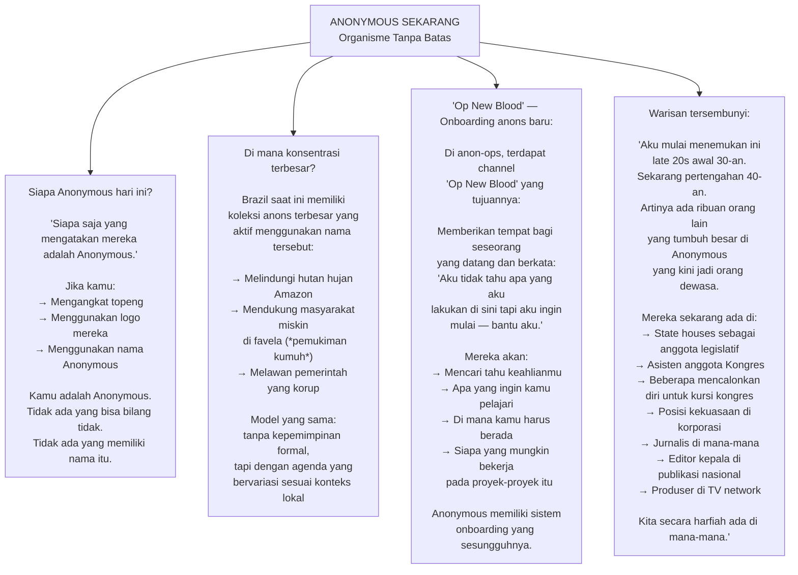
```mermaid
graph TD
    A["ANONYMOUS SEKARANG\nOrganisme Tanpa Batas"]
    
    A --> B["Siapa Anonymous hari ini?\n\n'Siapa saja yang mengatakan mereka adalah Anonymous.'\n\nJika kamu:\n→ Mengangkat topeng\n→ Menggunakan logo mereka\n→ Menggunakan nama Anonymous\n\nKamu adalah Anonymous.\nTidak ada yang bisa bilang tidak.\nTidak ada yang memiliki nama itu."]
    
    A --> C["Di mana konsentrasi terbesar?\n\nBrazil saat ini memiliki\nkoleksi anons terbesar yang\naktif menggunakan nama tersebut:\n\n→ Melindungi hutan hujan Amazon\n→ Mendukung masyarakat miskin\n  di favela (*pemukiman kumuh*)\n→ Melawan pemerintah yang korup\n\nModel yang sama:\ntanpa kepemimpinan formal,\ntapi dengan agenda yang\nbervariasi sesuai konteks lokal"]
    
    A --> D["'Op New Blood' — Onboarding anons baru:\n\nDi anon-ops, terdapat channel\n'Op New Blood' yang tujuannya:\n\nMemberikan tempat bagi seseorang\nyang datang dan berkata:\n'Aku tidak tahu apa yang aku\nlakukan di sini tapi aku ingin\nmulai — bantu aku.'\n\nMereka akan:\n→ Mencari tahu keahlianmu\n→ Apa yang ingin kamu pelajari\n→ Di mana kamu harus berada\n→ Siapa yang mungkin bekerja\n  pada proyek-proyek itu\n\nAnonymous memiliki sistem\nonboarding yang sesungguhnya."]
    
    A --> E["Warisan tersembunyi:\n\n'Aku mulai menemukan ini\nlate 20s awal 30-an.\nSekarang pertengahan 40-an.\nArtinya ada ribuan orang lain\nyang tumbuh besar di Anonymous\nyang kini jadi orang dewasa.\n\nMereka sekarang ada di:\n→ State houses sebagai anggota legislatif\n→ Asisten anggota Kongres\n→ Beberapa mencalonkan diri untuk kursi kongres\n→ Posisi kekuasaan di korporasi\n→ Jurnalis di mana-mana\n→ Editor kepala di publikasi nasional\n→ Produser di TV network\n\nKita secara harfiah ada di mana-mana.'"]
```

---

## 💰 Bagian 9: Pengorbanan — Harga yang Dibayar

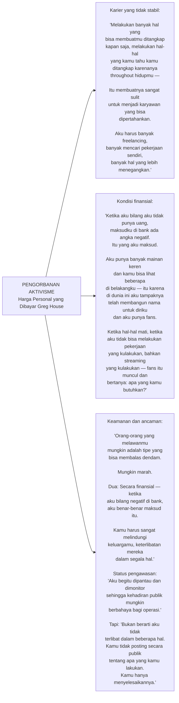
```mermaid
graph LR
    A["PENGORBANAN AKTIVISME\nHarga Personal yang Dibayar Greg House"]
    
    A --> B["Karier yang tidak stabil:\n\n'Melakukan banyak hal yang\nbisa membuatmu ditangkap\nkapan saja, melakukan hal-hal\nyang kamu tahu kamu ditangkap karenanya\nthroughout hidupmu —\n\nItu membuatnya sangat sulit\nuntuk menjadi karyawan yang bisa\ndipertahankan.\n\nAku harus banyak freelancing,\nbanyak mencari pekerjaan sendiri,\nbanyak hal yang lebih menegangkan.'"]
    
    A --> C["Kondisi finansial:\n\n'Ketika aku bilang aku tidak punya uang,\nmaksudku di bank ada angka negatif.\nItu yang aku maksud.\n\nAku punya banyak mainan keren\ndan kamu bisa lihat beberapa\ndi belakangku — itu karena\ndi dunia ini aku tampaknya\ntelah membangun nama untuk diriku\ndan aku punya fans.\n\nKetika hal-hal mati, ketika\naku tidak bisa melakukan pekerjaan\nyang kulakukan, bahkan streaming\nyang kulakukan — fans itu muncul dan\nbertanya: apa yang kamu butuhkan?'"]
    
    A --> D["Keamanan dan ancaman:\n\n'Orang-orang yang melawanmu\nmungkin adalah tipe yang\nbisa membalas dendam.\n\nMungkin marah.\n\nDua: Secara finansial — ketika\naku bilang negatif di bank,\naku benar-benar maksud itu.\n\nKamu harus sangat melindungi\nkeluargamu, keterlibatan mereka\ndalam segala hal.'\n\nStatus pengawasan:\n'Aku begitu dipantau dan dimonitor\nsehingga kehadiran publik mungkin\nberbahaya bagi operasi.'\n\nTapi: 'Bukan berarti aku tidak\nterlibat dalam beberapa hal.\nKamu tidak posting secara publik\ntentang apa yang kamu lakukan.\nKamu hanya menyelesaikannya.'"]
```

---

## 🗺️ Peta Besar: Anatomi Anonymous sebagai Fenomena Sosial Unik

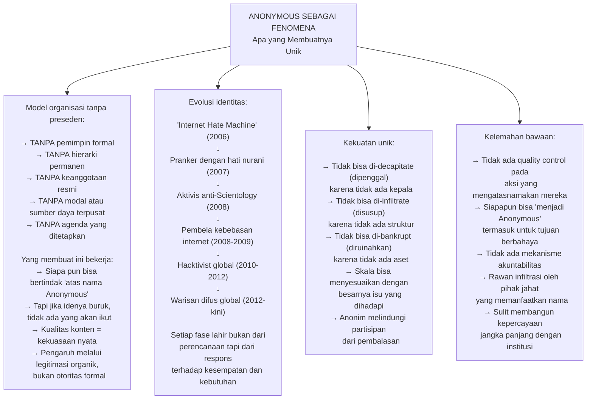
```mermaid
graph TD
    A["ANONYMOUS SEBAGAI FENOMENA\nApa yang Membuatnya Unik"]
    
    A --> B["Model organisasi tanpa preseden:\n\n→ TANPA pemimpin formal\n→ TANPA hierarki permanen\n→ TANPA keanggotaan resmi\n→ TANPA modal atau sumber daya terpusat\n→ TANPA agenda yang ditetapkan\n\nYang membuat ini bekerja:\n→ Siapa pun bisa bertindak 'atas nama Anonymous'\n→ Tapi jika idenya buruk,\n  tidak ada yang akan ikut\n→ Kualitas konten = kekuasaan nyata\n→ Pengaruh melalui legitimasi organik,\n  bukan otoritas formal"]
    
    A --> C["Evolusi identitas:\n\n'Internet Hate Machine' (2006)\n↓\nPranker dengan hati nurani (2007)\n↓\nAktivis anti-Scientology (2008)\n↓\nPembela kebebasan internet (2008-2009)\n↓\nHacktivist global (2010-2012)\n↓\nWarisan difus global (2012-kini)\n\nSetiap fase lahir bukan dari\nperencanaan tapi dari respons\nterhadap kesempatan dan kebutuhan"]
    
    A --> D["Kekuatan unik:\n\n→ Tidak bisa di-decapitate (dipenggal)\n  karena tidak ada kepala\n→ Tidak bisa di-infiltrate (disusup)\n  karena tidak ada struktur\n→ Tidak bisa di-bankrupt (diruinahkan)\n  karena tidak ada aset\n→ Skala bisa menyesuaikan dengan\n  besarnya isu yang dihadapi\n→ Anonim melindungi partisipan\n  dari pembalasan"]
    
    A --> E["Kelemahan bawaan:\n\n→ Tidak ada quality control pada\n  aksi yang mengatasnamakan mereka\n→ Siapapun bisa 'menjadi Anonymous'\n  termasuk untuk tujuan berbahaya\n→ Tidak ada mekanisme akuntabilitas\n→ Rawan infiltrasi oleh pihak jahat\n  yang memanfaatkan nama\n→ Sulit membangun kepercayaan\n  jangka panjang dengan institusi"]
```

---

## 💡 Kesimpulan: Pelajaran dari Eksperimen Unik Sejarah Internet

Anonymous dimulai sebagai lelucon. Ia tumbuh menjadi gerakan sosial. Dan ia bertahan sebagai konsep yang hidup — tersebar di seluruh dunia dalam diri orang-orang yang bahkan mungkin sudah lupa pernah mengenakan topeng itu.

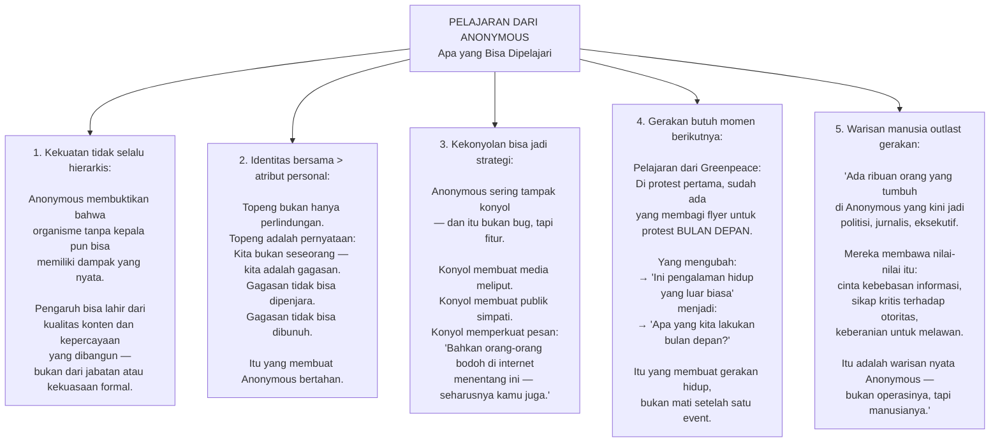
```mermaid
graph TD
    A["PELAJARAN DARI ANONYMOUS\nApa yang Bisa Dipelajari"]
    
    A --> B["1. Kekuatan tidak selalu hierarkis:\n\nAnonymous membuktikan bahwa\norganisme tanpa kepala pun bisa\nmemiliki dampak yang nyata.\n\nPengaruh bisa lahir dari\nkualitas konten dan kepercayaan\nyang dibangun —\nbukan dari jabatan atau kekuasaan formal."]
    
    A --> C["2. Identitas bersama > atribut personal:\n\nTopeng bukan hanya perlindungan.\nTopeng adalah pernyataan:\nKita bukan seseorang — kita adalah gagasan.\nGagasan tidak bisa dipenjara.\nGagasan tidak bisa dibunuh.\n\nItu yang membuat Anonymous bertahan."]
    
    A --> D["3. Kekonyolan bisa jadi strategi:\n\nAnonymous sering tampak konyol\n— dan itu bukan bug, tapi fitur.\n\nKonyol membuat media meliput.\nKonyol membuat publik simpati.\nKonyol memperkuat pesan:\n'Bahkan orang-orang bodoh di internet\nmenentang ini — seharusnya kamu juga.'"]
    
    A --> E["4. Gerakan butuh momen berikutnya:\n\nPelajaran dari Greenpeace:\nDi protest pertama, sudah ada\nyang membagi flyer untuk protest BULAN DEPAN.\n\nYang mengubah:\n→ 'Ini pengalaman hidup yang luar biasa'\nmenjadi:\n→ 'Apa yang kita lakukan bulan depan?'\n\nItu yang membuat gerakan hidup,\nbukan mati setelah satu event."]
    
    A --> F["5. Warisan manusia outlast gerakan:\n\n'Ada ribuan orang yang tumbuh\ndi Anonymous yang kini jadi\npolitisi, jurnalis, eksekutif.\n\nMereka membawa nilai-nilai itu:\ncinta kebebasan informasi,\nsikap kritis terhadap otoritas,\nkeberanian untuk melawan.\n\nItu adalah warisan nyata Anonymous —\nbukan operasinya, tapi manusianya.'"]
```

*Greg House, seorang pria di pertengahan 40-an yang duduk di depan setup komputer-nya di Malden, Massachusetts, melihat ke kamera dan merangkumnya dengan cara yang paling sederhana:*

> *"Semoga salah satu kekuatan pendorongmu adalah bahwa ketika kamu meninggal, dunia menjadi tempat yang lebih baik karena kamu pernah ada di sana."*

*Itulah yang dicoba Anonymous — dengan cara yang kacau, tidak sempurna, kadang ilegal, sering konyol, dan mengejutkan diri mereka sendiri.*

*Dan entah kamu setuju dengan metode mereka atau tidak, kalimat itu sendiri sulit dibantah.* 🎭🌐

---

## 📚 Glosarium Lengkap

| Istilah | Bahasa Asli | Makna dalam Bahasa Indonesia |
|---|---|---|
| **Anonymous** | Latin/Inggris | Tanpa nama — kelompok aktivis internet yang beroperasi tanpa identitas atau pemimpin formal |
| **Hacktivism** | Inggris | *Hacking + activism* — penggunaan teknik hacking untuk mendukung agenda politik atau sosial |
| **IRC** | Inggris | *Internet Relay Chat* — sistem chat berbasis teks yang populer sebelum era media sosial |
| **4chan** | Inggris | Imageboard anonim yang menjadi tempat lahirnya banyak meme internet dan budaya online |
| **Op / Operation** | Inggris | Operasi — sebuah kampanye terorganisir Anonymous dengan tujuan tertentu |
| **Trolling** | Inggris | Memprovokasi reaksi emosional online dengan sengaja untuk hiburan |
| **Doxing** | Inggris | Melacak dan mempublikasikan informasi pribadi seseorang tanpa persetujuan mereka |
| **DDoS** | Inggris | *Distributed Denial of Service* — serangan dengan membanjiri server dengan traffic palsu sehingga tidak bisa diakses |
| **DMCA** | Inggris | *Digital Millennium Copyright Act* — undang-undang hak cipta digital Amerika yang sering digunakan untuk menghapus konten online |
| **Fair Use** | Inggris | Penggunaan wajar — ketentuan hukum yang mengizinkan penggunaan terbatas konten berhak cipta tanpa izin |
| **Chanology** | Gabungan | *Chan (4chan) + Scientology* — nama operasi protes Anonymous terhadap Church of Scientology |
| **Chilling Effect** | Inggris | Efek menghambat — dampak intimidasi hukum yang membuat orang/media enggan berbicara tentang topik tertentu |
| **Marble Cake** | Inggris | Kue marmer — nama channel privat yang menjadi 'think tank' inti Anonymous, terkenal karena disebut di serial Mr. Robot |
| **Whistleblower** | Inggris | Pelapor/pembocor informasi — seseorang yang mengungkapkan informasi tentang kegiatan ilegal atau tidak etis |
| **WikiLeaks** | Inggris | Platform penerbitan dokumen rahasia yang didirikan Julian Assange |
| **SOPA/PIPA/ACTA** | Inggris | Berbagai undang-undang yang dikritik sebagai upaya sensor internet, dilawan oleh Anonymous |
| **Arab Spring** | Inggris | Musim Semi Arab — serangkaian revolusi dan protes di dunia Arab 2010-2012 |
| **Persona Management** | Inggris | Manajemen persona — program kontroversial untuk mengelola identitas palsu online |
| **Infiltrate** | Latin | Menyusup — masuk ke dalam organisasi secara rahasia |
| **Decapitate** | Latin | Memenggal kepala — dalam konteks organisasi, menggulingkan pemimpin untuk melemahkan kelompok |
| **Guy Fawkes** | Nama orang | Tokoh sejarah Inggris (1570-1606) yang mencoba meledakkan Parlemen dalam 'Gunpowder Plot'; topengnya menjadi simbol Anonymous |
| **V for Vendetta** | Inggris | Film/komik 2006 tentang perlawanan terhadap totalitarisme yang mempopulerkan topeng Guy Fawkes |
| **Op New Blood** | Inggris | Operasi Darah Baru — saluran Anonymous untuk merekrut dan membimbing anggota baru |
| **Onboarding** | Inggris | Proses orientasi/penerimaan anggota baru dalam suatu komunitas atau organisasi |
| **Favela** | Portugis | Pemukiman kumuh perkotaan yang padat di Brasil |
| **Nation State** | Inggris | Negara bangsa — negara-bangsa berdaulat yang diakui secara internasional |

---

*Sumber video: [How Anonymous Hackers Actually Started | Documentary — YouTube](https://www.youtube.com/watch?v=dVnY0NF4wVo)*

*Narasumber utama: Greg House — Aktivis dan juru bicara Anonymous, Malden, Massachusetts, Amerika Serikat.*
