## 🎭 Pembuka: Di Balik Topeng Tanpa Wajah

Di sebuah sudut kota Boston, terdapat sebuah gedung yang kini sudah berganti pemilik dan berganti fungsi. Tidak ada yang istimewa dari bangunan bertingkat dengan logo anjing di atasnya — kecuali bagi **Greg House**, yang masih ingat dengan jelas hari ketika gedung itu adalah markas Scientology Boston, dan ratusan orang dengan topeng Guy Fawkes berbaris di depannya, berteriak dan menyanyi lagu-lagu meme internet.

> *"Apa yang telah kita lakukan? Siapa kita? Dan bagaimana kita bisa melakukan ini?"*
> — Greg House, aktivis dan juru bicara Anonymous

Itulah pertanyaan yang bergema di benaknya pada hari yang mengubah sejarah internet: **10 Februari 2008**, hari ketika Anonymous turun ke jalan untuk pertama kalinya dalam sejarah mereka.

Kisah ini bukan hanya tentang hacking. Ini adalah salah satu **evolusi gerakan sosial paling unik dalam sejarah manusia** — sebuah organisme tanpa kepala, tanpa hierarki formal, dan tanpa wajah, yang pada puncaknya membuat NATO mengeluarkan dokumen resmi tentang mereka sebagai ancaman potensial terhadap negara-negara anggota.

<Callout type="abstract" title="Gambaran Besar: Empat Fase Anonymous">
Anonymous tidak lahir sekaligus. Ia berkembang melalui empat fase yang berbeda secara radikal:

1. **Fase Troll (2006–2007)** — 5–20 orang, murni untuk kesenangan dan kekacauan
2. **Fase Remaja (2008)** — Project Chanology, 10.000 orang, pertama kali turun ke jalan
3. **Fase Hacktivisme Global (2008–2012)** — Ratusan ribu orang, melawan pemerintah dan korporasi
4. **Fase Difusi (2012–kini)** — Tidak ada yang tahu berapa banyak mereka, tersebar di seluruh dunia

Setiap fase lahir bukan dari perencanaan, melainkan dari respons spontan terhadap kesempatan dan kebutuhan.
</Callout>

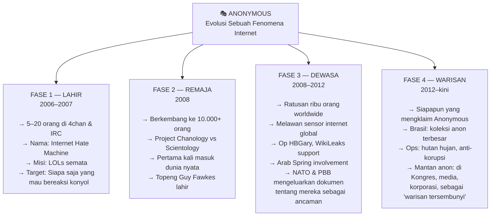

---

## 📺 Greg House — Arsitek Dari Balik Layar

Dokumenter ini berpusat pada satu orang: **Greg House**, seorang pria yang kini berusia pertengahan 40-an, tinggal di Malden, Massachusetts — tepat di luar Boston, kota yang ia sebut sebagai tempat sempurna bagi seorang aktivis karena sejarahnya yang penuh revolusi dan inovasi teknologi.

<Callout type="note" title="Siapa Greg House?">
Greg House bukan hacker dalam arti teknis. Ia adalah **organisator, propagandis, dan negosiator** — otak di balik logistik dan pesan Anonymous. Spesialisasinya adalah merancang narasi, menulis press release, mengkoordinasi protes global, dan bernegosiasi langsung dengan pejabat pemerintah.

Ironinya, Scientology — salah satu musuh pertama Anonymous — yang secara tidak sengaja menjadikan Greg figur publik dengan mengekspos identitasnya ke media.
</Callout>

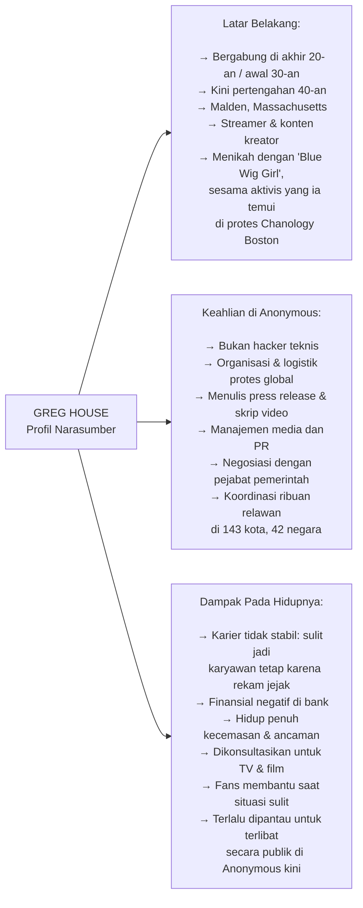

---

## 🐸 Bagian 1: Kelahiran dari Lelucon — Siapa "Anonymous" Itu?

Banyak orang salah kaprah tentang kapan Anonymous dimulai. Kebanyakan mengira gerakan ini lahir sekitar 2012–2014 saat LulzSec (*Lulz Security* — kelompok hacker yang terkenal dengan serangkaian pembobolan besar) sedang besar-besarnya. Kenyataannya, **akar Anonymous mundur hingga 2006** — hampir satu dekade sebelumnya.

<Callout type="info" title="Mengapa Semua Posting di 4chan Bernama 'Anonymous'?">
**4chan** adalah *imageboard* — papan gambar online — yang mengharuskan penggunanya memposting secara anonim. Ketika seseorang memposting tanpa akun atau nama, sistem secara otomatis menampilkan nama pengirim sebagai **"Anonymous"**.

Artinya: semua orang yang memposting anonim di 4chan berbagi nama yang sama — *Anonymous*. Dari sinilah identitas kolektif itu lahir.
</Callout>

### 🃏 Dari Mana Karakter "Anonymous" Berasal?

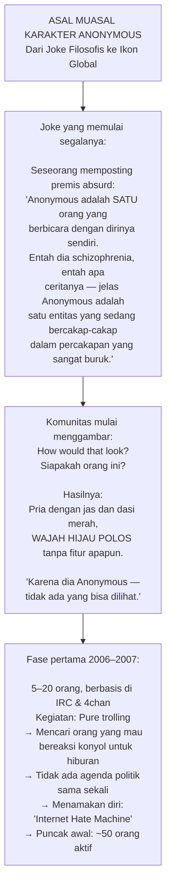

### 🏊 Operasi Pertama: Habbo Hotel dan "Pools Closed"

Operasi pertama Anonymous yang tercatat adalah serangan iseng ke sebuah *massively multiplayer online game* (permainan daring banyak pemain) bernama **Habbo Hotel** — sebuah game di mana anak-anak bisa berinteraksi sebagai avatar di hotel virtual.

<Callout type="example" title="Cara Kerja 'Raid' Habbo Hotel">
**Taktiknya sangat sederhana:**
1. Koordinasikan puluhan avatar identik masuk ke kolam renang dalam game
2. Padati kolam sehingga tidak ada pemain lain yang bisa masuk
3. Tempatkan satu avatar di tangga masuk sebagai "penjaga"
4. Kolam pun "tertutup" secara de facto

Dari sinilah lahir meme ikonik **"POOLS CLOSED"** yang menjadi salah satu meme paling awal dalam budaya Anonymous. Bagi mereka: sangat lucu. Bagi anak-anak Habbo Hotel: sangat frustasi.
</Callout>

### 📻 Hal Turner — Ketika Trolling Bertemu Nurani

Titik balik pertama dari kelompok trolling murni menuju sesuatu yang berbeda terjadi saat Anonymous menarget **Hal Turner** — seorang penyiar radio Neo-Nazi Amerika yang secara terbuka menyerukan kebencian rasial.

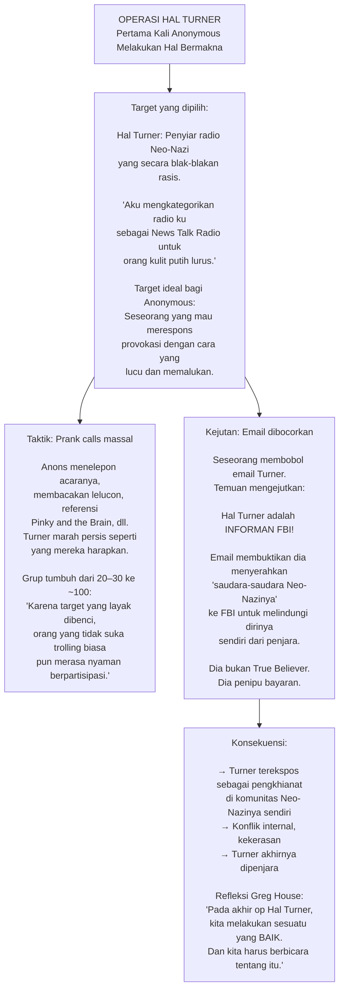

<Callout type="important" title="Pertanyaan yang Mengubah Segalanya">
Setelah operasi Hal Turner berhasil, muncul pertanyaan yang sederhana namun mengubah arah segalanya:

*"Apakah ada target jahat lain seperti ini yang bisa kita kejar?"*

Bukan karena mereka ingin jadi "orang baik" — Greg tegas menegaskan hal ini. Alasannya lebih pragmatis: melawan orang yang layat dilawan berarti mereka tidak diserang balik atas tindakan mereka. Tapi efeknya tetap sama: **Anonymous mulai memiliki kompas moral yang rudimenter.**
</Callout>

---

## ⛪ Bagian 2: Project Chanology — Ketika Internet Turun ke Jalan

### 🎬 Video Tom Cruise yang Memicu Semuanya

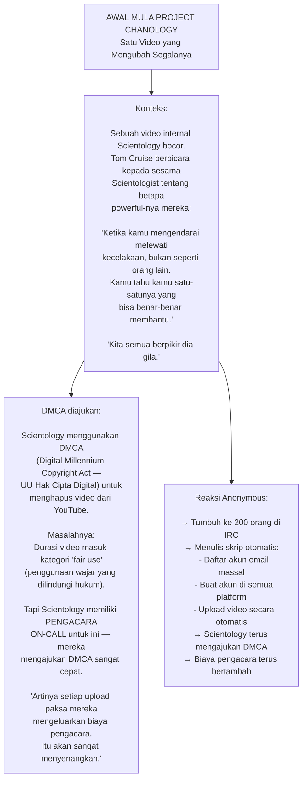

<Callout type="tip" title="Mengapa Taktik Ini Efektif?">
Keindahan taktik Anonymous adalah **asimetri biaya**: Anonymous tidak mengeluarkan uang sepeser pun untuk upload video berulang kali. Sementara Scientology harus membayar pengacara setiap kali mengajukan klaim DMCA.

Ini adalah perang attrisi (*perang kelelahan*) di mana satu pihak memiliki biaya mendekati nol, sementara pihak lain terus berdarah secara finansial.
</Callout>

### 📜 Kelahiran "Message to Scientology"

Dari strategi upload video sederhana, lahirlah ide yang jauh lebih ambisius — dan jauh lebih berpengaruh.

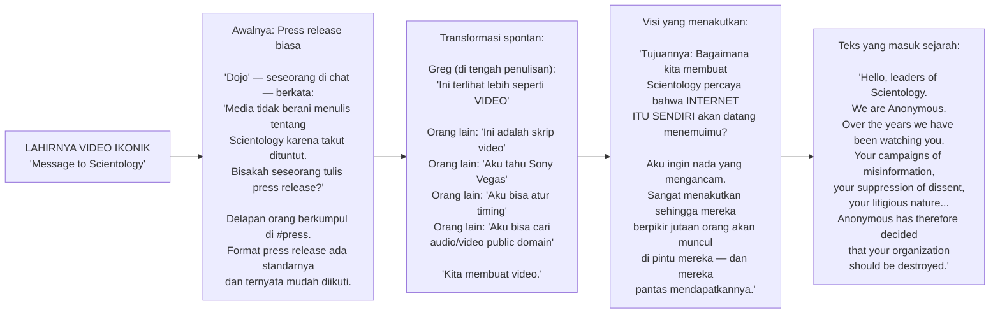

<Callout type="quote" title="Greg House, tentang karakter Anonymous">
*"Ini kembali ke awal Anonymous — satu orang schizophrenia yang berbicara dengan dirinya sendiri. Apa suara yang dimiliki Anon berwajah hijau itu? Dia terdengar mengancam. Dan pada tanggal 21 Januari 2008, pukul 10:21 malam, video itu diupload ke YouTube. Kita kira beberapa orang akan menontonnya."*

Keesokan paginya, pacar Greg membangunkannya lewat telepon:

*"Video kamu ada di berita TV. Ada di mana-mana."*

**Greg: "Tunggu — apa?"**
</Callout>

### 🌐 Ledakan: Dari Ratusan ke Sepuluh Ribu

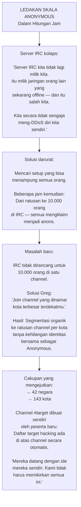

<Callout type="info" title="'Marble Cake' — Otak di Balik Anonymous">
Dengan pertumbuhan eksplosif, channel utama mulai dipenuhi ide-ide bodoh dan berbahaya. Solusinya: **channel privat baru bernama "Marble Cake"**.

Channel ini menjadi sangat terkenal hingga serial TV *Mr. Robot* memasukkannya sebagai password dalam salah satu scene telepon mereka.

Greg menjelaskan posisi Marble Cake dengan tepat: *"Dari luar, kami terlihat seperti pemimpin. Tapi jika kamu memahami cara kerja ruang ini — kami lebih seperti think tank yang kebetulan menghasilkan konten berkualitas, jadi orang-orang ikut serta. Jika ide berikutnya tidak bagus, mereka tidak akan ikut. Kita tidak punya kekuasaan."*

Ini adalah model *governance* (tata kelola) yang benar-benar unik: **pengaruh melalui kualitas, bukan otoritas.**
</Callout>

---

## 🎭 Bagian 3: Topeng Guy Fawkes — Kecelakaan Brilian

Salah satu elemen paling ikonik dari Anonymous — topeng Guy Fawkes — tidak lahir dari perencanaan matang, melainkan dari **kecelakaan logistik yang mengagumkan**.

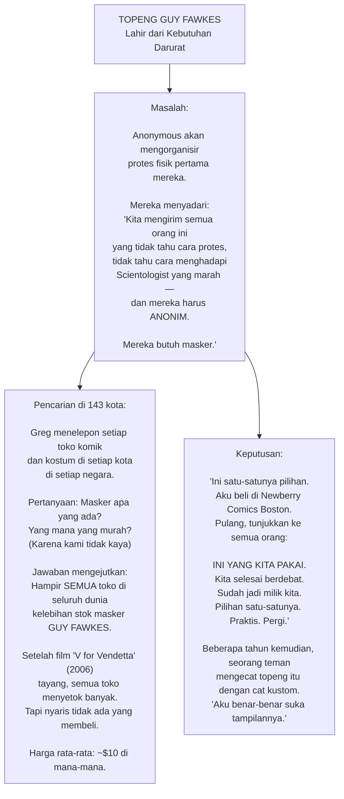

<Callout type="tip" title="Mengapa Topeng Guy Fawkes Sempurna — Tanpa Disengaja">
**Guy Fawkes** (1570–1606) adalah tokoh sejarah Inggris yang mencoba meledakkan Gedung Parlemen dalam *Gunpowder Plot* (1605). Film *V for Vendetta* (2006) menampilkan topengnya sebagai simbol perlawanan terhadap totalitarisme.

Ironisnya, tidak ada yang merencanakan ini. Topeng itu dipilih semata karena **harganya murah dan semua toko memilikinya**. Tapi efeknya luar biasa:

- Topeng melindungi identitas fisik demonstran
- Secara visual, menciptakan kolektif yang menyeramkan dan seragam
- Maknanya dari V for Vendetta secara tidak sengaja *sempurna* untuk gerakan seperti Anonymous

Ini adalah salah satu "branding" paling kuat dalam sejarah aktivisme — yang lahir bukan dari strategi, melainkan dari kebetulan.
</Callout>

---

## 🌍 Bagian 4: 10 Februari 2008 — Hari yang Mengubah Segalanya

Ketika hari protes tiba, tidak ada yang tahu berapa banyak orang yang akan datang.

<Callout type="warning" title="Ekspektasi vs Realita">
**Ekspektasi Anonymous sebelum protes:**
- Greg memperkirakan mungkin 5–10 orang di Sydney akan datang
- Jika ada, itu berarti mungkin **300 orang worldwide** — yang sudah dianggap luar biasa
- Mereka "fully expecting a bunch of basement dwelling incels to show up"

**Yang benar-benar terjadi:**
- Ribuan orang di 143 kota di 42 negara
- Lokasi yang diperkirakan datangi 5 orang, ada seribu
- Protes pertama dalam sejarah Anonymous yang benar-benar global

Greg: *"Kamu tidak tahu harus apa. Butuh 8 jam setelah event sebelum aku mulai berpikir: apa yang telah kita lakukan?"*
</Callout>

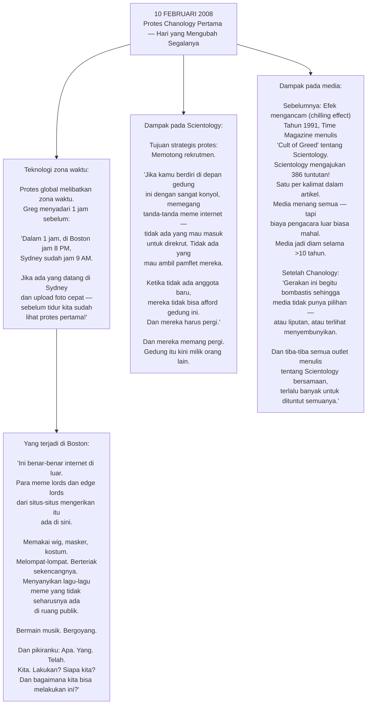

### 💒 Cinta yang Lahir dari Revolusi

<Callout type="quote" title="Istrinya tentang kehidupan bersama aktivisme">
*"Sulit untuk memisahkan aktivisme dari bersamanya. Terkadang berarti harus bangun Sabtu untuk event, ada reporter yang datang, begadang sampai jam 3 pagi karena itu saatnya orang di zona waktu itu aktif dan di sana ada operasi.*

*Untuk menikahi seseorang, kamu memilih setiap hari siapa mereka dan apa yang kalian lakukan bersama. Aku tidak bisa menganggapnya sebagai pengorbanan. Dia luar biasa — dan aku bisa bersama seseorang yang seluar biasa itu. Siapapun akan memilih itu."*
</Callout>

Greg bertemu istrinya di protes-protes Chanology. Dia dikenal dengan nama **"Blue Wig Girl"** — selalu memakai wig biru besar yang mengubah total tampilannya, kadang dilengkapi jas lab sehingga terlihat seperti "ilmuwan berwig biru" yang eksentrik. Mereka menikah tiga tahun kemudian.

---

## 🏛️ Bagian 5: Tittstorm — Melawan Sensor Internet Australia

Setelah enam bulan protes Scientology yang sukses, Anonymous tidak berencana ekspansi. Lalu datang seorang anak muda dari Australia.

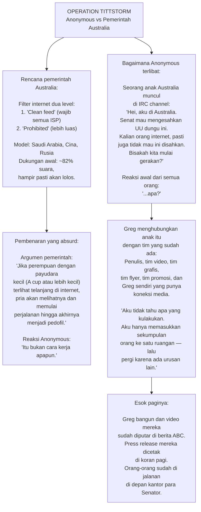

<Callout type="success" title="Kalimat yang Mengubah Kampanye">
Saat semua anggota tim bersikeras menulis press release yang "serius dan formal" karena ini pertama kalinya mereka melawan pemerintah, Greg berjuang keras untuk satu kalimat:

> **"The Australian government will learn that one does not f*** with our porn."**
> *(Pemerintah Australia akan belajar bahwa seseorang tidak main-main dengan pornografi kami.)*

Tim menentang keras. Greg bersikeras: *"Stick with the brand."*

Kalimat itu dikutip di mana-mana. Dan itu adalah langkah yang benar — bukan karena lucunya, tapi karena **otentisitasnya**. Anonymous tidak berpura-pura jadi sesuatu yang bukan mereka.
</Callout>

### 📞 Negosiasi Langsung dengan Senator Australia

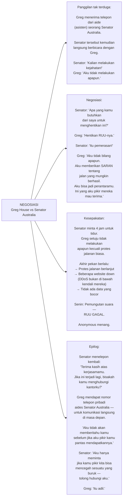

<Callout type="important" title="Preseden yang Mengejutkan">
Operasi Tittstorm adalah pertama kalinya Anonymous berhasil mempengaruhi kebijakan pemerintah melalui kombinasi protes online, protes fisik, dan ancaman hacking.

Yang lebih mengejutkan: **seorang Senator aktif memberikan nomor telepon pribadinya kepada tokoh Anonymous** untuk komunikasi langsung. Ini menunjukkan bahwa bahkan institusi yang diserang mulai mengakui kenyataan baru: Anonymous adalah aktor yang harus diperhitungkan secara serius.
</Callout>

---

## 💻 Bagian 6: Op HBGary — Membobol Perusahaan Keamanan Pemerintah

Ini adalah momen yang mengubah Anonymous dari kelompok protes menjadi kekuatan *hacktivisme* (*hacking + activism*) global yang sesungguhnya.

```mermaid
graph TD
    A["OPERATION HBGARY\nSerangan Paling Signifikan Anonymous"]

    A --> B["Konteks:\n\nFBI ingin menangkap 'pemimpin' Anonymous.\n\nAaron Barr (HBGary Federal) membangun\nmetodologi korelasi data:\n→ Login di berbagai platform\n   (Facebook, IRC, Twitter)\n→ Pola untuk hubungkan username\n   anonim dengan identitas nyata\n→ List 100–200 'pemimpin Anonymous'\n   dengan nama asli, kota, telepon\n\nRencana: Jual ke FBI untuk\nmendapatkan kontrak pemerintah"]

    B --> C["Artikel Financial Times:\n\nJurnalis Joseph Menn menulis\nartikel tentang metodologi Barr.\nDia akan 'membongkar Anonymous'.\n\nReaksi Anonymous:\n'Kita perlu melihat dokumennya.\nApakah data-nya nyata?'\n\nIroni besar:\nHBGary Federal adalah kontraktor\nyang TUGASNYA mengamankan\ninfrastruktur web pemerintah\ndari hacker.\n\nBagi tim hacker Anonymous:\n5 menit untuk masuk ke jaringan.\n5 menit lagi untuk menemukan\nfile itu di attachment email."]

    C --> D["Temuan: Data Barr SALAH BESAR\n\n'Kita melihat nama-nama asli\nyang dia terapkan ke orang-orang ini.\nKebanyakan adalah orang yang bahkan\ntidak pernah menjadi aktivis,\napalagi bagian dari Anonymous.\n\nOrang-orang ini akan mendapat\nfile FBI, kunjungan penyidik,\npenyelidikan — karena metodologi\nbodoh seseorang yang ingin\nmenghasilkan uang dari FBI.'\n\nKeputusan: Kirim list ke media\ndan katakan: Tidak ada yang benar."]

    D --> E["Kerusakan total:\n\n→ Seluruh email HBGary bocor\n→ Ribuan korespondensi internal\n→ iPad pribadi Aaron Barr\n   di rumahnya dihapus & diformat ulang\n→ Ia kehilangan segalanya\n\nYang lebih penting:\nBarrett Brown & jurnalis lain\nmenggali email tersebut dan menemukan:\n\n→ Permintaan Air Force untuk\n   'Persona Management Project':\n   Program mengelola ribuan profil\n   palsu di negara lain untuk\n   mempengaruhi opini tentang Amerika.\n\nItu ilegal. Bahkan bagi militer AS."]
```

<Callout type="danger" title="Apa yang Sebenarnya Ditemukan di Email HBGary">
Di balik keributan tentang daftar identitas Anonymous yang salah, terdapat sesuatu yang jauh lebih berbahaya:

**"Persona Management Project"** yang diminta Angkatan Udara AS — sebuah program untuk mengelola ribuan akun media sosial palsu di negara-negara asing untuk menyebarkan sentimen pro-Amerika.

Greg menjelaskan implikasinya: *"Kamu mulai melihat apa yang mereka usulkan. Apa permintaan yang datang dari kantor-kantor pemerintah untuk proyek-proyek siber. Dan itu adalah permulaan dari aktivisme total."*

Ini bukan teori konspirasi. Ini ada dalam email perusahaan yang bocor — yang kemudian dipublikasikan secara terbuka.
</Callout>

### 🌊 Efek Domino — Dari HBGary ke WikiLeaks dan Seterusnya

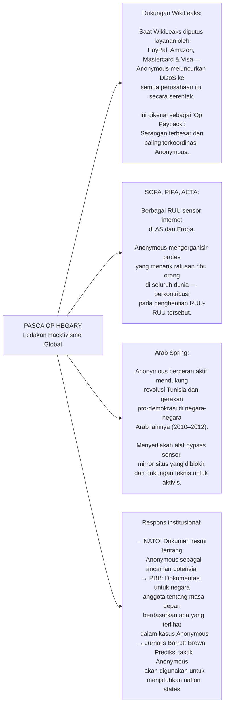

---

## 🎬 Bagian 7: Anonymous Masuk ke Budaya Pop

<Callout type="note" title="Dari Criminal Hacker ke Konsultan Hollywood">
Greg House meringkas perjalanannya dengan cara yang tidak terduga: *"Itu pasti sesuatu yang aneh — dari tempat di mana kamu adalah kriminal hacker, hingga hampir seperti direhabilitasi oleh Hollywood, di mana kamu mengonsultasikan acara TV streaming besar, acara kabel premium, dan mereka mendasarkan karakter pada kamu."*

Di baris depan audiensi SXSW (*South by Southwest* — festival teknologi-budaya-musik terbesar Amerika) ketika Greg pertama kali berbicara di sana: **Quentin Tarantino** duduk memperhatikan dan memiliki banyak pertanyaan.
</Callout>

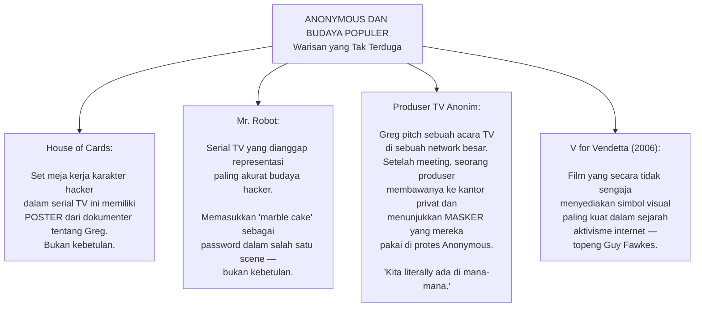

---

## 🌐 Bagian 8: Anonymous Hari Ini — Warisan Tersembunyi

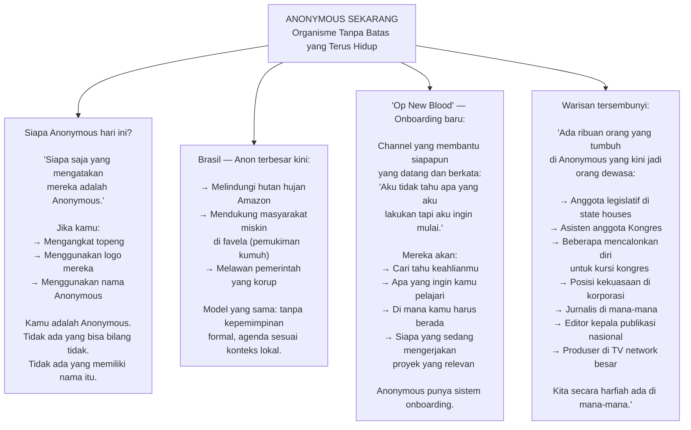

<Callout type="abstract" title="Anatomi Anonymous: Apa yang Membuatnya Unik">
Anonymous adalah model organisasi sosial yang tidak memiliki preseden dalam sejarah:

**Ketidakmungkinan struktural yang membuatnya kuat:**
- **Tidak bisa di-*decapitate*** (dipenggal kepemimpinannya) — karena tidak ada kepala
- **Tidak bisa di-*infiltrate*** (disusup) — karena tidak ada struktur yang bisa dimasuki
- **Tidak bisa di-*bankrupt*** (diruinahkan secara finansial) — karena tidak ada aset terpusat
- **Skala elastis** — bisa mengecil menjadi 5 orang atau membesar menjadi ratusan ribu tergantung isu

**Kelemahan bawaan yang menyertainya:**
- Tidak ada *quality control* pada aksi yang mengatasnamakan mereka
- Siapapun bisa "menjadi Anonymous" — termasuk untuk tujuan berbahaya
- Tidak ada mekanisme akuntabilitas internal
- Sulit membangun kepercayaan jangka panjang dengan institusi
</Callout>

---

## 💰 Bagian 9: Pengorbanan — Harga yang Dibayar Greg House

<Callout type="warning" title="Biaya Personal dari Aktivisme Radikal">
Greg tidak menyembunyikan apa yang ia korbankan:

*"Melakukan banyak hal yang bisa membuatmu ditangkap kapan saja, melakukan hal-hal yang kamu tahu kamu ditangkap karenanya throughout hidupmu — itu membuatnya sangat sulit untuk menjadi karyawan yang bisa dipertahankan."*

*"Ketika aku bilang aku tidak punya uang, maksudku di bank ada angka negatif. Itu yang aku maksud."*

*"Aku begitu dipantau dan dimonitor sehingga kehadiran publik mungkin berbahaya bagi operasi. Tapi bukan berarti aku tidak terlibat dalam beberapa hal. Kamu tidak posting secara publik tentang apa yang kamu lakukan. Kamu hanya menyelesaikannya."*
</Callout>

---

## 🗺️ Peta Besar: Pelajaran dari Eksperimen Unik Sejarah Internet

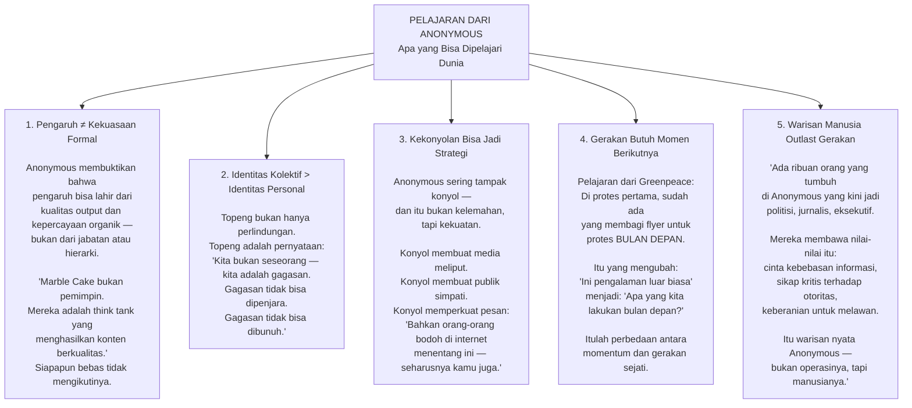

<Callout type="cite" title="Greg House, menutup dokumenter">
*"You've lived on this planet however long you've lived — and I would hope that one of your driving forces is that when you've died, the world is better off because you were there."*

*(Kamu telah hidup di planet ini selama apapun kamu telah hidup — dan aku harap salah satu kekuatan pendorongmu adalah bahwa ketika kamu meninggal, dunia menjadi tempat yang lebih baik karena kamu pernah ada di sana.)*

Itulah yang dicoba Anonymous — dengan cara yang kacau, tidak sempurna, kadang ilegal, sering konyol, dan selalu mengejutkan diri mereka sendiri.

Dan entah kamu setuju dengan metode mereka atau tidak, kalimat itu sendiri sulit dibantah. 🎭
</Callout>

---

## 📚 Glosarium Lengkap

| Istilah | Bahasa Asli | Makna dalam Bahasa Indonesia |
|---|---|---|
| **Anonymous** | Latin/Inggris | Tanpa nama — kolektif aktivis internet yang beroperasi tanpa identitas atau pemimpin formal |
| **Hacktivism** | Inggris | *Hacking + activism* — penggunaan teknik hacking untuk mendukung agenda politik atau sosial |
| **IRC** | Inggris | *Internet Relay Chat* — sistem chat berbasis teks yang populer sebelum era media sosial |
| **4chan** | Inggris | Imageboard anonim tempat lahirnya banyak meme internet dan budaya online awal |
| **Op / Operation** | Inggris | Operasi — kampanye terorganisir dengan tujuan tertentu |
| **Trolling** | Inggris | Memprovokasi reaksi emosional secara online dengan sengaja untuk hiburan |
| **Doxing** | Inggris | Melacak dan mempublikasikan informasi pribadi seseorang tanpa persetujuan mereka |
| **DDoS** | Inggris | *Distributed Denial of Service* — membanjiri server dengan traffic palsu hingga tidak bisa diakses |
| **DMCA** | Inggris | *Digital Millennium Copyright Act* — UU hak cipta digital yang digunakan untuk menghapus konten online |
| **Fair Use** | Inggris | Penggunaan wajar — ketentuan hukum yang mengizinkan penggunaan terbatas konten berhak cipta |
| **Chanology** | Gabungan | *Chan + Scientology* — nama operasi protes Anonymous terhadap Church of Scientology |
| **Chilling Effect** | Inggris | Efek menghambat — intimidasi hukum yang membuat orang enggan berbicara tentang topik tertentu |
| **Marble Cake** | Inggris | Kue marmer — nama channel privat yang menjadi think tank inti Anonymous; terkenal dari serial Mr. Robot |
| **Whistleblower** | Inggris | Pelapor/pembocor — seseorang yang mengungkapkan informasi tentang kegiatan ilegal atau tidak etis |
| **WikiLeaks** | Inggris | Platform penerbitan dokumen rahasia yang didirikan Julian Assange |
| **SOPA/PIPA/ACTA** | Inggris | Berbagai UU yang dikritik sebagai upaya sensor internet, dilawan oleh Anonymous |
| **Arab Spring** | Inggris | Musim Semi Arab — serangkaian revolusi di dunia Arab 2010–2012 |
| **Persona Management** | Inggris | Manajemen persona — program kontroversial mengelola identitas palsu online |
| **Guy Fawkes** | Nama orang | Tokoh sejarah Inggris (1570–1606) yang mencoba meledakkan Parlemen; topengnya menjadi simbol Anonymous |
| **V for Vendetta** | Inggris | Film/komik 2006 tentang perlawanan terhadap totalitarisme yang mempopulerkan topeng Guy Fawkes |
| **Op New Blood** | Inggris | Operasi Darah Baru — saluran Anonymous untuk merekrut dan membimbing anggota baru |
| **Onboarding** | Inggris | Proses orientasi/penerimaan anggota baru dalam suatu komunitas atau organisasi |
| **Favela** | Portugis | Pemukiman kumuh perkotaan yang padat di Brasil |
| **Nation State** | Inggris | Negara-bangsa berdaulat yang diakui secara internasional |
| **Think Tank** | Inggris | Wadah pemikir — kelompok yang menghasilkan ide dan analisis untuk mempengaruhi kebijakan |
| **LulzSec** | Inggris | *Lulz Security* — kelompok hacker yang terkenal dengan serangkaian pembobolan besar di 2011 |

---

*Sumber video: [How Anonymous Hackers Actually Started | Documentary — YouTube](https://www.youtube.com/watch?v=dVnY0NF4wVo)*

*Narasumber utama: Greg House — Aktivis dan juru bicara Anonymous, Malden, Massachusetts, Amerika Serikat.*
