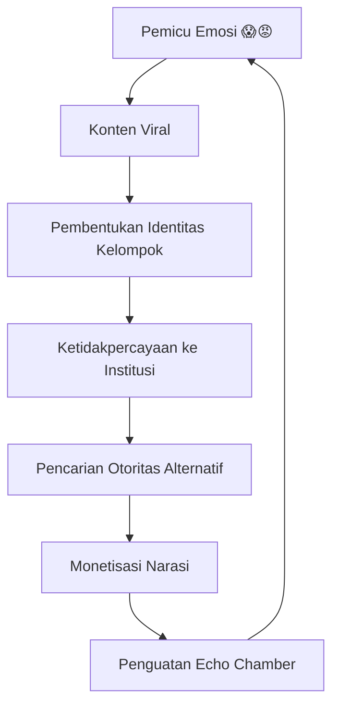
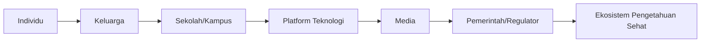

<YouTube url="https://www.youtube.com/watch?v=ETQwiYQYoSg" title="The Death of Critical Thinking: How Stupidity Took Over" />

## 🧭 Pembuka: Kita Bukan Sedang Kehilangan Informasi, Kita Sedang Kehilangan Kemampuan Mengolah Informasi

Narasi besar dari video ini sangat provokatif: **masyarakat makin “bodoh”**. Tetapi kalau dibedah secara serius, pesan intinya bukan sekadar umpatan kultural. Ini adalah alarm bahwa kita hidup di zaman ketika **pengetahuan tersedia melimpah**, namun **ketekunan mental untuk memprosesnya** justru menurun. 📉

Dengan kata lain, problem utamanya bukan “tidak tahu”, melainkan:

- sulit mempertahankan fokus,
- malas menimbang argumen yang kompleks,
- cepat puas dengan konten singkat yang emosional,
- dan makin sering menyerahkan kerja kognitif (cognitive work = kerja berpikir) ke mesin.

Artikel ini merangkum dan mengurai transkrip secara detail, agar tidak jatuh ke simplifikasi “generasi sekarang rusak”. Kita bedah struktur masalahnya, lalu kita susun jalan keluarnya.

---

## 🎯 Tesis Utama

Krisis berpikir kritis hari ini adalah hasil **konvergensi tiga mesin besar**:

1. **Mesin atensi digital** — platform didesain untuk klik dan durasi, bukan kedalaman nalar.
2. **Mesin emosi-polarisasi** — konten yang memicu takut, marah, jijik, atau takjub lebih cepat viral daripada argumen rasional.
3. **Mesin outsourcing kognitif berbasis AI** — tugas berpikir inti (merumuskan, membandingkan, menyusun alasan) makin mudah dipindahkan ke model bahasa.

Kalau tiga mesin ini bertemu tanpa literasi dan regulasi, yang menurun bukan cuma IQ rata-rata, tetapi **kapasitas masyarakat untuk membentuk realitas bersama** (*consensus reality* = kesepakatan realitas bersama). ⚠️

---

## 📊 Fakta Kunci yang Muncul di Transkrip

### 1) Reverse Flynn Effect

Dulu ada **Flynn effect** (kenaikan skor IQ antargenerasi). Kini beberapa negara menunjukkan **reverse Flynn effect** (pembalikan tren: skor menurun).

> **Istilah:** *Reverse Flynn effect* = tren penurunan skor IQ antargenerasi setelah periode panjang kenaikan.

### 2) Atensi layar makin pendek

Riset yang dibahas menunjukkan peralihan perhatian (attention switching = perpindahan fokus) terjadi makin cepat:

- sekitar 2,5 menit pada fase awal riset,
- turun ke sekitar 75 detik,
- lalu sekitar 47 detik (periode sebelum pandemi pada sampel tertentu).

Ini bukan sekadar masalah “anak muda”; dampak lintas umur juga disinggung.

### 3) Pendidikan formal meningkat, tapi nilai pendidikan menurun secara persepsi

Secara global, literasi meningkat dibanding abad lalu. Namun di saat bersamaan, motivasi sebagian anak muda terhadap jalur pendidikan formal menurun karena:

- beban utang pendidikan,
- ketidakpastian pasar kerja,
- ilusi sukses cepat dari ekonomi kreator.

### 4) Ketidakpercayaan pada institusi

Ketika kepercayaan pada institusi (pemerintah, media, akademia, otoritas kesehatan) melemah, ruang kosong itu diisi oleh:

- influencer oportunistik,
- narasi konspiratif,
- dan ekonomi ketakutan yang dimonetisasi.

---

## 🧠 Layer 1 — Krisis Atensi: Dari “Selalu Terhubung” ke “Sulit Berpikir Dalam”

Video ini menekankan bahwa desain platform modern tidak netral. Ia adalah **arsitektur perilaku** (behavioral architecture = rancangan sistem yang membentuk kebiasaan).

Fitur seperti:

- notifikasi terus-menerus,
- feed tanpa ujung (*endless scroll* = gulir tanpa akhir),
- multitasking antar aplikasi,

mendorong otak ke mode respons cepat, bukan refleksi mendalam.

### Kenapa ini berbahaya?

Karena berpikir kritis butuh **depth of processing** (kedalaman pemrosesan):

- membaca tuntas,
- menimbang bukti,
- membandingkan argumen,
- menguji kontra-argumen,
- lalu menyimpulkan secara sadar.

Kalau pola konsumsi kita didominasi potongan konten 15–60 detik, otak terbiasa mengolah “headline emosional”, bukan “struktur argumen”.

<Callout type="warning" title="Poin Krusial">
Masalahnya bukan teknologi itu sendiri, tapi **insentif desain**: yang diberi hadiah oleh algoritma adalah engagement (keterlibatan), bukan epistemic quality (kualitas kebenaran pengetahuan).
</Callout>

---

## 🧬 Layer 2 — Krisis Epistemik: Saat “Rasa Benar” Mengalahkan “Proses Benar”

Salah satu bagian paling penting dari transkrip adalah perbedaan antara:

- **misinformation** (informasi salah), dan
- **arsitektur ketakutan** (fear architecture = rekayasa rasa takut demi mobilisasi/monetisasi).

Argumen kuncinya: sering kali problem bukan semata data salah, melainkan **emosi yang sengaja dibangun**. Jadi walau diberi 10 studi ilmiah, orang belum tentu berubah jika identitas emosionalnya sudah terkunci.

### Pola umumnya

1. Bangun ketakutan/kemarahan,
2. Bentuk komunitas identitas,
3. Delegitimasi institusi,
4. Monetisasi audiens (produk, kursus, suplemen, traffic),
5. Gunakan tekanan sosial/harassment untuk membungkam lawan.

> **Echo chamber** = ruang gema informasi; orang terus mendengar pandangan yang sama sampai terasa “pasti benar”.

---

## 🤖 Layer 3 — AI dan Outsourcing Kognitif: Efisien, tapi Berisiko Menumpulkan “Otot Nalar”

Bagian MIT dalam video menyorot hal sensitif: ketika tugas menulis/meriset banyak dipasrahkan ke AI, sebagian orang bisa mengalami penurunan retensi (retention = daya simpan informasi) dan kelancaran menjelaskan ulang.

Ini mirip kalkulator terhadap aritmetika, tetapi dengan skala lebih luas karena LLM bukan hanya bantu hitung—ia bisa “mewakili” proses berpikir bahasa, argumentasi, bahkan ekspresi emosional.

### Bukan anti-AI, tapi anti-pasif

Sikap paling sehat bukan anti-AI total, melainkan **AI sebagai sparring partner**, bukan *autopilot* total.

- **Buruk:** prompt → copy-paste → submit.
- **Lebih sehat:** prompt → kritik hasil → cek sumber → tulis ulang dengan kerangka sendiri.

<Callout type="important" title="Aturan Emas Penggunaan AI">
Kalau setelah pakai AI Anda tidak bisa menjelaskan ulang dengan kata-kata sendiri, berarti kemungkinan besar terjadi *cognitive offloading* (pelimpahan beban pikir) yang berlebihan.
</Callout>

---

## 🏫 Layer 4 — Pendidikan: Sekolah Terjepit di Antara Dua Tekanan

Guru dan kampus menghadapi paradoks:

- Di satu sisi, peserta didik makin skeptis (ini bagus sebagai modal awal nalar).
- Di sisi lain, banyak yang belum punya metodologi riset dan verifikasi yang disiplin.

Tambahan tekanan:

- dampak learning loss pasca pandemi,
- tugas berbasis esai kini mudah dibantu AI,
- penilaian autentik jadi lebih sulit.

Akhirnya, sekolah sering terdorong menyesuaikan materi agar “mudah dicerna cepat”, padahal ini bisa memperkuat budaya atensi pendek.

---

## 🏛️ Layer 5 — Politik dan Budaya Pop: Kenapa Suara Paling Sederhana Sering Menang

Transkrip menyinggung fenomena **anti-intelektualisme** (anti-intellectualism = sikap curiga/menolak pengetahuan kompleks). Dalam ekosistem digital:

- pesan sederhana + percaya diri tinggi + emosional = jangkauan besar,
- pesan bernuansa + hati-hati + berbasis bukti = sering kalah cepat.

Di sini relevan efek **Dunning–Kruger**:

> Orang dengan kompetensi rendah bisa terlalu percaya diri, sementara orang kompeten cenderung lebih sadar batas pengetahuannya.

Akibatnya, ruang publik rentan dikuasai narasi lantang, bukan nalar terbaik.

---

## 🕰️ Pelajaran Sejarah: Mesin Cetak Gutenberg dan Kepanikan Informasi

Video memberi analogi sejarah yang bagus: era awal mesin cetak juga memicu banjir propaganda, fitnah, dan histeria massa. Jadi, krisis informasi bukan hal baru.

Bedanya, sekarang kecepatannya **real-time global** dan didorong algoritma personalisasi.

Pelajaran pentingnya:

- medium baru selalu membawa chaos awal,
- masyarakat butuh fase adaptasi institusional,
- kualitas publik akhirnya ditentukan oleh literasi + regulasi + etika produksi konten.

Artinya: masih ada harapan, tapi tidak otomatis. 🌱

---

## 🧩 Membedakan “Ignorance” vs “Stupidity”

Salah satu bagian filosofis paling bernilai dari transkrip adalah pembedaan ini:

- **Ignorance** (ketidaktahuan): belum tahu, tapi masih bisa belajar.
- **Stupidity** (kedunguan fungsional): menolak belajar, menolak kompleksitas, nyaman pada simplifikasi tribal.

Dalam praktik sehari-hari, tanda bahaya kedunguan fungsional antara lain:

1. alergi terhadap nuansa,
2. marah saat dihadapkan data kompleks,
3. mengejek alih-alih menguji argumen,
4. menganggap diri selalu paling benar,
5. memilih “sumber” yang mengonfirmasi bias pribadi.

Ini bukan soal gelar akademik. Banyak orang terdidik juga bisa jatuh ke pola ini.

---

## 🛠️ Solusi Berlapis: Dari Individu sampai Negara

Masalah sistemik tidak bisa diselesaikan satu tips tunggal. Kita butuh desain berlapis.

### 1) Level Individu 👤

- Terapkan **meta-awareness** (kesadaran metakognitif): sebelum klik, tanya “kenapa saya buka ini sekarang?”
- Pakai blok fokus (mis. 25–50 menit), notifikasi dimatikan.
- Biasakan **slow reading** (membaca mendalam) 20–30 menit/hari.
- Gunakan AI dengan metode **explain-back**: selalu jelaskan ulang dengan kata sendiri.

### 2) Level Keluarga 👨‍👩‍👧

- Jadwalkan zona tanpa gawai saat makan/menjelang tidur.
- Ajarkan anak bedakan fakta, opini, dan iklan terselubung.
- Dampingi penggunaan AI untuk tugas sekolah: proses > hasil instan.

### 3) Level Sekolah/Kampus 🎓

- Ubah asesmen: lebih banyak oral defense, proyek berbasis data lokal, dan refleksi proses.
- Ajarkan literasi epistemik: cara menilai sumber, bukan sekadar mengutip sumber.
- Integrasikan AI literacy (literasi AI): kapan AI membantu, kapan harus manual.

### 4) Level Platform 📱

- Transparansi sistem rekomendasi konten berisiko tinggi.
- Friksi sehat sebelum share (misalnya prompt “sudah baca artikelnya?”).
- Label konteks untuk konten kesehatan/politik yang sensitif.

### 5) Level Kebijakan Publik 🏛️

- Regulasi akuntabilitas algoritma berisiko sistemik.
- Dukungan riset longitudinal dampak AI pada anak dan remaja.
- Investasi nasional pada pendidikan berpikir kritis dan literasi digital.

<Callout type="success" title="Prinsip Kemenangan Jangka Panjang">
Kita tidak perlu menolak teknologi. Yang kita perlukan adalah **mendisiplinkan cara pakai teknologi** agar memperkuat nalar manusia, bukan menggantikannya.
</Callout>

---

## 📚 Glosarium Istilah Asing (dengan Padanan Indonesia)

- **Critical thinking** → berpikir kritis
- **Attention span** → rentang perhatian
- **Depth of processing** → kedalaman pemrosesan informasi
- **Misinformation** → informasi salah (tanpa niat jahat yang jelas)
- **Disinformation** → disinformasi/informasi salah yang sengaja disebar
- **Consensus reality** → kesepakatan realitas bersama
- **Cognitive offloading** → pelimpahan beban berpikir ke alat
- **Confirmation bias** → bias konfirmasi (mencari bukti yang cocok dengan keyakinan awal)
- **Echo chamber** → ruang gema informasi
- **Anti-intellectualism** → anti-intelektualisme
- **Dunning–Kruger effect** → efek terlalu percaya diri saat kompetensi rendah
- **Parasocial bond** → ikatan sepihak emosional dengan figur/media digital

---

## 🧾 Kerangka Praktis 7 Hari untuk “Detoks Nalar”

### Hari 1–2
- Audit layar: catat aplikasi yang paling menyedot waktu.
- Nonaktifkan notifikasi non-esensial.

### Hari 3–4
- Satu sesi baca panjang 30 menit/hari (buku/artikel riset).
- Setelah membaca, tulis 5 kalimat ringkasan dari kepala sendiri.

### Hari 5
- Uji satu klaim viral dengan 3 sumber kredibel berbeda.
- Tandai mana fakta, mana opini, mana framing.

### Hari 6
- Pakai AI untuk belajar topik sulit, lalu jelaskan ulang tanpa lihat layar.
- Jika belum bisa, ulangi sampai benar paham.

### Hari 7
- Refleksi: apa yang berubah pada fokus, emosi, dan kualitas berpikir?
- Tetapkan ritual mingguan yang realistis (bukan sempurna).

---

## 🔚 Penutup: Pertarungan Sebenarnya Bukan Manusia vs AI, tapi Disiplin vs Impuls

Kalimat paling penting dari keseluruhan narasi ini sederhana: **realitas tidak peduli pada perasaan kita**. Tornado tetap menghancurkan rumah, patogen tetap menularkan penyakit, walau kita “tidak percaya”.

Karena itu, masa depan intelektual manusia tidak ditentukan oleh seberapa canggih model AI, tetapi oleh keputusan kecil yang kita ulang setiap hari:

- klik yang kita beri,
- sumber yang kita percaya,
- waktu yang kita alokasikan untuk berpikir dalam,
- dan keberanian mengubah opini saat bukti baru muncul.

Kalau kita ingin keluar dari era “kebisingan cerdas tapi nalar lemah”, maka proyek besarnya bukan sekadar upgrade perangkat. Proyek besarnya adalah **upgrade karakter kognitif**: sabar, teliti, rendah hati, dan berani berpikir panjang. 🧠✨

---

## 🔗 Referensi

- Video: *The Death of Critical Thinking: How Stupidity Took Over*  
  https://www.youtube.com/watch?v=ETQwiYQYoSg
- Transkrip sumber yang dilampirkan pengguna (file markdown)
