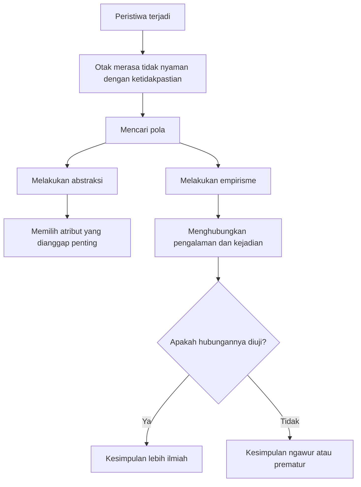

## 🧠 Pendahuluan: Manusia Tidak Selalu Mencari Kebenaran, Sering Kali Kita Hanya Mencari Kesimpulan yang Membuat Kita Nyaman

Ada satu kenyataan yang agak tidak enak diterima, tetapi sangat penting untuk dipahami: manusia tidak selalu ingin benar. Sering kali, manusia hanya ingin **merasakan bahwa ia sudah menemukan penjelasan**. Dan begitu sebuah penjelasan terasa pas, meyakinkan, menenangkan, atau sesuai dengan emosi serta pengalaman pribadinya, kita cenderung memeluknya erat—bahkan ketika penjelasan itu lemah, ngawur, setengah benar, atau sama sekali tidak didukung bukti. 🤯

Itulah mengapa dunia penuh dengan keyakinan yang dari luar tampak absurd, tetapi dari dalam terasa masuk akal bagi yang memercayainya. Orang bisa yakin tafsir mimpi memberi nomor togel. Orang bisa percaya bumi datar meski ribuan bukti ilmiah menunjukkan sebaliknya. Orang bisa merasa wortel menyembuhkan mata minus. Orang bisa percaya primbon, fengsui, teori konspirasi, atau diet ekstrem hanya karena narasi itu **memberi rasa keteraturan** di tengah hidup yang sebenarnya sangat kompleks dan penuh ketidakpastian. 🌪️

Transkrip yang Mas Hendra kirim menarik sekali karena tidak memulai dari nada menghakimi. Ia tidak sekadar berkata, “orang percaya hal ngawur karena bodoh.” Justru sebaliknya, pembahasannya bergerak jauh lebih dalam. Ia bertanya: **sebetulnya kecerdasan itu apa? mental itu apa? apa fungsi pengetahuan ilmiah? mengapa manusia tetap butuh pengetahuan non-ilmiah? mengapa mitos, narasi, dan nilai bisa terasa lebih penting daripada kebenaran faktual?** Dan pertanyaan-pertanyaan ini sangat penting, karena kalau kita mau memahami kenapa manusia percaya hal ngawur, kita tidak cukup hanya menertawakan kesimpulan yang salah. Kita harus memahami dulu **bagaimana kesimpulan itu dibentuk**, **fungsi psikologis apa yang dilayaninya**, dan **mengapa otak manusia memang tidak bekerja semata-mata untuk menghasilkan kebenaran ilmiah**. 🔍

Dalam arti tertentu, kepercayaan ngawur bukan penyimpangan kecil dari cara berpikir manusia. Ia justru bagian dari arsitektur dasar kehidupan mental kita. Otak manusia bukan mesin ilmiah murni. Otak manusia adalah organ biologis yang berevolusi untuk membantu kita bertahan hidup, berelasi, menafsirkan dunia, mengurangi penderitaan, dan membangun rasa makna. Kadang itu cocok dengan sains. Kadang tidak. Kadang ia menghasilkan teori besar. Kadang ia menghasilkan primbon. Kadang ia menghasilkan fisika kuantum. Kadang ia menghasilkan kabar WhatsApp yang dikirim tanpa cek fakta. 📱

Artikel ini akan membedah semuanya secara runtut, panjang, dan mendalam. Kita akan membahas bagaimana manusia mengambil kesimpulan, apa itu abstraksi dan empirisme, mengapa pengetahuan ilmiah berbeda dari pengetahuan non-ilmiah, apa hubungan kecerdasan dengan mental, bagaimana **coping mechanism** — *mekanisme penanggulangan psikologis* bekerja, mengapa narasi dan nilai lebih memikat daripada fakta mentah, apa beda kecerdasan kognitif dan kecerdasan emosi, mengapa mitos sering mengandung serpihan kebenaran, dan mengapa di ujungnya kita harus memahami bahwa “percaya hal ngawur” bukan semata tanda kebodohan, tetapi juga tanda bahwa manusia adalah makhluk pencari pola, pencari makna, dan pencari ketenangan. ✨

<Callout type="important" title="Tesis utama artikel ini">
Manusia bisa percaya hal-hal ngawur bukan hanya karena kurang informasi, tetapi karena otak manusia memang dibentuk untuk mencari pola, membuat kesimpulan cepat, menjaga rasa aman, mereduksi penderitaan, dan membangun makna. Kebenaran ilmiah penting, tetapi secara psikologis tidak selalu menjadi kebutuhan pertama manusia.
</Callout>

---

## ❓ 1. Mengapa Kita Mudah Mengambil Kesimpulan? Karena Otak Tidak Tahan Hidup dalam Ketidakpastian

Salah satu kalimat paling tajam dari transkrip itu adalah ini: **manusia mengambil kesimpulan itu tidak penting kesimpulannya benar atau tidak; yang penting dia puas dengan kesimpulannya.** Kalimat ini terdengar provokatif, tetapi secara psikologis sangat kuat. Mengapa? Karena dalam banyak situasi hidup, yang paling membuat kita tidak nyaman bukan semata-mata salah, melainkan **tidak tahu**. 😵

Ketidakpastian itu mahal bagi mental. Ia membuat kita cemas, gelisah, ragu, dan tidak punya pegangan. Maka otak sering lebih memilih penjelasan yang salah tetapi rapi daripada kenyataan yang benar tetapi kabur. Dalam istilah psikologi kognitif modern, ini dekat dengan kebutuhan akan **cognitive closure** — *penutupan kognitif*, yaitu dorongan untuk segera memiliki jawaban agar kebingungan berhenti. 

Bayangkan ada suara di malam hari. Otak tidak suka menggantung. Ia ingin cepat memutuskan: itu maling, itu kucing, itu angin, itu hal mistis, atau itu cuma tetangga. Dalam banyak situasi evolusioner, keputusan cepat lebih penting daripada keputusan sempurna. Kalau ternyata salah dan cuma kucing, kita malu sedikit. Tapi kalau ternyata benar predator dan kita terlalu lama mikir, kita mati. Karena itu, otak manusia secara historis memang dibentuk untuk **cepat menyimpulkan**, bukan selalu teliti menyimpulkan. 🐾

Dari sinilah awal berbagai kepercayaan ngawur. Begitu ada peristiwa, kita spontan membangun sebab. Begitu ada kebetulan, kita curiga ada pola. Begitu ada penderitaan, kita cari makna. Begitu ada ketakutan, kita cari narasi yang membuatnya lebih bisa ditanggung. Dan setelah narasi itu menempel, kita sulit melepasnya karena ia sudah menjadi penyangga emosi kita. 🪵

---

## 🔬 2. Apa Bedanya Kesimpulan Ilmiah dan Kesimpulan Ngasal? Jawabannya Ada pada Cara Mengambilnya, Bukan Cuma Hasilnya

Transkrip ini memberi dua kata kunci yang sangat penting: **abstraksi** dan **empirisme**. Dua istilah ini terdengar akademik, tetapi sebenarnya sangat sederhana kalau dibongkar dengan tenang. 🔬

### A. Abstraksi
**Abstraksi** adalah proses menyederhanakan realitas dengan memilih atribut yang relevan dan membuang yang tidak relevan. Kalau kita meneliti tinggi badan seseorang, maka warna kulit, model rambut, atau bentuk mata tidak terlalu penting. Fokus kita hanya pada atribut tinggi badan.

Artinya, abstraksi adalah seni memilih apa yang perlu diperhatikan. Dan di sinilah pengetahuan ilmiah mulai berbeda dari pengetahuan ngawur. Pengetahuan ngawur sering gagal menyaring mana atribut relevan dan mana yang cuma tempelan. Pengetahuan ilmiah justru berusaha disiplin dalam pemilihan variabel. 📏

### B. Empirisme
**Empirisme** adalah usaha menghubungkan pengamatan dengan pengalaman dan bukti. Misalnya, kita melihat bahwa anak tinggi sering lahir dari orang tua tinggi, lalu kita menyimpulkan ada relasi keturunan. Itu bukan sekadar tebak-tebakan; itu usaha menghubungkan pola yang berulang.

Namun di sini ada jebakan besar. Otak manusia memang suka menghubungkan peristiwa, tetapi tidak selalu benar dalam menghubungkannya. Kita bisa melihat dua kejadian berdekatan lalu merasa pasti salah satu menyebabkan yang lain, padahal mungkin cuma kebetulan. Di sinilah lahir kesalahan klasik: **mencampuradukkan korelasi dengan kausalitas**. 

- **Korelasi** = dua hal muncul bersama  
- **Kausalitas** = satu hal benar-benar menyebabkan hal lain  

Kalau habis minum jamu lalu besok sembuh, belum tentu jamunya yang menyembuhkan. Bisa jadi tubuh memang sedang pulih. Bisa jadi ada faktor lain. Bisa jadi efek plasebo. Tapi otak suka jalur cepat: “habis A lalu B, berarti A menyebabkan B.” Dan dari jalur cepat inilah lahir banyak keyakinan ngawur yang terasa sangat intuitif. ⚠️

---

## 🧩 3. Pengetahuan Non-Ilmiah Tidak Selalu Tidak Berguna: Ia Sering Berguna secara Psikologis, Sosial, atau Simbolik

Ini bagian yang sangat penting dan jarang dibahas dengan jernih. Banyak orang terlalu cepat menyederhanakan seolah hanya ada dua kubu:

- ilmiah = berguna  
- tidak ilmiah = sampah  

Padahal realitas jauh lebih rumit. Pengetahuan non-ilmiah sering **tidak akurat secara faktual**, tetapi **tetap berguna secara psikologis atau sosial**. 🧩

Contohnya sederhana. Primbon, tafsir mimpi, fengsui, atau narasi mitologis mungkin tidak lolos standar sains ketat. Tetapi bagi sebagian orang, hal-hal ini memberi rasa keteraturan, harapan, identitas, dan pegangan. Mereka menjadi semacam peta emosi. Bukan peta realitas yang objektif, tetapi peta untuk bertahan hidup secara subjektif.

Mitos Ikarus yang dibahas dalam transkrip adalah contoh bagus. Secara ilmiah, ide bahwa “semakin dekat matahari semakin panas” lalu sayap lilin meleleh jelas tidak akurat bila diterjemahkan secara fisika atmosfer. Tetapi mitos itu tidak hidup karena ketepatan fisikanya. Ia hidup karena **kekuatan naratifnya**: tentang ambisi, kesombongan, batas, dan konsekuensi. Orang tidak mengingatnya sebagai kuliah meteorologi. Orang mengingatnya sebagai cerita yang memberi makna. ☀️

Maka kalau kita bertanya, “Kenapa orang percaya hal yang ngawur?” kadang jawabannya bukan “karena mereka malas berpikir,” melainkan “karena keyakinan itu memberi fungsi yang fakta mentah tidak berikan.” Sains menjelaskan mekanisme. Mitos memberi orientasi emosi. Keduanya tidak berada di ranah yang sama, meski sering saling tumpang tindih. 📚

<Callout type="quote" title="Satu hal penting yang sering dilupakan">
Sebuah keyakinan bisa lemah secara ilmiah tetapi kuat secara psikologis. Itulah sebabnya membantah fakta belum tentu otomatis membongkar keyakinan.
</Callout>

---

## 🧠 4. Kecerdasan Itu Apa? Mengapa Definisinya Tidak Sesederhana IQ Tinggi = Manusia Pintar

Transkrip ini juga mengajak kita keluar dari pengertian kecerdasan yang terlalu sempit. Biasanya kalau bicara kecerdasan, kita langsung berpikir tentang IQ, logika, matematika, bahasa, atau kemampuan akademik. Padahal itu baru satu irisan kecil. 🧠

Dalam pembahasan tersebut, kecerdasan pada level paling dasar didefinisikan sebagai **kemampuan mempertahankan kehidupan selama mungkin**. Definisi ini menarik karena memperluas cakrawala. Kalau seekor bakteri bisa merespons perubahan kadar gula dan berbalik arah menuju kondisi yang lebih menguntungkan, itu bisa disebut kecerdasan dalam arti biologis. Kalau tumbuhan membelok ke arah cahaya agar bisa berfotosintesis, itu juga semacam kecerdasan adaptif. Kalau lalat cepat menghindar dari tangan yang mendekat, itu kecerdasan spesifik untuk bertahan hidup. 🦠🌱🪰

Artinya, kecerdasan tidak identik dengan kemampuan mengerjakan soal logaritma. Kecerdasan adalah kemampuan sistem hidup untuk membaca lingkungan dan merespons secara adaptif. Pada manusia, barulah kecerdasan ini berkembang menjadi bentuk yang lebih rumit: bahasa, simbol, perencanaan, sains, seni, moral, dan institusi.

Pandangan seperti ini penting karena mengingatkan kita bahwa otak manusia tidak berevolusi pertama-tama untuk membuat jurnal ilmiah. Otak berevolusi untuk hidup. Dan kalau hidup menuntut mitos, emosi, solidaritas, agama, ritual, atau narasi identitas, maka semua itu akan punya tempat di dalam struktur mental kita. Itulah sebabnya orang yang sangat cerdas secara akademik pun tetap bisa percaya hal-hal ngawur. Karena sistem mental manusia tidak dioperasikan oleh satu jenis kecerdasan saja. 🎭

---

## 🌊 5. Mental Itu Bukan Sekadar “Isi Kepala,” tetapi Pola Hubungan Kita dengan Dunia dan dengan Yang Lain

Salah satu gagasan paling menarik dalam transkrip adalah definisi mental sebagai sesuatu yang muncul dalam hubungan. Mental tidak dibayangkan semata-mata sebagai benda di dalam kepala, melainkan sebagai cara organisme—terutama yang punya sistem saraf—menerima pola dari luar, mengolahnya, lalu merespons. 🌊

Kalau begitu, mental manusia tidak bisa dipahami hanya dari “apa yang saya pikirkan,” tetapi juga dari “bagaimana saya berhubungan dengan orang lain, aturan, norma, ancaman, harapan, dan makna bersama.” Ini sangat penting, karena keyakinan ngawur jarang tumbuh sendirian di ruang hampa. Ia tumbuh di dalam jaringan sosial.

Seseorang tidak percaya teori konspirasi hanya karena ia membaca satu data salah. Ia percaya karena narasi itu nyambung dengan rasa curiga, identitas kelompok, pengalaman ditipu, ketidakpercayaan pada otoritas, atau kebutuhan untuk merasa bahwa dunia tetap bisa dijelaskan. Demikian juga orang percaya primbon, mitos kesehatan, atau rumor digital bukan sekadar karena kurang literasi. Sering ada kebutuhan relasional dan emosional di baliknya. 🤝

Kalau kita tidak memahami dimensi mental sebagai hubungan, kita akan salah membaca problem keyakinan ngawur seolah itu cuma urusan “kurang informasi.” Padahal sering kali itu urusan **kurang rasa aman**, **kurang pegangan**, **kurang kontrol**, atau **terlalu banyak ketidakpastian**. Dan informasi yang benar tidak otomatis menyembuhkan semua itu. 🫂

---

## 🧮 6. Kecerdasan Kognitif: Penting, Tapi Tidak Sepenting yang Sering Kita Banggakan

Transkrip ini secara sengaja “mengguncang” pengagungan berlebihan pada kecerdasan kognitif. Kecerdasan kognitif memang penting—terutama untuk sains, matematika, logika, analisis, dan pengambilan keputusan berbasis bukti. Tapi ia bukan segalanya. Bahkan untuk kehidupan sehari-hari, ia sering bukan faktor paling menentukan. 🧮

Seekor kecoa tidak tahu 2 + 2 = 4, tetapi ia bertahan ratusan juta tahun. Homo erectus bertahan lebih lama daripada Homo sapiens modern sejauh yang sudah lewat sampai sekarang. Artinya, kecerdasan kognitif dalam arti akademik tidak identik dengan ketahanan hidup jangka panjang. 

Di sini ada pelajaran besar: kita terlalu sering menganggap yang paling penting adalah yang paling rumit secara intelektual. Padahal dalam hidup, yang sering paling menentukan justru hal-hal yang tampak biasa:

- bisa bekerja sama,  
- bisa membaca situasi,  
- bisa menahan impuls,  
- bisa menunda reaksi,  
- bisa menyesuaikan diri,  
- bisa hidup cukup sehat,  
- bisa tidak menghancurkan diri sendiri atau orang lain.  

Dan semua ini tidak semata-mata jatuh ke ranah IQ. Inilah sebabnya orang yang sangat cerdas secara kognitif tetap bisa percaya teori aneh, tetap bisa impulsif, tetap bisa emosional, tetap bisa ditipu, tetap bisa fanatik, dan tetap bisa ngawur. Karena kecerdasan kognitif hanyalah satu potongan dari peta kecerdasan manusia. 🗺️

---

## ❤️ 7. Kecerdasan Emosi: Mengapa Orang Pintar Bisa Tetap Goblok dalam Situasi Sosial

Istilah **emotional intelligence** — *kecerdasan emosi* dipopulerkan Daniel Goleman pada 1990-an, dan transkrip ini membawanya ke arah yang menarik: kecerdasan emosi adalah kemampuan agar respons-respons emosional kita tidak terlalu sering “membajak” keputusan rasional. ❤️

Contoh yang sangat sederhana tapi kuat adalah lalu lintas. Secara rasional kita tahu lampu merah berarti berhenti. Ini aturan. Ini kesepakatan. Ini upaya mengurangi risiko. Tetapi kalau emosi kita tidak terlatih—tidak sabar, impulsif, agresif, ingin menang sendiri—maka kita akan melanggar aturan yang secara rasional justru melindungi semua orang. 

Maka orang yang cerdas secara emosi bukan orang yang tidak punya emosi, tetapi orang yang emosinya **cukup terlatih** sehingga tidak terus-menerus mengambil alih kemudi. Ini penting untuk pembahasan kita tentang kepercayaan ngawur, karena banyak keyakinan ngawur bukan lahir dari kurang logika semata, melainkan dari **emosi yang lebih dulu menentukan arah, lalu logika dipaksa menyusul untuk membenarkan**. 🏎️

Dalam psikologi modern, ini dekat dengan apa yang sering disebut **motivated reasoning** — *penalaran yang digerakkan motif*, yaitu proses ketika kita tidak sungguh-sungguh mencari kebenaran, melainkan mencari pembenaran untuk apa yang sudah kita inginkan, takutkan, atau sukai. Jadi, sekali lagi, orang bisa percaya hal ngawur bukan karena tak bisa berpikir, tetapi karena pikirannya bekerja setelah emosinya memilih kubu. 🎯

---

## 🦴 8. Memori Emosi dan Otomatisasi: Mengapa Banyak Keputusan Hidup Kita Terjadi Tanpa Benar-Benar Dipikirkan

Salah satu bagian paling menarik dari transkrip adalah pembahasan tentang berjalan, memasukkan sendok ke mulut, naik sepeda, menyetir pulang, membuka pintu, turun tangga, belok kiri, belok kanan—semua itu dilakukan lewat pola yang tersimpan sebagai memori emosi atau memori prosedural. 🦴

Kita tidak selalu sadar bahwa sebagian besar hidup kita dioperasikan oleh otomatisasi. Otak tidak mungkin menghitung semua gerak dari nol setiap kali kita melangkah. Karena itu ia menyimpan pola-pola yang sudah sukses, lalu menjalankannya otomatis. Begitu kita bisa berjalan, kita tidak perlu memikirkan kembali otot mana yang harus berkontraksi. Begitu kita bisa menyetir ke rumah, kita sering sampai rumah tanpa bisa mengingat detail tiap belokan. 🚗

Nah, ini sangat relevan untuk soal kepercayaan ngawur. Banyak keyakinan sosial juga bekerja seperti kebiasaan motorik: diulang, diinternalisasi, menjadi otomatis, lalu terasa “alami.” Orang tidak selalu duduk dan menimbang bukti tiap kali mempercayai sesuatu. Sering kali ia hanya mengulangi pola mental yang sudah lama dipakai oleh keluarganya, lingkungannya, agamanya, kelompoknya, atau algoritma media sosial yang terus mengulang hal serupa. 🔁

Begitu suatu keyakinan menjadi otomatis, ia tidak lagi terasa seperti “pendapat”; ia terasa seperti kenyataan. Dan itulah yang membuat keyakinan ngawur bisa sangat tahan banting. Bukan karena argumennya kuat, tetapi karena ia sudah dipindahkan dari ruang evaluasi sadar ke ruang kebiasaan mental yang jarang diperiksa ulang. 🧱

---

## 🗣️ 9. Bahasa: Alat Terbesar Manusia untuk Membangun Realitas Bersama, Termasuk Realitas yang Tidak Nyata

Salah satu gagasan terkuat dalam transkrip ini adalah bahwa bahasa membuat manusia mampu melampaui batasan fisiknya. Secara biologis, manusia hanya bisa punya relasi intim dan akrab dengan jumlah orang terbatas. Tetapi dengan bahasa, manusia bisa membangun komunitas jauh lebih besar, bahkan sampai jutaan orang. 🗣️

Bahasa memungkinkan kita menyebut sesuatu yang tidak hadir. Ia memungkinkan kita bercerita tentang masa lalu, membayangkan masa depan, menyusun hukum, menyebarkan agama, mengorganisasi negara, menulis sejarah, menyimpan emosi nenek moyang dalam teks, dan membuat orang yang tak saling kenal merasa bersaudara. 

Namun kekuatan yang sama ini juga punya sisi gelap. Kalau bahasa bisa membangun negara, ia juga bisa membangun hoaks. Kalau bahasa bisa menyatukan bangsa, ia juga bisa mengikat orang ke teori konspirasi. Kalau bahasa bisa menyimpan pengetahuan ilmiah, ia juga bisa menyimpan mitos yang kuat secara emosional. 📢

Artinya, kemampuan manusia untuk percaya hal ngawur sangat terkait dengan kemampuan kita berbahasa. Kita adalah spesies yang hidup di dalam narasi. Dan narasi tidak harus benar untuk bisa berpengaruh. Ia hanya perlu cukup menarik, cukup masuk akal, cukup menggetarkan, atau cukup menyembuhkan luka batin untuk bertahan. 📜

---

## 🏛️ 10. Pengetahuan Kolektif: Mengapa Kita Semua Sebenarnya Hidup dari Pikiran Orang Lain

Transkrip ini juga mengingatkan bahwa pengetahuan kita sekarang bukan pengetahuan individual semata, melainkan **pengetahuan kolektif**. Kita hidup dari akumulasi pengalaman ribuan generasi. Kita tahu sesuatu bukan hanya karena kita sendiri pernah mengalaminya, tetapi karena orang lain menuliskannya, mengajarkannya, menginstitusikannya, dan mewariskannya. 🏛️

Ini poin penting sekali. Bahkan orang yang merasa dirinya “berpikir mandiri” tetap berpikir dengan bahasa, konsep, simbol, dan kategori yang ia warisi dari komunitas. Jadi kepercayaan ngawur pun sering tidak lahir dari kepala individual yang kosong, tetapi dari ekosistem kolektif yang terus mereproduksi pola tertentu.

Karena itu, melawan keyakinan ngawur juga tidak bisa hanya bersifat individual. Kita tidak cukup berkata kepada satu orang, “tolong berpikir rasional.” Kita harus melihat bagaimana narasi sosial dibangun, bagaimana komunitas memvalidasi keyakinan, bagaimana platform digital mengulang informasi, dan bagaimana simbol tertentu memberi orang rasa identitas. 

Dengan kata lain: **percaya hal ngawur adalah fenomena kognitif sekaligus fenomena budaya.** 🌐

---

## 🎭 11. Mengapa Mitos Tetap Laku? Karena Ia Tidak Menjual Fakta, Ia Menjual Rasa Pegangan

Primbon tetap hidup. Fengsui tetap hidup. Teori konspirasi tetap hidup. Diet-diet ajaib tetap hidup. Mengapa? Karena mitos tidak bersaing dengan sains di pasar yang sama. Mitos bukan terutama menjual akurasi. Ia menjual **makna, arah, dan rasa pegangan**. 🎭

Misalnya, cerita bahwa wortel membuat mata sehat. Secara medis, itu berlebihan. Wortel memang mengandung vitamin A, dan vitamin A penting untuk kesehatan mata, terutama mencegah masalah pada kondisi kekurangan. Tetapi dari sana lalu meloncat ke kesimpulan bahwa wortel bisa memperbaiki mata minus jelas keliru. Namun mitos itu hidup terus karena ia sederhana, mudah diingat, terasa masuk akal, dan mudah dipasarkan. 🥕

Di sinilah kita melihat pola klasik: sebagian besar mitos yang kuat **tidak 100% salah**. Ia biasanya menyimpan serpihan kecil kebenaran, lalu serpihan itu dibesarkan, dipelintir, diberi narasi, dan dijual sebagai penjelasan menyeluruh. Orang lalu merasa, “ada benarnya kok.” Dan memang ada—tetapi hanya sedikit. 

Inilah yang membuat keyakinan ngawur sulit dibongkar. Karena ia jarang murni bohong. Ia sering adalah campuran antara:
- sedikit fakta,  
- banyak generalisasi,  
- emosi yang kuat,  
- dan cerita yang mudah diingat.  

Campuran seperti ini sangat efektif menempel di kepala manusia. 🧲

---

## 🛡️ 12. Coping Mechanism: Salah Satu Kunci Terbesar untuk Memahami Mengapa Manusia Butuh Keyakinan, Bahkan yang Tidak Akurat

Mungkin bagian paling mendalam dari seluruh transkrip adalah ini: manusia mencari nilai, makna, dan keyakinan sebagai **coping mechanism** — *mekanisme penanggulangan batin untuk mereduksi penderitaan*. 🛡️

Ini sangat penting. Banyak orang membayangkan keyakinan itu terutama berfungsi untuk menjelaskan dunia. Padahal sering kali fungsi pertamanya justru untuk **menahan rasa sakit**. Ketika hidup terasa tak adil, tak pasti, atau tak terkendali, manusia mencari nilai yang membuat beban itu lebih tertahankan.

Kalau seseorang miskin lalu percaya bahwa penderitaannya punya tempat terhormat di mata Tuhan, keyakinan itu mungkin tidak mengubah keadaan materialnya, tetapi bisa menurunkan intensitas penderitaan psikisnya. Kalau seseorang berdoa, belum tentu doa itu mengubah struktur realitas, tetapi ia bisa mengubah struktur emosi si pendoa. Kalau seseorang percaya “semua ini ada hikmahnya,” kalimat itu mungkin samar, tetapi ia membuat rasa hancur tidak terlalu telanjang. 🙏

Itulah sebabnya menyerang keyakinan orang tanpa memahami fungsi coping-nya sering justru gagal total. Kita merasa sedang membawa “fakta”, tetapi orang lain merasa kita sedang merampas penopang hidupnya. Maka reaksi yang muncul bukan keterbukaan, melainkan defensif. 

Ini bukan berarti semua keyakinan harus dibiarkan tanpa kritik. Bukan. Tetapi ini berarti kritik yang cerdas harus paham bahwa di balik keyakinan ngawur sering ada penderitaan, ketakutan, atau kebutuhan psikologis yang nyata. Dan selama kebutuhan itu belum ditangani, keyakinan penggantinya akan muncul lagi. 🌱

<Callout type="warning" title="Mengapa debat fakta sering buntu">
Karena banyak keyakinan tidak berdiri terutama di atas bukti, melainkan di atas fungsi emosional. Kalau fungsi emosionalnya tidak disentuh, keyakinan itu tetap punya rumah di dalam diri seseorang.
</Callout>

---

## ⚖️ 13. Moral, Nilai, dan Paradoks: Mengapa Semakin Kita Cari Nilai Absolut, Semakin Banyak Kerumitan Muncul

Transkrip ini juga berani menyentuh satu hal yang sangat tidak nyaman: bahwa dalam biologi murni, kategori baik-buruk tidak hadir sebagaimana dalam moral manusia. Singa memakan kambing bukan karena ia jahat. Ia memang karnivor. Tetapi manusia lalu memberi nilai, memberi moral, memberi predikat “buas,” “baik,” “jahat,” “pahlawan,” “penjahat,” dan seterusnya. ⚖️

Ini penting karena menunjukkan bahwa manusia tidak hidup hanya dalam alam fakta, tetapi juga dalam alam nilai. Dan begitu kita masuk ke alam nilai, paradoks bermunculan. Niat baik bisa menimbulkan malapetaka. Perang yang kejam bisa sekaligus memutar ekonomi. Teknologi roket V2 yang mematikan bisa menjadi fondasi bagi program luar angkasa. Tokoh yang tampak heroik bisa bertumpu pada kerja ribuan orang yang tak terlihat. 

Apa hubungannya dengan keyakinan ngawur? Besar sekali. Banyak keyakinan ngawur bertahan karena ia menyederhanakan paradoks. Dunia nyata terlalu rumit. Maka kita suka cerita yang jelas-jelas saja: siapa jahat, siapa baik, siapa pahlawan, siapa musuh. Narasi yang terlalu sederhana memang sering salah, tetapi ia memuaskan kebutuhan moral kita yang ingin dunia terasa teratur. 🧱

Karena itu, orang sering lebih suka teori konspirasi daripada analisis struktural. Konspirasi memberi tokoh jahat yang jelas. Analisis struktural memberi jejaring sebab yang membingungkan. Otak, terutama ketika lelah atau cemas, lebih suka tokoh jahat tunggal. 🎯

---

## 🌍 14. Mengapa Narasi yang Tidak Masuk Akal Bisa Menyatukan Jutaan Orang? Karena Yang Menyatukan Bukan Fakta, tetapi Imajinasi Bersama

Salah satu bagian paling tajam dari transkrip ini adalah observasi bahwa orang-orang yang sangat berbeda secara fisik, budaya, dan geografis bisa merasa satu bangsa karena bahasa dan narasi bersama. Ini menunjukkan bahwa manusia hidup bukan hanya di dunia benda, tetapi di dunia **imagined order** — *tatanan yang dibayangkan bersama*. 🌍

Bangsa, uang, agama, hukum, status, kehormatan, bahkan “makna hidup” sendiri pada level tertentu bergantung pada kepercayaan bersama. Kalau semua orang berhenti percaya uang sebagai alat tukar, kertas itu tinggal kertas. Kalau semua orang berhenti percaya pada negara, struktur negara goyah. Kalau semua orang berhenti percaya pada cerita tertentu, cerita itu mati. 

Nah, karena manusia adalah makhluk yang hidup dari imajinasi bersama, maka kemampuan kita percaya hal ngawur bukan kecelakaan kecil. Ia adalah efek samping dari kekuatan terbesar manusia: kemampuan memercayai sesuatu yang belum tentu kasatmata, lalu bertindak seolah itu nyata. Inilah yang memungkinkan peradaban. Tetapi inilah juga yang memungkinkan kultus, hoaks, fanatisme, dan ilusi massal. 🏙️

Jadi jawabannya cukup pahit tapi jujur: **manusia bisa percaya hal ngawur karena kemampuan yang sama juga memungkinkan manusia membangun dunia sosial yang besar.** Tanpa kemampuan memercayai narasi, kita mungkin tidak punya negara, sejarah, agama, atau ilmu. Tetapi karena kemampuan itu ada, kita juga rentan pada cerita yang salah. 🔄

---

## 🧪 15. Sains Tidak Punya Niat Menyerang Keyakinan; Sains Hanya Bertanya: Mekanismenya Apa?

Ada satu poin penting dari transkrip yang sangat layak diulang: pengetahuan ilmiah pada dasarnya **tidak lahir untuk membantah keyakinan**, melainkan untuk menjelaskan mekanisme. 🧪

Ini penting sekali. Sains tidak seharusnya dimaknai sebagai “alat menghina orang awam.” Fungsi utamanya bukan debunk demi debat, melainkan memahami bagaimana sesuatu terjadi. Kalau kita belum tahu mekanismenya, kita menyebutnya fenomena. Kalau kita tahu mekanismenya, ia menjadi pengetahuan.

Karena itu, sikap ilmiah yang sehat bukan sekadar berkata, “itu salah,” tetapi bertanya, “prosesnya bagaimana? variabelnya apa? polanya apa? bukti apa yang bisa diuji?” Pendekatan seperti ini jauh lebih produktif daripada menjadikan sains sebagai identitas sombong untuk merendahkan orang lain. 🧫

Dan ironisnya, justru ketika sains dipakai dengan arogan, ia sering kalah secara sosial dari keyakinan ngawur yang jauh lebih hangat, mudah dicerna, dan memberi orang rasa diterima. Maka tugas literasi ilmiah bukan hanya menyebarkan fakta, tetapi juga **membangun cara menjelaskan yang manusiawi**. 🫶

---

## 🍽️ 16. Contoh Nyata: Mitos Diet, Nenek Moyang, dan Mengapa Orang Suka Penjelasan yang Sederhana Sekali

Bagian diet dalam transkrip sangat menarik karena memperlihatkan bagaimana keyakinan ngawur sering dibangun dari separuh kebenaran. Ada yang bilang manusia harus kembali ke paleolithic diet. Ada yang bilang harus carnivore total. Ada yang bilang justru vegetarian total. Semua kubu ini biasanya punya argumen yang tampak meyakinkan. 🍽️

Masalahnya, tubuh manusia adalah hasil sejarah evolusi yang panjang dan kompleks. Tidak ada satu jawaban ekstrem yang otomatis cocok untuk semua orang. Ada faktor genetik, sejarah adaptasi populasi, lingkungan, budaya makan, domestikasi hewan, toleransi laktosa, jenis sumber protein lokal, hingga metabolisme individual.

Jadi, kalimat seperti “makanlah seperti nenek moyangmu” terdengar kuat, tetapi langsung memunculkan pertanyaan penting: **nenek moyang yang mana?** Apakah yang 10 ribu tahun lalu? 100 ribu tahun lalu? 2 juta tahun lalu? Atau nenek moyang terdekat dari garis populasi kita sendiri? 🧬

Inilah contoh bagus bagaimana penjelasan sederhana sering terlalu menggoda. Ia memberi ilusi kepastian. Padahal realitas biologis jauh lebih berlapis. Maka sekali lagi, manusia percaya hal ngawur karena narasi yang simpel lebih mudah dicerna daripada kenyataan yang berantakan. 

---

## 🧬 17. Mengapa Orang Tetap Percaya Mitos Kesehatan? Karena Ada Sedikit Kebenaran, Banyak Pengulangan, dan Harapan Besar

Mitos wortel untuk mata minus adalah contoh sempurna. Ada bagian benarnya: vitamin A memang penting bagi kesehatan mata. Tetapi dari situ orang melompat jauh: berarti makan wortel membuat mata minus sembuh. Padahal itu salah. 🥕

Dalam psikologi kepercayaan, ini pola umum sekali. Sebuah keyakinan jadi kuat kalau memenuhi tiga syarat:

1. **Ada sedikit kebenaran yang bisa dipegang**  
2. **Diulang terus-menerus oleh lingkungan**  
3. **Memberi harapan atau solusi sederhana**  

Kalau ketiganya bertemu, keyakinan itu akan sangat tahan lama. Orang tidak merasa sedang tertipu; mereka merasa sedang memegang petunjuk hidup yang masuk akal. 

Itulah sebabnya melawan mitos kesehatan sangat sulit. Ia tidak hanya bicara soal bukti, tetapi juga soal harapan. Orang ingin ada makanan sederhana yang bisa menyelesaikan masalah. Orang ingin ada rumus singkat. Orang ingin ada satu musuh tunggal penyebab semua penyakit. Dan industri juga suka narasi seperti ini karena mudah dijual. 💊

---

## 🕰️ 18. Mengapa Kita Suka Teori yang Menenangkan, Bukan yang Paling Benar? Karena Penderitaan Butuh Cerita, Bukan Hanya Data

Di bagian akhir transkrip, pembicara kembali pada gagasan besar: manusia mencari nilai untuk mereduksi penderitaan. Ini mungkin kunci paling dalam dari seluruh tema “kenapa kita percaya hal ngawur.” 🕰️

Kalau hidup hanya soal data, manusia mungkin cukup dengan statistik. Tetapi manusia juga makhluk yang sadar dirinya akan mati, bisa gagal, bisa miskin, bisa ditolak, bisa sakit, bisa kehilangan, dan bisa tidak berarti. Kesadaran seperti ini terlalu berat bila ditanggung tanpa cerita. Maka kita menciptakan dan mencari narasi yang membuat rasa sakit lebih tertanggungkan.

Kadang narasi itu agung dan memperkaya peradaban. Kadang narasi itu sempit dan menyesatkan. Kadang ia melahirkan filsafat. Kadang ia melahirkan teori konspirasi. Tapi akarnya sama: manusia sulit hidup dengan absurditas telanjang. Kita butuh bentuk. Kita butuh makna. Kita butuh penjelasan yang tidak hanya benar, tetapi juga **bisa ditinggali secara batin**. 🏠

Maka pertanyaannya bukan lagi sekadar “mengapa orang percaya hal ngawur?” tetapi juga “apa yang tidak diberikan oleh penjelasan yang lebih benar, sehingga orang beralih ke narasi ngawur yang lebih menenangkan?” Pertanyaan kedua ini jauh lebih penting, karena di situlah pekerjaan intelektual yang sesungguhnya dimulai. 🔦

---

## 🧭 19. Jadi, Bagaimana Supaya Kita Tidak Gampang Percaya Hal Ngawur?

Kalau kita rangkum pelajaran praktis dari seluruh pembahasan ini, ada beberapa hal yang sangat penting. 🧭

### Pertama, bedakan rasa yakin dengan kualitas bukti
Perasaan “ini masuk akal” bukan bukti bahwa sesuatu benar. Kadang justru yang paling meyakinkan adalah yang paling rapi secara cerita, bukan yang paling kuat secara data.

### Kedua, biasakan bertanya: ini korelasi atau sebab-akibat?
Hanya karena dua hal muncul berdekatan bukan berarti salah satunya menyebabkan yang lain.

### Ketiga, curigai narasi yang terlalu sederhana
Kalau sebuah penjelasan membuat dunia tampak terlalu hitam-putih, terlalu gampang, terlalu punya satu kambing hitam, kemungkinan besar ada penyederhanaan berlebihan.

### Keempat, pahami fungsi emosional keyakinan
Kalau kita ingin membantu orang keluar dari keyakinan ngawur, jangan hanya serang isinya. Pahami juga fungsi psikologis yang sedang dilayaninya.

### Kelima, belajar hidup dengan sedikit ketidakpastian
Ini yang paling sulit. Kedewasaan berpikir sering berarti mampu berkata, “saya belum tahu,” tanpa buru-buru mengisi kekosongan dengan jawaban palsu. 😌

---

## 🏁 Kesimpulan: Kita Percaya Hal Ngawur karena Kita Bukan Mesin Kebenaran, Melainkan Makhluk yang Ingin Bertahan, Terhubung, dan Tidak Terlalu Menderita

Pada akhirnya, manusia bisa percaya hal-hal ngawur bukan karena kita spesies gagal. Justru karena kita spesies yang sangat berhasil membangun dunia simbol, bahasa, nilai, dan narasi. Kemampuan itu membuat kita bisa mendirikan peradaban. Tetapi kemampuan yang sama juga membuat kita rawan terseret cerita yang salah. 🏁

Otak kita tidak diciptakan untuk menjadi laboratorium steril. Ia adalah organ biologis yang terbentuk oleh sejarah evolusi panjang—untuk bereaksi cepat, menghindari bahaya, membaca pola, membangun relasi, menyimpan kebiasaan, menciptakan makna, dan mengurangi penderitaan. Dalam banyak situasi, semua itu lebih mendesak bagi jiwa manusia daripada akurasi ilmiah. Itulah sebabnya mitos, hoaks, keyakinan simplistis, dan narasi ngawur akan selalu punya pasar. 📡

Namun kabar baiknya, kita tidak harus menyerah pada itu. Kita bisa melatih diri untuk berpikir lebih jernih, lebih sabar, dan lebih rendah hati. Kita bisa menghormati kebutuhan manusia akan makna tanpa menyerahkan diri sepenuhnya pada ilusi. Kita bisa menerima bahwa pengetahuan ilmiah tidak selalu hangat, tetapi tetap penting. Dan kita juga bisa memahami bahwa kalau kita ingin menguatkan akal sehat, kita harus bekerja bukan hanya di level fakta, tetapi juga di level emosi, relasi, bahasa, dan makna. 🌱

Jadi, jawaban paling jujurnya mungkin begini: **kita bisa percaya hal-hal ngawur karena kita manusia—makhluk yang bukan hanya ingin tahu apa yang benar, tetapi juga ingin tahu bagaimana tetap hidup, tetap waras, dan tetap merasa dunia ini bisa ditanggung.**

<Callout type="success" title="Ringkasan akhir dalam satu kalimat">
Manusia percaya hal-hal ngawur karena otak kita tidak hanya mencari kebenaran, tetapi juga mencari pola, kenyamanan, identitas, makna, dan cara untuk mengurangi penderitaan.
</Callout>

---

## 🔖 Referensi

- Video: *Kenapa Kita Bisa Percaya Hal-hal Ngawur*  
- Sumber transkrip: https://www.youtube.com/watch?v=PJw8BWsbhoQ
