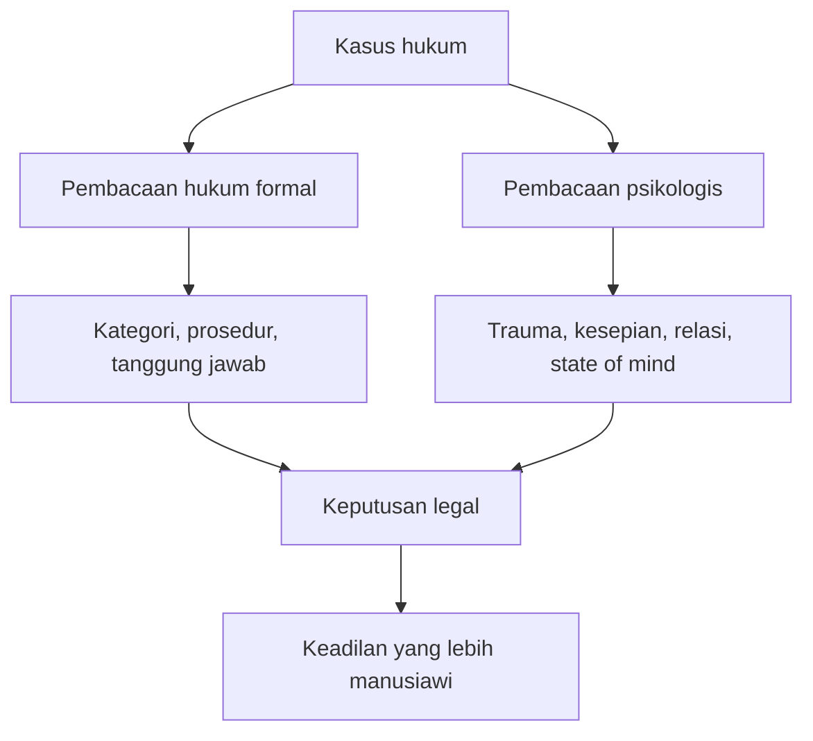

## 🕯️ Pendahuluan: Ada Kasus-Kasus yang Tidak Bisa Diadili Hanya dengan Naluri Moral Biasa

Sebagian besar dari kita tumbuh dengan keyakinan sederhana tentang hukum dan moralitas. Kita diajari bahwa ada yang benar dan ada yang salah. Ada korban dan ada pelaku. Ada tindakan yang bisa dibela, dan ada tindakan yang secara naluriah langsung terasa menjijikkan, mengerikan, atau tidak termaafkan. Dalam banyak kasus, cara berpikir seperti itu memang berguna. Dunia terasa lebih stabil jika kita punya kompas moral yang cukup tegas. Tetapi sesekali, kita bertemu dengan kisah-kisah yang begitu ekstrem, begitu aneh, dan begitu tragis, sampai kompas moral biasa itu seperti bergetar sendiri. 🕯️

Di titik itulah pembahasan tentang **hukum dan psikologi** menjadi sangat penting. Bukan untuk membatalkan moralitas. Bukan pula untuk membenarkan semua hal atas nama “kompleksitas”. Melainkan untuk mengingatkan bahwa ada situasi-situasi tertentu di mana **penilaian yang terlalu cepat justru bisa membuat kita gagal memahami manusia**.

Podcast yang dibahas di sini mengangkat karya **J.W. Freiberg**, seorang figur yang menarik karena bergerak di persimpangan yang jarang: ia seorang **lawyer** *(pengacara)*, tetapi juga memiliki latar belakang akademik kuat di **psikologi**. Kombinasi ini menjadikannya bukan hanya ahli hukum yang lihai berargumen, melainkan juga seseorang yang peka terhadap luka batin, pola relasi, trauma masa kecil, keterasingan, dan bentuk-bentuk kehancuran jiwa yang sering tidak tampak di permukaan berkas perkara. 📚

Melalui buku-bukunya, terutama **Four Seasons of Loneliness** dan **Surrounded by Others and Yet So Alone**, Freiberg memperlihatkan bahwa kesepian bukan sekadar tema sastra atau keluhan modern di media sosial. Kesepian bisa menjadi **struktur batin** yang mengubah nasib manusia. Ia bisa membentuk pilihan hidup, memperparah kehancuran, mengubah hubungan, merusak pertimbangan, bahkan menyeret orang masuk ke medan hukum dengan cara yang tidak pernah kita bayangkan sebelumnya.

Yang membuat pembahasan ini begitu kuat adalah kenyataan bahwa semua kasus yang diceritakan tidak hadir sebagai drama fiktif. Ia datang dari dunia hukum, dari perkara nyata, dari orang-orang yang hidupnya betul-betul retak. Ada kisah tentang satu keluarga yang dibentuk dalam dunia incest yang begitu menyimpang sampai negara sendiri kesulitan membaca apa yang sebenarnya harus dilakukan. Ada kisah tentang loyalis politik yang dihancurkan oleh kekuasaan totaliter dan bertahan belasan tahun dalam **solitary confinement** *(pengurungan sendirian)*. Ada kisah tentang seorang sopir yang hidup terlalu sendirian sampai rasa bersalah menjadi seluruh isi hidupnya. Ada pula kisah tragis tentang seorang profesor besar yang menulis tentang cinta sepanjang hidupnya, tetapi justru mati dalam penyesalan karena tidak pernah sungguh hidup di dalam cinta. 💔

Ini bukan sekadar kumpulan cerita aneh. Ini adalah laboratorium moral. Ia memaksa kita bertanya:
- apakah semua yang salah bisa dipahami dengan satu teori moral yang sederhana?
- apakah hukum cukup hanya dengan teks dan prosedur?
- apa yang terjadi ketika trauma, kesepian, dan relasi manusia jauh lebih rumit daripada kategori yang tersedia di sistem hukum?
- dan yang paling penting, **sejauh mana empati bisa membantu kita memahami tanpa harus kehilangan batas moral?**

Artikel ini akan membedah pertanyaan-pertanyaan itu secara **detail, mendalam, dan setuntas mungkin**. Kita tidak akan hanya meringkas isi obrolan podcast. Kita akan mengurai lapisan-lapisannya:
- siapa J.W. Freiberg dan mengapa posisinya penting,
- bagaimana konsep **loneliness** *(kesepian)* dibedakan dari **solitude** *(kesendirian yang dipilih)*,
- apa makna filosofis dan psikologis dari kasus-kasus ekstrem yang dibahas,
- bagaimana hukum tampak terlalu kaku jika dilepaskan dari psikologi,
- dan mengapa kemampuan membaca manusia dengan empati bukan kelembekan, melainkan salah satu bentuk kecerdasan hukum tertinggi. ⚖️

Kalau harus disederhanakan sejak awal, inti dari artikel ini adalah:

> **Ada kasus-kasus hukum yang tidak bisa dipahami hanya dengan logika hitam-putih. Untuk membaca kasus semacam itu, kita perlu empati yang terlatih, psikologi yang jernih, dan keberanian untuk menerima bahwa manusia sering kali jauh lebih rumit daripada teori moral yang paling kita sukai.**

---

## 🧭 Tesis Utama: Hukum Tanpa Psikologi Mudah Menjadi Buta, Psikologi Tanpa Hukum Mudah Menjadi Tidak Berdaya

Tesis utama yang dapat ditarik dari pembahasan ini adalah sebagai berikut:

> **Kasus-kasus ekstrem menunjukkan bahwa hukum tidak cukup bila hanya dibangun di atas aturan formal, sementara psikologi tidak cukup bila tidak bisa diterjemahkan ke dalam struktur pembelaan, pertanggungjawaban, dan keputusan yang nyata. Karena itu, perjumpaan antara hukum dan psikologi adalah perjumpaan antara ketegasan dan kedalaman.**

Hukum membutuhkan batas. Ia membutuhkan kategori, prosedur, alat pembuktian, dan keputusan. Tetapi manusia jarang hidup dalam bentuk yang sesederhana pasal. Manusia datang dengan:
- sejarah masa kecil,
- luka yang tak selesai,
- relasi yang bengkok,
- kebutuhan emosional yang tidak terpenuhi,
- dan kadang-kadang struktur hidup yang begitu kacau sampai kategori biasa tak lagi cukup.

Sebaliknya, psikologi bisa menjelaskan banyak hal tentang mengapa seseorang bertindak begini atau begitu, mengapa seseorang rusak, mengapa seseorang tidak mampu membuat pilihan sehat, atau mengapa seseorang terus mengulang pola destruktif. Tetapi penjelasan psikologis saja tidak otomatis menyelesaikan persoalan hukum. Kita tetap harus bertanya:
- siapa yang bertanggung jawab,
- siapa yang harus dilindungi,
- kebijakan apa yang tepat,
- dan struktur keputusan seperti apa yang paling sedikit melukai masa depan.

Maka hukum dan psikologi bukan dua dunia yang saling meniadakan. Mereka justru harus saling mengoreksi. Hukum mencegah psikologi tenggelam jadi sentimentalitas murni. Psikologi mencegah hukum berubah menjadi mesin dingin yang menghukum tanpa memahami. 🧠⚖️

---

## 🌫️ Loneliness Bukan Solitude: Mengapa Perbedaan Ini Sangat Penting?

Salah satu gagasan paling penting yang muncul di awal pembahasan adalah perbedaan antara **loneliness** dan **solitude**. Dalam bahasa Indonesia, keduanya sering sama-sama diterjemahkan sebagai “kesendirian”, padahal secara psikologis mereka sangat berbeda. 🌫️

### **Solitude**
*Solitude* adalah kesendirian yang **dipilih**, yang bisa justru menyehatkan, menyuburkan, dan memberi ruang kontemplasi. Ini adalah momen ketika seseorang sendiri tetapi tidak merasa hancur. Ia bisa hadir saat kita:
- membaca sendirian,
- bekerja tanpa gangguan,
- berjalan sendiri dengan tenang,
- berdoa,
- bermeditasi,
- atau sekadar mengambil jarak dari dunia agar bisa kembali lebih utuh.

Dalam bentuk tertentu, *solitude* adalah kemewahan batin. Ia memberi ruang bagi pikiran untuk bernapas. Ia tidak identik dengan kesepian. Banyak orang justru membutuhkan *solitude* agar tidak tenggelam dalam hiruk-pikuk sosial yang melelahkan.

### **Loneliness**
Sebaliknya, *loneliness* adalah kesendirian yang **menggigit**, yang terasa seperti kehilangan jembatan dengan dunia. Orang yang *lonely* bisa saja dikelilingi banyak orang, tetapi tetap merasa tidak sungguh dilihat, tidak sungguh dipahami, tidak sungguh punya tempat untuk menggantungkan batin. Di sini letak tragedinya. Kesepian bukan soal jumlah manusia di sekitar kita, melainkan soal **kualitas keterhubungan**. 😔

Seseorang bisa:
- tinggal di kota besar,
- punya profesi bergengsi,
- hadir di banyak forum,
- dikelilingi kolega,
- bahkan dikagumi,

namun tetap hidup dalam kekosongan afektif yang ekstrem.

Inilah yang membuat tema Freiberg begitu kuat. Ia tidak sedang membahas orang yang sekadar “sendirian”, tetapi orang-orang yang secara eksistensial **terputus**, entah karena trauma, karena pengkhianatan, karena struktur hidup yang salah sejak awal, atau karena mereka sendiri gagal membangun relasi yang sehat.

Dan menariknya, kesepian dalam kasus-kasus ini bukan sekadar latar. Ia adalah **kekuatan kausal**. Ia memengaruhi pilihan, respons, hubungan, dan bahkan arah perkara hukum. 

---

## 👨‍⚖️ Siapa J.W. Freiberg, dan Mengapa Posisi Intelektualnya Menarik?

J.W. Freiberg bukan sosok yang biasa. Yang membuatnya menonjol bukan hanya karena ia menangani kasus-kasus ekstrem, tetapi karena cara ia sampai ke sana juga tidak biasa. Ia punya lintasan intelektual yang berpindah-pindah: dari sosiologi, ke hukum, lalu ke psikologi. 🧩

Latar belakang seperti ini penting. Mengapa? Karena orang yang hanya berangkat dari satu disiplin sering membawa satu jenis kacamata saja. Seorang lawyer murni bisa sangat kuat dalam argumentasi prosedural, tetapi mungkin terlalu kering dalam membaca batin manusia. Seorang psikolog murni bisa sangat peka terhadap trauma dan dinamika jiwa, tetapi mungkin kesulitan menerjemahkan semua itu ke struktur litigasi, pembuktian, strategi, dan norma hukum.

Freiberg berdiri di tengah-tengah dua dunia itu. Ia cukup keras untuk berpikir sebagai lawyer, tetapi cukup dalam untuk merasakan kompleksitas psikologis klien dan perkara. Ini kombinasi yang langka. Dan dari podcast ini terlihat bahwa justru di situ kekuatan utamanya. Ia mampu melihat apa yang tidak terlihat oleh sistem biasa. Ia bisa bertanya bukan hanya “apa yang terjadi?”, tetapi juga:
- “bagaimana struktur batin orang ini terbentuk?”
- “mengapa reaksi ini muncul?”
- “apa yang akan terjadi jika negara memotong relasi ini begitu saja?”
- “argumen seperti apa yang mungkin meyakinkan hakim tanpa mengkhianati kompleksitas psikologis kasus?”

Di sinilah kita melihat hukum sebagai seni strategis sekaligus seni memahami manusia. 🎭

---

## 🌱 Four Seasons of Loneliness: Mengapa Empat Musim?

Judul **Four Seasons of Loneliness** sangat indah sekaligus menyedihkan. Ia tidak hanya memberi struktur estetis pada buku, tetapi juga memberi petunjuk bahwa kesepian hadir dalam **wajah-wajah yang berbeda**. Tidak semua kesepian lahir dari sebab yang sama. Tidak semua kehancuran batin punya bentuk yang sama. 🌱☀️🍂❄️

Empat musim menjadi semacam metafora:
- **Spring** *(musim semi)* bisa berarti masa tumbuh yang justru dihancurkan sebelum matang,
- **Summer** *(musim panas)* bisa berarti puncak ketegangan yang pelan-pelan menghapus manusia,
- **Autumn** *(musim gugur)* bisa berarti peluruhan perlahan, kelelahan, dan kehancuran yang merayap,
- **Winter** *(musim dingin)* bisa berarti akhir, kekosongan total, atau pembekuan jiwa.

Dalam pembacaan seperti ini, kesepian tidak lagi tampak sebagai emosi tunggal. Ia menjadi lanskap. Ia punya cuaca, suhu, ritme, fase, dan cara kerja yang berbeda-beda. Itu sebabnya kasus-kasus dalam buku ini terasa ekstrem, tetapi juga saling melengkapi. Masing-masing menunjukkan satu bentuk kesepian yang berbeda. 

---

## 🚨 Kasus Pertama: “The Loneliest Boy” dan Tragedi Anak yang Lahir ke Dalam Dunia yang Sudah Rusak

Kasus pertama langsung menghantam. Bukan hanya karena temanya incest, tetapi karena justru di situlah intuisi moral biasa kita diguncang. Dalam banyak kasus kekerasan seksual, kita terbiasa berpikir dengan pola yang cukup jelas: ada pelaku, ada korban, ada pemaksaan, ada dominasi, ada struktur abuse *(penyiksaan / pelecehan / eksploitasi)*. Dan memang sering demikian. Tetapi kasus ini, sebagaimana dijelaskan dalam podcast, justru menghadirkan wilayah abu-abu yang sangat ekstrem. 🚨

Ada sebuah keluarga yang selama beberapa generasi hidup dalam pola incest. Dari luar, kita langsung ingin menolak total — dan tentu secara hukum, relasi semacam itu memang tidak bisa dibenarkan. Tetapi yang membuat kasus ini luar biasa sulit adalah kenyataan bahwa anak-anak yang lahir di dalamnya **dibesarkan dalam lingkungan yang bagi mereka terasa aman, penuh afeksi, dan normal**.

Ini bukan berarti struktur itu sehat. Tidak. Struktur itu tetap menyimpang secara mendasar. Tetapi dari sudut pandang psikologis anak yang lahir di dalamnya, dunia itu adalah satu-satunya dunia yang mereka kenal. Mereka tidak punya titik acuan lain. Mereka tidak tumbuh dengan standar luar. Mereka tidak punya pengalaman netral untuk membandingkan. 

Ketika negara akhirnya masuk, menangkap, memisahkan, dan memecah keluarga ini, secara hukum tindakan itu bisa dipahami. Negara harus menghentikan relasi yang melanggar. Tetapi di sisi lain, dari perspektif psikologi anak, peristiwa itu seperti bencana kosmik. Bukan karena struktur lama itu baik, melainkan karena seluruh rasa aman mereka — yang memang terbentuk di tempat yang rusak — dipotong sekaligus. 🧨

Di sini letak tragedinya. Anak laki-laki dan anak perempuan yang menjadi fokus kasus tidak sedang “kembali” ke dunia normal. Mereka justru mengalami penghancuran atas satu-satunya dunia yang mereka tahu. Maka ketika kemudian keduanya tetap menjalin relasi seksual setelah dipisahkan dan ditempatkan di lingkungan baru, sistem hukum kesulitan membaca. Apakah ini pemaksaan? Apakah ini abuse? Apakah ini incest yang sadar? Apakah ini hasil conditioning *(pembentukan pola psikologis sejak kecil)*? Apakah ini bentuk ketergantungan ekstrem karena mereka saling menjadi satu-satunya jangkar dunia yang tersisa? 🤯

Podcast menekankan bahwa dalam kasus ini tidak mudah membuktikan adanya coercion *(pemaksaan)* seperti yang biasa diasumsikan. Dan justru karena itulah kasus ini merusak pola pikir hitam-putih. Di sini, semua kategori tampak tidak cukup. Anak-anak ini jelas hidup dalam struktur salah. Tetapi mereka juga jelas bukan arsitek dari struktur itu. Mereka dilahirkan di sana. Mereka dibentuk oleh sana. Mereka tidak memilih itu.

<Callout type="danger" title="Pelajaran Paling Sulit dari Kasus Ini">
Kadang ada kasus di mana hukum harus menghentikan sesuatu yang salah, tetapi cara penghentiannya sendiri bisa menciptakan trauma baru yang sangat besar. Di sinilah dibutuhkan kebijaksanaan yang jauh lebih dalam daripada sekadar “ini salah, titik”.
</Callout>

Yang paling memilukan adalah akhir kisahnya. Anak laki-laki itu, setelah dipisahkan, setelah diberi label gangguan mental, setelah masa depannya seperti dihancurkan oleh sesuatu yang sebenarnya tidak ia pilih sejak awal, akhirnya menghilang. Ia kabur. Masa semi kehidupannya hancur sebelum sempat tumbuh. Itulah mengapa kisah ini menjadi “spring of loneliness” — musim semi yang dirampas sebelum benar-benar menjadi kehidupan. 🌱

---

## ⚖️ Apa yang Bisa Dipelajari Hukum dari Kasus Pertama?

Kasus ini memperlihatkan keterbatasan besar hukum jika ia memaksakan satu model penilaian pada semua perkara. Dalam perkara biasa, norma hukum memang harus tegas. Tetapi dalam perkara ekstrem seperti ini, hukum juga harus bertanya:
- bagaimana memisahkan anak dari struktur menyimpang tanpa menghancurkan seluruh struktur kejiwaannya sekaligus?
- apakah perlindungan bisa dilakukan secara bertahap?
- bagaimana memastikan transisi menuju “normalitas” tidak justru terasa sebagai kiamat psikologis?

Ini bukan soal membenarkan incest. Sama sekali bukan. Ini soal mengakui bahwa **korban yang lahir dan tumbuh di dalam sistem rusak sering tidak bisa langsung diselamatkan hanya dengan logika pemisahan formal**. Penyelamatan harus mempertimbangkan rekonstruksi batin. Dan di situlah psikologi dibutuhkan oleh hukum. 🧠

---

## ☀️ Kasus Kedua: Loyalis Mao, Solitary Confinement, dan Penghapusan Manusia dari Dalam

Kasus kedua terasa seperti novel politik yang terlalu kejam untuk jadi kenyataan. Seorang tentara Amerika yang jatuh cinta pada Tiongkok, kemudian menjadi simpatisan dan propagandis Mao, akhirnya justru dihancurkan oleh rezim yang ia dukung sendiri. Ia dipenjara, dikurung sendirian bertahun-tahun, bukan sekali, tetapi dua kali, dan salah satu sebabnya bahkan terdengar absurd: karena Stalin menganggap keberadaan orang Amerika di lingkaran Mao tampak tidak pantas. ☀️

Secara politik, kita bisa membaca kasus ini sebagai pelajaran klasik: **jangan menggantungkan nasib pada rezim totaliter**. Dalam rezim semacam itu, loyalitas tidak pernah benar-benar aman. Yang menentukan bukan merit, bukan pengorbanan, bukan sejarah kesetiaan, melainkan suasana hati kekuasaan, bisik-bisik elite, atau obrolan singkat antar penguasa. 

Tetapi Freiberg tidak berhenti pada pelajaran politik. Ia melihat sesuatu yang lebih mengerikan: **apa yang terjadi pada manusia ketika ia dibiarkan hidup bertahun-tahun dalam kesendirian total tanpa penjelasan?**

*Solitary confinement* bukan sekadar hukuman fisik. Ia adalah eksperimen penghancuran identitas. Tidak ada buku. Tidak ada percakapan. Tidak ada stimulasi berarti. Tidak ada relasi. Tidak ada horizon. Hanya tembok, tubuh sendiri, waktu yang membusuk, dan ingatan yang terus berputar. Dalam kondisi seperti ini, manusia perlahan bisa kehilangan batas antara diri, waktu, dan makna. 🕳️

Yang membuat kasus ini lebih kompleks lagi adalah kenyataan bahwa lelaki itu menolak mengaku sebagai pengkhianat. Ia lebih memilih penghapusan diri pelan-pelan daripada menandatangani dusta tentang dirinya sendiri. Jadi ia bertahan bukan karena sistem memberinya harapan, tetapi justru karena ia bertahan pada sisa terakhir identitasnya. 

Ini menjadikan kesepiannya sangat istimewa secara tragis. Ia tidak hanya sendiri. Ia juga dikhianati oleh objek kesetiaannya sendiri. Ia bukan sekadar kehilangan kebebasan; ia kehilangan **penjelasan**. Dan kehilangan penjelasan sering kali lebih menghancurkan daripada kehilangan kenyamanan. Karena jika penderitaan tidak punya makna, maka yang tersisa hanya kekosongan. 😶

---

## 🧠 Apa yang Dihancurkan oleh Solitary Confinement?

Kasus ini memberi pelajaran psikologis yang sangat besar. Manusia bukan hanya makhluk biologis. Ia makhluk relasional dan simbolik. Kita hidup dari ritme bicara, diakui, ditanggapi, disentuh oleh waktu sosial, diberi nama oleh orang lain, dan dipastikan keberadaannya lewat respons orang lain. Ketika semua itu dihapus, yang dihancurkan bukan hanya kenyamanan, tetapi struktur dasar kemanusiaan itu sendiri. 🧠

*Solitary confinement* pada level ekstrem bekerja seperti ini:
- memutus relasi,
- memutus ritme sosial,
- memutus validasi realitas,
- memutus kontinuitas identitas,
- dan pada akhirnya bisa menghapus sebagian diri manusia.

Itulah mengapa Freiberg membaca kasus ini sebagai **summer of loneliness** — musim panas yang membakar habis. Di sini kesepian bukan lagi kekurangan teman. Ia menjadi alat penyiksaan eksistensial.

---

## 🍂 Kasus Ketiga: Sopir Truk, Rasa Bersalah, dan Kesepian yang Tidak Terlihat

Kasus ketiga pada permukaan tampak lebih “normal” dibanding dua kasus sebelumnya. Seorang sopir truk lalai, menyebabkan kecelakaan fatal, dan seorang anak perempuan tewas secara mengerikan. Secara hukum, ini terlihat seperti perkara negligence *(kelalaian)* yang berat. Tetapi justru di situlah jebakannya. Karena ketika kita merasa sudah “mengerti” struktur kasus, kita berhenti melihat manusia di belakangnya. 🍂

Freiberg, yang mewakili si sopir, menemukan bahwa orang ini bukan monster biasa. Ia seorang yang sangat **well-read** *(terpelajar, banyak membaca)*, hidup sangat sendirian, punya perpustakaan pribadi besar, dan nyaris tidak punya dunia sosial selain kerja dan buku. Ia tidak hidup sebagai penjahat. Ia hidup sebagai manusia yang sangat tertutup, sangat sepi, sangat terisolasi, dan setelah kecelakaan itu, seluruh kesepiannya dipenuhi oleh satu hal: rasa bersalah.

Yang sangat menyentuh dari kisah ini adalah kenyataan bahwa ia takut bukan hanya pada hukuman. Ia takut pada kemungkinan bahwa detail kematian anak perempuan itu akan dibuka di pengadilan dan menghancurkan orang tuanya yang belum tahu detail paling brutal dari kejadian itu. Di sini, kita melihat paradoks: seseorang yang secara hukum adalah penyebab tragedi, tetapi secara psikologis justru hidup sebagai orang yang dihantui empati dan rasa bersalah tanpa ujung. 😢

Akhirnya ia bunuh diri.

Dan di situlah kesalahan Freiberg terasa paling manusiawi. Ia menyesal karena, sebagai lawyer sekaligus psikolog, ia seharusnya lebih cepat membaca bahwa klien ini sudah berada di tepi kehancuran. Di sini kita melihat satu pelajaran lain: tidak semua orang yang tampak tenang itu aman. Kadang justru orang yang paling rapi, paling sopan, paling terkendali, adalah orang yang paling dekat dengan jurang.

<Callout type="quote" title="Pelajaran Sunyi dari Kasus Ini">
Seseorang bisa melakukan kesalahan fatal, tetap bertanggung jawab secara hukum, namun sekaligus menjadi manusia yang begitu rapuh sampai satu-satunya dunia batinnya dipenuhi rasa bersalah yang tidak tertahankan.
</Callout>

Ini yang membuat kasus ini sangat penting. Ia memaksa kita menghadapi satu pertanyaan yang tidak nyaman: **mungkinkah kita bersimpati pada seseorang yang menyebabkan kematian orang lain?** Secara naluriah, banyak orang akan menolak. Tetapi justru di situlah Freiberg ingin membuka ruang berpikir. Bukan untuk menghapus tanggung jawab, melainkan untuk mengatakan bahwa tanggung jawab hukum dan pemahaman psikologis bisa berjalan bersama. ⚖️❤️

---

## ❄️ Kasus Keempat: Profesor Cinta yang Mati dalam Kekosongan

Kalau tiga kasus sebelumnya terasa ekstrem secara peristiwa, maka kasus keempat justru menghantam pada tingkat yang lebih eksistensial. Seorang profesor, ahli sejarah cinta, penulis tentang cinta, orang yang dihormati, dikelilingi murid, kolega, dan reputasi, ternyata menjelang kematian justru menangis karena menyadari bahwa ia tidak pernah sungguh hidup di dalam cinta. ❄️

Inilah bentuk kesepian yang paling halus, tetapi mungkin justru paling dekat dengan kehidupan modern kelas menengah terdidik. Orang ini tidak miskin. Tidak kriminal. Tidak di penjara. Tidak dibuang oleh negara. Tidak hidup di keluarga menyimpang. Ia sukses. Ia dihormati. Ia punya kehidupan intelektual yang kaya. Tetapi rumahnya kosong dari foto, kosong dari kedekatan, kosong dari jejak hidup bersama orang lain. 

Ironinya luar biasa: ia menulis tentang cinta, meneliti cinta, menjelaskan sejarah cinta, bahkan mungkin mengajar orang lain memahami cinta — tetapi justru menjadikan cinta sebagai objek intelektual agar tidak perlu mengalaminya secara rentan. Ini sangat tragis sekaligus sangat realistis. Karena banyak orang modern melakukan hal yang sama pada level lebih kecil:
- kita menganalisis hidup agar tidak perlu merasakannya terlalu dalam,
- kita membuat teori agar tidak perlu membuka diri,
- kita menjadi ahli pada suatu emosi justru agar bisa menjaganya tetap jauh dari tubuh kita sendiri. 🫥

Profesor ini menyesali satu cinta yang tidak pernah ia kejar. Lalu karena satu kegagalan itu, ia memilih bentuk hidup yang secara perlahan menjauhkannya dari pengalaman afektif sejati. Ia dikagumi banyak orang, tetapi tidak merasa dicintai. Ia terlihat berhasil, tetapi mati dalam rasa gagal. Ia adalah contoh sempurna dari kalimat: **surrounded by others and yet so alone**.

Ini adalah winter — musim dingin kesepian. Tidak ada ledakan besar. Tidak ada kecelakaan besar. Tidak ada penjara. Hanya pembekuan perlahan dari hidup yang secara sosial tampak berhasil. Dan justru itu membuat kisah ini sangat mengerikan. Karena ia bisa terjadi pada siapa saja yang terlalu lama menjadikan intelektualitas sebagai benteng terhadap kerentanan. 🧊

---

## 👥 Surrounded by Others and Yet So Alone: Bentuk Kesepian yang Paling Modern

Judul buku kedua, **Surrounded by Others and Yet So Alone**, mungkin justru paling dekat dengan zaman kita. Ini adalah kesepian yang tidak datang karena seseorang hidup di hutan sendirian, tetapi karena ia hidup di tengah manusia tanpa sungguh memiliki keterhubungan yang utuh. 👥

Podcast menyinggung beberapa contoh dari buku ini:
- anak kecil yang sakit dan dikelilingi dokter tetapi tetap sendiri,
- anak yang punya dua ayah penuh kasih namun masuk ke pusaran perkara hukum,
- berbagai figur yang secara sosial tampak berada di dalam jaringan relasi, namun secara batin tetap terisolasi.

Ini penting karena sering kali masyarakat modern salah membaca kesepian. Kita mengira selama seseorang:
- punya pekerjaan,
- punya keluarga,
- punya kolega,
- punya keramaian,

maka ia pasti tidak kesepian. Padahal tidak. Ada kesepian yang justru tumbuh dari **misconnection** *(salah sambung relasional)* — hubungan ada, tetapi tidak memberi kelekatan yang sehat. Orang hadir, tetapi tidak benar-benar menjadi tempat pulang batin. 

Di sinilah kesepian menjadi hal yang lebih dari sekadar “sendiri”. Ia menjadi pengalaman tidak tersambung. Dan dari situ bisa lahir:
- keputusan buruk,
- relasi yang menyimpang,
- perilaku kompulsif,
- ketergantungan,
- bahkan tragedi hukum.

---

## 👨‍👧 Kasus Dua Ayah: Hukum, Struktur Keluarga, dan Kreativitas Pembelaan

Salah satu kasus paling menarik dalam buku kedua adalah kisah seorang anak perempuan yang secara biologis anak dari dokter Prancis, tetapi secara de facto dibesarkan penuh kasih oleh dokter lain di Amerika bersama ibunya. Ketika sang ibu meninggal, tiba-tiba terjadi masalah hukum: ayah yang membesarkan anak itu secara psikologis adalah “ayah”, tetapi secara legal ia bukan siapa-siapa. Sementara ada nenek konservatif dari Texas yang merasa anak itu harus dibawa ke lingkungan “yang benar”. 👨‍👧

Kasus ini penting karena memperlihatkan bahwa hukum keluarga tidak selalu bisa membaca kenyataan afektif secara otomatis. Secara formal, sistem mungkin bertanya: siapa ayah biologisnya? siapa next of kin? siapa punya dasar legal lebih kuat? Tetapi dari sudut pandang psikologi anak, pertanyaan paling penting justru bisa jadi: **siapa yang menjadi figur keterikatan utama? siapa rumah emosionalnya? apa yang akan terjadi pada jiwanya bila relasi itu dipotong?**

Freiberg, dengan kecerdikan khas lawyer yang juga mengerti psikologi, tidak berhenti pada keluhan moral. Ia menyusun struktur hukum yang kreatif: membangun mekanisme **joint custody** melalui ayah biologis agar anak tetap bisa diasuh oleh ayah yang selama ini membesarkannya. Ini sangat menarik karena memperlihatkan bahwa empati saja tidak cukup. Kita juga perlu **rekayasa legal yang cerdas**. 🧠⚙️

Inilah momen ketika hukum tampak indah. Bukan karena pasalnya otomatis adil, tetapi karena ada orang yang cukup peka membaca manusia dan cukup kreatif membangun jalan hukum agar keputusan yang muncul tidak menghancurkan hidup anak.

---

## 😂 Kasus Lawyer Kesepian: Ketika Klien Menjadi Cara Berteman

Kasus tentang lawyer yang mendorong klien terus maju ke trial bukan demi keadilan murni, melainkan karena ia kesepian dan menikmati kebersamaan dengan mereka, terdengar nyaris absurd. Tetapi justru di situlah kekuatannya. Ini memperlihatkan bahwa kesepian tidak selalu muncul dalam bentuk dramatis. Kadang ia menyamar menjadi profesionalisme berlebihan, perhatian yang tampak baik, atau relasi kerja yang diam-diam dipakai sebagai substitusi hubungan manusia yang lebih sehat. 😂😶

Orang ini bukan jahat dalam bentuk karikatural. Ia hanya sangat sendiri. Dan karena ia hidup sangat sendiri, ia secara tidak sehat mulai memakai relasi profesional dengan klien sebagai sumber kelekatan. Ini tentu problematis secara etis. Tetapi lagi-lagi, kita melihat hal yang sama: kalau hanya dibaca dengan hukum murni, kasus ini tinggal soal pelanggaran etik profesi. Kalau dibaca dengan psikologi, kita melihat akar yang lebih menyedihkan.

Freiberg memperlihatkan ironi tajam: seseorang bisa melanggar etik bukan karena serakah semata, tetapi karena terlalu lapar akan pertemanan. Dan ini justru membuat kita sadar bahwa batas profesional sangat penting, justru karena kebutuhan emosional manusia bisa merembes ke mana-mana kalau tidak ditata. 🧩

---

## 🎯 Mengapa Buku-Buku Ini Membuka Cakrawala Moral?

Salah satu pernyataan paling penting dalam podcast adalah bahwa buku-buku Freiberg membuat pembaca sadar bahwa ada **infinite possibilities** *(kemungkinan yang nyaris tak terbatas)* dalam kehidupan manusia. Maksudnya sederhana: realitas jauh lebih aneh daripada skenario moral yang biasa kita siapkan di kepala. 🎯

Kita sering berpikir dengan kategori umum:
- korban pasti begini,
- pelaku pasti begitu,
- keluarga bahagia pasti sehat,
- orang sukses pasti utuh,
- orang yang sendirian pasti terlihat,
- orang yang dikelilingi banyak orang pasti tidak kesepian.

Buku-buku ini meruntuhkan semua kemalasan berpikir itu.

Dan di situlah nilainya sangat besar. Ia memaksa kita belajar **kerendahan hati moral**. Kita tetap boleh punya nilai. Kita tetap boleh punya garis tegas. Tetapi kita tidak boleh begitu cepat merasa telah memahami manusia hanya dari satu kategori. 

---

## ⚖️ Hukum Hitam-Putih vs Realitas Abu-Abu

Podcast berulang kali menekankan bahwa banyak orang ingin melihat dunia dalam warna hitam dan putih. Itu wajar, karena hitam-putih memberi rasa aman. Ia membuat kita tidak perlu berpikir terlalu dalam. Tetapi kasus-kasus Freiberg menunjukkan bahwa realitas manusia sering justru hidup di wilayah **abu-abu ekstrem**. ⚖️

Penting dicatat: “abu-abu” di sini tidak berarti semua hal menjadi boleh. Bukan itu maksudnya. Abu-abu berarti:
- ada banyak faktor yang bekerja sekaligus,
- struktur tanggung jawab tidak selalu sederhana,
- penyelamatan tidak selalu bisa dilakukan dengan operasi moral sekali tebas,
- dan manusia sering membawa sejarah yang membuat tindakannya sulit dibaca hanya dari permukaan.

Kedewasaan hukum bukan berarti menolak abu-abu. Kedewasaan hukum justru diuji saat ia harus mengambil keputusan di tengah abu-abu tanpa kehilangan arah normatif. 

---

## ❤️ Empati Bukan Pembelaan Buta

Ini poin yang sangat penting. Banyak orang alergi pada empati karena takut empati akan berubah menjadi pembenaran. Padahal empati yang sehat tidak bekerja seperti itu. **Empati bukan berarti membebaskan semua orang dari tanggung jawab. Empati berarti berusaha memahami manusia secara utuh sebelum memutuskan apa yang adil.** ❤️

Dalam konteks hukum, empati membantu kita:
- melihat faktor psikologis yang relevan,
- memahami konsekuensi keputusan terhadap pihak-pihak yang rentan,
- mencegah penghukuman yang terlalu mekanis,
- dan membedakan antara kejahatan yang dingin dengan perilaku yang tumbuh dari struktur luka yang kompleks.

Empati tidak menghapus hukum. Ia memperhalus cara hukum melihat.

---

## 🧬 Bottomless Society: Bukan Hanya Ilmu Hukum yang Tak Berujung, tapi Juga Manusia Itu Sendiri

Salah satu kalimat paling kuat dari obrolan podcast adalah bahwa yang “bottomless” *(tak berdasar ujungnya)* bukan hanya ilmu hukum, tetapi juga masyarakat itu sendiri. Ini benar. Karena selama ada manusia, selalu ada kombinasi-kombinasi pengalaman yang tidak pernah selesai mengejutkan kita. 🧬

Setiap orang membawa:
- sejarah keluarga,
- struktur sosial,
- pengalaman tubuh,
- pola cinta,
- trauma,
- kebetulan,
- nasib,
- dan relasi kekuasaan.

Dari semua itu, lahirlah kasus-kasus yang kadang tampak mustahil kalau belum pernah kita dengar sebelumnya. Dan justru di situlah pentingnya karya-karya seperti Freiberg: ia memperluas imajinasi moral dan legal kita. Bukan untuk sensasi, tetapi agar kita tidak cepat-cepat menyederhanakan realitas manusia menjadi slogan.

---

---

## 📚 Glosarium Istilah Penting

- **Loneliness:** kesepian yang menyakitkan, rasa terputus dari keterhubungan yang bermakna.
- **Solitude:** kesendirian yang dipilih dan bisa menenangkan atau menyuburkan.
- **Solitary confinement:** pengurungan sendirian dalam penjara, sering dianggap sangat merusak secara psikologis.
- **Coercion:** pemaksaan.
- **Abuse:** penyiksaan, pelecehan, atau eksploitasi dalam relasi yang timpang.
- **Conditioning:** pembentukan pola psikologis melalui pengalaman berulang sejak lama.
- **Joint custody:** pengasuhan bersama dalam hukum keluarga.
- **Plea bargain:** kesepakatan dalam perkara pidana, biasanya terdakwa mengaku bersalah untuk mendapat hukuman lebih ringan atau proses lebih singkat.
- **Next of kin:** kerabat atau pihak keluarga terdekat yang diakui secara hukum.
- **Well-read:** banyak membaca, terpelajar, punya keluasan bacaan.
- **Governance:** tata kelola, kerangka pengaturan dan pengawasan.

---

## 🧾 Ringkasan Pelajaran dari Tiap Kasus

| Kasus | Bentuk Kesepian | Pelajaran Hukum | Pelajaran Psikologi |
| :--- | :--- | :--- | :--- |
| Anak dalam keluarga incest | Kesepian musim semi: tumbuh dalam dunia rusak lalu dihancurkan saat dipisah | Perlindungan tidak boleh buta terhadap struktur psikologis korban | Normalitas psikologis bisa terbentuk di lingkungan yang sangat menyimpang |
| Loyalis Mao dalam solitary confinement | Kesepian musim panas: dibakar oleh pengkhianatan dan isolasi total | Kekuasaan absolut mudah menghancurkan tanpa rasionalitas | Isolasi ekstrem bisa menghapus identitas manusia |
| Sopir truk yang bunuh diri | Kesepian musim gugur: peluruhan perlahan oleh rasa bersalah | Tanggung jawab hukum tak menutup perlunya deteksi kerentanan mental | Rasa bersalah bisa menjadi seluruh isi batin orang yang terlalu sendirian |
| Profesor ahli cinta | Kesepian musim dingin: hidup membeku tanpa keterhubungan sejati | Tidak semua tragedi hukum bersifat kriminal; ada juga tragedi eksistensial | Kecerdasan intelektual tidak menjamin kedekatan emosional |

---

## 🌟 Kesimpulan: Membaca Manusia dengan Empati Adalah Bentuk Kecerdasan, Bukan Kelemahan

Pada akhirnya, yang membuat karya J.W. Freiberg sangat berharga bukan hanya keanehan kasus-kasusnya, tetapi karena ia memaksa kita tumbuh secara moral dan intelektual. Ia mengajarkan bahwa dunia manusia terlalu rumit untuk dibaca dengan reaksi spontan semata. Ada kasus yang memang mudah dinilai. Tetapi ada juga kasus yang menuntut lebih: lebih sabar, lebih hati-hati, lebih dalam, dan lebih empatik. 🌟

Kita belajar dari sini bahwa kesepian bukan isu kecil. Ia bukan pelengkap drama. Ia bisa menjadi kekuatan yang membentuk seluruh struktur hidup seseorang. Ia bisa membengkokkan relasi. Ia bisa mengubah cara orang bertindak. Ia bisa membuat seseorang mengorbankan hidup, kehilangan identitas, mengambil keputusan yang absurd, atau menyesali seluruh hidup menjelang kematian.

Dan kita juga belajar bahwa hukum yang baik bukan hukum yang paling cepat menghukum, melainkan hukum yang paling mampu **membedakan**. Membedakan mana yang benar-benar harus dihentikan dengan tegas, mana yang harus ditangani dengan hati-hati, mana yang butuh perlindungan bertahap, mana yang menuntut kreativitas legal, dan mana yang tidak akan pernah bisa dipahami tanpa psikologi yang serius.

Mungkin inilah kalimat paling penting yang bisa dibawa pulang dari seluruh pembahasan ini:

> **Empati tidak membuat hukum lemah. Empati membuat hukum lebih layak disebut adil.**

Dan dalam dunia yang makin sibuk menghakimi secara cepat — baik di media sosial, ruang publik, maupun institusi — pelajaran semacam ini terasa semakin penting. Karena sering kali yang paling dibutuhkan manusia bukan hanya keputusan yang cepat, melainkan pembacaan yang benar terhadap luka yang tersembunyi di balik perilakunya. 🕯️

---

<Callout type="important" title="Inti Pembelajaran">
Kasus hukum ekstrem bukan hanya menguji kecerdasan legal, tetapi juga menguji kemampuan kita untuk membaca manusia secara utuh. Di situlah hukum dan psikologi bertemu: bukan untuk saling meniadakan, tetapi untuk mencegah keadilan berubah menjadi kebutaan.
</Callout>

<Callout type="cite" title="Referensi Sumber">
- Video: *Ep. 36 - Law and Psychology | The Nature of Loneliness | Looking at Legal Cases with Empathy*
- Sumber transkrip: [YouTube — Ep. 36 - Law and Psychology | The Nature of Loneliness | Looking at Legal Cases with Empathy](https://www.youtube.com/watch?v=1b0Sdj7fpBQ)
- Buku yang dibahas dalam percakapan: *Four Seasons of Loneliness*, *Surrounded by Others and Yet So Alone*, dan *Growing Up Lonely* karya / suntingan J.W. Freiberg.
</Callout>
