## 🌍 Pembuka: Dunia yang Sedang Berubah Bentuk

*Maret 2026. Sebulan lebih setelah Amerika Serikat dan Israel melancarkan serangan militer besar-besaran terhadap Iran. Perang yang tidak kunjung selesai. Konflik yang tidak seorang pun benar-benar memprediksi akan sepanjang ini.*

**Professor John Mearsheimer** — sosok paling vokal dalam tradisi realisme (*realism*) hubungan internasional, Profesor di University of Chicago, penulis "The Tragedy of Great Power Politics" — duduk kembali di hadapan kamera dan berbicara. Tidak ada eufemisme. Tidak ada diplomasi kosong. Hanya analisis yang tajam, dingin, dan sering kali tidak nyaman untuk didengar.

Wawancara ini adalah yang ketiga kalinya Mearsheimer berbicara dengan program yang sama: pertama tentang perang Ukraina, kedua tentang lobi Israel, dan kini — tentang arsitektur kekuasaan global yang sedang mengalami pergeseran tektonik.

<Callout type="abstract" title="Peta Besar Wawancara Ini">
Mearsheimer membahas tujuh tema besar yang saling terkait:

1. **Doktrin Trump (Trump/Monroe Doctrine)** — Imperialisme lama yang kembali, dari Venezuela hingga Greenland
2. **Perang Iran** — Dua miskonsepsi fatal yang menyeret AS ke dalam perang panjang
3. **Proliferasi Nuklir** — Efek domino yang hampir tidak bisa dihentikan
4. **Guncangan Geopolitik di Timur Tengah** — Ketika Arab Sunni dan Syiah terpaksa bersatu
5. **Dampak Ekonomi** — Ancaman terhadap instalasi minyak dan desalinasi Teluk
6. **Krisis Legitimasi Elite** — Epstein, Davos Man, dan runtuhnya kepercayaan publik
7. **Ukraina** — Konflik beku yang hampir pasti, akar dari kesalahan fatal 2008
</Callout>

---

## 🗺️ Bagian 1: Doktrin Trump — Imperialisme Lama yang Kembali

### 📜 Dari Monroe ke Roosevelt ke Trump

Untuk memahami kebijakan luar negeri Trump, Mearsheimer memulai dari sejarah: **Doktrin Monroe** yang diproklamirkan tahun 1823.

<Callout type="info" title="Apa itu Doktrin Monroe?">
**Doktrin Monroe (1823)** — Dicanangkan oleh Presiden James Monroe: *Tidak ada kekuatan besar dari luar yang boleh menempatkan kekuatan militer atau membentuk aliansi militer dengan negara manapun di Belahan Bumi Barat (Western Hemisphere).*

Logikanya sederhana: Amerika Serikat menganggap seluruh benua Amerika sebagai "zona keamanan eksklusifnya".

Tahun 1900, AS menjadi *regional hegemon* (kekuatan dominan regional) di Belahan Bumi Barat. Dan tahun 1904, datanglah **Korolari Roosevelt** (*Roosevelt Corollary*) — perluasan Doktrin Monroe yang mengatakan AS juga berhak *mengintervensi* negara-negara tetangganya untuk alasan **ideologis dan ekonomi**, bukan hanya militer.
</Callout>

```mermaid
graph TD
    A["EVOLUSI DOKTRIN MONROE\nDari 1823 hingga Doktrin Trump 2025"]

    A --> B["1823: DOKTRIN MONROE ASLI\n\nPresiden James Monroe:\n'Tidak ada kekuatan besar luar yang\nboleh menempatkan kekuatan militer\natau membentuk aliansi militer\ndi Belahan Bumi Barat'\n\nTujuan: Mengusir Eropa dari Amerika\ndan memastikan mereka tidak kembali\ndari sudut pandang militer"]

    B --> C["1900: AS MENJADI HEGEMON REGIONAL\n\nAmerika Serikat menjadi negara\npaling kuat di Belahan Bumi Barat\ndan mulai mendominasi kawasan"]

    C --> D["1904: KOROLARI ROOSEVELT\n\nPerluasan penting:\nAS berhak mengintervensi politik\nnegara-negara di kawasan untuk\nalasan IDEOLOGIS dan EKONOMI\n\nBukan hanya militer —\ntapi juga ideologi dan uang"]

    D --> E["20th–21st century:\nGUAT EMALA 1954 & CHILE 1973\n\nPola yang konsisten:\nAS menggulingkan pemerintahan\nkiri yang tidak disukai.\n\nContoh utama:\n→ Guatemala 1954\n→ Chile 1973 (Pinochet coup)\n→ Kuba sejak 1959\n→ Venezuela sejak Chavez\n→ Nikaragua"]

    E --> F["2025: DOKTRIN TRUMP (DONRO DOCTRINE)\n\n= Korolari Roosevelt + Doktrin Monroe Asli\n\nTambahan baru:\nImperialisme ekonomi langsung\n→ 'Aku, Donald Trump, akan\n   MENJALANKAN Venezuela'\n→ 'Minyak Venezuela bukan milik\n   Venezuela. Itu minyak kami.'\n→ Greenland, Kanada sebagai target\n→ Kontrol mineral kritis di\n   seluruh Belahan Bumi Barat"]
```

### 🛢️ Venezuela: Imperialisme Lama yang Kembali

<Callout type="warning" title="Kata-kata yang Mengejutkan Mearsheimer">
Trump berkata secara eksplisit tentang Venezuela: **"Aku, Donald Trump, akan menjalankan Venezuela."**

Mearsheimer mengomentari: *"Pikirkan kata-kata itu. Dia akan MENJALANKAN Venezuela. Di dunia modern, hampir tidak ada orang yang bahkan akan memikirkan untuk mengatakan itu. Itu adalah imperialisme kuno."*

Lebih lanjut, Trump secara efektif mengatakan bahwa **Venezuela tidak memiliki minyaknya sendiri** — itu adalah minyak Amerika, yang akan dieksploitasi sesuai keinginan AS, dan sebagian keuntungannya akan "dikembalikan" ke Venezuela.

*"Ini adalah imperialisme kuno dari jenis yang menghilang di pertengahan abad ke-20 dan kita pikir sudah pergi selamanya."* — Mearsheimer
</Callout>

### 🌍 Mengapa China Tidak Bisa Diusir dari Amerika Latin?

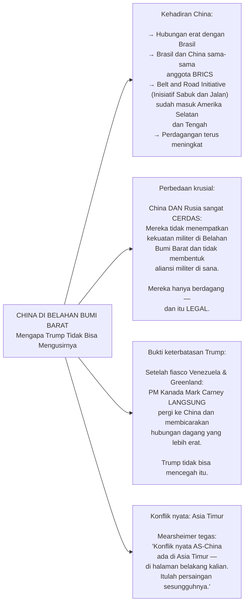

<Callout type="important" title="Prioritas Strategis AS yang Saling Bertentangan">
Mearsheimer mengidentifikasi paradoks besar dalam strategi AS saat ini:

- Secara formal, dokumen strategi keamanan nasional menyatakan AS **sepenuhnya berkomitmen untuk membendung China di Asia Timur**
- Namun secara praktis, AS sedang **tertambat di tiga front sekaligus**: Ukraina, Timur Tengah, dan kini Belahan Bumi Barat

*"Banyak orang berpikir AS akan fokus di Belahan Bumi Barat dengan mengorbankan Asia Timur. Mungkin itu yang akan terjadi — tapi itu akan menjadi kesalahan strategis yang sangat serius."*
</Callout>

---

## ⚔️ Bagian 2: Perang Iran — Anatomi Dua Miskonsepsi Fatal

### 📅 Kronologi: Bagaimana AS Terseret Masuk

<Callout type="note" title="Konteks: Siapa yang Menginginkan Perang Ini?">
Israel di bawah Netanyahu telah **bertahun-tahun** mencoba menyeret AS ke dalam perang melawan Iran. Tujuan Israel ada dua:

1. **Regime change** (pergantian rezim) — tujuan yang lebih sederhana
2. **Memecah Iran menjadi negara-negara kecil** — tujuan ideal, seperti yang terjadi pada Soviet Union 1991 dan Suriah

Untuk mencapai ini, Iran harus:
- Meninggalkan rudal balistiknya
- Meninggalkan program pengayaan nuklir
- Berhenti mendukung Houthi, Hizbullah, dan Hamas

Tapi semua itu hanya mungkin dengan **regime change** — yang membutuhkan kepercayaan bahwa rezim bisa dijatuhkan DAN ada rezim pengganti yang pro-AS/Israel. Keduanya terbukti salah.
</Callout>

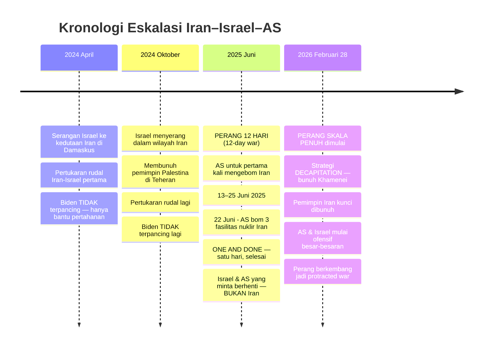

### ❌ Miskonsepsi Pertama: "Iran Bisa Ditekan (Coercion)"

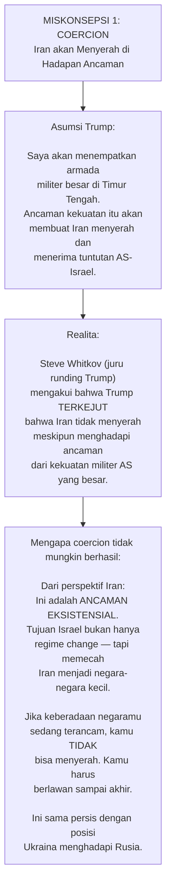

### ❌ Miskonsepsi Kedua: "Decapitation akan Berhasil"

<Callout type="danger" title="Strategi Decapitation: Gagal Dua Kali, Dilakukan Lagi">
**Decapitation strategy** (*strategi pemenggalan*) = membunuh pemimpin puncak dengan harapan rezim akan runtuh karena kehilangan kepala.

**Yang terjadi di Perang 12 Hari (Juni 2025):**
Israel membunuh sejumlah besar elite militer dan politik Iran. Hasilnya? Iran *tidak* menyerah. Justru sebaliknya — mereka belajar, beradaptasi, dan menjadi semakin canggih dalam menembus pertahanan Israel.

**Februari 2026:**
Strategi yang sama diulang — termasuk membunuh Ayatollah Khamenei. Hasilnya? Sama persis.

Mearsheimer: *"Ada literatur ilmiah yang sangat luas tentang decapitation. Literatur itu dengan jelas mengatakan bahwa strategi ini TIDAK PERNAH BERHASIL. Dan itu tidak berhasil di Perang Juni. Jadi mengapa Trump berpikir itu akan berhasil kali ini? Itu adalah miskonsepsi."*
</Callout>

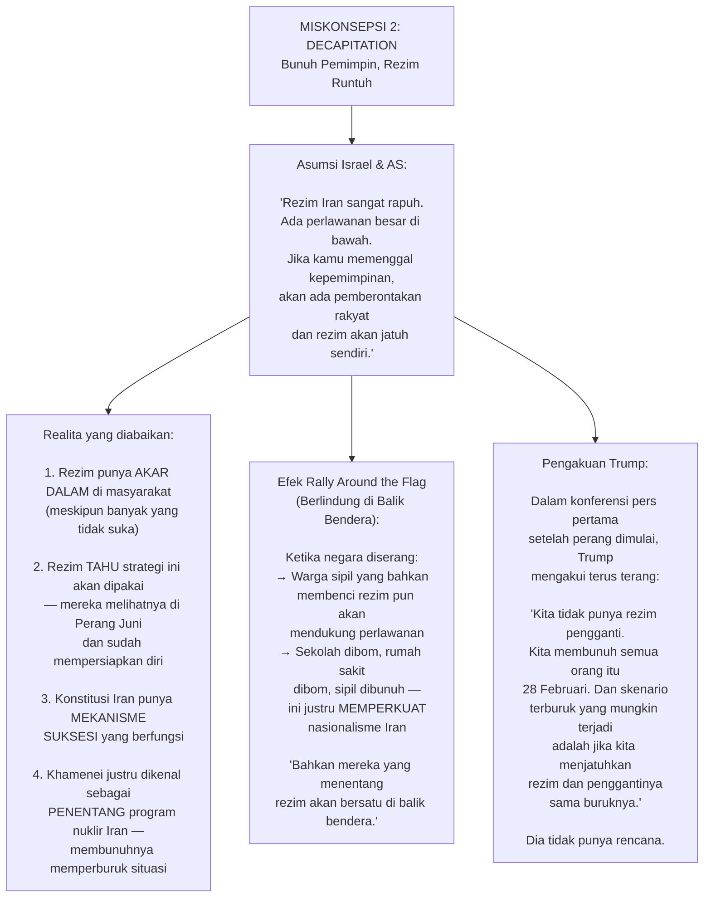

### 🔄 Paralel dengan Houthi — Pola yang Berulang

<Callout type="tip" title="Preseden Houthi: Trump Pernah Mundur Sebelumnya">
Mearsheimer mengingatkan pola yang sangat relevan:

**Maret 2025:** Trump mendeklarasikan perang terhadap Houthi — *"Joe Biden adalah pengecut, aku tidak. Aku akan mengakhiri Houthi."*

**Mei 2025:** Trump menghentikan serangan. *"Houthi itu sungguh tangguh. Aku tidak bisa mengalahkan mereka. Aku berhenti."*

Mereka merancang "kesepakatan setengah jadi" yang terlihat seperti perdamaian. Tapi kenyataannya: **Houthi mengalahkan AS.**

Pertanyaannya sekarang: **Apakah Trump akan melakukan hal yang sama terhadap Iran?** Atau justru memilih untuk *double down* (menggandakan taruhan) dengan mengirim pasukan darat?
</Callout>

---

## 🚀 Bagian 3: Apakah Ada Pasukan Darat? Dan Apakah Senjata Nuklir Mungkin Digunakan?

### 👢 Pasukan Darat — Kemungkinan Terbatas tapi Nyata

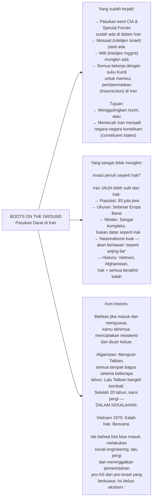

<Callout type="danger" title="Skenario Paling Mengerikan: Senjata Nuklir">
Mearsheimer mengidentifikasi skenario yang ia sebut sebagai "nightmare scenario" (skenario mimpi buruk) — **bukan** tentang konflik yang sedang berlangsung, melainkan **tentang apa yang terjadi setelahnya:**

*"Jika Israel dan AS gagal mengalahkan Iran secara konvensional, dan Iran — yang kini memiliki insentif yang jauh lebih besar untuk mendapatkan senjata nuklir setelah pembunuhan Khamenei (yang justru adalah PENENTANG program nuklir) — berhasil mengembangkan nuklir:*

*Israel, yang tahu mereka kalah, yang tahu mereka telah membuat Iran marah, yang tahu bahwa Iran dengan nuklir sangat berbahaya dari perspektif mereka — akan berpikir untuk menggunakan senjata nuklir terhadap kemampuan nuklir Iran yang sedang berkembang.*

*Tidak ada negara di planet ini yang lebih kejam, lebih tidak segan membunuh, dari Israel. Jadi ide bahwa mereka akan menggunakan senjata nuklir adalah sesuatu yang sangat masuk akal — dan itu yang sangat aku khawatirkan."*

**Ini adalah skenario paling berbahaya di dunia saat ini menurut Mearsheimer.**
</Callout>

---

## ☢️ Bagian 4: Proliferasi Nuklir — Efek Domino yang Sulit Dihentikan

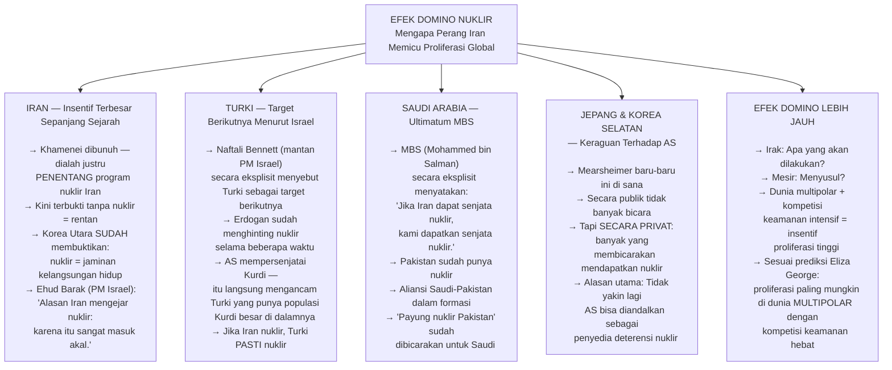

<Callout type="quote" title="Mearsheimer tentang Logika Senjata Nuklir">
*"Apa yang baik untuk angsa, baik untuk bebek. Jika Israel dan Amerika Serikat baik untuk memiliki senjata nuklir, mengapa itu tidak baik untuk Iran dan Turki?"*

*"Aku tidak menyalahkan Israel karena memiliki senjata nuklir. Aku tidak menyalahkan Amerika karena memiliki senjata nuklir. Itu masuk akal sepenuhnya untuk kedua negara itu. Itulah mengapa tidak ada bukti mereka ingin menyerahkan senjata-senjata itu."*

*"Dan satu kutipan favorit saya: Ehud Barak, mantan PM Israel, tentang Iran — 'Alasan aku percaya Iran mengejar senjata nuklir adalah karena itu sangat masuk akal.' Ia secara dasarnya mengatakan: jika aku adalah menteri pertahanan Iran, aku sudah mendapatkan senjata nuklir."*

Dan kemudian Mearsheimer menambahkan dengan ironi yang pedas:
*"Ukraina menyesal memiliki senjata nuklir. Dan ingat, pada tahun 1993, hanya ada satu orang di Barat yang mengatakan bahwa Ukraina tidak boleh melepaskan senjata nuklirnya. Satu orang. Dan semua orang waktu itu bilang aku bodoh."*

Orang itu: John Mearsheimer sendiri.
</Callout>

---

## 🕌 Bagian 5: Sunni dan Syiah — Ketika Musuh Lama Terpaksa Bersatu

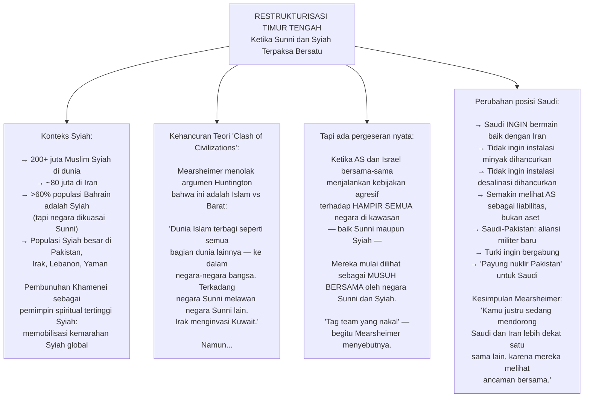

<Callout type="important" title="Mengapa Aliansi AS di Kawasan Itu Berbahaya bagi Mereka Sendiri">
Mearsheimer mengidentifikasi ironi yang mematikan:

**Negara-negara Teluk yang bersekutu dengan AS kini menghadapi dua ancaman sekaligus:**

1. **AS tidak melindungi mereka dengan serius** — AS akan selalu memprioritaskan Israel terlebih dahulu, dan mereka paham itu
2. **Aliansi dengan AS menjadikan mereka *magnet* bagi serangan Iran** — karena AS memiliki pangkalan militer di wilayah mereka

Artinya: Bersekutu dengan AS tidak memberi perlindungan, tapi justru mengundang serangan.

*"Ini adalah bencana. Aku tidak menggunakan kata 'katastrofik' di sini, tapi ini berpotensi katastrofik."*
</Callout>

---

## 💹 Bagian 6: Dampak Ekonomi — Ancaman yang Nyata dan Mudah Dilakukan

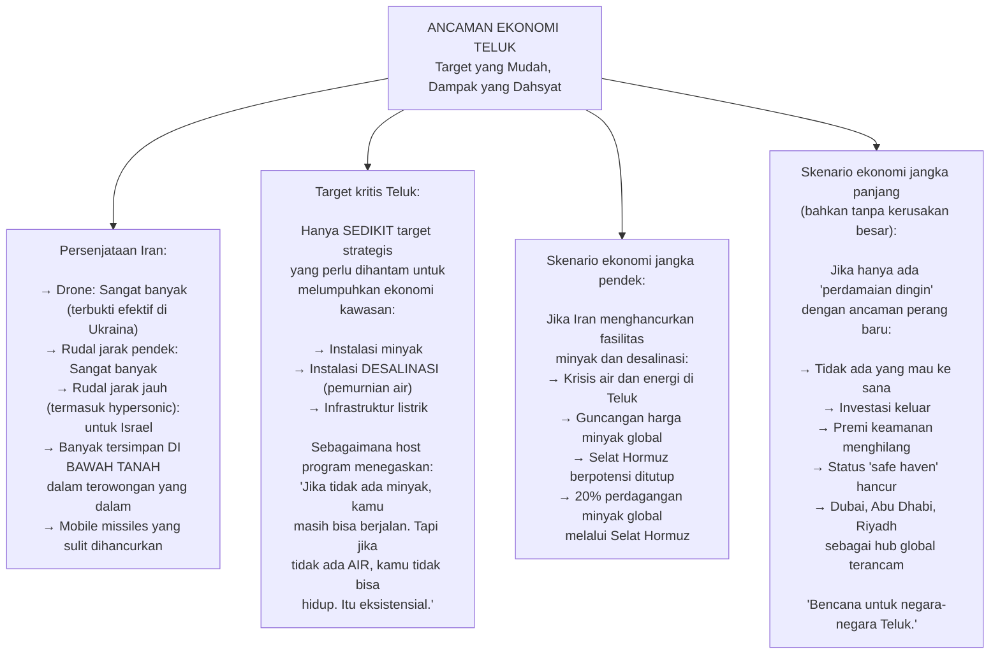

<Callout type="note" title="Mengapa Mearsheimer Mengkhawatirkan AS di Teluk Persia">
Trump berencana mengirim Angkatan Laut AS ke Teluk Persia. Mearsheimer singkat meresponnya:

*"Aku tidak pikir itu akan berjalan dengan sangat baik."*

Dengan armada Iran yang memiliki rudal anti-kapal, drone, dan kapal selam di perairan sempit Teluk Persia — mengirim kapal induk ke sana adalah sesuatu yang menurut banyak analis militer sangat berisiko tinggi.
</Callout>

---

## 🏛️ Bagian 7: Trump, Unilateralisme, dan "Board of Peace"

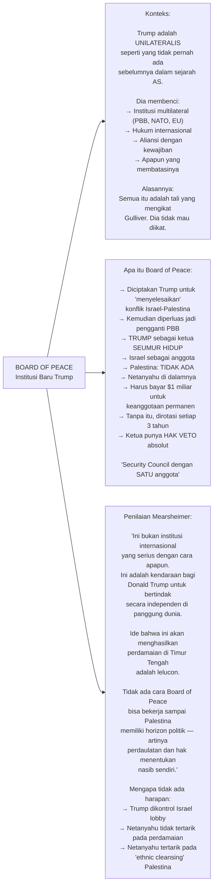

<Callout type="warning" title="Trump dan Pola Perlakuan terhadap Sekutu">
Mearsheimer mengidentifikasi pola yang mengkhawatirkan:

*"Hampir semua pendahulu Trump memperlakukan sekutu dengan sangat baik. Kita paham pentingnya memiliki sekutu — terutama untuk membendung China di Asia Timur, kamu butuh sekutu yang loyal.*

*Tapi Trump memperlakukan sekutu seperti dia memperlakukan musuh. Dan seseorang mungkin bisa berargumen bahwa Trump memperlakukan sekutu LEBIH BURUK dari musuh — karena dia tahu sekutu bergantung pada AS, sehingga dia merasa bebas untuk 'menempeleng' mereka."*

Efek nyata: Mark Carney (PM Kanada) langsung pergi ke China setelah fiasco Venezuela dan Greenland untuk memperkuat hubungan dagang.
</Callout>

---

## 🇺🇦 Bagian 8: Ukraina — Kesalahan Fatal 2008 dan Konflik Beku yang Hampir Pasti

### 🗺️ Akar Masalah: Keputusan Bucharest 2008

<Callout type="danger" title="Keputusan Paling Bencana dalam Sejarah Modern AS">
**April 2008, KTT NATO di Bucharest, Rumania:**

NATO mengeluarkan pernyataan bahwa **Georgia dan Ukraina AKAN menjadi anggota NATO**.

Mearsheimer menyebut ini sebagai *"salah satu kesalahan paling bencana yang pernah dibuat Amerika Serikat"*.

Yang membuat ini lebih ironis:
- **Angela Merkel** (Jerman) berkata: *"Jangan lakukan ini"*
- **Nicolas Sarkozy** (Perancis) berkata: *"Ini sangat ceroboh"*
- **George Kennan** (Arsitek kebijakan "containment" AS) sudah memperingatkan ini di tahun 1990-an
- **Bill Perry** (Menteri Pertahanan di era Clinton) menentang ekspansi NATO

Merkel kemudian berkata: *"Alasan aku sangat keras menentang perluasan NATO ke Ukraina adalah karena aku MEMAHAMI bahwa Putin akan menginterpretasikannya sebagai deklarasi perang."*

Putin berkata secara jelas pada April 2008: **Ini tidak bisa diterima. Kami akan menghancurkan Ukraina sebelum membiarkan ini terjadi.**

Amerika Serikat menolak mundur. Dan semua orang yang ada di ruangan itu tahu bahwa Eropa pada akhirnya akan menyerah kepada AS — karena AS terlalu kuat untuk dilawan.
</Callout>

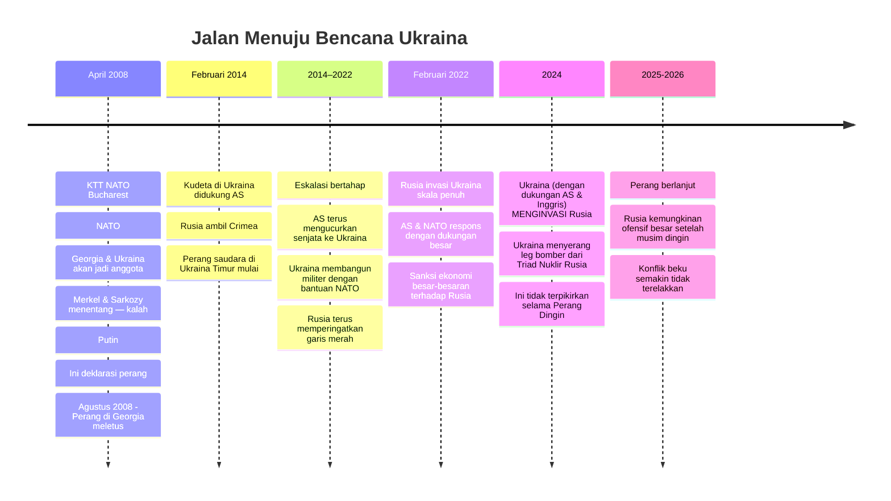

### ❄️ Mengapa Perdamaian Penuh Tidak Mungkin

<Callout type="note" title="Tiga Tuntutan Rusia yang Tidak Bisa Dinegosiasikan">
Rusia memiliki tiga tuntutan yang **tidak akan berubah**:

1. **Ukraina tidak boleh masuk NATO** — dan harus menjadi negara netral yang *benar-benar* netral (tidak ada jaminan keamanan Pasal 5 dari AS atau negara Eropa manapun)
2. **Ukraina harus melucuti senjata** — sampai ke titik di mana tidak lagi menjadi ancaman militer bagi Rusia (yang berarti Ukraina hampir tidak bisa mempertahankan dirinya sendiri)
3. **Pengakuan aneksasi** — Krimea DAN empat *oblast* (provinsi) di Ukraina Timur yang sudah dicaplok Rusia

Ukraina tidak akan menerima poin 3 (kehilangan ~25% wilayah) dan tidak akan menerima poin 2 (melucuti senjata tanpa jaminan keamanan apapun).

**Kesimpulan Mearsheimer:** Tidak ada ruang negosiasi. Ini akan berakhir seperti Korea 1953 — **armistice** (*gencatan senjata*), bukan perdamaian sejati. Konflik beku, dengan potensi pecah kembali kapan saja.
</Callout>

---

## 🏛️ Bagian 9: Krisis Legitimasi Elite Global — Dari Davos Man hingga File Epstein

Ini adalah bagian wawancara yang paling tidak biasa datang dari seorang profesor hubungan internasional — dan mungkin yang paling explosive secara politiknya.

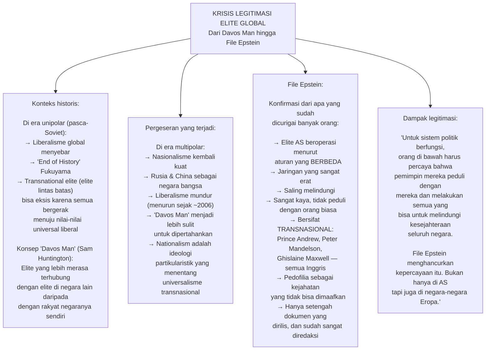

<Callout type="important" title="Pecahnya Basis MAGA — Perang Israel yang Membagi Trump">
Mearsheimer mengidentifikasi **retakan terbesar dalam koalisi Trump** yang mungkin tidak banyak dianalisis media mainstream:

**Janji Trump kepada basis MAGA:**
- Tidak akan terlibat dalam "forever wars" (perang abadi)
- Fokus membangun kembali Amerika (*America First*)
- Kebijakan luar negeri yang independen dari Israel

**Yang benar-benar terjadi:**
- Perang Iran — protracted war yang tidak tahu kapan berakhirnya
- Kebijakan yang jelas *Israel First*, bukan *America First*

**Dampak:**
- Tucker Carlson — pendukung besar Trump — secara eksplisit menyatakan sudah cukup dengan kebijakan Israel First
- Charlie Kirk (sebelum dibunuh dalam wawancara ini disebutkan) bergerak ke arah yang sama
- Nick Fuentes dan figur-figur dengan pengikut besar di kalangan MAGA mulai menjauh

*"Ini adalah perpecahan besar. Dan perpecahan dalam basis MAGA ini sebagian menjelaskan penurunan Trump yang terus-menerus dalam survei."*
</Callout>

---

## 🌐 Bagian 10: Apakah Kita Sudah di Perang Dunia III?

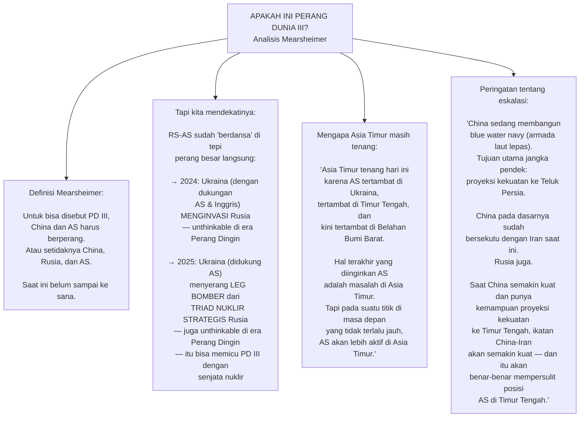

<Callout type="abstract" title="Dunia Multipolar: Peta Persaingan Baru">
Mearsheimer menutup dengan gambaran struktural tentang dunia saat ini:

**Era Unipolar (1991–2008 ish):** AS mendominasi, liberalisme menyebar, institusi multilateral berfungsi, *Davos Man* bisa eksis

**Era Multipolar (2008–sekarang):** Tiga kekuatan besar bersaing — AS, China, Rusia. Ditambah kekuatan-kekuatan regional yang semakin asertif. Karakteristiknya:
- Nasionalisme mendominasi, bukan liberalisme
- Institusi multilateral melemah
- Insentif proliferasi nuklir meningkat
- Kompetisi keamanan intensif di mana-mana
- Elite transnasional semakin sulit mempertahankan narasi tunggal

*"Kita hidup di dunia yang sangat rumit. Sulit untuk memahaminya. Dan cara kita memahaminya adalah dengan teori — bukan dengan harapan kosong atau narasi yang nyaman."*
</Callout>

---

## 📚 Bagian 11: Nasihat untuk Calon Diplomat — dan untuk Semua Kita

Mearsheimer menutup wawancara dengan nasihat yang justru terasa paling personal dan paling universal:

<Callout type="tip" title="Tiga Prinsip Mearsheimer untuk Berpikir tentang Dunia">
**1. Jadilah sangat ingin tahu secara intelektual**

Pelajari banyak subjek: agama, politik, ekonomi — karena pada akhirnya semuanya saling terkait. Mearsheimer bahkan menyesal tidak belajar lebih banyak tentang agama — bukan untuk menjadi penganut, tapi untuk memahami Syiah vs Sunni, Katolik vs Protestan, berbagai aliran Yudaisme dan hubungan mereka satu sama lain.

**2. Bentuk opinimu sendiri — dan jadilah *truth-teller* (penyampai kebenaran)**

Dengarkan dengan seksama, terutama orang yang tidak kamu setujui. Tapi pada akhirnya, miliki sudut pandang sendiri. Dan ketika harus menyampaikan pendapat, katakan yang sebenarnya — bahkan jika itu tidak enak didengar oleh orang yang bertanya. Diplomatik dalam cara menyampaikan, bukan dalam kebenaran yang disampaikan.

**3. Teori adalah Tuhan**

Dunia terlalu kompleks untuk dipahami tanpa kerangka teori. Jadilah sadar tentang teori yang kamu gunakan — apakah kamu realis, liberalis, atau lainnya. Teori adalah cara kita menerangi bagian dunia yang gelap.

*"Aku hanya berharap aku berusia 18 atau 24 dan mulai dari awal lagi — dengan semua yang aku tahu sekarang."*
</Callout>

---

## 🗺️ Kesimpulan: Peta Geopolitik yang Tidak Nyaman

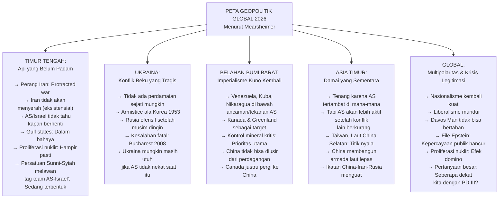

<Callout type="cite" title="Mearsheimer, di Akhir Wawancara">
*"Aku bisa terus berbicara dua jam lagi."*

Dan pewawancara menjawab: *"Memang sudah dua jam."*

Ini mungkin adalah ringkasan terbaik dari John Mearsheimer sebagai intelektual: seseorang yang bisa berbicara tanpa henti tentang dunia yang kompleks, berbahaya, dan sering kali tragis — bukan karena ia menikmati tragedi itu, melainkan karena ia percaya bahwa kejujuran intelektual adalah tanggung jawab yang tidak bisa dikompromikan.

*"Kamu ingin menjadi apa yang aku sebut seorang truth-teller. Seseorang yang mengatakan apa yang mereka benar-benar percaya, bahkan jika orang yang bertanya tidak ingin mendengarnya."*

Di dunia di mana begitu banyak analis menyampaikan apa yang ingin didengar oleh penyandang dana atau pemirsa mereka, Mearsheimer tetap menjadi suara yang langka: menyebalkan bagi semua pihak, dan justru karena itulah ia kemungkinan besar paling mendekati kebenaran. 🌍
</Callout>

---

## 📚 Glosarium Lengkap

| Istilah | Bahasa Asli | Makna dalam Bahasa Indonesia |
|---|---|---|
| **Realisme** | Inggris | Aliran pemikiran hubungan internasional yang melihat negara sebagai aktor utama yang beroperasi dalam sistem anarki dan mengejar kepentingan nasional |
| **Monroe Doctrine** | Inggris | Doktrin Monroe — kebijakan AS 1823 yang melarang kekuatan asing menempatkan militer atau membentuk aliansi di Belahan Bumi Barat |
| **Roosevelt Corollary** | Inggris | Korolari Roosevelt — perluasan Doktrin Monroe 1904 yang memungkinkan intervensi AS untuk alasan ideologis dan ekonomi |
| **Unilateralism** | Inggris | Unilateralisme — kebijakan bertindak sendiri tanpa koordinasi atau persetujuan pihak lain |
| **Multilateralism** | Inggris | Multilateralisme — pendekatan melibatkan banyak negara dalam pengambilan keputusan |
| **Regime Change** | Inggris | Pergantian rezim — menggulingkan pemerintahan yang ada dan menggantinya dengan yang baru |
| **Decapitation Strategy** | Inggris | Strategi pemenggalan — membunuh pemimpin puncak musuh dengan harapan organisasi runtuh |
| **Coercion** | Inggris | Pemaksaan — menggunakan ancaman kekuatan untuk mengubah perilaku lawan |
| **Protracted War** | Inggris | Perang yang berkepanjangan dan berlangsung lama |
| **Existential Threat** | Inggris | Ancaman eksistensial — ancaman terhadap keberadaan atau kelangsungan hidup suatu entitas |
| **Nuclear Triad** | Inggris | Triad nuklir — tiga komponen kekuatan nuklir strategis: pembom udara, kapal selam, dan rudal balistik berbasis darat |
| **Blue Water Navy** | Inggris | Angkatan laut laut lepas — armada yang mampu beroperasi di lautan terbuka jauh dari pantai sendiri |
| **Proliferation** | Inggris | Proliferasi — penyebaran senjata nuklir ke lebih banyak negara |
| **Deterrence** | Inggris | Deterensi — pencegahan serangan melalui ancaman pembalasan |
| **Frozen Conflict** | Inggris | Konflik beku — konflik yang berhenti secara de facto tapi tanpa penyelesaian politik yang formal |
| **Armistice** | Inggris | Gencatan senjata formal tanpa perjanjian damai yang menyeluruh |
| **Social Engineering** | Inggris | Rekayasa sosial — upaya mengubah struktur masyarakat dan pemerintahan di negara yang diduduki |
| **Rally Around the Flag** | Inggris | Efek "berlindung di balik bendera" — peningkatan dukungan terhadap pemerintah saat negara diserang |
| **Chilling Effect** | Inggris | Efek mengancam — intimidasi yang membuat orang atau media enggan berbicara tentang topik tertentu |
| **Davos Man** | Inggris | Istilah Sam Huntington untuk elite transnasional yang lebih terhubung dengan elite di negara lain daripada dengan rakyat negaranya sendiri |
| **MAGA** | Inggris | *Make America Great Again* — slogan dan koalisi pendukung Trump |
| **Board of Peace** | Inggris | "Dewan Perdamaian" — institusi yang dibuat Trump, dengan dirinya sebagai ketua seumur hidup |
| **Persona Non Grata** | Latin | Orang yang tidak diinginkan — dalam diplomasi, penolakan terhadap seseorang |
| **Oblast** | Rusia | Provinsi — unit administratif di Rusia dan Ukraina |
| **Ethnic Cleansing** | Inggris | Pembersihan etnis — pemindahan paksa atau pembunuhan kelompok etnis tertentu |
| **Article 5** | Inggris | Pasal 5 NATO — ketentuan pertahanan kolektif: serangan terhadap satu anggota dianggap serangan terhadap semua |
| **Proxy War** | Inggris | Perang proksi — konflik di mana kekuatan besar mendukung pihak ketiga untuk melawan musuh secara tidak langsung |
| **Insurrection** | Inggris | Pemberontakan — perlawanan bersenjata terhadap pemerintah yang berkuasa |
| **Desalination** | Inggris | Desalinasi — proses mengubah air laut menjadi air tawar yang bisa diminum |
| **Hypersonic Missile** | Inggris | Rudal hipersonik — rudal yang terbang di atas Mach 5 (5 kali kecepatan suara), sangat sulit dicegat |

---

*Sumber video: [We're Not in World War III Yet, Realist John Mearsheimer Explains | Endgame #258 — YouTube](https://www.youtube.com/watch?v=oT4OcBYEZac)*

*Narasumber: Prof. John J. Mearsheimer — R. Wendell Harrison Distinguished Service Professor of Political Science, University of Chicago. Penulis "The Tragedy of Great Power Politics" dan "The Israel Lobby and U.S. Foreign Policy".*
