## 🏯 Pembuka: Mengapa Kita Perlu Belajar dari Tiongkok Kuno?

*"Tuntutlah ilmu walau sampai ke negeri Cina."*

Hadits ini — yang sudah kita dengar sejak kecil — bukan sekadar metafora tentang jauhnya perjalanan. Ia adalah pengakuan bahwa di balik peradaban besar Tiongkok, ada **khazanah kebijaksanaan** yang layak dipelajari oleh siapapun, termasuk kita sebagai Muslim.

Dan salah satu khazanah terbesar itu adalah **Konfusianisme** — sistem filsafat yang lahir dari pikiran seorang guru bernama **Kung Huzu** (孔夫子), yang oleh dunia Barat ditransliterasi menjadi *Confucius*, dan kita kenal sebagai **Konfusius**.

Berbeda dengan Taoisme yang kita pelajari sebelumnya — yang cenderung metafisikal, penuh jimat dan misteri gaib — Konfusianisme adalah filsafat yang sangat **membumi**. Ia tidak banyak berbicara tentang akhirat atau dunia gaib. Fokusnya adalah: **bagaimana kita hidup secara tertib, harmonis, dan bermoral di dunia ini, bersama orang-orang di sekitar kita.**

Inilah yang membuat orang-orang Tionghoa — secara rata-rata — memiliki orientasi hidup yang sangat pragmatis, kerja keras, dan terstruktur. Filosofi hidup mereka khas Konfusianisme: konkret, tertib, harmonis. 🌿

---

## 🧑‍🏫 Siapa Konfusius? Sang Guru Terbesar Tiongkok

### Orang Nomor Lima Paling Berpengaruh di Dunia

Dalam buku *100 Tokoh Paling Berpengaruh Sepanjang Sejarah*, peringkat lima besar diisi oleh:

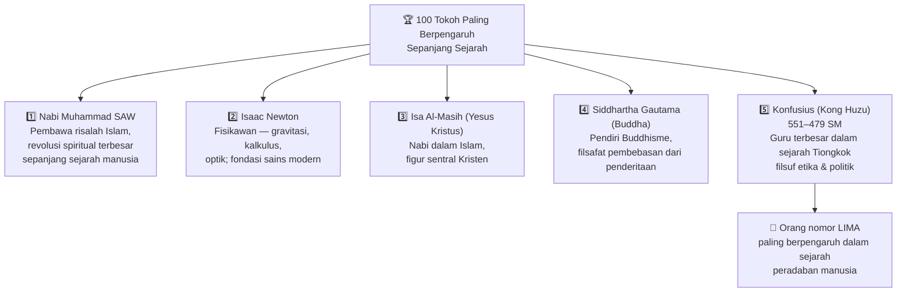

Beberapa ulama bahkan membuka ijtihad (*kajian bebas*) tentang kemungkinan ia adalah nabi — meski kita tentu hanya meyakini 25 nabi yang disebutkan secara tegas. Yang jelas, dari sisi **pengaruh ajaran, gaya hidup, dan perilaku**, ia termasuk dalam jajaran manusia-manusia paling luar biasa yang pernah ada.

### Nama Asli dan Asal-Usul

- **Nama asli:** Suongni, atau kerap dipanggil *Kongsi*
- **Nama marga:** Kung (孔)
- **"Konfusius"** adalah transliterasi Latin dari *Kung Fuzu* atau *Kung Fusu* — artinya **Guru Kung** / **Master Kung**
- **Lahir:** 551 SM di negeri Lu (kini wilayah Shandong, Tiongkok)
- **Meninggal:** 479 SM, usia sekitar 72–73 tahun

Ia lahir dari keluarga biasa berlatar militer, sempat menjadi pejabat negara, namun lebih menikmati hidupnya sebagai **guru**. Muridnya disebut mencapai sekitar **300.000 orang** — angka yang menunjukkan betapa luas pengaruhnya dalam sejarah.

### Perjalanan Batin Konfusius — Otobiografi Spiritualnya 🌱

Konfusius sendiri pernah bercerita tentang perjalanan batinnya dalam menuntut ilmu:

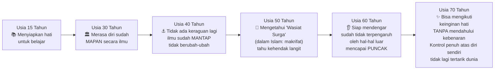

Perjalanan ini adalah peta pencapaian jiwa yang sangat menginspirasi. Di usia 70, ia telah mencapai kondisi di mana hatinya selalu selaras dengan kebenaran — bukan karena dipaksa oleh aturan, tapi karena **itulah hakikatnya**.

### Sumber Ajarannya

Yang menarik: Konfusius dengan rendah hati menyatakan bahwa **ajarannya bukan original miliknya**. Ia mengaku hanya **mengumpulkan dan merevitalisasi** khazanah kebijaksanaan kuno dari lima kitab klasik Tiongkok:

| Kitab | Nama Asli | Isi |
|-------|-----------|-----|
| Kitab Perubahan | **Yijing** (易經) | Filsafat perubahan, kosmologi |
| Kitab Sejarah | **Shujing** (書經) | Catatan sejarah kuno |
| Kitab Pujian/Syair | **Shijing** (詩經) | Kumpulan syair dan lagu |
| Kitab Ritual | **Liji** (禮記) | Tata cara peribadatan & ritual |
| Catatan Musim | **Chunqiu** (春秋) | Catatan musim semi dan gugur |

Ajaran-ajarannya kemudian **dibukukan oleh murid-muridnya** menjadi **Empat Kitab** (*Si Shu*) yang menjadi rujukan utama Konfusianisme:

1. **Daxue** (大學) — *Pembelajaran Agung*
2. **Lunyu** (論語) — *Analekta Konfusius*
3. **Zhongyong** (中庸) — *Doktrin Jalan Tengah*
4. **Mengzi** (孟子) — *Kitab Mengzi*, murid besarnya

---

## 🧭 Inti Filsafat: Etika Politik Dimulai dari Dalam Diri

### Bukan Ilmu Politik Biasa

Ada perbedaan mendasar antara **ilmu politik** dan **etika politik**:

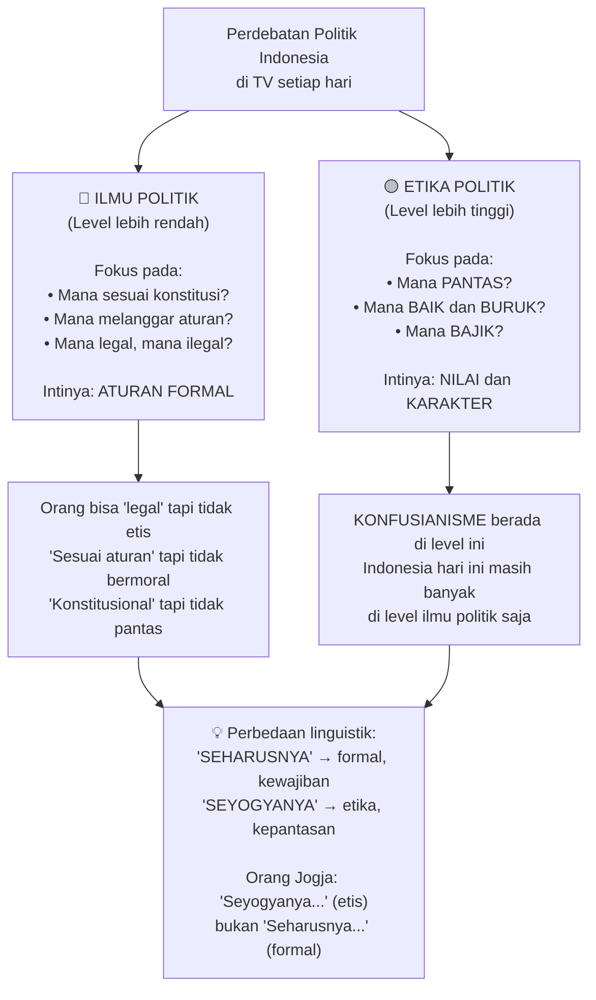

### Alur: Dari Individu → Keluarga → Negara

Konfusius memiliki keyakinan inti yang sangat kuat: **dunia sosial yang tertib harus dimulai dari individu yang bermoral**, bukan dari pembuatan aturan yang canggih.

> *"Tidak ada gunanya masyarakat dibuatkan undang-undang, konstitusi, dan norma formal yang bagus kalau orang-orangnya — individu per individu — rusak secara moral."*

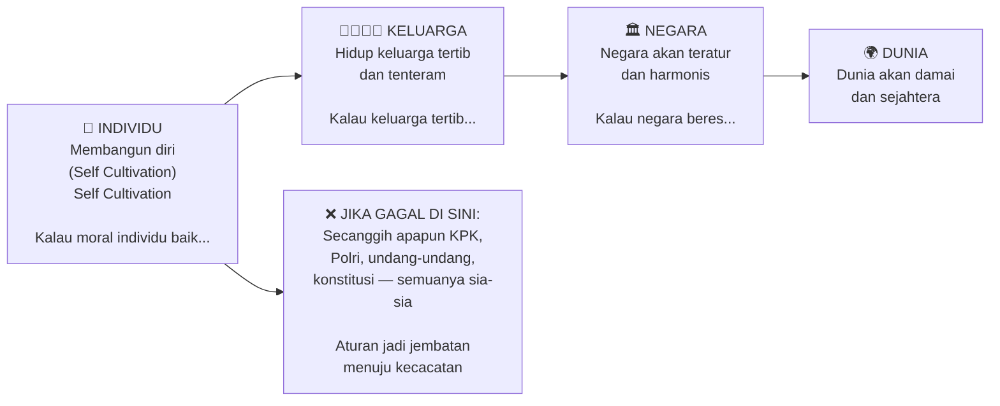

*"Jangan-jangan kacaunya Indonesia hari ini karena tidak banyak orang memperhatikan kehidupan keluarga. Yang miskin sibuk gimana caranya cepat kaya. Yang kaya tidak punya waktu sama sekali untuk keluarga."*

Akibatnya: lahirlah generasi-generasi yang tidak tenteram, yang tumbuh tanpa fondasi moral yang kuat.

---

## 🌐 Tiga Asumsi Dasar Konfusianisme

### 1. Moral adalah Tiang Hidup 🏛️

Konfusius menyatakan hal yang ribuan tahun kemudian diulangi oleh **Immanuel Kant** (filsuf Jerman, 1724–1804): **moralitas adalah fondasi utama kehidupan sosial**.

Bahkan lebih jauh dari itu — dalam perspektif filsafat Timur yang khas — Konfusius meyakini bahwa rusaknya moralitas manusia berkorelasi dengan rusaknya alam semesta:

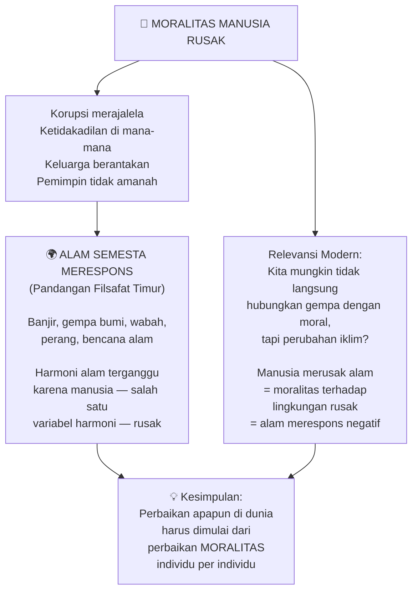

### 2. Manusia Hakikatnya Baik 💚

Konfusius — dan kemudian diadopsi oleh **Jean-Jacques Rousseau** (filsuf Perancis) — memegang asumsi optimistik tentang manusia:

> *"Tidak ada orang jahat. Yang ada adalah orang yang tersesat dari fitrahnya sebagai orang baik."*

Implikasi praktisnya sangat besar:

| Jika seseorang berbuat jahat... | Maka responsnya adalah... |
|---|---|
| Pandangan pesimistik | Dia jahat, hukum, musnahkan |
| Pandangan Konfusius | Dia tersesat, ingatkan, bantu kembali ke jalan |

*"Kalau ada orang dianggap sesat, jangan dimarahi, jangan dicaci maki, apalagi dipukuli. Kasihan — dia tersesat. Yang sesat itu harus cepat-cepat diingatkan dan dibantu. Seandainya kamu jalan-jalan terus nyasar ke arah yang salah, apa kamu mau dimarahi atau dibantu?"*

Ini juga berlaku bagi yang diingatkan: jika merasa tidak sesat, cukup tegaskan dengan tenang. Tidak perlu tawuran. Tidak perlu saling caci maki.

### 3. Yang Dibutuhkan Bukan Juru Selamat, tapi Guru yang Meneladani 📖

Konfusius tidak percaya bahwa masyarakat membutuhkan seseorang yang turun dari langit untuk "menyelamatkan" mereka. Yang dibutuhkan adalah **guru yang bermoral tinggi** — yang tidak hanya pandai berbicara, tapi **bisa mempraktikkan apa yang diajarkan** dan **mengajarkan apa yang ia praktikkan**.

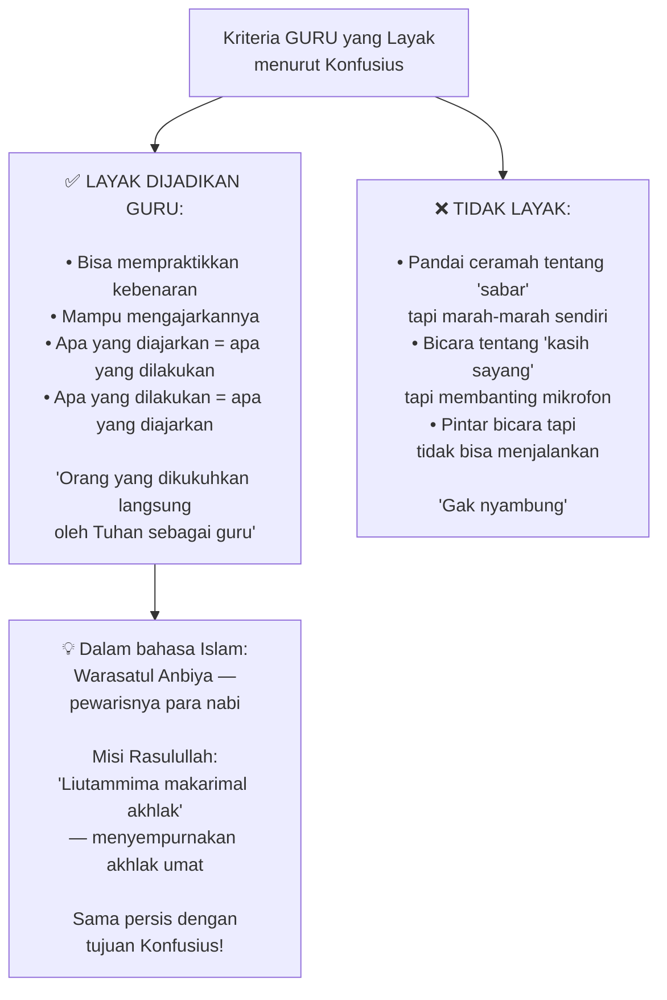

---

## 📜 Lima Ajaran Pokok Konfusianisme

Berikut adalah kelima pilar ajaran Konfusius — ibarat "rukun iman"-nya Konfusianisme:

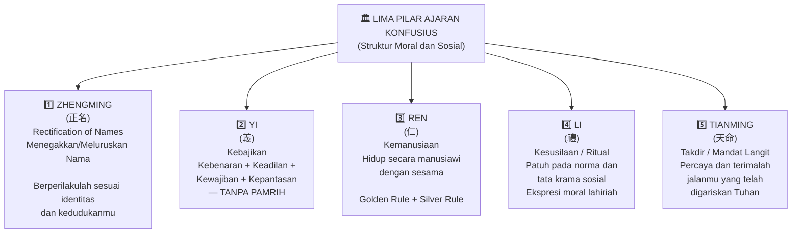

---

## 🎯 Ajaran Pertama: Zhengming — Tegakkan Namamu

### Prinsip Identitas Sosial

*Zhengming* (正名) adalah salah satu teori paling terkenal dan paling relevan dari Konfusius. Ia bisa disebut versi Timur dari **Principle of Identity** milik Aristoteles.

Sabda Konfusius:

> *"Biarkan penguasa adalah penguasa. Menteri adalah menteri. Bapak adalah bapak. Anak adalah anak."*

Maknanya bukan sekadar filosofis — ini adalah panduan praktis tentang **tatanan sosial**:

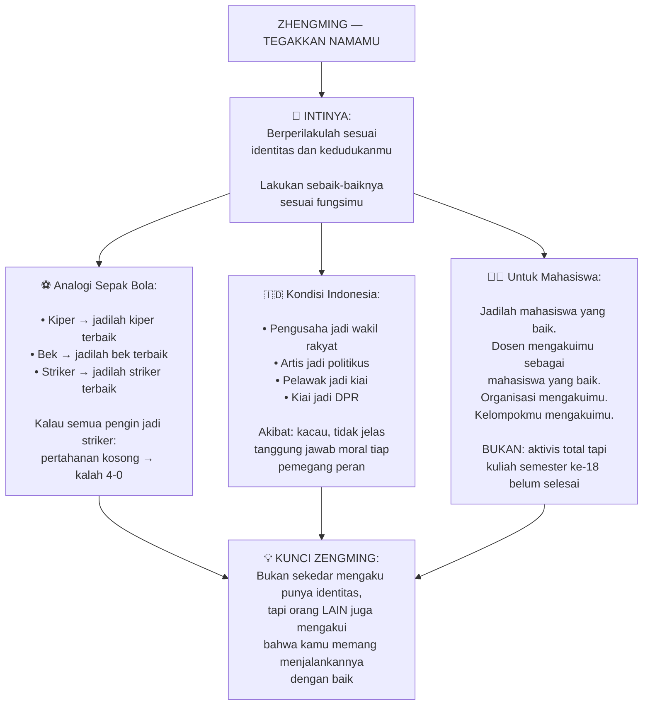

### Kenapa Ini Sulit di Zaman Modern?

Salah satu akar masalah *confusion of identity* (kebingungan identitas) adalah orang tidak mau menerima **peran yang telah digariskan** karena merasa peran itu kurang glamor, kurang terkenal, atau kurang menguntungkan.

*"Sekarang semua ingin jadi striker, ingin masuk TV, ingin terkenal. Tidak ada yang mau jaga gawang. Tidak ada yang mau diam-diam tapi beresin semua. Tidak ada yang mau tidak masuk TV tapi tetap kokoh. Wilayah pertahanan kosong — akhirnya dibantailah."*

---

## 💎 Ajaran Kedua: Yi — Kebajikan Tanpa Pamrih

### Formula Kebajikan

*Yi* (義) adalah kebajikan — tapi Konfusius mendefinisikannya dengan sangat spesifik. Kebajikan adalah perpaduan dari:

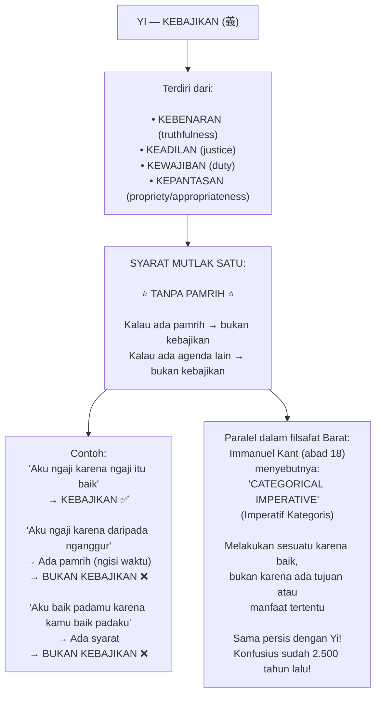

---

## 🤝 Ajaran Ketiga: Ren — Kemanusiaan dan Dua Aturan Emas

### Hidup Bersama Orang Lain

*Ren* (仁) adalah prinsip **kemanusiaan** — bagaimana kita berinteraksi dengan sesama manusia. Jika *Yi* bersifat individual (kebajikan diri sendiri), maka *Ren* bersifat **sosial**.

Rumusnya hanya dua — tapi dua ini adalah fondasi seluruh teori Hak Asasi Manusia dan etika sosial:

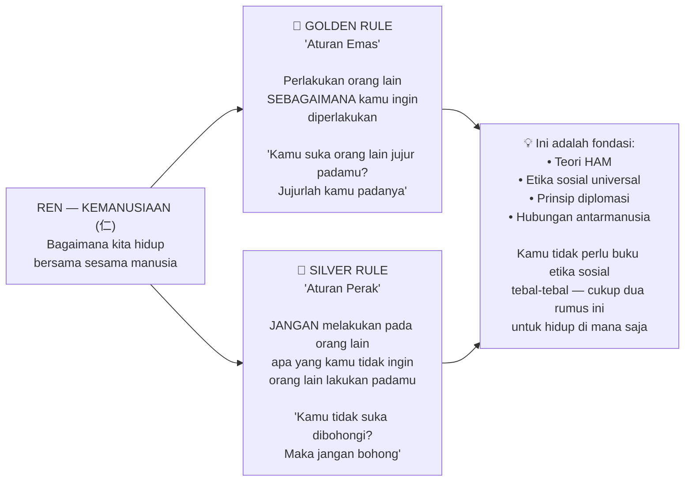

### Kebaikan Bukan Berarti Mengizinkan Kejahatan

Konfusius memiliki pandangan yang sangat realistis dan berbeda dari moralitas naif:

Ketika muridnya bertanya:
> *"Guru, kalau orang baik kita balas baik. Kalau orang jahat, apakah kita balas baik juga?"*

Jawaban Konfusius:
> *"Kalau yang baik dibalas baik dan yang jahat juga dibalas baik — maka dengan apa kita membalas yang baik? Jawabannya: yang baik dibalas dengan BAIK, yang jahat dibalas dengan ADIL."*

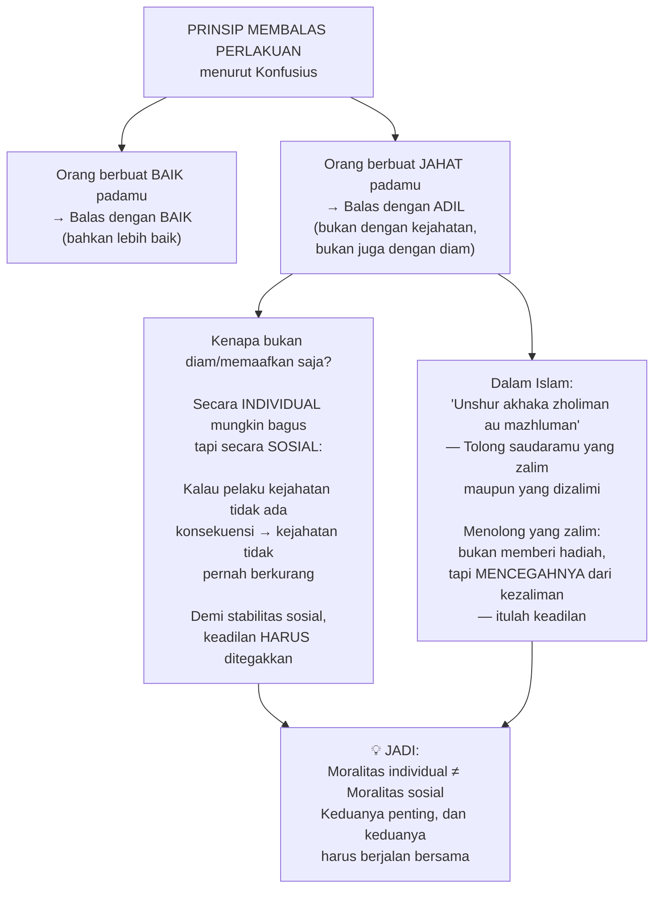

---

## 🙏 Ajaran Keempat: Li — Kesusilaan dan Ritual

### Dari Ritual Menuju Tata Krama

*Li* (禮) awalnya merujuk pada **ritual persembahan dan korban** — sesuatu yang ada di hampir semua agama di seluruh dunia. Tapi Konfusius memperluas maknanya:

Ritual adalah **simbol dari kepasrahan dan kepatuhan**. Dan di dunia sosial, kepatuhan ini berarti **tunduk pada norma-norma moral yang berkembang dalam masyarakat**.

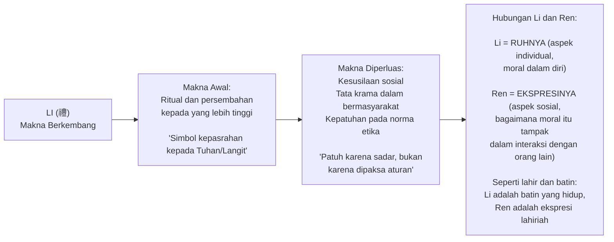

---

## 🌌 Ajaran Kelima: Tianming — Mandat Langit / Takdir

### Terimalah Jalanmu, Tegaskan di Sana

*Tianming* (天命) secara harfiah berarti **kehendak Tuhan** atau **mandat dari Langit**. Dalam pandangan Konfusius, setiap orang memiliki **jalan yang telah digariskan** — dan kebijaksanaan adalah menerima jalan itu dengan lapang dada, lalu **menjalaninya sebaik-baiknya**.

> *"Kamu jadi mahasiswa? Itu sudah jalanmu. Terimalah takdirmu untuk mengerjakan skripsi. Terimalah takdirmu untuk ujian. Jangan dilawan — karena kamu punya identitas sebagai mahasiswa."*

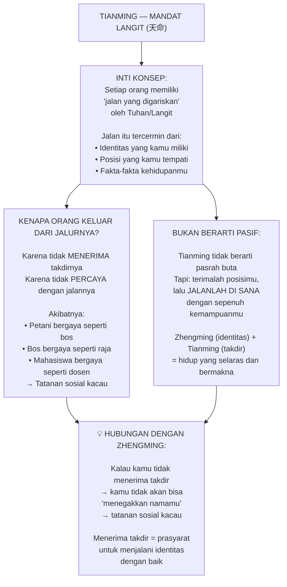

---

## 👑 Junzi — Manusia Budiman, Cita-Cita Tertinggi

### Siapakah Manusia Budiman?

Setelah menjalankan semua prinsip di atas, seseorang bisa mencapai kondisi yang oleh Konfusius disebut **Junzi** (君子) — **manusia budiman** atau *gentleman* dalam istilah Barat. Di Indonesia, kata **"Budiman"** yang kita gunakan sehari-hari sebenarnya berakar dari konsep ini!

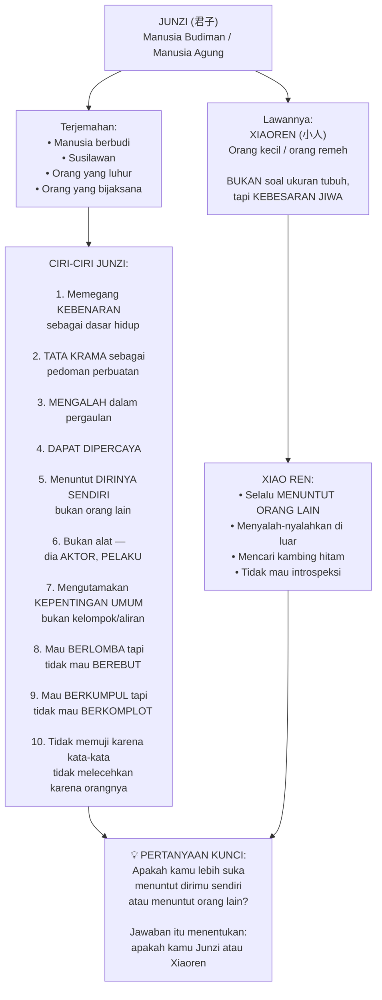

### Berlomba vs. Berebut — Perbedaan yang Krusial

Satu konsep yang sangat menarik dari Junzi adalah perbedaan antara **berlomba** dan **berebut**:

- **Berlomba** (*lomba*): Berjajar, masing-masing maju ke depan, bersaing sehat untuk menjadi lebih baik. Gerakannya **progresif**.
- **Berebut** (*rebutan*): Saling tabrakan, saling sikut, gerakannya **kacau** dan destruktif.

Orang besar selalu ingin lebih baik dari sebelumnya — dan ia berlomba dengan orang lain untuk mencapai itu. Tapi ia **tidak mau berebut** — tidak mau menghalalkan segala cara demi mengalahkan orang lain.

---

## 🎓 Delapan Prinsip Belajar ala Konfusius

Bagi yang ingin tahu bagaimana Konfusius memandang proses belajar, inilah delapan prinsipnya:

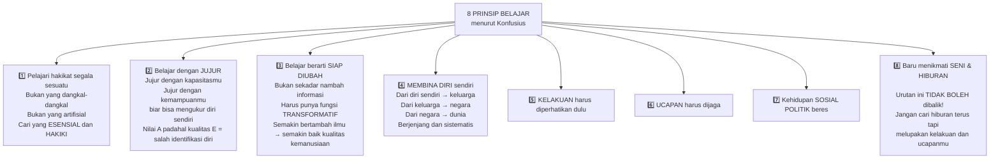

---

## 💡 Ciri-Ciri Orang Bijaksana (Junzi dalam Tindakan)

Konfusius juga memberikan panduan konkret tentang bagaimana orang bijaksana berperilaku. Beberapa di antaranya sangat relevan dengan kondisi hari ini:

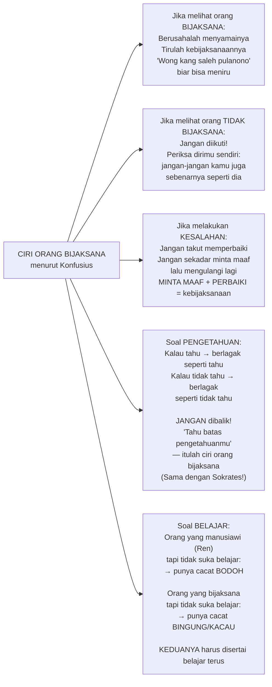

### Filsafat Padi — Tanda Orang Benar-benar Pintar

> *"Semakin pintar seseorang, semakin ia menunduk. Semakin luas wawasannya, semakin ia sadar betapa banyak yang tidak ia ketahui."*

Ini bukan akting rendah hati. Ini adalah **realita epistemologis**: semakin kamu mendalami suatu ilmu, semakin kamu sadar betapa luasnya yang belum kamu ketahui.

Kebalikannya: semakin seseorang **merasa pintar** dan **merasa canggih**, itu justru tanda bahwa pengetahuannya masih dangkal.

---

## 🏅 Lima Norma Kesopanan dalam Konfusianisme (Konghucu)

Ketika ajaran Konfusius berkembang menjadi **agama Konghucu** (*Kong Hucu*) — yang hari ini diakui sebagai salah satu agama resmi di Indonesia — lahirlah lima norma kesopanan mendasar yang mengatur hubungan sosial:

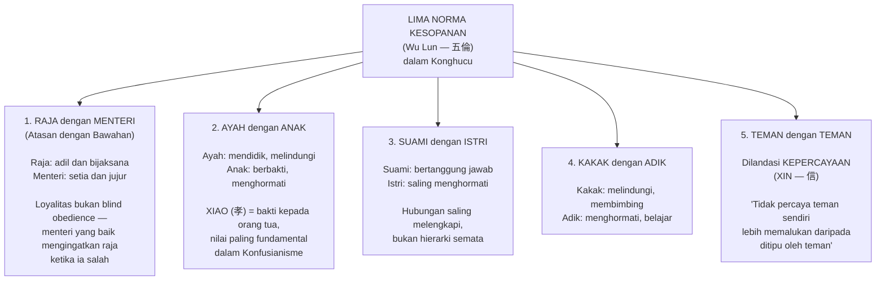

---

## 📣 Delapan Sifat Mulia dalam Konfusianisme

Konfusius juga merumuskan delapan sifat mulia yang menjadi karakter manusia ideal — sangat mirip dengan **akhlakul karimah** dalam Islam:

| # | Nama | Makna |
|---|------|-------|
| 1 | **Xiao** (孝) | Tulus dan berbakti (pada orang tua/Tuhan) |
| 2 | **Ti** (悌) | Hormat pada yang lebih tua |
| 3 | **Zhong** (忠) | Watak setia dan berhati nurani |
| 4 | **Xin** (信) | Dapat dipercaya, menepati janji |
| 5 | **Li** (禮) | Tata krama, sopan santun, etiket |
| 6 | **Yi** (義) | Kebajikan, keadilan |
| 7 | **Lian** (廉) | Solidaritas, tenggang rasa, *tepo seliro* |
| 8 | **Chi** (恥) | Hidup sederhana dan tidak menyimpang |

---

## 🌟 Quotes Terpilih dari Konfusius

Beberapa sabda Konfusius yang merangkum esensi filsafatnya:

> *"Tahu apa yang harus dilakukan namun tidak melakukannya adalah sifat seorang pengecut."*

> *"Orang besar takut pada tiga hal: perintah Tuhan, ilmu ulama, dan hikmah orang-orang terdahulu. Orang kecil tidak peduli dengan ketiganya."*

> *"Manusialah yang menciptakan sistem yang baik, bukan sistem yang menciptakan manusia yang baik."*

> *"Kemenangan sejati bukan karena tidak pernah kalah, tapi karena sanggup bangkit setiap kali jatuh."*

> *"Jangan membuka buku tanpa belajar sesuatu darinya."*

> *"Hidup itu sebenarnya sederhana. Kita sajalah yang sering membuatnya rumit."*

---

## 🌏 Warisan dan Pengaruh Global Konfusianisme

Pengaruh Konfusius tidak hanya terbatas pada Asia Timur. Dunia Barat pun ikut terinspirasi:

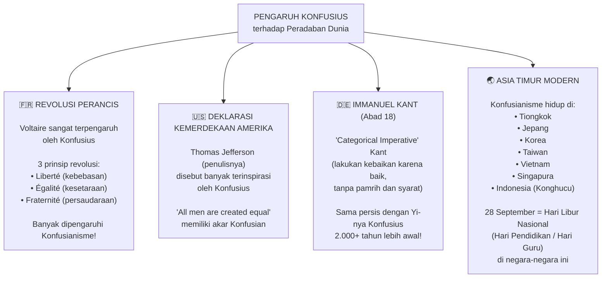

---

## 🔗 Konfusianisme dan Islam — Titik Temu yang Mengejutkan

Menarik sekali melihat betapa banyak kesamaan antara ajaran Konfusius dan Islam:

| Konsep Konfusius | Konsep Islam |
|---|---|
| **Ren** (kemanusiaan) — Golden Rule | **Hadits**: "Cintai untuk saudaramu apa yang kamu cintai untuk dirimu sendiri" |
| **Yi** (kebajikan tanpa pamrih) | **Ikhlas** — beramal karena Allah, bukan karena dilihat |
| **Junzi** (manusia budiman) | **Insan Kamil** / akhlakul karimah |
| **Li** (kesusilaan) | **Adab** — tata krama dalam Islam |
| **Tianming** (mandat langit) | **Takdir** dan **tawakkal** |
| Guru yang meneladani | **Rasulullah SAW** — "Uswatun hasanah" (teladan terbaik) |
| Tujuan: perbaiki moralitas | **Hadits**: "Liutammima makarimal akhlaq" |
| Manusia hakikatnya baik | Konsep **fitrah** dalam Islam |

---

## ✨ Penutup: Relevansi Konfusius untuk Kita Hari Ini

Filsafat Konfusius hidup selama 2.500 tahun — dan terus relevan — bukan karena ia canggih secara metafisika atau rumit secara teologi. Justru sebaliknya: ia relevan karena **sangat membumi dan sangat konkret**.

Pesannya sederhana:
1. **Kenali dirimu** — tegakkan identitasmu, jadilah yang terbaik di posisimu
2. **Jadilah bajik** — berbuat baik bukan karena pamrih, tapi karena memang baik
3. **Hiduplah secara manusiawi** — perlakukan orang lain seperti kamu ingin diperlakukan
4. **Jaga tata krama** — bukan karena aturan, tapi karena kesadaran moral
5. **Terimalah jalanmu** — lalu jalani sebaik-baiknya di sana

Dan di atas semua itu: **mulailah dari diri sendiri**.

Tidak perlu menunggu sistem berubah. Tidak perlu menunggu pemimpin yang sempurna. Tidak perlu menunggu dunia menjadi lebih baik. Mulailah dari yang paling kecil: **dirimu sendiri, keluargamu, lingkunganmu**.

*"Hidup itu sebenarnya sederhana. Kita sajalah yang sering membuatnya rumit."* — Konfusius 🌿

---

## 📚 Glosarium Lengkap

| Istilah | Asal / Makna |
|---|---|
| **Konfusius** | Transliterasi Latin dari *Kung Fuzu* / *Kung Fusu* — artinya "Guru Kung" |
| **Kong Huzu** (孔夫子) | Nama Tionghoa Konfusius; Kung = nama marga, Fuzu = guru/master |
| **Sinisme** | Sebutan untuk filsafat Cina/Tiongkok dalam beberapa literatur (dari bahasa Arab: *Sin*) |
| **Zhengming** (正名) | Rectification of Names — menegakkan/meluruskan nama; berperilakulah sesuai identitas |
| **Yi** (義) | Kebajikan: kebenaran + keadilan + kewajiban + kepantasan, tanpa pamrih |
| **Ren** (仁) | Kemanusiaan; prinsip hidup manusiawi bersama sesama |
| **Li** (禮) | Ritual/kesusilaan; kepasrahan pada norma moral dan tata krama sosial |
| **Tianming** (天命) | Mandat Langit / Takdir — kehendak atau jalan yang digariskan Tuhan |
| **Zhi** (智) | Kebijaksanaan; kecerdasan yang digabung dengan kepandaian moral |
| **Xin** (信) | Kepercayaan / dapat dipercaya / menepati janji |
| **Junzi** (君子) | Manusia Budiman / manusia agung; cita-cita moral tertinggi Konfusianisme |
| **Xiaoren** (小人) | Orang kecil / orang remeh; lawannya Junzi |
| **Xiao** (孝) | Bakti kepada orang tua; nilai paling fundamental dalam Konfusianisme |
| **Golden Rule** | "Perlakukan orang lain sebagaimana kamu ingin diperlakukan" |
| **Silver Rule** | "Jangan lakukan pada orang lain apa yang kamu tidak ingin dilakukan padamu" |
| **Si Shu** (四書) | Empat Kitab Konfusianisme: Daxue, Lunyu, Zhongyong, Mengzi |
| **Wu Jing** (五經) | Lima Kitab Klasik: Yijing, Shujing, Shijing, Liji, Chunqiu |
| **Yijing** (易經) | Kitab Perubahan; salah satu sumber utama ajaran Konfusius |
| **Lunyu** (論語) | Analekta Konfusius; kumpulan sabda dan dialog Konfusius oleh murid-muridnya |
| **Daxue** (大學) | Pembelajaran Agung; salah satu dari Empat Kitab |
| **Zhongyong** (中庸) | Doktrin Jalan Tengah; keseimbangan dalam segala hal |
| **Mengzi** (孟子) | Kitab tentang murid besar Konfusius, Mengzi/Mencius |
| **Etika Politik** | Bukan sekadar ilmu politik (aturan), melainkan tentang nilai: mana pantas, mana bajik |
| **Self Cultivation** | Pembentukan diri secara moral; titik awal seluruh tatanan sosial |
| **Rectification of Names** | Terjemahan Inggris untuk Zhengming; tegakkan identitas |
| **Categorical Imperative** | Konsep Kant (abad 18) yang setara dengan Yi: lakukan kebaikan tanpa pamrih |
| **Humanisme** | Memihak sisi-sisi kemanusiaan yang positif; berbeda dari antroposentrisme |
| **Antroposentrisme** | Manusia adalah pusat segalanya, semua sisi manusia diberdayakan |
| **Voltaire** | Filsuf Perancis abad 18 yang sangat terpengaruh oleh Konfusius |
| **Thomas Jefferson** | Penulis Deklarasi Kemerdekaan Amerika, disebut terinspirasi Konfusius |
| **Warasatul Anbiya** | Pewaris para nabi; konsep Islam untuk guru yang mentransmisikan ajaran kebaikan |
| **Liutammima Makarimal Akhlaq** | Hadits Nabi: "untuk menyempurnakan akhlak yang mulia" — misi utama kenabian |
| **Insan Kamil** | Manusia sempurna dalam perspektif Islam; setara dengan Junzi dalam Konfusianisme |
| **Fitrah** | Sifat dasar manusia dalam Islam: pada dasarnya baik dan cenderung kepada kebenaran |

---

*Sumber video: [Ngaji Filsafat 67 — Konfusianisme](https://www.youtube.com/watch?v=IoiG-oekXSE)*

*Pemateri: Ustadz Muhammad Faiz Almath (Majelis Filsafat Yogyakarta)*
