## Pembukaan: Serangan Sistematis terhadap Stoikisme ⚔️

> *"Plato sama menderitanya dengan Hitler — karena Plato sama jahatnya dengan Hitler. Ini bukan kritik saya — ini adalah pandangan Stoik yang sebenarnya."*

Bro Instagram yang memposting foto Lamborghini-nya dengan caption kutipan Marcus Aurelius? **Itu bukan hal baru.** Stoikisme populer mungkin terlihat menyebalkan, tapi tunggu sampai kamu melihat Stoikisme yang asli.

**Stoikisme asli? Tidak oke juga.** 😬

Bahkan, **lebih buruk** dari Stoikisme populer. Ide-idenya bahkan lebih gila dan lebih tidak bisa dijalani.

<Callout type="warning" title="⚠️ Disclaimer">
Artikel ini diadaptasi dari kuliah Jonathan Bi yang telah menghabiskan setahun terakhir mempelajari bahasa Yunani Kuno, mewawancarai sarjana Stoik terhebat yang masih hidup, dan membaca teks-teks Stoik. Semakin dalam ia menggali teori ini, semakin tidak puas ia.

Ini **bukan** serangan dari pembenci. Ini adalah kritik dari seseorang yang menganggap para Stoik sebagai *teman* dalam arti yang sangat bermakna — tapi kadang hal terbaik yang bisa kita lakukan untuk teman yang salah arah adalah **meluruskan mereka**.
</Callout>

Tujuan kuliah ini adalah melancarkan **serangan sistematis** terhadap filsafat Stoik. Ini tidak kurang dari **menyatakan perang** melawan salah satu gerakan paling kuat dan berpengaruh dalam 20 tahun terakhir.

Terus terang, saya tidak terlalu khawatir. **Apa yang bisa dilakukan para Stoik?** Meditasi tentang kematian saya? Menulis jurnal dengan penuh semangat? Saya rasa saya aman. 😄

---

## Peta Besar: Struktur Kritik 🗺️

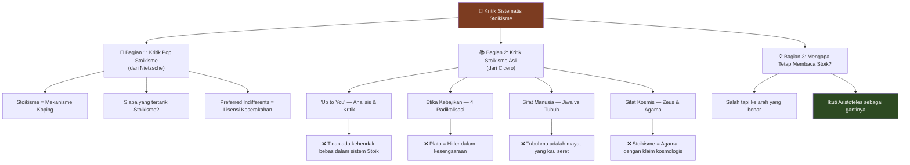

---

## Bagian 1: Kritik Nietzsche terhadap Pop Stoikisme 🎭

### Stoikisme Adalah Mekanisme Koping

<Callout type="quote" title="📜 Friedrich Nietzsche">
*"Stoikisme mungkin memang dianjurkan bagi mereka yang nasibnya selalu berubah-ubah, yang hidup di zaman penuh kekerasan, dan yang bergantung pada orang-orang impulsif dan berubah-ubah.*

*Apakah hidup kita benar-benar begitu menyakitkan dan memberatkan sehingga akan menguntungkan bagi kita untuk menukarnya dengan cara hidup Stoik yang membatu?*

***Keadaan tidak cukup buruk bagi kita sehingga harus buruk bagi kita dengan gaya Stoik.***"
</Callout>

Poin Nietzsche: Stoikisme adalah **mekanisme koping** (*coping mechanism*) untuk orang-orang yang telah begitu dipermainkan oleh nasib — orang-orang yang telah **sepenuhnya kehilangan kontrol** atas dunia eksternal.

Yang dilakukan para Stoik adalah mendatangi orang-orang ini dan berkata: *"Lihat, semua ini tidak penting. Kamu kehilangan teman, kamu mengalami rasa sakit, kamu tidak punya kesenangan, kamu kehilangan kehormatan — **semua ini tidak penting** karena kebaikan eksternal adalah hal-hal yang tidak relevan."*

Dan poin Nietzsche adalah bahwa orang-orang **berpegangan pada doktrin ini** bukan karena mereka telah mempertimbangkannya, bukan karena mereka telah bernalar dari prinsip-prinsip pertama — tentu saja bukan karena intuitif (ini **sangat tidak intuitif**) — tetapi karena **secara psikologis menenangkan**.

### Bukti dari Pengalaman Pribadi 📝

Jonathan Bi sendiri masuk ke Stoikisme dengan cara yang persis sama:

> *"Saya dropout dari sekolah. Saya membangun perusahaan. Perusahaan tidak berjalan baik. Saya di kota baru tanpa teman dan keluarga. Kesehatan saya buruk.*
>
> *Saya ingat mengambil buku self-help Stoik pertama, bahkan tidak menyelesaikannya, hanya membaca setengah — dan **jatuh cinta sepenuhnya**.*
>
> *Bukan karena saya bernalar melalui filsafatnya — buku-buku pop Stoik ini tidak punya filsafat — tapi karena **begitu menenangkan secara psikologis** diberitahu bahwa penolakan tidak bisa menyakitimu, kurangnya kesuksesan tidak bisa menyakitimu."*

### Bahkan Cicero Jatuh ke Perangkap Ini 📖

**Cicero**, yang sering cukup kritis dan skeptis terhadap ide-ide Stoik dalam sebagian besar karyanya, pada dasarnya mengulangi doktrin Stoik sepenuhnya dalam bukunya yang berjudul *Tusculan Disputations*.

**Apa isi Tusculan Disputations?** Tentang **koping**.

*Tusculan Disputations* adalah upaya Cicero untuk menghibur dirinya sendiri setelah ia **kalah dalam perang sipil**. Caesar berkuasa. Teman-temannya mati atau diasingkan. Dan di atas semua ini, **putri tercintanya baru saja meninggal saat melahirkan**.

Dan dalam upaya Cicero untuk mengatasi semua ini, ia mengadopsi doktrin-doktrin Stoik standar yang dengan begitu kuat ia bongkar dalam karya-karyanya yang lain.

### Siapa yang Tertarik pada Stoikisme? 🤔

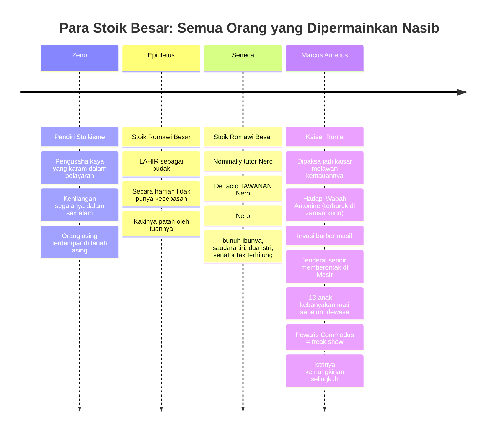

<Callout type="important" title="💡 Pola yang Tidak Bisa Diabaikan">
Perhatikan polanya: **Zeno** — orang kaya yang karam. **Epictetus** — budak literal. **Seneca** — tawanan Nero. **Marcus Aurelius** — kaisar yang hidupnya tidak lebih tenang dari budak.

Justru **budak dan kaisar** — gelandangan dan miliarder — yang **paling terpapar** pada putaran nasib.

Inilah orang-orang yang Stoikisme dibuat untuknya. Dan inilah keadaan-keadaan yang menarik orang ke Stoikisme.
</Callout>

### Peringatan untuk Masyarakat Kita 🚨

Jika ini adalah orang-orang yang tertarik pada Stoikisme, maka kita harus melihat **kebangkitan Stoikisme hari ini** di masyarakat kita sebagai **gejala bahwa sesuatu yang mengerikan telah salah**.

Di Republik Romawi, ketika ada relatif cukup banyak kebebasan, **tidak banyak Stoik**. Cato sang Stoik — orang yang bunuh diri setelah Perang Sipil — adalah orang yang cukup aneh karena menjadi Stoik.

Tapi ketika Kekaisaran datang, ketika orang-orang mulai kehilangan kebebasan politik mereka secara massal — **itulah** ketika Stoikisme melonjak sebagai semacam **mekanisme koping kolektif**.

---

## Stoikisme: Mekanisme Koping Paling Jenius 🧠

Tapi kritik Nietzsche tidak berhenti di situ. **Stoikisme bukan sekadar mekanisme koping** — ini adalah **mekanisme koping paling jenius yang pernah diciptakan manusia**.

### Trik Cerdik: Preferred Indifferents

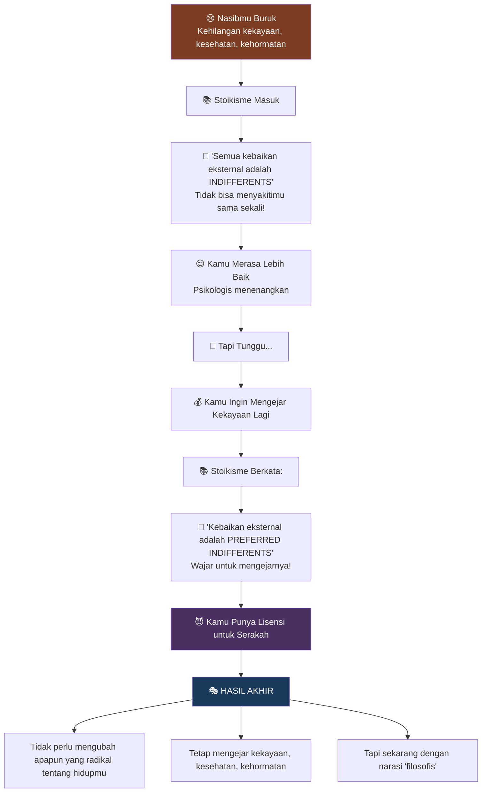

Persis ketika mereka memberitahumu semua kebaikan eksternal ini adalah **complete indifferents** (tidak relevan sama sekali), mereka kemudian memberimu **lisensi penuh untuk mengejarnya** dengan menyebutnya **preferred indifferents** (tidak relevan yang disukai).

Semua kebaikan eksternal itu — kesehatan, kekayaan, penampilan bagus, kelahiran bangsawan — kembali **dilegitimasi** oleh etika Stoik.

**Artinya:** sangat mudah untuk mengadopsi ide-ide Stoik, menyebut dirimu seorang Stoik, **tanpa harus benar-benar mengubah apapun yang radikal tentang hidupmu**.

### Bandingkan dengan Agama Lain 🔄

| Agama | Mekanisme Penghiburan | Perubahan Hidup yang Diperlukan |
|-------|----------------------|--------------------------------|
| **Kristen** | Ada Tuhan yang akan menghakimi jiwa-jiwa setelah kematian | Target strivingmu harus bergeser dari dunia ini ke dunia lain |
| **Buddha** | Karma akan memberikan bagian yang adil | Target strivingmu harus bergeser dari dunia ini ke dunia lain |
| **Stoikisme** | Kebaikan eksternal tidak penting | Target tetap sama: kekayaan, kesehatan, kehormatan! |

### Kasus Seneca: Hipokrasi Klasik 💰

Mari lihat **Seneca** — salah satu Stoik terbesar — sebagai contoh sempurna.

**Ketika diasingkan** (dan kehilangan banyak kekayaan), ini yang ia tulis:

<Callout type="quote" title="📜 Seneca dalam Pengasingan">
*"Adalah roh yang membuat manusia kaya. Ia mengikuti kita ke pengasingan dan dalam kesendirian terdalam kita. Uang tidak lebih penting bagi roh daripada bagi para dewa abadi.*

*Batu permata dan emas dan perak serta meja-meja besar yang dipoles hanyalah **beban duniawi**.*

*Roh yang bebas dan setia pada sifat aslinya tidak bisa mencintai mereka karena ia ringan dan cepat, siap melompat menuju langit kapanpun ia dibebaskan."*
</Callout>

**Oke, keren.** Seneca sangat spiritual. Uang tidak penting.

**Tapi kemudian** Seneca kembali dari pengasingan. Ia menemukan muridnya Nero di tahta dan tiba-tiba ia salah satu orang paling berkuasa di kekaisaran.

**Apa yang dilakukan teman kita yang "berjiwa bebas" ini?** Apakah ia menyumbangkan sisa kekayaannya? Apakah ia mendirikan YMCA Romawi untuk anak-anak gelandangan dan dapur umum?

**Ia melanjutkan untuk membuat dirinya sangat kaya.** 💸

Kita bicara tentang **300 juta sesterces**. Untuk perspektif: batas masuk untuk **kelas senatorial** — 1% dari 1%, puncak tertinggi kekayaan dan kekuasaan Romawi — adalah **1 juta sesterces**.

Seneca punya **300 juta**.

Dan bagaimana ia menghasilkannya?

- Hadiah dari Nero
- Hadiah dari orang yang mencari akses ke Nero  
- Properti yang disita dari pembersihan politik
- **Pinjaman dengan bunga tinggi** 💀

<Callout type="danger" title="⚡ Kritik Senator Romawi terhadap Seneca">
*"Dengan kebijaksanaan macam apa, dengan ajaran filsuf mana Seneca telah menumpuk **300 juta sesterces dalam 4 tahun** sebagai orang dalam istana?*

*Para lansia tanpa anak dan kekayaan mereka sedang dijaring oleh jaringnya. Italia dan provinsi-provinsi sedang **dikuras habis** oleh peminjaman uangnya yang keterlaluan."*

— Senator Romawi Anonim
</Callout>

**Jadi kamu lihat sekarang?** Stoikisme adalah mekanisme koping paling jenius yang pernah diciptakan:

- 😢 Nasibmu buruk? → *"Uang adalah indifferent, tidak bisa menyakitimu!"*
- 😈 Ingin narasi untuk membenarkan keserakahanmu? → *"Tapi uang adalah PREFERRED indifferent, wajar untuk mengejarnya!"*

**Bro Instagram yang memposting foto Lambo dengan caption kutipan Marcus Aurelius? Itu bukan hal baru.** Ini adalah penyimpangan Stoikisme yang umum mengingat bagaimana mereka menyusun teori mereka.

---

## Bagian 2: Kritik Stoikisme Asli 📚

Argumen psikologis Nietzsche seharusnya membuat kita **sangat curiga** terhadap gerakan ini. Tapi fakta bahwa Stoikisme adalah mekanisme koping tidak memberitahu kita apakah itu **benar atau salah**.

Sekarang kita akan melakukan **kritik langsung** terhadap ide-ide Stoik itu sendiri.

---

### Kritik #1: "Up to You" (*Eph' hēmin*) 🎯

Mari mulai dengan nasihat yang paling masuk akal dan terlihat tidak berbahaya:

> **"Fokus pada apa yang terserah padamu."** (*Focus on what is up to you.*)

Kedengarannya cukup masuk akal, kan?

#### Apa yang Menurut Stoik "Terserah Padamu"?

Jawaban singkat: **Assent** (*persetujuan*).

Para Stoik melihat manusia sebagai **mesin rasional** yang menyetujui serangkaian proposisi rasional. Bahkan ketika kita melakukan tindakan, perilaku, atau sikap yang tampaknya non-rasional, kita sebenarnya **menyetujui proposisi rasional**.

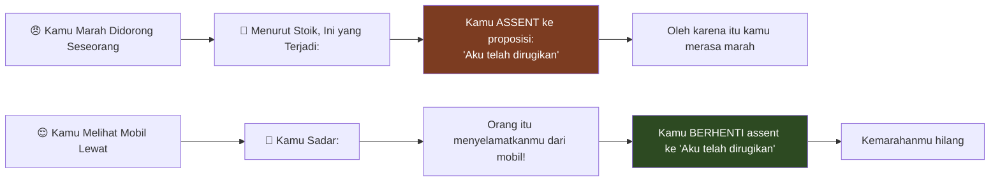

**Assent adalah satu-satunya hal yang terserah padamu.** Segala sesuatu yang lain **tidak** terserah padamu:
- Ekonomi ❌
- Cuaca ❌
- Apa yang pasanganmu pikirkan tentangmu ❌
- Bahkan **tubuhmu sendiri** ❌

<Callout type="warning" title="🚪 Seberapa Ekstrem Pandangan Ini?">
Para Stoik akan berkata: *"Membuka atau menutup pintu itu di sana — **tidak terserah padamu**, Jonathan."*

Bagaimana jika kamu terpeleset di jalan? Bagaimana jika gempa bumi menghantam ruangan sebelum kamu sampai di sana? Bagaimana jika anggota penonton Stoik menerjangmu untuk membuat poin?

Para Stoik akan berkata: *"Lihat, Jonathan, jika kamu akan mengikat kebahagiaanmu pada hal-hal yang tidak bisa diandalkan seperti mampu menutup atau membuka pintu itu, maka kebahagiaanmu tidak akan sepenuhnya terjamin."*
</Callout>

#### Pertanyaan Klarifikasi 🤔

Jika standarmu untuk "terserah padamu" begitu tinggi sehingga **menutup pintu tidak terserah padaku**, lalu dengan cara apa **assent terserah padaku**?

Pikirkan sesuatu seperti "uang adalah kebaikan". Kebanyakan dari kita akan menyetujui itu. Kenapa? Karena **assent setidaknya sebagian ditentukan secara sosial**.

Jika kamu dibesarkan dalam budaya materialistis, jika dari hari pertama orangtuamu, temanmu, semua di media memberitahumu "uang itu baik, uang itu baik, uang itu baik" — **tidak begitu mudah** untuk memperlakukan uang sebagai indifferent.

Tanyakan saja pada teman kita Seneca. 💸

#### Plot Twist: Tidak Ada Kehendak Bebas! 🎬

Ini adalah salah satu kesalahpahaman terbesar yang dimiliki pop Stoik tentang Stoikisme asli:

<Callout type="danger" title="⚠️ PLOT TWIST BESAR">
**Para Stoik berbicara besar tentang agensi, kekuatan, pilihan, kebebasan.**

**TIDAK ADA KEHENDAK BEBAS SAMA SEKALI dalam sistem mereka.**

Mereka adalah **determinis ketat** (*strict determinists*).
</Callout>

Ketika Stoik memberitahumu **"kebahagiaan terserah padamu"**, mereka **TIDAK** bermaksud:
- ❌ Kamu punya benteng batin yang berada di atas rantai kausal
- ❌ Kamu bisa mengatasi cobaan nasib dan menjadi bahagia bahkan ketika nasib menentukan seharusnya tidak
- ❌ Kamu bisa bertindak berbeda di masa lalu untuk bahagia sekarang
- ❌ Masa depan terbuka dan kamu punya pilihan untuk menjadi bahagia

**Apakah kamu adalah, pernah, atau akan bahagia — SEPENUHNYA DITENTUKAN.**

#### Apa yang Sebenarnya Mereka Maksud?

Ketika mereka berkata "kebahagiaan terserah padamu", yang mereka maksud hanyalah:

> **Kebahagiaan BERASAL dari karaktermu.**

**Karaktermu** adalah disposisi untuk menyetujui hal-hal yang berbeda — dan itu hanyalah **bagian deterministis lain** dari mesin alam semesta.

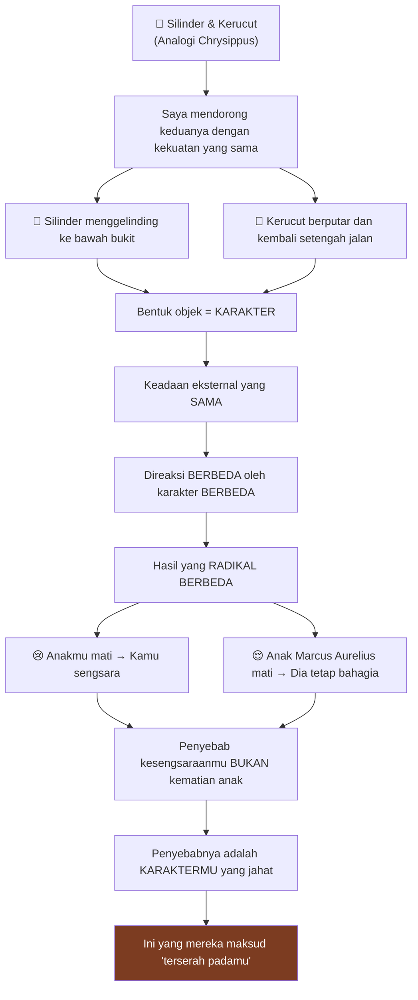

<Callout type="info" title="🎯 Poin Penting">
**Baik silinder maupun kerucut TIDAK punya kehendak bebas.**

Kerucut berputar karena ia kerucut. Kamu menyetujui dengan buruk karena karaktermu yang jahat.

Jadi "terserah padamu" **bukan** pernyataan tentang pilihan atau kehendak bebas. Ini adalah pernyataan tentang **kausalitas dan tanggung jawab**.
</Callout>

#### Kritik Imanen: Karakter Awalmu Tidak Terserah Padamu! 💥

Para Stoik berkata: **"Apa yang berasal dari karaktermu terserah padamu."**

Tapi dengan **standar yang persis sama** — apakah karaktermu terserah padamu?

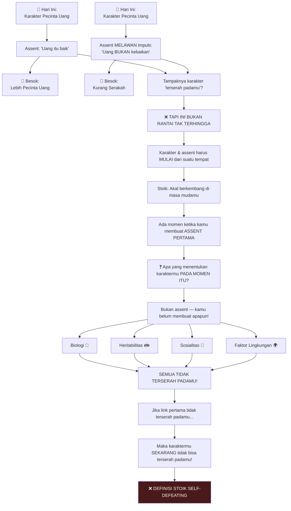

<Callout type="danger" title="💣 Kritik Menghancurkan">
**Stoik memberitahumu:** Apa yang berasal dari karaktermu terserah padamu.

**Tapi dengan standar yang PERSIS SAMA**, karaktermu sebenarnya **TIDAK terserah padamu**.

**Tapi jika karaktermu tidak terserah padamu**, maka apa yang berasal dari karaktermu **juga tidak bisa terserah padamu**.

**Definisi Stoik tidak hanya menyesatkan — ia SELF-DEFEATING.**
</Callout>

Jika sebagai anak kamu diperkosa, dilecehkan, disalahgunakan, diberi obat-obatan, dan membentuk karakter yang jahat — dan karena kamu terus melakukan kejahatan...

**Apakah kita benar-benar ingin berkata bahwa tindakan jahatmu sekarang SEPENUHNYA terserah padamu?**

---

### Kritik #2: Etika Kebajikan — 4 Radikalisasi 🎭

Klaim berikutnya yang akan kita kritik:

> **"Kebaikan eksternal adalah indifferents. Kebajikan saja yang penting untuk kebahagiaanmu."**

**Kebajikan** (*virtue*) = merespons dengan baik terhadap keadaan apapun yang kamu hadapi.

Ada intuisi yang sangat bagus dan solid di sini:
- ✅ Jika kamu merespons dengan baik terhadap situasi buruk (tangguh dalam kemiskinan, berani melawan bahaya) — itu bisa jadi hal yang baik
- ✅ Jika kamu merespons dengan buruk terhadap situasi baik (kekayaan membuatmu sombong, kesehatan membuatmu tidak sederhana) — itu bisa jadi hal yang mengerikan

**Tapi masalahnya:** Para Stoik telah **meradikalisasi** intuisi ini ke tingkat yang ekstrem.

---

#### Radikalisasi #1: Hasil Tindakan Tidak Penting 📊

Cicero memberi kita contoh dua negarawan Romawi yang mulia: **Quintus Metellus** dan **Marcus Regulus**.

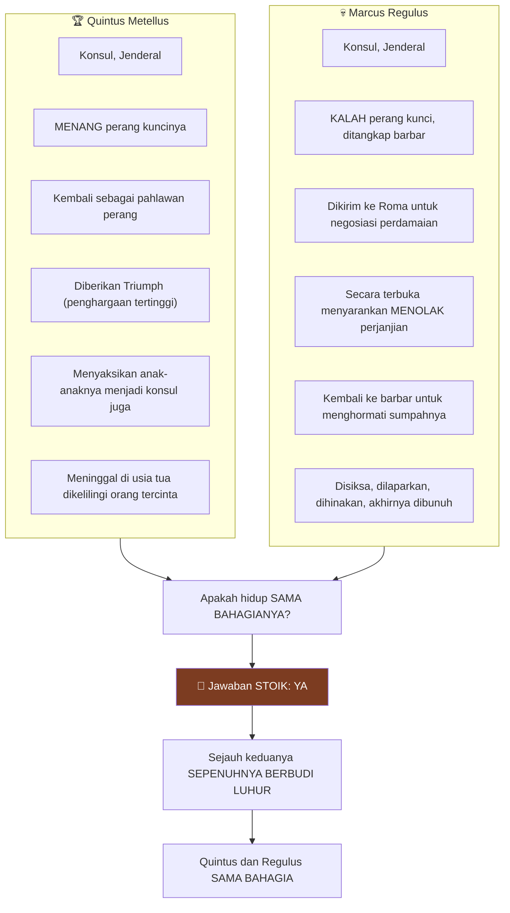

Tidak ada yang meragukan apakah orang-orang ini berbudi luhur. Mereka sebaik yang kamu bisa dapatkan. Tapi itu poin Cicero:

Kita mungkin berkata Regulus mengagumkan. Kita mungkin bahkan ingin berkata Regulus menjalani kehidupan yang mungkin baik. **Tapi apakah kita benar-benar ingin berkata** Marcus Regulus menjalani kehidupan yang **SAMA BAIKNYA** dengan Quintus Metellus?

**Jawaban Stoik: YA.** Sejauh mereka sepenuhnya berbudi luhur, Quintus dan Regulus sama-sama bahagia dan sama baiknya.

---

#### Radikalisasi #2: Tipe Aktivitas Berbudi Luhur Tidak Penting 🚽

Jika radikalisasi pertama adalah mengatakan **hasil tindakan tidak penting**, radikalisasi kedua adalah mengatakan **tipe aktivitas berbudi luhur tidak penting**.

<Callout type="warning" title="📜 Stoik Berkata">
*"Ketika seorang bijak mengangkat jarinya, ia melakukan tindakan berbudi luhur."*

Itu seberapa luas cakupan aktivitas berbudi luhur.
</Callout>

Mari pikirkan tugas paling membosankan, melelahkan, merendahkan, tidak menarik yang bisa kamu lakukan:

**Menyeka pantatmu setelah buang air besar.** 🧻

Itu **bisa jadi tindakan berbudi luhur**. Kamu tidak menyeka terlalu lembut sehingga meninggalkan residu. Kamu tidak menyeka terlalu keras sehingga merusak struktur.

**Itu kebajikan.** Itu sesuai dengan alam. Itu kebajikan.

Dan para Stoik berpikir itu adalah tindakan **SAMA BERBUDI LUHURNYA** dengan apapun yang dilakukan Quintus atau Regulus.

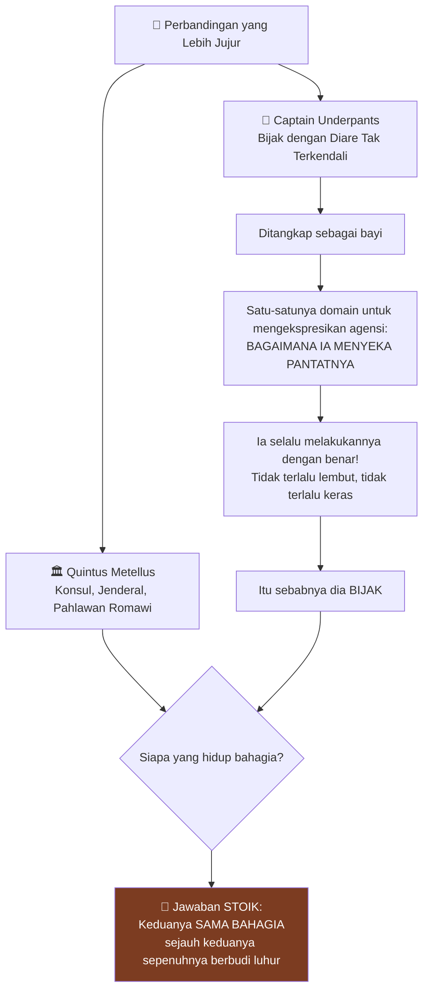

<Callout type="important" title="💡 Apa yang Sebenarnya Dikatakan Stoik">
Dengan tidak menarik hierarki antara kebajikan-kebajikan, apa yang secara implisit dikatakan para Stoik adalah:

**Makna, variasi, kekayaan, dampak, warisan** — TIDAK SATUPUN dari ini masuk ke dalam konsepsi mereka tentang kehidupan yang baik, tentang apa itu kebahagiaan.

Yang penting hanyalah: **Apakah kamu merespons dengan baik?** Terlepas dari apa yang kamu respons — apakah itu serangan musuh yang mulia atau serangan diare — **tidak masalah**.
</Callout>

---

#### Radikalisasi #3: Tipe Aktivitas Jahat Tidak Penting 👿

**Kebahagiaan adalah biner ketat** untuk para Stoik. Kamu **salah satunya:**
- Bijak dan bahagia 😊
- Bukan bijak dan SENGSARA 😭

<Callout type="quote" title="📜 Cicero Mengutip Stoik">
*"Oh, kekuatan intelek Zeno yang luar biasa — bahwa kebodohan, ketidakadilan, dan kejahatan setiap orang adalah sama; bahwa semua kesalahan adalah sama; dan bahwa mereka yang telah maju jauh di jalan menuju kebajikan oleh alam dan latihan adalah **SEPENUHNYA SENGSARA** kecuali mereka telah mencapainya.*

*Jadi Plato, orang besar itu, dengan anggapan bahwa ia tidak bijak, **tidak lebih baik** dan menjalani **kehidupan yang tidak lebih bahagia** daripada yang paling jahat dari kita."*
</Callout>

**Plato dalam pandangan Stoik bukan hanya tidak bahagia — ia SENGSARA.**

**Tapi ia bukan hanya sengsara — ia SAMA SENGSARANYA dengan Hitler.**

**Plato SAMA SENGSARANYA dengan Hitler karena Plato SAMA JAHATNYA dengan Hitler.**

Ini bukan kritik saya. Ini hanya menyampaikan pandangan mereka.

---

#### Berapa Banyak Bijak dalam Sejarah Manusia?

> *"Oke, jadi artinya aku hanya harus bekerja sangat keras, kan? Aku hanya harus bekerja sangat keras, menjadi bijak, dan kemudian aku akan bahagia."*

**Berapa banyak bijak yang pernah ada dalam seluruh sejarah manusia?**

**NOL.** 😱

Kadang Stoik berkata Socrates adalah seorang bijak. Kadang mereka berkata, "sesering phoenix, sekali setiap 500 atau 1000 tahun."

Tapi ketika kita bicara tentang apa sebenarnya bijak itu, kamu akan melihat mengapa jawaban yang paling mungkin adalah **NOL**.

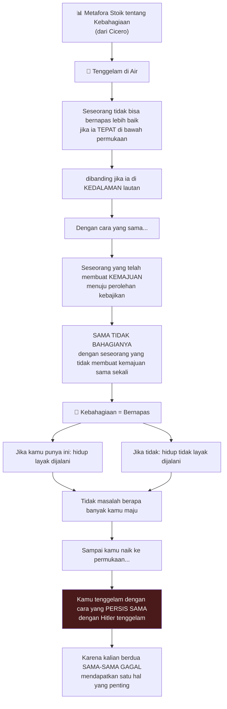

---

#### Radikalisasi #4: Panjang Kehidupan Berbudi Luhur Tidak Penting ⏰

Ini adalah radikalisasi keempat yang membuat argumen bunuh diri Stoik "bekerja".

Misalkan aku berusia 27 sekarang. Misalkan aku menjadi bijak **sekarang**. Selamat — yang pertama dalam sejarah! 🎉

Dan misalkan asteroid datang dan **menghancurkanku sekarang juga**.

Jadi aku punya **satu milidetik** sebagai bijak.

Para Stoik akan berkata: **"Itu adalah kehidupan yang SAMA BAHAGIA, sama baik dijalani, seperti jika aku hidup sampai 100, mengajar semua orang lain bagaimana menjadi bijak, dan melakukan semua perbuatan baik ini."**

Hanya dengan premis gila ini — radikalisasi keempat — argumen mereka seputar bunuh diri bekerja.

---

### Filsafat Bunuh Diri Stoik: Bukti Bahwa Eksternal MEMANG Penting 💀

Para Stoik punya sistem bunuh diri yang sangat berkembang. Bunuh diri bisa menjadi **tindakan berbudi luhur** yang bahkan bijak lakukan.

Tapi tunggu — kamu bilang eksternal adalah indifferents. Kamu bilang kamu bisa bahagia dalam keadaan apapun. **Mengapa kamu akan pernah membunuh dirimu sendiri?**

#### Kasus Cato

**Cato sang Stoik** melakukan seppuku setelah kalah dari Caesar.

Bukan karena Cato khawatir akan disiksa Caesar. Bukan karena khawatir kehilangan uangnya. Bukan karena Caesar mungkin menyeret keluarganya. **Itu semua hanya eksternal.**

Cato harus membunuh dirinya karena **untuk hidup** berarti **menerima kemurahan hati Caesar**, yang berarti **mengakui legitimasi Caesar**, yang berarti **pengkhianatan terhadap republik**.

**Tindakan hidup Cato itu sendiri adalah jahat** — dan itulah mengapa ia harus membunuh dirinya.

<Callout type="danger" title="💥 Kontradiksi Fatal">
**Tapi aku pikir kamu bilang semua eksternal adalah indifferents?**

Sekarang kamu memberitahuku bahwa **setelah perang sipil**, eksternal sedemikian rupa sehingga **tidak ada cara Cato bisa menjalani kehidupan berbudi luhur**.

Pilihannya hanya: jahat atau mati.
</Callout>

#### Cara Stoik Berkelit

Begini cara Stoik mencoba berkelit dari masalah ini:

> *"Dalam kejadian bahwa bijak mengenali eksternal tidak ramah terhadap kebajikan, ia membunuh dirinya — dan Stoik menyebut itu KEBAJIKAN."*

Jadi kamu lihat apa yang aku coba katakan?

**Ia tidak pernah kehilangan kebahagiaannya** karena ia **selalu berbudi luhur** — termasuk tindakan membunuh dirinya sendiri.

Jadi Stoik **secara teknis benar**: Eksternal tidak bisa menyakiti kebahagiaan Stoik — karena dalam kejadian mereka bisa, **mereka hanya membunuh diri mereka sendiri dan menyebut itu kebajikan**.

<Callout type="quote" title="📜 Seneca">
*"Apakah aku harus berpikir bahwa nasib bisa melakukan segalanya kepada seseorang selama ia tetap hidup?*

*Sebaliknya, nasib tidak bisa melakukan apa-apa kepada seseorang **selama ia tahu bagaimana cara mati**."*
</Callout>

#### Mengapa Ini Tidak Memuaskan

Aku datang ke Stoik mencoba belajar **seni kehidupan** — seni KEHIDUPAN, biarkan aku menekankan kata itu — karena aku dengar Zeno punya teknik gila ini yang bisa membuatku bahagia apapun yang terjadi.

Dan kemudian aku menemukan itu hanya **secara teknis benar** dengan **membunuh dirimu sendiri** ketika kamu tidak bisa bahagia.

---

### Stoik Sebenarnya Membuktikan Aristoteles Benar 🎯

Argumen bunuh diri ini **hanya bekerja** karena radikalisasi keempat (panjang kehidupan tidak penting).

Jika kita mengambil premis gila itu, maka debatnya menjadi:

> **"Apakah eksternal penting untuk kebahagiaan JIKA AKU INGIN TERUS HIDUP?"**

Para Stoik akan dipaksa **mengalah kepada Aristoteles** — karena jika tidak, filsafat bunuh diri mereka sendiri tidak masuk akal.

**Jadi jika Cato ingin tidak hanya bahagia tapi HIDUP dan bahagia, orang itu perlu MENANG perang sipil.**

<Callout type="quote" title="📜 Seneca — Bukti Bahwa Eksternal MEMANG Penting">
*"Jika ia menghadapi banyak kesulitan yang mengusir ketenangan, ia **melepaskan dirinya**.*

*Ia juga tidak melakukan ini hanya dalam keadaan darurat ekstrem. Sebaliknya, **segera setelah ia mulai meragukan nasibnya**, ia membuat penilaian yang cermat untuk menentukan apakah **sudah waktunya untuk berhenti**."*
</Callout>

Ingat, ini adalah apa perdebatan dengan Aristoteles:

- **Apakah eksternal penting untuk kebahagiaan?**
- **Bisakah banyak kesulitan mengusir ketenangan bijak?**

Dan di sini kita punya **Seneca tercatat** mengatakan bahwa **ya, bisa**.

---

### Kritik #3: Sifat Manusia — Jiwa yang Menyeret Mayat 👻

Untuk memahami mengapa etika Stoik begitu aneh, kita perlu memeriksa pandangan mereka tentang **sifat manusia**.

#### Kamu Hanyalah Jiwamu

<Callout type="quote" title="📜 Marcus Aurelius Mengutip Epictetus">
*"Epictetus biasa berkata: Kamu adalah **jiwa kecil yang menyeret mayat**."*
</Callout>

**Itu** yang tubuhmu adalah. Kamu bukan tubuh yang hidup. Kamu bukan tubuh yang dianimasikan oleh jiwa. Kamu bahkan bukan tubuh DAN jiwa.

**Kamu HANYA jiwamu.** Dan tubuhmu adalah **beban mati** — mayat yang harus kamu seret dan seret kemana-mana.

#### Jiwa Itu Hyper-Rasional

Bagian radikal kedua: seberapa **ekstrem rasionalnya** Stoik berpikir jiwa itu.

Ingat di awal ketika kita bicara tentang "up to you" dan assent? Mereka berpikir bahwa di balik seluruh agensi, perilaku, emosi, keinginan manusia — kita sebenarnya **menyetujui proposisi-proposisi berbeda**.

Tapi ini sebenarnya jauh lebih logis dan proporsional dari itu:

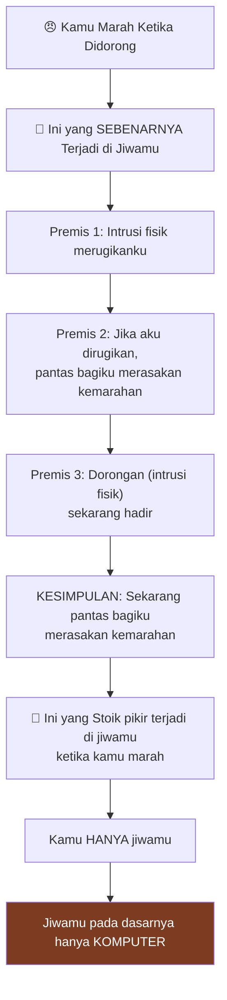

#### Mengapa Ini Menjelaskan Keanehan Etika Stoik

**Mengapa kebahagiaan adalah biner?**

Analogi komputer sangat membantu di sini. Jika aku menjalankan program komputer, tidak masalah apakah aku **kehilangan satu titik koma** atau seluruh **codebase adalah omong kosong**. Programnya **tidak akan compile** dengan cara yang sama.

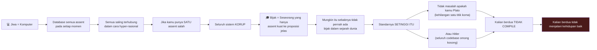

**Mengapa tipe aktivitas berbudi luhur tidak penting?**

Tidak masalah apakah kamu Quintus Metellus atau Captain Underpants — karena yang penting hanyalah: **Apakah kamu menyetujui proposisi yang benar?**

**Mengapa eksternal tidak penting?**

Menjadi jauh lebih jelas mengapa eksternal tidak penting **jika kamu bukan tubuhmu**.

Kekayaan dan kemiskinan, rasa sakit dan kesenangan, kehormatan dan aib — ini adalah kebaikan **tubuh** — yang **bukan kamu**.

Jika mereka bukan kamu, jauh lebih masuk akal mengapa mereka tidak masuk ke dalam konsepsimu tentang kebahagiaan.

---

### Kritik #4: Sifat Kosmis — Zeus & Agama 🌌

Mengapa kita hanyalah jiwa kita? Dan mengapa jiwa kita adalah akal murni?

Seperti "up to you" dan etika Stoik, **sifat manusia Stoik tidak self-grounding** — dan membutuhkan ketergantungan pada **sifat kosmis Stoik, agama Stoik**.

#### Para Stoik Percaya pada Zeus

Para Stoik percaya pada **alam semesta rasional** yang diperintah oleh:
- **Alam** (*Nature*)
- **Logos** (*Reason*)
- **Akal** (*Reason*)
- **Zeus**

Semua ini **dapat dipertukarkan**. Zeus adalah akal murni. Ia **meresapi kosmos** — termasuk kita.

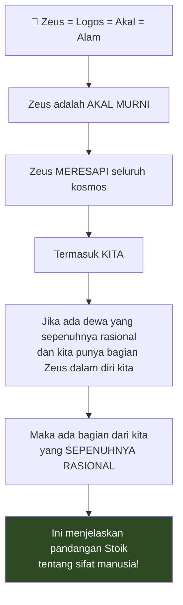

#### Penyelenggaraan Ilahi

Para Stoik percaya pada **penyelenggaraan ilahi** (*divine providence*):
- Zeus punya rencana yang **baik hati dan sepenuhnya baik**
- Ini adalah **dunia terbaik dari semua dunia yang mungkin**
- Kita seharusnya menjadi **co-author** dalam penyelenggaraan itu

Meskipun kekayaan, penampilan bagus, dan kelahiran bangsawan adalah indifferents — kita seharusnya **menggembalakan** mereka dalam **imitasi kita terhadap Zeus**.

<Callout type="quote" title="📜 Cicero Menyampaikan Pandangan Stoik">
*"Manusia sendiri dilahirkan untuk kepentingan **merenungkan dan meniru kosmos**. Ia sama sekali tidak sempurna, tapi ia adalah **bagian kecil tertentu** dari apa yang sempurna."*
</Callout>

#### Stoikisme Adalah Agama!

**Untuk meringkas perjalanan kita:**

Kita mulai dari nasihat yang sangat jinak dan tidak berbahaya: **"Fokus pada apa yang terserah padamu."**

Tapi untuk benar-benar memahami itu, untuk benar-benar memahami mengapa mereka meresepkan itu — kita harus **sampai di Zeus**.

**Stoikisme adalah AGAMA.** Dan membutuhkan komitmen kosmologis itu **sama seperti agama-agama lain** seperti Kristen dan Buddha agar etikanya bekerja.

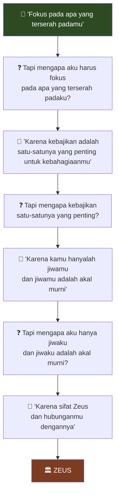

<Callout type="warning" title="⚠️ Klaim Kosmologis Stoikisme">
Ada lebih banyak tentang agama ini yang belum kita bahas:
- **Big bang dan big crunch**
- **Eternal recurrence** (pengulangan abadi)
- Seluruh teori seputar **divination** (ramalan)

**Klaim kosmologis Stoikisme tidak kurang ekstravagan** dari jenis agama terorganisir yang banyak **Stoik modern rasional** tertawakan keluar pintu.
</Callout>

#### Stoikisme Lebih Lemah dari Kristen? 🤔

Membela Stoik: mereka tidak membutuhkan apapun seperti **wahyu Kristen** atau **iman Kristen**. Bagi mereka, semua klaim religius ini tidak datang dari wahyu super-rasional tapi dari **filsafat alam** mereka — mereka pikir bisa didasarkan pada akal.

**Tapi terus terang, aku menganggap itu sebagai pukulan MELAWAN Stoikisme** — mendukung Kristen — karena itu **secara grotesque melebih-lebihkan** apa yang bisa dilakukan akal.

<Callout type="quote" title="💭 Preferensi terhadap Kristen">
*"Bagian favorit saya dari Kristen adalah ketika saya diberitahu bahwa saya **idiot total**. Saya cacing tanah kecil yang menyedihkan. Saya harus berhenti mencoba mencari tahu sendiri dan **hanya melakukan apa yang Tuhan suruh**.*

*Ketika Tuhan turun ke Ayub: 'Siapa kamu? Di mana kamu ketika Aku membuat kosmos? Katakan padaku jika kamu tahu.'*

*Atau ketika Dante di Surga bertanya kepada Elang Keadilan tentang orang kafir berbudi luhur yang tidak pernah punya kesempatan datang ke Kristus — 'Mengapa dia di neraka?' Tahu apa kata Elang Keadilan? 'Bukan urusanmu.'*

*Jika kamu akan memberiku klaim kosmologis radikal, setidaknya punya kesopanan untuk memberitahuku bahwa aku **idiot total** yang tidak punya harapan mencari tahu sendiri.*

*Aku tidak bilang itu meyakinkan — tapi itu **jauh lebih compelling** daripada apa yang Stoik coba lakukan dengan 'ini silogisme, QED.'"*
</Callout>

---

## Ringkasan Kritik 📋

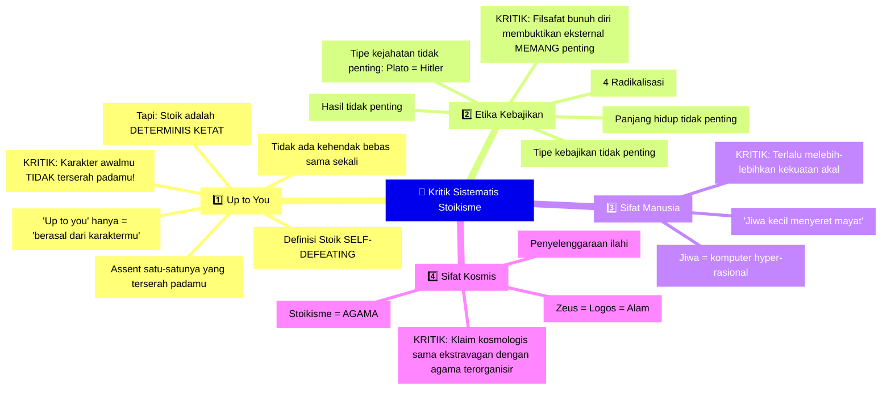

**Tiga masalah besar di setiap langkah:**

1. **Ide-ide terdengar bagus** → Ada implikasi radikal jika kamu pikirkan
2. **Sering ada ketegangan imanen** yang masif, jika bukan kontradiksi langsung
3. **Membutuhkan grounding** dari bagian teori yang lebih foundational yang menjadi **semakin radikal sampai kita tiba di Zeus**

---

## Bagian 3: Mengapa Tetap Membaca Stoik? 📚

Setelah semua kritik ini, mengapa Jonathan Bi akan **terus membaca para Stoik** meskipun berpikir mereka salah semua secara **komikal dan fantastis**?

### Mereka Salah — Tapi ke Arah yang Benar ➡️

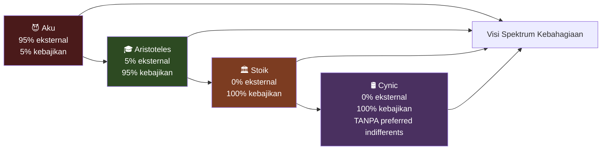

**Justru karena ekstremisme itu** bahwa bergulat dengan Stoik tahun lalu telah begitu **bermanfaat secara filosofis dan berdampak**.

Karena dengan harus bergulat, membela, dan menyerang posisi-posisi ekstrem ini — aku benar-benar memahami:
- Betapa pentingnya kebajikan
- Betapa tidak pentingnya kebaikan eksternal
- Betapa di luar kendali dunia ini
- Betapa rasionalnya psikis manusia

...bahkan jika tidak seekstrem klaim Stoik.

<Callout type="tip" title="💡 Rekomendasi Akhir">
**Jika kamu suka intuisi Stoik — ikuti ARISTOTELES sebagai gantinya.**

Kamu mendapat:
- ✅ Fokus pada kebajikan
- ✅ Ketahanan
- ✅ Agensi
- ❌ TANPA radikalisasi-radikalisasi gila ini

Aristoteles mengenali perbedaan antara kejahatan. Tentu saja, kan? Aristoteles juga mengenali hierarki kebajikan yang paling cocok untuk manusia. Tapi yang paling penting, Aristoteles mengenali bahwa **eksternal MEMANG penting** — bahkan jika tidak sebanyak yang biasanya orang pikir.
</Callout>

### Stoik Mengagumi Cynic — Kita Bisa Mengagumi Stoik

Kamu mungkin berpikir para Stoik yang mulia — senator, kaisar — akan memandang rendah para Cynic yang jorok ini sebagai pengemis.

**Sama sekali tidak.** Bahkan, kapanpun Cynic disebut, Stoik sering **secara terbuka mengagumi**, jika tidak hanya **ngiler dan memuja**.

- **Marcus Aurelius** berbicara tentang Diogenes dalam napas yang sama dengan Socrates
- **Zeno** sang pendiri dilatih oleh seorang Cynic
- **Epictetus** menyebut Cynic **"utusan dari Tuhan"**

Mereka adalah **utusan dari Tuhan** karena meskipun Cynic — dari posisi Stoik — **salah semua**, mereka salah ke **arah yang benar**.

Dan asketisme ekstrem mereka, meskipun benar-benar keterlaluan dari perspektif Stoik, adalah **pengingat yang berguna** tentang apa yang mampu dilakukan manusia, tentang betapa sedikit kebaikan eksternal benar-benar penting untuk kebahagiaan.

### Sikap Saya terhadap Stoik

Dengan cara yang **persis sama** Stoik menunjuk ke Cynic dan berkata:

> *"Lihat bajingan-bajingan gila ini masturbasi di tong, di mana-mana, meludah di wajah orang. Tapi ini luar biasa karena mengingatkan kita apa yang mampu dilakukan manusia."*

**Aku** menunjuk ke Stoik dan berkata:

> *"Lihat bajingan-bajingan gila ini — bahagia semua ketika anak mereka mati, terkekeh dan membuat lelucon ketika mereka disiksa. Tapi ini luar biasa. Mereka menunjukkanku apa yang mampu dilakukan manusia."*

---

## Kesimpulan 🎬

Para Stoik adalah **heroik**. Mereka menunjukkan kepada kita apa yang mampu dilakukan manusia — bahkan jika menunjukkan itu benar-benar tidak perlu dan tidak produktif.

Mereka adalah **teman-temanku yang mengagumkan tapi salah arah**.

Dan kadang hal terbaik yang bisa kita lakukan untuk teman yang salah arah adalah **meluruskan mereka**.

<Callout type="success" title="🎯 Pesan Dibawa Pulang">
1. **Pop Stoikisme** = Mekanisme koping paling jenius yang pernah diciptakan manusia
2. **Stoikisme asli** = Bahkan lebih gila dan tidak bisa dijalani
3. **Jika kamu suka intuisi Stoik** = Ikuti **Aristoteles** sebagai gantinya
4. **Stoik tetap layak dibaca** = Mereka salah ke arah yang benar
5. **Ekstremisme mereka berguna** = Sebagai pengingat apa yang mampu dilakukan manusia
</Callout>

---

## Referensi & Sumber Utama 📚

<Callout type="cite" title="📖 Teks-Teks Stoik Utama">
**Sumber Primer:**
- **Epictetus** — *Enchiridion* (Manual) & *Discourses*
- **Seneca** — *Letters from a Stoic*, *On the Shortness of Life*, *On Anger*
- **Marcus Aurelius** — *Meditations*
- **Cicero** — *Tusculan Disputations*, *On Ends* (De Finibus), *On the Nature of the Gods*

**Kritik Klasik:**
- **Cicero** — Skeptis Akademik yang sering mengkritik Stoikisme
- **Aristoteles** — *Nicomachean Ethics* (alternatif yang direkomendasikan)
- **Nietzsche** — Berbagai kritik terhadap Stoikisme dalam karyanya

**Sumber Modern:**
- **A.A. Long** — *Epictetus: A Stoic and Socratic Guide to Life*
- **Brad Inwood** — *The Cambridge Companion to the Stoics*
- **Lawrence Becker** — *A New Stoicism*
</Callout>

<Callout type="info" title="🎥 Sumber Video">
Artikel ini diadaptasi dari kuliah **Jonathan Bi** berjudul *"This Drove Me Away from Stoicism"* yang tersedia di [YouTube](https://www.youtube.com/watch?v=Sjp0ktc0KBg).

Untuk eksplorasi lebih lanjut, kunjungi situs Jonathan Bi di **jonathanbi.com** untuk transkrip lengkap, catatan buku, dan wawancara dengan sarjana Stoik terkemuka.
</Callout>

---

*Artikel ini adalah eksplorasi akademis dan kritik filosofis terhadap Stoikisme. Tujuannya bukan untuk mencegah orang membaca teks-teks Stoik — yang memiliki banyak nilai — tapi untuk mendorong pembacaan yang lebih kritis dan nuanced.*
