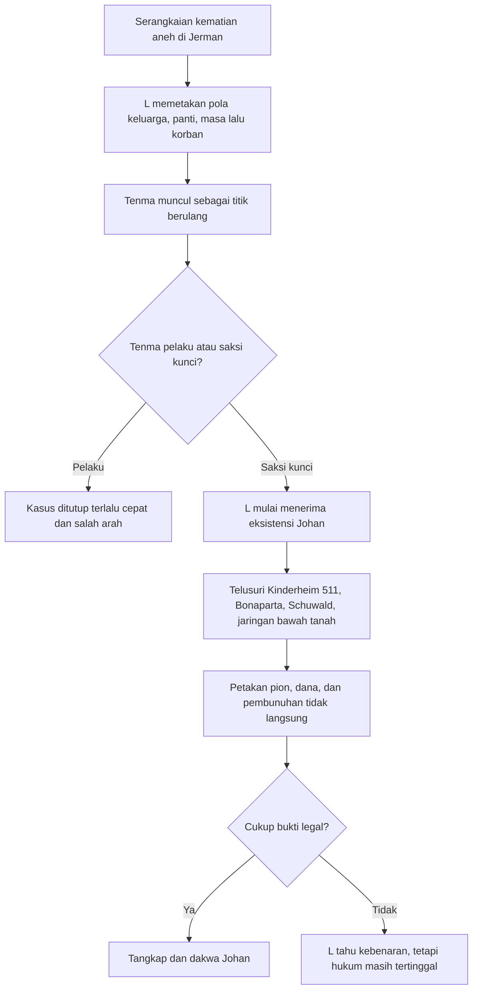
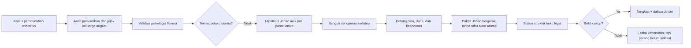
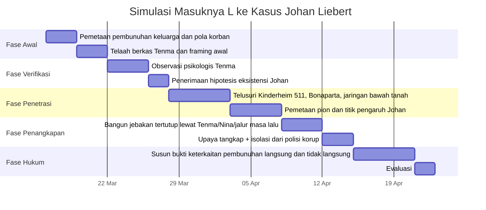

## 🧠 Pendahuluan: Ini Bukan Sekadar Pertarungan IQ, tetapi Pertarungan antara **Bukti** dan **Ketiadaan Jejak**

Kalau orang bertanya, **“Bisakah L Lawliet menangkap Johan Liebert?”**, reaksi paling cepat biasanya terlalu sederhana. Ada yang langsung menjawab, “Ya jelas bisa, L itu jenius.” Ada juga yang menjawab, “Tidak mungkin, Johan terlalu licin dan terlalu misterius.”

Masalahnya, dua jawaban itu sama-sama sering gagal memahami inti persoalannya. Duel ini bukan sekadar adu pintar antara dua karakter legendaris dari dua semesta berbeda. Ini adalah benturan dua model ancaman yang sangat berbeda:

- **L Lawliet** adalah detektif yang unggul dalam *pattern recognition* *(pengenalan pola)*, deduksi, profiling psikologis, dan permainan informasi.
- **Johan Liebert** adalah ancaman yang justru kuat karena hampir tidak meninggalkan bentuk yang stabil: identitas kabur, jejak administratif minim, pembunuhan sering tidak langsung, saksi mudah mati atau rusak mental, dan pengaruh psikologisnya begitu halus sampai orang lain melakukan kekerasan untuknya. 😶

Karena itu, pertanyaan yang benar bukan cuma:

> **Apakah L cukup cerdas untuk tahu Johan pelakunya?**

Tetapi lebih tajam lagi:

> **Apakah L bisa membuktikan Johan bersalah secara legal, dalam dunia Monster yang teknologinya terbatas, korup, dan penuh jejak yang sengaja dihapus?**

Di sinilah pertarungan ini menjadi jauh lebih menarik. Sebab dalam *Death Note*, L berkali-kali sudah “hampir tahu” siapa pelakunya, tetapi hukum tidak bekerja dengan “hampir tahu”. Hukum bekerja dengan **bukti**. Dan Johan, tidak seperti Light Yagami, tidak punya ego yang sama untuk mengumumkan dirinya ke dunia. Ia justru bergerak seperti kekosongan: terlihat dampaknya, tapi pelakunya terus kabur dari bentuk yang bisa dipaku. 👁️

Artikel ini akan membedah duel hipotetis ini secara mendalam: dari struktur kasus Monster, perbedaan psikologi L dan Johan, kelebihan dan keterbatasan investigasi di era 1990-an, sampai kemungkinan-kemungkinan realistis apakah L benar-benar bisa **menangkap**, **membuktikan**, dan **menghukum** Johan di mata hukum.

---

<Callout type="important" title="Tesis utama artikel ini">
L **kemungkinan besar bisa mengidentifikasi dan melacak Johan Liebert**, bahkan lebih cepat daripada banyak investigator di dunia *Monster*. Namun, **menangkap Johan secara sah dan memvonisnya berdasarkan bukti kuat** adalah masalah yang jauh lebih sulit. Pertarungan ini pada dasarnya bukan soal siapa lebih jenius secara abstrak, melainkan siapa yang lebih unggul dalam perang antara **deduksi** melawan **penghapusan jejak**.
</Callout>

---

## 🕵️ 1. Aturan mainnya harus jelas dulu: apa yang dianggap sebagai “menang”?

Sebelum membahas siapa unggul, kita harus mendefinisikan **win condition** *(kondisi kemenangan)* dengan adil.

### Untuk L Lawliet
Kalau kita mengikuti roh karakter L, kemenangan sejatinya bukan hanya “tahu” siapa pelakunya. L selalu bermain dalam medan berikut:

- identifikasi pelaku,
- penangkapan,
- pembuktian,
- dan pengakuan hukum atau validasi bukti yang kuat.

Dalam kasus Kira, masalah L justru bukan kurang cerdas. Masalahnya adalah **membuktikan** Light sebagai Kira. Jadi dalam konteks Johan, kemenangan L seharusnya berarti:

> **L berhasil menangkap Johan Liebert dan mengaitkannya dengan tindak kriminal secara kuat di mata hukum.**

### Untuk Johan Liebert
Sebaliknya, kemenangan Johan jauh lebih longgar dan lebih gelap:

- lolos dari pembuktian,
- terus membuat orang lain jadi pion,
- memecah fokus penyelidik,
- membuat penyelidik salah sasaran,
- atau jika perlu, menyingkirkan L lewat tangan orang lain.

Ini membuat duel ini sejak awal tidak simetris. L harus menang dengan standar tinggi. Johan cukup membuat standar itu gagal dipenuhi. ⚖️

---

## 👹 2. Mengapa kasus Johan Liebert jauh lebih sulit daripada yang terlihat?

Banyak orang meremehkan kasus Johan karena tidak ada unsur supernatural seperti *Death Note*. Padahal justru di situ letak jebakannya. Karena tidak supernatural, orang mengira semua akan lebih mudah. Nyatanya, kasus Johan sulit karena ia beroperasi di level yang lebih “organik” dan lebih licin.

### Kesulitan utama kasus Johan

#### 1. **Tidak ada identitas yang stabil**
Johan nyaris seperti manusia tanpa fondasi administratif yang bersih. Nama aslinya kabur, masa kecilnya hancur, dokumen banyak yang hilang, dan sejarah hidupnya terputus-putus.

#### 2. **Jejak pembunuhan sering tidak langsung**
Banyak kejahatan Johan dilakukan melalui:
- orang suruhan,
- orang yang dimanipulasi,
- pembunuhan berantai yang tampak terpisah,
- bunuh diri yang didorong psikologis,
- atau eskalasi chaos yang tampak seperti kehancuran spontan.

#### 3. **Teknologi era 1990-an terbatas**
Dunia *Monster* tidak memberi kemudahan seperti:
- CCTV modern di setiap sudut,
- jejak digital masif,
- database terintegrasi real-time,
- analitik metadata komunikasi seperti era modern.

#### 4. **Lingkungan sosial-politik korup**
Ada polisi korup, bekas jaringan intelijen, sisa struktur kekuasaan gelap, dan orang-orang dengan kepentingan yang bisa merusak jalur hukum.

#### 5. **Johan memang sengaja ingin hanya sedikit orang tahu ia ada**
Ini penting. Johan tidak butuh pengakuan massal seperti Kira. Dalam banyak fase, ia justru nyaman menjadi semacam legenda samar yang hanya dipahami beberapa orang: Tenma, Nina, Lunge, Grimmer, Suk, dan segelintir orang lain.

Artinya, L tidak sedang memburu penjahat yang ingin dilihat. Ia memburu seseorang yang sering menang justru karena tetap menjadi **ketiadaan yang bergerak**. 🌫️

---

## 📚 3. Johan Liebert: bukan hanya cerdas, tetapi ahli merusak pusat identitas manusia

Kalau Light Yagami adalah lawan yang mengandalkan kecerdasan sistematis, ego, dan permainan aturan, maka **Johan Liebert** jauh lebih menyeramkan secara psikologis. Ia tidak hanya menipu logika orang. Ia menggeser **inti diri** orang.

Dua transkrip yang Mas kirim sama-sama menekankan satu hal: kekuatan utama Johan bukan sekadar pintar, melainkan **manipulatif pada tingkat eksistensial**.

### Apa artinya ini?
Johan tidak cuma membuat orang salah langkah. Ia bisa:

- membaca luka terdalam seseorang,
- memahami rasa bersalah yang belum sembuh,
- mengarahkan orang ke titik di mana mereka merasa hanya ada satu jalan,
- dan membuat kehancuran terasa seperti keputusan mereka sendiri.

Ini yang terjadi pada banyak karakter dalam *Monster*:
- pembunuh bayaran,
- detektif yang remuk oleh masa lalu,
- orang-orang rapuh yang merasa akhirnya “dimengerti”,
- figur berkuasa yang dimabukkan oleh ilusi makna.

### Johan sebagai ahli “menghapus sumbu peta”
Salah satu metafora terpenting dari analisis Monster adalah bahwa Johan seperti mencabut **koordinat peta batin** seseorang. Begitu sumbu moral dan identitas orang goyah, ia punya ruang untuk menggambar ulang orientasi mereka.

Dalam bahasa Indonesia yang lebih sederhana:

> Johan tidak sekadar mempengaruhi pikiran. Ia membuat orang kehilangan patokan tentang siapa diri mereka, lalu masuk sebagai suara yang menawarkan arah baru—yang ujungnya menghancurkan. 🕳️

Inilah sebabnya Johan sangat berbahaya sebagai lawan L. Bukan karena L mudah dibohongi, tetapi karena Johan bermain di area yang bukan cuma data dan logika: ia bermain di area **trauma, rasa malu, kesepian, dan kebutuhan eksistensial**.

---

## 🍰 4. L Lawliet: kenapa justru ia salah satu orang yang paling mungkin **tidak mudah ditelan** oleh Johan?

Di sisi lain, justru ada alasan kuat mengapa L adalah salah satu karakter yang relatif lebih tahan terhadap pola manipulasi Johan dibanding manusia biasa.

### Karakter dasar L yang penting untuk duel ini

#### 1. **Sangat tidak reaktif**
L terkenal aneh, tetapi di balik keanehan itu ada kualitas investigatif yang sangat penting: ia tidak mudah hanyut oleh presentasi sosial.

- wajah tampan? tidak terlalu berpengaruh,
- kharisma? belum tentu efektif,
- sandiwara moral? L justru curiga,
- perilaku terlalu sempurna? L sering menganggap itu red flag *(tanda bahaya)*.

#### 2. **Tidak terlalu terikat pada penerimaan sosial**
Salah satu senjata terbesar Johan adalah kebutuhan orang untuk:
- dimengerti,
- diterima,
- dibenarkan,
- dipulihkan harga dirinya.

L justru tidak dibangun di atas kebutuhan itu. Ia eksentrik, terasing, dan secara sosial sudah terbiasa menjadi “outsider” *(orang luar)*. Ini mengurangi banyak jalur masuk yang biasanya Johan pakai pada korban-korbannya.

#### 3. **Berpikir dari kecurigaan, bukan dari kesan**
Kalau orang normal melihat Johan dan berpikir “anak muda ini terlalu baik untuk dicurigai”, L justru mungkin berpikir:

> **“Kenapa dia tampak terlalu sempurna?”**

Dan itu sangat konsisten dengan caranya membaca Light Yagami.

#### 4. **Mau memakai pion dan perangkap**
Secara etis L bukan santo. Ia siap memakai pengamatan tersembunyi, pengujian psikologis, penyadapan, agen lapangan, dan jebakan sosial kalau itu dibutuhkan untuk memecahkan kasus.

Artinya, L punya cukup fleksibilitas taktis untuk menghadapi musuh seperti Johan yang tidak bermain lurus.

---

## 🔍 5. Apa keunggulan L dibanding Lunge dalam dunia Monster?

Salah satu poin paling penting dari dua transkrip itu adalah: **L bukan sekadar “Lunge tapi lebih pintar.”** Ia berbeda secara fundamental.

### Mengapa Lunge kalah oleh framing Johan?
Lunge sangat brilian, tetapi ia punya kelemahan besar:
- terlalu fiksatif,
- terlalu percaya pada model penjelasan yang sudah ia bangun,
- dan terlalu yakin bahwa dunia bisa dipaksa masuk ke kerangka rasional yang ia pegang saat itu.

Itulah sebabnya Tenma menjadi sasaran framing yang sangat kuat.

### Mengapa L berbeda?
L punya ego juga, bahkan sangat kompetitif. Tetapi ia punya satu keunggulan penting: **ia lebih elastis dalam mengubah hipotesis**.

Dalam kasus Kira, L bisa menerima bahwa dunia ternyata mengandung sesuatu yang hampir mustahil. Jadi, dalam dunia *Monster*, menerima kemungkinan bahwa ada pelaku sangat cerdas, tidak kasatmata, dan memanipulasi orang lain dari balik layar bukanlah sesuatu yang terlalu absurd bagi L.

Dengan kata lain:

- Lunge unggul dalam disiplin investigatif,
- L unggul dalam disiplin investigatif **plus** kelincahan model berpikir.

Itu alasan besar mengapa L jauh lebih mungkin cepat sampai pada kesimpulan bahwa Tenma **bisa jadi bukan pelaku utama**, meski tetap akan diawasi ketat.

---

## 🧾 6. Jalur paling realistis bagi L untuk masuk ke kasus Johan

Mari kita pindah dari teori ke simulasi.

### Skenario paling masuk akal
L masuk ke Jerman setelah serangkaian pembunuhan keluarga, pembunuhan terhubung, dan pola kematian yang terlalu ganjil untuk dianggap kebetulan. Ia tidak harus langsung turun ke lapangan secara publik. Ia bisa:

1. minta file semua pembunuhan yang punya pola “keluarga angkat / wali / koneksi masa lalu anak asuh”,
2. memetakan siapa saja yang dekat dengan titik-titik kematian itu,
3. menelaah kenapa Tenma muncul terus dalam radar,
4. lalu mengirim orang atau melakukan observasi tak langsung terhadap Tenma.

### Kenapa Tenma hampir pasti jadi kunci?
Karena dalam dunia *Monster*, Tenma adalah salah satu saksi hidup paling penting bahwa Johan itu nyata. Dan L, berbeda dari penyelidik biasa, tidak akan puas pada “berkas formal mengatakan Tenma tersangka”.

Ia kemungkinan besar akan melakukan hal berikut:

- *psychoanalysis* *(analisis psikologis)* terhadap Tenma,
- menilai apakah profil Tenma cocok dengan pembunuhan yang terjadi,
- menguji konsistensi tindakan dan gerakannya,
- lalu mempertimbangkan kemungkinan bahwa Tenma justru mengejar pelaku lain.

Kalau L sampai percaya bahwa Tenma bukan pembunuh utama, maka peta kasus berubah drastis. Karena sejak titik itu, L punya:

- pemburu yang tulus,
- saksi kunci,
- dan jalur tercepat menuju Johan. 🚨

---

## ♟️ 7. Strategi L yang kemungkinan besar dipakai: **bayangan, bukan panggung**

Hal penting lain: L tidak harus meniru strateginya terhadap Kira secara mentah. Dalam kasus Kira, ia memakai siaran publik untuk memancing ego Light. Tapi terhadap Johan, strategi itu belum tentu efektif.

Kenapa? Karena Johan tidak punya kebutuhan eksposur yang sama. Ia tidak butuh dunia tahu ia ada. Jadi siaran provokatif ala Lind L. Tailor kemungkinan besar tidak akan banyak berguna.

### Strategi yang lebih cocok untuk Johan

#### A. **Investigasi berlapis dari balik layar**
L sangat mungkin tetap anonim dan membiarkan Johan tidak tahu ada aktor supercerdas yang sedang merangkai pola.

#### B. **Gunakan Tenma sebagai umpan pasif**
Bukan dalam arti mengorbankan Tenma secara sembrono, tetapi memanfaatkan fakta bahwa Johan sering tertarik pada hubungan simbolik dengan Tenma.

#### C. **Petakan jaringan bawahan Johan**
Daripada langsung mengejar Johan, L bisa lebih dulu memotong:
- perantara,
- koridor dana,
- orang yang dikondisikan Johan,
- dan node sosial tempat Johan biasa masuk.

#### D. **Pisahkan operasi dari polisi lokal yang korup**
Ini sangat penting. Jika L terlalu bersandar pada polisi Jerman yang bisa diinfiltrasi atau dipengaruhi, Johan mendapat celah besar. L kemungkinan akan membuat lingkaran kecil yang sangat tertutup, seperti yang ia lakukan dalam banyak kasus.

---

## 🧨 8. Kelemahan Johan yang bisa dieksploitasi L

Johan memang luar biasa berbahaya, tapi bukan berarti sempurna. Dua transkrip itu secara implisit menunjukkan beberapa titik yang bisa dipukul.

### 1. Johan kadang membiarkan terlalu banyak variabel bergerak
Karena Johan sering bermain lewat orang lain, ada risiko bahwa salah satu pion:
- gagal akurat,
- bertindak di luar prediksi,
- meninggalkan bukti tak sengaja,
- atau selamat lebih lama dari yang seharusnya.

### 2. Johan suka menyusun drama simbolik
Ini ironis. Johan tidak punya ego publik seperti Kira, tetapi ia punya kecenderungan **puitik dan simbolik**. Ia ingin banyak hal berakhir “tepat”, “indah”, “sesuai makna”.

Masalahnya, kebutuhan akan struktur simbolik kadang menciptakan pola.

Dan bagi L, pola adalah pintu masuk.

### 3. Johan tetap punya titik gravitasi
Meski tampak hampa, Johan tidak sepenuhnya acak. Ia tetap terikat pada:
- Anna/Nina,
- Tenma,
- Bonaparta,
- Kinderheim 511,
- Red Rose Mansion,
- Schuwald,
- dan obsesi terhadap penghapusan identitas.

Artinya, ia bukan kabut murni. Ia tetap punya orbit. Dan L sangat hebat membaca orbit semacam ini.

---

## 🧱 9. Tapi bukti tetap masalah terbesar: mengetahui bukan berarti memenangkan kasus

Inilah jantung masalah yang paling sering diremehkan.

L mungkin bisa mencapai kesimpulan internal seperti ini:

> “Johan Liebert ada. Ia pusat jaringan manipulasi. Ia terkait banyak kematian. Ia sangat mungkin pelaku utama.”

Tetapi apa yang bisa dibawa ke pengadilan?

### Hambatan pembuktian

- banyak pembunuhan dilakukan orang lain,
- saksi tidak stabil atau mati,
- motif berlapis dan tidak selalu terdokumentasi,
- identitas Johan sendiri kabur,
- pembunuhan sering tampak seperti bunuh diri atau kecelakaan,
- jaringan korup bisa merusak chain of custody *(rantai penguasaan barang bukti)*.

Ini membuat duel ini sangat berbeda dari debat populer “siapa lebih pinter?”

Yang sedang diuji di sini justru adalah:

> **Bisakah kecerdasan investigatif diubah menjadi struktur bukti yang legal?**

Dan ini tidak selalu bisa, bahkan untuk L.

---

---

## 🧬 10. Apakah Johan bisa memanipulasi L sampai hancur seperti korbannya yang lain?

Ini salah satu klaim yang sering muncul di diskusi fandom: “Kalau Johan ketemu L, L bakal dihancurkan secara psikologis.”

Menurut saya, ini terlalu berlebihan.

### Kenapa tidak mudah?
Karena Johan paling efektif pada orang yang punya:
- luka moral yang belum tertata,
- rasa bersalah personal yang aktif,
- ketergantungan pada citra sosial,
- kebutuhan untuk dibenarkan,
- atau kebutuhan emosional yang bisa ia sentuh.

L jelas punya keanehan psikologis dan obsesinya sendiri. Tapi L bukan orang yang mudah runtuh hanya karena dipandang, ditatap, atau diajak bicara tenang. Ia terlalu terbiasa menjadi pengamat dingin.

### Bukan berarti Johan tidak bisa menyentuh L sama sekali
Johan mungkin masih bisa mencoba:
- memetakan obsesinya pada kemenangan,
- mengeksploitasi sifat kompetitifnya,
- atau membuat L terlalu yakin pada jebakan tertentu.

Tetapi menghancurkan L dengan cara yang sama seperti Richard, orang biasa, atau korban-korban yang rapuh? Kemungkinannya jauh lebih kecil.

**L terlalu tidak normal untuk ditelan dengan cara normal.** 😐

---

## 🔫 11. Lalu apakah Johan bisa membunuh L secara tidak langsung?

Nah, ini justru jauh lebih realistis daripada skenario “Johan membuat L bunuh diri.”

Johan punya beberapa keunggulan besar:

- jaringan pengikut,
- pion yang bisa bergerak tanpa dia hadir,
- polisi atau pihak ketiga yang bisa bocor,
- dan kemungkinan kekerasan langsung dari orang seperti Roberto / Alberto atau pihak setara.

Kalau L melakukan satu langkah ceroboh—misalnya terlalu dekat ke lokasi tanpa lapisan perlindungan, salah membaca jumlah pion aktif, atau terlalu percaya operasi lokal—maka Johan bisa saja membalas lewat:

- penembak jarak jauh,
- pembunuhan terselubung,
- sabotase dalam tahanan,
- atau kebocoran identitas investigasi.

Jadi, ancaman paling realistis terhadap L bukan “dihipnosis”, melainkan **dibunuh lewat ekosistem Johan**.

---

## 🏛️ 12. Faktor era dan geografi: Jerman 1990-an bukan Jepang modern ala Death Note

Ini sering diabaikan, padahal sangat penting.

Dalam *Death Note*, L bekerja di era yang lebih dekat dengan:
- teknologi pemantauan modern,
- komunikasi cepat,
- kolaborasi lintas-lembaga yang relatif rapi,
- dan cakupan global yang lebih matang.

Sementara di *Monster*, dunia investigasi terasa lebih lambat, lebih berlubang, dan lebih bergantung pada:
- wawancara fisik,
- arsip tradisional,
- jaringan manusia,
- dan penyelidikan lintas kota yang menguras waktu.

### Konsekuensi langsung
L tetap jenius, tetapi kejeniusan pun perlu medium.

Kalau medianya lemah:
- verifikasi melambat,
- koordinasi lapangan rawan bocor,
- bukti gampang hilang,
- dan Johan punya lebih banyak ruang untuk tetap jadi legenda kabur.

Karena itu, meski L kemungkinan besar lebih cepat dari investigator lain, ia tetap tidak mendapat dunia yang memudahkannya.

---

## 🧭 13. Dua skenario utama: L menang cepat, atau duel berubah jadi perang panjang

Mari kita susun jadi dua skenario besar.

### Skenario A — **L cepat mengunci Tenma sebagai saksi, lalu mempersempit orbit Johan**
Ini skenario terbaik bagi L.

Urutannya kira-kira begini:
1. L menyelidiki pola pembunuhan.
2. Ia curiga pada framing terhadap Tenma.
3. Ia menilai Tenma secara psikologis dan operasional.
4. Ia menerima eksistensi Johan sebagai hipotesis utama.
5. Ia pakai Tenma, Nina, dan jalur masa lalu Johan untuk membentuk jaring tertutup.
6. Ia memotong akses Johan ke pion dan jalur kabur.
7. Ia menangkap Johan secara rahasia sebelum drama besar seperti Ruhenheim mencapai bentuk maksimal.

Kalau ini terjadi, L punya peluang menang yang tinggi dalam level operasional.

### Skenario B — **L tahu Johan, tetapi Johan tetap lolos dari konversi deduksi ke bukti**
Ini skenario yang lebih pahit dan menurut saya juga sangat realistis.

Urutannya:
1. L tahu Johan pusat masalah.
2. Ia bahkan berhasil mengatur operasi mendekati penangkapan.
3. Namun Johan lolos melalui pion, kebocoran, korupsi, atau kurangnya bukti mengikat.
4. L jadi masuk ke permainan panjang, bukan satu penutupan kasus cepat.

Dalam skenario ini, L masih unggul dalam membaca medan, tetapi belum tentu unggul di meja hukum.

---

## 📊 14. Matriks perbandingan: L vs Johan

| Aspek | L Lawliet | Johan Liebert |
|---|---|---|
| Deduksi | Sangat tinggi | Tinggi sekali |
| Profiling psikologis | Sangat tinggi | Sangat tinggi |
| Manipulasi sosial | Tinggi | Ekstrem |
| Kebutuhan tampil di publik | Rendah | Sangat rendah |
| Jejak administratif | Bisa dilindungi | Nyaris kabur total |
| Ketahanan terhadap bujuk rayu | Sangat tinggi | Tinggi, tapi bukan tak terbatas |
| Operasi jarak jauh | Sangat kuat | Kuat lewat pion |
| Pembuktian legal | Fokus utama L | Hambatan besar bagi lawan |
| Risiko emosional | Rendah | Mengandalkan emosi orang lain |
| Potensi kemenangan | Tinggi dalam identifikasi | Tinggi dalam lolos dari bukti |

Tabel ini menunjukkan sesuatu yang penting: **L bisa unggul dalam menemukan, tetapi Johan bisa unggul dalam menguap sebelum putusan legal mengunci.**

---

## 🧩 15. Perbandingan yang lebih presisi: L vs Lunge vs Tenma vs Johan

Supaya analisis ini lebih utuh, kita perlu membedakan empat sosok penting dalam struktur kasus *Monster*.

### **Lunge**
Lunge adalah investigator yang luar biasa disiplin, tajam, dan nyaris mesin. Masalahnya, ia terlalu percaya bahwa kalau pola sudah terbentuk di kepalanya, dunia harus mematuhinya. Ini membuatnya rentan terhadap **fiksasi** *(fixation / keterikatan obsesif pada satu model penjelasan)*.

### **Tenma**
Tenma bukan detektif profesional kelas L, tetapi ia punya sesuatu yang tidak dimiliki siapa pun: **kedekatan moral dan eksistensial dengan Johan**. Tenma memahami Johan bukan karena lebih pintar, tetapi karena ia menyelamatkan hidupnya, mengejar jejaknya, dan menjadi titik pusat permainan psikologis Johan.

### **L**
L menggabungkan dua hal yang jarang bersatu:
- kecerdasan deduktif ekstrem,
- dan kelenturan untuk mengganti model ketika fakta mengharuskan.

### **Johan**
Johan tidak unggul terutama karena “lebih pintar dari semua orang” dalam arti matematis, melainkan karena ia bermain di medan yang sangat sulit diadili: **identitas cair, jejak minim, dan kehancuran lewat tangan orang lain**.

### Ringkasnya

- **Lunge** unggul di ketekunan investigasi, kalah di kelenturan hipotesis.
- **Tenma** unggul di kedekatan manusiawi dengan Johan, kalah di kapasitas sistemik.
- **L** unggul di struktur, jarak, strategi, dan kontrol operasi.
- **Johan** unggul di kekacauan terarah, ambiguitas, dan penghancuran pusat moral orang lain.

Karena itu, kalau L benar-benar masuk ke dunia *Monster*, hasil paling mungkin bukan sekadar “L lebih pintar dari semuanya,” melainkan: **L mampu menyatukan apa yang terpisah pada Lunge dan Tenma—yakni rigor investigatif plus intuisi bahwa ada monster di balik layar.**

---

## 🧠 16. Mengapa Johan berbeda dari Light Yagami secara fundamental?

Banyak analisis populer terlalu cepat menyamakan Johan dengan Light karena sama-sama jenius dan sama-sama mematikan. Padahal kalau kita teliti lebih dalam, mereka adalah dua jenis lawan yang sangat berbeda.

### **Light Yagami**
- punya ego moral yang besar,
- butuh validasi identitas sebagai “penegak keadilan”,
- ingin menang sambil tetap merasa dirinya benar,
- dan pada titik-titik tertentu, tidak tahan jika diremehkan.

### **Johan Liebert**
- tidak butuh panggung publik yang sama,
- tidak mengejar legitimasi moral massal,
- tidak harus diakui sebagai penyelamat atau hakim,
- justru sering bergerak dengan logika penghapusan diri, penghapusan jejak, dan kehampaan.

Ini perbedaan besar sekali. Strategi L pada Kira sangat kuat karena Light bisa dipancing oleh ego. Johan lebih sulit dipancing dengan cara serupa karena ia tidak sedang membangun kultus identitas publik secara eksplisit. Ia malah sering bekerja seperti **lubang hitam sosial**: semua orang merasakan dampaknya, tapi pusatnya tidak mudah terlihat. 🌑

### Konsekuensinya untuk L

Kalau terhadap Light, L bisa melakukan *broadcast trap* *(jebakan siaran publik)*, maka terhadap Johan, L harus bermain jauh lebih diam, sabar, dan tertutup. L tidak bisa mengandalkan provokasi ego. Ia harus mengandalkan:

- pelacakan pola,
- pemetaan orbit korban,
- rekonstruksi jejak masa lalu,
- dan penutupan koridor operasional Johan.

---

## ⚖️ 17. Masalah terbesar sebenarnya adalah hukum: bukti langsung vs bukti tidak langsung

Kalau artikel ini mau betul-betul tuntas, kita tidak boleh berhenti pada level “apakah L tahu”. Kita harus membedakan dua jenis bukti besar:

### **Bukti langsung**
Misalnya:
- rekaman jelas Johan melakukan pembunuhan,
- saksi stabil yang melihat langsung dan kredibel,
- sidik jari, DNA, senjata, atau dokumen yang mengikat langsung ke tindakan kriminal tertentu.

### **Bukti tidak langsung / circumstantial evidence** *(bukti keadaan / bukti tak langsung)*
Misalnya:
- pola kehadiran sebelum korban mati,
- saksi yang mengingat percakapan mencurigakan,
- hubungan dengan orang suruhan,
- aliran uang,
- motif,
- dan rangkaian peristiwa yang kalau digabungkan sangat memberatkan.

### Kenapa ini penting?
Karena kasus Johan lebih mungkin dibangun lewat **jaringan bukti tidak langsung** daripada satu peluru emas pembuktian. Dan itu berbahaya. Kenapa? Karena pembelaan Johan sangat mudah bermain pada ruang abu-abu:

- “Itu bukan saya yang membunuh.”
- “Orang itu bunuh diri.”
- “Saya tidak bisa bertanggung jawab atas pikiran orang lain.”
- “Saya bahkan tidak ada di lokasi.”
- “Nama yang Anda sebut saja belum pasti identitas saya.”

Di pengadilan, kalimat seperti ini bisa sangat kuat kalau jaksa tidak punya bukti yang terstruktur dengan disiplin ekstrem.

Jadi kalau L ingin benar-benar menang, ia tidak cukup jadi detektif jenius. Ia harus menjadi **arsitek perkara**: menyusun potongan-potongan yang tersebar menjadi struktur legal yang kokoh.

---

## 🧭 18. Kalau L benar-benar cerdas, titik mana yang pertama ia curigai?

Mari kita masuk ke analisis yang lebih granular. Kalau L masuk ke semesta *Monster*, titik-titik kecurigaan awal yang paling mungkin dia baca antara lain:

### 1. **Mengapa pola pembunuhan berulang di sekitar keluarga angkat / figur wali?**
Ini bukan pola pembunuh biasa. Ada unsur *erasure* *(penghapusan)*, seolah pelaku sedang menghapus jejak asal-usul, nama, dan orang-orang yang bisa mengikat identitas tertentu.

### 2. **Mengapa Tenma muncul terus, tetapi profil kepribadiannya tidak pas?**
L sangat sensitif terhadap ketidakselarasan antara:
- psikologi pelaku,
- gaya operasi,
- dan motif.

Kalau Tenma tampak seperti orang yang bersalah secara hukum tetapi tidak cocok secara struktural sebagai arsitek pembunuhan, ini langsung jadi alarm besar.

### 3. **Mengapa ada terlalu banyak kematian yang tampak “rapi tapi aneh”?**
L suka kasus aneh justru karena keanehan itu adalah pola. Bila beberapa kematian terlihat seperti:
- bunuh diri, tapi terasa terlalu “pas”,
- pembunuhan, tapi tak ada pelaku jelas,
- saksi hilang terlalu nyaman,

maka bagi L, itu bukan gangguan. Itu sinyal.

### 4. **Mengapa pelaku tampaknya paham manusia lebih dalam dari penjahat biasa?**
L akan cepat melihat bahwa ini bukan sekadar pembunuh oportunis. Ada unsur profiling balik: seseorang yang membaca manusia, memilih target yang rentan, dan merancang dampak psikologis, bukan cuma hasil kriminal.

---

## 🪞 19. Dapatkah L memahami “proyek nihilisme” Johan, bukan hanya kejahatannya?

Ini bagian filosofis yang menurut saya sangat penting dan sering hilang dari debat fandom.

Johan tidak sekadar ingin aman. Ia juga tidak sekadar ingin berkuasa. Dalam fase-fase tertentu, ia ingin menghapus dirinya dari dunia—secara simbolik maupun eksistensial. Ia ingin membuktikan bahwa dirinya memang **tidak ada**.

Kalau L hanya membaca Johan sebagai:
- pembunuh serial,
- manipulator elit,
- atau konspirator kriminal,

maka ia belum cukup dalam. Tapi kalau L sampai membaca pola bahwa Johan juga bergerak dengan dorongan:

- penghapusan identitas,
- penutupan semua saksi masa lalu,
- pemusnahan jejak asal,
- dan semacam *perfect suicide project* *(proyek bunuh diri sempurna)*,

maka pemahamannya akan melompat.

Dan di titik itu, L tidak lagi sekadar mencari “di mana Johan berada”, melainkan juga:

> **“Ke arah mana struktur kehampaan yang ia bangun sedang bergerak?”**

Ini penting karena banyak langkah Johan menjadi lebih masuk akal bila dibaca bukan sebagai kerakusan biasa, tetapi sebagai drama nihilistik yang ingin menutup lingkaran identitas. 😶‍🌫️

---

## 🚨 20. Skenario paling berbahaya bagi L: bukan tatapan Johan, tetapi kebocoran sistem

Ada mitos populer bahwa ancaman terbesar Johan pada L adalah “tatapan”, “aura”, atau kemampuan membuat lawan hancur secara psikis dalam satu pertemuan. Menurut saya, itu terlalu teatrikal.

Ancaman yang lebih realistis justru ini:

### **kebocoran sistem operasional**

Misalnya:
- polisi lokal bocor,
- orang lapangan L dibuntuti,
- Tenma diikuti dan dijadikan peta balik,
- Nina dipakai sebagai node tekanan,
- atau salah satu bawahan Johan memotong operasi sebelum penangkapan legal solid.

Johan sangat berbahaya bukan cuma karena ia bisa bicara halus, tetapi karena ia bisa hidup di sistem yang berantakan dan menjadikannya keuntungan.

L, secerdas apa pun, tetap bekerja melalui medium manusia, informasi, dan lapangan. Kalau medium ini bocor, kecerdasan L terpaksa bekerja di atas lantai yang retak.

---

## 🛡️ 21. Bagaimana L yang optimal akan merancang operasi terhadap Johan?

Kalau saya harus menyusun model paling ideal untuk L, kira-kira bentuknya begini:

### Fase 1 — **Validasi bahwa Tenma bukan sumber utama kekerasan**
L tidak boleh terjebak seperti Lunge. Ia harus cepat memisahkan:
- tersangka formal,
- dari pusat arsitektur kejahatan.

### Fase 2 — **Bangun sel tertutup**
Operasi tidak boleh diserahkan ke jalur polisi umum. Harus ada lingkaran kecil seperti:
- L,
- Watari,
- agen lapangan yang sangat dipilih,
- mungkin Tenma sebagai penghubung fakta,
- dan bila perlu Nina sebagai titik validasi identitas.

### Fase 3 — **Potong pion sebelum kepala**
Tangkap atau netralkan:
- penghubung keuangan,
- penembak/pembunuh perantara,
- informan korup,
- dan node yang membantu Johan lolos tanpa tampil.

### Fase 4 — **Paksa Johan bergerak, tapi tanpa dia tahu siapa yang memaksa**
Ini ciri gaya L: lawan didorong bereaksi, tetapi tidak paham penuh siapa yang sedang menutup jalur-jalurnya.

### Fase 5 — **Ubah pemburuan jadi struktur bukti**
Semua penangkapan kecil, dokumen, relasi, transfer, kesaksian, dan kaitan masa lalu harus disusun rapi. Karena ujung perang ini tetap meja hukum.

---

---

## 🧮 22. Probabilitas hasil: mana yang paling mungkin terjadi?

Kalau harus dibuat lebih jujur dan bernuansa, saya akan membagi kemungkinannya seperti ini:

### **Kemungkinan 1 — L menemukan Johan, tetapi belum bisa menghukumnya secara final**
Ini menurut saya skenario **paling realistis**.

Kenapa?
Karena kombinasi Johan terlalu unggul di:
- pembunuhan tidak langsung,
- kaburnya identitas,
- dan lingkungan sistemik yang korup.

### **Kemungkinan 2 — L menemukan, memerangkap, lalu membuktikan cukup kuat**
Ini tetap mungkin, terutama bila:
- Tenma cepat dipercaya,
- Nina kooperatif dan aman,
- operasi tidak bocor,
- dan pion Johan tertangkap hidup sehingga rantai bukti terbentuk.

### **Kemungkinan 3 — Johan lolos dan L terbunuh oleh kesalahan operasional kecil**
Ini tidak mustahil, tetapi menurut saya **lebih rendah** dari yang sering dibayangkan fandom. Karena L cenderung terlalu hati-hati untuk memberi banyak celah langsung.

### **Kemungkinan 4 — Johan menghancurkan L secara psikologis total**
Ini justru yang menurut saya **paling dilebih-lebihkan**. Johan berbahaya, ya. Tapi L bukan tipe korban yang mekanisme batinnya mudah dibuka dengan cara konvensional.

---

## 🪶 23. Hal paling ironis: L dan Johan sama-sama “nyaris tak ada”, tapi dengan makna yang bertolak belakang

Ada ironi yang indah dan gelap di sini. L dan Johan sama-sama figur yang seolah tidak benar-benar hadir penuh di masyarakat biasa.

### L
- identitas asli disembunyikan,
- hidup di balik simbol,
- dikenal lebih sebagai fungsi daripada orang,
- dan hadir sebagai bayangan yang mengawasi.

### Johan
- identitas kabur,
- jejak administratif rusak,
- hadir melalui dampak, bukan eksistensi formal,
- dan bergerak seperti cerita horor yang sulit dibakukan.

Tetapi bedanya besar sekali:

- **L menghilang agar bisa melihat kebenaran.**
- **Johan menghilang agar kebenaran tidak bisa mengikatnya.**

Kalimat ini, menurut saya, adalah salah satu cara terbaik memahami kenapa duel ini begitu cocok. Mereka sama-sama “tak hadir” di dunia biasa, tetapi satu mengabdi pada struktur kebenaran, yang lain pada penghapusan makna. 🌓

---

## 🕰️ 24. Timeline paling masuk akal bila L benar-benar masuk ke semesta Monster

---

## 🎭 16. Jadi, bisakah L menangkap Johan Liebert?

Jawaban paling jujur bukan “pasti ya” dan bukan “mustahil tidak.” Jawaban yang lebih akurat adalah ini:

> **L sangat mungkin bisa menemukan Johan, memprofilkannya, dan mengungguli banyak investigator lain dalam melacaknya. Tetapi menangkap Johan secara legal dan membuktikannya di pengadilan tetap merupakan tugas yang sangat sulit.**

Kalau pertanyaannya diubah menjadi:

- **Bisakah L tahu Johan itu pusat kasus?** → kemungkinan besar **ya**.
- **Bisakah L mematahkan framing terhadap Tenma?** → sangat mungkin **ya**.
- **Bisakah L tahan dari manipulasi Johan?** → kemungkinan besar **ya**.
- **Bisakah L memastikan vonis hukum yang bersih dan final terhadap Johan?** → **di sinilah pertarungannya benar-benar brutal**.

Dengan kata lain, L mungkin memenangkan duel intelektual, tetapi belum tentu langsung memenangkan duel yuridis *(hukum)*.

---

## 🔚 Kesimpulan: L mungkin bisa menemukan “monster”, tetapi yang paling sulit adalah membuat dunia percaya bahwa monster itu ada

Duel L Lawliet vs Johan Liebert begitu memikat karena keduanya sama-sama tidak biasa, tetapi berada di kutub yang berbeda.

- L adalah arsitek kebenaran investigatif.
- Johan adalah arsitek kekosongan yang menyamarkan kebenaran.

L unggul karena ia tidak mudah terpesona, tidak gampang digiring emosi, dan mampu merangkai pola bahkan dari kejadian yang tampak tak terhubung. Johan unggul karena ia hidup di ruang antara bukti, trauma, dan jejak yang terus dihapus. Ia bisa membuat orang lain menjadi pelaku, korban, saksi palsu, atau mayat—sering sebelum hukum sempat memahami bentuk ancamannya.

Itulah mengapa kasus ini luar biasa menarik: **yang paling sulit bukan menemukan penjahat, melainkan mengubah pengetahuan tentang penjahat menjadi bukti yang bisa berdiri di depan hukum.** ⚖️👁️

Dan justru karena itu, kalau L benar-benar masuk ke dunia *Monster*, ia mungkin akan sampai pada satu kenyataan pahit yang sangat cocok dengan karakter L sendiri:

> mengetahui kebenaran tidak selalu berarti bisa segera memenangkannya.

Tetapi kalau ada satu detektif anime yang paling mungkin mendekati kemenangan dalam kasus sekompleks ini, namanya memang tetap **L Lawliet**. 🕵️

---

## Glosarium istilah asing + padanan Indonesia

| Istilah Asing | Padanan / Penjelasan Indonesia |
|---|---|
| win condition | kondisi kemenangan |
| pattern recognition | pengenalan pola |
| profiling / psychological profiling | pemetaan / pemprofilan psikologis |
| outsider | orang luar, sosok yang terasing dari norma umum |
| red flag | tanda bahaya |
| chain of custody | rantai penguasaan barang bukti |
| psychoanalysis / psychoanalyze | analisis psikologis / pembacaan kondisi psikis |
| indirect killing | pembunuhan tidak langsung |
| digital footprint | jejak digital |
| contingency | rencana cadangan / skenario antisipatif |

---

<Callout type="quote" title="Inti artikel ini dalam satu kalimat">
L kemungkinan besar bisa **menemukan** Johan lebih cepat daripada penyelidik lain, tetapi yang benar-benar sulit adalah **membuktikan** Johan sebagai pelaku utama dalam dunia yang justru dibangun untuk membuatnya tampak tidak pernah benar-benar ada.
</Callout>

---

**Sumber utama:**
- `https://www.youtube.com/watch?v=WFt7DyYyVz8`
- `https://www.youtube.com/watch?v=KBZdpzSlO-Q`
