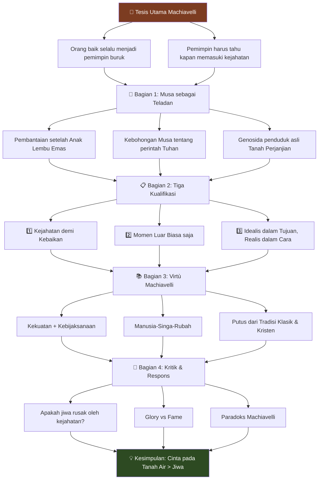
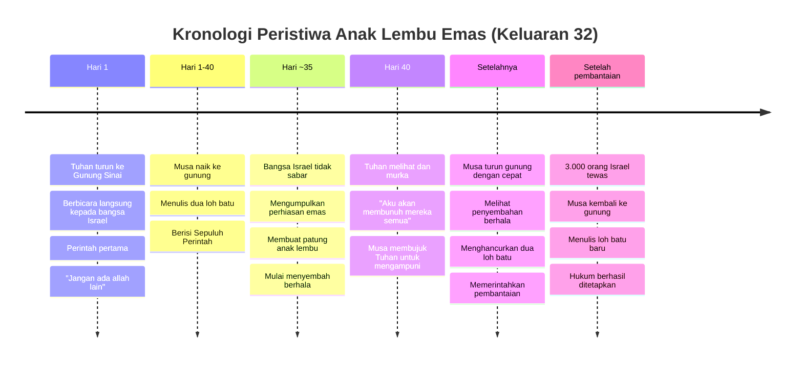
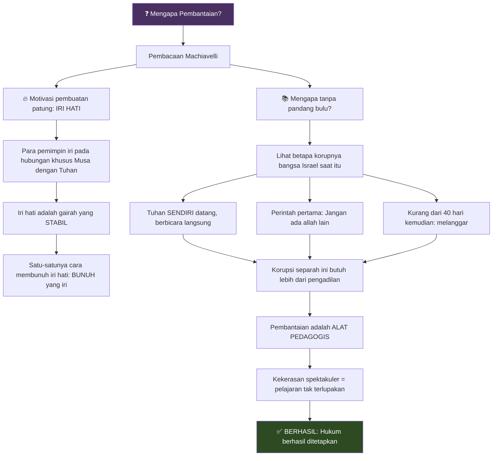
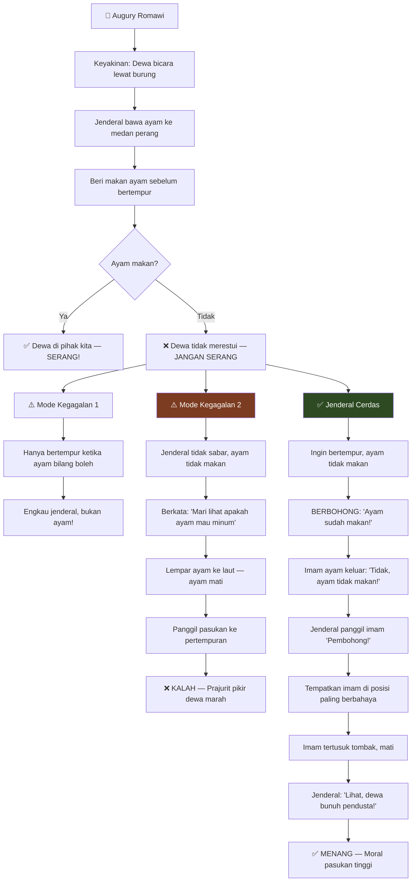
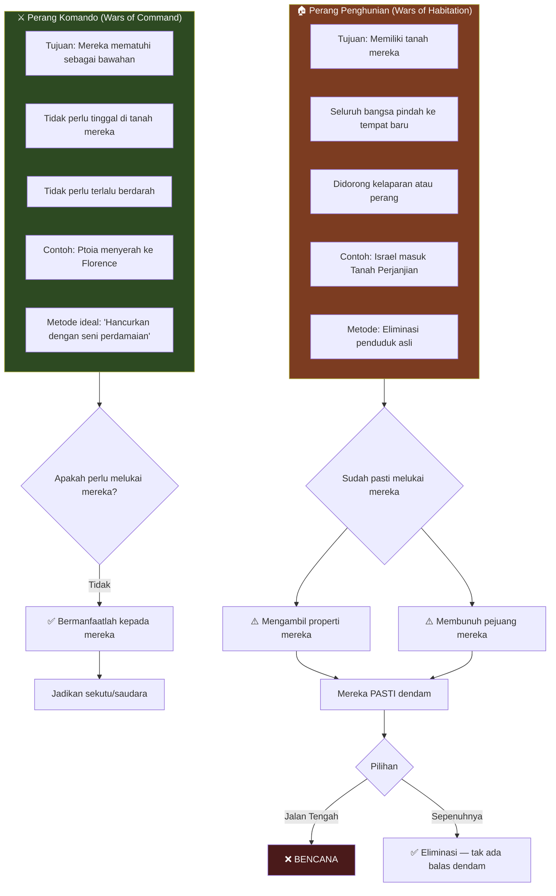
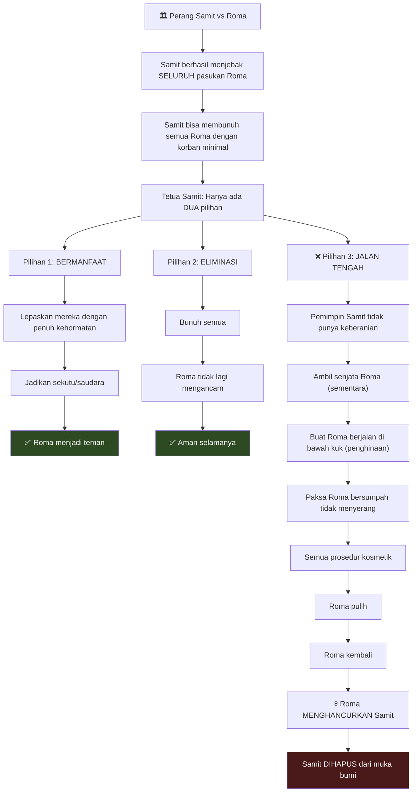
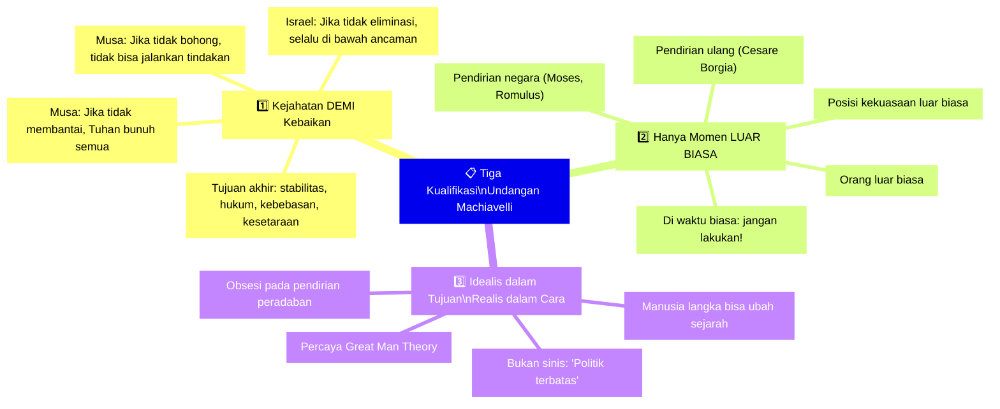
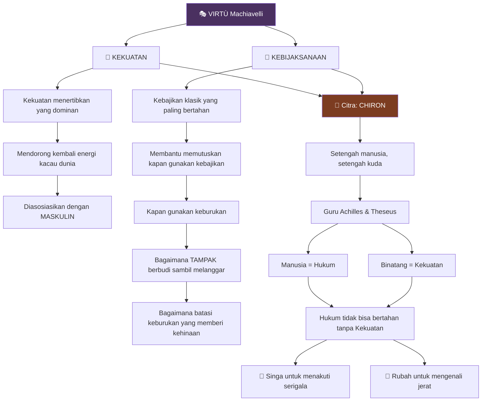
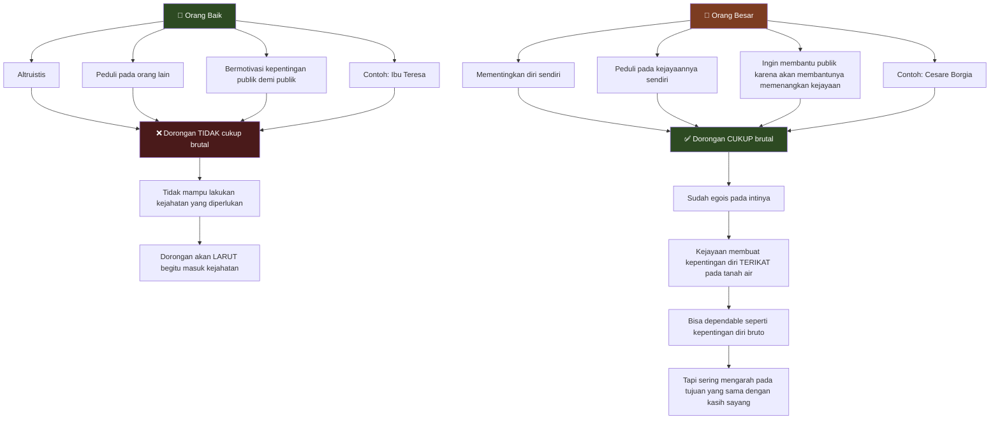
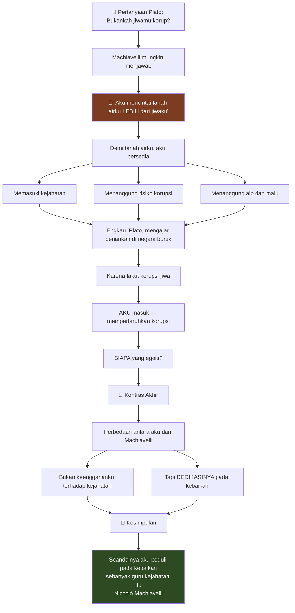

## Pembukaan: Skandal yang Tak Terbantahkan 🔥

> *"Musa memerintahkan pembantaian, lalu berbohong tentangnya. Ia berkata, 'Tuhan menyuruhku melakukannya.' Begitulah Sepuluh Perintah Allah ditetapkan."*

Kalimat pembuka ini mungkin mengejutkan — bahkan menyinggung — banyak orang. Bagaimana mungkin Musa, nabi terbesar dalam tradisi Yahudi, salah satu nabi teragung dalam tradisi Kristen, dan figur yang berdiri di samping Yesus dalam Transfigurasi (*Transfiguration*) — bagaimana mungkin ia dijadikan **teladan utama** untuk "memasuki kejahatan"?

Selamat datang di dunia **Niccolò Machiavelli** — pemikir Italia abad ke-16 yang namanya telah menjadi sinonim dengan kelicikan, manipulasi, dan politik tanpa moral. Kata "Machiavellian" (*Makiavelis*) dalam bahasa Inggris berarti licik, tidak bermoral, manipulatif.

Tapi apakah itu gambaran yang akurat?

<Callout type="warning" title="⚠️ Peringatan Konten">
Artikel ini membahas interpretasi filosofis-politik tentang teks-teks keagamaan dan sejarah. Pembahasan ini bersifat **akademis dan kritis**, bukan teologis. Tujuannya adalah memahami argumen Machiavelli, bukan mendukung atau menolak posisi keagamaan tertentu.
</Callout>

Dalam kuliah mendalam ini — yang diadaptasi dari presentasi Jonathan Bi — kita akan menjelajahi **undangan Machiavelli untuk memasuki kejahatan** (*entering into evil*). Kita akan melihat mengapa ia memilih Musa sebagai teladan, apa yang ia maksud dengan "kejahatan yang digunakan dengan baik" (*cruelty well-used*), dan mengapa — pada akhirnya — pemikir yang disebut "guru kejahatan" ini mungkin lebih peduli pada kebaikan daripada kebanyakan dari kita.

---

## Peta Besar: Struktur Argumen Machiavelli 🗺️

Sebelum menyelam lebih dalam, mari kita lihat struktur keseluruhan argumen yang akan kita jelajahi:

---

## Bagian 1: Musa — Teladan "Memasuki Kejahatan" 📖

### Mengapa Musa? Bukankah Ini Penghujatan?

Ketika kita memikirkan Musa, kita berpikir: **baik**, jujur, rendah hati, penuh kasih, murah hati. Ketika kita memikirkan Machiavelli, kita berpikir: **jahat**, menipu, sombong, egois.

Bagaimana mungkin Musa menjadi teladan Machiavelli untuk "memasuki kejahatan" — padahal ia adalah **pemberi hukum** itu sendiri? Ia menetapkan Sepuluh Perintah Allah!

Machiavelli menjawab: **"Lihatlah lebih cermat bagaimana Musa menetapkan Sepuluh Perintah itu."**

<Callout type="quote" title="📜 Machiavelli dalam 'Discourses on Livy'">
*"Siapapun yang membaca Alkitab dengan seksama akan melihat bahwa karena ia ingin hukum-hukum dan perintah-perintahnya berlanjut, Musa **dipaksa membunuh orang-orang tak terhitung** yang tidak didorong oleh apa pun selain iri hati menentang rencana-rencananya."*
</Callout>

### Kisah Anak Lembu Emas (Keluaran 32) 🐂

Mari kita telusuri kisahnya dengan cermat:

#### Apa yang Terjadi?

1. **Tuhan sendiri** turun dalam guntur, kilat, api, dan trompet
2. **Berbicara langsung** kepada bangsa Israel: "Jangan ada allah lain di hadapan-Ku"
3. Musa naik gunung **40 hari** untuk menulis Sepuluh Perintah
4. Bangsa Israel **tidak sabar** — membuat patung anak lembu emas
5. **Kurang dari 40 hari** setelah mendengar langsung dari Tuhan, mereka sudah **melanggar perintah pertama**

Tuhan murka dan berkata kepada Musa: *"Aku akan membunuh mereka semua kecuali engkau, dan dari engkau Aku akan membuat bangsa besar."* Tuhan hendak menjadikan Musa sebagai **Nuh kedua** — memulai dari awal.

Musa bernegosiasi dengan Tuhan: *"Apakah Engkau melakukan semua itu hanya untuk membunuh kami di sini? Apakah Engkau lupa perjanjian-Mu dengan Abraham?"*

Tuhan **mengalah**.

Musa segera turun gunung...

### Pembantaian yang Diperintahkan Musa ⚔️

Inilah yang Musa katakan kepada orang-orang Lewi — salah satu kelompok yang tidak ikut menyembah berhala:

<Callout type="danger" title="📖 Keluaran 32:27">
*"Beginilah firman TUHAN, Allah Israel: Ikatlah masing-masing pedangmu pada pinggangmu, berjalanlah kian ke mari melalui perkemahan dari pintu gerbang ke pintu gerbang, dan bunuhlah masing-masing saudaramu, temanmu, dan tetanggamu."*
</Callout>

Musa memerintahkan **pembantaian tanpa pandang bulu** (*indiscriminate massacre*). Kita diberitahu bahwa **3.000 orang Israel** tewas hari itu.

Dan **inilah** tindakan yang membuat Machiavelli mengangkat Musa sebagai pemimpin politik sejati. Segala hal lain — membelah Laut Merah, mukjizat, berkomunikasi dengan Tuhan — itu hanya membuatnya **nabi**. Ia memiliki otoritas religius.

**Tapi itu tidak cukup untuk menjadi pemimpin besar.**

Untuk menjadi pemimpin besar, engkau harus menjadi **nabi bersenjata** (*armed prophet*).

<Callout type="important" title="⚔️ Nabi Bersenjata vs Nabi Tak Bersenjata">
Machiavelli dalam *The Prince* (*Il Principe*):

*"Semua nabi bersenjata menang, dan yang tak bersenjata hancur. Karena ketika rakyat tidak lagi percaya, seseorang harus bisa membuat mereka percaya **dengan kekuatan**. Musa, Cyrus, Theseus, dan Romulus tidak akan mampu membuat rakyat mereka mematuhi konstitusi mereka dalam waktu lama **jika mereka tidak bersenjata**."*
</Callout>

### Mengapa Pembantaian Diperlukan? 🤔

Mengapa Musa perlu memerintahkan pembantaian? Mengapa tidak mengadakan pengadilan yang adil?

Machiavelli berargumen bahwa **kekejaman, jika digunakan dengan presisi dan secara spektakuler, adalah alat pedagogis yang efektif** — kadang satu-satunya yang berhasil.

Pikirkan betapa korupnya bangsa Israel saat itu: Tuhan sendiri muncul, berbicara langsung kepada mereka "Jangan ada berhala" — dan kurang dari 40 hari kemudian, mereka melakukan hal pertama yang dilarang-Nya.

> *"Kegaanasan spektakel ini membuat rakyat sekaligus **puas** dan **terpana**."*
> — Machiavelli

Dan **berhasil**. Musa naik lagi, berkomunikasi dengan Tuhan, turun dengan loh batu baru, dan **berhasil menetapkan hukum**.

---

## Skandal yang Lebih Besar: Musa Berbohong 🤥

Tapi tunggu — ini baru bagian yang lebih kontroversial.

**Musa berbohong ketika memberikan perintah itu.**

Perhatikan baik-baik Keluaran 32:27: *"Dan Musa berkata kepada mereka, '**Beginilah firman TUHAN**, Allah Israel...'"*

Ada yang aneh di sini. Hampir setiap contoh lain dalam Keluaran, kita memiliki Alkitab yang menarasikan: *"Beginilah **TUHAN berfirman**."* Alkitab langsung mengatakan, "Tuhan berkata ini."

Ini adalah salah satu dari sedikit contoh di mana dikatakan **"Musa berkata bahwa Tuhan berkata ini."**

<Callout type="warning" title="🔍 Bukti Kebohongan Musa">
**Bukti 1: Formulasi aneh**
- Biasanya: "Beginilah TUHAN berfirman" (narasi Alkitab)
- Di sini: "Musa berkata: Beginilah firman TUHAN" (Musa mengklaim)

**Bukti 2: Tidak ada waktu**
- Kita diberitahu: segera setelah Tuhan mengalah, Musa **cepat turun gunung**
- Kapan Tuhan sempat memberikan perintah ini?

**Bukti 3: Hukuman ganda**
- Setelah pembantaian, Musa kembali ke Tuhan
- Tuhan **mengirimkan tulah** kepada bangsa itu (Keluaran 32:35)
- *"TUHAN menulahi bangsa itu karena mereka membuat anak lembu"*
- Jika pembantaian Lewi adalah kehendak Tuhan, mengapa ada **hukuman ganda**?
</Callout>

Machiavelli sendiri hanya mengisyaratkan ini, tetapi sarjana Machiavelli Maurizio Viroli menunjukkannya dengan jelas — dan begitu engkau melihatnya, engkau tidak bisa tidak melihatnya.

> *"Seseorang tidak seharusnya membahas Musa seolah-olah ia hanyalah **pelaksana** hal-hal yang telah diperintahkan kepadanya oleh Tuhan."*
> — Machiavelli, *Discourses*

### Berbohong tentang Agama: Pelajaran dari Para Jenderal Romawi 🦅

Machiavelli akan memuji **berbohong tentang agama, tentang Tuhan, tentang hal-hal tertinggi** — berulang kali pada jenderal-jenderal Romawi, terutama ketika menyangkut **augury** (*augurium*) — kepercayaan Romawi bahwa dewa mengekspresikan kehendak mereka melalui perilaku burung.

**Jenderal cerdas** menjaga **penampilan kesalehan** sambil melakukan apa yang **perlu secara politik**.

Dan begitu juga Musa. Di satu sisi, Musa tidak secara terang-terangan tidak saleh — bayangkan jika ia memerintahkan pembantaian atas namanya sendiri: *"Aku ingin kalian membunuh saudara-saudara kalian atas namaku."* Itu tidak akan berhasil. Ia akan kehilangan semua kredibilitas.

Tapi Musa juga tidak terlalu "berharga" tentang kesalehannya sehingga ia tidak mau berbohong untuk melakukan apa yang perlu.

<Callout type="info" title="💡 Pelajaran Machiavelli tentang Agama">
*"Agama adalah kekuatan terkuat untuk membenarkan perbuatan-perbuatan yang sulit ditetapkan — dan penguasa yang bijak harus tahu bagaimana **memelintirnya** jika perlu."*
</Callout>

### Apa Moral Ceritanya?

Apakah Tuhan **menyangkal** Musa? Apakah Yesus dalam Transfigurasi-nya berkata, "Aku tidak mau diasosiasikan dengan pembohong ini"?

**Tidak.** Musa tetap dipeluk. Ia tetap tanpa cela — **karena ia melakukan apa yang perlu**.

> *"Fondasi etis pandangan dunia Yahudi-Kristen — Sepuluh Perintah itu sendiri — adalah **pembunuhan pendiri yang disembunyikan oleh kebohongan**."*

---

## Genosida Tanah Perjanjian: Skandal Lebih Besar Lagi 🏚️

Tapi kita masih baru "dipermudah masuk" ke pemikiran Machiavelli. Karena menjadi **jauh lebih skandalus** ketika kita bicara tentang fondasi Israel itu sendiri.

Maju cepat dalam cerita: Bangsa Israel tiba di Tanah Perjanjian. Masalah kecil: **ada orang-orang di Tanah Perjanjian**. Ada penduduk asli.

Musa — sebelum ia meninggal — memberitahu bangsa Israel apa kebijakan mereka terhadap penduduk asli:

<Callout type="danger" title="📖 Ulangan 20:16-17">
*"Tetapi dari kota-kota bangsa-bangsa ini yang diberikan TUHAN, Allahmu, kepadamu menjadi milik pusakamu, **janganlah kaubiarkan hidup apapun yang bernafas**. Melainkan haruslah kautumpas mereka sama sekali."*
</Callout>

Ini bukan kebijakan yang berhasil diikuti sepenuhnya oleh bangsa Israel, tetapi **itulah kebijakannya**.

Dan untuk memberi gambaran tentang brutalitasnya, Machiavelli mengutip Kitab Yosua dan salah satu penaklukan kota-kota awal bernama Ai:

> *"Segala yang jatuh pada hari itu, baik laki-laki maupun perempuan, adalah 12.000 — semua orang Ai. Karena Yosua tidak menarik tangannya yang mengacungkan tombak sampai ia telah **sepenuhnya menghancurkan semua penduduk Ai**."*
> — Yosua 8:25-26

Dan ini adalah kebijakannya:

> *"Demikianlah Yosua memukul kalahkan seluruh negeri itu... ia **tidak membiarkan seorangpun yang lolos**, melainkan menumpas semua yang bernafas, seperti yang diperintahkan TUHAN."*
> — Yosua 10:40

**Genosida penduduk asli.**

Dan ini juga, Machiavelli berargumen, adalah **berbudi** (*virtuous*).

---

## Dua Jenis Perang: Perang Komando vs Perang Penghunian ⚔️

Bagaimana mungkin Machiavelli membenarkan ini?

Dalam *Discourses* Bab 28, Machiavelli membedakan dua jenis perang:

### Logika Kejam tapi Konsisten

Machiavelli berkata bahwa dalam **Perang Komando**, engkau tidak perlu melukai mereka. Engkau tidak perlu mengambil properti mereka. Engkau bahkan mungkin tidak perlu melucuti senjata mereka. Mungkin satu tindakan kekuatan yang terisolasi sudah cukup. Dalam hal ini, engkau harus **bermanfaat** bagi mereka — jadikan mereka teman, semanusiawi mungkin.

**Tapi Perang Penghunian berbeda.**

Secara definisi, engkau akan melukai penduduk asli — engkau mengambil **semua properti mereka**, dan karena itu, engkau mungkin perlu membunuh semua pejuang mereka.

Kita modern masuk dan berkata: *"Oke, tapi berhenti di situ. Tinggalkan warga sipil. Itu aturan perang."*

<Callout type="warning" title="🤔 Respons Machiavelli kepada Kita">
"Oke, mari kita mainkan ini. Engkau sudah melukai penduduk asli, tapi **tidak cukup** sehingga engkau tidak takut pembalasan dari mereka.

Engkau mengambil properti mereka. Engkau membunuh pejuang mereka. Tapi siapa pejuang itu?

Mereka adalah **ayah, anak, cucu, paman, keponakan, suami** dari warga sipil yang baru saja kau bebaskan.

Apa menurutmu yang akan mereka lakukan? Menurutmu mereka akan berterima kasih atas kemurahan hatimu?

**Mereka akan membencimu selamanya.** Apakah engkau tidak berpikir para wanita itu akan menjadikannya utang mereka sendiri untuk membakar ke dalam pikiran anak-anak dan cucu-cucu mereka untuk **menghancurkanmu** begitu mereka punya kesempatan?

Jika engkau tidak berpikir demikian, itu **fantasi**."
</Callout>

Poin Machiavelli: jika engkau tidak mengeliminasi mereka sekarang, **rakyatmu akan membayar harganya di masa depan** ketika mereka tak terhindarkan mencari balas dendam.

### Tragedi Samit: Pelajaran "Jalan Tengah" 📚

Machiavelli menceritakan kisah bangsa **Samit** (*Samnites*) — salah satu suku rival Romawi.

> *"Orang harus diperlakukan dengan baik atau dieliminasi — karena mereka membalas dendam untuk luka ringan tetapi tidak bisa melakukannya untuk luka berat. Jadi luka yang engkau berikan kepada seseorang harus sedemikian rupa sehingga engkau **tidak perlu takut pembalasan**."*
> — Machiavelli, *The Prince*

---

## Kualifikasi: Machiavelli Bukan Guru Kejahatan Murni 📋

Machiavelli tahu semua kata-kata buruk yang ingin engkau sebut kepadanya — penjahat, iblis, guru kejahatan — dan ia mendahului ini:

<Callout type="quote" title="📜 Machiavelli dalam 'Discourses'">
*"Cara-cara ini sangat kejam dan musuh bagi setiap cara hidup, tidak hanya Kristen, tetapi juga manusiawi, dan setiap orang seharusnya melarikan diri dari mereka dan lebih memilih hidup sebagai warga biasa daripada sebagai raja dengan begitu banyak kehancuran bagi manusia.*

*Meskipun demikian, ia yang tidak ingin mengambil jalan pertama kebaikan ini **harus memasuki yang jahat ini** jika ia ingin mempertahankan dirinya."*
</Callout>

Machiavelli **tidak menyukai** ide eliminasi lebih dari engkau. Ia bukan guru kejahatan yang haus darah. Ia memberitahumu: **ini adalah hasil realistis**.

Sekarang mari kita tambahkan **tiga kualifikasi penting** untuk memahami undangannya ke dalam kejahatan:

### Kualifikasi 1: Kejahatan Demi Kebaikan 🎯

Setiap jenis kejahatan hanya dibenarkan jika **melayani kebaikan yang lebih besar**.

- Jika Musa tidak membantai → Tuhan akan membunuh mereka semua
- Jika Musa tidak berbohong → ia tidak bisa menjalankan tindakannya
- Jika Israel tidak mengejar eliminasi → Israel selalu di bawah ancaman eksistensial

Dan yang lebih kuat lagi: **konsepsi Machiavelli tentang kebaikan tidak terlalu berbeda dari konsepsi kita sebagai modern**.

Ia menginginkan masyarakat yang:
- Stabil ✅
- Terlindungi ✅  
- Bisa bertahan ✅
- Memiliki aturan hukum ✅
- Memiliki kebebasan ✅
- Radikal egaliter untuk zamannya ✅

**Inilah yang membuat Machiavelli layak diperhatikan.** Karena jika ia hanya guru yang mengajar tiran bagaimana merebut kekuasaan, itu tidak menarik — kita tinggal tidak setuju dengan tujuannya.

Tapi justru karena tujuan kita adalah tujuan Machiavelli, kita **harus** membacanya sebagai kritik terhadap cara kita mendekati politik.

<Callout type="important" title="🎯 Perbedaan Utama dengan Machiavelli">
Perbedaan utama antara kita dan Machiavelli **bukan** pada tujuan apa yang baik bagi negara.

Perbedaannya adalah pada **cara apa yang diperlukan** untuk mencapainya.

Machiavelli berkata: *"Engkau pikir hukum internasional, hak asasi manusia, diskusi sipil, aktivisme, pembangkangan sipil — akan menetapkan perdamaian, kesetaraan, kebebasan, negara, aturan hukummu?* ***Pikirkan lagi.***"
</Callout>

### Kualifikasi 2: Momen Luar Biasa Saja 🌟

Jika engkau sudah hidup di negara yang tertib dan penuh hukum — negara bebas — **tanpa krisis** — jangan lakukan semua ini!

Engkau tidak perlu berbohong. Engkau tidak perlu memerintahkan pembantaian. Kejahatan tidak hanya tidak bisa dimaafkan dan tidak perlu — ia benar-benar **jahat**.

Dan bahkan jika engkau hidup di negara yang tidak tertib, **engkau mungkin bukan orang yang tepat untuk melakukan ini**.

Karya Machiavelli harus ditafsirkan sebagai **terbatas pada**:
- **Waktu luar biasa** (pendirian, krisis)
- **Orang luar biasa** (great men)
- **Posisi kekuasaan luar biasa**

Musa memerintahkan pembantaian Lewi **dengan otoritas Tuhan** — itu berbeda rasanya dengan sembarang orang Israel yang berlari-lari di perkemahan membunuh orang.

#### Paradoks Machiavelli dalam Hidupnya Sendiri 🤔

Kualifikasi ini diperlukan untuk memahami **kehidupan Machiavelli sendiri**.

Machiavelli lahir di Italia yang sangat terpecah. Sebelum pengasingannya, ia adalah **pelayan publik** di Florence asalnya — duta besar, pemimpin militer, politisi.

Pertanyaan alami: **Apakah Machiavelli menjalankan politik dengan cara Machiavellian?**

**Tidak.** Bahkan sebaliknya.

Menurut semua catatan, ia adalah pelayan publik yang **sangat setia dan bermoral tinggi** yang mendedikasikan jiwanya untuk Florence — di masa yang sangat korup di mana **tidak mengambil suap** hampir lebih aneh daripada mengambilnya.

Kita tidak punya bukti apapun bahwa ia mengambil suap — itulah mengapa ia berakhir di pengasingan dalam kemiskinan relatif.

> **Paradoks Machiavelli:**
> Kebanyakan orang menulis tentang betapa baiknya engkau seharusnya dalam politik — lalu mereka benar-benar bajingan dalam kehidupan politik aktual mereka.
>
> Machiavelli menulis tentang betapa jahatnya engkau seharusnya dalam politik — lalu ia menjadi pelayan publik paling bermoral dan setia.

**Mengapa ini?**

Karena meskipun Italia saat itu mungkin membutuhkan Cesare Borgia untuk menyatukannya, dan meskipun Machiavelli adalah orang luar biasa — ia **tidak berada di posisi kekuasaan luar biasa**.

Oleh karena itu, ia harus terlibat dalam politik dengan **mode biasa**.

### Kualifikasi 3: Idealis dalam Tujuan, Realis dalam Cara 💭

Tapi jika 99% waktu, 99% dari kita harus terlibat dalam mode "baik" politik — aturan hukum, diskusi publik — **mengapa semua bukunya tentang kasus paling luar biasa?**

Di sinilah kita perlu kualifikasi ketiga: berlawanan dengan persepsi populer sebagai seorang "realis", Machiavelli juga **idealis**.

Ia ingin membantu pangeran mencapai tugas paling **idealistis, agung, tampaknya mustahil** yang bisa dibayangkan manusia:
- **Pendirian negara** 🏛️
- **Pendirian peradaban** 🌍
- **Pendirian agama** 🕊️

Bandingkan dengan realis sinis biasa: *"Engkau tidak bisa mereformasi kesehatan. Kita tidak bisa menyelesaikan apa pun. Politik terbatas. Mari kita urus taman sendiri saja."*

Itu **kebalikan** dari Machiavelli.

<Callout type="info" title="🦸 Teori Great Man dalam Sejarah">
Machiavelli percaya pada **Teori Great Man** (*Great Man Theory*) dalam sejarah:

*"Pria-pria langka dan menakjubkan bisa bangkit di waktu-waktu luar biasa dan sepenuhnya **mengubah arah peristiwa**."*

Inilah mengapa Machiavelli begitu terobsesi dengan **pendirian dan pendirian ulang**:
- Musa dan pendirian Israel
- Romulus dan pendirian Roma
- Cesare Borgia dan upaya penyatuan Italia
</Callout>

Secara longgar kita bisa katakan: Machiavelli adalah **idealis dalam tujuan** tapi **realis dalam cara**.

Dan justru **ketegangan itu** yang membuat karyanya begitu berdarah. Justru ketika engkau ingin benar-benar menetapkan tatanan yang **radikal berbeda** — engkau perlu memecahkan banyak telur.

---

## Bagian 3: Virtù Machiavelli — Putus dari Tradisi 📚

### Makna Baru "Kebajikan"

Jika engkau membaca Machiavelli tepat setelah membaca Plato, Aristoteles, atau bahkan orang Kristen — engkau akan mengalami **whiplash** setiap kali ia menggunakan kata "kebajikan" (*virtù*) — karena maknanya telah sepenuhnya berubah.

<Callout type="quote" title="📜 Machiavelli tentang Virtù dan Fortuna">
*"Fortuna menunjukkan kekuasaannya di mana tidak ada kebajikan yang terorganisir untuk melawannya. Ia mengarahkan serangannya ke tempat-tempat di mana tanggul dan bendungan belum dibangun untuk menahannya.*

*Jadi lebih baik menjadi **impetuous** daripada hati-hati — karena fortuna adalah **wanita**, dan perlu, jika seseorang ingin menaklukkannya, untuk **memukulnya dan menyerangnya**.*

*Dan seseorang melihat bahwa ia membiarkan dirinya ditaklukkan lebih oleh yang impetuous daripada mereka yang melanjutkan dengan dingin. Dan karena itu, selalu seperti wanita, ia adalah teman yang **muda** — karena mereka kurang hati-hati, lebih ganas, dan memerintahnya dengan lebih berani."*
</Callout>

Machiavelli memberi kita dua metafora mencolok untuk memikirkan kebajikan: **banjir** 🌊 dan... well, mari kita katakan "penaklukan agresif" 😬.

### Manusia-Singa-Rubah 🦁🦊

> *"Karena pangeran dipaksa oleh keharusan untuk tahu bagaimana menggunakan binatang, ia harus memilih **rubah dan singa**. Seseorang perlu menjadi rubah untuk mengenali jerat dan singa untuk menakuti serigala."*
> — Machiavelli, *The Prince*

- **Singa** = Kekuatan mentah, kuasa
- **Rubah** = Kelicikan, kebijaksanaan
- **Manusia** = Hukum, tatanan

**Virtù** adalah kekuatan menertibkan yang dipandu oleh kebijaksanaan.

### Kebalikan dari Virtù: Effeminacy 😓

Kebalikan dari kebajikan bagi Machiavelli bukan lagi **keburukan** (*vice*). Kebalikannya menjadi **effeminacy** (*efeminasi*) — kurang dalam kebajikan jantan ini dan secara tak berdaya didorong-dorong oleh fortuna.

<Callout type="warning" title="⚠️ Hal Terburuk bagi Machiavelli">
*"Hal terburuk yang bisa engkau jadi bagi Machiavelli adalah **effeminate** — kurang dalam kebajikan jantan ini dan secara tak berdaya didorong-dorong oleh fortuna."*
</Callout>

### Putus Total dari Tradisi Kristen ✝️

Dengan citra itu, engkau sudah bisa mulai menghargai betapa jauhnya kita dari tradisi Kristen yang datang tepat sebelumnya.

| Aspek | Tradisi Kristen | Machiavelli |
|-------|-----------------|-------------|
| **Sifat manusia** | Setengah manusia, setengah **Tuhan** | Setengah manusia, setengah **binatang** |
| **Bagian yang harus dikuasai** | Bagian **ilahi** | Bagian **hewani** |
| **Kebajikan tertinggi** | Kerendahan hati, kasih, pengampunan | Kekuatan, kelicikan, keberanian |
| **Tujuan** | Keselamatan jiwa | Kejayaan fana |

> *"Tidak perlu bagi seorang pangeran untuk memiliki semua kebajikan, tetapi memang **perlu tampak memilikinya**. Bahkan, aku berani mengatakan ini: dengan memilikinya dan selalu mengamatinya, mereka berbahaya. Dan dengan **tampak memilikinya**, mereka berguna."*
> — Machiavelli

---

## Bagian 4: Kritik dan Respons 🤔

### Pertanyaan Plato: Bukankah Jiwamu Rusak?

Mari kita katakan aku setuju dengan Machiavelli tentang semua yang ia katakan tentang realitas politik — yaitu, cara apa yang diperlukan untuk tujuan apa.

Seseorang tetap harus bertanya: **Apakah itu sepadan?**

Apa konsekuensinya bagi **karakterku, jiwaku** — untuk memasuki kejahatan dengan cara ini?

Dalam dialog *Gorgias*, Plato mengajukan pertanyaan serupa: **Apakah engkau ingin melakukan ketidakadilan atau menderita ketidakadilan?** Apakah engkau ingin membunuh atau dibunuh?

Jawaban yang benar bagi Plato: engkau ingin **menderita** ketidakadilan. Mengapa? Karena **melakukan** ketidakadilan merusak jiwamu secara langsung. Tapi menderita ketidakadilan tidak harus — karena engkau tidak melakukan apa pun. Jika engkau meresponsnya dengan berbudi luhur, jiwamu tidak tersentuh.

<Callout type="question" title="❓ Tantangan Plato kepada Machiavelli">
*"Engkau berbicara begitu banyak tentang keharusan kelangsungan hidup manusia, tapi engkau belum banyak berpikir tentang **apa dalam diri manusia yang layak bertahan**.*

*Apa gunanya jika setelah pembantaian dan genosidamu, engkau memerintah kota abu dengan **hati yang dingin seperti batu**?*

*Apa gunanya jika engkau harus mengevaluasi teman-temanmu, keluargamu dengan cara yang dingin dan kalkulatif ini?*

*Bukankah itu kehidupan yang teralienasi — **lebih buruk dari kematian**?*

*Bukankah ada lebih, Machiavelli, dalam hidup daripada sekadar kekuasaan, kejayaan, kelangsungan hidup?"*
</Callout>

### Respons Machiavelli #1: Ada Lebih dalam Hidup — tapi Bukan Kehidupan Politik

Machiavelli adalah **pencinta kehidupan yang besar**. Ia menulis beberapa komedi Italia terbaik di masa-masa tergelap dalam hidupnya. Ia mencintai teman-temannya dan bermain kartu dengan mereka. Ia mencintai pakaian bagus, anggur, makanan lezat, wanita cantik (yang terakhir ini mungkin terlalu banyak 😅).

Dan Machiavelli jelas **peka terhadap kegembiraan kehidupan kontemplatif**.

<Callout type="quote" title="📜 Surat Pribadi Machiavelli kepada Temannya">
*"Ketika malam tiba, aku kembali ke rumahku dan masuk ke ruang kerjaku. Di ambang pintu, aku menanggalkan pakaian sehari-hari yang penuh lumpur dan kotoran, dan aku mengenakan jubah kerajaan dan istana.*

*Berpakaian dengan lebih pantas, aku memasuki istana-istana kuno para lelaki kuno. Disambut oleh mereka dengan ramah, aku **mencicipi makanan** yang hanya milikku dan untuk mana aku dilahirkan.*

*Di sana aku tidak malu berbicara kepada mereka, bertanya kepada mereka tentang alasan tindakan-tindakan mereka — dan mereka, dalam kemanusiaan mereka, menjawabku.*

*Dan selama 4 jam aku tidak merasakan kebosanan. Aku menyingkirkan setiap penderitaan. Aku tidak lagi merasa kemiskinan, juga aku tidak gemetar memikirkan kematian.*

*Aku menjadi **sepenuhnya bagian dari mereka**."*
</Callout>

Ini adalah catatan paling mengharukan tentang kehidupan kontemplatif yang pernah aku baca — **dan itu dari Machiavelli**.

Jadi ya, Machiavelli akan berkata ada **jauh lebih banyak** dalam hidup, Plato, daripada sekadar kelangsungan hidup, kejayaan, berpolitik...

**Tapi bukan kehidupan politik.**

Kehidupan politik seharusnya hanya fokus pada mendapatkan **dasar-dasar**: stabilitas, tatanan, aturan hukum, kebebasan, kesetaraan.

Karena ketika engkau mencoba menggabungkan ideal-ideal yang lebih tinggi dengan kehidupan politik — engkau akan **menghancurkan keduanya**.

### Respons Machiavelli #2: Jiwa Tidak Rusak oleh Kejahatan yang Diperlukan

Mengenai masalah kedua — bukankah jiwamu dirusak oleh melakukan ketidakadilan?

Machiavelli akan berkata: **tidak jelas** bahwa jiwaku dirusak jika aku melakukan **kejahatan yang diperlukan**. Karena itu perlu.

Engkau tentu tidak akan mengatakan, Plato, bahwa raja-filosofmu **selamanya trauma** karena melaksanakan pembunuhan massal dalam pendirian Callipolis (*kota ideal*). Mengapa? **Karena itu adalah hal yang benar untuk dilakukan.** Itu adalah hal yang sulit untuk dilakukan.

Dan ini adalah psikologi nyata. **Harry Truman**, setelah menjatuhkan dua nuklir pada warga sipil, berkata berkali-kali dalam wawancara bahwa ia **tidak pernah kehilangan satu malam tidur pun** karenanya.

Mengapa? Karena baginya, itulah **kalkulasi yang benar**. Ia perlu membawa anak-anak itu pulang. Dalam pikirannya, ia tidak melakukan hal yang salah.

> *"Membaca karyaku adalah persis bagaimana engkau **tidak** melukai jiwamu — karena karyaku memberitahumu bahwa kejahatan yang harus engkau lakukan adalah **perlu**."*
> — (Respons Machiavelli yang dibayangkan)

### Respons Machiavelli #3: Bukan Orang Baik, tapi Orang Besar 🦅

Tapi pada akhirnya, aku pikir Machiavelli akan mengakui kesulitan melakukan semua tindakan jahat ini dan tidak memiliki noda pada jiwamu.

<Callout type="danger" title="📜 Machiavelli tentang Dilema Pendiri">
*"Karena penataan ulang kota untuk kehidupan politik mensyaratkan **orang baik**, dan menjadi pangeran republik dengan kekerasan mensyaratkan **orang jahat**, sangat jarang terjadi bahwa seseorang yang baik ingin menjadi pangeran dengan cara buruk — meskipun tujuannya baik.*

*Dan sangat jarang bahwa seseorang yang jahat, setelah menjadi pangeran, ingin bekerja dengan baik — dan bahwa ia akan pernah terpikirkan untuk menggunakan dengan baik otoritas yang telah ia peroleh dengan buruk."*
</Callout>

Ini masalah besar. Jika kejahatan untuk kebaikan, dan engkau baru saja memberitahuku bahwa **sangat jarang** orang baik bisa bertahan melewati ini — itu masalah serius.

**Inilah mengapa Machiavelli tidak menulis untuk mengajar orang baik — tapi orang besar.**

<Callout type="important" title="💡 Wawasan Kunci Machiavelli">
**Altruisme, semangat publik, kasih sayang** — dorongan-dorongan ini **tidak cukup brutal dan kuat** untuk melakukan semua kejahatan yang diperlukan untuk pendirian politik.

Dan mereka begitu **rapuh** sehingga akan larut begitu engkau memasuki kejahatan.

**Tapi hasrat akan kejayaan** — itu sudah **egois pada intinya**. Ini mengapa ia bisa dependable seperti kepentingan diri bruto, tapi sering mengarah pada tujuan yang sama dengan kasih sayang publik.
</Callout>

### Glory vs Fame: Perbedaan Penting 🏆

Tapi tunggu — jika semua tentang kejayaan di dasar, bukankah ada jalan yang **jauh lebih mudah** menuju kejayaan?

**Jalan Machiavelli sendiri.**

Machiavelli lebih berjaya daripada kapten manapun di zamannya. Plato memiliki lebih banyak kejayaan sekarang daripada Theseus.

Jika semua tentang kejayaan, mengapa aku tidak mundur saja dari masyarakat, tidak berurusan dengan semua ini, dan menulis buku-bukuku untuk memenangkan kejayaan dengan cara itu?

> *"Mempelajari Machiavelli telah secara menyeluruh **meradikalisasi** aku — tapi ke arah yang **berlawanan** dari yang ia harapkan."*
> — Jonathan Bi

**Respons pertama Machiavelli:**

<Callout type="quote" title="📜 Machiavelli dalam 'Discourses'">
*"Tidak cukup untuk mengatakan, 'Aku tidak peduli pada apa pun. Aku tidak menginginkan kehormatan atau hal-hal yang berguna. Aku ingin hidup dengan tenang tanpa pertengkaran.'*

*Karena alasan-alasan ini didengar dan **tidak diterima**. Orang-orang yang memiliki kualitas tidak bisa memilih untuk abstain — bahkan ketika mereka memilihnya dengan tulus dan tanpa ambisi — karena itu tidak dipercaya tentang mereka.*

*Jadi jika mereka ingin abstain, mereka **tidak diizinkan oleh orang lain** untuk abstain."*
</Callout>

Engkau ingin pergi? Orang-orang tidak akan membiarkanmu. Mereka akan memperhatikanmu. **Engkau sudah di dalam permainan.**

**Respons lebih dalam Machiavelli:**

> *"Lihat, Jonathan, aku menulis buku-bukuku sebagai **pilihan terakhir** dalam pengasingan — setelah aku mencoba setiap cara yang mungkin secara manusiawi untuk kembali ke politik, untuk melayani Florence tercintaku.*
>
> *Karena aku **mencintai tanah airku**. Dan aku dengan senang hati akan menyerahkan kesempatan untuk menulis buku-buku ini jika aku diberi kesempatan lain dalam hidupku untuk melayani Florence.*
>
> *Inilah mengapa, Jonathan, aku menempatkan kejayaan **pendiri** — pendiri politik — di atas kejayaan **filsuf**. Merekalah yang benar-benar melakukan hal yang sulit, yang membantu rakyat mereka **dalam hidup mereka**."*

Jadi pemahamanmu tentang kejayaan, Jonathan, terbatas. Ada versi kejayaan yang Machiavelli sebut **ketenaran** (*fame*). Orang seperti Caesar, menurut Machiavelli, telah memenangkan ketenaran abadi karena melakukan hal yang **buruk** — menghancurkan republik.

Itu bukan **kejayaan sejati**.

**Kejayaan sejati** adalah pengakuan karena benar-benar telah **bermanfaat bagi republikmu, tanah airmu**.

---

## Kesimpulan: Cinta pada Tanah Air Lebih dari Jiwa 💔

Ini adalah psikologi, omong-omong, di **sisi lain** Perang Samit.

Ketika Samit mengunci Roma ke dalam lembah itu dan orang-orang Roma tahu mereka sudah tamat. Mereka berjuang — mereka akan mati dengan terhormat. Tapi bagi pikiran Roma yang bangga, berjalan di bawah kuk dan dilucuti adalah **tidak terpikirkan** — aib dan malu yang tidak termaafkan.

Jadi mereka benar-benar bingung apa yang harus dilakukan. Mereka benar-benar mempertimbangkan untuk semua mati dengan terhormat.

Tapi kemudian **akal sehat menang**:

<Callout type="quote" title="📜 Machiavelli dalam 'Discourses'">
*"Karena kehidupan Roma terdiri dari kehidupan tentara itu, tentara itu harus diselamatkan dengan cara apapun. Dan tanah air dipertahankan dengan baik dengan cara apapun seseorang mempertahankannya — baik dengan aib maupun dengan kejayaan.*

*Karena jika tentara itu menyelamatkan dirinya, Roma akan punya waktu untuk **menghapus aib**. Jika tidak menyelamatkan dirinya — meskipun mati dengan mulia — Roma dan kebebasannya akan **hilang**."*
</Callout>

**Plato salah.**

Kelanjutan yang memalukan, tidak terhormat, tidak adil — **lebih baik** daripada kehancuran yang terhormat — karena memberimu **kesempatan untuk memperbaiki yang salah**.

---

Jadi ketika aku melihat Machiavelli dan **dedikasi tanpa pamrihnya** sebagai pelayan publik...

Ketika aku membaca **jerih payahnya** — semua bukunya — dalam mendidik penebus Italia masa depan...

Ketika aku menyaksikannya **menanggung penyiksaan, pengasingan, kemiskinan, penghinaan** — dan tetap mencoba melayani Florence-nya...

Aku tidak bisa tidak melihat **seorang patriot** yang bersedia **merusak jiwanya** demi tanah airnya.

Dan ketika aku menyadari itu, apapun keangkuhan moral, apapun kata-kata buruk yang ingin aku sebut kepadanya — **jatuh ke pinggir jalan**.

Dan sebaliknya, aku ditinggalkan dengan **kekaguman dan rasa hormat**.

Karena aku menyadari bahwa perbedaan antara aku dan Machiavelli, **batas-batas moralku** dan **kekejamannya yang tampak** — bukanlah **keenggananku terhadap kejahatan**, tetapi **dedikasinya pada kebaikan**.

<Callout type="success" title="💭 Pemikiran Terakhir">
*"Dan pemikiran terakhir yang tersisa bagiku adalah:*

***Seandainya aku peduli pada kebaikan sebanyak guru kejahatan itu — Niccolò Machiavelli.***"
</Callout>

---

## Referensi & Sumber Utama 📚

<Callout type="cite" title="📖 Karya-Karya Machiavelli">
**Karya Utama:**
- **Il Principe** (*The Prince*, 1513) — Panduan untuk penguasa baru
- **Discorsi sopra la prima deca di Tito Livio** (*Discourses on Livy*, 1517) — Analisis politik republik Roma
- **Dell'arte della guerra** (*The Art of War*, 1521) — Treatise tentang strategi militer
- **Istorie fiorentine** (*Florentine Histories*, 1525) — Sejarah Florence

**Sumber Sekunder:**
- **Harvey Mansfield** — *Machiavelli's Virtue* (1996) — Analisis konsep virtù
- **Maurizio Viroli** — *Machiavelli's God* (2010) — Hubungan Machiavelli dengan agama
- **Leo Strauss** — *Thoughts on Machiavelli* (1958) — Interpretasi filosofis
- **Quentin Skinner** — *Machiavelli: A Very Short Introduction* (2000) — Pengantar singkat
</Callout>

<Callout type="info" title="🎥 Sumber Video">
Artikel ini diadaptasi dari kuliah **Jonathan Bi** berjudul *"Power Will Cost You Everything, It's Worth It"* yang tersedia di [YouTube](https://www.youtube.com/watch?v=zPKMDxVBZ8A).

Untuk eksplorasi lebih lanjut, kunjungi situs Jonathan Bi di **jonathanbi.com** untuk transkrip lengkap, catatan buku, dan wawancara dengan sarjana Machiavelli terkemuka.
</Callout>

---

*Artikel ini adalah eksplorasi akademis terhadap filsafat politik Machiavelli. Pembahasan tentang "kejahatan" dan "kekerasan" dalam konteks ini merujuk pada interpretasi filosofis teks-teks klasik, bukan advokasi untuk tindakan tidak bermoral dalam kehidupan nyata.*
