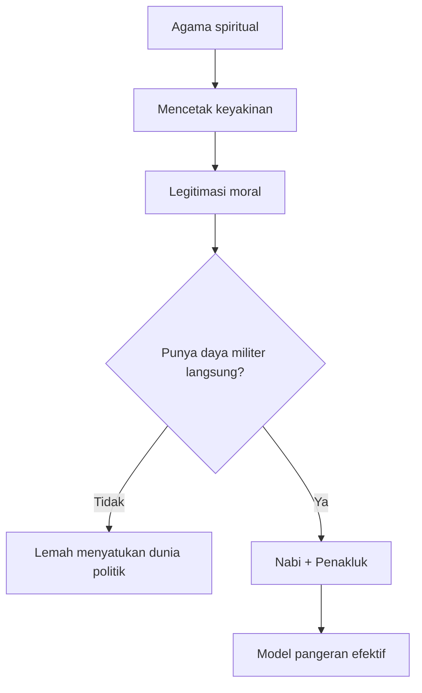
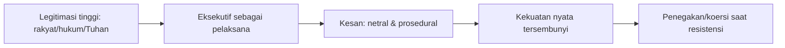

<YouTube url="https://www.youtube.com/watch?v=l21HUb4uunM" title="Why You Must Acquire Power at All Costs | Harvey Mansfield on Machiavelli" />

## 🧭 Pengantar: Judulnya Provokatif, Isinya Jauh Lebih Dalam dari Sekadar “Haus Kekuasaan”

Judul video ini memang sengaja dibuat tajam: *Why You Must Acquire Power at All Costs*. Kalau dibaca mentah, seolah ini ajakan oportunisme politik tanpa rem. Namun ketika transkripnya dibedah serius, percakapannya jauh lebih kompleks: ini adalah kuliah mini tentang **Machiavelli sebagai arsitek modernitas**—bukan sekadar “guru tipu daya politik.”

Harvey Mansfield mendorong tesis besar: modernitas seharusnya dimulai dari Machiavelli, bukan Descartes. Artinya, cara kita memahami negara, sains, eksekutif, manajemen, representasi politik, hingga “fakta” itu sendiri, punya jejak Machiavellian yang dalam.

Artikel ini merangkum dengan detail, sekaligus memberi jarak kritis agar kita tidak terjebak pada glorifikasi kekuasaan mentah. ⚖️

---

## 🎯 Tesis Utama Percakapan

Ada tiga klaim sentral dari Mansfield tentang Machiavelli:

1. **Machiavelli melawan moralitas transenden** (yang berorientasi “dunia setelah mati”) dan memusatkan politik pada dunia kini.
2. Ia mengganti orientasi politik dari **“kebaikan” (goodness)** ke **“keniscayaan” (necessity/necessità)**.
3. Ia melahirkan paradigma **effectual truth** (*verità effettuale* = kebenaran efektif), yaitu menilai sesuatu dari akibat nyatanya, bukan dari niat idealnya.

Jika tiga hal ini diterima, maka modernitas menjadi proyek **kontrol rasional dunia**: efektif, terukur, operasional—tetapi berisiko kehilangan horizon etik yang lebih tinggi.

---

## 🏛️ Bagian I — Machiavelli vs Kekristenan: “Terlalu Kejam” sekaligus “Terlalu Lemah”

Mansfield menyebut dua kritik Machiavelli terhadap Kekristenan:

- **Terlalu kejam**: menuntut manusia menjadi lebih baik dari kemampuan alaminya.
- **Terlalu lemah**: kuat secara spiritual, tapi lemah sebagai kekuatan politik-militer yang menyatukan dunia.

Ini paradoks yang penting. Jadi kritik Machiavelli bukan sekadar anti-agama, melainkan anti pada model agama yang:

- mampu membentuk keyakinan,
- namun tidak mampu mengeksekusi tata kuasa duniawi secara langsung.

### Nabi vs Penakluk

Dalam percakapan, muncul formulasi menarik:

- Kristus menaklukkan “tanpa senjata” (melalui sabda).
- Muhammad dipotret sebagai kombinasi **nabi + penakluk**.
- Machiavelli tertarik pada figur penguasa yang bisa jadi keduanya sekaligus.

Dari sini lahir figur **pangeran modern**: bukan cuma administrator, tapi produsen makna politik.

---

## ⚔️ Bagian II — Dari “Goodness” ke “Necessity”: Revolusi Diam-Diam

Salah satu titik paling penting adalah pergantian dasar etik-politik:

- Tradisi klasik/teologis: “Apa itu yang baik?”
- Machiavelli: “Apa yang **perlu** dilakukan agar tidak kalah, tidak hancur, tidak dikuasai?”

> **Necessity (necessità)** = kondisi memaksa yang menuntut tindakan efektif, bukan kontemplasi moral yang panjang.

Mansfield menekankan bahwa manusia sering “baik” karena terpaksa, bukan karena luhur. Maka politik realistis harus dibangun di atas struktur keniscayaan, bukan ilusi kebajikan universal.

### Necessity bukan cuma soal perut

Necessity di sini tidak berhenti pada survival biologis. Ia meluas ke:

- posisi sosial,
- kehormatan (honor),
- kemuliaan (glory),
- dominasi simbolik.

Itulah sebabnya orang superkaya pun terus mengakumulasi. Secara material “cukup,” secara kehormatan “belum.” 💼

---

## 🧠 Bagian III — Virtù Machiavellian: Bukan Moral Virtue Aristotelian

Dalam transkrip, *virtù* diposisikan ulang:

- bukan kebajikan jiwa yang harmonis,
- melainkan energi bertindak, daya menaklukkan kontingensi, kemampuan menguasai momentum.

> **Virtù (Machiavellian)** = kapasitas efektif untuk bertindak di bawah ketidakpastian, memaksa keadaan, dan mengubah nasib politik.

Ini berbeda dari *virtue* klasik (keutamaan etis). Karena itu muncul kritik:

- bila virtù hanya jadi mesin akuisisi, apakah ia masih bisa disebut “baik”?
- atau kita butuh standar normatif di luar “berhasil/tidak berhasil”?

Dan menariknya, di akhir wawancara Mansfield sendiri mengakui: kritik Machiavelli justru bisa membawa kita kembali menghargai **virtue klasik**.

---

## 👑 Bagian IV — Uno Solo: Ambisi Menjadi “Yang Satu dan Sendiri”

Frasa **uno solo** (satu sendiri) berulang sebagai horizon kekuasaan pangeran:

- menyingkirkan rival,
- menyatukan pusat keputusan,
- mengonsolidasikan kewibawaan.

Mansfield membaca dorongan ini sebagai dinamika antropologis paling dasar: manusia ingin “di atas.” Rivalitas tidak anomali; ia motor politik.

Namun di sini ada tensi internal:

- republik butuh kompetisi untuk energi pembaruan,
- pangeran butuh eliminasi kompetisi untuk stabilitas kendali.

Konsekuensinya: stabilitas politik selalu rapuh, karena lahir dari konflik yang tak pernah benar-benar selesai.

---

## 🕵️ Bagian V — Eksekutif, Representasi, dan Kekuasaan Tidak Langsung

Salah satu bagian paling bernas adalah ketika Mansfield membahas **executive power**:

- penguasa tampil seolah hanya “melaksanakan kehendak yang lebih tinggi” (konstitusi, rakyat, Tuhan, hukum),
- tetapi justru di situlah daya kuasa tersembunyi bekerja.

Makna “execute” punya dua sisi:

1. menjalankan (carry out),
2. mengeksekusi (punish/kill).

Dalam politik modern, kekuasaan paling efektif sering hadir sebagai **indirect rule** (pemerintahan tak langsung): terlihat administratif, padahal sangat koersif saat perlu.

Mansfield bahkan mengaitkan ini ke model representasi modern: “bukan saya yang memerintah, saya hanya mewakili Anda.” Di belakang kalimat itu, ada teknik kuasa yang sangat Machiavellian.

---

## 🌍 Bagian VI — Politik Luar Negeri sebagai Model Politik Dalam Negeri

Klaim tajam lain: menurut kerangka ini, politik pada dasarnya “lebih luar negeri daripada dalam negeri.” Maksudnya:

- bahkan terhadap warga sendiri, penguasa sering berpikir dalam kategori aliansi, ancaman, dan kalkulasi kekuatan,
- bukan semata persahabatan sipil.

Ini tentu ekstrem jika dibaca normatif. Tetapi sebagai deskripsi realis, ia membantu menjelaskan kenapa:

- partai berubah posisi,
- koalisi cair,
- musuh hari ini jadi mitra besok.

Semua bersifat kontingen menurut kebutuhan strategis.

---

## 🔬 Bagian VII — “Effectual Truth” dan Klaim Machiavelli sebagai Bapak Sains Modern

Ini bagian paling filosofis sekaligus kontroversial.

### Apa itu *verità effettuale*?

> Kebenaran sesuatu dilihat dari efek nyatanya dalam dunia, bukan dari bentuk idealnya di wilayah transenden.

Mansfield menyambungkannya ke:

- lahirnya “fakta” modern,
- eksperimen ilmiah,
- preferensi pada sebab-efisien (*efficient cause*) alih-alih sebab-final (tujuan telos).

Dalam bahasa sederhana:

- bukan “apa hakikat ideal benda ini?”
- melainkan “apa yang benda ini lakukan jika diuji di kondisi ekstrem?”

### Eksperimen sebagai “interogasi alam”

Narasi ini menggemakan semangat Baconian: alam tidak cukup diamati, tetapi dipaksa menampakkan rahasia melalui pengujian terkontrol.

Dari sisi sejarah ide, ini menjelaskan kenapa modernitas begitu percaya pada:

- laboratorium,
- teknik,
- prediksi,
- kontrol.

---

## 🧩 Bagian VIII — Kontradiksi yang Sengaja Dipelihara

Wawancara ini juga menunjukkan kontradiksi menarik:

1. Machiavelli memuji aksi, tetapi hidupnya juga penuh kontemplasi teks klasik.
2. Ia menomorsatukan necessity, tapi tetap butuh bahasa “kebaikan” untuk meyakinkan publik.
3. Ia merendahkan filsafat “lemah,” tetapi justru filsuflah yang diam-diam membentuk pangeran.

Mansfield menyebut: yang paling cerdas bisa menjadi “menteri yang lebih pintar dari pangeran.” Jadi kuasa simbolik dan kuasa koersif tak pernah benar-benar terpisah.

---

## 📚 Glosarium Istilah Kunci (dengan Padanan Indonesia)

- **Modernity** → modernitas
- **Effectual truth / verità effettuale** → kebenaran efektif (diukur dari akibat nyata)
- **Necessity / necessità** → keniscayaan politik
- **Virtù** → keampuhan bertindak (bukan sekadar kebajikan moral)
- **Fortuna** → keberuntungan/nasib/ketidakterdugaan sejarah
- **Uno solo** → yang satu dan sendirian (konsolidasi puncak kuasa)
- **Executive power** → kekuasaan eksekutif
- **Indirect government** → pemerintahan tidak langsung
- **Representation** → perwakilan/representasi politik
- **Conspiracy** → konspirasi (operasi kuasa di balik tampilan formal)
- **Fact-value distinction** → pembedaan fakta dan nilai
- **Illusion of private life outside politics** → ilusi hidup privat di luar politik

---

## ⚖️ Evaluasi Kritis: Apa yang Berguna, Apa yang Berbahaya?

### Yang berguna dari pembacaan Mansfield

- Mengingatkan bahwa **good needs defense**: kebaikan tidak otomatis menang.
- Membongkar naivitas politik yang mengira niat baik cukup.
- Menjelaskan bagaimana institusi modern bekerja lewat lapisan formal dan informal.

### Yang berbahaya bila disalahpahami

- Menormalkan manipulasi dan fraud sebagai default politik.
- Menganggap kekerasan hanya sebagai alat netral.
- Menyamakan keberhasilan taktis dengan kebaikan moral.

Karena itu, membaca Machiavelli secara matang seharusnya menghasilkan **kewaspadaan etis**, bukan kultus sinisme.

<Callout type="important" title="Catatan Penting untuk Pembaca">
Memahami logika kekuasaan bukan berarti membenarkan semua praktik kekuasaan. Analisis realis harus tetap diimbangi batas moral, hukum, dan martabat manusia.
</Callout>

---

## 🔚 Penutup: Mengapa Machiavelli Masih Relevan Sekarang?

Di era algoritma, geopolitik cair, perang informasi, dan manajemen persepsi, Machiavelli terasa sangat kontemporer. Bukan karena kita harus meniru semua resepnya, tetapi karena ia memaksa kita melihat hal yang sering kita hindari:

- politik tidak pernah steril dari konflik,
- legitimasi sering dibangun lewat narasi,
- kekuasaan efektif sering bekerja dari balik prosedur,
- dan “kebenaran” publik sering diuji oleh dampaknya, bukan niatnya.

Mungkin pelajaran paling dewasa dari wawancara ini adalah ini: **jangan naif, tapi juga jangan nihilis**. Kita perlu realisme agar tidak ditipu, namun kita juga perlu standar etis agar tidak berubah jadi apa yang kita kritik. 🧠🔥

---

## 🔗 Referensi

- Video: *Why You Must Acquire Power at All Costs | Harvard’s Harvey Mansfield on Machiavelli*  
  https://www.youtube.com/watch?v=l21HUb4uunM
- Transkrip yang dilampirkan pengguna
