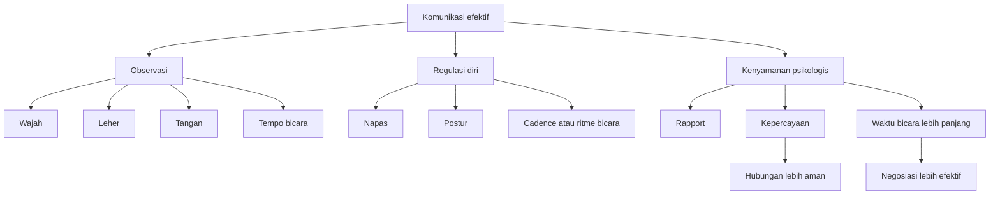
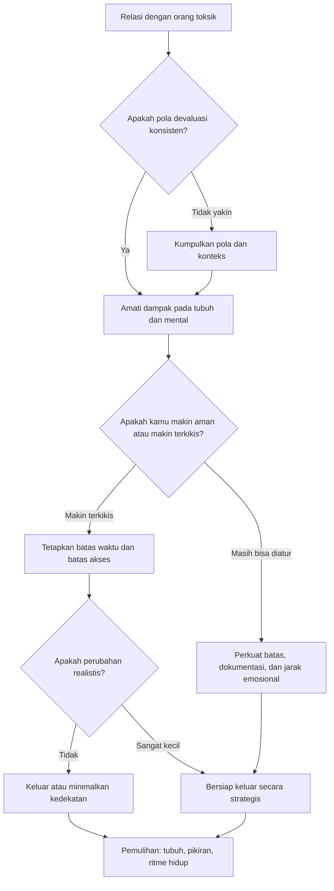

## 🧭 Pendahuluan: Mengapa Nasihat tentang Bahasa Tubuh Sering Terdengar Dangkal, tetapi Kadang Justru Sangat Penting?

Di internet, kita dikelilingi nasihat tentang bahasa tubuh, kepercayaan diri, *mindset* *(pola pikir)*, manipulasi, negosiasi, dan cara “membaca orang”. Sebagian terdengar berguna. Sebagian lain terdengar seperti resep instan yang terlalu sederhana. Maka ketika seorang mantan agen FBI seperti **Joe Navarro** bicara tentang:

- cara membaca wajah,
- sentuhan pada leher,
- bibir yang menegang,
- kekuatan kontrol atas waktu,
- kepercayaan diri yang bisa dilatih,
- dan terutama tanda-tanda orang narsistik,

kita perlu membacanya dengan dua sikap sekaligus:

1. **terbuka**, karena pengalaman lapangan memang memberi pengetahuan yang tidak selalu ada di buku teks;  
2. **tetap kritis**, karena manusia terlalu kompleks untuk direduksi menjadi satu gestur = satu makna.

Itu sebabnya pembacaan terbaik atas wawancara ini bukan sekadar: “kalau orang menyentuh leher berarti dia takut” atau “kalau bibirnya mengatup berarti dia bohong.” Tidak. Nilai terpenting dari percakapan ini justru ada pada kerangka berpikir yang lebih besar:

> **bahwa manusia selalu berkomunikasi, bukan hanya lewat kata-kata, dan bahwa memahami sinyal-sinyal halus itu bisa membuat kita lebih peka, lebih tenang, lebih strategis, dan lebih aman—terutama ketika berhadapan dengan orang yang manipulatif atau relasi yang toksik.**

Wawancara ini bergerak di beberapa lapisan sekaligus. Di satu sisi, ia membahas teknik praktis:
- bagaimana membangun *rapport* *(kedekatan / koneksi awal)*,
- bagaimana duduk di ruang negosiasi,
- bagaimana suara dan tempo bicara memengaruhi persepsi,
- bagaimana gestur kecil memberi sinyal percaya diri atau ketakutan.

Di sisi lain, ia juga membahas hal yang jauh lebih besar dan lebih serius:
- bagaimana trauma tersimpan di tubuh,
- bagaimana otak bereaksi terhadap ancaman,
- bagaimana orang narsistik merusak hidup orang lain,
- dan kapan strategi terbaik bukanlah “menang”, melainkan **keluar**.

Itulah yang membuat materi ini layak diolah menjadi esai besar. Karena sebenarnya ini bukan hanya tentang *body language* *(bahasa tubuh)*. Ini tentang:

- **membaca manusia**,
- **mengelola diri**,
- **membangun pengaruh tanpa agresi**,
- **memahami kenyamanan psikologis**,
- dan **mengenali kapan seseorang sedang berusaha menguasai, merendahkan, atau mengikis kita pelan-pelan**.

Kalau harus dirumuskan dalam satu tesis utama, maka tesis artikel ini adalah:

> **pelajaran paling berharga dari wawancara Joe Navarro bukanlah trik cepat membaca orang, melainkan pemahaman bahwa komunikasi manusia selalu bersifat biologis, emosional, dan relasional; dan karena itu, siapa pun yang ingin hidup lebih efektif harus belajar tiga hal sekaligus: membaca sinyal, mengelola diri, dan tahu kapan harus berhenti memberi akses pada orang yang toksik.**

Dengan tesis itu, artikel ini akan membedah wawancara tersebut menjadi beberapa lapisan:

- siapa Joe Navarro dan mengapa suaranya didengar,
- apa arti bahasa tubuh secara realistis,
- apa yang sebenarnya bisa dan tidak bisa kita simpulkan dari gestur,
- bagaimana negosiasi bekerja pada level nonverbal,
- bagaimana kepercayaan diri dilatih,
- apa itu *psychological comfort* *(kenyamanan psikologis)*,
- dan mengapa bagian terpenting dari seluruh percakapan ini justru ada pada pembahasan tentang **narsisme dan kebutuhan untuk pergi sebelum tubuh, pikiran, dan hidup kita terkikis habis**.

---

<Callout type="important" title="Tesis utama artikel ini">
Bahasa tubuh penting bukan karena ia memberi kita kemampuan magis membaca orang, melainkan karena ia membantu kita mengenali kenyamanan, ketegangan, ancaman, dan kualitas relasi. Nilai tertingginya ada ketika dipakai untuk membangun komunikasi yang lebih baik, menjaga diri, dan mengenali orang toksik sebelum kerusakannya terlalu jauh.
</Callout>

---

## 🕵️ 1. Siapa Joe Navarro, dan Mengapa Orang Mendengarkannya?

Joe Navarro bukan sekadar pembicara motivasi yang pandai membuat kalimat viral. Ia adalah mantan agen FBI yang selama puluhan tahun bekerja di wilayah:
- kontraintelijen,
- analisis perilaku,
- wawancara dan interogasi,
- penanganan ancaman,
- dan pembacaan sinyal manusia di bawah tekanan tinggi.

Ini penting, karena titik berangkatnya bukan teori murni. Ia berangkat dari dunia nyata yang melibatkan:
- mata-mata,
- teroris,
- negosiator,
- orang yang berbohong untuk menyelamatkan diri,
- dan orang-orang yang justru membocorkan hal penting lewat detail kecil yang tak mereka sadari.

Namun justru di sini kita perlu berhati-hati. Pengalaman lapangan yang kaya tidak otomatis membuat semua kesimpulan menjadi hukum universal. Ia memberi *pattern recognition* *(kemampuan mengenali pola)* yang tajam, tetapi tetap perlu dibaca dengan konteks.

Jadi sikap yang paling sehat adalah ini:
- hargai pengalaman dan ketajaman observasinya,
- tetapi jangan mengubah tiap contoh menjadi rumus kaku.

Dengan kata lain, Joe Navarro berguna bukan karena ia memberi “kunci rahasia” manusia, tetapi karena ia membantu kita melihat bahwa:

> **manusia selalu menunjukkan sesuatu lewat tubuhnya, dan orang yang terlatih bisa menangkap pola itu lebih cepat daripada kebanyakan orang.**

---

## 👀 2. Bahasa Tubuh Itu Nyata, tetapi Bukan Kode Satu-Gerakan-Satu-Arti

Salah satu masalah terbesar dalam dunia *body language* adalah banyak orang ingin jawaban yang terlalu sederhana. 👀

Mereka ingin tabel seperti ini:
- menyentuh hidung = bohong,
- melipat tangan = defensif,
- menatap bawah = tidak percaya diri,
- bibir mengatup = marah,
- tangan di leher = takut.

Padahal kenyataannya jauh lebih rumit.

Navarro sendiri, kalau dibaca dengan teliti, sebenarnya tidak sedang berkata bahwa satu gestur punya satu makna pasti. Yang ia tekankan justru adalah **cluster** *(gugus tanda)* dan **context** *(konteks)*.

Artinya, kita tidak membaca manusia dari satu gerakan terpisah, melainkan dari gabungan:
- wajah,
- leher,
- bahu,
- tangan,
- tempo bicara,
- ruang yang diambil tubuh,
- ritme napas,
- dan situasi yang sedang terjadi.

Ini pendekatan yang lebih masuk akal. Sebab orang menyentuh wajah bisa karena:
- cemas,
- capek,
- sedang berpikir,
- punya kebiasaan tertentu,
- atau hanya gatal.

Yang bermakna bukan sentuhan itu sendiri, tetapi pola keseluruhan:
- apakah gerak itu muncul tepat setelah pertanyaan sensitif,
- apakah bibir menegang bersamaan,
- apakah rahang bergeser,
- apakah bahu menurun,
- apakah napas berubah,
- apakah suara ikut goyah.

Karena itu pelajaran pertama yang sehat adalah:

> **bahasa tubuh bukan mesin pendeteksi kebohongan instan, melainkan alat untuk membaca tingkat kenyamanan, ketegangan, dan perubahan psikologis.**

---

## 😮 3. Mengapa Tubuh Bereaksi Lebih Cepat daripada Kata-Kata?

Navarro berkali-kali kembali ke ide bahwa tubuh manusia punya respons kuno yang sangat tua secara evolusioner. 😮

Ia memberi contoh:
- menutup mulut saat terkejut,
- membeku ketika mendengar suara keras,
- menutup leher saat merasa terancam,
- menaruh tangan di kepala saat menyaksikan bencana,
- atau menyentuh wajah dan mata saat stres.

Secara ilmiah populer, kita bisa memahami ini sebagai bagian dari sistem ancaman tubuh. Otak tidak menunggu narasi lengkap. Begitu ia merasa ada ancaman, ia mengaktifkan respons cepat. Karena itu tubuh sering bereaksi **lebih dulu** daripada akal sempat menyusun kalimat.

Ini sangat penting dalam interaksi sehari-hari. Banyak orang berkata, “saya baik-baik saja,” tetapi tubuhnya menunjukkan:
- bibir yang menipis,
- napas dangkal,
- bahu kaku,
- tangan melindungi leher,
- atau mata yang mulai menghindar.

Apakah itu otomatis berarti bohong? Tidak. Tetapi itu hampir selalu berarti satu hal penting:

> **ada sesuatu dalam sistem mereka yang tidak nyaman.**

Dan sering kali, dalam kehidupan nyata, itu sudah informasi yang sangat berguna.

---

## 💋 4. Bibir, Rahang, Wajah: Seismograf Emosi yang Paling Mudah Bocor

Salah satu bagian paling menarik dari wawancara ini adalah ketika Navarro menyebut bibir sebagai **“emotional seismograph”** *(seismograf emosional / alat pembaca getaran emosi)* tubuh. 💋

Gagasan ini cukup kuat. Ketika orang nyaman, rileks, dan percaya diri, wajah biasanya lebih terbuka. Ketika mereka mendengar sesuatu yang tak mereka suka, sering muncul perubahan halus:
- bibir menegang,
- bibir menipis,
- bibir digigit,
- rahang bergeser,
- wajah disentuh berulang,
- glabella *(area di antara alis)* mengerut.

Di sini kita belajar sesuatu yang penting: emosi sering pertama kali muncul bukan dalam pidato panjang, tetapi dalam mikroperubahan yang sangat cepat.

Mengapa ini relevan?

Karena dalam negosiasi, wawancara kerja, percakapan keluarga, bahkan hubungan romantis, momen penting sering muncul ketika kata-kata masih berusaha tetap rapi, tetapi wajah sudah mulai bocor.

Misalnya:
- seseorang berkata, “Saya tidak masalah,” tetapi rahangnya mengunci;
- seseorang berkata, “Tawaran itu menarik,” tetapi bibirnya mengatup tipis;
- seseorang berkata, “Saya hanya sedang berpikir,” tetapi alisnya mengerut dan lehernya mulai disentuh.

Sekali lagi, ini bukan bukti final. Tetapi ini adalah tanda bahwa **permukaan verbal dan keadaan internal tidak sepenuhnya sejalan**.

Dan itu sangat berharga untuk dibaca dengan tenang.

---

## 🫱 5. Leher, Wajah, dan “Pacifying Behaviors”: Tubuh Menenangkan Diri Saat Pikiran Tertekan

Istilah penting yang muncul berkali-kali dalam penjelasan Navarro adalah **pacifying behaviors** *(perilaku menenangkan diri / self-soothing behaviors)*. 🫱

Ini merujuk pada gerakan-gerakan yang kita lakukan untuk meredakan tekanan internal, misalnya:
- menyentuh wajah,
- mengusap leher,
- menekan kelopak mata,
- menggeser rahang,
- memainkan rambut,
- menggosok tangan,
- mengusap lengan,
- atau bahkan mengatur napas.

Navarro menaruh perhatian khusus pada area leher, terutama **suprasternal notch / suprasternal notch** *(lekukan kecil di pangkal leher atas)*. Menurutnya, area ini sangat rentan secara biologis, sehingga saat orang cemas atau tidak aman, mereka cenderung menutup, menyentuh, atau mengusap area tersebut.

Terlepas dari seberapa jauh kita menerima semua penjelasan evolusionernya secara literal, inti praktisnya tetap kuat:

> **saat orang stres, tubuh sering berusaha menenangkan dirinya sendiri lewat sentuhan.**

Ini sangat berguna bukan hanya untuk membaca orang lain, tetapi juga membaca diri sendiri.

Kalau setiap kali menghadapi orang tertentu kita:
- menyentuh leher,
- menarik napas pendek,
- rahang terasa tegang,
- tangan dingin,
- dan perut mengencang,

mungkin masalahnya bukan kita “terlalu sensitif.” Mungkin tubuh kita sedang memberi data yang selama ini kita abaikan.

---

## 🤝 6. Rapport, Synchrony, dan Mengapa Orang Merasa “Nyambung” Bahkan Sebelum Isi Pembicaraan Masuk Jauh

Salah satu bagian paling berharga dari wawancara ini adalah pembahasan tentang **synchrony** *(sinkroni / keselarasan gerak dan ritme)*. 🤝

Navarro menekankan bahwa ketika dua orang berada dalam hubungan yang selaras, sering muncul hal-hal seperti:
- tempo bicara yang mulai selaras,
- gestur yang terasa sejalan,
- arah tubuh yang cocok,
- ekspresi wajah yang responsif,
- dan rasa ritme percakapan yang tidak saling menabrak.

Ini penting karena sering kali kita mengira koneksi lahir dari isi kata-kata saja. Padahal sebelum isi itu masuk, tubuh sudah bertanya dulu:
- apakah orang ini aman?
- apakah orang ini mendengarkan?
- apakah orang ini hadir?
- apakah saya boleh rileks di dekatnya?

Inilah yang disebut **psychological comfort** *(kenyamanan psikologis)*, dan bagi saya ini salah satu konsep terbaik dari seluruh percakapan tersebut.

Orang lebih mudah terbuka bukan hanya pada yang paling pintar, tetapi pada yang membuat mereka merasa:
- tidak diserang,
- tidak dipermalukan,
- tidak ditekan secara agresif,
- dan diberi ruang untuk menaruh beban mental mereka dulu sebelum masuk ke substansi.

Karena itu, hal kecil seperti:
- menyapa dengan hangat,
- tidak menyerbu dari depan secara keras,
- sedikit memiringkan kepala,
- menjaga ekspresi tetap hidup,
- memberi waktu orang selesai bicara,
- dan tidak terlalu cepat memotong,

ternyata bisa sangat besar dampaknya.

---

---

## ⏳ 7. Kontrol atas Waktu: Mengapa Dalam Negosiasi, Orang yang Menguasai Tempo Sering Menguasai Ruangan?

Salah satu gagasan paling menarik dan paling praktis dari Navarro adalah ini: **siapa yang menguasai waktu, sering kali menguasai negosiasi**. ⏳

Ini sangat tajam.

Dalam banyak situasi, orang mengira dominasi datang dari suara paling keras atau posisi paling tinggi. Padahal sering kali yang lebih menentukan justru adalah:
- siapa yang mengatur tempo,
- siapa yang terburu-buru dan siapa yang tidak,
- siapa yang memaksa ritme dan siapa yang menolak terseret.

Kalau lawan bicara datang agresif, melempar angka, mendesak keputusan, dan ingin semua berlangsung cepat, dorongan alami kita adalah ikut terpancing. Tapi justru di situlah kita kalah.

Navarro menyarankan sesuatu yang sangat masuk akal: **perlambat ritmenya**.

- Bicara lebih tenang.  
- Gunakan jeda.  
- Tulis poin.  
- Ulangi tujuan.  
- Pindahkan fokus dari emosi ke struktur.  
- Jangan memberi mereka hak mendikte panggung.  

Secara psikologis, ini sangat kuat. Orang yang panik ingin semua bergerak cepat. Orang yang mantap tidak takut pada jeda.

Maka dalam negosiasi, wawancara, atau konflik kerja, kecepatan sering salah dibaca sebagai kekuatan. Padahal tidak jarang **kecepatan adalah sinyal kecemasan atau strategi tekanan**.

---

## 🗣️ 8. Cadence, Nada Suara, dan Mengapa Wibawa Sering Terdengar Sebelum Sempat Dibuktikan

Bagian lain yang sangat penting adalah pembahasan tentang **cadence** *(cadence = irama / ritme ucapan)* dan nada suara. 🗣️

Navarro menekankan bahwa orang yang terdengar percaya diri tidak selalu yang paling keras. Sering kali justru yang paling berwibawa adalah yang:
- bicara lebih lambat,
- nada suaranya turun dan mantap,
- tidak terdengar meminta izin untuk setiap kalimat,
- dan memberi ruang pada kata-katanya untuk mendarat.

Contoh paling sederhana adalah kata “tidak”.

Kalau orang berkata:
- “no?” atau “enggak ya…” dengan nada naik,
itu memberi sinyal ragu.

Kalau orang berkata:
- “No.” atau “Tidak.” dengan nada turun,
itu terdengar sebagai kalimat utuh.

Ini bukan sekadar masalah suara. Ini masalah *frame* *(bingkai psikologis)*. Nada turun, jeda yang tenang, dan ritme yang terkontrol memberi kesan bahwa seseorang:
- tidak gentar,
- tidak tergesa,
- dan tidak sedang memohon agar dirinya dianggap sah.

Bagi saya, ini salah satu pelajaran terpenting dari seluruh percakapan tersebut: **percaya diri sering kali bukan soal membesar-besarkan diri, tetapi soal mengurangi kegelisahan yang bocor keluar lewat ritme tubuh dan suara.**

---

## 🪑 9. Postur, Ruang, dan Mengapa Tubuh Sering Menentukan Status Sosial Sebelum Kata Pertama Keluar

Navarro juga bicara soal postur, ruang, dan posisi tubuh. 🪑

Ini mungkin terdengar sepele, tetapi dalam interaksi manusia, hal-hal seperti:
- siapa duduk lebih tinggi,
- siapa masuk ruangan lebih dulu,
- siapa menunggu dan siapa ditunggu,
- siapa mengambil ruang dan siapa mengecilkan diri,
- siapa tetap tenang dan siapa gelisah,

semuanya memberi sinyal status.

Itulah sebabnya ia membahas soal tinggi kursi, posisi duduk, hingga wilayah visual di ruang negosiasi. Bukan karena manusia selalu menghitung secara sadar, tetapi karena kita menangkap hirarki dan rasa aman lewat tubuh sangat cepat.

Ada pelajaran besar di sini: **jangan biarkan tubuh kita tanpa sadar mengiklankan kepanikan**.

Kalau kita:
- mengecilkan bahu,
- bicara terburu-buru,
- terlalu cepat menyetujui,
- terus-menerus menyentuh leher,
- duduk seolah minta maaf karena hadir,

maka sebelum kita membuktikan kompetensi, orang lain sudah menerima sinyal bahwa kita tidak yakin pada diri sendiri.

Ini tidak berarti kita harus pura-pura jadi alpha performer. Bukan itu. Maksudnya adalah:

> **hadirlah dengan tubuh yang tidak sedang mengkhianati kapasitasmu sendiri.**

---

## 🪜 10. Kepercayaan Diri Bisa Dilatih, tetapi Bukan dengan Kalimat Kosong

Salah satu bagian terbaik dari wawancara ini adalah ketika Navarro menolak nasihat kosong seperti “pokoknya datang dan percaya diri saja.” 🪜

Ia justru mengatakan sesuatu yang jauh lebih realistis: **kepercayaan diri dibangun dari kompetensi kecil yang nyata**.

Ini sangat penting.

Kita hidup di zaman yang suka menjual percaya diri seolah tombol instan. Padahal manusia tidak bisa sekadar menyalakan rasa yakin dalam ruang kosong. Tubuh lebih percaya pada bukti daripada slogan.

Karena itu saran Navarro sangat masuk akal:
- mulailah dari satu hal yang benar-benar kamu kuasai,
- rasakan kompetensi itu di tubuh,
- lalu perluas dari sana.

Misalnya:
- kamu tahu materi rapat lebih baik daripada siapa pun di ruangan itu,
- kamu tahu datanya,
- kamu tahu urutan argumennya,
- kamu sudah berlatih menjawab keberatan,
- kamu tahu apa yang kamu tawarkan dan batas bawahmu.

Itulah fondasi percaya diri.

Bukan afirmasi murahan. Bukan sekadar pose. Bukan “fake it till you make it” yang kosong. Tetapi **kompetensi yang cukup spesifik sampai tubuh berhenti panik**.

---

## 🧩 11. Observation dan Self-Mastery: Dua Kebiasaan yang Membedakan Orang Biasa dari Orang Luar Biasa

Navarro menyebut dua kualitas penting yang menurut saya sangat kuat: **observation** *(kemampuan mengamati)* dan **self-mastery** *(penguasaan diri / pembentukan diri secara sadar)*. 🧩

### Observation
Mengamati bukan sekadar “melihat”. Banyak orang melihat, tetapi tidak benar-benar memperhatikan. Mereka hadir secara fisik, tetapi pikirannya tertelan layar, asumsi, atau monolog internal.

Observer yang baik justru menangkap:
- siapa yang tegang di ruangan,
- siapa yang terlalu diam,
- siapa yang tampak tidak dihargai,
- siapa yang sebenarnya mendominasi,
- di mana suasana kerja sedang retak,
- dan di mana ada peluang atau risiko yang tak dikatakan langsung.

Dalam bisnis, keluarga, dan kepemimpinan, orang seperti ini sangat berharga. Bukan karena mereka mistis, tetapi karena mereka **tidak hidup dalam autopilot**.

### Self-mastery
Bagi Navarro, *self-mastery* bukan cuma belajar banyak hal, tetapi menjadikan pengetahuan itu bagian dari diri. Ini konsep yang sangat indah. Kita tidak perlu menunggu sistem resmi memberi izin. Kita bisa membangun diri lewat:
- membaca,
- meniru yang baik,
- melatih satu kompetensi kecil,
- memperbaiki cara bicara,
- memperhalus cara menyimak,
- dan memperluas kapasitas kita sedikit demi sedikit.

Intinya sederhana:

> **orang luar biasa bukan selalu yang paling berbakat, tetapi yang paling sadar membentuk dirinya sendiri.**

---

## ⚠️ 12. Bagian Paling Penting: Narsisme, Devaluasi, dan Mengapa Kadang Satu-Satunya Strategi Sehat Adalah Pergi

Dari seluruh wawancara, menurut saya bagian paling penting justru bukan soal intel, bahasa tubuh, atau negosiasi, tetapi pembahasan tentang **narsisme patologis** *(pathological narcissism = narsisme yang merusak, bukan sekadar percaya diri tinggi)*. ⚠️

Navarro membedakan narsisme normal—yang sekarang memang meningkat dalam budaya digital—dari bentuk yang lebih berbahaya. Bagi dia, orang narsistik yang berbahaya adalah orang yang:
- sangat melebih-lebihkan dirinya,
- butuh dipusatkan,
- menuntut loyalitas tetapi tidak memberi loyalitas balik,
- perlu merendahkan orang lain agar dirinya tetap terasa besar,
- tidak sungguh peduli pada penderitaan orang lain,
- gemar berbohong atau memutar realitas,
- dan memperlakukan orang di sekitarnya sebagai alat, penonton, atau *chew toy* *(mainan kunyahan / sasaran pelampiasan)*.

Ini penting sekali karena banyak orang menghabiskan bertahun-tahun mencoba “memperbaiki” relasi dengan orang seperti ini. Mereka berpikir:
- kalau saya lebih sabar, dia akan berubah,
- kalau saya lebih loyal, dia akan menghargai,
- kalau saya bisa menjelaskan lebih baik, dia akan paham,
- kalau saya tidak memicu, semua akan aman.

Masalahnya, dalam pola narsistik yang berat, logika seperti itu sering tidak bekerja.

Mengapa?

Karena masalah utamanya bukan miskomunikasi biasa. Masalahnya adalah **struktur karakter**. Orang seperti ini tidak sekadar salah paham. Mereka sering memang:
- perlu mengontrol,
- perlu merendahkan,
- perlu menjadi pusat,
- dan tidak punya motivasi cukup untuk berubah karena mereka tidak merasa rusak.

Itulah mengapa nasihat Navarro terdengar keras, tetapi sering terasa benar:

> **jangan fokus pada bagaimana menang melawan orang narsistik. Fokus pada berapa lama lagi kamu mau membayar harga karena tetap berada dekat dengan mereka.**

Ini sangat besar maknanya.

---

## 🩹 13. “The Body Keeps the Score”: Tubuh Mencatat Orang yang Menyakiti Kita, Bahkan Saat Akal Masih Membela Mereka

Navarro menyebut gagasan yang sejalan dengan kalimat terkenal *the body keeps the score* *(tubuh menyimpan skor / jejak pengalaman buruk)*. 🩹

Ini sangat penting untuk dipahami dalam relasi toksik.

Sering kali akal kita masih berkata:
- “dia sebenarnya baik kok,”
- “dia cuma sedang stres,”
- “mungkin aku yang terlalu sensitif,”
- “kalau aku lebih sabar, pasti membaik.”

Tetapi tubuh berkata lain:
- kamu susah tidur tiap kali habis bertemu dia,
- perutmu sakit tiap lihat namanya muncul,
- rahangmu kaku setiap rapat dengannya,
- dadamu sesak kalau tahu dia akan datang,
- kamu mulai kehilangan rasa aman di rumah atau kantor,
- kamu pelan-pelan mengecilkan diri supaya tidak memicu ledakan berikutnya.

Pada titik ini, tubuh sering lebih jujur daripada narasi yang kita buat untuk bertahan.

Maka salah satu kebijaksanaan terbesar dari seluruh percakapan ini adalah: **baca tubuhmu sendiri**.

Kalau setiap kali bersama seseorang tubuhmu selalu siaga, ketakutan, mengerut, dan menenangkan diri secara berlebihan, jangan buru-buru menyebut itu kelemahan pribadi. Bisa jadi itu justru data yang paling jujur tentang kualitas relasi tersebut.

---

## 🛡️ 14. Jadi, Apa yang Harus Dilakukan Saat Berhadapan dengan Orang Narsistik atau Toksik?

Kalau kita gabungkan seluruh logika wawancara ini, maka strategi terhadap orang narsistik atau toksik bukanlah menjadi lebih manipulatif dari mereka. 🛡️

Strateginya lebih sehat bila berbunyi seperti ini:

### 1. Kenali polanya
Perhatikan apakah orang itu konsisten:
- merendahkan,
- membelokkan fakta,
- menuntut loyalitas satu arah,
- mempermainkan rasa bersalah,
- dan membuatmu terus-menerus mempertanyakan diri sendiri.

### 2. Jangan tertipu oleh pesona awal
Banyak orang toksik sangat menawan pada fase awal. Masalahnya bukan bagaimana mereka tampil di awal, tetapi pola jangka panjangnya.

### 3. Lihat dampaknya pada tubuh dan hidupmu
Apakah kamu makin tenang, berkembang, dan waras? Atau justru makin cemas, kecil, takut, dan terkuras?

### 4. Berhenti berharap logika sempurna akan mengubah mereka
Dalam banyak kasus, masalahnya bukan kurang penjelasan, tetapi kurang kemauan dan kurang empati dari pihak mereka.

### 5. Tentukan batas waktu dan batas harga
Kalau belum bisa keluar segera, setidaknya jujurlah: sampai kapan? Dengan harga apa? Berapa banyak kesehatan mentalmu yang masih mau dikorbankan?

### 6. Jika perlu, pergi
Ini mungkin bagian paling tidak glamor, tetapi sering paling sehat. Kadang kemenangan terbesar bukan menaklukkan lawan, tetapi **menutup akses mereka ke hidupmu**.

---

---

## 💼 15. Pelajaran Praktis untuk Hidup Sehari-Hari: dari Rapat, Wawancara Kerja, Sampai Keluarga

Kalau semua ini kita tarik ke hidup sehari-hari, ada banyak pelajaran konkret yang bisa dipakai. 💼

### Dalam rapat dan negosiasi
- jangan biarkan orang agresif menentukan tempo,
- bicara lebih lambat,
- gunakan jeda,
- jangan kecilkan tubuhmu sendiri,
- hadir dengan suara yang mantap dan kalimat yang selesai.

### Dalam wawancara kerja
- kuasai materi dan ceritamu sendiri,
- jangan asal tampil percaya diri—bangun dari kompetensi nyata,
- tunjukkan minat lewat perhatian hidup, bukan wajah datar,
- tetapi jangan juga gelisah berlebihan.

### Dalam mengasuh anak
- jangan datang seperti komandan perang tiap kali mau bicara,
- sudut tubuh, jarak, dan kemiringan kepala bisa sangat memengaruhi rasa aman anak,
- komunikasi efektif dimulai dari rasa aman, bukan dari dominasi.

### Dalam hubungan pribadi
- perhatikan apakah koneksi itu menciptakan *psychological comfort* atau kewaspadaan kronis,
- perhatikan tubuhmu,
- dan jangan romantisasi orang yang terus-menerus mengikis rasa amanmu.

### Dalam membangun diri
- latih satu kompetensi kecil sampai tubuhmu percaya,
- perbanyak observasi,
- dan bangun *self-mastery* sedikit demi sedikit.

---

## 🌱 16. Penutup Besarnya: Keterampilan Membaca Orang Tidak Berguna Kalau Kita Masih Gagal Membaca Diri Sendiri

Pada akhirnya, pelajaran terbesar dari wawancara ini mungkin justru paradoksal. Kita masuk dengan harapan belajar “cara membaca orang.” Tetapi yang paling penting justru adalah belajar membaca:
- tubuh kita sendiri,
- batas kita sendiri,
- ritme kita sendiri,
- dan biaya emosional dari relasi yang kita pertahankan. 🌱

Joe Navarro memberi banyak hal menarik tentang:
- wajah,
- leher,
- gestur tangan,
- kursi lebih tinggi,
- kontrol waktu,
- ritme suara,
- dan strategi negosiasi.

Semua itu berguna. Tetapi semua itu akan jadi dangkal kalau tujuannya cuma untuk tampil unggul atau mengendalikan orang lain.

Nilai paling dewasa dari pengetahuan seperti ini justru muncul ketika ia dipakai untuk:
- lebih peka,
- lebih berempati,
- lebih tepat membaca ancaman,
- lebih baik membangun kenyamanan psikologis,
- dan lebih cepat mengambil jarak dari pola relasi yang merusak.

Kalau harus disimpulkan dalam satu kalimat besar, maka saya akan mengatakan:

> **membaca manusia adalah keterampilan penting, tetapi keberanian untuk pergi dari orang yang terus merusakmu adalah keterampilan yang lebih penting lagi.**

Sebab pengetahuan tanpa batas hanya akan membuat kita makin pandai bertahan di tempat yang salah.

Dan kadang, setelah semua sinyal dibaca, semua pola dikenali, semua tubuh sudah memberi alarm, satu keputusan yang paling sehat memang sangat sederhana:

**lari. pergi. jaga diri.**

Bukan karena kita lemah, tetapi karena kita akhirnya cukup kuat untuk berhenti menyerahkan hidup kita pada orang yang tidak akan pernah memperlakukannya dengan hormat. ✨

---

<Callout type="quote" title="Kalimat inti artikel ini">
Bahasa tubuh membantu kita membaca dunia, tetapi kebijaksanaan yang lebih besar adalah membaca tubuh dan hidup kita sendiri: siapa yang membuat kita merasa aman, siapa yang membuat kita mengecil, dan kapan saatnya berhenti bernegosiasi dengan orang yang memang ingin mengikis kita.
</Callout>

<Callout type="warning" title="Jangan menyederhanakan body language">
Satu gestur bukan vonis. Jangan memakai bahasa tubuh sebagai alat menuduh orang bohong atau jahat secara serampangan. Yang lebih sehat adalah membaca pola, konteks, perubahan mendadak, dan dampak relasional secara keseluruhan.
</Callout>

<Callout type="tip" title="Tiga hal yang layak dipelajari dari artikel ini">
Latih observasi tanpa menjadi paranoid, bangun kepercayaan diri dari kompetensi nyata, dan bila seseorang terus-menerus merendahkan, mengontrol, atau membuat tubuhmu hidup dalam siaga kronis, berhentilah sibuk “mengerti” mereka dan mulailah melindungi dirimu.
</Callout>

<Callout type="cite" title="Sumber pengembangan artikel">
Artikel ini dikembangkan dari wawancara panjang dengan mantan agen FBI Joe Navarro tentang bahasa tubuh, negosiasi, pengaruh, *self-mastery*, dan narsisme, lalu diperluas menjadi esai reflektif tentang komunikasi manusia, kenyamanan psikologis, pola relasi toksik, dan batas sehat dalam kehidupan modern.
</Callout>
