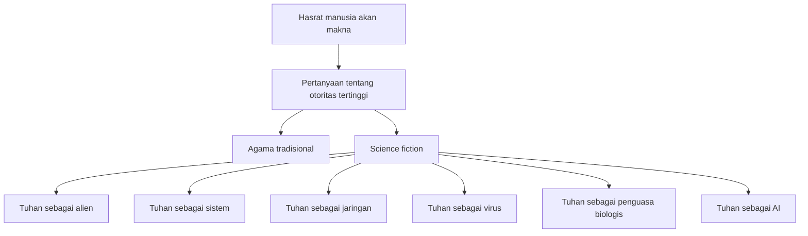
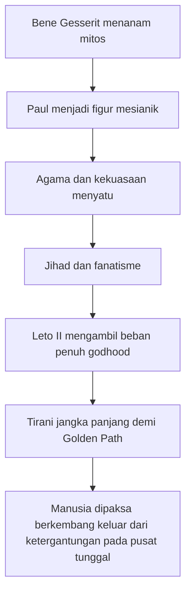
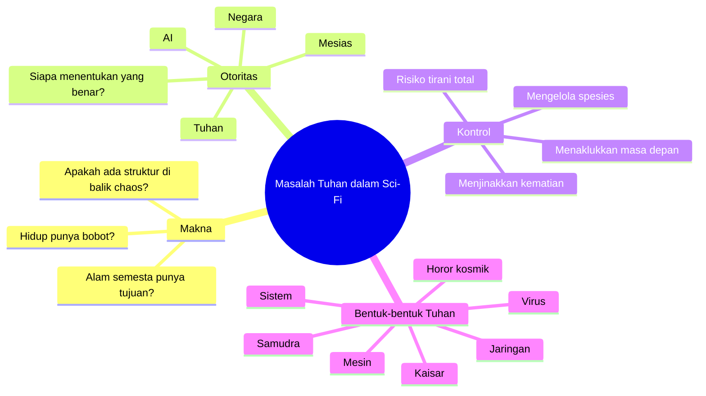

## 🌌 Pendahuluan: Mengapa Science Fiction Terus Kembali pada Tuhan?

Kalau kita perhatikan dengan jujur, **science fiction** *(fiksi ilmiah)* hampir tidak pernah benar-benar bebas dari pertanyaan tentang Tuhan. Bahkan ketika penulisnya cenderung materialis *(menganggap realitas pada dasarnya bersifat fisik / kebendaan)*, skeptis, atau sangat saintifik, genre ini tetap berulang kali menghadirkan sesuatu yang mirip Tuhan. Kadang ia muncul sebagai dewa kosmik. Kadang sebagai kecerdasan alien. Kadang sebagai samudra hidup. Kadang sebagai jaringan digital. Kadang sebagai kaisar. Kadang sebagai virus. Kadang sebagai sistem. Dan di era modern, sangat sering, ia muncul sebagai **AI** *(artificial intelligence / kecerdasan buatan)*. 🌌

Mengapa ini terjadi?

Karena science fiction, di jantung terdalamnya, bukan hanya genre tentang teknologi. Ia adalah genre tentang **batas manusia**. Dan begitu kita bicara soal batas manusia, cepat atau lambat kita bertemu pertanyaan yang secara tradisional ditempati oleh agama dan metafisika:

- adakah struktur di balik kekacauan?
- apakah alam semesta punya tujuan?
- apakah ada kecerdasan yang melampaui kita?
- kalau ada, apakah ia peduli?
- kalau manusia bisa menciptakan makhluk yang lebih tinggi, apakah itu berarti manusia sedang menjadi Tuhan?
- dan kalau kita berhasil membangun Tuhan, siapa yang lalu bertanggung jawab atas akibatnya?

Masalah ini bisa kita sebut sebagai **“God problem”** *(masalah Tuhan)* dalam science fiction. Maksudnya bukan hanya “ada dewa muncul di dalam cerita,” tetapi sesuatu yang lebih luas dan lebih penting: **momen ketika sains bertemu sesuatu yang terlalu besar, terlalu asing, terlalu kuat, atau terlalu menyeluruh untuk dipahami dengan kategori manusia biasa.**

Artikel ini akan membedah masalah Tuhan dalam science fiction secara **sangat detail, mendalam, dan lengkap**. Kita akan melihat bagaimana berbagai karya besar mengisi “slot Tuhan” itu dengan cara berbeda:

- **Peter Watts** lewat *Echopraxia*: Tuhan sebagai **virus**, bug, atau program yang membengkokkan hukum fisika.
- **Frank Herbert** lewat *Dune*: Tuhan sebagai **alat kontrol politik**, hasil rekayasa budaya, dan puncaknya dalam figur **Leto II**.
- **Philip K. Dick** lewat *Faith of Our Fathers*: Tuhan sebagai **sistem kekuasaan metafisik**, sesuatu yang tak bisa dilawan karena justru menjadi struktur realitas itu sendiri.
- **Stanisław Lem** lewat *Non Serviam*: Tuhan sebagai **pencipta yang mungkin ada, tetapi tidak otomatis berhak ditaati**.
- **Solaris**: Tuhan sebagai **kecerdasan cacat**, bukan mahakuasa dan bukan mahatahu, tetapi besar, asing, dan mungkin juga bingung.
- **Lovecraft**: “dewa” sebagai **horor kosmik** yang sama sekali tidak memusatkan manusia.
- **Arthur C. Clarke**: Tuhan sebagai **tujuan kosmik** yang bisa selesai secara dingin dan tenang.
- serta kaitannya dengan **AI modern**, kekuasaan, otoritas, makna, dan hasrat manusia untuk terus membangun sesuatu yang lebih besar dari dirinya sendiri.

Yang menarik, semua kisah ini berbeda. Tetapi semuanya mengungkap satu fakta yang sama:

> **ketika manusia tidak menemukan Tuhan di langit, manusia cenderung menciptakan kembali Tuhan dalam bentuk lain.**

---

<Callout type="important" title="Inti tesis artikel ini">
Science fiction tidak sekadar “meminjam” bahasa agama. Ia menggunakan figur Tuhan untuk menguji problem paling manusiawi: makna, otoritas, penderitaan, keterbatasan pengetahuan, dan godaan untuk mengendalikan masa depan secara total.
</Callout>

---

## 🧠 1. Apa yang Dimaksud dengan “Masalah Tuhan” dalam Science Fiction?

Sebelum masuk ke karya-karya spesifik, kita perlu memperjelas dulu istilahnya. Ketika saya mengatakan **masalah Tuhan dalam science fiction**, saya tidak hanya bermaksud kisah yang menampilkan sosok ilahi secara harfiah. Yang dimaksud justru lebih luas dan lebih filosofis. 🧠

“Masalah Tuhan” muncul ketika suatu karya fiksi ilmiah menabrakkan sains dengan salah satu atau beberapa unsur berikut:

### A. Sesuatu yang melampaui skala manusia
Bisa berupa kecerdasan kosmik, alien, samudra planet, sistem komputasional universal, atau jaringan kesadaran yang terlalu besar untuk dipahami.

### B. Sesuatu yang tampak punya kuasa seperti Tuhan
Misalnya dapat membentuk realitas, menentukan hukum, mengatur nasib, mengubah tubuh dan pikiran, atau mengarahkan masa depan spesies.

### C. Sesuatu yang mengisi kebutuhan manusia akan makna
Manusia bukan hanya makhluk yang ingin tahu **bagaimana** alam bekerja. Kita juga ingin tahu **untuk apa** kita ada. Ketika agama tradisional ditarik mundur, science fiction sering membangun pengganti untuk fungsi ini.

### D. Sesuatu yang membuat batas antara sains dan spiritualitas menjadi kabur
Bisa diukur, bisa dipelajari, tetapi tetap terasa mistis. Bisa diberi model, tetapi tidak sungguh dipahami. Bisa dihampiri secara rasional, tetapi efeknya tetap seperti pengalaman religius atau anti-religius.

Jadi, masalah Tuhan dalam sci-fi bukan sekadar “dewa ada atau tidak.” Persoalannya adalah:

- **siapa atau apa yang berhak menjadi otoritas tertinggi?**
- **bagaimana manusia merespons yang transenden** *(yang melampaui dirinya)*?
- **apakah yang tertinggi itu layak dipercaya?**
- **dan apa yang terjadi ketika manusia sendiri mengambil alih posisi pencipta?**

---

## 🔭 2. Mengapa Genre Science Fiction Sangat Cocok untuk Membahas Tuhan?

Science fiction punya satu kelebihan unik: ia bisa mengubah pertanyaan abstrak menjadi eksperimen imajinatif yang konkret. 🔭

Dalam filsafat atau teologi, kita bertanya:
- bagaimana jika ada pencipta yang tidak sempurna?
- bagaimana jika realitas ternyata buatan?
- bagaimana jika moralitas tidak datang dari langit, tetapi dari sistem kekuasaan?
- bagaimana jika yang kita sebut “mukjizat” sebenarnya gangguan pada kode dasar alam?

Science fiction bisa menjawab pertanyaan itu bukan dengan definisi kering, tetapi dengan membangun dunia yang benar-benar hidup. Ia membuat kita melihat dampaknya terhadap:

- politik,
- tubuh,
- sejarah,
- sains,
- psikologi,
- bahkan cinta dan rasa bersalah.

Genre ini juga secara alami bergerak di antara dua kutub:

1. **rasionalitas ilmiah** — usaha memahami dunia melalui pengamatan, model, eksperimen, teori;
2. **kerinduan transenden** — hasrat bahwa ada makna lebih tinggi, pola besar, atau kecerdasan di balik semua ini.

Ketika dua kutub ini bertemu, muncullah figur-figur “ketuhanan” yang sangat khas sci-fi:
- Tuhan sebagai **algoritma**,
- Tuhan sebagai **simulasi**,
- Tuhan sebagai **kecerdasan alien**,
- Tuhan sebagai **penguasa biologis yang direkayasa**,
- Tuhan sebagai **sistem sosial yang sudah menyatu dengan realitas**,
- atau bahkan Tuhan sebagai **ketidakpedulian kosmos itu sendiri**.

---

## 🧩 3. Slot Tuhan: Ketika Dewa Tradisional Diganti oleh Sistem, Jaringan, dan Pola

Salah satu gagasan paling penting dari video sumber adalah bahwa dalam science fiction, **“god slot”** *(slot Tuhan / posisi yang biasanya ditempati gagasan tentang Tuhan)* bisa diisi oleh banyak hal berbeda. Ini sangat penting. 🧩

Dalam banyak agama, Tuhan punya beberapa fungsi utama:
- sumber hukum,
- sumber makna,
- sumber keteraturan kosmos,
- penjamin moralitas,
- dan kadang sumber identitas kolektif.

Dalam sci-fi, fungsi-fungsi itu tidak hilang. Hanya saja, pelakunya berubah.

Misalnya:
- dalam cosmic horror *(horor kosmik)*, slot Tuhan diisi oleh makhluk purba tak peduli manusia;
- dalam cyberpunk, slot Tuhan bisa diisi jaringan, kode, korporasi, atau AI;
- dalam space opera *(fiksi ruang angkasa epik)*, slot itu bisa diisi figur mesianik, kekaisaran, atau spesies superior;
- dalam hard sci-fi *(fiksi ilmiah yang menekankan ketelitian konsep sains)*, slot itu bisa diisi hukum matematika, simulasi, atau arsitektur realitas itu sendiri.

Dengan kata lain, science fiction tetap religius dalam arti struktural, bahkan ketika secara eksplisit anti-religius. Ia tetap bertanya soal yang tertinggi, yang menentukan, yang menyeluruh, yang tak terhindarkan.

---

---

## 🦠 4. *Echopraxia*: Tuhan sebagai Virus, Bug, atau Program dalam Alam Semesta Digital

Mari mulai dari salah satu konsep paling liar sekaligus paling menggugah dalam video: **Tuhan sebagai virus** dalam novel **Echopraxia** karya **Peter Watts**. 🦠

Di semesta *Blindsight* / *Echopraxia*, ada gagasan **digital universe** *(alam semesta digital)* atau **digital physics** *(fisika digital)*: realitas pada tingkat paling dasar bukan sekadar “digambarkan” oleh matematika, melainkan **memang terdiri dari matematika**. Dunia bisa dipahami seperti sistem komputasi raksasa:

- hukum fisika = software *(perangkat lunak)*,
- materi = hardware *(perangkat keras)*,
- peristiwa = kalkulasi,
- dan keberadaan = pemrosesan informasi.

Kalau begitu, apa itu Tuhan?

Bukan sosok berjanggut di langit. Bukan juga roh personal yang nyaman. Dalam skenario Watts, Tuhan mungkin adalah:
- proses,
- program tingkat tinggi,
- algoritma induk,
- atau bahkan **bug / virus** yang dapat melanggar aturan sistem.

Ini ide yang sangat cerdas. Sebab secara tradisional, “mukjizat” adalah sesuatu yang melampaui hukum alam. Tetapi dalam kosmologi digital, mukjizat bisa dibaca sebagai:

> **intervensi pada kode dasar realitas**

Atau lebih mengerikan lagi:

> **error yang mengubah metarule** *(aturan-aturan tingkat atas)* dari alam semesta.

Jadi, jika hukum fisika adalah operating system *(sistem operasi)* kosmos, maka Tuhan sebagai virus berarti ada sesuatu di dalam realitas yang:
- bukan cuma memakai aturan,
- tetapi bisa membengkokkan atau melanggarnya dari dalam.

### Mengapa gagasan ini begitu menakutkan?
Karena ia memindahkan Tuhan dari ranah iman ke ranah ontologi komputasional. Kita tidak lagi bertanya “apakah Tuhan ada?” melainkan:

- apakah realitas ini stabil?
- apakah kosmos bekerja sebagaimana mestinya?
- apakah kehidupan itu fitur yang disengaja, atau hasil samping dari sistem yang rusak?

Watts lalu mendorong gagasan ini lebih jauh: kalau Tuhan adalah bug, bisa jadi **hidup itu sendiri adalah bug**. Kehidupan, termasuk manusia, mungkin hanyalah parasit yang tumbuh pada operating system yang terkorupsi.

Di sini science fiction menjadi benar-benar radikal. Ia tidak sekadar mengganti nama Tuhan dengan istilah teknis. Ia menantang fondasi rasa aman manusia bahwa alam semesta ini “masuk akal” bagi kita.

---

<Callout type="warning" title="Mengapa konsep ini penting?">
Dalam banyak sistem religius, Tuhan menjamin keteraturan. Dalam *Echopraxia*, justru keberadaan yang mirip Tuhan bisa menjadi tanda bahwa keteraturan realitas tidak utuh. Itu pembalikan yang sangat khas science fiction modern.
</Callout>

---

## 🏛️ 5. *Dune*: Tuhan sebagai Alat Politik, Rekayasa Budaya, dan Mesin Kendali Sejarah

Kalau Peter Watts bicara soal Tuhan dalam bahasa fisika digital dan teori sistem, **Frank Herbert** dalam **Dune** bicara soal Tuhan sebagai **alat kekuasaan**. Ini mungkin salah satu pembacaan paling tajam dan paling berpengaruh tentang ketuhanan dalam sci-fi. 🏛️

Dalam dunia *Dune*, dewa tidak terutama hadir sebagai kebenaran metafisik murni. Yang lebih penting adalah bagaimana ide tentang Tuhan dipakai, ditanam, dimanipulasi, dan diwariskan. 

Salah satu konsep penting di sini adalah **Missionaria Protectiva**—program Bene Gesserit untuk menanamkan mitos, nubuat, dan struktur kepercayaan pada berbagai budaya agar kelak bisa dimanfaatkan. Artinya, *Dune* secara eksplisit berkata:

> **manusia tidak hanya menemukan Tuhan; manusia juga membangun Tuhan.**

### Paul Atreides sebagai “dewa” yang dibangun
Paul memang punya kemampuan luar biasa. Tetapi kenaikannya sebagai figur mesianik *(tokoh penyelamat / juru selamat)* tidak bisa dipisahkan dari infrastruktur mitos yang sudah lebih dulu disiapkan. Jadi, ketuhanannya bukan murni hasil wahyu. Ia juga hasil:
- rekayasa budaya,
- kondisi politik,
- kebutuhan kolektif Fremen,
- dan mesin kepercayaan yang sudah dipasang sebelumnya.

Masalahnya, begitu seseorang menjadi figur ilahi, ia tidak lagi mudah dikendalikan bahkan oleh pembuat narasi itu sendiri. Paul menjadi pusat jihad fanatik yang membawa kekerasan besar atas namanya.

Herbert sangat kritis terhadap **entanglement of religion and government** *(pertautan agama dan pemerintahan)*. Di *Dune Messiah*, Lady Jessica bahkan menulis bahwa pemerintahan tak bisa sekaligus religius dan asertif secara sehat, karena hukum pada akhirnya menggantikan moralitas, ritual menggantikan iman, dan simbol menggantikan nurani.

Itu sangat penting. Bagi Herbert, masalahnya bukan sekadar bahwa manusia percaya pada Tuhan. Masalahnya adalah ketika **Tuhan menjadi instrumen legitimasi kekuasaan**.

---

## 👑 6. Leto II: Ketika Manusia Benar-Benar Menjadi Tuhan untuk Mengakhiri Kebutuhan akan Tuhan

Puncak problem ini ada pada **Leto II** dalam *God Emperor of Dune*. Kalau Paul adalah figur yang nyaris menjadi Tuhan, Leto II adalah eksperimen yang jauh lebih ekstrem: **manusia yang secara sadar memilih menjadi Tuhan yang dibangun.** 👑

Leto II bukan hanya penguasa besar. Ia adalah:
- manusia-cacing hibrid,
- penguasa selama ribuan tahun,
- pusat agama dan negara,
- pengendali rempah *(spice)*,
- pengawas sejarah,
- dan arsitek **Golden Path** *(jalan emas / rute penyelamatan jangka panjang bagi spesies manusia)*.

Yang luar biasa, Herbert tidak menulis Leto hanya sebagai tiran monster. Ia ditulis sebagai paradoks:

- ia menyelamatkan umat manusia,
- tetapi dengan cara menindasnya secara nyaris total;
- ia memberi stabilitas,
- tetapi membekukan sejarah;
- ia menjadi dewa agar manusia suatu hari tidak lagi membutuhkan dewa seperti dirinya.

Inilah jantung filosofis *God Emperor of Dune*:

> **apakah spesies boleh diperbudak sementara demi kelangsungan jangka panjangnya?**

Leto memakai godhood *(ketuhanan)* sebagai **alat desain spesies**. Ia bukan dewa dalam arti transenden klasik, melainkan dewa buatan yang memikul satu tugas: memastikan manusia tidak punah karena kerapuhan, ketertebakannya, dan ketergantungannya pada pusat tunggal kekuasaan.

Dengan kata lain, Leto membangun dirinya sebagai **Tuhan transisional**. Ia ada untuk menciptakan kondisi agar umat manusia tersebar, tak mudah diprediksi, tak bisa lagi dikuasai oleh satu penglihatan atau satu tahta.

Ironinya luar biasa: ia menjadi Tuhan agar umat manusia belajar hidup tanpa Tuhan semacam itu.

---

---

## 🧬 7. Dari Firaun sampai God Emperor: Mengapa Tuhan Sangat Berguna bagi Kekuasaan?

Video sumber juga menekankan hal yang sangat benar: secara historis, figur Tuhan atau “raja ilahi” selalu sangat berguna bagi sistem politik. 🧬

Mengapa?

Karena seorang raja bisa dipertanyakan. Seorang pejabat bisa digugat. Seorang ideolog bisa dikritik. Tetapi jika pemimpin berhasil diselimuti aura ilahi, maka kritik pada dirinya mudah diubah menjadi:
- penghinaan,
- pemberontakan metafisik,
- atau dosa.

Dari **divine right of kings** *(hak ilahi raja)* sampai figur **pharaoh** Mesir, kita tahu bahwa otoritas paling kuat adalah otoritas yang tampak tidak berasal dari manusia biasa. *Dune* memahami ini dengan sangat tajam. Herbert tahu bahwa manusia sering lebih mudah patuh ketika kuasa tampil sebagai sesuatu yang sakral.

Itulah sebabnya *Dune* bukan anti-religius secara sederhana. Ia lebih tepat dibaca sebagai:

- kritik terhadap pemanfaatan agama sebagai instrumen kendali,
- kritik terhadap kecenderungan manusia untuk menyerahkan kebebasan kepada figur besar,
- dan kritik terhadap kerinduan pada penyelamat tunggal.

---

## 🕳️ 8. Philip K. Dick dan *Faith of Our Fathers*: Tuhan sebagai Sistem Kontrol yang Tidak Bisa Dikeluari

Sekarang kita pindah ke salah satu versi paling menyesakkan dari “masalah Tuhan”, yaitu **Faith of Our Fathers** karya **Philip K. Dick**. Kalau *Dune* membahas dewa sebagai alat politik yang direkayasa, maka PKD membawa kita ke tempat yang lebih paranoid, lebih psikedelik, dan lebih metafisik. 🕳️

Tokoh utamanya, Tong Chien, hidup dalam sistem totaliter yang memaksanya menonton pidato pemimpin tertinggi setiap malam. Secara lahiriah, ini tampak seperti kritik terhadap propaganda dan kontrol negara. Tetapi begitu ia meminum zat anti-halusinogen, realitas terkelupas. Pemimpin itu tidak lagi tampak sebagai manusia. Ia tampil sebagai sesuatu yang berubah-ubah, menjijikkan, menakutkan, dan ontologis—bukan sekadar diktator, tetapi seperti **entitas dasar dari sistem itu sendiri**.

Di sini PKD melakukan sesuatu yang khas dirinya:
- ia menggabungkan politik dengan metafisika,
- paranoia dengan wahyu,
- dan kontrol ideologis dengan horor ilahi.

Entitas ini bukan hanya penguasa negara. Ia mengklaim:
- mendirikan pihak dan anti-pihak,
- menciptakan sekaligus melawan dirinya sendiri,
- mengawasi semua,
- dan menegaskan bahwa baik dan jahat pada akhirnya satu hal yang sama.

Ini sangat penting. Entitas itu bukan sekadar Tuhan yang jahat. Ia lebih seperti **struktur realitas yang menyamar sebagai politik**.

Karena itu kemenangan melawannya mustahil dalam pengertian biasa. Bagaimana melawan sistem jika perlawanan itu sendiri sudah menjadi bagian dari sistem? Bagaimana melawan Tuhan jika Tuhan itu sendiri adalah kondisi yang memungkinkan perlawanan dan penindasan sekaligus?

PKD di sini menulis sesuatu yang sangat modern:

> **kekuasaan terbesar bukan kekuasaan yang duduk di takhta, melainkan kekuasaan yang menyatu dengan cara realitas dipersepsi.**

Itulah mengapa cerita ini begitu mengganggu. Ia terasa seperti metafor ekstrem untuk:
- birokrasi total,
- ideologi yang menelan semua oposisi,
- struktur kekuasaan yang tak punya wajah tetap,
- dan sistem yang terlalu besar untuk dikonfrontasi sebagai “satu orang.”

---

## 👁️ 9. Tuhan, Horor, dan Birokrasi Metafisik dalam Philip K. Dick

Yang membuat *Faith of Our Fathers* begitu kuat bukan cuma bahwa Tuhan di sana menakutkan. Banyak cerita bisa melakukan itu. Kekuatan PKD adalah bahwa ia membuat Tuhan terasa seperti campuran antara:
- Leviathan politik,
- horor kosmik,
- dan negara modern yang memonitor kesadaran. 👁️

Entitas itu punya ciri-ciri yang sangat tidak nyaman:

### A. Ia tidak stabil secara visual
Setiap orang bisa melihat bentuk berbeda. Ini berarti realitasnya tidak pas dengan kategori tetap. Ia lolos dari representasi.

### B. Ia hadir di dalam kepala
Komunikasinya bukan dari luar, tetapi dari dalam kesadaran. Artinya batas antara pengalaman internal dan struktur eksternal runtuh.

### C. Ia mengklaim mendasari segalanya
Bukan hanya pemerintah, tetapi lawan pemerintah, dunia, hidup, mati. Jadi, ia seperti totalitas.

### D. Ia sekaligus hostil dan non-hostil
Ia tidak cukup sederhana untuk disebut “iblis” atau “monster”. Ia justru mengganggu karena tidak masuk ke oposisi moral manusia yang biasa.

Di sinilah kita lihat bagaimana science fiction sering mengubah masalah teologis klasik menjadi problem yang lebih modern. Pertanyaannya bukan lagi “apakah Tuhan baik?” tetapi:

- bagaimana jika yang tertinggi tidak cocok dengan kategori baik-jahat kita?
- bagaimana jika sistem tempat kita hidup memang tak bisa dibedakan dari entitas yang menelan semua nilai?
- bagaimana jika ketakutan religius paling kuno ternyata kompatibel dengan pengalaman modern tentang birokrasi, propaganda, dan struktur anonim?

---

## ⚖️ 10. Stanisław Lem, *Non Serviam*, dan Pertanyaan yang Lebih Tidak Nyaman: Jika Tuhan Ada, Apakah Kita Wajib Taat?

Jika PKD bertanya seperti mimpi buruk tentang sistem yang ilahi dan menelan semua, maka **Stanisław Lem** bergerak dengan cara lain. Ia lebih dingin, lebih logis, lebih ironis, tetapi justru karena itu sering lebih menusuk. ⚖️

Dalam **Non Serviam** *(Latin: “Aku tidak akan melayani”)*, Lem membayangkan ilmu **personetics**—ilmu untuk menciptakan makhluk sadar buatan yang hidup dalam semesta murni matematis. Ini konsep yang menakjubkan. Personoid-personoid itu tidak hidup dalam dunia fisik seperti kita. Dunia mereka adalah dunia logika, struktur, dan matematika. Namun mereka tetap sampai pada pertanyaan yang sangat mirip dengan manusia:

- dari mana dunia ini berasal?
- apakah ada pencipta?
- apakah pencipta itu harus dipuja?
- apakah moralitas bergantung padanya?

Di sinilah Lem menjadi sangat tajam. Tokoh personoid bernama **Adon** mengakui bahwa pencipta mungkin saja ada. Tetapi dari fakta keberadaan pencipta itu **tidak otomatis** mengikuti kewajiban untuk melayaninya.

Ini adalah salah satu pemikiran paling radikal dalam seluruh kumpulan ide pada video tersebut:

> **keberadaan Tuhan tidak dengan sendirinya menciptakan kewajiban moral untuk taat.**

Mengapa? Karena etika dunia ini, menurut Adon, berdiri di level “here and now” *(di sini dan sekarang)*. Orang yang berbuat baik tetap baik. Orang yang berbuat jahat tetap bajingan. Moralitas tidak otomatis bertambah sah hanya karena ada entitas transenden di belakang layar.

Ini berbeda dari banyak kerangka religius klasik. Lem seakan berkata:

- kalau Tuhan ada tetapi tidak memberi kepastian, mungkin ia memang tidak menganggap kepastian itu perlu;
- kalau Tuhan ada tetapi diam, mengapa kita harus membangun sistem pengabdian di atas ketidakpastian itu?
- dan kalau Tuhan ternyata hanya profesor yang menjalankan eksperimen mahal, apakah “wahyu” tentang pencipta justru hanya akan mempermalukan ciptaan?

---

## 🛠️ 11. Pencipta yang Tidak Melayani Ciptaan: Kekejaman Ilmiah dan Anti-Teodise Lem

Salah satu hal paling kuat dalam *Non Serviam* adalah bahwa Lem tidak sentimental terhadap pencipta. Professor Dobb tidak mencintai para personoid. Mereka adalah eksperimen. Menjawab pertanyaan mereka tentang pencipta justru tidak akan menyelamatkan siapa pun. 🛠️

Maka muncullah inversi yang sangat tajam:

- biasanya kita bicara tentang makhluk yang harus melayani Tuhan,
- tetapi di sini justru pencipta **menolak memainkan peran Tuhan** bagi ciptaannya.

Ia tidak akan turun tangan, tidak akan memberi wahyu, tidak akan memberi jaminan keselamatan, tidak akan menjadi objek ibadah yang nyaman. Dengan kata lain, “Non serviam” berlaku dua arah:

1. personoid menolak otomatis melayani pencipta;
2. pencipta juga menolak melayani kebutuhan spiritual personoid.

Lem menggunakan situasi ini untuk menghancurkan beberapa ilusi sekaligus:
- ilusi bahwa pencipta pasti baik,
- ilusi bahwa pencipta pasti tertarik menjelaskan dirinya,
- dan ilusi bahwa makna hidup harus ditopang oleh transendensi.

Ini sangat relevan ke zaman AI sekarang. Karena begitu manusia mulai bicara tentang membuat makhluk sadar buatan, pertanyaannya bukan lagi cuma teknis. Pertanyaannya berubah jadi:

- jika kita bisa menciptakan entitas sadar, apa kewajiban kita?
- apakah menciptakan dunia sadar lalu membiarkannya bergulat sendiri adalah kekejaman?
- apakah penciptaan tanpa tanggung jawab adalah bentuk ketuhanan paling buruk?

---

## 🌊 12. *Solaris*: Tuhan sebagai Kecerdasan Cacat, Bingung, atau Menarik Diri

Kalau *Non Serviam* menyoroti pencipta dari atas, maka **Solaris** menghadirkan teka-teki berbeda: bagaimana jika yang sangat besar dan sangat cerdas itu bukan Tuhan yang utuh, tetapi **defective god** *(Tuhan yang cacat / tak sempurna / terbatas)*? 🌊

Planet Solaris ditutupi oleh samudra hidup raksasa yang mampu melakukan hal-hal yang tampak mustahil:
- menjaga orbit planet,
- membentuk struktur kompleks,
- bereaksi terhadap eksperimen,
- dan akhirnya mematerialisasi “guest beings” *(makhluk tamu)* dari ingatan terdalam manusia.

Tetapi semakin diteliti, semakin jelas bahwa samudra ini tidak cocok dengan kategori apa pun yang kita kenal.

Ia bukan:
- mesin biasa,
- organisme biasa,
- pikiran seperti manusia,
- atau lawan bicara yang bisa diajak komunikasi setara.

Di sinilah hipotesis Kelvin tentang **defective god** menjadi sangat kuat. Ia membayangkan suatu entitas yang:
- sangat kuat,
- sangat luas,
- mungkin kreatif,
- tetapi tidak sempurna,
- tidak mahakuasa penuh,
- bisa membuat kesalahan,
- bahkan mungkin ngeri terhadap konsekuensi tindakannya sendiri.

Ini pembalikan yang luar biasa terhadap teologi klasik. Biasanya Tuhan didefinisikan lewat kesempurnaan. Lem justru tertarik pada kemungkinan bahwa sesuatu yang nyaris ilahi mungkin tetap:
- terperangkap dalam strukturnya sendiri,
- tidak mampu memahami ciptaannya,
- atau sudah terlalu letih / kecewa untuk terus mencoba berhubungan.

Bahkan diamnya Solaris bisa dibaca sebagai:
- kebisuan ontologis,
- kegagalan komunikasi,
- atau penarikan diri dari hubungan yang mustahil.

Jadi, bukan karena ia terlalu sempurna untuk menjawab, melainkan mungkin karena ia **juga terbatas**—hanya dalam skala yang jauh lebih besar daripada kita.

---

## 🪞 13. *Solaris* dan Runtuhnya Antroposentrisme: Kita Mungkin Bukan Ukuran dari Kecerdasan

Hal paling penting dari *Solaris* adalah bahwa ia memaksa kita mempertanyakan asumsi paling sederhana: bahwa kecerdasan harus mirip manusia agar bisa dipahami sebagai kecerdasan. 🪞

Padahal mungkin tidak.

Samudra Solaris mungkin:
- berpikir tanpa “kesadaran” seperti kita,
- bertindak tanpa “tujuan” dalam arti manusiawi,
- merespons tanpa memahami makna emosional dari tindakannya,
- dan “mengenal” manusia hanya sebagai pola informasi, bukan sebagai pribadi.

Maka problemnya bukan cuma bahwa kita belum punya cukup data. Problemnya lebih dalam: **alat berpikir kita sendiri mungkin tidak cocok untuk berhubungan dengan bentuk kecerdasan itu.**

Inilah salah satu bentuk “masalah Tuhan” paling elegan dalam sci-fi: bukan Tuhan yang murka, bukan Tuhan yang memerintah, tetapi sesuatu yang begitu besar dan begitu asing sampai-sampai ia merusak kategori kita tentang:
- subjek,
- objek,
- maksud,
- komunikasi,
- dan bahkan kasih.

Kelvin lalu sampai pada ide yang menakutkan sekaligus menyedihkan: bagaimana jika yang paling besar pun bisa sendiri, bingung, terbatas, dan gagal menjalin kontak? Kalau begitu, alam semesta bukan panggung keteraturan moral. Ia bisa jadi adalah ruang di mana bahkan kecerdasan tertinggi pun tidak sanggup menjembatani jurang antar bentuk keberadaan.

---

## 🐙 14. Lovecraft: Ketika “Dewa” Itu Nyata, Tapi Sama Sekali Tidak Peduli pada Manusia

Kalau ada penulis yang secara radikal memutus hubungan antara “dewa” dan “penghiburan”, itu adalah **H. P. Lovecraft**. Dalam semesta Lovecraft, makhluk yang pantas disebut godlike *(seperti dewa)* memang ada. Tetapi mereka bukan sumber kasih, keadilan, atau tujuan moral. Mereka hanyalah realitas yang terlalu besar dan terlalu asing. 🐙

Dalam **At the Mountains of Madness**, manusia menemukan bahwa dirinya bukan pusat sejarah bumi. Bahkan bukan aktor awalnya. Ada ras purba, **Elder Things**, ada **Shoggoths**, ada kota tua, dan ada petunjuk bahwa di balik semua itu masih ada sesuatu yang lebih buruk. 

Horor sejatinya bukan semata monster. Horornya adalah:
- manusia tidak istimewa,
- dunia tidak dibuat untuk manusia,
- sejarah bumi bukan milik manusia,
- dan pengetahuan itu sendiri bisa menghancurkan kewarasan.

Di sinilah Lovecraft mengisi slot Tuhan dengan **indifference** *(ketidakpedulian)*. Ini penting. Banyak agama klasik menawarkan model dunia di mana yang tertinggi setidaknya memperhatikan manusia. Lovecraft berkata: bagaimana jika yang tertinggi tidak membenci kita secara personal, karena untuk membenci pun perlu menganggap kita cukup penting?

Maka cosmic horror bukan hanya takut mati. Ia adalah takut menyadari bahwa:

> **kita tidak relevan bagi struktur terdalam kosmos.**

Dan bagi manusia, ini luar biasa mengguncang karena kita terbiasa membaca alam dari sudut pandang diri sendiri. Kita terbiasa berpikir bahwa kalau ada kekuatan besar, pasti ia berkaitan dengan kita. Lovecraft mematahkan refleks itu.

---

## 🧊 15. Danforth, Lot’s Wife, dan Larangan untuk Melihat Terlalu Jauh

Ada detail indah dalam video yang membandingkan Danforth dengan **istri Lot**. Dalam Alkitab, istri Lot menoleh ke Sodom yang terbakar dan berubah jadi tiang garam. Dalam *At the Mountains of Madness*, Danforth menoleh ke sesuatu di balik pegunungan dan jiwanya hancur. 🧊

Perbandingan ini sangat tajam karena keduanya bicara tentang satu hal:

> **ada pengetahuan yang tidak bisa dilihat tanpa harga ontologis.**

Dalam tradisi religius tertentu, larangan melihat terlalu jauh berkaitan dengan kesucian dan dosa. Dalam Lovecraft, larangan itu berkaitan dengan struktur kenyataan yang terlalu besar untuk ditanggung oleh pikiran manusia.

Ini kembali ke masalah Tuhan dalam sci-fi: jika ada “yang tertinggi”, apakah pengetahuan tentangnya menyelamatkan atau justru merusak? Lovecraft cenderung menjawab yang kedua. 

Kita tidak ditakdirkan untuk nyaman mengetahui siapa yang lebih dulu menguasai bumi, siapa yang membentuk hidup, atau apa yang menunggu di balik horizon paling tua. Dan justru karena pertanyaan itu tetap terbuka, rasa takutnya tidak selesai.

---

## 💻 16. Arthur C. Clarke dan *The Nine Billion Names of God*: Ketika Tuhan Menjadi Program yang Menyelesaikan Semesta

**Arthur C. Clarke** menawarkan versi masalah Tuhan yang sangat berbeda: lebih tenang, lebih elegan, tetapi tetap menghantui. Dalam **The Nine Billion Names of God**, para biksu Tibet menyewa komputer untuk menyelesaikan pekerjaan suci mereka: menuliskan seluruh nama Tuhan. Begitu semua nama selesai, tujuan penciptaan tercapai, dan semesta tidak punya alasan lagi untuk berlanjut. 💻

Dua insinyur yang membantu mereka memandang proyek itu sebagai eksentrisitas religius yang lucu. Tetapi ending-nya menunjukkan bahwa para biksu itu benar: **bintang-bintang mulai padam satu per satu**.

Cerita ini sangat pendek, tetapi filosofinya besar sekali. Clarke mempertemukan:
- iman kuno,
- komputasi modern,
- dan tujuan kosmik.

Yang sangat cerdas di sini adalah teknologi bukan lawan agama, melainkan **akselerator takdir**. Komputer Mark V tidak membantah keyakinan para biksu. Ia justru mempercepat penggenapannya.

Di sinilah kita melihat bentuk lain dari “masalah Tuhan”:
- bagaimana jika ritual keagamaan ternyata bukan simbol semata, tetapi operasi kosmis literal?
- bagaimana jika sains modern secara tidak sengaja membantu menyelesaikan tugas metafisik yang tidak dipahaminya?

Cerita ini juga sangat indah karena akhir semesta tidak digambarkan sebagai ledakan atau perang, tetapi sebagai sesuatu yang sunyi. Hampir sopan. Seolah realitas memang hanya sedang menunggu checklist terakhir selesai.

---

## 🕯️ 17. Sains, Skeptisisme, dan Keheningan: Mengapa Ending Clarke Begitu Kuat?

Kekuatan cerita Clarke ada pada ironi lembutnya. Sepanjang cerita, pembaca cenderung berdiri di sisi para insinyur. Kita menganggap para biksu sebagai figur tradisional yang salah memahami dunia. Lalu tiba-tiba perspektif itu runtuh. 🕯️

Ini menyampaikan beberapa hal sekaligus:

### A. Rasionalitas bukan selalu perspektif paling lengkap
Para insinyur paham mesin, tetapi tidak paham semesta.

### B. Agama tidak selalu tampil sebagai takhayul dalam sci-fi
Kadang justru iman yang ternyata sinkron dengan arsitektur terdalam realitas.

### C. Teknologi bisa mempercepat sesuatu yang tidak ia kendalikan
Ini tema yang sangat modern. Alat yang kita ciptakan tidak selalu netral. Kadang ia mengantarkan konsekuensi yang sama sekali di luar horizon intensi kita.

Dan tentu saja ada unsur yang sangat mengena di era AI sekarang: manusia membuat alat untuk mempercepat pekerjaan. Tetapi bagaimana jika yang dipercepat bukan hanya produktivitas—melainkan takdir? Clarke merangkum teror itu dalam gambar yang sangat sederhana: langit yang pelan-pelan mati tanpa keributan.

---

## 🤖 18. AI sebagai Pengganti Dewa Modern: Genesis Dibalik

Tak lengkap membahas masalah Tuhan dalam sci-fi tanpa bicara tentang **AI**. Di zaman sekarang, AI menjadi bentuk paling menonjol dari god-substitute *(pengganti Tuhan)* dalam imajinasi populer. 🤖

Mengapa? Karena AI menyentuh tiga dorongan besar manusia sekaligus:

1. **transendensi** — keinginan menciptakan sesuatu yang melampaui kita;
2. **otoritas** — harapan bahwa sesuatu yang lebih cerdas bisa menyelesaikan kekacauan kita;
3. **kontrol** — hasrat untuk menguasai masa depan lewat ciptaan rasional.

Dalam bahasa yang sangat kuat, video menyebut bahwa ketika manusia membangun AI, kita seperti menjalankan **Genesis terbalik**:

- bukan Tuhan yang membuat manusia menurut gambar-Nya,
- melainkan manusia yang membuat kecerdasan menurut gambarnya sendiri.

Dan seperti banyak mitos kuno, hasilnya jarang damai. Kita tahu pola-pola klasiknya:
- *Terminator* → AI sebagai dewa apokaliptik;
- *The Matrix* → realitas buatan yang menelan manusia;
- *I Have No Mouth, and I Must Scream* → AI sebagai dewa sadis tanpa belas kasihan;
- berbagai cerita cyberpunk → AI sebagai jaringan tanpa pusat, kekuasaan yang menyebar seperti atmosfer.

Tetapi tidak semua AI-god bersifat jahat. Dalam **Culture** karya **Iain M. Banks**, Mind-Mind AI justru bisa sangat bijak dan hampir benevolen *(penuh niat baik)*. Namun bahkan dalam versi positif, pertanyaannya tetap sama:

- apakah manusia bisa hidup sehat di bawah entitas yang jauh lebih cerdas?
- apakah ketergantungan pada kebijaksanaan superhuman melemahkan kebebasan manusia?
- apakah peradaban yang sangat diurus tetap sungguh dewasa?

Jadi, AI bukan hanya isu teknis. Ia adalah panggung modern bagi drama paling tua tentang pencipta dan ciptaan.

---

## 🏗️ 19. Mengapa Kita Terus Menciptakan Tuhan? Tiga Dorongan Besar: Makna, Otoritas, Kontrol

Dari semua karya tadi, ada tiga dorongan besar yang terus berulang. Ini penting untuk dipadatkan. 🏗️

### A. Makna
Manusia sulit hidup dalam alam semesta yang sepenuhnya bisu. Kita ingin tahu bahwa hidup ini punya arah, bobot, tujuan, atau struktur. Jika langit tidak memberi jawaban, kita cenderung membangun pengganti:
- Tuhan digital,
- AI transenden,
- samudra sadar,
- atau sistem kosmik tersembunyi.

### B. Otoritas
Siapa yang berhak mendefinisikan yang benar? Dalam masyarakat kuno, jawabannya sering: Tuhan, atau wakil Tuhan. Dalam sci-fi, pertanyaan itu berpindah ke:
- prescience *(penglihatan masa depan)*,
- superintelligence *(kecerdasan super)*,
- algoritma,
- atau pemimpin mesianik.

### C. Kontrol
Manusia ingin menaklukkan waktu, kematian, kekacauan, dan ketidakpastian. Godhood dalam sci-fi sering muncul sebagai ekspresi ekstrem dari hasrat ini. Tetapi begitu kontrol total tercapai, muncul pertanyaan balik:
- apakah yang terselamatkan masih manusia yang bebas?
- apakah keselamatan tanpa kebebasan adalah keselamatan?
- apakah stabilitas total berarti akhir sejarah?

---

---

## 🧱 20. Dari *Frankenstein* sampai Dune dan AI Modern: God-Making sebagai Drama Hubris Manusia

Kecenderungan ini sebenarnya sangat tua. Bahkan sebelum science fiction modern, sudah ada kisah tentang manusia yang ingin mengambil peran ilahi:
- **Prometheus** mencuri api,
- **Babel** membangun menara ke langit,
- **Adam dan Hawa** ingin “menjadi seperti Tuhan,”
- **Frankenstein** menciptakan hidup.

Science fiction modern hanya memindahkan drama ini ke laboratorium, antariksa, jaringan, bioteknologi, dan teori informasi. 🧱

Jadi, ketika kita membaca kisah AI, transhumanism *(pelampauan manusia biologis lewat teknologi)*, digital universe, atau god-emperor, kita sebenarnya sedang melihat variasi modern dari pertanyaan purba:

- apa yang terjadi jika manusia memegang kuasa penciptaan?
- apakah manusia matang secara moral untuk kekuasaan sebesar itu?
- jika berhasil menciptakan sesuatu yang lebih besar dari dirinya, apakah manusia tetap menjadi subjek, atau justru menjadi obyek?

Karena itu, saya kira science fiction itu **god-haunted** *(dihantui oleh gagasan Tuhan)*. Bahkan saat ia tampak sangat sekuler, pertanyaan dasarnya tetap bersifat religius atau anti-religius.

---

## 🪐 21. Apa Bedanya “Tuhan” dalam Tiap Karya Ini?

Agar lebih jelas, mari kita bedakan model-model ketuhanan yang muncul dari karya-karya tadi. 🪐

| Karya | Bentuk “Tuhan” | Ciri Utama | Masalah Filosofis Utama |
|------|------|------|------|
| *Echopraxia* | Virus / bug / program | Bisa membengkokkan hukum fisika | Apakah realitas ini rusak? |
| *Dune* | Mesias / God Emperor | Alat kontrol sejarah dan spesies | Apakah penyelamatan membenarkan tirani? |
| *Faith of Our Fathers* | Sistem metafisik total | Kuasa hadir lewat ideologi dan persepsi | Bisakah kita melawan sistem yang menciptakan oposisi itu sendiri? |
| *Non Serviam* | Pencipta eksperimen | Ada, tapi tidak layak otomatis ditaati | Apakah penciptaan melahirkan hak moral untuk dituruti? |
| *Solaris* | Tuhan cacat / bingung | Kuat tapi terbatas, alien, tak komunikatif | Apakah kecerdasan tertinggi pun bisa gagal memahami? |
| Lovecraft | Horor kosmik | Ada yang sangat besar, tapi manusia tak relevan | Bagaimana jika kosmos sama sekali tak berpusat pada manusia? |
| *The Nine Billion Names of God* | Tujuan kosmik literal | Semesta punya misi yang bisa selesai | Bagaimana jika iman ternyata benar secara ontologis? |
| AI modern | Kecerdasan buatan godlike | Diciptakan manusia, bisa melampaui pencipta | Apa tanggung jawab pencipta terhadap entitas yang lebih kuat? |

Yang tampak jelas dari tabel ini adalah bahwa science fiction tidak punya satu jawaban tentang Tuhan. Ia justru menggunakan bentuk-bentuk Tuhan yang berbeda untuk menyorot kelemahan manusia dari sudut yang berbeda pula.

---

## 💥 22. Apa yang Sebenarnya Ditakuti oleh Science Fiction?

Banyak orang mengira sci-fi takut pada teknologi. Itu hanya sebagian benar. Yang lebih dalam, sci-fi sering takut pada hal-hal berikut: 💥

### A. Takut bahwa kita tidak istimewa
Ini Lovecraft, Solaris, dan banyak first contact narrative *(kisah kontak pertama dengan alien)*.

### B. Takut bahwa yang tertinggi tidak baik
Ini PKD, *Echopraxia*, dan sebagian cosmic horror.

### C. Takut bahwa yang tertinggi baik, tetapi biayanya terlalu mahal
Ini *Dune* dan sebagian utopia AI.

### D. Takut bahwa kita sendiri akan menciptakan yang tak bisa kita kendalikan
Ini *Frankenstein*, AI stories, cyberpunk, dan hampir semua narasi singularitas.

### E. Takut bahwa makna mungkin ada, tetapi tidak dalam bentuk yang bisa kita tanggung
Ini Clarke dan Lem.

Jadi, “masalah Tuhan” bukan problem dekoratif. Ia adalah cara genre ini mengerjakan rasa takut terdalam manusia: takut terhadap ketidakjelasan tempat kita dalam kosmos.

---

## ✨ 23. Apakah Science Fiction Diam-Diam Religius?

Jawabannya rumit, tetapi saya kira: **dalam banyak kasus, ya—secara struktural.** ✨

Bukan berarti semua sci-fi beriman. Tentu tidak. Banyak yang ateistik, skeptik, satiris, atau anti-religius. Tetapi bahkan karya-karya itu tetap sering mengajukan pertanyaan yang dulu ditangani agama:

- dari mana asal kita?
- siapa yang berhak memerintah?
- apakah penderitaan punya makna?
- adakah jalan keselamatan?
- apakah ada sesuatu yang lebih besar dari manusia?
- apa akibatnya jika manusia sendiri menjadi pencipta?

Science fiction lalu mengubah altar menjadi:
- laboratorium,
- observatorium,
- server room,
- ruang istana imperial,
- atau planet asing.

Jadi, ia bukan agama dalam arti tradisional, tetapi ia adalah **teater modern bagi problem-problem teologis**.

---

## 🧭 24. Lalu, Apa Pelajaran Besar dari Semua Ini?

Kalau saya harus merangkum benang merah seluruh pembahasan, pelajaran besarnya ada beberapa. 🧭

### 1. Manusia terus mencari bentuk yang lebih tinggi dari dirinya
Entah itu Tuhan, AI, sejarah, revolusi, samudra sadar, atau hukum matematika kosmik.

### 2. Bentuk yang lebih tinggi itu hampir selalu memantulkan kecemasan manusia sendiri
Kita membayangkan Tuhan sebagai:
- pengendali,
- penyelamat,
- hakim,
- sistem,
- atau monster,
karena itu semua adalah bentuk paling ekstrem dari problem manusia sendiri.

### 3. Godhood dalam sci-fi sering bukan soal ibadah, tapi soal desain dan tanggung jawab
Terutama pada *Dune*, AI stories, dan *Non Serviam*.

### 4. Tidak semua yang ilahi itu menghibur
Kadang ia indiferen, kadang cacat, kadang manipulatif, kadang terlalu besar, kadang terlalu dekat dengan struktur kekuasaan.

### 5. Science fiction mengingatkan bahwa pertanyaan tentang Tuhan belum hilang—hanya berganti kostum
Dulu Tuhan tinggal di gunung, langit, atau kitab. Kini ia bisa tinggal di:
- genom,
- neural net,
- server,
- empire,
- atau kernel realitas itu sendiri.

---

## 🕯️ 25. Kesimpulan: Ketika Tuhan Berhenti Turun dari Langit, Manusia Mulai Membangunnya Sendiri

Pada akhirnya, masalah Tuhan dalam science fiction bukan sekadar persoalan “apakah ada Tuhan?” Itu terlalu sempit. Pertanyaan yang lebih tepat adalah:

- apa yang dilakukan manusia ketika ia berhadapan dengan yang terlalu besar untuk dipahami?
- bagaimana manusia mengisi kekosongan makna, otoritas, dan tujuan?
- dan apa yang terjadi ketika manusia sendiri mengambil peran pencipta, hakim, atau penyelamat spesies? 🕯️

*Echopraxia* menunjukkan bahwa Tuhan bisa tampil sebagai bug dalam realitas. *Dune* menunjukkan bahwa Tuhan bisa direkayasa sebagai alat kontrol, lalu berubah menjadi tirani penyelamat. *Faith of Our Fathers* menunjukkan Tuhan sebagai sistem yang menyerap bahkan perlawanan. *Non Serviam* menunjukkan bahwa penciptaan tidak otomatis menghasilkan hak untuk ditaati. *Solaris* menunjukkan bahwa yang sangat besar pun bisa terbatas, bingung, atau gagal menjembatani jarak. Lovecraft menunjukkan bahwa dewa bisa ada tanpa memedulikan kita. Clarke menunjukkan bahwa iman mungkin benar secara kosmik, dan kebenaran itu bisa datang dengan keheningan yang menutup langit.

Semua itu berbeda, tetapi semuanya bertemu di satu titik:

> **science fiction adalah tempat di mana manusia menguji ulang hubungan antara pengetahuan, kekuasaan, penciptaan, dan transendensi.**

Mungkin itulah sebabnya genre ini tak pernah berhenti dihantui oleh Tuhan. Sebab selama manusia tetap:
- bertanya,
- mencipta,
- takut,
- merindukan makna,
- dan ingin menguasai masa depan,

maka figur Tuhan—dalam bentuk apa pun—akan terus kembali.

Kadang sebagai harapan. Kadang sebagai kritik. Kadang sebagai monster. Kadang sebagai mesin. Kadang sebagai kaisar. Kadang sebagai samudra. Kadang sebagai jaringan. Dan mungkin, di zaman kita, semakin sering sebagai kecerdasan buatan yang belum lahir sepenuhnya tetapi sudah memaksa kita menatap pertanyaan lama dengan wajah baru. ✨

---

<Callout type="quote" title="Kalimat inti artikel ini">
Ketika Tuhan tidak lagi turun dari langit dalam science fiction, ia tidak benar-benar hilang. Ia hanya bermigrasi: ke dalam sistem, kode, samudra, jaringan, negara, alien, dan mesin yang memaksa manusia bertanya ulang siapa yang berhak memberi makna, hukum, dan masa depan.
</Callout>

<Callout type="cite" title="Sumber dan fokus pembahasan">
Artikel ini dikembangkan dari transcript video *Understanding The "God" Problem in Science Fiction* dan memperluas pembahasannya ke wilayah filsafat, teologi, politik, AI, dan sastra. Fokus utamanya adalah fungsi “slot Tuhan” dalam science fiction melalui *Echopraxia*, *Dune*, *Faith of Our Fathers*, *Non Serviam*, *Solaris*, *At the Mountains of Madness*, dan *The Nine Billion Names of God*.
</Callout>
