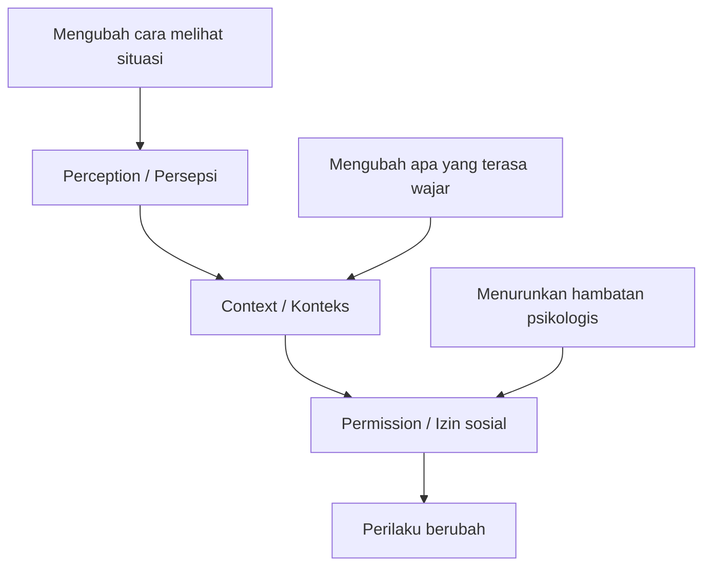
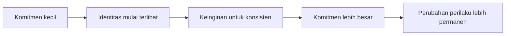

## 🎯 Pendahuluan: Mengapa Konten tentang “Membaca Pikiran” Selalu Laku?

Judul seperti **“3 trik dark psychology untuk membaca pikiran siapa pun”** hampir selalu menarik perhatian. Ada sesuatu yang langsung menggoda dari janji seperti itu. Ia menyentuh dua keinginan manusia sekaligus: keinginan untuk **memahami orang lain** dan keinginan untuk **punya kendali**. Di dunia yang penuh ketidakpastian sosial, janji bahwa kita bisa membaca orang, memengaruhi keputusan mereka, atau mengarahkan hasil percakapan terasa seperti superpower. 🧠

Tetapi justru di situlah masalahnya. Konten seperti ini sering mencampur tiga hal sekaligus:

- pengetahuan psikologi yang memang berguna,
- teknik komunikasi yang sah dan bermanfaat,
- serta trik manipulasi yang dibungkus sebagai “kecerdasan sosial”.

Wawancara ini menarik karena memuat semuanya. Ada bagian yang bernilai: soal pentingnya keterampilan manusia di era AI, pentingnya membuat orang merasa didengar, pentingnya kesadaran diri, dan pengaruh besar identitas terhadap perilaku. Tetapi ada juga bagian yang sangat problematik: pembicaraan tentang *micro compliance*, pre-commitment, framing, “membuat orang merasa ide itu datang dari kepala mereka sendiri”, teknik memengaruhi juri, dan cara membentuk identitas percakapan secara sangat strategis. ⚠️

Karena itu, tulisan ini tidak akan memperlakukan materi tersebut sebagai resep yang harus ditelan bulat-bulat. Saya akan membedahnya dengan pendekatan yang lebih dewasa: **mana yang benar-benar berguna untuk komunikasi etis, mana yang manipulatif, mana yang terlalu disederhanakan, dan mana yang seharusnya justru membuat kita lebih waspada terhadap media, politik, pemasaran, dan teknologi AI**.

<Callout type="important" title="Tesis utama artikel ini">
Nilai terbesar dari wawancara ini bukan pada janji “membaca pikiran orang”, melainkan pada pengingat bahwa manusia sangat mudah dipengaruhi oleh framing, identitas, konteks, dan pola pengulangan. Karena itu, pelajaran terpentingnya bukan “cara memanipulasi orang”, melainkan **cara berkomunikasi secara lebih sadar sekaligus cara melindungi diri dari manipulasi**.
</Callout>

---

## 🤖 1. Di Era AI, Keterampilan Paling Mahal Mungkin Memang Keterampilan Manusia

Salah satu bagian paling masuk akal dari wawancara ini adalah klaim bahwa di masa depan, ketika AI mengambil banyak pekerjaan kognitif dan otomasi mengambil banyak pekerjaan manual, maka **human-to-human skills** — *keterampilan manusia ke manusia* — akan menjadi semakin penting. Ini argumentasi yang kuat. Bukan karena AI tidak pintar, tetapi karena manusia tetap hidup di dalam dunia relasi, kepercayaan, konflik, negosiasi, pengasuhan, persuasi, kepemimpinan, rasa aman, dan rasa dimengerti. 🤝

Kita bisa melihat itu sudah terjadi sekarang. Orang bukan sekadar mencari informasi. Mereka mencari:

- resonansi,
- pengakuan,
- rasa dilihat,
- rasa didengar,
- rasa tidak dihakimi,
- dan pengalaman percakapan yang terasa nyata.

Di tengah banjir konten artifisial, *performative communication* — **komunikasi yang terlalu dipoles, terlalu dibuat-buat, terlalu seperti pertunjukan** — mulai membuat orang lelah. Maka konten yang terasa lebih manusiawi, lebih langsung, lebih tidak kaku, menjadi menarik.

Di titik ini saya setuju dengan inti pesannya: **kemampuan bercakap dengan baik, memahami motivasi orang, memimpin tanpa kaku, mendengar dengan jernih, dan membangun kepercayaan akan makin bernilai**. Tetapi kita harus langsung menambahkan pagar etis: nilai tinggi dari keterampilan sosial tidak otomatis membenarkan penggunaannya untuk manipulasi.

---

## 🧩 2. Model PCP: Perception, Context, Permission

Salah satu kerangka utama yang dibahas dalam wawancara adalah model **PCP**:

- **Perception** — *persepsi*  
- **Context** — *konteks*  
- **Permission** — *izin sosial / rasa diperbolehkan*  

Secara sederhana, idenya begini. Kalau seseorang ingin memengaruhi perilaku orang lain, ia tidak langsung menyerang keputusan akhirnya. Ia lebih dulu mengubah cara orang itu melihat situasi, lalu mengubah konteks yang dirasakan, lalu dari situ lahir “izin” untuk bertindak dengan cara tertentu. 🧠

Kalau dibaca secara netral, model ini sebenarnya tidak aneh. Banyak keputusan manusia memang lahir dari tiga lapis ini.

### a. Persepsi
Orang bertindak bukan hanya berdasarkan fakta objektif, tetapi berdasarkan bagaimana fakta itu dibingkai.

### b. Konteks
Perilaku yang terasa masuk akal di satu konteks bisa terasa aneh di konteks lain.

### c. Izin
Begitu orang merasa “dalam situasi seperti ini, tindakan ini wajar”, maka hambatan psikologis mereka turun.

Masalahnya dimulai ketika model itu bukan digunakan untuk membantu orang memahami keadaan secara lebih jernih, tetapi untuk **mengarahkan mereka ke hasil yang kita inginkan tanpa kesadaran penuh mereka**. Di situ, garis antara persuasi dan manipulasi mulai menipis.

---

## 🗣️ 3. Resonating, Not Directing: Bagian yang Benar dan Sangat Berguna

Ada satu gagasan dalam wawancara ini yang menurut saya sangat bernilai: **bahasa yang baik seharusnya resonating, not directing** — *beresonansi, bukan memerintah secara kasar*. Ini penting sekali. Banyak orang gagal berkomunikasi bukan karena niatnya buruk, tetapi karena mereka terlalu cepat mengarahkan, menasihati, menyuruh, atau menyalahkan. Akibatnya lawan bicara merasa tidak dipahami. 🎧

Prinsip “beresonansi dulu” berarti:

- akui dulu perspektif orang lain,
- beri nama pada emosi atau situasi yang mereka rasakan,
- tunjukkan bahwa kita paham posisi mereka,
- baru perlahan tawarkan sudut pandang lain.

Dalam parenting, kepemimpinan, negosiasi, terapi, konseling, pendidikan, dan relasi sehari-hari, ini sangat berguna. Bukan karena ia licik, tetapi karena ia **mengurangi resistensi defensif**. Orang lebih terbuka jika merasa dipahami dulu.

Namun sekali lagi, prinsip yang sehat ini bisa berubah arah kalau dipakai bukan untuk pemahaman, melainkan sekadar untuk “masuk ke sungai orang” lalu mengarahkan mereka diam-diam ke keputusan yang kita inginkan. Jadi prinsipnya benar, tetapi niat dan cara pemakaiannya menentukan apakah ia etis atau tidak.

---

## 🎭 4. “Set the Frame”: Kekuatan Membuka Percakapan dengan Jelas

Wawancara ini sangat menekankan pentingnya **setting the frame** — *menetapkan bingkai percakapan sejak awal*. Ini juga bagian yang secara praktis memang berguna. Banyak percakapan gagal karena para pihak masuk dengan asumsi berbeda:

- yang satu mengira ini sesi evaluasi,
- yang lain mengira ini sesi mencari solusi,
- yang satu mengira ini teguran,
- yang lain mengira ini obrolan santai,
- yang satu ingin keputusan,
- yang lain hanya ingin eksplorasi.

Kalau bingkai tidak dijelaskan, percakapan mudah melenceng. Maka kalimat seperti:

- “Saya senang kita bisa bicara dengan tenang dan fokus pada solusi, bukan saling menyalahkan.”
- “Saya ingin meeting ini bukan hanya ngobrol teoretis, tapi bergerak menuju keputusan konkret.”
- “Saya tidak ingin percakapan ini terasa sebagai hukuman, tetapi sebagai ruang belajar.”

itu sebenarnya sangat berguna. 📌

Di sini kita perlu adil: *framing* tidak selalu manipulatif. Dalam banyak kasus, ia justru adalah bentuk kejelasan. Masalah muncul ketika framing tidak dipakai untuk menjernihkan tujuan bersama, melainkan untuk mengunci lawan bicara ke jalur tertentu sebelum mereka sempat menilai situasinya sendiri dengan bebas.

---

## 🪤 5. Negative Dissociation: Teknik yang Terlihat Halus, tetapi Sangat Manipulatif

Salah satu teknik yang dibahas dalam wawancara ini adalah **negative dissociation**. Secara sederhana, caranya begini: Anda membuat pernyataan tentang “orang lain” yang tertutup, kaku, takut berpikir terbuka, atau rigid, lalu lawan bicara Anda diam-diam terdorong untuk menyetujui bahwa **mereka bukan orang seperti itu**. Setelah mereka setuju diam-diam, mereka akan cenderung bertindak selaras dengan identitas itu selama percakapan berlangsung. 🪤

Contoh polanya kira-kira begini:

- “Banyak orang terlalu tertutup untuk benar-benar mendengar perspektif lain.”
- lawan bicara mengangguk,
- secara tidak sadar ia sedang berkata dalam hati: “Ya, saya bukan orang yang tertutup seperti itu.”
- lalu percakapan jadi lebih mudah diarahkan, karena ia sudah berkomitmen pada identitas tertentu.

Teknik ini cerdik. Tetapi secara etis, ia sangat problematik. Kenapa? Karena ia tidak mengundang keterbukaan secara tulus. Ia **menanam identitas sosial di kepala orang lain** agar mereka sulit bertindak keluar dari identitas itu, setidaknya selama interaksi berlangsung.

Dalam bentuk ringan, ini mungkin terasa seperti trik sosial kecil. Dalam bentuk besar, ini adalah bahan baku propaganda, kultus, pemasaran agresif, dan polarisasi politik. Karena banyak kampanye sosial dan politik bekerja persis seperti ini:

- “orang cerdas pasti paham ini,”
- “orang bermoral pasti mendukung ini,”
- “kalau kamu manusia yang waras, tentu kamu ada di pihak ini,”
- “hanya orang bodoh / jahat / tertutup yang tidak melihatnya.”

Begitu identitas disentuh, orang tidak lagi sekadar merespons argumen. Mereka merespons ancaman terhadap siapa diri mereka. Dan itu jauh lebih kuat. ⚠️

<Callout type="danger" title="Bahaya teknik identitas">
Begitu percakapan dipindah dari “apa yang benar?” menjadi “siapa diri saya kalau saya setuju atau tidak setuju?”, maka ruang berpikir rasional mengecil. Orang menjadi lebih mudah diarahkan karena mempertahankan identitas terasa lebih penting daripada menilai fakta.
</Callout>

---

## 🧱 6. Pre-Commitment: Mengapa Langkah Kecil Sering Menarik Orang ke Langkah Besar?

Wawancara ini memberi banyak contoh tentang **pre-commitment** — *prakomitmen / komitmen awal kecil*.

Misalnya:

- Anda setuju pada satu prinsip kecil,
- lalu setuju pada simbol kecil,
- lalu lebih mudah menyetujui tindakan yang lebih besar.

Ini sejalan dengan banyak riset klasik psikologi sosial seperti *foot-in-the-door effect* — **efek kaki di pintu**. Begitu orang mengatakan “ya” pada sesuatu yang kecil dan tampak tidak berbahaya, mereka cenderung ingin konsisten dengan citra diri mereka sendiri. Maka “ya” berikutnya menjadi lebih mudah. 🪜

Contoh yang disebut dalam wawancara seperti:

- setuju bahwa mengemudi aman itu penting,
- lalu bersedia menaruh stiker kecil,
- lalu seminggu kemudian bersedia menaruh papan besar di halaman.

Secara psikologis, ini sangat masuk akal. Manusia ingin merasa konsisten. Kalau saya sudah berkata “saya mendukung X”, saya akan merasa tidak nyaman bila tindakan saya berikutnya justru bertolak belakang.

Bagian ini penting bukan untuk dipakai secara licik, tetapi untuk dipahami. Karena begitu kita sadar mekanismenya, kita bisa melihat bagaimana ia bekerja dalam:

- kampanye politik,
- kultus,
- onboarding komunitas ideologis,
- penjualan bertingkat,
- aplikasi yang membuat kita terus “setuju” pada langkah kecil,
- bahkan pola konsumsi digital.

Dengan kata lain, pemahaman tentang pre-commitment lebih berguna sebagai **alat deteksi manipulasi** daripada alat manipulasi itu sendiri.

---

## 🧑‍⚖️ 7. Juri, Persidangan, dan Persuasi: Ketika Psikologi Bertemu Kekuasaan

Bagian yang sangat sensitif dalam wawancara ini adalah klaim tentang penggunaan teknik-teknik ini dalam ruang sidang. Di sini narasumber bicara soal membentuk persepsi juri, menanam *archetype* — **pola cerita purba / model naratif dasar** — seperti David versus Goliath, dan membuat orang sampai pada kesimpulan yang terasa seperti “muncul sendiri dari kepala mereka”. ⚖️

Di satu sisi, ini tidak sepenuhnya mengejutkan. Pengacara memang selalu memakai narasi, simbol, penekanan, urutan fakta, dan pemilihan bahasa untuk memengaruhi persepsi. Itu bagian dari retorika hukum.

Tetapi di sisi lain, justru di ruang seperti pengadilan kita harus sangat waspada. Karena ketika teknik-teknik identitas, framing, dan arketipe dipakai terlalu agresif, kebenaran bisa tergeser oleh dramaturgi. Persidangan berubah menjadi teater naratif: siapa berhasil membuat cerita paling melekat di kepala juri, bukan siapa yang paling benar.

Maka pembacaan paling sehat atas bagian ini adalah: **ya, manusia memang berpikir lewat cerita; justru karena itu sistem hukum harus ekstra sadar terhadap bahaya manipulasi naratif**.

---

## 🧬 8. Childhood Development Triangle: Gagasan yang Menarik, tapi Jangan Dianggap Kunci Tunggal Semua Perilaku

Bagian lain yang cukup kuat dari wawancara ini adalah **childhood development triangle**. Segitiganya terdiri dari:

- apa yang dulu kita lakukan untuk **membuat dan mempertahankan teman**,
- apa yang kita lakukan untuk **merasa aman**,
- dan apa yang kita lakukan untuk **mendapat reward / penghargaan / kasih sayang**. 👶

Gagasan dasarnya adalah: banyak pola sosial masa dewasa sebenarnya adalah skrip masa kecil yang terbawa terus. Ini masuk akal. Banyak orang memang tumbuh membawa strategi kecil yang dulu adaptif:

- menjadi lucu agar diterima,
- menjadi kecil dan tidak terlihat agar aman,
- menjadi sangat waspada agar bisa membaca suasana rumah,
- menjadi berprestasi agar mendapat cinta,
- atau menjadi dominan agar tidak dipermalukan.

Sebagai kerangka refleksi diri, ini sangat berguna. Ia membantu orang bertanya:

- pola apa yang saya bawa dari masa kecil?
- mana yang masih menolong saya?
- mana yang sekarang justru merusak relasi dan keputusan saya?

Tetapi kita juga perlu hati-hati. Tidak semua perilaku dewasa bisa dijelaskan dengan satu segitiga sederhana. Ada faktor:

- biologis,
- sosial,
- budaya,
- ekonomi,
- trauma yang lebih kompleks,
- bahkan kondisi neuropsikologis.

Jadi model ini sebaiknya dibaca sebagai **alat refleksi**, bukan kunci tunggal yang menjelaskan seluruh manusia.

---

## 🪞 9. Identitas Adalah Mesin Paling Kuat dalam Persuasi

Salah satu poin yang paling konsisten dalam wawancara ini adalah bahwa **identity is everything** — *identitas adalah faktor terkuat dalam pengaruh*. Kalau dipikir-pikir, ini memang benar. Banyak keputusan manusia bukan lahir dari logika dingin, tetapi dari keinginan untuk konsisten dengan siapa mereka merasa diri mereka. 🪞

Kalimat seperti:

- “Saya ini tipe orang yang terbuka.”
- “Saya ini pemimpin.”
- “Saya orang yang bertanggung jawab.”
- “Saya bukan pengecut.”
- “Saya orang yang peduli keluarga.”

sering lebih menentukan perilaku daripada argumen rasional yang panjang.

Karena itu, siapa pun yang bisa menyentuh identitas, ia menyentuh mesin terdalam pengambilan keputusan. Dan inilah mengapa media, politik, merek, dan kultus sangat suka bermain di wilayah identitas.

Mereka tidak hanya menjual produk atau kebijakan. Mereka menjual jawaban atas pertanyaan: **“kalau saya setuju ini, saya jadi orang seperti apa?”**

Di titik ini, wawancara ini benar. Tetapi sekali lagi, justru karena benar, kita harus memperlakukannya dengan sangat hati-hati. Karena pengetahuan tentang identitas bisa dipakai untuk membantu orang tumbuh — atau untuk membajak mereka.

---

## 📺 10. Fokus, Otoritas, Suku, Emosi: Mengapa Media Sangat Mudah Menangkap Otak Kita?

Ada bagian wawancara yang menurut saya sangat penting untuk dibaca sebagai **literasi media**. Narasumber menjelaskan pola sederhana yang sering dipakai konten digital:

1. **Focus** — tarik perhatian lewat hal baru / mengejutkan  
2. **Authority** — hadirkan figur otoritas  
3. **Tribe** — tunjukkan kelompok / norma sosial  
4. **Emotion** — picu emosi  

Setelah itu, orang jadi jauh lebih mudah menerima pesan atau iklan berikutnya. Ini pembacaan yang layak direnungkan. 📱

Coba pikirkan konten pendek di media sosial:

- dibuka dengan kejutan,
- lalu ada figur terkenal atau berjas / bergelar,
- lalu ada sinyal bahwa “banyak orang sudah percaya / ikut / marah / mendukung ini”,
- lalu emosi dipuncakkan,
- dan akhirnya diarahkan ke aksi: subscribe, beli, marah, berbagi, atau membenci.

Di sini, wawancara ini sebenarnya memberi pelajaran yang sangat berguna: **perhatian manusia mudah direbut, lalu diarahkan, lalu diikat ke identitas dan emosi**.

Dan pelajaran terpenting buat pembaca bukanlah “wah, saya jadi tahu cara melakukan itu ke orang lain”, melainkan:

> “Wah, ternyata inilah yang sedang dilakukan platform, media opini, kampanye politik, dan pemasaran terhadap saya setiap hari.”

---

## 🧠 11. Novelty: Mengapa Hal Baru Membajak Pikiran Kita?

Pembahasan tentang *novelty* — **kebaruan** — juga cukup masuk akal. Otak memang cenderung sangat responsif terhadap sesuatu yang baru, tidak terduga, atau menyimpang dari pola. Dari sudut evolusi, ini masuk akal: sesuatu yang tiba-tiba berbeda bisa berarti peluang atau ancaman. 🐾

Karena itu:

- layout yang berubah,
- suara yang tak biasa,
- judul yang aneh,
- visual yang mencolok,
- atau perubahan rutinitas,

langsung menarik fokus.

Di bidang pemasaran, media, konten digital, dan politik, kebaruan adalah alat pembajak perhatian. Tetapi di sisi lain, wawancara ini juga memberi poin yang berguna untuk perubahan diri: kalau seseorang ingin mengubah kebiasaan, kadang perubahan lingkungan kecil bisa membantu memutus autopilot.

Masalah muncul ketika logika kebaruan dipakai terus-menerus untuk mempertahankan perhatian tanpa memberi substansi. Di era internet, kita hidup dalam ekonomi perhatian yang terus-menerus memicu sistem orientasi kita, sehingga kita capek, reaktif, dan mudah diarahkan.

---

## 🧵 12. Micro-Compliance: Kunci Kultus, Propaganda, dan Manipulasi Bertahap

Salah satu istilah paling berbahaya dalam wawancara ini adalah **micro compliance** — *kepatuhan kecil bertahap*. Intinya sederhana: orang jarang langsung diminta melakukan sesuatu yang ekstrem. Mereka diminta langkah kecil-kecil yang terasa remeh, lalu langkah berikutnya, lalu berikutnya lagi, sampai perilaku mereka berubah jauh tanpa mereka sadari. 🧵

Inilah mengapa wawancara ini menyebut:

- media sosial,
- politik,
- brainwashing,
- kultus,
- hipnosis,

semuanya bekerja melalui logika yang mirip.

Sebagai deskripsi psikologis, ini ada benarnya. Banyak sistem pengaruh memang bergerak bertahap. Tetapi kita harus sangat hati-hati dengan cara membicarakannya. Sebab kalau tidak, orang bisa tergoda memperlakukan manusia seperti mesin yang tinggal ditekan tombol kecilnya satu per satu.

Padahal komunikasi yang sehat bukan soal membiasakan orang patuh. Komunikasi yang sehat justru memberi ruang bagi orang untuk:

- sadar,
- menilai,
- menolak,
- mengubah pikiran,
- dan tidak dibajak lewat rentetan langkah mikro.

Jadi lagi-lagi, pengetahuan tentang *micro compliance* paling aman dan paling berguna bila dipakai untuk **mengenali proses manipulasi**, bukan untuk menjalankannya.

---

## 🫂 13. Bagian Paling Berharga dari Wawancara Ini: Membuat Orang Merasa Didengar dan Dilihat

Dari seluruh isi wawancara, mungkin bagian paling sehat justru ada di penutup: bahwa keterampilan paling penting adalah **membuat orang merasa didengar dan dilihat tanpa dihakimi**. Ini poin yang sangat kuat, dan ironisnya justru paling sederhana. 🫂

Banyak teknik pengaruh berputar-putar di sekitar cara membuat orang lebih mudah diarahkan. Tetapi hubungan yang benar-benar manusiawi justru dibangun oleh hal yang hampir kebalikannya:

- kehadiran penuh,
- mendengarkan tanpa buru-buru menyela,
- memahami tanpa cepat memberi label,
- dan memberi ruang bagi pengalaman orang lain untuk muncul apa adanya.

Inilah mengapa AI, setidaknya untuk waktu lama, masih sulit menggantikan kedalaman relasi manusia. Bukan karena AI tidak bisa meniru kata-kata empati, tetapi karena relasi manusia tidak hanya dibangun oleh kata-kata. Ia dibangun oleh:

- tubuh,
- waktu,
- risiko,
- kerentanan,
- ingatan bersama,
- dan keberadaan nyata.

---

## 🌿 14. Bagian yang Paling Rentan Menyesatkan: DMT, realitas, dan kesadaran

Paruh akhir wawancara bergeser jauh ke topik lain: DMT, kesadaran, realitas, simulasi, spiritualitas, dan teori-teori metafisik. Ini bagian yang paling mudah memikat, tetapi juga paling mudah menjadi kabur. 🌌

Saya kira bagian ini perlu dibaca hati-hati. Pengalaman subjektif yang sangat kuat tidak otomatis menjadi bukti universal tentang struktur realitas. Bahwa seseorang merasa suatu pengalaman “lebih nyata dari kenyataan biasa” adalah fakta psikologis tentang pengalaman itu. Tetapi itu tidak otomatis memutuskan teori metafisika mana yang benar.

Nilai yang masih bisa diambil dari bagian ini adalah sisi kerendahan hati:

- manusia tidak tahu segalanya,
- kepastian sering berlebihan,
- pengalaman tertentu bisa membuat orang lebih empatik dan kurang egois,
- dan kadang perspektif baru memang bisa mengubah cara melihat diri sendiri serta orang lain.

Tetapi kalau pembaca membawa pulang kesan bahwa wawancara ini telah “membuktikan” teori kesadaran tertentu, itu sudah terlalu jauh. Yang lebih masuk akal adalah membaca bagian ini sebagai **refleksi eksistensial**, bukan kesimpulan ilmiah final.

---

## 🧰 15. Jadi, Apa yang Benar-Benar Bisa Dipakai Pembaca Secara Etis?

Kalau kita saring seluruh wawancara ini dengan kepala dingin, ada beberapa pelajaran yang menurut saya benar-benar berguna dan relatif aman dipakai.

### 1. Mulai percakapan dengan menjernihkan bingkai
Tentukan tujuan interaksi dengan jelas, apalagi kalau suasananya sensitif.

### 2. Resonansi dulu, baru arahkan
Pahami emosi dan perspektif orang sebelum menawarkan solusi.

### 3. Perhatikan peran identitas
Banyak kebuntuan komunikasi sebenarnya adalah benturan identitas, bukan benturan data.

### 4. Waspadai framing media
Kalau berita atau konten sejak awal sudah memberi tahu Anda “apa yang harus Anda rasakan”, berhentilah sejenak.

### 5. Kenali pola masa kecil Anda sendiri
Bukan untuk menyalahkan masa lalu terus-menerus, tetapi untuk memahami skrip yang masih menggerakkan Anda.

### 6. Jangan buru-buru percaya pada “trik membaca orang”
Manusia lebih kompleks daripada sekadar kode-kode cepat.

### 7. Gunakan pengetahuan psikologi untuk membangun kejelasan dan empati, bukan dominasi
Ini garis moral yang paling penting.

---

## 🛡️ 16. Cara Melindungi Diri dari Teknik-Teknik Manipulatif Ini

Karena wawancara ini banyak bicara soal pengaruh, saya kira penutup paling berguna justru adalah daftar perlindungan diri. Kalau Mas Hendra membaca artikel ini sebagai pembaca, bukan penjual atau manipulator, maka pertanyaan terbaiknya adalah: **bagaimana saya tidak gampang dibajak?** 🛡️

Berikut beberapa pagar sederhana:

### a. Tanyakan: apakah saya sedang diberi fakta, atau sedang ditanamkan identitas?
Kalau sebuah pesan membuat Anda merasa “kalau saya tidak setuju, berarti saya orang jahat/bodoh/lemah”, kemungkinan besar Anda sedang dimanipulasi lewat identitas.

### b. Tanyakan: siapa yang menetapkan frame percakapan ini?
Kalau orang lain terlalu cepat mendefinisikan situasi tanpa memberi ruang Anda ikut membingkainya, hati-hati.

### c. Perhatikan rasa “ya kecil” yang terus diminta
Langkah kecil berulang bisa menjadi rel kereta menuju komitmen besar.

### d. Saat emosi naik, tunda keputusan
Ketika fokus, otoritas, suku, dan emosi sedang memuncak, itu justru momen terburuk untuk memutuskan hal besar.

### e. Pisahkan: “apakah ini benar?” dari “apakah ini membuat saya merasa seperti orang baik?”
Banyak manipulasi bekerja dengan mencampur keduanya.

### f. Latih kalimat sederhana: “Saya perlu waktu memikirkannya.”
Kalimat ini terlihat biasa, tetapi sangat kuat untuk memutus rantai pengaruh bertahap.

---

## 📌 17. Kesimpulan: Kecerdasan Sosial Bukan Kemampuan Membajak Orang, tetapi Kemampuan Menjaga Martabat dalam Relasi

Kalau harus diringkas, wawancara ini memperlihatkan dua wajah psikologi sosial modern.

Wajah pertama adalah wajah yang berguna:

- memahami persepsi,
- memahami konteks,
- memahami identitas,
- memahami luka masa kecil,
- dan membangun komunikasi yang lebih manusiawi.

Wajah kedua adalah wajah gelapnya:

- mengarahkan orang tanpa mereka sadari,
- menanam identitas secara diam-diam,
- memanfaatkan konsistensi psikologis,
- dan mengubah hubungan menjadi permainan kendali.

Keduanya sering memakai bahasa yang mirip. Itulah sebabnya kita perlu kejernihan. Karena tidak semua yang efektif itu baik. Dan tidak semua yang canggih secara psikologis itu layak dipakai. ✨

Bagi saya, ukuran paling sehat tetap sederhana:

> **apakah teknik ini membantu orang menjadi lebih sadar dan lebih merdeka, atau justru membuat mereka lebih mudah diarahkan tanpa sadar?**

Kalau jawabannya yang kedua, maka kita sedang bergerak dari komunikasi ke manipulasi.

Di era AI, mungkin benar keterampilan manusia akan menjadi makin mahal. Tetapi justru karena itu, kita harus makin tegas membedakan antara:

- persuasi yang etis,
- kepemimpinan yang jernih,
- empati yang nyata,

versus

- manipulasi yang halus,
- pembajakan identitas,
- dan permainan psikologis yang merusak otonomi orang lain.

Karena pada akhirnya, kecerdasan sosial yang benar-benar matang bukanlah kemampuan untuk membuat siapa pun melakukan apa pun yang kita mau. Kecerdasan sosial yang matang adalah kemampuan membangun hubungan, kepercayaan, kejelasan, dan pengaruh **tanpa merendahkan martabat kebebasan orang lain**.

---

## 🔖 Catatan Editorial

Artikel ini merupakan olahan analitis dari sebuah wawancara populer yang memuat klaim tentang persuasi, “dark psychology”, body language, dan pengaruh sosial. Bagian-bagian yang berpotensi manipulatif sengaja dibahas secara kritis dan tidak disajikan sebagai panduan operasional untuk mengendalikan orang lain.

## 📚 Sumber Dasar

- Transkrip wawancara: *Body Language Expert: The 3 "Dark Psychology" Tricks To Read Anyone's Mind! - Chase Hughes*
- Sumber video: YouTube (`https://www.youtube.com/watch?v=9uSXOr-AdAU`)
