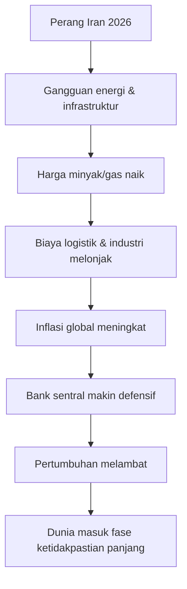
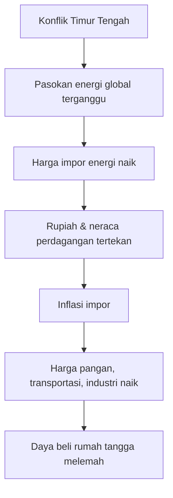
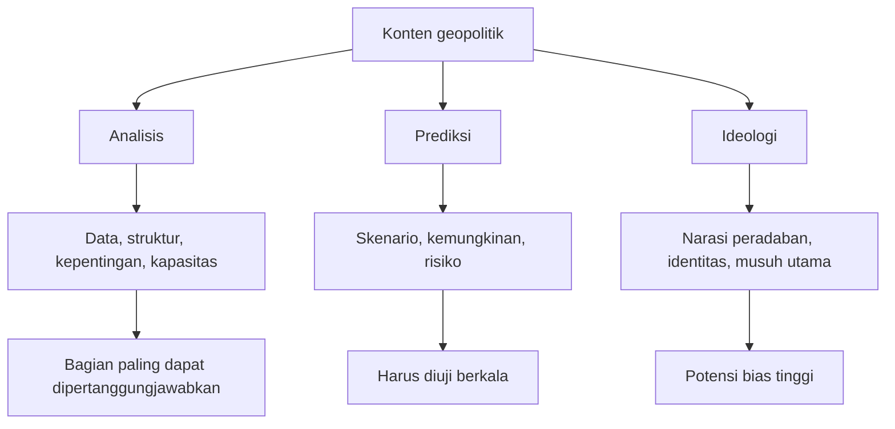

## 🎯 Pendahuluan: Wawancara Ini Menarik, Tetapi Tidak Boleh Ditelan Mentah-Mentah

Transkrip wawancara berjudul **“Political Prophet Predicts the Next Phase in Iran, Trump’s War Plan, & Israel’s Plot to Sabotage It”** menarik bukan karena semua isinya benar, melainkan karena ia memperlihatkan **bagaimana narasi geopolitik dibangun di era krisis**. Ada campuran antara analisis strategis yang masuk akal, prediksi yang spekulatif, kritik terhadap Amerika Serikat, pembacaan tentang Israel, tafsir tentang China dan Jepang, sampai klaim-klaim konspiratif yang sangat besar dan tidak semuanya memiliki dasar pembuktian yang memadai. 🧠

Itulah sebabnya tulisan ini tidak akan memperlakukan wawancara tersebut sebagai “kebenaran final”. Yang lebih penting justru adalah **membedah strukturnya**:

- gagasan apa yang terlihat rasional,
- bagian mana yang merupakan extrapolation (*penarikan kesimpulan yang terlalu jauh*),
- mana yang berubah menjadi conspiracy framing (*pembingkaian konspiratif*),
- dan bagaimana pembaca Indonesia sebaiknya memposisikan diri ketika menghadapi konten seperti ini.

Dalam masa perang, media dan percakapan publik sering bergerak ke dua kutub ekstrem: **propaganda resmi** di satu sisi, dan **anti-propaganda liar** di sisi lain. Keduanya bisa sama-sama menyesatkan jika tidak dibaca dengan kepala dingin. Maka artikel ini berangkat dari satu tesis sederhana:

> **Wawancara ini bernilai sebagai objek analisis, bukan sebagai dokumen fakta final. Ia penting karena memperlihatkan bagaimana rasa cemas global diterjemahkan menjadi ramalan, ideologi, dan tafsir geopolitik yang besar.**

<Callout type="important" title="Cara terbaik membaca transkrip seperti ini">
Jangan bertanya lebih dulu, “Apakah saya setuju?”

Bertanyalah: **bagian mana yang berbasis data, bagian mana yang berupa inferensi (penyimpulan), dan bagian mana yang murni spekulasi?** Dari situlah kualitas berpikir kita diuji.
</Callout>

---

## 🧭 1. Kerangka Besar Wawancara: Dunia Sedang Masuk ke Perang Panjang dan Tatanan Lama Mulai Retak

Argumen utama narasumber dalam wawancara itu adalah bahwa perang Iran 2026 tidak akan menjadi konflik singkat, melainkan **war of attrition** — *perang atrisi / perang pengikisan berkepanjangan* — mirip dengan perang Ukraina. Dalam logika ini, tidak ada pihak yang benar-benar bisa mengakui kalah dengan mudah, karena harga politik dari mundur terlalu mahal. Akibatnya, perang akan memanjang, merusak infrastruktur energi, memukul ekonomi global, dan memaksa banyak negara beradaptasi ke dunia yang lebih mahal, lebih keras, dan kurang stabil. 🌍

Kalau kita ambil bagian ini secara terpisah dari embel-embel lain, argumen tersebut **cukup masuk akal**. Memang benar bahwa perang modern tidak selalu selesai dengan kemenangan telak. Sering kali yang muncul justru kebuntuan strategis: satu pihak tidak cukup kuat untuk menang cepat, tetapi pihak lain juga tidak cukup lemah untuk runtuh. Dalam situasi seperti itu, konflik berubah menjadi pengurasan sumber daya jangka panjang.

Yang menarik, narasumber juga menempatkan energi sebagai pusat segalanya. Ini penting. Selama puluhan tahun, ekonomi dunia dibangun di atas asumsi bahwa energi — terutama minyak dan gas — akan tersedia cukup stabil dengan harga yang dapat diprediksi. Ketika asumsi ini rusak, yang terguncang bukan hanya pom bensin, tetapi juga ongkos kapal, biaya pupuk, harga pangan, listrik, industri, dan stabilitas mata uang.

Jadi, kalau ada satu bagian dari wawancara itu yang relatif paling kuat, itu adalah ini: **perang di kawasan energi dunia hampir pasti menciptakan guncangan lintas sektor**. Di titik ini, wawancara tersebut layak didengar.

---

## ⛽ 2. Klaim tentang Minyak US$200 per Barel: Mungkin Secara Psikologi Pasar, tetapi Tidak Boleh Diperlakukan sebagai Kepastian

Salah satu klaim yang paling mencolok adalah pernyataan bahwa Iran ingin mendorong harga minyak ke **US$200 per barel**. Secara retoris, kalimat seperti ini sangat kuat karena langsung memicu rasa takut. Angka bulat besar membuat ancaman terasa konkret. Tetapi dari sudut analisis, angka seperti itu harus dibaca hati-hati. 📈

Harga minyak memang bisa melonjak tajam saat perang mengganggu jalur pasokan. Namun harga tidak bergerak hanya karena “niat” satu aktor. Ia juga dipengaruhi oleh:

- kapasitas cadangan produsen lain,
- pelepasan cadangan strategis,
- respons permintaan global,
- substitusi energi,
- pengalihan rute pengiriman,
- dan tentu saja ekspektasi pasar.

Jadi, dalam konteks analisis, klaim “Iran menargetkan minyak US$200” lebih tepat dibaca sebagai **narasi tekanan strategis**, bukan sebagai proyeksi yang otomatis akan terjadi. Ada perbedaan besar antara *strategic intent* (*niat strategis*) dan *market outcome* (*hasil nyata di pasar*).

Namun demikian, narasi itu tetap penting karena menunjukkan bahwa perang bukan hanya duel militer. Ia juga merupakan **perang psikologi ekonomi**. Ketika pasar percaya pasokan akan terganggu, harga bisa naik bahkan sebelum gangguan total benar-benar terjadi.

---

## 🪖 3. Prediksi Bahwa AS Akan Mengirim Pasukan Darat: Mungkin Secara Teori, Sangat Mahal Secara Praktik

Narasumber meyakini bahwa pada akhirnya Amerika Serikat akan mengirim **ground troops** — *pasukan darat* — dan terjebak dalam *mission creep* (*pelebaran misi secara bertahap tanpa batas jelas*), mirip Vietnam. Ini adalah klaim yang dramatis, dan justru karena dramatis itulah kita perlu menilainya dengan tenang. ⚠️

Secara teori, memang ada kemungkinan bahwa konflik udara-laut berubah menjadi operasi darat terbatas. Misalnya untuk merebut titik strategis, terminal ekspor, pulau, atau pangkalan tertentu. Tetapi lompatan dari operasi terbatas ke invasi darat berskala besar tidak pernah sederhana. Ada beberapa alasan:

Pertama, Iran bukan Irak 2003. Ia memiliki kedalaman geografis, topografi pegunungan, kapasitas rudal, pengalaman perang asimetris, dan jaringan aktor non-negara. Biaya okupasi akan sangat besar.

Kedua, opini publik Amerika pasca-Irak dan Afghanistan jauh lebih sensitif terhadap perang tanpa tujuan akhir yang jelas. Gedung Putih tahu bahwa perang darat besar bisa menjadi bunuh diri politik.

Ketiga, invasi darat memerlukan lebih dari sekadar kemampuan militer. Ia memerlukan legitimasi politik, logistik jangka panjang, rencana administrasi pasca-penaklukan, dan toleransi korban yang tinggi. Semua itu sangat mahal.

Jadi, apakah prediksi “AS akan kirim pasukan darat” sepenuhnya mustahil? Tidak. Tetapi memperlakukannya sebagai skenario paling mungkin juga terlalu jauh. Yang lebih realistis adalah melihat adanya spektrum:

- serangan udara dan rudal,
- operasi maritim,
- sabotase dan special operations (*operasi khusus*),
- dukungan kepada aktor proksi,
- lalu baru kemungkinan sangat terbatas operasi darat taktis.

Bagian merah di ujung alur itu sengaja saya beri penekanan: **semakin ke kanan, semakin mahal, semakin berisiko, dan semakin kecil kemungkinan politiknya**.

---

## 🧨 4. War of Attrition: Di Sini Narasumber Mungkin Paling Tajam

Meskipun wawancara ini punya banyak bagian problematik, ada satu titik yang patut diapresiasi secara intelektual: pemahaman bahwa perang modern sering berubah menjadi **war of attrition**. Konsep ini sangat penting untuk dipahami pembaca Indonesia karena sering kali media umum terlalu fokus pada satu-dua serangan besar dan lupa pada struktur jangka panjang perang. 🧱

Perang atrisi berarti kemenangan tidak ditentukan oleh satu pertempuran besar, tetapi oleh kemampuan bertahan lebih lama daripada lawan. Yang diuji adalah:

- cadangan amunisi,
- ketahanan ekonomi,
- daya tahan politik domestik,
- kemampuan mengganti kerusakan,
- dan kemampuan menjaga moral publik.

Dalam perang semacam ini, yang hancur bukan hanya tank dan pangkalan, tetapi juga **kesabaran masyarakat, anggaran negara, dan kepercayaan investor**. Karena itu, ketika narasumber membandingkan Iran dengan Ukraina dalam arti perang panjang yang melelahkan, ada unsur kebenaran struktural di sana — meski tentu konteks kedua perang itu sangat berbeda.

---

## 🌐 5. Tiga Tren yang Disebut: De-industrialization, Remilitarization, Mercantilism

Salah satu bagian paling sistematis dari wawancara adalah ketika narasumber menyebut tiga tren besar akibat perang panjang:

1. **De-industrialization** — *deindustrialisasi*  
2. **Remilitarization** — *remiliterisasi / persenjataan ulang*  
3. **Mercantilism** — *merkantilisme / orientasi ekonomi yang lebih proteksionis dan berfokus pada kontrol pasokan*  

Mari kita bedah satu per satu.

### a. De-industrialization

Narasumber berargumen bahwa ketika energi murah hilang, banyak negara akan sulit mempertahankan model kota besar, industri tinggi, dan konsumsi masif. Ini ada benarnya sebagian, tetapi juga terlalu disederhanakan. Tidak semua negara akan otomatis “mundur” dari industri. Yang lebih mungkin adalah **restrukturisasi industri**: industri padat energi akan sangat tertekan, sedangkan sektor yang hemat energi, berteknologi tinggi, atau dekat sumber daya justru bisa naik.

Jadi istilah yang lebih akurat mungkin bukan deindustrialisasi universal, melainkan **rekomposisi industri global**.

### b. Remilitarization

Di sini argumennya lebih kuat. Kalau negara-negara merasa payung keamanan Amerika tidak lagi absolut, mereka akan terdorong memperkuat pertahanan sendiri. Jepang, Eropa, Korea Selatan, bahkan beberapa negara Teluk, bisa merasa harus meningkatkan kemampuan militernya. Ini bukan hal baru, tetapi perang besar memang mempercepat tren itu. 🪖

### c. Mercantilism

Ini juga menarik. Ketika globalisasi terguncang, negara-negara akan makin fokus pada **ketahanan rantai pasok**. Mereka ingin punya kontrol atas energi, pangan, mineral kritis, chip, pupuk, dan jalur logistik. Bahasa ekonominya bisa macam-macam — industrial policy, strategic autonomy, reshoring, friend-shoring — tetapi intinya sama: dunia bergerak ke arah yang lebih proteksionis dan lebih berhitung.

<Callout type="info" title="Mengapa bagian ini penting untuk Indonesia?">
Karena Indonesia ada di posisi unik. Kita bukan pusat perang, tetapi punya sumber daya, pasar besar, dan posisi strategis. Dalam dunia yang makin proteksionis, negara seperti Indonesia bisa naik nilainya — **asal mampu mengelola industrinya dengan cerdas**.
</Callout>

---

## 🇨🇳 6. Klaim tentang China: Separuh Tajam, Separuh Terlalu Sederhana

Wawancara itu menyebut China sebagai negara yang sangat bergantung pada energi dari Teluk, ingin perang cepat selesai, tetapi tidak punya kerangka geopolitik untuk menyelesaikan konflik. Ini perlu dibedah secara hati-hati. 🐉

Benar bahwa China sangat peduli pada stabilitas energi. Benar pula bahwa Beijing umumnya tidak suka ikut campur terlalu frontal dalam perang yang bukan langsung melibatkan wilayahnya. Tetapi mengatakan China “tidak punya grand strategy” — *strategi besar* — jelas terlalu menyederhanakan. Justru banyak pengamat melihat China punya grand strategy yang sangat jelas, hanya bentuknya berbeda dari Barat:

- memperluas pengaruh ekonomi,
- mengamankan pasokan energi,
- menghindari jebakan perang terbuka,
- memperkuat jalur perdagangan alternatif,
- dan memanfaatkan setiap distraksi strategis lawan.

Yang lebih tepat adalah ini: **China tidak selalu suka menjadi pemadam kebakaran militer**, tetapi ia sangat pandai menjadi pengelola kepentingan jangka panjang. Jadi kelemahan wawancara ini adalah kecenderungannya menjadikan China terlalu pasif dalam penjelasan, padahal sebenarnya Beijing cenderung pragmatis, sabar, dan sangat berorientasi pada kalkulasi kepentingan. 🧮

---

## 🇯🇵 7. Bagian tentang Jepang: Secara Historis Menarik, tetapi Bernuansa Romantis

Ketika membahas Jepang, narasumber terdengar sangat simpatik. Ia menyoroti daya tahan budaya Jepang, dari invasi Mongol, Restorasi Meiji, sampai kebangkitan pasca-Perang Dunia II. Lalu ia menyimpulkan bahwa kalau harus bertaruh, ia akan bertaruh pada Jepang. 🇯🇵

Ini bagian yang sangat menarik secara retorika karena narasumber membangun citra Jepang sebagai bangsa yang selalu bisa bangkit. Ada daya tarik naratif yang kuat di sini: **resilience** — *ketahanan / daya bangkit*. Dan memang, Jepang punya sejarah adaptasi yang luar biasa.

Tetapi analisis yang baik harus hati-hati agar tidak tergelincir ke romantisasi. Jepang tetap menghadapi masalah struktural yang nyata:

- populasi menua,
- beban utang besar,
- ketergantungan impor energi,
- dan tantangan keamanan kawasan yang makin kompleks.

Jadi, menghargai kekuatan budaya Jepang boleh, tetapi mengubahnya menjadi kesimpulan ekonomi-geopolitik tanpa batas juga berlebihan. **Budaya penting, tetapi struktur material tetap menentukan**.

---

## 🇰🇷 8. Korea Selatan dan Kaitan Monopoli dengan Fertilitas Rendah: Menarik, tapi Tidak Cukup Sebagai Penjelasan Tunggal

Ada bagian yang cukup cerdas ketika narasumber mengaitkan struktur ekonomi oligopolistik Korea Selatan dengan angka kelahiran yang sangat rendah. Gagasannya begini: ketika kompetisi sosial terlalu keras, biaya membesarkan anak terlalu mahal, dan semua orang berlomba masuk lembaga atau perusahaan elite, maka keluarga cenderung memilih punya sedikit anak atau tidak punya anak sama sekali. 👶

Ini bukan argumen yang sepenuhnya salah. Memang ada hubungan antara biaya hidup, tekanan pendidikan, harga perumahan, dan keputusan memiliki anak. Tetapi menjadikannya sebagai penjelasan utama juga terlalu reduktif. Tingkat fertilitas rendah biasanya lahir dari kombinasi besar:

- urbanisasi,
- biaya perumahan,
- ketidaksetaraan gender,
- budaya kerja ekstrem,
- pendidikan mahal,
- dan ketidakpastian masa depan.

Jadi, yang kuat dari bagian ini adalah ia menyoroti **hubungan antara sistem ekonomi dan psikologi keluarga**. Yang lemah adalah kecenderungannya mengemas persoalan kompleks seolah punya satu penyebab dominan.

---

## 📉 9. Asia Tenggara, Krisis Energi, dan Relevansinya bagi Indonesia

Bagi pembaca Indonesia, salah satu bagian paling relevan dari wawancara ini adalah ketika narasumber mengatakan bahwa Asia Tenggara akan sangat terpukul oleh krisis energi Timur Tengah. Ini sangat masuk akal. Negara-negara Asia, termasuk Indonesia, bergantung pada stabilitas pasokan energi dan logistik global. Ketika jalur Teluk terganggu, dampaknya tidak harus selalu berupa “kehabisan bahan bakar total”, tetapi bisa muncul sebagai:

- harga energi yang lebih mahal,
- biaya impor yang naik,
- tekanan pada kurs,
- kenaikan harga tiket dan logistik,
- serta imported inflation (*inflasi impor*). 🚚

Namun kita juga perlu berhati-hati terhadap bahasa hiperbolik seperti “seluruh Asia Tenggara kehabisan bahan bakar” atau “rationing total akan segera terjadi”. Dalam konten geopolitik populer, ada kecenderungan untuk mengubah risiko menjadi kepastian. Padahal, respons negara sangat bervariasi. Ada yang punya stok lebih kuat, ada yang punya fleksibilitas fiskal, ada yang bisa mengalihkan pasokan, ada yang lebih rapuh.

Bagi Indonesia, pelajaran terpenting bukan rasa panik, tetapi **urgensi ketahanan energi dan logistik**. Negara sebesar Indonesia tidak boleh bergantung pada asumsi bahwa dunia akan selalu tenang.

---

## 🏛️ 10. Bagian Paling Bermasalah: Konspirasi Besar, Klaim “Greater Israel”, dan Pembacaan Eschatology

Sekarang kita masuk ke bagian yang paling problematik. Wawancara ini bergerak dari analisis perang dan ekonomi menuju klaim-klaim yang jauh lebih spekulatif: proyek *Greater Israel*, sabotase terencana terhadap Al-Aqsa, jejaring “kekuatan bayangan”, hingga kerja sama lintas abad antara berbagai kelompok rahasia. Di sini kualitas argumen berubah tajam. 🚨

Perlu dikatakan dengan jujur: **bagian ini tidak bisa diperlakukan sebagai analisis geopolitik yang kuat tanpa bukti yang sangat berat**. Mengapa?

Karena semakin besar sebuah klaim, semakin tinggi standar pembuktiannya. Mengatakan “ada kepentingan faksi keras dalam politik Israel” adalah satu hal. Mengatakan “ada rencana berabad-abad yang dijalankan oleh jaringan rahasia lintas agama dan organisasi” adalah hal lain sama sekali.

Di sinilah wawancara tersebut melompat dari analisis ke **mythic geopolitics** — *geopolitik yang dibingkai seperti mitos besar kosmik*. Pola ini sangat umum di masa krisis. Orang cenderung merasa bahwa peristiwa besar pasti punya dalang besar. Secara psikologis ini memberi rasa keteraturan: dunia yang kacau terasa lebih bisa dijelaskan kalau ada “rencana besar” di baliknya.

Masalahnya, pola seperti ini sangat mudah jatuh ke:

- demonisasi kolektif,
- simplifikasi sejarah,
- tuduhan tanpa verifikasi,
- dan pembenaran kebencian terhadap kelompok tertentu.

Sebagai penulis, kita harus tegas membedakan antara **kritik kebijakan negara** dan **narasi esensialis tentang agama/etnis/kelompok global**. Itu garis etik yang sangat penting. ✋

<Callout type="warning" title="Catatan editorial penting">
Kritik terhadap pemerintah Israel, pemerintah AS, atau strategi perang negara tertentu adalah sah dalam ruang analisis politik. Tetapi ketika argumen bergeser menjadi tuduhan luas tentang kelompok etnis/agama sebagai aktor tunggal sejarah, kita sudah masuk wilayah yang berbahaya secara intelektual maupun moral.
</Callout>

---

## 🔥 11. Mengapa Narasi Apokaliptik Sangat Laku Saat Perang?

Wawancara ini tidak hanya bicara soal tank, minyak, atau diplomasi. Ia juga dipenuhi nada **eschatological** — *eskatologis / berkaitan dengan akhir zaman atau puncak sejarah suci*. Ini sangat penting dibahas, karena justru di situlah daya tarik emosional konten seperti ini. 🌩️

Ketika dunia terasa goyah, orang mencari penjelasan yang lebih besar daripada ekonomi biasa. Mereka ingin tahu: “Apakah ini sekadar konflik geopolitik, atau bagian dari pertarungan sejarah yang menentukan nasib peradaban?” Konten yang memakai bahasa akhir zaman, nubuat, atau proyek peradaban besar sangat efektif karena memberi rasa makna di tengah kekacauan.

Namun ada bahayanya. Narasi apokaliptik cenderung:

- menghapus nuansa,
- mempersempit ruang kompromi,
- membuat lawan terlihat sebagai kekuatan mutlak jahat,
- dan menjadikan perang terasa tak terhindarkan.

Padahal, dalam dunia nyata, banyak perang justru disusun dari salah hitung, kepentingan elite, kalkulasi domestik, dan krisis legitimasi — bukan semata “takdir sejarah suci”. Jadi pembaca harus waspada ketika analisis geopolitik mulai terasa seperti naskah wahyu politik.

---

## 🇺🇸 12. Donald Trump dalam Wawancara Ini: Aktor, Korban Manipulasi, atau Pemain Sadar?

Salah satu bagian yang cukup menarik adalah ketika narasumber mengajukan empat kemungkinan tentang peran Donald Trump: ia bisa jadi hanya aktor, bisa jadi merasa punya panggilan sejarah, bisa jadi dipaksa keadaan oleh Israel, atau bisa jadi dikendalikan oleh kompromi/blackmail (*pemerasan / tekanan berbasis kerentanan pribadi*). 🎭

Di permukaan, ini terdengar seperti “berimbang” karena memberi banyak kemungkinan. Tetapi secara metodologis, model seperti ini juga problematik. Kenapa? Karena ketika semua kemungkinan dibuka tanpa standar verifikasi yang jelas, kita sebenarnya tidak sedang menganalisis — kita sedang **memperluas ruang spekulasi**.

Yang lebih produktif justru bertanya begini:

- insentif politik Trump apa,
- siapa penasihat intinya,
- tekanan elektoralnya seperti apa,
- bagaimana struktur aliansi AS-Israel bekerja,
- dan bagaimana persepsi ancaman dibangun di lingkaran keamanan nasional AS.

Itu lebih membumi, lebih bisa diuji, dan lebih berguna dibanding mendramatisasi semua kemungkinan sekaligus.

---

## 📚 13. Mengapa Wawancara Ini Bergeser dari Geopolitik ke “Krisis Peradaban Barat”?

Paruh akhir wawancara bergerak makin jauh dari Iran dan Timur Tengah menuju isu lain: Kanada, Eropa, imigrasi, “keruntuhan Barat”, universitas, DEI, hingga pembelaan terhadap kanon klasik Barat seperti Homer, Plato, Dante, Shakespeare, dan Alkitab. Bagi sebagian penonton, ini mungkin terasa loncat. Tapi sebenarnya ada logikanya. 🏛️

Narasumber sedang membangun satu narasi besar: bahwa perang, migrasi, krisis energi, kemerosotan budaya, dan hilangnya identitas Barat semuanya saling terhubung dalam satu cerita kemunduran peradaban. Ini bukan sekadar analisis kebijakan. Ini adalah **civilizational narrative** — *narasi peradaban*. Dan narasi semacam ini sangat kuat secara emosi karena memberi kesan bahwa semua krisis adalah bagian dari satu pola yang konsisten.

Masalahnya, narasi peradaban sering terlalu luas dan terlalu menyerap segalanya. Setiap fenomena akhirnya dijadikan bukti. Akibatnya, kemampuan membedakan sebab langsung dan sebab tidak langsung menjadi lemah. Semua terasa terkait, padahal tidak semua benar-benar berada dalam satu rantai kausal yang sama.

Tetapi ada satu bagian yang menurut saya justru patut direnungkan: pembelaannya terhadap klasik-klasik besar. Ketika narasumber mengatakan bahwa Plato, Homer, Dante, Shakespeare, dan Alkitab berisi pertanyaan abadi tentang manusia, ada titik yang valid di sana. Kritik terhadap kemiskinan intelektual kampus modern bukanlah hal yang aneh. Yang perlu dijaga adalah agar pembelaan terhadap warisan intelektual tidak berubah menjadi kendaraan untuk politik kebencian.

---

## 🧠 14. Pelajaran Utama untuk Pembaca Indonesia: Bedakan Analisis, Prediksi, dan Ideologi

Kalau saya harus memeras seluruh transkrip ini menjadi satu pelajaran utama bagi pembaca Indonesia, itu adalah ini: **belajarlah membedakan tiga lapisan dalam setiap konten geopolitik**.

### Lapisan pertama: analisis
Ini bagian yang berbicara tentang struktur nyata: energi, logistik, insentif negara, kapasitas militer, tekanan fiskal, rantai pasok, dan kebijakan.

### Lapisan kedua: prediksi
Ini bagian ketika analis mulai mengatakan apa yang “mungkin akan terjadi”. Di sini sudah ada risiko salah, tetapi masih bisa masuk akal kalau berbasis pola dan data.

### Lapisan ketiga: ideologi
Ini bagian paling berbahaya sekaligus paling menggoda. Di sinilah analisis sering diam-diam berubah menjadi pembenaran bagi keyakinan politik, agama, identitas, atau prasangka yang sudah lebih dulu dimiliki.

Wawancara ini punya ketiganya. Dan justru karena itulah ia menarik untuk dibedah.

---

## 🇮🇩 15. Relevansi untuk BangunAI Blog dan Pembaca Indonesia

Kenapa tulisan seperti ini penting untuk blog berbahasa Indonesia? Karena pembaca Indonesia hari ini dibanjiri konten global: transkrip YouTube, potongan podcast, utas Twitter/X, video geopolitik, dan potongan “bocoran intelijen” dari berbagai kubu. Banyak di antaranya terdengar cerdas, meyakinkan, bahkan profetik — seolah-olah pembicara melihat sesuatu yang tidak dilihat orang lain. 🔍

Masalahnya, kecerdasan retorika tidak sama dengan keandalan analisis. Seseorang bisa terdengar sangat tajam sambil menyelipkan lompatan logika besar. Di sinilah pembaca Indonesia perlu naik kelas. Kita tidak cukup hanya menjadi penonton yang terkagum-kagum. Kita harus menjadi pembaca yang **mampu memisahkan insight dari ilusi**.

Untuk konteks Indonesia, pertanyaan terpenting bukan “apakah semua ramalan narasumber ini benar?” Pertanyaan yang lebih berguna adalah:

- jika konflik energi global memanjang, apa dampaknya ke rupiah,
- apa dampaknya ke subsidi energi,
- bagaimana efeknya ke industri, transportasi, dan pangan,
- dan bagaimana Indonesia seharusnya menyiapkan diri?

Artinya, nilai terbesar dari konten ini bukan untuk membuat kita mabuk konspirasi, melainkan untuk mengasah kepekaan kita membaca risiko nyata.

---

## 📌 16. Kesimpulan: Konten Seperti Ini Perlu Didengar, Tetapi Lebih Perlu Dibongkar

Wawancara “Political Prophet” ini adalah contoh klasik dari konten geopolitik era digital: **cerdas, luas, emosional, sebagian tajam, sebagian liar, dan sangat mudah memengaruhi cara orang memandang dunia**. Ia punya kualitas retoris yang tinggi. Ia memadukan sejarah, perang, energi, identitas, dan peradaban menjadi satu cerita besar. Dan justru karena itu ia tidak boleh diterima secara pasif. 🧩

Ada bagian-bagian yang layak dipertimbangkan serius, terutama soal:

- kemungkinan perang panjang,
- kerentanan energi global,
- remiliterisasi dunia,
- dan ketahanan rantai pasok.

Tetapi ada pula bagian-bagian yang harus ditahan keras dengan skeptisisme intelektual, terutama ketika argumen mulai bergerak ke:

- konspirasi total,
- demonisasi kelompok,
- ramalan apokaliptik,
- dan klaim sejarah raksasa tanpa bukti memadai.

Maka, cara paling matang membaca wawancara ini adalah begini: **ambil kerangka risikonya, uji datanya, tolak lompatan konspiratifnya, dan pertahankan kejernihan berpikirnya**.

Dalam dunia yang makin dipenuhi kebisingan informasi, kemampuan untuk tidak cepat percaya justru bukan tanda sinisme, melainkan tanda kedewasaan intelektual. Dan itu mungkin kualitas paling penting bagi pembaca geopolitik hari ini. ✨

---

## 🔖 Catatan Editorial

Artikel ini merupakan pembedahan kritis atas sebuah transkrip wawancara publik. Beberapa klaim dalam transkrip bersifat spekulatif, sensitif, atau tidak memiliki pembuktian independen yang memadai. Karena itu, artikel ini sengaja ditulis dalam format **analisis narasi**, bukan sebagai pengesahan terhadap seluruh isi wawancara.

## 📚 Sumber Dasar

- Transkrip wawancara: *Political Prophet Predicts the Next Phase in Iran, Trump’s War Plan, & Israel’s Plot to Sabotage It*
- Sumber video: YouTube (`https://www.youtube.com/watch?v=2K2nQsTTjQE`)
