## 🌊 Pembuka: Raksasa yang Tertidur di Dalam Dirimu

Di dalam dirimu — tepat saat ini, detik ini juga — bersemayam sebuah kekuatan yang ukurannya hampir tak bisa dibayangkan.

Kekuatan yang mampu **menyembuhkan** penyakit yang telah bertahun-tahun menggerogoti tubuhmu. Kekuatan yang mampu **menarik kemakmuran** yang tak terbayangkan sebelumnya. Kekuatan yang mampu **membangun hubungan** yang harmonis dan penuh cinta. Kekuatan yang mampu **mengubah mimpi paling liar** menjadi realitas yang bisa kamu sentuh.

Tapi bagi sebagian besar manusia, kekuatan ini tertidur. Ia adalah raksasa baik hati yang menunggu dalam diam — menunggu perintah untuk bangkit dan mengabdikan dirinya kepadamu.

Kita menjalani hidup hanya dengan sepersekian kecil dari kapasitas sejati kita. Kita berjuang, kita berusaha keras, kita mencoba memaksakan hasil dengan tenaga kemauan (*willpower*) dari pikiran sadar yang sangat terbatas. Kita bertanya-tanya mengapa hidup terasa begitu berat, mengapa kita terus tersandung pada hambatan yang sama berulang kali — tanpa menyadari bahwa kita sering kali sedang **melawan arus kekuatan dalam kita sendiri**.

Kunci untuk mentransformasi hidupmu secara radikal tidak terletak pada perjuangan yang lebih keras melawan dunia luar — melainkan pada kemampuan untuk **berkomunikasi dengan direktur dunia batinmu: pikiran bawah sadarmu**.

Inilah yang diajarkan Dr. Joseph Murphy sepanjang hidupnya. Dan inilah yang akan kita jelajahi bersama.

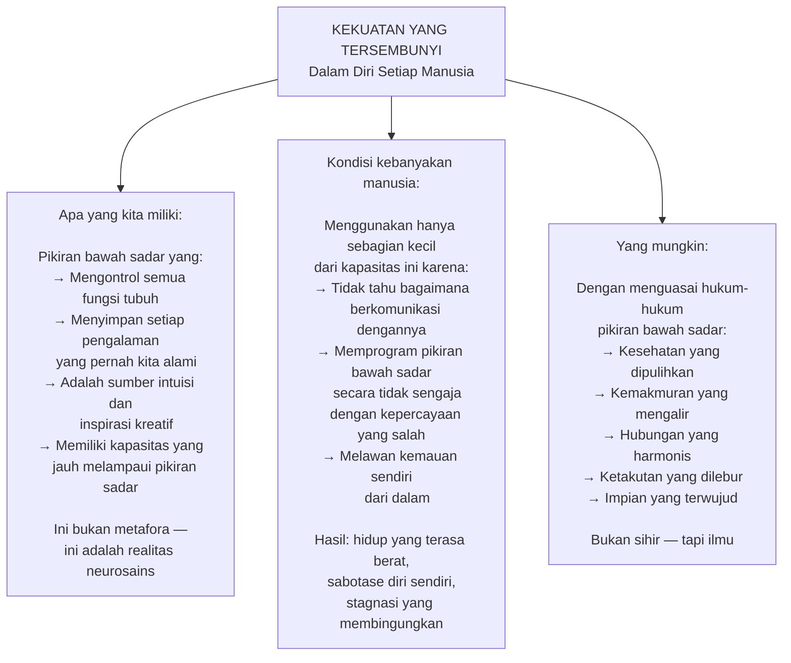
```mermaid
graph TD
    A["KEKUATAN YANG TERSEMBUNYI\nDalam Diri Setiap Manusia"]
    
    A --> B["Apa yang kita miliki:\n\nPikiran bawah sadar yang:\n→ Mengontrol semua fungsi tubuh\n→ Menyimpan setiap pengalaman\n   yang pernah kita alami\n→ Adalah sumber intuisi dan\n   inspirasi kreatif\n→ Memiliki kapasitas yang\n   jauh melampaui pikiran sadar\n\nIni bukan metafora —\nini adalah realitas neurosains"]
    
    A --> C["Kondisi kebanyakan manusia:\n\nMenggunakan hanya sebagian kecil\ndari kapasitas ini karena:\n→ Tidak tahu bagaimana\n   berkomunikasi dengannya\n→ Memprogram pikiran bawah sadar\n   secara tidak sengaja\n   dengan kepercayaan yang salah\n→ Melawan kemauan sendiri\n   dari dalam\n\nHasil: hidup yang terasa berat,\nsabotase diri sendiri,\nstagnasi yang membingungkan"]
    
    A --> D["Yang mungkin:\n\nDengan menguasai hukum-hukum\npikiran bawah sadar:\n→ Kesehatan yang dipulihkan\n→ Kemakmuran yang mengalir\n→ Hubungan yang harmonis\n→ Ketakutan yang dilebur\n→ Impian yang terwujud\n\nBukan sihir — tapi ilmu"]
```

---

## ⚓ Bab 1: Dua Kapten Kapalmu — Pikiran Sadar dan Pikiran Bawah Sadar

Untuk memahami kekuatan yang tersembunyi dalam diri kita, kita harus terlebih dahulu memahami **arsitektur pikiran kita sendiri**.

Kita bukan entitas tunggal yang monolitik. Kesadaran kita adalah **sistem ganda** (*dual system*) yang terdiri dari dua kecerdasan berbeda. Dua kapten yang mengemudikan kapal kehidupan kita, sering kali dengan intensi dan bahasa yang sama sekali berbeda.

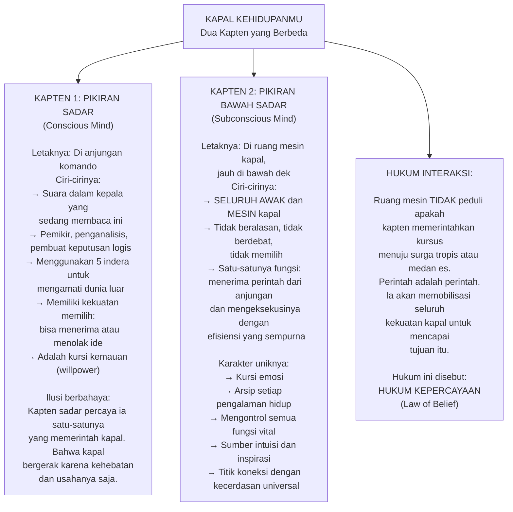
```mermaid
graph TD
    A["KAPAL KEHIDUPANMU\nDua Kapten yang Berbeda"]
    
    A --> B["KAPTEN 1: PIKIRAN SADAR\n(Conscious Mind)\n\nLetaknya: Di anjungan komando\nCiri-cirinya:\n→ Suara dalam kepala yang\n  sedang membaca ini\n→ Pemikir, penganalisis,\n  pembuat keputusan logis\n→ Menggunakan 5 indera untuk\n  mengamati dunia luar\n→ Memiliki kekuatan memilih:\n  bisa menerima atau menolak ide\n→ Adalah kursi kemauan (willpower)\n\nIlusi berbahaya:\nKapten sadar percaya ia satu-satunya\nyang memerintah kapal. Bahwa kapal\nbergerak karena kehebatan\ndan usahanya saja."]
    
    A --> C["KAPTEN 2: PIKIRAN BAWAH SADAR\n(Subconscious Mind)\n\nLetaknya: Di ruang mesin kapal,\njauh di bawah dek\nCiri-cirinya:\n→ SELURUH AWAK dan MESIN kapal\n→ Tidak beralasan, tidak berdebat,\n  tidak memilih\n→ Satu-satunya fungsi:\n  menerima perintah dari anjungan\n  dan mengeksekusinya dengan\n  efisiensi yang sempurna\n\nKarakter uniknya:\n→ Kursi emosi\n→ Arsip setiap pengalaman hidup\n→ Mengontrol semua fungsi vital\n→ Sumber intuisi dan inspirasi\n→ Titik koneksi dengan\n  kecerdasan universal"]
    
    A --> D["HUKUM INTERAKSI:\n\nRuang mesin TIDAK peduli apakah\nkapten memerintahkan kursus\nmenuju surga tropis atau medan es.\nPerintah adalah perintah.\nIa akan memobilisasi seluruh\nkekuatan kapal untuk mencapai\ntujuan itu.\n\nHukum ini disebut:\nHUKUM KEPERCAYAAN\n(Law of Belief)"]
```

### Karakteristik Terpenting: Pikiran Bawah Sadar adalah Netral dan Tidak Selektif

Bayangkan sebuah kebun dengan tanah paling subur di dunia. Tanah ini tidak peduli apakah kamu menanam benih mawar atau benih tanaman beracun. Ia akan menerima benih apapun yang diberikan kepadanya dan akan menumbuhkannya dengan energi dan dedikasi yang sama.

**Pikiran bawah sadarmu bekerja persis seperti itu.**

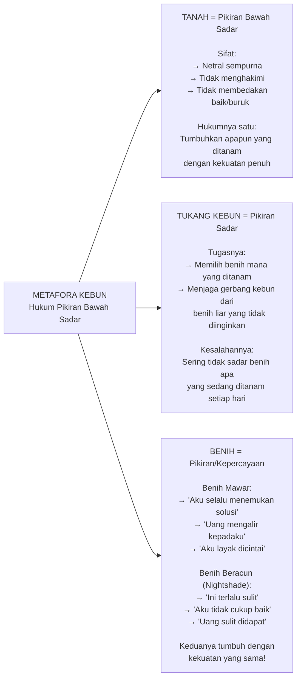
```mermaid
graph LR
    A["METAFORA KEBUN\nHukum Pikiran Bawah Sadar"]
    
    A --> B["TANAH = Pikiran Bawah Sadar\n\nSifat:\n→ Netral sempurna\n→ Tidak menghakimi\n→ Tidak membedakan\n   baik/buruk\n\nHukumnya satu:\nTumbuhkan apapun yang ditanam\ndengan kekuatan penuh"]
    
    A --> C["TUKANG KEBUN = Pikiran Sadar\n\nTugasnya:\n→ Memilih benih mana yang ditanam\n→ Menjaga gerbang kebun dari\n   benih liar yang tidak diinginkan\n\nKesalahannya:\nSering tidak sadar benih apa\nyang sedang ditanam setiap hari"]
    
    A --> D["BENIH = Pikiran/Kepercayaan\n\nBenih Mawar:\n→ 'Aku selalu menemukan solusi'\n→ 'Uang mengalir kepadaku'\n→ 'Aku layak dicintai'\n\nBenih Beracun (Nightshade):\n→ 'Ini terlalu sulit'\n→ 'Aku tidak cukup baik'\n→ 'Uang sulit didapat'\n\nKeduanya tumbuh dengan\nkekuatan yang sama!"]
```

### Konflik Dua Kapten: Akar Semua Sabotase Diri

Inilah akar dari hampir semua penderitaan dan perjuangan manusia:

> Kapten sadar berteriak: *"Aku ingin berani dan percaya diri!"*  
> Tapi di dalam hatinya, dalam kepercayaan terdalam yang terbentuk sejak masa kanak-kanak, ia merasakan: *"Aku tidak cukup baik. Aku tidak layak."*

Ruang mesin menerima **kedua** perintah ini. Yang mana yang dipatuhinya?

**Selalu, tanpa pengecualian, yang lebih kuat — yang diisi dengan lebih banyak perasaan dan keyakinan.**

Ini bukan kegagalan kemauan. Ini adalah kemenangan hukum kepercayaan. Dan inilah mengapa seseorang bisa **menyabotase dirinya sendiri** meskipun telah berusaha keras secara sadar.

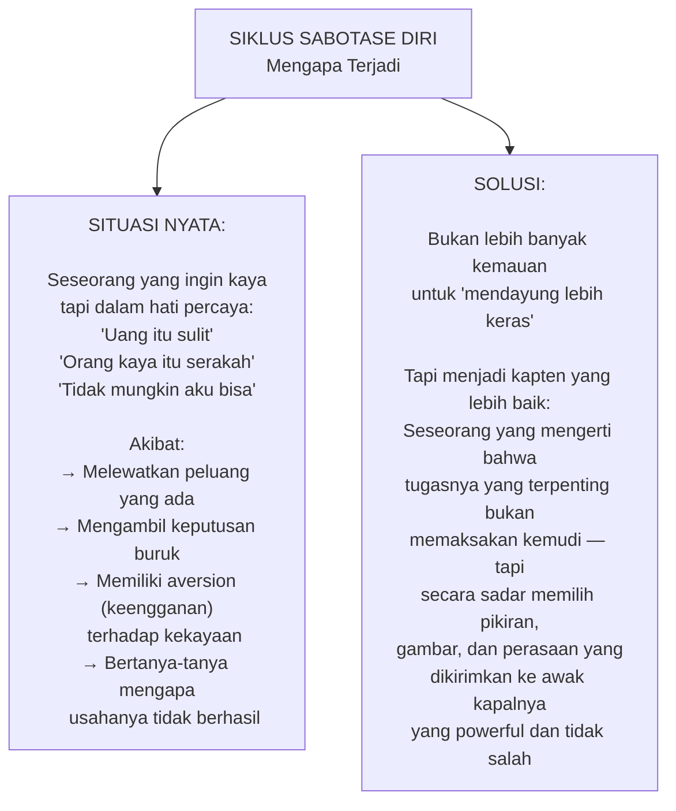
```mermaid
graph TD
    A["SIKLUS SABOTASE DIRI\nMengapa Terjadi"]
    
    A --> B["SITUASI NYATA:\n\nSeseorang yang ingin kaya\ntapi dalam hati percaya:\n'Uang itu sulit'\n'Orang kaya itu serakah'\n'Tidak mungkin aku bisa'\n\nAkibat:\n→ Melewatkan peluang yang ada\n→ Mengambil keputusan buruk\n→ Memiliki aversion (keengganan)\n   terhadap kekayaan\n→ Bertanya-tanya mengapa\n   usahanya tidak berhasil"]
    
    A --> C["SOLUSI:\n\nBukan lebih banyak kemauan\nuntuk 'mendayung lebih keras'\n\nTapi menjadi kapten yang lebih baik:\nSeseorang yang mengerti bahwa\ntugasnya yang terpenting bukan\nmemaksakan kemudi — tapi\nsecara sadar memilih pikiran,\ngambar, dan perasaan yang\ndikirimkan ke awak kapalnya\nyang powerful dan tidak salah"]
```

### Latihan: Log Kapten dan Ruang Mesin

Selama 1 minggu, dedikasikan 5 menit di akhir hari untuk menulis dua kolom:

- **Kolom 1 — Perintah Kapten**: Apa yang secara sadar ingin kamu lakukan hari ini?
- **Kolom 2 — Tindakan Awak**: Apa yang benar-benar terjadi? Perilaku otomatis apa yang muncul?

Ini bukan untuk menghakimi diri sendiri — tapi untuk melihat dengan jelas **celah antara keinginan sadar dan program bawah sadarmu** saat ini.

---

## 🌱 Bab 2: Hukum Tertinggi — Pikiranmu Mempercayai Apapun yang Kamu Katakan

Hukum ini adalah kunci utama untuk membuka potensi penuhmu:

> **"Pikiran bawah sadarmu akan menerima sebagai kebenaran mutlak setiap ide, pikiran, atau kepercayaan yang disajikan oleh pikiran sadarmu dengan keyakinan dan perasaan yang cukup."**

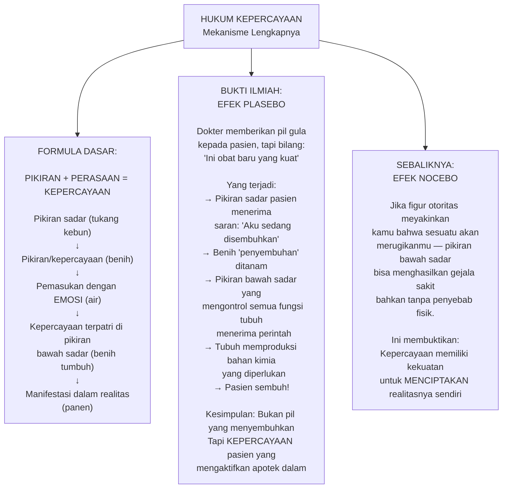
```mermaid
graph TD
    A["HUKUM KEPERCAYAAN\nMekanisme Lengkapnya"]
    
    A --> B["FORMULA DASAR:\n\nPIKIRAN + PERASAAN = KEPERCAYAAN\n\nPikiran sadar (tukang kebun)\n↓\nPikiran/kepercayaan (benih)\n↓\nPemasukan dengan EMOSI (air)\n↓\nKepercayaan terpatri di pikiran\nbawah sadar (benih tumbuh)\n↓\nManifestasi dalam realitas\n(panen)"]
    
    A --> C["BUKTI ILMIAH:\nEFEK PLASEBO\n\nDokter memberikan pil gula\nkepada pasien, tapi bilang:\n'Ini obat baru yang kuat'\n\nYang terjadi:\n→ Pikiran sadar pasien menerima\n  saran: 'Aku sedang disembuhkan'\n→ Benih 'penyembuhan' ditanam\n→ Pikiran bawah sadar yang\n  mengontrol semua fungsi tubuh\n  menerima perintah\n→ Tubuh memproduksi bahan kimia\n  yang diperlukan\n→ Pasien sembuh!\n\nKesimpulan: Bukan pil yang menyembuhkan\nTapi KEPERCAYAAN pasien yang\nmengaktifkan apotek dalam"]
    
    A --> D["SEBALIKNYA:\nEFEK NOCEBO\n\nJika figur otoritas meyakinkan\nkamu bahwa sesuatu akan\nmerugikanmu — pikiran bawah sadar\nbisa menghasilkan gejala sakit\nbahkan tanpa penyebab fisik.\n\nIni membuktikan:\nKepercayaan memiliki kekuatan\nuntuk MENCIPTAKAN realitasnya sendiri"]
```

### Emosi adalah Air yang Membuat Benih Berkecambah

Ini adalah salah satu insight terpenting dari seluruh ajaran Joseph Murphy:

**Pikiran tanpa perasaan memiliki sangat sedikit kekuatan untuk meresap ke pikiran bawah sadar.**

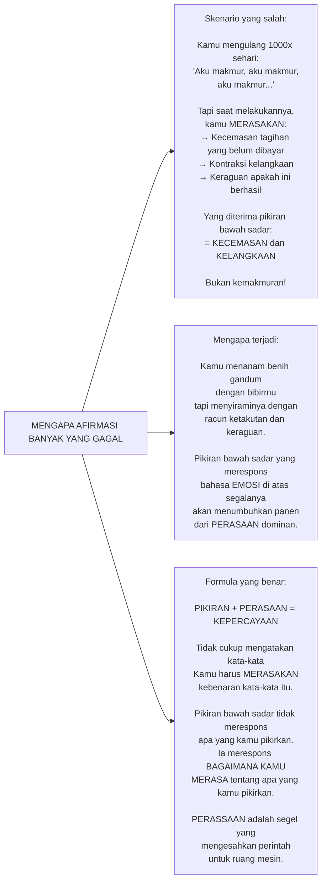
```mermaid
graph LR
    A["MENGAPA AFIRMASI BANYAK YANG GAGAL"]
    
    A --> B["Skenario yang salah:\n\nKamu mengulang 1000x sehari:\n'Aku makmur, aku makmur,\naku makmur...'\n\nTapi saat melakukannya,\nkamu MERASAKAN:\n→ Kecemasan tagihan yang belum dibayar\n→ Kontraksi kelangkaan\n→ Keraguan apakah ini berhasil\n\nYang diterima pikiran bawah sadar:\n= KECEMASAN dan KELANGKAAN\n\nBukan kemakmuran!"]
    
    A --> C["Mengapa terjadi:\n\nKamu menanam benih gandum\ndengan bibirmu\ntapi menyiraminya dengan\nracun ketakutan dan keraguan.\n\nPikiran bawah sadar yang merespons\nbahasa EMOSI di atas segalanya\nakan menumbuhkan panen\ndari PERASAAN dominan."]
    
    A --> D["Formula yang benar:\n\nPIKIRAN + PERASAAN = KEPERCAYAAN\n\nTidak cukup mengatakan kata-kata\nKamu harus MERASAKAN\nkebenaran kata-kata itu.\n\nPikiran bawah sadar tidak merespons\napa yang kamu pikirkan.\nIa merespons BAGAIMANA KAMU\nMERASA tentang apa yang kamu pikirkan.\n\nPERASSAAN adalah segel yang\nmengesahkan perintah\nuntuk ruang mesin."]
```

---

## 🎨 Bab 3: Bahasa Pikiran Bawah Sadar — Imajinasi Mengungguli Logika

Ada kesalahpahaman budaya yang sangat merusak: kita percaya bahwa **kemauan** (*willpower*) adalah alat terkuat untuk mengubah diri. Kita mencoba dengan disiplin militer untuk "memaksa" diri berubah.

Dan hampir selalu, kita gagal secara spektakuler.

Psikolog Prancis Émile Coué merumuskan **Hukum Upaya Terbalik** (*Law of Reversed Effort*):

> *"Ketika kemauan dan imajinasi berkonflik, imajinasi selalu menang — tanpa pengecualian."*

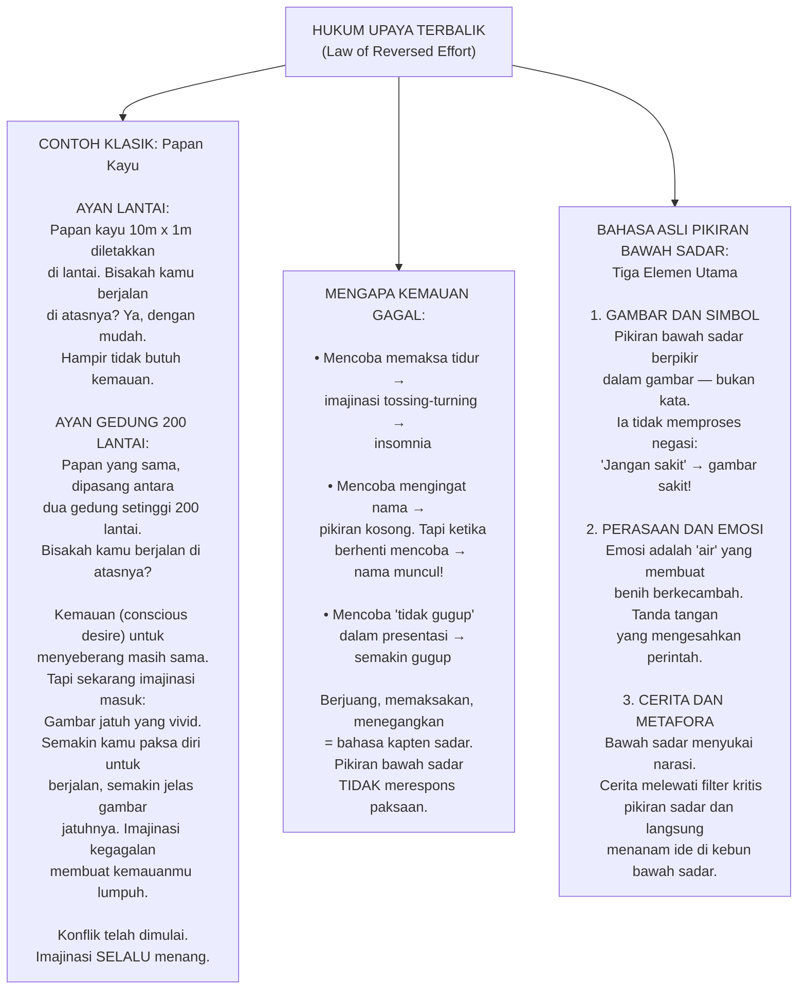
```mermaid
graph TD
    A["HUKUM UPAYA TERBALIK\n(Law of Reversed Effort)"]
    
    A --> B["CONTOH KLASIK: Papan Kayu\n\nAYAN LANTAI:\nPapan kayu 10m x 1m diletakkan\ndi lantai. Bisakah kamu berjalan\ndi atasnya? Ya, dengan mudah.\nHampir tidak butuh kemauan.\n\nAYAN GEDUNG 200 LANTAI:\nPapan yang sama, dipasang antara\ndua gedung setinggi 200 lantai.\nBisakah kamu berjalan di atasnya?\n\nKemauan (conscious desire) untuk\nmenyeberang masih sama.\nTapi sekarang imajinasi masuk:\nGambar jatuh yang vivid.\nSemakin kamu paksa diri untuk\nberjalan, semakin jelas gambar\njatuhnya. Imajinasi kegagalan\nmembuat kemauanmu lumpuh.\n\nKonflik telah dimulai.\nImajinasi SELALU menang."]
    
    A --> C["MENGAPA KEMAUAN GAGAL:\n\n• Mencoba memaksa tidur →\n  imajinasi tossing-turning →\n  insomnia\n\n• Mencoba mengingat nama →\n  pikiran kosong. Tapi ketika\n  berhenti mencoba → nama muncul!\n\n• Mencoba 'tidak gugup'\n  dalam presentasi →\n  semakin gugup\n\nBerjuang, memaksakan, menegangkan\n= bahasa kapten sadar.\nPikiran bawah sadar\nTIDAK merespons paksaan."]
    
    A --> D["BAHASA ASLI PIKIRAN BAWAH SADAR:\nTiga Elemen Utama\n\n1. GAMBAR DAN SIMBOL\n   Pikiran bawah sadar berpikir\n   dalam gambar — bukan kata.\n   Ia tidak memproses negasi:\n   'Jangan sakit' → gambar sakit!\n\n2. PERASAAN DAN EMOSI\n   Emosi adalah 'air' yang membuat\n   benih berkecambah. Tanda tangan\n   yang mengesahkan perintah.\n\n3. CERITA DAN METAFORA\n   Bawah sadar menyukai narasi.\n   Cerita melewati filter kritis\n   pikiran sadar dan langsung\n   menanam ide di kebun bawah sadar."]
```

### Imajinasi: Bengkel Realitas Masa Depan

Kesalahpahaman terbesar tentang imajinasi adalah menganggapnya sebagai **escapism** (*pelarian dari kenyataan*) — mimpi siang hari yang tidak produktif.

Tidak ada yang lebih jauh dari kebenaran.

> *"Imajinasi yang digunakan secara disiplin bukan pelarian dari realitas. Ia adalah bengkel di mana realitas masa depan ditempa."*

Setiap jembatan, setiap simfoni, setiap perusahaan — pertama kali ada sebagai **gambar dalam imajinasi seseorang**.

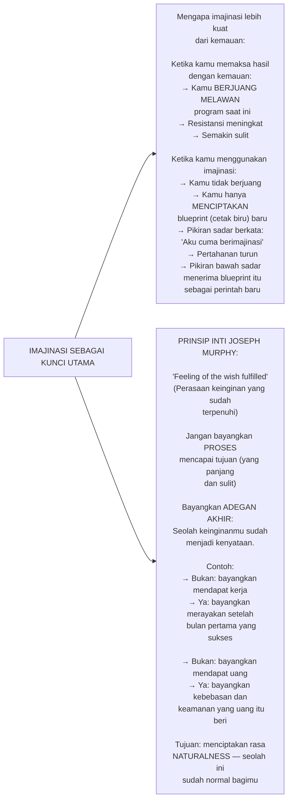
```mermaid
graph LR
    A["IMAJINASI SEBAGAI KUNCI UTAMA"]
    
    A --> B["Mengapa imajinasi lebih kuat\ndari kemauan:\n\nKetika kamu memaksa hasil\ndengan kemauan:\n→ Kamu BERJUANG MELAWAN\n  program saat ini\n→ Resistansi meningkat\n→ Semakin sulit\n\nKetika kamu menggunakan imajinasi:\n→ Kamu tidak berjuang\n→ Kamu hanya MENCIPTAKAN\n  blueprint (cetak biru) baru\n→ Pikiran sadar berkata:\n  'Aku cuma berimajinasi'\n  → Pertahanan turun\n→ Pikiran bawah sadar\n  menerima blueprint itu\n  sebagai perintah baru"]
    
    A --> C["PRINSIP INTI JOSEPH MURPHY:\n\n'Feeling of the wish fulfilled'\n(Perasaan keinginan yang sudah\nterpenuhi)\n\nJangan bayangkan PROSES\nmencapai tujuan (yang panjang\ndan sulit)\n\nBayangkan ADEGAN AKHIR:\nSeolah keinginanmu sudah\nmenjadi kenyataan.\n\nContoh:\n→ Bukan: bayangkan mendapat kerja\n→ Ya: bayangkan merayakan setelah\n  bulan pertama yang sukses\n\n→ Bukan: bayangkan mendapat uang\n→ Ya: bayangkan kebebasan dan\n  keamanan yang uang itu beri\n\nTujuan: menciptakan rasa\nNATURALNESS — seolah ini\nsudah normal bagimu"]
```

---

## 🌿 Bab 4: Teknik Auto-Suggestion — Menanam Benih Baru

**Auto-suggestion** (*auto-sugesti* atau *saran diri sendiri*) adalah seni menjadi hipnotis dirimu sendiri — secara sadar memilih benih yang ingin ditanam di tanah subur pikiran bawah sadarmu.

Kita hidup terendam dalam samudra sugesti setiap hari: iklan menyugesti kamu butuh mobil baru, berita menyugesti dunia berbahaya, teman menyugesti rencanamu terlalu berisiko. Kebanyakan dari kita adalah **penerima pasif** sugesti-sugesti ini.

Auto-suggestion adalah tindakan mengambil kendali proses ini.

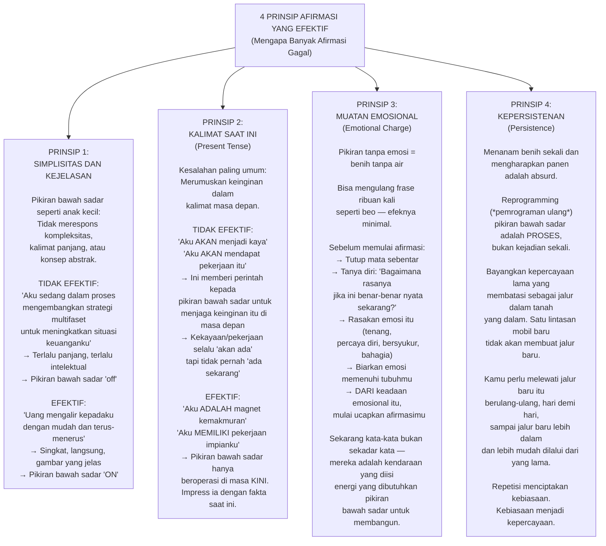
```mermaid
graph TD
    A["4 PRINSIP AFIRMASI YANG EFEKTIF\n(Mengapa Banyak Afirmasi Gagal)"]
    
    A --> B["PRINSIP 1:\nSIMPLISITAS DAN KEJELASAN\n\nPikiran bawah sadar seperti anak kecil:\nTidak merespons kompleksitas,\nkalimat panjang, atau konsep abstrak.\n\nTIDAK EFEKTIF:\n'Aku sedang dalam proses\nmengembangkan strategi multifaset\nuntuk meningkatkan situasi\nkeuanganku'\n→ Terlalu panjang, terlalu intelektual\n→ Pikiran bawah sadar 'off'\n\nEFEKTIF:\n'Uang mengalir kepadaku\ndengan mudah dan terus-menerus'\n→ Singkat, langsung, gambar yang jelas\n→ Pikiran bawah sadar 'ON'"]
    
    A --> C["PRINSIP 2:\nKALIMAT SAAT INI\n(Present Tense)\n\nKesalahan paling umum:\nMerumuskan keinginan dalam\nkalimat masa depan.\n\nTIDAK EFEKTIF:\n'Aku AKAN menjadi kaya'\n'Aku AKAN mendapat pekerjaan itu'\n→ Ini memberi perintah kepada\n  pikiran bawah sadar untuk\n  menjaga keinginan itu di masa depan\n→ Kekayaan/pekerjaan selalu 'akan ada'\n  tapi tidak pernah 'ada sekarang'\n\nEFEKTIF:\n'Aku ADALAH magnet kemakmuran'\n'Aku MEMILIKI pekerjaan impianku'\n→ Pikiran bawah sadar hanya\n  beroperasi di masa KINI.\n  Impress ia dengan fakta saat ini."]
    
    A --> D["PRINSIP 3:\nMUATAN EMOSIONAL\n(Emotional Charge)\n\nPikiran tanpa emosi =\nbenih tanpa air\n\nBisa mengulang frase ribuan kali\nseperti beo — efeknya minimal.\n\nSebelum memulai afirmasi:\n→ Tutup mata sebentar\n→ Tanya diri: 'Bagaimana rasanya\n  jika ini benar-benar nyata sekarang?'\n→ Rasakan emosi itu (tenang,\n  percaya diri, bersyukur, bahagia)\n→ Biarkan emosi memenuhi tubuhmu\n→ DARI keadaan emosional itu,\n  mulai ucapkan afirmasimu\n\nSekarang kata-kata bukan sekadar kata —\nmereka adalah kendaraan yang diisi\nenergi yang dibutuhkan pikiran\nbawah sadar untuk membangun."]
    
    A --> E["PRINSIP 4:\nKEPERSISTENAN\n(Persistence)\n\nMenanam benih sekali dan\nmengharapkan panen adalah absurd.\n\nReprogramming (*pemrograman ulang*)\npikiran bawah sadar adalah PROSES,\nbukan kejadian sekali.\n\nBayangkan kepercayaan lama yang\nmembatasi sebagai jalur dalam tanah\nyang dalam. Satu lintasan mobil baru\ntidak akan membuat jalur baru.\n\nKamu perlu melewati jalur baru itu\nberulang-ulang, hari demi hari,\nsampai jalur baru lebih dalam\ndan lebih mudah dilalui dari yang lama.\n\nRepetisi menciptakan kebiasaan.\nKebiasaan menjadi kepercayaan."]
```

### Teknik Lullabi: Ritual Menanam Sebelum Tidur

Joseph Murphy mengajarkan teknik paling efektif yang disebut **Lullabi Technique** (*Teknik Ninabobuk*):

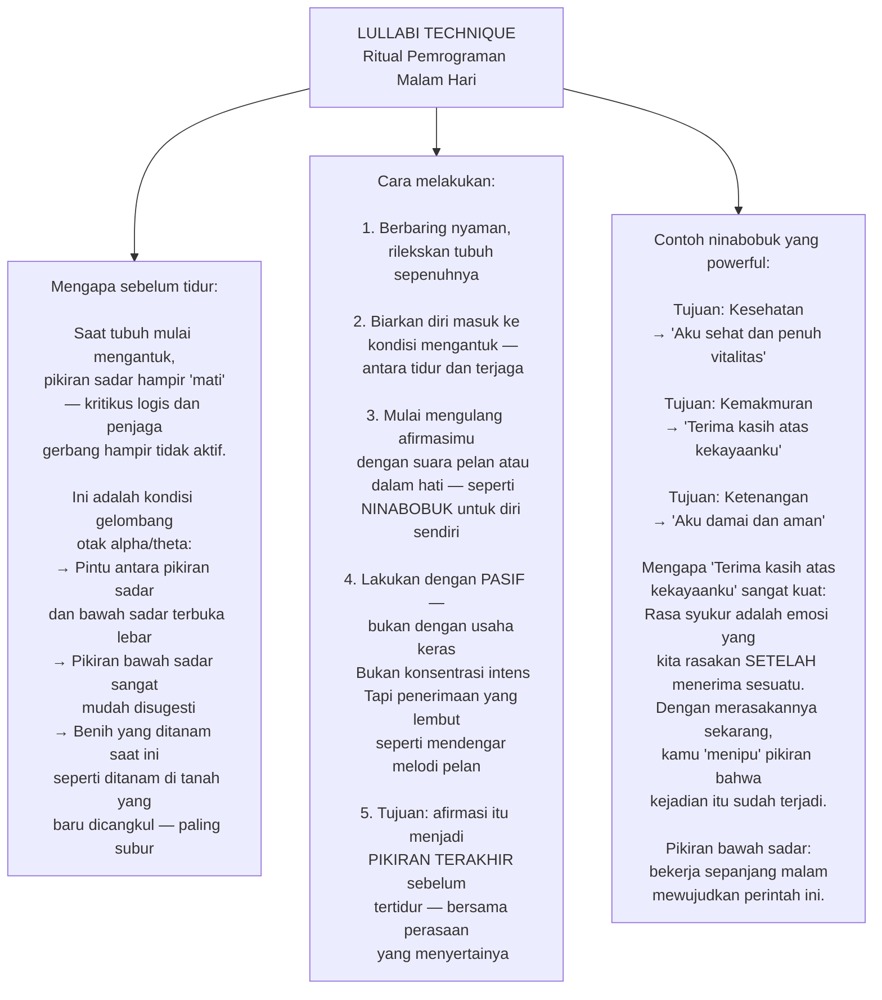
```mermaid
graph TD
    A["LULLABI TECHNIQUE\nRitual Pemrograman Malam Hari"]
    
    A --> B["Mengapa sebelum tidur:\n\nSaat tubuh mulai mengantuk,\npikiran sadar hampir 'mati'\n— kritikus logis dan penjaga\ngerbang hampir tidak aktif.\n\nIni adalah kondisi gelombang\notak alpha/theta:\n→ Pintu antara pikiran sadar\n  dan bawah sadar terbuka lebar\n→ Pikiran bawah sadar sangat\n  mudah disugesti\n→ Benih yang ditanam saat ini\n  seperti ditanam di tanah yang\n  baru dicangkul — paling subur"]
    
    A --> C["Cara melakukan:\n\n1. Berbaring nyaman,\n   rilekskan tubuh sepenuhnya\n\n2. Biarkan diri masuk ke\n   kondisi mengantuk —\n   antara tidur dan terjaga\n\n3. Mulai mengulang afirmasimu\n   dengan suara pelan atau\n   dalam hati — seperti\n   NINABOBUK untuk diri sendiri\n\n4. Lakukan dengan PASIF —\n   bukan dengan usaha keras\n   Bukan konsentrasi intens\n   Tapi penerimaan yang lembut\n   seperti mendengar melodi pelan\n\n5. Tujuan: afirmasi itu menjadi\n   PIKIRAN TERAKHIR sebelum\n   tertidur — bersama perasaan\n   yang menyertainya"]
    
    A --> D["Contoh ninabobuk yang powerful:\n\nTujuan: Kesehatan\n→ 'Aku sehat dan penuh vitalitas'\n\nTujuan: Kemakmuran\n→ 'Terima kasih atas kekayaanku'\n\nTujuan: Ketenangan\n→ 'Aku damai dan aman'\n\nMengapa 'Terima kasih atas\nkekayaanku' sangat kuat:\nRasa syukur adalah emosi yang\nkita rasakan SETELAH menerima sesuatu.\nDengan merasakannya sekarang,\nkamu 'menipu' pikiran bahwa\nkejadian itu sudah terjadi.\n\nPikiran bawah sadar:\nbekerja sepanjang malam\nmewujudkan perintah ini."]
```

---

## 🎬 Bab 5: Sinema Mental — Keajaiban Visualisasi

Jika auto-suggestion adalah bahasa kata-kata kepada pikiran bawah sadar, maka **visualisasi** (*mental movie technique*) adalah bahasa gambar — dan gambar adalah **bahasa asli** pikiran bawah sadar.

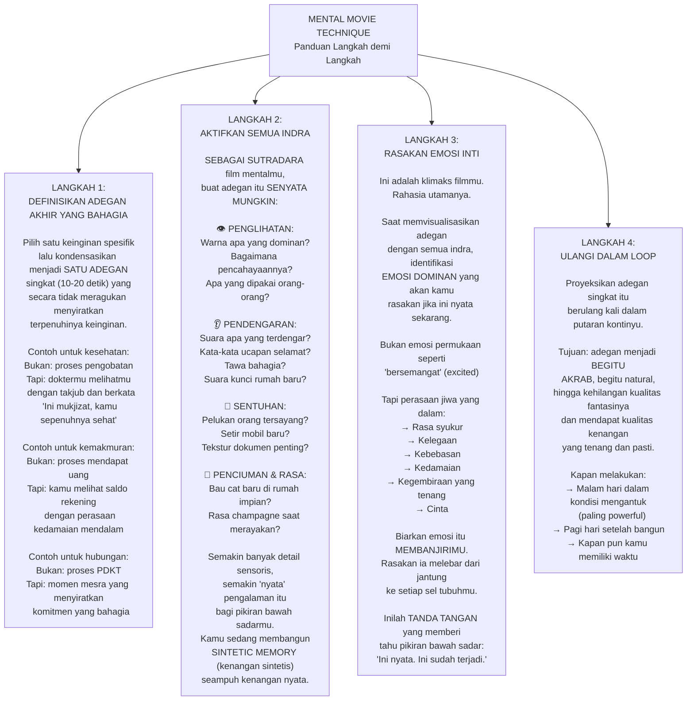
```mermaid
graph TD
    A["MENTAL MOVIE TECHNIQUE\nPanduan Langkah demi Langkah"]
    
    A --> B["LANGKAH 1:\nDEFINISIKAN ADEGAN AKHIR YANG BAHAGIA\n\nPilih satu keinginan spesifik\nlalu kondensasikan menjadi SATU ADEGAN\nsingkat (10-20 detik) yang\nsecara tidak meragukan menyiratkan\nterpenuhinya keinginan.\n\nContoh untuk kesehatan:\nBukan: proses pengobatan\nTapi: doktermu melihatmu\n  dengan takjub dan berkata\n  'Ini mukjizat, kamu sepenuhnya sehat'\n\nContoh untuk kemakmuran:\nBukan: proses mendapat uang\nTapi: kamu melihat saldo rekening\n  dengan perasaan kedamaian mendalam\n\nContoh untuk hubungan:\nBukan: proses PDKT\nTapi: momen mesra yang menyiratkan\n  komitmen yang bahagia"]
    
    A --> C["LANGKAH 2:\nAKTIFKAN SEMUA INDRA\n\nSEBAGAI SUTRADARA film mentalmu,\nbuat adegan itu SENYATA MUNGKIN:\n\n👁️ PENGLIHATAN:\nWarna apa yang dominan?\nBagaimana pencahayaannya?\nApa yang dipakai orang-orang?\n\n👂 PENDENGARAN:\nSuara apa yang terdengar?\nKata-kata ucapan selamat?\nTawa bahagia?\nSuara kunci rumah baru?\n\n🤲 SENTUHAN:\nPelukan orang tersayang?\nSetir mobil baru?\nTekstur dokumen penting?\n\n👃 PENCIUMAN & RASA:\nBau cat baru di rumah impian?\nRasa champagne saat merayakan?\n\nSemakin banyak detail sensoris,\nsemakin 'nyata' pengalaman itu\nbagi pikiran bawah sadarmu.\nKamu sedang membangun\nSINTETIC MEMORY (kenangan sintetis)\nseampuh kenangan nyata."]
    
    A --> D["LANGKAH 3:\nRASAKAN EMOSI INTI\n\nIni adalah klimaks filmmu.\nRahasia utamanya.\n\nSaat memvisualisasikan adegan\ndengan semua indra, identifikasi\nEMOSI DOMINAN yang akan kamu\nrasakan jika ini nyata sekarang.\n\nBukan emosi permukaan seperti\n'bersemangat' (excited)\n\nTapi perasaan jiwa yang dalam:\n→ Rasa syukur\n→ Kelegaan\n→ Kebebasan\n→ Kedamaian\n→ Kegembiraan yang tenang\n→ Cinta\n\nBiarkan emosi itu MEMBANJIRIMU.\nRasakan ia melebar dari jantung\nke setiap sel tubuhmu.\n\nInilah TANDA TANGAN yang memberi\ntahu pikiran bawah sadar:\n'Ini nyata. Ini sudah terjadi.'"]
    
    A --> E["LANGKAH 4:\nULANGI DALAM LOOP\n\nProyeksikan adegan singkat itu\nberulang kali dalam putaran kontinyu.\n\nTujuan: adegan menjadi BEGITU\nAKRAB, begitu natural,\nhingga kehilangan kualitas fantasinya\ndan mendapat kualitas kenangan\nyang tenang dan pasti.\n\nKapan melakukan:\n→ Malam hari dalam kondisi mengantuk\n   (paling powerful)\n→ Pagi hari setelah bangun\n→ Kapan pun kamu memiliki waktu"]
```

---

## 🌙 Bab 6: Kekuatan Tidur — Memprogram Pikiranmu Saat Terlelap

Bayangkan kamu ingin menyampaikan pesan penting kepada raja sebuah kerajaan besar. Siang hari, raja berada di ruang tahtanya, dikelilingi dewan penasihat, penjaga, dan para pemohon yang bersaing. Pesan apapun yang kamu sampaikan akan dianalisis, diperdebatkan, dipertanyakan, dan kemungkinan besar ditolak oleh para penasihat skeptis.

Tapi di malam hari, raja masuk ke kamar pribadinya. Para penjaga rileks. Para penasihat pergi. Ada satu momen singkat dan magis tepat sebelum raja tertidur — ketika pikirannya tenang, reseptif, dan sendirian. Jika kamu bisa **membisikkan pesanmu di telinganya pada saat itu**, pesan itu akan masuk langsung ke kesadarannya tanpa filter atau resistansi.

**Inilah metafora sempurna untuk dinamika pikiran sadar dan bawah sadarmu.**

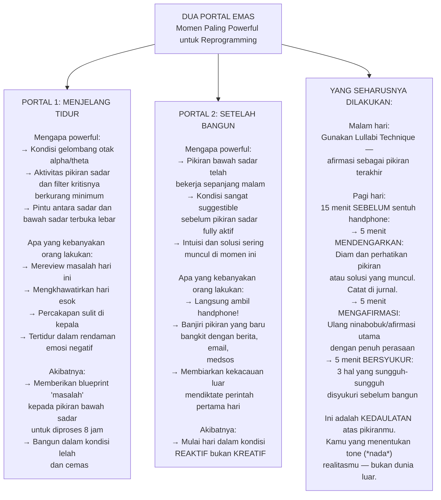
```mermaid
graph TD
    A["DUA PORTAL EMAS\nMomen Paling Powerful untuk Reprogramming"]
    
    A --> B["PORTAL 1: MENJELANG TIDUR\n\nMengapa powerful:\n→ Kondisi gelombang otak\n  alpha/theta\n→ Aktivitas pikiran sadar\n  dan filter kritisnya\n  berkurang minimum\n→ Pintu antara sadar dan\n  bawah sadar terbuka lebar\n\nApa yang kebanyakan orang lakukan:\n→ Mereview masalah hari ini\n→ Mengkhawatirkan hari esok\n→ Percakapan sulit di kepala\n→ Tertidur dalam rendaman\n  emosi negatif\n\nAkibatnya:\n→ Memberikan blueprint 'masalah'\nkepada pikiran bawah sadar\nuntuk diproses 8 jam\n→ Bangun dalam kondisi lelah\n  dan cemas"]
    
    A --> C["PORTAL 2: SETELAH BANGUN\n\nMengapa powerful:\n→ Pikiran bawah sadar telah\n  bekerja sepanjang malam\n→ Kondisi sangat suggestible\n  sebelum pikiran sadar fully aktif\n→ Intuisi dan solusi sering\n  muncul di momen ini\n\nApa yang kebanyakan orang lakukan:\n→ Langsung ambil handphone!\n→ Banjiri pikiran yang baru\n  bangkit dengan berita, email,\n  medsos\n→ Membiarkan kekacauan luar\n  mendiktate perintah pertama hari\n\nAkibatnya:\n→ Mulai hari dalam kondisi\n  REAKTIF bukan KREATIF"]
    
    A --> D["YANG SEHARUSNYA DILAKUKAN:\n\nMalam hari:\nGunakan Lullabi Technique —\nafirmasi sebagai pikiran terakhir\n\nPagi hari:\n15 menit SEBELUM sentuh handphone:\n→ 5 menit MENDENGARKAN:\n   Diam dan perhatikan pikiran\n   atau solusi yang muncul.\n   Catat di jurnal.\n→ 5 menit MENGAFIRMASI:\n   Ulang ninabobuk/afirmasi utama\n   dengan penuh perasaan\n→ 5 menit BERSYUKUR:\n   3 hal yang sungguh-sungguh\n   disyukuri sebelum bangun\n\nIni adalah KEDAULATAN atas pikiranmu.\nKamu yang menentukan tone (*nada*)\nrealitasmu — bukan dunia luar."]
```

---

## 🙏 Bab 7: Rahasia Rasa Syukur — Ucapan Terima Kasih yang Mewujudkan

Kita tiba pada katalis terbesar — bahan yang mempercepat seluruh proses pertumbuhan. Perasaan yang berfungsi sebagai matahari dan hujan bagi kebun pikiran kita.

Dalam budaya kita, rasa syukur sering kita perlakukan sebagai formalitas belaka — kata yang diucapkan setelah menerima hadiah, sopan santun sosial. Tapi **rasa syukur sejati** — jenis yang memiliki kekuatan mengubah realitas — bukan reaksi terhadap sesuatu yang sudah diterima.

**Ia adalah sebab. Ia adalah kondisi keberadaan.**

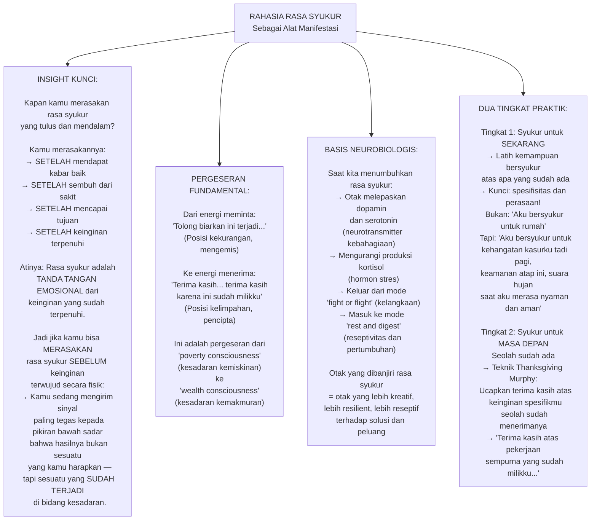
```mermaid
graph TD
    A["RAHASIA RASA SYUKUR\nSebagai Alat Manifestasi"]
    
    A --> B["INSIGHT KUNCI:\n\nKapan kamu merasakan rasa syukur\nyang tulus dan mendalam?\n\nKamu merasakannya:\n→ SETELAH mendapat kabar baik\n→ SETELAH sembuh dari sakit\n→ SETELAH mencapai tujuan\n→ SETELAH keinginan terpenuhi\n\nAtinya: Rasa syukur adalah\nTANDA TANGAN EMOSIONAL dari\nkeinginan yang sudah terpenuhi.\n\nJadi jika kamu bisa MERASAKAN\nrasa syukur SEBELUM keinginan\nterwujud secara fisik:\n→ Kamu sedang mengirim sinyal\n  paling tegas kepada pikiran bawah sadar\n  bahwa hasilnya bukan sesuatu\n  yang kamu harapkan —\n  tapi sesuatu yang SUDAH TERJADI\n  di bidang kesadaran."]
    
    A --> C["PERGESERAN FUNDAMENTAL:\n\nDari energi meminta:\n'Tolong biarkan ini terjadi...'\n(Posisi kekurangan, mengemis)\n\nKe energi menerima:\n'Terima kasih... terima kasih\nkarena ini sudah milikku'\n(Posisi kelimpahan, pencipta)\n\nIni adalah pergeseran dari\n'poverty consciousness'\n(kesadaran kemiskinan)\nke\n'wealth consciousness'\n(kesadaran kemakmuran)"]
    
    A --> D["BASIS NEUROBIOLOGIS:\n\nSaat kita menumbuhkan rasa syukur:\n→ Otak melepaskan dopamin\n  dan serotonin\n  (neurotransmitter kebahagiaan)\n→ Mengurangi produksi kortisol\n  (hormon stres)\n→ Keluar dari mode\n  'fight or flight' (kelangkaan)\n→ Masuk ke mode\n  'rest and digest'\n  (reseptivitas dan pertumbuhan)\n\nOtak yang dibanjiri rasa syukur\n= otak yang lebih kreatif,\nlebih resilient, lebih reseptif\nterhadap solusi dan peluang"]
    
    A --> E["DUA TINGKAT PRAKTIK:\n\nTingkat 1: Syukur untuk SEKARANG\n→ Latih kemampuan bersyukur\n  atas apa yang sudah ada\n→ Kunci: spesifisitas dan perasaan!\n  Bukan: 'Aku bersyukur untuk rumah'\n  Tapi: 'Aku bersyukur untuk\n  kehangatan kasurku tadi pagi,\n  keamanan atap ini, suara hujan\n  saat aku merasa nyaman dan aman'\n\nTingkat 2: Syukur untuk MASA DEPAN\nSeolah sudah ada\n→ Teknik Thanksgiving Murphy:\n  Ucapkan terima kasih atas\n  keinginan spesifikmu\n  seolah sudah menerimanya\n→ 'Terima kasih atas pekerjaan\n  sempurna yang sudah milikku...'"]
```

---

## 💰 Bab 8: Hak untuk Kaya — Memprogram Kemakmuran

Sebelum membahas teknik apapun untuk kemakmuran, kita harus melakukan satu hal yang lebih fundamental: **membersihkan medan mental kita** dari salah satu kepercayaan yang paling merusak dalam budaya kita.

**Ide bahwa kemiskinan memiliki kebajikan inheren — bahwa keinginan atas kekayaan entah bagaimana egois, tidak spiritual, atau jahat.**

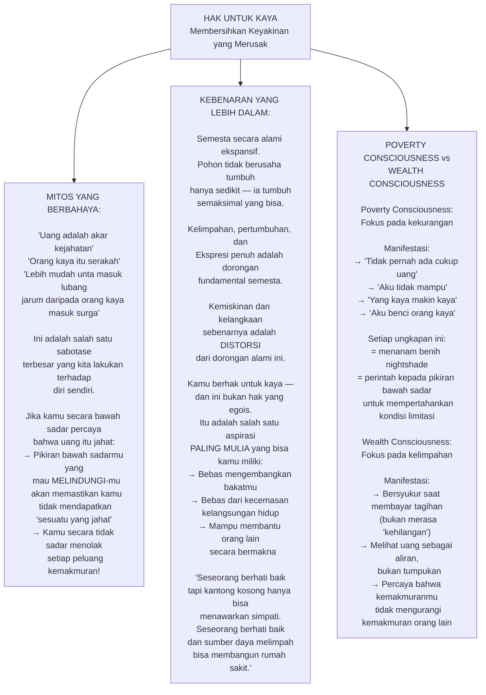
```mermaid
graph TD
    A["HAK UNTUK KAYA\nMembersihkan Keyakinan yang Merusak"]
    
    A --> B["MITOS YANG BERBAHAYA:\n\n'Uang adalah akar kejahatan'\n'Orang kaya itu serakah'\n'Lebih mudah unta masuk lubang\njarum daripada orang kaya masuk surga'\n\nIni adalah salah satu sabotase\nterbesar yang kita lakukan terhadap\ndiri sendiri.\n\nJika kamu secara bawah sadar percaya\nbahwa uang itu jahat:\n→ Pikiran bawah sadarmu yang\n  mau MELINDUNGI-mu\n  akan memastikan kamu\n  tidak mendapatkan 'sesuatu yang jahat'\n→ Kamu secara tidak sadar menolak\n  setiap peluang kemakmuran!"]
    
    A --> C["KEBENARAN YANG LEBIH DALAM:\n\nSemesta secara alami ekspansif.\nPohon tidak berusaha tumbuh\nhanya sedikit — ia tumbuh\nsemaksimal yang bisa.\n\nKelimpahan, pertumbuhan, dan\nEkspresi penuh adalah dorongan\nfundamental semesta.\n\nKemiskinan dan kelangkaan\nsebenarnya adalah DISTORSI\ndari dorongan alami ini.\n\nKamu berhak untuk kaya —\ndan ini bukan hak yang egois.\nItu adalah salah satu aspirasi\nPALING MULIA yang bisa kamu miliki:\n→ Bebas mengembangkan bakatmu\n→ Bebas dari kecemasan kelangsungan hidup\n→ Mampu membantu orang lain\n  secara bermakna\n\n'Seseorang berhati baik\ntapi kantong kosong hanya bisa\nmenawarkan simpati.\nSeseorang berhati baik\ndan sumber daya melimpah\nbisa membangun rumah sakit.'"]
    
    A --> D["POVERTY CONSCIOUSNESS vs\nWEALTH CONSCIOUSNESS\n\nPoverty Consciousness:\nFokus pada kekurangan\n\nManifestasi:\n→ 'Tidak pernah ada cukup uang'\n→ 'Aku tidak mampu'\n→ 'Yang kaya makin kaya'\n→ 'Aku benci orang kaya'\n\nSetiap ungkapan ini:\n= menanam benih nightshade\n= perintah kepada pikiran bawah sadar\n  untuk mempertahankan kondisi limitasi\n\nWealth Consciousness:\nFokus pada kelimpahan\n\nManifestasi:\n→ Bersyukur saat membayar tagihan\n  (bukan merasa 'kehilangan')\n→ Melihat uang sebagai aliran,\n  bukan tumpukan\n→ Percaya bahwa kemakmuranmu\n  tidak mengurangi kemakmuran orang lain"]
```

### Studi Kasus: Sang Salesman

Joseph Murphy menceritakan kisah nyata seorang salesman yang berjuang keras:

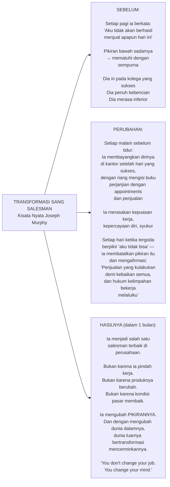
```mermaid
graph LR
    A["TRANSFORMASI SANG SALESMAN\nKisata Nyata Joseph Murphy"]
    
    A --> B["SEBELUM:\n\nSetiap pagi ia berkata:\n'Aku tidak akan berhasil\nmenjual apapun hari ini'\n\nPikiran bawah sadarnya\n→ mematuhi dengan sempurna\n\nDia iri pada kolega yang sukses\nDia penuh kebencian\nDia merasa inferior"]
    
    A --> C["PERUBAHAN:\n\nSetiap malam sebelum tidur:\nIa membayangkan dirinya\ndi kantor setelah hari yang sukses,\ndengan riang mengisi buku\nperjanjian dengan appointments\ndan penjualan\n\nIa merasakan kepuasan kerja,\nkepercayaan diri, syukur\n\nSetiap hari ketika tergoda\nberpikir 'aku tidak bisa' —\nia membatalkan pikiran itu\ndan mengafirmasi:\n'Penjualan yang kulakukan\ndemi kebaikan semua,\ndan hukum kelimpahan bekerja\nmelaluiku'"]
    
    A --> D["HASILNYA (dalam 1 bulan):\n\nIa menjadi salah satu\nsalesman terbaik di perusahaan.\n\nBukan karena ia pindah kerja.\nBukan karena produknya berubah.\nBukan karena kondisi pasar membaik.\n\nIa mengubah PIKIRANNYA.\nDan dengan mengubah dunia dalamnya,\ndunia luarnya bertransformasi\nmencerminkannya.\n\n'You don't change your job.\nYou change your mind.'"]
```

---

## 💊 Bab 9: Apotek Dalam — Pikiran Bawah Sadar dan Penyembuhan

Kita tiba pada aplikasi paling intim dan bagi banyak orang paling menakjubkan dari hukum-hukum pikiran: **koneksi mendalam antara pikiran, kepercayaan, dan biologi tubuhmu.**

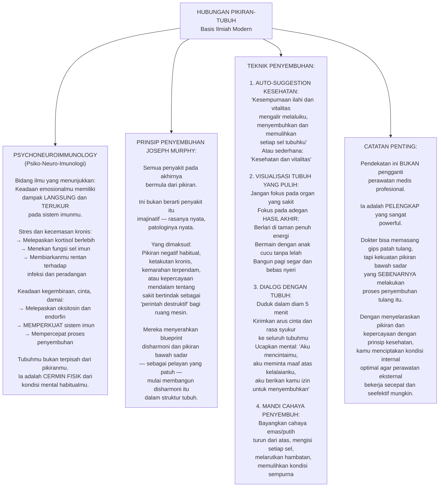
```mermaid
graph TD
    A["HUBUNGAN PIKIRAN-TUBUH\nBasis Ilmiah Modern"]
    
    A --> B["PSYCHONEUROIMMUNOLOGY\n(Psiko-Neuro-Imunologi)\n\nBidang ilmu yang menunjukkan:\nKeadaan emosionalmu memiliki\ndampak LANGSUNG dan TERUKUR\npada sistem imunmu.\n\nStres dan kecemasan kronis:\n→ Melepaskan kortisol berlebih\n→ Menekan fungsi sel imun\n→ Membiarkanmu rentan terhadap\n  infeksi dan peradangan\n\nKeadaan kegembiraan, cinta, damai:\n→ Melepaskan oksitosin dan endorfin\n→ MEMPERKUAT sistem imun\n→ Mempercepat proses penyembuhan\n\nTubuhmu bukan terpisah dari pikiranmu.\nIa adalah CERMIN FISIK dari\nkondisi mental habitualmu."]
    
    A --> C["PRINSIP PENYEMBUHAN JOSEPH MURPHY:\n\nSemua penyakit pada akhirnya\nbermula dari pikiran.\n\nIni bukan berarti penyakit itu\nimajinatif — rasanya nyata,\npatologinya nyata.\n\nYang dimaksud:\nPikiran negatif habitual,\nketakutan kronis, kemarahan terpendam,\natau kepercayaan mendalam tentang\nsakit bertindak sebagai\n'perintah destruktif' bagi ruang mesin.\n\nMereka menyerahkan blueprint\ndisharmoni dan pikiran bawah sadar\n— sebagai pelayan yang patuh —\nmulai membangun disharmoni itu\ndalam struktur tubuh."]
    
    A --> D["TEKNIK PENYEMBUHAN:\n\n1. AUTO-SUGGESTION KESEHATAN:\n   'Kesempurnaan ilahi dan vitalitas\n   mengalir melaluiku,\n   menyembuhkan dan memulihkan\n   setiap sel tubuhku'\n   Atau sederhana: 'Kesehatan dan vitalitas'\n\n2. VISUALISASI TUBUH YANG PULIH:\n   Jangan fokus pada organ yang sakit\n   Fokus pada adegan HASIL AKHIR:\n   Berlari di taman penuh energi\n   Bermain dengan anak cucu tanpa lelah\n   Bangun pagi segar dan bebas nyeri\n\n3. DIALOG DENGAN TUBUH:\n   Duduk dalam diam 5 menit\n   Kirimkan arus cinta dan rasa syukur\n   ke seluruh tubuhmu\n   Ucapkan mental: 'Aku mencintaimu,\n   aku meminta maaf atas kelalaianku,\n   aku berikan kamu izin untuk menyembuhkan'\n\n4. MANDI CAHAYA PENYEMBUH:\n   Bayangkan cahaya emas/putih\n   turun dari atas, mengisi setiap sel,\n   melarutkan hambatan,\n   memulihkan kondisi sempurna"]
    
    A --> E["CATATAN PENTING:\n\nPendekatan ini BUKAN pengganti\nperawatan medis profesional.\n\nIa adalah PELENGKAP yang sangat\npowerful.\n\nDokter bisa memasang gips patah tulang,\ntapi kekuatan pikiran bawah sadar\nyang SEBENARNYA melakukan\nproses penyembuhan tulang itu.\n\nDengan menyelaraskan pikiran dan\nkepercayaan dengan prinsip kesehatan,\nkamu menciptakan kondisi internal\noptimal agar perawatan eksternal\nbekerja secepat dan seefektif mungkin."]
```

---

## 💞 Bab 10: Hubungan yang Harmonis dan Mengatasi Ketakutan

Kita memasuki wilayah yang bagi banyak orang adalah sumber kebahagiaan terbesar sekaligus penderitaan terdalam: **dunia hubungan manusia**. Dan berjalan bersamanya: ketakutan.

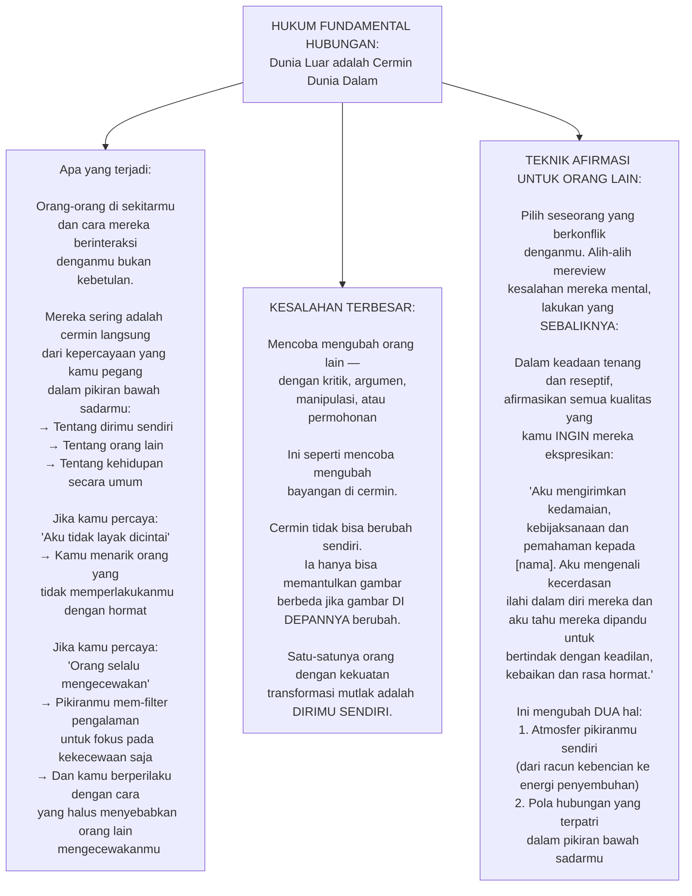
```mermaid
graph TD
    A["HUKUM FUNDAMENTAL HUBUNGAN:\nDunia Luar adalah Cermin Dunia Dalam"]
    
    A --> B["Apa yang terjadi:\n\nOrang-orang di sekitarmu\ndan cara mereka berinteraksi\ndenganmu bukan kebetulan.\n\nMereka sering adalah cermin langsung\ndari kepercayaan yang kamu pegang\ndalam pikiran bawah sadarmu:\n→ Tentang dirimu sendiri\n→ Tentang orang lain\n→ Tentang kehidupan secara umum\n\nJika kamu percaya:\n'Aku tidak layak dicintai'\n→ Kamu menarik orang yang\n  tidak memperlakukanmu dengan hormat\n\nJika kamu percaya:\n'Orang selalu mengecewakan'\n→ Pikiranmu mem-filter pengalaman\n  untuk fokus pada kekecewaan saja\n→ Dan kamu berperilaku dengan cara\n  yang halus menyebabkan orang lain\n  mengecewakanmu"]
    
    A --> C["KESALAHAN TERBESAR:\n\nMencoba mengubah orang lain —\ndengan kritik, argumen,\nmanipulasi, atau permohonan\n\nIni seperti mencoba mengubah\nbayangan di cermin.\n\nCermin tidak bisa berubah sendiri.\nIa hanya bisa memantulkan gambar\nberbeda jika gambar DI DEPANNYA berubah.\n\nSatu-satunya orang dengan kekuatan\ntransformasi mutlak adalah DIRIMU SENDIRI."]
    
    A --> D["TEKNIK AFIRMASI UNTUK ORANG LAIN:\n\nPilih seseorang yang berkonflik\ndenganmu. Alih-alih mereview\nkesalahan mereka mental,\nlakukan yang SEBALIKNYA:\n\nDalam keadaan tenang dan reseptif,\nafirmasikan semua kualitas yang\nkamu INGIN mereka ekspresikan:\n\n'Aku mengirimkan kedamaian,\nkebijaksanaan dan pemahaman kepada\n[nama]. Aku mengenali kecerdasan\nilahi dalam diri mereka dan\naku tahu mereka dipandu untuk\nbertindak dengan keadilan,\nkebaikan dan rasa hormat.'\n\nIni mengubah DUA hal:\n1. Atmosfer pikiranmu sendiri\n   (dari racun kebencian ke energi penyembuhan)\n2. Pola hubungan yang terpatri\n   dalam pikiran bawah sadarmu"]
```

### Mengatasi Ketakutan dari Akarnya

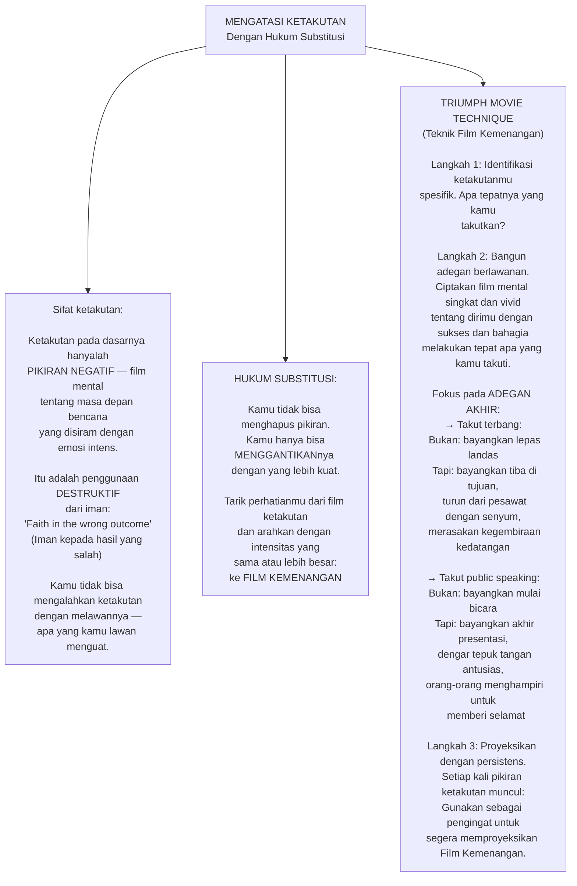
```mermaid
graph TD
    A["MENGATASI KETAKUTAN\nDengan Hukum Substitusi"]
    
    A --> B["Sifat ketakutan:\n\nKetakutan pada dasarnya hanyalah\nPIKIRAN NEGATIF — film mental\ntentang masa depan bencana\nyang disiram dengan emosi intens.\n\nItu adalah penggunaan DESTRUKTIF\ndari iman:\n'Faith in the wrong outcome'\n(Iman kepada hasil yang salah)\n\nKamu tidak bisa mengalahkan ketakutan\ndengan melawannya —\napa yang kamu lawan menguat."]
    
    A --> C["HUKUM SUBSTITUSI:\n\nKamu tidak bisa menghapus pikiran.\nKamu hanya bisa\nMENGGANTIKANnya dengan yang lebih kuat.\n\nTarik perhatianmu dari film ketakutan\ndan arahkan dengan intensitas yang\nsama atau lebih besar:\nke FILM KEMENANGAN"]
    
    A --> D["TRIUMPH MOVIE TECHNIQUE\n(Teknik Film Kemenangan)\n\nLangkah 1: Identifikasi ketakutanmu\nspesifik. Apa tepatnya yang kamu\ntakutkan?\n\nLangkah 2: Bangun adegan berlawanan.\nCiptakan film mental singkat dan vivid\ntentang dirimu dengan sukses dan bahagia\nmelakukan tepat apa yang kamu takuti.\n\nFokus pada ADEGAN AKHIR:\n→ Takut terbang:\n  Bukan: bayangkan lepas landas\n  Tapi: bayangkan tiba di tujuan,\n  turun dari pesawat dengan senyum,\n  merasakan kegembiraan kedatangan\n\n→ Takut public speaking:\n  Bukan: bayangkan mulai bicara\n  Tapi: bayangkan akhir presentasi,\n  dengar tepuk tangan antusias,\n  orang-orang menghampiri untuk\n  memberi selamat\n\nLangkah 3: Proyeksikan dengan persistens.\nSetiap kali pikiran ketakutan muncul:\nGunakan sebagai pengingat untuk\nsegera memproyeksikan Film Kemenangan."]
```

---

## 🔄 Sistem Lengkap: Semua Hukum Bersatu

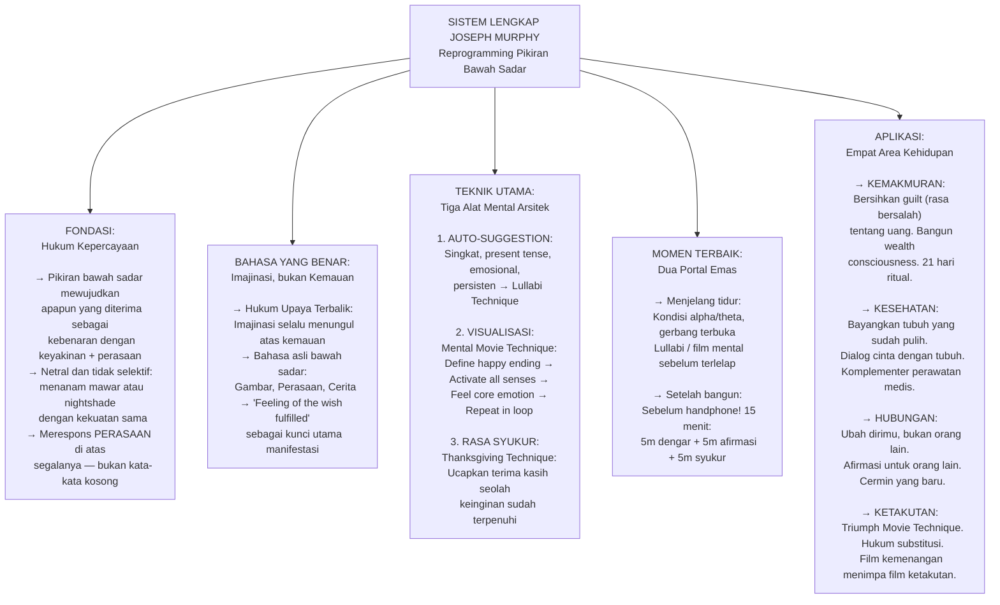
```mermaid
graph TD
    A["SISTEM LENGKAP JOSEPH MURPHY\nReprogramming Pikiran Bawah Sadar"]
    
    A --> B["FONDASI:\nHukum Kepercayaan\n\n→ Pikiran bawah sadar mewujudkan\n  apapun yang diterima sebagai\n  kebenaran dengan keyakinan + perasaan\n→ Netral dan tidak selektif:\n  menanam mawar atau nightshade\n  dengan kekuatan sama\n→ Merespons PERASAAN di atas\n  segalanya — bukan kata-kata kosong"]
    
    A --> C["BAHASA YANG BENAR:\nImajinasi, bukan Kemauan\n\n→ Hukum Upaya Terbalik:\n  Imajinasi selalu menungul atas kemauan\n→ Bahasa asli bawah sadar:\n  Gambar, Perasaan, Cerita\n→ 'Feeling of the wish fulfilled'\n  sebagai kunci utama manifestasi"]
    
    A --> D["TEKNIK UTAMA:\nTiga Alat Mental Arsitek\n\n1. AUTO-SUGGESTION:\n   Singkat, present tense, emosional,\n   persisten → Lullabi Technique\n\n2. VISUALISASI:\n   Mental Movie Technique:\n   Define happy ending →\n   Activate all senses →\n   Feel core emotion →\n   Repeat in loop\n\n3. RASA SYUKUR:\n   Thanksgiving Technique:\n   Ucapkan terima kasih seolah\n   keinginan sudah terpenuhi"]
    
    A --> E["MOMEN TERBAIK:\nDua Portal Emas\n\n→ Menjelang tidur:\n  Kondisi alpha/theta, gerbang terbuka\n  Lullabi / film mental sebelum terlelap\n\n→ Setelah bangun:\n  Sebelum handphone! 15 menit:\n  5m dengar + 5m afirmasi + 5m syukur"]
    
    A --> F["APLIKASI:\nEmpat Area Kehidupan\n\n→ KEMAKMURAN:\n  Bersihkan guilt (rasa bersalah)\n  tentang uang. Bangun wealth\n  consciousness. 21 hari ritual.\n\n→ KESEHATAN:\n  Bayangkan tubuh yang sudah pulih.\n  Dialog cinta dengan tubuh.\n  Komplementer perawatan medis.\n\n→ HUBUNGAN:\n  Ubah dirimu, bukan orang lain.\n  Afirmasi untuk orang lain.\n  Cermin yang baru.\n\n→ KETAKUTAN:\n  Triumph Movie Technique.\n  Hukum substitusi.\n  Film kemenangan menimpa film ketakutan."]
```

---

## 💡 Latihan Komprehensif: Rencana Aksi 21 Hari

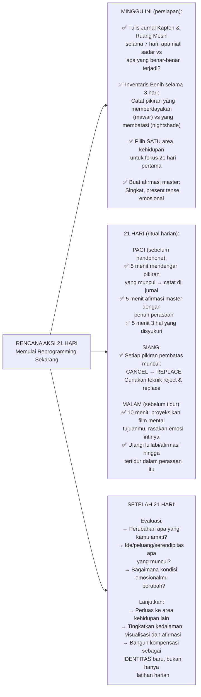
```mermaid
graph LR
    A["RENCANA AKSI 21 HARI\nMemulai Reprogramming Sekarang"]
    
    A --> B["MINGGU INI (persiapan):\n\n✅ Tulis Jurnal Kapten & Ruang Mesin\n   selama 7 hari: apa niat sadar vs\n   apa yang benar-benar terjadi?\n\n✅ Inventaris Benih selama 3 hari:\n   Catat pikiran yang memberdayakan\n   (mawar) vs yang membatasi (nightshade)\n\n✅ Pilih SATU area kehidupan\n   untuk fokus 21 hari pertama\n\n✅ Buat afirmasi master:\n   Singkat, present tense, emosional"]
    
    A --> C["21 HARI (ritual harian):\n\nPAGI (sebelum handphone):\n✅ 5 menit mendengar pikiran\n   yang muncul → catat di jurnal\n✅ 5 menit afirmasi master dengan\n   penuh perasaan\n✅ 5 menit 3 hal yang disyukuri\n\nSIANG:\n✅ Setiap pikiran pembatas muncul:\n   CANCEL → REPLACE\n   Gunakan teknik reject & replace\n\nMALAM (sebelum tidur):\n✅ 10 menit: proyeksikan film mental\n   tujuanmu, rasakan emosi intinya\n✅ Ulangi lullabi/afirmasi hingga\n   tertidur dalam perasaan itu"]
    
    A --> D["SETELAH 21 HARI:\n\nEvaluasi:\n→ Perubahan apa yang kamu amati?\n→ Ide/peluang/serendipitas apa\n   yang muncul?\n→ Bagaimana kondisi emosionalmu\n   berubah?\n\nLanjutkan:\n→ Perluas ke area kehidupan lain\n→ Tingkatkan kedalaman\n  visualisasi dan afirmasi\n→ Bangun kompensasi sebagai\n  IDENTITAS baru, bukan hanya\n  latihan harian"]
```

---

## 🎯 Kesimpulan: Kamu adalah Kapten Jiwamu

Kita telah menempuh perjalanan panjang melalui ruang operasi pikiran kita sendiri — menemukan dua kapten yang mengemudikan kapal, hukum tertinggi yang mengaturnya, bahasa asli ruang mesin, dan alat-alat sang arsitek mental.

```mermaid
graph TD
    A["SINTESIS AKHIR\nApa yang Perlu Diinternalisasi"]
    
    A --> B["Yang tidak bekerja:\n\n• Kemauan murni tanpa\n  mengubah program dasar\n• Afirmasi kosong tanpa\n  muatan emosional\n• Melawan pikiran negatif\n  secara langsung\n• Mencoba mengubah orang lain\n  tanpa mengubah diri sendiri\n• Memprogram sebelum tidur\n  dengan kekhawatiran\n• Memberi handphone sebagai\n  pikiran pertama setelah bangun"]
    
    A --> C["Yang bekerja:\n\n• Menjadi tukang kebun yang sadar:\n  pilih benih yang ditanam\n• Afirmasi: singkat, present tense,\n  emosional, persisten\n• Visualisasi: adegan akhir,\n  semua indra, emosi inti\n• Rasa syukur: sebagai kondisi\n  keberadaan, bukan reaksi\n• Kuasai dua portal emas:\n  sebelum tidur dan setelah bangun\n• Ubah diri → dunia mencerminkan"]
    
    A --> D["Kebenaran akhir:\n\nKekuatan itu tidak perlu diperoleh.\nIa sudah ada dalam dirimu.\n\nPikiran bawah sadar bukan kekuatan\nasing yang harus ditaklukkan —\ntapi PELAYAN SETIA yang menunggu\nperintah-perintahmu.\n\nIni menjadikanmu — pikiran sadarmu —\nFIGUR TERPENTING dalam semestamu.\nKamu adalah penjaga gerbang.\n\nTanggung jawab dan kekuatan\nterbesar dalam hidupmu adalah\nsecara sadar memilih pikiran\nyang kamu izinkan masuk ke kebun\nsubur pikiranmu.\n\nSetiap pikiran yang kamu pilih,\nsetiap perasaan yang kamu tumbuhkan,\nadalah benih yang kamu tanam\nuntuk kekekalan —\npenyebab yang tak terelakkan\nakan menghasilkan akibatnya.\n\nKamu adalah kapten jiwamu.\nKamu adalah tuan nasibmu."]
```

*Mulai malam ini. Sebelum tidur. Pilih satu keinginan terdalam. Rasakan seolah sudah terwujud. Tidur dalam perasaan itu.* 🌙✨

---

## 📚 Glosarium Lengkap

| Istilah | Bahasa Asli | Makna dalam Bahasa Indonesia |
|---|---|---|
| **Conscious Mind** | Inggris | Pikiran sadar — bagian pikiran yang berpikir logis, menganalisis, dan membuat keputusan sadar |
| **Subconscious Mind** | Inggris | Pikiran bawah sadar — bagian pikiran yang menyimpan kepercayaan, mengontrol fungsi tubuh, dan mewujudkan keyakinan |
| **Law of Belief** | Inggris | Hukum Kepercayaan — prinsip bahwa pikiran bawah sadar mewujudkan apapun yang diterima sebagai kebenaran dengan keyakinan dan perasaan |
| **Law of Reversed Effort** | Inggris | Hukum Upaya Terbalik — prinsip Émile Coué bahwa imajinasi selalu mengungguli kemauan saat keduanya berkonflik |
| **Auto-suggestion** | Perancis/Inggris | Auto-sugesti — seni menjadi hipnotis dirimu sendiri dengan secara sadar memilih benih pikiran yang ditanam |
| **Affirmation** | Latin | Afirmasi — pernyataan positif dalam present tense yang diulang untuk mereprogramming pikiran bawah sadar |
| **Reprogramming** | Inggris | Pemrograman ulang — proses mengganti kepercayaan lama yang membatasi dengan kepercayaan baru yang memberdayakan |
| **Visualization** | Latin | Visualisasi — teknik menciptakan gambar mental yang vivid tentang keinginan yang sudah terpenuhi |
| **Mental Movie Technique** | Inggris | Teknik Film Mental — metode visualisasi yang menggunakan semua indra dan emosi inti untuk memprogramming pikiran bawah sadar |
| **Feeling of the wish fulfilled** | Inggris | Perasaan keinginan yang sudah terpenuhi — prinsip inti Joseph Murphy: rasakan seolah keinginan sudah menjadi kenyataan |
| **Willpower** | Inggris | Kemauan — kemampuan pikiran sadar untuk memaksakan tindakan atau menahan godaan; terbatas dan mudah habis |
| **Alpha/Theta state** | Yunani (fisika gelombang) | Kondisi gelombang otak saat mengantuk yang menjadi portal terbuka antara pikiran sadar dan bawah sadar |
| **Lullabi Technique** | Inggris | Teknik Ninabobuk — metode Joseph Murphy: ulang afirmasi pendek dan emosional hingga tertidur |
| **Placebo effect** | Latin | Efek Plasebo — fenomena penyembuhan yang terjadi karena keyakinan pasien, bukan kandungan obat |
| **Nocebo effect** | Latin | Efek Nocebo — kebalikan placebo: kondisi sakit yang dipicu oleh keyakinan bahwa sesuatu akan menyakiti |
| **Poverty consciousness** | Inggris | Kesadaran kemiskinan — pola pikir yang fokus pada kekurangan dan terus-menerus mereproduksi kondisi kelangkaan |
| **Wealth consciousness** | Inggris | Kesadaran kemakmuran — pola pikir yang fokus pada kelimpahan dan menarik kemakmuran secara alami |
| **Psychoneuroimmunology** | Yunani | Psiko-Neuro-Imunologi — ilmu yang mempelajari koneksi antara keadaan psikologis dan sistem imun tubuh |
| **Blueprint** | Inggris | Cetak biru — gambaran detil tentang realitas yang ingin diwujudkan; yang diserahkan kepada pikiran bawah sadar |
| **Synthetic memory** | Inggris | Kenangan sintetis — visualisasi yang begitu vivid hingga pikiran bawah sadar menerimanya sebagai kenangan nyata |
| **Law of substitution** | Inggris | Hukum substitusi — prinsip bahwa kamu tidak bisa menghapus pikiran, hanya bisa menggantinya dengan yang lebih kuat |
| **Pattern interrupt** | Inggris | Interupsi pola — teknik memotong rantai pikiran otomatis dengan respons yang tidak terduga |
| **Cortisol** | Ilmiah | Kortisol — hormon stres yang saat kronis menekan sistem imun dan meningkatkan peradangan |
| **Oxytocin** | Ilmiah | Oksitosin — hormon ikatan sosial dan cinta yang meningkat saat kita merasa aman dan terhubung |
| **Serotonin** | Ilmiah | Serotonin — neurotransmitter yang berkontribusi pada perasaan kesejahteraan dan kebahagiaan |
| **Default programming** | Inggris | Pemrograman default — pola pikir otomatis yang berjalan tanpa kesadaran, hasil kondisioning bertahun-tahun |
| **Sovereignty** | Latin | Kedaulatan — kondisi memiliki kendali penuh atas pikiran dan respons diri sendiri |
| **Serendipity** | Inggris | Serendipitas — pertemuan kebetulan yang bermakna yang terjadi saat otak terprogram untuk mencarinya |

---

*Sumber video: [How to COMMAND Your Subconscious MIND And Make It Obey — Joseph Murphy AUDIOBOOK — YouTube](https://www.youtube.com/watch?v=FHW8jLq9eSE)*

*Karya yang dirujuk: Dr. Joseph Murphy — "The Power of Your Subconscious Mind" (1963); Émile Coué — "Self-Mastery Through Conscious Autosuggestion"; Bluma Zeigarnik — penelitian tentang memori dan tugas yang belum selesai.*
