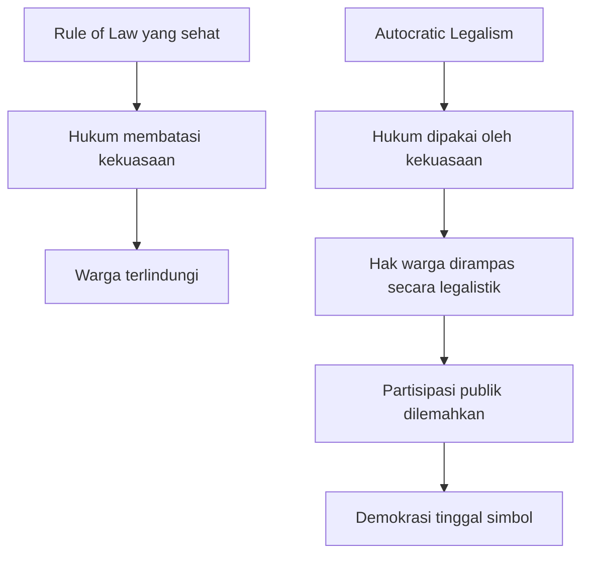
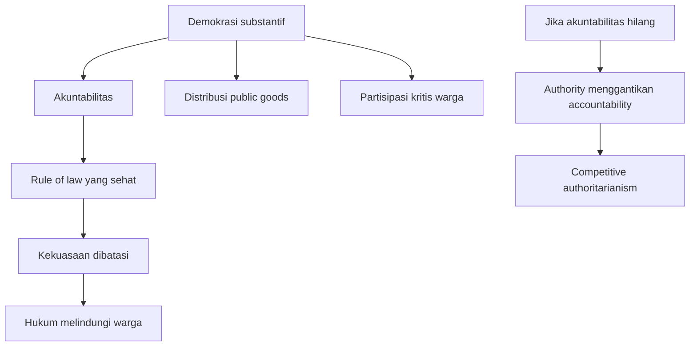

## ⚖️ Pendahuluan: Ketika Hukum Tidak Lagi Melindungi, tetapi Dipakai untuk Menaklukkan

Ada satu kalimat yang sangat menghantam dari percakapan ini: **orang yang ingin merampas hak orang lain hari ini tidak selalu butuh tank, senjata, atau kudeta berdarah; cukup pakai kertas, dan kertas itu bernama hukum.** Kalimat ini terasa menakutkan justru karena ia masuk akal. Kita hidup dalam zaman ketika bentuk kekerasan politik tidak selalu tampil sebagai penindasan kasar yang gamblang. Ia bisa hadir dalam rupa yang sah, rapi, prosedural, bercap negara, lengkap dengan nomor undang-undang, tanda tangan pejabat, dan bahasa legal yang terdengar resmi. 📄

Di sinilah percakapan dengan **Bivitri Susanti** menjadi sangat penting. Ia mengajak kita melihat sesuatu yang sering kabur dalam wacana publik Indonesia: bahwa masalah hukum kita hari ini tidak cukup dipahami hanya sebagai lemahnya penegakan hukum atau banyaknya korupsi. Persoalannya lebih dalam. Hukum itu sendiri sedang dipelintir dari jembatan penyeimbang kekuasaan menjadi **alat kekuasaan**. Ia bukan lagi pagar agar yang kuat tidak menindas yang lemah, tetapi justru menjadi alat agar yang kuat bisa merampas hak yang lemah dengan cara yang tampak legal. Dan karena ia tampak legal, banyak orang lalu bingung: kalau sudah berbentuk undang-undang, peraturan, atau putusan, bukankah itu artinya sah? Bukankah kita tinggal patuh?

Bivitri menolak cara berpikir sesederhana itu. Ia menegaskan bahwa **legal** belum tentu **legitimate** — *sah secara moral dan patut ditaati*. Sesuatu bisa lolos secara prosedur formal, tetapi kehilangan dasar etik, kehilangan partisipasi publik, kehilangan spirit untuk menyetarakan warga, dan pada akhirnya kehilangan legitimasi. Ketika itulah muncul ruang bagi satu gagasan yang bagi banyak orang terasa radikal, tetapi sebenarnya sangat tua dalam filsafat hukum: **good people disobey bad laws** — *orang baik melawan hukum yang buruk*.

Kalimat ini bukan ajakan anarki. Ini bukan izin untuk siapa saja seenaknya menolak semua aturan yang tidak disukai. Yang sedang dibicarakan justru lebih serius: apa yang terjadi ketika hukum dibuat tanpa partisipasi, untuk kepentingan oligarki, menabrak moralitas publik, dan dipaksakan terhadap masyarakat yang bahkan tidak diberi ruang untuk berpikir, bertanya, apalagi menolak? Apakah dalam situasi seperti itu kepatuhan tetap mulia? Atau justru kepatuhan buta berubah menjadi partisipasi diam dalam ketidakadilan?

Percakapan ini juga tidak berhenti pada kritik hukum. Ia merambat ke akar yang lebih dalam: **pendidikan**, **budaya patuh**, **militarisme sosial**, **pembodohan struktural**, **hilangnya ruang bertanya**, **merosotnya akuntabilitas politik**, dan **cara kekuasaan membangun masyarakat yang tidak kritis agar lebih mudah dikelola**. Jadi pembicaraan tentang hukum di sini tidak pernah benar-benar sempit. Hukum bertemu dengan politik, pendidikan, struktur sosial, bahkan kebiasaan keluarga dan ruang kelas.

Artikel ini akan membedah seluruh simpul itu secara panjang, runtut, dan mendalam. Kita akan melihat bagaimana hukum idealnya berfungsi sebagai **equalizer** — *penyetara*; bagaimana ia berubah menjadi senjata melalui **weaponization of law** — *persenjataan hukum*; mengapa legalitas formal tidak cukup tanpa moralitas; mengapa kebijakan buruk kadang bisa sah secara surat tetapi busuk secara semangat; mengapa pendidikan kritis adalah syarat dasar rule of law; bagaimana penegakan hukum yang inkonsisten membunuh kepercayaan masyarakat; mengapa aktivisme harus dipahami luas, bukan cuma demo; dan mengapa optimisme justru lahir bukan dari kepatuhan, melainkan dari keberanian untuk terus bertanya dan menyusun **counter-narrative** — *narasi tandingan*. 🧠

<Callout type="important" title="Tesis utama artikel ini">
Hukum hanya pantas ditaati jika ia punya legitimasi moral, dibuat dengan partisipasi yang wajar, dan bekerja untuk menyetarakan warga yang secara alami tidak setara. Ketika hukum kehilangan fungsi itu dan berubah menjadi senjata kekuasaan, maka melawannya bukan otomatis tindakan liar—justru bisa menjadi kewajiban demokratis.
</Callout>

---

## 🏛️ 1. Hukum Seharusnya Menjadi Jembatan antara Yang Berkuasa dan Yang Dikuasai

Salah satu gagasan paling penting yang disampaikan Bivitri adalah bahwa hukum semestinya menjadi **jembatan penyeimbang** antara pihak yang memegang kekuasaan dan masyarakat yang tidak punya kekuasaan sebesar itu. Gagasan ini sangat dekat dengan tradisi **republikanisme** — *republicanism*, yaitu pandangan politik yang menekankan bahwa kebebasan warga hanya bisa terjaga kalau kekuasaan dibatasi oleh hukum dan lembaga, bukan dibiarkan liar.

Dalam kerangka ini, hukum tidak boleh dipahami sekadar sebagai kumpulan pasal, prosedur, dan teks formal. Hukum adalah mekanisme yang memastikan agar kekuasaan tidak menjelma menjadi kehendak sepihak. Karena manusia tidak setara secara alami—ada yang kaya, ada yang miskin, ada yang punya akses ke negara, ada yang sama sekali tak terdengar—maka tugas hukum adalah **menyetarakan yang secara alami tidak setara**. Itu sebabnya istilah **equality before the law** — *persamaan di hadapan hukum* — menurut Bivitri sering disalahpahami. Banyak orang membacanya seolah hukum hanya mengakui bahwa semua orang sudah setara. Padahal justru sebaliknya: **hukum bertugas membuat perlakuan menjadi setara terhadap orang-orang yang secara sosial, ekonomi, fisik, dan politik memang tidak berangkat dari posisi yang sama.**

Ini sangat penting. Kalau kita berhenti pada pemahaman bahwa hukum hanya “netral” dan “berlaku sama”, kita akan menutup mata terhadap kenyataan bahwa sebagian orang punya pengacara mahal, punya akses ke pembuat kebijakan, punya relasi ke penegak hukum, dan bisa mengubah proses hukum menjadi alat perlindungan diri. Sementara yang lain bahkan tak punya biaya untuk memahami apa yang sedang menimpa mereka. Dalam kondisi seperti ini, hukum yang hanya pura-pura netral sebenarnya sedang melanggengkan ketimpangan.

Maka, hukum yang baik tidak cukup hanya tertib secara bentuk. Ia harus aktif menjalankan fungsi **equalizing** — *menyetarakan*. Dan ketika fungsi itu hilang, hukum bukan lagi jembatan. Ia berubah menjadi **gerbang yang dijaga elite**, yang dibuka hanya untuk kelompok tertentu. 🚪

---

## 🗡️ 2. Weaponization of Law: Ketika Hukum Menjadi Senjata, Bukan Pelindung

Bivitri memakai istilah yang sangat penting dalam literatur global: **weaponization of law** — *persenjataan hukum*, yakni situasi ketika hukum bukan dipakai untuk mencapai keadilan, tetapi dipakai sebagai alat menyerang, menundukkan, membungkam, menggusur, atau mengganti pemain dalam politik dan ekonomi. Ini bukan sekadar salah tafsir hukum biasa. Ini adalah perubahan fungsi hukum dari pelindung menjadi senjata.

Kenapa konsep ini penting? Karena banyak orang masih membayangkan represi hanya terjadi dalam bentuk yang kasar: penangkapan liar, kekerasan aparat, sensor terbuka, atau larangan yang terang-terangan. Padahal dalam banyak rezim kontemporer, tindakan represif justru lebih efektif jika dibungkus dengan legalitas. Mengapa? Karena begitu sesuatu tampil sebagai “proses hukum”, publik lebih mudah bingung, lebih sulit protes, dan lebih mudah dituduh tidak taat hukum jika menolak.

Di titik inilah hukum menjadi alat yang sangat elegan untuk dominasi. Penguasa tidak perlu tank jika bisa membuat undang-undang. Tidak perlu peluru jika bisa menata pasal. Tidak perlu menyatakan perang terhadap rakyat jika cukup membuat definisi “kepentingan umum” atau “proyek strategis nasional” begitu longgar sehingga siapa pun yang menguasai tafsirnya bisa mengambil tanah, ruang hidup, atau kebebasan orang lain. 🧾

Bivitri menyebut sejumlah contoh: Undang-Undang Cipta Kerja, revisi aturan tentang BUMN, revisi Undang-Undang TNI, penggunaan proyek strategis nasional untuk penguasaan lahan, hingga pemidanaan terhadap kebijakan dan aktivis. Semuanya menunjukkan pola yang sama: **hukum tidak lagi hadir sebagai rem bagi kekuasaan, tetapi sebagai kendaraan yang dipakai kekuasaan untuk melaju lebih cepat.**

Dan justru karena semuanya dibungkus secara formal, publik sering dibuat tidak percaya diri untuk menolak. “Kan ini undang-undang.” “Kan ini perpu.” “Kalau tidak suka, ke Mahkamah Konstitusi saja.” Kalimat-kalimat seperti ini terdengar demokratis di permukaan, tetapi pada praktiknya bisa menjadi cara untuk mengunci percakapan dan menyingkirkan warga dari ruang pengambilan keputusan.

---

## 📜 3. Legal Bukan Berarti Legitimate: Batas antara Letter of the Law dan Spirit of the Law

Salah satu simpul paling kuat dalam percakapan ini adalah pembedaan antara **the letter of the law** — *bunyi harfiah hukum* — dan **the spirit of the law** — *semangat atau jiwa hukum*. Pembedaan ini sangat tua dalam filsafat hukum, tetapi terasa sangat relevan untuk Indonesia hari ini.

Banyak kebijakan atau aturan dapat dipertahankan hanya dengan menunjuk prosedur formalnya. Dokumen ada. Stempel ada. Sidang ada. Pengesahan ada. Dari luar, semua tampak resmi. Tetapi pertanyaan yang lebih penting, kata Bivitri, adalah: **untuk apa aturan itu dibuat? siapa yang diuntungkan? bagaimana proses pembuatannya? apakah publik diberi ruang? apakah moralitas publik tercermin di dalamnya?**

Jika semua pertanyaan itu dijawab buruk, maka yang tersisa hanya legalitas kosong. Secara formal iya, secara moral tidak. Secara teknis ada, secara legitimasi bolong. Di sini Bivitri memberi ide sangat penting: **hukum punya daya paksa yang sah justru karena ia mengandung moralitas**. Kalau moralitas itu hilang—kalau aturan dibuat semena-mena, tanpa partisipasi, demi oligarki, dan isinya merampas hak—maka dasar legitimasi hukumnya ikut runtuh.

Ini sangat penting karena banyak orang, termasuk sebagian elite, sengaja mencampuradukkan “legal” dengan “benar.” Padahal sesuatu bisa legalistik tetapi tidak legal dalam pengertian yang lebih bermakna. Legalistik berarti hanya berpijak pada formalitas luar, bukan pada tujuan keadilan yang seharusnya menopang hukum itu sendiri.

Bivitri dengan terang mengatakan: kalau hukum kehilangan moralitas dan legitimasi seperti itu, **ia boleh ditentang**. Ini bukan pembangkangan irasional. Ini justru pengingat bahwa hukum tidak pernah sekadar teks; ia adalah bentuk institusional dari moralitas publik yang seharusnya melindungi warga, bukan menekan mereka.

<Callout type="warning" title="Bahaya legalisme tanpa moralitas">
Ketika kekuasaan hanya bersembunyi di balik bentuk formal hukum, masyarakat bisa tertipu seolah segala sesuatu yang bercap legal pasti adil. Padahal, legalitas tanpa moralitas sering justru menjadi cara paling rapi untuk merampas hak.
</Callout>

---

## 🏗️ 4. Autocratic Legalism: Kudeta Tanpa Tank, Perampasan Tanpa Senjata

Bivitri juga menyinggung konsep yang sangat dekat dengan **autocratic legalism** — *legalisme otokratis*, yaitu cara rezim atau elite kekuasaan menggunakan perangkat hukum, pengadilan, dan regulasi untuk menguatkan kontrol mereka tanpa harus menanggalkan tampilan formal demokrasi. Ini penting karena banyak orang masih membayangkan bahwa otoritarianisme selalu berarti pembubaran parlemen, larangan partai, atau sensor total. Padahal rezim hari ini bisa tetap mengadakan pemilu, tetap punya DPR, tetap punya pengadilan, tetapi esensi demokrasi dan rule of law-nya sudah dikosongkan pelan-pelan dari dalam.

Dalam kerangka ini, undang-undang tidak lagi berfungsi sebagai batas, tetapi sebagai alat produksi kepatuhan. Pengadilan tidak lagi menjadi arena koreksi, tetapi bisa menjadi kanal legitimasi. Proyek strategis nasional tidak lagi murni sarana pembangunan, tetapi bisa menjadi dalih untuk menggusur warga dengan bahasa kepentingan umum. Pemidanaan kebijakan tidak lagi murni urusan akuntabilitas, tetapi bisa berubah menjadi alat ganti pemain.

Maka benar sekali ketika Bivitri mengutip gagasan bahwa hari ini orang tidak perlu tank untuk melakukan semacam kudeta terhadap hak-hak warga. Cukup **menguasai proses pembentukan hukum**. Siapa yang menguasai definisi, prosedur, dan tafsir, bisa mengambil hampir apa pun. Inilah wajah baru kekuasaan yang tampak sopan tetapi sebenarnya jauh lebih licin. 🏛️🗡️

---

## 🌾 5. Dari Cipta Kerja sampai Proyek Strategis Nasional: Bagaimana Hukum Dipakai Mengambil Hak Warga

Salah satu kekuatan percakapan ini adalah keberaniannya membawa teori ke contoh konkret. Bivitri tidak berhenti di istilah besar seperti legalisme otokratis atau weaponization of law. Ia menunjukkan bagaimana semua itu hadir dalam pengalaman warga sehari-hari.

Contoh paling terang adalah **Undang-Undang Cipta Kerja**. Bagi Bivitri, masalahnya bukan cuma isi yang tebal, rumit, dan sangat luas, tetapi juga cara pembentukannya: cepat, tidak partisipatif, minim percakapan publik, dan memusatkan manfaat pada kelompok tertentu. Lalu, ketika dikoreksi Mahkamah Konstitusi, bukannya dibenahi secara sungguh-sungguh melalui percakapan demokratis, justru keluar **Perpu** pada momen ketika publik lengah di akhir tahun. Dari sini terlihat pola yang sangat mengganggu: kalau ada hambatan hukum, hambatan itu tidak dianggap sebagai kesempatan memperbaiki proses, tetapi sebagai masalah teknis yang harus dicari jalan pintasnya.

Hal serupa muncul pada isu **proyek strategis nasional**. Secara ide, konsep pengambilan tanah untuk kepentingan umum memang bisa dibenarkan. Jalan, irigasi, rumah sakit, dan infrastruktur umum jelas punya nilai publik. Tetapi pertanyaan besar yang diajukan Bivitri adalah: **siapa yang menentukan “kepentingan umum”? negara yang mana? kepentingan siapa yang sedang dibela ketika tanah rakyat diambil?**

Ketika konsep seperti “negara” dan “kepentingan umum” jatuh ke tangan kekuasaan yang berwatak jahat, istilah itu bisa menyusut menjadi kepentingan sekelompok kecil yang berkuasa. Dan karena semua dibungkus melalui hukum, warga yang tergusur bukan hanya kehilangan tanah—mereka juga kehilangan bahasa untuk menolak. Mereka berhadapan bukan sekadar dengan aparat atau pengusaha, tetapi dengan narasi bahwa *ini demi negara*. 🌱

Di titik inilah hukum tampak sangat menakutkan. Karena ia bukan lagi tameng bagi warga, tetapi bisa menjadi bahasa luhur yang dipakai untuk merampas hak warga sambil menuduh warga sebagai penghambat pembangunan.

---

## 📉 6. Ketimpangan Bukan Hanya Soal Uang: Hukum Adalah Salah Satu Unequalizer Paling Kurang Diceritakan

Bivitri dan Gita Wirjawan sama-sama menyinggung satu hal yang menurut saya sangat tajam: kita terlalu sering bicara **inequality** — *ketimpangan* — hanya dalam konteks pendapatan, kekayaan, atau peluang ekonomi. Padahal hukum juga bisa menjadi **unequalizer** — *penguat ketimpangan* — yang sangat besar, tetapi sangat kurang dibicarakan.

Mengapa? Karena hukum menentukan siapa yang bisa bicara, siapa yang bisa menuntut, siapa yang bisa dilindungi, siapa yang bisa dipenjara, siapa yang bisa menunda proses, siapa yang bisa membeli penafsiran, dan siapa yang bahkan tidak paham apa yang sedang dilakukan negara terhadap dirinya. Ketika hukum berfungsi buruk, ketimpangan sosial-ekonomi tidak cuma dipertahankan, tetapi diinstitusionalisasi.

Jadi ketimpangan hukum bukan efek samping. Ia adalah infrastruktur ketimpangan itu sendiri. Orang kaya tidak hanya kaya uang, tetapi juga kaya akses legal. Orang dekat kekuasaan tidak hanya punya jaringan politik, tetapi juga punya peluang jauh lebih besar untuk “berdamai” dengan hukum. Sementara orang biasa sering kali harus menghadapi hukum justru dalam bentuk paling kerasnya: surat panggilan, penggusuran, kriminalisasi, atau kesulitan administratif yang tak sanggup mereka lawan.

Di sinilah rule of law yang sehat seharusnya bekerja sebagai penyeimbang. Tetapi kalau hukum malah dikuasai elite, maka ketimpangan menjadi dua kali lipat: **yang kuat makin kuat karena ia juga menguasai aturan main.**

---

## 🧠 7. Pembodohan Struktural: Mengapa Pemerintahan Otoriter Tidak Pernah Benar-Benar Menginginkan Warga Pintar?

Salah satu bagian paling penting dalam percakapan ini adalah ketika Bivitri menautkan masalah hukum dengan masalah pendidikan. Ini sangat penting, karena kita sering memisahkan keduanya: hukum urusan hakim dan legislator, pendidikan urusan guru dan sekolah. Padahal Bivitri menunjukkan bahwa keduanya terkait erat.

Ia mengatakan dengan sangat jelas bahwa **pembodohan itu struktural**. Maksudnya, kebodohan massal bukan semata akibat kemalasan individu atau budaya keluarga. Ia juga dibentuk oleh struktur kebijakan yang tidak sungguh-sungguh memprioritaskan pendidikan berkualitas dan tidak mendorong warga menjadi kritis.

Mengapa ini terjadi? Karena warga yang kritis akan bertanya. Warga yang bertanya akan menggugat. Warga yang menggugat akan menyulitkan kekuasaan yang ingin bekerja tanpa percakapan dan tanpa akuntabilitas. Dengan kata lain, bagi pemerintahan yang wataknya otoriter atau oligarkis, warga yang terlalu kritis bukan aset—mereka ancaman.

Maka jangan heran jika yang sering diprioritaskan justru kepatuhan, bukan nalar; administratif, bukan pembentukan cara berpikir; gelar, bukan kualitas pikir; simbol pendidikan, bukan pendidikan sebagai pelebar cakrawala. Di sinilah pendidikan dan rule of law bertemu secara sangat nyata. **Tidak akan ada rule of law yang sehat di masyarakat yang secara sistematis dibiasakan untuk tidak bertanya.** 🎓

---

## 🏫 8. Sekolah yang Tidak Menjadi Safe Space untuk Bertanya akan Melahirkan Warga yang Takut Menantang Kekuasaan

Bivitri menyampaikan kritik yang sangat halus tetapi menghunjam terhadap budaya pendidikan kita. Banyak murid dan mahasiswa terbiasa memulai pertanyaan dengan “mohon izin,” seolah bertanya itu sendiri sudah tindakan yang nyaris lancang. Ia menolak kebiasaan ini bukan karena formalitasnya semata, tetapi karena yang dipertaruhkan adalah **relasi pengetahuan**.

Kalau ruang kelas dibangun dengan asumsi bahwa guru, dosen, senior, atau atasan selalu benar dan tidak boleh di-*challenge*, maka yang dilatih bukan kemampuan berpikir, melainkan kemampuan menyesuaikan diri terhadap otoritas. Anak belajar sejak dini bahwa yang penting adalah mengatakan apa yang ingin didengar oleh pemegang kuasa, bukan apa yang perlu dikatakan berdasarkan nalar dan keberanian.

Di sini Bivitri menyentuh sesuatu yang sangat mendasar: **pengetahuan hanya tumbuh lewat pertanyaan.** Ketika bertanya dibuat tidak nyaman, dianggap bodoh, atau disamakan dengan pembangkangan, maka pengetahuan mandek. Dan kalau pengetahuan mandek, peradaban juga mandek.

Ini sebabnya ia menekankan sekolah sebagai **safe space** — *ruang aman* — untuk berdebat. Bukan sekadar aman dari perundungan atau kekerasan, tetapi aman untuk berbeda, aman untuk meragukan, aman untuk menguji, aman untuk mengatakan “saya tidak setuju, alasan saya begini.” Dari ruang semacam itulah lahir warga yang suatu hari nanti tidak mudah tunduk pada penyalahgunaan hukum. 🗣️

---

## 🪖 9. Militarisme Sosial dan Kepatuhan Berlebih: Mengapa Terlalu Patuh Bisa Membunuh Peradaban?

Bivitri juga menyinggung sesuatu yang menarik: **militarisme** bukan cuma soal tentara atau institusi militer. Ia juga bisa hadir sebagai budaya kepatuhan berlebihan—budaya yang mengajarkan bahwa keteraturan selalu lebih penting daripada pertanyaan, bahwa seragam lebih penting daripada keberagaman pikiran, bahwa senior selalu benar, bahwa atasan tak pantas digugat, dan bahwa keberanian berpikir sendiri identik dengan pembangkangan.

Tentu keteraturan punya nilai. Tidak semua hierarki itu jahat. Tetapi Bivitri mengingatkan ada harga yang harus dibayar kalau kepatuhan dijadikan nilai tertinggi: **inovasi mati, kapasitas berpikir kritis menurun, dan masyarakat terbiasa menukar kenyamanan taat dengan risiko berpikir.**

Pada akhirnya, budaya seperti ini bukan cuma buruk untuk pendidikan. Ia juga buruk untuk demokrasi dan penegakan hukum. Mengapa? Karena hukum yang sehat butuh warga yang berani berkata, “aturan ini salah.” “kebijakan ini melanggar semangat konstitusi.” “otoritas ini tidak akuntabel.” Kalau semua orang dibentuk hanya untuk patuh, maka tidak ada koreksi sosial terhadap penyalahgunaan hukum.

Maka, kritik terhadap militarisme sosial bukan kritik terhadap disiplin dalam arti sempit. Ini kritik terhadap **budaya politik yang mendidik warga agar lebih nyaman diam daripada berpikir.**

---

## 🧬 10. Akar Corruptibility: Saat Orang Terbiasa Mengatakan Apa yang Ingin Didengar Penguasa

Salah satu bagian paling cemerlang dari percakapan ini adalah ketika Gita merumuskan dua akar besar **corruptibility** — *kecenderungan bisa rusak / mudah terkorupsi*. Bivitri mengiyakan, dan menurut saya ini sangat layak digarisbawahi.

### Akar pertama:
**kebiasaan menyampaikan apa yang orang lain ingin dengar, bukan apa yang harus didengar.**

Ini terdengar sepele, tetapi sebenarnya ia adalah fondasi budaya penjilatan, populisme dangkal, birokrasi yang tidak jujur, dan organisasi yang kehilangan umpan balik sehat. Ketika orang merasa aman hanya jika menyenangkan atasan, maka kebenaran tak lagi punya tempat. Yang dihargai bukan kejernihan pikiran, tetapi keluwesan menyesuaikan kata-kata pada selera kekuasaan.

### Akar kedua:
**sinyal dari pemimpin bahwa pelanggaran bisa lolos.**

Kalau seorang pemimpin memberi kesan bahwa kejahatan dapat dinegosiasikan, bahwa ada jalan belakang, bahwa koneksi bisa menyelesaikan masalah, bahwa hukuman tergantung siapa yang kenal siapa, maka korupsi tidak lagi sekadar tindakan individu. Ia menjadi atmosfer. Semua orang belajar satu hal: *you can get away with it* — **kamu bisa lolos dari itu**.

Kombinasi dua hal ini mematikan. Orang bawah belajar menyenangkan orang atas. Orang atas belajar bahwa hukuman bisa diatur. Dari situ lahirlah budaya politik yang tampak rapi di luar tetapi busuk di dalam. 🧨

---

## 🚦 11. Lawless Society: Ketika Hukum Mati, Orang Biasa Juga Kehilangan Alasan untuk Taat

Bivitri mengingatkan bahwa kematian rule of law tidak hanya terlihat dalam kasus besar di level elite. Ia juga terlihat dalam keseharian. Orang melawan arus, tidak pakai helm, melanggar aturan lalu lintas, menyogok polisi, memanfaatkan koneksi, dan seterusnya. Ini bukan perkara kecil. Ini gejala bahwa masyarakat mulai melihat hukum sebagai sesuatu yang tidak punya harga moral.

Mengapa orang akan hormat pada hukum kalau dari atas mereka melihat hukum dilintir sesuka penguasa? Mengapa warga biasa harus percaya pada aturan kalau mereka menyaksikan bahwa aturan bisa dinegosiasikan oleh mereka yang punya posisi? Ketika konsistensi penegakan hukum hilang, hukum berhenti menjadi norma bersama. Ia berubah menjadi **instrumen selektif**.

Dalam situasi seperti ini, warga biasa sangat mungkin berpikir: “Kalau elite saja bisa main atur, kenapa saya harus serius?” Dari sinilah lahir masyarakat yang semakin **lawless** — *nyaris tanpa hormat pada hukum*, bukan karena tidak punya hukum, tetapi karena hukum sudah kehilangan kehormatan di mata warga.

Itulah bahaya terbesar dari penyalahgunaan hukum di atas: ia bocor ke bawah menjadi krisis kepatuhan sosial secara umum.

---

## 🏛️ 12. Pemidanaan Kebijakan: Ketika Keputusan Publik yang Salah Diproses Seolah Kejahatan Pribadi

Bivitri sangat tegas menolak **pemidanaan kebijakan**. Ini poin yang sangat penting. Dalam negara yang sehat, kebijakan publik bisa salah. Bahkan sering salah. Tetapi tidak semua kebijakan yang salah otomatis adalah tindak pidana.

Mengapa pembedaan ini sangat penting? Karena kalau setiap keputusan kebijakan yang belakangan dianggap rugi atau keliru bisa ditarik menjadi perkara pidana, maka pembuat kebijakan akan selalu bekerja dalam ketakutan. Tidak ada keberanian mengambil keputusan, tidak ada inovasi, dan semua pejabat akan berpikir satu hal: “kalau rezim berganti, saya bisa dicari-cari pasalnya.”

Bivitri mengakui ada kebijakan yang bisa terkait dengan korupsi sungguhan. Tetapi ia menolak logika longgar yang menjadikan “kerugian negara” sebagai keranjang serba muat. Dalam bisnis dan kebijakan, salah hitung atau keputusan yang gagal tidak identik dengan niat jahat. Karena itu ada konsep seperti **business judgment rule** — *aturan yang melindungi pengambil keputusan bisnis/kebijakan dari kriminalisasi semata karena hasilnya buruk, selama diambil dengan itikad baik dan proses yang wajar*.

Jika perlindungan semacam ini hilang, maka hukum pidana berubah menjadi alat politik. Dan itulah yang, menurut Bivitri, banyak terjadi: **kebijakan dipidanakan bukan murni demi keadilan, tetapi demi mengganti pemain atau membalas lawan politik.**

---

## 🧲 13. Dari Perdata ke Pidana: Mengapa Hukum Pidana Sangat Menggoda sebagai Senjata?

Bivitri juga menyinggung fenomena lain yang sangat penting: **pergeseran sengketa dari perdata ke pidana**. Di banyak kasus, persoalan yang seharusnya bisa diselesaikan secara perdata—misalnya utang-piutang, wanprestasi, atau sengketa bisnis—justru dibawa ke ranah pidana. Kenapa? Karena hukum pidana punya daya paksa jauh lebih menakutkan. Ada ancaman penahanan. Ada tekanan psikologis. Ada rasa malu sosial. Ada kemungkinan kehilangan kebebasan.

Maka bagi pihak yang ingin menekan lawannya, menggunakan pasal pidana jauh lebih efektif. Kalau saya ingin bikin orang takut, saya tidak perlu menang secara moral. Saya cukup membuat orang itu menghadapi kemungkinan dipenjara. Dalam banyak kasus, ini cukup untuk memeras, memaksa negosiasi, atau membuat lawan menyerah.

Fenomena ini memperlihatkan betapa bahayanya ketika hukum pidana kehilangan batas dan dipakai sebagai alat transaksi kekuasaan. Hukum yang seharusnya menjadi alat terakhir untuk menindak kejahatan serius justru berubah menjadi **palu serbaguna** untuk menyelesaikan hampir semua konflik—asal ada yang cukup kuat untuk menggerakkannya.

---

## 📣 14. Kriminalisasi Aktivis: Tujuan Utamanya Bukan Menghukum Pelaku, tetapi Menakut-nakuti yang Lain

Salah satu bagian paling menyakitkan dari percakapan ini adalah soal kriminalisasi aktivis, terutama setelah aksi-aksi protes dan ketegangan politik beberapa tahun terakhir. Bivitri menekankan bahwa tujuan dari pemrosesan hukum terhadap banyak aktivis bukan semata menghukum tindakan tertentu, tetapi **menciptakan efek takut**.

Inilah hakikat **weaponization of law** dalam bentuknya yang paling telanjang. Hukum tidak dipakai untuk mengadili kejahatan serius secara jujur, tetapi untuk mengirim pesan: “kalau kamu bersuara terlalu keras, ini yang bisa terjadi padamu.” Begitu hukum dipakai untuk menimbulkan ketakutan, ia berubah menjadi alat manajemen psikologis terhadap masyarakat sipil.

Yang lebih mengerikan, Bivitri menyebut banyak aktivis muda sampai bertanya: “bagaimana cara menulis status media sosial yang aman supaya saya tidak ditangkap polisi?” Pertanyaan ini sendiri sudah menunjukkan kerusakan besar pada demokrasi. Dalam negara demokratis yang sehat, warga tidak seharusnya hidup dengan logika survival seperti itu hanya untuk menyampaikan pendapat.

Maka, kriminalisasi aktivis bukan cuma serangan kepada individu tertentu. Ia adalah serangan kepada **iklim demokrasi**. Karena yang ingin dibungkam bukan satu orang, melainkan **kemungkinan orang-orang lain untuk ikut bersuara.** 📣

<Callout type="danger" title="Efek terbesar kriminalisasi aktivis">
Dampak terburuk dari kriminalisasi aktivis bukan hanya vonis pada satu orang, melainkan lahirnya ketakutan kolektif yang membuat ribuan orang lain memilih diam sebelum sempat bicara.
</Callout>

---

## 🕯️ 15. Aktivisme Tidak Selalu Berarti Turun ke Jalan: Mengapa Melawan Harus Dipahami Secara Luas?

Ketika ditanya apa yang bisa dilakukan dalam jangka pendek, Bivitri menolak sikap pasrah. Ia juga menolak menggantungkan harapan hanya pada doa. Bukan berarti doa tidak penting, tetapi doa tanpa usaha justru bisa berubah menjadi bentuk hopelessness yang tampak saleh. Kita marah dalam doa, kolesterol naik, tetapi tidak ada gerakan.

Karena itu ia menegaskan: **yang kita butuhkan tetap aktivisme.** Namun aktivisme harus dipahami secara luas. Tidak semua orang harus demo. Tidak semua orang harus orasi. Ada yang melawan lewat podcast. Ada yang lewat riset. Ada yang lewat film dokumenter. Ada yang lewat komunitas baca untuk remaja. Ada yang lewat diskusi sejarah di luar sekolah. Ada yang lewat pendidikan hukum. Ada yang lewat penguatan warga desa. Ada yang lewat menulis, mengarsipkan, mengajar, dan membangun ruang percakapan.

Ini penting sekali. Kalau aktivisme dipersempit hanya pada demonstrasi jalanan, banyak orang akan merasa itu bukan tempatnya lalu mundur. Padahal demokrasi hidup justru karena banyak bentuk perlawanan kecil yang mungkin tidak spektakuler, tetapi konsisten. Bivitri sangat menekankan kerja-kerja kecil ini: **menyiapkan generasi muda yang pikiran kritisnya lebih siap menggantikan generasi sekarang yang membuat kita mentok.**

Di sinilah aktivisme bertemu pendidikan. Melawan tidak melulu berarti menggulingkan. Kadang melawan berarti **merawat ruang nalar agar tidak padam**. 🕯️

---

## 🧒 16. Anak 14 Tahun yang Bertanya Soal Hutan dan Keserakahan: Mengapa Harapan Ada pada Kegelisahan yang Jujur?

Bivitri menceritakan satu momen yang sangat indah sekaligus penting secara politik: seorang anak 14–15 tahun bertanya dengan marah dan polos, “Kalau orang-orang itu tahu menebang pohon akan bikin banjir dan longsor, kenapa mereka tetap melakukannya?”

Pertanyaan ini luar biasa karena ia memotong seluruh jargon. Tidak ada istilah oligarki. Tidak ada autocratic legalism. Tidak ada teori tata negara. Yang ada hanya nalar moral yang sangat dasar: **kalau kamu tahu ini menyakiti banyak orang, mengapa kamu tetap melakukannya?**

Bivitri melihat justru di situ harapan besar. Bukan pada jawaban yang rumit, tetapi pada **kemampuan anak muda untuk merasa gelisah terhadap ketidakadilan**. Kegelisahan ini penting. Karena masyarakat yang tak lagi gelisah terhadap perampasan hak sedang berjalan menuju mati rasa politik.

Maka salah satu tugas terbesar pendidikan dan aktivisme adalah menjaga agar pertanyaan-pertanyaan polos semacam itu tidak segera dipadamkan oleh sinisme, ketakutan, atau dogma. Kita butuh generasi yang bukan hanya tahu definisi legalitas, tetapi juga masih bisa marah ketika moralitas disingkirkan dari hukum dan kebijakan. 🌳

---

## 🧑‍🏫 17. Pendidikan, Guru, dan Mengapa Negara yang Serius Harus Membangun Pengajar yang Menginspirasi

Percakapan ini berulang kali kembali pada pendidikan, dan memang sulit menghindarinya. Kalau rule of law butuh warga yang berpikir, dan warga yang berpikir butuh sekolah yang sehat, maka kualitas guru dan sistem pendidikan menjadi sangat sentral.

Bivitri menyoroti betapa absurdnya ketika guru honorer dibayar sangat rendah, kampus disibukkan dengan administrasi, dan publikasi ilmiah sering hanya diburu demi kredit jabatan, bukan demi gagasan baru. Dalam situasi seperti ini, pendidikan kehilangan orientasi dasarnya: membentuk cara berpikir yang kuat, kritis, dan terbuka.

Ia juga menolak feodalisme gelar. Gelar akademik tidak boleh dianggap seperti gelar bangsawan yang otomatis membuat seseorang layak dihormati atau layak berkuasa. Yang penting adalah **ilmu dan integritasnya**, bukan simbol formalnya. Kritik ini sangat relevan dengan Indonesia, di mana gelar sering kali dipakai sebagai pintu akses jabatan, sementara mutu berpikirnya sendiri tidak selalu sebanding.

Kalau negara sungguh serius membangun demokrasi dan rule of law, maka ia harus membangun guru yang mampu **menyuntik inspirasi, imajinasi, dan keberanian berpikir**. Bukan sekadar pengisi kurikulum. Bukan sekadar operator administrasi. Bukan sekadar pengulang hafalan. 🎓✨

---

## 🗳️ 18. Demokrasi Bukan Sekadar Suara, tetapi Distribusi Public Goods dan Akuntabilitas

Salah satu simpul terpenting dalam percakapan ini adalah perluasan definisi demokrasi. Gita menekankan bahwa demokrasi bukan sekadar soal suara atau prosedur elektoral. Demokrasi sejati harus bisa diukur dari **distribusi public goods** — *barang publik*: pendidikan, kesehatan, peluang, nilai sosial, perlindungan hukum, dan hak-hak dasar lain dari Sabang sampai Merauke.

Bivitri menyambut ini dengan penekanan pada **accountability** — *akuntabilitas / pertanggungjawaban*. Bagi dia, begitu akuntabilitas hilang dan diganti oleh otoritas semata, demokrasi itu secara substansi sudah menipis, bahkan bisa berubah menjadi **competitive authoritarianism** — *otoritarianisme kompetitif*. Artinya, secara formal masih ada pemilu, parlemen, lembaga, dan kontestasi. Tetapi semua itu berfungsi terutama untuk mengelola persaingan elite dalam memperebutkan sumber daya, bukan untuk sungguh-sungguh mempertanggungjawabkan kuasa di hadapan rakyat.

Di sini kita melihat hubungan yang sangat erat antara demokrasi dan rule of law. Tanpa akuntabilitas, hukum mudah jadi alat. Tanpa hukum yang membatasi, demokrasi tinggal simbol. Tanpa distribusi barang publik yang adil, demokrasi menjadi hampa. Jadi demokrasi bukan sekadar kotak suara. Ia adalah sistem di mana warga bisa menuntut, menguji, menggugat, dan melihat negara memberi alasan atas tindakannya. 🗳️

---

## 🪤 19. Populisme, Polarisasi, dan Mengapa Kita Harus Terus Menyusun Counter-Narrative

Bivitri menutup dengan satu peringatan penting: banyak ide dan warisan para pendiri bangsa hari ini diterjemahkan secara sempit oleh orang-orang yang punya kepentingan. Akibatnya, konsep luhur seperti Pancasila, demokrasi, musyawarah, rakyat, bahkan hukum dipakai bukan untuk membuka percakapan, tetapi untuk menjustifikasi kehendak kekuasaan.

Di sinilah pentingnya **counter-narrative** — *narasi tandingan*. Kalau kita tidak menantang tafsir sempit itu, lama-lama tafsir itulah yang dianggap sebagai pikiran kolektif bangsa. Orang akan percaya bahwa memang begitulah seharusnya hukum bekerja, memang begitulah demokrasi, memang begitulah negara, padahal yang mereka terima hanyalah versi yang sudah dipelintir untuk melayani mereka yang berkuasa.

Jadi perjuangan ke depan bukan hanya soal mengganti aturan atau elite. Ia juga soal **memenangkan pertempuran tafsir**. Apa arti negara? Apa arti kepentingan umum? Apa arti hukum? Apa arti demokrasi? Apa arti Pancasila? Kalau semua istilah ini diserahkan begitu saja pada elite yang berkuasa, maka publik akan kehabisan bahasa untuk melawan.

Dan justru karena itulah percakapan, tulisan, pengajaran, podcast, diskusi komunitas, dan ruang-ruang kecil lain menjadi penting. Semua itu adalah tempat di mana bahasa direbut kembali dari tangan kekuasaan dan dikembalikan ke warga. 🗣️

---

## 🌱 20. Kesimpulan: Hukum yang Layak Ditaati adalah Hukum yang Layak Dipertanggungjawabkan

Setelah menelusuri seluruh percakapan ini, satu hal terasa sangat jelas: **persoalan utama kita bukan kekurangan hukum, melainkan krisis legitimasi hukum.** Aturan ada banyak. Undang-undang menumpuk. Peraturan turunannya menjamur. Aparat ada. Lembaga ada. Tetapi semua itu tidak otomatis berarti rule of law hidup. Rule of law bukan sekadar keberadaan teks dan institusi. Ia adalah keadaan ketika hukum sungguh-sungguh membatasi kekuasaan, melindungi warga, dibentuk lewat percakapan yang wajar, dan bisa dipertanggungjawabkan di hadapan publik.

Ketika hukum justru dipakai untuk merampas hak, menyingkirkan lawan, mengusir warga dari tanahnya, menakut-nakuti aktivis, menutup ruang kritik, dan mengunci percakapan publik, maka hukum kehilangan wibawanya. Ia mungkin masih legal secara stempel, tetapi tidak lagi legitimate secara moral. Dan pada titik itulah Bivitri benar: **hukum yang buruk boleh ditentang**.

Menentangnya tentu tidak berarti hidup tanpa aturan. Justru sebaliknya, menentang hukum buruk adalah cara membela gagasan hukum yang lebih tinggi: bahwa hukum harus adil, partisipatif, bermoral, dan menjaga yang lemah dari dominasi yang kuat. Dalam arti ini, pembangkangan terhadap hukum yang busuk bukan ancaman terhadap demokrasi. Ia bisa menjadi salah satu jalan menyelamatkan demokrasi dari kepatuhan yang salah alamat.

Tetapi perlawanan ini tidak bisa berhenti pada kemarahan. Ia harus diteruskan menjadi pendidikan, percakapan, pembentukan generasi kritis, penguatan guru, pelebaran ruang debat, dokumentasi, riset, advokasi, dan kerja-kerja kecil yang tampak sepele tetapi sebenarnya sangat besar artinya. Karena seperti diingatkan Bivitri, kita mungkin tidak bisa selalu mengubah puncak kekuasaan hari ini, tetapi kita masih bisa menyiapkan orang-orang yang suatu hari nanti akan menggantikannya dengan cara berpikir yang lebih sehat.

Maka mungkin optimisme paling waras hari ini bukanlah optimisme naif bahwa semuanya akan baik-baik saja, melainkan optimisme yang lebih keras: **bahwa selama masih ada warga yang berani bertanya, guru yang berani membuka ruang, aktivis yang berani menyusun narasi tandingan, dan anak muda yang masih bisa marah pada keserakahan, maka hukum belum sepenuhnya mati.** Dan selama hukum belum sepenuhnya mati, kita masih punya alasan untuk melawannya ketika ia berubah menjadi senjata. 🌍

<Callout type="cite" title="Sumber utama artikel">
Artikel ini disusun berdasarkan percakapan *Mengapa Hukum yang Buruk Boleh Ditentang? - Bivitri Susanti | Endgame #260* dengan fokus pada rule of law, weaponization of law, legalitas versus legitimasi, pembodohan struktural, pendidikan kritis, demokrasi, aktivisme, dan akuntabilitas kekuasaan.
</Callout>
