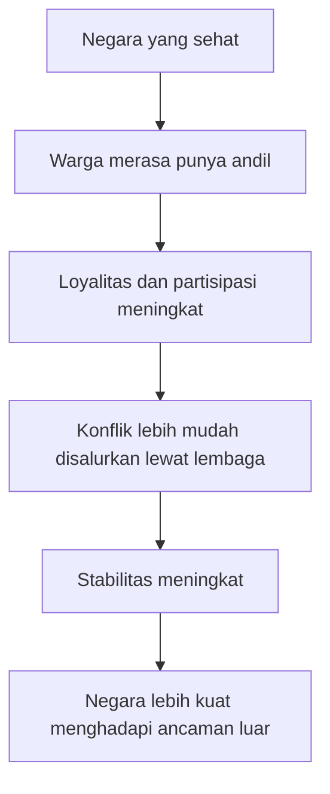

## 🎭 Pendahuluan: Mungkin Masalahnya Bukan Orang Baik Itu Jahat, tetapi Kekuasaan Jarang Memberi Ruang untuk Kepolosan Moral

Ada satu keyakinan yang sangat disukai banyak orang modern: bahwa pemimpin yang baik pasti adalah orang yang baik. Kita cenderung membayangkan pemimpin ideal sebagai pribadi yang jujur, hangat, welas asih, tidak manipulatif, berprinsip, tidak kejam, dan setia pada kata-katanya. Dalam imajinasi moral sehari-hari, semua sifat itu terasa mulia. Dan memang mulia. Namun **Niccolò Machiavelli** datang seperti tamu yang tidak diundang ke meja moral kita, lalu mengajukan pertanyaan yang sangat tidak nyaman: *bagaimana jika sebagian dari sifat yang membuat seseorang baik secara pribadi justru membuatnya berbahaya atau tidak kompeten ketika memegang kekuasaan?* ⚖️

Inilah sumber skandal Machiavelli selama berabad-abad. Ia bukan sekadar pemikir politik yang berkata bahwa dunia itu keras. Banyak orang sudah tahu itu. Yang membuatnya mengguncang adalah kenyataan bahwa ia berani menulis secara terang-terangan bahwa seorang pemimpin kadang harus menipu, harus tampak baik tanpa selalu benar-benar baik, harus menghukum dengan keras, harus bertindak melawan belas kasihan sesaat, bahkan kadang harus menodai hati nuraninya sendiri jika itu diperlukan untuk menyelamatkan negara dan melindungi rakyatnya dalam jangka panjang.

Karena itulah namanya berubah menjadi kata sifat: **Machiavellian**. Dalam bahasa populer, kata ini identik dengan licik, manipulatif, penuh intrik, dan dingin secara moral. Namun seperti banyak nasib pemikir besar lain, Machiavelli justru menjadi korban dari ketenarannya sendiri. Ia terlalu sering dibaca sebagai guru kejahatan, padahal jika kita masuk ke karya-karyanya secara serius, gambarnya jauh lebih rumit. Ia bukan sekadar pembela tirani. Ia juga bukan sekadar penulis manual untuk diktator. Di balik semua reputasi gelap itu, ada seorang pejabat Florentine yang mencintai republik, mengagumi Roma, memikirkan kestabilan negara secara obsesif, dan bertanya tanpa basa-basi: **apa yang sungguh-sungguh bekerja dalam politik, terutama ketika taruhannya adalah hidup-mati satu masyarakat?** 🏛️

Dalam pembacaan ini, Machiavelli bukan anti-moral dalam arti sederhana. Ia justru menempatkan moralitas pada level yang berbeda. Ia tidak terlalu tertarik pada kemurnian jiwa seorang penguasa sebagai individu. Ia lebih tertarik pada akibat yang harus ditanggung rakyat jika penguasanya terlalu sentimental, terlalu naif, terlalu terikat pada citra dirinya sebagai orang baik, dan terlalu enggan melakukan hal-hal yang secara pribadi menyakitkan namun secara politik diperlukan. Dengan kata lain, ia memindahkan pusat etika dari “bagaimana aku tetap murni?” ke “bagaimana masyarakatku selamat, tertib, dan tidak hancur?”

Itulah sebabnya artikel ini penting. Kita tidak sedang membahas intrik istana belaka. Kita sedang membahas satu benturan abadi antara **moralitas pribadi** dan **tanggung jawab politik**. Kita sedang membahas apakah pemimpin harus lebih mirip santo atau lebih mirip ahli bedah: seseorang yang mungkin harus menyakiti untuk menyelamatkan. Kita sedang membahas mengapa kejujuran tidak selalu sederhana dalam negara, mengapa belas kasihan bisa melahirkan kekacauan, mengapa republik lebih baik daripada tirani namun tetap perlu ketegasan keras, dan mengapa orang yang terlalu ingin tampak suci kadang justru membawa malapetaka bagi orang banyak.

Artikel ini akan membedah Machiavelli secara panjang, detail, dan runtut berdasarkan pembahasan tentang hidupnya, *The Prince*, *Discourses on Livy*, dan gagasan-gagasannya tentang tabiat manusia, kekuasaan, perang, republik, propaganda, kebajikan, dan prinsip moral. Jika ada istilah asing, saya jelaskan padanan Indonesianya. Jika ada gagasan yang terasa ofensif, kita uraikan perlahan. Dan jika pada beberapa titik Machiavelli terdengar kejam, kita tidak akan langsung lari darinya, karena justru di titik itulah ia sedang memaksa kita menatap sesuatu yang sering ingin kita hindari: **bahwa memerintah manusia bukanlah pekerjaan bagi hati yang sekadar lembut, melainkan bagi akal yang mampu memilih antara dua keburukan dan tetap memikul akibatnya.** 🧠

<Callout type="important" title="Tesis utama artikel ini">
Machiavelli tidak terutama bertanya bagaimana seorang penguasa tetap menjadi manusia paling suci, melainkan bagaimana seorang pemimpin menjaga negara, melindungi rakyat, dan menahan kehancuran—bahkan jika untuk itu ia harus melukai citra moral pribadinya sendiri.
</Callout>

---

## 🏰 1. Siapa Sebenarnya Machiavelli? Bukan Setan Politik, Melainkan Pejabat Republik yang Patah Hati pada Realitas

Untuk memahami Machiavelli, kita tidak boleh memulainya dari karikatur. Kita harus mulai dari biografinya. **Niccolò di Bernardo dei Machiavelli** lahir di Florence pada tahun 1469, di tengah Italia Renaisans yang sangat indah secara budaya tetapi juga sangat brutal secara politik. Ia bukan filsuf yang tumbuh di ruang steril. Ia hidup di dunia kota-kota negara yang saling curiga, keluarga-keluarga elite yang saling sikut, persekongkolan, invasi asing, pengkhianatan, dan perubahan rezim yang bisa membuat seseorang naik tinggi hari ini lalu disiksa besok pagi.

Ayahnya, Bernardo, bukan orang superkaya, tetapi sangat menghargai pendidikan klasik. Machiavelli muda dibesarkan dalam dunia bacaan Latin, sejarah Romawi, dan warisan intelektual Yunani-Romawi. Ia membaca Livy, Cicero, dan karya-karya klasik lain yang kemudian membentuk obsesinya pada republik, kebajikan sipil, dan sejarah sebagai laboratorium politik. Jadi bahkan sejak awal, Machiavelli tidak lahir dari nihilisme. Ia lahir dari **humanisme Renaisans** — *humanisme*, yaitu semangat intelektual yang kembali menggali manusia, sejarah, dan warisan klasik untuk memahami dunia.

Karier politiknya benar-benar meledak ketika ia diangkat menjadi pejabat penting dalam Republik Florence pada 1498. Ini bukan posisi kecil. Ia terlibat dalam urusan perang, diplomasi, administrasi, negosiasi antarnegara, dan pengamatan langsung terhadap tokoh-tokoh besar. Ia melihat penguasa, diplomat, tentara, oportunis, dan penipu dari jarak dekat. Ia juga menyaksikan naik-turun kekuatan besar seperti Prancis, negara-negara Italia, dan terutama figur-figur kuat seperti **Cesare Borgia**, yang kemudian banyak memengaruhi gambaran Machiavelli tentang penguasa efektif.

Lalu tragedi datang. Keluarga **Medici** kembali berkuasa. Republik Florence jatuh. Machiavelli ditangkap, disiksa, diasingkan, dan disingkirkan dari kehidupan politik aktif yang sangat ia cintai. Di pengasingan itulah ia menulis karya-karya terbesarnya: *The Prince*, *Discourses on Livy*, dan *The Art of War*. Maka karya-karya itu bukan sekadar renungan abstrak. Mereka lahir dari satu perpaduan yang sangat kuat: **pengalaman praktis memegang urusan negara, rasa frustrasi mendalam, kerinduan pada republik, dan keinginan keras untuk memahami hukum-hukum nyata kekuasaan**. 📜

Ini penting sekali. Machiavelli bukan “armchair theorist” — *pemikir kursi malas*, yaitu orang yang hanya berteori tanpa pernah menyentuh kenyataan. Ia adalah birokrat, diplomat, pengamat perang, analis sejarah, dan orang yang benar-benar tahu rasanya melihat negara runtuh. Karena itu, tulisannya selalu terasa seperti filsafat yang sudah terkena debu jalanan dan bau darah politik.

---

## 🧭 2. Mengapa Machiavelli Sangat Berpengalaman, tetapi Sulit Ditafsirkan Secara Tunggal?

Salah satu kesulitan terbesar saat membaca Machiavelli adalah bahwa karya-karyanya tidak selalu lahir dari motivasi yang sama. *The Prince* misalnya, memang bisa dibaca sebagai karya teori politik. Tetapi secara historis, ia juga merupakan usaha untuk mencari jalan kembali ke lingkungan kekuasaan Medici. Dengan kata lain, ada unsur strategis, bahkan personal, dalam penulisannya.

Ini membuat para pembaca selama berabad-abad bertanya: apakah Machiavelli sungguh percaya semua nasihat dalam *The Prince*? Ataukah ia sedang menyanjung, menyindir, membuka tabir kekuasaan, atau melakukan semuanya sekaligus? Jawabannya tidak pernah sepenuhnya sederhana.

Namun ada satu pegangan penting. Banyak penafsir menilai bahwa jika kita ingin melihat suara Machiavelli yang paling “jujur” atau paling dekat dengan visi politik pribadinya, maka *Discourses on Livy* sangat penting. Dalam karya itu, kecintaannya pada republik jauh lebih jelas. Ia memuji partisipasi warga, pentingnya kebebasan politik, dan kekuatan lembaga-lembaga yang mampu menahan ambisi elite.

Jadi, Machiavelli harus dibaca dalam tegangan. Ia bukan sekadar penulis *The Prince*. Ia juga penulis *Discourses*. Ia bukan sekadar pengagum pangeran yang kuat, tetapi juga pembela republik yang sehat. Di sinilah keunikannya. Banyak orang ingin memilih salah satu: apakah ia pendukung tirani atau pecinta republik? Jawaban yang lebih tepat mungkin: **ia adalah realis republik**, seorang yang mencintai pemerintahan bebas tetapi tahu bahwa kebebasan politik tidak akan bertahan jika tidak dipagari oleh kekuatan, ketegasan, dan kadang kekerasan yang terukur.

---

## 🧍 3. Tabiat Manusia Menurut Machiavelli: Tidak Sederhana, tetapi Politik Harus Berani Mengasumsikan yang Terburuk

Salah satu fondasi terpenting pemikiran Machiavelli adalah cara ia memandang manusia. Menariknya, pandangannya tidak sesederhana karikatur “manusia itu jahat dan selesai.” Ia justru cukup bernuansa. Di satu sisi, ia tahu manusia berbeda-beda. Ada pemimpin yang lebih cocok memimpin perang, ada yang lebih cocok menata administrasi. Ada masyarakat yang dibentuk oleh budaya lebih disiplin dan berbudi, ada pula masyarakat yang dilunakkan oleh kemewahan atau dirusak oleh korupsi. Jadi ia tidak menolak kompleksitas manusia.

Namun, ketika kita masuk ke level **politik praktis**, Machiavelli mengajukan prinsip yang terdengar sangat keras tetapi sangat konsisten: **rancang hukum dan struktur negara seolah-olah manusia cenderung ambisius, rakus, mudah berubah, dan siap mengejar kepentingan dirinya sendiri jika ada celah.**

Mengapa? Karena baginya, kalau Anda merancang negara dengan mengandaikan semua orang pada dasarnya baik, maka satu kelompok kecil yang ambisius saja cukup untuk merusak semuanya. Ia percaya bahwa akan selalu ada orang yang tidak berhenti pada batas wajar, yang ingin memperbesar kuasa, memperkaya diri, atau mengambil kesempatan saat sistem lengah. Karena itu, politik tidak boleh bertumpu pada harapan moral belaka. Ia harus bertumpu pada **institusi, pengawasan, dan pembatasan ambisi**.

Ini sangat dekat dengan intuisi modern tentang *checks and balances* — **mekanisme saling mengawasi dan saling membatasi**. Machiavelli tidak memakai istilah modern itu, tetapi semangatnya jelas: negara yang baik adalah negara yang memahami bahwa kebajikan individual itu berharga, namun **tidak boleh dijadikan satu-satunya fondasi keamanan politik**. 🔒

Ia juga mengakui bahwa manusia bisa dibentuk oleh pendidikan dan budaya. Dalam hal ini, ia tidak sepenuhnya pesimis. Ia percaya negara dapat menanamkan kebajikan, keberanian sipil, dan disiplin. Namun justru karena pendidikan itu penting, negara harus serius membentuk budaya warganya, bukan sekadar mengeluh bahwa manusia itu serakah. Jadi di sini ada dua lapisan sekaligus:

1. manusia bisa dididik menjadi lebih baik,  
2. tetapi negara tetap harus disusun dengan asumsi bahwa sebagian orang akan gagal dididik atau sengaja melawan norma.  

Inilah perpaduan khas Machiavelli antara harapan dan kewaspadaan.

---

## 🪜 4. Machiavelli Selalu Bergerak antara Dua Level: Dunia Nyata dan “Realitas Politik”

Untuk membaca Machiavelli dengan adil, ada satu pembedaan penting yang harus selalu kita ingat. Ia seperti berbicara dalam dua register sekaligus.

### a. Dunia nyata dalam segala kerumitannya
Pada level ini, Machiavelli tahu bahwa manusia itu beragam. Tidak semua jahat. Tidak semua rakus. Tidak semua siap mengkhianati. Ia juga tahu konteks berbeda-beda, keadaan berbeda-beda, dan aturan tidak pernah bisa sepenuhnya mekanis.

### b. Realitas politik
Pada level ini, seorang penguasa atau perancang negara tidak selalu punya waktu untuk mempertimbangkan semua nuansa. Ia harus membuat keputusan cepat dengan risiko besar. Maka pada level ini, Machiavelli menyusun semacam aksioma praktis: **anggap ambisi manusia besar, anggap ancaman itu mungkin, anggap musuh bisa kembali, anggap kelemahan akan dimanfaatkan.**

Ini mirip seperti seorang insinyur yang memakai angka pembulatan agar rancangan tetap aman. Dalam politik, pembulatan Machiavelli adalah: *lebih aman berasumsi manusia akan menyalahgunakan kekuasaan daripada berharap mereka tidak akan melakukannya.*

Maka kalau di satu tempat ia tampak sangat pesimis tentang manusia, itu tidak selalu berarti ia sungguh percaya semua orang rusak. Sering kali ia sedang bicara pada level **political reality** — *realitas politik*, yakni seperangkat asumsi yang harus diambil jika yang dipertaruhkan adalah kelangsungan negara. 🧮

---

## ⚖️ 5. Mengapa Orang Baik Bisa Menjadi Penguasa yang Buruk?

Sekarang kita masuk ke inti persoalan. Machiavelli bukan sedang mengejek kebaikan moral. Ia bukan berkata bahwa kemurahan hati, kejujuran, atau kasih sayang itu buruk pada dirinya sendiri. Yang ia katakan lebih menyakitkan: **sifat-sifat yang indah pada manusia privat tidak otomatis cocok ketika seseorang memegang tanggung jawab atas nasib banyak orang.**

Ini karena seorang penguasa tidak hidup untuk dirinya sendiri. Seorang warga biasa boleh memikirkan kebersihan jiwanya sendiri. Ia boleh menolak melakukan kekerasan dan menanggung akibatnya secara pribadi. Tetapi seorang pemimpin tidak menanggung akibat itu sendirian. Jika ia terlalu lembut, mungkin bukan hanya dirinya yang jatuh, melainkan juga negaranya, hukumnya, ketertiban sosialnya, dan keselamatan rakyatnya.

Di sinilah Machiavelli membalik intuisi moral umum. Kita biasanya mengira pemimpin penuh belas kasih pasti lebih baik daripada pemimpin keras. Tetapi baginya, kalau belas kasih itu membuat pemimpin gagal menindak pemberontakan, gagal menghukum korupsi, gagal mencegah kekacauan, atau gagal memberi efek jera, maka belas kasih itu justru berubah menjadi bentuk **ketidakbertanggungjawaban**.

Seorang pemimpin yang tampak kejam, dalam beberapa kondisi, bisa jadi lebih “berbelas kasih” dalam gambaran besar jika tindakannya menjaga masyarakat dari perang saudara, chaos, penjarahan, atau kehancuran. Sebaliknya, pemimpin yang tampak lembut bisa justru menyebabkan penderitaan lebih luas karena terlalu takut melakukan tindakan keras pada saat yang tepat.

Jadi rumusan Machiavelli bukan “orang baik itu buruk”, melainkan: **orang yang terlalu sibuk menjaga citra dirinya sebagai orang baik bisa gagal menjalankan kewajiban politis yang kadang memang menuntut tindakan tak enak dipandang.** 🩺

<Callout type="warning" title="Poin paling tidak nyaman dari Machiavelli">
Dalam politik, belas kasihan yang salah waktu bisa melahirkan kekacauan; kejujuran yang kaku bisa membunuh strategi; dan prinsip yang dijaga terlalu murni bisa justru menjerumuskan rakyat ke dalam penderitaan yang lebih besar.
</Callout>

---

## 🏺 6. Virtù Menurut Machiavelli: Bukan Moralitas Suci, tetapi Keahlian Memimpin di Dunia yang Berbahaya

Salah satu sumber salah paham terbesar dalam membaca Machiavelli terletak pada kata **virtù**. Banyak pembaca modern langsung menghubungkannya dengan “virtue” dalam pengertian moral modern: kebaikan hati, ketulusan, kemurnian, kebajikan moral. Padahal pada Machiavelli, makna **virtù** jauh lebih kompleks.

Dalam banyak konteks, *virtù* pada Machiavelli berarti **kapasitas, daya, ketegasan, kecakapan, keberanian, kecerdikan, kemampuan membaca keadaan, dan kesanggupan membentuk nasib**. Jadi seorang penguasa bisa memiliki *virtù* tanpa selalu menjadi orang suci. Dalam bahasa yang lebih sederhana, *virtù* adalah **keunggulan praktis dalam mengelola kekuasaan dan keadaan**.

Ini menjelaskan mengapa Machiavelli bisa memuji tindakan yang secara moral tampak buruk, kalau tindakan itu berhasil menata keadaan, menstabilkan negara, dan melindungi masyarakat. Sebaliknya, ia bisa mengkritik pemimpin yang tampak baik jika kebaikannya itu membuat negara lemah dan rakyat menderita.

Bagi pembaca modern, ini memang mengganggu. Karena kita terbiasa memisahkan tegas antara “orang baik” dan “orang efektif.” Machiavelli justru memaksa kita bertanya: **kalau efektivitas adalah syarat untuk menyelamatkan masyarakat, bisakah kita terus berbicara tentang kebaikan tanpa memikirkan akibat nyata?**

---

## 🛡️ 7. Kebaikan Pemimpin Menurut Machiavelli Tetap Berpusat pada Rakyat, Bukan pada Ego Sang Penguasa

Meski sering dianggap amoral, Machiavelli sebenarnya punya orientasi yang cukup jelas: penguasa yang baik adalah penguasa yang **menguntungkan rakyat dan menjaga negara**, bukan penguasa yang sekadar memperkaya diri. Ia sangat kritis terhadap penguasa yang menimbun kuasa demi diri sendiri sambil merusak kota, memperparah faksi, atau membiarkan masyarakat pecah.

Jadi, kalau kita mau adil, Machiavelli bukan penginjil egoisme politik. Ia bukan berkata, “lakukan apa saja demi dirimu sendiri.” Ia lebih dekat pada posisi ini: **jika Anda memegang kekuasaan, Anda punya kewajiban keras untuk mengutamakan kelangsungan dan ketertiban masyarakat, dan demi itu Anda kadang harus melakukan hal yang secara privat terasa berdosa.**

Ini sebabnya ia tetap memuji republik, menghargai kebebasan warga, dan curiga pada tirani yang hanya memperkaya penguasa. Masalahnya, ia tidak percaya bahwa orientasi pada rakyat itu cukup jika pemimpin tidak siap melakukan tindakan keras saat diperlukan.

Dengan kata lain, Machiavelli tidak sedang menghapus etika. Ia sedang **memindahkan pusat etika dari kemurnian niat ke tanggung jawab atas akibat publik**. 👥

---

## 😶 8. Kejujuran, Penampilan, dan “PR” Politik: Mengapa Tampak Baik Sama Pentingnya dengan Menjadi Baik?

Salah satu bagian paling kontroversial dari Machiavelli adalah pandangannya tentang kejujuran. Ia tahu bahwa rakyat menginginkan pemimpin jujur. Ia juga tahu bahwa kepercayaan publik adalah aset besar. Tetapi justru karena itulah ia menegaskan bahwa dalam politik, **penampilan** sering sama pentingnya dengan realitas.

Ini bukan karena ia mencintai kebohongan untuk kebohongan itu sendiri. Ia memandang politik sebagai dunia interpretasi. Publik tidak pernah memegang semua fakta. Mereka selalu hidup dalam persepsi, kabar, simbol, kesan, dan narasi. Maka penguasa yang mengabaikan ranah persepsi sedang menyerahkan setengah kekuasaan begitu saja.

Machiavelli menyadari sesuatu yang kini terasa sangat modern: politik selalu punya dimensi **public relations / hubungan publik**, bahkan sebelum istilah itu ada. Seorang pemimpin harus dipandang kuat, adil, bijak, dan layak dipercaya. Jika tidak, musuh luar akan berani, rakyat dalam akan goyah, dan elite sekitar akan mulai menghitung ulang loyalitas mereka.

Karena itu, ia tidak keberatan pada tindakan membingkai kenyataan secara strategis jika itu menjaga moral tentara, menenangkan rakyat, atau mencegah kepanikan yang lebih merusak. Tentu di sini ada risiko besar: kapan pembingkaian berhenti menjadi strategi yang masuk akal dan berubah menjadi manipulasi yang berbahaya? Machiavelli sendiri tidak memberi batas yang selalu rapi. Dan justru itulah yang membuatnya tetap terasa mengganggu hingga hari ini. 🎭

---

## 🐔 9. Ayam, Tanda-Tanda, dan Pelajaran Machiavelli tentang Persepsi dalam Perang

Salah satu contoh terkenal yang menunjukkan cara berpikir Machiavelli adalah kisah tentang komandan Romawi yang harus menghadapi pertanda buruk sebelum pertempuran. Dalam budaya saat itu, tanda-tanda religius atau omens punya bobot psikologis besar. Kalau pertanda dianggap buruk, moral pasukan bisa runtuh sebelum perang dimulai.

Di sini Machiavelli mengagumi pemimpin yang mampu mengelola persepsi. Bukan karena ia peduli apakah pertanda itu benar secara metafisik, tetapi karena ia tahu **morale / moral pasukan** sering lebih menentukan hasil perang daripada kebenaran abstrak tentang pertanda. Dalam dunia perang, semangat, keyakinan, dan interpretasi simbol bisa memutuskan kemenangan atau kekalahan.

Ini menunjukkan betapa jauh Machiavelli dari idealisme moral murni. Bagi dia, pemimpin yang membiarkan pasukannya tumbang hanya demi menjaga hubungan yang steril dengan “fakta apa adanya” adalah pemimpin yang gagal membaca fungsi politik dan psikologis simbol. Jika sedikit manipulasi persepsi dapat menyelamatkan pasukan dan negara, maka ia cenderung menganggapnya dapat dibenarkan.

Kita boleh tidak setuju. Tetapi kita harus mengakui konsistensinya: **bagi Machiavelli, ukuran utama tetap akibat bagi keselamatan politik bersama**.

---

## ⛪ 10. Agama menurut Machiavelli: Bukan Pertama-tama Soal Metafisika, tetapi Mesin Pembentuk Warga

Machiavelli juga menarik ketika bicara soal agama. Ia tidak membahas agama terutama sebagai pertanyaan teologis tentang kebenaran langit, melainkan sebagai pertanyaan politik: **apa yang dikerjakan agama terhadap karakter warga dan kohesi negara?**

Dalam hal ini, ia sangat mengagumi fungsi agama dalam Roma kuno. Baginya, agama Romawi membantu menanamkan rasa hormat pada sumpah, loyalitas pada kota, dan kebiasaan meletakkan kepentingan bersama di atas kepentingan pribadi tertentu. Jadi agama dipandang sebagai alat pembentukan **virtù sipil** — *kebajikan kewargaan*.

Sebaliknya, ia cenderung skeptis terhadap bentuk agama yang, menurutnya, terlalu menekankan kepasrahan, kontemplasi, atau kelembutan yang bisa melemahkan daya politik suatu bangsa. Di sini banyak pembaca melihat bibit kritik terhadap kekristenan tertentu, terutama jika agama itu membuat manusia menjadi terlalu pasif, terlalu takut bertindak, atau terlalu fokus pada dunia akhirat sampai lalai membangun ketahanan dunia kini.

Poin Machiavelli jelas: budaya, pendidikan, dan agama bukan sekadar ornamen. Mereka adalah alat pembentuk warga. Dan kalau negara ingin bertahan, ia harus serius membentuk nilai-nilai yang memperkuat loyalitas, disiplin, dan kesiapan berkorban untuk komunitas. ⛪🛡️

---

## 🗳️ 11. Mengapa Machiavelli Sebenarnya Lebih Suka Republik daripada Pemerintahan Pangeran?

Di sinilah salah satu koreksi terpenting terhadap citra Machiavelli. Meski *The Prince* sangat terkenal, banyak pembaca melupakan bahwa Machiavelli secara keseluruhan **lebih menyukai republik**. Ia mengagumi Roma justru karena republik itu mampu menciptakan keterlibatan warga, energi sipil, loyalitas pada negara, dan kekuatan militer yang lahir dari identifikasi rakyat terhadap negaranya sendiri.

Bagi Machiavelli, republik punya beberapa keunggulan besar.

Pertama, warga yang merasa menjadi bagian dari negara akan **lebih rela membela negara itu**. Mereka tidak melihat perang sebagai urusan keluarga penguasa, tetapi urusan rumah mereka sendiri.

Kedua, republik yang sehat bisa menyalurkan konflik kelas atau konflik kepentingan ke dalam lembaga, sehingga ketegangan sosial tidak langsung berubah menjadi perang saudara atau kudeta.

Ketiga, republik cenderung lebih tahan lama karena kekuasaannya tidak seluruhnya bertumpu pada satu tubuh. Penguasa tunggal bisa mati, bodoh, atau tergoda menjadi tiran. Republik punya mekanisme koreksi yang lebih kaya.

Jadi, mengapa Machiavelli masih menulis *The Prince*? Salah satu jawabannya adalah karena ia sangat realistis. Ia hidup dalam dunia di mana pangeran dan rezim non-republik nyata ada di mana-mana. Maka baginya, kalau republik belum tersedia atau telah runtuh, pertanyaan praktis tetap harus dijawab: **bagaimana membuat penguasa tunggal tidak sepenuhnya menghancurkan masyarakat yang ia perintah?**

Dalam pembacaan ini, *The Prince* bisa dilihat bukan sebagai kitab cinta tirani, tetapi sebagai manual **bagaimana membuat monarki atau principality / kepangeranan menjadi seburuk mungkin seminimal mungkin**. 🏛️

---

## 🧱 12. Kebebasan dan Stabilitas: Mengapa Republik Bisa Lebih Aman Justru karena Warganya Lebih Bebas?

Ini salah satu intuisi paling canggih dari Machiavelli. Banyak orang mengira stabilitas hanya bisa diperoleh lewat kontrol ketat. Namun ia melihat sesuatu yang lebih halus: negara justru bisa menjadi lebih stabil jika warga merasa punya tempat dalam sistem dan punya alasan untuk menjaga negara itu tetap berdiri.

Bagi Machiavelli, konflik terbesar dalam banyak negara datang dari pertarungan antara rakyat biasa yang hanya ingin tidak ditindas, dan elite yang selalu ingin memperbesar kuasanya. Republik yang dirancang baik dapat menyalurkan dua dorongan ini lewat lembaga, perwakilan, dan distribusi posisi sehingga konflik itu tidak berubah menjadi perusakan total.

Dalam hal ini, kebebasan bukan sekadar nilai moral. Kebebasan adalah **alat stabilisasi politik**. Warga yang punya andil dalam negara, lebih mungkin taat, bekerja, membela, dan mengidentifikasi diri dengan negara. Sebaliknya, negara yang menindas berlebihan justru menciptakan jurang antara penguasa dan rakyat, lalu harus terus menerus hidup dalam ketakutan.

Maka ketika Machiavelli membela republik, ia tidak sedang bicara seperti romantikus demokrasi modern. Ia bicara seperti insinyur politik: **republik yang baik bekerja lebih efektif dan lebih tahan lama daripada rezim yang terlalu terpusat pada elite sempit.**

---

## 🪖 13. Mengapa Bagi Machiavelli Negara Harus Selalu Siap untuk Kekerasan?

Jika ada satu tema yang terus berulang dalam Machiavelli, itu adalah **bahaya**. Bagi dia, negara tidak hidup dalam kebun damai yang netral. Negara hidup di dunia yang penuh pesaing, musuh, oportunis, dan ancaman. Karena itu, negara harus selalu siap pada kemungkinan perang dan kekerasan.

Ini bukan berarti ia mencintai perang. Justru sebaliknya, ia melihat perang sebagai bagian tragis namun sering tak terhindarkan dari politik antarnegara. Dan karena perang bisa datang kapan saja, negara yang tidak siap ibarat orang kaya yang membiarkan pintunya terbuka sambil berharap tidak ada pencuri.

Machiavelli sangat menghargai pemimpin yang mampu membuat negaranya **berbahaya untuk diserang**. Bagi dia, kesiapan militer bukan hanya alat untuk menang perang, tetapi juga alat untuk **mencegah perang**. Musuh akan berpikir dua kali sebelum menyerang negara yang tampak disiplin, terorganisasi, dan siap bertempur.

Ia juga menolak ketergantungan pada **mercenaries / tentara bayaran**. Alasannya sangat modern: tentara bayaran bertarung untuk uang, bukan karena mereka mengidentifikasi diri dengan negara. Loyalitas mereka dangkal, mahal, dan rapuh. Sebaliknya, **citizen army / tentara warga** jauh lebih dapat diandalkan karena mereka mempertahankan rumah sendiri.

Jadi ketika Machiavelli mendorong militerisasi kesiapsiagaan, ia tidak semata sedang memuja kekerasan. Ia sedang berkata: **di dunia yang berbahaya, kelemahan yang naif adalah undangan untuk dihancurkan.** ⚔️

---

## 🩸 14. Kekejaman yang Tepat Waktu dan Kekejaman yang Bodoh

Machiavelli sangat terkenal karena membahas kekejaman. Tetapi sekali lagi, ia tidak membahasnya secara serampangan. Ia membuat pembedaan penting antara **cruelty well used** — *kekejaman yang digunakan dengan baik* — dan kekejaman yang salah arah, berulang-ulang, dan sembrono.

Apa maksudnya? Jika kekerasan memang diperlukan, maka menurut Machiavelli, ia harus dilakukan:

- dengan cepat,  
- tegas,  
- jelas tujuannya,  
- lalu dihentikan,  
- agar sesudah itu negara bisa masuk ke fase ketertiban.  

Sebaliknya, penguasa yang terus menerus kejam tanpa ukuran, merampas harta warga, mempermalukan rakyat, atau menabur ketakutan tanpa tujuan yang bisa dibaca justru menumbuhkan kebencian. Dan kebencian publik itu sangat berbahaya. Machiavelli berkali-kali mengingatkan: **penguasa harus menghindari menjadi dibenci.**

Jadi, paradoksnya, ia tidak membela kebrutalan tak terbatas. Ia membela penggunaan kekerasan yang menurutnya bisa mencegah kekacauan lebih besar. Dari sini kita melihat sekali lagi pola khasnya: **sedikit keburukan yang terukur demi mencegah keburukan yang jauh lebih besar.**

Tentu ini membuka pintu penyalahgunaan. Siapa yang menentukan “terukur” dan “perlu”? Di titik inilah Machiavelli memang berbahaya jika dibaca oleh orang yang sudah dari awal hanya mencari pembenaran untuk bertindak brutal. Tetapi kalau dibaca dengan cermat, ia justru memberi peringatan bahwa penguasa yang terlalu lama menikmati kekejaman akan menghancurkan dirinya sendiri. 🩸

---

## 🫱 15. Hancurkan Musuh atau Jadikan Sekutu: Mengapa Machiavelli Membenci Jalan Tengah?

Ada satu nasihat terkenal dari Machiavelli: ketika berurusan dengan musuh, **jangan setengah-setengah**. Entah buat mereka menjadi sekutu sejati, atau lumpuhkan mereka sepenuhnya sehingga mereka tak lagi bisa membalas. Yang paling berbahaya adalah jalan tengah: menghukum cukup keras untuk menimbulkan dendam, tetapi membiarkan cukup kekuatan bagi mereka untuk bangkit lagi.

Ini logika yang keras sekali, tetapi lahir dari pengamatannya pada politik Italia dan sejarah Romawi. Bagi dia, banyak konflik berdarah berkepanjangan justru lahir karena penguasa gagal menyelesaikan masalah dengan tuntas. Mereka ingin terlihat lunak, tetapi setengah keras; ingin terlihat kuat, tetapi setengah kompromistis. Akibatnya, mereka tidak dapat kedamaian, tetapi justru mengundang dendam jangka panjang.

Pelajarannya bukan berarti semua konflik harus berakhir dengan penghancuran total. Justru Machiavelli juga menghargai kemampuan mengubah lawan menjadi kawan. Tetapi yang tidak ia toleransi adalah **keragu-raguan strategis** yang membuat penguasa tampak tegas di permukaan namun sebenarnya hanya menunda bencana.

---

## 🤥 16. Prinsip Moral, Kejujuran, dan Mengapa Machiavelli Membuat Kita Sangat Tidak Nyaman

Bagian paling membuat gelisah dari Machiavelli mungkin bukan nasihatnya tentang perang atau hukuman, melainkan sikapnya terhadap **prinsip moral absolut**. Ia tidak percaya ada aturan yang tidak pernah boleh dilanggar dalam keadaan apa pun, setidaknya bagi penguasa.

Bagi banyak pembaca modern, inilah titik di mana alarm moral berbunyi keras. Kita hidup dalam tradisi yang sangat menekankan hak individu, batas-batas kekuasaan, dan larangan melakukan tindakan tertentu meskipun demi kebaikan besar. Kita khawatir, dan memang wajar khawatir, bahwa kalau prinsip bisa ditunda demi “kepentingan umum”, maka penguasa akan selalu menemukan alasan untuk menyalahgunakannya.

Machiavelli tentu akan menjawab bahwa penguasa memang tidak boleh menyalahgunakannya. Tetapi di sinilah problem besar muncul: **bagaimana kita tahu ia sedang bertindak demi rakyat, bukan demi dirinya sendiri, jika ia juga mahir memelintir penampilan moral?**

Inilah salah satu paradoks terbesar dalam pemikirannya. Ia ingin penguasa efektif sekaligus ingin negara sehat. Ia ingin rakyat merasa terlibat dalam republik. Tetapi ia juga ingin pemimpin cukup licin untuk melakukan hal-hal yang tidak selalu bisa diungkapkan secara polos kepada rakyat. Ini menciptakan ketegangan yang tidak pernah selesai.

Mungkin karena itulah Machiavelli tetap penting. Ia tidak memberi kenyamanan. Ia membuka luka. Ia membuat kita sadar bahwa politik sering menuntut keputusan yang tidak bisa dibersihkan sepenuhnya oleh teori etika apa pun. 😬

---

## 🧠 17. Apakah Machiavelli Amoral? Tidak. Ia Lebih Tepat Disebut Moralis Konsekuensialis Negara

Kalau kita ingin memberi label yang lebih tepat, Machiavelli mungkin bisa dipahami sebagai seorang **konsekuensialis politik**. Artinya, ia menilai tindakan terutama dari akibatnya bagi keselamatan dan kelangsungan negara serta rakyat. Dalam pengertian ini, ia tetap punya moralitas. Ia tidak memuja kekejaman demi kekejaman, tidak memuji tirani demi tirani, dan tidak menilai semua hasil yang sukses otomatis baik.

Ia justru sangat keras pada tiran yang menghancurkan masyarakatnya sendiri. Ia curiga pada penguasa yang mengejar kepentingan pribadi. Ia menghargai partisipasi warga, ketertiban hukum, dan kebebasan republik. Namun ketika semua itu terancam, ia tidak ragu menomorsatukan **survival / kelangsungan hidup politik** di atas kemurnian moral individual.

Itulah sebabnya ia bisa terlihat sangat modern sekaligus sangat asing. Modern, karena ia peka pada lembaga, struktur, stabilitas, militer, propaganda, dan konsekuensi kebijakan. Asing, karena ia tidak memberi tempat istimewa pada gagasan bahwa hati nurani penguasa harus selalu dijaga bersih tanpa noda.

---

## 👑 18. The Prince Bukan Buku tentang Menjadi Jahat, tetapi Buku tentang Memikul Dosa Pemerintahan

Kalau dibaca secara matang, *The Prince* bukan sekadar buku “cara jadi penjahat sukses.” Ia lebih mirip buku tentang satu tragedi: **bahwa memerintah berarti kadang harus memikul dosa yang tak bisa didelegasikan**.

Penguasa yang baik, dalam pandangan Machiavelli, bukan penguasa yang tidak pernah berbohong, tidak pernah keras, tidak pernah menghukum, dan tidak pernah membuat musuh. Penguasa yang baik adalah penguasa yang tahu kapan harus melakukan semua itu, sejauh apa, untuk tujuan apa, dan kapan berhenti. Ia seperti dokter yang harus mengamputasi demi menyelamatkan tubuh.

Masalahnya, orang yang terlalu menikmati peran “dokter amputasi” mudah berubah menjadi monster. Sebaliknya, orang yang terlalu ngeri memotong juga bisa membuat pasien mati. Machiavelli hidup tepat di antara dua bahaya itu.

Inilah mengapa judul “orang baik sering gagal menjadi pemimpin” harus dibaca hati-hati. Maksudnya bukan bahwa pemimpin harus berhenti punya nurani. Maksudnya adalah **nurani pribadi saja tidak cukup untuk memerintah**. Ia harus digabung dengan keberanian, ketegasan, kemampuan menahan diri, kemampuan menipu bila perlu, kemampuan menghukum, kemampuan melihat lebih jauh dari emosi sesaat, dan kesediaan menerima bahwa orang banyak mungkin tidak akan pernah sepenuhnya memahami mengapa Anda melakukan hal yang Anda lakukan. 👑

---

## 🪞 19. Mengapa Machiavelli Tetap Relevan Hari Ini?

Kita mungkin hidup 500 tahun setelahnya, tetapi banyak pertanyaan Machiavelli tetap terasa menakutkan dekat. Misalnya:

- Apakah pemimpin harus selalu transparan penuh, atau ada saat-saat ketika rahasia dan pembingkaian strategis dibutuhkan?  
- Apakah negara boleh membatasi sebagian kebebasan untuk mencegah kehancuran yang lebih luas?  
- Apakah belas kasihan selalu baik, bahkan ketika ia melemahkan penegakan hukum?  
- Kapan kompromi menjadi kebijaksanaan, dan kapan ia menjadi kelemahan?  
- Apakah politik bisa dijalankan murni oleh orang-orang yang hanya ingin tetap merasa bersih secara pribadi?  

Dalam dunia modern, kita mungkin tidak lagi bicara tentang pangeran Florence, tetapi kita bicara tentang kepala negara, kepala perusahaan, panglima, menteri, bahkan pemimpin komunitas. Dan berulang kali kita menemukan masalah yang sama: **apakah kepemimpinan berarti mempertahankan citra moral diri sendiri, atau bersedia menanggung beban keputusan pahit demi orang lain?**

Machiavelli tidak memberi jawaban yang membuat hati tenang. Tetapi justru itu gunanya. Ia memaksa kita untuk berhenti menyamakan “baik” dengan “lembut”, “jujur” dengan “telanjang strategis”, atau “berprinsip” dengan “selalu menolak semua kompromi.” Dalam banyak situasi damai, intuisi moral kita cukup. Tetapi dalam masa krisis, perang, runtuhnya negara, atau perebutan kekuasaan, pertanyaan menjadi jauh lebih tragis.

---

## 🌿 20. Apakah Machiavelli Membela Kejahatan? Atau Ia Sedang Mengajari Orang Baik Agar Tidak Dimakan Ular?

Mungkin cara terbaik menutup Machiavelli adalah begini. Ia tidak sedang mengajari orang jahat bagaimana menjadi lebih jahat. Orang jahat biasanya tidak butuh dia untuk itu. Yang ia lakukan justru lebih mengganggu: ia mengajari **orang yang benar-benar ingin melindungi masyarakat** bahwa niat baik saja tidak cukup. Dunia politik dipenuhi ular. Kalau Anda sama sekali menolak belajar cara kerja ular, Anda mungkin akan dimakan olehnya, dan bersama Anda ikut hancur pula masyarakat yang Anda janjikan lindungi.

Di sini ada nada tragis sekaligus mulia. Tragic, karena ia menolak ilusi bahwa kekuasaan bisa dijalankan tanpa kotor sama sekali. Mulia, karena ia tetap berpikir bahwa penguasa semestinya bertindak demi rakyat, bukan demi ego. Jadi justru di balik seluruh reputasinya yang gelap, ada satu semangat yang cukup keras: **pemimpin harus cukup kuat, cukup licik, cukup berbahaya, dan cukup tidak sentimental untuk menjaga komunitasnya tetap hidup.** 🐍

Pertanyaan besarnya tentu tetap terbuka. Seberapa jauh kita mau menerima logika ini? Apakah kita rela memberi ruang pada tipu daya dan kekerasan terbatas demi ketertiban? Ataukah kita lebih memilih risiko kehancuran demi menjaga garis moral yang tak mau dinegosiasikan? Machiavelli tidak menghapus pertanyaan itu. Ia justru membuatnya mustahil kita hindari.

---

## 📌 Kesimpulan: Tragedi Kepemimpinan adalah Ketika Hati yang Baik Tidak Cukup Keras untuk Menjaga Dunia yang Buruk

Kalau seluruh pembahasan ini diringkas ke satu inti, maka inti itu adalah ini: **Machiavelli memisahkan secara tajam antara moralitas sebagai manusia privat dan kecakapan sebagai pemegang kuasa publik**. Ia tidak menertawakan kebajikan, tetapi ia menolak menyembahnya secara naif ketika kebajikan itu berubah menjadi kelumpuhan politik. Ia tidak memuji kekerasan, tetapi ia menolak pura-pura bahwa dunia dapat selalu diatur tanpa ancaman kekerasan. Ia tidak menolak republik, justru sebaliknya, tetapi ia tahu republik yang lemah akan dimakan oleh ambisi internal dan ancaman eksternal.

Di tangan Machiavelli, pertanyaan tentang pemimpin baik berubah. Bukan lagi: “Apakah ia orang yang hangat, jujur, dan murah hati?” Melainkan: “Apakah ia mampu menjaga negara tetap utuh, melindungi rakyat dari kehancuran, mengelola ambisi elite, mengatur persepsi publik, menindak musuh dengan tepat, dan memikul beban keputusan yang secara pribadi mungkin menyiksa?”

Itulah sebabnya orang baik sering gagal menjadi pemimpin: bukan karena kebaikan itu salah, tetapi karena **kebaikan yang hanya ingin tetap murni bisa takut menyentuh kenyataan sebagaimana adanya**. Dan bagi Machiavelli, politik selalu dimulai justru ketika kita berhenti berbicara tentang dunia sebagaimana kita ingin ia ada, lalu mulai menghadapi dunia sebagaimana ia benar-benar bekerja.

Namun kita juga tidak boleh jatuh ke ekstrem sebaliknya. Machiavelli bukan lisensi untuk menjadi predator. Ia bukan alasan untuk membenarkan semua tipu daya, semua kekerasan, semua manipulasi, dan semua penyalahgunaan kuasa. Justru jika dibaca dengan tajam, ia memberi satu peringatan berat: penguasa yang bertindak keras tanpa orientasi pada rakyat akan menjadi tiran yang bodoh, dan tiran bodoh pada akhirnya merusak negara yang ia kuasai sendiri.

Maka mungkin warisan paling berharga dari Machiavelli bukanlah ajakan menjadi licik, melainkan ajakan untuk **berpikir tragis tanpa menjadi sinis**. Untuk memahami bahwa politik kadang menuntut pemimpin memilih antara luka dan luka yang lebih besar. Untuk menyadari bahwa memerintah manusia tidak selalu kompatibel dengan menjaga hati tetap steril. Dan untuk menerima bahwa dalam dunia yang penuh ambisi, musuh, intrik, dan ketakutan, kadang yang dibutuhkan bukan orang yang paling suci, tetapi orang yang **cukup kuat menanggung dosa pemerintahan agar masyarakat tidak runtuh di tangannya.** 🌍

<Callout type="cite" title="Sumber utama artikel">
Artikel ini disusun berdasarkan pembahasan video *Why Good People Make Terrible Leaders | Machiavelli and The Prince* dengan penekanan pada kehidupan Machiavelli, *The Prince*, *Discourses on Livy*, serta gagasan-gagasannya tentang tabiat manusia, republik, kebajikan, kekuasaan, perang, kejujuran, dan tragedi moral kepemimpinan.
</Callout>
