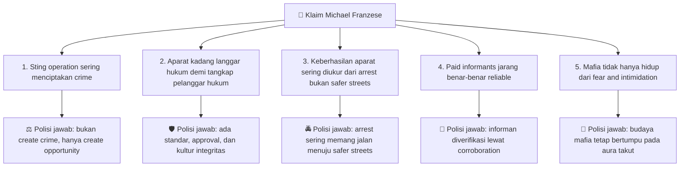
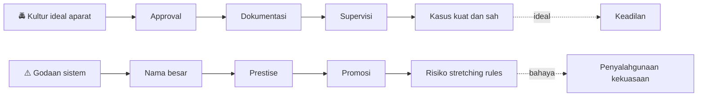
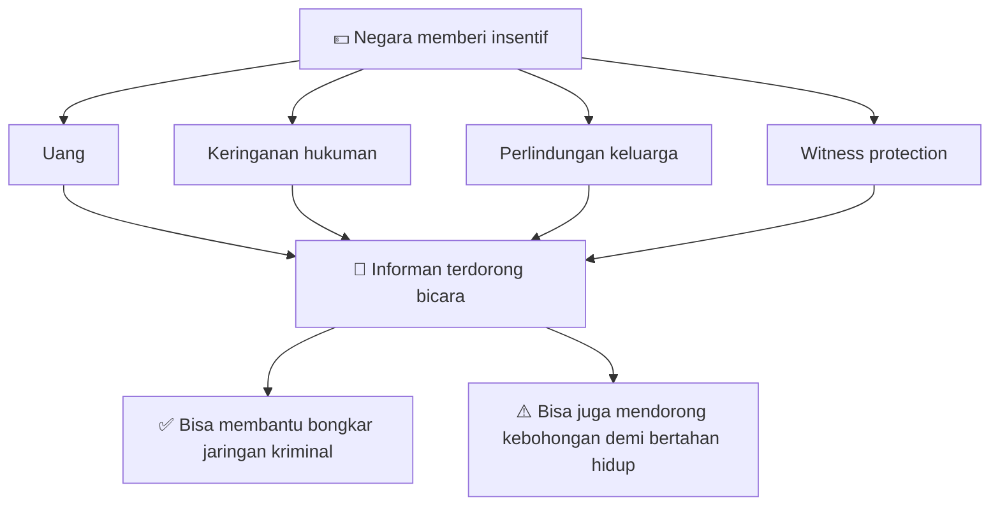
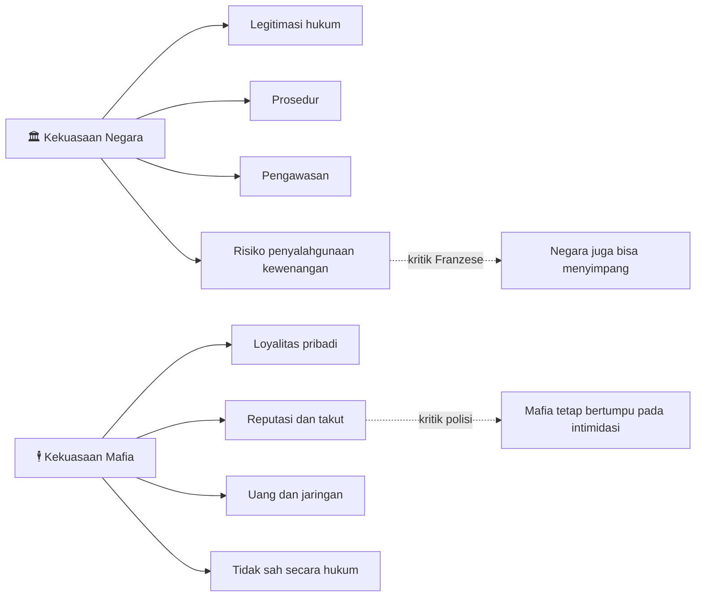

## 🎭 Pengantar: Ketika Mantan Bos Mafia Dikelilingi 20 Polisi, yang Bertabrakan Bukan Sekadar Argumen — Tapi Dua Dunia Moral

Ada banyak debat yang panas, ada banyak debat yang lucu, dan ada debat yang memperlihatkan sesuatu yang lebih dalam: **dua cara memandang dunia yang hampir mustahil dipertemukan**. Itulah yang terjadi ketika **Michael Franzese** — mantan *capo regime* *(kepala kru / kapten operasional)* dari keluarga mafia Colombo di New York — duduk berhadapan dengan **20 polisi** dalam format *Surrounded*. 🚔🕴️

Secara permukaan, topiknya tampak sederhana: apakah operasi penyamaran *(undercover sting operations)* sering menciptakan kejahatan? Apakah aparat kadang melanggar hukum demi menangkap pelanggar hukum? Apakah informan bayaran bisa dipercaya? Apakah budaya mafia bertumpu pada rasa takut dan intimidasi?

Tetapi kalau dibedah lebih dalam, yang bertabrakan di sini bukan cuma opini. Yang bertabrakan adalah:

- **logika aparat**, yang percaya bahwa kejahatan harus ditembus dari dalam, dibuktikan, didokumentasikan, dan diproses;
- **logika mantan kriminal**, yang percaya bahwa negara sering memakai alat-alat kotor sambil mengaku bersih;
- dan **logika publik**, yang sering kali berada di tengah: ingin keamanan, tetapi juga takut pada penyalahgunaan kekuasaan. ⚖️

Michael Franzese menarik justru karena ia bukan tokoh fiksi. Ia pernah menjadi bagian dari sistem kriminal nyata, pernah hidup dalam dunia mafia yang sangat tertutup, pernah merasakan operasi pemerintah dari sisi target, dan kini berbicara dari posisi “orang dalam yang sudah keluar”. Itu membuat semua argumennya punya bobot pengalaman. Tetapi pada saat yang sama, itulah juga yang membuat semua argumennya harus dibaca **dengan hati-hati**, karena pengalaman personal tidak selalu identik dengan kebenaran universal. 🧠

Artikel ini akan membedah percakapan itu secara **detail dan mendalam**: bukan hanya siapa yang “menang”, tetapi **apa inti benturan gagasannya**, **di mana Franzese kuat**, **di mana polisi lebih solid**, dan **apa pelajaran moral serta sosiologisnya** bagi kita. 

---

## 🧾 Siapa Michael Franzese, dan Mengapa Pendapatnya Menarik?

Michael Franzese memperkenalkan dirinya sebagai mantan **capo regime keluarga Colombo**, salah satu dari **lima keluarga mafia New York**. Dalam struktur mafia Italia-Amerika, *capo regime* adalah semacam manajer lapangan tingkat tinggi — bukan bos tertinggi, tetapi juga bukan prajurit biasa. Ia mengatur kru, bisnis, aliran uang, loyalitas, dan negosiasi kekuasaan. 💼

Artinya, Franzese tidak datang ke forum ini sebagai pengamat luar. Ia datang sebagai seseorang yang pernah berada cukup tinggi dalam struktur kriminal terorganisasi. Ia tahu bagaimana **informan bekerja**, bagaimana **pengawasan dilakukan**, bagaimana **FBI dan jaksa membangun kasus**, dan bagaimana **budaya takut** diproduksi di dalam organisasi kriminal.

Namun, di sinilah letak ironi pentingnya: seseorang yang pernah berada di dalam sistem kriminal bisa memberi kesaksian berharga, tetapi juga bisa membawa **bias pembelaan diri**, **romantisasi masa lalu**, atau **keinginan menulis ulang sejarah dirinya**. Jadi kita harus membaca Franzese dengan dua kacamata sekaligus:

1. **ia tahu banyak hal yang orang biasa tidak tahu**, dan
2. **ia punya kepentingan naratif untuk menampilkan dirinya secara tertentu**. 👀

<Callout type="info" title="Mengapa Tokoh Seperti Franzese Selalu Menarik?">
Karena ia hidup di wilayah abu-abu. Ia tidak lagi murni “orang mafia”, tapi juga jelas bukan aparat. Ia bicara sebagai mantan pelaku yang sudah mengambil jarak. Itu membuat ucapannya terdengar lebih jujur dari propaganda biasa, tetapi tidak otomatis bebas dari pembingkaian diri. 📌
</Callout>

---

## 🧠 Peta Besar Debat: Ada 5 Klaim Utama yang Dipertarungkan

Franzese dalam sesi ini melempar beberapa klaim utama, dan hampir semuanya menyentuh jantung persoalan hukum modern. Lima garis besar yang paling penting adalah:

1. **Operasi sting dan undercover sering “membuat” kejahatan**.
2. **Aparat kadang merasa sah melanggar hukum demi menangkap penjahat**.
3. **Sebagian aparat mengukur keberhasilan lewat jumlah penangkapan, bukan keamanan jalanan**.
4. **Informan bayaran sering tidak reliabel**.
5. **Budaya mafia memang punya unsur rasa takut, tetapi tidak sesederhana klaim bahwa kesuksesan mafia hanya berdiri di atas intimidasi**.

Dari sini terlihat bahwa inti debat bukan hanya soal “siapa yang benar”, tetapi tentang **bagaimana sebuah sistem memahami niat, bukti, dan kekuasaan**. 

---

## 🎣 Bagian 1: Apakah Operasi Undercover “Menciptakan” Kejahatan?

Ini adalah tema pertama sekaligus salah satu yang paling filosofis. Franzese bersikeras bahwa banyak operasi undercover *(penyamaran)* dan penggunaan *confidential informants* *(informan rahasia)* pada praktiknya **memanufaktur kejahatan**. Maksudnya: sebuah tindak pidana tertentu tidak akan pernah terjadi **kalau aparat tidak mengirim orang untuk memancing, menawarkan, atau membentuk situasi kejahatan itu lebih dulu**. 🪤

### Logika Franzese
Logikanya sebenarnya sangat konsisten dari sudut pandangnya:
- kalau negara mengirim informan masuk,
- informan itu membawa peluang atau skenario kriminal,
- target lalu terlibat,
- maka negara telah ikut “membuat panggung” kejahatan itu.

Bagi Franzese, masalahnya bukan hanya apakah target punya pilihan berkata tidak. Masalahnya adalah: **tidak akan ada hal yang harus ditolak kalau negara tidak lebih dulu membawanya ke meja**.

Ini terlihat jelas ketika ia memberi contoh orang miskin yang tak pernah berbuat kriminal, lalu ada seseorang datang menawarkan perampokan toko perhiasan dengan iming-iming uang untuk memberi makan keluarga. Menurut Franzese, kalau skenario itu dibuat oleh aparat lewat informan, maka negara telah menciptakan kondisi kriminal yang sebelumnya tidak ada. 💣

### Jawaban polisi
Polisi menjawab dengan kerangka hukum klasik: itu bukan *manufacturing crime* *(memproduksi kejahatan)*, melainkan **memberi kesempatan**. Jika seseorang memang tidak berniat, maka ia bisa menolak. Kalau ia menerima, berarti ada *predisposition* *(kecenderungan sebelumnya untuk berbuat kriminal)*. Dalam logika ini, negara tidak menciptakan niat, hanya menguji atau menyingkapnya.

### Siapa yang lebih kuat di sini?
Secara hukum formal, posisi polisi lebih kuat, karena sistem pidana modern memang membedakan antara:
- **entrapment** *(penjebakan yang tak sah)*, dan
- **providing opportunity** *(memberi kesempatan yang bisa ditolak)*.

Tetapi secara moral, Franzese mengangkat pertanyaan yang tidak bisa dibuang begitu saja: **sampai titik mana negara boleh membentuk situasi buatan untuk melihat siapa yang akan jatuh?** 🤔

Itu pertanyaan penting. Karena negara memang tidak boleh sekadar berburu dosa potensial. Kalau aparat terlalu jauh menciptakan godaan, maka hukum bisa bergeser dari **menangkap kejahatan yang ada** menjadi **memproduksi kejahatan yang ingin ditangkap**.

<Callout type="warning" title="Titik Kritis antara Opportunity dan Entrapment">
Secara teoritis, perbedaannya terlihat rapi. Tetapi dalam praktik, garis itu bisa sangat kabur. Apalagi jika informan adalah kriminal lain yang punya kepentingan menyelamatkan diri, dibayar, atau dijanjikan keringanan hukuman. Di titik itu, “kesempatan” bisa sangat mudah berubah menjadi “rekayasa”. ⚠️
</Callout>

---

## ⚖️ Bagian 2: Franzese Sebenarnya Tidak Menolak Sting Secara Total

Hal menarik dari Franzese adalah ia tidak menolak seluruh operasi penyamaran. Ia justru mengakui bahwa **undercover sting operations are necessary** *(operasi sting memang kadang perlu)* untuk menangkap orang yang memang dicurigai kriminal. Jadi posisinya bukan “anti penyamaran” secara absolut. 

Yang ia tolak adalah **penyamaran yang diarahkan untuk memancing tindak pidana baru agar aparat punya perkara yang bisa dibawa ke pengadilan**. Ini perbedaan penting. Karena itu berarti Franzese bukan sedang bicara seperti orang yang ingin semua kriminal bebas, melainkan seperti orang yang ingin berkata: *“kalau mau tangkap saya, tangkap saya atas apa yang benar-benar saya lakukan, bukan atas skenario yang kalian letakkan di depan saya.”* 🎯

Itu sebabnya argumennya terasa cukup kuat secara moral, meski sering kalah secara teknis di forum debat. Ia sedang membela prinsip: **negara harus menangkap kejahatan nyata, bukan mengarang panggung demi prestasi penindakan**.

---

## 🧑‍⚖️ Bagian 3: Apakah Aparat Kadang Melanggar Hukum demi Menangkap Pelanggar Hukum?

Ini bagian kedua yang sangat panas. Franzese menuduh bahwa aparat, terutama pada level tinggi atau kasus besar, kadang percaya bahwa **tujuan mulia menangkap penjahat membenarkan cara yang kotor**. Ia menyebut hal-hal seperti:

- menyembunyikan *exculpatory evidence* *(bukti yang meringankan terdakwa)*,
- mendorong kesaksian palsu,
- memaksa orang jadi informan,
- atau meregangkan etika penyidikan demi mendapat “nama besar”.

Polisi yang hadir sebagian mengakui sesuatu yang penting: **ya, pelanggaran oleh aparat bisa terjadi**, tetapi itu bukan budaya mayoritas. Mereka menekankan bahwa kebanyakan aparat justru bekerja dalam sistem approval, dokumentasi, supervisi, dan risiko besar bila melanggar prosedur. 📚

### Di mana Franzese kuat?
Franzese kuat ketika ia bicara tentang **insentif kelembagaan**. Ia berkata bahwa dalam kasus-kasus besar — mafia, nama besar, tokoh terkenal — selalu ada godaan tambahan: promosi, reputasi, “feather in the cap” *(prestise / bulu kehormatan di topi)*. Ini bukan tuduhan bodoh. Dalam organisasi manusia mana pun, insentif karier memang bisa mengubah perilaku. 📈

### Di mana polisi lebih kuat?
Mereka lebih kuat ketika menolak generalisasi. Franzese kadang bicara seolah masalah itu cukup luas dan cukup biasa, sedangkan lawan-lawannya menegaskan bahwa organisasi seperti FBI atau kepolisian lokal punya kultur prosedural yang justru membuat pelanggaran seperti itu mahal dan berbahaya.

### Inti sebenarnya
Sebenarnya dua pihak ini tidak sepenuhnya bertentangan. Mereka hanya berbeda pada pertanyaan kuantitas:
- Franzese: “ini terjadi cukup sering dan cukup serius untuk menjadi masalah mendasar.”
- Polisi: “ini bisa terjadi, tetapi tidak mewakili kultur umum.”

Di titik ini, Franzese memberi kita pelajaran penting: bahkan sistem yang dibangun untuk keadilan tetap terdiri dari **manusia**, dan manusia selalu bisa tergoda oleh kepentingan diri, kebencian, ambisi, atau kebanggaan profesional. 😐

---

## 📈 Bagian 4: Apakah Polisi Mengukur Keberhasilan dari Arrest, Bukan Safer Streets?

Klaim ketiga Franzese menyentuh jantung birokrasi penegakan hukum modern: apakah aparat mengejar **angka penangkapan** ketimbang **keamanan nyata di masyarakat**? 

Sejumlah polisi di forum membalas dengan jujur dan emosional. Ada yang berkata pekerjaan mereka bukan soal kuota kosong, melainkan soal mencegah sopir mabuk membunuh orang, menghentikan ancaman di jalan, dan pulang hidup-hidup ke rumah. Ada juga yang mengakui bahwa secara internal, jumlah penangkapan memang bisa dibaca sebagai cermin etos kerja. 🚨

### Titik kuat Franzese
Ia membedakan antara:
- **kejahatan yang sedang terjadi langsung di hadapan polisi**, seperti DWI/DUI *(mengemudi dalam keadaan mabuk)*,
- dan **penargetan jangka panjang terhadap tokoh tertentu**, seperti bos mafia atau target federal besar.

Menurutnya, dalam dunia yang kedua, fokus kadang bergeser dari “membuat jalanan lebih aman” menjadi “menjatuhkan tokoh penting”. Di sini penangkapan bisa jadi lebih bernilai simbolik, politis, dan karier daripada nilai keamanan langsungnya.

### Ini argumen yang cerdas
Karena benar: tidak semua penangkapan punya relasi langsung dan lurus dengan keamanan publik. Ada penangkapan yang sangat penting secara preventif, ada yang penting secara simbolik, ada yang penting secara hukum, tetapi **tidak semua otomatis membuat jalanan terasa lebih aman besok pagi**. 🛣️

Franzese bahkan menyindir bahwa lingkungan mafia mereka dulu relatif “aman” dari kejahatan jalanan liar — tentu ini harus dibaca sangat hati-hati, karena “aman” versi organisasi kriminal sering berarti **aman di bawah monopoli kekerasan mereka**, bukan aman dalam arti hukum dan keadilan publik. 

<Callout type="danger" title="Jalanan Aman di Bawah Mafia Bukan Berarti Jalanan Adil">
Ini poin yang sangat penting. Ketika Franzese berkata lingkungan mereka aman, itu tidak otomatis berarti masyarakat hidup dalam keadilan. Sering kali “aman” dalam rezim mafia berarti **ketertiban dipelihara oleh ancaman dan monopoli kekuatan informal**. Jadi aman bagi sebagian orang bisa berarti takut bagi sebagian lain. 🩸
</Callout>

---

## 💵 Bagian 5: Paid Informants — Mengapa Franzese Sangat Tidak Percaya pada Informan Bayaran?

Ini mungkin salah satu bagian paling kuat dari Franzese: ketidakpercayaannya pada **paid informants** *(informan berbayar)*. Ia berkata dengan sangat tegas bahwa dalam pengalamannya, orang-orang seperti itu **berbohong hampir setiap kali bersaksi**. Mengapa? Karena mereka punya insentif yang sangat jelas:

- uang,
- keringanan hukuman,
- perlindungan,
- program saksi,
- keselamatan keluarga,
- dan kebebasan dari hukuman yang lebih berat.

Dari sudut pandang Franzese, semua ini menciptakan **mesin kebohongan yang sangat rasional**. Jika seseorang sedang terancam hukuman berat, lalu negara berkata “bantu kami, kami bayar, kami lindungi, kami kurangi penderitaanmu”, maka negara secara praktis sedang **membeli cerita**. 💰

### Polisi menjawab bagaimana?
Mereka menjawab dengan prosedur: informan tidak berdiri sendiri. Harus ada **corroboration** *(penguat / pembuktian tambahan)*. Informasi mereka diverifikasi dengan bukti lain: rekaman, observasi, dokumen, penyadapan, atau saksi tambahan. Jadi meski informan mungkin punya motif kotor, sistem pembuktian seharusnya menyaring kebohongan itu.

### Tetapi Franzese punya poin penting
Prosedur ideal tidak otomatis berarti praktik ideal. Sejarah sistem peradilan memang penuh contoh di mana kesaksian informan yang bermotif sangat besar akhirnya menjerumuskan orang. Dan bahkan ketika ada corroboration, kadang corroboration itu hanya menguatkan sebagian kecil fakta sambil membiarkan narasi besar yang bohong tetap berdiri. 🧩

Di sinilah Franzese paling efektif: ia tidak bilang “informan tidak pernah benar”. Ia bilang **insentif yang diberikan kepada mereka terlalu besar untuk tidak mencemari kebenaran**.

Bagi saya, ini salah satu tema terpenting dari seluruh sesi: **apakah negara boleh membeli kebenaran dari orang yang justru paling terlatih untuk berbohong?** 😶

---

## 🕵️ Bagian 6: Polisi Benar soal Satu Hal — Dunia Organised Crime Hampir Mustahil Ditembus Tanpa Informan

Meski Franzese banyak menyerang informan, polisi juga benar dalam satu hal penting: **organised crime** *(kejahatan terorganisasi)* hampir mustahil dibongkar tanpa orang dalam. 

Struktur seperti mafia bukan geng jalanan biasa. Ia punya:
- hierarki,
- kode loyalitas,
- pembagian tugas,
- aura takut,
- dan isolasi sosial dari dunia luar.

Tanpa informan atau penyusup, negara sering hanya melihat permukaan. Mereka mungkin curiga, mungkin punya rumor, mungkin tahu siapa bosnya, tetapi tidak punya bukti yang cukup untuk dibawa ke pengadilan. Maka informan adalah jembatan yang kotor tetapi sering dianggap perlu. 🪜

Jadi persoalannya bukan “pakai informan atau tidak”, melainkan:
- **seberapa besar insentif boleh diberikan**,
- **seberapa ketat verifikasi dilakukan**,
- dan **seberapa jujur pengadilan menilai motif kesaksiannya**.

Ini penting, karena kalau kita menolak informan sama sekali, banyak jaringan kriminal besar akan nyaris kebal. Tetapi kalau kita terlalu percaya pada informan, kita membuka pintu untuk manipulasi. Dengan kata lain: **tanpa informan, negara buta; dengan informan, negara bisa dibohongi**. Dan sistem hukum harus hidup di antara dua bahaya itu. ⚖️

---

## 😨 Bagian 7: Apakah Budaya Mafia Bertumpu pada Takut dan Intimidasi?

Klaim terakhir yang sangat menarik adalah tentang budaya mafia itu sendiri. Seorang polisi perempuan mengajukan argumen bahwa kekuasaan dalam mafia mendapatkan legitimasi terutama melalui **fear and intimidation** *(rasa takut dan intimidasi)*. Franzese menolak penyederhanaan itu. Menurutnya, orang-orang mafia tidak sukses hanya karena menakut-nakuti, tetapi juga karena **otak, strategi, pemahaman hidup, negosiasi, dan kemampuan memanfaatkan struktur**. 🧠

Dan di sini, jujur saja, **dua-duanya benar** — tapi hanya sebagian.

### Yang benar dari polisi
Mafia memang sangat bergantung pada **aura ancaman**. Tidak semua ancaman harus diucapkan terang-terangan. Sering kali cukup dengan reputasi, sejarah, dan pengetahuan kolektif bahwa melanggar batas bisa berakibat fatal. Itu artinya rasa takut memang bagian inheren dari budaya tersebut.

### Yang benar dari Franzese
Namun rasa takut saja tidak cukup membangun organisasi yang bertahan puluhan tahun. Banyak orang menakutkan di dunia kriminal berakhir mati cepat, dikhianati, atau dihancurkan. Organisasi sebesar mafia butuh lebih dari kekerasan. Ia butuh:
- pengelolaan relasi,
- distribusi uang,
- struktur loyalitas,
- kecerdasan bisnis,
- kemampuan membaca manusia,
- dan aturan main internal yang cukup stabil. 🧩

Franzese memberi contoh bahwa orang yang terlalu brutal kadang justru tidak naik jauh, karena menimbulkan kekacauan. Ini observasi yang penting. Sistem kriminal yang bertahan lama biasanya bukan sistem kekerasan acak, tetapi **kekerasan yang diinstitusionalisasi**. Ngeri, tapi itu bedanya. 😬

<Callout type="quote" title="Poin Paling Menarik dari Franzese tentang Fear">
Franzese mengatakan bahwa rasa takut bisa menjaga orang tetap patuh untuk sementara, tetapi ketika sumber takut yang lebih besar muncul — misalnya negara lewat RICO Act *(undang-undang anti racketeering / pemerasan terorganisasi)* — maka loyalitas bisa runtuh. Itu insight yang sangat tajam. Takut memang efektif, tetapi tidak selalu stabil. 🧊
</Callout>

---

## 🧬 Bagian 8: Debat Ini Sebenarnya tentang Hakikat Kekuasaan

Kalau kita mundur selangkah, sesi ini bukan cuma tentang mafia vs polisi. Ia sebenarnya tentang **dua bentuk kekuasaan**.

### Kekuasaan mafia
- informal,
- personal,
- berbasis loyalitas,
- kadang berbasis rasa takut,
- tidak sah secara hukum,
- tetapi bisa sangat efektif secara sosial di lingkungan tertentu.

### Kekuasaan negara / polisi
- formal,
- berbasis hukum,
- punya legitimasi konstitusional,
- tetapi juga bisa menyalahgunakan alat,
- dan sering tersembunyi di balik bahasa prosedur dan keamanan publik.

Franzese menyerang negara dengan mengatakan: *“jangan pura-pura suci; kalian juga bisa kotor.”* 

Polisi menyerang balik dengan mengatakan: *“kami mungkin tidak sempurna, tapi kami bekerja dalam sistem akuntabilitas yang tidak dimiliki mafia.”*

Keduanya sedang berbicara tentang pertanyaan klasik: **apa bedanya kekuasaan yang sah dengan kekuasaan yang efektif?**

---

## 🔍 Bagian 9: Di Mana Franzese Kuat, dan Di Mana Ia Lemah?

### Franzese kuat ketika:
1. mengangkat masalah **insentif** dalam sistem hukum,
2. mempertanyakan moralitas **sting operation** yang terlalu jauh,
3. menyorot bahaya **informan bayaran**,
4. dan mengingatkan bahwa negara pun dijalankan oleh manusia yang bisa ambisius, manipulatif, atau licik. 

### Franzese lemah ketika:
1. terlalu sering **menggeneralisasi pengalaman pribadinya** menjadi gambaran umum semua aparat,
2. menyisipkan opini politik kontemporer yang justru mengaburkan inti argumen,
3. dan kadang berpindah dari kritik prosedural menjadi serangan personal atau ideologis.

Ia paling meyakinkan ketika bicara dari **pengalaman struktural**: bagaimana sistem bisa menggoda kebohongan. Tetapi ia kurang meyakinkan ketika bicara seolah tahu kultur semua level kepolisian hanya dari konflik mafia-federal. 📉

---

## 👮 Bagian 10: Di Mana Polisi Kuat, dan Di Mana Polisi Terlihat Defensif?

### Polisi kuat ketika:
1. menjelaskan bahwa penyelidikan punya banyak lapisan **approval, supervisory review, dan documentation** *(persetujuan, supervisi, dan dokumentasi)*,
2. menegaskan bahwa operasi informan idealnya butuh **corroboration**,
3. dan membedakan antara penyidikan jalanan, federal, dan organised crime dengan lebih konkret.

### Polisi tampak defensif ketika:
1. terlalu cepat menjawab dengan “ini tidak mewakili mayoritas” tanpa cukup mengakui bahwa masalah struktural bisa tetap nyata walau tidak mayoritas,
2. beberapa kali terdengar seperti membela institusi lebih dari mengevaluasi kritik,
3. dan ada momen ketika pengalaman negatif Franzese dijawab lebih sebagai anomali daripada sebagai bahan refleksi serius.

Padahal justru titik terbaik polisi adalah ketika mereka mengakui: **ya, penyimpangan bisa terjadi, dan sistem harus dibuat untuk menekannya**. Itu jawaban yang paling dewasa, dan paling kuat. ✅

---

## 🇮🇩 Bagian 11: Apa Relevansinya bagi Kita di Indonesia?

Walau konteksnya Amerika, topik ini sangat relevan bagi Indonesia. Kenapa? Karena kita juga hidup di negara yang terus bergulat dengan pertanyaan serupa:

- bolehkah aparat memakai cara abu-abu demi mengejar kejahatan besar?
- sejauh mana informan, justice collaborator *(pelaku yang bekerja sama dengan aparat)*, atau saksi yang diberi insentif dapat dipercaya?
- apakah sistem kita menghargai kualitas penegakan hukum atau hanya angka penindakan?
- apakah publik menginginkan keamanan, atau keadilan prosedural, atau keduanya? 🇮🇩

Di Indonesia, diskusi tentang *restorative justice* *(keadilan restoratif)*, tebang pilih hukum, kriminalisasi, dan polisi vs publik juga sering muncul. Maka debat seperti ini penting karena mengajarkan satu hal: **negara memang perlu alat untuk melawan kejahatan, tetapi alat itu sendiri harus terus diawasi agar tidak berubah menjadi kejahatan yang dilegalkan.**

---

## 📊 Tabel Ringkasan Argumen

| Isu | Posisi Michael Franzese | Posisi Polisi | Analisis Singkat |
| :--- | :--- | :--- | :--- |
| **Undercover sting** | Sering memanufaktur kejahatan | Hanya memberi kesempatan, bukan menciptakan niat | Secara hukum polisi lebih kuat, secara moral Franzese menyentuh titik rawan |
| **Aparat melanggar hukum** | Kadang iya, terutama demi target besar | Bisa terjadi, tapi bukan kultur umum | Kebenaran ada di tengah: penyimpangan nyata, tetapi tidak otomatis universal |
| **Arrest vs safer streets** | Penangkapan sering jadi tujuan birokratis | Penangkapan adalah salah satu jalan utama ke keamanan | Bergantung jenis kejahatan dan level institusi |
| **Paid informants** | Sangat rawan bohong karena insentif | Diverifikasi lewat bukti tambahan | Informan perlu, tapi sangat berbahaya bila tak dikontrol |
| **Budaya mafia** | Tidak cuma berdiri di atas takut | Takut tetap elemen sentral dalam legitimasi mafia | Keduanya benar sebagian |

---

## 📚 Glosarium Istilah Penting

- **Capo Regime:** Kapten atau kepala kru operasional dalam struktur mafia.
- **Confidential Informant (CI):** Informan rahasia yang memberi informasi ke aparat, sering kali berasal dari dunia kriminal itu sendiri.
- **Corroboration:** Penguatan atau pembuktian tambahan agar kesaksian tidak berdiri sendiri.
- **Entrapment:** Penjebakan yang tidak sah, ketika aparat mendorong orang yang tidak punya kecenderungan kriminal untuk melakukan kejahatan.
- **FBI:** *Federal Bureau of Investigation*, lembaga investigasi federal di Amerika Serikat.
- **Organized Crime:** Kejahatan terorganisasi dengan struktur, jaringan, dan operasi berkelanjutan.
- **Paid Informant:** Informan yang menerima uang, perlindungan, atau insentif lain dari negara.
- **Predisposition:** Kecenderungan awal seseorang untuk melakukan kejahatan, konsep penting dalam debat tentang entrapment.
- **RICO Act:** Undang-undang federal AS untuk menjerat pemerasan dan kejahatan terorganisasi secara lebih luas.
- **Safer Streets:** Jalanan yang lebih aman; istilah yang merujuk pada dampak nyata penegakan hukum terhadap publik.
- **Sting Operation:** Operasi jebakan/umpan oleh aparat untuk menangkap target dalam konteks tindak pidana tertentu.
- **Witness Protection:** Program perlindungan saksi agar informan atau saksi penting bisa dipindahkan dan dilindungi dari balas dendam.

---

## 🧩 Kesimpulan: Debat Ini Tidak Membuktikan Mafia Lebih Benar, Tapi Membuktikan Negara Tidak Boleh Terlalu Percaya Diri

Setelah dibedah dengan tenang, saya kira kesimpulan paling jujur adalah ini: **Michael Franzese tidak berhasil membuktikan bahwa aparat secara umum korup, licik, atau rutin memproduksi kejahatan. Tetapi ia berhasil mengingatkan kita bahwa alat-alat penegakan hukum yang paling efektif juga bisa menjadi alat yang paling berbahaya bila tidak diawasi.** 🎯

Dan polisi, di sisi lain, berhasil menunjukkan bahwa penegakan hukum bukan pekerjaan ngawur tanpa prosedur. Ada struktur, ada kultur, ada risiko pribadi, ada kerja keras, ada dokumentasi, dan ada kesadaran bahwa kasus yang dibangun dengan cara kotor bisa hancur di pengadilan.

Tetapi justru karena polisi punya kekuasaan besar, kritik seperti yang diajukan Franzese tidak boleh dipandang sekadar sebagai ocehan mantan kriminal. Ia harus dibaca sebagai pengingat klasik dalam negara hukum:

> **bahwa kekuasaan yang diberikan untuk melawan kejahatan selalu berisiko menyerap sebagian logika kejahatan itu sendiri, bila tidak dibatasi dengan integritas, pengawasan, dan kerendahan hati.**

Soal mafia sendiri, Franzese juga memberi satu pelajaran penting: organisasi kriminal tidak bertahan lama hanya dengan kekerasan mentah. Mereka bertahan karena campuran uang, struktur, reputasi, loyalitas, kecerdasan, dan tentu saja — pada level tertentu — aura takut. Jadi romantisasi mafia sebagai sekadar “pria-pria cerdas” jelas menyesatkan, tetapi penyederhanaan mafia sebagai “hanya rasa takut” juga terlalu dangkal. 🕳️

Akhirnya, debat ini membawa kita ke satu pertanyaan paling dalam:

**kalau negara ingin lebih bermoral daripada kriminal yang dikejarnya, apakah ia selalu siap menang dengan cara yang lebih bersih — bahkan ketika cara kotor terasa jauh lebih efektif?**

Itu pertanyaan yang tidak hanya relevan untuk Amerika. Itu pertanyaan untuk semua negara yang mengaku menjunjung hukum. Termasuk kita. 🇮🇩

---

<Callout type="cite" title="Referensi Sumber">
- Video sumber: *1 Ex-Mafia Boss vs 20 Cops (ft. Michael Franzese) Surrounded*
- Sumber transkrip: <https://www.youtube.com/watch?v=EEd5cvHnhPQ>
- Tokoh utama: Michael Franzese, mantan capo regime keluarga Colombo
- Tema utama: undercover sting, entrapment, informan bayaran, FBI, promosi aparat, budaya mafia, fear and intimidation
</Callout>
