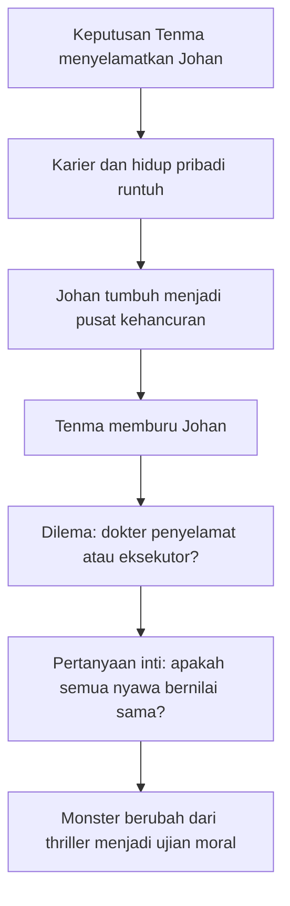
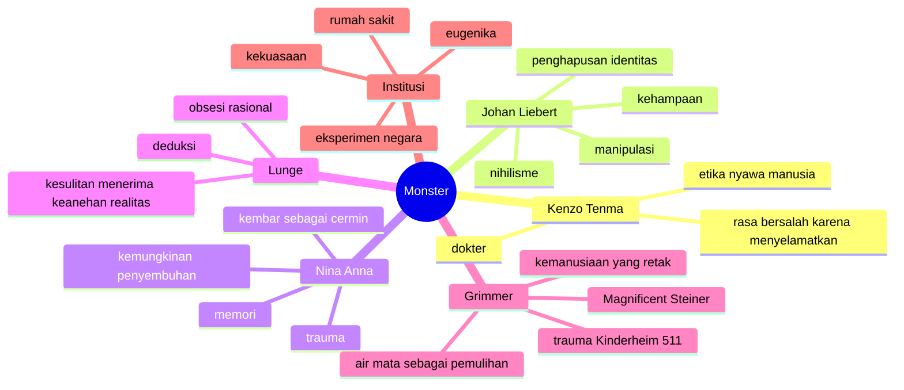
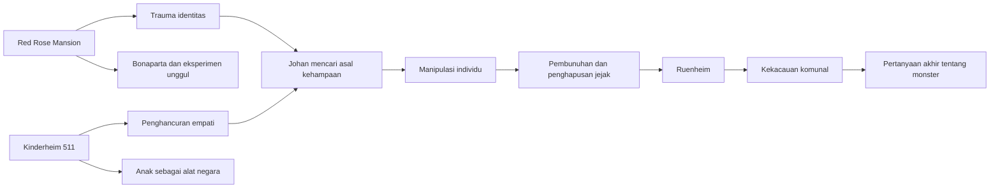

## 🕯️ Pendahuluan: *Monster* Bukan Sekadar Thriller, tetapi Ujian atas Nurani Manusia

Ada karya fiksi yang memukau karena plot-nya rapi. Ada yang kuat karena karakternya hidup. Ada yang bertahan lama karena atmosfernya khas. Tetapi ada juga karya yang lebih berbahaya daripada semua itu: karya yang **memaksa kita menatap pertanyaan moral yang selama ini ingin kita hindari**. *Monster* karya **Naoki Urasawa** termasuk jenis yang terakhir. 🕯️

Sekilas, premisnya sederhana dan sangat sinematik. Seorang dokter jenius bernama **Dr. Kenzo Tenma** suatu hari mengambil keputusan moral yang tampaknya benar: ia menyelamatkan seorang anak laki-laki yang tertembak di kepala alih-alih memprioritaskan seorang pejabat kota yang secara politis lebih “berguna” bagi rumah sakit. Dari sudut pandang etika medis, keputusan itu seolah sempurna. Seorang dokter seharusnya menyelamatkan pasien berdasarkan kebutuhan medis, bukan status sosial. Tetapi anak yang ia selamatkan itu kemudian tumbuh menjadi **Johan Liebert**, salah satu antagonis paling menyeramkan dalam seluruh fiksi modern.

Dari titik itulah *Monster* berubah dari drama medis menjadi thriller psikologis, lalu berkembang lagi menjadi sesuatu yang jauh lebih gelap dan jauh lebih besar. Ini bukan lagi cerita tentang mengejar penjahat. Ini adalah cerita tentang:

- apa arti sebuah nyawa manusia,
- apakah belas kasih bisa menjadi pintu masuk bencana,
- apakah kejahatan itu lahir atau dibentuk,
- bagaimana trauma dan ideologi bisa merusak identitas,
- dan apakah manusia masih dapat diselamatkan setelah memasuki jurang moral yang sangat dalam.

Banyak orang menyebut *Monster* sebagai salah satu **psychological thriller** *(thriller psikologis)* terbaik dalam anime, manga, bahkan dalam fiksi modern secara umum. Saya kira itu bukan pujian kosong. Sebab *Monster* memiliki kualitas yang jarang muncul bersamaan dalam satu karya:

- ia sangat tegang sebagai cerita kriminal,
- sangat kaya sebagai drama karakter,
- sangat kompleks sebagai bacaan politik dan sejarah,
- dan sangat menghantui sebagai refleksi filosofis tentang kejahatan.

Yang membuatnya begitu kuat adalah kenyataan bahwa **“monster” dalam cerita ini tidak pernah benar-benar hanya satu orang**. Memang, Johan Liebert adalah pusat gravitasi kegelapannya. Tetapi semakin jauh cerita berjalan, semakin jelas bahwa monster dalam *Monster* bukan cuma Johan. Monster juga bisa berarti:

- sistem yang memperlakukan anak sebagai bahan eksperimen,
- ideologi yang memecah manusia menjadi yang layak hidup dan yang boleh dibuang,
- rasa dingin moral yang lahir dari institusi,
- trauma yang diwariskan,
- dan bahkan kehampaan dalam diri manusia yang kehilangan nama, makna, atau ikatan dengan sesama.

Di sisi lain, *Monster* juga memberi kita figur tandingan yang sama pentingnya: **Kenzo Tenma**. Jika Johan adalah pusaran kehancuran, Tenma adalah manusia yang mencoba bertahan pada prinsip paling sederhana namun paling sulit dijaga:

> **bahwa semua nyawa manusia bernilai sama.**

Kalimat itu terdengar indah dan sederhana. Tetapi *Monster* menunjukkan betapa sulitnya mempertahankannya ketika dunia memaksa kita melihat pengecualian. Bagaimana jika nyawa yang kita selamatkan justru menjadi sumber malapetaka bagi ratusan nyawa lain? Apakah prinsip itu masih bisa dipertahankan? Ataukah pada titik tertentu manusia harus mengakui bahwa ada hidup yang terlalu berbahaya untuk dibiarkan?

Di sinilah *Monster* menjadi karya yang sangat dewasa. Ia tidak memberi jawaban cepat. Ia tidak memberi kenyamanan murah. Ia tidak memanjakan kita dengan pembagian moral yang terlalu rapi. Justru sebaliknya, ia membuat kita tinggal lama di wilayah abu-abu, di tempat di mana:

- dokter dapat merasa seperti pembunuh,
- korban dapat menjadi ancaman,
- pemburu dapat menjadi buruan,
- dan belas kasih dapat terasa seperti kesalahan yang tak termaafkan.

Esai ini akan membahas *Monster* secara sangat mendalam dan lengkap. Bukan sebagai rangkuman episode demi episode semata, tetapi sebagai pembacaan besar atas struktur moral, psikologi, sejarah, dan simbolisme ceritanya. Kita akan melihat:

- siapa Kenzo Tenma sebenarnya,
- mengapa Johan Liebert begitu mengerikan,
- apa peran Nina dalam inti tragedi ini,
- mengapa Lunge dan Grimmer adalah dua karakter penopang yang luar biasa penting,
- apa arti Kinderheim 511 dan Red Rose Mansion,
- bagaimana masa lalu Eropa, pasca-Nazi, perang dingin, dan eksperimen ideologis membentuk dunia cerita,
- dan mengapa *Monster* tidak sekadar bercerita tentang pembunuh berantai, melainkan tentang peradaban yang gagal menjaga manusia tetap manusia.

Kalau harus dirumuskan dalam satu tesis utama, maka tesis artikel ini adalah:

> **Monster adalah thriller psikologis yang menggunakan kisah Kenzo Tenma dan Johan Liebert untuk menguji gagasan paling mendasar dalam etika manusia—bahwa semua nyawa bernilai sama—lalu menunjukkan betapa rapuh, betapa sulit, namun betapa pentingnya mempertahankan keyakinan itu di tengah dunia yang dipenuhi trauma, kekuasaan, manipulasi, dan kehampaan.**

Dan itulah sebabnya *Monster* terasa lebih dari sekadar tontonan. Ia seperti mimpi buruk moral yang dipaksa menjadi narasi. Kita tidak hanya menonton pembunuhan. Kita menonton **bagaimana manusia, institusi, dan sejarah dapat melahirkan kehampaan yang begitu besar sampai ia tampak mengambil bentuk manusia.**

---

<Callout type="important" title="Tesis utama artikel ini">
*Monster* bukan hanya kisah kejar-kejaran antara dokter dan pembunuh, melainkan meditasi besar tentang nilai nyawa manusia, trauma, identitas, kehampaan, dan bagaimana kejahatan bisa lahir bukan dari satu orang saja, melainkan dari sejarah, institusi, dan eksperimen ideologis yang merusak jiwa.
</Callout>

---

## 🏥 1. Kenzo Tenma: Dokter yang Memulai Segalanya dengan Melakukan Hal yang Benar

Salah satu kekuatan terbesar *Monster* adalah bahwa ia dimulai bukan dari kesalahan jelas, tetapi dari **keputusan etis yang justru terasa benar**. 🏥

**Dr. Kenzo Tenma** adalah seorang ahli bedah saraf jenius asal Jepang yang bekerja di Jerman Barat pada 1980-an. Di permukaan, ia adalah figur ideal: brilian, disiplin, rendah hati, sangat kompeten, dan punya masa depan cerah. Ia bahkan sudah berada di orbit kekuasaan rumah sakit elite, bertunangan dengan **Eva Heinemann**, putri direktur rumah sakit. Secara sosial dan profesional, Tenma berada di jalur naik.

Namun Urasawa sejak awal memperlihatkan bahwa sistem tempat Tenma bekerja sudah busuk secara moral. Rumah sakit bukan semata tempat menyelamatkan nyawa; ia juga ruang hierarki, politik, reputasi, media, dan kapital. Nilai hidup manusia secara diam-diam diurutkan berdasarkan:

- status,
- pengaruh,
- potensi keuntungan,
- dan nilai publik.

Inilah luka awal dalam cerita. Sebelum monster “lahir” di depan mata kita, *Monster* sudah menunjukkan monster yang lebih banal dan lebih akrab: **institusi yang memutuskan nyawa mana yang lebih layak diprioritaskan**.

Tenma mengalami ini secara langsung ketika sebelumnya ia diperintahkan memprioritaskan pasien yang lebih penting secara politis, sehingga pasien lain yang seharusnya bisa ditolong meninggal. Rasa bersalah itu menancap dalam. Maka ketika kemudian dua pasien datang bersamaan—seorang wali kota dan seorang anak laki-laki bernama Johan Liebert—Tenma akhirnya memilih mengikuti nurani dan sumpah dokternya. Ia menolak logika status. Ia memilih pasien yang secara medis lebih dulu menjadi tanggung jawabnya.

Secara moral, ini adalah momen penegasan identitas. Tenma sedang berkata kepada dunia:

> **Saya dokter, bukan birokrat kematian.**

Tetapi justru karena ia melakukan hal yang benar, hidupnya runtuh. Kariernya dihancurkan. Relasinya dengan Eva pecah. Atasannya yang korup kemudian tewas, dan secara ironis jalur karier Tenma justru terbuka. Dari sinilah ironi *Monster* bekerja dengan kejam: **kebenaran moral tidak otomatis membawa hasil baik**. Kadang justru sebaliknya. Kadang keputusan paling benar membuka pintu bagi bencana yang bahkan tak bisa dibayangkan.

Tenma karena itu menarik bukan karena ia pahlawan sempurna, tetapi karena ia adalah **orang baik yang harus hidup bersama konsekuensi paling menakutkan dari kebaikannya sendiri**.

---

## 👁️ 2. Johan Liebert: Mengapa Ia Salah Satu Antagonis Terseram dalam Fiksi?

Kalau Tenma adalah pusat nurani cerita, maka **Johan Liebert** adalah pusat kengeriannya. Tetapi yang membuat Johan begitu menakutkan bukan sekadar jumlah korban atau kekejamannya. Yang membuatnya luar biasa seram adalah bahwa ia tampak hampir **tanpa gesekan**. 👁️

Johan bukan monster dalam arti tubuhnya aneh, ekspresinya liar, atau tindakannya selalu meledak-ledak. Sebaliknya, ia:
- tampan,
- tenang,
- halus,
- nyaris sopan,
- sangat peka membaca orang,
- dan berbicara dengan kelembutan yang justru membuatnya lebih mengancam.

Ia tidak perlu selalu membunuh dengan tangannya sendiri. Bahkan sering kali ia tidak melakukannya. Kekuatan utamanya adalah **manipulasi psikologis**. Johan melihat:
- luka batin orang,
- rasa malu mereka,
- rasa bersalah mereka,
- rasa haus mereka akan pengakuan,
- rasa kosong mereka,
- dan ketakutan terdalam mereka.

Lalu ia mendorong sedikit saja.

Banyak pembunuh dalam fiksi terasa berbahaya karena mereka brutal. Johan terasa lebih ngeri karena ia memperlihatkan sesuatu yang lebih dalam: bahwa **cukup dengan kata-kata yang tepat, seseorang bisa mendorong manusia lain ke tepi kehancuran**. Ia seperti tahu di mana letak retakan setiap jiwa, lalu menekan retakan itu sampai rumah batin orang tersebut runtuh.

Johan juga menyeramkan karena ia tidak tampak sekadar membunuh demi kesenangan sadistik sederhana. Ada sesuatu yang lebih metafisik dan lebih kosong dalam dirinya. Ia berkali-kali bergerak seolah ingin:
- menghapus jejak,
- menghapus masa lalu,
- menghapus nama,
- menghapus identitas,
- bahkan menghapus keberadaan itu sendiri.

Impian mengerikan yang beberapa kali dikaitkan dengannya adalah menjadi **“the last person alive at the end of the world”** *(orang terakhir yang hidup di ujung dunia)*. Ini bukan sekadar ambisi kriminal. Ini adalah visi nihilistik yang sangat total: dunia sebagai ruang yang akhirnya harus dikosongkan.

Karena itu Johan tidak hanya mewakili kejahatan aktif. Ia mewakili **nihilisme** *(pandangan bahwa tidak ada makna, nilai, atau dasar moral yang sungguh mengikat)* yang telah mengambil bentuk manusia.

---

## ⚖️ 3. Pertanyaan Inti: Apakah Semua Nyawa Benar-Benar Bernilai Sama?

Semua lapisan cerita *Monster* pada akhirnya berputar pada satu pertanyaan yang diajukan sejak awal: **apakah semua nyawa manusia benar-benar bernilai sama?** ⚖️

Ini pertanyaan yang sangat sederhana di permukaan. Kita semua ingin menjawab “ya.” Tenma menjawab “ya.” Sumpah medis, etika kemanusiaan, dan intuisi moral modern pun ingin menjawab “ya.”

Tetapi *Monster* tidak membiarkan jawaban itu tinggal sebagai slogan indah. Ia mengujinya secara kejam.

Karena begitu Tenma menyelamatkan Johan, pertanyaan itu berubah bentuk:

- apakah semua nyawa tetap sama berharganya ketika satu nyawa menjadi ancaman bagi banyak nyawa lain?
- apakah prinsip kesetaraan moral bisa dipertahankan ketika hasilnya tampak membawa kehancuran massal?
- apakah menyelamatkan satu anak yang ternyata tumbuh menjadi pembunuh berarti ikut bertanggung jawab atas semua korban berikutnya?

Inilah beban psikologis terbesar Tenma. Ia tidak dihantui oleh kegagalan menyelamatkan hidup, tetapi justru oleh keberhasilan menyelamatkan hidup. Ini luar biasa gelap dan sangat cerdas secara moral. Banyak cerita membuat pahlawan bersalah karena gagal. *Monster* membuat pahlawannya tersiksa karena **berhasil melakukan kewajibannya**.

Tenma kemudian hidup dengan dilema yang hampir mustahil:

- sebagai dokter, ia percaya setiap nyawa layak diselamatkan,
- tetapi sebagai manusia yang melihat dampak dari keberadaan Johan, ia mulai bertanya apakah justru ia harus menjadi orang yang mengakhiri hidup Johan.

Artinya, Tenma harus mempertanyakan fondasi etikanya sendiri. Ia bukan sekadar memburu penjahat. Ia sedang berhadapan dengan pertanyaan yang menghancurkan identitasnya:

> **bisakah saya tetap percaya semua nyawa sama berharganya, jika saya tahu satu nyawa tertentu menghancurkan begitu banyak nyawa lain?**

Tidak berlebihan kalau saya bilang inilah inti filosofis *Monster*. Semua subplot, karakter, dan misteri pada akhirnya berputar mengelilingi konflik ini.

---

---

## 🧬 4. Johan Bukan Kejahatan Murni yang Datang dari Kekosongan: Ia Dibentuk oleh Sejarah, Eksperimen, dan Perampasan Identitas

Salah satu hal paling penting untuk dipahami adalah bahwa *Monster* tidak menulis Johan sebagai “iblis turun dari langit” dalam arti malas. Ia memang sering tampak seperti personifikasi kejahatan, tetapi cerita perlahan menunjukkan bahwa ia adalah hasil dari proses sejarah, ideologis, dan psikologis yang sangat kejam. 🧬

Di sinilah muncul dua lokasi penting dalam mitologi cerita:

### Kinderheim 511
Tempat yang secara formal tampak seperti panti asuhan, tetapi secara fungsi adalah laboratorium pembentukan anak-anak menjadi alat kekerasan dan ketaatan.

### Red Rose Mansion
Ruang eksperimen psikologis yang lebih aristokratik, lebih simbolik, dan lebih mengerikan, terkait dengan **Franz Bonaparta** dan proyek pembentukan “anak unggul” lewat eugenika, manipulasi, dan perampasan identitas.

Melalui dua tempat ini, Urasawa menyampaikan sesuatu yang sangat penting: **monster tidak muncul dari ruang hampa; ia dibuat oleh manusia, institusi, dan ideologi**.

Anak-anak di Kinderheim 511 diperlakukan bukan sebagai manusia dengan jiwa, tetapi sebagai bahan mentah untuk dibentuk menjadi “sempurna” menurut logika kekuasaan. Empati dihancurkan. Individualitas dirusak. Kehangatan dihapus. Yang ditanam adalah kekuasaan, dominasi, ketakutan, dan kontrol.

Sementara di Red Rose Mansion, eksperimen bergerak lebih dalam lagi ke wilayah simbolik dan identitas. Di sanalah gagasan tentang penciptaan manusia unggul, penulisan ulang diri, nama, cerita, dan peran orang tua digabungkan menjadi kekerasan psikologis yang mengerikan.

Johan menjadi mengerikan bukan hanya karena ia mengalami trauma, tetapi karena ia mengalami **trauma yang dibungkus proyek ideologis**. Ia tidak sekadar disakiti. Ia dibentuk di bawah asumsi bahwa manusia dapat dirancang seperti produk.

Itulah sebabnya *Monster* juga bisa dibaca sebagai kritik tajam terhadap:
- eugenika,
- logika negara totaliter,
- eksperimen sosial terhadap anak,
- dan mimpi modern tentang menciptakan manusia sempurna dengan membunuh kerentanannya.

Hasil akhirnya justru paradoksal: **semakin keras sistem mencoba menciptakan manusia ideal, semakin dekat ia melahirkan monster.**

---

## 👧👦 5. Nina Fortner / Anna Liebert: Kembar, Cermin, dan Korban yang Memikul Separuh Luka Cerita

Kalau Johan adalah kegelapan yang aktif, maka **Nina Fortner**, yang identitas aslinya adalah **Anna Liebert**, adalah wajah lain dari tragedi yang sama. 👧👦

Nina penting bukan hanya karena ia saudara kembar Johan. Ia penting karena melalui dirinya, *Monster* menunjukkan bahwa:
- trauma tidak bekerja sederhana,
- identitas bisa terpecah,
- ingatan bisa terkubur,
- dan satu peristiwa masa lalu bisa hidup sebagai gema yang baru terdengar bertahun-tahun kemudian.

Pada awalnya Nina hidup relatif normal, jauh dari masa lalu yang sesungguhnya. Tetapi ketenangan itu rapuh. Sedikit demi sedikit ingatan kembali: pembunuhan, pelarian, eksperimen, rumah tiga katak, Red Rose Mansion, dan hubungan mengerikan dengan saudara kembarnya.

Nina adalah karakter yang sangat penting karena ia memperumit pembacaan kita atas Johan. Lewat Nina, kita mengetahui bahwa:
- masa lalu mereka saling bertaut,
- identitas mereka dibingungkan sejak kecil,
- mereka dipaksa berada dalam relasi cermin yang tidak sehat,
- dan sebagian inti tragedi Johan tidak bisa dipahami tanpa melihat apa yang juga terjadi pada Nina.

Ada satu lapisan yang sangat penting di sini: **Johan dan Nina bukan hanya saudara; mereka adalah dua bentuk dari luka yang sama**.

Nina, bagaimanapun, menunjukkan kemungkinan lain. Ia terluka sangat dalam, tetapi tidak menjadi Johan. Ia marah, hancur, dan terguncang, tetapi tetap menyimpan kemungkinan hubungan, empati, dan koreksi moral. Justru karena itu keberadaannya penting: ia membuktikan bahwa trauma besar tidak otomatis menghasilkan kehampaan total seperti Johan.

Namun, Nina juga bukan tokoh “malaikat murni”. Ia juga ingin membunuh Johan. Ia juga berkali-kali berada di ambang keputusan fatal. Dalam hal ini, ia adalah pantulan Tenma dari sisi lain: sama-sama ingin menghentikan Johan, sama-sama terguncang oleh pertanyaan apakah membunuh Johan adalah tindakan penyelamatan atau justru pengulangan horor.

---

## 🕵️ 6. Inspector Lunge: Rasio Dingin, Obsesi, dan Jalan Lambat Menuju Kebenaran

Banyak thriller punya detektif cerdas. Tetapi **Heinrich Lunge** bukan sekadar detektif cerdas. Ia adalah salah satu karakter paling unik dalam *Monster*. 🕵️

Pada awalnya, Lunge tampak hampir seperti antagonis kedua. Ia sangat yakin bahwa Tenma-lah pelaku utama rangkaian pembunuhan. Ia dingin, obsesif, sangat metodis, dan tampak lebih loyal pada pola logikanya sendiri daripada pada manusia di hadapannya. Ia seperti mesin analitik yang berjalan dengan dua kaki.

Tetapi justru di situlah kekuatan penulisannya. Lunge bukan polisi bodoh yang sengaja dibikin lambat demi plot. Ia sangat cerdas. Justru karena sangat cerdas, kesalahannya terasa tragis. Ia terlalu percaya pada model penjelasan yang paling rapi, sehingga kesulitan menerima bahwa ada sesuatu di luar kerangka normalnya—bahwa Johan benar-benar ada dan bekerja dengan cara yang jauh melampaui kriminal biasa.

Lunge penting karena ia mewakili modernitas rasional yang sangat percaya pada:
- fakta,
- pola,
- prosedur,
- dokumentasi,
- dan keteraturan.

Masalahnya, *Monster* beroperasi di wilayah di mana fakta tetap penting, tetapi fakta saja tidak cukup kalau seseorang tidak mau melihat **kekacauan moral dan psikologis yang lebih aneh daripada dugaan normal**.

Perjalanan Lunge karenanya menarik. Ia bergerak pelan sekali, tetapi ketika akhirnya mulai menerima bahwa Johan nyata, bobot perubahan itu sangat besar. Ini bukan sekadar “oh saya salah.” Ini adalah krisis epistemik *(krisis cara mengetahui)*. Ia harus mengakui bahwa realitas lebih ganjil, lebih gelap, dan lebih rumit daripada konstruksi pikirannya.

Dalam banyak adegan, Lunge terasa tidak manusiawi. Namun justru karena itu, ketika retakan muncul pada dirinya, kita melihat bahwa ia pun korban dari obsesinya sendiri. Ia kehilangan banyak aspek hidup personalnya karena pekerjaan dan kesempurnaan deduksi. Ia mengejar monster, tetapi juga menunjukkan bagaimana manusia dapat mengosongkan hidupnya melalui keterikatan total pada satu pola pikir.

---

## 😊 7. Wolfgang Grimmer: Senyum, Kehancuran, dan Salah Satu Karakter Termanusia dalam Cerita

Kalau saya harus memilih satu karakter pendukung paling luar biasa dalam *Monster*, kemungkinan besar saya akan menyebut **Wolfgang Grimmer**. 😊

Grimmer adalah karakter yang pada awalnya tampak eksentrik, agak lucu, ramah, dan bahkan memberi jeda kehangatan dalam dunia cerita yang begitu muram. Tetapi perlahan kita sadar bahwa senyumnya bukan tanda kesederhanaan, melainkan hasil dari sejarah batin yang sangat tragis.

Ia adalah korban Kinderheim 511. Seperti banyak korban sistem totaliter, ia tidak hanya kehilangan rasa aman. Ia kehilangan akses yang utuh pada emosinya sendiri. Ia belajar bertahan dengan cara memisahkan diri dari rasa. Ia hidup, tetapi sebagian dirinya seperti tertunda.

Di sinilah muncul figur **“The Magnificent Steiner”**—semacam alter ego simbolik yang mewakili ledakan kekuatan dan perlindungan ketika keadaan ekstrem memaksanya bergerak. Banyak pembaca atau penonton mengingat Grimmer karena sisi ini, tetapi yang membuatnya begitu hebat justru ketegangan antara:
- kelembutan dan kekerasan,
- keramahan dan trauma,
- senyum dan kehampaan,
- serta kebutuhan untuk menolong orang lain di tengah kesulitan merasakan diri sendiri secara utuh.

Grimmer penting secara tematik karena ia memperlihatkan sisi lain dari trauma institusional. Kalau Johan adalah trauma yang menjadi nihilisme aktif, maka Grimmer adalah trauma yang berjuang menjadi manusia kembali. Ia tidak utuh, tetapi terus berusaha. Ia rusak, tetapi tidak menyerah pada kehancuran. Ia kehilangan banyak hal, tetapi tetap bergerak ke arah perlindungan terhadap sesama.

Salah satu momen paling menggetarkan dalam *Monster* adalah ketika Grimmer akhirnya benar-benar menangis. Bagi karakter lain, menangis mungkin hal biasa. Bagi Grimmer, itu seperti pemulihan ontologis—seolah kemanusiaannya yang lama terkubur akhirnya menembus permukaan.

Kalau Johan membuat kita bertanya “bagaimana monster lahir?”, maka Grimmer membuat kita bertanya sesuatu yang sama pentingnya:

> **setelah dirusak begitu dalam, apakah manusia masih bisa kembali menjadi manusia?**

Dan lewat Grimmer, *Monster* menjawab dengan cara yang sunyi namun kuat: kadang bisa, tetapi harganya sangat mahal.

---

---

## 🏚️ 8. Kinderheim 511 dan Red Rose Mansion: Dua Laboratorium Penghancuran Jiwa

Dua lokasi ini harus dibaca bukan hanya sebagai latar, tetapi sebagai **simbol peradaban yang mencoba merekayasa manusia**. 🏚️

### Kinderheim 511
Tempat ini adalah gambaran ekstrem tentang apa yang terjadi ketika anak-anak dianggap materi politik. Ia adalah panti asuhan dalam nama, tetapi kamp pembentukan brutal dalam kenyataan. Di sana anak-anak dipaksa hidup dalam sistem yang menghancurkan empati, mengobarkan kompetisi, dan menjadikan kekerasan sebagai mekanisme pembentukan diri.

Dari sudut pandang politik, Kinderheim 511 adalah kritik terhadap negara yang percaya bahwa manusia dapat diproduksi seperti senjata. Dari sudut pandang psikologis, ia memperlihatkan betapa mengerikannya kerusakan yang terjadi ketika masa kanak-kanak diputus dari kasih sayang.

### Red Rose Mansion
Kalau Kinderheim 511 adalah kekerasan institusional yang kasar, Red Rose Mansion adalah kekerasan elit yang lebih “halus”, lebih aristokratik, lebih intelektual, tetapi tak kalah jahat. Di sinilah eksperimen mengenai identitas, cerita, superioritas, dan pembentukan manusia unggul dipertemukan dengan dunia sastra anak, simbol, dan penyamaran moral.

Ini sangat mengerikan secara konseptual. Sebab Red Rose Mansion menunjukkan bahwa kekerasan besar tidak selalu tampil dengan wajah kasar. Kadang ia datang lewat:
- buku cerita,
- eksperimen pendidikan,
- wacana ilmiah,
- dan orang-orang yang merasa sedang menciptakan masa depan lebih baik.

Dengan kata lain, *Monster* mengerti betul bahwa kekejaman modern sering datang bukan dari barbarisme tanpa bahasa, tetapi dari **bahasa yang sangat teratur, sangat cerdas, sangat idealistis—namun kehilangan belas kasih**.

---

## 📚 9. Franz Bonaparta: Penulis Dongeng, Insinyur Horor, dan Sumber dari Banyak Luka Cerita

Salah satu aspek paling jenius dari *Monster* adalah bagaimana ia menjadikan **Franz Bonaparta** sebagai figur yang sekaligus intelektual, simbolik, dan mengerikan. 📚

Bonaparta bukan sekadar ilmuwan gila atau pejabat jahat biasa. Ia adalah figur yang memahami kekuatan cerita, nama, simbol, narasi anak, dan imajinasi. Karena itu ia sangat berbeda dari penjahat yang hanya mengandalkan senjata atau kekuasaan langsung.

Bonaparta mengerti bahwa untuk membentuk manusia, tidak cukup mengatur tubuhnya. Kita harus:
- mengatur ceritanya,
- mengatur namanya,
- mengatur apa yang ia dengar sejak kecil,
- dan mengatur bagaimana ia memahami dirinya sendiri.

Inilah mengapa buku seperti **The Nameless Monster** *(Monster Tanpa Nama)* begitu penting. Dalam tangan penulis biasa, itu hanya dongeng. Dalam konteks *Monster*, ia menjadi alat simbolik yang menembus identitas. Buku cerita bukan pelengkap. Ia adalah senjata metafisik.

Bonaparta penting karena ia memperlihatkan bahwa kejahatan paling halus sering memakai bahasa budaya. Ia tidak selalu memaksa dengan cambuk; ia bisa membentuk dengan kisah.

Dan bukankah itu sangat modern? Bahwa manusia dapat dihancurkan bukan hanya melalui kekerasan fisik, tetapi melalui:
- narasi,
- representasi,
- pemrograman simbolik,
- dan penghapusan nama.

Ketika Johan akhirnya menelusuri Bonaparta, yang ia cari bukan sekadar pembalasan pribadi. Ia sedang bergerak ke sumber dari kekacauan ontologisnya sendiri: **siapa yang membuatku seperti ini, siapa yang menulis monster ini ke dalam diriku?**

---

## 🪞 10. Nama, Identitas, dan Kengerian Menjadi “Monster Tanpa Nama”

Salah satu simbol paling kuat dalam seluruh *Monster* adalah soal **nama**. 🪞

Bagi kebanyakan orang, nama adalah hal biasa. Tetapi dalam cerita ini, nama adalah:
- tanda pengakuan,
- penanda individualitas,
- bukti bahwa seseorang dilihat sebagai pribadi,
- dan jangkar identitas.

Ketika seseorang kehilangan nama—atau identitasnya terus-menerus dipertukarkan, dihapus, dan ditulis ulang—ia bukan cuma bingung. Ia bisa kehilangan dasar keberadaannya.

Johan berkali-kali tampil dengan nama berbeda, identitas berbeda, persona berbeda. Tetapi inti horornya bukan bahwa ia pandai menyamar. Inti horornya adalah bahwa **ia sendiri seperti tidak memiliki pusat diri yang stabil**. Ia dapat menjadi siapa saja karena pada level terdalam ia merasa bukan siapa-siapa.

Di sinilah *The Nameless Monster* menjadi begitu relevan. Monster tanpa nama bukan hanya figur dongeng. Ia adalah metafora bagi:
- diri yang kehilangan asal,
- jiwa yang tak lagi tertambat,
- dan manusia yang tidak lagi merasa sungguh dipanggil ke dunia oleh kasih atau pengakuan.

Johan menjadi mengerikan justru karena ia tampak seperti orang yang ingin menghapus semua nama, semua jejak, semua memori, hingga pada akhirnya tidak ada siapa-siapa yang tersisa untuk menyebut siapa pun.

Dari sudut pandang ini, proyek Johan bukan semata pembunuhan. Ia adalah **pengosongan dunia**.

---

## 🧠 11. Monster sebagai Bacaan tentang Trauma Psikologis

Secara psikologis, *Monster* adalah karya yang sangat canggih. Ia tidak menjelaskan trauma secara dangkal seolah semua korban trauma akan menjadi jahat, atau semua luka batin langsung menghasilkan gangguan tertentu dengan pola sederhana. Sebaliknya, ia menunjukkan bahwa trauma bekerja secara beragam. 🧠

Lihat saja perbedaannya:

### Johan
Trauma menjadi kehampaan, manipulasi, disosiasi identitas, dan dorongan menghapus dunia.

### Nina
Trauma menjadi amnesia, kilas balik, rasa takut, amarah, dan perjuangan merebut kembali narasi diri.

### Grimmer
Trauma menjadi keterputusan dari emosi, hidup dalam senyum yang dipelajari, dan ledakan alter ego protektif.

### Lunge
Bukan korban trauma yang sama, tetapi hidupnya menunjukkan bentuk lain dari disosiasi: pengerdilan kehidupan emosional oleh obsesi profesional.

### Eva
Bukan pusat trauma politik cerita, tetapi memperlihatkan kehancuran batin, narsisme, ketergantungan, dan kepahitan yang juga lahir dari relasi yang rusak.

Dengan demikian, *Monster* sangat sadar bahwa trauma tidak punya satu bentuk. Trauma bisa menghasilkan:
- pembekuan,
- agresi,
- penghapusan ingatan,
- kebutuhan kontrol,
- pengalihan diri,
- bahkan pesona sosial yang menutupi kehancuran batin.

Ini membuat dunia *Monster* terasa sangat manusiawi. Tidak semua luka tampak sama, tetapi semuanya meninggalkan retakan yang dapat dibaca.

---

## 🌍 12. Pasca-Hitler, Jerman yang Terbelah, dan Bayangan Politik Abad ke-20

Subjudul dalam transcript yang menyebut *Monster* sebagai perjalanan psikedelik ke masyarakat Jerman pasca-Hitler sebenarnya tidak salah, asalkan kita pahami dengan lebih serius. 🌍

*Monster* sangat penting sebagai cerita yang hidup di bayangan Eropa abad ke-20:
- Nazisme,
- eugenika,
- perang dingin,
- Jerman Timur dan Barat,
- kepolisian rahasia,
- eksperimen negara,
- dan reruntuhan moral dari ideologi total.

Urasawa paham bahwa monster tidak hanya lahir dari individu psikopat. Monster juga lahir dari abad yang pernah berpikir bahwa:
- ras bisa diurutkan,
- anak bisa dibentuk demi negara,
- manusia bisa dijadikan percobaan,
- dan dunia bisa diselamatkan lewat pemurnian.

Johan karena itu bisa dibaca sebagai bayangan dari abad tersebut. Ia bukan Nazi, bukan komunis, bukan satu ideolog tertentu secara sempit. Tetapi ia adalah anak dari dunia yang percaya bahwa manusia boleh diperlakukan sebagai bahan untuk proyek besar.

Karena itulah setting Jerman dan Eropa Tengah begitu penting. Ia bukan dekorasi. Ia adalah tanah sejarah tempat cerita ini tumbuh. *Monster* berkata kepada kita:

> **kejahatan besar modern bukan hanya soal orang jahat, tetapi soal sistem, negara, ilmu, dan budaya yang kehilangan rem etisnya.**

---

## 🔥 13. Mengapa Johan Tidak Cukup Disebut “Psikopat” Saja

Banyak penonton atau pembaca pemula tergoda menyederhanakan Johan sebagai psikopat biasa. Menurut saya itu kurang. 🔥

Benar, Johan memiliki banyak ciri menakutkan:
- ketenangan ekstrem,
- minim empati yang tampak,
- manipulasi tingkat tinggi,
- kemampuan membaca orang,
- kekerasan yang dingin,
- dan relasi instrumental dengan manusia lain.

Tetapi menyebutnya sekadar “psikopat” cenderung mengecilkan skala simbolik dan filosofisnya. Johan juga adalah:
- anak dari eksperimen sejarah,
- personifikasi kehampaan identitas,
- simbol dari dunia yang kehilangan nama,
- dan cermin bagi keinginan peradaban untuk menciptakan manusia unggul.

Selain itu, *Monster* sengaja membuat Johan sulit diselesaikan secara diagnostik sederhana. Ia lebih besar dari label klinis populer. Bukan karena penulis anti-psikologi, tetapi karena ia ingin Johan berfungsi di banyak tingkat sekaligus:
- psikologis,
- historis,
- etis,
- mitologis,
- dan simbolik.

Karena itu Johan terasa seperti manusia nyata **dan** dongeng buruk dalam waktu yang sama. Ia ada, tetapi juga seperti konsep yang berjalan.

---

## 💔 14. Eva Heinemann: Karakter Menyebalkan yang Justru Penting

Banyak orang tidak tahan pada **Eva Heinemann**, dan jujur saja, itu bisa dimengerti. Ia egois, dangkal, manipulatif, impulsif, dan sering sangat merusak. Tetapi justru karena itu, Eva menarik. 💔

Eva penting karena ia memperlihatkan jenis kehancuran yang berbeda dari Johan. Ia bukan monster metafisik. Ia manusia yang rapuh, narsistik, dan terus-menerus bereaksi dari luka harga diri. Ia hidup dari pengakuan, status, dan hasrat untuk tetap diinginkan. Saat semua itu runtuh, ia tidak tahu bagaimana berdiri sendiri.

Dalam cerita sekelas *Monster*, karakter seperti Eva mudah saja dibuang sebagai gangguan melodramatik. Tetapi Urasawa tidak melakukannya. Ia membiarkan Eva menjadi menyebalkan, tragis, dan kadang manusiawi. Ini penting, karena dunia *Monster* bukan dunia suci yang hanya berisi tokoh-tokoh agung. Dunia ini penuh manusia yang kecil, rapuh, egois, dan kadang memuakkan—justru seperti dunia nyata.

Eva juga penting dalam relasinya dengan Tenma. Ia menunjukkan hidup yang **bisa saja dipilih Tenma** kalau ia tunduk sepenuhnya pada ambisi karier dan status. Dalam arti tertentu, Eva adalah bagian dari sistem awal yang Tenma tinggalkan ketika ia memilih menyelamatkan Johan.

---

## 🧭 15. Perjalanan Tenma: Dari Dokter Ideal ke Pemburu, lalu Kembali ke Pertanyaan Dasar tentang Menyelamatkan

Salah satu kehebatan *Monster* adalah bahwa perjalanan Tenma bukan transformasi sederhana dari “orang baik” menjadi “orang keras”. Ia jauh lebih rumit. 🧭

Ya, Tenma belajar:
- melarikan diri,
- menyelidiki,
- memakai senjata,
- mengincar target,
- dan hidup sebagai buronan.

Tetapi lapisan terdalamnya bukan itu. Lapisan terdalamnya adalah pertanyaan apakah ia dapat tetap menjadi dirinya sendiri di tengah perjalanan ini.

Tenma terus-menerus ditarik ke arah menjadi eksekutor. Banyak orang—termasuk logika kita sebagai penonton—akan berkata bahwa membunuh Johan adalah solusi paling masuk akal. Tetapi setiap kali Tenma mendekat ke tindakan itu, ada sesuatu yang tertahan.

Ini bukan semata kelemahan. Ini inti karakternya. Karena jika Tenma membunuh Johan dengan cara yang sepenuhnya menghancurkan etikanya sendiri, apakah ia masih Tenma? Ataukah Johan sudah menang bahkan sebelum mati?

Dengan kata lain, perburuan Tenma terhadap Johan bukan hanya pencarian untuk menghentikan pembunuh. Itu juga upaya untuk mencari bentuk tindakan yang tidak sekaligus menghancurkan jiwanya sendiri.

Maka Tenma tetap menjadi dokter bahkan saat ia buron. Ia terus menolong orang. Ia terus menghentikan pendarahan, mengobati, menyelamatkan, merawat, dan memilih hidup. Inilah mengapa karakternya begitu kuat. Di tengah dunia yang mendorongnya menjadi pembunuh demi alasan baik, ia masih terikat pada inti dirinya sebagai penyelamat.

---

## 🧨 16. Ruenheim: Ketika Monster Tidak Lagi Bersembunyi dalam Individu, tetapi Menyebar ke Komunitas

Arc **Ruhenheim / Ruenheim** adalah salah satu puncak *Monster*, dan bukan tanpa alasan. Di sinilah seluruh tema cerita berkumpul. 🧨

Johan tidak lagi hanya membunuh satu per satu atau menggerakkan orang dalam skala terbatas. Di Ruenheim, ia menciptakan kondisi bagi komunitas untuk runtuh ke dalam paranoia dan kekerasan. Orang-orang saling curiga. Senjata beredar. Ketegangan naik. Tetangga dapat menjadi ancaman.

Ini sangat penting secara tematik. Sebab Urasawa menunjukkan bahwa monster terbesar bukan hanya pembunuh karismatik, tetapi **situasi sosial yang dibuat sedemikian rupa sehingga manusia biasa mulai saling menghancurkan**.

Ruenheim adalah:
- gema dari Kinderheim 511,
- gema dari Red Rose Mansion,
- gema dari eksperimen sosial totaliter,
- dan laboratorium terakhir untuk menunjukkan bagaimana kekacauan bisa diciptakan dari retakan kecil dalam kepercayaan sosial.

Kalau Kinderheim 511 adalah eksperimen pada anak-anak, maka Ruenheim adalah eksperimen pada sebuah kota. Dan seperti biasa, Johan tidak harus memegang semua senjata. Cukup menciptakan kondisi, menabur rasa takut, dan membiarkan manusia saling menyelesaikan kehancuran satu sama lain.

Ini sangat mengerikan karena terasa realistis. Banyak kekerasan besar dalam sejarah memang tidak selalu terjadi karena satu orang membunuh semua korbannya sendiri, tetapi karena satu logika atau satu hasutan berhasil **menghancurkan jaringan kepercayaan** yang membuat masyarakat bisa hidup normal.

---

---

## 🫥 17. “Monster di Dalam Diriku Akan Meledak”: Apa Makna Kalimat-Kalimat Johan yang Paling Terkenal?

Johan sering meninggalkan kesan bukan hanya karena tindakannya, tetapi karena kalimat-kalimatnya. Salah satunya yang paling menghantui adalah gagasan bahwa **monster di dalam dirinya akan meledak**. 🫥

Kalimat seperti ini bisa dibaca dalam beberapa lapis:

### Lapis psikologis
Ada sesuatu dalam dirinya yang tidak stabil, yang tumbuh, yang menumpuk, yang tak dapat lagi ditahan.

### Lapis identitas
“Monster” itu mungkin bukan sekadar hasrat membunuh, tetapi kehampaan, ketiadaan nama, dan kumpulan memori yang bukan sepenuhnya miliknya namun ia ambil sebagai pusat diri.

### Lapis simbolik
Johan seperti wadah yang diisi oleh sejarah buruk, eksperimen manusia unggul, trauma masa kecil, dan narasi monster tanpa nama. Pada titik tertentu wadah itu terasa akan meluap.

### Lapis peradaban
Johan bisa dibaca sebagai produk dari monster yang lebih besar—yaitu sejarah modern yang percaya bahwa manusia dapat direkayasa. Kalau begitu, “monster di dalam diriku” sebenarnya juga berarti **monster di dalam peradaban yang melahirkanku**.

Karena itu kalimat-kalimat Johan terasa seperti kata-kata seseorang **dan** kata-kata zaman yang rusak. Ia pribadi, tetapi juga historis.

---

## 🛏️ 18. Akhir Monster: Mengapa Penutupnya Begitu Tenang, Begitu Mengganggu, dan Begitu Besar

Akhir *Monster* adalah salah satu ending paling banyak dibicarakan karena ia tidak memberi kita kepuasan konvensional. Ia tidak menutup semuanya dengan kunci final yang membuat semua orang nyaman. Justru itulah kekuatannya. 🛏️

Tanpa jatuh pada ringkasan mekanis, inti emosional penutup cerita terletak pada beberapa hal:

### Pertama, Johan akhirnya kembali ke tempat yang paling ironis
Ia kembali ke ranjang rumah sakit, ke situasi yang menggemakan awal cerita. Seakan lingkaran ditutup. Tenma sekali lagi berada dalam posisi dokter yang menyelamatkan hidup Johan.

### Kedua, prinsip Tenma tetap bertahan
Di titik paling akhir sekalipun, Tenma tidak menjadi versi gelap dirinya. Ia tetap menyelamatkan. Ini sangat penting. Bukan karena dunia menjadi adil, tetapi karena cerita ingin menegaskan bahwa **nilai moral suatu tindakan tidak boleh seluruhnya ditentukan oleh hasil yang tak dapat dikontrol**.

### Ketiga, identitas Johan tetap menyisakan kehampaan
Tempat tidur yang kosong pada penutup adalah salah satu gambar paling kuat dalam anime. Apakah ia pergi? Tentu. Tetapi lebih dari itu, tempat kosong itu menjadi simbol bahwa Johan selalu berada di ambang antara:
- ada dan tiada,
- nama dan tanpa nama,
- manusia dan kekosongan.

### Keempat, cerita tidak menghapus misteri
Dan baguslah begitu. Karena *Monster* bukan teka-teki kriminal biasa yang harus ditutup rapat. Ia adalah tragedi moral dan psikologis. Sedikit ruang kosong justru membuatnya lebih setia pada tema utamanya: bahwa ada luka dan kehampaan yang tak pernah bisa sepenuhnya ditangkap oleh penjelasan final.

Ending ini mengganggu karena ia tidak berkata “semuanya selesai.” Ia lebih berkata:

> **yang diselamatkan, yang hilang, yang dipahami, dan yang tak bisa disembuhkan sepenuhnya—semuanya masih ada dalam jejak sunyi itu.**

---

## 🌑 19. Apakah Johan Benar-Benar Jahat Absolut, ataukah Ia Korban yang Menjadi Bencana?

Ini pertanyaan penting, dan *Monster* sengaja tidak menjawabnya secara murahan. 🌑

Kalau kita terlalu cepat berkata Johan hanyalah korban, kita berisiko menghapus tanggung jawab moralnya. Itu jelas salah. Johan melakukan kekejaman yang nyata, berulang, luas, dan sadar.

Tetapi kalau kita terlalu cepat berkata Johan hanyalah iblis mutlak, kita juga kehilangan sesuatu yang penting, yaitu bahwa ia dibentuk oleh dunia yang sangat rusak.

Maka mungkin posisi yang lebih tepat adalah ini:

> **Johan adalah korban yang berubah menjadi bencana, dan kebesaran Monster terletak pada keberaniannya memaksa kita melihat kedua hal itu sekaligus.**

Ia adalah korban eksperimen, perampasan identitas, dan sejarah buruk. Tetapi ia juga pelaku aktif yang memilih berkali-kali untuk memperluas kehancuran. Kedua hal ini tidak saling meniadakan.

Di sinilah *Monster* sangat dewasa. Ia tidak tertarik pada moralitas bayi yang hanya mengenal dua kotak: korban suci atau penjahat mutlak. Ia menunjukkan bahwa manusia bisa lahir dari luka yang dalam dan tetap bertanggung jawab atas keburukan yang ia lakukan.

---

## 📖 20. Mengapa Monster Tetap Relevan Hari Ini?

Meskipun setting-nya sangat terkait Eropa akhir abad ke-20, *Monster* tetap terasa relevan hari ini. 📖

Mengapa?

Karena tema-temanya belum pergi:
- institusi yang memeringkat nilai hidup manusia,
- propaganda dan manipulasi,
- anak-anak yang dirusak sistem,
- trauma kolektif,
- kekuatan cerita untuk membentuk identitas,
- dan kehampaan yang lahir ketika manusia diperlakukan sebagai proyek, bukan pribadi.

Di dunia modern, kita mungkin tidak selalu bicara tentang Kinderheim 511 secara literal. Tetapi kita masih hidup dalam sistem yang sering:
- mengukur manusia dari fungsi dan produktivitas,
- mengorbankan individu demi kepentingan struktur,
- memakai narasi untuk membentuk realitas politik,
- dan membiarkan banyak luka masa kecil berkembang tanpa penyembuhan.

Karena itu *Monster* tidak terasa kuno. Ia justru terasa seperti peringatan yang terus relevan:

> **jika manusia berhenti dilihat sebagai pribadi yang tak tergantikan, maka monster tidak akan berhenti lahir.**

---

## ✨ Kesimpulan: Monster Terbesar dalam Monster Mungkin Bukan Johan, Melainkan Dunia yang Memungkinkan Johan Ada

Pada akhirnya, *Monster* memang memberi kita Johan Liebert—salah satu figur paling mengerikan dalam fiksi. Tetapi kalau kita berhenti pada kekaguman terhadap Johan sebagai penjahat, kita kehilangan inti terdalam cerita. ✨

Sebab monster terbesar dalam *Monster* mungkin bukan Johan sendiri. Monster terbesar itu bisa jadi adalah:
- rumah sakit yang memeringkat nilai nyawa,
- negara yang bereksperimen pada anak,
- ideologi yang memimpikan manusia unggul,
- orang dewasa yang menghapus nama anak,
- sistem yang merusak identitas,
- dan sejarah yang tidak pernah benar-benar sembuh dari kecenderungan memperlakukan manusia sebagai alat.

Johan adalah hasil paling ekstrem dari semua itu. Ia adalah luka sejarah yang menjadi orang. Ia adalah kehampaan yang belajar berbicara dengan suara lembut. Ia adalah eksperimen yang lolos dari laboratorium dan masuk ke dunia manusia biasa.

Dan di hadapannya berdiri Kenzo Tenma—bukan pahlawan super, bukan pembunuh sempurna, bukan nabi moral tanpa cacat, melainkan seorang dokter yang terus berusaha bertahan pada satu keyakinan yang tampak sederhana tetapi ternyata menuntut harga sangat mahal:

> **bahwa nyawa manusia tidak boleh diukur dari status, fungsi, masa depan, atau ketakutan kita terhadapnya.**

Inilah mengapa *Monster* begitu kuat. Ia tidak memberi kita kenyamanan. Ia memberi kita pertanyaan. Ia memaksa kita hidup bersama ketegangan antara:
- belas kasih dan konsekuensi,
- trauma dan tanggung jawab,
- sejarah dan pilihan,
- korban dan pelaku,
- nama dan kehampaan.

Karya ini pada akhirnya bukan hanya bertanya “siapa monster itu?”

Ia bertanya lebih jauh:

- siapa yang menciptakan monster?
- apa yang terjadi ketika peradaban kehilangan belas kasih?
- apakah satu manusia yang memutuskan untuk tetap menyelamatkan orang lain masih punya arti di dunia yang begitu rusak?

Jawaban *Monster* tidak pernah sederhana. Tetapi kalau ada satu hal yang terus ia pertahankan, mungkin itu ini:

**selama masih ada orang seperti Tenma, Grimmer, Nina, atau siapa pun yang memilih menahan dunia agar tidak jatuh sepenuhnya ke kehampaan, maka monster belum benar-benar menang.**

Dan justru karena kemenangan itu tidak megah, tidak heroik, tidak tuntas, melainkan rapuh, nyaris sunyi, dan penuh luka—maka ia terasa sangat manusiawi. Itulah sebabnya *Monster* bukan cuma cerita yang hebat. Ia adalah salah satu karya yang paling serius, paling menyakitkan, dan paling jujur tentang apa artinya tetap berusaha menjadi manusia di dunia yang berkali-kali gagal melakukannya. 🌘

---

<Callout type="quote" title="Kalimat inti artikel ini">
*Monster* menunjukkan bahwa pertanyaan “apakah semua nyawa manusia bernilai sama?” tidak pernah benar-benar sulit sampai suatu hari kita dipaksa menghadapi satu orang yang membuat kita tergoda menjawab “tidak”.
</Callout>

<Callout type="warning" title="Mengapa Monster begitu mengganggu">
Karena ia tidak membiarkan kita puas dengan jawaban moral yang rapi. Ia menunjukkan bahwa kejahatan bisa lahir dari institusi, ideologi, trauma, dan kehampaan — lalu mengambil wajah manusia yang tenang, cantik, dan sangat meyakinkan.
</Callout>

<Callout type="tip" title="Cara terbaik menikmati Monster">
Jangan menontonnya hanya sebagai misteri “siapa membunuh siapa”. Baca ia sebagai drama moral, sejarah trauma Eropa, kritik terhadap eksperimen manusia unggul, dan pertanyaan besar tentang apakah kasih sayang masih mungkin dipertahankan di dunia yang telah berkali-kali menghancurkan manusia.
</Callout>

<Callout type="cite" title="Sumber pengembangan artikel">
Artikel ini dikembangkan dari transcript panjang tentang keseluruhan kisah *Monster* karya Naoki Urasawa, lalu diperluas menjadi esai analitis mengenai struktur naratif, tema moral, trauma, identitas, simbolisme “monster tanpa nama”, serta konteks sejarah-politik yang membentuk dunia ceritanya.
</Callout>
