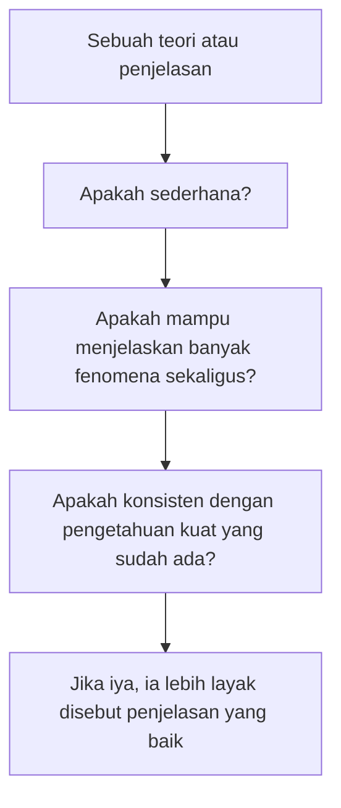
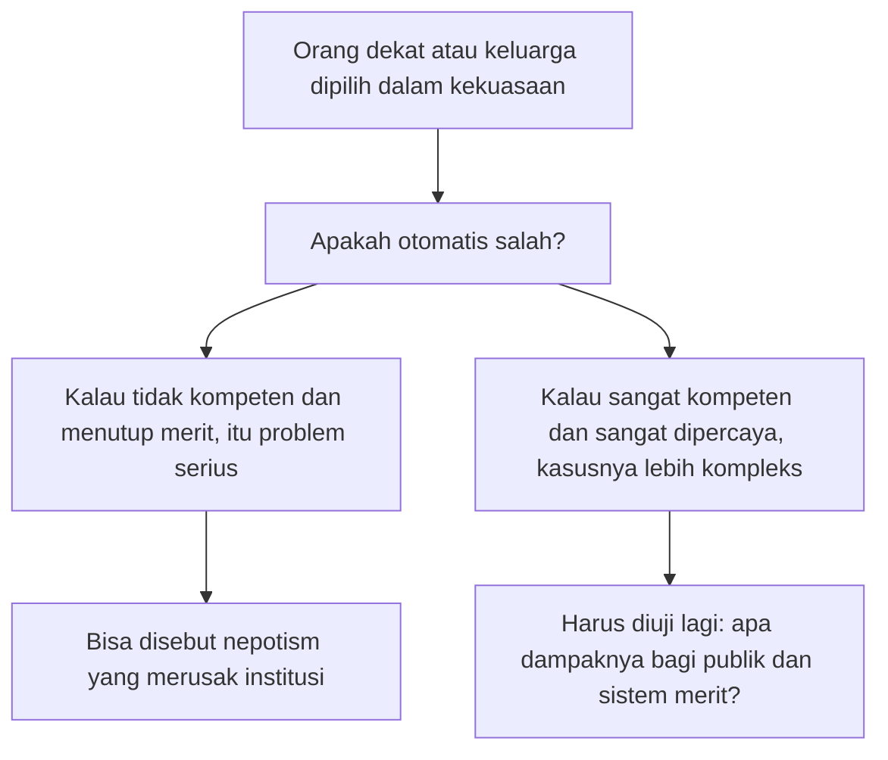
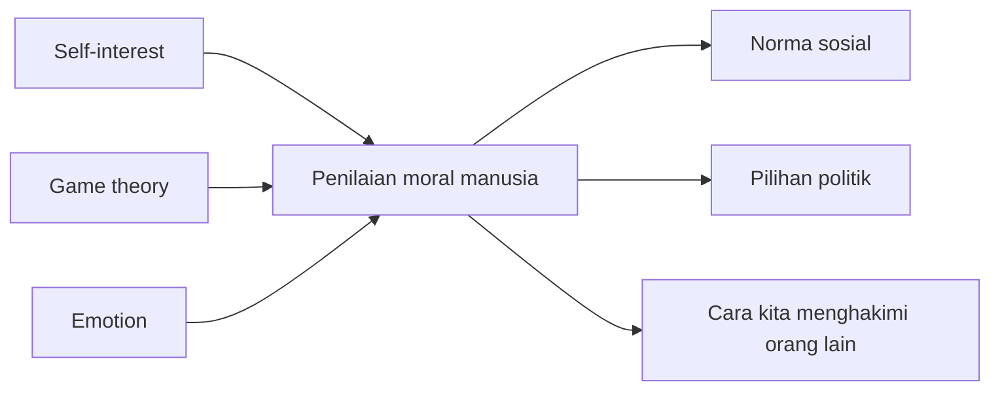

## 🧠 Pengantar: Mengapa Kita Begitu Suka Menghakimi?

Ada satu hal yang hampir selalu dilakukan manusia, sering tanpa sadar, bahkan sebelum sempat berpikir panjang: **kita menilai**. Kita menilai orang lain, menilai tindakan, menilai ucapan, menilai gaya hidup, menilai pilihan politik, menilai cara orang beribadah, bahkan menilai cara orang menilai. 😅

Kita mengatakan ini baik, itu buruk. Ini pantas, itu memalukan. Ini bermoral, itu bejat. Dan sering kali kita mengucapkan semua itu dengan keyakinan penuh, seolah-olah kita sedang menunjuk sesuatu yang objektif seperti matahari di siang bolong. Padahal, pertanyaan paling sulit justru ada di sana: **dari mana sebenarnya datangnya penilaian moral kita?** 

Apakah ia benar-benar objektif? 
Apakah ada **fakta moral** *(moral facts — fakta moral yang berdiri independen dari pikiran manusia)*? 
Ataukah moral sebenarnya lebih mirip hasil campuran antara:
- emosi ❤️,
- kepentingan diri 🧍,
- strategi sosial ♟️,
- kebiasaan budaya 🏛️,
- dan kebutuhan kelompok untuk mengatur perilaku? 👥

Episode *Moral Psychology* ini menarik karena ia tidak mulai dari definisi akademik yang kaku, tetapi dari satu pengamatan yang sangat manusiawi: **moral itu penting karena ia dipakai untuk mengontrol**. Baik oleh agama, negara, partai, komunitas, keluarga, maupun influencer digital masa kini. Siapa yang berhasil mendefinisikan “baik” dan “buruk” akan punya kekuatan luar biasa untuk mengarahkan perilaku orang lain. ⚡

Dan karena itu, membicarakan filsafat moral bukan hobi mewah kaum kampus. Ini soal kehidupan sehari-hari. Soal siapa yang dianggap benar, siapa yang dibuang, siapa yang dipuji, siapa yang dibenci, siapa yang berhak memerintah, dan siapa yang dianggap menyimpang.

Artikel ini akan membedah episode tersebut secara **detail dan mendalam**, mulai dari:
- apa itu filsafat moral,
- mengapa klaim “nilai moral objektif” sangat problematis,
- bagaimana **Nietzsche** mengguncang fondasi moral tradisional,
- mengapa **falsifikasi** penting,
- bagaimana **Richard Posner** memandang filsafat moral modern,
- mengapa **Stephen Asma** mengguncang gagasan fairness dan nepotism,
- hingga mengapa pada akhirnya penilaian moral manusia selalu terkait dengan **emosi, kepentingan, game theory**, dan relasi kuasa. 🧩

---

## ⚖️ Bagian 1: Apa Itu Filsafat Moral, dan Mengapa Ia Tidak Pernah Sekadar Teori?

Secara sederhana, filsafat moral membahas pertanyaan-pertanyaan seperti:
- apa itu baik? 🌿
- apa itu buruk? 🩸
- apakah ada tindakan yang selalu benar atau selalu salah? 📏
- apakah niat lebih penting daripada akibat? 🎯
- apakah kita punya kewajiban terhadap orang lain? 🤝
- dan siapa yang berhak menentukan semua itu? 👑

Tetapi episode ini dengan sangat tepat mengingatkan bahwa moral bukan hanya alat untuk berpikir, melainkan juga alat untuk **mengendalikan**. 

Sejak kecil kita diajarkan macam-macam nilai moral:
- membantu orang tua itu baik,
- berbohong itu buruk,
- setia itu baik,
- durhaka itu buruk,
- menghormati otoritas itu baik,
- pembangkangan itu buruk.

Masalahnya, semua itu sering diajarkan seolah tanpa konteks. Seolah semua orang dari semua budaya, sepanjang sejarah, dalam setiap keadaan, pasti akan setuju dengan rumusan yang sama. Padahal kenyataannya tidak sesederhana itu. 📚

Episode ini benar ketika bilang bahwa moral menjadi penting justru karena ia dipakai untuk:
- membentuk **value system** *(sistem nilai)*,
- memberi pedoman hidup,
- menjadi alat propaganda,
- menjadi alat legitimasi kekuasaan,
- bahkan menjadi alat penghukuman sosial.

Dengan kata lain, moral bukan cuma wilayah para santo atau filsuf. Moral adalah **infrastruktur kekuasaan simbolik**. Siapa pun yang bisa mendefinisikan “yang baik”, akan lebih mudah mendefinisikan siapa yang harus dipatuhi. 🏛️

<Callout type="important" title="Mengapa Moral Selalu Politik?">
Karena moral menentukan siapa yang disebut baik dan siapa yang disebut menyimpang. Dan begitu label itu hidup di masyarakat, ia bisa berubah menjadi kekuatan sosial yang sangat nyata: penghormatan, hukuman, stigma, bahkan kekerasan. ⚠️
</Callout>

---

## 🧱 Bagian 2: Apakah Ada Nilai Moral Objektif?

Inilah jantung utama episode ini. Ada satu kubu besar dalam filsafat moral yang percaya bahwa memang ada sesuatu seperti **nilai moral objektif**. Artinya, suatu tindakan bisa benar atau salah **terlepas dari perasaan kita**, **terlepas dari budaya**, **terlepas dari opini mayoritas**, dan bahkan **terlepas dari sejarah**. 

Misalnya, kalau mereka bilang “berbohong itu salah”, maka itu salah bukan karena masyarakat tidak suka, tetapi karena memang secara objektif salah. Titik. 🚫

Kubu lain — dan episode ini condong ke arah ini — justru sangat skeptis terhadap klaim semacam itu. Mereka bertanya: **buktinya mana?** Bagaimana cara kita tahu bahwa ada fakta moral objektif? Apakah ia bisa ditemukan seperti kita menemukan air, gravitasi, atau fosil dinosaurus? 🦖

Pertanyaan ini sangat penting. Karena begitu seseorang mengklaim bahwa moralnya objektif, ia biasanya juga merasa punya hak lebih besar untuk memaksa orang lain tunduk. Dari sinilah dogmatisme lahir. 

Episode ini dengan sangat bagus menunjukkan bahwa klaim objektivitas moral sering kali justru menutupi kenyataan bahwa yang sedang berbicara sebenarnya adalah:
- selera budaya,
- posisi kuasa,
- warisan tradisi,
- atau preferensi kelompok tertentu.

Dan begitu semua itu dibungkus dengan bahasa “objektif”, maka diskusi selesai sebelum dimulai. Itulah yang berbahaya. 😬

---

## 🔬 Bagian 3: Mengapa Falsifikasi Penting? — Jika Tidak Bisa Diuji, Jangan Cepat-cepat Klaim Itu Pengetahuan

Salah satu bagian paling kuat dari episode ini adalah ketika pembicara menekankan bahwa suatu klaim yang serius **harus bisa difalsifikasi** *(falsifiable — dapat diuji dan mungkin dibuktikan salah)*. Ini adalah prinsip yang sangat penting dalam ilmu pengetahuan, dan sangat berguna juga dalam filsafat yang ingin dekat dengan kenyataan. 🔬

Kalau ada orang berkata:
- “ada nilai moral objektif,”
- “semua orang pada dasarnya tahu mana yang baik,”
- “ini kodrat moral universal,”

maka pertanyaan berikutnya haruslah: **bagaimana kita mengujinya?** 

Kalau tidak bisa diuji, tidak bisa dibantah, dan apa pun hasil dunia selalu bisa dipelintir agar cocok dengan klaim awal, maka kita sebenarnya tidak sedang berhadapan dengan pengetahuan. Kita sedang berhadapan dengan **iman**, atau minimal keyakinan metafisis yang tidak bisa diklaim sebagai pengetahuan publik yang sahih. 🧪

Episode ini sangat tepat ketika membedakan antara:
- **iman** → boleh percaya tanpa pembuktian empiris tertentu,
- **filsafat dan teori** → harus siap ditanya, diuji, diganggu, bahkan digulingkan.

Ini bukan berarti semua filsafat harus berubah menjadi laboratorium. Tetapi ini berarti **kerendahan hati epistemik** harus selalu ada. Kalau sebuah teori moral tidak bisa menjelaskan realitas, tidak bisa menjawab anomali, atau selalu kabur saat diuji, maka kita patut curiga. 🧠

---

## 🪑 Bagian 4: Armchair Philosophy vs Naturalistic Philosophy

Episode ini lalu memperkenalkan satu benturan yang sangat menarik: **armchair philosophy** *(filsafat kursi malas)* vs **naturalistic philosophy** *(filsafat naturalistik)*. 🪑

### Armchair philosophy
Ini adalah gaya berfilsafat yang terlalu percaya bahwa dengan duduk, berpikir, dan merangkai logika di kepala, seseorang bisa sampai ke kebenaran besar tentang dunia. Tentu berpikir itu penting. Tapi problemnya muncul ketika seseorang terlalu percaya bahwa realitas harus tunduk pada konstruksi akalnya, meski fakta-fakta di luar berkata lain.

### Naturalistic philosophy
Pendekatan ini lebih rendah hati. Ia berkata: pikirkan, iya. Gunakan logika, iya. Tetapi **lihat juga kenyataan**, lihat penelitian, lihat psikologi manusia, lihat sains perilaku, lihat bagaimana orang sungguh-sungguh hidup. 🌍

Di sinilah episode ini sangat menarik. Ia tidak anti filsafat. Ia justru ingin menyelamatkan filsafat dari kesombongan yang membuatnya jadi tidak berguna. Filsafat harus tetap berani bertanya besar, tetapi juga cukup rendah hati untuk belajar dari:
- psikologi,
- sosiologi,
- biologi,
- ekonomi,
- sejarah,
- dan pengalaman manusia nyata. 📊

Itulah sebabnya pembicara sangat menyukai pendekatan **Brian Leiter** dan pembacaan naturalistik atas **Nietzsche**. Karena dari sana, moral tidak dibaca sebagai sesuatu yang melayang di langit ide, melainkan sebagai sesuatu yang lahir dari **struktur psikologis, sejarah sosial, dan relasi kuasa**. ⚙️

---

## 🧠 Bagian 5: Nietzsche — Moral Bukan Fakta Langit, Tapi Produk Kehidupan Manusia

Kalau ada satu tokoh yang sangat penting dalam episode ini, itu adalah **Friedrich Nietzsche**. Ia adalah salah satu penghancur terbesar ilusi moral objektif dalam tradisi modern. ⚡

Nietzsche tidak puas dengan jawaban seperti:
- “ini baik karena memang baik,”
- “itu buruk karena memang buruk,”
- “moral ini universal dan abadi.”

Bagi Nietzsche, moral justru harus dibedah seperti arkeolog membongkar bangunan tua: dari mana ia datang? siapa yang diuntungkan? siapa yang dilemahkan? kepentingan apa yang bekerja di baliknya? 🏺

Dengan cara pandang ini, moral tidak lagi terlihat sebagai cahaya murni dari langit, tetapi sebagai sesuatu yang lahir dari:
- perjuangan kekuasaan,
- kondisi psikologis tertentu,
- kebutuhan kelompok,
- rasa takut,
- rasa iri,
- bahkan strategi bertahan hidup.

Episode ini menekankan satu hal penting dari pembacaan naturalistik terhadap Nietzsche: **kalau ada sesuatu yang bisa disebut objektif, mungkin itu bukan moralnya, tetapi self-interest** *(kepentingan diri)*, dorongan mempertahankan hidup, dorongan mengamankan posisi, dan dorongan menata hubungan dengan orang lain. 🔥

Ini bukan berarti semua moral hanyalah egoisme telanjang. Tetapi ini berarti moral harus dibaca dengan curiga: jangan-jangan yang tampak seperti “kebenaran universal” sebenarnya adalah **kepentingan yang berhasil menyamar sebagai kebajikan**. 😶

---

## 🧪 Bagian 6: Inference to the Best Explanation — Bagaimana Menilai Teori yang Masuk Akal?

Episode ini menyebut tiga unsur penting ketika kita mencoba membuat penjelasan terbaik tentang sesuatu. Ini sangat berguna, bukan hanya dalam filsafat moral, tetapi juga dalam berpikir sehari-hari. 

### 1. Simplicity *(kesederhanaan)*
Kalau ada dua penjelasan dan satu lebih sederhana tanpa mengorbankan kekuatan penjelasan, biasanya yang lebih sederhana lebih layak dipilih. Jangan buru-buru lari ke kurcaci Venus kalau listrik mati di rumah. Mungkin PLN dulu yang layak dicurigai. 😄

### 2. Consilience *(keterpaduan pola)*
Penjelasan yang baik mampu menunjukkan bahwa fenomena yang tampaknya berbeda ternyata punya pola, akar, atau struktur yang saling terhubung.

### 3. Conservatism *(kehati-hatian terhadap pengetahuan yang sudah kuat)*
Kalau ada banyak hal yang sudah mapan dan terbukti cukup kuat, kita tidak boleh sembrono merobohkannya tanpa argumen atau bukti yang jauh lebih kuat.

Ini penting sekali. Karena banyak klaim moral besar terdengar megah, tapi ternyata:
- tidak sederhana,
- tidak menjelaskan variasi budaya,
- tidak cocok dengan psikologi manusia nyata,
- dan sering bertabrakan dengan data sosial. 

Kalau begitu, mengapa masih dipertahankan? Nah, di sinilah episode ini tajam sekali: karena moral sering tidak dipertahankan demi kebenaran, tetapi demi **kebutuhan kuasa dan kenyamanan identitas**. 🧱

---

## 🧬 Bagian 7: Apakah Kita Lahir dengan Kecenderungan Moral Tertentu?

Episode ini juga menyinggung gagasan bahwa manusia mungkin lahir dengan **kecenderungan moral tertentu**, atau setidaknya **inclinations** *(kemiringan kecenderungan)* yang tidak sama. Ini dibahas melalui Nietzsche, penelitian anak kembar, dan juga dikaitkan dengan diskusi teologis tentang kecenderungan surga-neraka, atau arah hidup manusia sejak awal. 👶

Poinnya bukan bahwa sejak lahir semua sudah final dan tertutup. Bukan. Yang lebih masuk akal adalah bahwa manusia lahir dengan:
- temperamen berbeda,
- sensitivitas berbeda,
- toleransi risiko berbeda,
- dorongan empati yang tidak sama,
- dan cara menimbang nilai yang bisa berbeda. 

Artinya, ketika dua orang menghadapi dilema yang sama — misalnya berbohong demi menyelamatkan nyawa orang lain — bisa jadi mereka sampai ke kesimpulan yang berbeda bukan karena satu sepenuhnya jahat dan satu sepenuhnya baik, tetapi karena **struktur psikologis dan kecenderungan moral mereka memang tidak identik**. 🧠

Ini sangat menarik karena menghancurkan ilusi bahwa semua manusia akan otomatis sampai pada jawaban moral yang sama jika “berpikir benar.” Nyatanya, bahkan sebelum berargumen, manusia sudah datang dengan **perbedaan kecenderungan**. Dan itu membuat dunia moral jauh lebih plural daripada yang suka diakui para dogmatis. 🌈

---

## 🕊️ Bagian 8: Islam, Taqiyyah, dan Mengapa Pragmatisme Kadang Lebih Jujur daripada Kekakuan Moral

Salah satu bagian episode yang paling menarik adalah ketika pembicara mengaitkan tema ini dengan pengalaman membaca tradisi Islam. Ia menyorot bahwa dalam beberapa situasi, Islam justru tampak sangat **pragmatis**. Misalnya pada konteks **taqiyyah** *(menyembunyikan atau menahan pengungkapan keyakinan demi menghindari bahaya serius)* atau kebolehan mengambil sikap tertentu demi menjaga nyawa. 🕊️

Di sini muncul pelajaran penting: larangan “jangan bohong” terdengar indah jika dibaca secara mutlak. Tetapi bagaimana kalau kejujuran langsung menyebabkan pembunuhan? Bagaimana kalau dengan mengatakan yang sepenuhnya benar, seseorang menyerahkan orang tak bersalah kepada pembunuh? 

Kalau kita tetap memaksa “kejujuran absolut”, maka sebenarnya kita sedang meninggikan satu nilai sambil buta pada nilai lain: **keselamatan jiwa**. 

Dan inilah poin episode ini: konflik moral selalu nyata. Tidak cukup hanya memegang satu slogan. Kita perlu melihat **hierarki nilai**, **situasi konkret**, dan **trade-offs** *(pertukaran antar nilai)* yang tak terhindarkan. ⚖️

Ini juga sebabnya pembicara menyukai pendekatan Islam tertentu: karena ia melihat ada ruang pragmatisme yang justru lebih jujur pada realitas hidup manusia, dibanding moralitas kaku yang terdengar agung tetapi runtuh begitu diuji di dunia nyata. 🌍

---

## 👨‍👩‍👧 Bagian 9: Stephen Asma dan Serangan terhadap Fairness yang Terlalu Liberal-Barat

Masuklah kita ke buku **Stephen Asma**, khususnya gagasannya yang sangat menggelitik: **against fairness** — melawan fairness dalam pengertian tertentu. Bukan berarti ia pro ketidakadilan, tetapi ia sedang menyerang asumsi liberal-Barat bahwa moral tertinggi selalu berbentuk **imparsialitas total**. 👨‍👩‍👧

Asma, yang banyak belajar juga dari filsafat Asia dan hidup dalam konteks lintas budaya, menunjukkan bahwa di banyak masyarakat, nilai tertinggi bukan fairness abstrak, tetapi **filial piety** *(bakti kepada orang tua / keluarga)*, loyalitas, dan kewajiban relasional. 

Contohnya sangat nyata:
- apakah menolong keluarga itu nepotism? 🤔
- apakah memilih orang dekat yang sangat kompeten tetap salah hanya karena ia keluarga?
- apakah semua masyarakat benar-benar memandang keadilan sebagai “tutup mata” yang dingin? 

Bagi banyak masyarakat Asia, membantu keluarga justru bukan cacat moral, tetapi **kebajikan**. Jadi ketika teori moral liberal-Barat datang dan berkata “semua orang harus diperlakukan sama persis, kedekatan jangan dihitung”, banyak budaya akan merasa itu aneh. Karena hidup manusia memang tidak dibangun di atas relasi netral, melainkan di atas **ikatan**, **utang budi**, **kesetiaan**, dan **perawatan timbal balik**. 🏠

<Callout type="warning" title="Bahaya Menyamakan Moral Barat Modern dengan Moral Universal">
Apa yang dianggap adil dalam satu tradisi belum tentu dianggap adil dalam tradisi lain. Kadang yang di satu tempat disebut nepotism, di tempat lain justru dilihat sebagai tanggung jawab relasional yang wajar. Ini tidak otomatis membenarkan korupsi, tetapi memaksa kita lebih hati-hati saat mengklaim universalisme moral. 🌍
</Callout>

---

## 👑 Bagian 10: Nepotism, Politik Dinasti, dan Mengapa Realitas Lebih Rumit daripada Meme Sosial Media

Episode ini lalu masuk ke wilayah yang sangat sensitif: **nepotism**, **politik dinasti**, dan pemilihan orang dekat dalam kekuasaan. Di titik ini diskusinya menjadi sangat tajam, karena ia memotong dua arah sekaligus. 

Di satu sisi, jelas ada bentuk nepotism yang busuk:
- menaruh keluarga tidak kompeten di posisi penting,
- menutup akses orang lain yang lebih layak,
- menjadikan negara seperti perusahaan keluarga. 🩸

Tetapi di sisi lain, episode ini bertanya dengan jujur: bagaimana kalau yang dekat itu memang **paling kompeten**, **paling terpercaya**, dan **secara objektif berkinerja baik**? Apakah hanya karena ia keluarga, maka otomatis salah? 

Contoh Singapura, keluarga Lee, hingga diskusi tentang orang yang dipercaya karena relasi personal semua dipakai untuk menggoyang asumsi gampang netizen. Bukan untuk melegalkan semua dinasti, tetapi untuk memperlihatkan bahwa slogan seperti “politik dinasti pasti buruk” kadang terlalu malas. Karena realitas bertanya lagi: **buruk karena dinastinya, atau buruk karena inkompetensinya?** 🧐

Ini pertanyaan yang sangat tidak nyaman, tetapi justru karena itu penting. Moral yang dewasa harus berani hidup di wilayah abu-abu. Bukan untuk kehilangan arah, tetapi untuk tidak salah membidik sumber masalah. 🎯

Di sini, episode ini benar: yang perlu diuji bukan label kasarnya saja, tetapi **struktur insentif, kompetensi, dampak, dan kepercayaan publik**. 📊

---

## 🧑‍⚖️ Bagian 11: Richard Posner — Moral Philosophers Often Hide Their Preferences Behind Grand Language

Salah satu bagian paling keras dan paling menarik tentu datang dari **Richard Posner**. Ia sangat skeptis terhadap banyak filsafat moral modern. Menurut Posner, banyak akademisi moral pada dasarnya melakukan dua hal:

1. mereka punya preferensi tertentu, dan
2. mereka membungkus preferensi itu dengan bahasa tinggi seolah-olah itu adalah kebenaran moral objektif. 🎭

Posner sangat tidak suka kepura-puraan semacam ini. Ia lebih memilih kejujuran yang dingin: kalau Anda memang ingin mendorong nilai tertentu, katakan saja bahwa Anda sedang berperan sebagai **moral entrepreneur** *(wirausaha moral / pengusung agenda moral)*. Jangan pura-pura sedang menemukan hukum semesta. 

Ini kritik yang luar biasa tajam. Dan semakin lama saya pikirkan, semakin terasa kebenarannya. Di ruang publik, banyak orang bicara seolah mereka hanya membela “kebaikan universal”, padahal yang sebenarnya mereka bela adalah:
- kepentingan moral kelompoknya,
- selera budayanya,
- atau intuisi pribadinya yang dibesarkan jadi doktrin. 📣

Posner tidak berkata bahwa nilai moral tidak penting. Ia berkata: **jujurlah** tentang apa yang sedang Anda lakukan. Jika Anda ingin masyarakat bergerak ke arah tertentu, akui bahwa Anda sedang mengadvokasi sebuah nilai, bukan sedang menunjuk bintang objektif yang semua orang pasti lihat kalau waras. 🌌

---

## 🎲 Bagian 12: Jika Tidak Ada Moral Objektif, Apakah Kita Berakhir dalam Kekacauan?

Ini keberatan paling umum. Orang sering berpikir: kalau kita tidak percaya moral objektif, maka semuanya akan runtuh. Orang akan membunuh, menipu, memperkosa, merampok, lalu bilang “ya itu kan selera saya.” 

Episode ini menolak ketakutan murahan seperti itu. Dan menurut saya tepat. Karena ketiadaan moral objektif **tidak sama** dengan ketiadaan moral sama sekali. 🚫

Kita tetap punya:
- emosi,
- cinta,
- loyalitas,
- kebutuhan akan rasa aman,
- kebutuhan kerja sama,
- rasa jijik,
- rasa takut dihancurkan orang lain,
- rasa ingin dihormati,
- dan perhitungan game theory tentang bagaimana hidup bersama. 

Jadi walaupun moral tidak objektif dalam arti metafisis, manusia tetap akan membangun sistem nilai. Kita tetap akan bilang ada hal yang tidak bisa diterima. Kita tetap akan melarang pembunuhan atau kekerasan, bukan karena langit menulisnya dalam batu, tetapi karena **kehidupan sosial kita runtuh tanpa norma itu**. 🏚️

Dengan kata lain, moral tetap ada. Hanya saja ia lebih jujur dipahami sebagai hasil dari:
- evolusi psikologis,
- kebiasaan sosial,
- kepentingan bersama,
- dan perjuangan kuasa,
ketimbang sebagai cahaya murni dari luar sejarah manusia. 🌱

---

## 🤝 Bagian 13: Self-Interest, Game Theory, dan Emotion — Tiga Mesin Besar Moral Manusia

Episode ini menyederhanakan dengan sangat bagus bahwa ada tiga hal yang sangat kuat membentuk moral praktis manusia:

### 1. Self-interest *(kepentingan diri)*
Kita ingin selamat, ingin hidup baik, ingin tidak dirugikan, ingin orang yang kita cintai aman. Ini dasar sekali. 🧍

### 2. Game theory *(strategi interaksi dengan orang lain)*
Kita hidup bersama orang lain. Maka kita harus menghitung efek tindakan kita dalam hubungan timbal balik: kalau saya curang hari ini, apa efeknya besok? Kalau saya terlalu keras, siapa yang akan membalas? Kalau saya mau kerja sama, nilai apa yang harus saya dukung? ♟️

### 3. Emotion *(emosi)*
Ini mungkin yang paling sering dipura-puraikan tidak ada, padahal justru sangat dominan. Kita menolong orang tua, pasangan, anak, atau sahabat bukan semata karena kewajiban abstrak, tetapi karena **kita peduli**. ❤️

Dan ini sangat penting. Banyak teori moral terlalu malu mengakui emosi. Padahal tanpa emosi, banyak yang disebut “moral” malah tidak punya tenaga hidup. Kita tidak menolong ibu kita karena sedang menjalankan algoritma etis. Kita menolong karena ada cinta, relasi, dan keterikatan. 

Mungkin justru kejujuran moral dimulai ketika kita berhenti pura-pura bahwa kita semata-mata makhluk rasional objektif. Kita ini makhluk relasional yang menilai dunia dengan kepala **dan** dada sekaligus. 🫀

---

## 📉 Bagian 14: Mengapa Orang Sering Tidak Konsisten dalam Moral? Karena Mereka Sedang Membela Pihaknya, Bukan Prinsipnya

Salah satu pengamatan tajam dalam episode ini adalah bahwa orang sering sangat keras pada satu kasus, lalu mendadak lentur pada kasus lain yang serupa ketika pelakunya adalah “orang kita”. Ini terjadi di mana-mana:
- politik dinasti, 🏛️
- keputusan hakim, ⚖️
- favoritisme keluarga, 👨‍👩‍👧
- pembelaan tokoh agama, 🕌
- atau bahkan kasus internasional seperti Trump dan Lincoln dalam menantang keputusan lembaga tinggi. 🇺🇸

Kita sering merasa sedang membela prinsip. Padahal begitu kasusnya dibalik, ternyata kita tidak setia pada prinsip itu. Artinya, yang kita bela mungkin bukan prinsip, tetapi **identitas**, **kelompok**, atau **preferensi emosional kita sendiri**. 😬

Inilah sebabnya episode ini penting. Ia membuat kita sedikit malu — dan itu bagus. Karena rasa malu intelektual adalah awal dari perbaikan. Kalau kita sadar bahwa moral kita sering selektif, kita mungkin mulai lebih hati-hati sebelum memukul meja dan berkata “ini jelas salah!” 🙃

---

## 🏛️ Bagian 15: Antigone — Ketika Moral dan Hukum Bertabrakan, dan Tak Ada Solusi yang Benar-Benar Bersih

Episode ini merekomendasikan **Antigone** karya Sophocles, dan itu rekomendasi yang sangat bagus. Antigone adalah salah satu drama tragedi paling penting untuk memahami benturan antara:
- hukum negara, dan
- kewajiban moral atau religius personal. 🎭

Di sana, Antigone ingin menguburkan saudaranya karena itu adalah kewajiban moral dan religius. Tetapi penguasa, Creon, melarangnya karena saudaranya dianggap pengkhianat negara. Maka muncullah konflik klasik:

- taat pada hukum? ⚖️
- atau taat pada kewajiban moral yang lebih tinggi menurut hati nurani? ❤️

Ini sangat relevan dengan seluruh episode. Karena sekali lagi, ia menunjukkan bahwa nilai-nilai tidak selalu selaras. Kadang **keadilan negara** bertabrakan dengan **loyalitas keluarga**. Kadang **ketertiban politik** bertabrakan dengan **rasa hormat pada orang mati**. Kadang **hukum positif** bertabrakan dengan **moralitas batin**. 

Dan sering kali tidak ada solusi yang sepenuhnya bersih. Yang ada hanyalah pilihan tragis. 🩸

---

## 📚 Tabel Ringkasan Gagasan Utama

| Tema | Gagasan Utama | Implikasi |
| :--- | :--- | :--- |
| **Filsafat moral** | Moral menilai baik-buruk dan membentuk kontrol sosial | Moral selalu punya dimensi kuasa |
| **Nilai moral objektif** | Diklaim ada oleh sebagian filsuf, tetapi sangat sulit dibuktikan | Klaim objektivitas harus dicurigai dan diuji |
| **Falsifikasi** | Teori yang baik harus bisa diuji dan mungkin dibantah | Klaim moral yang kebal bantah rawan jadi dogma |
| **Naturalisme** | Filsafat harus belajar dari realitas dan sains | Moral tidak boleh dipikirkan hanya dari kursi malas |
| **Nietzsche** | Moral harus dibaca sebagai produk psikologi, sejarah, dan kekuasaan | Mengguncang ilusi moral universal |
| **Stephen Asma** | Fairness liberal bukan satu-satunya model moral | Nilai keluarga dan loyalitas juga punya bobot kuat |
| **Posner** | Banyak filsuf moral hanya membungkus preferensinya sebagai universalitas | Lebih jujur mengaku sebagai moral entrepreneur |
| **Emotion** | Moral manusia tak bisa dipisahkan dari emosi | Kepedulian nyata sering lebih penting dari kewajiban abstrak |
| **Inconsistency** | Orang sering tidak konsisten karena membela pihaknya, bukan prinsip | Perlu kerendahan hati moral |
| **Antigone** | Hukum dan moral bisa bentrok tragis | Tidak semua konflik nilai punya resolusi bersih |

---

## 🧾 Glosarium Istilah Penting

- **Armchair philosophy:** Gaya berfilsafat yang terlalu bertumpu pada berpikir abstrak tanpa cukup menguji diri pada realitas.
- **Brian Leiter:** Filsuf hukum dan pemikir yang banyak menulis pembacaan naturalistik atas Nietzsche.
- **Consequentialism / Konsekuensialisme:** Pandangan bahwa benar-salah tindakan ditentukan terutama oleh akibatnya.
- **Falsifiable / Dapat difalsifikasi:** Dapat diuji dan mungkin dibuktikan salah.
- **Filial piety:** Nilai bakti, loyalitas, dan tanggung jawab pada orang tua serta keluarga.
- **Game theory:** Cara melihat perilaku manusia sebagai strategi dalam interaksi dengan pihak lain.
- **Moral entrepreneur:** Pengusung nilai moral tertentu yang secara aktif membangun dukungan sosial terhadap nilai itu.
- **Moral facts / Fakta moral:** Gagasan bahwa ada fakta benar-salah moral yang objektif dan independen dari pikiran manusia.
- **Naturalistic philosophy:** Pendekatan filsafat yang berusaha dekat dengan temuan empiris, sains, dan realitas manusia.
- **Nietzsche:** Filsuf Jerman yang sangat kritis pada moralitas tradisional dan klaim objektivitas moral.
- **Posner, Richard:** Hakim dan sarjana hukum Amerika yang kritis terhadap banyak filsafat moral abstrak.
- **Self-interest:** Kepentingan diri; dorongan mempertahankan hidup, keamanan, dan kesejahteraan diri sendiri atau yang dekat.
- **Stephen Asma:** Filsuf yang banyak menulis tentang emosi, moral, dan benturan antara nilai Barat dan Asia.
- **Taqiyyah:** Praktik menyembunyikan keyakinan atau tidak menampakkan posisi sebenarnya demi menghindari bahaya serius dalam situasi tertentu.

---

## 🌿 Kesimpulan: Mungkin Masalahnya Bukan Kita Kurang Bermoral, Tapi Kita Terlalu Cepat Merasa Sudah Tahu Apa Itu Moral

Kalau saya harus menyimpulkan seluruh episode ini dalam satu kalimat, maka mungkin saya akan bilang begini:

> **masalah terbesar manusia bukan sekadar bahwa kita punya moral, tetapi bahwa kita terlalu cepat menganggap moral kita pasti objektif, pasti konsisten, dan pasti lebih murni daripada orang lain.**

Dan di situlah bahaya dimulai. 🌿

Episode ini penting karena memaksa kita mundur selangkah. Ia tidak menyuruh kita jadi relativis total yang berkata semua sama saja. Ia juga tidak menyuruh kita hidup tanpa nilai. Justru sebaliknya. Ia menyuruh kita lebih jujur:

- bahwa nilai kita terbentuk,
- bahwa emosi kita ikut bermain,
- bahwa budaya kita memengaruhi,
- bahwa sejarah kita membentuk intuisi,
- dan bahwa banyak penilaian moral kita ternyata jauh lebih rapuh daripada yang kita kira. 🪞

Kalau begitu, apa yang harus kita lakukan? 
Bukan berhenti bermoral. Bukan juga berhenti menilai. Tetapi:
- lebih rendah hati dalam menilai,
- lebih teliti membedakan prinsip dan loyalitas kelompok,
- lebih sadar bahwa kita pun bisa salah,
- dan lebih jujur saat mengatakan “saya mendukung ini karena saya percaya ini baik”, daripada pura-pura berkata “ini pasti hukum moral objektif alam semesta.” ✨

Mungkin pada akhirnya kedewasaan moral bukan berarti punya daftar benar-salah yang paling mutlak. Mungkin kedewasaan moral justru berarti **tetap berani memegang nilai, sambil sadar bahwa manusia selalu menilai dari dalam tubuh, sejarah, emosi, relasi, dan keterbatasannya sendiri.**

Dan kalau itu benar, maka menghakimi orang lain seharusnya selalu dilakukan dengan satu rem penting: 

**kesadaran bahwa kita sendiri juga tidak pernah berdiri di luar permainan moral yang sedang kita komentari.** 🕯️

---

<Callout type="cite" title="Referensi Sumber">
- Episode podcast: *Ep. 15 - Moral Psychology | Rethinking Moral Values and Why We Judge*
- Sumber transkrip: [YouTube — Moral Psychology | Rethinking Moral Values and Why We Judge](https://www.youtube.com/watch?v=Ad8IjF0cpbE)
- Tema utama: objektivitas moral, Nietzsche, falsifikasi, Brian Leiter, Richard Posner, Stephen Asma, fairness, nepotism, moral entrepreneur, dan benturan antara hukum, politik, emosi, serta nilai sosial.
</Callout>
