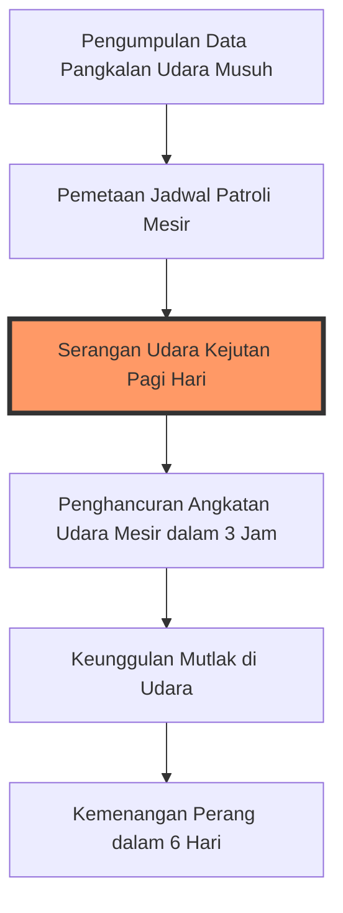
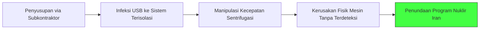

## Pendahuluan: Mitos vs Realita 🕵️‍♂️

**Mossad** (*Ha-Mossad le-Modi'in u-le-Tafkidim Meyuhadim*—Institut Intelijen dan Tugas Khusus) bukan sekadar biro intelijen biasa. Bagi kawan, mereka adalah perisai eksistensial; bagi lawan, mereka adalah hantu yang bisa menyerang kapan saja dan di mana saja. Sejak pembentukannya, Mossad telah membangun citra sebagai layanan yang *omnipotent* (mahakuasa) melalui serangkaian operasi yang mengubah jalannya sejarah dunia.

Namun, di balik kegemilangan operasi pencurian arsip nuklir atau penangkapan penjahat perang, tersimpan pula sejarah gelap tentang *blunder* (kesalahan fatal), dilema moral, dan perang urat syaraf yang tak pernah berhenti. 🌍

---

## 🏗️ Kelahiran di Tengah Api (1948)

Pada Juni 1948, hanya beberapa minggu setelah proklamasi Negara Israel, Perdana Menteri **David Ben Gurion** memanggil para petinggi intelijennya di Tel Aviv. Saat itu, Israel sedang dikepung oleh koalisi negara-negara Arab. Ben Gurion menyadari satu hal: keberhasilan militer mustahil dicapai tanpa intelijen yang superior.

Ia memutuskan untuk mengorganisir ulang biro intelijen menjadi tiga pilar utama:
1.  **Shin Bet**: Intelijen domestik (keamanan dalam negeri).
2.  **Aman**: Intelijen militer.
3.  **Mossad**: Operasi spionase dan pengumpulan informasi di luar perbatasan.

> [!important] Visi Ben Gurion
> "Bangsa Arab mampu kalah berkali-kali dan memulai lagi. Israel tidak boleh kalah sekali pun dalam pertempuran militer."

---

## 🏛️ Operasi-Operasi yang Membentuk Legenda

### 1. Penangkapan Adolf Eichmann (1960) ⚖️
Inilah momen di mana mitos Mossad mulai ditempa. **Adolf Eichmann**, arsitek logistik *Final Solution* (Solusi Akhir) Nazi, ditemukan bersembunyi di Argentina dengan nama samaran **Ricardo Clement**.

Alih-alih langsung membunuhnya (yang sebenarnya jauh lebih mudah), Ben Gurion memerintahkan tim Mossad untuk menangkapnya hidup-hidup.
- **Strategi:** Agen Mossad menggunakan teknik *Jiu-Jitsu* untuk meringkus Eichmann di pinggir jalan.
- **Eksfiltrasi (Exfiltration):** Mengambil keuntungan dari kekacauan perayaan HUT ke-150 Revolusi Argentina, agen menyamar sebagai kru pesawat El Al dan membawa Eichmann keluar dengan pesawat delegasi resmi.
- **Hasil:** Eichmann diadili di Yerusalem dan dieksekusi pada 1962. Ini memberikan panggung bagi para penyintas *Holocaust* untuk berbicara tanpa rasa malu.

### 2. Pencurian MiG-21 (1966) ✈️
Di era 1960-an, jet tempur **MiG-21** buatan Soviet adalah kebanggaan angkatan udara Arab. Bahkan CIA pun gagal mendapatkannya. Mossad berhasil melakukannya melalui operasi yang sangat personal.
- **Metode:** Mendekati seorang pilot Irak beragama Kristen, **Kapten Mounir Redfa**, yang merasa didiskriminasi oleh pemerintahannya.
- **Hasil:** Redfa membelot (*deserted*) dan mendaratkan MiG-21 di Israel. Pesawat ini kemudian dibedah dan dipelajari, menjadi "hadiah strategis" terbesar Israel untuk Amerika Serikat.

---

## 🛡️ Intelijen dan Kemenangan Enam Hari (1967)

Kemenangan kilat Israel dalam **Perang Enam Hari** bukan semata-mata karena keberanian tentara di lapangan, melainkan karena persiapan data yang sangat presisi oleh Mossad.

---

## ⚔️ Perang Bayangan: Operasi Murka Tuhan (1972)

Pasca tragedi penyanderaan atlet Israel di Olimpiade Munich 1972 oleh kelompok **September Hitam** (*Black September*), Perdana Menteri **Golda Meir** memutuskan untuk membalas kekerasan dengan kekerasan. Ia memerintahkan Mossad untuk "memenggal kepala" kepemimpinan PLO (*Palestine Liberation Organization*).

Tiga tujuan utama operasi ini:
1.  **Deterrence (Pencegahan):** Mencegah pihak lawan melakukan aksi teror serupa.
2.  **Retribution (Balas Dendam):** Memberikan pesan bahwa setiap darah Israel akan dibayar dengan nyawa pelaku.
3.  **Psychological Boost:** Memberikan perasaan aman kepada seluruh warga Yahudi di dunia bahwa Israel adalah negara kuat.

---

## ❌ Sisi Gelap: Blunder Lillehammer (1973)

Kelebihan kepercayaan diri terkadang berujung maut bagi orang yang salah. Di Lillehammer, Norwegia, tim Mossad membunuh seorang pelayan restoran asal Maroko bernama **Ahmed Bouchiki**.
- **Kesalahan:** Mereka mengira Bouchiki adalah **Ali Hassan Salameh**, otak di balik peristiwa Munich.
- **Konsekuensi:** Enam agen tertangkap. Salah satu agen, seorang penyintas Holocaust yang *claustrophobic* (takut ruang sempit), menyerah saat dijebloskan ke sel bawah tanah dan membocorkan rahasia operasi.
- **Dampak:** Citra Mossad hancur di mata komunitas internasional karena melakukan pembunuhan terhadap warga sipil tak bersalah.

---

## ☢️ Perang Nuklir: Dari Osirak hingga Stuxnet

Israel memiliki prinsip keamanan yang tegas: tidak boleh ada kekuatan lain di Timur Tengah yang memiliki senjata nuklir.

### Sabotase di Prancis (1979)
Mossad mencoba merusak komponen reaktor nuklir Irak yang sedang dibangun di Prancis. Meski berhasil meledakkan gudang penyimpanan, ternyata komponen yang dihancurkan bukan komponen vital. Kegagalan ini akhirnya memaksa Israel melakukan serangan militer udara langsung (*Operation Opera*) pada 1981.

### Operasi Stuxnet (2008-2010) 💻
Di bawah kepemimpinan **Meir Dagan**, Mossad berkolaborasi dengan intelijen AS untuk menciptakan senjata jenis baru: **Cyber-weapon** (senjata siber).
- **Stuxnet**: Sebuah worm komputer canggih yang dirancang untuk menyusup ke sistem industri fasilitas nuklir Natanz, Iran.
- **Efek:** Virus ini merusak sistem rotasi sentrifugasi uranium, membuat para ilmuwan Iran kebingungan dan menciptakan ketidakpercayaan di antara komunitas ilmiah mereka.

---

## 🔮 Masa Depan dan Tantangan Eksistensial

Saat ini, fokus utama Mossad telah bergeser sepenuhnya ke arah Iran. Dengan anggaran miliaran dolar dan ribuan agen, Mossad terus menjalankan strategi rahasia:
- **Sanctions Advocacy:** Mempengaruhi komunitas internasional untuk memperketat sanksi ekonomi terhadap rezim Mullah.
- **Targeted Eliminations:** Mengeliminasi ilmuwan-ilmuwan kunci yang terlibat dalam program nuklir.
- **Cyber Warfare:** Melakukan peretasan massal terhadap sistem pertahanan dan industri lawan.

> "Kami dilarang untuk menyerah. Jika kami menyerah, kami akan berada dalam posisi yang jauh lebih rentan." — Pesan dari sejarah Mossad.

---

## Kesimpulan

Sejarah Mossad adalah perpaduan antara keberanian luar biasa, kecerdikan teknologi, dan pragmatisme yang sering kali menabrak batas-batas moralitas. Di tengah dunia yang semakin asimetris, perang intelijen bukan lagi soal siapa yang memiliki tentara terbanyak, melainkan siapa yang memiliki informasi paling akurat dan kemampuan untuk bertindak tanpa meninggalkan jejak. 🛠️🌍

---

<Callout type="cite" title="Referensi">
Disadur dari dokumenter: *Mossad, l'histoire secrète d'Israël*.
</Callout>
