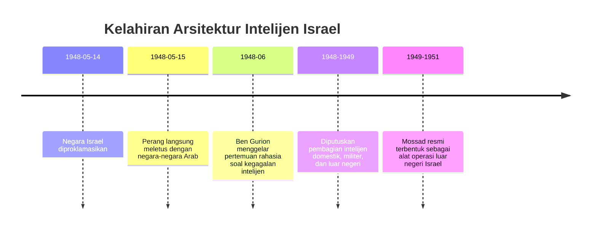
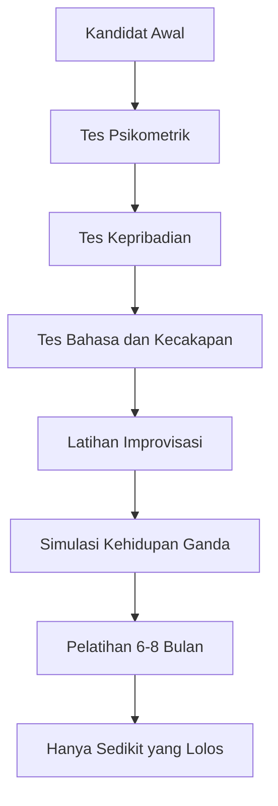
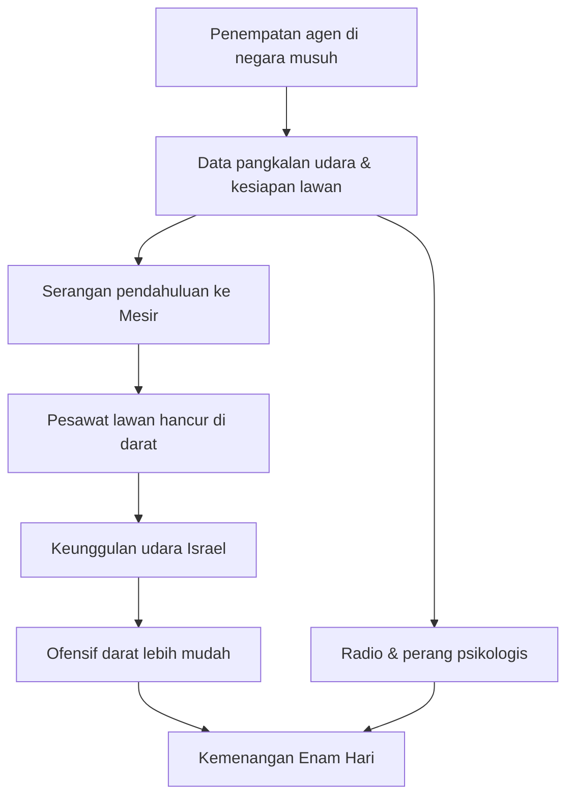
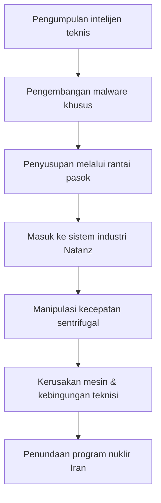

## 🎯 Pendahuluan: Mengapa Mossad Begitu Memikat, Ditakuti, dan Diperdebatkan?

Di antara semua lembaga intelijen dunia, hanya sedikit nama yang memiliki daya magis sekuat **Mossad**. Ketika orang menyebut CIA, kita biasanya membayangkan operasi global Amerika. Ketika menyebut KGB, yang muncul adalah bayangan perang dingin Soviet. Tetapi ketika menyebut Mossad, yang muncul sering kali bukan sekadar lembaga negara, melainkan sebuah **mitos operasional**: organisasi yang seolah tahu segalanya, mampu menembus wilayah musuh, bergerak tanpa jejak, mencuri dokumen, merekrut pengkhianat, membunuh target, dan pulang tanpa sempat dipahami lawan. 🕵️‍♂️

Tentu saja, mitos itu tidak sepenuhnya akurat. Dokumenter *Mossad, l'histoire secrète d'Israël* justru menarik karena memperlihatkan dua wajah Mossad sekaligus. Di satu sisi, ia adalah lembaga yang sangat efektif, sangat berani, dan benar-benar punya pengaruh besar terhadap sejarah Timur Tengah bahkan dunia. Di sisi lain, ia juga penuh kesalahan, kontroversi moral, kegagalan identifikasi, operasi yang melukai warga sipil, dan keputusan-keputusan gelap yang lahir dari rasa terancam secara eksistensial.

Itulah kunci untuk memahami Mossad: lembaga ini tidak bisa dibaca hanya sebagai mesin spionase, dan juga tidak cukup dibaca sebagai organisasi pembunuh. Mossad lahir dari **trauma sejarah**, tumbuh dari **rasa terancam yang permanen**, dan bekerja dalam keyakinan bahwa Israel tidak punya kemewahan untuk kalah sekali pun. Dari sanalah muncul campuran yang sangat eksplosif: ketakutan, keyakinan ideologis, kecerdikan operasional, improvisasi, paranoia, dan justifikasi perang tanpa henti. ⚠️

Dokumenter ini menyusun sejarah Mossad bukan sekadar sebagai daftar operasi, melainkan sebagai narasi tentang bagaimana sebuah negara kecil membangun alat rahasia untuk bertahan hidup di lingkungan yang dipersepsikan mematikan. Dari penculikan Adolf Eichmann di Argentina, pencurian MiG-21 dari Irak, perburuan berdarah pasca-Munich, sabotase program nuklir Irak, hingga perang siber dan pembunuhan ilmuwan dalam konflik dengan Iran — semua ini menunjukkan bahwa Mossad bukan sekadar pengumpul informasi. Ia adalah **alat negara untuk mengubah realitas geopolitik secara diam-diam**.

Dalam artikel ini, saya akan mengurai sejarah itu secara runtut, panjang, dan seteliti mungkin. Istilah asing akan saya jelaskan padanan Indonesianya, konteks moralnya akan saya bedah, dan titik-titik pentingnya akan kita petakan agar terlihat bahwa legenda Mossad dibangun bukan hanya oleh keberhasilan, tetapi juga oleh darah, trauma, dan pilihan-pilihan yang sangat keras. 🧠

<Callout type="important" title="Tesis utama artikel ini">
Mossad menjadi begitu legendaris bukan semata karena ia pandai memata-matai, tetapi karena ia beroperasi di persimpangan antara rasa takut eksistensial, kecerdikan strategis, dan kesediaan memakai cara-cara yang oleh banyak negara lain akan dianggap terlalu ekstrem. Justru di sanalah kekuatannya lahir — dan di sanalah kontroversinya tidak pernah berhenti.
</Callout>

---

## 🏗️ 1. Kelahiran Mossad: Negara Baru, Perang Pertama, dan Intelijen yang Masih Kacau

Untuk memahami mengapa Mossad menjadi begitu penting, kita harus kembali ke tahun **1948**, ke saat Negara Israel bahkan belum benar-benar sempat berdiri dengan tenang. Pada saat itu, negara Yahudi baru saja diproklamasikan, tetapi langsung masuk ke dalam perang melawan koalisi negara-negara Arab tetangga. Israel tidak lahir dalam kondisi stabil; ia lahir dalam kondisi **pengepungan**. Itu sangat penting, karena lembaga-lembaga negaranya sejak awal dibentuk bukan dalam suasana administrasi damai, melainkan dalam suasana bertahan hidup.

Dokumenter ini menyoroti sebuah momen pada **Juni 1948**, ketika Perdana Menteri Israel **David Ben Gurion** memanggil sejumlah orang intelijen ke Tel Aviv untuk pertemuan rahasia. Dari perang awal itu, muncul kesadaran yang sangat pahit: Israel kekurangan informasi militer yang memadai. Ini bukan lagi bentrokan sporadis seperti sebelumnya, tetapi perang melawan tentara reguler. Dan ketika Anda berhadapan dengan tentara reguler tanpa sistem intelijen yang rapi, Anda sedang berjalan menuju bencana.

Ben Gurion lalu mengambil kesimpulan mendasar: seluruh arsitektur intelijen harus dirombak. Dari sinilah lahir tiga pilar utama:

1. **Intelijen domestik** — untuk keamanan dalam negeri.
2. **Intelijen militer** — untuk mendukung operasi perang.
3. **Lembaga operasi luar negeri** — untuk spionase dan pengumpulan informasi di luar perbatasan.

Lembaga ketiga inilah yang kemudian menjadi **Mossad**, kependekan dari *Ha-Mossad le-Modi'in u-le-Tafkidim Meyuhadim* — **Institut untuk Intelijen dan Tugas-Tugas Khusus**.

Tetapi ada lapisan yang lebih dalam dari sekadar reorganisasi birokrasi. Ben Gurion dan generasi awal elite Israel membawa keyakinan bahwa negara ini tidak bisa hidup normal seperti negara besar lain. Mereka merasa hidup Israel selalu berada di tepi jurang. Dalam logika seperti itu, intelijen bukan pelengkap militer, melainkan semacam **organ kehidupan** negara itu sendiri. Jika intelijen gagal, negara bisa mati.

Dokumenter ini juga menekankan sesuatu yang sangat menentukan: Israel boleh saja memenangkan perang 1948, tetapi kemenangan itu tidak menghadirkan rasa aman. Justru sebaliknya. Kemenangan itu dirasakan sekaligus sebagai **trauma**. Israel bertambah wilayah, tetapi ancaman masih ada. Sebagian Yerusalem masih dikuasai Yordania. Rasa takut akan hilang dari peta tetap hidup. Ben Gurion sendiri diringkas dalam kalimat yang sangat terkenal: bangsa Arab bisa kalah berkali-kali dan kembali lagi, tetapi Israel tidak mampu menanggung satu kekalahan fatal.

Dari sini kita bisa melihat bahwa Mossad lahir bukan dari percaya diri, melainkan dari **ketakutan yang dijadikan sistem**. 😶

---

## 🧱 2. Psikologi Generasi Pertama Mossad: Penyintas Holocaust, Zionisme, dan Rasa Memiliki Misi

Salah satu bagian paling penting dari dokumenter ini adalah penjelasan tentang **siapa orang-orang awal Mossad**. Pada masa-masa awal, Mossad bukan lembaga besar dengan infrastruktur mewah seperti CIA atau KGB. Agen-agennya masih sedikit. Sumber dayanya terbatas. Tetapi justru dari keterbatasan itulah muncul karakter yang sangat khas.

Banyak personel awal Mossad berasal dari generasi Yahudi Zionis muda, dan sebagian besar di antaranya adalah **penyintas Holocaust** atau orang-orang yang masih membawa luka sangat dekat dari Eropa. Dokumenter menyebut bahwa dalam satu unit operasional pada awal 1950-an, sekitar sepertiga perwiranya adalah penyintas Holocaust yang baru beberapa tahun tiba di Israel.

Ini penting sekali. Mengapa? Karena orang-orang seperti ini tidak bekerja dengan mentalitas pegawai negara biasa. Mereka bekerja dengan perasaan bahwa mereka sedang **membangun rumah terakhir** bagi bangsanya. Mereka merasa memiliki misi historis. Mereka merasa keberhasilan mereka adalah bagian dari memastikan bahwa tragedi Holocaust tidak akan pernah terulang. Mereka percaya pada kebenaran tujuan mereka. Dan kepercayaan semacam itu bisa melahirkan dedikasi yang sangat kuat — tetapi juga pembenaran moral yang sangat berbahaya. 🔥

Dengan kata lain, generasi awal Mossad tidak hanya dibentuk oleh pelatihan, tetapi juga oleh **teologi politik bertahan hidup**. Mereka meyakini bahwa:

- negara Yahudi harus dipertahankan dengan cara apa pun,
- musuh harus dipahami lebih cepat daripada mereka sempat menyerang,
- dan dunia luar tidak bisa selalu dipercaya untuk melindungi orang Yahudi.

Perpaduan antara trauma, ideologi, dan rasa misi inilah yang kemudian membuat Mossad berbeda. Ia tidak dibangun di atas netralitas profesional murni, melainkan di atas energi yang jauh lebih panas: keyakinan bahwa mereka sedang menulis sejarah dengan tangan mereka sendiri.

---

## ⚖️ 3. Operasi Eichmann: Ketika Mossad Menciptakan Mitosnya Sendiri

Kalau ada satu operasi yang benar-benar membangun legenda global Mossad, itu adalah **penangkapan Adolf Eichmann**. Di mata sejarah intelijen, operasi ini bukan hanya sukses teknis. Ia adalah operasi yang mengubah citra Israel di mata dunia dan di mata dirinya sendiri.

### Siapa Eichmann?

**Adolf Eichmann** adalah salah satu birokrat Nazi paling penting dalam arsitektur *Final Solution* — **Solusi Akhir**, yaitu program sistematis pemusnahan Yahudi Eropa. Ia bukan monster teatrikal, melainkan administrator logistik pembantaian. Justru itu yang membuat sosoknya begitu penting. Ia mewakili kejahatan modern yang dingin, efisien, dan birokratis.

Setelah Perang Dunia II, Eichmann melarikan diri ke Argentina dan hidup dengan identitas palsu **Ricardo Clement**. Pada titik ini, Mossad melihat peluang yang jauh lebih besar daripada sekadar membunuh mantan penjahat Nazi.

### Mengapa Ben Gurion ingin dia ditangkap hidup-hidup?

Di sinilah kecerdasan politik bertemu dengan operasi intelijen. Secara teknis, jauh lebih mudah bagi Mossad untuk membunuh Eichmann diam-diam di Argentina. Tetapi Ben Gurion tidak mau itu. Ia memahami bahwa membawa Eichmann ke Yerusalem untuk diadili akan menghasilkan sesuatu yang jauh lebih besar:

- Holocaust akan dipaksa masuk ke pusat kesadaran publik Israel,
- negara Israel bisa menghubungkan keberadaannya dengan sejarah kehancuran Yahudi Eropa,
- dan dunia akan melihat bahwa kini orang Yahudi bukan lagi korban pasif, tetapi subjek berdaulat yang mampu menangkap algojonya sendiri.

Jadi operasi ini sejak awal bukan hanya operasi intelijen. Ini adalah **operasi sejarah**. 📚

### Bagaimana operasi itu dijalankan?

Agen Mossad pergi ke Buenos Aires, memverifikasi alamat Eichmann di Jalan Garibaldi, dan memotret target. Setelah yakin bahwa Ricardo Clement memang Eichmann, mereka mulai menyusun penangkapan.

Pada malam operasi, beberapa agen menunggu di dekat rumahnya saat ia pulang dari kerja. Ketika target tiba, salah satu agen menjatuhkannya dengan gerakan *Jiu-Jitsu* — seni bela diri Jepang yang menekankan teknik kuncian dan kontrol tubuh. Eichmann kemudian dibawa ke mobil, disembunyikan di rumah aman (*safe house* — rumah rahasia), diperiksa bahkan sampai giginya untuk memastikan ia tidak menyimpan kapsul sianida, lalu dipaksa mengakui identitasnya.

Bagian yang paling dramatis datang saat **eksfiltrasi** — *exfiltration*, yaitu proses mengeluarkan target dari wilayah operasi secara rahasia. Mossad memilih momen perayaan 150 tahun Revolusi Argentina, ketika banyak delegasi asing datang. Di tengah kekacauan bandara, agen menyamar sebagai kru penerbangan dan membawa Eichmann ke pesawat delegasi Israel.

### Dampaknya terhadap Israel

Dampak operasi ini luar biasa. Ketika Eichmann diadili di Yerusalem, persidangan itu disiarkan luas. Di Israel yang saat itu belum punya televisi, orang-orang mengikuti siaran radio dengan intensitas yang nyaris ritual. Dokumenter menekankan bahwa persidangan ini membuat Holocaust menjadi topik yang bisa dibicarakan terbuka tanpa rasa malu. Ia memberi ruang suara kepada para penyintas.

Jadi, operasi Eichmann penting karena tiga alasan sekaligus:

1. **Operasional** — Mossad menunjukkan kemampuannya menembus negara jauh dan membawa target pulang.
2. **Psikologis** — Israel menunjukkan bahwa Yahudi kini bisa membalas sejarah, bukan hanya menanggungnya.
3. **Simbolik** — mitos Mossad sebagai lembaga yang dapat menjangkau siapa pun, di mana pun, mulai benar-benar terbentuk.

<Callout type="quote" title="Mengapa operasi Eichmann begitu menentukan?">
Karena untuk pertama kalinya, Mossad bukan hanya membunuh musuh atau mengumpulkan informasi. Ia memproduksi sebuah panggung sejarah di mana negara Israel, Holocaust, dan kekuatan intelijen bertemu menjadi satu narasi besar.
</Callout>

---

## ✈️ 4. Mencuri MiG-21: Saat Negara Kecil Mempermalukan Kekuatan Besar

Jika operasi Eichmann membangun aura moral dan historis Mossad, maka **pencurian MiG-21** membangun aura strategis dan militer. Ini adalah salah satu operasi paling terkenal dalam sejarah intelijen karena berhasil melakukan sesuatu yang bahkan Amerika Serikat belum sanggup saat itu: memperoleh jet tempur paling canggih milik blok Soviet dari tangan negara Arab.

### Mengapa MiG-21 begitu penting?

Pada 1960-an, **MiG-21** adalah kebanggaan industri pertahanan Soviet. Bagi negara-negara Arab yang bermusuhan dengan Israel, pesawat ini adalah simbol modernitas militer. Ia cepat, berbahaya, dan sangat relevan pada konteks Perang Dingin. Amerika saat itu sedang terlibat di Vietnam dan juga menghadapi MiG, tetapi belum berhasil mendapat satu unit utuh untuk dibedah.

Ketika Israel berhasil memperolehnya, itu bukan hanya kemenangan taktis. Itu adalah **hadiah strategis** yang sangat besar untuk dirinya sendiri dan untuk Amerika Serikat. 🇺🇸

### Bagaimana Mossad melakukannya?

Kuncinya bukan teknologi, melainkan manusia. Mossad mencari pilot Arab yang punya motif untuk membelot. Mereka akhirnya menemukan **Kapten Mounir Redfa**, pilot Angkatan Udara Irak yang beragama Kristen dan merasa diperlakukan tidak adil dalam sistem yang didominasi elite Muslim. Di sinilah Mossad menunjukkan kecanggihannya: mereka memahami bahwa kelemahan paling penting sering bukan mesin lawan, melainkan struktur sosial dan psikologis lawan.

Redfa didekati, diajak bertemu di negara netral, diuji, dan dinegosiasi. Pertanyaan Mossad sangat langsung: apakah ia bersedia kabur dengan MiG-21, dan apa imbalannya? Jawaban Redfa pun tidak sederhana: ia meminta seluruh keluarganya dieksfiltrasi ke Israel.

### Mengapa operasi ini sangat kompleks?

Karena ini bukan sekadar membujuk seseorang. Ini berarti:

- membuat cerita samaran (*cover story* — identitas dan alasan perjalanan palsu) agar pertemuan tidak mencurigakan,
- memindahkan keluarga target ke tempat aman,
- memastikan ia tahu koridor udara, ketinggian, dan pola komunikasi radio,
- serta menyiapkan jet Israel untuk menjemputnya saat ia mendekati perbatasan.

Pada **16 Agustus 1966**, Redfa menerbangkan MiG-21 dalam latihan rutin, mematikan radio saat melewati wilayah Irak dan Yordania, lalu mendekati wilayah Israel. Dua pesawat tempur Israel menyambut dan mengawalnya ke pangkalan militer dekat Tel Aviv.

Keberhasilan ini menunjukkan sesuatu yang penting tentang Mossad: ia sangat efektif ketika operasi membutuhkan perpaduan antara **rekrutmen manusia, manipulasi psikologis, dan presisi lintas-lembaga**.

---

## 🧪 5. Bagaimana Mossad Mencetak Agen? Rekrutmen, Ujian, dan Seni Menjalani Dua Kehidupan

Legenda Mossad tidak mungkin dipahami tanpa melihat bagaimana ia membentuk manusia yang bekerja di dalamnya. Dokumenter menjelaskan bahwa sejak 1960-an, khususnya di bawah kepemimpinan baru yang ingin memodernisasi lembaga, metode rekrutmen Mossad berubah dari pola informal menjadi lebih sistematis.

Dibentuklah departemen pelatihan khusus. Sebelum masuk ke tahap pelatihan, kandidat harus melewati serangkaian tes panjang:

- **psychometric examinations** — tes psikometrik,
- **personality tests** — tes kepribadian,
- **aptitude tests** — tes bakat dan kecakapan,
- **language tests** — tes bahasa.

Tetapi yang paling menarik bukan tes akademiknya, melainkan apa yang sebenarnya sedang diukur. Menurut dokumenter, Mossad mencari orang yang bisa menjalani **dua kehidupan paralel**:

- di satu sisi tetap menjadi orang yang bisa dipercaya, stabil, tampak normal,
- di sisi lain mampu menjadi manipulatif, licik, dan sangat adaptif.

Inilah paradoks inti seorang agen rahasia. Ia tidak boleh menjadi psikopat yang tak terkendali. Tetapi ia juga tidak boleh terlalu lurus, karena dunia operasional menuntut kemampuan berbohong, menyamar, dan berimprovisasi.

Ada contoh latihan yang sangat menggambarkan budaya itu. Seorang instruktur menunjukkan sebuah balkon di lantai lima dan berkata: dalam sepuluh menit, saya ingin melihat kamu di balkon itu, memegang segelas air, sambil berbicara dengan pemilik rumah. Latihan seperti ini bukan soal atletik. Ini soal **kecerdikan sosial**, spontanitas, dan kemampuan memecahkan masalah di bawah tekanan. 😮

Dari lebih dari 1.500 kandidat, hanya tersisa lima atau enam orang setelah berbulan-bulan pelatihan intensif. Angka ini menunjukkan bahwa Mossad bukan hanya memilih orang pintar, tetapi orang yang sanggup menanggung ketegangan identitas yang sangat berat.

---

## ⚔️ 6. Perang Enam Hari 1967: Saat Intelijen Membuka Jalan bagi Serangan Pendahuluan

Dalam banyak sejarah populer, kemenangan Israel dalam **Perang Enam Hari** sering dijelaskan terutama lewat keberanian militer dan kecepatan serangan udaranya. Dokumenter ini menekankan bahwa di balik kemenangan itu ada kerja intelijen yang sangat penting.

Israel pada saat itu percaya bahwa perang baru dengan negara-negara Arab sudah dekat. Mossad telah menempatkan jaringan dan agen di beberapa negara musuh: Suriah, Yordania, Mesir, dan Irak. Informasi dari mereka menjadi sangat berharga ketika Israel memutuskan melakukan **preemptive strike** — *serangan pendahuluan* untuk mencegah serangan lawan terlebih dahulu.

Poin kuncinya adalah ini: Israel menyerang Mesir pada pagi hari ketika banyak pesawat tempur masih berada di darat. Ini bukan kebetulan. Itu adalah hasil dari informasi rinci tentang pangkalan udara, pola kesiapan, dan kerentanan. Dalam tiga jam, angkatan udara Mesir praktis lumpuh. Dengan langit dikuasai, ofensif darat Israel pun mendapatkan keunggulan mutlak.

Tetapi dokumenter juga menarik karena tidak berhenti di level taktis. Ia menunjukkan bahwa agen-agen di lapangan turut menjalankan **perang psikologis**. Melalui radio, mereka menyebarkan informasi yang sangat spesifik: lokasi penyimpanan senjata, nama-nama orang yang terlibat dalam perlawanan, dan pesan bahwa pemimpin Arab telah berbohong kepada rakyatnya. Ini penting karena menunjukkan bahwa bagi Mossad, perang bukan cuma penghancuran fisik, tetapi juga penghancuran moral dan kepercayaan diri lawan.

Kemenangan Enam Hari membuat Israel menguasai Yerusalem Timur, Tepi Barat, Gaza, dan Dataran Tinggi Golan. Di mata masyarakat Israel, kemenangan ini terasa seperti euforia historis. Tetapi secara geopolitik, kemenangan ini juga memperdalam konflik yang akan meledak lagi dalam bentuk-bentuk baru. Dan Mossad berada tepat di pusat transformasi itu.

---

## 🩸 7. Munich 1972: Trauma yang Mengubah Mossad Menjadi Mesin Pemburu Global

Kalau operasi Eichmann membangun mitos moral Mossad, maka tragedi **Munich 1972** membangun wajah lain Mossad: wajah pemburu yang mengejar musuh ke seluruh dunia.

Di Olimpiade Munich, sembilan anggota delegasi Israel disandera oleh kelompok **Black September** — *September Hitam*, organisasi Palestina yang menuntut pembebasan ratusan tahanan. Dunia menyaksikan semuanya secara langsung melalui media. Ini bukan sekadar serangan teror; ini adalah pertunjukan global atas kerentanan Israel.

Dokumenter menggambarkan betapa traumatisnya momen ini bagi masyarakat Israel. Bagi banyak orang, pembunuhan Yahudi di tanah Jerman, hanya beberapa dekade setelah Holocaust, terasa seperti luka sejarah yang terbuka kembali. Negara Israel tidak hanya berduka; ia merasa dipermalukan.

Yang memperburuk semuanya adalah kegagalan operasi penyelamatan Jerman. Kepala Mossad saat itu, **Zvi Zamir**, berada di lokasi dan menyaksikan langsung betapa kacaunya operasi tersebut. Awalnya media bahkan memberi kesan sandera sudah dibebaskan. Tetapi kenyataannya, semua sandera tewas.

### Mengapa Munich begitu menentukan?

Karena setelah itu, pemerintah Israel di bawah **Golda Meir** mengambil kesimpulan yang sangat keras: teror seperti ini harus dibalas dengan pemburuan sistematis. Bukan hanya pelaku lapangan yang harus dibunuh, tetapi juga arsitek, fasilitator, dan pemimpin politik yang dianggap berada di belakangnya.

Dokumenter menyebut tiga tujuan utama operasi pembalasan:

1. **Deterrence** — *pencegahan*, agar pihak lawan berpikir ribuan kali sebelum menyerang lagi.
2. **Punishment / Retribution** — *hukuman / pembalasan*, bahwa darah Israel akan dibayar.
3. **Psychological reassurance** — *pemulihan rasa aman psikologis*, agar warga Israel dan Yahudi global merasa negara mereka kuat dan tidak pasif.

Di sinilah kita melihat pergeseran penting: Mossad bergerak dari lembaga yang terkenal karena penculikan dan infiltrasi menjadi lembaga yang identik dengan **targeted killing** — *pembunuhan terarah / eliminasi terhadap target tertentu*.

---

## 🔫 8. Operasi Eliminasi di Eropa: Efektivitas, Impunitas, dan Kelonggaran Barat

Pasca-Munich, Mossad mengirim tim ke berbagai kota di Eropa. Mereka memakai paspor palsu, apartemen aman, logistik dari kantong diplomatik, dan berbagai metode eliminasi:

- racun,
- bom,
- pistol bersenyap,
- kendaraan jebakan,
- telepon jebakan.

Salah satu target awal yang disorot dokumenter adalah **Mahmoud Hamshari / Amchari** di Paris. Di media Prancis ia tampak seperti intelektual moderat, tetapi di mata Israel ia adalah tokoh sentral PLO yang terkait dengan kekerasan terhadap agen Israel. Ketika target berada sendirian di apartemennya, Mossad meledakkan telepon rumah yang telah dipasangi bom. Ia kemudian meninggal karena luka-lukanya.

Dokumenter menyebut bahwa dalam waktu kurang dari setahun, ada empat pembunuhan yang dikaitkan dengan Mossad di Paris, tanpa reaksi keras berarti dari otoritas Prancis. Ini bagian yang sangat menarik dan sangat politis. Artinya, keberhasilan Mossad tidak berdiri sendiri; ia juga terjadi dalam konteks di mana negara-negara Barat kadang memilih **membiarkan** operasi itu selama kepentingan mereka sendiri tidak terganggu.

Ada semacam **relative impunity** — *impunitas relatif / kebal dari konsekuensi tegas* — yang mengelilingi operasi Mossad di Eropa. Israel memakai paspor palsu negara-negara lain, bergerak di wilayah mereka, bahkan melakukan pembunuhan. Tetapi protes sering tidak terlalu keras. Mengapa? Dokumenter memberi petunjuk: karena sejarah Israel memberi negara itu semacam kelonggaran moral tertentu di mata Barat.

Tentu ini bukan berarti semua negara setuju, tetapi ia menunjukkan bahwa keberhasilan intelijen sering lahir bukan hanya dari kehebatan agen, melainkan juga dari ruang permisif yang diberikan lingkungan internasional.

---

## 🚨 9. Lillehammer: Ketika Mitos Mossad Retak oleh Salah Bunuh

Setiap lembaga yang terlalu percaya diri cenderung suatu saat melakukan kesalahan yang memperlihatkan bahwa ia tetap manusia. Bagi Mossad, salah satu titik paling memalukan adalah **Lillehammer Affair** di Norwegia pada 1973.

Target Mossad saat itu adalah **Ali Hassan Salameh**, tokoh Palestina yang dianggap otak penting di balik jaringan Black September dan sangat dekat dengan Yasser Arafat. Tetapi di Lillehammer, yang dibunuh justru **Ahmed Bouchiki**, seorang warga sipil keturunan Maroko-Prancis yang sama sekali bukan target.

Mengapa kesalahan ini bisa terjadi? Dokumenter menunjukkan campuran faktor yang sangat buruk:

- identifikasi visual yang terlalu percaya diri,
- konteks lokal yang tidak familiar,
- asumsi bahwa orang dengan ciri tertentu di kota kecil itu pasti target mereka,
- dan mungkin budaya operasional yang terlalu terdorong untuk segera mengeksekusi.

### Mengapa Lillehammer begitu menghancurkan?

Karena bukan hanya salah bunuh. Para agen juga tertangkap. Salah satu yang ditahan akhirnya mengaku setelah tekanan psikologis terkait trauma masa lalunya. Kasus ini menjadi berita internasional. Tiba-tiba Mossad yang selama ini tampak nyaris tak tersentuh justru terlihat ceroboh, salah identifikasi, dan bisa ditangkap polisi lokal.

Secara moral, kasus ini sangat berat. Bouchiki adalah orang biasa, istrinya sedang hamil, dan keluarganya baru menerima kompensasi puluhan tahun kemudian — tanpa permintaan maaf resmi. Inilah salah satu momen di mana dokumenter dengan sangat jelas menunjukkan sisi paling gelap dari logika *targeted elimination*: ketika informasi salah, yang mati bukan abstraksi geopolitik, tetapi manusia konkret yang sama sekali tidak terlibat. 💔

<Callout type="danger" title="Pelajaran dari Lillehammer">
Intelijen yang hebat bukan berarti kebal salah. Justru ketika sebuah lembaga terlalu yakin pada ketepatan dirinya sendiri, kesalahan identifikasi bisa berubah menjadi pembunuhan negara terhadap orang yang sama sekali tidak bersalah.
</Callout>

---

## 🛶 10. Beirut 1973 dan 1979: Dari Raiding Party sampai Bom Mobil untuk Salameh

Meski dipermalukan di Lillehammer, Mossad tidak menghentikan perburuannya terhadap Ali Hassan Salameh. Sebelumnya, pada 1973, komando Israel sudah melakukan serangan kilat di Beirut terhadap target-target PLO dan membunuh beberapa pemimpin penting. Tetapi Salameh lolos.

Beberapa tahun kemudian, perburuan itu dibuka kembali. Beirut saat itu sedang dilanda perang saudara. Kota itu dipenuhi pos pemeriksaan, milisi, dan ketidakpastian. Dalam lingkungan seperti itu, agen asing — apalagi agen Israel — hidup dalam risiko yang sangat tinggi. Tetapi justru lingkungan kacau semacam itu sering juga menciptakan celah bagi operasi infiltrasi.

Dokumenter menyoroti seorang agen perempuan yang beroperasi dengan nama samaran **Erika Chambers**, warga Inggris yang menyamar sebagai pekerja kemanusiaan bagi pengungsi Palestina. Ini contoh klasik **cover** — *identitas samaran* — yang cerdas: pekerjaan kemanusiaan memungkinkan akses sosial, rasa percaya, dan mobilitas di lingkungan konflik. Sedikit demi sedikit, ia mendekati lingkaran PLO dan mempelajari rutinitas Salameh.

Akhirnya ditemukan celah: Salameh kerap menempuh rute mobil yang sama setiap hari. Pada **22 Januari 1979**, sebuah bom mobil meledak di jalurnya dan menewaskan Salameh beserta pengawalnya.

Tetapi seperti sering terjadi dalam operasi semacam ini, target tidak mati sendirian. Empat orang yang lewat juga tewas. Maka lagi-lagi pertanyaan moral muncul: apakah keberhasilan membunuh target bernilai tinggi membenarkan kematian warga sipil di sekitarnya?

Dokumenter sengaja menghadirkan dua suara berbeda. Ada yang berkata bahwa ini perang dan kadang cara seperti itu dianggap tak terhindarkan. Ada pula yang menyebut eliminasi semacam ini lebih mirip operasi mafia daripada kerja intelijen murni. Ketegangan ini penting. Artinya, bahkan di dalam dunia keamanan Israel sendiri, tidak semua orang sepakat bahwa pembunuhan terarah adalah alat yang selalu efektif atau selalu bermoral.

---

## ☢️ 11. Dari Palestina ke Nuklir: Mengapa Irak Dipandang sebagai Ancaman Eksistensial yang Lebih Serius?

Menjelang akhir 1970-an, fokus Mossad mulai bergeser. Terorisme Palestina tetap dianggap ancaman, tetapi bagi sebagian elite Israel, itu dipandang seperti “sengatan lebah”: menyakitkan, tetapi bukan ancaman eksistensial utama. Yang jauh lebih berbahaya adalah kemungkinan negara Arab lain memperoleh **senjata nuklir**.

Dalam konteks ini, **Irak di bawah Saddam Hussein** menjadi perhatian utama. Situasinya rumit karena Prancis — yang dahulu membantu Israel membangun kemampuan nuklirnya sendiri — kini justru menjalin kerja sama nuklir dengan Irak. Israel melihat proyek reaktor Irak sebagai langkah menuju bom atom.

Dokumenter menunjukkan bahwa Israel awalnya mencoba jalur diplomatik. Mereka memperingatkan Prancis, menyampaikan kekhawatiran bahwa Irak bisa menyalahgunakan reaktor untuk tujuan militer. Namun pemerintah Prancis menenangkan mereka, mengatakan proyek itu bukan untuk senjata.

Masalahnya, dari sudut pandang Israel, jaminan semacam itu tidak cukup. Saddam Hussein adalah pemimpin yang secara retoris sangat bermusuhan dan Irak belum menandatangani perdamaian dengan Israel. Dalam logika Israel, kombinasi niat bermusuhan dan kemungkinan nuklir adalah resep bencana.

Maka Mossad diberi tugas baru: **menggagalkan kemitraan nuklir Prancis-Irak**.

---

## 🧨 12. Sabotase di Prancis: Gudang, Surat Ancaman, dan Kematian Yahya al-Meshad

Bagian ini sangat penting karena memperlihatkan bahwa Mossad bekerja secara berlapis, tidak hanya dengan satu metode.

### Tahap pertama: sabotase fisik

Mossad menyelidiki sebuah perusahaan di Prancis selatan yang memproduksi komponen reaktor untuk Irak. Mereka memetakan keamanan lokasi, jadwal penjaga, dan mencari momen paling sepi. Akhirnya, lewat sebuah pengalihan perhatian di gerbang masuk, agen-agen berhasil masuk dan meledakkan komponen yang disimpan di gudang.

Masalahnya: operasi ini **gagal secara substantif**. Komponen yang dihancurkan ternyata bukan yang paling penting. Hasilnya hanya menunda proyek, bukan menghentikannya.

### Tahap kedua: intimidasi psikologis

Setelah sabotase fisik tidak cukup, Mossad beralih ke kampanye ancaman terhadap para insinyur Prancis yang mengerjakan proyek Irak. Mereka menerima surat ancaman dan telepon misterius yang seolah berasal dari lawan-lawan Saddam Hussein. Tujuannya jelas: membuat tenaga ahli mundur, menimbulkan rasa takut, dan merusak ritme proyek.

### Tahap ketiga: penghilangan tokoh kunci

Dokumenter lalu membahas pembunuhan **Yahya al-Meshad**, ilmuwan Mesir yang menjadi figur penting dalam program nuklir Irak. Ia ditemukan tewas di kamar hotel di Paris, setelah sebelumnya diduga dijebak melalui seorang perempuan. Perempuan itu sendiri kemudian meninggal tertabrak mobil sebulan sesudahnya, menambah aura gelap kasus ini.

Sekali lagi, tidak ada pengakuan resmi. Tetapi pola operasi, konteks, dan motif membuat bayangan Mossad sangat kuat di balik insiden tersebut.

### Akhir dari fase ini

Pada akhirnya, Mossad harus mengakui keterbatasannya. Kepala Mossad saat itu sampai mengatakan kepada perdana menteri: kami sudah melakukan semua yang kami bisa, reaktor sudah ada di Irak, dan jika masih ingin dihentikan, satu-satunya opsi tersisa adalah opsi militer.

Di titik inilah kita melihat garis batas penting: **intelijen bisa menunda, mengganggu, dan merusak; tetapi tidak selalu mampu menyelesaikan masalah sendirian**.

---

## ✈️ 13. Ozirak 1981: Saat Jalan Intelijen Berakhir dan Jet Tempur Mengambil Alih

Dokumenter kemudian membawa kita pada serangan udara Israel terhadap reaktor Irak pada 1981, yang dikenal luas sebagai **serangan Ozirak**. Walau operasi ini secara teknis militer, bukan operasi rahasia Mossad murni, Mossad memainkan peran besar dalam keseluruhan rantai intelijen yang mendahuluinya.

Serangan itu menghancurkan reaktor, tetapi juga menewaskan tentara Irak dan seorang insinyur Prancis muda. Menariknya, dokumenter menunjukkan bahwa kematian korban Prancis ini tidak memicu konsekuensi diplomatik besar. Ini sekali lagi memperlihatkan bagaimana tindakan Israel sering dipahami melalui lensa keamanan eksistensial yang memberi ruang toleransi lebih luas dibandingkan jika negara lain melakukan hal serupa.

Setelah **François Mitterrand** berkuasa, hubungan Prancis-Israel membaik, dan program nuklir Prancis untuk Irak pun benar-benar ditinggalkan. Dari perspektif Israel, hasil akhirnya jelas: Saddam tidak memperoleh bom atom.

Tetapi kisah ini juga menyisakan pertanyaan mendalam. Apakah tindakan preventif seperti ini sungguh mencegah perang lebih besar, atau justru mengukuhkan doktrin bahwa Israel berhak menyerang siapa pun yang dianggap berpotensi mengancamnya di masa depan? Pertanyaan itu akan menjadi jauh lebih penting ketika fokus beralih ke Iran.

---

## 🇮🇷 14. Iran: Dari Sabotase Klasik ke Perang Rahasia Jangka Panjang

Jika Irak adalah ancaman nuklir generasi 1970-an dan awal 1980-an, maka **Iran** menjadi obsesi strategis Mossad pada abad ke-21. Dokumenter memperlihatkan bahwa sejak awal 2000-an, ketika aktivitas nuklir Iran meningkat, Israel melihat masalah ini sebagai ancaman terbesar bagi kelangsungan negaranya.

Di bawah kepala Mossad **Meir Dagan**, isu Iran ditempatkan di puncak prioritas. Tetapi Dagan juga memahami bahwa Iran tidak bisa dihentikan lewat satu operasi kilat. Program nuklir negara sebesar Iran terlalu luas, terlalu tersebar, dan terlalu tahan terhadap guncangan tunggal. Maka yang dibangun adalah **strategi rahasia jangka panjang**.

Strategi ini punya beberapa lapisan:

1. **Pengumpulan intelijen besar-besaran** tentang fasilitas, rantai pasok, ilmuwan, dan celah teknologi.
2. **Dorongan sanksi ekonomi internasional**, dengan memberi masukan detail kepada Amerika dan Eropa mengenai perusahaan, individu, dan sektor yang harus dikenai tekanan.
3. **Operasi pembunuhan dan penculikan**, untuk memperlambat program dengan menghilangkan orang-orang penting.
4. **Sabotase industri**, melalui perusahaan palsu yang menjual peralatan cacat kepada Iran.
5. **Perang siber**, yang puncaknya adalah Stuxnet.

Yang menarik dari dokumenter ini adalah penekanannya bahwa tujuan operasi-operasi tersebut bukan selalu menghentikan program nuklir secara total. Sering kali tujuannya adalah **menunda**, merusak ritme, menciptakan ketidakpercayaan, dan menambah biaya psikologis maupun teknis bagi Iran.

---

## 🏢 15. Perusahaan Palsu, Peralatan Cacat, dan Logika Sabotase yang Sabar

Salah satu bagian paling menarik dari perang rahasia melawan Iran adalah penggunaan perusahaan palsu untuk memasok peralatan cacat. Ini mungkin terdengar sederhana, tetapi secara operasional justru sangat rumit.

Untuk bisa menjual barang ke pihak Iran, perusahaan samaran itu tidak boleh tampak palsu. Ia harus punya:

- kantor,
- surat menyurat,
- jejak bisnis,
- referensi pelanggan,
- reputasi teknis.

Artinya, Mossad tidak sekadar memalsukan logo dan mengirim barang jebakan. Mereka harus **membangun kredibilitas pasar**. Mereka menjual barang bagus dulu, berkali-kali, sampai pembeli percaya. Setelah itu, dalam satu transaksi penting, dikirimlah komponen cacat yang ketika dipasang justru merusak fasilitas Iran.

Di sini tampak ciri khas operasi intelijen yang matang: sabar, bertahap, dan sangat memperhatikan psikologi target. Sabotase terbaik kadang bukan ledakan besar, tetapi kegagalan teknis yang membuat lawan bertanya-tanya apakah mereka sedang disusupi, salah kelola, atau memang tidak kompeten. 😵‍💫

---

## 💻 16. Stuxnet: Ketika Mossad dan Sekutu Mengubah Malware Menjadi Senjata Strategis

Bagian tentang **Stuxnet** adalah salah satu titik paling modern dan paling menakjubkan dalam dokumenter ini. Di sinilah kita melihat evolusi Mossad dari dunia operasi klasik — bom, pistol, perekrutan agen — ke dunia **cyber warfare** — *perang siber*.

### Apa itu Stuxnet?

**Stuxnet** adalah *computer worm* — **cacing komputer**, sejenis malware yang bisa menyebar dan mengeksekusi fungsi tertentu secara otomatis. Tetapi Stuxnet bukan malware biasa. Ia dirancang untuk menargetkan sistem industri Iran, terutama sentrifugal di Natanz yang digunakan dalam pengayaan uranium.

### Mengapa Stuxnet revolusioner?

Karena ia menunjukkan bahwa kode komputer bisa menghasilkan **kerusakan fisik nyata**. Virus ini tidak hanya mencuri data atau mematikan layar. Ia memanipulasi putaran sentrifugal sehingga mesin rusak, sementara operator tidak segera memahami apa yang salah.

### Efek psikologisnya

Dokumenter sangat cerdas menekankan bahwa Stuxnet bukan hanya alat kerusakan material. Ia juga alat penghancur kepercayaan diri. Ketika ilmuwan dan teknisi tidak bisa menemukan sumber gangguan, mereka mulai meragukan kompetensi diri sendiri, meragukan rekan, dan meragukan sistem. Ini adalah bentuk sabotase yang menyerang bukan cuma infrastruktur, tetapi juga **moral epistemik** lawan — kemampuan mereka untuk percaya bahwa mereka memahami realitas teknis mereka sendiri.

### Bagaimana Stuxnet masuk?

Menurut dokumenter, virus ini masuk lewat subkontraktor Asia yang tanpa sadar membawa infeksi ke fasilitas Natanz. Ini menunjukkan satu pelajaran besar tentang era digital: sistem paling tertutup sekalipun sering punya titik lemah manusia dalam rantai pasoknya.

Tetapi dokumenter juga menyebut fase yang lebih kontroversial. Versi virus yang lebih agresif kemudian menyebar lebih luas daripada yang diinginkan, bahkan melampaui target semula. Di sinilah perang siber menunjukkan paradoksnya: ia tampak presisi, tetapi ketika lepas, ia bisa menjadi jauh lebih sulit dikendalikan dibanding bom konvensional.

---

## 📜 17. Kesepakatan Nuklir Iran 2015: Keberhasilan Rahasia atau Kemenangan yang Tidak Lengkap?

Setelah satu dekade perang rahasia, sabotase, sanksi, dan tekanan internasional, Iran akhirnya menandatangani kesepakatan pada **14 Juli 2015**. Dalam pandangan sebagian tokoh Israel yang diwawancarai, semua operasi itu telah berhasil memaksa Iran menerima negosiasi. Dalam logika ini, Mossad melakukan apa yang memang bisa dilakukan intelijen: bukan menghancurkan lawan sepenuhnya, tetapi memaksa lawan menyesuaikan posisi.

Namun dokumenter tidak berhenti di sana. Ia juga memperlihatkan bahwa banyak elite Israel menganggap kesepakatan ini **buruk**. Bagi mereka, Amerika di bawah Barack Obama terlalu ingin mencapai kesepakatan, sehingga Iran justru mendapat ruang untuk mempertahankan sebagian kemampuan dan memanfaatkan kelonggaran ekonomi.

Di sini terlihat lagi paradoks dunia intelijen. Operasi rahasia dapat menciptakan kondisi bagi kesepakatan diplomatik, tetapi hasil diplomatik itu belum tentu dianggap memuaskan oleh mereka yang paling keras mendorong operasi tersebut.

---

## 📦 18. Arsip Nuklir Iran 2018: Kudeta Humas yang Mengguncang Politik Dunia

Dokumenter dibuka dengan salah satu operasi paling sensasional Mossad di era modern: pencurian **500 kilogram arsip nuklir Iran** dari sebuah gudang rahasia di Teheran. Ini adalah operasi yang sangat teatrikal dan sangat politis.

Menurut narasi dokumenter, puluhan bahkan sekitar seratus agen terlibat selama berbulan-bulan untuk menemukan lokasi gudang, menembusnya, mengambil dokumen dan perangkat, lalu membawa semuanya keluar tanpa diketahui Iran. Dari sisi pertunjukan intelijen, ini nyaris sempurna: satu malam, pusat rahasia nuklir negara musuh dibobol, dokumen diangkut, dan beberapa pekan kemudian perdana menteri Israel menggelar konferensi pers spektakuler.

Tetapi dokumenter juga memberi catatan penting. Arsip itu tidak secara langsung membuktikan bahwa Iran melanggar kesepakatan 2015 saat itu juga. Yang dibuktikan lebih kuat adalah bahwa Iran pernah berbohong tentang kegiatan nuklir militernya pada periode sebelumnya. Meski begitu, secara politik dampaknya sangat besar. Arsip itu membantu menyediakan amunisi naratif bagi Presiden **Donald Trump** untuk keluar dari kesepakatan nuklir dan menghidupkan kembali sanksi.

Ini memperlihatkan dimensi lain dari Mossad: bukan hanya lembaga yang memengaruhi perang, tetapi juga lembaga yang bisa memengaruhi **politik persepsi global**. Operasi yang berhasil bukan cuma operasi yang menghancurkan target, tetapi juga operasi yang mengubah cara dunia membingkai sebuah ancaman.

---

## 🧭 19. Dilema Moral: Apakah Efektivitas Cukup untuk Membenarkan Metode Mossad?

Semakin jauh kita masuk ke sejarah Mossad, semakin jelas bahwa pertanyaan utamanya bukan lagi “apakah mereka efektif?” melainkan “apakah efektivitas itu cukup untuk membenarkan caranya?”

Dokumenter dengan sengaja tidak memberi jawaban sederhana. Ia menampilkan suara-suara yang membela pembunuhan terarah sebagai kebutuhan perang, tetapi juga suara yang mengatakan eliminasi bukanlah kerja intelijen sejati, melainkan metode yang bisa menghasilkan lebih banyak mudarat daripada manfaat.

Ada beberapa dilema besar yang terus muncul:

### a. Antara keamanan dan hukum
Mossad sering beroperasi di wilayah negara lain tanpa izin. Secara hukum internasional, itu problematik. Tetapi secara strategis, Israel merasa tidak punya waktu menunggu prosedur hukum jika ancamannya dianggap eksistensial.

### b. Antara target dan warga sipil
Dalam beberapa kasus, target memang berhasil dibunuh, tetapi warga sipil di sekitar ikut mati. Ini terlihat di Beirut, dan secara lebih tragis lagi di Lillehammer ketika orang yang dibunuh malah bukan target sama sekali.

### c. Antara pencegahan dan siklus balas dendam
Pendukung operasi eliminasi mengatakan bahwa itu mencegah serangan berikutnya. Pengkritiknya menjawab bahwa kekerasan semacam itu justru bisa memproduksi dendam baru, martir baru, dan legitimasi baru bagi musuh.

### d. Antara mitos efisiensi dan kenyataan kesalahan
Karena Mossad terkenal hebat, orang sering melupakan bahwa mereka juga gagal, salah baca, salah identifikasi, dan kadang tidak benar-benar menghentikan ancaman — hanya menundanya.

Dengan kata lain, sejarah Mossad memaksa kita menerima satu kenyataan dewasa: dalam dunia intelijen, keberhasilan besar dan kebrutalan moral sering berdampingan sangat dekat.

---

## 🌍 20. Mengapa Mossad Tetap Menjadi Salah Satu Lembaga Paling Berpengaruh di Dunia?

Jawaban paling sederhana adalah: karena ia berhasil membuat dirinya relevan di titik-titik terpenting sejarah Israel. Tetapi kalau kita uraikan lebih dalam, ada beberapa alasan mengapa pengaruh Mossad begitu besar.

### 1. Ia bekerja dalam logika ancaman eksistensial
Lembaga yang percaya negaranya bisa mati kapan saja akan bertindak jauh lebih keras daripada lembaga yang merasa negaranya aman secara geografis.

### 2. Ia pandai menggabungkan manusia, teknologi, dan politik
Mossad tidak hanya merekrut agen. Ia juga menggunakan perusahaan palsu, tekanan diplomatik, operasi siber, sabotase logistik, propaganda, hingga pengaruh pada kebijakan sekutu.

### 3. Ia memahami bahwa simbol sama pentingnya dengan target
Penangkapan Eichmann, pencurian arsip Iran, atau pembunuhan tokoh besar lawan selalu punya efek panggung. Mossad paham bahwa persepsi adalah bagian dari perang.

### 4. Ia terbiasa bekerja lintas batas
Sejak awal, kepentingan Israel dianggap tidak berhenti di perbatasan fisiknya. Itu membuat Mossad tumbuh sebagai lembaga yang berpikir global sejak sangat dini.

### 5. Ia dibentuk oleh generasi yang tidak percaya dunia akan menyelamatkan mereka
Ini menghasilkan etos yang sangat keras: jangan menunggu orang lain, lakukan sendiri, dan lakukan sebelum terlambat.

---

## 🧩 Kesimpulan: Mossad sebagai Bayangan dari Ketakutan, Kecerdikan, dan Negara yang Tidak Mau Mati

Pada akhirnya, sejarah Mossad adalah sejarah tentang bagaimana sebuah negara kecil membangun **tangan panjang rahasia** untuk mengatasi rasa takut terbesarnya. Mossad lahir dari keyakinan bahwa Israel tidak boleh kalah. Dari keyakinan itu, ia tumbuh menjadi lembaga yang mampu melakukan operasi-operasi yang kadang terasa mustahil: menculik Eichmann di Argentina, mencuri MiG-21 dari Irak, memburu lawan pasca-Munich ke Eropa dan Beirut, menggagalkan program nuklir Irak, menyusupi rantai pasok Iran, hingga membantu melahirkan salah satu senjata siber paling terkenal dalam sejarah, Stuxnet.

Tetapi justru karena itulah Mossad tidak bisa dipuji secara polos. Di balik keberhasilannya ada pembunuhan, kebohongan, pelanggaran wilayah, salah identifikasi, dan korban yang tidak selalu punya hubungan langsung dengan target. Dalam dunia seperti ini, intelijen bukan arena pahlawan murni atau penjahat murni. Ia adalah wilayah abu-abu, tempat negara-negara membuat pilihan ekstrem sambil meyakinkan diri bahwa semua itu diperlukan. 🌫️

Kalau kita ingin jujur, legenda Mossad bukan hanya legenda tentang kehebatan. Ia juga legenda tentang **trauma yang dilembagakan**, **ketakutan yang dipersenjatai**, dan **efisiensi yang terus bernegosiasi dengan moralitas**. Itu sebabnya Mossad begitu ditakuti. Dan itu pula sebabnya ia akan terus diperdebatkan.

<Callout type="cite" title="Sumber utama artikel">
Artikel ini disusun berdasarkan dokumenter dan transkrip: *Mossad, l'histoire secrète d'Israël* — dengan fokus pada kronologi sejarah, konteks geopolitik, istilah-istilah kunci, dan analisis moral-strategis atas operasi-operasi yang dibahas.
</Callout>
