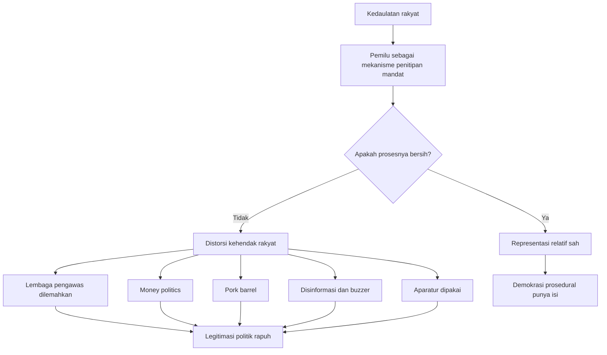
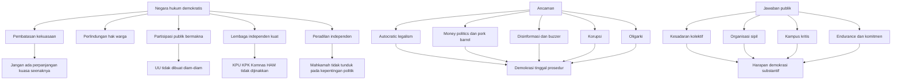

## ⚖️ Pendahuluan: Masalah Kita Bukan Sekadar “Ada Hukum”, tetapi Hukum Itu Bekerja untuk Siapa

Kita sering diajari satu kalimat yang terdengar sangat meyakinkan: **Indonesia adalah negara hukum**. Kalimat itu ada di konstitusi, di buku pelajaran, di pidato pejabat, di ruang kuliah, dan di hampir semua upacara retoris tentang ketatanegaraan. Tetapi justru karena terlalu sering diulang, kalimat itu menjadi terasa aman, steril, dan seolah-olah tidak perlu diperiksa lagi. Padahal, pertanyaan yang paling penting justru baru dimulai setelah kalimat itu selesai diucapkan.

Apa arti **negara hukum**? Apakah cukup berarti bahwa semua tindakan negara harus punya dasar peraturan? Kalau begitu, bagaimana bila peraturan itu sendiri dibuat untuk menguntungkan penguasa, menyingkirkan lawan, mengunci partisipasi publik, atau memutihkan tindakan yang secara moral dan politis busuk? Apakah negara tetap bisa disebut negara hukum hanya karena penindasannya dibungkus dalam bentuk undang-undang? ⚖️

Di titik inilah kuliah umum Dr. Zainal Arifin Mochtar menjadi menarik. Ia tidak memulai dari bahasa hukum yang rumit, melainkan dari penyederhanaan yang justru sangat tajam. Hukum tata negara, katanya, pada dasarnya hanya berputar di dua poros besar:

- **kuasa** *(power / kekuasaan)*
- **hak warga negara**

Dua hal itu tampak sederhana, tetapi sesungguhnya di situlah seluruh problem ketatanegaraan berkumpul. Negara, konstitusi, lembaga, pemilu, pengadilan, korupsi, demokrasi, partai politik, oposisi, sampai partisipasi publik—semuanya pada akhirnya kembali ke pertanyaan:

1. siapa yang memegang kuasa?
2. bagaimana kuasa itu dibatasi?
3. bagaimana hak warga dijaga dari kuasa yang berlebihan?

Dan dari sana kita mulai melihat problem Indonesia dengan lebih jernih. Problem kita bukan semata ketiadaan hukum. Justru sering kali masalahnya adalah **terlalu banyak hukum yang dipakai secara instrumental**—yakni hukum yang bukan dibangun untuk keadilan, melainkan untuk membenarkan kehendak penguasa. Problem kita bukan absennya demokrasi prosedural belaka. Problem kita adalah demokrasi yang sering tampak hidup di permukaan, tetapi rapuh di lapisan substantifnya.

Dengan kata lain, Indonesia bisa tampak tertib secara formal, tetapi sakit secara konstitusional. Ia bisa punya pemilu, punya undang-undang, punya lembaga, punya mahkamah, bahkan punya retorika hak asasi—tetapi semua itu belum otomatis berarti bahwa kuasa sungguh dibatasi dan hak warga sungguh dilindungi.

Esai ini akan mengembangkan gagasan-gagasan pokok dari kuliah tersebut ke dalam bentuk pembacaan yang lebih luas dan lebih mendalam. Fokus utamanya adalah ini:

> **mengapa sebuah negara bisa tampak demokratis dan legal di permukaan, tetapi tetap rapuh secara substantif karena hukum dijadikan alat kekuasaan, pemilu didistorsi, lembaga pengawas dilemahkan, dan publik dijauhkan dari partisipasi yang bermakna.**

Untuk membedah persoalan itu, kita akan bergerak melalui beberapa lapisan:

- apa itu negara hukum dan mengapa definisi formal saja tidak cukup,
- bagaimana demokrasi seharusnya bekerja dalam kerangka pembatasan kuasa,
- bagaimana autocratic legalism *(legalisme otokratik / penggunaan hukum untuk membenarkan otoritarianisme)* tumbuh,
- bagaimana pemilu bisa tetap berlangsung tetapi mengalami distorsi,
- bagaimana korupsi dan oligarki mengubah negara menjadi mesin rente,
- mengapa lembaga independen dan lembaga peradilan menjadi medan rebutan,
- dan mengapa harapan pada akhirnya tidak boleh diletakkan hanya pada negara, melainkan harus dikembalikan kepada publik yang sadar, terorganisasi, dan sabar.

Karena itu, artikel ini bukan sekadar ringkasan kuliah. Ini adalah upaya memahami satu kenyataan pahit: bahwa negara hukum bisa membusuk dari dalam, bukan ketika hukum hilang, tetapi justru ketika hukum dipelintir menjadi baju resmi dari penyalahgunaan kekuasaan. 😶

---

<Callout type="important" title="Tesis utama artikel ini">
Negara hukum tidak bisa diukur hanya dari keberadaan aturan, pemilu, atau lembaga formal. Ia baru layak disebut sehat bila kekuasaan benar-benar dibatasi, partisipasi publik bermakna, hak warga dilindungi, dan hukum tidak dipakai sekadar sebagai alat untuk melegalkan kehendak penguasa.
</Callout>

---

## 🏛️ 1. Hukum Tata Negara Selalu Berputar pada Dua Hal: Kuasa dan Hak

Salah satu penyederhanaan paling berguna dari kuliah ini adalah pengakuan bahwa hukum tata negara pada akhirnya berbicara tentang dua hal saja: **kuasa** dan **hak**. 🏛️

Ini penting, karena banyak orang mengira hukum tata negara itu semata-mata urusan pasal, kelembagaan, jabatan, prosedur, dan tata administrasi kekuasaan. Semua itu memang penting, tetapi itu baru kulitnya. Dagingnya tetap sama: siapa berkuasa, bagaimana kuasa itu didapat, bagaimana kuasa itu dijalankan, dan bagaimana kuasa itu dibatasi agar tidak melanggar hak warga.

Maka kalau kita mau melihat kesehatan konstitusi sebuah negara, ada dua pertanyaan dasar yang tidak pernah boleh hilang:

### A. Bagaimana kekuasaan diatur?
Apakah ia terkonsentrasi? Apakah ada pemisahan? Apakah ada saling kontrol? Apakah ada pembatasan masa jabatan? Apakah ada oposisi? Apakah ada mekanisme koreksi?

### B. Bagaimana hak warga dijaga?
Apakah warga bebas berserikat? Bebas mengkritik? Bebas mendapat perlindungan hukum? Bebas dari represi? Apakah kelompok minoritas dilindungi? Apakah kebebasan sipil sungguh dijamin?

Negara yang tidak demokratis biasanya berbicara sangat banyak tentang kuasa, sangat sedikit tentang hak. Negara demokratis seharusnya menyeimbangkan keduanya, bahkan lebih jauh lagi: membuat kuasa tunduk pada perlindungan hak.

Dengan bahasa yang lebih tajam, kita bisa bilang begini:

> **semua konstitusi yang baik pada dasarnya adalah dokumen ketidakpercayaan terhadap kekuasaan.**

Ia tidak dibuat untuk memuji penguasa. Ia dibuat justru karena penguasa berbahaya bila dibiarkan tanpa pagar.

---

## 📜 2. Mengapa Definisi Formal tentang Negara Hukum Tidak Pernah Cukup

Di tingkat paling sederhana, negara hukum sering dijelaskan sebagai negara yang berdasar hukum. Kalimat ini benar, tetapi terlalu dangkal bila berhenti di sana. 📜

Sebab, kalau kita terlalu puas dengan definisi itu, maka negara yang menindas pun bisa tetap mengaku sebagai negara hukum. Mengapa? Karena ia tinggal membuat aturan yang melegalkan penindasan tersebut.

Di sinilah kita perlu membedakan antara:

- **rule by law** *(negara menggunakan hukum sebagai alat kendali)*
- dan **rule of law** *(hukum benar-benar menjadi pembatas kekuasaan dan pelindung publik)*

Perbedaan ini sangat penting.

Dalam **rule by law**, hukum bisa menjadi instrumen kekuasaan. Penguasa ingin sesuatu, lalu membuat aturan untuk membenarkannya. Secara formal tampak sah, tetapi secara substantif ia bisa kejam, manipulatif, dan antidemokratis.

Dalam **rule of law**, hukum bukan hanya alat pemerintah, tetapi juga pagar bagi pemerintah. Ia mengikat penguasa, melindungi warga, dan harus lahir dari proses yang adil, rasional, partisipatif, serta terukur secara moral dan konstitusional.

Masalah besar Indonesia—dan banyak negara lain—adalah bahwa kita sering menyebut **rule of law**, padahal yang bekerja justru **rule by law**. Negara memakai bentuk hukum, tetapi substansinya diarahkan untuk kepentingan yang sempit.

---

## 🧨 3. Autocratic Legalism: Ketika Otoritarianisme Datang dengan Map Resmi dan Pasal Lengkap

Salah satu konsep yang penting untuk memahami zaman ini adalah **autocratic legalism** *(legalisme otokratik)*. 🧨

Artinya sederhana tetapi mengerikan: penguasa tidak selalu membunuh demokrasi dengan tank, kudeta, atau pembubaran parlemen. Kadang ia membunuh demokrasi dengan:

- undang-undang,
- prosedur formal,
- putusan lembaga,
- dan bahasa legal yang tampak rapi.

Ini jauh lebih berbahaya karena memberi kesan bahwa semua berjalan normal.

Autokrat modern tidak selalu berkata, “Saya anti-hukum.” Sebaliknya, ia berkata, “Saya justru menjalankan hukum.” Tetapi hukum itu:
- dibuat tergesa-gesa,
- disusun tanpa partisipasi bermakna,
- diarahkan pada kepentingan kekuasaan,
- dan dipakai untuk memukul lawan atau memperluas dominasi.

Dengan kata lain, autokrasi hari ini sering tampil bukan sebagai kekacauan, tetapi sebagai **administrasi yang tampak sah**.

Inilah sebabnya definisi negara hukum yang terlalu formal sangat berbahaya. Sebab ia bisa dipakai oleh rezim yang buruk untuk berkata: “Kami sah, karena semua ada aturannya.”

Padahal pertanyaan yang lebih dalam adalah:

- siapa membuat aturannya?
- untuk siapa aturannya?
- dengan proses apa ia dibuat?
- siapa yang diuntungkan?
- siapa yang disingkirkan?

Kalau pertanyaan-pertanyaan ini tidak diajukan, maka hukum mudah sekali berubah dari pelindung publik menjadi senjata resmi penguasa.

---

## 👥 4. Bryan Tamanaha dan Pelajaran Penting: Negara Hukum Harus Punya Isi Sosial, Bukan Sekadar Bentuk Formal

Dalam kuliah tersebut disebut pemikiran **Brian/Bryan Tamanaha**, yang sangat berguna untuk membedakan versi formal dan versi substantif dari negara hukum. 👥

Secara sederhana, versi formal dari negara hukum hanya menekankan bahwa pemerintah bertindak berdasarkan hukum. Tetapi versi substantif bertanya lebih jauh:

- apakah hukum itu demokratis?
- apakah hukum itu partisipatif?
- apakah ia mengandung cita kesejahteraan sosial?
- apakah ia melindungi hak?
- apakah ia lahir dari *public consent* *(persetujuan publik)* yang bermakna?

Dari sini kita belajar sesuatu yang krusial:

> **hukum yang baik tidak cukup hanya tertulis; ia harus juga punya legitimasi demokratis dan orientasi sosial.**

Itulah mengapa partisipasi publik menjadi sangat penting dalam pembentukan undang-undang. Bila hukum dibentuk secara sembunyi-sembunyi, terburu-buru, dan tertutup, maka kita patut curiga bahwa hukum itu sedang dipersiapkan bukan untuk publik, melainkan untuk pihak-pihak tertentu.

Dalam kerangka ini, negara hukum sejati tidak bisa dipisahkan dari demokrasi. Dan demokrasi pun tidak boleh direduksi menjadi sekadar pemilu lima tahunan. Demokrasi harus hadir dalam cara hukum dibuat, dijalankan, dan diawasi.

---

## 🗳️ 5. Empat Kerja dalam Pembentukan Undang-Undang: Mengapa Partisipasi Tidak Boleh Menjadi Formalitas

Salah satu bagian paling penting dari kuliah ini adalah penegasan bahwa pembentukan undang-undang setidaknya memuat empat jenis kerja:

- **kerja teknokratis** *(riset, data, naskah akademik, analisis kebijakan)*
- **kerja politis** *(negosiasi, perdebatan, representasi kepentingan di parlemen)*
- **kerja ideologis** *(kesesuaian dengan Pancasila, UUD, arah dasar negara)*
- **kerja partisipatif** *(keterlibatan publik yang nyata)*

Kalau hanya tiga yang pertama yang berjalan, hukum bisa tetap terlihat rapi. Tetapi tanpa yang keempat, ia kehilangan roh demokratisnya. 🗳️

Partisipasi tidak boleh dimaknai sempit sebagai:
- seminar formal,
- notulensi tempelan,
- undangan terbatas,
- atau “sudah kami sosialisasikan”.

Partisipasi harus berarti bahwa publik yang terdampak:
- mengetahui isi rancangan,
- punya waktu membaca,
- dapat ruang memberi masukan,
- dan masukan itu sungguh dipertimbangkan.

Kalau draft disembunyikan, pembahasan dipercepat, dan kritik dianggap gangguan, maka hukum sedang digerakkan melawan demokrasi.

Itulah mengapa contoh-contoh pembentukan undang-undang secara kilat dan tertutup menjadi sangat problematik. Ia bukan hanya persoalan etika legislasi, tetapi persoalan konstitusional yang sangat serius. Sebab ketika hukum lahir tanpa partisipasi, maka hukum itu sejak awal sudah cacat legitimasi.

---

## 🔒 6. Demokrasi Selalu Dimulai dari Kecurigaan terhadap Kekuasaan

Salah satu pelajaran tertua dalam teori politik adalah bahwa **kekuasaan itu berbahaya**. 🔒

Kalimat Lord Acton yang terkenal—*power tends to corrupt, absolute power corrupts absolutely*—terlalu sering dikutip hingga terdengar klise. Padahal ia tetap benar dan tetap relevan.

Mengapa demokrasi membutuhkan:
- **limitation of power** *(pembatasan kekuasaan)*,
- **checks and balances** *(saling mengawasi antarlembaga)*,
- **separation of powers** *(pemisahan kekuasaan)*,
- pembatasan masa jabatan,
- oposisi,
- kebebasan pers,
- dan peradilan independen?

Karena semua itu lahir dari satu asumsi sederhana: **penguasa tidak boleh dipercaya secara mutlak.**

Ini bukan sinisme. Ini justru fondasi demokrasi. Sistem demokratis tidak dibangun di atas keyakinan bahwa pemimpin pasti baik, melainkan di atas kesadaran bahwa bahkan pemimpin yang awalnya tampak baik pun bisa tergoda, mabuk kuasa, atau dikelilingi kepentingan yang korosif.

Kekuasaan meninabobokan. Kekuasaan membuat orang merasa dirinya identik dengan negara. Kekuasaan membuat kritik tampak sebagai ancaman. Kekuasaan membuat aturan dianggap sekadar alat. Dan karena itu, pembatasan kekuasaan bukan penghinaan pada negara—melainkan syarat agar negara tidak berubah menjadi predator bagi warganya sendiri.

---

## ⏳ 7. Bahaya Masa Jabatan yang Ingin Terus Dipanjangkan

Salah satu penyakit klasik sistem presidensial adalah godaan **perpanjangan kekuasaan**. ⏳

Dalam kuliah ini, Zainal Arifin Mochtar menekankan bahwa salah satu bentuk bahaya utama datang ketika penguasa tergoda menerabas batas konstitusi, terutama soal masa jabatan. Ini bukan khas Indonesia. Banyak negara mengalami gejala serupa.

Kenapa itu terjadi?

Setidaknya ada dua kondisi yang membuat godaan ini membesar:

### A. Dukungan partai politik yang terlalu besar
Kalau hampir semua partai ada dalam orbit kekuasaan, maka hambatan formal terhadap ambisi penguasa menjadi lemah.

### B. Popularitas publik yang terlalu tinggi
Popularitas yang besar, apalagi dibungkus kultus personal, bisa mendorong ilusi bahwa penguasa adalah “kehendak rakyat” itu sendiri.

Ketika dua hal ini bertemu, godaan otoritarian menjadi sangat tinggi. Penguasa mulai berpikir bahwa pembatasan konstitusi hanyalah gangguan teknis terhadap mandat historisnya.

Padahal justru pembatasan itulah inti demokrasi. Konstitusi dibuat bukan untuk saat orang jahat berkuasa saja, tetapi justru untuk saat orang populer berkuasa. Sebab orang populer punya kapasitas paling besar untuk memobilisasi pembenaran terhadap pelanggaran batas.

---

## 🚨 8. State of Exception: Bagaimana Keadaan Darurat Sering Dipakai untuk Melewati Konstitusi

Dalam pemikiran Giorgio Agamben, ada konsep **state of exception** *(keadaan pengecualian / situasi darurat yang dipakai untuk menangguhkan hukum normal)*. 🚨

Secara teori, keadaan darurat memang kadang diperlukan. Tetapi dalam politik nyata, keadaan darurat sering dipakai sebagai alasan untuk:
- memperluas kekuasaan eksekutif,
- membatasi partisipasi,
- mempercepat legislasi,
- dan menggeser standar demokratis yang normal.

Ini berbahaya karena publik sering sulit menolak narasi krisis. Ketika orang dibuat takut, mereka lebih mudah menerima perluasan kewenangan negara.

Masalahnya, krisis bisa dikelola bukan hanya sebagai realitas, tetapi juga sebagai teknik politik. Dalam konteks ini, hukum darurat dapat berubah menjadi pintu belakang bagi normalisasi tindakan yang seharusnya tidak boleh dilakukan dalam keadaan biasa.

Negara yang sehat tentu harus bisa bertindak di masa krisis. Tetapi negara demokratis juga harus memastikan bahwa krisis tidak dijadikan dalih permanen untuk memperlebar otoritas dan menipiskan akuntabilitas.

---

## 🧾 9. Pemilu sebagai Titipan Kedaulatan: Mengapa Distorsi Pemilu Berarti Distorsi Kehendak Rakyat

Salah satu bagian paling mendasar dari kuliah ini adalah cara menjelaskan pemilu. Kedaulatan dalam demokrasi berada di tangan rakyat. Tetapi rakyat tidak bisa menjalankan semuanya sendiri setiap hari. Maka kedaulatan itu **dititipkan** melalui mekanisme perwakilan dan pemilu. 🧾

Kata kuncinya: **dititipkan, bukan diserahkan secara mutlak.**

Artinya:
- rakyat tetap pemilik kedaulatan,
- pemerintah hanya menjalankan mandat,
- dan pemilu adalah mekanisme penitipan itu.

Karena itu, bila pemilu didistorsi, maka yang rusak bukan sekadar kompetisi elektoral. Yang rusak adalah mekanisme utama di mana rakyat menitipkan kuasanya.

Inilah mengapa politik uang, disinformasi, penggunaan aparatur, manipulasi anggaran, dan pelemahan pengawas pemilu adalah masalah yang sangat serius. Itu bukan “bumbu politik”. Itu adalah tindakan yang merusak fondasi legitimasi demokratis.

---

## 💸 10. Money Politics dan Pork Barrel: Dari Suap Langsung sampai Bantuan yang Dibungkus Populis

Pemilu bisa dirusak secara terang-terangan maupun secara lebih halus. 💸

Bentuk paling kasar tentu **money politics** *(politik uang)*: suara dibeli dengan uang, sembako, atau bentuk pemberian langsung lain. Dalam situasi ketimpangan ekonomi tinggi, praktik ini sangat mudah bekerja karena kebutuhan sehari-hari sering lebih mendesak daripada abstraksi tentang masa depan demokrasi.

Tetapi ada bentuk yang lebih licin, yakni **pork barrel** *(penggunaan anggaran atau distribusi sumber daya negara untuk mengamankan loyalitas politik)*. Ini tampak legal, tetapi secara moral-politik sangat problematik bila dipakai menjelang pemilu untuk mengarahkan preferensi publik.

Perbedaannya kira-kira begini:
- politik uang langsung: suap terang-terangan,
- pork barrel: insentif negara yang secara timing dan desain diarahkan untuk keuntungan politik tertentu.

Inilah sebabnya pembatasan kewenangan penguasa menjelang pemilu sangat penting. Kalau tidak, negara bisa berubah menjadi mesin kampanye raksasa yang dibiayai oleh uang publik.

---

## 📣 11. Buzzer, Disinformasi, dan Manufacturing Consent di Era Digital

Salah satu ancaman paling besar terhadap demokrasi kontemporer adalah bahwa opini publik tidak lagi dibentuk terutama oleh argumentasi, tetapi oleh **arsitektur manipulasi informasi**. 📣

Dalam kuliah ini, gejala buzzer dan disinformasi disebut sebagai bagian penting dari distorsi demokrasi. Dan ini memang benar. Buzzer bukan sekadar akun ribut. Ia bagian dari ekosistem yang bekerja untuk:
- membanjiri ruang publik,
- menggiring emosi,
- menciptakan ilusi dukungan organik,
- memecah fokus,
- dan memproduksi persetujuan yang seolah-olah alami.

Di sini relevan sekali gagasan Noam Chomsky tentang **manufacturing consent** *(memproduksi persetujuan)*. Persetujuan publik tidak selalu lahir dari pertimbangan bebas. Ia bisa direkayasa melalui pengulangan, framing *(pembingkaian)*, ketakutan, citra, dan distribusi informasi yang tidak seimbang.

Masalahnya menjadi lebih serius di era media sosial, karena:
- kecepatan mengalahkan kedalaman,
- klip 30 detik mengalahkan pembacaan serius,
- gimmick *(gimmick / kemasan sensasional)* mengalahkan argumentasi,
- dan emosi mengalahkan verifikasi.

Demokrasi digital lalu berisiko menjadi demokrasi yang bising, tetapi dangkal. Sangat ramai, tetapi tidak sungguh deliberatif.

---

---

## 🏢 12. Mengapa Lembaga Negara Independen Dibutuhkan, dan Mengapa Justru Mereka Sering Dilemahkan

Reformasi melahirkan banyak **lembaga negara independen**. Ide dasarnya sederhana: negara terlalu besar dan terlalu berbahaya jika semua fungsi pengawasan disimpan di dalam tubuhnya sendiri. Maka sebagian fungsi disapih, dipisahkan, dan dipercayakan ke lembaga yang relatif otonom. 🏢

Contohnya:
- KPU untuk penyelenggaraan pemilu,
- KPK untuk pemberantasan korupsi,
- Komnas HAM untuk hak asasi manusia,
- KY untuk pengawasan etik peradilan,
- dan lain-lain.

Logika pembentukannya jelas: jika pengawas berada sepenuhnya di tangan yang diawasi, maka kontrol mudah lumpuh.

Tetapi problemnya, lembaga-lembaga ini kemudian sering mengalami:
- domestikasi,
- kooptasi,
- pelemahan kewenangan,
- intervensi politik,
- atau perubahan desain yang membuat mereka kehilangan taring.

Ini pola klasik. Setiap rezim yang ingin memperluas kuasa akan berusaha menaklukkan bukan hanya lawan politik, tetapi juga institusi yang dirancang untuk membatasi kekuasaan itu.

Karena itu, pelemahan lembaga independen bukan sekadar soal birokrasi. Ia adalah indikator penting tentang apakah sebuah rezim nyaman hidup di bawah pengawasan, atau justru ingin pengawasan itu dijinakkan.

---

## 🧷 13. KPK, KPU, dan Logika Pelemahan yang Sistematis

Kuliah ini menyorot dua contoh penting: **KPU** dan **KPK**. 🧷

### KPU
Sebagai penyelenggara pemilu, KPU seharusnya menjadi pengawal fairness *(keadilan prosedural)* demokrasi. Tetapi ketika penyelenggara itu sendiri dipersepsikan bermain, maka kepercayaan publik runtuh. Pemilu tetap berjalan, tetapi legitimasi moralnya terluka.

### KPK
KPK didirikan dengan asumsi bahwa lembaga lama—kepolisian dan kejaksaan—tidak cukup efektif dan tidak cukup independen untuk memberantas korupsi secara luar biasa. Maka dibentuklah lembaga khusus dengan kewenangan khusus.

Tetapi bila kemudian:
- independensinya dipotong,
- penyadapan dipersulit,
- status kelembagaannya diubah,
- dan logika kerjanya diserap kembali ke pola lama,

maka yang terjadi bukan pembaruan sistem, melainkan penjinakan lembaga. Hasilnya: lembaga yang dulu dibentuk untuk memperbaiki sistem justru terdorong menjadi mirip dengan sistem yang tadinya hendak diperbaiki.

Ini sangat ironis. Harapannya dulu adalah lembaga lama belajar dari KPK. Yang terjadi justru sering terasa sebaliknya: KPK dipaksa menyesuaikan diri dengan logika lama.

---

## 🏛️ 14. Mahkamah, Etika, dan Krisis Kepercayaan Konstitusional

Di negara demokratis, ketika politik terlalu kasar dan legislasi terlalu bias, publik sering berharap pada lembaga yudisial. Karena itulah independensi pengadilan menjadi sangat penting. 🏛️

Tetapi apa yang terjadi bila pengadilan sendiri terseret ke pusaran kepentingan?

Maka yang runtuh bukan hanya satu putusan. Yang runtuh adalah **kepercayaan konstitusional**.

Krisis seperti ini sangat dalam karena mahkamah seharusnya menjadi benteng terakhir. Ketika benteng itu retak, publik merasa bahwa tidak ada lagi ruang netral tempat hukum bisa berbicara melampaui kekuasaan.

Krisis yudisial seperti itu biasanya punya efek berlapis:
- publik menjadi sinis terhadap hukum,
- politik makin berani menerabas,
- dan konstitusi tampak tidak lagi sebagai pembatas sungguh-sungguh.

Ini sebabnya skandal etik atau putusan-putusan yang tampak menguntungkan relasi kekuasaan tertentu bukan perkara kecil. Ia adalah pukulan langsung pada imajinasi publik tentang keadilan konstitusional.

---

## 💰 15. Korupsi Bukan Sekadar Soal Maling Uang Negara, tetapi Mekanisme Pelemahan Demokrasi

Sering kali korupsi dibahas secara sempit sebagai tindakan mengambil uang negara. Padahal efeknya jauh lebih besar. 💰

Korupsi:
- mengubah kebijakan publik menjadi alat transaksi,
- menggeser orientasi jabatan dari pelayanan ke rente,
- memperlemah institusi,
- menurunkan kualitas hukum,
- memperbesar ketimpangan,
- dan membuat publik kehilangan kepercayaan pada demokrasi.

Lebih dari itu, korupsi mengubah negara dari alat distribusi keadilan menjadi **alat pembagian keuntungan**. Pejabat tidak lagi berpikir bagaimana memimpin negara, tetapi bagaimana mengekstrak manfaat dari posisinya.

Inilah mengapa korupsi sebetulnya bukan penyakit tambahan. Ia sering menjadi jantung dari kerusakan sistemik itu sendiri.

Negara yang sangat korup cenderung sulit sungguh-sungguh demokratis, karena semua proses politik di sana terdorong untuk balik modal, membangun jaringan patronase, dan memelihara loyalitas melalui distribusi rente.

---

## 🪙 16. Oligarki: Ketika Kekayaan Memakai Negara untuk Membela Diri Sendiri

Salah satu bagian paling tajam dalam kuliah ini adalah pembicaraan tentang **oligarki**. 🪙

Secara sederhana, oligarki bukan sekadar orang kaya. Oligarki adalah kelompok kaya yang punya akses nyata pada struktur kekuasaan dan mampu memakai kekayaannya untuk memengaruhi negara.

Jeffrey Winters menyebut oligarki sebagai **wealth defense industry** *(industri pembelaan kekayaan)*. Ini ungkapan yang sangat kuat. Artinya, kekayaan besar tidak diam. Ia aktif membangun mekanisme pertahanan diri:
- membiayai politik,
- menanam pengaruh,
- membentuk kebijakan,
- mengamankan akses sumber daya,
- dan memastikan negara tidak mengancam akumulasi mereka.

Dalam negara kaya sumber daya seperti Indonesia, oligarki sering sangat kuat karena akses ke sumber daya alam berarti akses ke rente yang sangat besar.

Maka bila pejabat dan pengusaha menyatu, atau setidaknya bersekutu sangat erat, negara mudah berubah menjadi arena pertukaran kepentingan antara jabatan dan modal.

Di titik ini, demokrasi bisa tetap ada secara prosedural. Tetapi substansinya digerus. Mengapa? Karena keputusan politik tidak lagi terutama diarahkan untuk kepentingan warga, melainkan untuk melindungi dan memperluas konsentrasi kekayaan.

---

## 📉 17. Mengapa Demokrasi Indonesia Bisa Tetap Berjalan Secara Prosedural tetapi Jeblok Secara Substantif

Inilah salah satu kesimpulan paling penting: Indonesia bisa punya pemilu, punya partai, punya aturan, punya lembaga, dan tetap saja kualitas demokrasinya lemah. 📉

Mengapa? Karena demokrasi punya dua wajah:

### A. Demokrasi prosedural
Apakah ada pemilu? Apakah ada partai? Apakah ada mekanisme pergantian kekuasaan? Apakah struktur formalnya ada?

### B. Demokrasi substantif
Apakah warga sungguh bebas? Apakah hukum adil? Apakah partisipasi bermakna? Apakah hak sipil terlindungi? Apakah institusi bekerja independen? Apakah kebijakan lahir dari orientasi publik?

Negara bisa tampak lumayan di sisi prosedural tetapi jeblok di sisi substantif. Dan justru inilah bahaya besar demokrasi modern: ia bisa mempertahankan kulitnya sambil kehilangan isi.

Masyarakat lalu melihat pemilu masih ada, parlemen masih ada, mahkamah masih ada, partai masih ada—sehingga seolah semuanya baik-baik saja. Padahal dalam, demokrasi itu sudah dikosongkan.

---

## 🎓 18. Kampus, Intelektual, dan Bahaya Menjadi Pengkhianat Pengetahuan

Bagian akhir kuliah ini menjadi sangat penting ketika Zainal Arifin Mochtar berbicara tentang kampus, mahasiswa, dan kaum intelektual. 🎓

Dalam sejarah modern, kampus bukan hanya tempat produksi gelar. Ia seharusnya menjadi ruang:
- kritik,
- koreksi moral,
- pembongkaran manipulasi,
- dan pembentukan bahasa publik yang lebih jujur.

Karena itu, ketika kampus diam di hadapan penyimpangan, atau terlalu cepat berkompromi dengan kekuasaan, maka terjadi sesuatu yang lebih buruk daripada sekadar netralitas. Terjadi **pengkhianatan intelektual**.

Intelektual yang berhenti kritis dan mulai menyesuaikan seluruh pikirannya demi kenyamanan dengan penguasa adalah ancaman serius bagi republik. Sebab masyarakat sering masih berharap pada mereka untuk menamai kerusakan dengan jujur.

Ini sebabnya kampus seperti ITB, UGM, UI, dan universitas besar lain punya posisi simbolik yang kuat. Bila mereka bersuara, getarannya berbeda. Bukan karena mereka suci, tetapi karena secara historis mereka menempati posisi penting dalam pembentukan opini, elit kebijakan, dan moral publik.

---

## 🌱 19. Harapan Tidak Boleh Dititipkan pada Negara Saja; Ia Harus Dikembalikan kepada Publik

Salah satu kalimat paling penting dari kuliah ini adalah bahwa harapan jangan diletakkan hanya pada negara. Harapan harus dikembalikan kepada publik. 🌱

Ini bukan berarti negara tidak penting. Negara tetap penting. Tetapi ketika negara terlalu larut dalam logika mempertahankan kuasa, mengejar rente, merawat apatisme, dan menutup partisipasi, maka energi demokrasi harus datang dari masyarakat sendiri.

Apa bentuknya?

Bukan semata-mata kerusuhan. Bukan juga romantisme revolusi kosong. Tetapi:
- membangun kelompok belajar,
- membangun komunitas diskusi,
- membaca dengan serius,
- mengorganisasi kritik,
- memproduksi pengetahuan tandingan,
- mengawal kebijakan,
- menguatkan masyarakat yang dimiskinkan secara struktural,
- dan membangun ketahanan sipil dalam jangka panjang.

Ini terasa tidak heroik. Tidak dramatis. Tetapi justru inilah kerja demokrasi yang paling penting.

Revolusi besar pun sering lahir dari kerja intelektual dan sosial yang tampak sepele di awal: percakapan, pembacaan, pengorganisasian, kesadaran, dan kesabaran.

---

---

## 🛠️ 20. Endurance, Komitmen, dan Kesabaran: Demokrasi Tidak Diperbaiki dengan Satu Ledakan

Bagian yang sangat menyentuh dari kuliah ini adalah penekanan pada **endurance** *(daya tahan)*, **komitmen**, dan **kesabaran generatif**. 🛠️

Ini penting sekali. Banyak orang ingin perubahan cepat, total, dan dramatik. Tetapi pembusukan institusi tidak terjadi sehari. Maka pemulihannya pun tidak akan terjadi lewat satu teriakan besar.

Ada tiga hal yang sangat penting di sini:

### A. Endurance
Perlawanan demokratis harus tahan lama. Ia bukan semangat seminggu. Bukan gelombang musiman. Bukan hanya respons emosional ketika kasus sedang viral.

### B. Komitmen
Komitmen berarti tidak menjadi pengkhianat dalam level sehari-hari. Tidak bisa bicara antikorupsi, lalu dalam urusan kecil tetap mengandalkan suap. Demokrasi bukan cuma wacana besar. Ia juga etika kebiasaan.

### C. Kesabaran generatif
Apa yang kita tanam sekarang mungkin tidak kita nikmati besok. Tetapi tanpa penanaman sekarang, generasi sesudah kita tidak akan mendapat apa-apa.

Ini pengingat yang sangat penting. Demokrasi yang sehat bukan proyek konsumsi cepat. Ia proyek antar-generasi.

---

## 🚢 21. Kapal Tidak Dibuat untuk Ditambatkan di Dermaga

Bagian penutup kuliah ini memakai metafora yang sangat kuat: **kapal tidak dibuat untuk ditambatkan di dermaga**. 🚢

Ia tampak indah di dermaga, tetapi fungsi sejatinya adalah menghadapi gelombang dan membelah lautan.

Metafora ini sangat tepat untuk mahasiswa, intelektual, dan warga negara. Pendidikan tinggi bukan semata-mata alat naik kelas sosial. Ia seharusnya juga membentuk keberanian untuk:
- mengenali problem republik,
- menolak normalisasi kebusukan,
- dan ikut mengambil posisi dalam sejarah.

Artinya bukan semua orang harus turun ke jalan setiap saat. Tetapi semua orang harus sadar bahwa hidup kewargaan menuntut keberanian tertentu. Demokrasi tidak bertahan hanya karena ada teks konstitusi. Ia bertahan karena ada warga yang tidak rela konstitusi dijadikan dekorasi.

---

## ✨ Kesimpulan: Indonesia Tidak Kekurangan Aturan; Indonesia Kekurangan Pembatasan Kuasa yang Efektif dan Partisipasi Publik yang Bermakna

Setelah menelusuri seluruh pembahasan ini, kita bisa sampai pada satu kesimpulan besar: persoalan Indonesia bukan terutama bahwa kita tidak punya hukum, tidak punya pemilu, atau tidak punya lembaga. Kita punya semua itu. ✨

Masalahnya adalah bahwa:
- hukum bisa dipakai secara instrumental,
- pemilu bisa didistorsi,
- lembaga independen bisa dijinakkan,
- pengadilan bisa kehilangan wibawa,
- korupsi bisa menstrukturkan negara,
- oligarki bisa membajak kebijakan,
- dan publik bisa dibuat apatis lewat manipulasi, ketimpangan, dan pembodohan sistematis.

Itulah mengapa Indonesia bisa tampak demokratis tetapi tetap rapuh secara substantif.

Maka tugas besar kita bukan sekadar mempertahankan prosedur, tetapi mengembalikan isi dari demokrasi itu sendiri. Dan isi itu hanya mungkin hadir bila:

- kekuasaan sungguh dibatasi,
- hukum sungguh melindungi,
- partisipasi publik sungguh bermakna,
- kampus tetap kritis,
- lembaga pengawas tetap independen,
- dan masyarakat sipil tetap hidup sebagai kekuatan korektif.

Kalau tidak, negara hukum akan tinggal menjadi slogan, demokrasi tinggal menjadi ritual, dan konstitusi tinggal menjadi dokumen yang dibacakan tetapi tidak ditaati rohnya.

Karena itu, harapan memang tidak boleh mati. Tetapi harapan juga tidak boleh malas. Harapan harus bekerja. Harapan harus terorganisasi. Harapan harus tahan lama. Dan di atas semua itu, harapan harus berani berkata bahwa republik ini tidak akan membaik hanya karena penguasa berjanji, melainkan karena publik memaksa standar demokrasi tetap hidup. 🌿

---

<Callout type="quote" title="Kalimat inti artikel ini">
Demokrasi tidak runtuh hanya ketika pemilu dibatalkan; ia juga bisa runtuh ketika pemilu tetap ada, hukum tetap dipakai, lembaga tetap berdiri, tetapi semuanya pelan-pelan dikosongkan dari makna substantifnya.
</Callout>

<Callout type="tip" title="Cara membaca krisis ketatanegaraan Indonesia">
Jangan hanya bertanya: “apakah ada aturannya?” Tanyakan juga: siapa yang membuat aturan itu, untuk kepentingan siapa, melalui proses apa, dan apakah warga sungguh ikut menentukan. Di sanalah kualitas negara hukum yang sebenarnya diuji.
</Callout>

<Callout type="cite" title="Sumber pengembangan artikel">
Artikel ini dikembangkan dari transcript Studium Generale Dr. Zainal Arifin Mochtar tentang konsep negara hukum dan demokrasi dalam sistem konstitusi modern Indonesia, lalu diperluas menjadi esai analitis mengenai legalisme otokratik, pembatasan kekuasaan, distorsi pemilu, korupsi, oligarki, pelemahan lembaga, dan peran publik dalam mempertahankan demokrasi substantif.
</Callout>
