## Prolog: Kamu Sudah Tahu Lebih Banyak dari yang Kamu Kira 🔍

> *"Every profound spirit needs a mask."*
> — Friedrich Nietzsche
> *(Setiap jiwa yang mendalam membutuhkan topeng.)*

Ada seseorang di depanmu — senyumnya sempurna, kata-katanya terukur, sikapnya meyakinkan. Tapi sesuatu di dalam dirimu berbisik: *"Ini bukan gambaran penuh darinya."*

Kamu benar.

Karena setiap manusia meninggalkan jejak. Bukan dalam kata-kata — kata-kata bisa dilatih, dipoles, direkayasa. Jejak yang sesungguhnya ada di **celah-celah**. Di cara seseorang tertawa terlalu lama. Di kecepatan mengganti topik saat sebuah pertanyaan mendekati titik sensitifnya. Di keheningan yang tiba-tiba muncul saat seharusnya ada jawaban.

Friedrich Nietzsche (*1844–1900*) — filsuf Jerman yang paling diperdebatkan dalam sejarah — menghabiskan hidupnya mempelajari celah-celah itu. Bukan untuk mengeksploitasi manusia, tapi untuk memahami mereka — dan pada akhirnya, untuk memahami diri sendiri.

Dalam video *"How to Read Anyone Instantly"*, 18 kebenaran psikologis Nietzsche dibedah menjadi peta yang bisa digunakan siapapun. Artikel ini tidak hanya menjelaskan ke-18 kebenaran itu — artikel ini akan **membongkar mengapa** kebenaran itu bekerja, menggunakan psikologi modern, neurosains, dan filsafat mendalam.

<Callout type="warning" title="⚠️ Sebelum Membaca">
Kemampuan membaca orang adalah **tanggung jawab**, bukan senjata.

Nietzsche tidak ingin kamu melihat tembus orang lain untuk *mengendalikan* mereka. Ia ingin kamu melihat tembus agar kamu berhenti **ditipu** — dan mulai benar-benar **terhubung**.

Gunakan peta ini dengan empati, bukan dengan keangkuhan.
</Callout>

---

## Fondasi: Mengapa Manusia Memakai Topeng 🎭

Sebelum masuk ke 18 kebenaran, kita perlu memahami premis dasarnya:

**Manusia tidak berbohong kepadamu. Mereka berbohong kepada diri mereka sendiri — dan sudah melakukannya jauh lebih lama.**

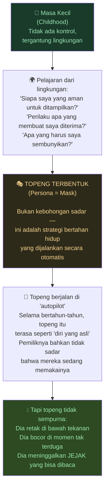
```mermaid
graph TD
    A["👶 Masa Kecil\n(Childhood)\nTidak ada kontrol,\ntergantung lingkungan"] --> B

    B["🌍 Pelajaran dari lingkungan:\n'Siapa saya yang aman untuk ditampilkan?'\n'Perilaku apa yang membuat saya diterima?'\n'Apa yang harus saya sembunyikan?'"] --> C

    C["🎭 TOPENG TERBENTUK\n(Persona = Mask)\n\nBukan kebohongan sadar —\nini adalah strategi bertahan hidup\nyang dijalankan secara otomatis"] --> D

    D["🔄 Topeng berjalan di 'autopilot'\nSelama bertahun-tahun, topeng itu\nterasa seperti 'diri yang asli'\nPemiliknya bahkan tidak sadar\nbahwa mereka sedang memakainya"] --> E

    E["💧 Tapi topeng tidak sempurna:\nDia retak di bawah tekanan\nDia bocor di momen tak terduga\nDia meninggalkan JEJAK yang bisa dibaca"]

    style A fill:#1a3a2a,color:#9ae6b4
    style C fill:#2d2a1a,color:#fbd38d
    style E fill:#2d4a22,color:#9ae6b4
```

Nietzsche menyebut ini ***Persona*** — kata Latin yang secara harfiah berarti "topeng". Topeng bukan kelemahan. Topeng adalah produk dari survival (*bertahan hidup*). Masalahnya: semakin lama kita memakai topeng, semakin kita lupa siapa yang ada di baliknya.

---

## BAGIAN I: Enam Kebenaran Pertama — Memahami Topeng 🎭

### Kebenaran #1: Semua Orang Memakai Topeng untuk Bertahan Hidup 😶‍🌫️

> *"Everyone wears a mask to survive. Not because they're fake, but because they're scared."*
> *(Semua orang memakai topeng untuk bertahan hidup. Bukan karena mereka palsu, tapi karena mereka takut.)*

**Penjelasan Mendalam:**

Untuk bertahan dalam masyarakat, manusia menciptakan versi diri yang mereka harap akan diterima. Tapi topeng tidak sempurna — dan **tanda kebenaran pertama adalah ketegangan (*tension*)**.

Amati:
- Saat apa seseorang tampak *tidak nyaman*?
- Topik apa yang membuat bahasa tubuh mereka berubah?
- Di mana mereka terlihat *berbeda* dari biasanya?

Di sinilah orang yang sesungguhnya mulai terlihat.

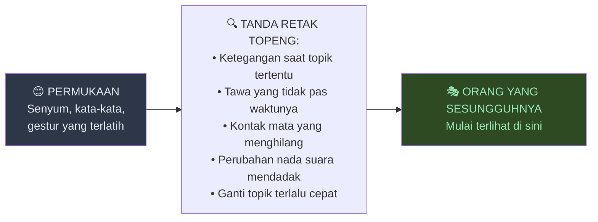
```mermaid
flowchart LR
    A["😊 PERMUKAAN\nSenyum, kata-kata,\ngestur yang terlatih"] --> B
    B["🔍 TANDA RETAK TOPENG:\n• Ketegangan saat topik tertentu\n• Tawa yang tidak pas waktunya\n• Kontak mata yang menghilang\n• Perubahan nada suara mendadak\n• Ganti topik terlalu cepat"] --> C
    C["🎭 ORANG YANG SESUNGGUHNYA\nMulai terlihat di sini"]

    style A fill:#2d3748,color:#e2e8f0
    style C fill:#2d4a22,color:#9ae6b4
```

**Contoh Nyata:**
Seseorang yang selalu terlihat ramah dan setuju dengan semua orang — amati reaksinya saat seseorang pertama kali tidak setuju dengannya. Ketidaknyamanan yang muncul itulah dirinya yang sesungguhnya berbicara.

---

### Kebenaran #2: Apa yang Dibenci Seseorang pada Orang Lain Mengungkapkan Apa yang Mereka Sembunyikan dalam Diri Sendiri 🪞

> *"What someone hates in others reveals what they're hiding in themselves."*
> *(Apa yang seseorang benci pada orang lain mengungkapkan apa yang mereka sembunyikan dalam diri sendiri.)*

Ini adalah konsep **proyeksi (*projection*)** — salah satu wawasan paling tajam Nietzsche.

**Mekanisme Proyeksi:**

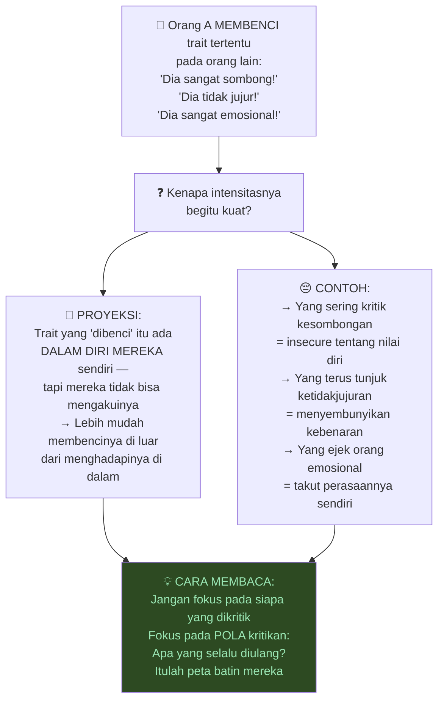
```mermaid
graph TD
    A["😤 Orang A MEMBENCI trait tertentu\npada orang lain:\n'Dia sangat sombong!'\n'Dia tidak jujur!'\n'Dia sangat emosional!'"] --> B

    B["❓ Kenapa intensitasnya\nbegitu kuat?"] --> C & D

    C["🔄 PROYEKSI:\nTrait yang 'dibenci' itu ada\nDALAM DIRI MEREKA sendiri —\ntapi mereka tidak bisa mengakuinya\n→ Lebih mudah membencinya di luar\ndari menghadapinya di dalam"] 

    D["😔 CONTOH:\n→ Yang sering kritik kesombongan\n   = insecure tentang nilai diri\n→ Yang terus tunjuk ketidakjujuran\n   = menyembunyikan kebenaran\n→ Yang ejek orang emosional\n   = takut perasaannya sendiri"]

    C & D --> E["💡 CARA MEMBACA:\nJangan fokus pada siapa yang dikritik\nFokus pada POLA kritikan:\nApa yang selalu diulang?\nItulah peta batin mereka"]

    style E fill:#2d4a22,color:#9ae6b4
```

<Callout type="tip" title="🧪 Latihan Proyeksi">
Cobalah ini pada diri sendiri:

1. Pikirkan tiga hal yang paling sering kamu kritik pada orang lain
2. Tanyakan: *"Apakah ada bagian dariku yang juga melakukan ini?"*
3. Jika jawabannya tidak nyaman — itu adalah proyeksimu sendiri

Nietzsche percaya bahwa kesadaran diri sejati dimulai di sini.
</Callout>

---

### Kebenaran #3: Keheningan Mengungkapkan Lebih Banyak dari Kata-Kata 🤫

> *"Silence is louder than speech."*
> *(Keheningan lebih keras dari ucapan.)*

Nietzsche tidak percaya bahwa kebenaran datang dari berbicara. Ia melihat bahasa sebagai *alat kawanan* (*tool of the herd*) — sering digunakan untuk **menghindari** konfrontasi dengan realitas, bukan menghadapinya.

**Jenis-jenis Keheningan yang Bermakna:**

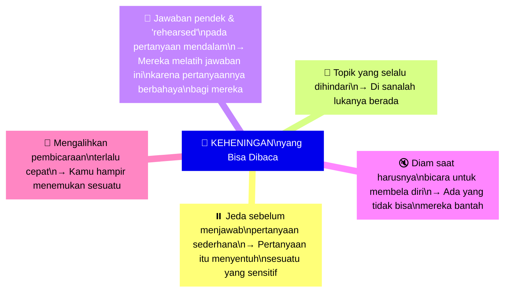
```mermaid
mindmap
  root["🤫 KEHENINGAN\nyang Bisa Dibaca"]
    ["⏸️ Jeda sebelum menjawab\npertanyaan sederhana\n→ Pertanyaan itu menyentuh\nsesuatu yang sensitif"]
    ["🚫 Topik yang selalu dihindari\n→ Di sanalah lukanya berada"]
    ["📝 Jawaban pendek & 'rehearsed'\npada pertanyaan mendalam\n→ Mereka melatih jawaban ini\nkarena pertanyaannya berbahaya\nbagi mereka"]
    ["🔇 Diam saat harusnya\nbicara untuk membela diri\n→ Ada yang tidak bisa\nmereka bantah"]
    ["💬 Mengalihkan pembicaraan\nterlalu cepat\n→ Kamu hampir menemukan sesuatu"]
```

---

### Kebenaran #4: Kebajikan yang Berlebihan Sering Adalah Kesombongan yang Terselubung 😇

> *"Excessive virtue is often disguised vanity."*
> *(Kebajikan berlebihan sering adalah kesombongan yang tersamarkan.)*

Waspadalah terhadap orang yang dengan keras memproklamasikan kemurnian moral mereka — yang selalu mengoreksi orang lain, selalu berkhotbah.

Nietzsche menyebut ini ***will to power*** (*kehendak untuk berkuasa*) yang menyamar:

**Kebaikan sejati tidak butuh tepuk tangan.**

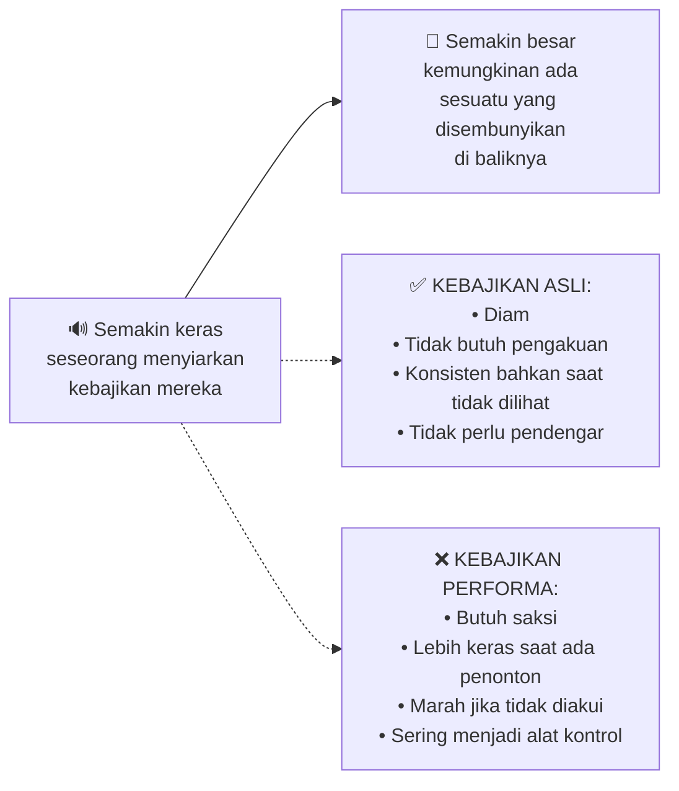
```mermaid
graph LR
    A["🔊 Semakin keras\nseseorang menyiarkan\nkebajikan mereka"] --> B["🤔 Semakin besar\nkemungkinan ada\nsesuatu yang disembunyikan\ndi baliknya"]

    C["✅ KEBAJIKAN ASLI:\n• Diam\n• Tidak butuh pengakuan\n• Konsisten bahkan saat tidak dilihat\n• Tidak perlu pendengar"]
    
    D["❌ KEBAJIKAN PERFORMA:\n• Butuh saksi\n• Lebih keras saat ada penonton\n• Marah jika tidak diakui\n• Sering menjadi alat kontrol"]

    A -.-> C
    A -.-> D
```

---

### Kebenaran #5: Orang Tidak Berbohong Kepadamu Lebih Dulu — Mereka Berbohong kepada Diri Sendiri 🪤

> *"The lies you hear aren't to hurt you — they're lies they've rehearsed so often they believe them."*
> *(Kebohongan yang kamu dengar bukan untuk menyakitimu — itu adalah kebohongan yang sudah mereka latih begitu sering hingga mereka percayai.)*

Frasa yang paling sering menjadi kebohongan kepada diri sendiri:
- *"Aku baik-baik saja."*
- *"Aku sudah move on."*
- *"Aku tidak peduli."*

Nietzsche memahami ***self-deception*** (*penipuan diri sendiri*) bukan sebagai kejahatan tapi sebagai **pertahanan** — cara tetap berfungsi di dunia yang menyakitkan.

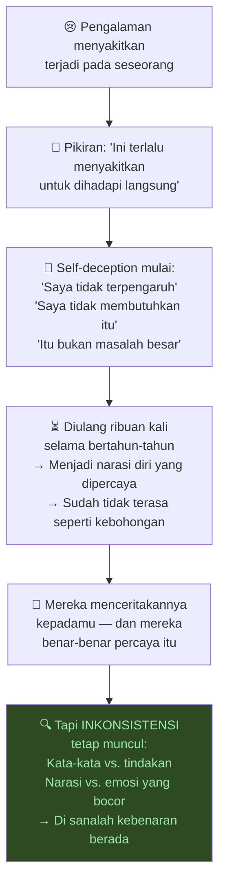
```mermaid
flowchart TD
    A["😢 Pengalaman menyakitkan\nterjadi pada seseorang"] --> B
    B["🧠 Pikiran: 'Ini terlalu menyakitkan\nuntuk dihadapi langsung'"] --> C
    C["🔄 Self-deception mulai:\n'Saya tidak terpengaruh'\n'Saya tidak membutuhkan itu'\n'Itu bukan masalah besar'"] --> D
    D["⏳ Diulang ribuan kali\nselama bertahun-tahun\n→ Menjadi narasi diri yang dipercaya\n→ Sudah tidak terasa seperti kebohongan"] --> E
    E["💬 Mereka menceritakannya\nkepadamu — dan mereka\nbenar-benar percaya itu"] --> F
    F["🔍 Tapi INKONSISTENSI\ntetap muncul:\nKata-kata vs. tindakan\nNarasi vs. emosi yang bocor\n→ Di sanalah kebenaran berada"]

    style F fill:#2d4a22,color:#9ae6b4
```

---

### Kebenaran #6: Di Mana Seseorang Merasa Superior, Mereka Menyembunyikan Inferioritas 👑

> *"Real confidence doesn't compete. It just is."*
> *(Kepercayaan diri sejati tidak bersaing. Ia hanya ada.)*

Ini adalah Nietzsche murni: **superioritas sering adalah kompensasi berlebih (*overcompensation*)**.

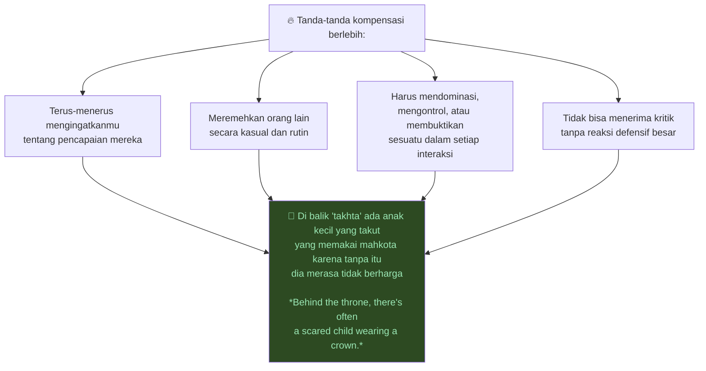
```mermaid
graph TD
    A["🔥 Tanda-tanda kompensasi berlebih:"]
    A --> B["Terus-menerus mengingatkanmu\ntentang pencapaian mereka"]
    A --> C["Meremehkan orang lain\nsecara kasual dan rutin"]
    A --> D["Harus mendominasi,\nmengontrol, atau membuktikan\nsesuatu dalam setiap interaksi"]
    A --> E["Tidak bisa menerima kritik\ntanpa reaksi defensif besar"]

    B & C & D & E --> F

    F["🔎 Di balik 'takhta' ada anak kecil yang takut\nyang memakai mahkota karena tanpa itu\ndia merasa tidak berharga\n\n*Behind the throne, there's often\na scared child wearing a crown.*"]

    style F fill:#2d4a22,color:#9ae6b4
```

---

## Interlude: Menggunakan Keenam Kebenaran Pertama dengan Empati 💙

Sebelum melanjutkan ke bagian dua, Nietzsche memberikan peringatan penting:

> *"Reading people isn't about judging them. It's about understanding their core."*
> *(Membaca orang bukan tentang menghakimi mereka. Ini tentang memahami inti mereka.)*

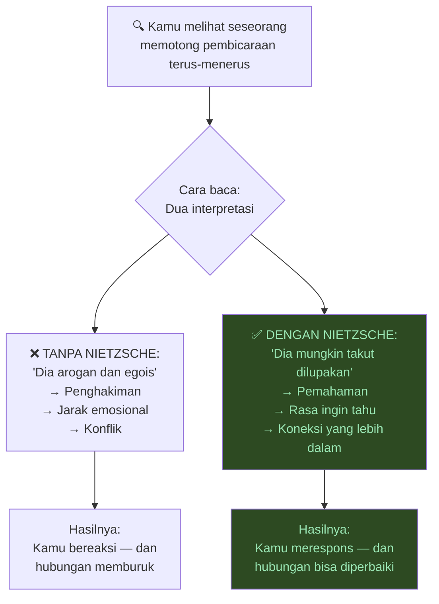
```mermaid
graph TD
    A["🔍 Kamu melihat seseorang\nmemotong pembicaraan terus-menerus"] --> B

    B{"Cara baca:\nDua interpretasi"}

    B --> C["❌ TANPA NIETZSCHE:\n'Dia arogan dan egois'\n→ Penghakiman\n→ Jarak emosional\n→ Konflik"]

    B --> D["✅ DENGAN NIETZSCHE:\n'Dia mungkin takut dilupakan'\n→ Pemahaman\n→ Rasa ingin tahu\n→ Koneksi yang lebih dalam"]

    C --> E["Hasilnya:\nKamu bereaksi — dan\nhubungan memburuk"]
    D --> F["Hasilnya:\nKamu merespons — dan\nhubungan bisa diperbaiki"]

    style D fill:#2d4a22,color:#9ae6b4
    style F fill:#2d4a22,color:#9ae6b4
```

---

## BAGIAN II: Kebenaran 7–12 — Di Mana Topeng Mulai Retak 🔓

### Kebenaran #7: Sebagian Besar Tindakan Didorong oleh Ketakutan Bawah Sadar 😰

> *"Stop focusing on what they say they want. Instead, ask: What are they afraid of losing?"*
> *(Berhenti fokus pada apa yang mereka katakan mereka inginkan. Sebaliknya, tanyakan: Apa yang mereka takut kehilangan?)*

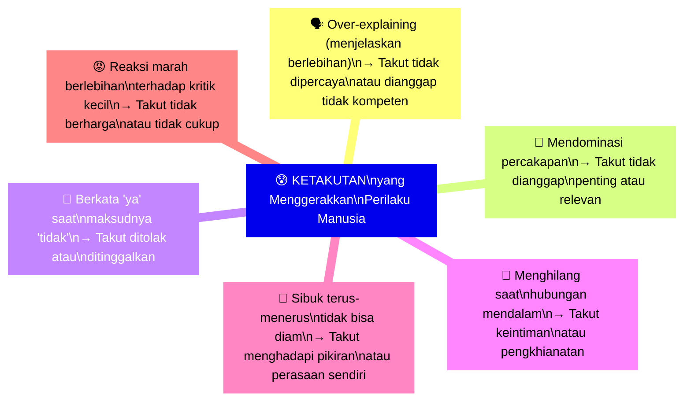
```mermaid
mindmap
  root["😰 KETAKUTAN\nyang Menggerakkan\nPerilaku Manusia"]
    ["🗣️ Over-explaining (menjelaskan berlebihan)\n→ Takut tidak dipercaya\natau dianggap tidak kompeten"]
    ["💬 Mendominasi percakapan\n→ Takut tidak dianggap\npenting atau relevan"]
    ["🙅 Berkata 'ya' saat\nmaksudnya 'tidak'\n→ Takut ditolak atau\nditinggalkan"]
    ["🏃 Menghilang saat\nhubungan mendalam\n→ Takut keintiman\natau pengkhianatan"]
    ["📱 Sibuk terus-menerus\ntidak bisa diam\n→ Takut menghadapi pikiran\natau perasaan sendiri"]
    ["😡 Reaksi marah berlebihan\nterhadap kritik kecil\n→ Takut tidak berharga\natau tidak cukup"]
```

**Pertanyaan kunci Nietzsche:** Bukan *"Apa yang mereka inginkan?"* — tapi ***"Apa yang mereka takut kehilangan?"***

---

### Kebenaran #8: Saat Seseorang Terlalu Banyak Mengkritik, Itu adalah Proyeksi 🔄

> *"Judgment is almost never about the other. It's about the self."*
> *(Penghakiman hampir tidak pernah tentang orang lain. Ini tentang diri sendiri.)*

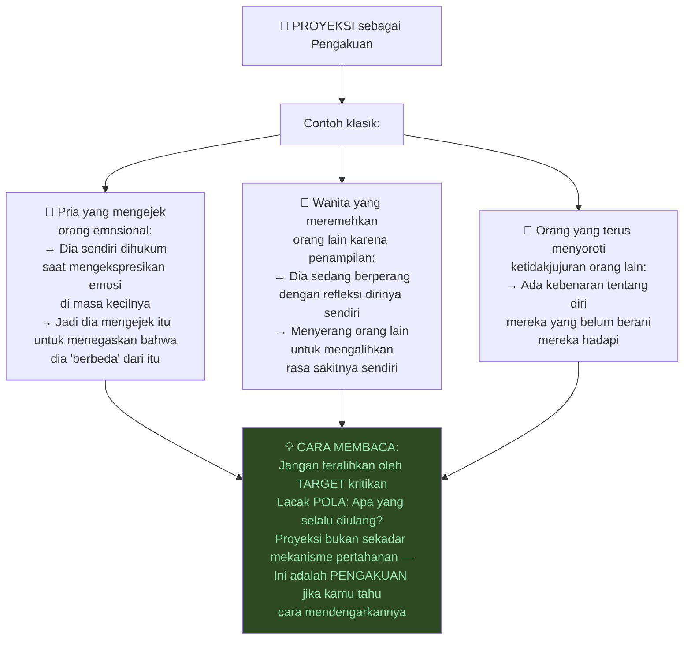
```mermaid
graph TD
    A["🔄 PROYEKSI sebagai Pengakuan"] --> B

    B["Contoh klasik:"] --> C & D & E

    C["👨 Pria yang mengejek\norang emosional:\n→ Dia sendiri dihukum\nsaat mengekspresikan emosi\ndi masa kecilnya\n→ Jadi dia mengejek itu\nuntuk menegaskan bahwa\ndia 'berbeda' dari itu"]

    D["👩 Wanita yang meremehkan\norang lain karena penampilan:\n→ Dia sedang berperang\ndengan refleksi dirinya sendiri\n→ Menyerang orang lain\nuntuk mengalihkan\nrasa sakitnya sendiri"]

    E["🧔 Orang yang terus menyoroti\nketidakjujuran orang lain:\n→ Ada kebenaran tentang diri\nmereka yang belum berani\nmereka hadapi"]

    C & D & E --> F["💡 CARA MEMBACA:\nJangan teralihkan oleh TARGET kritikan\nLacak POLA: Apa yang selalu diulang?\nProyeksi bukan sekadar mekanisme pertahanan —\nIni adalah PENGAKUAN jika kamu tahu\ncara mendengarkannya"]

    style F fill:#2d4a22,color:#9ae6b4
```

---

### Kebenaran #9: Rasa Bersalah Bersembunyi di Balik Kepercayaan Diri yang Palsu 🎩

> *"Real peace doesn't perform. So when someone seems too confident, don't be intimidated. Be curious."*
> *(Kedamaian sejati tidak perlu ditampilkan. Jadi saat seseorang tampak terlalu percaya diri, jangan terintimidasi. Jadilah penasaran.)*

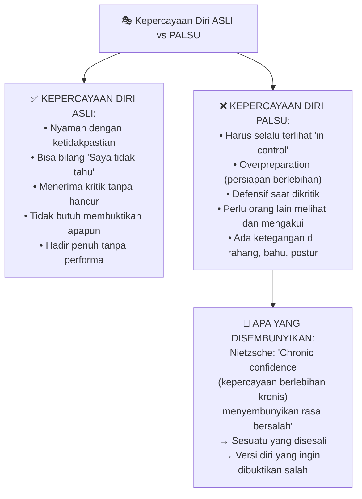
```mermaid
flowchart TD
    A["🎭 Kepercayaan Diri ASLI vs PALSU"]
    
    A --> B["✅ KEPERCAYAAN DIRI ASLI:\n• Nyaman dengan ketidakpastian\n• Bisa bilang 'Saya tidak tahu'\n• Menerima kritik tanpa hancur\n• Tidak butuh membuktikan apapun\n• Hadir penuh tanpa performa"]
    
    A --> C["❌ KEPERCAYAAN DIRI PALSU:\n• Harus selalu terlihat 'in control'\n• Overpreparation (persiapan berlebihan)\n• Defensif saat dikritik\n• Perlu orang lain melihat dan mengakui\n• Ada ketegangan di rahang, bahu, postur"]

    C --> D["🔎 APA YANG DISEMBUNYIKAN:\nNietzsche: 'Chronic confidence\n(kepercayaan berlebihan kronis)\nmenyembunyikan rasa bersalah'\n→ Sesuatu yang disesali\n→ Versi diri yang ingin dibuktikan salah"]
```

---

### Kebenaran #10: Orang Mengkhianati Diri Sendiri Melalui Hiperbola (*Exaggeration*) 🔊

> *"Exaggeration is volume. The question is: What are they trying to silence?"*
> *(Hiperbola adalah volume. Pertanyaannya: Apa yang coba mereka bisukan?)*

**Tanda-tanda hiperbola sebagai sinyal psikologis:**

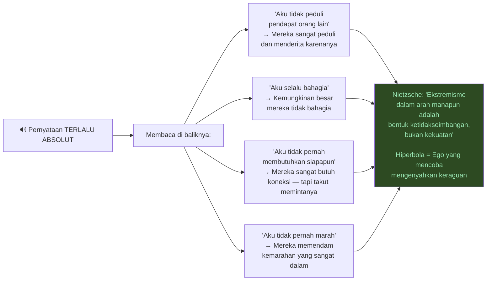
```mermaid
graph LR
    A["🔊 Pernyataan TERLALU ABSOLUT"] --> B["Membaca di baliknya:"]
    
    B --> C["'Aku tidak peduli\npendapat orang lain'\n→ Mereka sangat peduli\ndan menderita karenanya"]
    
    B --> D["'Aku selalu bahagia'\n→ Kemungkinan besar\nmereka tidak bahagia"]
    
    B --> E["'Aku tidak pernah\nmembutuhkan siapapun'\n→ Mereka sangat butuh\nkoneksi — tapi takut memintanya"]
    
    B --> F["'Aku tidak pernah marah'\n→ Mereka memendam\nkemarahan yang sangat dalam"]

    C & D & E & F --> G["Nietzsche: 'Ekstremisme\ndalam arah manapun adalah\nbentuk ketidakseimbangan,\nbukan kekuatan'\n\nHiperbola = Ego yang mencoba\nmengenyahkan keraguan"]

    style G fill:#2d4a22,color:#9ae6b4
```

---

### Kebenaran #11: Mereka yang Mencari Kontrol Sering Takut akan Kekacauan Batin 🌀

> *"The stricter the outer shell, the more fragile the inner self."*
> *(Semakin ketat cangkang luar, semakin rapuh diri bagian dalam.)*

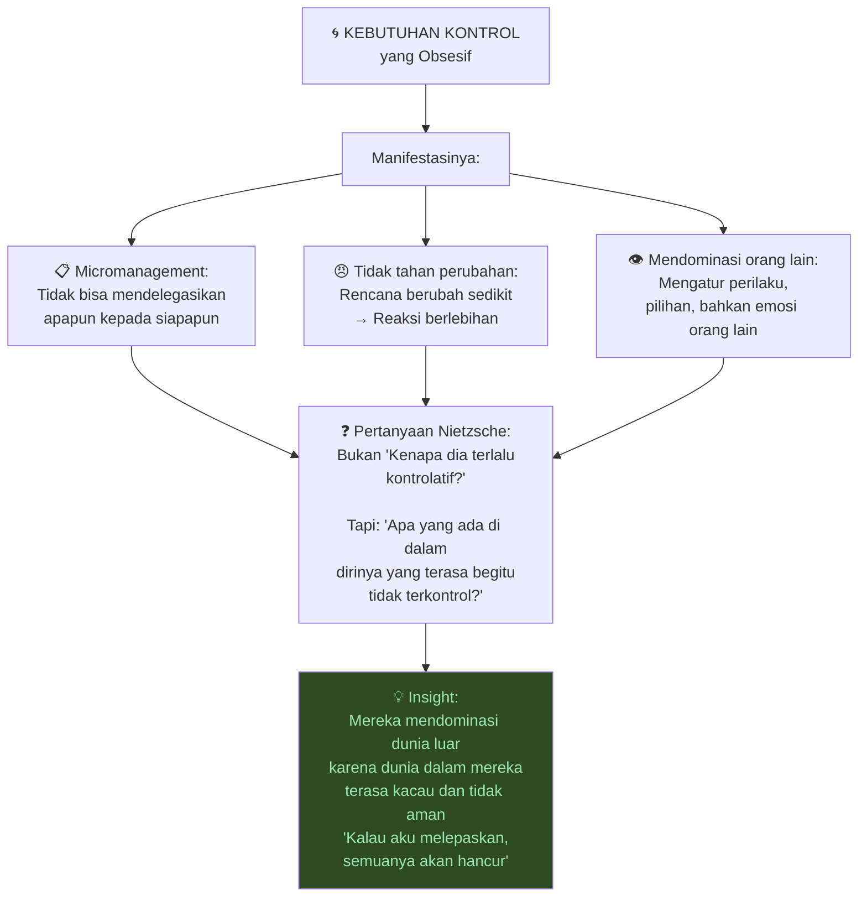
```mermaid
graph TD
    A["🌀 KEBUTUHAN KONTROL\nyang Obsesif"] --> B

    B["Manifestasinya:"] --> C & D & E

    C["📋 Micromanagement:\nTidak bisa mendelegasikan\napapun kepada siapapun"]

    D["😠 Tidak tahan perubahan:\nRencana berubah sedikit\n→ Reaksi berlebihan"]

    E["👁️ Mendominasi orang lain:\nMengatur perilaku,\npilihan, bahkan emosi orang lain"]

    C & D & E --> F

    F["❓ Pertanyaan Nietzsche:\nBukan 'Kenapa dia terlalu\nkontrolatif?'\n\nTapi: 'Apa yang ada di dalam\ndirinya yang terasa begitu\ntidak terkontrol?'"]

    F --> G["💡 Insight:\nMereka mendominasi dunia luar\nkarena dunia dalam mereka\nterasa kacau dan tidak aman\n'Kalau aku melepaskan,\nsemuanya akan hancur'"]

    style G fill:#2d4a22,color:#9ae6b4
```

---

### Kebenaran #12: Semakin Keras Penampilannya, Semakin Kosong Intinya 📱

> *"The louder the performance, the emptier the core."*
> *(Semakin keras penampilannya, semakin kosong intinya.)*

Nietzsche mengantisipasi era media sosial lebih dari satu abad sebelumnya:

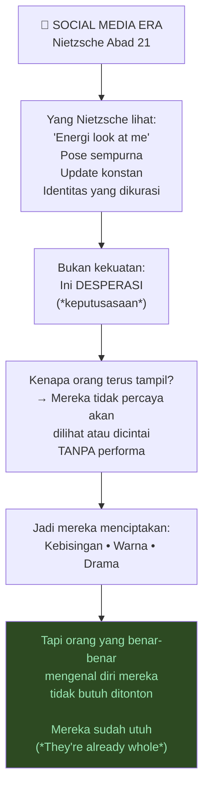
```mermaid
graph TD
    A["📱 SOCIAL MEDIA ERA\nNietzsche Abad 21"] --> B

    B["Yang Nietzsche lihat:\n'Energi look at me'\nPose sempurna\nUpdate konstan\nIdentitas yang dikurasi"] --> C

    C["Bukan kekuatan:\nIni DESPERASI\n(*keputusasaan*)"] --> D

    D["Kenapa orang terus tampil?\n→ Mereka tidak percaya akan\ndilihat atau dicintai\nTANPA performa"] --> E

    E["Jadi mereka menciptakan:\nKebisingan • Warna • Drama"] --> F

    F["Tapi orang yang benar-benar\nmengenal diri mereka\ntidak butuh ditonton\n\nMereka sudah utuh\n(*They're already whole*)"]

    style F fill:#2d4a22,color:#9ae6b4
```

<Callout type="info" title="💭 Pertanyaan untuk Direnungkan">
Lain kali kamu melihat seseorang memposting konten yang tampak *terlalu* sempurna, terlalu bahagia, terlalu terorganisir — tanyakan bukan:

*"Betapa hebatnya hidup mereka."*

Tapi:

*"Apa yang mereka takutkan jika mereka berhenti menampilkan ini?"*
</Callout>

---

## Menggabungkan Bagian I & II: Pola Membaca Menyeluruh 🧩

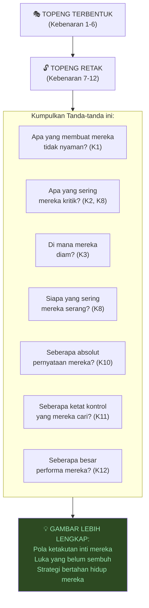
```mermaid
graph TD
    A["🎭 TOPENG TERBENTUK\n(Kebenaran 1-6)"] --> B["🔓 TOPENG RETAK\n(Kebenaran 7-12)"]

    subgraph TANDA["Kumpulkan Tanda-tanda ini:"]
        T1["Apa yang membuat mereka\ntidak nyaman? (K1)"]
        T2["Apa yang sering\nmereka kritik? (K2, K8)"]
        T3["Di mana mereka\ndiam? (K3)"]
        T4["Siapa yang sering\nmereka serang? (K8)"]
        T5["Seberapa absolut\npernyataan mereka? (K10)"]
        T6["Seberapa ketat kontrol\nyang mereka cari? (K11)"]
        T7["Seberapa besar\nperforma mereka? (K12)"]
    end

    B --> TANDA

    TANDA --> C["💡 GAMBAR LEBIH LENGKAP:\nPola ketakutan inti mereka\nLuka yang belum sembuh\nStrategi bertahan hidup mereka"]

    style C fill:#2d4a22,color:#9ae6b4
```

---

## BAGIAN III: Kebenaran 13–18 — Membaca Jiwa, Bukan Hanya Topeng 🌊

### Kebenaran #13: Tidak Ada yang Berbicara dari Logika — Mereka Berbicara dari Rasa Sakit 💔

> *"Underneath every logical argument is an emotional wound."*
> *(Di balik setiap argumen logis ada luka emosional.)*

Ini adalah salah satu kebenaran paling transformatif:

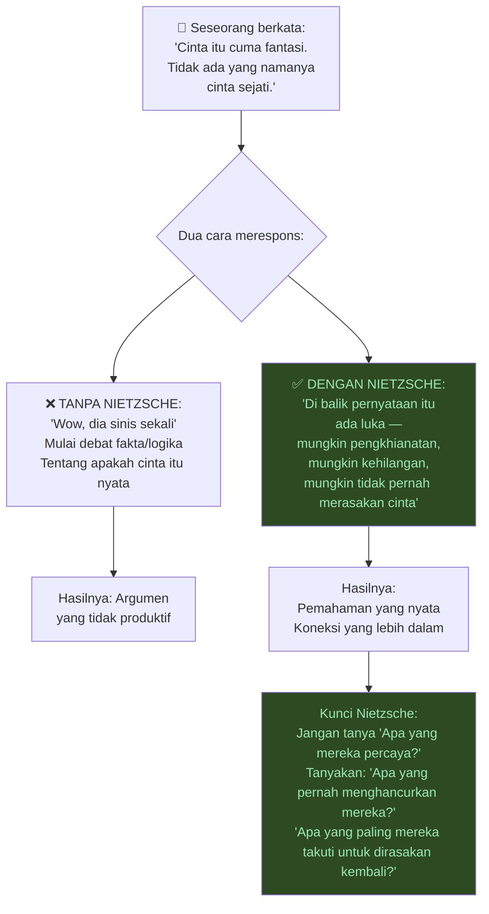
```mermaid
flowchart TD
    A["💬 Seseorang berkata:\n'Cinta itu cuma fantasi.\nTidak ada yang namanya\ncinta sejati.'"] --> B

    B{"Dua cara merespons:"}

    B --> C["❌ TANPA NIETZSCHE:\n'Wow, dia sinis sekali'\nMulai debat fakta/logika\nTentang apakah cinta itu nyata"]

    B --> D["✅ DENGAN NIETZSCHE:\n'Di balik pernyataan itu\nada luka —\nmungkin pengkhianatan,\nmungkin kehilangan,\nmungkin tidak pernah merasakan cinta'"]

    C --> E["Hasilnya: Argumen\nyang tidak produktif"]
    D --> F["Hasilnya:\nPemahaman yang nyata\nKoneksi yang lebih dalam"]

    F --> G["Kunci Nietzsche:\nJangan tanya 'Apa yang mereka percaya?'\nTanyakan: 'Apa yang pernah menghancurkan mereka?'\n'Apa yang paling mereka takuti untuk dirasakan kembali?'"]

    style D fill:#2d4a22,color:#9ae6b4
    style G fill:#2d4a22,color:#9ae6b4
```

**Shift perspektif yang mengubah segalanya:**
- Pendapat mereka bukan **ancaman** — itu **pertahanan**
- Argumen mereka bukan **serangan** — itu **perisai**
- Dan saat kamu melihat itu — kamu berhenti bereaksi. Kamu mulai memahami.

---

### Kebenaran #14: Cara Seseorang Merespons Kelemahan Mengungkapkan Kekuatan Sejati Mereka 🦁

> *"Real strength isn't proven through domination. It's revealed through restraint."*
> *(Kekuatan sejati tidak dibuktikan melalui dominasi. Ia terungkap melalui pengendalian diri.)*

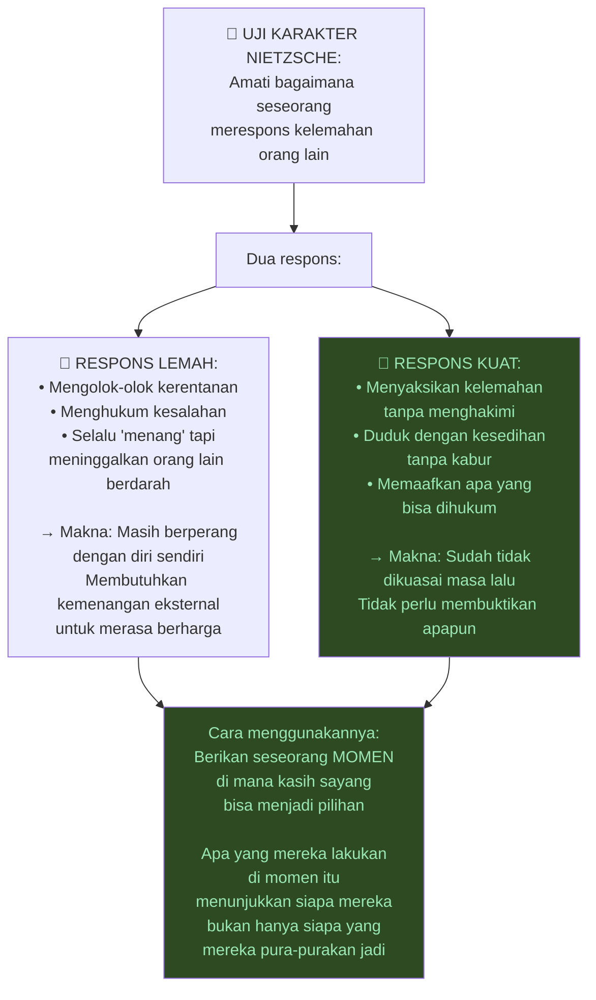
```mermaid
graph TD
    A["🧪 UJI KARAKTER NIETZSCHE:\nAmati bagaimana seseorang\nmerespons kelemahan orang lain"] --> B

    B["Dua respons:"]

    B --> C["😤 RESPONS LEMAH:\n• Mengolok-olok kerentanan\n• Menghukum kesalahan\n• Selalu 'menang' tapi\nmeninggalkan orang lain berdarah\n\n→ Makna: Masih berperang\ndengan diri sendiri\nMembutuhkan kemenangan eksternal\nuntuk merasa berharga"]

    B --> D["💪 RESPONS KUAT:\n• Menyaksikan kelemahan\ntanpa menghakimi\n• Duduk dengan kesedihan\ntanpa kabur\n• Memaafkan apa yang\nbisa dihukum\n\n→ Makna: Sudah tidak\ndikuasai masa lalu\nTidak perlu membuktikan apapun"]

    C & D --> E["Cara menggunakannya:\nBerikan seseorang MOMEN\ndi mana kasih sayang\nbisa menjadi pilihan\n\nApa yang mereka lakukan\ndi momen itu\nmenunjukkan siapa mereka\nbukan hanya siapa yang\nmereka pura-purakan jadi"]

    style D fill:#2d4a22,color:#9ae6b4
    style E fill:#2d4a22,color:#9ae6b4
```

---

### Kebenaran #15: Saat Seseorang Takut Dilupakan, Mereka Mengejar Perhatian 👁️

> *"The child who was ignored becomes the adult who overcompensates."*
> *(Anak yang diabaikan menjadi orang dewasa yang berkompensasi berlebihan.)*

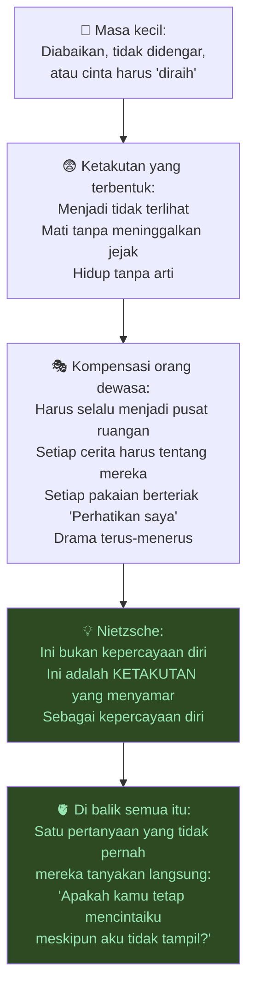
```mermaid
graph TD
    A["👶 Masa kecil:\nDiabaikan, tidak didengar,\natau cinta harus 'diraih'"] --> B

    B["😨 Ketakutan yang terbentuk:\nMenjadi tidak terlihat\nMati tanpa meninggalkan jejak\nHidup tanpa arti"] --> C

    C["🎭 Kompensasi orang dewasa:\nHarus selalu menjadi pusat ruangan\nSetiap cerita harus tentang mereka\nSetiap pakaian berteriak 'Perhatikan saya'\nDrama terus-menerus"] --> D

    D["💡 Nietzsche:\nIni bukan kepercayaan diri\nIni adalah KETAKUTAN yang menyamar\nSebagai kepercayaan diri"] --> E

    E["🫀 Di balik semua itu:\nSatu pertanyaan yang tidak pernah\nmereka tanyakan langsung:\n'Apakah kamu tetap mencintaiku\nmeskipun aku tidak tampil?'"]

    style D fill:#2d4a22,color:#9ae6b4
    style E fill:#2d4a22,color:#9ae6b4
```

<Callout type="tip" title="💙 Menggunakan Ini dengan Kasih">
Daripada merasa terganggu oleh orang yang "terlalu banyak" hadir — tanyakan dalam hati:

*"Ketakutan apa yang mendorongnya untuk membutuhkan perhatian sebanyak ini?"*

Karena kadang, perhatian bukan kesombongan. **Itu adalah tangisan.**
</Callout>

---

### Kebenaran #16: Orang yang Diserang Sering adalah Orang yang Membuat Mereka Iri 🖤

> *"Envy is just unspoken desire — the soul saying: I want that too, but I don't believe I'm allowed."*
> *(Iri hati hanyalah keinginan yang tidak terucapkan — jiwa yang berkata: Aku juga menginginkan itu, tapi aku tidak percaya aku boleh mendapatkannya.)*

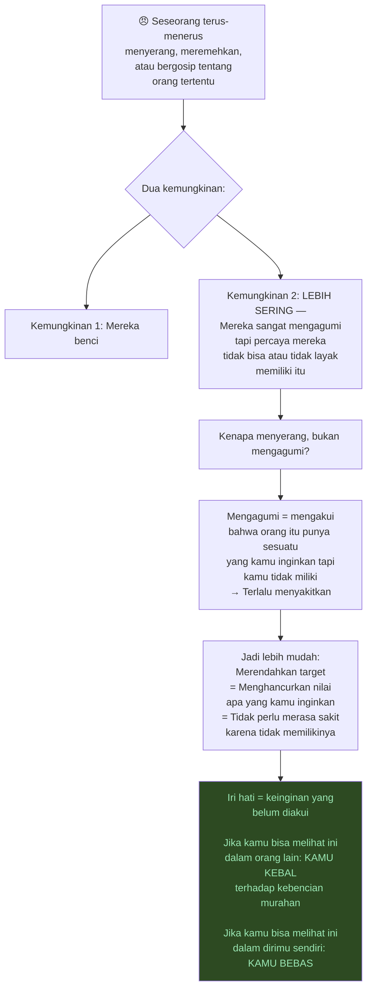
```mermaid
graph TD
    A["😠 Seseorang terus-menerus\nmenyerang, meremehkan,\natau bergosip tentang\norang tertentu"] --> B

    B{"Dua kemungkinan:"}

    B --> C["Kemungkinan 1: Mereka benci"]
    B --> D["Kemungkinan 2: LEBIH SERING —\nMereka sangat mengagumi\ntapi percaya mereka\ntidak bisa atau tidak layak\nmemiliki itu"]

    D --> E["Kenapa menyerang, bukan mengagumi?"]
    E --> F["Mengagumi = mengakui\nbahwa orang itu punya sesuatu\nyang kamu inginkan tapi\nkamu tidak miliki\n→ Terlalu menyakitkan"]

    F --> G["Jadi lebih mudah:\nMerendahkan target\n= Menghancurkan nilai\napa yang kamu inginkan\n= Tidak perlu merasa sakit\nkarena tidak memilikinya"]

    G --> H["Iri hati = keinginan yang\nbelum diakui\n\nJika kamu bisa melihat ini\ndalam orang lain: KAMU KEBAL\nterhadap kebencian murahan\n\nJika kamu bisa melihat ini\ndalam dirimu sendiri: KAMU BEBAS"]

    style H fill:#2d4a22,color:#9ae6b4
```

---

### Kebenaran #17: Orang Bertindak Menurut Masa Kecil Mereka, Bukan Keyakinan Mereka 🧸

> *"People don't change. People repeat. They repeat the roles they were forced to play."*
> *(Orang tidak berubah. Orang mengulang. Mereka mengulang peran yang dipaksa untuk mereka mainkan.)*

Ini adalah kebenaran paling mendalam tentang psikologi manusia:

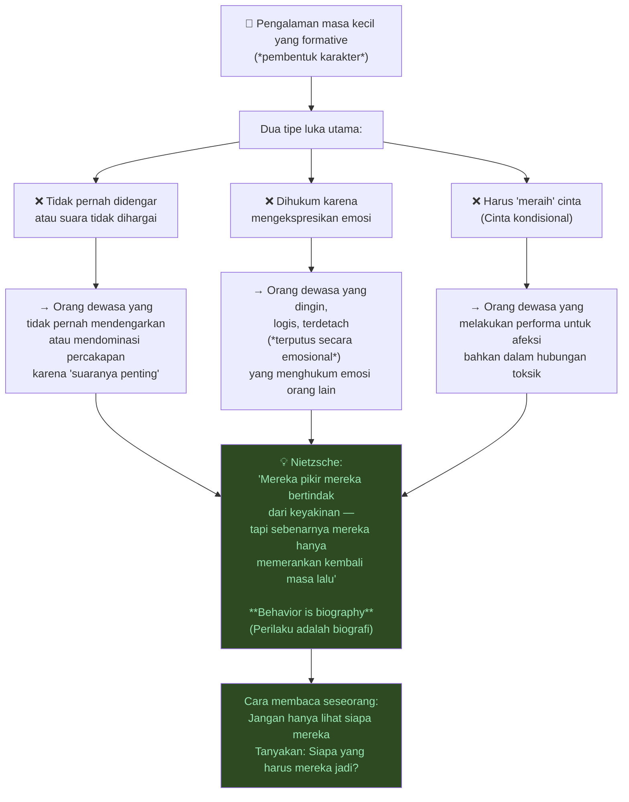
```mermaid
graph TD
    A["👶 Pengalaman masa kecil yang formative\n(*pembentuk karakter*)"] --> B

    B["Dua tipe luka utama:"] --> C & D

    C["❌ Tidak pernah didengar\natau suara tidak dihargai"] --> C2["→ Orang dewasa yang\ntidak pernah mendengarkan\natau mendominasi percakapan\nkarena 'suaranya penting'"]

    D["❌ Dihukum karena\nmengekspresikan emosi"] --> D2["→ Orang dewasa yang dingin,\nlogis, terdetach\n(*terputus secara emosional*)\nyang menghukum emosi orang lain"]

    B --> E["❌ Harus 'meraih' cinta\n(Cinta kondisional)"] --> E2["→ Orang dewasa yang\nmelakukan performa untuk afeksi\nbahkan dalam hubungan toksik"]

    C2 & D2 & E2 --> F

    F["💡 Nietzsche:\n'Mereka pikir mereka bertindak\ndari keyakinan —\ntapi sebenarnya mereka hanya\nmemerankan kembali masa lalu'\n\n**Behavior is biography**\n(Perilaku adalah biografi)"]

    F --> G["Cara membaca seseorang:\nJangan hanya lihat siapa mereka\nTanyakan: Siapa yang harus mereka jadi?"]

    style F fill:#2d4a22,color:#9ae6b4
    style G fill:#2d4a22,color:#9ae6b4
```

**Peta Luka Masa Kecil → Perilaku Dewasa:**

```mermaid
graph LR
    subgraph LUKA["💔 Luka Masa Kecil"]
        L1["Diabaikan / Tidak terlihat"]
        L2["Dicintai secara kondisional"]
        L3["Tidak diizinkan marah"]
        L4["Selalu harus sempurna"]
        L5["Pengkhianatan oleh orang dipercaya"]
        L6["Harus mengurus orang lain\ndari usia dini"]
    end

    subgraph DEWASA["🧑 Perilaku Dewasa"]
        D1["Mengejar perhatian/validation\nsecara kompulsif"]
        D2["Performa tanpa henti\nuntuk mendapat afeksi"]
        D3["Ledakan amarah yang\ntampak tidak proporsional"]
        D4["Perfeksionisme yang\nmelumpuhkan atau\nkritik diri ekstrem"]
        D5["Sulit mempercayai orang\natau selalu menunggu\ndikhianati"]
        D6["Selalu menempatkan\nkebutuhan orang lain\ndi atas kebutuhan sendiri"]
    end

    L1 --> D1
    L2 --> D2
    L3 --> D3
    L4 --> D4
    L5 --> D5
    L6 --> D6
```

---

### Kebenaran #18: Pola Mereka adalah Pengakuan — Jika Kamu Tahu Cara Mendengarkannya 🎵

> *"People don't always know how to express what hurts, but they will show you again and again through patterns."*
> *(Orang tidak selalu tahu cara mengekspresikan apa yang menyakiti mereka, tapi mereka akan menunjukkannya kepadamu lagi dan lagi melalui pola.)*

Ini adalah kebenaran terakhir dan mungkin paling penting:

```mermaid
graph TD
    A["🔄 POLA BERULANG = PENGAKUAN"] --> B

    B["Tiga contoh pola:"] --> C & D & E

    C["👻 Seseorang yang selalu\n'ghosting' saat\nhubungan mendalam\n→ Berkata: 'Saat ini\nterjadi, aku takut'"]

    D["💼 Seseorang yang bekerja\nsampai kelelahan,\ntidak bisa diam\n→ Berkata: 'Dalam kesunyian,\naku menghadapi sesuatu\nyang tidak bisa aku hadapi'"]

    E["😏 Seseorang yang flirting\ndengan semua orang tapi\ntidak pernah benar-benar\nterhubung dengan siapapun\n→ Berkata: 'Aku ingin koneksi\ntapi takut jika orang benar-benar\nmengenalku, mereka akan pergi'"]

    C & D & E --> F

    F["💬 Apa yang semua pola ini katakan:\n'Ini cara aku melindungi diri sendiri'\n'Di sinilah aku pernah terluka'\n'Ini yang aku takut akan terulang'"]

    F --> G["Nietzsche: Jika kamu belajar\nmendengarkan bukan kata-kata,\ntapi POLA —\nkamu bisa mendengar kebenaran\nsebelum diucapkan"]

    style G fill:#2d4a22,color:#9ae6b4
```

---

## Sintesis: 18 Kebenaran dalam Satu Peta Besar 🗺️

```mermaid
mindmap
  root["🎭 18 KEBENARAN NIETZSCHE\nMembaca Siapa Pun"]
    ["BAGIAN I: TOPENG (1-6)"]
      ["1. Semua orang memakai topeng\nuntuk bertahan hidup"]
      ["2. Yang dibenci pada orang lain\n= Apa yang disembunyikan dalam diri"]
      ["3. Keheningan berbicara\nlebih keras dari kata-kata"]
      ["4. Kebajikan berlebihan\n= Kesombongan terselubung"]
      ["5. Orang berbohong pada diri sendiri\nlebih dulu sebelum kepadamu"]
      ["6. Superioritas\n= Inferioritas yang terselubung"]
    ["BAGIAN II: RETAKAN (7-12)"]
      ["7. Tindakan = Ketakutan bawah sadar\n'Apa yang mereka takut kehilangan?'"]
      ["8. Kritik berlebihan\n= Proyeksi — pengakuan tentang diri"]
      ["9. Kepercayaan diri kronik\n= Rasa bersalah tersembunyi"]
      ["10. Hiperbola\n= Ego mengenyahkan keraguan"]
      ["11. Obsesi kontrol\n= Kekacauan batin"]
      ["12. Performa keras\n= Inti yang kosong"]
    ["BAGIAN III: JIWA (13-18)"]
      ["13. Semua argumen logis\nberakar dari luka emosional"]
      ["14. Respons terhadap kelemahan\n= Ukuran kekuatan sejati"]
      ["15. Mengejar perhatian\n= Takut dilupakan / tidak terlihat"]
      ["16. Menyerang seseorang\n= Sering karena iri"]
      ["17. Perilaku = Biografi\nBukan keyakinan — masa kecil"]
      ["18. Pola berulang\n= Pengakuan bawah sadar"]
```

---

## Aplikasi Praktis: Cara Menggunakan 18 Kebenaran Ini 🎯

### Framework 3 Langkah:

```mermaid
graph TD
    A["👀 LANGKAH 1: OBSERVASI\nKumpulkan sinyal tanpa menghakimi:\n• Apa yang membuat mereka tidak nyaman?\n• Apa yang sering mereka kritik?\n• Bagaimana pola perilaku mereka?\n• Di mana topeng mereka tampak retak?"] --> B

    B["❓ LANGKAH 2: PERTANYAAN\nBukan 'Kenapa mereka seperti ini?'\nTapi:\n• 'Apa yang mereka takutkan?'\n• 'Luka apa yang mungkin ada di sini?'\n• 'Pola apa yang aku lihat berulang?'\n• 'Siapa yang harus mereka jadi dulu?'"] --> C

    C["💙 LANGKAH 3: RESPONS\nBukan dengan kontrol atau manipulasi\nTapi dengan:\n• Empati (*rasa pengertian*)\n• Curiosity (*rasa ingin tahu*)\n• Grace (*keanggunan dan kerendahan hati*)"]

    style C fill:#2d4a22,color:#9ae6b4
```

### Yang Lebih Penting: Membaca Dirimu Sendiri 🪞

Nietzsche tidak menulis ini hanya untuk kamu membaca *orang lain*. Setiap kebenaran ini adalah cermin:

```mermaid
graph LR
    A["🔍 Kebenaran 1:\nTopeng apa yang kamu pakai\nuntuk bertahan?"]
    B["🔍 Kebenaran 2:\nApa yang sering kamu kritik\npada orang lain?"]
    C["🔍 Kebenaran 3:\nDi topik apa kamu lebih suka diam?"]
    D["🔍 Kebenaran 7:\nApa yang paling kamu takut kehilangan?"]
    E["🔍 Kebenaran 17:\nPola dari masa kecilmu apa\nyang masih berulang hari ini?"]
    F["🔍 Kebenaran 18:\nPola apa yang muncul terus\ndalam hidupmu?"]

    A & B & C & D & E & F --> G["🌱 KESIMPULAN:\nSemakin jernih kamu melihat orang lain,\nsemakin jernih kamu melihat dirimu sendiri\n\nIni bukan tentang keunggulan\nIni tentang KESADARAN"]

    style G fill:#2d4a22,color:#9ae6b4
```

---

## Penutup: Tujuan Sejati Nietzsche — Koneksi, Bukan Kontrol 🌟

Ada kesalahpahaman besar tentang Nietzsche: banyak yang membaca filsafatnya sebagai panduan untuk menjadi lebih kuat dari orang lain, untuk mendominasi, untuk tidak bisa dimanipulasi.

Tapi inilah yang benar-benar Nietzsche inginkan:

> *"He didn't want you to see through others so you could control them. He wanted you to see through them so you could stop being fooled — and start connecting."*
> *(Dia tidak ingin kamu melihat tembus orang lain agar kamu bisa mengendalikan mereka. Dia ingin kamu melihat tembus agar kamu berhenti ditipu — dan mulai benar-benar terhubung.)*

```mermaid
graph TD
    A["🎭 Kamu melihat topeng seseorang\ndengan jelas"] --> B

    B["Dua jalan yang terbuka:"] --> C & D

    C["❌ JALAN KEKUASAAN:\nGunakan pengetahuan ini\nuntuk keuntungan\nManipulasi, kontrol, eksploitasi"] --> C2["Hasilnya:\nKamu lebih terkucil\nKamu lebih tidak dipercaya\nKamu makin jauh dari koneksi nyata"]

    D["✅ JALAN NIETZSCHE:\nGunakan pengetahuan ini\nuntuk empati\nLihat anak yang takut di balik\nkritik, dominasi, kesombongan"] --> D2["Hasilnya:\nKamu tidak bisa membenci\nKamu lebih terhubung\nKamu menjadi tidak tergoyahkan"]

    D2 --> E["💡 Paradoks Nietzsche:\nSemakin jelas kamu melihat\nketakutan dan luka seseorang —\nsemakin kecil kemungkinanmu\nuntuk membenci mereka"]

    style D fill:#2d4a22,color:#9ae6b4
    style D2 fill:#2d4a22,color:#9ae6b4
    style E fill:#2d4a22,color:#9ae6b4
```

**Kekuatan sejati tidak datang dari melihat kelemahan orang lain.**

Kekuatan sejati datang dari melihat **kemanusiaan** di balik kelemahan mereka — dan memilih *grace* (*keanggunan*) sebagai respons.

Karena ketika kamu melihat anak kecil yang takut di balik si pengkritik, ketakutan di balik si pengganggu, rasa bersalah di balik keangkuhan — kamu tidak menjadi lebih lemah.

**Kamu menjadi tidak bisa digoyahkan.**

---

## Glosarium Lengkap 📚

<Callout type="abstract" title="🗂️ Semua Istilah Penting dalam Artikel Ini">

| Istilah Asing | Bahasa Indonesia | Penjelasan |
|---|---|---|
| **Persona** | Topeng / Citra Diri | Kata Latin untuk "topeng"; versi diri yang ditampilkan kepada dunia |
| **Projection** | Proyeksi | Mekanisme psikologis memindahkan perasaan diri sendiri kepada orang lain |
| **Self-deception** | Penipuan diri sendiri | Berbohong pada diri sendiri, sering sebagai mekanisme pertahanan |
| **Will to Power** | Kehendak untuk Berkuasa | Konsep sentral Nietzsche: dorongan dasar manusia untuk tumbuh dan mendominasi |
| **Overcompensation** | Kompensasi berlebihan | Bereaksi berlebihan untuk menutupi kelemahan yang dirasakan |
| **Unconscious fear** | Ketakutan bawah sadar | Ketakutan yang beroperasi tanpa kesadaran penuh pemiliknya |
| **Exaggeration** | Hiperbola | Pernyataan yang diperkuat jauh melebihi kenyataan |
| **Micromanagement** | Manajemen mikro | Kebutuhan mengontrol setiap detail orang lain |
| **Validation** | Validasi | Pengakuan atau persetujuan dari luar yang dikonfirmasi |
| **Detachment** | Terputus secara emosional | Keadaan tidak terhubung dengan emosi sendiri atau orang lain |
| **Envy** | Iri hati | Keinginan atas apa yang dimiliki orang lain, sering disertai rasa sakit |
| **Restraint** | Pengendalian diri | Kemampuan menahan respons ketika mampu merespons lebih keras |
| **Formative experience** | Pengalaman pembentuk | Pengalaman masa kecil yang membentuk kepribadian dan pola perilaku |
| **Grace** | Keanggunan / Kemurahan hati | Respons dengan kerendahan hati dan kasih sayang |
| **Curiosity** | Rasa ingin tahu | Keinginan untuk memahami, bukan menghakimi |
| **Biography** | Biografi | Nietzsche: Perilaku adalah biografi — cerita hidup seseorang |
| **Herd mentality** | Mentalitas kawanan | Kecenderungan mengikuti kelompok tanpa berpikir kritis |
| **Overexplaining** | Menjelaskan berlebihan | Memberikan penjelasan jauh lebih banyak dari yang diperlukan |
</Callout>

---

## Referensi & Sumber 🔖

<Callout type="cite" title="📖 Sumber dan Bacaan Lanjut">

**Video Sumber:**
- **"How to Read Anyone Instantly – Nietzsche's 18 Psychological Truths"** — [YouTube](https://www.youtube.com/watch?v=iYfPqg7aXH8)

**Karya Nietzsche untuk Eksplorasi Lebih Dalam:**
- ***Also Sprach Zarathustra*** (*Demikianlah Zarathustra Bersabda*, 1883) — Karya sastra-filsafat terbesar Nietzsche
- ***Beyond Good and Evil*** (*Di Luar Baik dan Jahat*, 1886) — Kritik moralitas konvensional
- ***The Gay Science*** (*Ilmu yang Gembira*, 1882) — Tempat "God is Dead" pertama kali muncul
- ***On the Genealogy of Morality*** (*Tentang Silsilah Moralitas*, 1887) — Analisis asal-usul nilai moral
- ***Human, All Too Human*** (*Manusia, Terlalu Manusiawi*, 1878) — Psikologi manusia mendalam

**Psikolog Modern yang Memperluas Ide Nietzsche:**
- **Carl Jung** — Konsep *Shadow* (bayangan) dan *Persona* (topeng): langsung terinspirasi Nietzsche
- **Sigmund Freud** — Mekanisme pertahanan, termasuk proyeksi
- **Alfred Adler** — *Inferiority complex* (*kompleks inferioritas*) dan kompensasi berlebihan
- **Viktor Frankl** — *Will to meaning* vs *will to power*
</Callout>

---

*Kamu sudah tahu lebih banyak dari yang kamu kira. Sekarang kamu juga tahu cara membacanya.*

*Tapi ingat selalu: kemampuan melihat tembus orang lain bukan untuk kamu gunakan sebagai senjata. Gunakan sebagai jendela — untuk memahami, untuk terhubung, dan pada akhirnya, untuk melihat dirimu sendiri dengan lebih jelas.*
