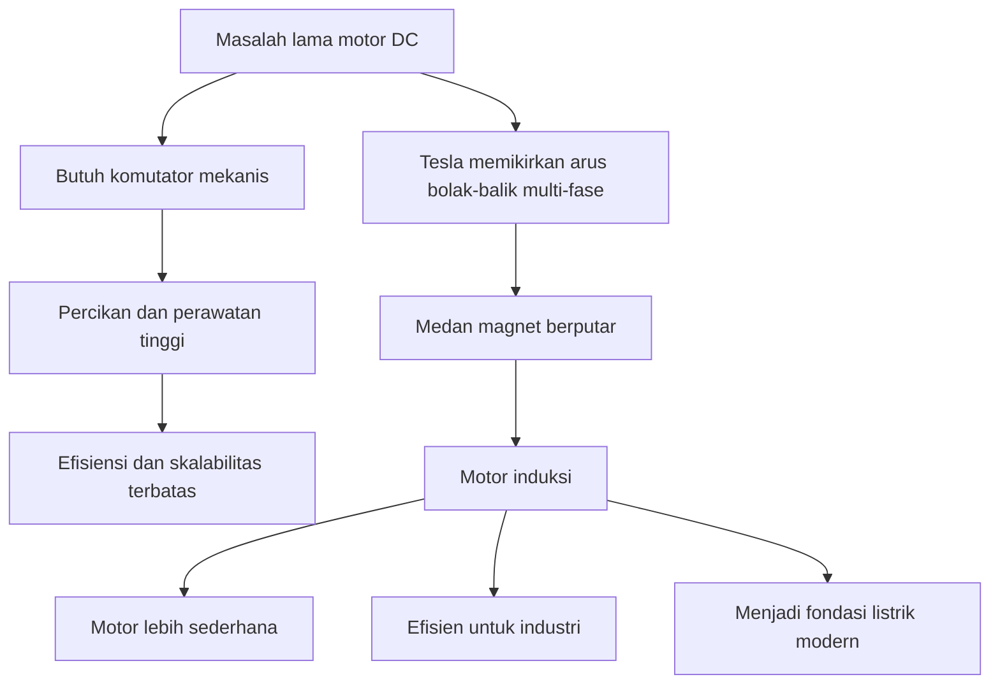
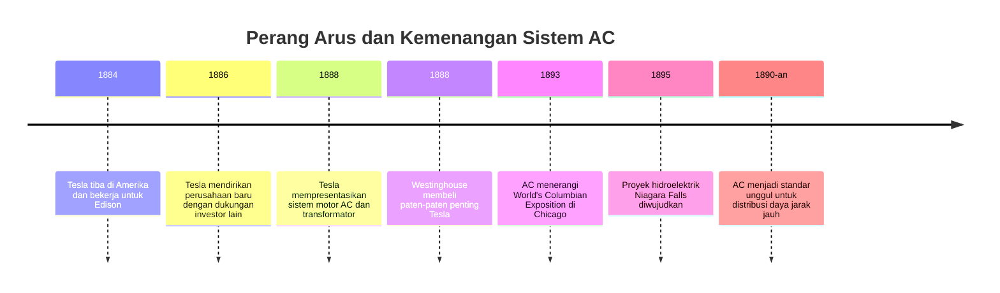
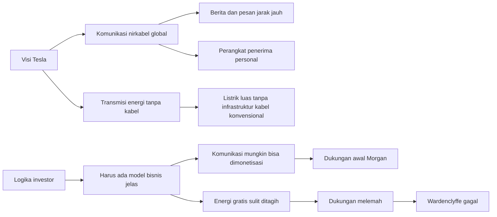

## ⚡ Pendahuluan: Nikola Tesla Bukan Sekadar Penemu Eksentrik, tetapi Salah Satu Arsitek Tak Terlihat dari Peradaban Modern

Kalau Mas Hendra menyalakan lampu, mengisi daya laptop, menyalakan kipas, pompa air, kulkas, mesin cuci, atau sekadar merebus air dengan ketel listrik, ada jejak pemikiran Nikola Tesla di sana. Banyak orang mengenal Tesla hanya sebagai sosok jenius eksentrik dengan rambut rapi, tatapan tajam, dan kisah dramatis tentang “penemu yang dicurangi dunia.” Gambaran itu tidak sepenuhnya salah, tetapi terlalu dangkal. Tesla jauh lebih besar, lebih rumit, dan lebih tragis dari sekadar meme internet tentang ilmuwan gila yang visioner. ⚙️

Tesla adalah salah satu figur langka dalam sejarah sains dan teknologi yang tidak hanya menciptakan alat, tetapi mengubah **arsitektur berpikir** tentang bagaimana energi harus dibangkitkan, ditransmisikan, dan dipakai oleh peradaban. Ia tidak sekadar menemukan mesin; ia membayangkan sistem. Ia tidak puas dengan satu perangkat; ia memikirkan jaringan. Dan di sinilah letak kejeniusannya yang paling fundamental: Tesla melihat dunia bukan sebagai kumpulan perangkat terpisah, melainkan sebagai **ekosistem energi** yang saling terhubung. 🌍

Dalam dokumenter yang Mas Hendra kirim, Tesla tampil sebagai tokoh yang nyaris seperti dua orang sekaligus. Di satu sisi, ia adalah ilmuwan-inventor dengan intuisi teknis yang sangat tajam: memahami medan magnet berputar, mengembangkan motor induksi, mempopulerkan sistem **alternating current** — *arus bolak-balik*, mendorong pencahayaan modern, merancang dasar-dasar radio, mengembangkan eksperimen tegangan tinggi, dan bermimpi tentang komunikasi nirkabel global. Di sisi lain, ia juga adalah manusia dengan jiwa rapuh: dibentuk trauma masa kecil, dikejar perfeksionisme, tersiksa obsesinya sendiri, lemah dalam urusan finansial, dan makin lama makin terasing karena visinya selalu beberapa langkah lebih jauh daripada kemampuan pasar untuk menerimanya. 🧠

Itulah paradoks Tesla. Ia terlalu modern untuk abadnya, tetapi justru karena itu ia sering gagal hidup damai di dalam abadnya sendiri. Banyak gagasannya benar, tetapi datang terlalu cepat. Banyak prediksinya visioner, tetapi dibungkus dalam presentasi yang kadang terdengar fantastis. Banyak kontribusinya fundamental, tetapi pengakuan finansial dan kelembagaan terhadap dirinya selalu timpang. Akibatnya, ia dikenang bukan hanya sebagai penemu besar, tetapi sebagai simbol yang lebih besar lagi: **jenius yang menerangi dunia, namun hidupnya sendiri berakhir dalam kesepian dan kekurangan.** 🌩️

Artikel ini akan membedah Tesla secara detail, mendalam, dan runtut. Kita akan membahas masa kecilnya, trauma psikologis yang membentuk cara berpikirnya, akar kejeniusannya, penemuan motor induksi, perbedaan mendasar AC dan DC, perang arus dengan Edison, relasinya dengan Westinghouse dan J.P. Morgan, eksperimen Colorado Springs, menara Wardenclyffe, ambisi listrik nirkabel global, berbagai klaim kontroversial di masa tua, hingga warisan intelektualnya bagi dunia modern. Istilah asing akan saya jelaskan dalam bahasa Indonesia, dan di beberapa bagian saya sertakan diagram Mermaid agar struktur idenya lebih mudah ditangkap. 📚

<Callout type="important" title="Tesis utama artikel ini">
Nikola Tesla penting bukan hanya karena ia menemukan perangkat tertentu, tetapi karena ia memikirkan masa depan energi sebagai sistem yang efisien, jarak jauh, terkoordinasi, dan nyaris global. Ia adalah arsitek dunia listrik modern, meskipun hidupnya sendiri dipenuhi konflik, salah langkah finansial, dan tragedi pengakuan yang terlambat.
</Callout>

---

## 👶 1. Lahir di Tengah Badai: Asal-Usul Tesla dan Benih Awal Imajinasi Listriknya

Nikola Tesla lahir pada 10 Juli 1856 di Smiljan, wilayah Lika, yang pada masa itu termasuk dalam Kekaisaran Austro-Hungaria dan kini berada di Kroasia. Kelahirannya bahkan diceritakan oleh keluarganya terjadi di tengah badai petir hebat pada malam antara 9 dan 10 Juli. Kisah ini tentu terdengar nyaris terlalu puitis untuk dipercaya penuh, tetapi justru karena itulah ia terus hidup dalam biografi Tesla: seorang anak lahir di bawah langit yang menyala oleh kilat, lalu tumbuh menjadi orang yang mendedikasikan hidupnya untuk memahami dan menguasai tenaga listrik. 🌩️

Ayahnya, Milutin Tesla, adalah pendeta Gereja Ortodoks Serbia, sosok terpelajar dengan perpustakaan luas dan minat kuat pada bahasa, agama, matematika, serta tulisan-tulisan reformis. Ibunya, Djuka Mandic, bukan ilmuwan dalam pengertian formal, tetapi justru inilah bagian yang sangat penting. Menurut Tesla sendiri, ibunya memiliki bakat inventif luar biasa. Ia sering memodifikasi alat-alat rumah tangga agar lebih efisien. Tesla bahkan menyebut ibunya sebagai “penemu kelas satu.” Ini bukan pujian sentimental belaka. Dari ibunya, Tesla belajar bahwa kecerdasan teknis tidak harus datang dari laboratorium atau universitas; ia bisa lahir dari kebutuhan praktis, pengamatan tajam, dan kemampuan membayangkan fungsi yang lebih baik. 🛠️

Jadi, bahkan sebelum kita bicara soal rumus, generator, dan motor listrik, Tesla sudah dibentuk oleh dua kutub besar dalam rumahnya:

- dari ayahnya, ia menerima disiplin intelektual, bahasa, dan budaya membaca,
- dari ibunya, ia menerima intuisi mekanik, daya cipta, dan kecenderungan melihat alat sebagai sesuatu yang bisa diperbaiki.

Kombinasi ini sangat kuat. Banyak penemu hebat hanya punya salah satunya: ada yang kuat secara teori tetapi lemah secara imajinasi mekanik, ada yang sangat intuitif tetapi tidak sanggup membangun visi konseptual besar. Tesla sejak awal mendapat keduanya. Itu sebabnya ia tidak hanya bisa memikirkan gagasan, tetapi juga membayangkan bagaimana gagasan itu diwujudkan dalam bentuk mesin dan sistem nyata. ✨

---

## 🐈 2. Kucing, Kilatan, dan Trauma: Masa Kecil Tesla yang Membentuk Jenius Sekaligus Luka Psikisnya

Masa kecil Tesla, setidaknya pada fase awal, tampak cukup bahagia. Ia bermain di halaman gereja, ladang, dan lingkungan pedesaan bersama saudara-saudaranya. Salah satu pengalaman kecil yang kemudian sangat terkenal adalah interaksinya dengan kucing hitam peliharaan keluarga bernama Macak. Tesla bercerita bahwa saat ia mengelus kucing itu, muncul percikan listrik statis yang mengejutkannya. Ayahnya menjelaskan bahwa itu adalah bentuk listrik. Momen seperti ini mungkin tampak sepele, tetapi untuk anak dengan sensitivitas visual dan imajinasi sangat kuat, pengalaman itu bisa menjadi semacam wahyu awal: dunia ternyata menyimpan kekuatan tak terlihat yang sesekali muncul ke permukaan sebagai cahaya dan kejutan. 🐈

Namun di balik keajaiban masa kecil, ada lapisan gelap yang amat menentukan. Tesla mengaku sejak kecil mengalami gangguan persepsi yang aneh: ia kerap melihat gambaran mental yang begitu kuat hingga nyaris tak bisa dibedakan dari realitas. Hari ini kita mungkin akan membacanya dengan berbagai kemungkinan psikologis atau neurologis, tetapi yang jelas, bagi Tesla muda ini bukan sekadar imajinasi subur. Ia benar-benar hidup dengan banjir citra mental yang intens. Ini penting, karena kelak kemampuan visualisasinya menjadi luar biasa: ia bisa membangun, menguji, dan memutar mesin di dalam pikirannya sebelum membuatnya secara fisik. Akan tetapi, kemampuan itu lahir berdampingan dengan penderitaan mental. 🧠

Trauma paling besar datang saat kakaknya, Dane, meninggal secara tragis pada 1863 setelah insiden yang melibatkan kuda keluarga. Kematian Dane membayangi seluruh keluarga dan sangat memukul Tesla. Dari kisah dokumenter, kita melihat bahwa duka ayahnya begitu dalam sampai-sampai hubungan antara Tesla dan ayahnya menjadi tegang. Ada kesan bahwa sang ayah selalu merasa putra sulung yang hilang adalah anak yang istimewa, sementara Nikola harus hidup di bawah bayang-bayang kehilangan itu. Kondisi ini sangat mungkin menanamkan dorongan kompensasi psikologis: kebutuhan untuk menjadi sempurna, untuk membuktikan nilai diri, dan untuk memenangkan kembali kasih sayang yang terasa menjauh. 💔

Di fase inilah Tesla juga mulai menunjukkan sejumlah kebiasaan obsesif dan fobia yang khas. Ia terganggu oleh benda-benda tertentu, bau tertentu, dan memiliki kecenderungan menghitung langkah serta memastikan segala sesuatu cocok dengan pola angka tertentu, terutama tiga. Banyak penulis modern membaca ini sebagai gejala **obsessive-compulsive tendencies** — *kecenderungan obsesif-kompulsif*, yakni dorongan mental untuk mengulang, mengontrol, atau menata pengalaman secara ketat demi meredakan kecemasan. Apakah diagnosis retrospektif semacam ini sepenuhnya akurat? Belum tentu. Tetapi jelas bahwa Tesla bukan hanya jenius dingin yang bergerak mulus. Ia adalah manusia yang memeras ketertiban dari dalam kekacauan batinnya sendiri. 🔢

---

## 📖 3. Imajinasi Sebagai Mesin: Bagaimana Tesla Mengubah Gangguan Mental Menjadi Instrumen Rekayasa

Salah satu hal paling menarik dari kehidupan Tesla adalah bahwa apa yang semula tampak sebagai kelemahan justru diolahnya menjadi kekuatan profesional. Ia belajar “bekerja bersama” gambaran mentalnya, bukan melawannya. Dalam dokumenter disebutkan bahwa Tesla mulai menyadari bahwa citra-citra yang muncul di benaknya dapat ditelusuri ke pengalaman indrawi—sesuatu yang ia lihat, sentuh, cium, atau alami. Dari sini, ia perlahan mengembangkan hubungan yang sangat produktif dengan imajinasinya. 📖

Tesla bukan sekadar membayangkan. Ia melakukan **visual prototyping** — *pembuatan purwarupa secara mental*. Dalam bentuk paling ekstrem, ia dapat membayangkan mesin, memutarnya di kepala, memeriksa bagian yang aus, memperbaikinya secara konseptual, dan baru kemudian membuat versi fisiknya. Ini salah satu ciri yang paling membedakan Tesla dari banyak inventor lain. Banyak penemu bekerja dengan trial and error yang kasar: coba, gagal, bongkar, pasang lagi. Tesla sering melompati tahap fisik awal dengan mengerjakan eksperimen pendahuluan di ruang batinnya sendiri. 🧩

Hal ini menjelaskan dua hal sekaligus. Pertama, mengapa ia sering mampu melahirkan ide-ide yang sangat elegan dan sistemik. Kedua, mengapa ia kadang tampak terlalu percaya diri. Orang yang sudah “melihat” mesinnya bekerja di dalam pikiran bisa dengan mudah merasa bahwa persoalan dunia nyata tinggal soal implementasi. Padahal dunia nyata memiliki gesekan, bahan yang lemah, investor yang takut, politik industri, dan hukum ekonomi yang tidak tunduk pada keindahan konsep. Di situlah nanti berkali-kali Tesla bentrok dengan realitas. ⚖️

<Callout type="info" title="Kunci memahami Tesla">
Tesla tidak bisa dipahami hanya sebagai insinyur. Ia adalah kombinasi langka antara visual thinker — pemikir visual, system designer — perancang sistem, dan showman scientist — ilmuwan yang tahu bagaimana membuat gagasan tampak menakjubkan di depan publik.
</Callout>

---

## 🎓 4. Pendidikan, Penyakit, dan Pembangkangan terhadap Takdir Keluarga

Ayah Tesla ingin ia masuk jalur religius seperti dirinya, tetapi Tesla justru terpikat pada sains, khususnya listrik. Dalam masa sekolahnya di Gospic dan Karlovac, Tesla menunjukkan bakat matematika yang mengagumkan. Ia mampu melakukan kalkulasi mental cepat yang mengejutkan gurunya. Namun ia juga sakit-sakitan dan sempat mengalami kolera parah yang hampir merenggut nyawanya. Dalam salah satu episode yang terkenal, Tesla dikisahkan meminta ayahnya mengizinkan ia belajar teknik, bukan menjadi imam, dan sebagai imbalan ia seolah berjanji akan pulih. 🏫

Akhirnya ayahnya mengalah. Ini momen penting. Kalau sebelumnya hidup Tesla dipenuhi bayang-bayang ekspektasi keluarga, di sini untuk pertama kalinya jalur hidupnya bergeser mengikuti panggilannya sendiri. Ia kemudian belajar di Polytechnic School di Graz, Austria. Pada awal masa kuliahnya, Tesla luar biasa disiplin. Ia menghadiri kuliah tanpa absen, belajar sangat keras, dan dipuji sebagai mahasiswa kelas satu. Tetapi fase ini tidak bertahan utuh. Ia jatuh ke kebiasaan berjudi, nilai menurun, dana kuliah habis, dan ia gagal lulus. 🎲

Kegagalan ini sangat penting untuk tidak diabaikan. Banyak narasi populer tentang Tesla terlalu suka menggambarkannya sebagai jenius murni yang selalu benar dan selalu dihalangi orang lain. Faktanya, Tesla juga sering menggagalkan dirinya sendiri. Ia bisa sangat disiplin, lalu sangat destruktif. Ia bisa sangat jernih dalam urusan teknis, tetapi kurang stabil dalam pengelolaan hidup. Pola ini nanti berulang dalam skala yang jauh lebih besar: di laboratorium, di perusahaan, dan dalam relasi dengan para investor. Jadi, sejak muda, kita sudah melihat bahwa kecemerlangan Tesla memang nyata, tetapi tidak pernah datang sebagai paket yang stabil. ⚠️

---

## 🧲 5. Pencerahan di Budapest: Lahirnya Medan Magnet Berputar dan Motor Induksi

Kalau kita harus memilih satu momen paling menentukan dalam seluruh hidup Tesla, salah satu kandidat terkuat adalah jalan-jalan di taman Budapest pada Februari 1882 bersama temannya, Anital Szigety. Di sana Tesla mengalami kilatan ide yang sangat besar: ia memecahkan masalah **rotating magnetic field** — *medan magnet berputar*. Dengan tongkat, ia menggambar skemanya di pasir. Momen ini hampir terdengar seperti adegan drama, tetapi signifikansinya sangat teknis sekaligus sangat historis. 🧲

Untuk memahami betapa besar penemuan ini, kita perlu pelan-pelan. Sebelum Tesla, sistem motor listrik banyak bergantung pada **direct current (DC)** — *arus searah*, yaitu arus listrik yang mengalir hanya dalam satu arah. Motor DC berguna, tetapi memiliki kelemahan: butuh komponen seperti **commutator** — *komutator / alat sakelar mekanis bersegmen* yang membalik arah arus dalam rotor secara mekanis. Komponen ini menambah kompleksitas, percikan, perawatan, dan keterbatasan efisiensi.

Tesla membayangkan sesuatu yang lebih elegan. Kalau arus listrik dibuat bolak-balik dengan fase yang tepat, maka medan magnet yang terbentuk bisa tampak “berputar” tanpa perlu komutator mekanis yang rumit. Dari sini lahir **induction motor** — *motor induksi*, yaitu motor yang memanfaatkan medan magnet bolak-balik untuk menimbulkan arus dan putaran pada rotor tanpa kontak listrik langsung seperti pada sistem lama tertentu. Ide ini luar biasa karena ia menyederhanakan, memperkuat, dan membuka jalan bagi industrialisasi motor listrik dalam skala besar. ⚙️

Mengapa ini revolusioner? Karena Tesla tidak sekadar memperbaiki satu mesin. Ia menemukan prinsip kerja yang menjadi fondasi bagi banyak motor listrik modern. Sampai hari ini, motor induksi masih menjadi tulang punggung industri karena tangguh, efisien, dan relatif sederhana. Jadi ketika kita bicara “kontribusi Tesla,” kita jangan terjebak hanya pada Tesla coil atau citra menara petir. Kontribusi paling monumental Tesla justru sering berada di jantung mesin-mesin yang bekerja diam-diam tanpa dramatisasi. 🔧

---

## 🔌 6. AC vs DC: Mengapa Perdebatan Ini Menentukan Masa Depan Peradaban Listrik

Salah satu bagian paling penting untuk dipahami dari kisah Tesla adalah perbedaan antara **AC** dan **DC**, karena tanpa memahami ini, kita tidak akan benar-benar menangkap mengapa perseteruan Tesla dan Edison begitu monumental. 🔌

### Apa itu DC?
**Direct Current (DC)** atau *arus searah* adalah arus listrik yang mengalir terus dalam satu arah. Sistem ini sederhana secara konsep dan cocok untuk aplikasi tertentu, tetapi pada abad ke-19 ia punya masalah besar untuk distribusi listrik skala luas. Tegangan listrik DC saat itu sulit dinaik-turunkan secara efisien untuk transmisi jarak jauh. Akibatnya, listrik cepat kehilangan daya ketika dikirim terlalu jauh, sehingga pembangkit harus dibangun dekat sekali dengan pengguna.

### Apa itu AC?
**Alternating Current (AC)** atau *arus bolak-balik* adalah arus yang arah alirannya berubah secara periodik. Justru karena sifat bolak-balik ini, AC bisa bekerja sangat baik dengan **transformer** — *transformator / alat untuk menaikkan atau menurunkan tegangan listrik*. Dengan tegangan dinaikkan saat transmisi, arus dapat diperkecil untuk mengurangi kehilangan energi di kabel jarak jauh. Nanti, dekat pengguna, tegangan diturunkan lagi agar aman dan sesuai kebutuhan alat rumah tangga atau industri. 🏭

Secara sederhana, kalau Mas Hendra membayangkan sistem distribusi air:
- DC pada masa itu seperti harus membangun banyak pompa kecil berdekatan dengan rumah-rumah,
- AC memungkinkan energi “didistribusikan” lebih jauh dengan pengaturan tekanan yang lebih fleksibel.

Itulah sebabnya AC punya keunggulan sistemik. Ia bukan cuma lebih bagus sebagai arus; ia lebih cocok menjadi **infrastruktur nasional**. Dan Tesla memahami hal ini sangat dini. Sementara Edison, yang sangat terikat pada ekosistem bisnis DC, menganggap AC terlalu berbahaya, tidak praktis, dan sulit diterapkan. Dalam beberapa konteks teknis awal, kekhawatiran itu tidak sepenuhnya tanpa dasar. Namun secara historis, Tesla melihat ke mana arah masa depan akan bergerak. 🧭

<Callout type="tip" title="Terjemahan istilah penting">
- **Alternating Current (AC)** = arus bolak-balik  
- **Direct Current (DC)** = arus searah  
- **Transformer** = transformator / alat ubah tegangan  
- **Induction Motor** = motor induksi  
- **Polyphase System** = sistem multi-fase / sistem arus bolak-balik dengan beberapa fase yang saling bergeser
</Callout>

---

## 🏙️ 7. Dari Paris ke Amerika: Tesla Bertemu Edison dan Munculnya Rivalitas Paling Legendaris dalam Sejarah Listrik

Setelah bekerja di Budapest dan kemudian di Paris untuk Continental Edison Company, Tesla akhirnya tiba di Amerika pada 1884 dengan surat rekomendasi dari Charles Batchelor untuk Thomas Edison. Surat itu sangat terkenal karena berbunyi kira-kira: “Saya mengenal dua orang besar; yang satu adalah Anda, dan yang satu lagi adalah pemuda ini.” Ini jelas memperlihatkan betapa mengesankannya Tesla bagi orang-orang yang pernah bekerja dengannya. 🗽

Namun pertemuan Tesla dan Edison sejak awal mengandung benturan filosofis. Edison adalah tipe inventor-pragmatis: sangat produktif, sangat komersial, sangat terbiasa dengan trial and error, dan berorientasi pada sistem bisnis yang sedang berjalan. Tesla lebih konseptual, lebih elegan, lebih terobsesi pada efisiensi prinsipil. Edison memperbaiki dunia dengan eksperimen keras dan jaringan bisnis. Tesla ingin membangun dunia ulang dari prinsip yang lebih rasional.

Di perusahaan Edison, Tesla ditugasi memperbaiki motor-motor DC. Ia memang sanggup bekerja keras, tetapi pada level keyakinan intelektual, ia tidak percaya bahwa DC adalah masa depan terbaik. Dari sinilah rivalitas mulai tumbuh. Banyak legenda populer menyederhanakan konflik ini menjadi “Edison jahat, Tesla baik.” Padahal kenyataannya lebih rumit. Edison bukan bodoh; ia adalah organisator industrial yang luar biasa. Masalahnya, insentif bisnis dan investasi yang sudah tertanam di sistem DC membuatnya sulit menerima bahwa pesaing teknologinya mungkin secara struktural lebih unggul. Dan Tesla, yang memang yakin pada AC, tidak punya temperamen untuk menyesuaikan diri secara diplomatis. ⚔️

Jadi, yang bentrok bukan sekadar dua ego besar. Yang bentrok adalah dua cara berpikir tentang teknologi:

- Edison: teknologi harus cocok dengan pasar dan sistem yang sedang ada,
- Tesla: teknologi harus diukur dari keunggulan prinsip dan masa depan jangka panjangnya.

Kita akan melihat bahwa dalam jangka pendek, cara Edison lebih menguntungkan. Tetapi dalam jangka sejarah, cara Tesla lebih menentukan. ⏳

---

## ⚔️ 8. War of the Currents: Perang Arus sebagai Pertarungan Teknologi, Bisnis, Propaganda, dan Persepsi Publik

Konflik antara AC dan DC kemudian berkembang menjadi sesuatu yang dikenal sebagai **War of the Currents** — *Perang Arus*. Ini bukan sekadar debat laboratorium. Ini adalah perang industri, perang opini publik, perang modal, bahkan perang simbolik tentang siapa yang berhak mendefinisikan masa depan peradaban listrik. ⚔️

Setelah lepas dari Edison dan mendirikan perusahaannya sendiri, Tesla pada akhirnya mendapat dukungan dari George Westinghouse, tokoh industri yang jauh lebih cepat menangkap potensi sistem AC. Westinghouse membeli paten-paten penting Tesla dan merekrutnya sebagai penasihat. Di sinilah teori Tesla mulai mendapatkan kaki industri.

Edison lalu berusaha meyakinkan publik bahwa AC berbahaya. Ia mendorong narasi bahwa arus bolak-balik bisa mematikan dan tidak aman untuk penggunaan luas. Secara teknis, listrik memang berbahaya jika salah kelola—baik AC maupun DC. Tetapi kampanye Edison punya dimensi propaganda yang jelas: menakut-nakuti publik agar tetap percaya pada sistem DC. Di fase ini, perang arus menjadi contoh klasik bahwa teknologi unggul tidak otomatis menang karena keunggulannya saja; ia harus menang juga di medan persepsi, regulasi, dan kepercayaan investor. 📣

Kemenangan AC makin nyata ketika sistem ini sukses dipakai untuk menerangi World's Columbian Exposition di Chicago pada 1893. Ini bukan sekadar proyek pencahayaan. Ini adalah demonstrasi publik skala raksasa bahwa AC bisa menerangi dunia dengan indah, stabil, dan megah. Lalu pencapaian di Niagara Falls semakin menutup perdebatan. Ketika tenaga air Niagara dipakai untuk menghasilkan dan mengirim listrik melalui sistem AC, Tesla bukan lagi sekadar teoritikus eksentrik. Ia menjadi arsitek model distribusi energi yang akan dipakai dunia. 🏞️

---

## 🏭 9. Westinghouse dan Tesla: Momen ketika Jenius Bertemu Industrialis yang Mengerti Potensi Sejarah

Dalam kisah Tesla, George Westinghouse sering kurang dibicarakan dibanding Edison, padahal perannya sangat besar. Westinghouse adalah tipe industrialis yang mampu melihat potensi komersial sekaligus struktural dari ide teknis besar. Saat banyak orang masih ragu pada AC, Westinghouse menangkap bahwa paten Tesla bukan cuma alat; ia adalah fondasi sistem kelistrikan masa depan. 🏭

Pertemuan Tesla dan Westinghouse penting karena menunjukkan satu pelajaran besar dalam sejarah inovasi: penemu besar hampir selalu butuh pasangan institusional yang mampu mengubah ide menjadi infrastruktur. Tesla tanpa Westinghouse berisiko tetap menjadi jenius laboratorium. Westinghouse tanpa Tesla mungkin tetap jadi industrialis sukses, tetapi belum tentu menguasai format masa depan listrik. Bersama-sama, mereka membentuk aliansi yang sangat menentukan.

Namun relasi ini juga mengandung unsur tragis. Pada akhirnya, kesulitan keuangan Westinghouse membuat posisi royalti Tesla terguncang. Ada legenda terkenal bahwa Tesla melepaskan kontrak royalti yang sangat menguntungkan demi menyelamatkan perusahaan Westinghouse. Detail historisnya diperdebatkan dalam berbagai versi, tetapi esensinya menunjukkan pola yang penting: Tesla sering tidak berhasil mempertahankan nilai ekonomis jangka panjang dari kecerdasannya sendiri. Ia bisa menciptakan kekayaan bagi dunia, tetapi sulit mengamankan kekayaan itu untuk dirinya. 💸

Ini bukan sekadar soal naif atau mulia. Ini juga memperlihatkan ketidakselarasan antara dua jenis kejeniusan:
- **technical genius** — *kejeniusaan teknis*,
- **financial strategy** — *strategi finansial*.

Tesla memiliki yang pertama dalam kadar luar biasa. Yang kedua, jauh lebih lemah. Dan dalam dunia industri modern, kelemahan itu sangat mahal. 📉

---

## 💡 10. Columbia, Chicago, Niagara: Saat Tesla Bukan Lagi Teoretikus, tetapi Pembentuk Infrastruktur Dunia

Tiga fase ini sangat penting untuk menilai kedudukan Tesla secara adil.

### A. Kuliah Columbia dan eksperimen frekuensi tinggi
Pada awal 1890-an, Tesla menunjukkan eksperimen dengan frekuensi tinggi, lampu satu kawat, transformator osilasi, dan berbagai demonstrasi listrik yang membuat publik terpukau. Ia bukan cuma peneliti; ia juga komunikator teknologi yang sangat efektif. Ia tahu cara memperlihatkan bahwa listrik bukan ancaman semata, melainkan kekuatan yang bisa ditata dan dikendalikan. 💡

### B. Chicago World's Fair 1893
Pencahayaan seluruh arena pameran dengan AC adalah deklarasi kemenangan. Ini memberi bukti publik bahwa sistem Tesla-Westinghouse bukan teori aneh, melainkan solusi nyata untuk pencahayaan skala besar. Pameran dunia semacam itu pada zamannya adalah panggung geopolitik teknologi. Menang di sana berarti menanamkan imajinasi baru tentang masa depan.

### C. Niagara Falls 1895
Inilah puncaknya. Pembangkit hidroelektrik Niagara bukan cuma proyek teknik sukses; ia adalah simbol bahwa alam, industri, dan teori listrik modern bisa disatukan. Tesla sejak kecil memimpikan tenaga Niagara, dan akhirnya skema besar itu menjadi kenyataan. Jika Chicago menunjukkan kemegahan visual AC, Niagara menunjukkan legitimasi infrastrukturnya. 🌊

Di titik ini, Tesla sudah seharusnya masuk jajaran tokoh industri paling berpengaruh di zamannya. Dan memang secara reputasi ilmiah ia sempat mencapai puncak tinggi. Namun ironisnya, justru setelah momen-momen kemenangan besar ini, hidup Tesla mulai bergerak ke arah yang makin ganjil dan makin sulit dipertahankan secara ekonomi. Ini paradoks yang sangat Tesla: ketika kontribusinya paling nyata bagi dunia, posisinya sendiri justru tidak makin aman. 😔

---

## 📡 11. Radio, Kendali Jarak Jauh, dan Mengapa Tesla Sering Terlalu Cepat untuk Mendapat Kredit Penuh

Banyak orang mengira Tesla hanya identik dengan listrik AC. Itu keliru. Ia juga memberi sumbangan besar pada pengembangan dasar-dasar radio dan komunikasi nirkabel. Dalam kuliah-kuliahnya pada 1890-an, Tesla sudah membahas pentingnya **grounding** — *pembumian* pada pemancar dan penerima, serta kemungkinan telegrafi tanpa kabel. Ia mengembangkan komponen, prinsip, dan perangkat yang kemudian sangat berpengaruh bagi teknologi radio. 📡

Pada 1898, Tesla mendemonstrasikan kapal kendali radio di Madison Square Garden, yang ia sebut **telautomaton** — *mesin kendali jarak jauh*. Ini sangat visioner. Bayangkan konteks zamannya: ketika sebagian besar orang masih kagum pada pencahayaan listrik saja, Tesla sudah menunjukkan cikal bakal robotika, drone, sistem remote control, dan otomasi bersinyal. Ini bukti bahwa ia tidak berpikir semata tentang energi, tetapi juga tentang kontrol, komunikasi, dan sistem cerdas.

Mengapa lalu Marconi lebih sering dikenang sebagai pelopor radio? Karena sejarah teknologi tidak hanya ditentukan oleh siapa yang punya ide pertama, tetapi juga oleh siapa yang berhasil mengemas, mematenkan, memasarkan, dan membuat sistemnya diakui secara institusional. Tesla merasa banyak gagasannya dicuri atau setidaknya didahului secara pengakuan oleh Marconi. Setelah Tesla wafat, Mahkamah Agung AS memang membatalkan beberapa paten Marconi dalam konteks tertentu pada 1943, yang memperkuat pandangan bahwa peran Tesla lebih besar daripada yang lama diakui. ⚖️

Jadi, dalam kasus radio pun, pola Tesla berulang:
- ia sangat dini melihat kemungkinan teknologi,
- ia menghasilkan komponen dan prinsip penting,
- tetapi pengakuan komersial dan simbolik sering jatuh ke pihak lain yang lebih efektif dalam kompetisi industri. 

---

## 🌍 12. Colorado Springs: Saat Tesla Melompat dari Insinyur Hebat Menjadi Visioner Planetary Scale

Periode Colorado Springs (1899–1900) adalah salah satu fase paling dramatis dalam hidup Tesla. Di sana ia membangun fasilitas eksperimen besar untuk menyelidiki tegangan sangat tinggi, resonansi bumi, dan kemungkinan transmisi energi tanpa kabel. Di tahap inilah Tesla benar-benar mulai berpikir dalam skala planet. 🌍

Dokumenter menjelaskan bahwa Tesla meyakini bumi memiliki potensi elektrik dan bisa dipakai sebagai medium konduktif yang disetel dengan presisi. Ia mengamati percikan besar dari Tesla coil-nya, sinyal yang bisa diterima dari kejauhan, bahkan menyalakan ratusan lampu dari jarak puluhan mil. Ia merasa sedang berdiri di ambang revolusi baru: bukan lagi distribusi listrik dengan kabel, tetapi **wireless transmission of energy** — *transmisi energi nirkabel*.

Pada level konseptual, ini luar biasa. Tesla tidak puas membangun sistem yang sedikit lebih efisien. Ia ingin menghapus keterbatasan infrastruktur fisik. Ia bermimpi tentang dunia di mana energi dan informasi bisa dipancarkan ke mana saja tanpa ketergantungan besar pada jaringan kabel. Dalam bahasa sekarang, ini semacam perpaduan antara internet, wireless power, global broadcasting, dan jaringan komunikasi universal. 📶

Namun di sinilah kita juga mulai melihat jarak antara visi teknologis dan keterbatasan material. Beberapa eksperimen Tesla memang nyata dan signifikan. Tetapi lompatan dari eksperimen spektakuler ke sistem komersial global jauh lebih sulit. Tegangan besar, stabilitas, efisiensi, keselamatan, kerugian energi, serta pembiayaan infrastruktur menjadi tantangan masif. Dan sayangnya, Tesla sering mempresentasikan potensi maksimum dari idenya sebelum tantangan implementasi sepenuhnya tertuntaskan. Akibatnya, ia tampak seperti nabi bagi sebagian orang dan seperti pembual bagi sebagian lain. 🌫️

<Callout type="quote" title="Paradoks Colorado Springs">
Di Colorado Springs, Tesla mencapai salah satu titik tertinggi dalam imajinasi teknologinya: ia tidak lagi sekadar memikirkan mesin yang berguna, tetapi sebuah peradaban yang dialiri energi dan informasi secara global. Namun justru karena skala visinya begitu besar, jarak antara demonstrasi laboratorium dan sistem nyata menjadi makin berbahaya bagi reputasinya.
</Callout>

---

## 🗼 13. Wardenclyffe: Mimpi Internet + Energi Gratis Sebelum Zaman Siap Menerimanya

Kalau ada satu proyek yang paling melambangkan kejayaan sekaligus kehancuran Tesla, itu adalah Wardenclyffe Tower. Dengan dukungan awal dari J.P. Morgan, Tesla mulai membangun menara raksasa di Long Island antara 1901–1905. Secara lahiriah, proyek ini tampak seperti sistem komunikasi nirkabel global. Tetapi di benak Tesla, potensinya lebih besar lagi. Bukan hanya pesan, melainkan juga daya listrik. 🗼

Tesla membayangkan semacam **World Telegraphy System** — *Sistem Telegrafi Dunia*, jaringan yang dapat menyebarkan berita, suara, sinyal, bahkan bentuk komunikasi personal ke berbagai titik di bumi. Beberapa deskripsi dalam dokumenter bahkan terdengar seperti ramalan tentang:

- surat kabar yang tercetak dari sinyal jarak jauh,
- pengeras suara untuk pesan suara,
- perangkat genggam yang menerima pesan dari jaringan global.

Kalau dibaca dari abad ke-21, itu terdengar seperti gabungan radio siaran, fax, internet, dan ponsel. 📱

Masalahnya, investor seperti J.P. Morgan tidak membiayai mimpi demi keindahan. Mereka membiayai model bisnis. Ketika Tesla mulai bergerak dari komunikasi nirkabel menuju ambisi energi nirkabel yang jauh lebih besar dan lebih sulit dimonetisasi, dukungan Morgan goyah. Dari sudut pandang investor, pertanyaannya sederhana tetapi mematikan: **kalau energi dikirim bebas dan tersedia untuk semua, bagaimana cara menagihnya?**

Di sini kita menemukan inti konflik antara Tesla dan kapitalisme industrinya sendiri. Tesla membayangkan teknologi sebagai pembebas universal. Investor membayangkan teknologi sebagai aset berarus kas. Selama dua visi itu selaras, dukungan ada. Begitu tidak, proyek runtuh. Dan Wardenclyffe pun menjadi lambang tragis dari ide yang mungkin terlalu visioner, terlalu mahal, dan terlalu sulit disesuaikan dengan logika bisnis sezamannya. 💰

---

## 💸 14. Mengapa Tesla Berulang Kali Gagal Secara Finansial padahal Secara Intelektual Sangat Besar?

Pertanyaan ini penting karena terlalu sering dijawab secara simplistis: “karena dunia jahat” atau “karena para kapitalis mencurinya.” Itu sebagian mungkin benar dalam konteks tertentu, tetapi tidak cukup. Kita harus lebih jujur. Tesla memang berkali-kali dikhianati, disalahpahami, atau didahului pengakuannya. Tetapi Tesla juga memiliki pola yang membuatnya rentan gagal secara finansial. 💸

### Pertama, ia berpikir dalam skala terlalu besar
Investor suka visi, tetapi suka tahap bertahap juga. Tesla sering melompat langsung ke horizon final—sistem global, energi bebas, menara raksasa—tanpa cukup menyusun jalur bisnis bertingkat yang memberi kepercayaan jangka pendek.

### Kedua, ia sering membelanjakan uang untuk eksplorasi, bukan produk
Bagi peneliti murni, ini bisa dianggap terhormat. Bagi investor, ini menakutkan. Mereka butuh hasil yang bisa dijual, bukan hanya potensi futuristik.

### Ketiga, ia kurang pandai mengelola aliansi jangka panjang
Tesla dapat memukau orang, tetapi belum tentu menenangkan mereka. Ia bisa membuat presentasi yang memesona, tetapi sulit menjaga hubungan bisnis ketika realisasi mundur jauh dari janji.

### Keempat, ia punya keyakinan diri yang sangat tinggi
Kepercayaan diri ini penting untuk menembus hal-hal baru. Tetapi bila terlalu tinggi, ia membuat orang sulit mengakui batas, koreksi, atau kebutuhan kompromi. 📉

Jadi kegagalan finansial Tesla adalah hasil pertemuan antara dua hal:
- dunia bisnis abad industri yang keras dan oportunistik,
- serta kepribadian inventor visioner yang tidak selalu realistis dalam mengelola sumber daya.

Justru karena kita menghormati Tesla, kita sebaiknya tidak menjadikannya santo tanpa cela. Ia jauh lebih menarik sebagai manusia besar yang punya kelemahan nyata. 👤

---

## 🧪 15. X-Ray, Frekuensi Tinggi, dan Eksperimen yang Menunjukkan Luasnya Spektrum Minat Tesla

Kadang publik modern terlalu menyempitkan Tesla seolah ia hanya tokoh AC dan Wardenclyffe. Padahal bidang minatnya sangat luas. Setelah kebakaran laboratoriumnya pada 1895 menghancurkan banyak catatan, model, dan alat penting, Tesla tetap bangkit dan melanjutkan eksperimen. Ia menunjukkan penggunaan awal sinar-X, mengembangkan tabung eksperimental, dan menerbitkan salah satu citra x-ray awal. Ia juga mengeksplorasi frekuensi tinggi, penerangan, resonansi, dan berbagai konfigurasi transformator. 🧪

Di sini tampak satu hal yang konsisten pada Tesla: ia sangat jarang berhenti pada satu tema. Setiap penemuan baginya bukan titik selesai, melainkan pintu ke penemuan lain. Masalahnya, model karier seperti ini sangat bagus untuk reputasi ilmiah visioner, tetapi sangat tidak stabil untuk kesinambungan finansial. Seorang pengusaha ingin satu lini sukses yang terus dijual. Tesla cenderung setelah membuka satu dunia baru, segera tertarik membuka dunia berikutnya. 🔄

Itulah sebabnya Tesla sangat subur secara intelektual namun tidak pernah benar-benar mapan sebagai industrialis. Ia adalah mesin penjelajah kemungkinan. Dan kadang, penjelajah kemungkinan tidak cocok dengan pasar yang ingin stabilitas. 🌱

---

## 🤖 16. Telautomaton dan Bayangan Awal Robotika Modern

Demonstrasi kapal radio-kendali Tesla pada 1898 sering kurang dihargai oleh publik umum, padahal ini salah satu momen paling futuristik dalam seluruh kariernya. Kapal itu bukan mainan sulap biasa. Ia mewakili ide yang sangat maju: tindakan fisik di satu tempat bisa dikontrol dari tempat lain lewat sinyal tak terlihat. Dalam bahasa sekarang, kita bisa mengaitkannya dengan drone, robot militer, kendaraan otonom, perangkat IoT, hingga sistem industri jarak jauh. 🤖

Tesla bahkan melihat potensi strategis dan sosial dari teknologi ini. Ia bukan hanya menunjukkan kemampuan teknis, tetapi sedang memberi dunia pratinjau tentang masa depan kendali otomatis. Banyak orang pada saat itu begitu terpukau sampai mengira ada makhluk hidup tersembunyi di dalam kapal. Reaksi seperti ini memperlihatkan betapa jauh ide Tesla melampaui imajinasi publik umum pada masa itu.

Kalau kita tarik garis ke hari ini, salah satu alasan Tesla terus relevan adalah karena ia berpikir dalam kategori yang sekarang terasa normal:
- kontrol jarak jauh,
- sistem nirkabel,
- distribusi energi skala luas,
- otomatisasi,
- jaringan global.

Artinya, beberapa gagasan inti Tesla bukan hanya “penemuan zamannya,” tetapi memang bagian dari bahasa teknologi masa depan. 🚀

---

## 👁️ 17. Eksentrisitas, Klaim Kontak dengan Makhluk Luar, dan Batas Tipis antara Visioner dan Fantastis

Pada fase-fase tertentu, terutama setelah Colorado Springs, Tesla mulai membuat klaim yang semakin tidak ortodoks. Salah satunya adalah keyakinan bahwa sinyal yang ia tangkap mungkin berasal dari makhluk cerdas luar angkasa. Dalam konteks ilmiah modern, klaim ini jelas problematik. Namun untuk menilainya secara adil, kita perlu melihat konteks sejarahnya. Pada pergantian abad ke-20, radio, gelombang elektromagnetik, planet Mars, dan kemungkinan kehidupan di luar bumi adalah gabungan tema yang sangat memancing spekulasi. 👁️

Masalahnya, bagi Tesla, spekulasi tidak selalu dibatasi ketat oleh kehati-hatian publik ilmiah. Ia cukup berani mengumumkan kemungkinan-kemungkinan besar yang belum solid diverifikasi. Ini membuat citranya ambigu. Bagi pengagum, ia adalah visioner yang terlalu maju. Bagi skeptis, ia mulai terdengar seperti orang yang kehilangan rem metodologis.

Di sinilah kita harus hati-hati. Tidak semua ide liar Tesla salah total. Banyak “ide gilanya” justru kelak punya analogi nyata di teknologi modern. Tetapi juga benar bahwa di masa tuanya, sebagian pernyataannya makin bercampur antara intuisi besar, promosi diri, dan keyakinan yang sulit diuji. Jadi, Tesla memang bukan figur yang bisa dibela mentah-mentah di semua lini. Ia harus dibaca sebagai penemu besar yang pada titik tertentu makin sulit membedakan visi sahih, kemungkinan teknis, dan fantasi berskala megah. 🌫️

---

## 🛰️ 18. “World System”: Mengapa Tesla Layak Disebut Nabi Teknologi Jaringan

Salah satu bagian paling menakjubkan dari dokumenter adalah gambaran Tesla tentang sistem komunikasi dunia yang memungkinkan berita, suara, pesan, dan sinyal diterima oleh perangkat personal di mana saja. Kalau kita lepaskan nama-nama teknisnya, ini sangat mirip dengan logika internet, broadcasting global, dan komunikasi bergerak modern. 🛰️

Tentu, Tesla tidak membangun internet dalam bentuk yang kita kenal sekarang. Ia juga tidak merancang protokol digital modern. Tetapi pada tingkat imajinasi sistemik, ia menangkap sesuatu yang sangat esensial: bahwa masa depan manusia akan ditandai oleh jaringan global tempat energi dan informasi bergerak lintas batas. Ini yang membuat Tesla tetap terasa modern sekali.

Ia tidak sekadar bertanya, “bagaimana menyalakan lampu lebih baik?” Ia bertanya, “bagaimana seluruh planet bisa dihubungkan oleh medium tak terlihat?” Itu pertanyaan abad ke-20 dan ke-21 sekaligus. 🌐

Jadi ketika orang menyebut Tesla “terlalu maju untuk zamannya,” kalimat itu bukan sekadar romantisasi. Dalam beberapa aspek, memang benar. Bukan berarti semua idenya bisa diwujudkan persis seperti yang ia bayangkan. Tetapi struktur pertanyaannya sering jauh mendahului industri yang ada. Dan itu sendiri adalah bentuk kejeniusaan yang langka.

---

## 🧱 19. Keruntuhan Reputasi: Saat Dunia Tidak Lagi Melihat Jenius, tetapi Orang yang Selalu Janji Besar

Setelah Wardenclyffe macet dan investor menjauh, reputasi Tesla mulai retak. Ini salah satu bagian paling menyedihkan dari biografinya. Seseorang yang sebelumnya dielu-elukan sebagai peneliti listrik paling hebat pada masanya perlahan mulai dipandang sebagai figur yang tidak bisa menuntaskan janji-janjinya. 🧱

Penting untuk dipahami bahwa dalam sejarah sains dan teknologi, reputasi tidak hanya dibangun dari kecerdasan, tetapi dari ritme keberhasilan yang bisa diverifikasi. Selama Tesla memberi dunia lampu, motor, sistem AC, dan demonstrasi yang bekerja, ia dianggap besar. Tetapi ketika ia beralih ke proyek-proyek raksasa yang sulit dibuktikan dalam skala komersial, toleransi pasar terhadap dirinya menurun drastis.

Ada juga faktor psikologis publik. Dunia lebih mudah mencintai jenius saat jenius itu memberi hasil konkret yang indah. Dunia menjadi lebih dingin saat jenius yang sama mulai terdengar terlalu apokaliptik, terlalu ambisius, atau terlalu mahal. Dari sudut ini, nasib Tesla juga mengajarkan bahwa modernitas menyukai inovator, tetapi hanya selama inovator itu tidak terlalu mengganggu struktur keuntungan dan kepastian. 😶

---

## 🌀 20. Tesla Turbine dan Upaya Terakhir untuk Kembali Relevan

Setelah kegagalan besar di proyek nirkabel, Tesla mencoba mengalihkan fokus ke bidang mekanik, salah satunya lewat **bladeless turbine** — *turbin tanpa bilah*. Secara konsep, ini sangat elegan: aliran fluida menggerakkan cakram-cakram tipis melalui efek adhesi dan viskositas, bukan melalui bilah konvensional seperti turbin biasa. Lagi-lagi, Tesla mencoba menyederhanakan sistem dan mencari efisiensi lewat prinsip yang tidak lazim. 🌀

Tetapi proyek ini juga menunjukkan batas dari model kerjanya. Dalam teori, desainnya menarik. Dalam praktik, material yang tersedia saat itu belum cukup kuat, terutama saat putaran tinggi menyebabkan deformasi. Jadi meskipun konsepnya cerdas, implementasinya belum matang. Di sini kita melihat pola lama lagi:
- Tesla melihat kemungkinan indah,
- tetapi ekosistem teknis dan material belum siap menopangnya.

Ini sangat penting secara filosofis. Seorang penemu tidak hidup hanya dalam dunia gagasan. Ia juga hidup dalam dunia material. Kadang suatu ide gagal bukan karena bodoh, tetapi karena datang ketika baja, manufaktur, atau ekonomi belum siap. Dan Tesla berulang kali terjebak dalam nasib seperti ini. 🔩

---

## 🏨 21. Hotel, Merpati, dan Kemiskinan: Akhir Hidup Seorang Penemu yang Mengubah Dunia

Masuk ke 1910-an dan 1920-an, keadaan finansial Tesla memburuk. Ia terlibat utang, masalah pajak, litigasi, dan makin hidup berpindah-pindah hotel. Gambaran Tesla tua yang memberi makan merpati di New York bukan sekadar anekdot eksentrik. Itu adalah simbol kehancuran sosial seorang tokoh yang secara intelektual sangat besar, tetapi secara ekonomi makin terlepas dari pusat kekuasaan industri. 🕊️

Ada sesuatu yang sangat menyentuh di sini. Dunia modern, yang banyak berdiri di atas ide-idenya, tidak mampu atau tidak mau memberi dia kehidupan yang setara dengan jasanya. Tentu, ini bukan hanya kesalahan dunia; Tesla juga membuat banyak keputusan buruk. Namun tetap saja ada ironi yang terasa pahit: orang yang membantu menerangi kota-kota besar justru menua dalam keterasingan di kamar hotel.

Pada masa tuanya, Tesla juga senang mengadakan konferensi pers saat ulang tahunnya dan mengumumkan berbagai gagasan futuristik: tenaga sinar kosmik, komunikasi antarplanet, dan terutama senjata berkas partikel yang kemudian populer disebut “death ray” — *sinar kematian*. Sebagian klaim itu meningkatkan publisitas, tetapi juga membuat banyak orang makin ragu apakah Tesla masih berada di wilayah sains ketat atau telah berubah menjadi figur semi-mitos. 📰

---

## ☠️ 22. Death Ray, Beam Weapon, dan Ambiguitas Warisan Akhir Tesla

Konsep **particle beam weapon** — *senjata berkas partikel* yang dikemukakan Tesla di tahun-tahun akhir hidupnya adalah contoh sempurna dari ambiguitas warisannya. Di satu sisi, ide ini tampak seperti produk fantasi militeristis seorang jenius tua yang kesepian. Di sisi lain, dokumen-dokumen tertentu menunjukkan bahwa Tesla memang serius memikirkan sistem proyeksi energi terkonsentrasi melalui medium alami. ☠️

Apakah proyek itu realistis? Sebagian besar penilaian modern mengatakan tidak dalam bentuk yang ia bayangkan. Tetapi yang lebih menarik adalah motif pemikirannya. Tesla mengira senjata super yang terlalu kuat akan membuat perang menjadi mustahil karena tidak ada pihak yang berani menyerang. Ini mirip secara intuitif dengan logika **deterrence** — *penangkalan strategis* dan bahkan bayangan awal **Mutually Assured Destruction** — *kehancuran bersama yang saling terjamin*, walau konteks teknologinya berbeda.

Artinya, bahkan ketika gagasannya sulit diwujudkan, Tesla tetap berpikir dalam pola sistemik yang sangat modern: teknologi ekstrem dapat mengubah struktur perilaku geopolitik. Sekali lagi, ia bukan sekadar tukang buat mesin. Ia pemikir infrastruktur, pemikir jaringan, dan kadang pemikir strategi peradaban. 🌐

---

## 🛏️ 23. Kematian Tesla dan Misteri Dokumen-Dokumennya

Nikola Tesla meninggal karena serangan jantung dalam tidurnya pada 7 Januari 1943 di Hotel New Yorker. Ia meninggal sendirian, setelah bertahun-tahun kesehatan fisik dan mentalnya merosot. Setelah wafat, dokumen-dokumennya menarik perhatian pemerintah Amerika Serikat, terutama karena ada kekhawatiran bahwa catatannya mungkin mengandung nilai militer di tengah konteks Perang Dunia II. 🛏️

Fakta bahwa negara tertarik memeriksa catatannya setelah kematian menunjukkan dua hal sekaligus:
- bahkan di masa redupnya, Tesla tetap dianggap mungkin menyimpan pengetahuan penting,
- tetapi juga, reputasinya sudah bergerak ke wilayah antara ilmuwan besar dan sosok legendaris penuh teka-teki.

Sebagian misteri tentang mikrofilm, senjata sinar, dan dokumen rahasia terus bertahan lama sesudah ia meninggal. Sebagian besar tidak pernah terbukti kuat. Akan tetapi, mitos Tesla terus membesar justru karena hidupnya memang menyediakan bahan bakar yang sempurna bagi mitos modern: jenius, listrik, kesepian, pemerintah, rahasia, proyek gagal, dan pengakuan terlambat. 🔍

---

## 🧠 24. Jadi, Apa Sebenarnya Kejeniusan Tesla? Bukan Menemukan Listrik, tetapi Menemukan Aplikasinya bagi Dunia

Di bagian akhir dokumenter ada satu poin yang sangat penting: Tesla tidak “menemukan” listrik AC dalam arti menemukan fenomena alamnya. Kejeniusannya justru terletak pada kemampuannya menemukan **aplikasi dunia nyata yang jauh jangkauannya** bagi fenomena dan penemuan ilmiah. Ini poin yang sangat tepat. 🧠

Dalam sejarah sains, ada perbedaan besar antara:
- menemukan fenomena,
- memahami prinsip,
- dan membangun sistem aplikasi yang mengubah peradaban.

Tesla unggul luar biasa pada lapisan ketiga. Ia bukan satu-satunya orang yang tahu arus bolak-balik ada. Tetapi ia adalah tokoh sentral yang melihat bagaimana AC bisa menjadi tulang punggung distribusi energi modern. Ia bukan satu-satunya yang bermain dengan gelombang elektromagnetik, tetapi ia termasuk yang paling cepat memahami kemungkinan komunikasi nirkabel dan kendali jarak jauh. Ia bukan satu-satunya yang bermimpi besar, tetapi ia sering mampu memberi bentuk teknis awal yang konkret pada mimpi itu. 🏗️

Jadi, bila ingin merumuskan secara singkat namun akurat: **Tesla adalah pemikir aplikasi besar.** Ia memiliki kemampuan luar biasa untuk melihat jalur panjang dari prinsip ilmiah menuju sistem yang bisa mengubah masyarakat.

---

## ⚖️ 25. Tesla vs Edison: Siapa yang Lebih Hebat? Pertanyaannya Sering Salah sejak Awal

Pertanyaan populer seperti “Tesla lebih jenius atau Edison?” sebenarnya sering terlalu menyederhanakan sejarah. Keduanya hebat, tetapi hebat dengan cara berbeda. ⚖️

### Edison unggul dalam:
- industrialisasi,
- komersialisasi,
- organisasi laboratorium,
- sistem paten dan bisnis,
- membangun ekosistem produk.

### Tesla unggul dalam:
- visi sistemik,
- elegansi prinsip,
- desain konseptual,
- lompatan futuristik,
- membaca infrastruktur masa depan.

Kalau ukuran kita adalah siapa yang lebih sukses secara komersial dan institusional di zamannya, Edison menang telak. Kalau ukuran kita adalah siapa yang gagasan-gagasannya lebih mendefinisikan sistem listrik dan jaringan masa depan, Tesla punya posisi yang sangat kuat. Jadi alih-alih mencari pemenang tunggal, lebih adil melihat keduanya sebagai representasi dua sisi modernitas teknologi:

- Edison = penakluk pasar teknologi,
- Tesla = nabi sistem teknologi masa depan.

Dan dalam jangka panjang, dunia modern ternyata membutuhkan keduanya—meski sejarah pop suka mengadu mereka seperti karakter komik. 🎭

---

## 🌐 26. Warisan Tesla di Abad ke-21: Mengapa Ia Terasa Makin Relevan, Bukan Makin Usang

Semakin dunia menjadi elektris, terhubung, otomatis, dan nirkabel, semakin Tesla terasa relevan. Bukan karena semua proyeknya berhasil, melainkan karena banyak pertanyaan yang ia ajukan justru menjadi pertanyaan utama zaman kita. 🌐

Hari ini kita hidup di dunia yang dibangun di atas:
- jaringan listrik AC skala besar,
- motor listrik di berbagai industri,
- komunikasi nirkabel,
- kendali jarak jauh,
- visi integrasi energi dan informasi dalam jaringan global.

Bahkan nama Tesla kini dipakai oleh salah satu perusahaan mobil listrik paling terkenal di dunia, meskipun perusahaan itu tidak memiliki hubungan langsung dengan Nikola Tesla sebagai pribadi historis. Tetap saja, pemilihan nama itu bukan kebetulan. Ada pengakuan simbolik bahwa Tesla mewakili sesuatu yang sangat modern: perpaduan listrik, inovasi, keberanian sistemik, dan masa depan yang belum sepenuhnya selesai dibangun. 🚗⚡

Pada tingkat budaya, Tesla juga menjadi ikon untuk sosok inventor murni yang lebih peduli pada kemungkinan daripada keuntungan. Tentu ini romantisasi yang tidak sepenuhnya utuh, tetapi ada inti kebenarannya. Orang mencintai Tesla bukan cuma karena ia pintar, melainkan karena ia mewakili harapan bahwa pengetahuan teknis bisa lahir dari rasa takjub yang tulus terhadap dunia—dan bahwa satu orang dengan visi besar bisa mengguncang peradaban. ✨

---

## 📚 27. Pelajaran Besar dari Tesla: Kejeniusan Saja Tidak Cukup, Tetapi Tanpa Kejeniusan Sejenis Tesla Dunia Juga Akan Jauh Lebih Miskin

Kalau kita menarik seluruh hidup Tesla ke dalam satu kerangka besar, ada beberapa pelajaran yang sangat kuat. 📚

### Pertama, visi jangka panjang bisa lebih penting daripada kemenangan jangka pendek
Tesla sering kalah dalam bisnis jangka pendek, tetapi menang dalam definisi jangka panjang tentang bagaimana energi dan komunikasi seharusnya bekerja.

### Kedua, dunia tidak otomatis memberi imbalan setimpal kepada orang yang paling visioner
Kadang justru orang yang paling visioner paling mudah disalahpahami, karena ia berbicara dengan bahasa masa depan kepada telinga yang masih hidup di masa kini.

### Ketiga, ide besar butuh ekosistem material, sosial, dan finansial
Kecerdasan murni tidak cukup. Butuh bahan, pabrik, investor, hukum, dan adopsi sosial. Tesla mengajarkan ini secara tragis.

### Keempat, batas antara visioner dan fantastis sangat tipis
Di satu sisi, banyak gagasan Tesla benar-benar mendahului zaman. Di sisi lain, sebagian klaimnya memang melampaui apa yang bisa dipertanggungjawabkan. Maka menghormati Tesla berarti bukan menelan semua kata-katanya mentah-mentah, tetapi membedakan dengan cermat mana kontribusi kokoh, mana intuisi besar, dan mana fantasi yang tidak matang. 🧭

---

## 🏁 Kesimpulan: Tesla Mungkin Gagal Menjadi Raja Industri, tetapi Ia Berhasil Menjadi Salah Satu Penentu Bentuk Dunia Modern

Pada akhirnya, Nikola Tesla bukan sekadar penemu motor, transformator, atau eksperimen petir buatan. Ia adalah salah satu orang yang membantu menentukan **bentuk dasar** dunia modern: bagaimana energi bergerak, bagaimana mesin berputar, bagaimana sinyal dikirim, dan bagaimana manusia membayangkan jaringan global. Ia hidup sebagai campuran antara ilmuwan, insinyur, penampil, pemimpi, dan terkadang juga korban dari visinya sendiri. 🏁

Ia bukan santo. Ia bukan pula martir murni yang selalu benar dan selalu dizalimi. Tesla punya kelemahan, kebiasaan destruktif, ketidakcakapan finansial, dan kecenderungan membuat klaim yang terlalu besar. Tetapi justru karena itu sosoknya terasa manusiawi sekaligus agung. Ia menunjukkan bahwa peradaban maju tidak hanya dibangun oleh orang yang rapi, realistis, dan pandai negosiasi, tetapi juga oleh orang-orang yang berani membayangkan hal-hal yang pada awalnya terdengar mustahil. 🌠

Jika Edison membantu membangun bisnis elektrifikasi, maka Tesla membantu mendefinisikan logika terdalamnya. Jika para industrialis mengubah listrik menjadi pasar, Tesla mengubah listrik menjadi horizon peradaban. Karena itu, meskipun ia wafat dalam kesepian, secara historis Tesla tidak pernah benar-benar kalah. Dunia modern terus bergerak di jalur yang dulu ia lihat lebih dulu. Dan itu mungkin bentuk kemenangan yang paling besar: bukan kaya, bukan nyaman, bukan bahkan selalu diakui semasa hidup, tetapi menjadi orang yang membantu menentukan bagaimana masa depan akhirnya memilih berjalan. ⚡

<Callout type="success" title="Ringkasan akhir dalam satu kalimat">
Nikola Tesla adalah jenius sistemik yang melihat masa depan energi, mesin, dan jaringan lebih jauh daripada kebanyakan orang sezamannya; ia gagal menguasai dunia bisnis, tetapi berhasil membentuk dunia teknologinya.
</Callout>

---

## 🔖 Referensi

- Dokumenter: *Nikola Tesla - Inventor of the Modern World Documentary*  
- Sumber transkrip: https://www.youtube.com/watch?v=HEH3qLofMaU
