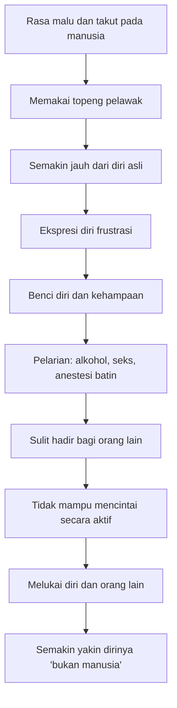
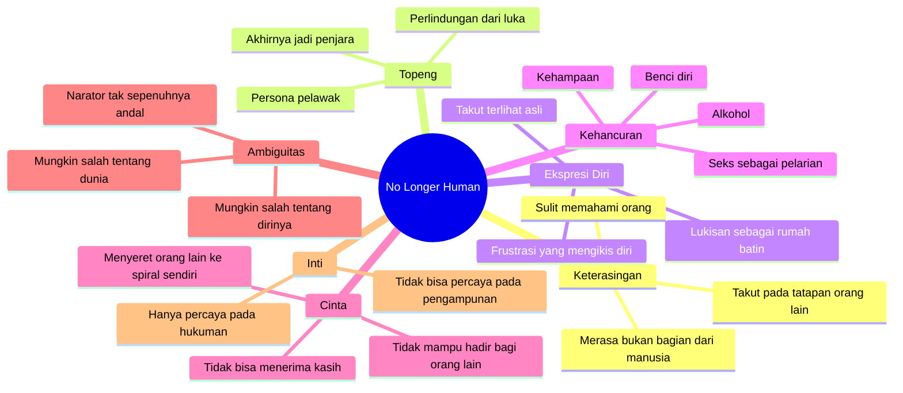

## 🌒 Pendahuluan: Mengapa *No Longer Human* Terasa Begitu Mengganggu?

Ada novel-novel yang menyedihkan. Ada novel-novel yang gelap. Ada juga novel-novel yang brutal dalam menggambarkan kehancuran manusia. Tetapi *No Longer Human* karya **Osamu Dazai** terasa berbeda. Ia tidak hanya membuat kita sedih. Ia membuat kita **tidak nyaman**, karena ia menyorot bagian diri manusia yang biasanya disembunyikan rapat-rapat: rasa malu, keterasingan, kepura-puraan, ketakutan untuk benar-benar terlihat, dan kehancuran batin yang berjalan diam-diam di balik wajah yang tampak biasa. 🌒

Itulah sebabnya novel ini sering disebut sebagai salah satu karya sastra psikologis paling mengganggu yang pernah ditulis. Ia tidak mengganggu karena penuh kejutan sensasional. Ia mengganggu karena ia terasa **terlalu dekat** dengan sesuatu yang sebenarnya sudah ada di dalam banyak orang, hanya saja jarang diakui secara terang-terangan.

Tokoh utamanya, **Ōba Yōzō** *(sering ditulis Oba/Oba Yozo dalam transliterasi longgar)*, hidup dengan perasaan bahwa dirinya secara mendasar berbeda dari orang lain—seolah-olah ia tidak benar-benar termasuk ke dalam umat manusia. Karena itu, banyak pembaca merasa judul *No Longer Human* sangat tepat. Namun, secara harfiah dan maknawi, beberapa penerjemah berpendapat bahwa judul ini lebih dekat ke arti:

> **“disqualified from humanity”** *(terdiskualifikasi dari kemanusiaan / tersingkir dari kemanusiaan)*

Ini penting sekali. Sebab Yōzō tidak pernah benar-benar merasa “sepenuhnya manusia” sejak awal. Jadi kisahnya bukan tentang manusia yang kehilangan kemanusiaan di tengah jalan, tetapi tentang seseorang yang sejak awal merasa **tidak pernah sungguh diterima ke dalam dunia manusia**. 😔

Artikel ini akan membedah novel ini secara sangat mendalam melalui beberapa poros utama:

- kehidupan pura-pura dan topeng sosial,
- frustrasi ekspresi diri,
- rasa malu dan benci diri,
- ketidakmampuan mencintai,
- narasi yang tidak dapat dipercaya,
- dan pertanyaan terakhir yang paling tragis: 
  **apakah Yōzō sungguh terasing dari manusia, atau ia hanya terlalu lama mempercayai gambaran salah tentang dirinya sendiri?**

---

<Callout type="warning" title="Catatan Isi">
Novel *No Longer Human* memuat tema-tema yang sangat berat: trauma, kekerasan, penyalahgunaan zat, kehancuran diri, dan keputusasaan psikologis. Artikel ini membahasnya dalam kerangka sastra dan psikologi secara serius, bukan untuk sensasi, tetapi karena bobot emosional novel ini memang terletak di sana.
</Callout>

---

## 🎭 1. Hidup sebagai Kepura-puraan: Topeng yang Lahir dari Ketakutan

Salah satu ide paling kuat dalam *No Longer Human* adalah bahwa Yōzō tidak hidup sebagai dirinya sendiri. Ia hidup sebagai **sebuah peran**. Ia mengenakan topeng badut, pelawak, pelucu, penghibur—bukan karena ia spontan riang, tetapi karena ia putus asa. 🎭

Sejak kecil, Yōzō merasa orang lain membingungkan. Ia tidak memahami manusia sebagai individu-individu yang tenang dan bisa dipelajari. Ia merasakan manusia sebagai kekuatan asing, semacam makhluk besar yang rumit, tak terduga, dan berpotensi melukainya. Maka ia tumbuh bukan dengan rasa nyaman di dunia sosial, tetapi dengan rasa **takut yang terus-menerus**.

Di titik ini, rasa malu Yōzō menjadi sentral. Kalimat pembuka buku sangat terkenal:

> **“Mine has been a life of much shame.”**
> **“Hidupku adalah hidup yang dipenuhi rasa malu.”**

Rasa malu ini bukan malu sesaat karena melakukan kesalahan tertentu. Ini lebih dalam. Ini adalah rasa malu yang eksistensial *(existential shame / rasa malu yang menyentuh inti keberadaan)*—seolah-olah keberadaan dirinya sendiri sudah salah dari awal.

Karena takut dan malu, Yōzō memilih strategi yang sangat manusiawi sekaligus sangat berbahaya: **ia tampil sebagai sesuatu yang lucu, ringan, aman, dan menyenangkan bagi orang lain.** Kalau orang tertawa, mungkin mereka tidak akan menyerangnya. Kalau orang terhibur, mungkin mereka tidak akan membongkar siapa dirinya yang sebenarnya.

Jadi topeng jester *(badut/pelawak)* yang dipakai Yōzō bukan aksesori. Ia adalah **alat bertahan hidup**. Masalahnya, alat bertahan hidup ini kemudian berubah menjadi penjara.

### Topeng yang Awalnya Melindungi, Lalu Mengurung

Inilah salah satu ironi paling menyakitkan dalam novel ini. Awalnya, Yōzō memakai topeng untuk menyembunyikan sesuatu. Tetapi begitu topeng itu dipakai terus-menerus, ia benar-benar menciptakan situasi baru:

- sekarang ada diri asli yang disembunyikan,
- ada persona palsu yang dipertontonkan,
- dan ada jarak yang makin lebar antara keduanya.

Artinya, solusi yang ia pilih untuk mengatasi rasa takut justru memperparah rasa takut itu.

Sebelum memakai topeng, ia takut orang akan menemukan dirinya yang “aneh”.
Sesudah memakai topeng, ia takut topengnya jatuh.

Dan itu membuat hidupnya berubah menjadi permainan yang sangat tegang:

> **jangan sampai peran gagal. jangan sampai orang melihat ke balik layar. jangan sampai aku terlihat apa adanya.**

Di sini Dazai sangat tajam. Ia menunjukkan bahwa **kepura-puraan sosial tidak selalu lahir dari niat manipulatif**. Kadang ia lahir dari luka. Dari ketakutan. Dari kebutuhan bertahan. Tetapi tetap saja, kepura-puraan yang terus dipelihara akan merusak jiwa dari dalam. 🫥

---

## 👁️ 2. Takut “Diketahui”: Bukan Takut Diadili, Tapi Takut Terbongkar

Ada bentuk ketakutan yang sangat umum: takut dihakimi. Banyak orang mengalaminya. Tetapi ketakutan Yōzō lebih spesifik dan lebih ekstrem. Ia bukan hanya takut dinilai buruk. Ia takut **“ketahuan”**.

Ini perbedaan yang penting.

Takut dihakimi berarti kita khawatir orang melihat sisi buruk tertentu pada diri kita. Tetapi takut ketahuan berarti kita merasa bahwa **seluruh diri kita adalah rahasia yang tidak boleh terbuka**. Seolah-olah bila rahasia itu terbongkar, seluruh hubungan kita dengan dunia akan runtuh.

Yōzō hidup seperti itu.

Karena itu, kehidupan masa kecilnya menjadi satu panggung besar. Ia tidak bertanya: “Apa yang aku mau?” Ia bertanya: “Apa yang harus diperankan agar situasi aman?”

Ada contoh kecil tapi sangat kuat ketika ayahnya bertanya apa hadiah yang diinginkannya dari Tokyo. Alih-alih menjawab secara langsung, Yōzō membeku. Ia tidak tahu harus menginginkan apa. Bahkan di hadapan pertanyaan sederhana tentang keinginan pribadi, ia tidak bisa menjawab sebagai dirinya sendiri—ia malah mencari jawaban yang cocok untuk karakter yang sedang ia mainkan.

Ini sangat tragis. Karena itu artinya Yōzō sudah terputus bukan cuma dari orang lain, tetapi juga dari **keinginannya sendiri**. 😢

### Persekusi yang Mungkin Tidak Pernah Ada, Tapi Terasa Nyata

Setelah gagal memberi respons yang “tepat”, Yōzō membayangkan ayahnya akan melakukan pembalasan yang mengerikan. Dari luar, pikiran ini terasa berlebihan, bahkan aneh. Tetapi secara psikologis, ia masuk akal jika kita memahami logika batin Yōzō:

- ia merasa sedang menipu semua orang,
- ia yakin ada sesuatu yang salah dalam dirinya,
- maka setiap kegagalan kecil terasa seperti bukti bahwa pembongkaran besar akan segera terjadi.

Dengan kata lain, rasa bersalah internal Yōzō membuatnya melihat **ancaman eksternal** di mana ancaman itu mungkin sebenarnya tidak sebesar yang ia bayangkan.

Ini adalah salah satu hal paling penting dalam novel ini:

> **cara kita membayangkan diri kita sendiri akan memengaruhi cara kita membayangkan respons dunia terhadap kita.**

Kalau seseorang yakin dirinya pada dasarnya rusak, maka tatapan biasa dari orang lain bisa terasa seperti ancaman, teguran kecil bisa terasa seperti vonis, dan ketidaksempurnaan kecil bisa terasa seperti awal bencana besar.

---

## 🤹 3. Badut sebagai Strategi Bertahan: Lucu, Tapi Tidak Pernah Aman

Yōzō menjadikan dirinya lucu. Ia menjadi pelawak. Ia membuat orang tertawa. Tetapi ada satu hal yang sangat menyakitkan: ketika orang tertawa, ia tidak benar-benar bahagia. Ia lebih sering hanya **lega**.

Ini penting.

Bahagia berarti ada hubungan positif yang sungguh terjadi. Lega berarti bahaya untuk sementara lewat.

Bagi Yōzō, keberhasilan sosial tidak memberi kedekatan. Ia hanya memberi jeda dari ancaman. Maka pujian, tawa, penerimaan, bahkan perhatian orang lain pun tidak menyembuhkan luka dasarnya. Semua itu hanya menegaskan bahwa yang diterima oleh dunia adalah **topeng**, bukan dirinya.

Dan jika pujian ditujukan pada topeng, maka pujian itu tidak pernah benar-benar terasa masuk. Sebab ia tahu, atau setidaknya merasa tahu, bahwa semua itu bukan untuk “Yōzō asli.”

Karena itu, ia tetap kesepian bahkan ketika performanya berhasil.

Ini adalah potret yang sangat modern. Banyak orang hidup seperti ini:
- terlihat ramah,
- mudah bercanda,
- sosial,
- bahkan populer,
- tetapi sesungguhnya hidup dengan perasaan bahwa **tak ada satu pun yang sungguh mengenal mereka**.

Dan kalau tidak ada yang mengenalmu, maka dicintai pun terasa mustahil. 😶

---

## 🎨 4. Ekspresi Diri yang Tersumbat: Mengapa Melukis Menjadi Satu-Satunya Ruang Bernapas?

Salah satu bagian paling indah sekaligus paling menyedihkan dari novel ini adalah bahwa ada saat-saat singkat ketika Yōzō hampir terasa hidup. Dan salah satu puncaknya adalah ketika ia **melukis**. 🎨

Di masa kecil, ia membuat self-portraits *(potret diri)* yang menampilkan bagian-bagian dirinya yang tidak pernah ia tunjukkan di hadapan dunia. Lewat lukisan, ia menemukan ruang aman di mana dirinya yang tersembunyi bisa muncul tanpa harus langsung berhadapan dengan reaksi sosial.

Ini sangat penting karena menunjukkan satu hal besar:

> **manusia butuh tempat untuk mengekspresikan diri, walau tidak selalu bisa melakukannya secara penuh di ruang publik.**

Dazai tidak sedang mengajarkan bahwa semua orang harus selalu total autentik, telanjang sepenuhnya di depan dunia, tanpa topeng sama sekali. Bahkan novel ini justru memperlihatkan bahwa kehidupan sosial memang memerlukan sejumlah kepura-puraan kecil. Ada sopan santun, ada diplomasi, ada penahanan diri, ada konteks.

Tetapi Dazai juga menunjukkan bahwa jika seseorang **sama sekali tidak punya ruang untuk mengekspresikan inti dirinya**, ia akan mulai layu dari dalam.

Yōzō tidak hancur semata-mata karena ia berpura-pura. Ia hancur karena ia hampir **tidak punya rumah batin** tempat dirinya sendiri bisa hadir.

Melukis sempat menjadi rumah itu. Namun rumah itu tidak bertahan lama. Dan ketika ia kehilangan ruang ekspresi ini, kejatuhannya menjadi jauh lebih cepat.

---

## 🍷 5. Alkohol, Seks, dan Pelarian dari Diri Sendiri

Saat dewasa, Yōzō mulai menempuh jalur yang dalam banyak kisah kehancuran diri terasa familiar:
- minum berat,
- hubungan yang tidak sehat,
- pelarian ke kenikmatan sesaat,
- dan pencarian mati-matian terhadap sesuatu yang bisa mematikan rasa sadar terhadap diri sendiri.

Penting untuk dipahami: semua ini tidak hanya lahir dari takut pada orang lain. Ada lapisan lain yang lebih gelap. Yōzō juga mulai takut **berada bersama dirinya sendiri**. 🍷

Ada momen ketika ia duduk sendirian di kamar, dan itu sendiri terasa seperti ancaman. Ini memperlihatkan bahwa yang ia hindari bukan sekadar dunia luar. Ia juga menghindari ruang di mana ia terpaksa berhadapan dengan:
- suara batinnya,
- kebenciannya pada diri sendiri,
- dan ketiadaan identitas yang stabil.

Maka alkohol dan hubungan-hubungan yang destruktif berfungsi sebagai anestesi *(pembius)*. Bukan penyembuhan. Bukan perbaikan. Hanya pembiusan.

Di titik ini, topeng jester yang dulu tampak seperti strategi cerdas mulai terasa olehnya sendiri sebagai **“buffoonery of defeat”** *(kebadutan dari kekalahan)*. Ia tak lagi merasa sebagai manipulator jenius. Ia mulai melihat dirinya sebagai sosok yang patut dikasihani, bahkan menjijikkan. Ia bukan cuma terasing dari orang lain; ia terasing dari dirinya sendiri. 🌫️

---

## 🪞 6. Ekspresi Diri, Depresi, dan Lingkaran Setan Kehidupan Batin

Salah satu kekuatan psikologis dari *No Longer Human* adalah bagaimana novel ini menunjukkan sebuah lingkaran setan yang sangat realistis:

1. seseorang takut mengekspresikan dirinya,
2. ia mulai hidup lewat persona palsu,
3. persona palsu itu membuatnya makin jauh dari diri sendiri,
4. keterasingan itu menurunkan harga diri,
5. harga diri yang menurun membuat ekspresi diri makin sulit,
6. lalu semua itu makin memperdalam depresi, apati, dan kehancuran.

Ini bukan proses dramatis yang selalu kelihatan dari luar. Justru kekuatan Dazai adalah menggambarkan kehancuran sebagai sesuatu yang **terjadi sedikit demi sedikit**, lewat pilihan-pilihan kecil, kompromi batin kecil, penghindaran kecil, kepalsuan kecil, sampai akhirnya seseorang merasa tidak tahu lagi siapa dirinya.

Maka ketika kita membaca Yōzō, kita tidak sedang membaca satu ledakan besar semata. Kita sedang membaca **erosi identitas**. Sedikit demi sedikit, dirinya terkikis. 🌧️

---

## ❤️ 7. Ketidakmampuan Mencintai: Neraka Bukan Hanya Tidak Dicintai, Tapi Tidak Mampu Mencintai

Salah satu bagian paling kuat dari analisis novel ini adalah tema **ketidakmampuan mencintai**. Di sini, sangat menarik menghubungkannya dengan gagasan Fyodor Dostoevsky dalam *The Brothers Karamazov* bahwa neraka adalah **ketidakmampuan untuk mencintai**.

Yōzō sendiri mengatakan bahwa ia merasa “deficient in the faculty to love others” *(cacat dalam kemampuan untuk mencintai orang lain)*. Ini bukan pengakuan yang remeh. Ini adalah diagnosis moral dan eksistensial yang sangat berat. ❤️

Namun, persoalannya rumit. Yōzō bukan sosok yang dingin murni. Ia bukan psikopat datar yang sama sekali tidak punya perasaan. Masalahnya lebih pelik:

- ia terlalu terputus dari dirinya sendiri,
- terlalu takut pada orang lain,
- terlalu tenggelam dalam rasa malu,
- sehingga ia tidak sanggup hadir bagi orang lain secara aktif dan nyata.

Cinta, dalam makna yang matang, menuntut kemampuan untuk keluar dari pusat diri dan menginginkan kebaikan orang lain, bahkan kadang dengan mengorbankan kenyamanan diri. Tetapi Yōzō hampir tidak punya sumber daya batin untuk itu. Ia terlalu sibuk bertahan dari dirinya sendiri.

### Suna: Apakah Itu Cinta, Jika Kamu Setuju Mati Bersamanya?

Hubungan Yōzō dengan **Suna/Sunao/Tsuneko** (tergantung transliterasi) sangat penting. Ia tampak seperti salah satu orang pertama yang membuat Yōzō merasa bisa sedikit menjadi diri sendiri. Namun ketika perempuan ini mengajak bunuh diri bersama, Yōzō tidak segera melawan ide itu demi menyelamatkannya. Ia justru setuju. Perempuan itu mati. Yōzō selamat.

Sesudahnya, Yōzō berkata bahwa dialah satu-satunya orang yang pernah ia cintai.

Tetapi novel memaksa kita bertanya:

> **jika kamu mencintai seseorang, bisakah kamu begitu cepat ikut menyerah pada kehancurannya?**

Mungkin Yōzō memang merasakan sesuatu yang nyata. Tetapi jelas ada keterbatasan mengerikan dalam cintanya. Ia tidak cukup utuh untuk menjaga hidup orang yang katanya ia cintai. Ini membuat rasa cintanya terasa campur aduk dengan:
- keputusasaan,
- ketergantungan,
- dan pelarian dari rasa sakit.

Dengan kata lain, ia mungkin merasa cinta, tetapi ia tidak memiliki **kemampuan aktif untuk mencintai secara menyelamatkan**.

### Yoshiko dan Egoisme Keputusasaan

Hal yang sama terlihat dalam hubungannya dengan **Yoshiko**. Ia menikah hampir tanpa benar-benar memikirkan dirinya sebagai subjek utuh. Ia menikmati kenyamanan yang didapat dari relasi itu, tetapi gagal hadir sebagai suami yang sungguh peduli. Ketika Yoshiko mengalami kekerasan yang mengerikan, ia tidak membela atau melindunginya dengan cara yang seharusnya. Setelah itu, ia makin tenggelam ke alkohol, morfin, dan relasi-relasi lain yang merusak.

Di sini Dazai sangat jujur dan sangat tidak romantis. Ia menunjukkan sesuatu yang sering tidak enak dibicarakan dalam budaya populer:

> **orang yang sangat menderita bisa tetap melukai orang lain dengan hebat.**

Penderitaan tidak otomatis memuliakan. Kadang penderitaan malah menyempitkan pandangan seseorang sampai ia hanya bisa melihat luka dirinya sendiri, dan karena itu mulai menyeret orang lain ke dalam pusaran kehancuran yang sama. 🕳️

---

---

## 🤝 8. Tetapi… Bukankah Banyak Orang Justru Baik Padanya?

Inilah salah satu ironi paling menghancurkan dalam novel ini. Yōzō berkali-kali merasa bahwa dunia manusia adalah kekuatan asing yang memusuhinya. Tetapi kalau kita perhatikan detail-detail novel, kita menemukan sesuatu yang mengejutkan:

**cukup banyak orang justru menunjukkan kebaikan padanya.**

Ada orang-orang yang:
- menolongnya,
- memberi tempat tinggal,
- mempercayainya,
- mencarikannya pekerjaan,
- menopangnya saat jatuh,
- dan bahkan tetap menunjukkan simpati meski melihat sisi-sisi gelap hidupnya.

Jadi kita dipaksa bertanya:

> **apakah dunia memang sekejam yang Yōzō yakini, ataukah Yōzō sudah terlalu tenggelam dalam narasi gelap tentang dirinya sendiri sehingga tak lagi mampu melihat kasih yang sebenarnya ada?**

Ini penting sekali, karena di sini Dazai membawa novel ini keluar dari sekadar kisah depresi individual menuju pertanyaan epistemologis *(pertanyaan tentang bagaimana kita mengetahui realitas)*.

Mungkin Yōzō tidak sepenuhnya salah. Ia memang trauma. Ia memang dilukai. Tetapi bisa jadi ia juga **menafsirkan seluruh realitas melalui lensa penghukuman diri**. Maka kebaikan orang lain pun tidak masuk. Ia tidak bisa mempercayainya. Atau ia tidak cukup sehat untuk menerimanya sebagai nyata.

Dan ini salah satu bentuk kesedihan paling besar dalam hidup manusia:

> kadang orang benar-benar mengasihi kita, tetapi kita terlalu rusak untuk mempercayai bahwa kasih itu sungguh ditujukan kepada kita. 😞

---

## 📓 9. Narator yang Tidak Sepenuhnya Bisa Dipercaya

Salah satu kekuatan sastra terbesar *No Longer Human* adalah bahwa novel ini tidak sepenuhnya meminta kita menerima semua yang dikatakan Yōzō sebagai realitas objektif. Ia adalah narator yang sangat kuat, sangat jujur secara emosional, tetapi belum tentu **akurat secara faktual maupun moral**. 📓

Ini terlihat jelas menjelang akhir, ketika tokoh lain yang mengenalnya memberikan kesan tentang dirinya yang sangat berbeda. Ada orang yang tetap melihat Yōzō sebagai sosok baik, lembut, bahkan “angelic” *(seperti malaikat / baik hati)* dalam caranya sendiri.

Maka muncul beberapa kemungkinan besar:

### Kemungkinan 1: Yōzō sukses total menyembunyikan diri
Ia benar-benar berhasil memakai topengnya sedemikian sempurna sehingga orang-orang tidak pernah melihat kehancuran dan sisi gelap batinnya.

### Kemungkinan 2: Orang lain sebenarnya melihat lukanya dan tetap memilih berbaik hati
Kalau ini benar, maka Yōzō salah besar saat meyakini semua orang adalah ancaman.

### Kemungkinan 3: Yōzō memang terlalu keras pada dirinya sendiri
Artinya, ia bukan hanya seorang yang menderita, tetapi juga seseorang yang **mendistorsikan dirinya sendiri** lewat rasa bersalah, rasa malu, dan narasi penghukuman diri yang tak pernah berhenti.

Kalau kemungkinan ketiga ini benar, maka tragedinya menjadi jauh lebih besar:

> Yōzō bisa jadi menghabiskan hidupnya di dalam penjara batin yang ia bangun dan ia pelihara sendiri, sambil percaya bahwa penjara itu adalah hukum alam. 🔒

Ini tidak berarti trauma dan perilakunya tidak nyata. Tentu nyata. Tetapi cara ia menafsirkan dirinya sendiri mungkin jauh lebih gelap daripada kenyataan yang dilihat orang lain.

---

## 🌫️ 10. “Tidak Lagi Manusia” atau Hanya Tidak Pernah Merasa Menjadi Manusia?

Sampai titik ini, kita bisa melihat betapa kaya dan mengganggunya judul novel ini. *No Longer Human* bisa dibaca sebagai:

- rasa terputus dari orang lain,
- rasa kehilangan martabat manusia,
- rasa gagal memenuhi standar sosial,
- atau rasa bahwa diri sendiri memang sejak awal bukan bagian dari umat manusia.

Tetapi novel ini sengaja tidak memberi jawaban final. Dazai tidak membuat semuanya rapi. Ia membiarkan pertanyaan tetap terbuka:

- apakah Yōzō benar-benar berbeda secara mendasar?
- apakah trauma masa kecil membuatnya terasing sedalam itu?
- apakah kepura-puraan dan rasa malu mengubahnya jadi makin asing?
- ataukah semua itu pada dasarnya adalah hasil dari citra diri yang terdistorsi, yang diulang terus sampai menjadi nasib? 🌫️

Kemungkinan-kemungkinan ini tidak saling meniadakan. Justru mungkin semuanya ikut berperan.

Dan itulah yang membuat novel ini besar: ia tidak mereduksi penderitaan manusia ke satu sebab tunggal. Ia tahu bahwa kehancuran jiwa biasanya lahir dari campuran yang kusut:
- trauma,
- ketakutan,
- rasa malu,
- kebiasaan bersembunyi,
- kegagalan mengekspresikan diri,
- dan keyakinan keliru tentang diri sendiri yang makin lama makin terasa absolut.

---

## 🙏 11. Tidak Bisa Percaya pada Kasih, Hanya Bisa Percaya pada Hukuman

Salah satu kutipan paling penting dari novel ini adalah ketika Yōzō berkata bahwa ia takut bahkan pada Tuhan. Ia tidak bisa percaya pada cinta Tuhan, hanya pada hukumannya. Ia bisa percaya pada neraka, tetapi tidak pada surga.

Ini adalah inti akhir dari psikologi Yōzō. Bukan hanya bahwa ia merasa kotor atau salah, tetapi bahwa ia **tidak bisa membayangkan pengampunan sebagai sesuatu yang nyata.** 🙏

Kalau seseorang tak bisa mempercayai kemungkinan penebusan *(redemption / pemulihan moral dan batin)*, maka semua kesalahannya akan menumpuk menjadi identitas. Bukan lagi “aku melakukan hal buruk,” tetapi “aku memang makhluk yang buruk.”

Dan ketika seseorang sampai pada titik itu, perubahan jadi terasa sia-sia. Mengapa berubah, kalau toh diriku tetap kotor? Mengapa menjadi lebih baik, kalau aku sudah terlalu jauh rusak? Mengapa meminta bantuan, kalau aku memang pantas dihukum?

Di sinilah *No Longer Human* sangat kejam dan sangat jujur. Ia memperlihatkan bahwa salah satu hal paling menghancurkan dalam hidup manusia bukan sekadar dosa atau kesalahan, melainkan:

> **ketidakmampuan membayangkan bahwa kita masih layak ditolong.**

Yōzō terus melukai dirinya dan orang lain karena ia tidak bisa melihat jalan pulang. Dalam pikirannya, tidak ada pulang. Yang ada hanya kelanjutan dari penurunan. 📉

---

## 🧠 12. Apa yang Membuat Novel Ini Sangat Relevan Hari Ini?

Meski ditulis dalam konteks Jepang modern awal dan sangat terkait dengan kehidupan batin Osamu Dazai sendiri, novel ini terasa sangat relevan hari ini. Mengapa?

Karena sangat banyak orang modern hidup dengan versi yang lebih halus dari problem Yōzō:

- tampil ramah dan lucu untuk menutupi kecemasan,
- merasa tidak sungguh dikenal siapa pun,
- tidak tahu apa yang sebenarnya diinginkan diri sendiri,
- merasa harus terus memerankan karakter tertentu agar diterima,
- tidak mampu percaya bahwa orang lain bisa mencintai dirinya yang asli,
- dan lama-lama bingung, “kalau topeng ini kulepas, siapa aku sebenarnya?” 🤔

Kita tentu tidak perlu menarik semua pengalaman modern ke level ekstrem Yōzō. Itu akan terlalu sederhana dan tidak adil. Tetapi novel ini memberi kita peringatan yang sangat kuat tentang satu jalur berbahaya:

> **jika seseorang terlalu lama hidup hanya sebagai performa, ia bisa kehilangan akses ke rumah batinnya sendiri.**

Dan begitu rumah itu hilang, kesepian menjadi jauh lebih dalam daripada sekadar “tidak punya teman.” Ia menjadi kesepian ontologis *(ontological loneliness / kesepian pada level keberadaan)*—kesepian karena tidak lagi tahu bagaimana tinggal bersama diri sendiri.

---

---

## 🕯️ Kesimpulan: Pelajaran Pahit dari Kegagalan Yōzō

*No Longer Human* pada akhirnya bukan novel yang memberi solusi nyaman. Ia tidak menutup dirinya dengan terapi singkat, nasihat motivasional, atau kemenangan batin yang rapi. Dan mungkin justru di sanalah kejujurannya. 🕯️

Ini adalah kisah tentang seseorang yang:
- merasa terputus dari manusia,
- menanggapi itu dengan topeng sosial,
- kehilangan kemampuan mengekspresikan diri,
- lalu tenggelam makin dalam ke benci diri, pelarian, dan kegagalan mencintai.

Namun novel ini juga diam-diam menyimpan pertanyaan yang jauh lebih menyayat daripada sekadar “mengapa Yōzō hancur?”

Pertanyaan itu adalah:

> **bagaimana jika sebagian besar penderitaannya berasal dari keyakinan yang tak pernah ia uji sepenuhnya—bahwa ia memang tak layak dicintai, tak layak dimengerti, dan secara hakiki terpisah dari umat manusia?**

Kalau itu benar, maka tragedi Yōzō menjadi lebih besar dari sekadar nasib buruk. Ia menjadi tragedi tentang **salah paham yang membeku menjadi identitas**. Tentang seseorang yang begitu lama memandang dirinya sebagai monster, sampai hampir seluruh hidupnya dihabiskan untuk membuktikan tuduhan itu kepada dirinya sendiri.

Dan mungkin itulah kekuatan paling menghantui dari novel ini: ia tidak hanya menunjukkan jurang psikologis yang ekstrem, tetapi juga memperingatkan kita tentang versi-versi kecilnya dalam hidup sehari-hari.

Setiap kali kita:
- terlalu lama memakai topeng,
- takut menunjukkan kerentanan,
- menolak pertolongan karena merasa tak layak,
- atau menganggap diri kita tak bisa ditebus,

kita sedang bergerak, walau dalam skala kecil, di jalur yang oleh Dazai digambarkan dengan begitu menghancurkan.

Karena itu, *No Longer Human* bukan cuma buku tentang satu orang yang gagal menjadi manusia. Ia adalah buku tentang betapa mudahnya manusia **merasa** gagal menjadi manusia—dan betapa berbahayanya jika perasaan itu dibiarkan menjadi seluruh kenyataan. 🌒

---

<Callout type="important" title="Inti novel ini">
*No Longer Human* menunjukkan bahwa keterasingan paling mengerikan bukan selalu ketika dunia menolak kita, tetapi ketika kita begitu lama hidup dalam rasa malu dan kepura-puraan sampai tidak lagi mampu menerima kemungkinan bahwa kita masih bisa dikenal, dicintai, dan ditebus.
</Callout>

<Callout type="cite" title="Sumber">
- Video sumber: *The Most Disturbing Book Ever Written | No Longer Human*
- Kanal/sumber: YouTube
- Karya utama yang dibahas: *No Longer Human* karya Osamu Dazai
- Fokus artikel: keterasingan, topeng sosial, frustrasi ekspresi diri, ketidakmampuan mencintai, dan ambiguïtas narasi psikologis.
</Callout>
