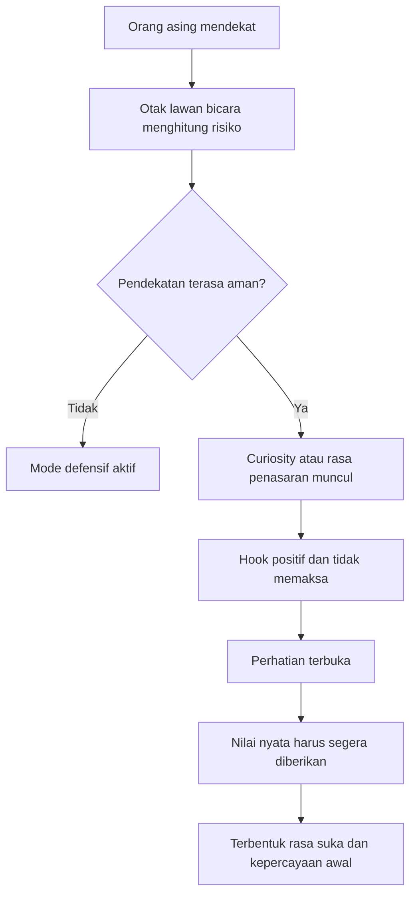
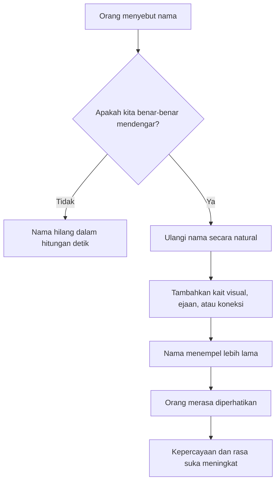
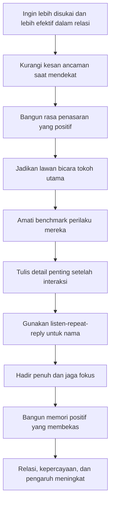

## 🎭 Pendahuluan: Oz Pearlman Tidak Mengajarkan “Membaca Pikiran”, tetapi Membaca **Manusia**

Kalau seseorang mendengar kata **mentalist**, bayangan pertamanya biasanya dramatis: orang yang bisa membaca pikiran, menebak kartu, mengetahui nama dalam kepala kita, atau menebak keputusan yang bahkan belum kita ucapkan. Itu memang citra publiknya. Tetapi justru bagian paling penting dari wawancara ini adalah ketika **Oz Pearlman** dengan jujur berkata bahwa ia **tidak membaca pikiran**. Ia membaca **orang**. Dan itu perbedaan yang sangat besar. 🎭

Banyak orang tertarik pada hasil akhirnya—bagaimana ia bisa menebak kartu, nama, huruf, atau tokoh yang ada dalam kepala lawan bicara. Namun Oz berkali-kali mengembalikan diskusi ke fondasi yang jauh lebih praktis dan jauh lebih relevan untuk kehidupan sehari-hari, yaitu:

- bagaimana orang merasa nyaman atau tidak nyaman di hadapan kita,
- bagaimana perhatian diarahkan,
- bagaimana rasa suka dibangun,
- bagaimana seseorang memberi tanda minat atau kebohongan,
- bagaimana memori bekerja dalam hubungan sosial,
- dan bagaimana kita bisa membuat orang lain merasa dilihat, didengar, dan diingat. ✨

Di titik itu, wawancara ini sebenarnya bukan tentang sulap. Ini tentang **arsitektur interaksi manusia**. Oz menggunakan dunia mentalism sebagai panggung, tetapi pelajaran yang ia petik lebih dalam dari sekadar hiburan. Ia berbicara tentang:

- *misdirection* *(pengalihan perhatian)*,
- *influence* *(pengaruh)*,
- *suggestion* *(sugesti)*,
- *benchmarks* *(patokan dasar perilaku)*,
- *confidence* *(kepercayaan diri)*,
- *curiosity gap* *(celah rasa penasaran)*,
- *active listening* *(mendengar aktif)*,
- hingga *memory hooks* *(kait memori)* yang membuat seseorang merasa istimewa.

Dan justru karena Oz mengaku tidak punya kekuatan supernatural, pembahasannya menjadi lebih berharga. Artinya, apa yang ia lakukan tidak datang dari keajaiban, melainkan dari **latihan observasi, persiapan, struktur komunikasi, kepekaan sosial, dan penguasaan fokus**. Itu berarti ada banyak bagian dari keahliannya yang bisa dipelajari dan diadaptasi siapa saja untuk kehidupan nyata.

Kalau harus diringkas dalam satu tesis besar, maka tesis artikel ini adalah:

> **Pelajaran utama dari Oz Pearlman bukanlah cara menjadi “orang misterius yang bisa menebak pikiran”, melainkan cara menjadi sosok yang peka terhadap cara kerja perhatian, rasa aman, rasa suka, memori, dan emosi—lalu menggunakannya secara etis untuk membangun koneksi, kepercayaan, dan pengaruh yang sehat.**

Dalam artikel ini, kita akan membedah wawancara tersebut secara sangat rinci. Kita akan bahas:

- mengapa pendekatan fisik kecil bisa mempengaruhi rasa aman seseorang,
- mengapa kesalahan kecil bisa membuat orang langsung tidak suka,
- apa sebenarnya arti “membaca orang” dalam konteks nyata,
- bagaimana mendeteksi minat dan kebohongan lewat *benchmark* perilaku,
- bagaimana membangun kepercayaan dan karisma,
- bagaimana memori menjadi senjata sosial yang sangat kuat,
- bagaimana rasa takut ditolak membatasi hidup,
- dan mengapa cerita, perhatian, serta momen kecil justru bisa mengubah jalan hidup seseorang. 🧠

Artikel ini juga akan menjaga satu hal yang penting: **etika**. Karena pengaruh tanpa etika akan sangat mudah berubah menjadi manipulasi. Dan Oz sendiri, meski bermain dengan ilusi, memberi banyak bahan untuk membedakan dua dunia itu.

---

<Callout type="important" title="Tesis utama artikel ini">
Oz Pearlman menunjukkan bahwa keberhasilan sosial, profesional, dan personal tidak terutama datang dari “membaca pikiran”, tetapi dari kemampuan membaca manusia: rasa takutnya, rasa penasarannya, titik resistensinya, cara ia memberi perhatian, dan apa yang membuatnya merasa dipahami.
</Callout>

---

## 🧠 1. “Saya Tidak Membaca Pikiran, Saya Membaca Orang” — Kalimat Paling Penting dalam Seluruh Wawancara

Inilah fondasi yang tidak boleh terlewat. Oz mengatakan dengan sangat jelas:

> **“I can’t read minds. I read people.”**

Kalimat ini kelihatannya sederhana, tetapi sebenarnya memindahkan seluruh pembahasan dari dunia mistik ke dunia psikologi praktis.

### Apa bedanya membaca pikiran dan membaca orang?

#### **Membaca pikiran**
- terdengar seperti akses langsung ke isi kepala,
- seolah kita bisa tahu isi batin orang tanpa observasi,
- sifatnya magis, total, dan nyaris absolut.

#### **Membaca orang**
- berarti memahami pola perilaku,
- mengamati reaksi kecil,
- mengenali konteks,
- membaca rasa aman atau rasa terancam,
- melihat arah perhatian,
- dan menilai kecenderungan berdasarkan sinyal yang muncul.

Dengan kata lain, Oz sedang mengatakan bahwa yang ia kuasai bukan keajaiban, melainkan **struktur perilaku manusia yang sangat halus**. Dan justru di situlah pelajarannya menjadi berguna.

Karena dalam hidup nyata, kita tidak butuh membaca isi kepala 100%. Kita hanya perlu jadi lebih baik dalam hal-hal berikut:

- mengetahui apakah orang di depan kita nyaman atau defensif,
- apakah ia tertarik atau bosan,
- apakah ia sedang jujur atau menghindar,
- apakah presentasi kita tentang diri sendiri membuat orang tertarik atau justru menjauh,
- dan bagaimana membuat orang merasa aman saat berinteraksi dengan kita. 👀

Oz pada dasarnya mengajak kita keluar dari fantasi “ingin tahu segalanya” menjadi keahlian yang lebih realistis dan lebih kuat:

> **membaca pola manusia yang cukup untuk membuat keputusan sosial lebih baik.**

---

## 👁️ 2. Kesalahan Kecil yang Membuat Orang Tidak Suka: Pendekatan Fisik yang Terlalu Mengancam

Salah satu potongan paling menarik dari wawancara ini adalah saat Oz menjelaskan bahwa manusia sangat dipengaruhi oleh detail fisik yang sangat kecil ketika pertama kali berinteraksi. Ia memberi contoh sederhana tetapi tajam:

- mendekat dengan posisi terlalu frontal,
- menatap langsung dengan dua mata secara penuh,
- bergerak terlalu lurus ke arah orang,

bisa terasa lebih mengancam daripada mendekat sedikit menyudut sehingga secara visual orang lebih “menerima” kehadiran kita. 👁️

### Penjelasan psikologis sederhananya
Oz mengaitkannya dengan *hardwired instincts* *(naluri bawaan yang tertanam sejak lama)*. Manusia ribuan tahun hidup dengan kewaspadaan terhadap ancaman. Tubuh dan otak kita masih menyimpan sisa-sisa pola itu.

Artinya, sebelum kata-kata kita diproses, sering kali tubuh lawan bicara sudah membuat penilaian awal seperti:

- aman atau tidak aman,
- terlalu agresif atau santai,
- memaksa atau mengundang,
- dekat tapi hangat atau dekat tapi mengancam.

### Implikasi praktis
Ini sangat penting untuk banyak situasi:

- **sales** *(penjualan)*,
- wawancara kerja,
- negosiasi,
- bertemu calon klien,
- mengajak bicara orang yang belum akrab,
- bahkan sekadar memulai percakapan di ruangan sosial.

Kalau pembukaan fisik kita sudah terasa terlalu menekan, orang akan mulai dari mode defensif. Kalau orang mulai dari defensif, maka semua kata-kata bagus yang datang setelah itu harus bekerja lebih keras hanya untuk “menghapus” rasa ancaman awal.

### Pelajaran besarnya
Sering kali yang membuat orang tidak suka bukan isi besar kita, tetapi **cara mikro** kita hadir:

- berdiri terlalu dekat,
- bergerak terlalu tiba-tiba,
- terlalu frontal,
- atau tidak memberi sinyal bahwa kita bisa mundur kapan saja.

Oz menyebut ini dalam konteks performa restoran ketika ia masih muda: ia belajar mendekati meja dengan sudut tertentu, seperti memberi sinyal bahwa ia **satu kaki masuk, satu kaki keluar**. Itu memberi pesan tak terucap:

> “Saya datang, tapi saya tidak memaksa. Saya bisa pergi kalau Anda tidak nyaman.”

Itu elegan. Dan sangat bisa dipakai di dunia nyata. 🤝

---

## ⚡ 3. Rasa Penasaran Positif: Bagaimana Membuka Interaksi Tanpa Memberi Orang Kesempatan Menolak Terlalu Cepat

Salah satu pelajaran paling praktis dari Oz ada pada cara ia membuka interaksi saat masih tampil di restoran. Ia belajar bahwa orang yang ia dekati langsung memproses banyak kecemasan sekaligus:

- “Siapa anak ini?”
- “Dia kerja di sini atau bukan?”
- “Apakah saya harus memberi tip?”
- “Dia akan lama di sini?”
- “Kalau saya nolak, ini jadi canggung?”

Itu artinya, ketika kita masuk ke interaksi baru, lawan bicara belum memikirkan nilai yang kita bawa. Mereka lebih dulu memikirkan **biaya mental** dari kehadiran kita.

### Solusi Oz: bangun *positive curiosity gap* *(celah rasa penasaran yang positif)*

Daripada bertanya:

> “Mau lihat sulap?”

karena itu terlalu mudah dijawab “tidak”, ia membuka dengan struktur yang lebih cerdas:

- “Sudah dengar yang terjadi malam ini?”
- “Ini malam keberuntungan Anda.”
- “Pemilik restoran membawa saya untuk memberi sesuatu yang spesial.”

Lihat yang terjadi di sini:

1. Ada rasa penasaran.
2. Ada energi positif.
3. Ada legitimasi sosial.
4. Ada pengurangan beban biaya.
5. Ada janji pengalaman, bukan permintaan.

### Kenapa ini kuat?
Karena manusia tertarik untuk menutup celah informasi yang terbuka. Ini mirip dengan notifikasi ponsel, judul video yang memancing, atau hook dalam presentasi. 🪝

Tetapi ada syarat etis yang penting: **rasa penasaran itu harus dibayar dengan nilai nyata**, bukan clickbait kosong.

Oz sendiri mengatakan, setelah pembukaan itu, ia harus benar-benar punya performa yang bagus. Ini penting sekali. Karena dalam interaksi sosial atau profesional, pembukaan yang cerdas tanpa substansi akan berubah jadi manipulasi murahan.

---

---

## 💬 4. Dalam Menjual, Meyakinkan, atau Membangun Pengaruh: Berhentilah Menjadikan Diri Sendiri sebagai Tokoh Utama

Ini salah satu prinsip terbaik dalam seluruh wawancara, dan menurut saya berlaku hampir universal. Oz berkata bahwa salah satu rahasia terbesarnya adalah:

> **“It’s not about you. It’s always about them.”**

Dalam bahasa Indonesia: **ini bukan tentang kamu. Ini selalu tentang mereka.**

Kalimat ini sederhana, tetapi kalau benar-benar dijalankan, ia mengubah hampir seluruh cara kita bicara dengan orang.

### Kesalahan umum kebanyakan orang
Ketika presentasi, pitching, negosiasi, atau berkenalan, banyak orang secara tak sadar berbicara dengan pola:

- betapa hebat saya,
- betapa bagus produk saya,
- betapa unik jasa saya,
- betapa keren pengalaman saya,
- betapa besar visi saya.

Padahal orang di depan kita biasanya sedang berpikir:

- masalah saya apa,
- hidup saya lebih mudah atau tidak,
- saya untungnya apa,
- saya aman atau tidak,
- saya harus repot atau tidak,
- saya dipercaya atau tidak.

### Oz mengubah lensa itu
Ia menekankan penggunaan **benefits-oriented language** *(bahasa yang berorientasi manfaat)*.

Bukan:
- “Produk saya canggih.”

Tetapi:
- “Saya ingin membuat hidup Anda lebih mudah.”
- “Saya ingin perpindahan ini terasa mulus tanpa downtime.”
- “Apa yang paling mengganggu Anda sekarang?”
- “Apa momen resistensi terbesar Anda agar saya bisa bantu pecahkan?”

Ini sangat kuat, karena menggeser posisi kita dari orang yang “mau menjual” menjadi orang yang “mau membantu menyelesaikan friksi”.

### Pelajaran mendalamnya
Orang lebih suka pada kita ketika mereka merasa:

- kita melihat masalah mereka,
- kita mengerti bahasa batin mereka,
- kita tidak sibuk pamer diri,
- dan kita benar-benar tertarik pada sudut pandang mereka.

Itulah bentuk awal *likability* *(kedayatarikan sosial / rasa disukai)* yang sehat.

---

## 🧪 5. Kalau Ingin Mengetahui Apakah Orang Tertarik atau Berbohong, Jangan Cari “Tanda Tunggal” — Cari **Benchmark**

Wawancara ini juga sangat berguna karena Oz tidak menjual mitos deteksi kebohongan yang instan. Ia tidak bilang, “Kalau orang melihat ke kiri berarti bohong,” atau “Kalau menyentuh hidung berarti dusta.” Justru ia menekankan sesuatu yang jauh lebih masuk akal:

> **Pelajari benchmark mereka.**

### Apa itu benchmark?
**Benchmark** adalah *baseline* *(patokan dasar / pola normal)* seseorang saat ia sedang jujur, nyaman, dan berada dalam ritme biasa.

Sebelum menilai apakah orang berbohong, kita perlu tahu:

- seperti apa ritme bicara normalnya,
- seberapa detail biasanya ia bercerita,
- bagaimana cadence-nya *(irama atau tempo bicaranya)*,
- bagaimana ekspresinya saat tidak terbebani,
- dan apa pola yang biasa ia tampilkan saat tenang.

Baru setelah itu kita bisa melihat perubahan.

### Mengapa ini penting?
Karena satu sinyal tidak universal.

- Ada orang yang memang sering gugup saat bicara.
- Ada orang yang detail sekali bahkan saat jujur.
- Ada yang bicaranya lambat secara normal.
- Ada yang minim kontak mata karena kepribadian atau budaya, bukan karena bohong.

Jadi kalau kita langsung menghakimi satu tanda tunggal, kita sangat mudah salah.

### Cara berpikir Oz
Ia mirip dengan logika *polygraph* *(alat uji kebohongan)* yang harus lebih dulu melihat pola saat seseorang menjawab jujur, lalu membandingkannya dengan pola saat menjawab bohong.

### Aplikasi sehari-hari
Kalau kamu sering berinteraksi dengan seseorang, kamu bisa amati:

- saat ia cerita hal sederhana yang benar-benar nyata,
- bagaimana detail yang ia pakai,
- apakah ia bicara cepat atau lambat,
- apakah ada banyak jeda atau tidak,
- seberapa “natural” alurnya.

Lalu ketika topik sensitif muncul, kamu tidak menilai dari nol. Kamu menilai dari **perubahan terhadap benchmark itu**.

Itu jauh lebih dewasa, lebih akurat, dan lebih adil. ✅

---

## 🧒 6. Naluri BS Detection Anak Kecil: Mengapa Kita Dulu Lebih Peka, lalu Kehilangan Sebagiannya?

Oz membuat observasi yang menarik: ketika kecil, banyak dari kita sebenarnya punya *BS detection* *(kemampuan mendeteksi omong kosong / kebohongan / ketidakselarasan)* yang cukup tajam. Anak-anak sering tahu ketika:

- kakaknya berbohong,
- orang dewasa pura-pura,
- sesuatu terasa tidak cocok,
- nada suara berbeda dari isi ucapan.

### Kenapa itu terjadi?
Anak kecil belum terlalu sibuk dengan:

- pencitraan sosial,
- teori rumit,
- rasionalisasi berlebihan,
- dan topeng interaksi yang bertumpuk.

Mereka lebih mengandalkan intuisi sensorik langsung:

- nada,
- ekspresi,
- rasa aman,
- konsistensi energi.

Oz mengaitkan ini dengan dunia performanya sendiri. Saat tampil, ia bekerja sangat intuitif dan fokus, seperti pemain ping pong yang tidak sempat “berteori” tentang setiap gerakan. Tubuh dan perhatian bekerja bersama.

### Pelajaran pentingnya
Terkadang yang perlu kita lakukan bukan “belajar seribu trik”, tetapi **meng-unlearn** *(melepas kebiasaan salah)* yang membuat kita tidak lagi percaya pada pengamatan dasar kita sendiri.

Bukan berarti semua intuisi selalu benar. Tetapi ada kebijaksanaan di sini:

> jangan terlalu cepat mematikan sinyal batin hanya karena ia tidak datang dalam bentuk rumus. 🌱

---

## 📝 7. Mengapa Catatan Bisa Mengubah Hidup: Informasi adalah Kekuatan, tetapi yang Lebih Penting adalah **Kepedulian yang Terdokumentasi**

Salah satu bagian paling praktis dari wawancara ini adalah ketika Oz bicara soal **menulis catatan**. Ia mengaku mencatat hampir semua hal penting setelah acara, pertemuan, atau interaksi selesai.

Ia menulis:

- siapa yang ia temui,
- detail keluarga mereka,
- momen lucu,
- trik apa yang dipakai,
- siapa penghubungnya,
- dan apa yang penting dari interaksi itu.

Sekilas ini terdengar sederhana, bahkan mungkin terlalu mekanis. Tetapi justru di situlah kekuatannya.

### Mengapa ini sangat kuat?
Karena sebagian besar orang menganggap detail kecil akan “hilang sendiri”. Bagi lawan bicara, banyak hal yang mereka katakan terasa seperti *Snapchat*—muncul lalu lenyap. Tetapi bagi Oz, detail itu disimpan.

Lalu saat detail itu muncul lagi satu bulan, satu tahun, bahkan sepuluh tahun kemudian, efeknya sangat besar.

### Rumus psikologisnya sederhana
Kalau seseorang merasa:

- “dia ingat hal kecil tentang saya,”
- “dia ingat anak saya,”
- “dia ingat nama pasangan saya,”
- “dia ingat pin code yang dulu saya izinkan jadi bahan pertunjukan,”

maka yang muncul bukan sekadar kagum, tetapi perasaan:

> **“Saya ternyata penting bagi dia.”**

Dan bagi manusia, itu adalah pengalaman sosial yang sangat kuat. 💛

### Ini bukan soal memori super
Bagian paling menarik: Oz menolak menjadikan ini semata-mata “bakat memori ajaib”. Ia bahkan dengan jujur berkata bahwa banyak kali rahasianya sederhana: **dia menulisnya**.

Ini penting, karena mematahkan ilusi bahwa yang hebat itu harus selalu alami. Kadang yang hebat justru adalah:

- disiplin mencatat,
- disiplin meninjau,
- dan disiplin menunjukkan perhatian kembali di saat yang tepat.

---

## 🧼 8. “Listen, Repeat, Reply”: Teknik Sederhana Mengingat Nama, tetapi Dampaknya Sangat Besar

Ini salah satu teknik paling berguna secara langsung dari wawancara. Oz menyusun teknik mengingat nama dengan adaptasi dari instruksi botol sampo: **lather, rinse, repeat**. Ia mengubahnya menjadi:

> **Listen, Repeat, Reply**

Dalam bahasa Indonesia:

> **Dengar, Ulangi, Tanggapi**

Mari kita bedah satu per satu.

### 1. **Listen** — Dengar sungguh-sungguh
Oz menekankan bahwa kebanyakan orang gagal mengingat nama bukan karena memorinya buruk, melainkan karena mereka **tidak benar-benar mendengar nama itu sejak awal**.

Saat orang memperkenalkan diri, kita sering sudah sibuk memikirkan:

- saya harus jawab apa,
- saya terlihat baik atau tidak,
- saya harus bilang sesuatu yang pintar,
- saya harus masuk ke topik utama.

Akibatnya, nama hanya melewati telinga, tidak pernah benar-benar masuk ke kesadaran.

### 2. **Repeat** — Ulangi langsung
Setelah mendengar nama, ulangi dua kali kalau bisa.

Contoh:
- “Deborah? Senang bertemu, Deborah.”
- “Steven ya? Steven dengan V atau PH?”

Dengan begitu, nama tidak hanya lewat sekali, tapi langsung diikat oleh pengulangan.

### 3. **Reply** — Beri kait atau respons
Oz memberi tiga jalur:

- kait lewat cara mengeja,
- kait lewat visual (misalnya pakaian atau ciri),
- kait lewat koneksi dengan orang lain yang kita kenal.

Contoh:
- “Steven dengan V ya? Saya suka yang dengan V.”
- “Jacob, kemeja V-neck kamu keren.”
- “Oh, lucu, saya juga kenal orang bernama Steven.”

### Kenapa teknik ini kuat?
Karena memori manusia lebih mudah melekat jika diberi **kait**. Nama yang telanjang mudah hilang. Nama yang punya konteks akan lebih mudah tinggal.

Dan ini bukan sekadar soal hafal nama. Ini soal memberi sinyal:

> “Saya hadir sungguh-sungguh saat kamu bicara.”

---

---

## 😰 9. Takut Ditolak: Menurut Oz, Inilah Salah Satu Garis Pemisah Terbesar antara Gagal dan Berhasil

Salah satu gagasan paling kuat dalam wawancara ini adalah ketika Oz menyebut bahwa faktor besar yang membedakan kegagalan dan keberhasilan adalah:

> **fear of rejection** *(rasa takut ditolak)*.

Menurutnya, banyak orang tidak mengejar tujuan mereka bukan karena tidak mampu, tetapi karena terlalu takut pada:

- rasa malu,
- kegagalan,
- penolakan,
- atau kemungkinan terlihat bodoh.

### Mengapa ini relevan dengan mentalism?
Karena Oz membangun kariernya justru dengan repeatedly walking up to strangers—berulang kali mendatangi orang asing, tampil, ditolak, diusir, diabaikan, dan tetap belajar.

### Respons yang ia bangun
Ia tidak menunggu sampai rasa takut hilang. Ia membangun **mekanisme mental** untuk mengelola rasa sakit penolakan.

Salah satunya sangat menarik: ia memisahkan “Oz sang entertainer” dari “Oz pribadi”. Saat ia ditolak dengan kasar, ia melindungi dirinya dengan berkata:

> “Mereka menolak persona panggung saya, bukan diri saya sepenuhnya.”

### Perlukah semua orang meniru itu?
Tidak secara literal. Tetapi prinsipnya berguna:

- jangan membuat setiap penolakan menjadi vonis identitas,
- bedakan penolakan terhadap tawaran / momen / bentuk penyampaian,
- dari penolakan total terhadap nilai dirimu sebagai manusia.

Itu sangat menyehatkan. Karena begitu semua penolakan dibaca sebagai “berarti saya tidak layak”, kita akan berhenti bergerak. 🚶

---

## ⏩ 10. Trik “Besok Saya Sudah Tidak Akan Peduli”: Cara Memendekkan Rasa Dread dan Melawan Prokrastinasi

Bagian ini sangat praktis dan sangat bisa dipakai siapa saja. Oz mengatakan bahwa ketika ada hal yang kita tunda karena menakutkan—misalnya:

- telepon sulit,
- menyampaikan kabar buruk,
- memulai percakapan penting,
- atau mengerjakan hal yang kita hindari,

ia bertanya pada dirinya sendiri:

> **“Besok saya akan merasa bagaimana tentang ini?”**

Dan sering jawabannya adalah: hampir tidak ada apa-apa. Rasa takut yang sekarang terasa 8/10, besok biasanya tinggal 2/10 atau bahkan hilang.

### Kenapa ini efektif?
Karena kita sering hidup di bawah tirani emosi sesaat. Kita mengira rasa tidak nyaman sekarang adalah kebenaran besar. Padahal sering kali itu hanya gelombang singkat.

Oz bahkan menyarankan membuat alarm 24 jam setelah tugas itu selesai, lalu mengecek lagi perasaan kita. Tujuannya agar otak belajar:

- “ternyata ini tidak sefatal yang saya bayangkan,”
- “rasa takut itu singkat,”
- “yang berat bukan hasil akhirnya, tapi momentum memulai.”

### Ini berhubungan langsung dengan percaya diri
Karena setiap kali kita melakukan hal yang kita takuti lalu selamat, otak mendapatkan bukti baru. Dan percaya diri sejati bukan datang dari mantra, tetapi dari **akumulasi bukti bahwa kita bisa bertindak meski tidak nyaman**. 🔥

---

## 🗣️ 11. Menjadi Pendengar yang Hebat: Orang Paling Menarik Biasanya Adalah Orang yang Paling Tertarik

Ini mungkin salah satu kalimat terbaik dari seluruh percakapan:

> **“The most interesting person in the room tends to be the most interested person in the room.”**

Dalam bahasa Indonesia:

> **Orang yang paling menarik di ruangan sering kali adalah orang yang paling tertarik pada orang lain di ruangan itu.**

Oz mendapatkan pelajaran ini secara kuat ketika bertemu Steven Spielberg. Ia datang dengan bayangan akan bertanya banyak hal. Tetapi yang terjadi justru sebaliknya: Spielberg membuat semuanya tentang Oz. Spielberg bertanya terus, menatap, mendengar, dan membuat Oz merasa menjadi pusat perhatian.

### Mengapa ini sangat kuat?
Karena banyak orang mengira karisma itu tentang:

- bicara banyak,
- punya cerita hebat,
- terlihat dominan,
- menjadi pusat ruangan.

Padahal sering kali karisma muncul karena seseorang:

- hadir sepenuhnya,
- menatap dengan utuh,
- tidak sibuk mencari orang yang “lebih penting” di belakang bahu kita,
- dan bertanya dengan rasa ingin tahu yang nyata.

### Oz memberi tantangan penting
Jangan hanya bertanya hal-hal autopilot seperti:
- “Kerja di mana?”
- “Lagi sibuk apa?”

Itu bukan salah, tetapi terlalu sering membuat orang masuk mode jawaban otomatis. Ia menyarankan pertanyaan yang sedikit mendorong refleksi, yang membuat orang keluar dari jalur biasa dan benar-benar merasa hadir dalam percakapan.

Itulah *active listening* yang hidup. Bukan sekadar diam saat orang bicara, tetapi **membantu orang menemukan dirinya sendiri dalam percakapan.** 🌿

---

## 📖 12. Cerita Lebih Diingat daripada Fakta Mentah: Mengapa Storytelling Sangat Penting untuk Pengaruh dan Memori

Oz menekankan pentingnya **story** *(cerita)*, bukan hanya informasi. Alasannya sederhana tapi dalam:

> **Stories are remembered.**

Fakta bisa lewat. Data bisa dilupakan. Tetapi cerita menempel lebih lama karena ia:

- punya urutan,
- punya emosi,
- punya tokoh,
- punya perubahan,
- dan memberi otak bentuk untuk menyimpan pengalaman.

### Dalam konteks sosial
Ketika orang mengingat kita, mereka jarang mengingat seluruh kalimat literal kita. Yang mereka ingat adalah:

- bagaimana rasanya bertemu kita,
- cerita apa yang mereka bawa pulang,
- dan versi pengalaman apa yang mereka ceritakan lagi ke orang lain.

Oz bahkan menyadari dari pertunjukannya sendiri bahwa yang penting bukan hanya apa yang terjadi, tetapi **apa yang mereka ingat telah terjadi**.

Ini membawa kita pada pelajaran yang sangat penting:

> kita semua, sadar atau tidak, sedang membantu orang menulis narasi tentang diri kita di kepala mereka.

Karena itu, pertanyaannya bukan cuma:
- “Apa yang saya lakukan?”

Tetapi:
- “Cerita apa yang tertinggal setelah saya pergi?” 📚

---

## 🧭 13. Fokus Kita Mengarahkan Fokus Orang Lain: Salah Satu Hukum Sosial yang Paling Sering Diremehkan

Ini salah satu bagian paling cerdas dari wawancara. Oz menceritakan trik lama di mana kartu yang ditandatangani menempel di langit-langit, tetapi orang justru lupa detail tertentu dari prosesnya. Dari sana ia belajar bahwa:

> **apa yang saya beri perhatian, akan mempengaruhi apa yang mereka beri perhatian.**

Dalam kehidupan sehari-hari, ini punya implikasi besar.

### Contoh sederhana
Kalau saat bicara dengan orang:
- kita sering melirik jam,
- melirik ponsel,
- melihat ke catatan terlalu sering,
- atau tampak setengah hadir,

maka lawan bicara akan ikut merasakan pergeseran perhatian itu. Mereka mungkin tidak selalu sadar secara verbal, tetapi tubuh mereka menangkapnya.

### Sebaliknya
Kalau kita:
- hadir utuh,
- fokus pada mereka,
- tidak terganggu,
- dan membiarkan mereka “menemukan” sesuatu,

maka pengalaman mereka akan jauh lebih kuat.

Oz bahkan mengaitkan ini dengan pembentukan memori: perhatian kita bisa membantu menyunting bagian mana dari sebuah pengalaman yang nanti akan diingat atau justru terlupakan.

Ini bukan cuma relevan untuk mentalist. Ini relevan untuk:

- podcaster,
- guru,
- pimpinan tim,
- penjual,
- orang tua,
- dan siapa pun yang berbicara pada manusia lain. 🎯

---

## 💡 14. Likability, Vulnerability, dan Ice Breaking: Cara Membuka Ruang Sosial Tanpa Menjadi Palsu

Ketika ditanya bagaimana membuat orang yang tegang menjadi lebih terbuka, Oz menjawab sesuatu yang sangat manusiawi: **jadilah likable** *(mudah disukai / hangat secara sosial)* dan jangan takut menunjukkan sedikit **vulnerability** *(kerentanan / keterbukaan diri)*.

Salah satu contohnya sederhana:

> “Saya agak gugup, saya tidak kenal siapa-siapa di sini. Kamu kenal orang di sini?”

Kalimat seperti ini kuat karena beberapa hal sekaligus:

1. ia jujur,
2. ia manusiawi,
3. ia menurunkan dinding formal,
4. ia membuat lawan bicara merasa tidak sendirian,
5. dan ia memberi peluang koneksi yang nyata.

### Kenapa ini bekerja?
Karena banyak interaksi sosial gagal bukan karena dua orang tidak cocok, tetapi karena dua-duanya sama-sama bermain aman, kaku, dan terlalu terkunci di permukaan.

Sedikit keterbukaan yang tepat bisa mempercepat rasa akrab. Tentu bukan *oversharing* *(terlalu banyak membongkar diri)*, tetapi keterbukaan yang cukup untuk membuat orang merasa:

> “Oh, dia bukan robot. Dia manusia.” 🙂

---

## 🏃 15. Obsesi, Hasrat, dan Karier: Mengapa Orang yang Punya Passion Menulari Energi pada Orang Lain

Oz berbicara cukup panjang soal obsesi dan passion. Ini menarik karena ia tidak menggambarkannya sebagai beban semata, tetapi sebagai anugerah. Baginya, menemukan hal yang sangat ia cintai memberi definisi pada hidupnya.

### Pelajaran yang muncul
Menurut Oz, orang-orang yang paling menarik sering kali bukan yang paling populer atau paling sempurna, melainkan yang:

- punya ketertarikan mendalam pada sesuatu,
- merasa hidup saat membicarakannya,
- dan menyalurkan energi itu secara nyata.

Passion seperti ini menular. Ketika seseorang benar-benar hidup dalam topiknya, kita ikut tertarik, bahkan pada hal yang awalnya tidak terlalu kita pedulikan.

### Implikasi yang lebih besar
Ini juga menjelaskan kenapa orang bisa sukses di bidang yang sangat sempit atau tidak umum. Bukan karena bidangnya “besar”, tetapi karena kualitas keterlibatan mereka sangat tinggi.

Dan di sini Oz memberi framing yang sangat sehat:

> bukan cuma statistik yang menentukan, tetapi juga keberanian untuk berkata, “kenapa bukan saya?”

Tentu ini bukan ajakan naif untuk sembrono. Tetapi ini penting sebagai penyeimbang dari terlalu banyak hidup yang dibekukan oleh rasa takut. 🚀

---

## 🧱 16. Etika Mentalism: Kapan Pengaruh Menjadi Alat yang Baik, dan Kapan Ia Mulai Tergelincir?

Ini bagian yang perlu dibahas dengan jernih. Karena banyak gagasan dalam wawancara ini—mengarahkan perhatian, membentuk memori, mempengaruhi pilihan, membuat orang penasaran, menyusun hook, memetakan resistensi—bisa dipakai untuk hal baik maupun buruk.

### Dipakai untuk hal baik ketika:
- membuat komunikasi lebih manusiawi,
- membantu orang merasa aman,
- membuat presentasi lebih jelas,
- membantu orang bertindak atas tujuan sehat,
- membangun relasi yang hangat,
- membuat interaksi lebih bermakna.

### Menjadi berbahaya ketika:
- menghapus persetujuan sadar,
- mendorong orang membeli sesuatu yang sebenarnya tidak ia butuhkan dengan manipulasi kasar,
- mengeksploitasi rasa takut atau trauma,
- menciptakan ketergantungan emosional,
- atau memakai kerentanan orang untuk keuntungan sepihak.

Oz sendiri memberi sinyal etika yang cukup sehat ketika ia menekankan bahwa banyak prinsip ini seharusnya dipakai untuk **membuat orang lain jadi bintang**, bukan untuk membesarkan ego diri semata.

Itu penting. Karena pengaruh yang baik selalu menjaga martabat orang lain. ⚖️

---

## 🧒✨ 17. Mengapa Keajaiban Itu Penting: Rasa Takjub, Rasa Ingin Tahu, dan Dunia yang Tidak Menjadi Terlalu Sempit

Di akhir percakapan, ada nada yang lebih lembut dan filosofis. Oz dan host berbicara tentang rasa takjub anak kecil, tentang kupu-kupu yang terbang, tentang bagaimana orang dewasa menjadi jaded *(sinis, letih, dan kehilangan rasa kagum)*, dan tentang perasaan menyenangkan ketika seorang mentalist atau magician berhasil menipu kita dengan indah.

### Kenapa ini penting?
Karena Oz tidak melihat pekerjaannya semata-mata sebagai “menipu orang”. Ia melihat pekerjaannya sebagai menciptakan **memorable moments** *(momen yang membekas)*.

Ia bahkan mengatakan bahwa kalau ia hanya membuat orang takjub tetapi mereka lupa, maka ia gagal.

Artinya, tujuannya bukan hanya efek instan, tetapi membuka kembali rasa bahwa:

- dunia masih bisa mengejutkan,
- perhatian masih bisa dipertajam,
- rasa penasaran masih bisa hidup,
- dan orang dewasa pun masih bisa kembali mengalami momen “wow” yang tulus.

Ini mungkin terdengar lembut, tetapi sebenarnya penting sekali. Karena manusia yang kehilangan rasa heran sering kali juga kehilangan:

- rasa ingin belajar,
- rasa ingin mendekat,
- dan rasa ingin membuka kemungkinan baru.

Oz, dalam bentuknya yang terbaik, tidak hanya menunjukkan trik. Ia mengembalikan **kelenturan rasa ingin tahu**. Dan itu sangat berharga di zaman yang terlalu cepat, terlalu sinis, dan terlalu lelah. 🌌

---

## 🪞 18. Kepercayaan Diri Menurut Oz: Bukan Bakat Bawaan, tetapi Hasil dari Repetisi, Pemisahan Diri, dan Bukti Kecil yang Terakumulasi

Salah satu kekuatan wawancara ini adalah Oz tidak menjual gagasan bahwa percaya diri adalah sesuatu yang diberikan pada orang tertentu sejak lahir. Ia justru bercerita bahwa saat remaja hidupnya sedang tidak stabil, orang tuanya bercerai, dan dirinya tidak otomatis menjadi sosok super percaya diri. Ini penting, karena banyak orang salah kaprah: mereka melihat seseorang yang tampil tenang di panggung, di ruang rapat, atau di layar kamera, lalu mengira bahwa ketenangan itu muncul tanpa proses.

Oz memberi gambaran yang jauh lebih realistis. **Confidence** *(kepercayaan diri)* dibangun lewat:

- pengulangan,
- pengalaman gagal yang tidak mematikan,
- kemampuan mengelola rasa malu,
- dan kemampuan memisahkan identitas inti dari performa sesaat.

### Mengapa pemisahan ini penting?

Ketika Oz masih muda dan ditolak di meja-meja restoran, ia membuat pemisahan mental antara:

- **Oz pribadi**, dan
- **Oz sang entertainer**.

Secara psikologis, ini bekerja seperti sekat pelindung. Penolakan tidak lagi ditafsirkan sebagai “saya ini tidak layak”, tetapi lebih seperti “format penyampaian saya kali ini tidak diterima”. Ini adalah teknik yang sangat berguna untuk:

- sales,
- pitching,
- melamar kerja,
- tampil di depan publik,
- dan semua ruang di mana penolakan tidak bisa dihindari.

### Batas sehatnya

Tentu pemisahan ini tidak boleh berubah menjadi hidup yang terlalu terbelah atau palsu. Tetapi sebagai teknik untuk bertahan dari rasa malu sosial, ini sangat kuat. Karena salah satu penyebab orang mandek bukan kurang bakat, melainkan terlalu cepat menyimpulkan:

> “Kalau saya ditolak, berarti saya memang buruk.”

Padahal sering kali yang ditolak hanyalah:

- waktu penyampaian,
- konteks,
- bentuk pendekatan,
- atau kecocokan sesaat.

### Kesimpulan penting

Kepercayaan diri bukan hasil dari merasa tidak takut. Kepercayaan diri lebih sering lahir dari pengalaman berulang bahwa:

- kita takut,
- kita tetap bertindak,
- kita selamat,
- dan dunia tidak runtuh. 💪

---

## 🧭 19. Menentukan Tujuan dengan Jelas: Mengapa Oz Menolak Motivasi Kosong dan Lebih Memilih Aksi yang Terukur

Ada bagian penting dalam wawancara ini ketika Oz terdengar hampir anti terhadap motivasi yang terlalu abstrak. Ia mengatakan kurang lebih bahwa inspirasi saja tidak cukup. Yang ia cari adalah **action** *(tindakan)*.

Ini penting sekali. Karena dunia modern penuh dengan:

- kutipan motivasi,
- video semangat sesaat,
- rasa tergerak selama 20 menit,
- lalu tidak ada perubahan perilaku apa pun.

Oz lebih menyukai tujuan yang:

- jelas,
- bisa diukur,
- punya tenggat,
- dan punya sistem akuntabilitas.

### Dalam bahasa yang sangat praktis

Tujuan seperti ini lemah:
- “Saya mau lebih sehat.”
- “Saya mau sukses.”
- “Saya mau lebih percaya diri.”

Tujuan seperti ini lebih kuat:
- “Besok saya mulai lari 20 menit.”
- “30 hari dari sekarang saya harus konsisten 3 kali seminggu.”
- “Saya akan daftar 10K dan memberi tahu 10 orang agar saya malu kalau batal.”

### Kenapa ini bekerja?

Karena otak lebih mudah bergerak pada tugas yang konkret daripada identitas yang kabur. Dan Oz secara tidak langsung mengajarkan sesuatu yang sangat penting:

> tujuan yang bisa dicapai harus cukup jelas untuk dikerjakan, bukan hanya cukup indah untuk dibayangkan.

Ini juga sejalan dengan pembahasannya tentang *habit formation* *(pembentukan kebiasaan)*. Awal selalu paling berat. Minggu-minggu pertama paling rentan. Maka, sistem akuntabilitas jauh lebih penting daripada rasa semangat sesaat.

---

## 📱 20. Di Era Attention Economy, Manusia yang Bisa Mengelola Perhatian Akan Selalu Punya Keunggulan

Salah satu kalimat yang paling relevan dari Oz adalah ketika ia menyebut bahwa mata uang zaman ini adalah **attention** *(perhatian)*. Ini sangat benar. Kita hidup di era di mana:

- ponsel terus berbunyi,
- notifikasi menabrak fokus,
- konten bersaing setiap detik,
- dan semua orang berusaha memperebutkan sepotong perhatian kita.

Dalam dunia seperti ini, keahlian Oz menjadi sangat relevan jauh melampaui panggung mentalism. Kenapa? Karena ia mengajarkan dua hal sekaligus:

### 1. Cara **mendapatkan** perhatian
Dengan:
- hook yang tepat,
- rasa penasaran positif,
- struktur pembukaan yang cerdas,
- dan energi yang terasa aman sekaligus menarik.

### 2. Cara **memelihara** perhatian
Dengan:
- membuat orang merasa itu relevan bagi mereka,
- memberi nilai nyata,
- menjaga ritme,
- dan mengamati respons audiens terus-menerus.

Oz bahkan menegaskan bahwa audiens tidak pernah bohong. Kalau mereka:

- mulai melirik jam,
- mulai menjauh,
- kehilangan fokus,
- atau berhenti condong ke depan,

maka ada sesuatu yang harus diubah. Ini berlaku bukan hanya untuk panggung, tetapi juga untuk:

- meeting kantor,
- kelas,
- presentasi klien,
- podcast,
- video pendek,
- bahkan percakapan pribadi.

### Pelajaran mendalamnya

Banyak orang ingin punya pengaruh, tetapi tidak mau berlatih membaca kualitas perhatian orang lain. Padahal pengaruh tidak dimulai dari berbicara lebih keras. Pengaruh dimulai dari kemampuan melihat:

> “Apakah saya masih bersama mereka, atau mereka sudah pergi secara mental?” 🎯

---

## 🧵 21. Memori, Relasi, dan Identitas: Mengapa Diingat Itu Begitu Menyentuh bagi Manusia?

Ada sisi yang lebih emosional dari semua pembahasan Oz tentang memori. Ia tidak hanya bicara soal mengingat nama agar terlihat cerdas. Yang lebih penting adalah: **diingat itu membuat manusia merasa bernilai.**

Ketika seseorang mengingat:

- nama kita,
- warna favorit kita,
- nama anak kita,
- percakapan kecil yang pernah kita anggap sepele,

maka yang kita rasakan bukan cuma kagum. Kita merasa:

- saya diperhatikan,
- saya tidak lewat begitu saja,
- saya meninggalkan jejak,
- dan mungkin saya berarti.

Di zaman ketika sebagian besar interaksi begitu cepat dan dangkal, pengalaman ini menjadi sangat langka. Maka wajar kalau efeknya sangat besar.

### Ini menjelaskan paradoks “hal kecil yang sebenarnya besar”

Nama, detail kecil, komentar singkat, atau tindak lanjut sederhana terlihat remeh. Tetapi justru karena hampir tidak ada yang melakukannya dengan konsisten, nilainya melonjak.

Artinya, memori bukan hanya alat kognitif. Ia juga alat afektif—alat yang menyentuh emosi dan identitas.

> Mengingat orang dengan baik adalah salah satu bentuk penghormatan paling praktis yang bisa kita berikan. 💛

---

## ⚖️ 22. Ada Garis Tipis antara Karisma dan Rekayasa: Bagaimana Menggunakan Pelajaran Oz Tanpa Menjadi Manipulatif?

Karena artikel ini membahas pengaruh, rasa suka, atensi, dan pengondisian memori, kita perlu memberi pagar yang jelas. Sebab kemampuan sosial yang tinggi selalu punya dua wajah.

### Versi sehat dari pelajaran Oz

- membuat orang merasa aman,
- membuat presentasi lebih relevan,
- membuat orang merasa didengar,
- mengurangi friksi sosial,
- membantu orang mengambil langkah baik dalam hidupnya,
- dan menciptakan momen yang berkesan.

### Versi gelapnya

- membuat orang terlalu cepat percaya,
- memanipulasi rasa takut atau rasa kagum,
- mendorong keputusan impulsif tanpa ruang berpikir,
- menjadikan perhatian orang sebagai objek eksploitasi,
- atau memaksa rasa intim palsu untuk keuntungan pribadi.

Di sinilah etika menjadi penentu. Pelajaran dari Oz akan tetap sehat kalau dipakai dengan pertanyaan ini:

> **Apakah saya menggunakan pemahaman tentang manusia untuk membantu mereka merasa lebih utuh, atau untuk membuat mereka lebih mudah saya kendalikan?**

Itu pertanyaan kuncinya.

---

## 🧭 23. Ringkasan Praktis: Apa yang Benar-Benar Bisa Dipakai Besok?

Kalau kita tarik seluruh wawancara ini ke bentuk yang paling operasional, maka ada beberapa pelajaran inti yang bisa langsung dipakai:

### 1. Saat mendekati orang, kurangi kesan ancaman
- jangan terlalu frontal,
- jangan terlalu memaksa,
- beri sinyal kamu bisa mundur.

### 2. Bangun *positive curiosity gap*
- buka dengan rasa penasaran yang positif,
- tetapi segera bayar dengan nilai nyata.

### 3. Jadikan orang lain pusat narasi
- bukan “saya hebat,”
- tapi “apa yang Anda butuhkan dan apa yang bisa saya bantu.”

### 4. Cari *benchmark* sebelum menilai kebohongan
- jangan pakai satu tanda tunggal,
- lihat pola normalnya dulu.

### 5. Tulis catatan
- nama,
- keluarga,
- konteks,
- detail kecil yang penting.

### 6. Pakai teknik **listen, repeat, reply**
- dengar sungguh-sungguh,
- ulangi nama,
- kaitkan dengan konteks.

### 7. Kurangi rasa takut ditolak
- pisahkan penolakan terhadap momen dari identitas dirimu.

### 8. Gunakan trik “besok saya akan merasa bagaimana?”
- untuk memotong prokrastinasi.

### 9. Latih hadir penuh
- fokusmu akan memandu fokus orang lain.

### 10. Jadi pendengar yang membuat orang merasa hidup
- orang paling menarik sering adalah orang paling tertarik.

---

---

## 🔚 Kesimpulan: Keahlian Sosial Terbesar Bukan Membuat Orang Terkesan, tetapi Membuat Orang Merasa **Dipahami**

Kalau kita lihat seluruh wawancara ini secara utuh, sebenarnya pelajaran terbesar dari Oz Pearlman bukanlah trik menebak kartu atau huruf. Itu hanya permukaan yang menarik perhatian. Inti terdalamnya justru ini:

> **manusia sangat responsif terhadap orang yang membuat mereka merasa aman, diperhatikan, diingat, dan dipahami.**

Dari situlah semua yang lain tumbuh:

- rasa suka,
- rasa percaya,
- rasa ingin mendengar,
- keinginan untuk membuka diri,
- dan akhirnya pengaruh.

Kita sering membayangkan karisma sebagai sesuatu yang besar, meledak, dan spektakuler. Padahal dari Oz kita belajar bahwa karisma sering lahir dari hal-hal yang sangat kecil:

- sudut pendekatan,
- pertanyaan pembuka,
- perhatian penuh,
- kemampuan mendengar,
- detail yang diingat,
- dan sensitivitas terhadap apa yang orang lain rasakan saat bersama kita.

Kalau ada satu pelajaran yang layak dibawa pulang, maka itu adalah ini:

> **Jangan terlalu sibuk mencoba menjadi menarik. Belajarlah menjadi orang yang benar-benar memperhatikan manusia lain.**

Karena ketika seseorang merasa kamu sungguh hadir untuknya, banyak “keajaiban sosial” terjadi tanpa perlu kekuatan gaib sama sekali. ✨

---

## Glosarium istilah asing + padanan Indonesia

| Istilah Asing | Padanan / Penjelasan Indonesia |
|---|---|
| mentalist / mentalism | seniman ilusi psikologis / seni membaca pola manusia dan mengarahkan perhatian |
| misdirection | pengalihan perhatian |
| influence | pengaruh |
| suggestion | sugesti |
| benchmark / baseline | patokan dasar / pola normal |
| curiosity gap | celah rasa penasaran |
| benefits-oriented language | bahasa yang berorientasi manfaat |
| active listening | mendengar aktif |
| memory hook | kait memori |
| hardwired | tertanam secara naluriah / bawaan |
| likability | daya disukai / kesan menyenangkan |
| vulnerability | kerentanan / keterbukaan manusiawi |
| dread | rasa ngeri / beban antisipatif / rasa enggan yang menekan |
| autopilot | mode otomatis tanpa kesadaran penuh |
| BS detection | kemampuan mendeteksi omong kosong / ketidakselarasan |
| storytelling | seni bercerita |
| memorable moments | momen yang membekas |
| jaded | sinis, letih, kehilangan rasa kagum |

---

<Callout type="quote" title="Inti artikel ini dalam satu kalimat">
Kehebatan Oz Pearlman tidak terutama terletak pada kemampuannya membuat orang percaya bahwa ia bisa membaca pikiran, melainkan pada kemampuannya memahami bagaimana manusia memberi perhatian, mencari rasa aman, ingin diingat, takut ditolak, dan diam-diam rindu untuk benar-benar dipahami.
</Callout>

---

**Sumber:** `https://www.youtube.com/watch?v=4qfxHfBJ3Mw`
