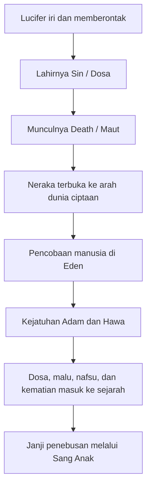
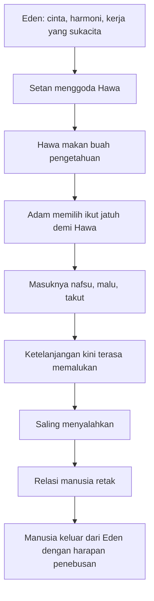

## 🌌 Pendahuluan: Ketika Kisah Eden Tidak Lagi Sekadar Tentang Buah Terlarang, tetapi Tentang Dosa, Kebebasan, Cinta, dan Kehancuran yang Sangat Manusiawi

Ada karya-karya yang begitu besar sehingga kita tidak cukup hanya “membacanya”. Kita harus memasukinya perlahan, menanggung bahasanya, dan membiarkan ia menyusun ulang cara kita melihat dunia. *Paradise Lost* karya **John Milton** adalah salah satunya. 🌌

Bagi banyak orang, karya ini hanya dikenal secara samar sebagai “puisi besar tentang Setan, surga, neraka, Adam, Hawa, dan Taman Eden.” Sebagian lain mengenalnya dari reputasinya yang agak kontroversial: bahwa inilah karya yang konon “memanusiakan Setan” dan membuat Lucifer tampak heroik, tragis, atau bahkan—bagi pembaca yang terlalu tergoda retorika—nyaris seperti tokoh protagonis.

Tetapi pembacaan seperti itu terlalu sempit, dan sering kali juga terlalu dangkal.

*Paradise Lost* bukan sekadar kisah “bagaimana Setan melihat Eden.” Ia adalah karya raksasa tentang:
- **kehendak bebas** (*free will* / kebebasan memilih),
- **dosa** sebagai pembelokan cinta ke arah diri sendiri,
- **kebanggaan** (*pride* / kesombongan) sebagai akar kehancuran,
- **cinta** yang murni dan cinta yang telah rusak,
- **otoritas dan pemberontakan**,
- **penderitaan**,
- serta **pengharapan** yang tidak mati bahkan setelah Firdaus hilang.

Yang membuat karya ini dahsyat adalah Milton tidak menulisnya sebagai ringkasan Alkitab yang lurus dan aman. Ia menulisnya sebagai **epik**—sejenis puisi agung yang secara bentuk sekelas dengan Homeros atau Dante—tetapi isinya secara sadar Kristen, dan secara berani membayangkan percakapan, motif, dan adegan-adegan yang tidak dijelaskan secara rinci dalam teks Alkitab. Karena itu, *Paradise Lost* lebih tepat dibaca sebagai:

> **fiksi religius-historis yang sangat serius**, bukan wahyu baru, tetapi juga bukan main-main sastra kosong.

Ia adalah karya imajinasi teologis.

Milton mengajukan pertanyaan-pertanyaan yang besar sekali:
- bagaimana rupa pemberontakan malaikat terhadap Allah jika dibayangkan sebagai drama epik?
- apa yang sebenarnya terjadi di dalam batin Lucifer?
- mengapa Hawa tergoda?
- mengapa Adam ikut jatuh?
- mengapa kasih yang begitu murni di Eden bisa rusak begitu cepat?
- dan bagaimana mungkin harapan penebusan sudah tersedia bahkan sebelum manusia sepenuhnya memahami kehancurannya?

Kalau harus diringkas dalam satu tesis, artikel ini akan berargumen bahwa:

> **Paradise Lost adalah puisi agung tentang bagaimana dosa bukan pertama-tama sekadar pelanggaran aturan, melainkan pembelokan kehendak dan cinta dari Allah menuju diri sendiri—dan bagaimana, bahkan setelah kehancuran itu terjadi, manusia masih membawa kemungkinan harapan, kasih, dan penebusan di dalam sejarah.**

Esai ini akan membedah *Paradise Lost* secara mendalam, tetapi tetap jernih. Kita akan melihat:
- konteks John Milton,
- struktur epiknya,
- karakterisasi Setan,
- konsep dosa, maut, dan kebebasan,
- keindahan Adam dan Hawa sebelum jatuh,
- tragedi kasih yang berubah menjadi saling menyalahkan,
- sampai harapan akhir ketika manusia keluar dari Eden dengan air mata, tetapi tidak tanpa arah.

Dan justru di situlah keagungan karya ini berada: bukan hanya dalam tragedi kejatuhan, tetapi dalam kenyataan bahwa setelah semuanya hancur, kisahnya tidak berakhir pada nihilisme. ✨

---

<Callout type="important" title="Tesis utama artikel ini">
*Paradise Lost* bukan sekadar kisah Setan yang memberontak atau Hawa yang memakan buah terlarang, melainkan epik tentang kehendak bebas, kebanggaan, dosa, cinta yang jatuh, dan harapan penebusan. Milton menunjukkan bahwa kejatuhan manusia adalah tragedi kosmik, tetapi bukan akhir dari makna.
</Callout>

---

## 📚 1. John Milton dan Mengapa Paradise Lost Begitu Penting dalam Sejarah Sastra Inggris

*Paradise Lost* diterbitkan pada tahun **1667** dan ditulis oleh **John Milton**, salah satu tokoh intelektual paling besar dalam tradisi Inggris. Ia bukan hanya penyair, tetapi juga pemikir politik dan figur Protestan yang sangat serius. 📚

Milton hidup pada masa yang penuh gejolak di Inggris:
- perang sipil,
- benturan antara monarki dan parlemen,
- ketegangan agama,
- perubahan besar dalam struktur kekuasaan.

Ia menulis *Paradise Lost* dalam situasi yang juga sarat tekanan politik. Jadi karya ini lahir bukan dari ruang hening yang steril, tetapi dari zaman yang penuh pertarungan tentang:
- legitimasi kekuasaan,
- ketaatan,
- kebebasan,
- dan makna pemberontakan.

Itu penting, karena walaupun *Paradise Lost* adalah puisi tentang kisah surgawi dan kejatuhan manusia pertama, ia jelas ditulis oleh seseorang yang sangat peka terhadap pertanyaan-pertanyaan politik dan moral dunia nyata.

Secara bentuk, karya ini mengikuti jejak **puisi epik** klasik—sejenis karya besar yang sebelumnya diasosiasikan dengan:
- *Iliad* dan *Odyssey* karya Homeros,
- *Aeneid* karya Virgil,
- dan *Divine Comedy* karya Dante.

Tetapi Milton melakukan dua hal yang sangat penting:

### A. Ia menulis epik besar dalam bahasa Inggris
Ini monumental. Karena selama berabad-abad, karya-karya besar semacam ini biasanya diasosiasikan dengan Yunani, Latin, atau Italia.

### B. Ia membuat epik Kristen yang sangat ambisius
Bukan sekadar epik yang “punya elemen religius”, tetapi epik yang menjadikan:
- penciptaan,
- pemberontakan Lucifer,
- Eden,
- kejatuhan manusia,
- dan rencana penebusan
sebagai inti narasinya.

Karena itu, *Paradise Lost* punya posisi istimewa. Ia bukan hanya klasik sastra. Ia adalah **peristiwa budaya**—momen ketika bahasa Inggris membuktikan bahwa ia sanggup menjadi medium untuk visi religius, puitik, dan filosofis sebesar apa pun.

---

## 🕊️ 2. Penting: Ini Bukan Alkitab, tetapi Fiksi Religius yang Sangat Serius

Sebelum membahas isi, ada satu hal yang sangat penting untuk ditegaskan: *Paradise Lost* bukan kitab suci. Ia bukan wahyu baru. Ia bukan pengganti Kejadian, Injil, atau kitab-kitab lain dalam Alkitab. 🕊️

Milton memang menulis dari keyakinan religius yang sungguh-sungguh. Tetapi ia tetap sedang melakukan **imajinasi sastra**. Ia mengambil:
- tokoh-tokoh biblis,
- kerangka teologis Kristen,
- peristiwa-peristiwa dasar dari penciptaan dan kejatuhan,

lalu mengembangkan semuanya menjadi drama epik yang penuh dialog, monolog, motif psikologis, dan gambaran kosmik yang sangat kaya.

Artinya, ketika Milton memberi karakter tertentu kepada:
- Setan,
- Beelzebub,
- Raphael,
- Michael,
- Adam,
- Hawa,
- bahkan Sin dan Death,
itu tidak otomatis berarti “begitulah persisnya” menurut teks Alkitab.

Yang dilakukan Milton adalah **teological imagination** *(imajinasi teologis / upaya membayangkan dunia iman secara puitik dan konseptual)*.

Dan justru karena itu, pembaca perlu punya dua sikap sekaligus:

1. **Keseriusan**, karena karya ini memang memikirkan hal-hal besar dengan sangat dalam.
2. **Kebijaksanaan**, karena karya ini tetap karya sastra, bukan otoritas doktrinal final.

Sikap seperti ini penting agar kita tidak jatuh pada dua kesalahan ekstrem:
- menganggap karya ini sekadar “fanfiction religius” tanpa bobot,
- atau justru menganggap setiap detailnya sebagai ajaran resmi iman.

Yang tepat adalah membaca *Paradise Lost* sebagai karya sastra teologis yang sangat besar—sebuah potret, bukan kitab; sebuah meditasi puitik, bukan dogma baru.

---

## 🔥 3. Pembukaan di Tengah Bencana: Jatuhnya Para Malaikat dan Neraka yang Baru Saja Terbentuk

Seperti banyak epik besar, *Paradise Lost* tidak memulai ceritanya dari awal mula secara kronologis. Ia langsung melempar kita ke tengah peristiwa besar: **setelah perang di surga**, ketika Setan dan para malaikat yang mengikutinya sudah kalah dan jatuh ke neraka. 🔥

Milton membayangkan mereka jatuh selama sembilan hari, lalu terbaring di lautan api dalam kesakitan selama sembilan hari lagi. Bayangkan betapa besar dan teatrikal skala pembukaannya:
- makhluk surgawi raksasa,
- baru pertama kali merasakan nyeri,
- berada di wilayah gelap yang hanya diterangi api,
- mengenakan sisa-sisa kemegahan perang yang baru kalah.

Ini penting karena sejak awal Milton ingin menegaskan dua hal:

### A. Skala ceritanya kosmik
Yang dipertaruhkan bukan sekadar nasib satu tokoh, tetapi arah seluruh ciptaan.

### B. Setan diperkenalkan dalam keadaan kalah, bukan menang
Ia bukan pahlawan pemberontak yang sedang naik daun. Ia adalah makhluk besar yang sudah jatuh, tetapi masih penuh kebanggaan.

Ini penting sekali, karena banyak pembacaan populer tentang *Paradise Lost* terlalu cepat terpikat oleh retorika Setan dan lupa bahwa sejak awal ia diperlihatkan sebagai sosok yang sudah:
- hancur,
- terluka,
- dan terlempar ke ruang kehinaan.

Ia mungkin masih fasih dan karismatik. Tetapi konteks pembukaannya jelas: **ia bukan sedang menuju kemuliaan, melainkan sudah berada dalam konsekuensi dari pemberontakannya.**

---

## 👑 4. “Better to Reign in Hell than Serve in Heaven”: Kalimat Besar yang Mengandung Kebohongan Besar

Salah satu kutipan paling terkenal dari *Paradise Lost* adalah:

> **“Better to reign in Hell, than serve in Heaven.”**
> *(Lebih baik memerintah di neraka daripada melayani di surga.)* 👑

Kalimat ini sering dikutip seolah-olah ia adalah slogan kebebasan yang gagah. Seolah Setan adalah figur antiotoritarian yang berani menolak tirani. Tetapi pembacaan yang teliti memperlihatkan bahwa kalimat ini sebenarnya penuh tipu daya.

Mengapa?

Karena ketika Setan mengucapkannya, ia sedang berusaha melakukan dua hal sekaligus:

### A. Menghibur dirinya sendiri
Ia baru kalah telak. Ia perlu narasi yang membuat kekalahannya terasa seperti pilihan bermartabat.

### B. Memanipulasi para pengikutnya
Ia perlu membingkai neraka bukan sebagai hukuman, tetapi sebagai “kerajaan alternatif”.

Padahal secara faktual, mereka tidak sedang merdeka. Mereka baru saja dibuang, terperangkap, dan kehilangan surga. Kalimat itu adalah upaya Setan untuk menyulap penderitaan menjadi ideologi heroik.

Di sinilah Milton jenius.

Ia memberi Setan retorika yang kuat sekali—bahkan memikat. Tetapi kalau pembaca cukup jeli, terlihat bahwa keindahan retorika itu justru bagian dari dosanya. Setan berkali-kali memakai bahasa besar untuk menutup:
- iri hati,
- luka narsistik,
- dan penolakan untuk tunduk pada kebaikan yang lebih tinggi dari dirinya.

Jadi kalimat ini bukan puncak kebebasan sejati. Ia adalah puncak **self-deception** *(penipuan diri sendiri)*.

---

## 🪰 5. Beelzebub, Moloch, Mammon, dan Para Pemimpin Neraka: Bentuk-Bentuk Berbeda dari Kejahatan yang Sama

Setelah bangkit di neraka, Setan memanggil para pemimpin pasukan jatuhnya. Di sini Milton memperkenalkan banyak nama yang kelak dikenal dalam tradisi demonologis dan biblis: **Beelzebub**, **Moloch**, **Belial**, **Mammon**, dan lain-lain. 🪰

Yang menarik, masing-masing tokoh tidak hanya hadir sebagai nama seram, tetapi sebagai representasi sikap atau mode kejahatan tertentu.

### Beelzebub
Tokoh kedua setelah Setan, cenderung politis, strategis, dan fungsional. Ia bukan sekadar brutal, tetapi licik dan mampu mengartikulasikan rencana jangka panjang.

### Moloch
Melambangkan dorongan perang mentah. Ia ingin menyerang lagi sekarang juga, tanpa perhitungan. Ia mewakili kekerasan sebagai dorongan buta.

### Mammon
Figur keserakahan. Ia bahkan di surga konon lebih tertarik melihat emas di jalanan daripada menengadah ke Allah. Di neraka, ia mengusulkan agar mereka membangun kerajaan sendiri dari kekayaan yang mereka gali.

### Belial
Mewakili kelembekan, kefasihan yang malas, dan kecenderungan menunda tindakan sambil tetap membusukkan jiwa.

Dengan cara ini, Milton tidak membuat kejahatan tampak sederhana. Neraka bukan hanya berisi satu jenis keburukan. Ia berisi banyak bentuk:
- agresi,
- kerakusan,
- retorika licin,
- oportunisme,
- pemberontakan narsistik,
- dan kebanggaan yang dibungkus argumen.

Ini penting karena menunjukkan bahwa dosa tidak selalu datang dengan satu wajah. Kadang ia berteriak seperti Moloch. Kadang ia berkalkulasi seperti Beelzebub. Kadang ia tampak praktis seperti Mammon. Tetapi semuanya berakar pada satu pusat yang sama: penolakan terhadap tatanan ilahi demi pemujaan diri.

---

## 🏛️ 6. Pandemonium: Istana Besar dari Kekalahan yang Berusaha Tampak Mulia

Salah satu momen paling ikonik dalam bagian awal *Paradise Lost* adalah pembangunan istana neraka bernama **Pandemonium**. 🏛️

Kata ini luar biasa terkenal sampai hari ini, tetapi menariknya, banyak orang tidak sadar bahwa kata *pandemonium* dalam pengertian modern—kekacauan total, hiruk-pikuk, kekisruhan—berasal dari Milton. Secara harfiah, ia berarti semacam “tempat semua demon” atau “alam semua iblis”.

Di neraka, para malaikat jatuh membangun istana megah dari emas dan logam berharga. Dari sisi visual, ini menakjubkan sekali. Tetapi justru di situlah ironi besarnya.

Mengapa?

Karena Pandemonium adalah versi neraka dari kemegahan surgawi.

Ia memperlihatkan satu pola penting dalam diri Setan:

> **ia tidak sungguh-sungguh mencipta dari cinta atau kebenaran; ia meniru, mendistorsi, dan mengagungkan versi palsu dari kemuliaan yang telah hilang.**

Neraka di bawah kepemimpinan Setan tidak lahir sebagai dunia orisinal yang sungguh bebas. Ia adalah parodi dari surga:
- ada istana,
- ada tahta,
- ada sidang besar,
- ada simbol kuasa,
- tetapi semuanya kehilangan orientasi kepada yang baik.

Pandemonium dengan demikian adalah simbol yang sangat kuat: **arsitektur kemegahan yang dibangun di atas kebusukan motivasi**.

Bukankah ini terasa sangat modern juga? Banyak struktur besar dalam sejarah manusia tampak megah, teratur, bahkan indah, tetapi jika motivasi intinya busuk, kemegahan itu hanyalah teater bagi kehancuran.

---

## 🐍 7. Sin dan Death: Ketika Dosa dan Maut Bukan Sekadar Konsep, tetapi Menjadi Figur yang Dilahirkan

Salah satu bagian paling liar, paling aneh, dan sekaligus paling teologis dalam *Paradise Lost* adalah kemunculan dua figur di gerbang neraka: **Sin** *(Dosa)* dan **Death** *(Maut)*. 🐍

Milton membayangkan dosa dan maut bukan hanya sebagai gagasan abstrak, tetapi sebagai makhluk-persona.

### Sin
Digambarkan dengan tubuh bagian atas menyerupai perempuan cantik, tetapi bagian bawahnya mengerikan, reptilian, dan dikelilingi makhluk-makhluk menjijikkan. Simbolismenya sangat jelas:
- dosa sering tampak menarik di permukaan,
- tetapi bentuk penuhnya adalah deformasi dan kengerian.

### Death
Digambarkan sebagai sosok bayangan raksasa, kosong, gelap, nyaris seperti bentuk kehampaan yang menakutkan itu sendiri.

Yang lebih penting lagi adalah asal-usul mereka dalam puisi ini:
- Sin lahir dari pikiran pemberontakan Setan terhadap Allah,
- lalu Death lahir dari hubungan Sin dengan akibat keberdosaan itu sendiri.

Ini tidak harus dibaca sebagai “teori literal” tentang bagaimana dosa dan maut terjadi secara biologis. Ini adalah **gambaran puitik** yang sangat padat:

> **dosa lahir ketika kehendak membelok dari Allah, dan maut mengikuti dosa sebagai konsekuensi yang tak terpisahkan.**

Milton bahkan membangun semacam trinitas palsu di sini:
- Setan,
- Sin,
- Death.

Ini adalah tiruan iblis atas relasi ilahi. Lagi-lagi Setan tidak benar-benar bisa mencipta kehidupan yang murni. Ia hanya melahirkan distorsi.

---

---

## 🌍 8. Rencana Besar Neraka: Jika Tidak Bisa Mengalahkan Allah, Rusaklah Ciptaan-Nya

Setelah sidang di Pandemonium, para penghuni neraka sadar bahwa menyerang surga secara frontal lagi bukan ide yang cerdas. Mereka sudah kalah. Mereka tahu kekuatan Allah jauh melampaui mereka. Maka strategi berubah. 🌍

Di sinilah rencana utama kisah dimulai:

kalau mereka tidak bisa menghancurkan Allah secara langsung, mereka akan menghancurkan **ciptaan baru** yang dikasihi-Nya: manusia.

Ini sangat penting secara teologis dan psikologis.

Setan tidak mencintai manusia. Ia juga tidak benar-benar peduli pada kebebasan manusia. Yang ia pedulikan adalah ini:
- kalau aku tidak bisa memiliki kemuliaan,
- maka ciptaan lain juga tidak boleh menikmati damainya.

Inilah logika klasik iri hati. Ia tidak puas hanya dengan kehilangan. Ia ingin yang lain juga kehilangan.

Karena itu, proyek Setan terhadap Adam dan Hawa bukan proyek emansipasi. Ia bukan sedang “membebaskan” manusia dari tirani ilahi. Ia sedang menginfeksikan manusia dengan kehancuran yang sama yang ada di dalam dirinya.

Milton sangat konsisten di sini. Dari awal sampai akhir, Setan tidak pernah sungguh peduli pada kebaikan pihak lain. Semua retorika heroiknya akhirnya bermuara pada satu prinsip:

> **jika aku tidak bisa bahagia, maka kebahagiaan harus dirusak.**

---

## ☀️ 9. Adegan di Surga: Mengapa Allah Membiarkan Kejatuhan Terjadi?

Salah satu pertanyaan terbesar dalam kisah kejatuhan adalah: kalau Allah tahu Setan akan datang dan manusia akan jatuh, mengapa Ia membiarkannya? ☀️

Milton menangani pertanyaan ini secara langsung lewat adegan Allah dan Sang Anak di surga.

Dalam pembacaan Milton, Allah melihat semua yang akan terjadi:
- Setan mendekat,
- manusia akan tergoda,
- manusia akan jatuh,
- dosa akan masuk,
- maut akan bekerja.

Tetapi Allah menegaskan bahwa manusia diciptakan untuk **mengasihi secara bebas**. Dan cinta yang bebas mensyaratkan pilihan. Kalau manusia hanya bisa taat karena tidak punya alternatif, maka itu bukan cinta yang sejati.

Ini poin sentral sekali dalam *Paradise Lost*:

> **tanpa kebebasan memilih, ketaatan tidak punya nilai moral yang sejati.**

Jadi Allah tidak “memaksa” kejatuhan, tetapi juga tidak menghapus kemungkinan kejatuhan itu, karena menghapus kemungkinan itu berarti merusak syarat dari cinta dan ketaatan yang sungguh-sungguh.

Tentu, secara filsafat, ini tetap pertanyaan yang berat dan tidak semua orang akan puas. Tetapi dalam logika Milton, jawabannya jelas:
- manusia benar-benar bebas,
- karena itu manusia benar-benar bertanggung jawab,
- dan justru karena itu kasih, kesetiaan, dan penebusan dapat punya makna.

Yang lebih indah lagi, Milton menunjukkan bahwa bahkan sebelum manusia jatuh, jalan penebusan sudah ada dalam rencana ilahi. Ini berarti kisah kejatuhan bukan kejutan bagi surga. Bukan berarti kejahatan itu baik, tetapi bahwa rahmat tidak datang terlambat.

---

## ✝️ 10. Paralel Besar antara Setan dan Sang Anak: Dua “Pengorbanan”, Dua Arah yang Berlawanan

Salah satu struktur terdalam dalam *Paradise Lost* adalah paralel antara **Setan** dan **Sang Anak** (*the Son* / Kristus). ✝️

Keduanya sama-sama “maju ke depan” untuk melakukan sesuatu yang menentukan.
Keduanya sama-sama berbicara di hadapan kumpulan makhluk lain.
Keduanya sama-sama terlibat dalam tindakan yang akan mengubah sejarah ciptaan.

Tetapi motif mereka berlawanan total.

### Setan
- bergerak demi kebanggaan,
- demi pelampiasan iri hati,
- demi menghancurkan ciptaan lain,
- demi membuktikan dirinya.

### Sang Anak
- maju demi kasih,
- demi memikul hukuman bagi manusia,
- demi mengangkat ciptaan yang jatuh,
- demi memulihkan relasi dengan Allah.

Di sinilah Milton sangat tajam. Ia tidak cukup hanya membuat Setan jahat dan Kristus baik. Ia membuat keduanya tampak dalam pola yang *mirip secara bentuk* tetapi *berlawanan secara inti*.

Dengan begitu, pembaca dipaksa menyadari bahwa tidak semua pengorbanan, keberanian, atau tindakan besar otomatis mulia. Yang menentukan adalah:
- arah kehendaknya,
- objek cintanya,
- dan hasil moralnya.

Setan turun ke bumi untuk membawa manusia turun bersamanya.
Sang Anak turun ke bumi untuk mengangkat manusia yang jatuh.

Itu dua gerak yang terlihat sama-sama besar, tetapi secara spiritual berlawanan sepenuhnya.

---

## 🌿 11. Eden sebelum Jatuh: Harmoni yang Sulit Dibayangkan Manusia Modern

Salah satu kekuatan paling indah dari *Paradise Lost* adalah gambaran Eden sebelum kejatuhan. 🌿

Milton tidak menggambarkannya sekadar sebagai taman cantik. Ia menggambarkannya sebagai tatanan eksistensial yang selaras:
- alam damai,
- hewan tidak saling menerkam,
- kerja bukan kutuk tetapi sukacita,
- tubuh bukan sumber malu,
- dan cinta tidak tercemar oleh nafsu egoistis.

Adam dan Hawa hidup telanjang tanpa rasa malu bukan karena mereka “primitif”, tetapi karena belum ada dosa yang membuat tubuh menjadi objek konflik, dominasi, atau rasa bersalah.

Ini penting sekali, sebab Milton ingin menunjukkan bahwa kerusakan manusia bukan hanya soal hukum moral dilanggar. Kerusakan itu juga berarti **rusaknya cara manusia mengalami diri, tubuh, relasi, kerja, dan alam semesta**.

Di Eden:
- kerja adalah partisipasi dalam keteraturan ciptaan,
- hubungan pria dan wanita adalah kesalingan yang indah,
- alam bukan ancaman,
- dan kesadaran tidak dipenuhi kecemasan.

Semua ini sangat kontras dengan dunia pasca-jatuh yang kita kenal:
- kerja melelahkan,
- cinta mudah rusak oleh ego,
- tubuh mudah menjadi sumber malu atau kuasa,
- dan alam bisa menjadi tempat bencana.

Karena itu, keindahan Eden dalam *Paradise Lost* penting bukan hanya untuk dekorasi. Ia penting agar pembaca sungguh merasakan **apa yang hilang** ketika manusia jatuh.

---

## 👩 12. Hawa dalam Paradise Lost: Keindahan, Kemuliaan, dan Kerentanan

Salah satu aspek yang sangat menonjol dalam *Paradise Lost* adalah cara Milton menggambarkan **Hawa**. Ia digambarkan sangat indah, sangat mulia, dan sangat penting dalam struktur ciptaan. 👩

Adam melihat Hawa bukan sekadar pasangan praktis, tetapi sebagai puncak keindahan dunia. Bahkan para malaikat juga memperlakukannya dengan hormat sebagai ibu dari umat manusia.

Ini menarik, karena pembacaan populer kadang terlalu cepat menjadikan Hawa sekadar “perempuan yang salah makan buah”. Padahal dalam puisi Milton, Hawa adalah figur yang sangat besar secara simbolik:
- ia keindahan yang hidup,
- ia pusat relasional dari kemanusiaan,
- ia “holy mother” dalam arti asal-usul semua keturunan manusia.

Tetapi justru karena itu, kejatuhannya terasa sangat tragis.

Ia bukan jatuh karena jahat dalam pengertian kasar. Ia jatuh karena:
- tergoda oleh janji pengetahuan,
- tergelitik oleh kemungkinan menjadi lebih,
- dan tidak punya pengalaman terhadap tipu daya.

Milton di sini membuat tragedi Hawa bukan terutama tragedi kebodohan, tetapi tragedi **ketidakbersenjataan moral terhadap tipu daya pertama**. Ia belum punya konsep dusta, manipulasi, atau tipu retorika. Maka pencobaan Setan bekerja justru lewat wilayah yang tampak masuk akal baginya.

Ini membuat kejatuhannya menyedihkan, bukan sekadar menjengkelkan.

---

## 🌺 13. Adam dan Hawa: Cinta yang Murni Sebelum Menjadi Nafsu, Takut, dan Saling Menyalahkan

Bagian paling menyayat dalam *Paradise Lost* bukan hanya soal larangan Allah atau tipu daya Setan, tetapi transformasi hubungan Adam dan Hawa. 🌺

Sebelum jatuh, hubungan mereka penuh:
- kekaguman,
- kelembutan,
- kesalingan,
- dan ketertarikan yang belum tercemar dominasi.

Adam bukan hanya tertarik pada Hawa. Ia memuliakannya. Ia melihat dalam dirinya kemegahan ciptaan Allah. Hawa juga memandang Adam dengan rasa aman dan kasih yang utuh.

Lalu semua itu mulai pecah.

Ini terlihat sangat kuat dalam adegan ketika Hawa datang kepada Adam setelah memakan buah. Adam sedang membuat semacam rangkaian bunga atau mahkota untuknya. Lalu ia melihat buah itu di tangan Hawa dan sadar apa yang telah terjadi.

Adegan ini salah satu yang paling tragis dalam keseluruhan puisi.

Milton menggambarkan Adam:
- membeku,
- darahnya dingin,
- bunga yang dibuatnya jatuh dari tangan,
- dan mawar-mawar itu layu.

Simbolismenya sangat kuat. Tindakan kasih terakhir yang murni itu jatuh ke tanah pada saat maut mulai masuk ke dunia.

Lalu Adam mengambil keputusan yang sangat besar: ia memakan buah itu juga. Bukan karena ingin menjadi seperti Allah, melainkan karena ia tidak mau hidup tanpa Hawa.

Dan inilah tragedi terdalamnya:

> **Adam jatuh bukan terutama karena iri seperti Setan, tetapi karena cinta yang menjadi salah arah.**

Ia memilih Hawa di atas ketaatan kepada Allah. Dalam cerita lain, itu bisa tampak heroik. Di sini, justru karena cinta itu begitu besar, kejatuhannya makin menyayat. Ia mengorbankan diri demi bersatu dengan yang dicintainya—tetapi hasilnya bukan penyelamatan cinta, melainkan kerusakan cinta itu sendiri.

---

## 🍎 14. Buah Pengetahuan: Mengapa Dosa di Sini Bukan Sekadar “Makan Buah”

Salah satu kesalahan paling umum ketika membaca kisah Eden adalah mereduksinya menjadi: “mereka cuma makan buah, kok hukumannya besar sekali?” 🍎

Milton membantu kita melihat bahwa persoalannya jauh lebih dalam.

Buah itu bukan benda ajaib netral. Ia melambangkan pilihan kehendak. Memakannya berarti:
- tidak mempercayai Allah,
- menerima definisi baik-buruk dari sumber lain,
- dan mengambil otonomi moral secara lepas dari relasi yang benar dengan Sang Pencipta.

Dalam puisi ini, Setan tidak terutama berkata, “ini enak.” Ia berkata:
- ini akan membuatmu lebih tahu,
- ini akan membuatmu seperti Allah,
- mungkin Allah hanya takut kamu menjadi setara,
- mungkin larangan itu sendiri adalah ujian untuk dilampaui.

Jadi dosa di sini bukan soal selera makan. Ia soal:
- kecurigaan terhadap kebaikan Allah,
- godaan untuk menguasai definisi realitas,
- dan hasrat untuk menjadi pusat bagi diri sendiri.

Milton sangat peka pada fakta bahwa dosa sering datang bukan dalam bentuk kasar, tetapi dalam bentuk pemikiran yang tampak rasional dan menarik. Di situlah bahayanya. Dosa besar sering tidak dimulai dari “aku mau jahat”, tetapi dari “bagaimana kalau sebenarnya aku berhak atas lebih?”

---

## 🧪 15. Mengapa Pohon Pengetahuan Ada di Sana? Kebebasan Tanpa Alternatif Bukan Kebebasan

Pertanyaan ini sangat penting dan sangat sering diajukan: kalau Allah tidak ingin manusia jatuh, mengapa pohon pengetahuan diletakkan di taman? 🧪

Milton sangat jelas: karena **kebebasan memilih** harus nyata, bukan pura-pura.

Kalau Adam dan Hawa tidak pernah punya kemungkinan untuk menolak, maka ketaatan mereka tidak lebih dari mekanisme otomatis. Tetapi cinta dan ketaatan yang dikehendaki Allah bukanlah kepatuhan robotik. Ia harus keluar dari kehendak yang benar-benar bisa memilih.

Dengan kata lain:

> **pohon itu bukan jebakan sadis, tetapi kondisi bagi kebebasan moral yang sejati.**

Tentu, ini tidak membuat tragedinya ringan. Justru sebaliknya. Karena kini kejatuhan manusia tampak sebagai sesuatu yang sungguh-sungguh mereka lakukan, bukan sesuatu yang “terpaksa” terjadi kepada mereka.

Ini salah satu kekuatan moral *Paradise Lost*: ia menolak baik fatalisme maupun mekanisme. Manusia bukan korban mesin kosmik buta. Manusia adalah makhluk bebas—dan karena itu, mulia sekaligus rentan.

---

## 😔 16. Setelah Jatuh: Nafsu, Malu, Takut, dan Rusaknya Kasih

Begitu Adam dan Hawa memakan buah, perubahan pertama yang Milton tonjolkan bukanlah petir dari langit atau kutukan langsung. Perubahan itu terjadi **di dalam diri mereka**. 😔

Milton menggambarkan bahwa salah satu efek pertama adalah **nafsu** (*lust* / dorongan seksual yang sudah tidak lagi murni dalam cinta, tetapi bercampur ego dan hasrat memiliki). Ini penting. Karena sebelumnya keintiman mereka indah dan selaras. Setelah jatuh, bahkan tindakan yang tampaknya sama sudah berubah sifatnya.

Lalu datang:
- malu,
- takut,
- kecemasan,
- kesadaran akan ketelanjangan,
- dan dorongan untuk bersembunyi.

Mereka lalu menutupi tubuh dengan daun ara. Sekali lagi, ini bukan sekadar soal busana. Ini simbol bahwa kesadaran manusia kini terpecah. Tubuh yang sebelumnya bagian dari harmoni kini menjadi tempat rasa tidak aman.

Setelah itu, hubungan mereka juga rusak. Adam mulai menyalahkan Hawa. Hawa membalas. Untuk pertama kalinya dalam sejarah manusia, cinta yang seharusnya menjadi persekutuan berubah menjadi arena tuduhan.

Di sinilah tragedi Adam makin pahit. Ia makan buah demi tidak kehilangan Hawa. Tetapi sesudah jatuh, justru relasi dengan Hawa langsung dirusak oleh dosa itu sendiri.

Jadi ia benar-benar mengorbankan dirinya demi mempertahankan sesuatu yang seketika hilang dalam bentuk lamanya.

Itulah mengapa kejatuhan dalam *Paradise Lost* bukan hanya tragedi moral. Ia juga tragedi relasional.

---

---

## 🧠 17. Setan yang “Manusiawi”: Mengapa Banyak Orang Salah Paham terhadap Paradise Lost

Banyak orang modern membaca *Paradise Lost* lalu berkata: “wah, Setan di sini sangat simpatik,” atau bahkan, “apakah sebenarnya Milton diam-diam membuat Setan tampak benar?” 🧠

Pertanyaan ini muncul karena Milton memang memberi Setan:
- bahasa yang hebat,
- monolog batin yang rumit,
- kesadaran diri,
- dan bahkan momen-momen nyaris tragis.

Setan memang tidak digambarkan seperti monster kartun satu dimensi. Ia punya retorika, luka, kebanggaan, dan kehancuran batin.

Tetapi di sinilah banyak pembaca keliru. Mereka mengira bahwa karena Setan dibuat kompleks, maka ia otomatis dibuat benar.

Padahal tidak.

Milton justru sedang menunjukkan bahwa kejahatan paling berbahaya bukan kejahatan bodoh, tetapi kejahatan yang:
- pandai bicara,
- pandai membenarkan diri,
- pandai memakai bahasa kebebasan,
- dan pandai menutupi iri hati dengan jargon mulia.

Setan tampak meyakinkan bukan karena ia benar, tetapi karena **dosa memang suka terdengar meyakinkan**.

Ia terus mengubah bahasa sesuai kebutuhan:
- kadang bicara kebebasan,
- kadang bicara kehormatan,
- kadang bicara keadilan,
- kadang bicara dendam,
- kadang bicara “kalau aku tak bisa bahagia, yang lain juga jangan.”

Yang konsisten hanyalah inti jiwanya:
- iri,
- sombong,
- dan menolak tunduk.

Karena itu, kalau ada pembaca yang selesai membaca *Paradise Lost* lalu sungguh merasa Setan adalah tokoh baik, ada kemungkinan yang gagal dibaca bukan niat Milton, tetapi strategi Setan di dalam teks. Dan itu ironis sekali. 😅

---

## 🛐 18. Adam, Hawa, dan Harapan yang Masih Tersisa Setelah Kejatuhan

Sesudah dosa, *Paradise Lost* tidak berhenti pada putus asa total. Dan di sinilah karya ini menjadi jauh lebih besar daripada sekadar kisah tentang hukuman. 🛐

Adam dan Hawa memang jatuh. Mereka memang:
- bersalah,
- takut,
- malu,
- saling melukai.

Tetapi mereka juga masih punya kemampuan untuk:
- menyesal,
- memohon ampun,
- dan tetap saling kembali.

Ada satu momen sangat penting ketika Hawa memohon pengampunan Adam dan berkata, pada intinya, jangan tinggalkan aku. Adam lalu mulai menyadari bahwa kalau mereka menyerah pada keputusasaan, maka mereka hanya akan mengikuti jejak Setan.

Ini indah sekali.

Setan jatuh dan mengubah luka menjadi kebencian permanen.
Adam dan Hawa jatuh, tetapi masih punya kemungkinan untuk berubah melalui penyesalan dan kasih.

Di sini Milton mengajukan perbedaan mendasar antara dosa iblis dan dosa manusia:

> **manusia jatuh, tetapi masih bisa menoleh kembali pada rahmat.**

Karena itu, sesudah kejatuhan, yang muncul bukan nihilisme, melainkan sejarah. Sejarah memang akan penuh:
- sakit melahirkan,
- kerja keras,
- konflik,
- maut,
- perang,
- pengkhianatan,
- dan air mata.

Tetapi sejarah juga akan menjadi tempat hadirnya:
- janji,
- nabi,
- pengharapan,
- dan akhirnya Sang Penebus.

---

## 🏔️ 19. Michael dan Penglihatan Sejarah: Dari Kain dan Habel sampai Sang Mesias

Dalam versi Milton, sebelum Adam dan Hawa benar-benar meninggalkan Eden, malaikat **Michael** membawa Adam ke tempat tinggi dan menunjukkan kepadanya rangkaian sejarah manusia yang akan datang. 🏔️

Ini bukan bagian yang secara literal ada dalam narasi Kejadian, tetapi secara sastra sangat kuat. Karena apa yang sedang dilakukan Michael adalah memberikan kepada Adam satu hal yang sangat dibutuhkan manusia jatuh: **perspektif**.

Adam diperlihatkan:
- Kain dan Habel,
- pembunuhan pertama,
- sakit dan kematian,
- kekerasan sosial,
- air bah dan Nuh,
- Babel,
- Abraham,
- Musa,
- sampai garis penebusan yang akhirnya mengarah pada Kristus.

Dengan ini, kejatuhan Adam tidak lagi hanya soal “aku gagal hari ini.” Ia mulai melihat bahwa:
- dosanya akan punya konsekuensi sejarah yang dahsyat,
- tetapi rahmat Allah juga akan bekerja secara historis,
- dan akhir dari kisah manusia bukan semata kebinasaan, melainkan pemulihan.

Ini penting sekali. Karena harapan dalam *Paradise Lost* bukan harapan sentimental. Ia bukan “tenang, semuanya akan baik-baik saja” dalam arti murahan. Harapan di sini adalah:
- mengetahui bahwa penderitaan nyata akan datang,
- tetapi juga mengetahui bahwa Allah tidak meninggalkan sejarah kepada dosa semata.

Itu harapan yang mahal. Dan justru karena mahal, ia kuat.

---

## 🌠 20. “The Mind Is Its Own Place” vs “Paradise Within”: Kontras Besar antara Setan dan Adam

Ada kontras yang sangat indah antara Setan dan Adam dalam karya ini. 🌠

Setan pernah berkata bahwa pikiran adalah tempatnya sendiri, yang bisa membuat surga dari neraka dan neraka dari surga. Kalimat ini tampak kuat, tetapi sebenarnya penuh ilusi. Sebab pada kenyataannya, ke mana pun Setan pergi, ia membawa neraka di dalam dirinya:
- iri hati,
- pahit,
- penolakan,
- dan kebencian.

Ia bahkan berdiri di Eden dan tetap merasa sengsara. Mengapa? Karena masalah utamanya bukan lingkungan luar, tetapi kondisi batinnya sendiri.

Sebaliknya, di bagian akhir, Adam sampai pada kesadaran yang hampir berlawanan. Setelah mendengar penglihatan Michael, ia menemukan bahwa harapan, iman, dan ketaatan dapat membuat manusia membawa **“paradise within”** *(firdaus di dalam / benih harapan ilahi dalam batin)*.

Ini sangat indah.

Setan membawa neraka ke mana-mana.
Adam dipanggil untuk membawa harapan ke mana-mana.

Di sinilah *Paradise Lost* menjadi bukan hanya puisi tentang masa lampau, tetapi juga refleksi eksistensial:
- orang bisa hidup di tempat indah tetapi membawa neraka dalam dirinya,
- dan orang bisa meninggalkan taman, berjalan ke dunia keras, tetapi tetap membawa kemungkinan firdaus di hati.

Itu salah satu kontras terdalam dan paling bijak dalam seluruh puisi.

---

## 👣 21. Akhir yang Sempurna: Mereka Keluar dari Eden dengan Air Mata, tetapi Tidak dengan Putus Asa

Baris-baris penutup *Paradise Lost* termasuk salah satu akhir paling indah dalam sastra Inggris. 👣

Adam dan Hawa melihat kembali ke Eden, ke tempat bahagia yang baru saja hilang dari mereka. Gerbangnya kini dijaga. Api berkobar. Mereka memang harus pergi.

Mereka meneteskan air mata.

Tetapi Milton menulis bahwa mereka segera mengusap air mata itu. Dunia kini terbentang di depan mereka. Belum ada rumah tetap. Belum ada keamanan. Belum ada kenyamanan lama. Tetapi ada sesuatu yang lain:

- **Providence** *(penyelenggaraan ilahi / tuntunan Tuhan)* sebagai penuntun,
- dan satu sama lain sebagai teman seperjalanan.

Mereka berjalan **bergandengan tangan** keluar dari Eden menuju sejarah.

Saya kira itu salah satu penutupan paling indah karena ia tidak murahan. Milton tidak berpura-pura seolah semuanya baik-baik saja. Tidak. Eden sungguh hilang. Dosa sungguh masuk. Penderitaan sungguh nyata.

Tetapi kisah manusia tidak berakhir di gerbang tertutup itu.

Ia justru dimulai dari sana.

Dan dengan itu, Milton memberi kita gambaran yang sangat dalam:

> **bahkan setelah kehilangan keadaan sempurna, manusia tidak kehilangan kemungkinan untuk berjalan di bawah tuntunan rahmat.**

---

## 🔍 22. Apakah Paradise Lost Membela Setan? Tidak. Ia Membuka Topengnya.

Sekarang kita bisa jawab lebih tegas: apakah *Paradise Lost* sebenarnya membuat Setan jadi tokoh baik? 🔍

Menurut saya, tidak.

Yang dilakukan Milton bukan membela Setan, tetapi **membuka topeng** bagaimana dosa bekerja dari dalam.

Ia menunjukkan bahwa Setan:
- bisa terdengar rasional,
- bisa tampak heroik,
- bisa punya momen refleksi,
- bahkan bisa hampir tampak tragis,

namun tetap saja inti dirinya adalah penolakan pada kebaikan tertinggi demi pemujaan diri.

Dengan kata lain, Milton tidak bilang “lihat, Setan ternyata benar.”
Ia bilang:

> **lihatlah betapa mudah manusia terpikat oleh retorika yang salah kalau retorika itu memijit iri hati, harga diri, dan keinginan untuk menjadi pusat.**

Dan justru karena itu, pembaca modern yang merasa “wah, argumen Setan masuk akal ya” seharusnya tidak buru-buru merasa cerdas. Mungkin yang sedang terjadi adalah mereka sedang mengalami sedikit dari jenis godaan yang ingin Milton perlihatkan. 😄

---

## ✨ Kesimpulan: Paradise Lost adalah Kisah Kehancuran, tetapi Juga Kisah Harapan yang Menolak Mati

*Paradise Lost* adalah karya yang besar bukan hanya karena skala kosmiknya, tetapi karena ia sangat memahami hati manusia. ✨

Ia memperlihatkan bahwa:
- dosa berakar pada kebanggaan,
- iri hati bisa menyamar sebagai idealisme,
- cinta bisa jatuh menjadi penyembahan yang salah arah,
- kebebasan adalah anugerah sekaligus risiko,
- dan kejatuhan manusia bukan sekadar kegagalan moral kecil, melainkan retaknya seluruh tatanan pengalaman.

Tetapi ia juga memperlihatkan bahwa:
- penyesalan itu mungkin,
- rahmat tidak datang terlambat,
- sejarah belum ditinggalkan Allah,
- dan harapan dapat lahir justru setelah kehancuran.

Setan dalam puisi ini penting bukan karena ia benar, tetapi karena ia memperlihatkan bentuk dosa yang sangat canggih: dosa yang mampu berbicara indah, memikat, dan tampak logis. Adam dan Hawa penting bukan karena mereka sempurna, tetapi karena melalui mereka kita melihat sesuatu yang sangat manusiawi: bahwa bahkan setelah jatuh, masih ada kemungkinan untuk menoleh kembali kepada kasih.

Kalau harus ditutup dengan satu inti besar, maka inti itu adalah ini:

> **Paradise Lost mengajarkan bahwa Firdaus hilang ketika manusia memilih diri di atas Allah, tetapi harapan tidak hilang selama manusia masih mampu menyesal, mengasihi, dan berjalan di bawah penyelenggaraan ilahi menuju pemulihan yang belum selesai.**

Itulah mengapa karya ini tetap hidup.

Bukan karena ia membuat Setan keren.
Bukan karena ia sekadar “kisah Eden dari sudut pandang iblis.”
Tetapi karena ia berani memandang lurus tragedi dosa, tanpa melepaskan pengharapan bahwa sejarah manusia masih punya arah menuju penebusan. 🌿

---

<Callout type="quote" title="Kalimat inti artikel ini">
*Paradise Lost* adalah puisi besar tentang bagaimana dosa lahir dari kebanggaan dan pembelokan cinta, tetapi juga tentang bagaimana manusia yang telah jatuh tetap dapat keluar dari Firdaus dengan harapan, kasih, dan janji pemulihan yang berjalan bersama mereka.
</Callout>

<Callout type="tip" title="Cara terbaik membaca Paradise Lost">
Baca karya ini bukan sebagai “wahyu baru”, melainkan sebagai epik teologis yang memakai imajinasi sastra untuk menggambarkan kebebasan, dosa, kasih, dan penebusan. Dengan begitu, kita bisa menikmati keindahan serta kebijaksanaannya tanpa mencampuradukkan Milton dengan otoritas Kitab Suci itu sendiri.
</Callout>

<Callout type="cite" title="Sumber dan basis pembahasan">
Artikel ini dikembangkan dari transcript video *The Devil's Story of Eden - Paradise Lost Explained* dan diperluas menjadi esai sastra-teologis tentang John Milton, pemberontakan Lucifer, Sin dan Death, Adam dan Hawa, makna kejatuhan, serta harapan penebusan dalam *Paradise Lost*.
</Callout>
